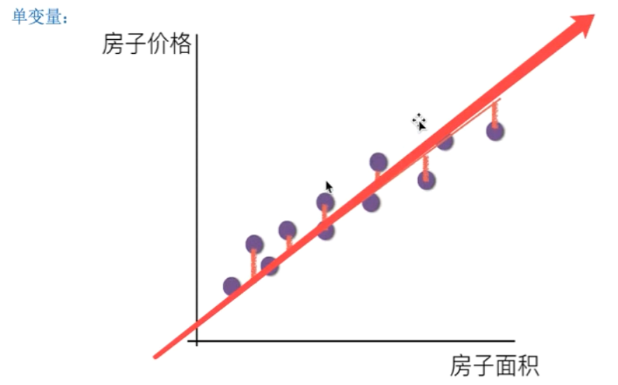
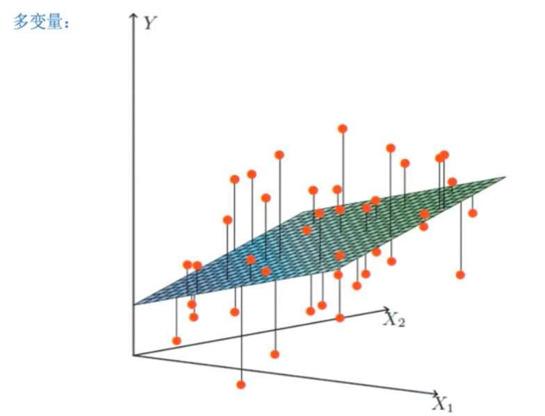

## 线性回归

### 关系模型

* 一个通过属性的线性组合来预测的函数
    $$
    f(x)=w_{1}x_{1} + w_{2}x_{2}+ ....+w_{d}x_{d} + b
    $$

    * w 为权重 b为偏置项 可以理解为: $w_{1}*d$

### 定义

* 线性回归通过一个或者多个自变量与因变量之间的进行建模的回归分析，其中可以为一个或者多个自变量之间的线性组合（线性回归的一种）

   * 一元线性回归： 涉及到的变量只有一个

   * 多元线性回归： 涉及到的变量两个或者两个以上

   * 通用公式：$h(w) = w_{0}+w_{1}x_{1}+w_{2}x_{2}+...\\=w^Tx$

     * 其中$w,x$ 为矩阵：
       $$
       \mathbf{w} =  \begin{vmatrix}
       \mathbf{w_0}\\
       \mathbf{w_1}\\
       \mathbf{w_2}\\
       \end{vmatrix}
       \mathbf{x} =  \begin{vmatrix}
       \mathbf{1}\\
       \mathbf{x_1}\\
       \mathbf{x_2}\\
       \end{vmatrix}
       $$

* 单变量与多变量

    

  

### 损失函数

* 正规方程
* 梯度爆炸与下降

  * 极端情况下，权重的值变的非常的大，以至于溢出，导致NaN值
    * 解决方法
      1. 重新设计网络
      2. 调整学习率
      3. 使用梯度截断（训练过程中检查和限制梯度的大小）
      4. 使用激活函数