## RNN (Recurrent Neural Network，RNN) 递归神经网络

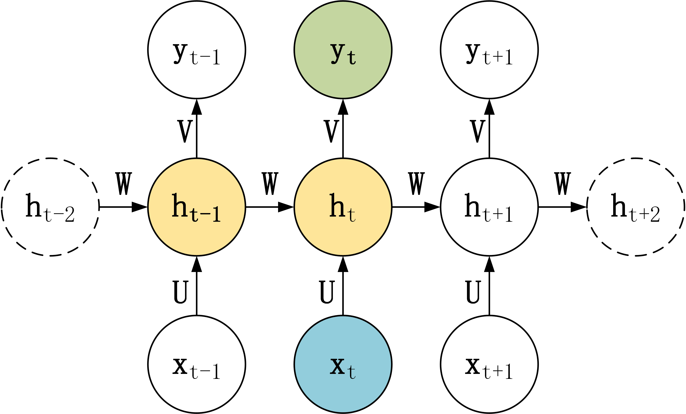

* Figure-rnn

* 对自然语言句子或是其它时序信号进行建模不断调用一个相同的RNN Cell来处理时序信息。每阅读一个单词，循环神经网络会先将本次输入的单词通过embedding lookup转换为一个向量表示。再把这个单词的向量表示和这个模型内部记忆的向量h融合起来，形成一个更新的记忆
* 缺点：当阅读很长的序列时，网络内部的信息会变得越来越复杂，甚至会超过网络的记忆能力，使得最终的输出信息变得混乱无用

* **N vs N**

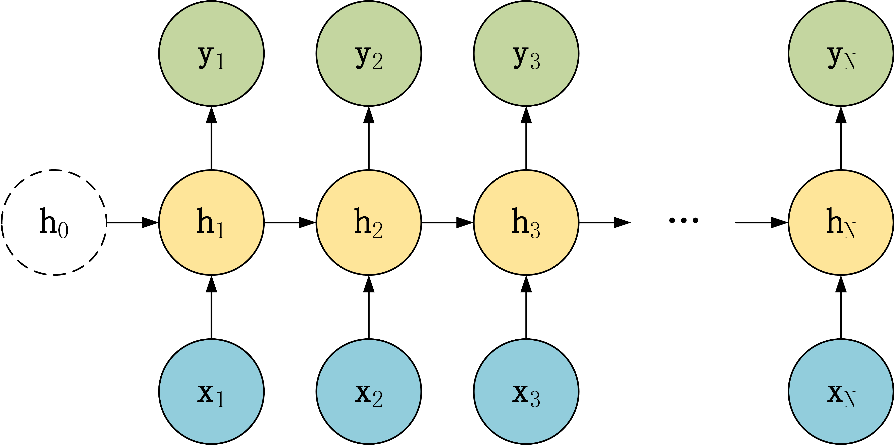

  * Contains $N$ inputs $x1, x2..., xN$, and $N$ outputs $y1, y2..., yN$.
In the $N$ vs $N$ structure, the input and output sequences are of equal length and are generally suitable for the following tasks:
    * The part of speech tagging
    * Training language models, using previous words to predict the next word, etc

* **1 vs N**

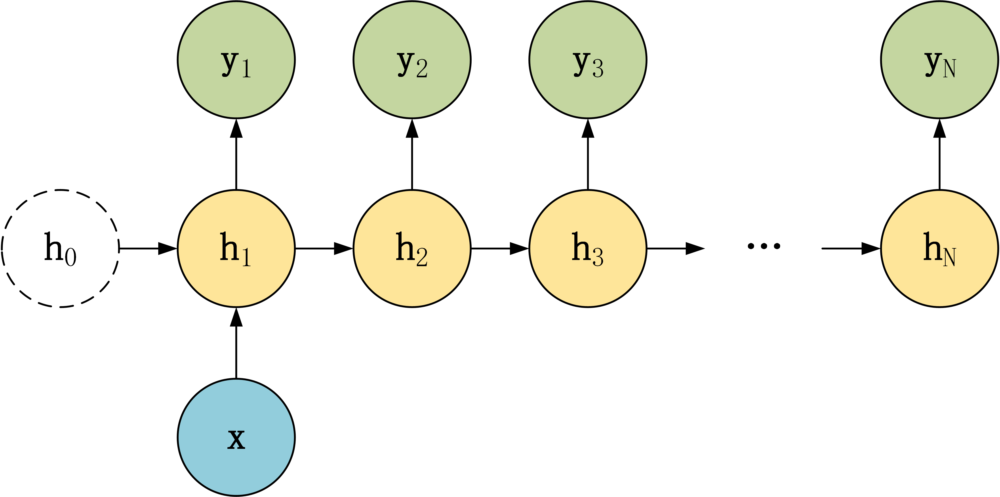

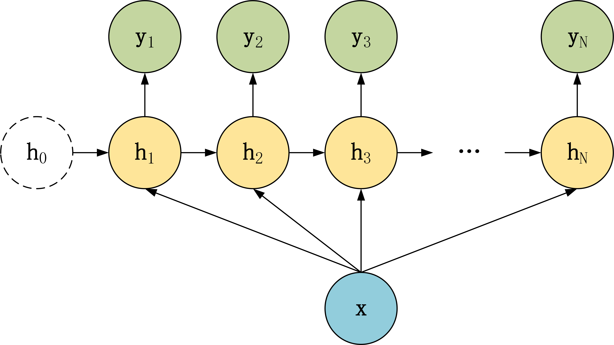

  * 在 1 vs N 结构中，我们只有一个输入 $x$，和 $N$ 个输出 $y1, y2, ..., yN$。可以有两种方式使用 1 vs N，第一种只将输入 $x$ 传入第一个 RNN 神经元，第二种是将输入 $x$ 传入所有的 RNN 神经元。1 vs N 结构适合用于以下任务：
    * 图像生成文字，输入 x 就是一张图片，输出就是一段图片的描述文字。
    * 根据音乐类别，生成对应的音乐。
    * 根据小说类别，生成相应的小说

* **N vs 1**

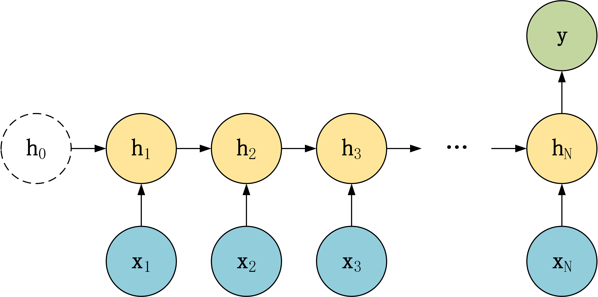

  * 在 N vs 1 结构中，我们有 N 个输入 x1, x2, ..., xN，和一个输出 y。N vs 1 结构适合用于以下任务：
    * 序列分类任务，一段语音、一段文字的类别，句子的情感分析

* reference:
  * https://www.jianshu.com/p/80436483b13b
  
## LSTM (Long Short-Term Memory) 长短时记忆网络

* 长短时记忆网络最大的特点是在更新内部记忆时，引入了遗忘机制。即容许网络忘记过去阅读过程中看到的一些无关紧要的信息，只保留有用的历史信息。通过这种方式延长了记忆长度 

## GRU （Gate Recurrent Unit） 门控循环单元
* GRU (Gate Recurrent Unit)

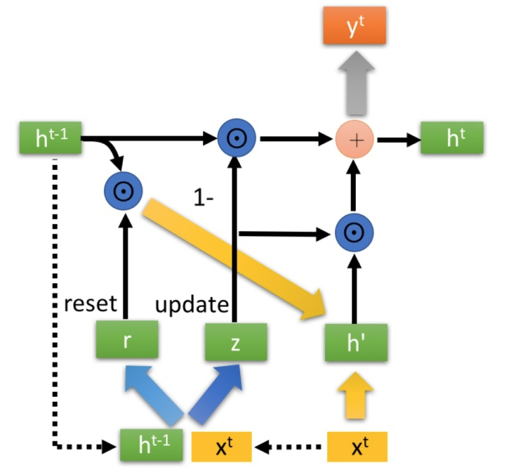

* What is GRU
  * GRU (Gate Recurrent Unit) is a type of Recurrent Neural Network (RNN). Like LSTM (Long-Short Term Memory), it is also proposed to solve problems such as long-term memory and gradients in back propagation.
  * The experimental effect of GRU is similar to that of LSTM, but it is easier to calculate.
* GRU input and output structure

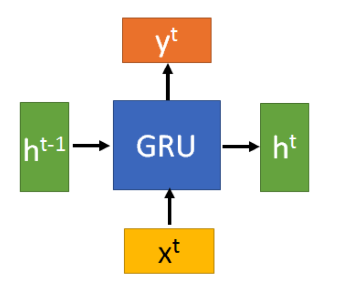

  * There is the current input $x^t$, and the hidden state passed down from the previous node $h^{t-1}$, which contains information about the previous node. Combining $x^t$and $h^{t-1}$, the GRU will get the output of the current hidden node $y^t$and the implicit state of $h^t$passed to the next node.
  

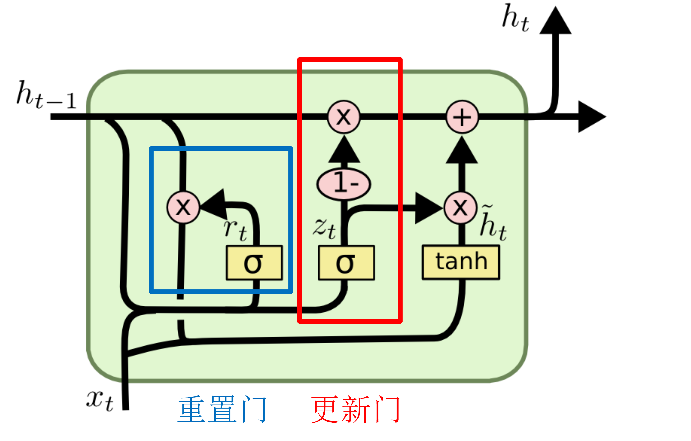

 
* reference:
  * https://zhuanlan.zhihu.com/p/32481747
  
## seq2seq
* Seq2Seq model is the model adopted when the output length is uncertain. This situation usually occurs in the task of machine translation, when a Chinese sentence is translated into English, the length of the English sentence may be shorter than or longer than The Chinese sentence, so the output length is uncertain.

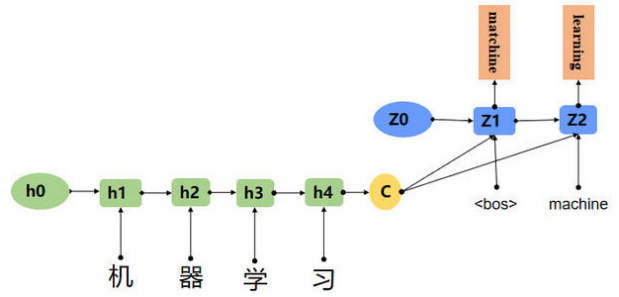

* Semantic vectors only take initialization parameters to participate in the operation

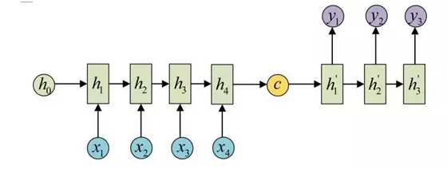

* Semantic vectors participate in every process of decoding

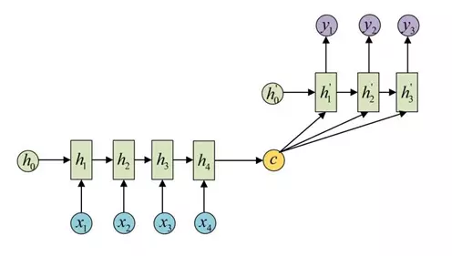

 

## Transformer

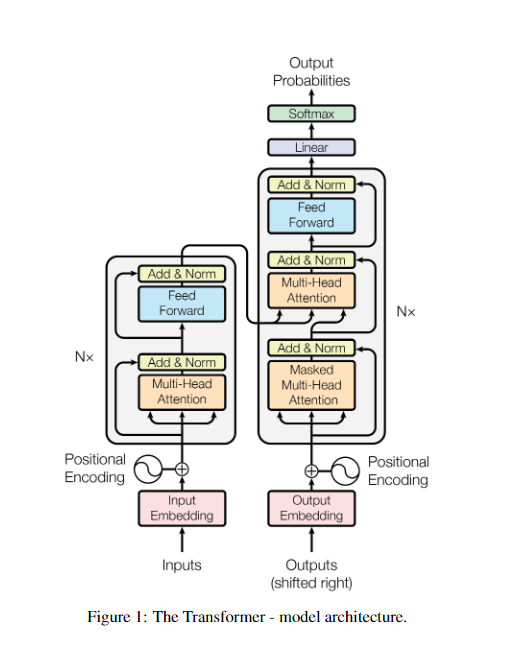

 

## LeNet

## ResNet

## CTC (Connectionist temporal classification)
* 一种完全端到端的声学模型训练, 可以让RNN直接对序列数据进行学习，而无需事先标注好训练数据中输入序列和输出序列的映射关系, 并且CTC直接输出序列预测的概率，不需要外部的后处理
* 既然CTC的方法是关心一个输入序列到一个输出序列的结果，那么它只会关心预测输出的序列是否和真实的序列是否接近（相同），而不会关心预测输出序列中每个结果在时间点上是否和输入的序列正好对齐

* CTC引入了blank（该帧没有预测值），每个预测的分类对应的一整段语音中的一个spike（尖峰），其他不是尖峰的位置认为是blank。对于一段语音，CTC最后的输出是spike（尖峰）的序列，并不关心每一个音素持续了多长时间。

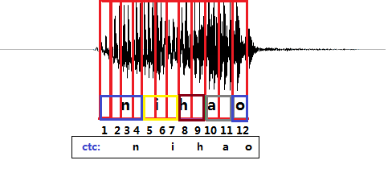

 

* 如图所示，拿前面的nihao的发音为例，进过CTC预测的序列结果在时间上可能会稍微延迟于真实发音对应的时间点，其他时间点都会被标记会blank