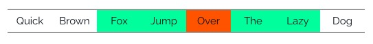
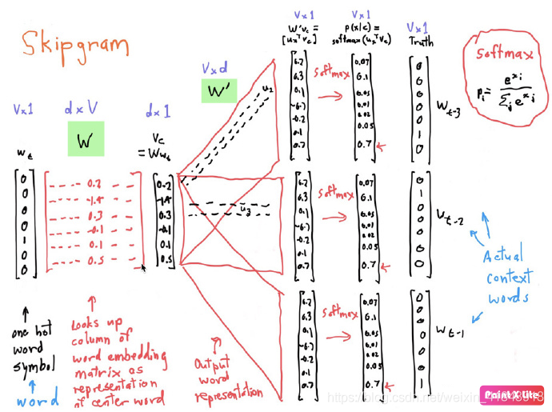
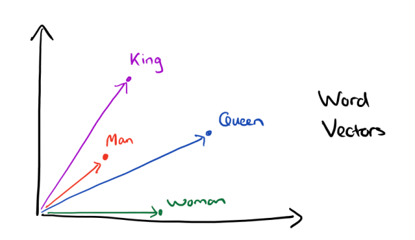

## Basics

### What is NLP?
* Mainly study various theories and methods of effective communication between humans and computers using natural language.

### ACL
* ACL（Annual Meeting of the Association for Computational Linguistics，计算语言学年会，自然语言处理领域的顶级会议）

### Development history and problems
* Development history
  * 符号主义时期
    * 在自然语言处理发展的初期阶段，大量的自然语言研究工作都聚焦从语言学角度，分析自然语言的词法、句法等结构信息，并通过总结这些结构之间的规则，达到处理和使用自然语言的目的.
  * 连接主义时期
     * 1980年，由于计算机技术的发展和算力的提升，个人计算机可以处理更加复杂的计算任务，自然语言处理研究得以复苏，研究人员开始使用统计机器学习方法处理自然语言任务.
  * 深度学习时期
     * 从2006年深度神经网络反向传播算法的提出开始，伴随着互联网的爆炸式发展和计算机（特别是GPU）算力的进一步提高，人们不再依赖语言学知识和有限的标注数据，自然语言处理领域迈入了深度学习时代.
* problems
  * 语言学角度
     * 同义词问题
     * 情感倾向问题
     * 歧义性问题
     * 对话/篇章等长文本处理问题

### Word2vec

#### Word Representation
* 对人来说一个单词就是一个单词，但是对计算机来说却不是这样，那么计算机是如何处理单词或者文本的呢？最简单最直观的做法就是把单词（word）按照某种规则表达成一个向量（vector），这就是Word Representation

#### One-hot encoding?
* 比如：假设我们有这样的两个文本：
  * D1: I like green
  * D2: I like red
* 那么针对这两个文本所组成的语料库而言，我们会得到如下所示的字典：[green, I, like, red]，那么单词”I”的one-hot encoding就是[0100]，单词”like”则是[0010]。

#### Word Embedding
* 词向量(Word Embedding) 是表示自然语言里单词的一种方法，即把每个词都表示为一个N维空间内的点，即一个高维空间内的向量。通过这种方法，实现把自然语言计算转换为向量计算, 要理解这个概念，先理解什么是Emdedding？Embedding在数学上表示一个maping, f: X -> Y， 也就是一个function，其中该函数是injective（就是我们所说的单射函数，每个Y只有唯一的X对应，反之亦然）和structure-preserving (结构保存，比如在X所属的空间上X1 < X2,那么映射后在Y所属空间上同理 Y1 < Y2)。 那么对于word embedding，就是将单词word映射到另外一个空间，其中这个映射具有injective和structure-preserving的特点。 通俗的翻译可以认为是单词嵌入，就是把X所属空间的单词映射为到Y空间的多维向量，那么该多维向量相当于嵌入到Y所属空间中，一个萝卜一个坑。word embedding，就是找到一个映射或者函数，生成在一个新的空间上的表达，该表达就是word representation

> Frequency based Embedding
* Count Vector
  * 这种就是最简单，最基本的词频统计算法：比如我们有N个文本（document），我们统计出所有文本中不同单词的数量，结果组成一个矩阵。那么每一列就是一个向量，表示这个单词在不同的文档中出现的次数。
 
* TF-IDF
  * TF-IDF stands for Term Frequency — Inverse Document Frequency, which is a scoring measure generally used in information retrieval (IR) and summarization. The TF-IDF score shows how important or relevant a term is in a given document.

* Co-Occurrence Vector (协同出现向量)
  * Co-occurrence
    * 协同出现指的是两个单词和在一个Context Window范围内共同出现的次数
  * Context Window
    * 指的是某个单词的上下文范围的大小，也就是前后多少个单词以内的才算是上下文？比如一个Context Window Size = 2的示意图如下：

> Prediction based Embedding
* [1] Prediction Based Word Embedding Techniques https://www.datasciencelearner.com/prediction-based-word-embedding-techniques/

* After the frequency based Word Embedding Techniques , There was a revolutionary concept came in 2013 Word2Vec (Tomas Mikolov) .This concept really change the existing NLP approach . We can create smart chatting bots after this algorithm release . Even Google became so powerful after its invention . It was able to to capture the context while creating embeddings .Word2Vec is a kind of prediction word embedding technique .Actually Word2Vec is pre trained Prediction base Embedding Model ( Covers algorithms and training on its own data ) [1]

### Embedding Lookup Word2vec
* Figure-embedding_lookup.png
  

  * Embedding Lookup -> One-Hot Encoding -> 转换成向量
  * $V = 4×5000  V*W(稠密张量) 5000 × 128 \rightarrow 4*128$

  * CBOW(continuous bag of words): 通过上下文的词向量推理中心词  
    * Figure-cbow
      

      * 输入层： 一个形状为C×V的one-hot张量，其中C代表上线文中词的个数，通常是一个偶数，我们假设为4；V表示词表大小，我们假设为5000，该张量的每一行都是一个上下文词的one-hot向量表示，比如“Pineapples, are, and, yellow”。
      * 隐藏层： 一个形状为V×N的参数张量W1，一般称为word-embedding，N表示每个词的词向量长度，我们假设为128。输入张量和word embedding W1进行矩阵乘法，就会得到一个形状为C×N的张量。综合考虑上下文中所有词的信息去推理中心词，因此将上下文中C个词相加得一个1×N的向量，是整个上下文的一个隐含表示。
      * 输出层： 创建另一个形状为N×V的参数张量，将隐藏层得到的1×N的向量乘以该N×V的参数张量，得到了一个形状为1×V的向量。最终，1×V的向量代表了使用上下文去推理中心词，每个候选词的打分，再经过softmax函数的归一化，即得到了对中心词的推理概率：
    $$
    \begin{aligned}
    Softmax(O_i) = \frac{\exp(O_i)} {\sum{_j}\exp(O_j)}
    \end{aligned}
    $$
    
  * Skip-gram：根据中心词推理上下文 
    * Figure-skip_gram
      

    

    * Input Layer（输入层）：接收一个one-hot张量 $V \in R^{1 \times \text{vocab\_size}}$作为网络的输入，里面存储着当前句子中心词的one-hot表示。
    * Hidden Layer（隐藏层）：将张量$V$乘以一个word embedding张量$W_1 \in R^{\text{vocab\_size} \times \text{embed\_size}}$，并把结果作为隐藏层的输出，得到一个形状为$R^{1 \times \text{embed\_size}}$的张量，里面存储着当前句子中心词的词向量。
    * Output Layer（输出层）：将隐藏层的结果乘以另一个word embedding张量$W_2 \in R^{\text{embed\_size} \times \text{vocab\_size}}$得到一个形状为$R^{1 \times \text{vocab\_size}}$的张量。这个张量经过softmax变换后，就得到了使用当前中心词对上下文的预测结果。根据这个softmax的结果，我们就可以去训练词向量模型。
    
  * GloVe (Global Vectors for Word Representation) 它是一个基于全局词频统计（count-based & overall statistics）的词表征（word representation）工具，它可以把一个单词表达成一个由实数组成的向量，这些向量捕捉到了单词之间一些语义特性，比如相似性（similarity）、类比性（analogy）等。我们通过对向量的运算，比如欧几里得距离或者cosine相似度，可以计算出两个单词之间的语义相似性
  
  * Interesting things     
  

  $$
  \begin{aligned} 
  \vec {King} - \vec {Man} + \vec {Woman} = \vec {Queen}
  \end{aligned}
  $$

## Transformer Encoder
* ERNIE 采用了 Transformer Encoder 作为其语义表示的骨架。Transformer 是由论文Attention is All You Need(https://arxiv.org/abs/1706.03762) 首先提出的机器翻译模型，在效果上比传统的 RNN 机器翻译模型更加优秀。

* Transformer 简要结构 
  * Figure-transform_simple_struct
    

* Transformer 构成
  基于 Encoder-Decoder 框架, 其主要结构由 Attention(注意力) 机制构成
  -Encoder 由全同的多层堆叠而成，每一层又包含了两个子层：一个Self-Attention层和一个前馈神经网络。Self-Attention 层主要用来输入语料之间各个词之间的关系（例如搭配关系），其外在体现为词汇间的权重，此外还可以帮助模型学到句法、语法之类的依赖关系的能力。

* Decoder 也由全同的多层堆叠而成，每一层同样包含了两个子层。在 Encoder 和 Decoder 之间还有一个Encoder-Decoder Attention层。Encoder-Decoder Attention层的输入来自于两部分，一部分是Encoder的输出，它可以帮助解码器关注输入序列哪些位置值得关注。另一部分是 Decoder 已经解码出来的结果再次经过Decoder的Self-Attention层处理后的输出，它可以帮助解码器在解码时把已翻译的内容中值得关注的部分考虑进来。例如将“read a book”翻译成中文，我们把“book”之所以翻译成了“书”而没有翻译成“预定”就是因为前面Read这个读的动作。

## Components of Natural Language Processing (NLP)

* Lexical Analysis:
  * With lexical analysis, we divide a whole chunk of text into paragraphs, sentences, and words. It involves identifying and analyzing words’ structure.
* Syntactic Analysis:
  * Syntactic analysis involves the analysis of words in a sentence for grammar and arranging words in a manner that shows the relationship among the words. For instance, the sentence “The shop goes to the house” does not pass.
* Semantic Analysis:
  * Semantic analysis draws the exact meaning for the words, and it analyzes the text meaningfulness. Sentences such as “hot ice-cream” do not pass.
* Disclosure Integration:
  * Disclosure integration takes into account the context of the text. It considers the meaning of the sentence before it ends. For example: “He works at Google.” In this sentence, “he” must be referenced in the sentence before it.
* Pragmatic Analysis:
  * Pragmatic analysis deals with overall communication and interpretation of language. It deals with deriving meaningful use of language in various situations.

## NLP libraries

* NLTK (Natural Language Toolkit) (https://www.nltk.org/)https://www.nltk.org/
  * The NLTK Python framework is generally used as an education and research tool. It’s not usually used on production applications
* spaCy (https://spacy.io/)
  * spaCy is an open-source natural language processing Python library designed to be fast and production-ready
* Gensim (https://pypi.org/project/gensim/)
* Pattern (https://github.com/clips/pattern)
* Word Cloud 
  * Word Cloud is a data visualization technique. In which words from a given text display on the main chart. In this technique, more frequent or essential words display in a larger and bolder font, while less frequent or essential words display in smaller or thinner fonts. 
  * Figure-wordcloud-code_example 
    

## Stemming & Various Stemming Algorithms
  * We use Stemming to normalize words. In English and many other languages, a single word can take multiple forms depending upon context used. For instance, the verb “study” can take many forms like “studies,” “studying,” “studied,” and others, depending on its context

### Lemmatization
  * Lemmatization tries to achieve a similar base “stem” for a word. However, what makes it different is that it finds the dictionary word instead of truncating the original word. Stemming does not consider the context of the word. That is why it generates results faster, but it is less accurate than lemmatization.

### Part of Speech Tagging (PoS tagging)
  * Figure-pos_example
    

  

  * CC: Coordinating Conjunction
  * CD: Cardinal Digit
  * DT: Determiner
  * EX: Existential There
  * FW: Foreign Word
  * IN: Preposition / Subordinating Conjunction
  * And more

### Chunking
* Chunking means to extract meaningful phrases from unstructured text. By tokenizing a book into words, it’s sometimes hard to infer meaningful information. It works on top of Part of Speech(PoS) tagging. Chunking takes PoS tags as input and provides chunks as output. Chunking literally means a group of words, which breaks simple text into phrases that are more meaningful than individual words
* Figure-chunking
  

* Phrases
  * Noun Phrases (NP).
  * Verb Phrases (VP).
  * Adjective Phrases (ADJP).
  * Adverb Phrases (ADVP).
  * Prepositional Phrases (PP).
* Phrase structure rules:
  * S(Sentence) → NP VP.
  * NP → {Determiner, Noun, Pronoun, Proper name}.
  * VP → V (NP)(PP)(Adverb).
  * PP → Pronoun (NP).
  * AP → Adjective (PP).
* Figure-chunking_example
  

### Named Entity Recognition (NER)
* Named entity recognition can automatically scan entire articles and pull out some fundamental entities like people, organizations, places, date, time, money, and GPE discussed in them.

### WordNet
* Wordnet is a lexical database for the English language. Wordnet is a part of the NLTK corpus. We can use Wordnet to find meanings of words, synonyms, antonyms, and many other words.

### Bag of Words
* It is a method of extracting essential features from row text so that we can use it for machine learning models

### To sum up
* word2vec和Co-Occurrence Vector的思想是很相似的，都是基于一个统计学上的假设：经常在同一个上下文出现的单词是相似的。只是他们的实现方式是不一样的，前者是采用词频统计，降维，矩阵分解等确定性技术；而后者则采用了神经网络进行不确定预测，它的提出主要是采用神经网络之后计算复杂度和最终效果都比之前的模型要好。所以那篇文章的标题才叫：Efficient Estimation of Word Representations in Vector Space。 这项技术可以用来估算两个单词之间的相似度，它在自然语言处理（NLP），搜索以及机器翻译（machine translation）等领域有着广泛的应用
  * reference from: http://www.fanyeong.com/2017/10/10/word2vec/
* Glove与LSA、word2vec的比较
  * LSA（Latent Semantic Analysis）是一种比较早的count-based的词向量表征工具，它也是基于co-occurance matrix的，只不过采用了基于奇异值分解（SVD）的矩阵分解技术对大矩阵进行降维，而我们知道SVD的复杂度是很高的，所以它的计算代价比较大。还有一点是它对所有单词的统计权重都是一致的。而这些缺点在GloVe中被一一克服了。而word2vec最大的缺点则是没有充分利用所有的语料，所以GloVe其实是把两者的优点结合了起来。从这篇论文给出的实验结果来看，GloVe的性能是远超LSA和word2vec的，但网上也有人说GloVe和word2vec实际表现其实差不多。
