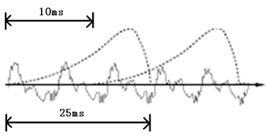
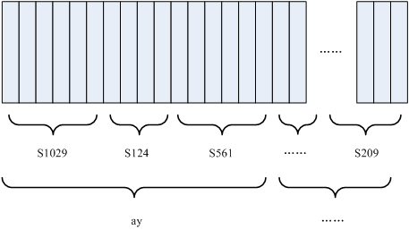

## Speech Recognition
### What is Speech Recognition?
* Speech recognition software is a program trained to receive the input of human speech, decipher it, and turn it into readable text. This software filters words, digitizes them, and analyzes the sounds they are composed of. The digital representation of these sounds undergoes mathematical analysis to interpret what is being said.
* Speech recognition applications include call routing, voice dialing, voice search, data entry, and automatic dictation.
Speech recognition software and deep learning
* Traditionally speech recognition models relied on classification algorithms to reach a conclusion about the distribution of possible sounds (phonemes) for a frame.
* Today, thanks to deep learning, neural networks are used to perform isolated word recognition, phoneme classification, audiovisual speech recognition, speaker adaptation, and audio-visual speaker recognition.

* How it works
  * Speech recognition software uses Natural Language Processing (NLP) and deep learning neural networks to break the speech down into components that it can interpret. It converts these components into a digital state and analyzes segments of content. The software trains on a dataset of known spoken words or phrases, and makes predictions on the new sounds, forming a hypothesis about what the user is saying. It then transcribes the spoken words into text.
  * However, recognizing sound is not enough. To be useful, speech recognition software needs to be able to know, for example, the difference between proper names and regular words (for example “Cook” in “James Cook” is a name), and to differentiate between homophones (words with the same pronunciation but with distinct meaning).
  * Thus, a challenge of speech recognition is creating an intelligent process not only to ‘hear’ speech but also to interface and reason over sources of knowledge and hierarchical relationships that make up ideas in the real world.

* Sound is actually a wave. Common formats such as mp3 are compressed formats and must be converted into uncompressed pure wave files for processing, such as Windows PCM files, which are commonly known as wav files. Except for a file header, stored in the wav file are points of the sound waveform.

* 步骤
  * 预处理
    * 把首尾端的静音切除，降低对后续步骤造成的干扰。这个静音切除的操作一般称为VAD，需要用到信号处理的一些技术 (可选)

  * 声音分帧
    * 对声音分帧，也就是把声音切开成一小段一小段，每小段称为一帧。分帧操作一般不是简单的切开，而是使用移动窗函数来实现
    * 每帧的长度为25毫秒，每两帧之间有25-10=15毫秒的交叠。我们称为以帧长25ms、帧移10ms分帧

<div align=center>

</div>

  * 特征提取
    * 分帧后，语音就变成了很多小段。但波形在时域上几乎没有描述能力，因此必须将波形作变换。主要算法有线性预测倒谱系数（LPCC）和Mel 倒谱系数（MFCC），目的是把每一帧波形变成一个包含声音信息的多维向量,常见的一种变换方法是提取MFCC特征，根据人耳的生理特性，把每一帧波形变成一个多维向量，可以简单地理解为这个向量包含了这帧语音的内容信息。这个过程叫做声学特征提取， 声音就成了一个12行（假设声学特征是12维）、N列的一个矩阵，称之为观察序列，这里N为总帧数
  
  * 声学模型(AM)
    * 通过对语音数据进行训练获得，输入是特征向量，输出为音素信息

  * 字典
    * 字或者词与音素的对应， 简单来说， 中文就是拼音和汉字的对应，英文就是音标与单词的对应

  * 语言模型(LM)
    * 通过对大量文本信息进行训练，得到单个字或者词相互关联的概率

  * 解码
    * 就是通过声学模型，字典，语言模型对提取特征后的音频数据进行文字输出

* 流程的举例（只是形象表述）
  * 语音信号：PCM文件等（我是机器人）
  * 特征提取：提取特征向量[1 2 3 4 56 0 ...]
  * 声学模型：[1 2 3 4 56 0]-> w o s i j i q i r n
  * 字典：窝：w o；我：w o； 是：s i； 机：j i； 器：q i； 人：r n；级：j i；忍：r n；
  * 语言模型：我：0.0786， 是： 0.0546，我是：0.0898，机器：0.0967，机器人：0.6785；
  * 输出文字：我是机器人

* 矩阵转文字需要的两种概念
  * 音素：单词的发音由音素构成。对英语，一种常用的音素集是卡内基梅隆大学的一套由39个音素构成的音素集，参见 [The CMU Pronouncing Dictionary]‎(https://link.zhihu.com/?target=http%3A//www.speech.cs.cmu.edu/cgi-bin/cmudict) 汉语一般直接用全部声母和韵母作为音素集，另外汉语识别还分有调无调.

  * 状态：这里理解成比音素更细致的语音单位就行啦。通常把一个音素划分成3个状态
  
* 如何工作
  * 把帧识别成状态（难点）
  * 把状态组合成音素
  * 把音素组合成单词

<div align=center>

</div>

  * 每个小竖条代表一帧，若干帧语音对应一个状态，每三个状态组合成一个音素，若干个音素组合成一个单词。也就是说，只要知道每帧语音对应哪个状态了，语音识别的结果也就出来了


## Download Audio with youtube-dl for learning SR

```bash
# e.g. 龙之谷 - 夺宝奇兵
# url = http://www.youtube.com/watch?v=mZBWnI_adRA

# get all format
youtube-dl -F http://www.youtube.com/watch?v=mZBWnI_adRA

> format code  extension  resolution note
> 249          webm       audio only tiny   57k , opus @ 50k (48000Hz), 29.81MiB
> 250          webm       audio only tiny   71k , opus @ 70k (48000Hz), 37.29MiB
> 251          webm       audio only tiny  124k , opus @160k (48000Hz), 66.63MiB
> 140          m4a        audio only tiny  134k , m4a_dash container, mp4a.40.2@128k (44100Hz), 83.00MiB
> 278          webm       256x144    144p  102k , webm container, vp9, 24fps, video only, 56.97MiB
> 160          mp4        256x144    144p  131k , avc1.42c00c, 12fps, video only, 70.32MiB
> 242          webm       426x240    240p  235k , vp9, 24fps, video only, 98.57MiB
> 133          mp4        426x240    240p  265k , avc1.4d4015, 24fps, video only, 157.81MiB
> 243          webm       640x360    360p  521k , vp9, 24fps, video only, 180.80MiB
> 134          mp4        640x360    360p  617k , avc1.4d401e, 24fps, video only, 282.02MiB
> 244          webm       854x480    480p  851k , vp9, 24fps, video only, 309.89MiB
> 135          mp4        854x480    480p 1138k , avc1.4d401e, 24fps, video only, 550.15MiB
> 247          webm       1280x720   720p 2033k , vp9, 24fps, video only, 611.26MiB
> 136          mp4        1280x720   720p 2266k , avc1.4d401f, 24fps, video only, 1.05GiB
> 22           mp4        1280x720   720p    3k , avc1.64001F, 24fps, mp4a.40.2@192k (44100Hz)
> 18           mp4        640x360    360p  558k , avc1.42001E, 24fps, mp4a.40.2@ 96k (44100Hz), 361.14MiB (best)

# choose format and download 
youtube-dl -f 250 --proxy http://127.0.0.1:10809 http://www.youtube.com/watch?v=mZBWnI_adRA

# why proxy
# I got error:
# ERROR: Unable to download webpage: <urlopen error EOF occurred in violation of protocol (_ssl.c:600)> (caused by URLError(SSLEOFError(8, 'EOF occurred in violation of protocol (_ssl.c:600)'),))

```

## About audio

### Format
音频文件格式专指存放音频数据的文件的格式。存在多种不同的格式。

一般获取音频数据的方法是：采用固定的时间间隔，对音频电压采样（量化），并将结果以某种分辨率（例如：CDDA每个采样为16比特或2字节）存储。采样的时间间隔可以有不同的标准，如CDDA采用每秒44100次；DVD采用每秒48000或96000次。因此，采样率，分辨率和声道数目（例如立体声为2声道）是音频文件格式的关键参数

* 有两类主要的音频文件格式：

  * 无损格式，例如WAV，FLAC，APE，ALAC，WavPack(WV)
  * 有损格式，例如MP3，AAC，Ogg Vorbis，Opus

* WAV
  * Waveform Audio File Format（WAVE，又或者是因为扩展名而被大众所知的WAV），是微软与IBM公司所开发在个人电脑存储音频流的编码格式，在Windows平台的应用软件受到广泛的支持，地位上类似于麦金塔电脑里的AIFF。 此格式属于资源交换文件格式(RIFF)的应用之一，通常会将采用脉冲编码调制的音频资存储在区块中。也是其音乐发烧友中常用的指定规格之一。由于此音频格式未经过压缩，所以在音质方面不会出现失真的情况，但文件的体积因而在众多音频格式中较为大

* FLAC
  * FLAC（Free Lossless Audio Codec），中文直译为自由无损音频压缩编码（注：这里“Free”指的是自由软件——而并不仅是免费）。FLAC是一款的自由音频压缩编码，其特点是可以对音频文件无损压缩。不同于其他有损压缩编码（如MP3 、AAC等），压缩后不会有任何音质损失，现在已被很多软件及硬件音频产品所支持

* ALAC
  * Apple Lossless（Apple Lossless Audio Codec，缩写为ALAC）为苹果公司推出的无损音频压缩编码格式，可将非压缩音频格式（WAV、AIFF）压缩至原先容量的40%至60%左右，编解码速度很快。也因为是无损压缩，听起来与原文件完全一样，不会因解压缩和压缩而改变。

### Codec
编解码器（英语：codec）指的是一个能够对一个信号或者一个数据流进行编解码操作的设备或者程序。这里指的变换既包括将信号或者数据流进行编码（通常是为了传输、存储或者加密）或者提获取到一个编码流的操作，也包括为了观察或者处理从这个编码流中恢复适合观察或操作的形式的操作。编解码器经常用在视频会议和流媒体等应用中。一个编解码器不应该同编码或压缩格式或标准混淆，一种格式是一种文档（所谓标准），一种存储数据的方式，但是编解码器却是一段程序用于读或写这样的文件。实际上，有时编解码器不严谨地意指格式

## Tensorflow
https://www.tensorflow.org/io/tutorials/audio#setup

### Read audio file
* In TensorFlow IO, class tfio.audio.AudioIOTensor allows you to read an audio file into a lazy-loaded IOTensor

```python

audio = tfio.audio.AudioIOTensor('my-audio.flac')

> audio:  <AudioIOTensor: shape=[288000      2], dtype=<dtype: 'int32'>, rate=48000>
```

* AudioIOTensor is lazy-loaded so only shape, dtype, and sample rate are shown initially. The shape of the AudioIOTensor is represented as [samples, channels], which means the audio clip you loaded is mono channel with `288000` samples in `int32`.


### Audio play

```python
from IPython.display import Audio

Audio(audio_tensor.numpy(), rate=audio.rate.numpy())
```

### Show Audio with plt

```python
tensor = tf.cast(audio_tensor, tf.float32) / 32768.0
plt.figure()
plt.plot(tensor.numpy())
plt.show()
```

### Trim the noise
Sometimes it makes sense to trim the noise from the audio, which could be done through API tfio.experimental.audio.trim. Returned from the API is a pair of [start, stop] position of the segement

```python
position = tfio.experimental.audio.trim(tensor, axis=0, epsilon=0.1)
print(position)

start = position[0]
stop = position[1]
print(start, stop)

processed = tensor[start:stop]
```

### Fade In and Fade Out
One useful audio engineering technique is fade, which gradually increases or decreases audio signals. This can be done through tfio.experimental.audio.fade. tfio.experimental.audio.fade supports different shapes of fades such as `linear`, `logarithmic`, or `exponential`

```python
fade = tfio.experimental.audio.fade(
    processed, fade_in=1000, fade_out=2000, mode="logarithmic")

```

### Spectrogram
Advanced audio processing often works on frequency changes over time. In tensorflow-io a waveform can be converted to spectrogram through tfio.experimental.audio.spectrogram

```python
# Convert to spectrogram
spectrogram = tfio.experimental.audio.spectrogram(
    fade, nfft=512, window=512, stride=256)

plt.figure()
plt.imshow(tf.math.log(spectrogram).numpy())

# Convert to mel-spectrogram
mel_spectrogram = tfio.experimental.audio.melscale(
    spectrogram, rate=16000, mels=128, fmin=0, fmax=8000)


plt.figure()
plt.imshow(tf.math.log(mel_spectrogram).numpy())

# Convert to db scale mel-spectrogram
dbscale_mel_spectrogram = tfio.experimental.audio.dbscale(
    mel_spectrogram, top_db=80)

plt.figure()
plt.imshow(dbscale_mel_spectrogram.numpy())
```

### Time Masking
In frequency masking, frequency channels [f0, f0 + f) are masked where f is chosen from a uniform distribution from 0 to the frequency mask parameter F, and f0 is chosen from (0, ν − f) where ν is the number of frequency channels.

```python
# Freq masking
freq_mask = tfio.experimental.audio.freq_mask(dbscale_mel_spectrogram, param=10)

plt.figure()
plt.imshow(freq_mask.numpy())

```

## Audio process programe

### Audacity

* Export single channel
  * by default, the `Edit` -> `Preferences` -> `Import/Export` is `Mix down to Stereo or Mono` option, so we change that to `Use Advanced Minxing Options`