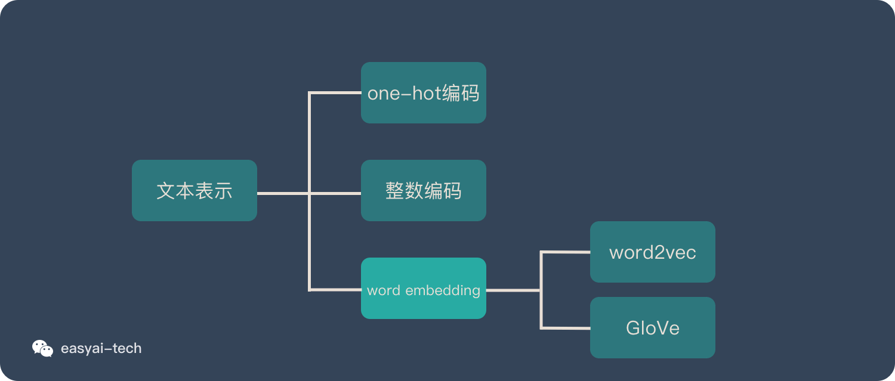
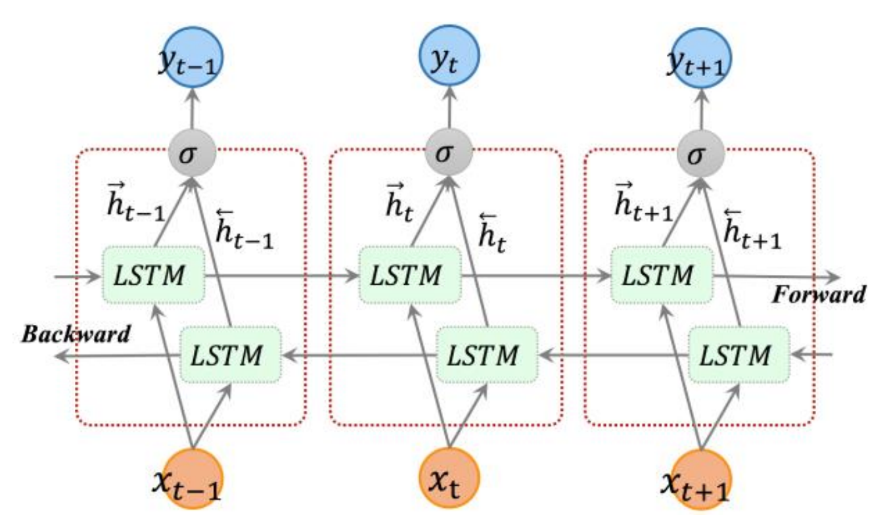
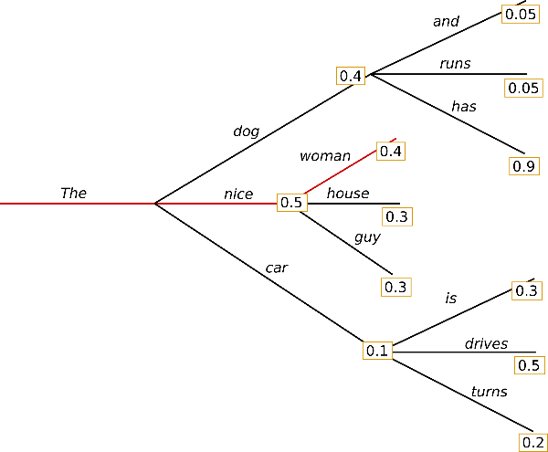
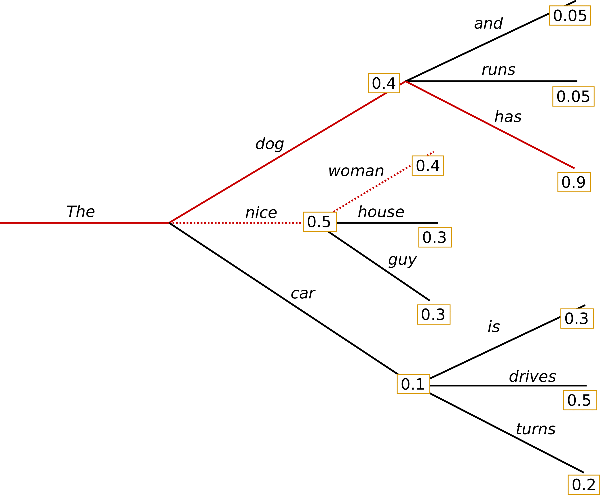
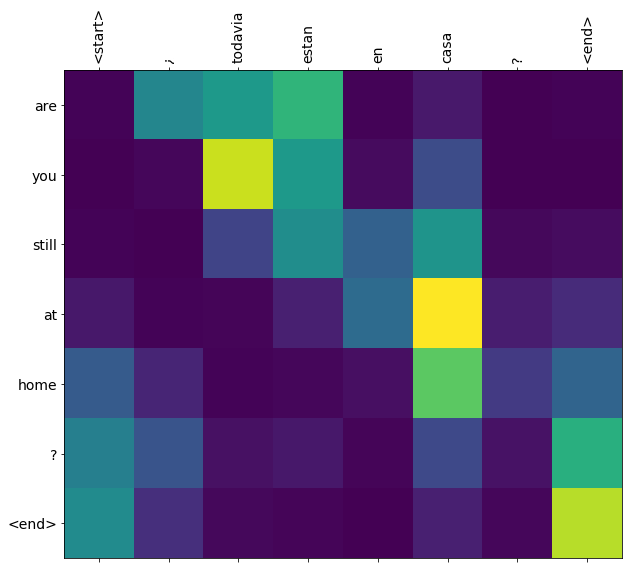
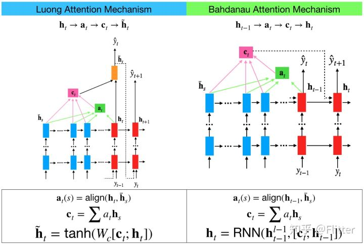
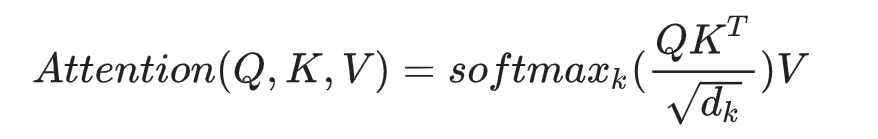

## Text


### Word embeddings


#### Representing text as numbers
* Machine learning models take vectors (arrays of numbers) as input. When working with text, the first thing you must do is come up with a strategy to convert strings to numbers (or to "vectorize" the text) before feeding it to the model.

* One-hot encodings
<div align=center></div>

    * Disadvantage
        * This approach is inefficient. A one-hot encoded vector is sparse (meaning, most indices are zero)

* Encode each word with a unique number
    * downsides
        * The integer-encoding is arbitrary (it does not capture any relationship between words).
        * An integer-encoding can be challenging for a model to interpret. A linear classifier, for example, learns a single weight for each feature. Because there is no relationship between the similarity of any two words and the similarity of their encodings, this feature-weight combination is not meaningful.
        
* Word embeddings
    * Word embeddings give us a way to use an efficient, dense representation in which similar words have a similar encoding,It is common to see word embeddings that are 8-dimensional (for small datasets), up to 1024-dimensions when working with large datasets. A higher dimensional embedding can capture fine-grained relationships between words, but takes more data to learn.
    
    
### Text classification with an RNN
* `tf.keras.layers.Bidirectional`
  * The tf.keras.layers.Bidirectional wrapper can also be used with an RNN layer. This propagates the input forward and backwards through the RNN layer and then concatenates the output. This helps the RNN to learn long range dependencies.


### Text generation with an RNN

* Train Step
  * For each character the model looks up the embedding, runs the GRU one timestep with the embedding as input, and applies the dense layer to generate logits predicting the log-likelihood of the next character:

<div align=center>

</div>


#### Greedy Search
* Simply choose the word with the highest probability as its next word and consider it at each step
<div align=center>

</div>
* Downsides
  * It simply ignores the high-probability words hidden behind the low-probability ones
  
* Beam Search
<div align=center>

</div>
The risk of losing hidden sequences of high-probability words is reduced by retaining the most probable number of hypotheses at each time step and ultimately choosing the set of hypotheses with the highest overall probability

### Neural machine translation with attention
* attention plot
<div align=center>

</div>

#### seq2seq
[Model Structure with seq2seq](/ai/ModelStructures?id=seq2seq "seq2seq")
* Write the encoder and decoder model
<div align=center>

</div>

* Uses Bahdanau attention
  [Bahdanau attention](https://arxiv.org/pdf/1409.0473.pdf, "Bahdanau attention")
* Math
<div align=center>

</div>

<div align=center>

</div>

  * FC = Fully connected (dense) layer
  * EO = Encoder output
  * H = hidden state
  * X = input to the decoder
* And the pseudo-code:

* `score = FC(tanh(FC(EO) + FC(H)))`
* `attention weights = softmax(score, axis = 1)`. Softmax by default is applied on the last axis but here we want to apply it on the 1st axis, since the shape of score is (batch_size, max_length, hidden_size). Max_length is the length of our input. Since we are trying to assign a weight to each input, softmax should be applied on that axis.
* `context vector = sum(attention weights * EO, axis = 1)`. Same reason as above for choosing axis as 1.
embedding output = The input to the decoder X is passed through an embedding layer.
* `merged vector = concat(embedding output, context vector)`
* This merged vector is then given to the GRU

#### Attention
<div align=center>

</div>

* Image from: https://zhuanlan.zhihu.com/p/129316415

### Image captioning with visual attention
* address
  * https://www.tensorflow.org/tutorials/text/image_captioning

* Google Inception model
  * Inception is Google's open source CNN model. Four versions have been released so far, each version is based on the data training in the large image database ImageNet.

* Step
  * Download and prepare the MS-COCO dataset
    * prepare image_path_to_caption data (key is `image_path`, the value is a list of included caption data `<start> ... <end>`)
    * prepare train_captions, img_name_vector data 

```python
train_captions = []
img_name_vector = []

for image_path in train_image_paths:
  caption_list = image_path_to_caption[image_path]
  train_captions.extend(caption_list)
  img_name_vector.extend([image_path] * len(caption_list))
```

  * Preprocess the images using InceptionV3
    * Resizing the image to 299px by 299px
    * Preprocess the images using the preprocess_input method to normalize the image so that it contains pixels in the range of -1 to 1, which matches the format of the images used to train InceptionV3.
  * Initialize InceptionV3 and load the pretrained Imagenet weights

```python
image_model = tf.keras.applications.InceptionV3(include_top=False,
                                                weights='imagenet')
new_input = image_model.input
hidden_layer = image_model.layers[-1].output

image_features_extract_model = tf.keras.Model(new_input, hidden_layer)
```

  * Caching the features extracted from InceptionV3
    * You will pre-process each image with InceptionV3 and cache the output to disk.

  * Preprocess and tokenize the captions
    * First, you'll tokenize the captions (for example, by splitting on spaces). This gives us a vocabulary of all of the unique words in the data (for example, "surfing", "football", and so on).
    * Next, you'll limit the vocabulary size to the top 5,000 words (to save memory). You'll replace all other words with the token "UNK" (unknown).
    * You then create word-to-index and index-to-word mappings.
    * Finally, you pad all sequences to be the same length as the longest one.
  
  * Split the data into training and testing
    * praper img_to_cap_vector data (the key is img name, the value is `pad sequeunce of captions`)
    * prepare img_name_train
    * prepare cap_train
    * prepare img_name_val
    * prepare cap_val
  
  * Create a tf.data dataset for training

```python
top_k = 5000
...
BATCH_SIZE = 64
BUFFER_SIZE = 1000
embedding_dim = 256
units = 512
vocab_size = top_k + 1
num_steps = len(img_name_train) // BATCH_SIZE
# Shape of the vector extracted from InceptionV3 is (64, 2048)
# These two variables represent that vector shape
features_shape = 2048
attention_features_shape = 64
```

  * Prepare model
    * extract the features from the lower convolutional layer of InceptionV3 giving us a vector of shape (8, 8, 2048) and squash that to a shape of (64, 2048).
    * This vector is then passed through the CNN Encoder (which consists of a single Fully connected layer).
    * The RNN (here GRU) attends over the image to predict the next word.

```python
class BahdanauAttention(tf.keras.Model):
  Dense(units)
  Dense(units)
  Dense(1)
class CNN_Encoder(tf.keras.Model):
  Dense(embedding_dim)
class RNN_Decoder(tf.keras.Model):
  Embedding(vocab_size, embedding_dim)
  GRU(units)
  Dense(units)
  Dense(vocab_size)
  BahdanauAttention(units)

encoder = CNN_Encoder(embedding_dim)
decoder = RNN_Decoder(embedding_dim, units, vocab_size)
```

  * Training
    * extract the features stored in the respective .npy files and then pass those features through the encoder.
    * The encoder output, hidden state(initialized to 0) and the decoder input (which is the start token) is passed to the decoder.
    * The decoder returns the predictions and the decoder hidden state.
    * The decoder hidden state is then passed back into the model and the predictions are used to calculate the loss.
    * Use teacher forcing to decide the next input to the decoder.
    * Teacher forcing is the technique where the target word is passed as the next input to the decoder.
    * The final step is to calculate the gradients and apply it to the optimizer and backpropagate.

### Transformer model for language understanding
* The core idea behind the Transformer model is self-attention—the ability to attend to different positions of the input sequence to compute a representation of that sequence. Transformer creates stacks of self-attention layers and is explained below in the sections Scaled dot product attention and Multi-head attention.
* A transformer model handles variable-sized input using stacks of self-attention layers instead of RNNs or CNNs. This general architecture has a number of advantages:
  * It make no assumptions about the temporal/spatial relationships across the data. This is ideal for processing a set of objects (for example, StarCraft units).
  * Layer outputs can be calculated in parallel, instead of a series like an RNN.
  * Distant items can affect each other's output without passing through many RNN-steps, or convolution layers (see Scene Memory Transformer for example).
  * It can learn long-range dependencies. This is a challenge in many sequence tasks.
* The downsides of this architecture are:
  * For a time-series, the output for a time-step is calculated from the entire history instead of only the inputs and current hidden-state. This may be less efficient.
  * If the input does have a temporal/spatial relationship, like text, some positional encoding must be added or the model will effectively see a bag of words.

* Paper `Attention is all you need` explain
  * https://www.cnblogs.com/robert-dlut/p/8638283.html

* Positional encoding
  * Since this model doesn't contain any recurrence or convolution, positional encoding is added to give the model some information about the relative position of the words in the sentence. The positional encoding vector is added to the embedding vector. Embeddings represent a token in a d-dimensional space where tokens with similar meaning will be closer to each other. But the embeddings do not encode the relative position of words in a sentence. So after adding the positional encoding, words will be closer to each other based on the similarity of their meaning and their position in the sentence, in the d-dimensional space.

* Masking
  * Mask all the pad tokens in the batch of sequence. It ensures that the model does not treat padding as the input

* Scaled dot product attention (https://www.tensorflow.org/tutorials/text/transformer#scaled_dot_product_attention)

<div align=center>

</div> 

  * The attention function used by the transformer takes three inputs: Q (query), K (key), V (value). The equation used to calculate the attention weights is:

<div align=center>

</div> 

* Multi-head attention
  * Multi-head attention consists of four parts:
    * Linear layers and split into heads.
    * Scaled dot-product attention.
    * Concatenation of heads.
    * Final linear layer.

<div align=center>

</div> 

* Point wise feed forward network
  * Point wise feed forward network consists of two fully-connected layers with a ReLU activation in between.

* Encoder and decoder
  * The input sentence is passed through N encoder layers that generates an output for each word/token in the sequence.
  * The decoder attends on the encoder's output and its own input (self-attention) to predict the next word.

  * Encoder layer
    * Each encoder layer consists of sublayers:
      * Multi-head attention (with padding mask)
      * Point wise feed forward networks.
    * Each of these sublayers has a residual connection around it followed by a layer normalization. Residual connections help in avoiding the vanishing gradient problem in deep networks.

  * Decoder layer
    * Each decoder layer consists of sublayers:
      * Masked multi-head attention (with look ahead mask and padding mask)
      * Multi-head attention (with padding mask). V (value) and K (key) receive the encoder output as inputs. Q (query) receives the output from the masked multi-head attention sublayer.
      * Point wise feed forward networks
  
    * Encoder
      * The Encoder consists of:
        * Input Embedding
        * Positional Encoding
        * N encoder layers
        
    * Decoder
      * The Decoder consists of:
        * Output Embedding
        * Positional Encoding
        * N decoder layers

* Create the Transformer
  * Transformer consists of the encoder, decoder and a final linear layer. The output of the decoder is the input to the linear layer and its output is returned.

* Optimizer
  * Use the Adam optimizer with a custom learning rate scheduler according to the formula in the paper.

* Loss and metrics
  * Since the target sequences are padded, it is important to apply a padding mask when calculating the loss.

* Evaluate
  * The following steps are used for evaluation:
    * Encode the input sentence using the Portuguese tokenizer (tokenizer_pt). Moreover, add the start and end token so the input is equivalent to what the model is trained with. This is the encoder input.
    * The decoder input is the `start token == tokenizer_en.vocab_size`.
    * Calculate the padding masks and the look ahead masks.
    * The decoder then outputs the predictions by looking at the encoder output and its own output (self-attention).
    * Select the last word and calculate the argmax of that.
    * Concatentate the predicted word to the decoder input as pass it to the decoder.
    * In this approach, the decoder predicts the next word based on the previous words it predicted.


### Fine tuning BERT
* Setup
  * Install the TensorFlow Model Garden pip package
    * tf-models-nightly is the nightly Model Garden package created daily automatically.
    * pip will install all models and dependencies automatically.