# DCC

Do not worship tools, do not use tools blindly, all for the effect, all for the ideal

A tool is neither good nor bad, only those who use it

Keep in mind what you are learning it for

# Navigation

* (https://jurajtomori.wordpress.com/)
* [Open3D]  http://www.open3d.org/

# Develop

## Maya

### config

* set Maya env: 
   * `MAYA_PLUG_IN_PATH=D:\Dev\devkitBase\plug-ins`
   * `MAYA_SCRIPT_PATH=D:\Dev\devkitBase\scripts`
   * `XBMLANGPATH=D:\Dev\devkitBase\icons`

* 设置`DEVKIT_LOCATION`和`MAYA_LOCATION`用户环境变量。
   * `DEVKIT_LOCATION` 必须指向devkit安装的位置。
   * `MAYA_LOCATION` 必须指向Maya安装的位置。
   * 将Maya `bin`目录的路径添加到`Path`环境变量中。


## Nuke

* [Nuke-wave] https://www.cameroncarson.com/nuke-wave-expressions

### Config

URL： <https://learn.foundry.com/nuke/developers/100/pythondevguide/installing_plugins.html>

* add python path

  查看 `nuke.pluginPath()`

  1. 两种方法设置路径

     1). 在User/.nuke目录下新建init.py并添加`nuke.pluginAddPath( '.path' )`

     2).使用NUKE_PATH环境变量

## Houdini

* [Alicevision] (https://www.sidefx.com/tutorials/alicevision-plugin/)
* [Reality-capture] (https://www.sidefx.com/tutorials/reality-capture-plugin-open-beta/)
* [VEX] (http://opengl.jp/houdini/vex/)
* [ChineseDoc] https://www.vfx.ren/houdini/houdini17/nodes/dop/popspin.html
* PyQt5 for python2 <https://github.com/pyqt/python-qt5>
* MOPs <https://www.motionoperators.com/>

### Tools

* [Cgtoolbox] https://cgtoolbox.com/
* [HoudiniTool] https://jdbgraphics.nl/scripts/
* [GameTools] https://www.sidefx.com/tutorials/game-development-toolset-overview/
* [jtomori] https://github.com/jtomori
* [Paulwinex] https://github.com/paulwinex
* [Python]<https://github.com/kiryha/Houdini/wiki/python-for-artists>

### Solver

#### Pyro Solver
TO

### Basic

#### Rotate Matrix

##### 三维基本旋转

###### 绕X轴的旋转

<div align=center>
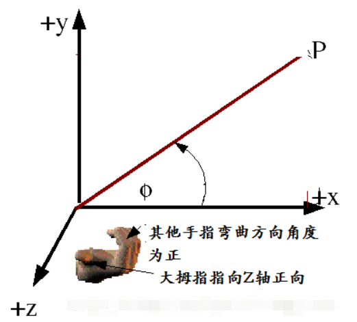
</div>

  * 在三维场景中，当一个点P(x,y,z)绕x轴旋转θθ角得到点P’(x’,y’,z’)。由于是绕x轴进行的旋转，因此x坐标保持不变，y和z组成的yoz（o是坐标原点）平面上进行的是一个二维的旋转，可以参考上图（y轴类似于二维旋转中的x轴，z轴类似于二维旋转中的y轴），于是有： 

    ​                                                   $x' =  x \\ y' = ycos\theta - zsin\theta\\z' = ysin\theta + zcons\theta$

    写成（4x4）矩阵的形式

    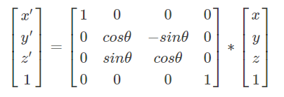

###### 绕Y轴旋转

$$
\begin{vmatrix}
\mathbf{x'} \\
\mathbf{y'}\\
\mathbf{z'}\\
\mathbf{1}	\\
\end{vmatrix}
=
\begin{vmatrix}
\mathbf{\cos\theta} & 0 & \sin\theta & 0\\
\mathbf0 & 1 & 0 & 0\\
\mathbf{-\sin\theta} & 0 & \cos\theta & 0\\
\mathbf0 & 0 & 0 & 1\\
\end{vmatrix}
*
\begin{vmatrix}
\mathbf{x} \\
\mathbf{y}\\
\mathbf{z}\\
\mathbf{1}	\\
\end{vmatrix}
$$

###### 绕Z轴旋转

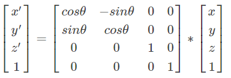

#### SDF

Ω读作：o mi ga 

In [mathematics](https://en.wikipedia.org/wiki/Mathematics) and applications, the **signed distance function** of a set *Ω* in a [metric space](https://en.wikipedia.org/wiki/Metric_space), also called the **oriented distance function**, determines the distance of a given point *x* from the [boundary](https://en.wikipedia.org/wiki/Boundary_(topology)) of *Ω*, with the sign determined by whether *x* is in *Ω*. The function has positive values at points *x* inside *Ω*, it decreases in value as *x*approaches the boundary of *Ω* where the signed distance function is zero, and it takes negative values outside of *Ω*.


#### BSDF

A bidirectional scattering distribution function (**BSDF**) controls how light reflects off a surface. ... Since**Houdini** 13, Mantra's shading model is based on BSDFs: all render engines use BSDFs and the standard final product of a Mantra shader network is a**BSDF** (although the Output VOP still accepts Cf and Of ).


#### VDB

VDB is a sparse voxel storage format. An SDF is a scalarfield (of distances to a surface) which can by stored within the VDB format, or within the dense voxel format in Houdini simply called "Volumes".

#### VEX

##### Introduction

<div align=center>
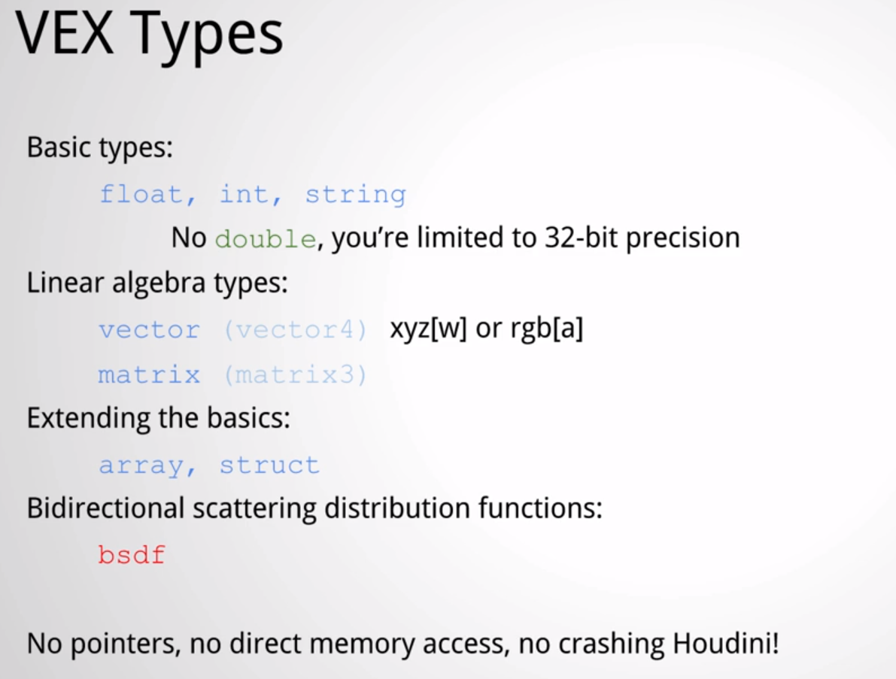
</div>
<div align=center>
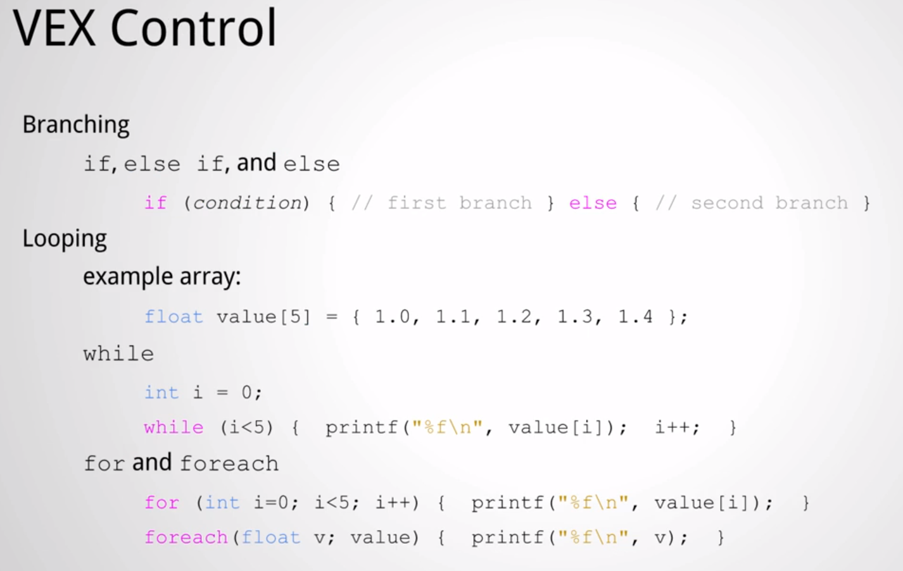
</div>
<div align=center>
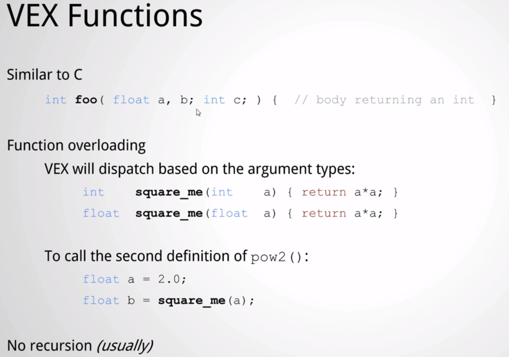
</div>
<div align=center>
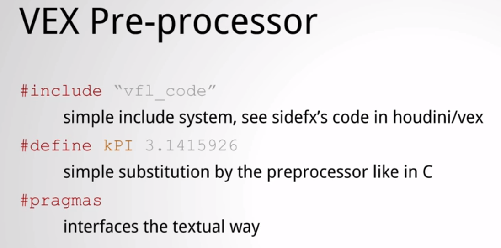
</div>

##### LAPLACIAN SMOOTHING

(拉普拉斯平滑)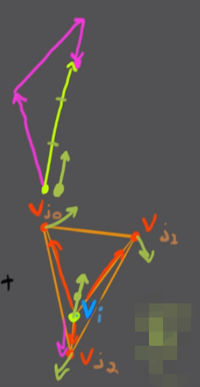

$$
\Delta vi = \sum_{j \epsilon i^*} {w_{ij} \ } (v_j - v_i)
$$

1. 括号里面的部分分别指瞄成橙色的向量

2. i*是i的邻居

3. w是加权参数

4. $$
   ① \ \Delta v_i= (v_{j0} - v_i)+(v_{j1}-v_i)+(v_{j2}-v_i)
   $$

5. $$
   ② \ \Delta _{i(new)} = \Delta V_{i(old)} \ + \ \Delta V_{i} \ \lambda
   $$

6. Lambda is just a scaling vector. control how far moving stretching, we calculating.

7. $$
   ③ \ V_i \quad += \Delta_{v_i} \, - \lambda _2
   $$

##### GoldenRatio

[https://zh.wikipedia.org/wiki/%E9%BB%84%E9%87%91%E5%88%86%E5%89%B2%E7%8E%87](https://zh.wikipedia.org/wiki/黄金分割率)

<div align=center>
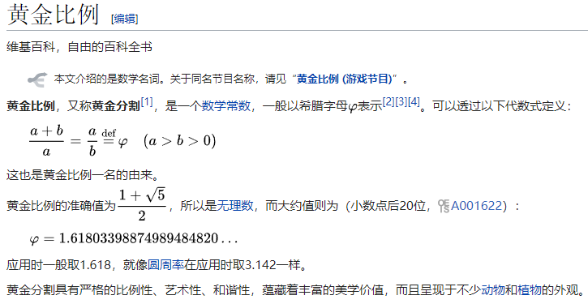
</div>
<div align=center>
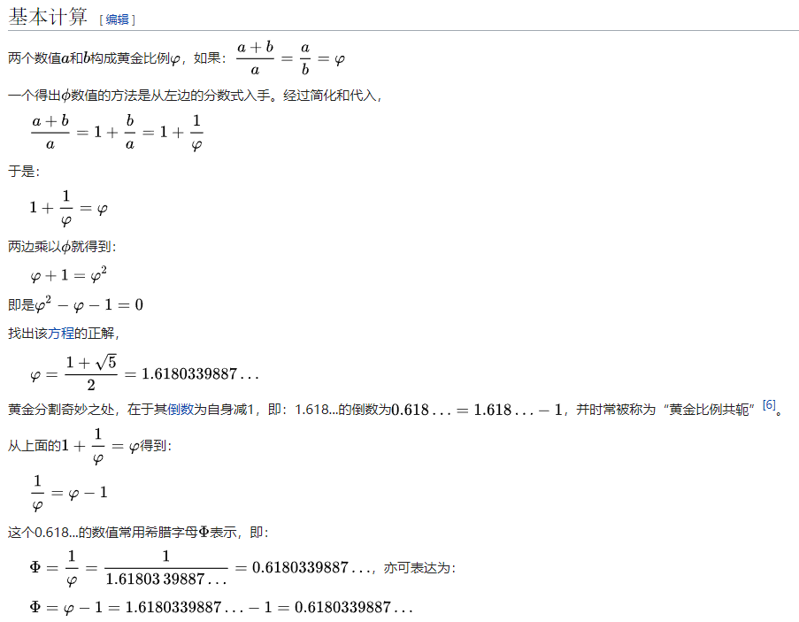
</div>
<div align=center>
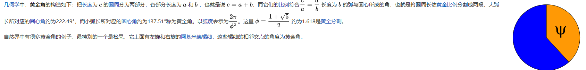
</div>
<div align=center>
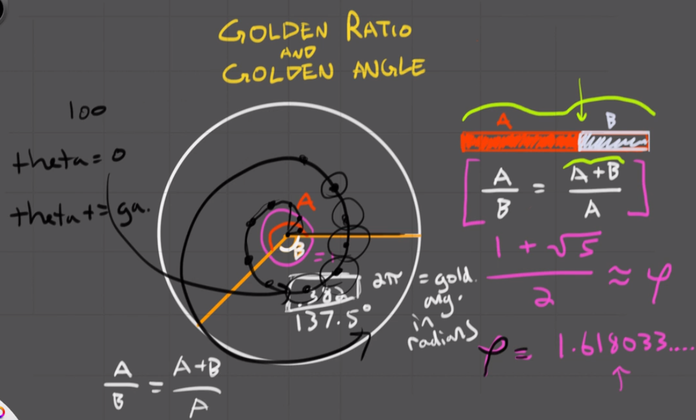
</div>


橙红色的算A，橙黄色的算B，粉红色的算全长，这个比例出来的就是黄金角，增长半径的同时，角度也增长一个黄金角度，持续这样做，就可以制作一个黄金螺旋

##### SuperFormula

**SinCosTan**

<div align=center>
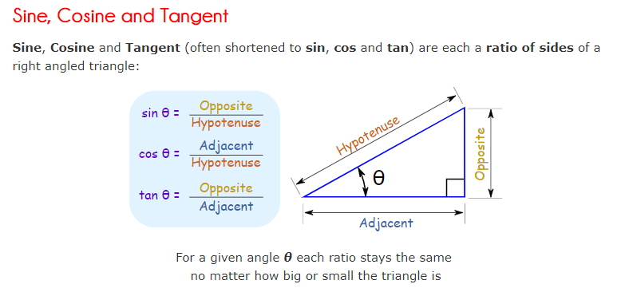
</div>

This article is about a generalization of the superellipse. For the Japanese formula racing series, see Super Formula Championship.
The superformula is a generalization of the superellipse and was proposed by Johan Gielis around 2000.[1] Gielis suggested that the formula can be used to describe many complex shapes and curves that are found in nature. Gielis has filed a patent application related to the synthesis of patterns generated by the superformula.

In polar coordinates, with $\displaystyle r$ r the radius and ${\displaystyle \varphi }$ the angle, the superformula is:


By choosing different values for the parameters ${ a,b,m_{1},m_{2},n_{1},n_{2},}$ and ${\displaystyle n_{3},}$ different shapes can be generated.

The formula was obtained by generalizing the superellipse, named and popularized by Piet Hein, a Danish mathematician.


**极坐标系**
在数学中，极坐标系（英语：Polar coordinate system）是一个二维坐标系统。该坐标系统中任意位置可由一个夹角和一段相对原点—极点的距离来表示。极坐标系的应用领域十分广泛，包括数学、物理、工程、航海、航空以及机器人领域。在两点间的关系用夹角和距离很容易表示时，极坐标系便显得尤为有用；而在平面直角坐标系中，这样的关系就只能使用三角函数来表示。对于很多类型的曲线，极坐标方程是最简单的表达形式，甚至对于某些曲线来说，只有极坐标方程能够表示。


​	在极点为O、极轴为L的极坐标系里，点（3, 60°）的径向坐标为3、角坐标为60°，点（4, 210°）的径向坐标为4、角坐标为210°。

**Superellipse**

<https://en.wikipedia.org/wiki/Superellipse>

**Sign function**

<https://en.wikipedia.org/wiki/Sign_function>

##### Noise

[**Simplex noise**](https://en.wikipedia.org/wiki/Simplex_noise) is a method for constructing an n-dimensional**noise** function comparable to Perlin **noise** ("classic" **noise**) but with fewer directional artifacts and, in higher dimensions, a lower computational overhead.

[**Perlin noise**]( https://en.wikipedia.org/wiki/Perlin_noiseis) a type of gradient **noise** developed by Ken**Perlin** in 1983 as a result of his frustration with the "machine-like" look of computer graphics at the time. He formally described his findings in a SIGGRAPH paper in 1985 called An image Synthesizer.


* Compiled .vfl file  to get HDA

  **SOP_VEXWave.vfl**

```c
/*
 * Copyright (c) 2019
 *	Side Effects Software Inc.  All rights reserved.
 *
 * Redistribution and use of Houdini Development Kit samples in source and
 * binary forms, with or without modification, are permitted provided that the
 * following conditions are met:
 * 1. Redistributions of source code must retain the above copyright notice,
 *    this list of conditions and the following disclaimer.
 * 2. The name of Side Effects Software may not be used to endorse or
 *    promote products derived from this software without specific prior
 *    written permission.
 *
 * THIS SOFTWARE IS PROVIDED BY SIDE EFFECTS SOFTWARE `AS IS' AND ANY EXPRESS
 * OR IMPLIED WARRANTIES, INCLUDING, BUT NOT LIMITED TO, THE IMPLIED WARRANTIES
 * OF MERCHANTABILITY AND FITNESS FOR A PARTICULAR PURPOSE ARE DISCLAIMED.  IN
 * NO EVENT SHALL SIDE EFFECTS SOFTWARE BE LIABLE FOR ANY DIRECT, INDIRECT,
 * INCIDENTAL, SPECIAL, EXEMPLARY, OR CONSEQUENTIAL DAMAGES (INCLUDING, BUT NOT
 * LIMITED TO, PROCUREMENT OF SUBSTITUTE GOODS OR SERVICES; LOSS OF USE, DATA,
 * OR PROFITS; OR BUSINESS INTERRUPTION) HOWEVER CAUSED AND ON ANY THEORY OF
 * LIABILITY, WHETHER IN CONTRACT, STRICT LIABILITY, OR TORT (INCLUDING
 * NEGLIGENCE OR OTHERWISE) ARISING IN ANY WAY OUT OF THE USE OF THIS SOFTWARE,
 * EVEN IF ADVISED OF THE POSSIBILITY OF SUCH DAMAGE.
 *
 *----------------------------------------------------------------------------
 */

/// This is the VEX implementation of the wave SOP.
/// @see @ref HOM/SOP_HOMWave.py, @ref HOM/SOP_HOMWaveNumpy.py, @ref HOM/SOP_HOMWaveInlinecpp.py, @ref HOM/SOP_HOMWave.C, @ref SOP/SOP_CPPWave.C
sop
vex_wave()
{
    P.y = sin(P.x * 0.2 + P.z * 0.3 + Frame * 0.03);
}

```

Command:

```
vcc -l vexwave.hda SOP_VEXWave.vfl
```


#### Pyro

> PyroShader

* **scattering phase** the light bounces uniformly in all directions, especially if you have a smooth surface , the light bounces uniformly with volumes it can bounce towards the camera or backward and away from the camera and this has the control for that, so it's a higher the value the more forward scattering ,we are going to get so more light from the back.
  
* **Shadow color** Why when you changed shadow color, but it's not pure color you set. because it's still compute other's light, if you set force light in your mantra node. you probably will get pure color your set.			
  
* Temp>color Mapping Physical (Black-Body) **Color Temp in Kelvin**:

    * That will give us a different gradent, When the value is higher, the color is more yellow, the intensity is high, and the lower is more red.

* Adaptation and Burn:

   * The adaptation is control of the drak area. if you want more contrast there. the burn is if you want more contrast here(Higher area) and the white area we may not be able to see it properly. but basically these two controls the drak values and the bright valuse.

> Render property:

  * Limit-> Volume Limit: The default is zero. So this has very little light penetration volume.


## Unreal

* Python <https://github.com/20tab/UnrealEnginePython>
