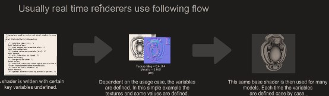
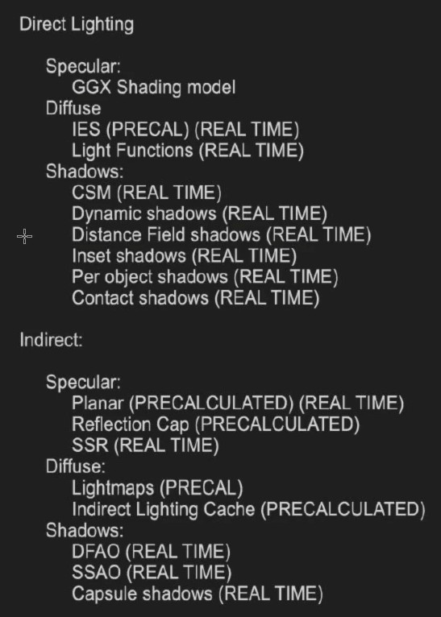
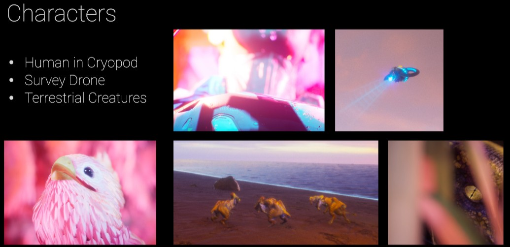

# Unreal

## VFX (Visual Effects)

### Niagara Visual Effects
*https://docs.unrealengine.com/en-US/RenderingAndGraphics/Niagara/index.html*

Unreal Engine 4's Niagara visual effects system used for creating and previewing particle effects in real time.

The Niagara VFX System is one of two tools you can use to create and adjust visual effects (VFX) inside Unreal Engine 4 (UE4). Before Niagara, the primary way to create and edit visual effects in UE4 was to use [Cascade](https://docs.unrealengine.com/en-US/RenderingAndGraphics/ParticleSystems/index.html)

#### Niagara Pages
* Niagara Editor UI Reference
  * *https://docs.unrealengine.com/en-US/RenderingAndGraphics/Niagara/EmitterEditorReference/index.html*
* Niagara System and Emitter Module Reference
  * *https://docs.unrealengine.com/en-US/RenderingAndGraphics/Niagara/EmitterReference/index.html*
* Niagara Key Concepts
  * *https://docs.unrealengine.com/en-US/RenderingAndGraphics/Niagara/NiagaraKeyConcepts/index.html*

#### Niagara Overview
*https://docs.unrealengine.com/en-US/RenderingAndGraphics/Niagara/Overview/index.html*

Niagara is Unreal Engine's next-generation VFX system

* Core Niagara Components - In the Niagara VFX system, there are four core components:
  * Systems
    * Niagara systems are containers for multiple emitters, all combined into one effect
  * Emitters
    * Niagara emitters are containers for modules. They are single purpose, but they are also re-usable. One unique thing about Niagara emitters is that you can create a simulation using the module stack, and then render that simulation multiple ways in the same emitter.
  * Modules
    * Niagara modules are the base level of Niagara VFX. Modules are the equivalent of Cascade's behaviors. Modules speak to common data, encapsulate behaviors, stack with other modules, and write functions. Modules are built using High-Level Shading Language (HLSL), but can be built visually in a Graph using nodes. You can create functions, include inputs, or write to a value or parameter map. You can even write HLSL code inline, using the `CustomHLSL` node in the Graph
  * Parameters
    * Parameters are an abstraction of data in a Niagara simulation. Parameter types are assigned to a parameter to define the data that parameter represents. There are four types of parameters:
      1. Primitive: This type of parameter defines numeric data of varying precision and channel widths.
      2. Enum: This type of parameter defines a fixed set of named values, and assumes one of the named values.
      3. Struct: This type of parameter defines a combined set of Primitive and Enum types.
      4. Data Interfaces: This type of parameter defines functions that provide data from external data sources. This can be data from other parts of UE4, or data from an outside application.

* Niagara Stack Model and Stack Groups
  * Particle simulation in Niagara operates as a stack—simulation flows from the top of the stack to the bottom, executing programmable code blocks called modules in order. Crucially, every module is assigned to a group that describes when the module is executed

* Templates and Wizards
  * When you first create a Niagara emitter or Niagara system, a dialog displays offering several options for what kind of emitter or system you want to create. One of these options is to choose a template. These templates are based on some common base effects, and include various modules already. You can change any of the parameters in the template. You can add, modify or delete any of the modules. In a system template, you can also add, modify or delete any of the emitters. Templates are just there to jumpstart your creativity and give you something that you can work with immediately. 

* System Wizard
  * New system from selected emitters
    * a list of available emitters displays. This list includes both existing emitters in your project and template emitters.
  * New system from template
    * you can choose from a list of templates that represent several commonly used effect systems. 

* Niagara VFX Workflow
  * Create Emitters
  * Create Systems
  * Create a Module 

#### Events and Event Handlers Overview
*https://docs.unrealengine.com/en-US/RenderingAndGraphics/Niagara/EventHandlerOverview/index.html*

In many cases, you will want several emitters in one system to interact with each other to create the effect you want. This usually means that one emitter generates some data, and then other emitters listen for that data, and perform some behavior in reaction to that data. In Niagara, this is done using Events and Event Handlers. Events are the modules that generate specific events that occur in the lifetime of a particle. Event Handlers are modules that listen for those generated events, and then initiate a behavior in response to that event.

* Note
  * In order to use events, make sure to enable `Requires Persistent IDs` in the `Emitter Properties` of your emitters.

#### Niagara Quick Start
* [Enable the Niagara Plugin](https://docs.unrealengine.com/en-US/RenderingAndGraphics/Niagara/HowTo/EnableNiagara/index.html)

* Create a Mesh Shape

* Create a Material
  * Material `'/Game/Resource/VFX/Niagara/PuffOfDust_a/Materials/M_DustPoof'`

* Create the Effect
  * Create System and Emitter
    1. right-clicking in the `Content Browser` from the displayed menu select `FX > Niagara System`
    2. Select `New system from selected emitters`. Then click `Next`.
    3. Under Template, select `Simple Sprite Burst`. Click the `Plus sign` icon `(+)` to add the emitter to the list of emitters to add to the system. Then click `Finish`.
    4. Click the name of the emitter instance in the System Overview, and the field will become editable. Name the emitter `FX_DustPoof`.
  * See Mesh Render: `Niagara Detail Pane -> FX_DustPoof -> Render -> [1.Delete Sprite Renderer 2. Added Mesh Renderer]`

  * For more: ---> `https://docs.unrealengine.com/en-US/RenderingAndGraphics/Niagara/QuickStart/index.html` and NiagaraSystem `'/Game/Resource/VFX/Niagara/PuffOfDust_a/FX_FootstepDustPoof'`

* Edit the Module Settings
  * Emitter Update Settings
  * Particle Spawn Settings
  * Particle Update Settings

* Attach the Niagara Effect to a Character
  * On the Animation of Character pane -> Notify Track [Right Click] ->  `Add Notify` > `Play Niagara Particle Effect`

* End of Result
  * 

* Note
  1. Niagara emitters and systems are independent

#### Create a Ribbon Effect in Niagara
*https://docs.unrealengine.com/en-US/RenderingAndGraphics/Niagara/HowTo/RibbonEffect/index.html*

* Create System and Emitter
  1. Content Browser -> `FX > Niagara System`
  2. Select `New system from selected emitters`
  3. Under `Templates`, select `Simple Sprite Burst`
  4. NiagaraSystem `'/Game/Resource/VFX/Niagara/Ribbon_a/NS_RibbonSystem'`

* End Result
  * 

#### How to Create a Mesh Particle Effect in Niagara
*https://docs.unrealengine.com/en-US/RenderingAndGraphics/Niagara/HowTo/MeshEffect/index.html*

* Create a Material
  * Material `'/Game/Resource/VFX/Niagara/DemoMeshParticle_a/M_Balloon.M_Balloon'`
  * 

* Create the System and Emitter
  1. Content Browser -> `FX > Niagara System`
  2. Select `New system from selected emitters`
  3. Under `Templates`, select `Fountain`
  4. NiagaraSystem `'/Game/Resource/VFX/Niagara/DemoMeshParticle_a/NS_MeshSystem'`

* End Result
  * 

* Note
  1. Niagara Emitter Update [Emitter State] {Self `System`}: This enables your system to calculate the lifecycle settings, which usually optimizes performance.

#### How to Create a Sprite Particle Effect in Niagara
*https://docs.unrealengine.com/en-US/RenderingAndGraphics/Niagara/HowTo/SpriteEffect/index.html*

NiagaraSystem `'/Game/Resource/Niagara/SpriteParticle_a/NS_SmokeSystem'`

* End Result
  * 

#### Create a GPU Sprite Effect
*https://docs.unrealengine.com/en-US/RenderingAndGraphics/Niagara/HowTo/GPUParticles/index.html*

NiagaraSystem `'/Game/Resource/Niagara/GPUSprite_a/NS_GPUSprite'`

* End Result
  * 

* Note
  * Sim Target Change to `GPUCompute Sim` Warning: You may trigger a warning about the Fixed Bounds not being set. Click the box for Fixed Bounds. This will resolve the error. Leave the Minimum and Maximum set to the default values.

#### How to Create a Particle Light
*https://docs.unrealengine.com/en-US/RenderingAndGraphics/Niagara/HowTo/ParticleLights/index.html*

NiagaraSystem `'/Game/Resource/Niagara/ParticleLight_a/NS_ParticleLight'`

* End Result
  * 

#### Recreate the Starter Content Smoke Effect in Niagara
*https://docs.unrealengine.com/en-US/RenderingAndGraphics/Niagara/HowTo/RecreateSmoke/index.html*

NiagaraSystem `'/Game/Resource/Niagara/SpriteParticle_a/NS_DarkSmoke'`

* End Result
  * 

#### Recreate the Starter Content Steam Effect in Niagara
*https://docs.unrealengine.com/en-US/RenderingAndGraphics/Niagara/HowTo/RecreateSteam/index.html*


## Follow the documentation and research

### Pixel Streaming
*https://docs.unrealengine.com/en-US/SharingAndReleasing/PixelStreaming/index.html*

Run your Unreal Engine application on a server in the cloud, and stream its rendered frames and audio to browsers and mobile devices over WebRTC.

With Pixel Streaming, you run a packaged Unreal Engine application on a desktop PC or a server in the cloud, along with a small stack of web services that are included with the Unreal Engine. People connect using any modern Web browser on their platform of choice, whether desktop or mobile, and stream the rendered frames and audio from the Unreal Engine application. There's no need for users to install or download anything. It's just like streaming a video from YouTube or Netflix — except that users can also interact with the application using keyboard, mouse, touch input, and even custom HTML5 UI that you create in your player Web page.

#### Pixel Streaming Overview

<div align=center>

</div>

1. Instead of playing back a pre-recorded video clip, the stream is playing back the rendered frames and audio generated by the Unreal Engine in real time.

2. Users can control the experience from their browsers, sending keyboard, mouse, and touch events, plus custom events emitted from the player Web page, back to the Unreal Engine.

##### Benefits
1. Pixel Streaming uses the WebRTC peer-to-peer communication framework for the lowest possible latency between the user and the Unreal Engine application.
2. You can support multiple platforms without creating and distributing multiple separate packages. 
3. The user doesn't need to download large executables or content files in advance, and doesn't need to install anything. 
4. It makes mobile devices and lightweight Web browsers capable of displaying better quality graphics than otherwise possible.
5. The Pixel Streaming system contains a minimal number of components that are relatively easy for anyone to set up inside a local network. 

##### Architecture
<div align=center>

</div>

##### Components
1. `Pixel Streaming Plugin` - This Plugin runs inside the Unreal Engine. It encodes the final results of every rendered frame using H.264 video compression, packs those video frames along with the game audio into a media stream, and sends that stream to one or more connected browsers over direct peer-to-peer connections.

2. `Signaling and Web Server` - The Signaling and Web Server is responsible for negotiating connections between browsers and the Pixel Streaming Plugin and for providing browsers with the HTML and JavaScript environment that plays back the media stream.

##### Connection Process
1. When you start up all the Pixel Streaming components, the Pixel Streaming Plugin running inside the Unreal Engine first establishes a connection to the Signaling and Web Server.
2. A client connects to the signaling server, which serves it an HTML page that contains a player widget and control code written in JavaScript.
3. When the user starts the stream, the signaling server negotiates the establishment of a direct connection between the client browser and the Unreal Engine application.
4. As soon as the connection between the client and the Unreal Engine application is established, the Pixel Streaming Plugin starts streaming media directly to the browser. Input from the client is sent by the player page's JavaScript environment directly back to the Unreal Engine application.
5. The Signaling and Web Server maintains its connection to the browser and to the Unreal Engine application even after the media stream starts playing, so that it has the ability to kick users out of the stream if needed, and to handle disconnections initiated by the browser.

* NOTE
  1. In order for this connection to work, the browser and the Unreal Engine application need to know each other's IP address. If both are running on the same network, they are typically visible to each other directly at their own IP addresses. However, network address translation (NAT) services running between the two endpoints may change the externally visible IP address of either party. Resolving this usually involves the use of a STUN or TURN server, which tells each component what its externally visible IP address is. For details, see the Hosting and Networking Guide .

#### Pixel Streaming Reference
*https://docs.unrealengine.com/en-US/SharingAndReleasing/PixelStreaming/PixelStreamingReference/index.html*

#### Hosting and Networking Guide
*https://docs.unrealengine.com/en-US/SharingAndReleasing/PixelStreaming/Hosting/index.html*

Advanced networking configuration and other considerations for hosting the Pixel Streaming system.

#### Pixel Streaming Demo
* Getting Started
  1. Find the `Pixel Streaming` showcase on the Learn tab of the Epic Games Launcher, and use it to start a new Unreal Engine Project.
  2. In Windows Explorer, browse to the location of the Project on your computer, and find the `WebInterface` folder. 
  3. Copy the contents of this folder to the `Engine/Source/Programs/PixelStreaming/WebServers/SignallingAndWebServer/custom_html` folder under your Unreal Engine installation folder. If that custom_html folder doesn't yet exist, create it first.   e.g. for me it's `\Epic Games\UE_4.26\Engine\Source\Programs\PixelStreaming\WebServers\SignallingWebServer\custom_html`
  4. Open the `YOUR_PROJECT.uproject` file in the Unreal Editor.
  5. Enable `Pixel Streaming` plugin
  6. Back in the Unreal Editor, choose `Edit > Project Settings` from the main menu. 
  7. If your Project involves a character, and you want to enable input from touch devices such as phones and tablets to move that character around the Level, you may want to show the on-screen touch controllers. Under the `Engine > Input category -> Mobile`, find and enable the `Always Show Touch Interface` setting. [This is optional, and not required for all Projects. However, for Projects like the Third-Person Template, this makes sure that users with touch devices can control the streamed application (as long as the Project's Player Controller supports touch input).]
  8. `Edit > Editor Preferences` Under the `Level Editor > Play category`, find the `Additional Launch Parameters` setting, and set its value to `-AudioMixer -PixelStreamingIP=localhost -PixelStreamingPort=8888`
  9. Package your Project for Windows. From the main menu in the Unreal Editor, choose `Files > Package Project > Windows > Windows (64-bit)` or Run you game with `Standalone Game`
  10. 1. If you packaged you game, just add follow parameters `-AudioMixer -PixelStreamingIP=localhost -PixelStreamingPort=8888 ` at the end of the Target field of `YOUR_PROJECT.exe` or `Shortcut`
  11. Run `"\Epic Games\UE_4.26\Engine\Source\Programs\PixelStreaming\WebServers\SignallingWebServer\run.bat"`
  12. navigate to `http://127.0.0.1`
  13. Open a Web browser, and navigate to the `PixelDemo.htm` player page being hosted by your Signaling and Web Server. For example: `http://<your-server-ip-address>/PixelDemo.htm

##### Understanding the Custom UI Events
The custom HTML player page, `PixelDemo.htm`, uses the `scripts/app.js` file provided with the Pixel Streaming Signaling and Web Server to capture mouse, keyboard, and touch events and relay them back to the Unreal Engine application. In addition, it relies on its own custom `PixelDemo.js` file for some additional functionality.

Most of the UI elements in the player page are implemented by calling the `emitUIInteraction()` function to pass different information back to the Unreal Engine application. To understand how any piece of the UI works under the hood:

#### Getting Started with Pixel Streaming
*https://docs.unrealengine.com/en-US/SharingAndReleasing/PixelStreaming/PixelStreamingIntro/index.html*


## Discovery Indie Film

### Action record

* HDRIBackdrop
  * `Plugins -> HDRIBackdrop`
  * `Place Actors -> HDRIBackdrop`

* Foliage
  * `Editor Preferences -> Foliage -> Procedural Foliage`

## Unreal Online Learning

### 使用Quxiel创建逼真动画

#### 场景构图
rule of thirds

<div align=center>

</div>

* 自定义的自动地形材质
  * 在雕刻地形时，自动生成对应的纹理效果
* Alpha笔刷雕刻地形
* 假人+摄像机 观察
* 背景的巨大山脉

### 给开发者的虚幻引擎入门指南

#### 世界构建入门

_images/artistic/World_Building_poster_18x24.pdf

BSP 二进制空间分区 (CSG)

<div align=center>

</div>

制作流程 

<div align=center>

</div>

Engine Editor

<div align=center>

</div>


* PLACEABLE ACTORS EXCLUDING 3D
* PLACEABLE 3D MESH ACTORS
* 3D TOOLS
* CONTROLS THE LEVEL
* REBUILDING
* PERFORMANCE

#### 渲染入门

_images/artistic/Rendering_poster_18x24.pdf

<div align=center>

</div>

* VISIBILITY
* BASEPASS - STATIC LIGHTING / SHADOWS
* DYNAMIC LIGHTING / SHADOWS
* REFLECTIONS
* ADDITIONAL
* POST PROCESSING
* PERFORMANCE - SCALABILITY EXAMPLE

#### 动画入门

[Animation_poster_18x24.pdf](https://raw.githubusercontent.com/aaronmack/image-hosting/master/resources/pdf/Animation_poster_18x24.pdf)

<div align=center>

</div>

* SEQUENCES
* PROCEDURAL NODES
* FLOW CONTROL NODES
* GAMEPLAY FRAMEWORK
* PERFORMANCE

#### 引擎架构入门

_images/artistic/Engine_Structure_poster_18x24.pdf

<div align=center>

</div>

* CONFIG FILES
* SOURCE CODE
* ASSET LOADING
* ENGINE AND PROJECT FOLDERS
* TOOLS
* ASSETS

#### 编程入门

_images/artistic/Programming_poster_18x24.pdf

<div align=center>

</div>

* REPLICATION
* MEMORY
* GAMEPLAY FRAMEWORK
* BASE TYPES
* PROFILING AND DEBUGGING

#### 蓝图入门

_images/artistic/Blueprint_poster_18x24.pdf

<div align=center>

</div>

* ENGINE AND PROJECT FOLDERS
* OPTIONAL DATA FEATURES
* ADDITIONAL FEATURES
* CORE FEATURES OF BP
* PARTS OF THE ENGINE USING BP
* PERFORMANCE AND DEBUGGING TOOLS
* BLUEPRINT COMMUNICATION

#### 角色入门

_images/artistic/Character_poster_18x24.pdf

<div align=center>

</div>

* BEHAVIOR TREE
* INPUT
* CAMERA
* GAMEPLAY FRAMEWORK
* NAV MESH
* REPLICATION

#### 材质入门

_images/artistic/Materials_poster_18x24.pdf

<div align=center>

</div>

* TEXTURES
* CORE AUTHORING TOOLS
* WORKFLOW AND COLLABORATION TOOLS
* PERFORMANCE

* Advice

<div align=center>

</div>

<div align=center>

</div>

### AEC蓝图案例课程

* It's done. see https://github.com/aaronmack/demo-unreal

Map: demo-unreal\UnrealBasal\Content\FirstPersonBP\Maps\FirstPersonExampleMap

### Datasmith入门

* Note:
1. if there has similar object in the scene and it‘s will be a instance by Unreal Engine except light
2. User Data: must be `key = Value` not `Key =Value`
3. there are an old-scene and a new-scene in the current scene if you reimported again

* Update deleted actors & Reimported all updated scene objects `Options`

<div align=center>

</div>

### * 虚幻引擎和Oculus的VR开发

* Projects
  * `OculusVRDartsGame`

* Sharing project
  * createw a new folder: e.g. C:\Darts
  * Right-Clicked -> Propeties -> Sharing -> Advanced Sharing -> [[check □ Share this foler], Permissions [Allow All]]

* Project Setting
  * create BlueprintClass [base on GameMode and PlayerController] to `GameMode_Darts` and `PlayerController_Darts`
  * go to inside `GameMode_Darts` -> ClassDefaults -> Classes -> change `Replay Sepctator Player Controller` to `PlayerController_Darts`
  * Edit -> Project Settings -> Project -> Maps & Modes -> Default Modes -> Default GameMode -> `GameMode_Darts` and PlayerControllerClass -> `PlayerController_Darts`

* Oculus Entitlement 
  * `PlayerController_Darts` -> Verify Entitlement and Will specifically look for the AppID within the `DefaultEngine.ini` file

* Glossary
  * GameMode
    * Specify all low-level blueprint for the maps we use
    * Contains various rules for our game
  * Game State
    * Keeps track of properties that change during gameplay
    * Keeps track of the Oculus ID of the player in our game
  * Player State
    * Oversees holding any data relevant to us
    * Accessible by anyone
    * Includes: [Player's score, the color of our hands, Our name]
  * Structure
    * Structure is a variable that contains one or more other variables
  * Inheritance
    * All the Blueprint classes we can create are inheriting from their parent class
    * All Blueprint we create has a parent that has already been created with some amount of code or Blueprint in them.
  * Object
    * The lowest or most basic class you can use in Blueprint
  * Actor
    * Standard Blueprint we use to create objects for our games
    * Contains code that enables us to place it into out maps and generally do things
  * Arrow Component
    * Used to help us spawn our pawn into the map exactly where we went to and facing the direction that we want it to
  * Instance Editable
    * Allows each individual instance to have different settings applied

**To be continued**

### 插件创建和使用最佳实践

* Plugins for VS
  * UnrealVS
  * VAssistX
* Project Structure
  * Directories
    * Binaries
      * Compiled game libraries & debug databases
    * Config
      * Default configuration files
    * Content
      * Content asset packages
    * Intermediate
      * Temporary files
    * Saved
      * Runtime configuration files & log files
    * Source
      * C++ source code
  * Files
    * {ProjectName}.uproject
      * Project descriptor file
    * {ProjectName}.sln
      * Visual Studio solution file
    * {ProjectName}.Target.cs
      * Build target configuration (Game)
    * {ProjectName}.Editor.Target.cs
      * Build target configuration (Editor)
    * {ProjectName}.Build.cs
      * Build rules & configuration
    * {ProjectName}.cpp / .h
      * Main project module implementation

* Code Structure
  * Header file
    * .ini
      * in-line header files, that are just included as implementations in headers
  * Public
  * Private
  * Classes
    * legcy

* Engine Structure
  * Development
    * For any application, but used during development only
  * Editor
    * For use in Unreal Editor only
  * Runtime
    * For any application at any time
  * ThirdParty
    * Code and libraries from external third parties
  
* Note
  * The UE4 EULA prohibits inclusion of Editor modules in shipping games and apps

* Asset Types Overview [Common Tasks]

<div align=center>

</div>

```c++
#include "CoreMinimal.h"
#include "UObject/Object.h"
#include "UObject/ObjectMacros.h"
#include "TextAsset.generated.h"

/**
 * Implements an asset that can be used to store arbitrary text, such as notes
 * or documentation.
 */
UCLASS(BlueprintType, hidecategories=(Object))
class TEXTASSET_API UTextAsset
	: public UObject
{
	GENERATED_BODY()

public:

	/** Holds the stored text. */
	UPROPERTY(BlueprintReadOnly, EditAnywhere, Category="TextAsset")
	FText Text;
};

```

1. `#include "TextAsset.generated.h"` and `UCLASS()`  and `UPROPERTY`: The UCLASS macro it tells Unreal the `UnrealBuildTool` that this class is a UObject-based class that needs to be parsed and the `UHT` will actually parse all the header files and look for these macros `[UCLASS, UPROPERTY]` and if they are present, it will automatically generate all of the glue code that is required to provide things like `serialization` and `garbage collection` and `runtime introspection` etc. All generated into a file that ends in `"generated.h"`

* Asset Factories

<div align=center>

</div>

1. The features such as the context menu drag and drop and automatic reimport that is all handled via asset factory classes

* Asset Actions

<div align=center>

</div>

```c++
class FTextAssetActions
	: public FAssetTypeActions_Base
{
public:
  // Which tells the Editor that this asset action implementation is meant
  // to be used for the UTextAsset class and you have to implement this
  // otherwise the Editor will not know which type of asset to customize
  virtual UClass* GetSupportedClass() const override;
}

...

UClass* FTextAssetActions::GetSupportedClass() const
{
	return UTextAsset::StaticClass();
}

...

void FTextAssetActions::GetActions(const TArray<UObject*>& InObjects, FMenuBuilder& MenuBuilder)
{
	FAssetTypeActions_Base::GetActions(InObjects, MenuBuilder);

  // `GetTypedWeakObjectPtrs` that is a trick that I use to ensure that we are not holding on to object pointers that might
  // go away, new objects are actually garbage collected and it means that if we are holding on to a raw c++ pointer to 
  // those kind of objects, it's possible that the garbage collector deletes and destroys those objects, so our pointer
  // might actually be pointing to invalid memory and we would crash if we tried to do reference that pointer, so these weak
  // pointers have the ablility to automatically reset themselves when the garbage collecter decides to destroy the reference 
  // object
	auto TextAssets = GetTypedWeakObjectPtrs<UTextAsset>(InObjects);
  ...
}

```

1. if `HasActions` return ture and will call `GetActions` function

* Anatomy of Modules

```c#
// Copyright 1998-2017 Epic Games, Inc. All Rights Reserved.
namespace UnrealBuildTool.Rules
{
	public class TextAsset : ModuleRules
	{
		public TextAsset(ReadOnlyTargetRules Target) : base(Target)
		{
			PCHUsage = PCHUsageMode.UseExplicitOrSharedPCHs;

			PublicDependencyModuleNames.AddRange(
				new string[] {
					"Core",
					"CoreUObject",
				});

			PrivateIncludePaths.AddRange(
				new string[] {
					"Runtime/TextAsset/Private",
				});
		}
	}
}

...

		PrivateIncludePaths.AddRange(
			new string[] {
				"TextAssetEditor/Private",
				"TextAssetEditor/Private/AssetTools",
				"TextAssetEditor/Private/Factories",
				"TextAssetEditor/Private/Shared",
				"TextAssetEditor/Private/Styles",
				"TextAssetEditor/Private/Toolkits",
				"TextAssetEditor/Private/Widgets",
			});

```

1. The private dependencies are only used when compiling you module itself and the public dependencies they will also be re-exported to other modules that depend on your module, if there is a third module that wishes to use functionaily in your module then this third module also needs to pull in "Core" and "CoreUObject", because the types that you made public and that you exported from your module they depend on other types that are declared in those other modules.
2. The `PrivateIncludePaths` is yet another collection of strings that specity the subdirectories underneath your modules's Private directory, for private you have to at least for the time being manually specify which subdirectories exist underneath it.
3. If your module has public directories and this public directory contains subfolders then our build tool will automatically enumerate those public directories and include them for dependencies that other modules have

```c++
	/** Registers asset tool actions. */
	void RegisterAssetTools()
	{
		IAssetTools& AssetTools = FModuleManager::LoadModuleChecked<FAssetToolsModule>("AssetTools").Get();

		RegisterAssetTypeAction(AssetTools, MakeShareable(new FTextAssetActions(Style.ToSharedRef())));
	}
```

1. load the "AssetTools" module, that is the module maintains a registry of all the asset tools that are known to the editor
then tell the module we wish to add our own action of type "FTextAssetActions"

* Asset Thumbnails

<div align=center>

</div>

* Slate
  * Slte UI Library
    * Written entirely in C++
    * Platform agnostic (works on mobile and consoles too)
    * SlateCore module = low-level functionality
    * Slate module = library of UI widgets
    * Does not require Engine or Editor modules
  * Current USe Cases
    * Unreal Editor
    * Standalone desktop applications
    * Mobile applications
    * In-game UI

<div align=center>

</div>

<div align=center>

</div>

<div align=center>

</div>

<div align=center>

</div>

* Widget Reflector

1. Unreal Editor -> Window -> Developer Tools -> Widget Reflector

* Custom Asset Editors

```c++
// TextAssetEditor/Private/AssetTools/TextAssetActions.cpp
void FTextAssetActions::OpenAssetEditor(const TArray<UObject*>& InObjects, TSharedPtr<IToolkitHost> EditWithinLevelEditor)
{
	EToolkitMode::Type Mode = EditWithinLevelEditor.IsValid()
		? EToolkitMode::WorldCentric
		: EToolkitMode::Standalone;

	for (auto ObjIt = InObjects.CreateConstIterator(); ObjIt; ++ObjIt)
	{
		auto TextAsset = Cast<UTextAsset>(*ObjIt);

		if (TextAsset != nullptr)
		{
			TSharedRef<FTextAssetEditorToolkit> EditorToolkit = MakeShareable(new FTextAssetEditorToolkit(Style));
			EditorToolkit->Initialize(TextAsset, Mode, EditWithinLevelEditor);
		}
	}
}
```

1. The code here refers to it as "Toolkit", that because Toolkit is the internal name for Asset Editors, those two names "Asset Editor" and "Toolkit" they are interchangeable
2. `FAssetEditorToolkit` which is the base class for all Asset Editors

### 实时渲染基础 - Sjoerd

* Real-Time Rendering Fundamentals
  * A mix of solutions
    * Real-time rendering is acomplex and demanding
    * Thus we try to offload what we can to precalculated steps
    * Plus we often need a patchwork of different solutions to overcome a challenge
  * Scalability
    * Real-time rendering allows and requires for changing graphical qulity at any time
    * It allows content to scale itself to run on many different kind of devices
    * This scalability is deeply interwoven in the engine and tools
    * R. commands are an example
    * Maintaining good performance is a combination of mastering the scalability settings, and correctly anthoring the content
  * Two ways of rendering
    * Deferred Rendering and Forward Rendering
    * Unreal Engine 4 is Deferred by default but can also do Forward
    * Deferred works best for the majority of content
    * Deferred gives stable and better performance for more demanding applications
    * Forward gives faster performance for simpler uses or when the hardware is limited (mobile VR)
    * Deferred supports more rendering features
    * MSAA is Forwared gives better anti-aliasing
    * Most documentation, tutorials and other content will be based on deferred rendering
  * GBuffer
    * A deferred renderer will use a GBuffer - a set of images for each frame
    * These images contain all the infomation required for the later stages of the render process essentially real-time compositing 
    * This happens entirely in the background, but understanding what it is gives perspective on why real-time rendering is good or not so good at some things
  * Pixel and Vertex Shaders
    * During rendering often fairly simple calculations must be repeated a huge number of times
    * This is slow to process on regular processors so hardware and software dedicated to this was introduced
    * The various types of shaders are essentially small calculations run again and again on a dedicated part of the GPU architecture
    * Are the very heart of how we render in real-time and have a significant impact on how we render and where performance is lost
    * An input value is taken, for example the current color of a pixel, a calculation is applied, and a new value is output
    * Pixel shaders work per pixel, vertex shaders per vectex of the model
    * All real-time lighting, shading, the rendering of the materials, fog, post process effects and a great many things more are Pixel Shaders
  * Real-Time Rendering Perfoemance
    * Target frane rate and MS
    * Frame time and GPU/CPU
    * Profiling basics
    * The 4 most common performance issues
      * Intro to draw calls
      * Pixel/Vertex Shader impact
      * Intro translucency rendering
      * Shadows
  * Frame time is in milliseconds (ms)
    * 1000 ms per second
    * So 30 frames per second equals 1000/30 = 33.3 ms per frame
    * Frame time is a better way of measuring performance
  * CPU (Game)
    * Animation
    * Physics
    * Collision
    * AI
    * Spawning/Destroying
    * **Anthing that alters the position/rotation of something**
  * GPU
    * Lighting
    * Rendering of models
    * Reflections
    * Shaders
    * **Anything that relates to rendering**

* Notices
  * TAA (Temporal AA): causes some ghosting
  * Translucency is expensive because it requires recalculation of pixels for each additional layer
  * Complex expensive materials the bigger the impact of that complex material will be on performance Again
  * Draw calls: Rendering object by objects, It doesn't depend on the complexity of the model, but on the number of individual models
  * it's very expensive for Dynamic shadows, in fact. dynamic shadows get heavier the higher the polygon count of the environment is.

* Uses
  * commands  `~`
    * r.
      * r.shadowquality
    * t.
      * t.maxfps 600    # Remove the frame rate limit
    * stat
      * stat fps        # display frame and ms
      * stat unit
      * stat rhi
      * stat scenerendering
  * RenderDoc

* Real-TimeRendering in UE4
  * find a perfect balance way to the Quality, Performance and Features

<div align=center>

</div>

* Deferred vs Forward

<div align=center>

</div>

<div align=center>

</div>

#### Before Rendering and Occlusion

<div align=center>

</div>

* Frame 0 - Time 0 - CPU
  * Calculate all logic and transforms

1. Animations
2. Positions of models and objects
3. Physics
4. AI
5. Spawn and destory, Hide and Unhide

* Frame 0 - Time 0 - CPU
  * Result: UE4 now knows all transforms of all models

* Frame 1 - Time 33 ms - Draw Thread (mostly CPU)
  * Before we can use the transforms to render the image we need to know what to include in the rendering
  * This is mostly run on the CPU but some parts sre GPU handled
  * Occlision process - Builds up a list of all visible models/objects Happens per object - Not per polygon
  * 4 Stage process - in order of execution
    * Distance Culling
      * Distance culling removes any object further than X from the camera.
      * Where: Actors -> Detail -> Rederning -> LOD -> Min Draw Distance & Desired Max Draw Distance
      * Note: by default it's desabled
    * Frustum Culling
      * Frustum culling checks what is in front of the camera
      * Note: it's enabled eveytime
      * 
    * Precomputed Visibility
      * Where: 1. World Settings -> Precomputed Visibility 2. Create `Precomputed Visibility Volume`
      * Visabale: Viewport -> Show > Visualize -> Precomputed Visibility Cells
    * Occlusion Culling
      * Occlusion Cullubg accurately checks the visibility state on every model. This is heavy, Use `Freezerendering` to visualize this and `unfreezerendering`, state initviews shows the costs, 10000+ objects to check begins having an impact

* Before Rendering - Occlusion Performance Implications
  * Set up distance culling
  * More than 10-15K objects can have an impack
  * Mostly CPU bound, but some GPU impact
  * Large open environments don't occlude well
  * Even things like particles occlude
  * Large model will rarely occlude and thus increase GPU
  * But combining models to large models will lower the GPU

#### Geometry Rendering

* Frame 2 - Time 66 ms - GPU - Prepass/Early Z Pass
  * The GPU now has list of models and transforms but if we'd just render this into out we would cause a lot of redundant pixel rendering
  * Thus we need to figure out which models will be displayed where in advance
  * Setting: Project Settings -> Rendering -> Optimizations -> Early Z Pass
  *   
 

* Geometry Rendering - Drawcalls
  * The GPU now starts to render. It renders drawcall per drawall A Group of polygons sharing the same properties is a drawcall. 
  * Render order for opaque meshed is done by sorting them by the materials used to prevent expensive shader changes on the hardware.
  * Measure with `stat RHI`
  * 2000-3000 is reasonable
  * More than 5000 is getting high
  * More than 10000 is probably a problem
  * On mobile this number is far lower (few hundred max)
  * Different with the light if enabled
  * Drawcalls have a huge impact on performance
  * Each time the renderer is done it needs to receive commands from the render thread which adds overhead
  * Drawcalls have a much bigger impact than polycount in many scenarios
  * 
  * Compare: Imaging copying 1 single 1 GB file vs Copying 1 million 1 KB file (1 GB)

* Geometry Rendering - Drawcalls Performance Implications
  * The cost to rendering many polygons is often lower than the drawcall expense
  * 50000 triangles can run worse than 20 million dependent in implementation
  * Drawcalls have a base expense thus optimizing low poly to super low poly many make zero difference
  * Components = drawcalls too
  * Components occlude one by one, and render one nby one
  * Merging into a single actor makes no different usually for rendering
  * To lower the drawcalls it is better to use fewer large models than many small ones
  * You cannot do that too much however, it impacts everything else negatively
    * Worse for occlision
    * Worse for lightmapping
    * Worse for collision calculation
    * Worse for memory
  * A common technique is Modular Meshes
    * a. Saved work time and memory
    * b. Improves lighting, occlusion, collision, loading
    * c. Increases drawcalls however
  * Using a modular mesh workflow you can always merge meshes later on if needed and if the content is near final
  * Use the Statistics and stat commands to find the best candidates for merging
  * Once merged, you cannot easily go back, Only do this at the end
  * If you merge meshes following rules make better candidates
    1. The more common a mesh AND the lower poly the better
    2. Merge only meshes within the same area
    3. Merge only meshes sharing the same material
    4. Meshes with no or simple collision are better for merging
    5. Smaller meshes or meshes receiving only dynamic are better candidates
    6. Distant geometry is usually great to merge
  * How much to merge and exactly how to is greatly dependent on many factors
  * Often there is no need merge anything, The majority of content knows no or little merging
  * On very low hardware you might merge almost everything
  * As with everything a balance between all extremes is usually the best way forward.
  * Some modular content, some merged content, and some unique models
  * You can also do instanced Rendering
    1. Automatically groups models together into single drawcalls
    2. Not enabled standard because it gives overhead
  * Instance in memory not in instance in Rendering
  * And finally there is Loading - Level Of Detail  
    1. Simplifies a model or bunch of models in given conditions
    2. Usually means a model becomes lower poly in the distance
    3. Essentially swaps one model for another simpler model
    4. HLOD is a bigger version, it groups models together in the distance to lower the drawcalls
  
* Vertex Shaders
  * There are different types of shaders
  * A shader performs calculations on its input variables
  * Shaders are very efficient
  * Vertex shader is the first ne in the process

* Vertex Shaders
  * It converts local VTX positions to world position
  * It handles vertex shading/coloring
  * It can apply additional offsets to vertex positions

* Vertex Shaders
  * Practical examples of world position offset vertex shaders are
    1. Cloth
    2. Water displacement
    3. Foliage wind animation

* Vertex Shaders
  * Shaders are super optimized - it is why they are central to the rendering pipeline start to end
  * A CPU with its all purpose architecture is unable to deal with much data
  * Imagine a forest, it could involve millions of vertices to animate
  * Vertex Shaders do not modify the actual model, it's purely a visual effect
  * The CPU is not aware of what the vertex shaders do
  * Thus things like Physics or collisions will not take it into account

* Vertex Shaders Performances Implications
  * The more complex the animations performed the slower
  * The more vertices affected the slower
  * Thus high ploy objects should have simpler vertex shaders
  * Disable the vertex shaders on distant geometry

#### Rasterizing and GBuffer
To render out the information to a grid of pixels (an image) Done drawcall by drawcall

* Rasterizing abd Overshading
  * A pixel can only ever show 1 (or part of 1) polygon at the same time
  * Thus we know with absolute certainty that 1 pixel never represents more than 1 polygon
  * Dur to hardware design, it always uses a 2x2 pixel quad for processing, If a polygon is very small or very thin then it means it might shader 4 pixel while only 1 pixel is actually filled, This is overshading in it first stage

* Overshading
  * Overshading is the fact that you shader more than you should be shading
  *     

* Rasterizing abd Overshading Performance Implications
  1. Polygons are more expensive to render in great density 
  2. When seen at a distance the density increases
  3. Thus reduce polygon count at a distance (lodding/culling) is critical
  4. The more complex the initial pixel shader pass it the more expensive overshading is. Thus forward rendering receives a bigger hit on performance from this than deferred

* GBuffer
  * Custom Depth allows for rendering out an additional mask which in turn can be used for chromakeying
  * Where: Actor -> Detail -> Rendering -> Render CustomDepth Pass & High Resolution ScreenShot
  * 
  * The GBuffer takes up a lot of memory and bandwidth and thus has a limit on how many different GBuffer images you can render out

#### Textures, Pixels Shaders and Materials
* Textures
  * Texture are compressed on import
  * Compression differs per platform. BC (DXTC by its old name) is used for PC
  * BC has many different compression settings not exposed by UE4
  * Normal maps use the special BC5 which saves only Red/Green
  * Similar to JPEG
  * Can be disabled if needed
  * BC3 (DXTC5) = Textures with alpha - BC1(DXTC1) = Textures without alpha
  * Limited memory and bandwidth - thus we must compress
  * Shaders have a max number of texture samples per shader
  * Texture resolution affects memory and bandwidth. not rendering performance.They will cause lag and freezes instead
  * To maximize memory efficiency and smooth out the image we use mipmaps
  *  
  * `Texture Streaming` is the process of determining when the engine needs which texture and which mip
  * To facilitate mip maps and streaming textures must be power of 2, 1x1 2x2 4x4 8x8 16x16 32x32 64x64 128x128 256x256 512x512 1024x1024 2048x2048 4096x4096 8192x8192
  * Combinations (rectangular) are ok - 16x4096 - and so forth
  * A texture not a power of 2 will not receive mip maps

* DDS
  * DirectDraw Surface
* Note
  * Can be use Photoshop plug-in tools to preview DDS files [Inter Texture Works]
  * Compression Settings: Texture -> Details -> Compression `VectorDisplacementMap` same as unpressed
  * NormalMap use BC5
  * Mipmaps preview: Texture -> Details -> Level Of Detail -> LOD Bias

* Pixel Shaders
  * A pixel shader is similar to a vertex shader
  * Set of calculations ran by the GPU to modify the colors of pixels
  * Very central the rendering pipeline, used for calculating and applying every step of the rendering
  * Pixel Shaders are what drives the entire material system
  * It also drives lighting, fog, reflections, post process, color correction, and so forth
  * 
  * You can selectively apply pixel shaders pixel per pixel
  * Hence with having mask images allows you to select which pixels receive which operations
  * Pixel shaders are written in shader language - differs per platform On DirectX it uses HLSL - High Level Shader Language
  *   

* Note
  * Hull Shader: Used for displacement mapping

* Materials
  * A big portion of the material pipeline is PBR based
  * Physical Based Rednering uses Specular/Metallic/Roughness to handle all shading
  * PBR is unified shading - some exceptions aside it is used for almost everything
    1. In order to get max efficiency we focus all out on only PBR
    2. PBR improves art pipeline by being predictable
    3. We face inherit restrictions due to the GBuffer and compositing based workflow ------
  * Shading Model is a number of masks that identifies which pixel use other shading models than PBR
  * Before we can render out the PBR materials we first need to know the world reflections

* Performance Implications
  1. A material/shader has a max number of textures samplers it can look up. Usually 16, of which usually 13 can be used. You can use shared samplers up to 128 but only on DX11
  2. Texture size mostly causes lag and freezes, not framerate loss 
  3. Pixel shaders have a big impact, because we do so much with them
  4. The higher the resolution, the bigger an impact more complex materials have

* Performance Implications
  1. A complex material is more expensive the more pixels it covers on the screen
  2. Material Complexity shows the pixel shader cost from materials

#### Reflections

* Basics
  * Reflections are very hard to calculate real time
  * Thus we use 3 different rechniques, each with pros/cons
  * The 3 are rendered and blended together in order
  * Once ready, they are in turn blended with the rest of the rendering

<div align=center>

</div>

* Reflection Captures
  * Captures a static cubemap at a specific location
  * Precalculated
  * Very fast
  * Inaccurate
  * Local effect near the capture location
* Planar Reflections
  * Not common. Captures from and to a plane. Restrained to that plane
  * Can be heavy
  * Great for flat surfaces that need accurate reflections
  * Unsuitable for everything else
  * Only works on a limited area
  * Note: PlanarReflection -> Details -> Scene Capture -> Capture Every Frame
* Screen Space Reflections (SSR)
  * Default reflection system
  * Affects everything and is real time
  * Accurate
  * Outputs noisy result and is medium heavy
  * Can only show reflections of geometry currently visible [`If the model is removed, it will not be rendered`]
  * Note: PostProcessVolume -> Rendering Features -> Screen Space Reflection
* Reflections Performance Implications
  1. Reflection Captures are captured on level loading when a project is not cooked for distribution, thus having many will slow down the loading some and having thousands is likely not going to work great until the final cook
  2. Reflection Captures get heavier when many overlap, due to pixel shading operations running over and over on the same pixels - More than 8 overlapping is not the best idea usually 
  3. Reflection Capture sharpness can be set via its resolution  ----- `Project Settings -> Engine - Rendering -> Reflections -> Reflection Capture Resolution`
* Reflections Performance Implications
  1. A skylight will provide a low cost back up Reflection Capture for the entire world ----- Skylight -> Detail -> Light -> Source Type
  2. Planar should only be used when absolutely needed
  3. Turn off SSR if hardware power is limited
  4. You can increase SSR quality above standard if power is not an issue

#### Lighting and Shadows
* Basics
  * Like reflections lighting and shadows are very hard to calculate in real time
  * Thus part of it is offloaded to pre-calculations/pre-rendering
  * And also therefore there are many dozens of different lighting and shadow features, each with a specialized purpose

<div align=center>

</div>

<div align=center>

</div>

<div align=center>

</div>

* Basics
  * There are two main ways of handling Light/Shadow: Static and Dynamic - or in other words Pre-rendered/Real time
  * Lighting and Shadows are often split of each other
* Process Pros/Cons
  1. Is precalculated in the editor and stored into (mostly) lightmaps 
  2. Super fast for performance, but increases memory
  3. Takes a long time to precalculate the lighting
  4. Each time something is changed, it must be re-rendered again
  5. Models require lightmap UVs, this additional prep step takes time
* Quality Pros/Cons
  1. Handles Radiosity and Global Illumination 
  2. Renders realistic shadows including soft shadows
  3. Quality is dependent on lightmap resolution and UV layout
  4. May have seams in the lighting due to the UV layout
  5. Lightmap resolution has an upper limit
  6. Very large models won't have enough Lightmap UV space
  7. Once calculated, light and shadow cannot be moved or altered during run time
* Lightmaps
  * A lightmap is a texture with the lighting and shadows baked into it
  * This texture is then multiplied on top of the basecolor
  * A model requires UV lightmap coordinates for this to work
  * Note: `World Settings -> Lightmaps`
* Lightmass
  * Stand alone application that handles the light rendering and baking to lightmaps
  * Supports distributed rendering over a network
  * Bake quality is determined by Light Build Quality as well as settings in the Lightmass section of each level ---- `World Settings -> Lightmass -> Lightmass Settings` & `LightmassImportanceVolume`
  * Requires a Lightmass Importance Volume arounds parts of the
* Indirect Lighting Cache
  * To handle precalculated lighting on dynamic models the ILC is used
  * The ILC distributes a 3D grid of vectors within the Ll volume
  * Each vector stores the light intensity at that location
  * The nearest or nearest 5x5x5 vectors are then read and used to light up the dynamic model
* Indirect Lighting Cache Note
  1. `StaticMesh -> Detail -> Indirect Lighting Cache Quality` 
  2. `Viewport -> Show -> Visualize -> Volume Lighting Samples` 
  3. Must place a `Lightmass Importance Volume`  
  4. With full vector point force placed please use `LightmessCharacterIndirectDetail` 
  5. Vector Points Density: World Settings -> Lightmess -> Volume Light Sample Placement Scale
  6. Lightmap UV: StaticMesh -> DoubleClickedDetail -> Build Settings -> Generate Lightmap UVs & Source Lightmap Index
  7. Lightmap Density: `Lit -> Optimization Viewmodes -> Lightmap Density`
  8. Lightmap Density Settings for Optimization: `StaticMesh -> Detail -> Lighting -> Overridden Light Map Resolution`

<div align=center>

</div>

* Static Lighting Performance Implications
  1. Static Lighting always renders at the same speed
  2. One light or 50 000, it performs identical after baking
  3. Lightmap resolution affects memory and filesize, not framerate
  4. Bake times are increased by
    * Lightmap resolutions
    * Number of models/lights
    * Higher quality settings
    * Lights with a large attenuation radius or source radius
  
<div align=center>

</div>

#### Dynamic Lighting and Shadows
* Process Pros/Cons
  1. Is rendered in real time using the GBuffer
  2. Lights can be changed, moved, or added/removed at will
  3. Does not need any special model preparation
  4. Especially shadows are performance heavy
  5. Multiple different ways to render dyn shadows, takes time and practice to find the right type and right mix
* Quality Pros/Cons
  1. Shadows are heavy on performance, so usually render quality is reduced to compensate
  2. Does not do radiosity/global illumination for majority of content 
  3. Dynamic light often looks shaper and more "present" than static
  4. Dynamic shadows are fairly size-neutral
  5. Dynamic soft shadows are very hard to do well, dyn shadows often look very defined
* Shadows
  * Very performance intensive. Turning off shadow casting on some lights helps a lot
  * There are 4 main types of dynamic shadows, and a number of lesser common additional ones.
* Shadows
  * Regular Dynamic Shadows - Used throughout, very common
* Shadows
  * Per Object Shadows - Stationary Light shadows
* Shadows
  * Cascaded Shadow Maps (CSM) - Directional light shadowing
  * Can be use only `DirectionalLightStationary`
  * Settings: Light -> Detail -> Cascaded Shadow Maps
* Shadows
  * To cast shadows you need to know the distance between points
  * To figure out the distance to geometry you must query this information and to extensive comparisons between results
  * This is very slow
* Shadows
  * DF is one of multiple methods to speed up this process by making it easier to calculate distances between points
  * It is stored in a Volume Texture, and the resolution of the texture determines how detailed the shadow is
  * It is usually not very detailed and thus only used for distant shadows
* Shadows
  * Inset Shadows - Same as Per Object Shadows. Enables higher resolution shadows on some dynamic models
  * Contact Shadows - Fine contact shadows, useful for small details
  * Capsule Shadows - Simplified very cheap shadow underneath models
* Rendering
  * Is calculated and applied using pixel shaders
  * Dynamic lights are rendered as spheres
  * The spheres act like a mask
  * Anything within the sphere is to receive a pixel shader operation to blend in the dynamic light
* Dynamic Lighting Performance Implications
  1. Dyn light is relatively cheap in a deferred renderer but very expensive in a forward renderer
  2. The cost is down to the pixel shader operations, so the more pixels the slower it is
  3. Thus the closer a light is to the camera the more pixels are affected and the slower a light gets
  4. The radius must thus be as small as possible 
  5. Prevent excessive and regular overlap
* Dynamic Lighting Performance Implications
  1. Turn off shadow casting if not needed 
  2. The polycount of geometry affects impact of shadows. Dynamic shadow heavy environments need a lower polycount 
  3. Consider Distance Fields to reduce the impact of this
  4. Distance Field works best with solid models with straight hard edged geometry
  5. Fade or toggle off shadows when far away
* Note
  * Stationary Light: Stationary is the blend between static lighting which is fully lightmapped and fully dynamic lighting it does both
  * Enable Distance Shadow: `World Settings -> Engine - Rendering -> Light -> Generate Mesh Distance Fields`
  * Visualize Mesh DistanceField: `Viewport -> Show -> Visualize -> Mesh DistanceField`
  * Characters often have Inset Shadows enabled by default, So they will cast a higher resolution shadow even if there are no proper lights casting shadow nearby or anything like that
  * Light Shadow Settings: `Light -> Detail -> Performace -> Max Draw Distance & Cast Shadows
  * Use `Inverse Squared Fall-off` to change the brightness levels
* Mixing - Mixing Static and Dynamic is often (but not always) the best way to go
  * Use static for weak and distant lighting
  * Use static to render indirect lighting near the camera
  * Use dynamic lighting on top of the static to better accentuate the shading and shadows and provide an interactive layer on top of the static result
* Mixing - Two more basic rules
  * Use static only if you need the highest possible performance
  * Use dynamic only if you need to be able to freely modify the lighting at any time

* Images
  * Distance Shadow     
  * Dynamic Light Rendering   
  * Dynamic Light Performance: 

#### Fog and Transparency
* Distance fog
  * UE4 has two types of distance fog - Atmospheric and Exponentional - and one type of local volumetric fog
  * Distance Fog means the fog fades in the distance
  * They are also Height Fog - meaning fades towards the sky
  * Again this is Pixel Shader based
* Transparency
  * Deferred renderers have difficulties with transparency
  * Therefore transparent surfaces are usually delayed until a late stage
  * Or rendered separately in Forward then merged with the Deferred pipeline
* Transparency
  * It is difficult because you only have the GBuffers to work with, and they do not provide enough information for proper transparency 
  * Thus transparency often looks simple and basic unless the right settings are used to divert it to Forward rendering
* Note
  * Atmospheric vs Exponential: An Atmospheric Fog Actor is slightly better for preformance, An Exponential Fog Actor is slightly more powerful, because it can blend in a richer set of colors
  * Transparency: Volumetric Directional and Volumetric NonDirectional, Volumetric means it will divide the surface, or the mesh, UE4 will subdivide the mesh virtually, Those are then used for blending the lighting on top, Volumetric PerVectex Directional or NonDirectional will do the same things, but on a vertex basis, NonDirectional is always cheaper than Directional, Directional tries to do transparency a bit better, and Surface ForwardShading will definitely give you the best result. and Screen Space Reflections.  
  * Use `Masked` instaed of `Transparency` is its possible or use `Unlit`, mostly config: `CheckOut Transparency->ScreenSpaceReflection & Use Transparency->SurfaceForwardShading & Connection The Emissive Color at the Material Output Node`
* Transparency Preformance Implications
  1. Transparency is expensive pixel shader count wise when rendered at the best possible quality
  2. Transparency can be very expensive when there are many layers covered the same pixels, and/or a great number of pixels is covered
  3. Besides the pixel shader cost, there is also a challenge to sorting the render order, and this too is slow and sensitive error wise
* Transparency Preformance Implications
  1. The more pixels a transparent material is expected to cover the simpler its material should be in general
  2. Transparent materials that take light into account are much more expensive than unlit translucent materials. Only apply light when absolutely needed. Fake the light any time you can.

* Things not covered
  * Sub Surface rendering
  * Refraction
  * Displacement mapping
  * Screen Space Ambient Occlusion 
  * Interface and Ul rendering
  * Decals
* Images
  * Distance Fog:     
  * Transparency: 

#### Post Processing
* Basics
  * Are visual effects applied at the very end of the rendering process
  * Once more relies heavily on Pixel Shaders
  * Is compositing based and reuses the GBuffer to calculate its effects
  * Common
    * Light Bloom
    * Depth of Field/Blurring
    * Some types of lensflares 
    * Light Shafts
    * Vignette
    * Tonemapping/Color correction
    * Exposure
    * Motion Blur
* Bloom
  * Is a multi stage process in UE4
  * UE4 runs the process multiple times, with different widths and colors
  * Builds up a more complex bloom
* Color Grading
  * On each pixel in the frame, you then look up where in the table that color is located
* Images
  * Color Grading:     
  * Depth of Field:   
* Note
  * Depth of Field: PostProcessingVolume -> Depth of Field -> Method [1. BokehDOP more realize but its heavy]
  * Post Processing: 

### 创建PBR材质
* Material Instances will quickly become a core part of your workflow, They make editing Materials far less painful as we do not need to wait for a Shader to Compile every time we make a small tweak as long as we are tweaking exposed parameters

* Two types of Material Instance in Unreal
  * Constant: Are a great way to tweak Materials without needing to recompile the Material after every change and they greatly improve the workflow
  * Dynamic: Allow us to tweak those same Materials at runtime where the viewer can see the changes based upon whatever interactive events we choose

* Materials Parameter Collections - Tweaking Multiple Materials at the same time

* get actor reference in the blueprint: 1. selected Actor from Viewport or Outline  2. Tab in the Blueprint Editor

* Material Function: 
  * Remeber to check `Export to Library` on the material detail pane, and then we can search or added it to others

* Clear Coat
  * Translucent paint of film layer over another surface
  * Each layer may have independent normal maps
  * Note:
    * Clear Coat Second Normal Map
      1. The `Project Settings -> Rendering Settings -> Materials -> Clear Coat Enable Second Normal` Must be checked 
      2. Right Click On Material Pane, Searchign `ClearCoatBottomNormal`

* Different `Masked DefaultInt` vs `Masked Two Sided Foliage`
  1. `DefaultInt` The leaves are dark at the bottom
  2. `Two Sided Foliage` Can use Subsurface Color and The brightness of vegetation can be controlled

* Cloth
  * Cloth: The Cloth input will allow us to specify whether or not a specific area of a Mesh is
  * Fuzzy Shading: `Fuzzy Shading` Material Function
    * Core Darkness: Controls how dark it is in the center of our shader
    * Edge brightness: Controls obviously the brightness of the edge
  * Plush as seen from the side

* Sub-surface
  * allow the material to appear as if it is slightly translucent

* Displacement
  * Material Setting: 
    * `Tessellation -> D3D11Tessellation [Flat Tessellation]` 
    * `Tessellation -> Crack Free Displacenmet` 
    * `Tessellation -> Adaptive Tessellation`

* Note
  * Clipping Setting:  `r.setnearclipplane 1`
  * Improved of Unreal Shader: https://www.unrealengine.com/en-US/tech-blog/improved-shading-models-in-unreal-engine-4-25-and-beyond
  * Translucent Materials Do not support dynamic shadows


### 蓝图AI简介

#### AI原理
* 我们所用的抽象模型会把AI划分成三个阶段：感知、思考和行动。

* Note
  * Update Navigation Automatically: `Editor Preferences -> Level Editor -> Miscellaneous -> Editing`
  * RecastNavMesh-Default: Debug Visualize `Display -> Draw Offset`
  * Nav Modifier Volume: Set up areas that are difficult to get through `Default -> NavArea_Obstacle`
  * Agent: Agent is a generic term, meaning any form of autonomous entity with an environment
  * Engine - Navigation Mesh  `Project Settings -> Engine - Navigation Mesh -> Generation`
  * How to setting different agent for many Character: `Project Settings -> Engine - Navgation System -> Agents -> Supported Agents`
  * Settings Gameplay Debugger Keyboard: `Project Settgins -> Gamplay Debugger`
  * Settings Console cmd Keyboard: `Project Settgins -> Input -> Console`
  * Close TempAA: `Project Settings -> Engine-Rendering -> Anti-Aliasing Method`
  * Cast: `Convert to pure cast`
  * Plact Actor to under ground: Press Key `End`
  * Haven't been able to find a point that I can reach: `Build -> Build Paths`

* 感知
  * 感知旨在对AI的当前状态进行记录。
  * 尽管感知会涉及一些物理感官，例如视觉和触觉，但不排除一些更为抽象的感知信息，比如感知来自其他AI的“不可见”信息。基本过滤被视作另外一种感知行为。它的作用是，如果其他感知的优先级比较高，就会忽略部分信息
* 思考
  * 当你在构思AI时，你通常就是在构思AI的“思考”能力；但实际上，思考只是整幅画面中的其中一块拼图。
  * AI在思考阶段会利用感知阶段收集到的信息，然后描绘出它所处场景的大致样貌。借助内部目标，AI在思考阶段会对当前信息和目标进行评估，然后为之后的行动阶段指明方向。
* 行动
  * 根据感知阶段获取的信息以及思考阶段制定的决策，AI会在行动阶段根据信息做出相应的行为。
  * 这种行为可以是可见的行为，例如跑步或者跳跃。在某些时候，也可以是不可见的行为，比如与其他AI通信，或者放置不可见的路径点。行动阶段是AI中最直观的阶段。在行动阶段结束后，AI会重头开始，再次回到感知阶段。

* 循环
  * AI在做出行为后会回到感知阶段，重新开始“感知、思考、行动”这个循环。只要AI一直处于活跃状态，这个循环就会持续下去，不断将上一个阶段的信息传递给下一个阶段。没有哪个阶段是孤立工作的，它们彼此相互依赖。没有信息AI就无法制定决策，没有决策AI就无法采取行动。通过设计这种依赖关系，AI给人的感觉就会丰满许多，远远大于各个阶段的单独效果。

<div align=center>

</div>

* AI的寻路功能
  * 在场景中进行寻路是AI的基本功能，但这种寻路并非简单地从A点移动到B点。寻路有两个关键部分：计算路径和躲避障碍

  * 寻路网格体
    * 寻路网格体用于帮助AI在场景中进行寻路。
    * 网格体由大量凸多边形组成，规定了AI可以哪些区域通行。
    * 
  
  * 预计算数据
    * 寻路网格体都是预先计算（“烘焙”）好的，这意味着在游戏开始前，以2D网格体形式表示的寻路网格体就已经包含了复杂的3D碰撞数据。这就使得寻路的开销更低。对于那些代理数量或类型不确定的实时体验来说，这点尤为明显
  * 步骤
    * 添加寻路网格体: `LeftPane -> Model -> Volumes -> Nav Mesh Bounds Volume`
    * 定义网格体的尺寸: 选中寻路网格体Actor，然后在细节面板中将笔刷设置中的X、Y、Z属性分别调整为4000、4000、400。调整寻路网格体的位置，让它覆盖AI要通行的所有场景区域。如果编辑器中没有显示寻路网格体，你可以按下P键来显示它。这个快捷键可用于在编辑器中显示/隐藏寻路网格体。
    * 烘焙导航网格体: 在添加了寻路网格体后，或者在场景发生改动后，你需要将寻路网格体烘焙到新的场景中。为此，打开`Build`下拉菜单，选择`Build Paths`

* AI感知理论
  * 为了赋予AI恰当的智能，首先要让它学会感知周围的环境。
  * 虚幻引擎提供了一个AI感知系统，它能控制Actor的感知内容和能够感知到的场景区域。它提供一种事件驱动的系统来处理收集到的信息，使得整个系统变得简易而轻量。最后，它在蓝图中有着广泛的用途，并能应用于不同的情形。

  * AI感知系统的组成部分
    * `组件`
      * 系统中有两个关键组件，分别是AI感知组件和AI感知刺激源。AI感知刺激源组件将决定Actor拥有哪些“可感知”属性，而AI感知组件则决定哪些感官可以使用或者被感知到。  
    * `AI感知组件` 
      * 这个组件允许我们设置感知系统可以使用哪些感官或“看到”哪些内容。
      * 同一个组件中可以添加多种感官。此外，在确定被感知Actor的位置时，你可以通过“主导感官”属性指定优先使用哪种感官进行感知。例如，在视频游戏中，你可能会希望“视觉”优先于“听觉”。
    * `AI感知刺激源` 
      *  为Actor添加这个组件将决定AI感知系统会注册哪些感官。
      * 例如，假如你将某个AI感知刺激源设置为只对视觉产生刺激，那么拥有视觉感官的AI就会感知到这个刺激源Actor。单个组件可以注册多个刺激。
    * `事件和刺激`
      * 在确定了场景中会生成哪些Actor作为刺激源后，AI就需要针对这些信息进行思考，并考虑基于它们感知到的信息可能要采取哪些行动。为此，你需要使用`On Target Perception Updated`事件。这个事件会通过`AIStimulus`结构体为我们提供有关被感知刺激源的实用信息。此外在项目中，你还会找到许多其他有用的感知事件。你可以在[AI感知文档页面](https://docs.unrealengine.com/en-US/Engine/ArtificialIntelligence/AIPerception/index.html)中找到这些事件的详细列表。
    * 调试不显示: 0: Navmesh 1: AI 2:BejaviorTree 3:EQS 4:Perception       注意: 可能需要移除场景中现有的Character,重新放置

* 行为树 - 借助行为树，我们可以轻松控制并显示AI的决策制定过程
  * 什么是行为树？
    * 行为树是一种将AI在场景中的决策制定模型进行可视化的方法。
    * 通过观察行为树的可视化结构，我们可以清晰地了解行为树的执行方式和执行顺序，而不必了解每个节点的具体工作方式。
  * 行为树如何确定执行顺序？
    * 行为树的执行顺序由行为树中各个节点的位置决定。
    * 在右图中，节点的执行顺序是从上到下、从左到右。在这个示例中，行为树首先执行“BTS_Hunger Selector”节点，然后执行“Random Wander Sequence”节点。然后，它会沿着连线往下，开始执行最左侧的“Find Suitable Location”节点。在执行完这个节点后，行为树会接着执行右侧的剩余节点。 

* 行为树的实现 - 任务和合成可用于控制AI如何做出反应以及如何执行行为。
  * 任务
    * 任务节点
      * 任务是行为树中的一种节点，它们下面无法再添加其他节点。 它们是行为树分支的终点（但不是行为树的终点！）这使得它们还被称为叶节点。
    * 任务状态
      * 任务拥有三种不同的状态：成功、失败或执行。无论任务成功还是失败，行为树都会接着执行下一个节点——在这一点上，行为树同样遵循从左到右的执行顺序。无论任务成功还是失败，行为树都会接着执行下一个节点——在这一点上，行为树同样遵循从左到右的执行顺序。
      * 如果仅仅依靠任务节点，行为树能够实现的复杂程度还比较有限。这就需要用到合成节点了。
  * 合成
    * 合成是AI执行分支的根。它们不会像叶节点那样执行操作，但能创建一个结构，并能根据其子节点的成功或失败来控制顺序。
    * 选择器合成
      * 选择器合成节点会执行它下面的子节点。只要有子节点返回成功，那么它就是成功的。相反，如果所有子节点都返回失败，那么它就是失败的。你可以把它理解成它正在试图选择最合适的任务。由于行为树采用从左到右的执行顺序，我们可以把优先级最高的任务放在左边。想想看，如果你想打开一扇门，你可以用钥匙打开门，把锁撬开，或者破门而入。采用哪种方法并不重要，能达到目的即可。如果我们希望AI用钥匙开门而非破门而入，我们就应该把这个任务放在最左边。 
    * 序列合成
      * 序列合成节点会按照序列顺序遍历子节点，当且仅当所有子节点都成功执行后，它才会返回成功。如果某个步骤未能成功执行，它就会返回失败。这个节点的行为方式与人们处理障碍时的行为有点类似。在很多情况下，我们需要按特定顺序执行，如果我们卡住了，就无法跳过这步执行下一步。比如打开一扇门。你需要打开门，穿过门，然后关上门。你不可能先穿过门，然后打开门，再关上门。
  * 组合多个合成节点
    * 仅仅单独使用这些合成节点，就已经让行为树的强大功能和灵活性初露端倪。但是，当你结合使用多种类型的合成节点时，行为树的作用就会变得愈发丰富。这会创建一个行为树，并且其中的部分元素必须按顺序执行，而其他元素则提供了多个不同选项来继续。注意，这种逻辑非常贴近开发者，并且可读性很强。尽管每个节点本身都很简单，但作为整体，它们却拥有非同一般的复杂程度。
  * 总结
    * 举例 - 上班
    * 
    * 行为树允许我们结合大量简易任务来实现更为复杂的任务。在树形视图中，我们不必纠结如何完成任务，只需制定决策执行任务即可。由于我们可以快速、轻松地重新排列任务，因此开发中的迭代和测试会变得更快速，从而催生良好的设计流程。

* Summary
  * Find the network grid
    * Looked at NavMesh in use 
    * Added functionality to the AI Character Blueprint which allowed it to select and move to a valid spot on the NavMesh
    * Used the Set Timer by Event function to call this functionality every 1.5 seconds
  * Building AI awareness
    * Laid the groundwork for an AI Perception System 
    * Added an AI Perception Component to the AI Character 
    * Added a Sight Sense and adjusted it 
    * Added an AI Perception Stimuli Source to the Player Character and configured it for the Sight Sense
  * Make decisions based on hunger levels
    * Created a Hunger Blackboard Key and manipulated it from the Behavior Tree using a Service
    * Service is a self contained Blueprint script that will run at a fixed interval for as long as the branch it is part of is executed
    * The Service created increases the value of the Hunger Blackboard Key up to amaximum value of 1 representing the maximum value of Hunger
    * Used the Hunger Blackboard Key with a Blackboard decorator to controlexecution flowe 
    * The decorator will stop execution of the branch that makes the AI search for food until the Hunger bar is sufficiently high
  * Use EQS Testing Pawn
    * Added an EQS Testing Pawn and placed it into the level
    * Configured the EQS Testing Pawn to display the results of the EQS Queries
    * Altered an existing Context asset to specify the Testing Pawn so that results relying on the Player Character gave representative results
    * Looked at all the information the Pawn can display including positions that were scored and positions that were filtered
    * Looked step by step at the Hide Near Player Query
    * Looked at examples of both of the EQS Queries on the EQS Testing Pawn

* Sense Improvements
  * Add more senses to the AI 
    * Example: Add hearing to sight.
      * Adjust the priorities to make the existing sight sense the higher priority as per reality.
  * Expand the AI's sense of the environment 
    * Example: Use Navigation links to have the AI jump down from the raised walkway rather than walking all the way around.
  * Add additional tests to the EQS queries to make them more refined 
    * Example: Add a dot product test to the existing find hiding spot query. This could be used to shape the points on the ground to face towards a particular direction. An example of this would be ensuring that the AI only hid in front of the player, more like a take cover query.
* Think Improvements
  * Simple parallels
    * Example: Check that the A1 is in range for a melee attack while still moving towards the player.
  * Existing decorator types
    * Example: Add conditional loops and colldowns to manipulate the flow of execution throughout the behavior tree.
* Actor Improvements
  * Add a dedicated search behavior to the AO 
    * Upon losing sight of the player, begins a search routine rather than reverting to simple wandering behavior
  * Create a basic patrol system 
    * Create separate patrol objects that store points around the world and have the AI use them to find the next pointe 
  * These two steps could be tasks and would use a similar execution flow to the existing random wander

### 初识动画
* `Pane Blueprint`: This is where we will control how our animation runs at runtime, so that we have a more dynamic feel to our Character
* `Pane Animation` - `Sample Interpolation`: It's useful on 2D blende space, if you need to go, for example, like it mentioned from left to right, but you also have a torward animation in there, without any interpolation it will snap between each of your animations with some weight interpolation allow it to more smoothly determine where you are goint based on the speed
* `State Machine`: How state machine work is basically it comes in, figures out what state it should be in based on some values and does something
* Check `Automatic Rule Based` and then you do not need set `Transition Rule`

* 混合空间
  * 混合空间资产使我们只需更改几个值，就能轻松混合多个动画序列。
* 动画窗口
  * 通过动画编辑器窗口，我们可以为项目直接微调动画序列。
* 动画蓝图窗口
  * 我们可以使用动画蓝图，为动画系统制定规则，使它们更富有动态
* 使用关键帧编辑动画
  * 我们可以在编辑器中对现有的动画序列进行迅速调整，以获得不同的效果。

* Note
  * Set player: `Select BP_MyCharactor -> Detail -> Pawn -> Auto Possess Player -> Player 0`
  * Set AnimBlueprint on your Charactor: Need to make sure our Charactor uses that Animation Blueprint --> `BP_MyCharactor -> DoubleClickedDetail -> Animation -> Animation Mode Sel[Use Animation Blueprint]`

### 虚幻引擎与独立电影制作

#### 前期制作讲解
The Idea as Written


Script Breakdown Assets


Characters



* Character Animation Method
  * Keyframe
  * Montion Capture
  * Procedural
  * Combination

Virtual Locations


Prop Asset Cpllection


Custom Materials


Custom VFX


#### 视觉设计
* 灰盒测试

* Virtual Camera Package
  * Camera Model
    * Sensor size
  * Lenses
    * Prime or zoom
    * Focal length
    * Aperture range
    * Minimum Focus Distance

#### 场景与地点——几何体


#### 场景与地点——材质
1. 注意美术风格的一致性

#### 场景与地点——光照
1. 使用聚光灯+指数级高度雾来模拟定向太阳光源的雾气效果

#### 为实时性能优化项目
1. Force LOD
2. Texture size 
3. Engine Optimization Tools
  * 

#### 设置摄像机
* Realtime Creative Iteration
  * 
* Choose Your Creative Process
  * 

#### 在制片过程中使用蓝图
你可以在编辑器中使用蓝图来创建复杂而动态的Actor或物体，并且可以在Sequencer中使用并插入关键帧。

#### 在Sequencer中编辑
1. 使用Master Sequence 和 Master Level 来管理所有的镜头与关卡

* Note
  * Level Streaming Method:  1. `Window -> Levels` 2. `Levels -> SelectOneLevel -> {Right Menu} -> Change Streaming Method -> Blueprint`
  * Sequencer Level Visibility: `Sequencer -> Level Visibility Track -> {Right Menu} -> Properties -> Level Visibility -> Level Names {set name with current level name}`

#### To Build, or Not to Build


#### 2D Title Options


### 将蓝图转换为C++
#### 介绍蓝图和C++
* Recommended Reading
  * "Your First Hour With Unreal Engine"
  * "Introducing Unreal Engine"
  * "Blueprints - Essential Concepts"
  
* Blueprint Strengths
  * Quick to compile
  * Quick to iterate
  * Easy to understand
  * Easy API discovery
  * Designer/artist friendly

* C++ Strengths
  * Performance
  * Can do anything
  * Works well with Version Control
  * More concise
  * More maintainable at scale

#### 配套资源概述
* Starter Kit Architecture

<div align=center>

</div>

#### 创建C++基类
* Note
  1. 编译时，C++只能与C++一起，蓝图只能与蓝图, 不能混合
  2. 运行时，C++可以通过一些接口调用蓝图中的Functions
  3. Blueprintable 类说明符,是可以继承的

#### 生命周期方法

#### Actor与组件

<div align=center>

</div>

#### UPROPERTY：公开变量

<div align=center>

</div>

#### 蓝图可调用的UFUNCTION
* Mapping Fundamental Types
<div align=center>

</div>


* Mapping Utility Types
<div align=center>

</div>


* Mapping Object Types
<div align=center>

</div>

#### 将蓝图映射到C++中

<div align=center>

</div>

#### 蓝图可实现事件
```c++
	UFUNCTION(BlueprintCallable, BlueprintImplementableEvent)
	void NotifyQuestActor(AActor* Actor);
```

* 在c++中定义，在蓝图中实现，没有返回类型，可以事件图表中找到

#### 蓝图本地事件

* `BlueprintImplementableEvent` vs `BlueprintNativeEvent`
<div align=center>

</div>

* 错误
```c++
UFUNCTION(BlueprintCallable, BlueprintNativeEvent)
bool TraceForPhysicsBodies(AActor*& HitActor, UPrimitiveComponent*& HitComponent);

...

bool UGrabber::TraceForPhysicsBodies(AActor *& HitActor, UPrimitiveComponent *& HitComponent)
{
	return false;
}
```

```bash
Grabber.gen.cpp.obj : error LNK2005: "protected: bool __cdecl UGrabber::TraceForPhysicsBodies(class AActor * &,class UPrimitiveComponent * &)" (?TraceForPhysicsBodies@UGrabber@@IEAA_NAEAPEAVAActor@@AEAPEAVUPrimitiveComponent@@@Z) already defined in Grabber.cpp.obj

1>Grabber.cpp.obj : error LNK2001: unresolved external symbol "public: virtual bool __cdecl UGrabber::TraceForPhysicsBodies_Implementation(class AActor * &,class UPrimitiveComponent * &)" (?TraceForPhysicsBodies_Implementation@UGrabber@@UEAA_NAEAPEAVAActor@@AEAPEAVUPrimitiveComponent@@@Z)
```

* 原因是 编译器会为我们实现一个 `TraceForPhysicsBodies` 所以第一个错误显示已经定义了，但我们必须要实现 `TraceForPhysicsBodies_Implementation` 这个函数 所以这是为什么出现第二个错误的原因

* 解决
```c++
bool UGrabber::TraceForPhysicsBodies_Implementation(AActor *& HitActor, UPrimitiveComponent *& HitComponent)
{
	return false;
}
```

#### 将蓝图结构体结构转换为C++结构体

```c++
USTRUCT(BlueprintType)
struct UNREALBASAL_API FQuestInfo
{
	GENERATED_BODY()

	UPROPERTY(EditAnywhere, BlueprintReadWrite)
	FString Name;
	UPROPERTY(EditAnywhere, BlueprintReadWrite)
	FName QuestId;
	UPROPERTY(EditAnywhere, BlueprintReadWrite)
	int32 Progress;
	UPROPERTY(EditAnywhere, BlueprintReadWrite)
	int32 ProgressTotal;
};
```

#### 用C++创建组件

```c++
#pragma once

#include "CoreMinimal.h"
#include "GameFramework/Actor.h"
#include "Particles/ParticleSystemComponent.h"
...
UCLASS()
class UNREALBASAL_API AQuestMarker : public AActor
{
	GENERATED_BODY()
	
public:	
...

	UPROPERTY(VisibleAnywhere, BlueprintReadOnly)
	USceneComponent* Root;

	UPROPERTY(VisibleAnywhere, BlueprintReadOnly)
	UParticleSystemComponent* ParticleSystem;
...
};

...

AQuestMarker::AQuestMarker()
{
 	// Set this actor to call Tick() every frame.  You can turn this off to improve performance if you don't need it.
	PrimaryActorTick.bCanEverTick = false;

	Root = CreateDefaultSubobject<USceneComponent>(TEXT("SceneRoot"));
	ParticleSystem = CreateDefaultSubobject<UParticleSystemComponent>(TEXT("ParticleSystem"));

	SetRootComponent(Root);
	ParticleSystem->SetupAttachment(Root);

}

```

#### 为蓝图声明委托

<div align=center>

</div>

<div align=center>

</div>

<div align=center>

</div>

* `BlueprintAssignable`
  * if you don't want to overwrite the actual delegates, and you just assign to the delegates different handlers, and that what BlueprintAssignable allows us to do

```c++
DECLARE_DYNAMIC_MULTICAST_DELEGATE_OneParam(FCompletedQuestSignature, int32, Index);

UCLASS()
class UNREALBASAL_API AQuestManager : public AActor
{
	GENERATED_BODY()

public:
	UPROPERTY(BlueprintAssignable, BlueprintCallable)
	FCompletedQuestSignature CompletedQuest;

...
```

#### 在C++中进行广播和注册

```c++
// Broadcast
void AQuestManager::CompleteQuest_Implementation(FName QuestId, bool CompleteWholeQuest)
{
...
	CompletedQuest.Broadcast(QuestIndex);
}


// Registe
void AQuestMarker::BeginPlay()
{
	GetQuestManager()->CompletedQuest.AddDynamic(this, &AQuestMarker::QuestUpdated);
	RefreshVisibility();
}

void AQuestMarker::QuestUpdated(int32 Index)
{
	RefreshVisibility();
}
```

#### 绑定用户输入

```c++
// Called to bind functionality to input
void ADemoFirstPersonCharacter::SetupPlayerInputComponent(UInputComponent* PlayerInputComponent)
{
	Super::SetupPlayerInputComponent(PlayerInputComponent);
	PlayerInputComponent->BindAxis(TEXT("DemoForward"), this, &ADemoFirstPersonCharacter::DemoForward);
	PlayerInputComponent->BindAction(TEXT("DemoJump"), EInputEvent::IE_Pressed, this, &ADemoFirstPersonCharacter::DemoJump);

}

void ADemoFirstPersonCharacter::DemoForward(float AxisValue)
{
	UE_LOG(LogTemp, Warning, TEXT("ADemoFirstPersonCharacter DemoForward %f"), AxisValue);
}

void ADemoFirstPersonCharacter::DemoJump()
{
	UE_LOG(LogTemp, Warning, TEXT("ADemoFirstPersonCharacter DemoJump"));
}

```

#### We Learnt
<div align=center>

</div>

#### Note
1. Collision -> Collision Presets: `PhysicsActor`   Can be Pickuped By `Blueprint-SphereTrackForObject-ObjectsType-PhysicsBody`
2. Entering Collision Event: e.g. `SphereActor` Actor -> Detail -> DefaultSceneRoot(Inherited) -> Sphere(Inherited) -> Collision
3. BlueprintToC++ Compile Error: `RightClick` -> `Refreshs Nodes` if Set up by `BlueprintPure`
4. `CreateDefaultSubobject` Just can be used in the constructure of class.
5. BlueprintToC++ ActorComponent Setup from C++, But not refreshed correctly, Just rename `ParticleSystem` -> `ParticleSystem1` and then compiled, and reverts the name from `ParticleSystem1` -> `ParticleSystem` and compile again
6. CPP Call Blueprint: 1. In the CPP, define a function we call `GetGrabber` -> `UFUNCTION(BlueprintImplementableEvent, BlueprintPure) UGrabber* GetGrabber() const;` and set up by `BlueprintImplementableEvent` in the `UFUNCTION` macro 2. Go to Blueprint Override the Function `GetGrabber`
7. `DECLARE_MULTICAST_DELEGATE_OneParam`: 无法被蓝图访问的多播委托

### 实时合成基础

#### Mixamo课前准备
*https://www.mixamo.com/*

* `RealTimeCompositingBasics\UEOL_505_Resources\SK_Mannequin.FBX`
#### 什么是Composure？
* Plugin created for the high demand for real time virtual production
* Composure is filmed live action integrated with Unreal Engine CG elements
* Interactive content that can be adjusted in real time

* Ability to leverage real time perks such as being able to change material parameters during play
  * Albedo, Roughness, and other material parameters
* Same methodology as traditional pipelines —+ A over B composite 
  * Pre-recorded footage / plates (old pipeline in Nuke and After Effects) 
  * May also be used live or for broadcast with the right equipment
* Composure is the ability to put footage and cg together in real time

<div align=center>

</div>

#### 启用插件
* Plugin position
  * Bulit-In -> Compositing -> Composure
  * Bulit-In -> Compositing -> Lens Distortion
* Performance check
  * stat fps
  * profilegpu

#### Composure如何支持实时合成

了解图层系统，以及Composure中的各个合成元素。

* How Does Composure Facilitate RT Compositing?
* What are the different layer elements that make up Composure?
  * Media plate - media file source (image sequence or video sequence) 
  * CG layer - CG actors assigned toa layer in the 'Layers' tab
  * CG Matte - mattes created from specified CG actors in scene


### 在游戏开发中平衡蓝图与C++的使用

* 引用资产
  * Avoid hard references to assets `https://docs.unrealengine.com/en-US/Resources/SampleGames/ARPG/index.html`
* 游戏模式
  * 如果是C++设置的游戏模式，将会产生很大的限制，不如蓝图可以随意更改那么灵活
  * 创建C++游戏模式子类, 会更加灵活
* C++性能
  * 500 Loop  `Youtube- AltAlt`
  * 混用: `2ms` C++: `0ms` 蓝图: `190ms`, 混用取得均衡
* C++优点
  * Performance
  * Maintenance and code readability
  * Networking and code replication 
  * Complex AI
  * Working with plugins
  * Overriding default class functionality

#### Note
1. 删除默认玩家出生点+产生了两个Pawn问题: `TP_TwinStickPawn` -> `Detail` -> `Pawn` -> `Auto Possess Player` -> [Disbaled>>Player0]

### 用蓝图创建散布工具
* Billboard - `[Bluprint Component]`
  * To better see where the tool is placed in the scene
* Variable - `Random Stream`
  * Random numbers are generated each time they are placed