# Basic

## Overview
* What is Computer Graphics?
  * To use of computers to synthesize and manipulate visual information
* Computer Graphics Can Do
  * Video Games
  * Movies
  * Animations
  * Design
  * Visualization
  * Virtual Reality
  * Augmented Reality
  * Digital Illustration
  * Simulation
  * Graphical User Interfaces
  * Typography
* Rasterization
  * Project geometry primitives (3D triangles / polygons) onto the screen
  * Break projected primitives into fragments (pixels)
  * Gold standard in Video Games (Real-time Applications)
* Ray Tracing
  * Shoot rays from the camera though each pixel
    * Calculate intersection and shading
    * Continue to bounce the rays till they hit light sources
  * Gold standard in Animations / Movies (Offline Applications)

## Review of Linear Algebra
### Vectors
<div align=center>
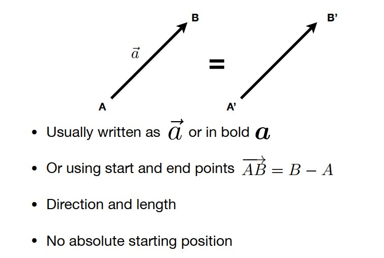
</div>

### Vector Normalization
<div align=center>

</div>

### Vector Addition
<div align=center>

</div>

### Cartesian Coordinates
<div align=center>

</div>

### Vector Multiplication
<div align=center>
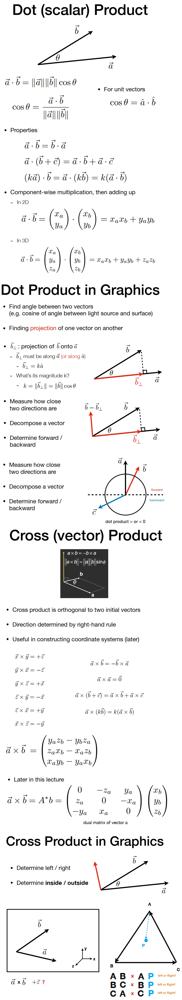
</div>

### Dot Product
  * [The dot product between two vectors is based on the projection of one vector onto another](https://mathinsight.org/dot_product)
  
### Orthonormal Coordinate Frames
<div align=center>

</div>

### Matrices
* Magical 2D arrays that haunt in every CS course
* In Graphics, pervasively used to represent transformations
  * Translation, rotation, shear, scale
### What is a matrix
* Array of numbers (m × n = m rows, n columns)
* Addition and multiplication by a scalar are trivial: element by element

### Matrix-Matrix Multiplication
<div align=center>

</div>

### Transpose of a Matrix
### Identity Matrix and Inverses

## Transformation
### Scale
  * Scale Transform
  * Scale Matrix
    * $S_0.5$
  * Scale (Non-Uniform)
    * $S_0.5,1.0$
### Reflection Matrix

### Shear Matrix
<div align=center>

</div>

### Rotation
  * Rotation Matrix
  <div align=center>
  
  </div>

  * Rotation Image
  <div align=center>
  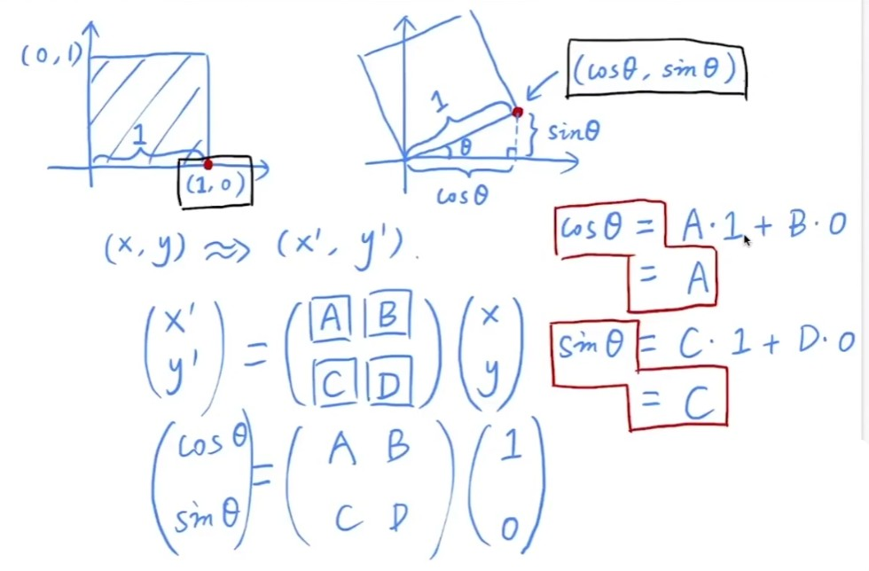
  </div>

### Linear Transforms = Matrices
* $x^, = Mx$

### Homogeneous coordinates
   * Why Homogeneous Coordinates
      * Translation cannot be represented in matrix form

      $$
      \begin {aligned}
      \begin{bmatrix} x^, \\ y^,      \end{bmatrix} =
      \begin{bmatrix} a & b \\ c & d  \end{bmatrix}
      \begin{bmatrix} x \\ y          \end{bmatrix} +
      \begin{bmatrix} t_x \\ t_y      \end{bmatrix}
      \end {aligned}
      $$

     * <span style="color:red">(So, translation is NOT linear transform!)</span>

      * But we don’t want translation to be a special case, Is there a unified way to represent all transformations? (and what’s the cost?)
  * Add a third coordinate (w-coordinate)
    * Add a third coordinate (w-coordinate)
      * 2D point = (x, y, <span style="color:red">1</span>)T
      * 2D vector = (x, y, <span style="color:red">0</span>)T
    * Matrix representation of translations
    
    $$
    \begin {aligned}
    \left(\begin{array}{ccc} x^, \\ y^, \\ w^, \end{array}\right) = 
    \left(\begin{array}{ccc} 1 & 0 & t_x \\ 0 & 1 & t_y \\ 0 & 0 & 1 \end{array}\right)
    \cdot
    \left(\begin{array}{ccc} x \\ y \\ 1 \end{array}\right) = 
    \left(\begin{array}{ccc} x+t_x \\ y+t_y \\ 1 \end{array}\right)
    \end {aligned}
    $$

* Valid operation if w-coordinate of result is 1 or 0
    * `vector + vector = vector`
    * `point - point = vector`
    * `point + vector = point`
    * `point + point = the point of middle`
  * In homogeneous coordinates (if $w \neq 0$)
  $$
  \begin {aligned}
  \left(\begin{array}{ccc} x \\ y \\ w \end{array}\right) is\ the\ 2D\ point,
  \left(\begin{array}{ccc} x/w \\ y/w \\ 1\end{array}\right), w \neq 0
  \end {aligned}
  $$

* Affine Transformations
   * Affine map = linear map + translation
      $$
      \begin {aligned}
      \left(\begin{array}{ccc} x^, \\ y^, \end{array}\right) =
      \left(\begin{array}{ccc} a & b \\ c & d \end{array}\right) \cdot
      \left(\begin{array}{ccc} x \\ y \end{array}\right) + 
      \left(\begin{array}{ccc} t_x \\ t_y \end{array}\right)
      \end {aligned}
      $$

   *  Using homogenous coordinates:
      $$
      \begin {aligned}
      \left(\begin{array}{c} x^, \\ y^, \\ 1 \end{array}\right) = 
      \left(\begin{array}{c} a & b & t_x \\ c & d & t_y \\ 0 & 0 & 1 \end{array}\right) \cdot
      \left(\begin{array}{c} x \\ y \\1 \end{array}\right)
      \end {aligned}
      $$

### 2D Transformations
<div align=center>

</div>

* Inverse Transform
* Composing Transforms
  * `Transform Ordering Matters!`
  * Matrix multiplication is not commutative
  * Note that matrices are applied right to left

### Decomposing Complex Transforms
<div align=center>

</div>

### 3D Transforms
* Use homogeneous coordinates again:
  * 3D point = (x, y, z, <span style="color:red">1</span>)T
  * 3D vector = (x, y, z, <span style="color:red">0</span>)T
* In general, (x, y, z, w) (w != 0) is the 3D point:
  * (x/w, y/w, z/w)
* Use 4×4 matrices for affine transformations

   $$
   \begin {aligned}
   \left(\begin{array}{c} x^, \\ y^, \\ z^, \\ 1 \end{array}\right) = 
   \left(\begin{array}{c} a & b & c & t_x \\ d & e & f & t_y \\ g & h & i & t_z \\ 0 & 0 & 0 & 1 \end{array}\right) \cdot
   \left(\begin{array}{c} x \\ y \\ z \\ 1 \end{array}\right)
   \end {aligned}
   $$

### Extra Rotation Image
<div align=center>

</div>

### 3D Transformations
* Scale Translation
<div align=center>

</div>

* Rotation around x-, y-, or z-axis
<div align=center>

</div>

* Rotation
<div align=center>

</div>

### View / Camera Transformation
<div align=center>

</div>

### Projection Transformation
* Orthographic Projection
<div align=center>

</div>

* Perspective Projection
<div align=center>

</div>
<div align=center>

</div>

## Rasterization

### Canonical Cube to Screen
<div align=center>

</div>

### Drawing Machines
* CNC Sharpie Drawing Machine
* Laser Cutters

### Different Raster Displays
* Oscilloscope
* Oscilloscope Art
* Cathode Ray Tube
* Television - Raster Display CRT
* Frame Buffer: Memory for a Raster Display
* Flat Panel Displays
* LCD (Liquid Crystal Display) Pixel
* LED Array Display
* Electrophoretic (Electronic Ink) Display

### Triangles - Fundamental Shape Primitives
  * Why triangles?
    *  Most basic polygon
    *  Break up other polygons
    *  Unique properties
    *  Guaranteed to be planar
    *  Well-defined interior
    *  Well-defined method for interpolating values at vertices over triangle (barycentric interpolation)

### Sampling
<div align=center>
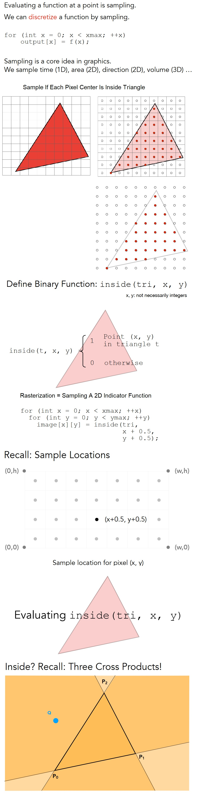
</div>

  * Edge Cases (Literally)
  * Checking All Pixels on the Screen?
    * Use a Bounding Box!
  * Incremental Triangle Traversal (Faster?)
    * suitable for thin and rotated triangles

### Sampling is Ubiquitous in Computer Graphics
* Rasterization = Sample 2D Positions
* Photograph = Sample Image Sensor Plane
* Video = Sample Time
* Sampling `Artifacts` (Errors / Mistakes / Inaccuracies) in Computer Graphics
* Sampling Artifacts in Computer Graphics
  * Artifacts due to sampling - “Aliasing”
    * Jaggies – sampling in space
    * Moire – undersampling images
    * Wagon wheel effect – sampling in time
    * [Many more] …
  * Behind the Aliasing Artifacts
    * Signals are changing too fast (high frequency), but sampled too slowly

### Antialiasing Idea: Blurring (Pre-Filtering) Before Sampling
<div align=center>

</div>

### Frequency Domain
<div align=center>

</div>

### Convolution Theorem
* 时域上做的卷积操作对应到频域上就需要把这两个(图像频域与卷积核频域)乘起来，反之亦然，频域上的卷积等于时域上的乘积
* Convolution in the spatial domain is equal to multiplication in the frequency domain, and vice versa
  * Option 1:
    * Filter by convolution in the spatial domain
  * Option 2:
    * Transform to frequency domain (Fourier transform)
    * Multiply by Fourier transform of convolution kernel
    * Transform back to spatial domain (inverse Fourier)
<div align=center>

</div>

### Sampling = Repeating Frequency Contents
* 采样就是在重复一个原始信号它的频谱
<div align=center>
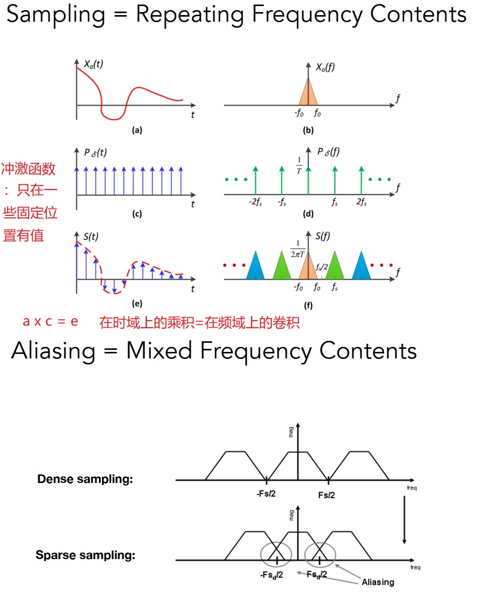
</div>

### Antialiasing
* How Can We Reduce Aliasing Error?
  * Option 1: Increase sampling rate
    * Essentially increasing the distance between replicas in the Fourier domain
    * Higher resolution displays, sensors, framebuffers…
    * But: costly & may need very high resolution
  * Option 2: Antialiasing
    * Making Fourier contents “narrower” before repeating
    * i.e. Filtering out high frequencies before sampling

* No free lunch!
  * What’s the cost of MSAA?
* Milestones (personal idea)
  * FXAA (Fast Approximate AA)
  * TAA (Temporal AA)
* Super resolution / super sampling
  * From low resolution to high resolution
  * Essentially still “not enough samples” problem
  * DLSS (Deep Learning Super Sampling)

<div align=center>
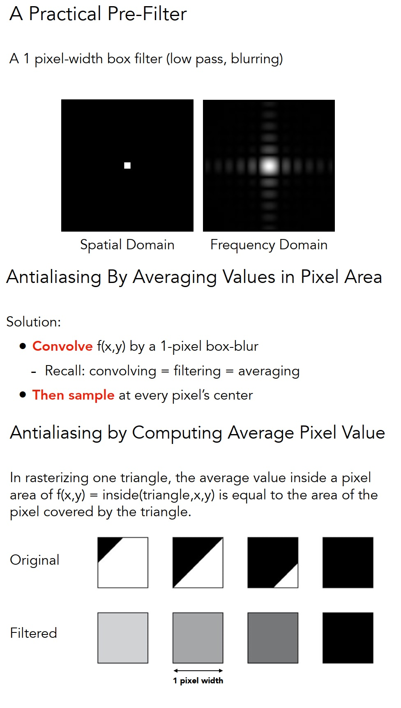
</div>

### Filtering
* Getting rid of certain frequency contents
<div align=center>
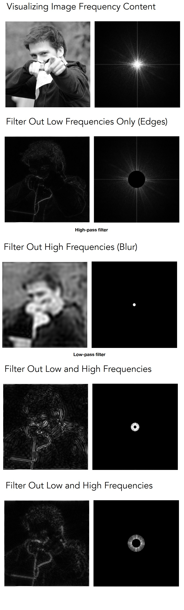
</div>

* Convolution (= Averaging)
<div align=center>
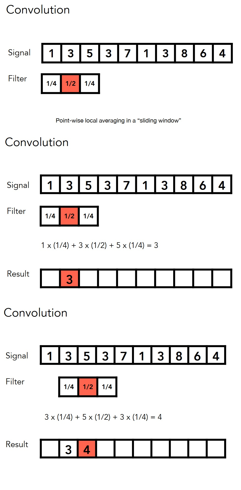
</div>

### Filter Kernel
* Box Function = “Low Pass” Filter
* Wider Filter Kernel = Lower Frequencies
<div align=center>

</div>

* 解释
  * 例如我们使用一个3x3的卷积核，我们会得到一个模糊的结果，想象一下，如果我们使用一个21x21的或者63x63的，对于任何一个像素，我们都取周围那么大一块区域，然后再平均出来，得到的结果肯定是越来越模糊，或者如果我们用一个超级小的(甚至比像素还要小的Box)做滤波，是不是相当于没有做任何操作，对于频域上它的范围会超级大

### Antialiasing By Supersampling (MSAA)
<div align=center>
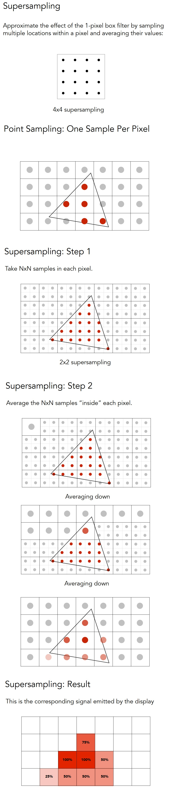
</div>

## Shading

### Visibility / occlusion - Z-buffering

* Painter’s Algorithm
  * Inspired by how painters paint 
  * Paint from back to front, overwrite in the framebuffer
  * Requires sorting in depth (O(n log n) for n triangles)
  * Can have unresolvable depth order
  <div align=center>
  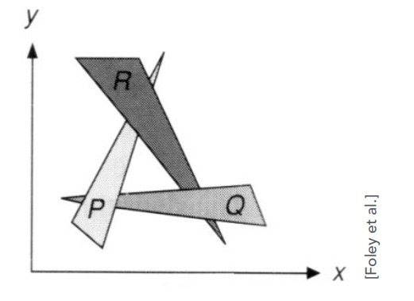
  </div>

* Z-Buffer
  * This is the algorithm that eventually won.
  * Idea:
    * Store current min. z-value for each sample (pixel)
    * Needs an additional buffer for depth values
      * frame buffer stores color values
      * depth buffer (z-buffer) stores depth
  * IMPORTANT: For simplicity we suppose
    * z is always positive
    * (smaller z -> closer, larger z -> further)

* Z-Buffer example
<div align=center>

</div>

* Z-Buffer Algorithm
  * Initialize depth buffer to ∞
  * During rasterization:

  ```c++
  for (each triangle T)
    for (each sample (x,y,z) in T)
      if (z < zbuffer[x,y]) // closest sample so far
        framebuffer[x,y] = rgb; // update color
        zbuffer[x,y] = z; // update depth
      else
        ; // do nothing, this sample is occluded
  ```

* Z-Buffer Complexity
  * Complexity
    * O(n) for n triangles (assuming constant coverage)
    * How is it possible to sort n triangles in linear time?
  * Drawing triangles in different orders? No effect
  * Most important visibility algorithm
    * Implemented in hardware for all GPUs

### Illumination & Shading
* Shading: Definition
  * In Merriam-Webster Dictionary
    * shad·ing, [ˈʃeɪdɪŋ], noun The darkening or coloring of an illustration or diagram with parallel lines or a block of color. The process of applying a material to an object
  * In this course
    * The process of applying a material to an object.

* A Simple Shading Model (Blinn-Phong Reflectance Model)
* Shading is Local
<div align=center>
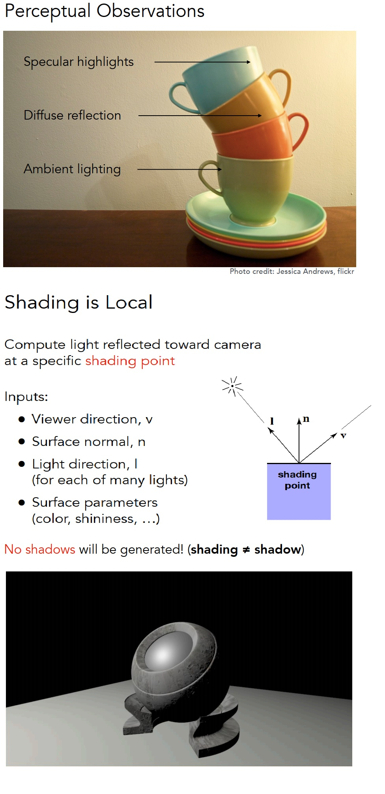
</div>

* Diffuse Reflection
<div align=center>

</div>

* Blinn-Phong reflectance model
  * Specular terms
  <div align=center>
  
  </div>
  
  * ambient terms
  <div align=center>
  
  </div>

<div align=center>

</div>

* Shading frequencies
<div align=center>

</div>

### Graphics Pipeline
<div align=center>

</div>

* Shader Programs
  * Program vertex and fragment processing stages
  * Describe operation on a single vertex (or fragment)
  * Example GLSL fragment shader program

  ```c++
  uniform sampler2D myTexture; // program parameter
  uniform vec3 lightDir; // program parameter
  varying vec2 uv; // per fragment value (interp. by rasterizer)
  varying vec3 norm; // per fragment value (interp. by rasterizer)

  void diffuseShader()
  {
    vec3 kd;
    kd = texture2d(myTexture, uv); // material color from texture
    kd *= clamp(dot(–lightDir, norm), 0.0, 1.0); // Lambertian shading model
    gl_FragColor = vec4(kd, 1.0); // output fragment color
  }
  ```

  * `Shader function executes once per fragment.`
  * `Outputs color of surface at the current fragment’s screen sample position.`
  * `This shader performs a texture lookup to obtain the surface’s material color at this point, then performs a diffuse lighting calculation.`

* Snail Shader Program
  * Inigo Quilez
  * Procedurally modeled, 800 line shader.
  * *http://shadertoy.com/view/ld3Gz2*
  * Inigo Quilez, *https://youtu.be/XuSnLbB1j6E*

* Graphics Pipeline Implementation: GPUs
  * Specialized processors for executing graphics pipeline computations
  * Discrete GPU Card (NVIDIA GeForce Titan X)
  * Integrated GPU: (Part of Intel CPU die)

* GPU: Heterogeneous, Multi-Core Procesor

* Texture Mapping
  * Intro: Different Colors at Different Places?
<div align=center>

</div>

* Interpolation Across Triangles - Barycentric coordinates
  * Interpolation Across Triangles
    * Why do we want to interpolate?
      * Specify values at vertices
      * Obtain smoothly varying values across triangles
    * What do we want to interpolate?
      * Texture coordinates, colors, normal vectors, …
    * How do we interpolate?
      * Barycentric coordinates
<div align=center>

</div>

* Applying Textures
  * Simple Texture Mapping: Diffuse Color
  ```c++
  for each rasterized screen sample (x,y):  // (x,y) - Usually a pixel’s center
    (u,v) = evaluate texture coordinate at (x,y) // (x,y) - Using barycentric coordinates!
    texcolor = texture.sample(u,v);
    set sample’s color to texcolor; // color - Usually the diffuse albedo Kd (recall the Blinn-Phong reflectance model)
  ```

* Texture queries
  * Texture Magnification - Easy Case - too small
    * Bilinear interpolation usually gives pretty good results at reasonable costs
    <div align=center>
    
    </div>

  * Texture Magnification - Hard case - too large
    <div align=center>
    
    </div>

    * Antialiasing — Supersampling？
      * Will supersampling work?
        * Yes, high quality, but costly
        * When highly minified, many texels in pixel footprint
        * Signal frequency too large in a pixel
        * Need even higher sampling frequency
      * Let’s understand this problem in another way
        * What if we don’t sample?
        * Just need to get the average value within a range!
    * Point Query vs. (Avg.) Range Query
    * Different Pixels -> Different-Sized Footprints

  * Mipmap - Allowing (fast, approx., square) range queries

<div align=center>

</div>

* Applications of textures
  * In modern GPUs, texture = memory + range query (filtering)
    * General method to bring data to fragment calculations
  * Many applications
    * Environment lighting
    * Store microgeometry
    * Procedural textures
    * Solid modeling
    * Volume rendering
  <div align=center>
  
  </div>

## Geometry

### Examples of geometry - Various representations of geometry
<div align=center>

</div>

* Best Representation Depends on the Task!
### More Implicit Representations in Computer Graphics
* Scene of Pure Distance Functions
  * https://iquilezles.org/www/articles/raymarchingdf/raymarchingdf.htm
* Level Sets in Physical Simulation
  * http://physbam.stanford.edu/

<div align=center>

</div>

### Distance Functions (Implicit)
* 对几何的距离函数做blending形成的一个结果；距离函数：空间中的任何一个点到你想要表述的几何形体的上面的每一个点的最小距离，这个距离可以是正的或者负的，在内部就认为是负的，在外部就认为是正的，然后对这任意几何做blending，最后恢复成原来的物体，就可以得到
<div align=center>

</div>

### Implicit Representations - Pros & Cons
* Pros:
  * compact description (e.g., a function)
  * certain queries easy (inside object, distance to surface)
  * good for ray-to-surface intersection (more later)
  * for simple shapes, exact description / no sampling error
  * easy to handle changes in topology (e.g., fluid)
* Cons:
  * difficult to model complex shapes

### Explicit Representations
* Explicit Representations in Computer Graphics
  * Many Explicit Representations in Graphics
    * triangle meshes
    * Bezier surfaces
    * subdivision surfaces
    * NURBS
    * point clouds
    * ...
  <div align=center>
  
  </div>

### Curves
* Camera Paths
 * Flythrough of proposed Perth Citylink subway, `https://youtu.be/rIJMuQPwr3E`
* Animation Curves
  * Maya Animation Tutorial: `https://youtu.be/b-o5wtZlJPc`
* Vector Fonts
  * The Quick Brown Fox Jumps Over The Lazy Dog ABCDEFGHIJKLMNOPQRSTUVWXYZ abcdefghijklmnopqrstuvwxyz 0123456789
  <div align=center>
  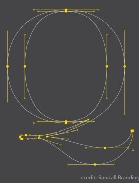
  </div>
  * Baskerville font - represented as piecewise cubic Bézier curves

### Bezier curves
<div align=center>

</div>

* De Casteljau’s algorithm
  <div align=center>
  
  </div>

  * Visualizing de Casteljau Algorithm
  <div align=center>
  
  </div>

  * Evaluating Bézier Curves Algebraic Formula
  <div align=center>
  
  </div>

### Piecewise Bézier Curves
<div align=center>

</div>

* Demo – Piecewise Cubic Bézier Curve
  * David Eck, http://math.hws.edu/eck/cs424/notes2013/canvas/bezier.html

### B-splines
* Splines
  * a continuous curve constructed so as to pass through a given set of points and have a certain number of continuous derivatives.
  * In short, a curve under control
  * A Real Draftsman’s Spline `http://www.alatown.com/spline-history-architecture/`

* Other types of splines
* B-splines
  * Short for basis splines
  * Require more information than Bezier curves
  * Satisfy all important properties that Bézier curves have (i.e. superset)
  * *https://en.wikipedia.org/wiki/B-spline*

* Important
* In this course
  * We do not cover B-splines and NURBS
  * We also do not cover operations on curves (e.g. increasing/decreasing orders, etc.)
  * To learn more / deeper, you are welcome to refer to Prof. Shi-Min Hu’s course: `https://www.bilibili.com/video/av66548502?from=search&seid=65256805876131485`

### Surfaces
* Bezier surfaces - Evaluating Bézier Surfaces

<div align=center>

</div>

* Visualizing Bicubic Bézier Surface Patch

<div align=center>

</div>


* Triangles & quads
* Subdivision, simplification, regularization
<div align=center>
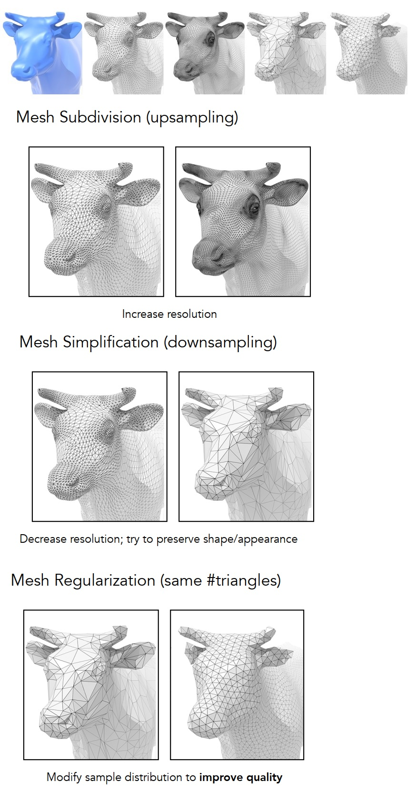
</div>

### Subdivision
<div align=center>
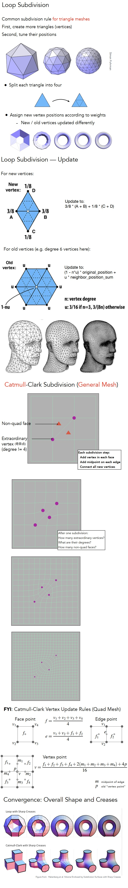
</div>

### Mesh Simplification
* *http://graphics.stanford.edu/courses/cs468-10-fall/LectureSlides/08_Simplification.pdf*

* Simplification via Quadric Error
  * Iteratively collapse edges
  * Which edges? Assign score with quadric error metric*
    * approximate distance to surface as sum of distances to planes containing triangles
    * iteratively collapse edge with smallest score
    * greedy algorithm... great results!
<div align=center>

</div>

### Shadow Mapping
*  An Image-space Algorithm
  * no knowledge of scene’s geometry during shadow computation
  * must deal with aliasing artifacts
* Key idea:
  * the points NOT in shadow must be seen both by the light and by the camera
<div align=center>

</div>
<div align=center>

</div>

* Shadow Mapping
  * Well known rendering technique
    * Basic shadowing technique for early animations (Toy Story, etc.) and in EVERY 3D video game
* Problems with shadow maps
  * Hard shadows (point lights only)
  * Quality depends on shadow map resolution (general problem with image-based techniques)
  * Involves equality comparison of floating point depth values means issues of scale, bias, tolerance

* Problems with shadow maps
<div align=center>
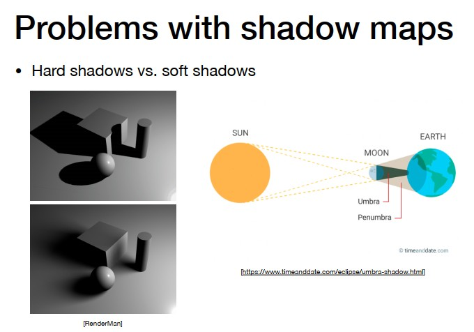
</div>

## Materials and Appearances
*https://www.bilibili.com/video/BV1X7411F744?p=17&t=411*

**Light [Light Trace] and material are closely combined**

* What is Material in Computer Graphics?
  * Material == BRDF

<div align=center>

</div>

* Specular Refraction
  * In addition to reflecting off surface, light may be transmitted through surface.
  * Light refracts when it enters a new medium

<div align=center>
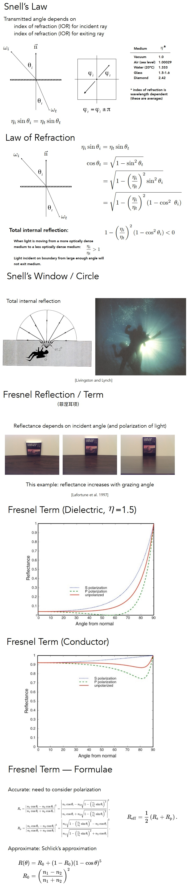
</div>

### Microfacet Material
<div align=center>
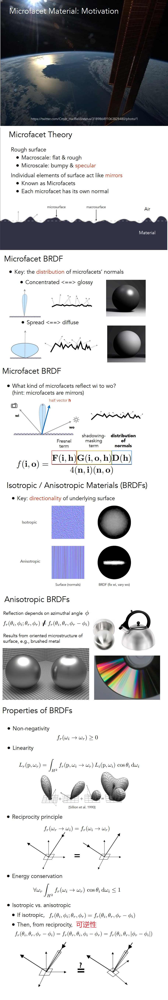
</div>

### Measuring BRDFs
<div align=center>

</div>

* Challenges in Measuring BRDFs
  * Accurate measurements at grazing angles
    * Important due to Fresnel effects
  * Measuring with dense enough sampling to capture high frequency specularities
  * Retro-reflection
  * Spatially-varying reflectance, ...

* Representing Measured BRDFs
  * Desirable qualities
    * Compact representation
    * Accurate representation of measured data
    * Efficient evaluation for arbitrary pairs of directions
    * Good distributions available for importance sampling

## Advanced Topics in Rendering

### Advanced Light Transport
* Advanced Light Transport
  * Unbiased light transport methods
    * Bidirectional path tracing (BDPT)
    * Metropolis light transport (MLT)
  * Biased light transport methods
    * Photon mapping
    * Vertex connection and merging (VCM)
  * Instant radiosity (VPL / many light methods)

* Biased vs. Unbiased Monte Carlo Estimators
  * An unbiased Monte Carlo technique does not have any systematic error
    * The expected value of an unbiased estimator will always be the correct value, no matter how many samples are used
  * Otherwise, biased
    * One special case, the expected value converges to the correct value as infinite #samples are used — consistent
  * We’ll look again at this page after introducing Photon Mapping

<div align=center>

</div>

### Advanced Appearance Modeling
* Advanced Appearance Modeling
  * Non-surface models
    * Participating media
    * Hair / fur / fiber (BCSDF)
    * Granular material
  * Surface models
    * Translucent material (BSSRDF)
    * Cloth
    * Detailed material (non-statistical BRDF)
  * Procedural appearance

* Non-Surface Models
  * Participating Media: Fog
  * Participating Media: Cloud

#### Hair Appearance
* Double Cylinder Model
* Marschner model
* Kajiya-Kay Model

<div align=center>

</div>

#### Granular Material
<div align=center>

</div>

#### Surface Models
* BSSRDF
<div align=center>
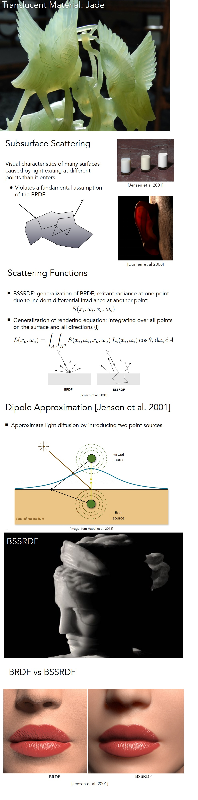
</div>

* BSSEDF
  * 其实就是规定了光线从哪个点进来，从哪个点出去，从哪个方向进来，从哪个方向出去，对BRDF概念的一个延伸
  * 不能只考虑从这个方向进来的光，还需要考虑从各个方向其它点进来的光，所以需要对方向进行积分，也要对面积进行积分

#### Cloth - Detailed Appearance
<div align=center>

</div>

#### Wave Optics
<div align=center>

</div>

#### Procedural Appearance
<div align=center>

</div>

## Cameras, Lenses and Light Fields
* Imaging = Synthesis + Capture

### Camera
* Shutter Exposes Sensor For Precise Duration
* Sensor Accumulates Irradiance During Exposure

* Pinhole Image Formation
* Field of View (FOV)
<div align=center>

</div>

#### Exposure
* 控制光进来的Time与进来多少Irradiance来得到曝光度， H = T x E (Exposure = time x irradiance)
* 进来多少光是光圈控制的，所以光圈越大进来的单位时间内的Irradiance就越多
* 光圈根据f-stop控制

* Exposure
  * H = T x E
  * Exposure = time x irradiance
  * Exposure time (T)
    * Controlled by shutter
  * Irradiance (E)
    * Power of light falling on a unit area of sensor
    * Controlled by lens aperture and focal length
* Exposure Controls in Photography
  * Aperture size
    * Change the f-stop by opening / closing the aperture (if camera has iris control)
  * Shutter speed
    * Change the duration the sensor pixels integrate light
  * ISO gain (感光度)
    * Change the amplification (analog and/or digital) between sensor values and digital image values

<div align=center>

</div>

#### ISO (Gain)
* Third variable for exposure
* Film: trade sensitivity for grain
* Digital: trade sensitivity for noise
  * Multiply signal before analog-to-digital conversion
  * Linear effect (ISO 200 needs half the light as ISO 100)
* ISO gain
  * 感光度，理解为后期处理，可以发生在任何地方上，设备上或者计算机上
  * ISO200 与 ISO100， 可以理解为直接乘了2x

#### F-Number (F-Stop): Exposure Levels
* Written as FN or F/N. N is the f-number.
* Informal understanding: the inverse-diameter of a round aperture
* Side Effect of Shutter Speed
  * Motion blur: handshake, subject movement
  * Doubling shutter time doubles motion blur
  * Note: motion blur is not always bad!
  * Tip: think about anti-aliasing
  * Rolling shutter: different parts of photo taken at different times

<div align=center>

</div>

### Fast and Slow Photography
* High-Speed Photography
  * Normal exposure = extremely fast shutter speed x (large aperture and/or high ISO)

### Thin Lens Approximation
<div align=center>

</div>

* Thin Lens Demonstration
  * http://graphics.stanford.edu/courses/cs178-10/applets/gaussian.html

### Defocus Blur

* CoC
  * 我们有个聚焦平面与成像平面，如果有物体不在聚焦平面上会怎么样呢？就会导致这个物体的聚焦点离你的成像平面有一段距离，光线会继续传播最后落到成像平面(也就是感光元件)上，但此时不是一个点了，而是一片(圆),这个圆就叫Circle of confusion

* Revisiting F-Number (a.k.a. F-Stop)
  *  Formal definition: The f-number of a lens is defined as the focal length divided by the diameter of the aperture
* Common f-stops on real lenses: 1.4, 2, 2.8, 4.0, 5.6, 8, 11, 16, 22, 32
* An f-stop of 2 is sometimes written f/2, reflecting the fact that the absolute aperture diameter (A) can be computed by dividing focal length (f) by the relative aperture (N).

<div align=center>
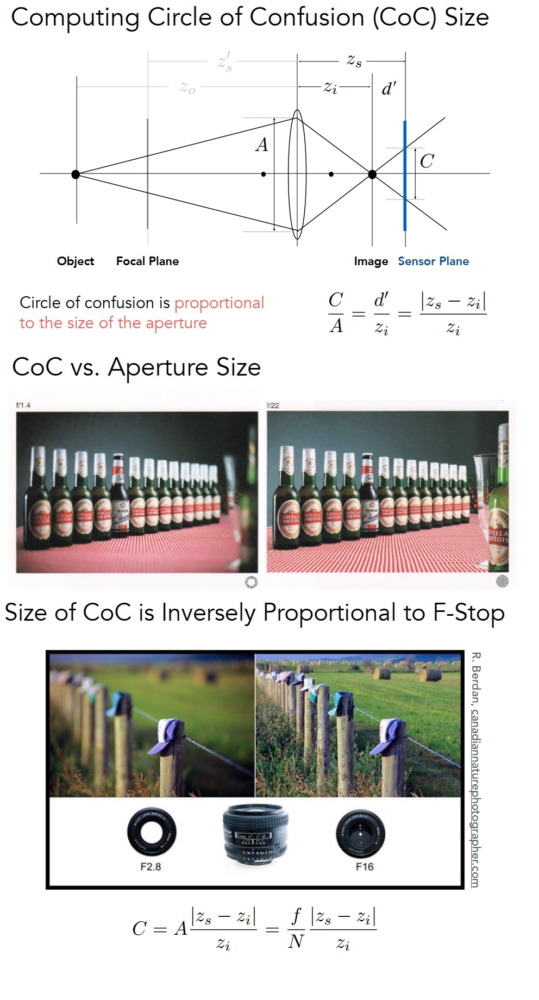
</div>

### Ray Tracing Ideal Thin Lenses

<div align=center>

</div>

### Depth of Field
<div align=center>

</div>

* DOF Demonstration (FYI)
  * http://graphics.stanford.edu/courses/cs178/applets/dof.html

## Color and Perception

### Light Field / Lumigraph
<div align=center>

</div>

### Light Field Camera
* The Lytro Light Field Camera
  * Lytro: founded by Prof. Ren Ng (UC Berkeley)
  * Microlens design
  * Most significant function
    * Computational Refocusing (virtually changing focal length & aperture size, etc. after taking the photo)

<div align=center>

</div>

### Physical Basis of Color

* Spectral Power Distribution (SPD) (谱功率密度)
  * Salient property in measuring light 
    *  The amount of light present at each wavelength
    *  Units:
      *  radiometric units / nanometer (e.g. watts / nm)
      *  Can also be unit-less
  *  Often use “relative units” scaled to maximum wavelength for comparison across wavelengths when absolute units are not important

* What is Color?
  * Color is a phenomenon of human perception; it is not a universal property of light
  * Different wavelengths of light are not “colors”

#### Biological Basis of Color

#### Tristimulus Theory of Color
* The Human Visual System
  * Human eye does not measure and brain does not receive information about each wavelength of light
  * Rather, the eye “sees” only three response values (S, M, L), and this is only info available to brain

#### Metamerism
* Metamers
  * Metamers are two different spectra (∞-dim) that project to the same (S,M,L) (3-dim) response.
    * These will appear to have the same color to a human The existence of metamers is critical to color reproduction
    * Don’t have to reproduce the full spectrum of a real world scene
    * Example: A metamer can reproduce the perceived color of a real-world scene on a display with pixels of only three colors

* Metamerism is a Big Effect

#### Color Reproduction / Matching
<div align=center>

</div>

#### Color Spaces
* Standard Color Spaces
  * Standardized RGB (sRGB)
    * makes a particular monitor RGB standard
    * other color devices simulate that monitor by calibration
    * widely adopted today
    * gamut (?) is limited

* Gamut 
  * Gamut is the set of chromaticities generated by a set of color primaries
  * Different color spaces represent different ranges of colors 
  * So they have different gamuts, i.e. they cover different regions on the chromaticity diagram

#### Perceptually Organized Color Spaces
* Opponent Color Theory
  * There’s a good neurological basis for the color space dimensions in CIE LAB
    * the brain seems to encode color early on using three axes:
      * white — black, red — green, yellow — blue
    * the white — black axis is lightness; the others determine hue and saturation
* Opponent Color Theory
  * one piece of evidence: you can have a light green, a dark green, a yellow-green, or a blue-green, but you can’t have a reddish green (just doesn’t make sense)
    * thus red is the opponent to green
  * another piece of evidence: afterimages (following slides)

<div align=center>

</div>

## Animation

### History
* Animation
  * "Bring things to life"
    * Communication tool
    * Aesthetic issues often dominate technical issues
  * An extension of modeling
    * Represent scene models as a function of time
  * Output: sequence of images that when viewed sequentially provide a sense of motion
    * Film: 24 frames per second
    * Video (in general): 30 fps
    * Virtual reality: 90 fps

* Historical Points in Animation
  * First Animation
    * (Shahr-e Sukhteh, Iran 3200 BCE)
  * History of Animation
    * (Phenakistoscope, 1831)
  * First Film
    * Originally used as scientific tool rather than for entertainment
    * Critical technology that accelerated development of animation
    * Edward Muybridge, "Sallie Gardner" (1878)
  * First Hand-Drawn Feature-Length (>40 mins) Animation
    * Disney, “Snow White and the Seven Dwarfs” (1937)
  * First Digital-Computer-Generated Animation
    * Ivan Sutherland, “Sketchpad” (1963) – Light pen, vector display
  * Early Computer Animation
    * Ed Catmull & Frederick Parke, “Computer Animated Faces” (1972)
  * Digital Dinosaurs!
    * Jurassic Park (1993)
  * First CG Feature-Length Film
    * Pixar, “Toy Story” (1995)  
  * Computer Animation - 10 years ago
    * Sony Pictures Animation, “Cloudy With a Chance of Meatballs” (2009)
  * Computer Animation - last year
    * Walt Disney Animation Studios, “Frozen 2” (2019)

### Keyframe animation
<div align=center>

</div>

### Physical simulation

#### Mass Spring System
<div align=center>

</div>

#### Particle Systems
<div align=center>

</div>

### Kinematics

#### Forward Kinematics
<div align=center>

</div>

* Kinematics Pros and Cons
  * Strengths
    * Direct control is convenient
    * Implementation is straightforward
  * Weaknesses
    * Animation may be inconsistent with physics
    * Time consuming for artists

#### Inverse Kinematics
<div align=center>

</div>

* Inverse Kinematics  
  * Numerical solution to general N-link IK problem
    * Choose an initial configuration
    * Define an error metric (e.g. square of distance between goal and current position)
  * Compute gradient of error as function of configuration
  * Apply gradient descent (or Newton’s method, or other optimization procedure)

### Rigging
<div align=center>
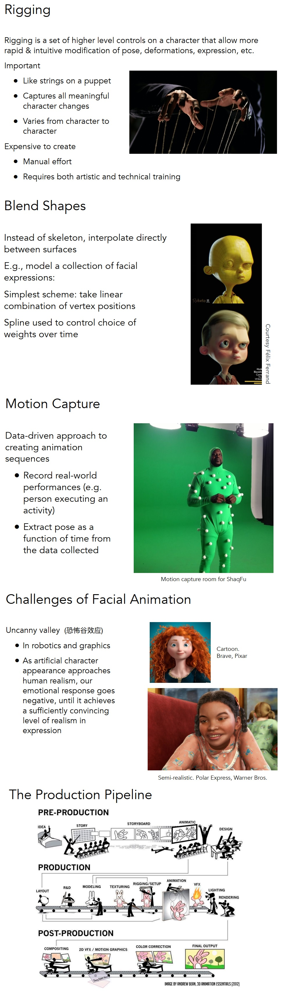
</div>

* Motion Capture Pros and Cons
  * Strengths
    * Can capture large amounts of real data quickly
    * Realism can be high
  * Weaknesses
    * Complex and costly set-ups
    * Captured animation may not meet artistic needs, requiring alterations

### Single particle simulation
* Explicit Euler method
<div align=center>

</div>

* Errors and Instability
  * Solving by numerical integration with finite differences leads to two problems:
  * Errors
    * Errors at each time step accumulate. Accuracy decreases as simulation proceeds
    * Accuracy may not be critical in graphics applications
  * Instability
    * Errors can compound, causing the simulation to diverge even when the underlying system does not
    * Lack of stability is a fundamental problem in simulation, and cannot be ignored

#### Combating Instability
<div align=center>

</div>

* Some Methods to Combat Instability
  * Midpoint method / Modified Euler
    * Average velocities at start and endpoint 
  * Adaptive step size
    * Compare one step and two half-steps, recursively, until error is acceptable
  * Implicit methods
    * Use the velocity at the next time step (hard)
  * Position-based / Verlet integration
    * Constrain positions and velocities of particles after time step

### Rigid body simulation
<div align=center>

</div>

### Fluid simulation
<div align=center>

</div>

# Resource 

## Github

* [1] Mitsuba 2: A Retargetable Forward and Inverse Renderer https://github.com/mitsuba-renderer/mitsuba2
* [2] Yocto/GL: Tiny C++ Libraries for Data-Driven Physically-based Graphics https://github.com/xelatihy/yocto-gl
* [3] Minimalistic C++/Python GUI library for OpenGL, GLES2/3, Metal, and WebAssembly/WebGL https://github.com/mitsuba-renderer/nanogui

## Models
* [1] 3D Models http://graphics.im.ntu.edu.tw/~robin/courses/cg03/model/

# Terms

## 矢量置换 Vector Displacement
* *https://80.lv/articles/case-study-vector-displacement-mapping-in-real-time/*
* *http://blog.sina.com.cn/s/blog_6973deb50102wywr.html*
* *https://community.foundry.com/discuss/topic/62388*

* 矢量置换技术与常规置换技术的最大区别在于，常规置换主要通过模型表面的法线方向，根据黑白信息，对表面点进行位移，从而改变模型的细节，而矢量置换则是依据模型切线的三维空间信息来对模型点进行位移的。

<div align=center>

</div>

## 欧拉角与四元数
* *https://www.zhihu.com/question/47736315/answer/236284413*
* *https://krasjet.github.io/quaternion/quaternion.pdf*
* *https://www.zhihu.com/question/23005815*
* *https://eater.net/quaternions/video/intro*
* Bonus: Gimbal Lock https://krasjet.github.io/quaternion/bonus_gimbal_lock.pdf

* 欧拉角
  * 欧拉角的算法思想是什么
    * 陌生的你来到了成都，站在盐市口茫然四顾，想知道春熙路怎么走？
    * 这个时候你选择了去问路，得到了两种回答：
      * 往东经104°04′、北纬30°40′走
      * 右转后一直走
    * 第一种回答，告诉了你春熙路的绝对坐标，可是很反人类啊！
    * 第二种回答，告诉了你春熙路的相对坐标，很具有操作性。
    * 欧拉角算法的思想就是采用的第二种回答的方式，优点在于很好理解
* 按照不同的旋转步骤，旋转的结果是不一样的。
* 万向节死锁（Gimbal Lock）
  * 朝向
    * 当你思考朝向的时候，你需要想到的其实是一个旋转
  * 旋转拆分
    * 欧拉证明3D 空间中的任意一个旋转都可以拆分成为沿着物体自身三个正交坐标轴的旋转
  * 固定顺序旋转
  * 万向节/平衡环架
    * 每一次旋转变换就代表着有一个Gimbal
  * Gimbal Lock
    * 当某个旋转变换了$\frac{\pi}{2}$弧度而覆盖了另外一个，也就是将这两个旋转轴对齐了
    * Gimbal Lock 问题的核心还是在于我们采用了**固定的旋转顺序**<div align=center></div>
* 欧拉角与万向节
  * pitch，中文是俯仰
  * Yaw，中文叫偏航
  * Roll，中文叫桶滚

* 四元数
  * *https://krasjet.github.io/quaternion/quaternion.pdf*

  * **复数的相乘其实是旋转与缩放变换的复合**
  * 如果有一个复数 `𝑧 = 𝑎+𝑏𝑖`，那么 `𝑧` 与任意一个复数 `𝑐` 相乘都会将 `𝑐` 逆时针旋转 `θ = atan2(𝑏, 𝑎)` 度，并将其缩放 $\parallel Z \parallel = \sqrt{a^2 + b^2}$ 

  <div align=center>
  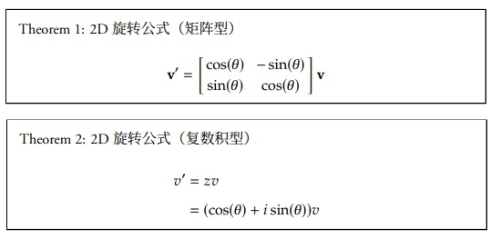
  </div>

  * 四元数的定义和复数非常类似，唯一的区别就是四元数一共有三个虚部，而复数只有一个．所有的四元数 `𝑞 ∈ H`（`H` 代表四元数的发现者 William Rowan Hamilton）都可以写成下面这种形式`𝑞 = 𝑎 + 𝑏𝑖 + 𝑐𝑗 + 𝑑𝑘, (𝑎, 𝑏, 𝑐, 𝑑 ∈ R)`, 其中 $𝑖^2 = 𝑗^2 = 𝑘^2 = 𝑖𝑗𝑘 = −1$
  * 与复数类似，因为四元数其实就是对于基 `{1, 𝑖, 𝑗, 𝑘}` 的线性组合，四元数也可以写成向量的形式

## Bezier B-Spline NURBS

* [1] Nurbs vs. Bezier: What’s the Difference? https://www.3dbiology.com/nurbs-vs-bezier-whats-the-difference/

* B-splines
  * A B-spline also called a basis-spline is a smooth curve that follows a control polygon made of control points.  **It is a generalization of a Bezier curve.**
* Bezier 
  * The Bezier curve has **2 end points**, one at each end of the curve, and possibly also control points in between those 2, which do not lie on the curve but give the curve its actual curvature.
  * Bezier curves have all their control points averaged where the weights add up to one.   This means that such a curve always lies within the **convex hull** of its control points.  
  * Bezier curves are **non rational splines**.   Bezier curves use handles for editing, not control vertices which are offset from the curve.  Bezier curves can have round curves as well as sharp corners which makes them useful for graphic design. They cant represent a circle exactly whereas rational splines such as NURBS can.
* NURBS
  * NURBS stands for **Non-Uniform** **Rational** B-Splines.  NURBS is a mathematical model for the creation of both curves and surfaces.  These curves are  based on organic mathematics  and are therefore good for organic models.
  * NURBS  are **“rational”** as the name suggests, which means they have **non- homogenous weighted** control points. Other types of non-rational or simple B-splines have an **equal weight** of 1 at each control point.The higher the weight of a control vertex, the more the curve segment is pulled toward that control vertex.  Points on NURBS curves are computed by taking a weighted sum of several control points.

## 压缩感知

* [1] 压缩感知 维基百科，自由的百科全书 https://zh.wikipedia.org/wiki/%E5%A3%93%E7%B8%AE%E6%84%9F%E7%9F%A5
* [2] 如何理解压缩感知(compressive sensing)？ https://www.zhihu.com/question/28552876

压缩感知（Compressed sensing），也被称为压缩采样（Compressive sampling）或稀疏采样（Sparse sampling），是一种寻找欠定线性系统的稀疏解的技术。压缩感知被应用于电子工程尤其是信号处理中，用于获取和重构稀疏或可压缩的信号。这个方法利用信号稀疏的特性，相较于奈奎斯特理论，得以从较少的测量值还原出原来整个欲得知的信号。核磁共振就是一个可能使用此方法的应用。[1]

* 什么是压缩感知？压缩感知，常见的对应英文词汇包括compressed sensing，compressive sensing, compressive sampling等等，其实都是一个意思。在这里我们一律简称为CS。要理解CS，要从sensing和compressed两个词入手。
  * （1）什么是感知（sensing）?Sensing描述的是，为了表达和恢复某一个信号或者对象，对其采取某种感知手段（这里的感知包括了对图像的imaging, 对连续信号的sampling,等等），从而得到这种感知模态下的measurement，以便之后的信号重建以及分析等应用，这样一个过程。我们拿图像重建举一个例子：如果我们要感知一个10x10像素的图像，最简单最直接的方式，就是直接在空间域里面感知，得到并储存图像的100个像素点,这样的话，你可以通过把这100个像素点排列为矩阵的方式，重建这副目标图像。这里获取这100个点的过程，就称之为sensing。
  * （2）什么是压缩（compressed）？在(1)的例子中，我们感知了一个10x10图像全部的100个像素点，我们一般称这种sensing叫做全采样（full sampling），因为目标信号是一个100维的信号，而你也获得了对应的100维measurement，你可以很直接地完美恢复图像。这样的感知方式没有任何的压缩，i.e., 感知到的维度=信号本身的维度。当然你也可以采集更高维度的measurement，我们称之为over-sampling / over-sensing， 但多余的采样并不会进一步提高你的图像恢复（信号已经达到完美恢复了）。在不借助信号先验的前提下，我们把需要的最少的感知样本维度（这里是100），记做是critical sampling rate。那么你也可以选择感知少于critical rate的measurement，比如你只采集98个点，这种情况我们称之为是under-sampling，这样就起到了对full sensing的压缩，也就是compressed了。
  * （3）CS要解决什么问题？CS要解决的是，如何在under-sampling的情况下，依然可以完美地恢复目标图像。经典的信号处理体系是建立在经典的线性代数和统计的基础上的，那么处理这类under-sampling的重建问题，类似于你需要解100个未知数，却只有98个线性方程组。按照经典信号处理的理论，这类问题是存在无穷多解的（无法唯一确定地完美恢复目标图像）。我们把这类问题成为病态问题（ill-posed problem），而compressed sensing就是用来解决ill-posed的inverse problems（逆问题）。不同于咱们给的例子中，感知是直接幼稚地在空间域进行under-sampling，所谓compressed sensing，其实就是一种更加smart的under-sampling的感知，并且在借助有效的信号先验的帮助下，追求达到对图像的完美重建。但是为什么Compressed Sensing可以做到这一点呢？听上去很神奇，但这里主要的额外帮助来自于信号的先验。咱们还是用之前分析的恢复10x10图像的例子：在不借助信号先验的条件下，通过98个线性方程组，解100个未知数，理论上的解空间的自由度会有一个二维平面那么大，而这平面上的每个点都可以是我们恢复的图像，没有唯一解。但如果我们引入了一个信号固有的先验：比如真实的图像的解只能在某条线上。这就相当于我们在98个线性方程上，外加了一个linear constraint。由这个line和我们的解空间自由的平面的交点，就唯一确定了一个解：这个解既满足我们的98个线性方程组，又在我们的linear constraint上。这个例子其实就解了一个极其简化的compressed sensing问题。[2]