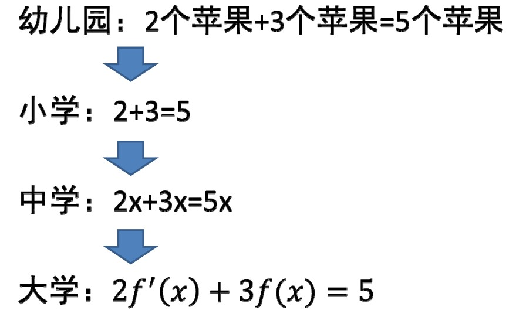
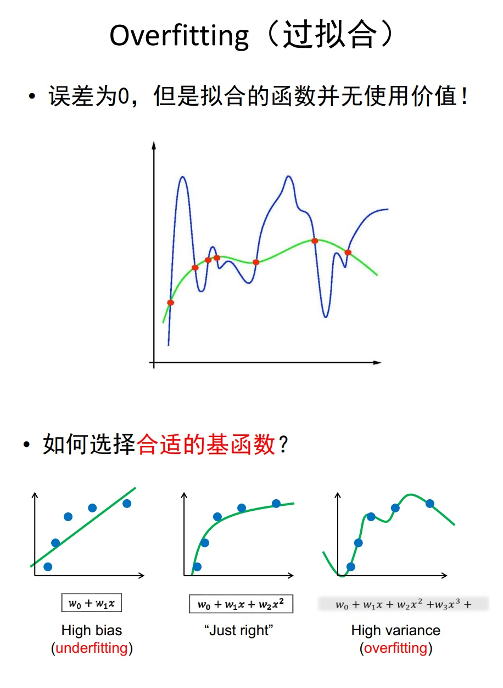
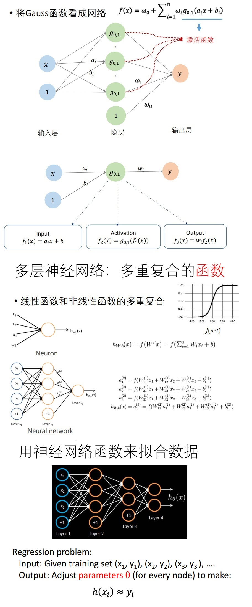
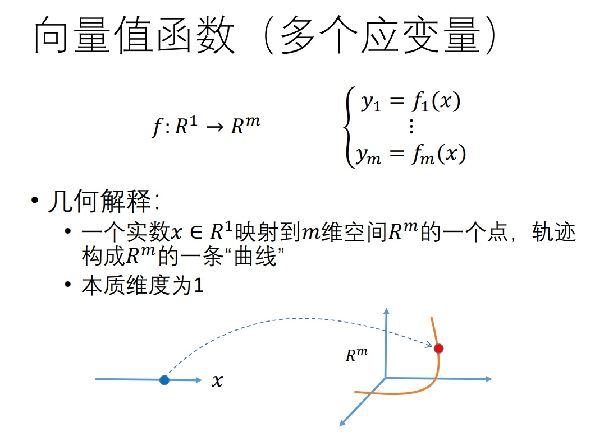
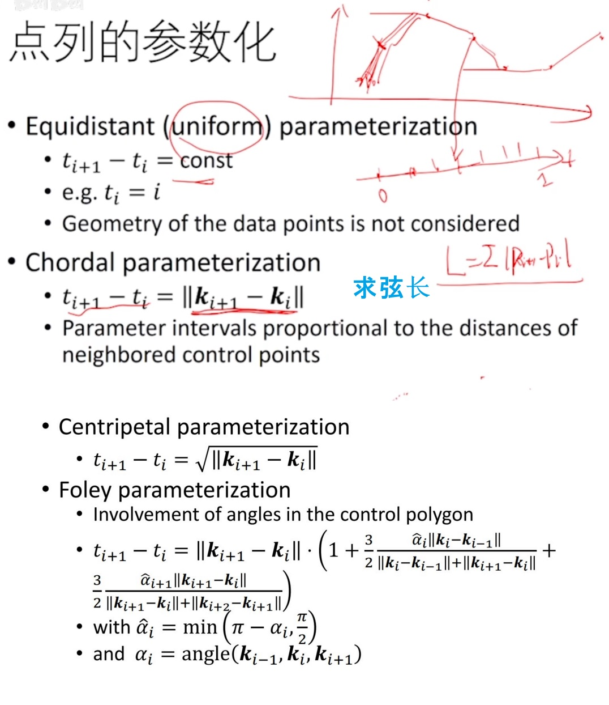
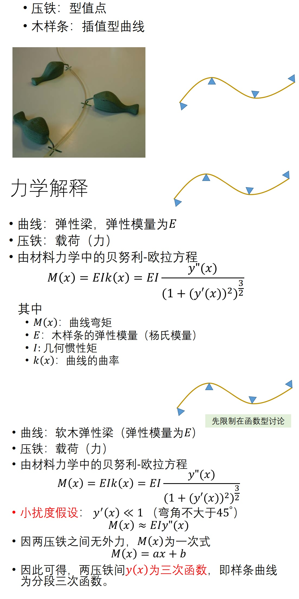

# Geometry Modeling

## 基础知识
> 离散表达：光栅
> 2D图形：矢量/几何图形 具有数学表达的几何对象（点、线、面）
> 栅格图像与矢量图形 （图形可以理解为连续的，是一种数学表达）
* 数学的产生
  * 起源于非常实际的目的
    * 结绳计数、土地测量、灌溉系统符号系统
  * 逐渐从自然界中抽象出规律
    * 年月历法、二十四节气
    * 星象、星体运动
  * 再到逻辑原则和推理演绎体系： 纯粹（理论）数学
    * 欧几里得《几何原本》
    * 总结规律进行抽象：公理体系
  * 发现新定理/命题、提出各种猜想
    * 或能反应和指导真实世界、或无用…
* 数学的应用：用数学语言进行建模
  * 问题 -> 模型 -> 算法 -> 代码
  * `科学研究的过程`
* 数学语言：抽象的思维

* 矩阵的本质
  * `在不同的基函数之间做变换`,一种变换的描述
* 线性
  * 线性无关可以张成一个空间
* 函数
  * 一个神经网络就是一个函数，区别在于激活函数
* Autoencoder
  * 数据映射（高维->低维->高维）
  * 如果映射的维度低于本征维度，则信息丢失
* 参数化
  * 对于高维的点找低维的本征的参数

### 作业框架参考
* Ubpa
* MATLAB
* Python C++
* Js
* Java
* C#

## 函数拟合

1. 如何求满足要求的函数？
* 大部分的实际应用问题
  * 可建模为：找一个映射/变换/函数
  * 输入不一样、变量不一样、维数不一样
* 如何找函数的三步曲：
  * 到哪找？
    * 确定某个函数集合/空间
  * 找哪个？
    * 度量哪个函数是好的/“最好”的
  * 怎么找？
    * 求解或优化：不同的优化方法与技巧，既要快、又要好…
* 【注】这里先暂时限定为单变量的函数形式

2. 拟合(Fitting)问题
* 输入：一些观察的数据点
* 输出： 反映这些数据规律的函数 `y = f(x)`

3. Lagrange插值函数
4. 拟合 - 插值或逼近

5. 欠拟合或过拟合

6. 避免过拟合的常用方法
* 数据去噪
  * 剔除训练样本中噪声
* 数据增广
  * 增加样本数，或者增加样本的代表性和多样性
* 模型简化
  * 预测模型过于复杂，拟合了训练样本中的噪声
  * 选用更简单的模型，或者对模型进行裁剪
* 正则约束
  * 适当的正则项，比如方差正则项、稀疏正则项

7. 岭回归正则项
8. 稀疏学习：稀疏正则化
9. 从另一角度：压缩感知

## 数据拟合

1. 拟合函数的“好坏”
  * 分段线性函数
  * 光滑插值函数
  * 逼近拟合函数 
2. 多项式插值
   1. 多项式插值定理
      1. Weierstrass定理
   2. 多项式插值存在的问题
      * 系统矩阵稠密
      * 依赖于基函数选取，矩阵可能病态，导致难于求解（求逆）
   3. 病态问题
      * 输入数据的细微变化导致输出(解)的剧烈变化
3. 多项式逼近
   1. 最小二乘逼近
4. 函数空间及基函数
   1. 用Bernstein多项式做逼近
5. RBF函数插值/逼近
   1. Gauss函数
6. 从另一个角度来看拟合函数
   1. Gauss拟合函数  
      1. 一般Gauss函数表达为标准Gauss函数的形式

    $$
    g_{\mu,\delta}(x) = \frac{1}{\sqrt{2\pi}} e^{-\frac{(x-\mu)^2}{2\delta ^2}} 
      = \frac{1}{\sqrt{2\pi}} e^{-\frac{1}{2}(\frac{x}{\delta}-\frac{\mu}{\delta})^2} = g_{0,1}(ax+b)
    $$

    $$
    a = \frac{1}{\delta}, b = -\frac{\mu}{\delta}
    $$

    $$
    f(x) = b_o + \sum_{i=1}^{n} b_ig_i(x)
    $$

    $$
    f(x) = \omega_o + \sum_{i=1}^{n} \omega_i g_{0,1}(a_i x+b_i)
    $$

> $g_{0,1}(a_ix+b_i)$ 基函数是由一个基本函数通过平移和伸缩变换而来的

7. 换个方式看函数：神经网络
   1. 将Gauss函数看成网络
   2. RBF 神经网络
   3.  高维情形：多元函数
   4.  多层神经网络：多重复合的函数

## 参数曲线
1. 一元（单变量）函数 $f:R^1 \rightarrow R^1$ $y=f(x)$
2. 一元函数的数据拟合的方法
  * 到哪找？
    * 确定某个函数集合（“池子”），具有某种结构容易表达（比如线性函数空间），且尽量广泛（表达能力强）
  * 找哪个？
    * 度量哪个函数是好的/“最好”的，定义损失函数，包括数据误差项（逼近数据的度量）与正则项（对函数性质的度量）
  * 怎么找？
    * 优化求解：不同的优化方法与技巧
      * 线性问题：解线性方程或线性方程组
      * 非线性问题：
        * 凸问题：有理论保证
        * 非凸问题：难！数值求解（ 梯度下降法、牛顿法、拟牛顿法、 L‐BFGS, … ），须选择合适初值、步长等；一般要根据具体的优化问题形式及特点来设计合适的优化方法！
3. 多元函数（多变量）
   1.  多个变量的函数 
      1. $f:R^n \rightarrow R^1$ 
      2. $ \left\{ \begin{matrix} x_1 \\ \vdots \\ x_n  \end{matrix} \right\} \rightarrow y$
      3. $y=f(x_1,x_2,...,x_n)$
      4. 例子：二元函数 $z=f(x,y),(x,y) \in [0,1]\times[0,1]$
4. 二元函数的基函数构造
  * 方法： 张量积形式，即用两个一元函数的基函数的相互乘积来定义
5. 多元函数的张量积定义
  * 优点：定义简单，多个一元基函数的乘积形式
  * 不足：随着维数增加，基函数个数急剧增加，导致变量技据增加（求解系统规模急剧增加，求解代价大）
6. 多元函数的神经网络表达
7. 向量值函数（多个应变量）
   1. 单变量的：
      1. $f:R^1\rightarrow R^m$
      2. $ y \rightarrow \left\{ \begin{matrix} y_1 \\ \vdots \\ y_m  \end{matrix} \right\}$
      3. 看成多个单变量函数，各个函数独立无关
      

      
      

   2. 特例：平面参数曲线 $f:R^1\rightarrow R^2$
   3. 特例：空间参数曲线 $f:R^1\rightarrow R^3$
   4. 特例：参数曲面 $f:R^2\rightarrow R^3$
   5. 特例：二维映射 $f:R^2\rightarrow R^2$
   6. 特例：二维映射 $f:R^3\rightarrow R^3$
   7. 特例：降维映射（低维投影） $f:R^3\rightarrow R^2$
8. 一般映射 $f:R^n\rightarrow R^m$
   1. 如果 $n<m$，为低维到高维的映射（高维的超曲面， 维流形曲面）， 本征维度为$n$
   2. 如果 $n>m$，为降维映射： 一般信息有损失 如果$R^n$中的点集刚好位于一个𝑚 维（或小于𝑚 ）的流形上，则映射可能是无损的，即可以被恢复的
9. 曲线拟合
   1. 参数化问题
       1. 求数据点所对应的参数：一个降维的问题！
10. 点列的参数化

11. 曲面参数化
    1.  三维的点找二维的参数：一个降维的问题！
12. 曲面参数化的应用
  * 地图绘制（地理学）
  * 纹理映射

## 三次样条函数
* [1] _resources/GAMES102-suppl-2-CubicSpline.pdf

1. 几何设计
   1. 在没有计算机之前是设计师描出点，然后使用样条（具有一定弹性的软木条）与压铁（较重的铁块，用来固定样条所经过的点）
2. 三次样条函数
   1. 样条曲线的数学表达推导
    * 压铁：型值点
    * 木样条：插值型曲线
3. 三次样条函数
  * 材料力学中的贝努利‐欧拉方程
  

  * 数学性质
    * 分段3次多项式的好处
      * 2次多项式无法表达拐点，不够自由
      * 高次（4次及以上）多项式拐点多，次数若较高计算易出现较大误差

4. 三次样条函数推导（方法1）
  * 方程组为对称的、三对角的、对角占优的，称为三弯矩方程组。方程组系数矩阵满秩，有唯一解。
  * 可用追赶法求解三弯矩方程组
* 边界条件

5. 三次样条函数推导（方法2）
  * 方程组为对称的、三对角的、对角占优的，称为三转角方程组。方程组系数矩阵满秩，有唯一解。
  * 同样可用追赶法求解三转角方程组

6. 简化的计算技巧
  * Hermite型插值多项式
    * 两点及其一阶导数（切线）
  * Lidstone型插值多项式
    * 两点及其二阶导数（曲率）

7. 三次基样条
8. 三次样条曲线
9. 曲线的几何连续性
  * 参数连续性
    * $C^0$: position varies continuously
    * $C^1$: First derivative is continuous across junction
      * In other words: the velocity vector remains the same
    * $C^2$: Second derivative is continuous across junction
      * The acceleration vector remains the same
10. 参数连续性的不足
11. 几何连续性
    1. 几何连续性：性质
    2. 何连续性的具体形式
       * $G^0$: 表示两曲线有公共的连接端点，与$C^0$的条件一致
       * $G^1$：两曲线在连接点处有公共的切线，即切线方向连续
       * $G^2$：两曲线在连接点处有公共的曲率圆，即曲率连续

## Bezier曲线

* 产生原因：使用幂积和系数顶点来表示曲线非常不直观，因为这些顶点没有直观的意义，不利于设计师交互，改为使用Bernstein基函数表达解决这个问题
* 只要是单参数，不管定义多少维，他的本征维度都是1
* 由正性+权性可以推导出凸包性（跑不出凸包范围内）
* 基性：次数不高于n次
* 端点插值性：Bezier曲线经过首末两个端点
* 升阶不变性
* De casteljau alrorithm
* Bezier曲线的拼接条件 （C^0连续、G^1连续[三点共线]、C^1连续[三点共线且等长]）

## B样条曲线

* Bezier曲线的不足: 全局性：牵一发而动全身，不利于设计原因：基函数是全局的
* B样条本质上就是分段的多项式曲线
* 型值点参数化：节点向量
* 局部性，凸包性
* The de Boor algorithm 算法
* B：Basic（亦称“基本样条”）

## NURBS曲线

* 回顾
  * Bezier曲线的性质来源于Bernstein基函数的性质
  * 有理Bezier曲线：为了表示更广的曲线，特别是园，圆锥等，多项式是不太容易表达的
  * 在高一维度上定义，分子上就是传统的Bezier只不过加了一个权，分母是实数形式，为了归一化，这样之后就是有理形式了； 或者用另外一种方式去看
  * 有理Bezier曲线：如权系数都相等`（1:1:1...）`，则退化为Bezier曲线
* NURBS: Non‐Uniform Rational B‐Spline （非均匀有理B样条）
* Non-Uniform: 样条节点是非均匀的（甚至重叠）；之前定义的都是均匀的，等距的
* 变差缩减性：一个直线与曲线相交，交点数一定不多于与这个控制顶点凸包的交点数，利用这个性质，可以判断是否有交点
* 影响NURBS曲线建模的因素
  * 控制顶点：用户交互的手段
  * 节点向量：决定了B样条基函数
  * 权系数：也影响曲线的形状，生成圆锥曲线等

## 细分曲线

* 回顾：Bezier曲线的作图法
  * de Casteljau作图算法 - 几何直观性：逐步割角、磨光类似于雕塑雕刻过程
* 启发：通过不断“割角”构造曲线？
  * 给定一个简单多边形
  * 通过一定规则，割角磨光，产生更多边的多边形
  * 不断迭代操作割角磨光，产生（极限）光滑曲线
* 细分方法的思想
  * 拓扑规则：加入新点，组成新多边形 (splitting)
  * 几何规则：移动顶点，局部加权平均 (averaging)
    * 对所有顶点都移动：逼近型
    * 只对新顶点移动：插值型
* Chaikin细分方法|Chaikin割角法[1974]
  * 1.每条边取中点，生成新点 2.每个点与其相邻点平均（顺时针）3.迭代生成曲线

  

  
  

* 均匀三次B样条曲线细分方法

  

  
  

* 细分曲线的性质证明-证明的思路
  * 将细分过程表达成矩阵形式 (新顶点是老顶点的线性组合)
  * 讨论细分矩阵的谱性质（特征根）
* 研究细分曲线的极限曲线的性质就是研究它的细分矩阵特征根的性质
* 极限情况
  * 极限曲线上的点可由细分矩阵的幂次的极限求得
  * 收敛的必要条件:
    * 细分矩阵的最大特征根为1
    * 否则会爆炸 (>1) 或收缩 (<1)
* 插值型：补角法；逼近型：割角法
* 插值型细分方法
  * 细分方法：
    * 保留原有顶点
    * 对每条边，增加一个新顶点 (新顶点的增加不是随意增加，否则会有分形效果)
    * 不断迭代，生成一条曲线
  * 可以看成是“补角法”
  * 一般使用4点插值型细分
* 分形：分数维的几何图形 e.g. 海岸线 IFS (自迭代函数系统)
* 非线性细分方法

## 隐式曲线

* 回顾：参数曲线 - 曲线定义在一个单参数t的区间上，有r上的基函数来线性组合控制顶点来定义(曲线的性质来源于基函数的性质)
* 回顾：平面曲线的定义方法 - 显式函数(点𝑥, 𝑓(𝑥),𝑥 ∈ [𝑎, 𝑏]的轨迹)、参数曲线点𝑥(𝑡),𝑦(𝑡),𝑡 ∈ [𝑎, 𝑏]的轨迹
* 隐式函数 - 自变量x和应变量x的关系**非显式关系**，是一个隐式的关系（代数方程）：f(x,y)=0 (**所有满足该代数方程的点的轨迹是条曲线**)
* 隐函数定理
* 隐式曲线: 将隐函数升高一维，看成是x和y的二元函数 z=f(x,y),则该隐式曲线为这个二元函数的0等值线（z=0与z=f(x,y)的交线） f(x,y)=0
  * 等于0 在曲线上
  * 小于0 在曲线内部
  * 大于0 在曲线外部
* 隐式函数表达 - （Signed implicit function、Signed distance field (SDF)，Squared distance function）
* 隐式曲线的绘制
  * 等值线抽取
    * 输入：一个二元隐式函数 z=f(x,y)
    * 输出：值为0(或a)的等值线z=0（或z-a=0）
* Marching Cubes算法[Siggraph1987]
  * 思想-2D情况下
    * 1.在一些离散格子点上求值 2.然后利用局部连续性插值出值为0的点 3.按一定的顺序连接这些点形成离散曲线
  * Adaptive Grids
* 隐式曲线拟合 - 问题
  * 输入：平面上的一些点（设采样自封闭曲线）；一般还需给定或估计点的法向信息
  * 输出：拟合这些点的一个隐式函数； 该隐式函数所表达的曲线就是拟合曲线
  * 步骤：1. 估计法向：利用邻近点来估计切平面 2. 拟合一个二元函数：在型值点上值为0，外部（法向方向的点）为正，内部为负
  * 一些方法：
    * Blobby molecules
    * Metaball
    * RBF based method
    * Multi‐level partition of unity implicits (MPU)
    * Poisson reconstruction method
    * Screened Poisson method
* **隐式曲线：用来做重建，拟合**
* **隐函数的求解就是在做拟合**

## NURBS曲面

* 参数曲面 - 基本方法：张量积 （每个参数的基函数两两相乘得到二元函数的基函数）(张量积函数, 张量积曲面)
* 曲面：变成了两个方向，两次的复合，它是曲线的曲线，用张量来定义
* de Casteljau作图法
* 其他曲面
  * B样条曲面
  * 有理曲面
  * NURBS曲面
* Trimmed NURBS曲面 - 表达带“洞”或非矩形边界的曲面
  * 曲面上的曲线：使用参数域上的NURBS曲线来定义，然后复合得到曲面上的曲线
  * Curves‐on‐Surfaces (CONS)
* 三角域上的Bezier曲面片
  * 三角域的Bernstein‐Bezier曲面片
    * 矩形域有时不方便
    * 使用三角域来定义曲面片
  * 三角Bezier曲面片
* 张量积曲面 - 两个独立方向的“曲线的曲线”
  * 特殊问题：角点的光滑性
* 张量积体（三参数） - Bezier体

## 曲线光顺

* 光滑(Smooth)曲线
  * 连续曲线(Continuous)：参数连续性
  * 几何连续
* 曲线的微分几何
  * 单参数曲线的切线和法向

  

  
  

* Curve Curvature (曲率)

  

  
  

* 曲线的光顺定义
  * Geometric Design
    * Shape design and modeling (Macro)
    * Fairing design and modeling (Micro)
  * 曲线的光顺的“新定义”
    * 一条曲线是光顺的，如果
      * 它是$C^{1+l} (l>0)$连续的
      * 它的曲线本身拐点较少
      * 它的曲率图的拐点较少
      * 它的曲率图变化的振幅相对小
* 曲率越小，越平；直线段，曲率处处为0
* 三维空间 - 绕率
* y''≈k(x), 在三次样条推导的时候，也用到了，那个时候叫**小扰动**
* 变空间：在处理一些问题时，例如圆的光顺，我们可以从观察空间 -> 曲率空间；因为在那个空间下，特征也许不明显 e.g. O -> latent space (k(t))；还例如，在傅里叶分析中，从时域->频域，可以观察到一些特征，例如去噪等等
* 曲线的光顺方法
  * C 1 continuous
  * Decrease jump amplitude of curvature
  * Decrease the first vibration number R
  * Decrease the second vibration number S

  

  
  

* B样条曲线的光顺方法
  * 基于稀疏优化的光顺优化方法
    * 曲率的二阶差分向量e (曲率的导数的导数)
* 检查曲面的光顺，能量法，光束打到曲面上它的变化，因为光线通过法线方向一反射，就是变成了两阶微分量属性的刻画

## 离散曲线处理

* 映射的维数
  * m维与n维，高维曲面`(m<n)`超曲面，降维映射`(m>n)`参数化
* Fitting 拟合:，插值，逼近，回归
* 曲线（形状）的不同表达方法
  * 显式函数曲线，参数曲线，隐式曲线（ Level set (水平集) ），细分曲线
* 几何迭代法（渐进迭代逼近） (progressive‐iterative approximation, PIA)
* 曲线的离散
  * 数值方法：数值微分、数值积分、数值优化
    * 数值分析：离散计算对精确计算的近似程度
    * Fourier分析/变换：离散Fourier分析/变换
    * 卷积（滤波）
  * 在计算机科学（计算机图形学）中，采样无处不在
    * 计算机只能表达离散的数值
* 曲线的离散化
  * 将连续性表达转化为多边形表达（分段线性）
* 曲线的离散：采样 Nyquist–Shannon采样定理
* Bezier曲线的离散定理
* 离散曲线的几何量的计算
  * 如果有连续表达，利用连续表达的曲线来计算
  * 如无连续表达
    * 差分法：利用差分形式来近似微分属性
    * 拟合法：利用光滑函数来拟合估计属性
  * Tylor展开及估计
* 重心坐标

  

  
  

* Free‐form Deformation (FFD)

  

  
  

* 图像变形 交互：boundary editing
* 多边形的重心坐标不具有唯一性
* Coordinates - Homogeneous coordinates
* Applications - Boundary interpolation - Mapping
* Coordinates In A Polytope
* Transfinite Interpolation
* 广义重心坐标的学习资料 - http://www.inf.usi.ch/faculty/hormann/barycentric
* 2D形状（离散曲线）处理
  * 离散曲线的去噪 /滤波 - Denoising, smoothing, fairing
  * 曲线简化(Simplification)
  * 曲线编辑/变形(Editing/Deformation)
  * 形状插值(Morphing)
  * 形状的对称性检测(Symmetry)
  * 形状分割(Segmentation)
  * 形状匹配(Matching/Correspondences)
  * 形状检索(Retrieval)
  * 形状描述子(Descriptors)

## 三角网格：曲面的离散表达

* 绘制：离散表达
  * 曲线的绘制：
    * GDI/OpenGL 绘制基本单元：点、线段
    * 曲线须离散成多边形
  * 曲面的绘制：
    * OpenGL 绘制基本单元：点、线、三角形
    * 曲面须离散成三角形网格
* Standard Graph Definition
  * valence(度)

  

  
  

* Connectivity

  

  
  

* Graph Embedding
  * Embedding R^2 Embedding R^3 
* Planar Graphs
* Triangulation
* 一个曲面放在三维空间中，本质上是一个二维的流形，本质上可以拍平，拓扑同胚一个平面的结构，所以可以把它看作一个R^2中的图
* 流形与非流形结构：流形-对于任何一个点，构造一个无穷小的邻域，它拓扑同胚与一个二维的圆盘，如果每个点都是这样的，那么就是二维流形；非流形，对于下面这个图片【1】处，它都有三段，所以是非流形

  

  
  

  

  
  

* Orientability： 姆比乌斯带 - 非可定向的
* Topology
  * Euler-Poincare Formula
* Orientability
* Duality
  * Delaunay Triangulation vs. Voronoi Graph
* 网格曲面的数据结构
* **List of Faces**
* **Adjacency Matrix**
* **Doubly‐Connected Edge List(DCEL)**
* **Corner Table**

## 离散微分几何

* 回顾：三角网格曲面
  * 观点1：曲面的离散逼近
    * 采样：顶点为从曲面上的采样点
    * 构网：每个三角面为线性平面
    * 本质：分片线性逼近
  * 观点2：平面图的嵌入
    * 平面图
    * 图的顶点提升 (lifting) 至三维空间
    * 本质：二维流形
* 半边 (half‐edge) 数据结构
  * 半边结构：以“边”为中心的数据结构
    * 网格连接关系存储在边上，每条边表达为两条“半边”
    * 目的：提高点线面的查询或增删改操作的效率
    * 参考：https://www.flipcode.com/archives/The_Half‐Edge_Data_Structure.shtml

  

  
  

* 几何（网格）处理库
  * CGAL: http://www.cgal.org
  * Libigl: https://github.com/libigl/libigl
  * MeshLab: http://www.meshlab.net
  * OpenMesh: https://www.openmesh.org
  * PCL (Point Cloud Library): http://www.pointclouds.org
  * TriMesh: http://graphics.stanford.edu/software/trimesh
  * DGtal: https://dgtal.org
* 数据结构分为：线性结构(数组等)，树，图
* **曲线曲面的微分几何**
* Differential Geometry of a Curve
  * Figure

  

  
  

  * 曲线C(u)的导数是C_u(**切线**),导数的导数是C_uu,C_u与C_uu叉积可以得到B，称为**从法**，B与C_u再做叉乘就可以得到N(**法相**)，只要这一点不退化，那么{T,N,B}就构成了一个正交的坐标系
  * **Curvature κ**
* Surfaces
* Differential Geometry of a Surface
* 方向曲率：曲率是随着方向变化的
* 曲面的曲率
  * 主曲率
    * 两个方向（正交）曲率：最大曲率**𝜅1**和最小曲率**𝜅2**
    * 欧拉公式: 其他方向曲率𝜅=𝜅1co𝑠^2𝜃 + 𝜅2𝑠𝑖𝑛^2𝜃
    * 高斯曲率: 
      * 𝜅=𝜅1𝜅2
      * 等距变换不变量
      * 处处高斯曲率为0的曲面：可展曲面
      * 三类：柱面、锥面、切线面
    * 平均曲率
      * 𝜅=(𝜅1+𝜅2) / 2
      * 处处平均曲率为0的曲面：极小曲面
* Surface Curvature
  * Isotropic
  * Anisotropic
    * elliptic
    * parabolic
    * hyperbolic
* 离散微分几何
  * However, meshes are only C0
  * Meshes are piecewise linear surfaces
    * Infinitely continuous on triangles
    * C0 at edges and vertices
* **Continuous Approximation**
  * Quadratic Approximation
  * Other approximation
    * Cubic approximation
      * J. Goldfeather and V. Interrante. A novel cubic‐order algorithm for approximating principal direction vectors. ACM Transactions on Graphics 23, 1 (2004), 45–63.
* **Discrete Approximation**
* Normal Estimation
  * Normal estimation on vertices
    * Defined for each face
    * Average face normals
      * Weighted:  face areas, angles at vertex
* Mean Curvature
  * 由Laplace‐Beltrami定理
  * **N_1(i), 1领域,2领域...**
* Gauss Curvature
  * 由Gauss‐Bonnet定理
* More
  * MEYER M., DESBRUN M., SCHRÖDER P., BARR A.:  Discrete differential‐geometry operators for  triangulated 2‐manifolds. In Visualization and  Mathematics III, Hege H.‐C., Polthier K., (Eds.).  Springer, 2003, pp. 35–58. (PDF)
* References
  * TAUBIN G.: Estimating the tensor of curvature of a surface from a polyhedral approximation. In Proc. International Conference on Computer Vision (1995), pp. 902–907.
  * MEYER M., DESBRUN M., SCHRÖDER P., BARR A.: Discrete differential‐geometry operators for triangulated 2‐manifolds. In Visualization and Mathematics III, Hege H.‐C., Polthier K., (Eds.). Springer, 2003, pp. 35–58.
  * CAZALS F., POUGET M.: Estimating differential quantities using polynomial fitting of osculating jets. In Eurographics Symposium on Geometry Processing (2003), pp. 177–187.
  * COHEN‐STEINER D., MORVAN J.: Restricted delaunay triangulations and normal cycle. In Proc. ACM Symposium on Computational Geometry (2003), pp. 312–321.
  * GOLDFEATHER J., INTERRANTE V.: A novel cubic‐order algorithm for approximating principal direction vectors. ACM Transactions on Graphics 23, 1 (2004), 45–63.
  * MARTIN R. R.: Estimation of principal curvatures from range data. International Journal of Shape Modeling 4, 1 (1998), 99–109.
  * OHTAKE Y., BELYAEV A., SEIDEL H.‐P.: Ridge‐valley lines on meshes via implicit surface fitting. ACM Transactions on Graphics 23, 3 (2004), 609–612. (Proc. SIGGRAPH’2004).
  * PAGE D., SUN Y., KOSCHAN A., PAIK J., ABIDI M.: Normal vector voting: Crease detection and curvature extimation on large, noisy meshes. Graphical Models 64, 3‐4 (2002), 199–229
* **极小曲面**
  * 平均曲率处处为0的曲面;(这里是平均曲率，定义为$H=\frac{k_1+k_2}{2}$) k1k2表示两个主曲率
  * 建筑中的极小曲面：膜结构
* 极小曲面及平均曲率流
  * Laplace Operator (Umbrella Operator)
  * 离散平均曲率流
  * Discrete Mean Curvature
  * 离散极小曲面的局部迭代法
  * 封闭曲面迭代最终会消失

  

  
  

* Triangle
  * http://www.cs.cmu.edu/~quake/triangle.html

## 微分坐标(Laplace坐标)

* 3D网格曲面：二维流形曲面的离散
  * 平面图在3D空间中的嵌入f: `R^2 -> R^3`
* Local Structure
  * Small‐sized Cells
    * 1‐ring neighborhood （1‐邻域）(一般“流形”结构也是通过局部邻域来定义)

* Laplacian 算子

  

  
  

* 散度：梯度是一个向量，向量的三个分量的和就是散度
* 离散形式的 Laplacian 算子 (Umbrella Operator，伞型算子):

  

  
  

* 【1】周围4个点相加减去4倍的中间的点； 加权平均

* 平均曲率流定理： 1. 延弧长做线积分；v在γ上移动 2. 取极限后结果是由两部分组成，一个向量与长度，分别是**法向量**与**平均曲率**
* Cotangent weight (geometry aware): 从平均曲率离散推导出来的

> Local Laplacian Smoothing

* Differential Coordinates (Laplace Coordinates)
  * Represent local detail at each surface point
  * better describe the shape
  * Linear transition from global to differential
  * Useful for operations on surfaces where surface details are important

  

  
  

* Discrete Mean Curvature

  

  
  

  * 【1】权 (Weighting Schemes: Uniform weight、Cotangent weight、Normalization)； 从离散几何微分化导出得到，也就是这条边(Qj-P)所对应的两个角αj和βj的cot除以2

> Global Laplacian Smoothing

* 局部迭代有些地方快，有些地方慢，容易产生自交
* 极小曲面(minimal surface) -> 平均曲率处处为0
* 所有顶点**微分坐标一致为0**

  

  
  

* 【*】让每个顶点Vi都满足这个方程
* 【1】Vj -> 1领域
* 【2】顶点数可能是10000，单个行非常稀疏，这个顶点有7个点是领域，那个可能10000个中只有7个有值；这样的话，这个矩阵A可以对每个顶点都构造出这个方程
* 【3】所有的向量表示为x
* 【4】这样就是不是一步一步迭代了，而是一次计算出； 矩阵大小为n*n，但是非常稀疏
* 【5】δi -> 平均曲率

* Basic properties
  * Rank(L) = n‐c   (n‐1 for connected meshes)
  * We can reconstruct the xyz geometry from delta up to translation
* 极小曲面生成的全局方法
  * 检测边界，固定边界
  * 构建稀疏方程组 (δ=0)
  * 求解稀疏方程组
  * 更新内部顶点坐标

> Mesh Parameterization(Mesh Flattening)曲面参数化

* 参数化：将曲面展开成平面
  * 每个3D顶点(x,y,z)对应一个2D点(u,v)
  * (u,v) 称为 (x,y,z) 的参数（2D流形曲面的本征维数）
* 球面是不可展的，必有形变; 例如地图
* 参数化是几何处理中的基本问题
  * 提供了三维曲面每个点的一个二维参数
  * 本征维数参数
  * 在低维来处理高维问题，减少复杂度
  * 降维
  * 三维曲面之间的相关问题可通过参数化空间来处理
* 将边界映射到平面的凸多边形上 - Fixing the boundary of the mesh onto - an unit circle -> an unit square
  * 参考：M. Floater. Parametrization and smooth approximation of surface triangulations. CAGD, 1997.http://www.cs.jhu.edu/~misha/Fall09/Floater97.pdf
* Tutte’s Method: Why it Works： **如果边界位于凸多边形上，则三角形一定不会发生翻转**
  * Theorem [Tutte,63], [Maxwel,1864]
* 参数化：操作步骤
  * 检测边界
  * **将边界映射到正方形边界或圆边界（凸边界）**
  * 构建稀疏方程组
  * 求解稀疏方程组
  * 更新顶点坐标
  * 连接纹理图像，更新显示
* 十字链表

> Constrained (Feature‐Preserving)Global Laplacian Smoothing

  

  
  

* 【1】虽然这个矩阵变成了非方阵，但我们可以在最小二乘意义上去解
* 【2】希望Laplacian尽量小
* 【3】希望这些点靠近我们标记的那些点
* 【*】只要满足线性约束，都可以添加进去
* 【*】Ax=b，狭长矩阵，由以前的L添加了许多约束后变成；就没有唯一解了，但我们会去解minimum的那个

> Laplacian Editing

* 参考：http://people.eecs.berkeley.edu/~jrs/meshpapers/SCOLARS.pdf

## 曲面去噪

* 网格曲面上的噪声
  * Meshes obtained from real world objects are often noisy （包括设备上的噪声，计算上的等等）
* Mesh (surface) Denoising

* Image denoising
* What is noise?
  * High‐frequent tiny parts 
  * Small bumps on the surface
  * High curvature parts
  * High fairing energy parts
  * **No Precise Mathematical Definition**
* Denoising / Smoothing  [From Wiki]
  * In statistics and image processing, to smooth a data set is to create an approximating function that attempts to capture important patterns in the data, while leaving out noise or other fine‐scale structures/rapid phenomena.
  * Eliminate high frequency
  * Preserve global features

* Mesh Smoothing & filtering

  * 【1】用一个函数，作为一个权函数，对这个点周边的值进行加权，**意义就是将周围的值平均；平均的话特征就会丢失**；h(t)一般取高斯函数，离我越远的权越小

* 滤波对象
  * Vertex
  * Normal
  * Curvature
  * Color
  * Other physical properties (texture, albedo, … ) 

> Vertex Filtering

* Laplacian Smoothing
* Shrinkage Problem

> Bilateral filtering of meshes[Siggraph 2003]

* Bilateral filtering of meshes
  * Height above surface is equivalent to the gray level values in images
  * Apply the bilateral filter to heights
  * Move the vertex to its new height
  * In practice:
    * Sharp features
    * The noise‐free surface is unknown

* 首先算出这个点的法向估计，取这个点周围的一部分数据，然后做一个最佳线性逼近，这个逼近叫**PCA， (principle component analysis)**,这个点是一个3x3的矩阵的特征值，最大特征值所对应的法向，这个特征向量可以做为法向的逼近

* Solution
  * A plane that passes through the point is the estimator to the smooth surface
  * Plane L=(p,n)
* Computing the plane
  * The approximating plane should be:
    * A good approximation to the surface
    * Preserve features
  * Average of the normal to faces in the 1‐ring neighborhood
  * Parameters

* Implicit Mesh Evolutions

> Normal Filtering

>  Global Smoothing (Liu et al. Non‐Iterative Approach for Global Mesh Optimization. CAD 2007)

* [1] 我们定义一个能量，也就是S'的某个度量；度量两部分，一个是光滑，一个是Data（就是希望S'离S不要太远）
* [2] Φ是描述S'光滑性的一种度量

> Mesh Improvement

> 其他去噪方法
* 基于稀疏优化的方法
  * He and Schaefer. Mesh denoising via L0 minimization. Siggraph 2013.
* 基于压缩感知的方法
  * Wang et al. Decoupling Noises and Features via Weighted L1‐analysis Compressed Sensing.  ACM TOG, 2014.
* 基于机器学习的方法
  * Wang et al. Mesh Denoising via Cascaded Normal Regression. Siggraph 2016

## 采样与剖分

> 采样 (Sampling)

* 离散的本质：采样 (Sampling)
  * 曲线曲面的采样
    * 在参数域上采样
    * 直接在原始曲线曲面采样
  * NURBS曲线曲面的采样误差估计
    * 可进行理论上的误差分析
  * 逆向工程：
  * 采样点的获取
    *通过扫描硬件设备得到采样点
    * 通过（多视点几何）重建算法计算得到采样点
  * 重建问题：如何通过采样点重构原始曲线/曲面
    * 连续重建：用连续函数来拟合表达
    * 离散重建：直接得到离散基元表达
* 图像：区域的采样
* 视频：时间的采样
* Sampling Theorem
  * Nyquist–Shannon sampling theorem
  * If a function x(t) contains no frequencies higher than B hertz,it is completely determined by giving its ordinates at a seriesof points spaced 1/(2B) seconds apart.
  * Generally, a amount of samples are required to recover complex signal
* 欠采样产生频率的走样
  * 高频函数拟合低频信号：过拟合
  * 低频函数拟合高频信号：欠拟合
* Half‐tone (dithering)
* 1D曲线的采样：分段线性逼近表达
* 2D曲面的采样：分片线性逼近表达
* Triangulation
  * 复杂函数的分片线性逼近 (piece‐wise linear approximation)
* Blue Noise Sampling

> 平面三角网格

* 给定平面上一些点，如何生成三角剖分？如何生成比较好的三角剖分？ 有无“最好”的三角剖分？
* Mesh Quality
  * What do we mean a “good” mesh/simplex (triangle)? 
    * Minimal angle
    * Mean ratio
    * Aspect/radius ratio
    * Singular values
  *  It is not easy to define a universal mesh quality acceptable by everyone. But everyone agrees on the "best" simplex: equilateral triangle and tetrahedra.

> Delaunay三角化

* Boris N. Delaunay
* Georgy F. Voronoi

* Properties of DT (1)
  * Empty sphere property: no points inside the circum‐sphere of any simplex
    * Delaunay edge
* Properties of DT (2)
  * DT maximizes the smallest angle 
    * [Lawson 1977] and [Sibson 1978]
* Properties of DT (3)
  * Convex hull: union of all triangles
* Properties of DT (4)
  * DT maximizes the arithmetic mean of the radius of inscribed circles of the triangles. 
    * [Lambert 1994]
  * DT minimizes roughness (the Dirichlet energy of any piecewise‐linear scalar function)
    * [Rippa 1990]
  * DT minimizes the maximum containing radius (the radius of the smallest sphere containing the simplex)
    * [Azevedo and Simpson 1989], [Rajan 1991]
* Properties of DT (5)
  * The DT in d‐dimensional spaces is the projection of the points of convex hull onto a (d+1)‐dimensional paraboloid.
  * [Brown 1979]
* Properties of DT (6)
  * DT minimizes the spectrum of the geometric Laplacian (spectral characterization)
  * [Chen et al. 2010]

* Simple Method: Edge Swapping/Flipping [Sibson 1978]
  * Start with any triangulation
    1. find any two adjacent triangles that form a convex quadrilateral that does not satisfy empty sphere condition
    2. swap the diagonal of the quadrilateral to be a Deluany triangulation of that four points
    3. repeat step 1,2 until stuck.
* Algorithms for Voronoi Diagrams
  * Compute the intersection of n‐1 half‐planes for each site, and “merge” the cells into the diagram
  * Divide‐and‐conquer (1975, Shamos & Hoey)
  * Plane sweep (1987, Fortune)
  * Randomized incremental construction (1992, Guibas, Knuth& Sharir)
  * Available in open source library CGAL: **httt://www.cgal.org**

> Mesh Generation

* Mesh Generation
  * Given a fixed point set, Delaunay triangulation will try to make the triangulation more shape regular and thus is considered as a “good” unstructured mesh.
* DT is not necessary a good mesh
* DT only optimize the connectivity when points are fixed. The distribution of points is more important for a good mesh.
* How to sample points to generate high‐quality meshes?

* CVT on Surface
* CVT for Remeshing
* **泊分，就是采样，网格质量，很重要；前期就要对采样质量，以及网格生成问题解决掉**

> Triangle Library

* A Two‐Dimensional Quality Mesh Generator and Delaunay Triangulator
* Use the library “Triangle”!
  * http://www.cs.cmu.edu/~quake/triangle.html

> 高维几何对象的采样与剖分

* 二维流形曲面的采样与网格化
  * Adapted
  * Uniform
* 二维流形曲面的四边形网格化
* 空间体的采样与剖分
  * Interior of 3D shapes
    * FEM
    * Simulation
  * Two typical types
    * Tetrahedral meshes
    * Hexahedral meshes
* 空间体的四面体网格
* TETGEN (Tetrahedron Generation)
  * A Quality Tetrahedral Mesh Generator and 3D Delaunay Triangulator
  * https://people.sc.fsu.edu/~jburkardt/examples/tetgen/tetgen.html
  * Author: Hang Si

* Solving PDE (FEM)

## 曲面参数化

* 参数化的应用
  *  大部分几何处理的基础（基本问题）
     * Visualization
     * Texture mapping
     * Matching
     * Compression
     * Remeshing
     * Reconstruction
     * Rendering
     * Animation
* 理想的参数化？
  * A: One that preserves all the basic geometry  length, angles, area, …
    * Isometric parameterization
  * But: only for developable surfaces
    * i.e., there will always be distortions!
    * Try to keep the distortion as small as possible
* 参数化期望保持的几何性质
  * 保角映射(angle‐preserving)：conformal（共形）
  * 保面积映射(area‐preserving)：authalic
  * 等距映射(isometric)：conformal + authalic

* [1] UV^*是正交阵；中间是对角阵，就是这个矩阵的奇异值
* [2] 诡影现象

* Methods of Mesh Parameterization
  * Tutte’s method and its variants
    * Tutte’s method [Tutte 1963; Floater 1997, 2003]
    * Variants [Weber and Zorin 2014; Aigerman and Lipman 2015,  2016; Aigerman et al. 2017; Bright et al. 2017; ]
  * Geometry‐based optimization methods
    * Representation based methods [Sheffer and Sturler 2001;  Sheffer et al. 2005; Chien et al. 2016b; Fu and Liu 2016]
    * ARAP [Sorkine and Alex 2007; Liu et al. 2008]
    * Bounded distortion methods [Lipman 2012; Aigerman et al.  2014; Kovalsky et al. 2015]
  * Foldover free guaranteed optimization methods
    * [Smith and Schaefer 2015; Kovalsky et al. 2016; Jiang et al.  2017; Claici et al. 2017; Rabinovich et al. 2017; Shtengel et al.  2017; Zhu et al. 2018]

* [1] 其中每个点都是它1邻域的一个线性组合
* [2] 组合系数`λi,jk`可以自己定义(可以是cot权等)
* [3] 拉格朗日乘值法

* Foldover free guaranteed optimization methods
  * https://www.bilibili.com/video/BV1NA411E7Yr?p=11&spm_id_from=pageDriver
  * Flip‐free parameterization methods
    * Start with a flip‐free (valid) initialization
    * Reducing the distortion while guaranteeing the validity
      * Generally non‐convex nonlinear optimization
  * Low distortion cost functions
    * Conformal [Degener et al. 2003]
    * Maximal Isometric Distortion [Sorkine et al. 2002]
    * MIPS [Hormann and Greiner 2000]
    * Isometric [Aigermann et al. 2014]
    * Symmetric Dirichlet energy [Smith and Schaefer 2015]
* Formulation of Optimization
* Solver for the optimization  优化`H`
  * Accelerated Quadratic Proxy (AQP)
  * Scalable Locally Injective Mappings (SLIM)
  * Isometry‐Aware Preconditioning (AKVF)
  * Composite Majorization (CM)
  * Blended Cured Quasi‐Newton (BCQN)
  * **Progressive Paramerization**

> Bijective Parameterizations (另外的曲面参数化)

* Bijective Parameterization
  * Globally intersection‐free
* Quasi‐Newton (QN) [Smith et al. 2015]
  * Quasi‐Newton solver  with slow convergence!
* Scaffold [Jiang et al. 2017]
  * Linear systems with updated nonzero structure matrices!
* Efficient Bijective Parameterizations
  * [Su et al. Siggraph 2020]

> 封闭曲面的割缝问题

* A closed surface cannot be flattened
* A cut is needed to cut it open into a disk‐like patch

* Existing Works  
  * Minimum spanning tree method
    * [Sheffer 2002; Sheffer and Hart 2002; Chai et al. 2018]
  * Mesh segmentation approaches
    * [Julius et al. 2005; Lévy et al. 2002; Sander et al. 2002, 2003; Zhang et al. 2005; Zhou et al. 2004]
  * Simultaneous optimization
    * [Poranne et al. 2017; Li et al. 2018]
  * Variational method
    * [Sharp and Crane 2018]
* Minimum spanning tree methods
  * Nodes: extrema points with high curvature/distortion etc.
* Simultaneous optimization
  * AutoCuts [Poranne et al. 2017] 
  * OptCuts [Li et al. 2018]
* Variational Surface Cutting [Sharp and Crane 2018]
---
* Computational Peeling Art Design
* 割缝问题示例

* Cut Generation Problem
  * Finding a cut such that its unfolding approximates **a given input shape**
* Key idea: map 2D shape onto the surface

> 纹理地图：多片参数化 Texture Atlas

* 优化学-装箱问题

* Atlas Generation: Minimizing Packing Efficiency (PE)
  * A packing problem: NP hard!

* Atlas Generation 
  * Low Distortion
    * [Golla et al. 2018; Liu et al. 2018; Shtengel et al. 2017; Zhu et al. 2018]
  * Consistent orientation 
    * [Floater 2003; Tutte 1963; Claici et al. 2017; Hormann and Greiner 2000;  Rabinovich et al. 2017; Schüller et al. 2013]
  * Bijection
    * [Jiang et al. 2017; Smith and Schaefer 2015]
  * Low boundary length
    * [Li et al. 2018; Poranne et al. 2017; Sorkine et al. 2002]
  * Packing efficiency
    * Box cutter [Limper et al. 2018]
    * Bounded Packing Efficiency [Liu et al. 2019]

* Atlas Refinement: Higher PE
* Box Cutter [Limper et al. 2018]
  * Atlas refinement
    * Remove overlaps
    * Improve packing efficiency
  * No additional distortion
  * Bounded boundary length elongation

* Bounded Packing Efficiency

* PE Bounds

> 球面参数化

* 球面参数化的主要方法
* Direct methods
  * [Kent et al. 1992], [Kobbelt et al. 99], [Gu et al. 03]
* Optimization methods
  * [Sheffer et al. 04], [Li et al.06&07], [Zayer et al.06], [Friedel et al., 07], [Kazhdan et al. 2012], [Wan et al. 12&13], [Wang et al., 14&16]
* Coarse‐to‐fine methods
  * [Praun and Hoppe 04], [Tang et al. 16], [Hu et al. 17]

* Spherical Parameterization
  * ARAP method [Wang et al. 2014]
  * AMIPS method [Wang et al. 2016]
  * Hierarchical method [Hu et al. 2017]
  * http://staff.ustc.edu.cn/~lgliu/
* Compatible Mappings
  * Yang et al. Siggraph 2020 
  * Yang et al. IEEE TVCG 2019
  * Yang et al. Pacific Graphics 2019 
  * Su et al. Pacific Graphics 2019
  * http://staff.ustc.edu.cn/~lgliu/

## 曲面简化

* 挑战：大规模网格数据
  * 冗余数据：信息熵
  * 在不损失视觉效果的情况下减少数据量
  * Level of details (LOD)
* Simplification Applications
  * Level‐of‐detail modeling
    * Generate a family of models for the same object with different polygon counts
    * Select the appropriate model based on estimates of the object's projected size
  * Simulation proxies
    * Run the simulation on a simplified model
    * Interpolate results across a more complicated model to be used for rendering
* Performance Requirements
  * Offline
    * Generate model at given level(s) of detail
    * Focus on quality
  * Real‐time
    * Generate model at given level(s) of detail
    * Focus on speed
    * Requires preprocessing
    * Time/space/quality tradeoff

* Error Control
  * Local error: Compare new patch with previous iteration
    * Fast
    * Accumulates error
    * Memory‐less
  * Global error: Compare new patch with original mesh
    * Slow
    * Better quality control
    * Can be used as termination condition
    * Must remember the original mesh throughout the algorithm

>  Local Simplification Strategies

* The Basic Algorithm
  * Repeat
    * Select the element with minimal error
    * Perform simplification operation (remove/contract)
    * Update error (local/global)
  * Until mesh size / quality is achieved

* Simplification Error Metrics
* Implementation Details
  * Vertices/Edges/Faces data structure 
    * Easy access from each element to neighboring elements
  * Use priority queue (e.g. heap)
    * Fast access to element with minimal error
    * Fast update

* 1.1 Vertex Removal [Schroeder et al 92] 
* 1.2 Edge Collapse [Hoppe el al 93]
* Distance Metric: Quadrics
* The Quadric Error Metric (QEM) [Garland & Heckbert 1997]

* 1.3 Appearance‐based metrics
  * Generalization required to handle appearance properties
    * color
    * texture
    * normals
    * etc.
  * Treat each vertex as a 6‐vector [x,y,z,r,g,b]
    * Assume this 6D space is Euclidean
      * Of course, color space is only roughly Euclidean
    * Scale xyz space to unit cube for consistency
* Generalized Quadric Metric

> Global Simplification Strategies

* 2.1 Mesh Re‐Tiling [Turk 92]
  * Re‐tiling attempts to simplify as well as improve  meshing by introducing new “uniformly spaced”vertices
* **本质上是重采样**
* 2.2 Mesh Optimization [Hoppe et al 93]
  * Frames simplification as an optimization problem
    * Minimizes some energy function
    * Make simple changes to the topology of the mesh
    * Evaluate the energy before and after the change
    * Accept any change that reduces the energy
  * Basic Topological Operations
    * Edge Collapse
    * Edge Split
    * Edge Swap

> Level of Detail (LOD)

* Multiresolution Representation
  * Multiresolution Representation of **M** = Base mesh **M0** + A sequence of refinements **Mi**

* 从小波分析上来看，把一个信号分解成简单的网格，再加上一些系数，就可以恢复原来的网格

* Resources
  * Internet, Papers, Siggraph courses
  * VDSlib ‐ http://vdslib.virginia.edu
    * A public‐domain view‐dependent simplification and rendering  package/library
  * Luebke's work on view‐dependent simplification:
    * http://www.cs.virginia.edu/~luebke/simplification.html
  * Hoppe's work on progressive meshes:
    * http://www.research.microsoft.com/~hhoppe
  * Garland's work on quadric error metrics:
    * http://www.uiuc.edu/~garland
    * http://www.cs.cmu.edu/afs/cs/user/garland/www/multires/survey.html
  * The Multi‐Tesselation (MT) homepage:
    * http://www.disi.unige.it/person/MagilloP/MT

## 几何映射

* 映射（ Mapping / Map ）
* 平面几何映射: f: R^2 -> R^2

> 映射的表达

* 映射的表达：化繁为简
  * 映射表达为基本映射（基函数）的线性组合
    * 函数的分解
  * 映射表达为小区域（三角形区域）上映射的拼接
    * 区域的分解（映射的离散）
* 映射：基函数的线性组合
* 映射：简单区域上映射的连续组合
  * f is approximated by **piecewise linear maps** between pairs of triangles

> 几何映射的例子

* 例1：2D变形
* 本质：插值问题
* 求解
  * 插值法（比如，RBF插值）
  * 逼近法（能量极小法）
* 更多约束
  * Hermite插值：插值梯度

* 例2: Barycentric Coordinates
  * Stages:
    * Source shape
    * Polygonal cage
    * Coordinates
    * Manipulate cage
    * Apply deformation

> 映射的性质

* What are good maps?
  * Local Bijectivity
  * Low distrotion

* Flip (foldover) triangles in mapping
* Locally injective mappings
* Globally Bijective VS. Locally Bijective
* Locally Bijection – Non‐example
* Locally Bijection – Sufficient condition
* The **Jacobian**

* 薄板样条

* Jacobian的几何意义
  * **函数在某点的Jacobian度量了其局部的形变量**

* Distortion Measure

* Distortion Metric in 3D

> 映射的优化模型

* Recap: Formulation of Parameterization
* Computing maps
* Constrained Optimization
* Energy
* Map optimization
* Explicit continuity

> 几何优化的求解

* Popular energies
* Dirichlet
* Orthogonal and Similarity
* Closest R  and S
* As‐Similar‐As‐Possible (ASAP)
* As‐Rigid‐As‐Possible (ARAP)
* ARAP vs. ASAP

* Singular values perspective
* ARAP: Alternating Optimization
  * [Liu et al. A Local/Global Approach to Mesh Parameterization. SGP 2008]
* Alternating optimization
  * [Bouaziz et al. 2012]
  * Related jargon:
    * gradient descent, global‐local, alternating projections
* Summary: Geometric Mapping
  * Discrete Mapping
  * Discrete formulation
* Meshless mappings
  * Low distortion
  * Flip‐free
  * Bijective
* Geometric Mapping
  * Fu et al. Inversion‐free Geometric Mapping Construction: A Survey. CVM, 2021

## 几何优化

* **解决问题重要的一点是如何将这个问题建模，转换成一个数学问题**

* 几何处理中的优化问题

* Geometry Problem and Modeling
  * Formulate an objective energy E(x)
  * Define constraints, if apply
    * Equality /Inequality
    * Linear/Nonlinear
  * Numerical optimization

> Fundamentals

* 优化问题的一般形式

* [1] `min_x f(x)=f1+h1+f2... (误差，光滑，等等)，误差达到最小`

* 梯度一阶导数推广;Jacobian: 一阶“导数”矩阵
* Hessian阵二阶导数推广
* 驻点（Critical point）
* 一般非线性函数的最小值
  * 仍无法求解！
  * 数值求解
  * 从某初值开始，逐步找其附近的极小值
* 凸函数的驻点就是最小值

* 优化问题的类型

* **文章通常分为两部分： 解决问题的模型是一部分，另一部分是优化**

> 无约束的优化问题

* Unconstrained Optimization
* 梯度下降法 (Gradient descent)
* 牛顿法 (Newton’s method)
* 拟牛顿法 (Quasi‐Newton)
  * BFGS (Broyden–Fletcher–Goldfarb–Shanno algorithm)
  * L‐BFGS
* 坐标下降法 (Coordinate descent)

* Software
  * Matlab:  fminunc or minfunc
  * C++:  libLBFGS, dlib, others
  * Typically provide functions for function and gradient (and optionally, Hessian).

> 等式约束的优化问题

* Lagrange Multipliers: Idea
* Use of Lagrange Multipliers
  * Turns constrained optimization into unconstrained root‐finding.
* Many Options
  * Reparameterization
    * Eliminate constraints to reduce to unconstrained case
  * Newton’s method
    * Approximation: quadratic function with linear constraint
  * Penalty method
    * Augment objective with barrier term, e.g. 
* Alternating Projection

* Augmented Lagrangians
* **Alternating Direction Method of Multipliers (ADMM)**
  * 拆分的思想

> 不等式约束的优化问题

* **等式本质上一个高维空间上的一个流形。 不等号相当于（想象一个球形，大于等于0是球外面，小于零是球内面），相当于是一个流形将空间分为两部分**
* **可行域**

* First‐Order Optimality Conditions

> Convex Optimization

* 凸函数能保证找到全局最小值
  * Searching globally optimal solutions usually requires convexity!
* 凸优化问题
* 凸优化的主要方法
  * Linear Programming
  * Quadratic Programming
  * Conic Programming
  * Semidefinite Programming (SDP)

> 其他优化问题

* Nonlinear Least Squares
  * Gauss‐Newton
  * Levenberg‐Marquardt
* Mixed‐Integer Optimization

* 几何处理中的优化问题
  * 具有**特殊的几何结构**，往往能有特殊的优化方法
  * 比如：见“曲面参数化”和“几何映射”两节课

* 优化相关的软件
  * **Eigen** — linear algebra
  * **IPOPT** — fast opensource C++ interior point method
  * **Mosek** — commercial (convex) optimization in C, Java, Python…
  * **Gurobi** — commercial mixed‐integer optimization
  * **CPLEX** — commercial mixed‐integer optimization
  * **Matlab** — many algorithms, good for prototyping
  * **CVX** — prototyping for convex optimization
  * **CoMISo** — unified interface to above algorithms

* 参考书目
  * S. Boyd and L. Vandenberghe Convex Optimization Cambridge University Press, 2004.
  * J. Nocedal and S. J. Wright Numerical Optimization Springer, 2006.
  * G. L. Nemhauser and L. A. Wolsey Integer and Combinatorial Optimization John Wiley & Sons, 1999.
  * Get PDF online: http://stanford.edu/~boyd/cvxbook/
  * **Optimization is a huge field!**

## 曲面重建

* 建模(modeling)：设计与重建
  * 曲面设计(Design)
    * 不存在的物体：通过人工交互凭空设计出新的物体
      * CAGD (NURBS)、mesh modeling
    * 存在的物体：通过人工交互编辑修改构建出新的物体
      * Editing, deformation 
  * 曲面重建(Reconstruction)
    * 存在的物体：对其采集并进行数字化构建
    * 也称为：逆向工程、扫描重建
      * Reverse engineering, scanning

* Reverse Engineering
  * Real Object -> CAD/Graphics model -> Build new real objects
* Getting Meshes from Real Objects
  * Many models used in Computer Graphics are obtained from real objects
    * Ex.: Well known Stanford bunny mode
* Designed Utah Teapot (NURBS)

> 1. Acquisition (数据采集)

* Structure of Data
  * Point, Profile, Range image, Volumetric
* Sensing devices (scanner)
* More sensing devices
  * 深度相机，单个相机，多个相机，车载激光扫描仪，LiDAR，全站仪，倾斜摄影，遥感
* 1.1 **Volume Scanning**
  * Input: a sequence of slice images
  * Output: 3D models of human organs 
* 3D Imaging
  * Wave based sensors
    * Ultrasound
    * Magnetic Resonance Imaging (MRI)
    * X‐Ray
    * Computed Tomography (CT)
  * Alternative ‐ slice object, take photographs of slices
  * Outputs
    * volumetric data (voxels)
    * contour lines (use imaging techniques)
* 医学图像三维重建的软件
  * Materialise Mimics, Simpleware, Able 3D‐DOCTOR, Visage Imaging Amira, Medical Imaging ToolKit (MITK),
* Reconstruction from 2D contours
* 1.2 **Shape from shading (SFS)**
  * Input: a single image
  * Output: a 3D model (with albedo, normal, etc.)
  * Method: Inverse of rendering
    * Solving from rendering equation [Horn 1980]
  *  Solving from the Phong shading equation
  * Reflectance models: Lambertian models
* Shape from a single image
  * Jiang et al. 3D Face Reconstruction with Geometry Details from a Single Image. IEEE Transactions on Image Processing, 2018.
  * Xu et al. Shading-based Surface Detail Recovery under General Unknown Illumination. IEEE Transactionson Pattern Analysis and Machine Intelligence, 2018.
* Shape from a single image – Learning based method
  * Wu et al. Unsupervised learning of probably symmetric deformable 3D objects fro images in the wild. CVPR 2020. (Best paper award)
* 1.3 **Image based modeling (IBM)**
  * Input: multiple photos from different views
  * Output: 3D models
* Mathematics: projective imaging
  * A 3D point corresponds different pixels in different images
  * Key: Finding pixel correspondence between images

* Multi‐view Capturing Systems
* IBM Commercial Software
* 1.4 **Structured light （结构光/白光）**
* 结构光3D扫描仪：多用于CAD建模
* 1.5 **SfM & SLAM**
* SfM: Structure from Motion
* SLAM: Simultaneous Localization and Mapping
* 机器人扫描与重建三维场景 SLAM + Guidance
  * Frontier-based exploration [Yamauchi et al. 1997]
  * Object-guided exploration [Liu et al. Siggraph 2018]
  * Liu et al. Object‐aware Guidance for Autonomous Scene Reconstruction. Siggraph 2018
* 1.6 **Laser Radar （激光雷达测距）**
* Light Detection And Ranging, LiDAR
* 原理：主动向目标发射探测信号（激光束）,然后将接收到的从目标反射回来的信号（目标回波）与发射信号进行比较（三角测距）
* 车载移动激光测距与扫描设备
* 1.7 **Depth Images**
* RGBD数据
* Depth Data: Grid Points - 2.5D image
* 深度相机原理 (Time of flight, TOF)
* 深度相机原理 (Kinect)
  * 当激光穿透毛玻璃后形成随机衍射斑点，这些散斑（laser speckle）具有高度的随机性，而且会随着距离的不同变换图案。空间中任意两处散斑图案都不同
  * Light coding打出了一个具有三维纵深的“体编码”，只要看物体表面的散斑图案，就可以知道这个物体在什么位置
  * 基于Kinects的人体扫描
    * Tong et al. Scanning 3D Full Human Bodies using Kinects. IEEE Transactions on Visualization and Computer Graphics, 2012
* KinectFusion [2013]
* 1.8 **Shape from Silhouette/Contours**
* 1.9 **Probing**
* Probing
  * position probe on object
    * record the location
  * Output
    * point cloud data
    * Problematic
  * Labour intensive
    * Error prone
* 1.10 **全景相机 (Panorama)**
* 多张图片拼接而成（拟三维：非真三维）
* 千亿像素图片

> 2. Registration

* Goal: Reconstruction from scans
  * Set of raw scan data -> Reconstruction
* Acquisition Planning
* Pairwise Registration
  * Align a source model `x` onto a target model `y`
    * find a transformation `T(x)` that brings `x` into alignment with `y`
  * Two main questions:
    * How do we measure the quality of the alignment?
    * What transformations are acceptable?
* Registration as energy minimization
  * Alignment Error
  * Prior Error – 1 (Rigid objects)
  * Prior Error – 2 (Elastic objects)
  * Prior Error – 3 (Articulated objects)
* Iterative Closest Point (ICP) Algorithm
  * Implementations
    * Iterative Closest Point (ICP) Algorithm
    * Implementations
      * (approximate) closest points→ (more) efficient data structures
      * weight accounts for importance and confidence
      * heuristics to prune or down‐weight bad correspondences
    * Error norm
      * squared Euclidean distance is sensitive to outliers
      * robust norms reduce this sensitivity
* More…
  * Pairwise Sequential vs. Global  [Pulli99]
  * Global: loop closure problem
  * Using Color in registration [Bernardini00]

> 3. Consolidation

* Imperfect Acquisition
  * Outliers
  * Noisy data
  * Orientation
  * Large missing parts
  * Non‐uniform sampling
  * Blurred features
* Consolidation
  * Goal: obtain a surface/point‐cloud with good quality (noise‐free, orient‐consistent, complete, continuous…)
* Point Cloud Consolidation
* Challenges
  * Thick cloud 
  * Non‐uniform distribution
  * Close‐by surface sheets
* Outlier Removal and Denoising
  * Wu et al. Deep points consolidation. Siggraph Asia 2015.
  * `Wang et al. Consolidation of Low‐quality Point Clouds from Outdoor Scenes. SGP 2013.`
  * `Huang et al. Consolidation of Unorganized Point Clouds for Surface Reconstruction. Siggraph Asia 2009`
* Normal (Oriented) Consistency
  * Based on angles between unsigned normals
  * May produce errors on close‐by surface sheets 
  * `Zhang et al. Multi‐Normal Estimation via Pair Consistency Voting. IEEE TVCG, 2019.`
  * `Liu et al. Quality Point Cloud Normal Estimation by Guided Least Squares Representation. SMI 2015.`
  * `Huang et al. Consolidation of Unorganized Point Clouds for Surface Reconstruction. Siggraph Asia 2009.`
* Normal Propagation
  * `Huang et al. Consolidation of Unorganized Point Clouds for Surface Reconstruction. Siggraph Asia 2009.`
* Resampling
  * More locally regular point distribution
    * Locally Optimal Projection (LOP) and WLOP
    * `Huang et al. Consolidation of Unorganized Point Clouds for Surface Reconstruction. Siggraph Asia 2009`
* Edge‐Aware Resampling (2D)
  * `Huang et al. Edge‐Aware Point Set Resampling. ACM TOG 2013.`
* Edge‐Aware Resampling (3D)
  * `Huang et al. Edge‐Aware Point Set Resampling. ACM TOG 2013`
* Filling Holes (Completion)
  * `Sharf et al. Context‐based Surface Completion. Siggraph 2004.`

> 4. Reconstruction

* Surface Reconstruction
  * Input
    * A set of points in 3D that sampled from a model surface
  * Output
    * A 2D manifold mesh surface that closely approximates the surface of the original model
* Desirable Properties
  * No restriction on topological type
  * Representation of range uncertainty
  * Utilization of all range data
  * Incremental and order independent updating
  * Time and space efficiency
  * Robustness
  * Ability to fill holes in the reconstruction
* Solutions
  * Approximation methods: Constructing continuous functions (Scattered data interpolation schemes)
    * NURBS surfaces
    * Signed distances [Hoppe et al. 1992]
    * Radial basis function reconstruction [Carr et al. 2001] 
    * Poisson reconstruction [Kazhdan et al. 2006] 
  * Discrete methods: Constructing triangle meshes directly 
    * [Amenta & Bern 1998]
    * Power‐crust [Amenda et al. 2001]
    * Cocone [Dey & Giesen 2001]
    * [Cazals & Giesen 2006]
* NURBS Approximation
  * 须分解为四边形区域
  * 拼接光滑性约束（角点光滑性约束）
* T‐Spline Approximation
* Implicit Approximation Methods(similar to GAMES 102‐9)
  * Convert point cloud into a signed distance field
  * Construct an implicit function whose iso‐surface with iso‐value 0 to approximate the field
  * Extract the mesh surfaces from the implicit function
    * Marching cube methods
* Signed Distance Fields
  * For every point, add two off‐surface points, one inside and one outside the surface in the direction of the normal
  * Add a point only if it is closest to its source
  * N≈3n points
* **(1) Radial Bases Function (RBF)**
* Simplification (center reduction)
  * Reduce the number of centers (points)
  * Greedy algorithm, reduce points as long as the surface is close enough
  * `Carr et al. Reconstruction and representation of 3D objects with Radial Basis Functions, SIGGRAPH 2001.`
* (2) MPU Implicits
* Multi‐level partition of unity implicits:
  * Hierarchical implicit function approximation
    * Given: data points with normal
    * Computes: hierarchical approximation of the signed distance function
  * `Ohtake et al. Multi‐level Partition of Unity Implicits, SIGGRAPH 2003`
* MPU Implicits
* (3) Possion reconstruction
  * Idea: fitting an indicator function
  * `Kazhdan et al. Poisson surface reconstruction. SGP 2006.`
* Solving Possion Equation
* (4) Marching Cube
* Problems & Many Improvements
* Curve from Points‐ Connect the Dots (1)
  * Given unordered set of points P 
    * connect them by linear segments
* Curve from Points‐ Connect the Dots (2)
  * Can be ambiguous
  * Harder when topology not known
* Curve from Points‐ Connect the Dots (3)
  * Use Voronoi Diagram
  * Construct Delaunay triangulation
  * Which edges to choose?
* Medial Axis
* Medial Axis and Voronoi Diagram
* Sampling Criterion
* 2D Crust Algorithm
  * Theory
* (1) 3D Crust Algorithm
  * Extend 2D approach
  * Voronoi cells are polyhedra
  * Voronoi vertex is equidistant from 4 sample points
  * BUT in 3D not all Voronoi vertices are near medial axis (regardless of sampling density)
  * `Amenta et al. A New Voronoi‐Based Surface Reconstruction Algorithm. Siggraph 1998`
* Revised (1)
* **(2)基于字典学习的曲面重建**
  * `Xiong et al. Robust Surface Reconstruction via Dictionary Learning. Siggraph Asia 2014.`

> Experimental Results

* 问题
  * 输入：三维点集（蓝色点）P
  * 输出
    * 采样点集（红色点）V
    * V构成的三角网格M，使得M逼近P
* 误差度量
  * 如何度量点集P与网格M之间的误差？

* Conclusion
  * Model the surface reconstruction problem via dictionary learning
  * VS Implicit method
    * Straightforward
    * Approximation error is considered
  * VS Existing Explicit method
    * Denoising the input point cloud
    * Global approximation error

> Hybrid Methods

* 从里面吹气球，达到最大的时候构成的就是表面
* 改进：内外两个气球，从里面吹气球膨胀，再从外面抽真空，达到两者边界的时候就是表面

* `Sharf et al. Competing Fronts for Coarse–to–Fine Surface Reconstruction. Eurographics 2006.`

> 5. Post‐processing

* Repairing, denoising, smoothing, simplification…
  * Repairing (completion, hole‐filling, restoration)
* Hole Generation
* Image Inpainting
  * “Digital Image Inpainting is an iterative method forrepairing damaged pictures or removing unnecessary elements from pictures”
  * `“Fast Digital Image Inpainting”, Manuel M. Oliveira, Brian Bowen, Richard McKenna and Yu-Sung Chang`
* Photo Restoration
* `(1) Filling Holes in Meshes [Liepa, SGP 2003]`
  * Pipeline
    1. Hole identification
    2. Hole triangulation
    3. Mesh refinement 
    4. Mesh fairing
* `(2) Robust Repair of Polygonal Models[Ju, Siggraph 2004]`
  * Pipeline
      * I. Scan‐conversion
      * II. Sign generation
      * III. Surface reconstruction
* `(3) Context‐based Surface Completion [Sharf et al., Siggraph 2004]`
* Motivation
  * Complete the missing region with patches that conform with its context
* Method
  * Import patches with matching context  from the surface itself :
    * Analyze surface characteristics.
    * Find best matching patch.
    * Fit imported patch to boundary
* `(4) Example‐based Surface Completion [Pauly et al., SGP 2005]`
* Solution
  * Use 3D model database to provide geometric priors for shape completion
  * Apply non‐rigid transforms on the models
    * More deformation -> less likely completion
  * Consistently combine geometric information from multiple context models
  * Final result comes with confidence values
* `(5) Atomic Volumes for Mesh Completion [ Podolak and Rusinkiewicz, SGP 2005]`
* Atomic Volumes
  * A volume is atomic if it doesn’t intersect the polygons of the mesh.
* `(6) Geometry Completion by Texture Synthesis[Nguyen et al., PG 2005]`
* `(7) Others`
  * `Template based Solution (Allen, Curless, Popovic, 2003; Kraevoy and Sheffer, 2005)`
  * More…
    * Marco Attene, Marcel Campen, Leif Kobbelt. Polygon Mesh Repairing: An Application Perspective. ACM Computing Surveys, 2012.
    * Learning based 3D data completion in recent years
      * Han et al. High Resolution Shape Completion Using Deep Neural Networks for Global Structure and Local Geometry Inference. ICCV 2017.
      * Han et al. Deep Reinforcement Learning of Volume‐guided Progressive View Inpainting for 3D Point Scene Completion from a Single Depth Image. CVPR 2019.
      * Nie et al. Skeleton‐bridged Point Completion: From Global Inference to Local Adjustment. NeuIPS 2020.

> 动态物体的3D重建

* 人体动态重建（Human Performance Capturing）
  * 离线高质量的动态重建方法
  * 实时动态的人体重建方法
  * 基于深度学习的人体重建方法

* 2.1 离线高质量动态重建
  * `High-quality streamable free-viewpoint video (SIGGRAPH 2015)`
* 2.2 实时动态人体重建
  * `[Motion2Fusion 2017]`
* 实时动态人体重建
* 2.3 基于深度学习的动态人体重建方法
  * `Volumetric performance capture from minimal camera viewpoints (ECCV 2018)`

## 几何建模

* Design from zero
  * Create a shape by a set of 3D design operators such as extrusion or revolution etc.
* Design from a given shape
  * Select a base shape
  * Select editing elements and editing operators  
  * Deform the shape to obtain a new shape

* Geometric Modeling Techniques
  * Wireframe Modeling
  * Surface Modeling
    * Analytical Surface
    * Free‐form, Curved, Sculptured Surface
  * Solid Modeling Solid Modeling
    * Parametric Modeling
    * Feature Based Modeling
    * Constructive Solid Geometry (CSG)
    * Boundary Representation (B‐Rep)
* Wireframe Modeling （工程制图）
* Surface Modeling (NURBS)

> Solid Modeling

* Solid Modeling
  * Modeling by a set of geometric operators
    * Geometric operators: extrusion, revolution, sweeping, lofting, etc.
    * Parametric: various semantic parameters
    * Feature‐based: various components such as holes, grooves, fillets, and chamfers.
  * Commercial software
    * SolidWorks, Creo (PTC), Inventor & Fusion 360 by Autodesk, Unigraphics, Catia,...
* Concepts of Parametric Modeling
  * Sketching
    * Take the word sketch literally. A sketch should be just that, asketch.
    * When sketching it is not necessary to create geometry with accuracy. Lines, arcs, and additional geometry need not be created with exact dimensions in mind. 
  * Dimensioning
    * When dimensions are added, the sketch will change size and shape. This is the essence of Parametric Modeling.
  * Features
    * Create a 2D sketch and dimension it.
    * Create a feature from the sketch by extruding, revolving, sweeping, and lofting.
* Extruding and revolving
  * Extrusion: 平移，沿直线段挤出（扫掠sweeping）
  * Revolution: 旋转曲面，沿圆弧挤出
* Sweeping
  * A sweep feature requires a profile and a path. The profile will follow the path to create the solid
* Lofting
  * Sweeping with different profiles
    * Sections (profiles) do not have to be sketched on parallel planes
    * All sections must be either closed or open
* Design Intent (constraints)
* Applied Feature: Chamfer and Fillet
  * Applied feature does not require a sketch.
  * It is applied directly to the model.
* Applied Feature: Shell
  * Shell – hollowing out a solid
* Applied Feature: Patterns
* Boundary Representation (B‐Rep) Modeling
  * BREP defines an object by their spatial boundaries.
    * Topology: faces, edges, and vertices.
    * Geometry: surfaces,  curves, and points.
  * Data structure: 0bject list, surface list, polygon list, boundary list, line list, point list...
* B‐Rep
  * Euler operators
    * MBFV: Make body, face, vertex
    * MME: Make multi edges
    * MEF: Make edge, face
    * KEML: Kill edge, make loop
    * KFMLG: Kill face, make loop, genus
  * Validity Check: V – E + F  = 2
* Examples of Euler Operators
  * http://www.cgeo.ulg.ac.be/CAO/CAD_07.pdf
* Constructive Solid Geometry (CSG) Modeling
  * Predefined primitive objects: cuboids, cylinders, prisms, pyramids, spheres, and cones.
  * Boolean operations: union, intersection, difference (subtraction)
  * Two types
    * Primitive based CSG: It is a popular CSG scheme which is based on bounded solid primitives, R‐sets.
    * Half‐space based CSG: This CSG scheme uses unbounded half‐spaces. 
  * CSG tree structure (building process/approach)

  

  
  

* B‐Rep VS. CSG
* Challenges in CAD systems
  * Intersections & Topology robustness/precision
  * Parametric design: non‐linear optimization

> Surface Editing

* nteractive shape modeling
  * Modeling is an interactive, iterative process
    * Tools need to be intuitive (interface and outcome)
    * Allow quick experimentation
    * Preserve shape properties
* User Interaction (UI)
  * User specifications: Intuitive, easy‐to‐use
    * Dragging handles ‐‐ vertices, features, ROI, …
  * Deformed shape: adapt to user intents
  * Challenges:
    * Operations
    * Preservation of properties
    * Semantics
* Methodology
* Proxy Shapes (handles)
  * Points
    * Points, vertices, …
  * Lines/Curves
    * Sketches, skeletons, silhouettes, wires, … 
  * Meshes
    * Bezier nets, lattices, cages, …
  * Other shapes
    * Deformation transfer: learning deformation from other shapes
> 1. Point Proxy

* Point based editing
  * Fix some vertices
  * Drag one or more vertices
* User Interfaces
  * ROI is bounded by a belt (static anchors)
  * Manipulation through handle(s)
* **1.1 RBF‐based Editing**[2005]
* **1.2 Moving Least Squares Method** [Siggraph 2006]
* **1.3 Vector Field Based Deformations**  [Siggraph 2006]
* **1.4 Laplacian Editing** [Sorkine et al. SGP 2004]

* Invariance – solutions
  * Explicit transformation of the differential coordinates prior to surface reconstruction
    * Lipman, Sorkine, Cohen‐Or, Levin, Rössl and Seidel [SMI 04],         “Differential Coordinates for Interactive Mesh Editing“,            
      * Estimation of rotations from naive reconstruction
    * Yu, Zhou, Xu, Shi, Bao, Guo and Shum [SIGGRAPH 04], “Mesh Editing With Poisson‐Based Gradient Field Manipulation“, 
      * Propagation of handle transformation to the rest of the ROI using geodesic distances
    * Zayer, Rössl, Karni and Seidel [EG 05], “Harmonic Guidance for Surface Deformation“, 
      * Propagation of handle transformation to the rest of the ROI using harmonic functions
* **1.5 Poisson Mesh Editing**
  * `Yu et al. Mesh Editing With Poisson-Based Gradient Field Manipulation. Siggraph 2004.`
* **1.6 As‐rigid‐as‐possible Deformation** [Siggraph 2003]
* **1.7 ARAP Modeling**
  * `[Sorkine and Alexa, As‐Rigid‐As‐Possible Surface Modeling. SGP 2007]`
* **1.8 Linear Rotation‐invariant Coordinates** [Lipman et al. Siggraph 05]

> 2. Curve Proxy

* 2.1 Skeleton based Axial Deformation[1994]
* 2.2 Sketching Deformations[2005]
* 2.3 Wires based[Siggraph 1999]
* 2.4 Silhouette sketching based[Nealen et al. Siggraph 05]
* 2.5 Volumetric Graph Laplacian [Zhou et al. Siggraph 2005]

> 3. Mesh Proxy

* 3.1 Free‐form Deformation (FFD) [Sederberg et al. 86]
* 3.2 Cage‐based deformation [Ju et al. 2005]
* 3.3 Multiresolution Editing [Kobbelt et al. 2003]

> 4. Deformation Transfer

* Deformation Transfer Siggraph 2004
* Editing Arbitrary Deforming  Surface Animations Siggraph 2006

> 5. Sketch‐based Modeling（基于草图的建模）

* B‐Mesh [Ji et al. 2010]
* Sketch‐based Modeling Systems
  * [Igarashi et al. 1999]
  * [Karpenko et al. 2006]
  * [Rivers et al. 2010]
  * Sketch2Scene [Xu et al. 2013]
  * Sketch‐to‐Design [Xie et al. 2013]

> 6. Sculpturing Modeling

* Highly Detailed Meshes
* Motivation: Sculpturing
* Sculpturing Modeling
  * A series of sculpting/brush operators

> Data‐Driven Modeling

1. Modeling by Examples
   1. Segment into parts
   2. Search 3D database for parts
   3. Compose parts into a model
  * `[Funkhouser et al. Siggraph 2004]`
2. Probabilistic Reasoning
  * `[Chaudhuri et al. Siggraph 2011]`
3. ShapeSynth:  Exploration as Design Tool
  * `[Averkiou et al. Siggraph 2014]`
4. Photo‐inspired Modeling
  * `[Xu et al. Siggraph 2012]`
5. Primitive‐based Modeling
  * `Chen et al. 2013`
6. Shadow Guidance Fan et al. 2013
  * `ShadowDraw [Lee et al. 2011]`
7. Learning Generative Models of 3D Shapes (3D‐GAN)
  * Chinagraph 2020 Key note talk by Hao Zhang:
    * https://www.bilibili.com/video/BV1Pa4y1x7au?p=3
  * `Chaudhuri, et al. Learning Generative Models of 3D Structures. Computer Graphics Forum (Eurographics STAR), 2020`

> Shape Morphing

* Shape Morphing
  * Given two objects produce sequence of intermediate objects that gradually evolve from one object to the other
    * Interpolate object shapes
    * Interpolate object attributes
      * Color, texture, normal, etc.

* 1.1 Parameterization: Planar domain
* 1.2 Parameterization: Sphere domain
* 1.3 Parameterization: Base mesh
  * `Lee et al. 1999`
* 1.4 Decomposition Based
  * `[Shlafman et al. 2002]`
* 1.5 Component Based
  * `[Zhao et al. 2003]`
* 1.6 Many Recent Works
  * [Schreiner et al. 2004]
  * [Aigerman et al. 2014] 
  * [Aigerman et al. 2015] 
  * [Aigerman et al. 2016] 
  * [Mandad et al. 2016]
  * [Kraevoy et al. 2004]
  * [Kwok et al. 2012]
* 1.7 Error‐Bounded Compatible Remeshing
  * `Yang et al.  Error‐Bounded Compatible Remeshing. Siggraph 2020.`
* 1.8 Different Topologies
  * `[DeCarlo et al. 1996]`
* More: Correspondences between planar shapes – Matching 
  * `Physically Based Method  [Sederberg et al. 1992]`
  * `Curve Aligning [Sebastian et al. 2003]c`
  * `Perceptually Based Method [Liu et al. 2004]`
* Intrinsic Approach
  * `Sederberg et al. 1993`
* Fourier Approach
  * `Chen et al. 2001`
* Wavelet Approach
  * `Zhang et al. 2000`
* Star Skeleton Representation
  * `[Shapira et al. 1995]`
* nterior Based Approach
  * Based on compatible triangulation
    * [Gotsman and Surazhsky, 1999‐2001]
    * As‐rigid‐as‐possible [Alexa et al. 2000]
* Morphing between Different Topologies
  * `Liu et al. 2005`
* Distance Field
  * `[Cohen-Or et al. 1998]`
* Variational Implicit Function
  * `[Turk et al. 1999]`

> Summary

* Challenges to Geometric Modeling
  * Modeling porous structure
  * Modeling non‐homogeneous materials
  * varying density
  * changing composition
  * multiple phases (solid, liquid)

## 纹理合成

* Texture Synthesis
  * Given a sample texture I, the goal is to synthesize a new texture J that 
    * looks like the input sample
    * no part of result is the duplicate of the sample
* Applications
  * Texture Mapping 
  * Texture Replacement 
  * Special Effects 
  * Object Removal / Hole Filling

> 1. Textures

* What is texture?
  * Characterized by appearance
  * Elements arranged quasi‐randomly

* Image VS. Texture

* Texture
  * Images containing repeating patterns
    * Locality: small parts look alike
    * Stochastic: they never look exactly the same
* Dynamic Textures
  * Appearance similar even as texture evolves
* Classification (Attribution)
  * Repeated Stochastic Both?
  * Isotropic Anisotropic Both?

> 2. 2D Texture Synthesis

* Challenges
  * Texture analysis
    * how to capture the essence of texture? 
  * Need to model the whole spectrum
    * from repeated to stochastic texture
  * This problem is at intersection of vision, graphics, statistics, and image compression
* Example‐based Techniques
  * Parametric Techniques 
    * Compute global statistics in feature space and sample images from texture ensemble directly 
  * Non‐parametric Techniques 
    * Estimate local conditional probability density function and synthesize pixels incrementally

* Parametric Techniques
  * Hypothesize a mathematical model for texture representation
  * Match model parameters of input and output texture
* Pyramid‐Based Texture Analysis/Synthesis
  * [Heeger & Bergen, Siggraph 1995]
    * Initialize J to noise
    * Create multiresolution pyramids for I and J
    * Match the histograms of J’s pyramid levels with I’s pyramid levels
    * Loop until convergence
    * Can be generalized to 3D
* Non‐Parametric Techniques
  * Synthesis by copying from the input
  * Markov‐Random Field Model
    * Pixel appearance depends only on neighborhood
* **Markov Random Field**

* Patch‐based Synthesis
  * Copy patches instead of single pixels
  * `[Liang et al. TOG 2002]` ( 一种改进，由上种方法的中的像素级别扩展到Patch级别)
* Mincut: Graph-cut based
  * `[Efros&Freeman, Siggraph 2002]`
* Application: Seam Carving
  * Removing/adding unimportant seams
  * Content‐aware image resizing/retargetting
    * `[Avidan and Shamir, Siggraph 2007]`
* Texton‐based Synthesis  
  * `[Zhang et al., Siggraph 2003]`
  * Texton: texture element
  * Texture elements don’t break apart using texton synthesis
* Feature Map + Texture Map
  * `[Wu&Yu, Siggraph 2004]`

> 3. 3D Texture Synthesis

* Desired Properties
  * Share advantages of 2D algorithm
    * Quality
    * Efficient
    * General
    * Easy to use
  * Minimum distortion
  * Minimum discontinuity
* 3D Texture Synthesis
  * Procedural texture synthesis
  * Sample‐based texture synthesis
  * Geometry synthesis
* Procedural Textures
  * Use 3D functions to define texture properties of objects
    * Non‐trivial programming
    * Flexibility
    * Parametric control
    * Unlimited resolution, antialiasing possible
    * Low memory requirements
    * Low‐cost visual complexity
    * Adapts to arbitrary geometry
* Perlin’s Noise
  * `[Perlin, Siggraph 1985]`
* Turbulence Function
* Example: Marble Texture Function
* Reaction Diffusion Based Method
  * `[Turk, Siggraph 1991]`
* Solid Textures
  * `[Peachey, Siggraph 1985]`
* Methodology
  * Synthesize a surface texture by coloring mesh vertices
  * Extensions from 2D texture synthesis
  * Key issues
    * Resampling 
    * Local flattening
      * Size
      * Orientation
* Differences-between-2D-and-3D.

* Sampling on Surface: Retiling
  * Distribute a set of vertices over surface as uniformly as possible
  * `[Turk, Siggraph 1992]`
* User Specified Vector Field
* Multiresolution Synthesis
  * `[Wei&Levoy, Siggraph 2001]`
* Patch‐based Synthesis
  * `[Praun et al., Siggraph 2001]`
* Feature‐aligned Texture Synthesis
  * `[Xu et al., Siggraph Asia 2009]`
* Progressively‐Variant Texture Synthesis
  * `[Zhang et al., Siggraph 2003]`
* BTF Synthesis
  * Bidirectional Texture Functions (BTF): A collection of images of the same surface under different lighting and viewing directions.
  * `[Tong et al., Siggraph 2002]`

* Geometry Synthesis
  * Generating geometry over surfaces by texture (geometry) samples
  * Methods:
    * 3D distance field based method
    * Image analogies extended to volumes
    * Mesh‐based geometric texture synthesis technique
* 3D Distance Field based Method
  * `[Lagae et al., TR 2004]`
* Geometry Analogy
  * `[Bhat et al., SGP 2004]`
* Mesh Quilting
  * `[Zhou et al., Siggraph 2006]`

## 形状分析与理解

* 连续几何：计算机辅助几何设计
* 离散几何：数字几何处理

* **分割就是根据特征描述子来做聚类这样一个操作**

* Princeton Shape Benchmark
  * http://www.shape.cs.princeton.edu/benchmark/
* Analyzing and Understanding 3D Contents
  * Organize Geometric Data
  * Understand Structure and Relationships
  * Understand Semantics and Functionality
  * Synthesizing New Shapes
* 三维几何处理：从局部到全局
* From low‐ to high‐level processing
  * Local level analysis
    * purely geometry/content‐driven
    * mathematical formulation of objectives
    * Examples: curvature and normal estimation, mesh smoothing, simplification, remeshing, parameterization…
  * High level analysis
    * non‐local analysis
    * not easy to formulate objectives mathematically
    * Semantics is hard!

> Problems of Shape Analysis

* Understanding Shapes
  * Shape features
    * Feature points
    * Feature lines
    * Saliency
  * Alignment (upright)
  * Shape segmentation (components)
  * Co‐segmentation of a set of shapes
    * More knowledge can be inferred from multiple shapes rather than an individual shape
  * Labeling
  * Symmetries
  * Skeleton
  * Shape matching
    * Similarity
    * Correspondences
  * Shape retrieval
  * Classification
  * Structures
  * Hierarchical structures
  * Object affordance
  * Abstraction of shapes
    * [Mehra et al. SIGAsia 2009]
  * Understanding assemblies
    * [Mitra et al. SIG 2010]

> Shape Descriptors

* 核心问题：形状表征（描述子、特征）(Shape representation/descriptor/feature)
* 如何度量两个三维元素的相似性？
  * 整体形状
    * 全局描述子
  * 局部形状
    * 局部描述子
* 例子：模型分割
  * 根据特征的聚类 (Clustering/Labeling)
* 三维数据的信息
  * 点坐标(x,y,z)
  * 几何量
    * 长度、角度、面积、 体积
  * 微分量
    * 法向量
    * 曲率
  * 拓扑量
    * 连接关系
    * Laplace谱
  * 映射度量
    * 雅可比（变形量）
    * 共形比
* Shape Descriptors
  * Fixed dimensional vector
  * Independent of model representation
  * Easy to match
* Extended Gaussian Image
  * `[Horn, 1984]`
  * Represent a model by a spherical function by binning surface normals
* Extended Gaussian Image
  * Properties:
    * Invertible for convex shapes
    * 2D array of information
    * Can be defined for most models
  * Limitations:
    * Too much information is lost
    * Normals are sensitive to noise
  * `[Horn, 1984]`
* Shape Histograms
  * Shape descriptor stores a histogram of how much surface resides at different bins in space
  * `[Ankerst et al., 1999]`
* Gaussian Euclidean Distance Transform
  * The value at a point is obtained by summing the Gaussian of the closest point on the model surface.
    * Distributes the surface into adjacent bins
    * Maintains high‐frequency information
  * `[Kazhdan et al., 2003]`
* Spherical Extent Function
  * For every view direction, store the distance to the first point a viewer would see when looking at the origin
  * `[Vranic et al. 2002]`
* Light Field Descriptor
  * For every view direction, store the image the viewer would see when looking at the origin.
  * `[Chen et al. 2003]`
* 各种人工定义的3D形状特征
  * MeshHOG， Shape Context，ShapeMSER，Spin Image， Shape Distributions，integral volume descriptors，GPS， Geodesic Distance， Conformal Factors，HKS， WKS， Shape DNA

> Methodology

* 特征工程的两个主要问题
  * 1 特征抽取 (Feature Extraction)
  * 2 特征选择(Feature Selection) (特征并不是越多越好！应根据需求来选择合适的特征)
* 想法：稀疏学习选择合适的特征
  * 稀疏学习的本质：聚类
  * 子空间聚类（Subspace clustering）
  * `[Hu et al. SGP 2012]`
* Subspace Clustering
  * `[Vidal 2010]`

> Deep Learning based Methods

* Hand‐crafted Features are not Enough
  * “Hand‐crafted” feature descriptor need domain knowledge
  * Too many feature descriptor, which is the best?
  * Concatenation of the features may result in over‐fitting in feature space
  * Use deep leaning to extract good feature descriptors!
* 深度学习方法：端到端
* Deep Neural Networks (DNN)
* 稀疏学习与深度学习：殊途同归
  * 方法的不同性
    * 压缩感知：基于模型的，有很好的结构和数学模型；来自于数学理论的突破
    * 深度学习：基于实证的，模型灵活，须通过数据进行监督学习；来自于求解速度的突破
  * 一致性
    * 目标：高维数据的信息(特征)提取
    * 结果：从局部信息来处理全局信息
    * 类似的网络结构：求解L1优化的IST (Iterative Soft‐Thresholding)算法实质上是多层网络优化

> Trends

* Cross‐Domain （跨模态）
* 多模态
* Creative Design
  * How can computational tools support human creativity?
    * –What stimulates creative design?
    * –How can computers help?
    * –Requires something more than just structural/functional/semantic analysis of shapes
  * 3D content creation is still far from solved!

# 三维重建

* [1] GAMES 203课程：《三维重建和理解》 https://www.bilibili.com/video/BV1pw411d7aS

* Webpage: https://www.cs.utexas.edu/~huangqx/

## Lecture I Interduction & Scanning

> Introduction

* Geometry Processing Pipeline
  * Reconstruction 
  * Processing & Analysis 
  * Printing
* 3D Vision
  * Recovering the Underlying 3D structures from Images
* Large-scale online repositories
  * 3D Warehouse Yobi3D 3DFront

* Data --(Representation)--> Vectorized Form
* ML/Optimization Algorithms ---> Vectorized Form
* 3D Representations

> Applications

* 3D mapping
  * https://prs.igp.ethz.ch/research/current_projects/large-scale_reconstruction.html
* Performance capture
  * https://www.engadget.com/2015-03-08-using-the-kinect-for-motion-capture.html
* Robotics
  * [Lenz et al. 15]
* Autonomous driving 
  * [Yurtsever et al. 19] https://arxiv.org/pdf/1906.05113.pdf
* Reverse engineering
* Interdisciplinary field

> Topics to be covered

* Topic I: 3D Reconstruction
  * Scanning
  * Scan registration
  * Surface reconstruction
  * Structure-from-motion
  * Multi-view stereo
  * Map synchronization
* Topic Ⅱ：How to represent 3D data
* Topic Ⅲ：How to understand 3D data

> We focus on the basics

* Recent trends in AI
  * Deep reinforcement learning
  * Robot learning
    * Manipulation
  * Autonomous driving
  * Visual navigation
  * Fairness in machine learning
* Building blocks
  * Localization
    * Registration
  * Recognition under different representations
  * Matching
    * Linking objects from different domains
* Categories of optimization models
  * Linear vs. Nonlinear
  * Convex vs. Nonconvex
  * Continuous vs. Discrete
  * Deterministic vs. Stochastic
* Example 1: Bundle adjustment
* Example 2: Surface fitting
* Example 3: MRF Inference

> Scanning

* Geometry Reconstruction Pipeline
* Depth Sensing
* Touch Probes
* Pulsed Time of Flight
* Triangulation

* Triangulation: Moving the Camera andIllumination
  * Moving independently leads to problems with focus, resolution
  * Most scanners mount camera and light source rigidly, move them as a unit

> Pattern Design

* Structured Light General Principle
  * Zhang et al, 3DPVT (2002)
* Time-Coded Light Patterns
  * Assign each stripe a unique illumination code over time [Posdamer82]

* **(这里的关键点在于，如何使发射到模型上Pattern与像素中看到的Pattern对应起来)**

* Grid Methods
  * Assume exactly one continuous surface
  * Count dots or grid lines
  * Occlusions cause problems
  * Some methods use dynamic programming
* Temporal vs. Spatial Continuity
* Structured-light systems make certain assumptions about the scene
* Temporal continuity assumption
  * Assume scene is static
  * Assign stripes a code over time
* Spatial continuity assumption
  * Assume scene is one object
  * Project a grid, pattern of dots, etc.

## Lecture Ⅱ Registration

# Research

## Laplacian Surface Editing

* [1] 【笔记】《Laplacian Surface Editing》的思路 https://cloud.tencent.com/developer/article/1745166
* [2] Laplacian Surface Editing https://people.eecs.berkeley.edu/~jrs/meshpapers/SCOLARS.pdf
* [3] luost26/laplacian-surface-editing https://github.com/luost26/laplacian-surface-editing/blob/master/keynote.pdf
* [4] mikolalysenko/laplacian-deformation https://github.com/mikolalysenko/laplacian-deformation
* [5] `dev-asset\programming\coding_python\graphics\laplacian_surface_editing.py`

https://cdn.jsdelivr.net/gh/aaronmack/image-hosting@master/graphics/Laplacian-Surface-Editing-Processing1.2txkm59nxq80.png