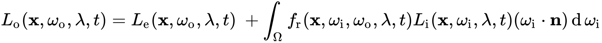

## Gouraud着色法

* [1] Gouraud着色法 https://zh.wikipedia.org/wiki/Gouraud%E7%9D%80%E8%89%B2%E6%B3%95

Gouraud着色法是计算机图形学中的一种插值方法，可以为多边形网格表面生成**连续的明暗变化**。实际使用时，通常先计算三角形每个顶点的光照，再通过**双线性插值**计算三角形区域中其它像素的颜色。

## Tiled rendering
* Tiled rendering is the process of subdividing a computer graphics image by a regular grid in optical space and rendering each section of the grid, or tile, separately. The advantage to this design is that the amount of memory and bandwidth is reduced compared to immediate mode rendering systems that draw the entire frame at once. This has made tile rendering systems particularly common for low-power handheld device use. Tiled rendering is sometimes known as a "sort middle" architecture, because it performs the sorting of the geometry in the middle of the graphics pipeline instead of near the end.

## Vulkan `KHR` postfix
* which means that these objects are part of a Vulkan extension.

## Vulkan swap chain
* The swap chain is a collection of render targets. Its basic purpose is to ensure that the image that we're currently rendering to is different from the one that is currently on the screen.

## Vulkan `Command pools` and `command buffers`
* many of the operations in Vulkan that we want to execute, like drawing operations, need to be submitted to a queue.

## Vulkan Graphics pipeline
* The graphics pipeline in Vulkan is set up by creating a VkPipeline object. It describes the configurable state of the graphics card, like the viewport size and depth buffer operation and the programmable state using VkShaderModule objects. The VkShaderModule objects are created from shader byte code. The driver also needs to know which render targets will be used in the pipeline, which we specify by referencing the render pass.

## Vulkan Validation layers
*  Vulkan is designed for high performance and low driver overhead. Therefore it will include very limited error checking and debugging capabilities by default. The driver will often crash instead of returning an error code if you do something wrong.
* Vulkan allows you to enable extensive checks through a feature known as validation layers. Validation layers are pieces of code that can be inserted between the API and the graphics driver to do things like running extra checks on function parameters and tracking memory management problems.

## Homogeneous coordinates
* https://en.wikipedia.org/wiki/Homogeneous_coordinates

## Material properties
*  http://devernay.free.fr/cours/opengl/materials.html

## Tangent Space (切线空间)

* Tangent Space，其实一个坐标系，也就是原点+三个坐标轴决定的一个相对空间，。在Tangent Space中，坐标原点就是顶点的位置，其中z轴是该顶点本身的法线方向（N）。另外两个坐标轴就是和该点相切的两条切线。这样的切线本来有无数条，但模型一般会给定该顶点的一个tangent，这个tangent方向一般是使用和纹理坐标方向相同的那条tangent（T）。而另一个坐标轴的方向（B）就可以通过normal和tangent的叉乘得到

<div align=center>

</div>

Tangent-Space还有如下一些优点：
* 自由度很高。Tangent-Space Normal Map记录的是相对法线信息，这意味着，即便把该纹理应用到一个完全不同的网格上，也可以得到一个合理的结果。
* 可进行UV动画。比如，我们可以移动一个纹理的UV坐标来实现一个凹凸移动的效果，这种UV动画在水或者火山熔岩这种类型的物体会会用到。
* 可以重用Normal Map。比如，一个砖块，我们可以仅使用一张Normal Map就可以用到所有的六个面上。
* 可压缩。由于Tangent-Space Normal Map中法线的Z方向总是正方向的，因此我们可以仅存储XY方向，而推导得到Z方向。

`reference from`: https://www.zhihu.com/question/23706933

## 折射 散射 反射 衍射
1. 反射：光从一种介质射向另一种介质的交界面时，一部分光返回原来介质中，使光的传播方向发生了改变，这种现象称为光的反射。光的反射定律：反射光线与入射光线、法线在同一平面上；反射光线和入射光线分居在法线的两侧；反射角等于入射角可归纳为：“三线共面，两线分居，两角相等”。

2. 折射：当光由一种介质斜射到另一种介质时，其传播方向发生改变这种现象叫光的折射。光发生折射后，其频率不变，但波长和波速发生改变。光折射时,折射光线,入射光线,法线在同一平面内,折射光线和入射光线分别位于法线的两侧.折射角随入射角的改变而改变，但两者不等。

3. 散射：一束光通过介质时其中一部分光偏离主要的传播方向，这种现象称为光散射。现象的本质是光波电磁场与介质分子相互作用的结果。光的散射是原子或分子体系从入射光波中获得能量后，改变传播方向及相位，甚至改变频率的再辐射过程。

4. 衍射：光离开直线路径绕到障碍物阴影里去的现象叫光的衍射。衍射又称为绕射,光线照射到物体边沿后通过散射继续在空间发射的现象。光衍射的本质：光的衍射与微粒的刚性反弹没有关系，在这里我们要用到的是光的波动性而不是光的粒子性。道理很容易理解：由于光是波动传播的，它走的路线自然就是如正弦函数那样的曲线。

## Rendering equation
https://en.wikipedia.org/wiki/Rendering_equation

In computer graphics, the rendering equation is an integral equation in which the equilibrium radiance leaving a point is given as the sum of emitted plus reflected radiance under a geometric optics approximation.

The physical basis for the rendering equation is the law of conservation of energy. Assuming that L denotes radiance, we have that at each particular position and direction, the outgoing light (Lo) is the sum of the emitted light (Le) and the reflected light. The reflected light itself is the sum from all directions of the incoming light (Li) multiplied by the surface reflection and cosine of the incident angle.

<div align=center>

</div>

* ${\displaystyle L_{\text{o}}(\mathbf {x} ,\omega _{\text{o}},\lambda ,t)}$ is the total spectral radiance of wavelength ${\displaystyle \lambda }$  directed outward along direction ${\displaystyle \omega _{\text{o}}}$ at time ${\displaystyle t}$, from a particular position ${\displaystyle \mathbf {x} }$ 
* ${\displaystyle \mathbf {x} }$ is the location in space
* ${\displaystyle \omega _{\text{o}}}$ is the direction of the outgoing light
* ${\displaystyle \lambda }$  is a particular wavelength of light
* ${\displaystyle t}$ is time
* ${\displaystyle L_{\text{e}}(\mathbf {x} ,\omega _{\text{o}},\lambda ,t)}$ is emitted spectral radiance
* ${\displaystyle \int _{\Omega }\dots \operatorname {d} \omega _{\text{i}}}$ is an integral over ${\displaystyle \Omega }$ 
* ${\displaystyle \Omega }$ is the unit hemisphere centered around ${\displaystyle \mathbf {n} }$  containing all possible values for ${\displaystyle \omega _{\text{i}}}$
* ${\displaystyle f_{\text{r}}(\mathbf {x} ,\omega _{\text{i}},\omega _{\text{o}},\lambda ,t)}$ is the bidirectional reflectance distribution function, the proportion of light reflected from ${\displaystyle \omega _{\text{i}}}$ to ${\displaystyle \omega _{\text{o}}}$ at position ${\displaystyle \mathbf {x} }$ , time ${\displaystyle t}$, and at wavelength ${\displaystyle \lambda }$
* ${\displaystyle \omega _{\text{i}}}$ is the negative direction of the incoming light
* ${\displaystyle L_{\text{i}}(\mathbf {x} ,\omega _{\text{i}},\lambda ,t)}$ is spectral radiance of wavelength ${\displaystyle \lambda }$ coming inward toward ${\displaystyle \mathbf {x} }$  from direction ${\displaystyle \omega _{\text{i}}}$ at time ${\displaystyle t}$
* ${\displaystyle \mathbf {n} }$ is the surface normal at ${\displaystyle \mathbf {x} }$
* ${\displaystyle \omega _{\text{i}}\cdot \mathbf {n} }$ is the weakening factor of outward irradiance due to incident angle, as the light flux is smeared across a surface whose area is larger than the projected area perpendicular to the ray. This is often written as ${\displaystyle \cos \theta _{i}}$.

Two noteworthy features are: its linearity—it is composed only of multiplications and additions, and its spatial homogeneity—it is the same in all positions and orientations. These mean a wide range of factorings and rearrangements of the equation are possible. It is a Fredholm integral equation of the second kind, similar to those that arise in quantum field theory.

Note this equation's spectral and time dependence — ${\displaystyle L_{\text{o}}}$ may be sampled at or integrated over sections of the visible spectrum to obtain, for example, a trichromatic color sample. A pixel value for a single frame in an animation may be obtained by fixing ${\displaystyle t;}$ motion blur can be produced by averaging ${\displaystyle L_{\text{o}}}$ over some given time interval (by integrating over the time interval and dividing by the length of the interval).

Note that a solution to the rendering equation is the function ${\displaystyle L_{\text{o}}}$. The function ${\displaystyle L_{\text{i}}}$ is related to ${\displaystyle L_{\text{o}}}$ via a ray-tracing operation: The incoming radiance from some direction at one point is the outgoing radiance at some other point in the opposite direction.

## 自由电荷
https://baike.baidu.com/item/%E8%87%AA%E7%94%B1%E7%94%B5%E8%8D%B7

自由电荷的特点是物体内部对它们的束缚比较弱，可以在物体内部自由移动；同时，自由电荷并非真实存在，而只是用来描述自由电子移动的一种模型。
物体内部的自由电荷的多少决定了物体导电性能的强弱

## 束缚电荷
https://baike.baidu.com/item/%E6%9D%9F%E7%BC%9A%E7%94%B5%E8%8D%B7

电介质中的正负电荷，在电场力作用下只能在原子或分子范围内做微小位移，它们叫束缚电荷。
在外电场中，均匀介质内部各处仍呈电中性，但在介质表面要出现电荷，这种电荷不能离开电介质到其它带电体，也不能在电介质内部自由移动。称它为束缚电荷或极化电荷

## 电介质
https://baike.baidu.com/item/%E7%94%B5%E4%BB%8B%E8%B4%A8

电工中一般认为电阻率超过10欧·厘米的物质便归于电介质。电介质的带电粒子是被原子、分子的内力或分子间的力紧密束缚着，因此这些粒子的电荷为束缚电荷。在外电场作用下，这些电荷也只能在微观范围内移动，产生极化。在静电场中，电介质内部可以存在电场，这是电介质与导体的基本区别。不导电的物质，如空气、玻璃、云母片、胶木等

## Diffuse reflection
Diffuse reflection is the reflection of light or other waves or particles from a surface such that a ray incident on the surface is scattered at many angles rather than at just one angle as in the case of specular reflection.

<div align=center>

</div>

## Diffuse reflection and specular
If the reflecting surface is nearly flat, but not completely flat, the output light may be spread over some range of angles; that is called diffuse scattering. With a substantially rough surface, causing significant scattering, there can be a substantial angular range, for example with a width of 10°. Particularly volume diffusers, but also some matte paints, tend to produce even a much wider angular distribution of scattered light, often even approaching the standard case of a Lambertian scatterer. That can be considered as the opposite of specular reflection: perfectly diffusing reflection. There can be also a combination of specular and diffuse reflection; an object with such properties exhibits specular highlights (depending on the illumination conditions) in addition to the appearance generated by diffuse scattering.

Specular reflections can appear much brighter than diffuse reflections, when seen from a large distance, because the reflected light is concentrated to a smaller range of directions. (That can be a problem in the context of laser safety.) On the other hand, specular reflections remain unnoticed for an absorber if the reflected light misses his or her eyes.

https://www.rp-photonics.com/specular_reflection.html

## reflection probes (反射探针)
CG films and animations commonly feature highly realistic reflections, which are important for giving a sense of “connectedness” among the objects in the scene. However, the accuracy of these reflections comes with a high cost in processor time and while this is not a problem for films, it severely limits the use of reflective objects in realtime games.

Traditionally, games have used a technique called reflection mapping to simulate reflections from objects while keeping the processing overhead to an acceptable level. This technique assumes that all reflective objects in the scene can “see” (and therefore reflect) the exact same surroundings. This works quite well for the game’s main character (a shiny car, say) if it is in open space but is unconvincing when the character passes into different surroundings; it looks strange if a car drives into a tunnel but the sky is still visibly reflected in its windows.

Unity improves on basic reflection mapping through the use of Reflection Probes, which allow the visual environment to be sampled at strategic points in the scene. You should generally place them at every point where the appearance of a reflective object would change noticeably (eg, tunnels, areas near buildings and places where the ground colour changes). When a reflective object passes near to a probe, the reflection sampled by the probe can be used for the object’s reflection map. Furthermore, when several probes are nearby, Unity can interpolate between them to allow for gradual changes in reflections. Thus, the use of reflection probes can create quite convincing reflections with an acceptable processing overhead.

CG 电影和动画通常具有高度逼真的反射，这对于实现场景对象之间的“连通性”感觉是很重要的。然而，这些反射的准确性伴随着处理器时间的高成本，虽然这对于电影来说不是问题，但它在实时游戏中严重限制了对反射对象的使用。

传统上，游戏使用一种称为_反射贴图_的技术来模拟来自对象的反射，同时将处理开销保持在可接受的水平。此技术假定场景中的所有反射对象都可以“看到”（因此会反射）完全相同的周围环境。如果游戏的主角（比如闪亮的汽车）处于开放空间中，此技术将非常有效，但是当角色进入不同的周围环境时，便看起来不真实；如果一辆汽车驶入隧道但天空仍然在窗户上产生明显反射，看起来就很奇怪。

Unity 通过使用__反射探针__改进了基本反射贴图，这种探针可在场景中的关键点对视觉环境进行采样。通常情况下，应将这些探针放置在反射对象外观发生明显变化的每个点上（例如，隧道、建筑物附近区域和地面颜色变化的地方）。当反射对象靠近探针时，探针采样的反射可用于对象的反射贴图。此外，当几个探针位于彼此附近时，Unity 可在它们之间进行插值，从而实现反射的逐渐变化。因此，使用反射探针可以产生非常逼真的反射，同时将处理开销控制在可接受的水平。

https://docs.unity3d.com/cn/2020.2/Manual/ReflectionProbes.html

## 等距圆柱投影法 Equidistant Cylindrical Projection

<div align=center>

</div>

等距圆柱投影（equidistant cylindrical projection）是一种简单的地图投影方法，在这种投影方法中：假设球面和圆柱面相切于赤道, 将球面上的经纬线投影到圆柱面上, 然后沿圆柱面的一条母线展开成平面的一种投影

http://www.suzhengpeng.com/cvabc-01

## Cubemaps

Google: Panorama to Cubemap

Google: invAtan glsl

* `cartesian coordinates` to `polar angles` to `uvs`

The invAtan constant is the [reciprocal(or multiplicative inverse)](https://en.wikipedia.org/wiki/Multiplicative_inverse) of 2PI and PI:

* 0.1591 = 1/6.28319(=>2PI) = 360 degrees in radians
* 0.3183 = 1/3.14159(=>PI) = 180 degrees in radians

```c++
#version 330 core
out vec4 FragColor;
in vec3 localPos;

uniform sampler2D equirectangularMap;

const vec2 invAtan = vec2(0.1591, 0.3183);
vec2 SampleSphericalMap(vec3 v)
{
    vec2 uv = vec2(atan(v.z, v.x), asin(v.y));
    uv *= invAtan;
    uv += 0.5;
    return uv;
}

void main()
{       
    vec2 uv = SampleSphericalMap(normalize(localPos)); // make sure to normalize localPos
    vec3 color = texture(equirectangularMap, uv).rgb;

    FragColor = vec4(color, 1.0);
}
```

http://paulbourke.net/geometry/transformationprojection/

https://stackoverflow.com/questions/48494389/how-does-this-code-sample-from-a-spherical-map/48534536

* `cartesian coordinates` to `polar angles`

<div align=center>

</div>

<div align=center>

</div>

* x= r sin θ cos ø
* y= r sin θ sin ø
* z= r cos θ

https://stackoverflow.com/questions/29678510/convert-21-equirectangular-panorama-to-cube-map

## RHI
RHI = Rendering Hardware Interface. It's the C++ interface which the high-level platform-independent rendering code in Unreal Engine 4 uses to communicate with the several platform-dependent implementations that exist for Direct3D, OpenGL, etc.

https://answers.unrealengine.com/questions/37056/view.html

## Global Illumination
1. *https://baike.baidu.com/item/%E5%85%A8%E5%B1%80%E5%85%89%E7%85%A7*

全局光照，表现了直接照明和间接照明的综合效果。
全局光照有多种实现方法，例如辐射度、光线追踪、环境光遮蔽（ambient occlusion）、光子贴图、Light Probe等

2. *https://www.jianshu.com/p/d00c0ad9cb4b*

`Global Illumination（全局光照，缩写GI）`，是3D计算机图形中使用的一组算法通用名称，旨在为3D场景添加更逼真的照明效果。

这种算法不仅考虑到直接来自光源的光照情况（直接光照），也会考虑到来自相同光源的光线照射到场景中物体表面时，又反弹到其他表面的后续情况（间接光照）。

在真实的世界里，光源会发射出大量的`光子(Light photons)`。光子达到物体表面后反弹(Bounce)，根据反弹表面的色彩面改变自身的颜色，最终进入我们的眼睛。`GI（Global Illumination）全局照明模式`就是尝试模拟这种光子反弹式的物理照明过程。

光线直接照射物体表面，而没有经过光子反弹，称之为`直接光照(Direct lighting)`。光线经过一次或者多次物体表面的反弹，称之为`间接光照(Indirect lighting)`。GI的核心是计算间接光照。

当光子碰撞到一个`粗糙表面(Rough surface)`，它就会被随机地向各个方向散射出去，这就是所谓的`漫反射全局光照(Diffuse Global Illumination)`。当光子击中一个强烈的`反射表面(Reflective surface)`或`折射表面(Refractive surface)`，如镜面或者玻璃，它往往会向一个更可预测的方向反弹。光子离开反射、折射后，往往会“集结”在一起，形成有趣的光亮图案。这种图案被称为`焦散(Caustics)`。`全局光照(Global Illumination)`，在一般情况下，就是指这两种效应：漫反射GI和焦散。

<div align=center>

</div>

在场景中引入更多的GI反弹次数会使光影效果更加明亮

<div align=center>

</div>

* *0次GI反弹，画面中部被直接照亮的条状物照亮了画面右侧的条状物；1次GI反弹被间接照度的右侧条状物现在再次反弹照亮了左侧的条状物，在右侧条状物下面的地面，也被额外的光照亮了；2 次GI反弹，现在左侧几何体也开始反弹间接照明光线，影响它们脚下的地面了。相比于第0次和第1 次GI反弹之间的差异，这次影响很微妙*

## Importance sampling (重要性采样)
*https://zhuanlan.zhihu.com/p/41269520*

尽量采样定义域内重要的点，少采样不重要的点

<div align=center>

</div>

## (un) Biased render
*https://www.zhihu.com/question/26683585/answer/33906916*

估计量（estimator）是统计学里的概念，所有用来估计的东西都可以叫估计量，例如我想知道全市人口的男女比例，我可以通过我们班级的男女比例去估计，只不过这也许是个很不靠谱的估计量。所以估计量有许多属性来让人们认清它的优劣，图形渲染提到最多的是无偏、有偏（Biased/Unbiased）估计量，还有一致、非一致（Consistent/Inconsistent）估计量。无偏估计量指的是估计量的的期望值(Expected value)等于真实值。一致估计量则是在样本数量越多，估计量的值会向真实值收敛，无穷多样本的时候。估计量也无穷接近于真实值。这两个属性没有必然联系。无偏估计量可以是非一致的，同样一致估计量也可以是有偏的。

## Path Tracing (路径追踪)
*https://zhuanlan.zhihu.com/p/41269520*

结合光线追踪的基本框架，我们可以认为路径追踪就是把光线以路径的形式重新组织了起来

<div align=center>

</div>

path tracing中的一条路径


## BVH（Bounding Volume Hierarchy）
*https://blog.csdn.net/air_liang1212/article/details/105520107*

*https://zhuanlan.zhihu.com/p/114307697*

* 为什么要引入BVH（Bounding Volume Hierarchies 层次包围盒）
  * 之前，我们每发出一条射线就要进行许多次的求交运算（和渲染的物体数量成正比，也就是说时间复杂度 $O({n})$）；求交命中了还好，要是求交点不中，就相当于之前所作的运算全白费了（大概率是命中不了）。在这种情况下渲染时间就会变得超长。
  * 在此背景下引入了一系列的算法优化，其中一个就是`BVH`。
  * 具体来说，BVH的核心思想就是用体积略大而几何特征简单的包围盒来近似描述复杂的几何对象，并且这种包围盒是嵌套的，我们只需要对包围盒进行进一步的相交测试，就可以越来越逼近实际对象（很明显这个功能需要用到树形的层次结构）
  
<div align=center>

</div>

## Implicit surface
*https://en.wikipedia.org/wiki/Implicit_surface*

An implicit surface is the set of zeros of a function of three variables. Implicit means that the equation is not solved for x or y or z. The graph of a function is usually described by an equation and is called an explicit representation.

## 走样与反走样（Aliasing/Anti-Aliasing）

* *https://zh.wikipedia.org/zh-cn/%E5%8F%8D%E9%8B%B8%E9%BD%92*

* 例子
  * *https://zhuanlan.zhihu.com/p/33444429*


## GLSL Basic

### version

Since OpenGL 3.3 and higher the version numbers of GLSL match the version of OpenGL (GLSL version 420 corresponds to OpenGL version 4.2 for example). We also explicitly mention we're using core profile functionality.


### Ins and outs


GLSL defined the in and out keywords specifically for that purpose. Each shader can specify inputs and outputs using those keywords and wherever an output variable matches with an input variable of the next shader stage they're passed along.


### Uniforms

1.Uniforms are another way to pass data from our application on the CPU to the shaders on the GPU. Uniforms are however slightly different compared to vertex attributes.First of all, uniforms are global. Global, meaning that a uniform variable is unique per shader program object, and can be accessed from any shader at any stage in the shader program. Second, whatever you set the uniform value to, uniforms will keep their values until they're either reset or updated.

2.uniforms are a useful tool for setting attributes that may change every frame, or for interchanging data between your application and your shaders

Notice:
    If you declare a uniform that isn't used anywhere in your GLSL code the compiler will silently remove the variable from the compiled version which is the cause for several frustrating errors; keep this in mind!
