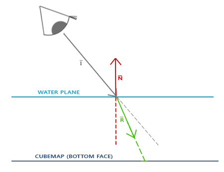

# Advanced OepnGL

## Depth testing
The depth-buffer is a buffer that, just like the color buffer (that stores all the fragment colors: the visual output), stores information per fragment and has the same width and height as the color buffer. The depth buffer is automatically created by the windowing system and stores its depth values as 16, 24 or 32 bit floats. In most systems you'll see a depth buffer with a precision of 24 bits

When depth testing is enabled, OpenGL tests the depth value of a fragment against the content of the depth buffer. OpenGL performs a depth test and if this test passes, the fragment is rendered and the depth buffer is updated with the new depth value. If the depth test fails, the fragment is discarded.

Depth testing is done in screen space after the fragment shader has run,The screen space coordinates relate directly to the viewport defined by OpenGL's glViewport function and can be accessed via GLSL's built-in gl_FragCoord variable in the fragment shader.

Depth testing is disabled by default so to enable depth testing we need to enable it with the GL_DEPTH_TEST option

`glEnable(GL_DEPTH_TEST);`

Once enabled, OpenGL automatically stores fragments their z-values in the depth buffer if they passed the depth test and discards fragments if they failed the depth test accordingly. If you have depth testing enabled you should also clear the depth buffer before each frame using GL_DEPTH_BUFFER_BIT; otherwise you're stuck with the depth values from last frame:

`glClear(GL_COLOR_BUFFER_BIT | GL_DEPTH_BUFFER_BIT);`

you want to perform the depth test on all fragments and discard them accordingly, but not update the depth buffer. 

`glDepthMask(GL_FALSE);`

### Depth test function###

OpenGL allows us to modify the comparison operators it uses for the depth test. This allows us to control when OpenGL should pass or discard fragments and when to update the depth buffer. We can set the comparison operator (or depth function) by calling glDepthFunc:

`glDepthFunc(GL_LESS);`

### Depth value precision
The depth buffer contains depth values between 0.0 and 1.0 and it compares its content with the z-values of all the objects in the scene as seen from the viewer. These z-values in view space can be any value between the projection-frustum's near and far plane. We thus need some way to transform these view-space z-values to the range of [0,1] and one way is to linearly transform them. The following (linear) equation transforms the z-value to a depth value between 0.0 and 1.0:

$$
\begin{aligned} 
F_{depth} = \frac{z - near}{far - near} 
\end{aligned}
$$

e.g.

<div align=center>

</div> 

Note that all equations give a depth value close to 0.0 when the object is close by and a depth value close to 1.0 when the object is close to the far plane

a linear depth buffer like this is almost never used. Because of projection properties a non-linear depth equation is used that is proportional to 1/z. The result is that we get enormous precision when z is small and much less precision when z is far away.

$$
\begin{aligned} F_{depth} = \frac{1/z - 1/near}{1/far - 1/near} \end{aligned}
$$

the values in the depth buffer are not linear in clip-space (they are linear in view-space before the projection matrix is applied). A value of 0.5 in the depth buffer does not mean the pixel's z-value is halfway in the frustum; the z-value of the vertex is actually quite close to the near plane! You can see the non-linear relation between the z-value and the resulting depth buffer's value in the following graph:

<div align=center>

</div> 

the depth values are greatly determined by the small z-values giving us large depth precision to the objects close by. The equation to transform z-values (from the viewer's perspective) is embedded within the projection matrix so when we transform vertex coordinates from view to clip, and then to screen-space the non-linear equation is applied.

### Visualizing the depth buffer

the z-value of the built-in gl_FragCoord vector in the fragment shader contains the depth value of that particular fragment.

```GLSL
void main()
{             
    FragColor = vec4(vec3(gl_FragCoord.z), 1.0);
} 
```

transform the non-linear depth values of the fragment back to its linear sibling

```GLSL
float ndc = depth * 2.0 - 1.0; 
float linearDepth = (2.0 * near * far) / (far + near - ndc * (far - near));	
```

complete

```GLSL
#version 330 core
out vec4 FragColor;

float near = 0.1; 
float far  = 100.0; 
  
float LinearizeDepth(float depth) 
{
    float z = depth * 2.0 - 1.0; // back to NDC 
    return (2.0 * near * far) / (far + near - z * (far - near));	
}

void main()
{             
    float depth = LinearizeDepth(gl_FragCoord.z) / far; // divide by far for demonstration
    FragColor = vec4(vec3(depth), 1.0);
}
```

### *Z-fighting

A common visual artifact may occur when two planes or triangles are so closely aligned to each other that the depth buffer does not have enough precision to figure out which one of the two shapes is in front of the other. The result is that the two shapes continually seem to switch order which causes weird glitchy patterns. This is called z-fighting, because it looks like the shapes are fighting over who gets on top.

<div align=center>

</div> 

### Prevent z-fighting

* The first and most important trick is never place objects too close to each other in a way that some of their triangles closely overlap
* A second trick is to set the near plane as far as possible.
* Another great trick at the cost of some performance is to use a higher precision depth buffer. Most depth buffers have a precision of 24 bits, but most GPUs nowadays support 32 bit depth buffers, increasing the precision by a significant amount

## Stencil testing

Once the fragment shader has processed the fragment a so called stencil test is executed that, just like the depth test, has the option to discard fragments. After that the remaining fragments are passed to the depth test where OpenGL could possibly discard even more fragments. The stencil test is based on the content of yet another buffer called the stencil buffer that we're allowed to update during rendering to achieve interesting effects.

A stencil buffer (usually) contains 8 bits per stencil value that amounts to a total of 256 different stencil values per pixel. We can set these stencil values to values of our liking and we can discard or keep fragments whenever a particular fragment has a certain stencil value.

<div align=center>

</div> 

`glEnable(GL_STENCIL_TEST);`

also need to clear the stencil buffer each iteration just like the color and depth buffer

`glClear(GL_COLOR_BUFFER_BIT | GL_DEPTH_BUFFER_BIT | GL_STENCIL_BUFFER_BIT);`

```C++
glStencilMask(0xFF); // each bit is written to the stencil buffer as is
glStencilMask(0x00); // each bit ends up as 0 in the stencil buffer (disabling writes)
```

### Stencil functions

Similar to depth testing, we have a certain amount of control over when a stencil test should pass or fail and how it should affect the stencil buffer. There are a total of two functions we can use to configure stencil testing: `glStencilFunc` and `glStencilOp`.

e.g.

```c++
glEnable(GL_STENCIL_TEST);
glStencilFunc(GL_NOTEQUAL, 1, 0xFF);
glStencilOp(GL_KEEP, GL_KEEP, GL_REPLACE);
```

### Object outlining

when you want to select units in a strategy game for example and need to show the user which of the units were selected. The routine for outlining your objects is as follows:

* Enable stencil writing.
* Set the stencil op to GL_ALWAYS before drawing the (to be outlined) objects, updating the stencil buffer with 1s wherever the objects' fragments are rendered.
* Render the objects.
* Disable stencil writing and depth testing.
* Scale each of the objects by a small amount.
* Use a different fragment shader that outputs a single (border) color.
* Draw the objects again, but only if their fragments' stencil values are not equal to 1.
* Enable depth testing again and restore stencil func to GL_KEEP.

Stencil testing has many more purposes (beside outlining objects) like drawing textures inside a rear-view mirror so it neatly fits into the mirror shape, or rendering real-time shadows with a stencil buffer technique called shadow volumes

Code

```C++
glEnable(GL_DEPTH_TEST);
glStencilOp(GL_KEEP, GL_KEEP, GL_REPLACE);  
  
glClear(GL_COLOR_BUFFER_BIT | GL_DEPTH_BUFFER_BIT | GL_STENCIL_BUFFER_BIT); 

glStencilMask(0x00); // make sure we don't update the stencil buffer while drawing the floor
normalShader.use();
DrawFloor()  
  
glStencilFunc(GL_ALWAYS, 1, 0xFF); 
glStencilMask(0xFF); 
DrawTwoContainers();
  
glStencilFunc(GL_NOTEQUAL, 1, 0xFF);
glStencilMask(0x00); 
glDisable(GL_DEPTH_TEST);
shaderSingleColor.use(); 
DrawTwoScaledUpContainers();
glStencilMask(0xFF);
glStencilFunc(GL_ALWAYS, 1, 0xFF);   
glEnable(GL_DEPTH_TEST); 
```

## Blending
Blending in OpenGL is commonly known as the technique to implement transparency within objects. Transparency is all about objects (or parts of them) not having a solid color, but having a combination of colors from the object itself and any other object behind it with varying intensity. A colored glass window is a transparent object; the glass has a color of its own, but the resulting color contains the colors of all the objects behind the glass as well. This is also where the name blending comes from, since we blend several pixel colors (from different objects) to a single color. Transparency thus allows us to see through objects.

<div align=center>

</div> 

Transparent objects can be completely transparent (letting all colors through) or partially transparent (letting colors through, but also some of its own colors). The amount of transparency of an object is defined by its color's alpha value

### Discarding fragments

loads an image's alpha channel

`glTexImage2D(GL_TEXTURE_2D, 0, GL_RGBA, width, height, 0, GL_RGBA, GL_UNSIGNED_BYTE, data);`

```C++
void main()
{
    // FragColor = vec4(vec3(texture(texture1, TexCoords)), 1.0);
    //
    //              |
    //              V
    //
    FragColor = texture(texture1, TexCoords);
}
```

discard the alpha values

```GLSL

#version 330 core
out vec4 FragColor;

in vec2 TexCoords;

uniform sampler2D texture1;

void main()
{             
    vec4 texColor = texture(texture1, TexCoords);
    if(texColor.a < 0.1)
        discard;
    FragColor = texColor;
}
```

Notice

use GL_CLAMP_TO_EDGE to prevent semi-transparent borders. Due to interpolation it takes texels from next repeat

Note that when sampling textures at their borders, OpenGL interpolates the border values with the next repeated value of the texture (because we set its wrapping parameters to GL_REPEAT by default). This is usually okay, but since we're using transparent values, the top of the texture image gets its transparent value interpolated with the bottom border's solid color value. The result is then a slightly semi-transparent colored border you may see wrapped around your textured quad. To prevent this, set the texture wrapping method to GL_CLAMP_TO_EDGE whenever you use alpha textures that you don't want to repeat:

<div align=center>

</div> 

```C++
glTexParameteri( GL_TEXTURE_2D, GL_TEXTURE_WRAP_S, GL_CLAMP_TO_EDGE);	
glTexParameteri( GL_TEXTURE_2D, GL_TEXTURE_WRAP_T, GL_CLAMP_TO_EDGE);
```

### Blending

can enable blending by enabling GL_BLEND

`glEnable(GL_BLEND);`

Blending in OpenGL happens with the following equation

$$
\begin{aligned}
\bar{C}_{result} = \bar{\color{green}C}_{source} * \color{green}F_{source} + \bar{\color{red}C}_{destination} * \color{red}F_{destination}
\end{aligned}
$$

* $\bar{\color{green}C}_{source}$: the source color vector. This is the color output of the fragment shader.
* $\bar{\color{red}C}_{destination}$: the destination color vector. This is the color vector that is currently stored in the color buffer.
* $\color{green}F_{source}$: the source factor value. Sets the impact of the alpha value on the source color.
* $\color{red}F_{destination}$:  the destination factor value. Sets the impact of the alpha value on the destination color.

After the fragment shader has run and all the tests have passed, this `blend equation` is let loose on the fragment's color output and with whatever is currently in the color buffer. The source and destination colors will automatically be set by OpenGL, but the source and destination factor can be set to a value of our choosing.

<div align=center>

</div> 

draw the semi-transparent green square on top of the red square. The red square will be the destination color (and thus should be first in the color buffer)

$$
\begin{aligned}
\bar{C}_{result} = \begin{pmatrix} \color{red}{0.0} \\ \color{green}{1.0} \\ \color{blue}{0.0} \\ \color{purple}{0.6} \end{pmatrix} * \color{green}{0.6} + \begin{pmatrix} \color{red}{1.0} \\ \color{green}{0.0} \\ \color{blue}{0.0} \\ \color{purple}{1.0} \end{pmatrix} * (\color{red}{1 - 0.6}) 
\end{aligned}
$$

The result is that the combined square fragments contain a color that is 60% green and 40% red:

<div align=center>

</div> 

tell OpenGL to use factors

```c++
glBlendFunc(GL_SRC_ALPHA, GL_ONE_MINUS_SRC_ALPHA);  

// It is also possible to set different options for the RGB and alpha channel individually using glBlendFuncSeparate:
glBlendFuncSeparate(GL_SRC_ALPHA, GL_ONE_MINUS_SRC_ALPHA, GL_ONE, GL_ZERO);
```

`GL_ONE_MINUS_SRC_ALPHA`	Factor is equal to $1 - alpha$ of the source color vector $\bar{\color{green}C}_{source}$.

### Rendering semi-transparent textures

```C++
glEnable(GL_BLEND);
glBlendFunc(GL_SRC_ALPHA, GL_ONE_MINUS_SRC_ALPHA);  
```

(whenever OpenGL renders a fragment) it combines the current fragment's color with the fragment color currently in the color buffer based on the alpha value of FragColor. Since the glass part of the window texture is semi-transparent we should be able to see the rest of the scene by looking through this window.

<div align=center>

</div>

The transparent parts of the front window are occluding the windows in the background. Why is this happening?

The reason for this is that depth testing works a bit tricky combined with blending. When writing to the depth buffer, the depth test does not care if the fragment has transparency or not, so the transparent parts are written to the depth buffer as any other value. The result is that the background windows are tested on depth as any other opaque object would be, ignoring transparency. Even though the transparent part should show the windows behind it, the depth test discards them.

So we cannot simply render the windows however we want and expect the depth buffer to solve all our issues for us; this is also where blending gets a little nasty. To make sure the windows show the windows behind them, we have to draw the windows in the background first. This means we have to manually sort the windows from furthest to nearest and draw them accordingly ourselves.

### Don't break the order

To make blending work for multiple objects we have to draw the most distant object first and the closest object last. The normal non-blended objects can still be drawn as normal using the depth buffer so they don't have to be sorted. We do have to make sure they are drawn first before drawing the (sorted) transparent objects. When drawing a scene with non-transparent and transparent objects the general outline is usually as follows:

* Draw all opaque objects first.
* Sort all the transparent objects.
* Draw all the transparent objects in sorted order.

One way of sorting the transparent objects is to retrieve the distance of an object from the viewer's perspective. This can be achieved by taking the distance between the camera's position vector and the object's position vector. We then store this distance together with the corresponding position vector in a map data structure from the STL library. A map automatically sorts its values based on its keys, so once we've added all positions with their distance as the key they're automatically sorted on their distance value:

* automatically sorted on their distance value

```c++
std::map<float, glm::vec3> sorted;
for (unsigned int i = 0; i < windows.size(); i++)
{
    float distance = glm::length(camera.Position - windows[i]);
    sorted[distance] = windows[i];
}
```

* draw the corresponding windows in correct order

```c++
for(std::map<float,glm::vec3>::reverse_iterator it = sorted.rbegin(); it != sorted.rend(); ++it) 
{
    model = glm::mat4(1.0f);
    model = glm::translate(model, it->second);				
    shader.setMat4("model", model);
    glDrawArrays(GL_TRIANGLES, 0, 6);
}  
```

<div align=center>

</div>

While this approach of sorting the objects by their distance works well for this specific scenario, it doesn't take rotations, scaling or any other transformation into account and weirdly shaped objects need a different metric than simply a position vector.

## Face culling

You can view a cube from any position and/or direction, but you would never be able to see more than 3 faces.

how do we know if a face of an object is not visible from the viewer's point of view?

OpenGL checks all the faces that are front facing towards the viewer and renders those while discarding all the faces that are back facing, OpenGL uses a clever trick for this by analyzing the winding order of the vertex data.

### *Winding order

When we define a set of triangle vertices we're defining them in a certain winding order that is either clockwise or counter-clockwise. Each triangle consists of 3 vertices and we specify those 3 vertices in a winding order as seen from the center of the triangle.

<div align=center>

</div> 

By default, triangles defined with counter-clockwise vertices are processed as front-facing triangles.

All the triangle vertices that the viewer is then facing are indeed in the correct winding order as we specified them, but the vertices of the triangles at the other side of the cube are now rendered in such a way that their winding order becomes reversed. The result is that the triangles we're facing are seen as front-facing triangles and the triangles at the back are seen as back-facing triangles.

<div align=center>

</div> 

In the vertex data we defined both triangles in counter-clockwise order (the front and back triangle as 1, 2, 3). However, from the viewer's direction the back triangle is rendered clockwise if we draw it in the order of 1, 2 and 3 from the viewer's current point of view. Even though we specified the back triangle in counter-clockwise order, it is now rendered in a clockwise order. This is exactly what we want to cull (discard) non-visible faces!

### Face culling

To enable face culling we only have to enable OpenGL's GL_CULL_FACE option:

`glEnable(GL_CULL_FACE);`

OpenGL allows us to change the type of face we want to cull as well. What if we want to cull front faces and not the back faces? We can define this behavior with glCullFace:

`glCullFace(GL_FRONT);`

The initial value of glCullFace is GL_BACK. We can also tell OpenGL we'd rather prefer clockwise faces as the front-faces instead of counter-clockwise faces via glFrontFace:

`glFrontFace(GL_CCW);`

The default value is GL_CCW that stands for counter-clockwise ordering with the other option being GL_CW which (obviously) stands for clockwise ordering.

## Framebuffers
So far we've used several types of screen buffers: a color buffer for writing color values, a depth buffer to write and test depth information, and finally a stencil buffer that allows us to discard certain fragments based on some condition. The combination of these buffers is stored somewhere in GPU memory and is called a framebuffer. OpenGL gives us the flexibility to define our own framebuffers and thus define our own color (and optionally a depth and stencil) buffer.

rendering your scene to a different framebuffer allows us to use that result to create mirrors in a scene, or do cool post-processing effects for example

### Creating a framebuffer

Just like any other object in OpenGL we can create a framebuffer object (abbreviated to FBO) by using a function called glGenFramebuffers:

```c++
unsigned int fbo;
glGenFramebuffers(1, &fbo);

glBindFramebuffer(GL_FRAMEBUFFER, fbo);  
```
By binding to the GL_FRAMEBUFFER target all the next read and write framebuffer operations will affect the currently bound framebuffer. It is also possible to bind a framebuffer to a read or write target specifically by binding to GL_READ_FRAMEBUFFER or GL_DRAW_FRAMEBUFFER respectively. The framebuffer bound to GL_READ_FRAMEBUFFER is then used for all read operations like glReadPixels and the framebuffer bound to GL_DRAW_FRAMEBUFFER is used as the destination for rendering, clearing and other write operations. Most of the times you won't need to make this distinction though and you generally bind to both with GL_FRAMEBUFFER.

For a framebuffer to be complete the following requirements have to be satisfied:

* We have to attach at least one buffer (color, depth or stencil buffer).
* There should be at least one color attachment.
* All attachments should be complete as well (reserved memory).
* Each buffer should have the same number of samples.

`if(glCheckFramebufferStatus(GL_FRAMEBUFFER) == GL_FRAMEBUFFER_COMPLETE)`

All subsequent rendering operations will now render to the attachments of the currently bound framebuffer. Since our framebuffer is not the default framebuffer, the rendering commands will have no impact on the visual output of your window. For this reason it is called off-screen rendering when rendering to a different framebuffer. If you want all rendering operations to have a visual impact again on the main window we need to make the default framebuffer active by binding to 0:

`glBindFramebuffer(GL_FRAMEBUFFER, 0);`

delete the framebuffer object When we're done with all framebuffer operations

`glDeleteFramebuffers(1, &fbo);`

Before the completeness check is executed we need to attach one or more attachments to the framebuffer. An attachment is a memory location that can act as a buffer for the framebuffer, think of it as an image. When creating an attachment we have two options to take: textures or renderbuffer objects.

* ***Texture attachments***
  * When attaching a texture to a framebuffer, all rendering commands will write to the texture as if it was a normal color/depth or stencil buffer. The advantage of using textures is that the render output is stored inside the texture image that we can then easily use in our shaders.

```c++
unsigned int texture;
glGenTextures(1, &texture);
glBindTexture(GL_TEXTURE_2D, texture);
  
glTexImage2D(GL_TEXTURE_2D, 0, GL_RGB, 800, 600, 0, GL_RGB, GL_UNSIGNED_BYTE, NULL);

glTexParameteri(GL_TEXTURE_2D, GL_TEXTURE_MIN_FILTER, GL_LINEAR);
glTexParameteri(GL_TEXTURE_2D, GL_TEXTURE_MAG_FILTER, GL_LINEAR);  
```

  * The main differences here is that we set the dimensions equal to the screen size (although this is not required) and we pass NULL as the texture's data parameter. For this texture, we're only allocating memory and not actually filling it. Filling the texture will happen as soon as we render to the framebuffer. Also note that we do not care about any of the wrapping methods or mipmapping since we won't be needing those in most cases.

  * Note
    * If you want to render your whole screen to a texture of a smaller or larger size you need to call glViewport again (before rendering to your framebuffer) with the new dimensions of your texture, otherwise render commands will only fill part of the texture.

  * attach it to the framebuffer
    * `glFramebufferTexture2D(GL_FRAMEBUFFER, GL_COLOR_ATTACHMENT0, GL_TEXTURE_2D, texture, 0);`
  
  * Next to the color attachments we can also attach a depth and a stencil texture to the framebuffer object

    * e.g.

  ```c++
  glTexImage2D(
    GL_TEXTURE_2D, 0, GL_DEPTH24_STENCIL8, 800, 600, 0, 
    GL_DEPTH_STENCIL, GL_UNSIGNED_INT_24_8, NULL
  );

  glFramebufferTexture2D(GL_FRAMEBUFFER, GL_DEPTH_STENCIL_ATTACHMENT, GL_TEXTURE_2D, texture, 0); 
  ```

* ***Renderbuffer object attachments***
  * `Renderbuffer objects` were introduced to OpenGL after textures as a possible type of framebuffer attachment, Just like a texture image, a renderbuffer object is an actual buffer e.g. an array of bytes, integers, pixels or whatever. However, a renderbuffer object can not be directly read from. This gives it the added advantage that OpenGL can do a few memory optimizations that can give it a performance edge over textures for off-screen rendering to a framebuffer.

  * Renderbuffer objects store all the render data directly into their buffer without any conversions to texture-specific formats, making them faster as a writeable storage medium. You cannot read from them directly, but it is possible to read from them via the slow `glReadPixels`. This returns a specified area of pixels from the currently bound framebuffer, but not directly from the attachment itself.

  * Because their data is in a native format they are quite fast when writing data or copying data to other buffers. Operations like switching buffers are therefore quite fast when using renderbuffer objects. The `glfwSwapBuffers` function we've been using at the end of each frame may as well be implemented with renderbuffer objects: we simply write to a renderbuffer image, and swap to the other one at the end. Renderbuffer objects are perfect for these kind of operations.

  * Creating a renderbuffer object

  ```c++
  unsigned int rbo; 
  glGenRenderbuffers(1, &rbo);

  glBindRenderbuffer(GL_RENDERBUFFER, rbo);  

  // Creating a renderbuffer object is similar to texture objects, 
  // the difference being that this object is specifically designed to be used as a framebuffer attachment, 
  // instead of a general purpose data buffer like a texture. 
  // Here we've chosen GL_DEPTH24_STENCIL8 as the internal format, 
  // which holds both the depth and stencil buffer with 24 and 8 bits respectively.

  glRenderbufferStorage(GL_RENDERBUFFER, GL_DEPTH24_STENCIL8, 800, 600);

  glFramebufferRenderbuffer(GL_FRAMEBUFFER, GL_DEPTH_STENCIL_ATTACHMENT, GL_RENDERBUFFER, rbo);  
  ```

  * Renderbuffer objects can be more efficient for use in your off-screen render projects, but it is important to realize when to use renderbuffer objects and when to use textures. The general rule is that if you never need to sample data from a specific buffer, it is wise to use a renderbuffer object for that specific buffer. If you need to sample data from a specific buffer like colors or depth values, you should use a texture attachment instead.


### Rendering to a texture

We're going to render the scene into a color texture attached to a framebuffer object we created and then draw this texture over a simple quad that spans the whole screen. The visual output is then exactly the same as without a framebuffer, but this time it's all printed on top of a single quad


```c++
// -> First thing to do is to create an actual framebuffer object and bind it,

unsigned int framebuffer;
glGenFramebuffers(1, &framebuffer);
glBindFramebuffer(GL_FRAMEBUFFER, framebuffer);  


// -> Next we create a texture image that we attach as a color attachment to the framebuffer. We set the texture's dimensions equal to the width and height of the window and keep its data uninitialized

// generate texture
unsigned int texColorBuffer;
glGenTextures(1, &texColorBuffer);
glBindTexture(GL_TEXTURE_2D, texColorBuffer);
glTexImage2D(GL_TEXTURE_2D, 0, GL_RGB, 800, 600, 0, GL_RGB, GL_UNSIGNED_BYTE, NULL);
glTexParameteri(GL_TEXTURE_2D, GL_TEXTURE_MIN_FILTER, GL_LINEAR );
glTexParameteri(GL_TEXTURE_2D, GL_TEXTURE_MAG_FILTER, GL_LINEAR);
glBindTexture(GL_TEXTURE_2D, 0);

// attach it to currently bound framebuffer object
glFramebufferTexture2D(GL_FRAMEBUFFER, GL_COLOR_ATTACHMENT0, GL_TEXTURE_2D, texColorBuffer, 0);

// -> We also want to make sure OpenGL is able to do depth testing (and optionally stencil testing) so we have to make sure to add a depth (and stencil) attachment to the framebuffer. Since we'll only be sampling the color buffer and not the other buffers we can create a renderbuffer object for this purpose.

unsigned int rbo;
glGenRenderbuffers(1, &rbo);
glBindRenderbuffer(GL_RENDERBUFFER, rbo); 
glRenderbufferStorage(GL_RENDERBUFFER, GL_DEPTH24_STENCIL8, 800, 600);  
glBindRenderbuffer(GL_RENDERBUFFER, 0);

// -> Once we've allocated enough memory for the renderbuffer object we can unbind the renderbuffer. Then, as a final step before we complete the framebuffer, we attach the renderbuffer object to the depth and stencil attachment of the framebuffer:
glFramebufferRenderbuffer(GL_FRAMEBUFFER, GL_DEPTH_STENCIL_ATTACHMENT, GL_RENDERBUFFER, rbo);

// -> Then we want to check if the framebuffer is complete and if it's not, we print an error message.

if(glCheckFramebufferStatus(GL_FRAMEBUFFER) != GL_FRAMEBUFFER_COMPLETE)
	std::cout << "ERROR::FRAMEBUFFER:: Framebuffer is not complete!" << std::endl;

// Be sure to unbind the framebuffer to make sure we're not accidentally rendering to the wrong framebuffer.
glBindFramebuffer(GL_FRAMEBUFFER, 0);  

```

Now that the framebuffer is complete, all we need to do to render to the framebuffer's buffers instead of the default framebuffers is to simply bind the framebuffer object. All subsequent render commands will then influence the currently bound framebuffer. All the depth and stencil operations will also read from the currently bound framebuffer's depth and stencil attachments if they're available. If you were to omit a depth buffer for example, all depth testing operations will no longer work.

So, to draw the scene to a single texture we'll have to take the following steps:

* Render the scene as usual with the new framebuffer bound as the active framebuffer.
* Bind to the default framebuffer.
* Draw a quad that spans the entire screen with the new framebuffer's color buffer as its texture.

The vertex shade

```GLSL
#version 330 core
layout (location = 0) in vec2 aPos;
layout (location = 1) in vec2 aTexCoords;

out vec2 TexCoords;

void main()
{
    gl_Position = vec4(aPos.x, aPos.y, 0.0, 1.0); 
    TexCoords = aTexCoords;
}  
```

The fragment shader

```GLSL
#version 330 core
out vec4 FragColor;
  
in vec2 TexCoords;

uniform sampler2D screenTexture;

void main()
{ 
    FragColor = texture(screenTexture, TexCoords);
}
```

Well, because we can now freely access each of the pixels of the completely rendered scene as a single texture image, we can create some interesting effects in the fragment shader.

```c++
// main loop
while (!glfwWindowShouldClose(window))
{
    // bind to framebuffer and draw scene as we normally would to color texture 
    glBindFramebuffer(GL_FRAMEBUFFER, framebuffer);
    glEnable(GL_DEPTH_TEST); // enable depth testing (is disabled for rendering screen-space quad)

    // make sure we clear the framebuffer's content
    glClearColor(0.1f, 0.1f, 0.1f, 1.0f);
    glClear(GL_COLOR_BUFFER_BIT | GL_DEPTH_BUFFER_BIT);

    // draw cubes
    glBindVertexArray(cubeVAO);
    ...

    // draw floor
    glBindVertexArray(planeVAO);
    ...

    // now bind back to default framebuffer and draw a quad plane with the attached framebuffer color texture
    glBindFramebuffer(GL_FRAMEBUFFER, 0);

    // clear all relevant buffers
    glClearColor(1.0f, 1.0f, 1.0f, 1.0f); // set clear color to white (not really necessery)

    screenShader.use();
    glBindVertexArray(quadVAO);
    glBindTexture(GL_TEXTURE_2D, textureColorbuffer);	// use the color attachment texture as the texture of the quad plane
    glDrawArrays(GL_TRIANGLES, 0, 6);
}
```

### Post-processing

#### Inversion

We have access to each of the colors of the render output so it's not so hard to return the inverse of these colors in the fragment shader. We can take the color of the screen texture and inverse it by subtracting it from 1.0:

```glsl
void main()
{
    FragColor = vec4(vec3(1.0 - texture(screenTexture, TexCoords)), 1.0);
}  
```

#### Grayscale

Another interesting effect is to remove all colors from the scene except the white, gray and black colors; effectively grayscaling the entire image. An easy way to do this is by taking all the color components and averaging their results:

```glsl
void main()
{
    FragColor = texture(screenTexture, TexCoords);
    float average = (FragColor.r + FragColor.g + FragColor.b) / 3.0;
    FragColor = vec4(average, average, average, 1.0);
} 

//This already creates pretty good results, but the human eye tends to be more sensitive to green colors and the least to blue. So to get the most physically accurate results we'll need to use weighted channels:


void main()
{
    FragColor = texture(screenTexture, TexCoords);
    float average = 0.2126 * FragColor.r + 0.7152 * FragColor.g + 0.0722 * FragColor.b;
    FragColor = vec4(average, average, average, 1.0);
} 
```

#### Kernel effects

A kernel (or convolution matrix) is a small matrix-like array of values centered on the current pixel that multiplies surrounding pixel values by its kernel values and adds them all together to form a single value. We're adding a small offset to the texture coordinates in surrounding directions of the current pixel and combine the results based on the kernel. An example of a kernel is given below:

$$
\begin{bmatrix}2 & 2 & 2 \\ 2 & -15 & 2 \\ 2 & 2 & 2 \end{bmatrix}
$$

Note

* Most kernels you'll find over the internet all sum up to 1 if you add all the weights together. If they don't add up to 1 it means that the resulting texture color ends up brighter or darker than the original texture value.

```GLSL
const float offset = 1.0 / 300.0;  

void main()
{
    vec2 offsets[9] = vec2[](
        vec2(-offset,  offset), // top-left
        vec2( 0.0f,    offset), // top-center
        vec2( offset,  offset), // top-right
        vec2(-offset,  0.0f),   // center-left
        vec2( 0.0f,    0.0f),   // center-center
        vec2( offset,  0.0f),   // center-right
        vec2(-offset, -offset), // bottom-left
        vec2( 0.0f,   -offset), // bottom-center
        vec2( offset, -offset)  // bottom-right    
    );

    float kernel[9] = float[](
        -1, -1, -1,
        -1,  9, -1,
        -1, -1, -1
    );
    
    vec3 sampleTex[9];
    for(int i = 0; i < 9; i++)
    {
        sampleTex[i] = vec3(texture(screenTexture, TexCoords.st + offsets[i]));
    }
    vec3 col = vec3(0.0);
    for(int i = 0; i < 9; i++)
        col += sampleTex[i] * kernel[i];
    
    FragColor = vec4(col, 1.0);
}  
```

<div align=center>

</div>

#### Blur

A kernel that creates a blur effect is defined as follows:

$$
\begin{bmatrix} 1 & 2 & 1 \\ 2 & 4 & 2 \\ 1 & 2 & 1 \end{bmatrix} / 16
$$

<div align=center>

</div>


#### Edge detection

Below you can find an edge-detection kernel that is similar to the sharpen kernel:

$$
\begin{bmatrix} 1 & 1 & 1 \\ 1 & -8 & 1 \\ 1 & 1 & 1 \end{bmatrix}
$$

<div align=center>

</div>

## Cubemaps

A cubemap is a texture that contains 6 individual 2D textures that each form one side of a cube: a textured cube. cube maps have the useful property that they can be indexed/sampled using a direction vector. Imagine we have a 1x1x1 unit cube with the origin of a direction vector residing at its center. Sampling a texture value from the cube map with an orange direction vector looks a bit like this:

<div align=center>

</div>

Note

* The magnitude of the direction vector doesn't matter. As long as a direction is supplied, OpenGL retrieves the corresponding texels that the direction hits (eventually) and returns the properly sampled texture value.

If we imagine we have a cube shape that we attach such a cubemap to, this direction vector would be similar to the (interpolated) local vertex position of the cube. This way we can sample the cubemap using the cube's actual position vectors as long as the cube is centered on the origin. We thus consider all vertex positions of the cube to be its texture coordinates when sampling a cubemap. The result is a texture coordinate that accesses the proper individual face texture of the cubemap

### Creating a cubemap

```c++
unsigned int textureID;
glGenTextures(1, &textureID);
glBindTexture(GL_TEXTURE_CUBE_MAP, textureID);

// Like many of OpenGL's enums, their behind-the-scenes int value is linearly incremented,
int width, height, nrChannels;
unsigned char *data;  
for(unsigned int i = 0; i < textures_faces.size(); i++)
{
    data = stbi_load(textures_faces[i].c_str(), &width, &height, &nrChannels, 0);
    glTexImage2D(
        GL_TEXTURE_CUBE_MAP_POSITIVE_X + i, 
        0, GL_RGB, width, height, 0, GL_RGB, GL_UNSIGNED_BYTE, data
    );
}
```

An example of fragment shader using a cubemap looks like this

```GLSL
in vec3 textureDir; // direction vector representing a 3D texture coordinate
uniform samplerCube cubemap; // cubemap texture sampler

void main()
{             
    FragColor = texture(cubemap, textureDir);
}  
```

### Skybox
A skybox is a (large) cube that encompasses the entire scene and contains 6 images of a surrounding environment

<div align=center>

</div> 

### Loading a skybox

```c++
unsigned int loadCubemap(vector<std::string> faces)
{
    unsigned int textureID;
    glGenTextures(1, &textureID);
    glBindTexture(GL_TEXTURE_CUBE_MAP, textureID);

    int width, height, nrChannels;
    for (unsigned int i = 0; i < faces.size(); i++)
    {
        unsigned char *data = stbi_load(faces[i].c_str(), &width, &height, &nrChannels, 0);
        if (data)
        {
            glTexImage2D(GL_TEXTURE_CUBE_MAP_POSITIVE_X + i, 
                         0, GL_RGB, width, height, 0, GL_RGB, GL_UNSIGNED_BYTE, data
            );
            stbi_image_free(data);
        }
        else
        {
            std::cout << "Cubemap tex failed to load at path: " << faces[i] << std::endl;
            stbi_image_free(data);
        }
    }
    glTexParameteri(GL_TEXTURE_CUBE_MAP, GL_TEXTURE_MIN_FILTER, GL_LINEAR);
    glTexParameteri(GL_TEXTURE_CUBE_MAP, GL_TEXTURE_MAG_FILTER, GL_LINEAR);
    glTexParameteri(GL_TEXTURE_CUBE_MAP, GL_TEXTURE_WRAP_S, GL_CLAMP_TO_EDGE);
    glTexParameteri(GL_TEXTURE_CUBE_MAP, GL_TEXTURE_WRAP_T, GL_CLAMP_TO_EDGE);
    glTexParameteri(GL_TEXTURE_CUBE_MAP, GL_TEXTURE_WRAP_R, GL_CLAMP_TO_EDGE);

    return textureID;
} 
```

### Displaying a skybox

Rendering the skybox is easy now that we have a cubemap texture, we simply bind the cubemap texture and the skybox sampler is automatically filled with the skybox cubemap. To draw the skybox we're going to draw it as the first object in the scene and disable depth writing. This way the skybox will always be drawn at the background of all the other objects since the unit cube is most likely smaller than the rest of the scene.

```c++
glDepthMask(GL_FALSE);
skyboxShader.use();
// ... set view and projection matrix
glBindVertexArray(skyboxVAO);
glBindTexture(GL_TEXTURE_CUBE_MAP, cubemapTexture);
glDrawArrays(GL_TRIANGLES, 0, 36);
glDepthMask(GL_TRUE);
// ... draw rest of the scene
```

we can remove the translation section of transformation matrices by taking the upper-left 3x3 matrix of the 4x4 matrix. We can achieve this by converting the view matrix to a 3x3 matrix (removing translation) and converting it back to a 4x4 matrix:

`glm::mat4 view = glm::mat4(glm::mat3(camera.GetViewMatrix()));`

<div align=center>

</div> 

<div align=center>

</div> 

<div align=center>

</div> 

<div align=center>

</div> 


### An optimization

Right now we've rendered the skybox first before we rendered all the other objects in the scene. This works great, but isn't too efficient. If we render the skybox first we're running the fragment shader for each pixel on the screen even though only a small part of the skybox will eventually be visible; fragments that could have easily been discarded using early depth testing saving us valuable bandwidth.

So to give us a slight performance boost we're going to render the skybox last. This way, the depth buffer is completely filled with all the scene's depth values so we only have to render the skybox's fragments wherever the early depth test passes, greatly reducing the number of fragment shader calls. The problem is that the skybox will most likely render on top of all other objects since it's only a 1x1x1 cube, succeeding most depth tests. Simply rendering it without depth testing is not a solution since the skybox will then still overwrite all the other objects in the scene as it's rendered last. We need to trick the depth buffer into believing that the skybox has the maximum depth value of 1.0 so that it fails the depth test wherever there's a different object in front of it.

In the coordinate systems chapter we said that perspective division is performed after the vertex shader has run, dividing the `gl_Position`'s xyz coordinates by its w component. We also know from the depth testing chapter that the z component of the resulting division is equal to that vertex's depth value. Using this information we can set the z component of the output position equal to its w component which will result in a z component that is always equal to 1.0, because when the perspective division is applied its z component translates to $w / w = 1.0$

### Environment mapping

We now have the entire surrounding environment mapped in a single texture object and we could use that information for more than just a skybox. Using a cubemap with an environment, we could give objects reflective or refractive properties. Techniques that use an environment cubemap like this are called environment mapping techniques and the two most popular ones are reflection and refraction.

#### Reflection
Reflection is the property that an object (or part of an object) reflects its surrounding environment e.g. the object's colors are more or less equal to its environment based on the angle of the viewer. A mirror for example is a reflective object: it reflects its surroundings based on the viewer's angle.

<div align=center>

</div> 

We calculate a reflection vector $\color{green}{\bar{R}}$ around the object's normal vector $\color{red}{\bar{N}}$ based on the view direction vector $\color{gray}{\bar{I}}$. We can calculate this reflection vector using `GLSL`'s built-in `reflect` function. The resulting vector $\color{green}{\bar{R}}$ is then used as a direction vector to index/sample the cubemap, returning a color value of the environment. The resulting effect is that the object seems to reflect the skybox.


```GLSL
#version 330 core
out vec4 FragColor;

in vec3 Normal;
in vec3 Position;

uniform vec3 cameraPos;
uniform samplerCube skybox;

void main()
{             
    vec3 I = normalize(Position - cameraPos);
    vec3 R = reflect(I, normalize(Normal));
    FragColor = vec4(texture(skybox, R).rgb, 1.0);
}
```

* first calculate the view/camera direction vector $I$ and use this to calculate the reflect vector $R$ which we then use to sample from the skybox cubemap. 


```GLSL
#version 330 core
layout (location = 0) in vec3 aPos;
layout (location = 1) in vec3 aNormal;

out vec3 Normal;
out vec3 Position;

uniform mat4 model;
uniform mat4 view;
uniform mat4 projection;

void main()
{
    Normal = mat3(transpose(inverse(model))) * aNormal;
    Position = vec3(model * vec4(aPos, 1.0));
    gl_Position = projection * view * vec4(Position, 1.0);
}  
```

we also want to bind the cubemap texture before rendering the container:

```c++
glBindVertexArray(cubeVAO);
glBindTexture(GL_TEXTURE_CUBE_MAP, skyboxTexture);  		
glDrawArrays(GL_TRIANGLES, 0, 36);	
```

<div align=center>

</div> 

We could for instance introduce reflection maps that give the models another extra level of detail. Just like diffuse and specular maps, reflection maps are texture images that we can sample to determine the reflectivity of a fragment. Using these reflection maps we can determine which parts of the model show reflection and by what intensity.


#### Refraction
Another form of environment mapping is called refraction and is similar to reflection. Refraction is the change in direction of light due to the change of the material the light flows through. Refraction is what we commonly see with water-like surfaces where the light doesn't enter straight through, but bends a little. It's like looking at your arm when it's halfway in the water.

Refraction is described by Snell's law that with environment maps looks a bit like this:

<div align=center>

</div>

Again, we have a view vector $I¯$, a normal vector $N¯$ and this time a resulting refraction vector $R¯$. As you can see, the direction of the view vector is slightly bend. This resulting bended vector $R¯$ is then used to sample from the cubemap.

Refraction is fairly easy to implement using GLSL's built-in refract function that expects a normal vector, a view direction, and a ratio between both materials' refractive indices.

The refractive index determines the amount light distorts/bends in a material where each material has its own refractive index. A list of the most common refractive indices are given in the following table:

* `Material`	`Refractive index`
* `Air	    1.00`
* `Water	1.33`
* `Ice	    1.309`
* `Glass    1.52`
* `Diamond	2.42`

We use these refractive indices to calculate the ratio between both materials the light passes through. In our case, the light/view ray goes from air to glass (if we assume the object is made of glass) so the ratio becomes $1.001.52=0.658$.

change the fragment shader

```GLSL
void main()
{             
    float ratio = 1.00 / 1.52;
    vec3 I = normalize(Position - cameraPos);
    vec3 R = refract(I, normalize(Normal), ratio);
    FragColor = vec4(texture(skybox, R).rgb, 1.0);
}  
```

### Dynamic environment maps
Right now we've been using a static combination of images as the skybox, which looks great, but it doesn't include the actual 3D scene with possibly moving objects. We didn't really notice this so far, because we only used a single object. If we had a mirror-like objects with multiple surrounding objects, only the skybox would be visible in the mirror as if it was the only object in the scene.

Using framebuffers it is possible to create a texture of the scene for all 6 different angles from the object in question and store those in a cubemap each frame. We can then use this (dynamically generated) cubemap to create realistic reflection and refractive surfaces that include all other objects. This is called dynamic environment mapping, because we dynamically create a cubemap of an object's surroundings and use that as its environment map.

While it looks great, it has one enormous disadvantage: we have to render the scene 6 times per object using an environment map, which is an enormous performance penalty on your application. Modern applications try to use the skybox as much as possible and where possible pre-render cubemaps wherever they can to still sort-of create dynamic environment maps. While dynamic environment mapping is a great technique, it requires a lot of clever tricks and hacks to get it working in an actual rendering application without too many performance drops.

## Advanced Data
Throughout most chapters we've been extensively using buffers in OpenGL to store data on the GPU. This chapter we'll briefly discuss a few alternative approaches to managing buffers.

A buffer in OpenGL is, at its core, an object that manages a certain piece of GPU memory and nothing more. We give meaning to a buffer when binding it to a specific buffer target. A buffer is only a vertex array buffer when we bind it to `GL_ARRAY_BUFFER`, but we could just as easily bind it to `GL_ELEMENT_ARRAY_BUFFER`. OpenGL internally stores a reference to the buffer per target and, based on the target, processes the buffer differently.

So far we've been filling the buffer's memory by calling `glBufferData`, which allocates a piece of GPU memory and adds data into this memory. If we were to pass `NULL` as its data argument, the function would only allocate memory and not fill it. This is useful if we first want to reserve a specific amount of memory and later come back to this buffer.

Instead of filling the entire buffer with one function call we can also fill specific regions of the buffer by calling `glBufferSubData`. This function expects a buffer target, an offset, the size of the data and the actual data as its arguments. What's new with this function is that we can now give an offset that specifies from where we want to fill the buffer. This allows us to insert/update only certain parts of the buffer's memory. Do note that the buffer should have enough allocated memory so a call to `glBufferData` is necessary before calling `glBufferSubData` on the buffer.

`glBufferSubData(GL_ARRAY_BUFFER, 24, sizeof(data), &data); // Range: [24, 24 + sizeof(data)]`

Yet another method for getting data into a buffer is to ask for a pointer to the buffer's memory and directly copy the data in memory yourself. By calling `glMapBuffer` OpenGL returns a pointer to the currently bound buffer's memory for us to operate on:

```c++
float data[] = {
  0.5f, 1.0f, -0.35f
  [...]
};
glBindBuffer(GL_ARRAY_BUFFER, buffer);
// get pointer
void *ptr = glMapBuffer(GL_ARRAY_BUFFER, GL_WRITE_ONLY);
// now copy data into memory
memcpy(ptr, data, sizeof(data));
// make sure to tell OpenGL we're done with the pointer
glUnmapBuffer(GL_ARRAY_BUFFER);
```

By telling OpenGL we're finished with the pointer operations via `glUnmapBuffer`, OpenGL knows you're done. By unmapping, the pointer becomes invalid and the function returns `GL_TRUE` if OpenGL was able to map your data successfully to the buffer.

Using `glMapBuffer` is useful for directly mapping data to a buffer, without first storing it in temporary memory. Think of directly reading data from file and copying it into the buffer's memory.

### Batching vertex attributes

Using `glVertexAttribPointer` we were able to specify the attribute layout of the vertex array buffer's content. Within the vertex array buffer we `interleaved` the attributes; that is, we placed the position, normal and/or texture coordinates next to each other in memory for each vertex. Now that we know a bit more about buffers we can take a different approach.

What we could also do is batch all the vector data into large chunks per attribute type instead of interleaving them. Instead of an interleaved layout `123123123123` we take a batched approach `111122223333`.

When loading vertex data from file you generally retrieve an array of positions, an array of normals and/or an array of texture coordinates. It may cost some effort to combine these arrays into one large array of interleaved data. Taking the batching approach is then an easier solution that we can easily implement using `glBufferSubData`:

```c++
float positions[] = { ... };
float normals[] = { ... };
float tex[] = { ... };
// fill buffer
glBufferSubData(GL_ARRAY_BUFFER, 0, sizeof(positions), &positions);
glBufferSubData(GL_ARRAY_BUFFER, sizeof(positions), sizeof(normals), &normals);
glBufferSubData(GL_ARRAY_BUFFER, sizeof(positions) + sizeof(normals), sizeof(tex), &tex);
```

This way we can directly transfer the attribute arrays as a whole into the buffer without first having to process them. We could have also combined them in one large array and fill the buffer right away using glBufferData, but using glBufferSubData lends itself perfectly for tasks like these.

```c++
glVertexAttribPointer(0, 3, GL_FLOAT, GL_FALSE, 3 * sizeof(float), 0);  
glVertexAttribPointer(1, 3, GL_FLOAT, GL_FALSE, 3 * sizeof(float), (void*)(sizeof(positions)));  
glVertexAttribPointer(2, 2, GL_FLOAT, GL_FALSE, 2 * sizeof(float), (void*)(sizeof(positions) + sizeof(normals)));  
```

Note that the stride parameter is equal to the size of the vertex attribute, since the next vertex attribute vector can be found directly after its 3 (or 2) components.

This gives us yet another approach of setting and specifying vertex attributes. Using either approach is feasible, it is mostly a more organized way to set vertex attributes. However, the interleaved approach is still the recommended approach as the vertex attributes for each vertex shader run are then closely aligned in memory.

### Copying buffers
Once your buffers are filled with data you may want to share that data with other buffers or perhaps copy the buffer's content into another buffer. The function · allows us to copy the data from one buffer to another buffer with relative ease. The function's prototype is as follows:

`void glCopyBufferSubData(GLenum readtarget, GLenum writetarget, GLintptr readoffset, GLintptr writeoffset, GLsizeiptr size);`

The readtarget and writetarget parameters expect to give the buffer targets that we want to copy from and to. We could for example copy from a `VERTEX_ARRAY_BUFFER` buffer to a `VERTEX_ELEMENT_ARRAY_BUFFER` buffer by specifying those buffer targets as the read and write targets respectively. The buffers currently bound to those buffer targets will then be affected.

But what if we wanted to read and write data into two different buffers that are both vertex array buffers? We can't bind two buffers at the same time to the same buffer target. For this reason, and this reason alone, OpenGL gives us two more buffer targets called `GL_COPY_READ_BUFFER` and `GL_COPY_WRITE_BUFFER`. We then bind the buffers of our choice to these new buffer targets and set those targets as the readtarget and writetarget argument.

`glCopyBufferSubData` then reads data of a given size from a given readoffset and writes it into the writetarget buffer at writeoffset. An example of copying the content of two vertex array buffers is shown below:

```c++
glBindBuffer(GL_COPY_READ_BUFFER, vbo1);
glBindBuffer(GL_COPY_WRITE_BUFFER, vbo2);
glCopyBufferSubData(GL_COPY_READ_BUFFER, GL_COPY_WRITE_BUFFER, 0, 0, 8 * sizeof(float));
We could've also done this by only binding the writetarget buffer to one of the new buffer target types:
```

```c++
float vertexData[] = { ... };
glBindBuffer(GL_ARRAY_BUFFER, vbo1);
glBindBuffer(GL_COPY_WRITE_BUFFER, vbo2);
glCopyBufferSubData(GL_ARRAY_BUFFER, GL_COPY_WRITE_BUFFER, 0, 0, 8 * sizeof(float));  
```

## Advanced GLSL

with some `built-in variables`, new ways to organize shader input and output, and a very useful tool called `uniform buffer objects`.

### GLSL's built-in variables

Shaders are extremely pipelined, if we need data from any other source outside of the current shader we'll have to pass data around. We learned to do this via vertex attributes, uniforms, and samplers. There are however a few extra variables defined by GLSL prefixed with gl_ that give us an extra means to gather and/or write data. We've already seen two of them in the chapters so far: gl_Position that is the output vector of the vertex shader, and the fragment shader's gl_FragCoord.

[Built-in_Variable](https://www.khronos.org/opengl/wiki/Built-in_Variable_(GLSL))

#### Vertex shader variables

`gl_Position` which is the clip-space output position vector of the vertex shader. Setting `gl_Position` in the vertex shader is a strict requirement if you want to render anything on the screen

**gl_PointSize**

One of the render primitives we're able to choose from is GL_POINTS in which case each single vertex is a primitive and rendered as a point. It is possible to set the size of the points being rendered via OpenGL's glPointSize function, but we can also influence this value in the vertex shader.

One output variable defined by `GLSL` is called `gl_PointSize` that is a float variable where you can set the point's width and height in pixels. By setting the point's size in the vertex shader we get per-vertex control over this point's dimensions.

Influencing the point sizes in the vertex shader is disabled by default, but if you want to enable this you'll have to enable OpenGL's `GL_PROGRAM_POINT_SIZE`:

`glEnable(GL_PROGRAM_POINT_SIZE);`

```GLSL
void main()
{
    gl_Position = projection * view * model * vec4(aPos, 1.0);    
    gl_PointSize = gl_Position.z;    
}  
```

**gl_VertexID**

The `gl_Position` and `gl_PointSize` are output variables since their value is read as output from the vertex shader; we can influence the result by writing to them. The vertex shader also gives us an interesting input variable, that we can only read from, called `gl_VertexID`.

The integer variable `gl_VertexID` holds the current ID of the vertex we're drawing. When doing indexed rendering (with `glDrawElements`) this variable holds the current index of the vertex we're drawing. When drawing without indices (via `glDrawArrays`) this variable holds the number of the currently processed vertex since the start of the render call.

#### Fragment shader variables

**gl_FragCoord**

We've seen the `gl_FragCoord` a couple of times before during the discussion of depth testing, because the z component of the `gl_FragCoord` vector is equal to the depth value of that particular fragment. However, we can also use the x and y component of that vector for some interesting effects.

The `gl_FragCoord`'s x and y component are the window- or screen-space coordinates of the fragment, originating from the bottom-left of the window. We specified a render window of 800x600 with `glViewport` so the screen-space coordinates of the fragment will have x values between 0 and 800, and y values between 0 and 600.

Using the fragment shader we could calculate a different color value based on the screen coordinate of the fragment. A common usage for the `gl_FragCoord` variable is for comparing visual output of different fragment calculations, as usually seen in tech demos. We could for example split the screen in two by rendering one output to the left side of the window and another output to the right side of the window. An example fragment shader that outputs a different color based on the fragment's screen coordinates is given below:

```glsl
void main()
{             
    if(gl_FragCoord.x < 400)
        FragColor = vec4(1.0, 0.0, 0.0, 1.0);
    else
        FragColor = vec4(0.0, 1.0, 0.0, 1.0);        
} 
```

**gl_FrontFacing**

Another interesting input variable in the fragment shader is the `gl_FrontFacing` variable. In the face culling chapter we mentioned that OpenGL is able to figure out if a face is a front or back face due to the winding order of the vertices. The `gl_FrontFacing` variable tells us if the current fragment is part of a front-facing or a back-facing face. We could, for example, decide to output different colors for all back faces.

The `gl_FrontFacing` variable is a bool that is true if the fragment is part of a front face and false otherwise. We could create a cube this way with a different texture on the inside than on the outside:

```GLSL
#version 330 core
out vec4 FragColor;
  
in vec2 TexCoords;

uniform sampler2D frontTexture;
uniform sampler2D backTexture;

void main()
{             
    if(gl_FrontFacing)
        FragColor = texture(frontTexture, TexCoords);
    else
        FragColor = texture(backTexture, TexCoords);
}  
```

<div align=center>

</div>

Note that if you enabled face culling you won't be able to see any faces inside the container and using gl_FrontFacing would then be pointless.


**gl_FragDepth**

The input variable `gl_FragCoord` is an input variable that allows us to read screen-space coordinates and get the depth value of the current fragment, but it is a read-only variable. We can't influence the screen-space coordinates of the fragment, but it is possible to set the depth value of the fragment. GLSL gives us an output variable called gl_FragDepth that we can use to manually set the depth value of the fragment within the shader.

To set the depth value in the shader we write any value between 0.0 and 1.0 to the output variable:

`gl_FragDepth = 0.0; // this fragment now has a depth value of 0.0`

If the shader does not write anything to `gl_FragDepth`, the variable will automatically take its value from gl_FragCoord.z.

Setting the depth value manually has a major disadvantage however. That is because OpenGL disables early depth testing (as discussed in the depth testing chapter) as soon as we write to `gl_FragDepth` in the fragment shader. It is disabled, because OpenGL cannot know what depth value the fragment will have before we run the fragment shader, since the fragment shader may actually change this value.

By writing to `gl_FragDepth` you should take this performance penalty into consideration. From OpenGL 4.2 however, we can still sort of mediate between both sides by redeclaring the `gl_FragDepth` variable at the top of the fragment shader with a depth condition:

```GLSL
layout (depth_<condition>) out float gl_FragDepth;
```

This condition can take the following values:

* `Condition`	Description
* `any`	The default value. Early depth testing is disabled.
* `greater`	You can only make the depth value larger compared to gl_FragCoord.z.
* `less`	You can only make the depth value smaller compared to gl_FragCoord.z.
* `unchanged`	If you write to gl_FragDepth, you will write exactly gl_FragCoord.z.

```GLSL
#version 420 core // note the GLSL version!
out vec4 FragColor;
layout (depth_greater) out float gl_FragDepth;

void main()
{             
    FragColor = vec4(1.0);
    gl_FragDepth = gl_FragCoord.z + 0.1;
} 
```

Do note that this feature is only available from OpenGL version 4.2 or higher.

### Interface blocks

So far, every time we sent data from the vertex to the fragment shader we declared several matching input/output variables. Declaring these one at a time is the easiest way to send data from one shader to another, but as applications become larger you probably want to send more than a few variables over.

To help us organize these variables GLSL offers us something called `interface blocks` that allows us to group variables together. The declaration of such an interface block looks a lot like a `struct` declaration, except that it is now declared using an `in` or `out` keyword based on the block being an input or an output block.

```GLSL
#version 330 core
layout (location = 0) in vec3 aPos;
layout (location = 1) in vec2 aTexCoords;

uniform mat4 model;
uniform mat4 view;
uniform mat4 projection;

out VS_OUT
{
    vec2 TexCoords;
} vs_out;

void main()
{
    gl_Position = projection * view * model * vec4(aPos, 1.0);    
    vs_out.TexCoords = aTexCoords;
}  
```

The block name (VS_OUT) should be the same in the fragment shader, but the instance name (vs_out as used in the vertex shader) can be anything we like - avoiding confusing names like vs_out for a fragment struct containing input values.

```GLSL
#version 330 core
out vec4 FragColor;

in VS_OUT
{
    vec2 TexCoords;
} fs_in;

uniform sampler2D texture;

void main()
{             
    FragColor = texture(texture, fs_in.TexCoords);   
} 
```

### Uniform buffer objects
OpenGL gives us a tool called uniform buffer objects that allow us to declare a set of global uniform variables that remain the same over any number of shader programs. When using uniform buffer objects we set the relevant uniforms only once in fixed GPU memory. We do still have to manually set the uniforms that are unique per shader.

```GLSL
#version 330 core
layout (location = 0) in vec3 aPos;

layout (std140) uniform Matrices
{
    mat4 projection;
    mat4 view;
};

uniform mat4 model;

void main()
{
    gl_Position = projection * view * model * vec4(aPos, 1.0);
} 
```

we declared a uniform block called `Matrices` that stores two 4x4 matrices. Variables in a uniform block can be directly accessed without the block name as a prefix. Then we store these matrix values in a buffer somewhere in the OpenGL code and each shader that declares this uniform block has access to the matrices.

### Uniform block layout
The content of a uniform block is stored in a buffer object, which is effectively nothing more than a reserved piece of global GPU memory. Because this piece of memory holds no information on what kind of data it holds, we need to tell OpenGL what parts of the memory correspond to which uniform variables in the shader.


### Using uniform buffers
We need to create a uniform buffer object which is done via the familiar `glGenBuffers`. Once we have a buffer object we bind it to the `GL_UNIFORM_BUFFER` target and allocate enough memory by calling `glBufferData`

```c++
unsigned int uboExampleBlock;
glGenBuffers(1, &uboExampleBlock);
glBindBuffer(GL_UNIFORM_BUFFER, uboExampleBlock);
glBufferData(GL_UNIFORM_BUFFER, 152, NULL, GL_STATIC_DRAW); // allocate 152 bytes of memory
glBindBuffer(GL_UNIFORM_BUFFER, 0);
```

Now whenever we want to update or insert data into the buffer, we bind to `uboExampleBlock` and use `glBufferSubData` to update its memory. We only have to update this uniform buffer once, and all shaders that use this buffer now use its updated data. 

<div align=center>

</div>

To set a shader uniform block to a specific binding point we call `glUniformBlockBinding` that takes a program object, a uniform block index, and the binding point to link to. The `uniform block index` is a location index of the defined uniform block in the shader. This can be retrieved via a call to `glGetUniformBlockIndex` that accepts a program object and the name of the uniform block. We can set the Lights uniform block from the diagram to binding point 2 as follows:

```c++
unsigned int lights_index = glGetUniformBlockIndex(shaderA.ID, "Lights");   
glUniformBlockBinding(shaderA.ID, lights_index, 2);
```

* Note
  * From OpenGL version 4.2 and onwards it is also possible to store the binding point of a uniform block explicitly in the shader by adding another layout specifier, saving us the calls to glGetUniformBlockIndex and glUniformBlockBinding. The following code sets the binding point of the Lights uniform block explicitly:

  * `layout(std140, binding = 2) uniform Lights { ... };`

Then we also need to bind the uniform buffer object to the same binding point and this can be accomplished with either glBindBufferBase or glBindBufferRange.

```c++
glBindBufferBase(GL_UNIFORM_BUFFER, 2, uboExampleBlock); 
// or
glBindBufferRange(GL_UNIFORM_BUFFER, 2, uboExampleBlock, 0, 152);
```

#### A simple example

So let's demonstrate a real example of uniform buffer objects. If we look back at all the previous code samples we've continually been using 3 matrices: the projection, view and model matrix. Of all those matrices, only the model matrix changes frequently. If we have multiple shaders that use this same set of matrices, we'd probably be better off using uniform buffer objects.

We're going to store the projection and view matrix in a uniform block called Matrices. We're not going to store the model matrix in there since the model matrix tends to change frequently between shaders, so we wouldn't really benefit from uniform buffer objects.

```glsl
#version 330 core
layout (location = 0) in vec3 aPos;

layout (std140) uniform Matrices
{
    mat4 projection;
    mat4 view;
};
uniform mat4 model;

void main()
{
    gl_Position = projection * view * model * vec4(aPos, 1.0);
} 
```

```c++
// we set the uniform block of the vertex shaders equal to binding point 0. 
// Note that we have to do this for each shader:
Shader shaderRed("vertex.vs", "red.fs");
Shader shaderGreen("vertex.vs", "green.fs");
Shader shaderBlue("vertex.vs", "blue.fs");
Shader shaderYellow("vertex.vs", "yellow.fs");

unsigned int uniformBlockIndexRed    = glGetUniformBlockIndex(shaderRed.ID, "Matrices");
unsigned int uniformBlockIndexGreen  = glGetUniformBlockIndex(shaderGreen.ID, "Matrices");
unsigned int uniformBlockIndexBlue   = glGetUniformBlockIndex(shaderBlue.ID, "Matrices");
unsigned int uniformBlockIndexYellow = glGetUniformBlockIndex(shaderYellow.ID, "Matrices");  
  
glUniformBlockBinding(shaderRed.ID,    uniformBlockIndexRed, 0);
glUniformBlockBinding(shaderGreen.ID,  uniformBlockIndexGreen, 0);
glUniformBlockBinding(shaderBlue.ID,   uniformBlockIndexBlue, 0);
glUniformBlockBinding(shaderYellow.ID, uniformBlockIndexYellow, 0);
```

```c++
// We create the actual uniform buffer object and bind that buffer to binding point 0:

unsigned int uboMatrices
glGenBuffers(1, &uboMatrices);
  
glBindBuffer(GL_UNIFORM_BUFFER, uboMatrices);
glBufferData(GL_UNIFORM_BUFFER, 2 * sizeof(glm::mat4), NULL, GL_STATIC_DRAW);
glBindBuffer(GL_UNIFORM_BUFFER, 0);
  
glBindBufferRange(GL_UNIFORM_BUFFER, 0, uboMatrices, 0, 2 * sizeof(glm::mat4));

// First we allocate enough memory for our buffer which is equal to 2 times the size of glm::mat4. 
// The size of GLM's matrix types correspond directly to mat4 in GLSL. 
// Then we link a specific range of the buffer, in this case the entire buffer, 
// to binding point 0.
```

Fill the buffer

```c++
// If we keep the field of view value constant of the projection matrix (so no more camera zoom) 
// we only have to update it once in our application -
// this means we only have to insert this into the buffer only once as well. 
// Because we already allocated enough memory in the buffer object we can use glBufferSubData to store the projection matrix before we enter the render loop
glm::mat4 projection = glm::perspective(glm::radians(45.0f), (float)width/(float)height, 0.1f, 100.0f);
glBindBuffer(GL_UNIFORM_BUFFER, uboMatrices);
glBufferSubData(GL_UNIFORM_BUFFER, 0, sizeof(glm::mat4), glm::value_ptr(projection));
glBindBuffer(GL_UNIFORM_BUFFER, 0);  

while(RenderLoop){
  glm::mat4 view = camera.GetViewMatrix();	       
  glBindBuffer(GL_UNIFORM_BUFFER, uboMatrices);
  glBufferSubData(GL_UNIFORM_BUFFER, sizeof(glm::mat4), sizeof(glm::mat4), glm::value_ptr(view));
  glBindBuffer(GL_UNIFORM_BUFFER, 0);  


  glBindVertexArray(cubeVAO);
  shaderRed.use();
  glm::mat4 model = glm::mat4(1.0f);
  model = glm::translate(model, glm::vec3(-0.75f, 0.75f, 0.0f));	// move top-left
  shaderRed.setMat4("model", model);
  glDrawArrays(GL_TRIANGLES, 0, 36);        
  // ... draw Green Cube
  // ... draw Blue Cube
  // ... draw Yellow Cube	
}
```

Uniform buffer objects have several advantages over single uniforms. First, setting a lot of uniforms at once is faster than setting multiple uniforms one at a time. Second, if you want to change the same uniform over several shaders, it is much easier to change a uniform once in a uniform buffer. One last advantage that is not immediately apparent is that you can use a lot more uniforms in shaders using uniform buffer objects. OpenGL has a limit to how much uniform data it can handle which can be queried with GL_MAX_VERTEX_UNIFORM_COMPONENTS. When using uniform buffer objects, this limit is much higher. So whenever you reach a maximum number of uniforms (when doing skeletal animation for example) there's always uniform buffer objects.


## Geometry Shader

Between the vertex and the fragment shader there is an optional shader stage called the geometry shader. A geometry shader takes as input a set of vertices that form a single primitive e.g. a point or a triangle. The geometry shader can then transform these vertices as it sees fit before sending them to the next shader stage. What makes the geometry shader interesting is that it is able to convert the original primitive (set of vertices) to completely different primitives, possibly generating more vertices than were initially given.

We're going to throw you right into the deep by showing you an example of a geometry shader:

```GLSL
#version 330 core
layout (points) in;
// max_vertices = 2 -> maximum number of vertices it outputs
//        if you exceed this number, OpenGL won't draw the extra vertices
layout (line_strip, max_vertices = 2) out;

void main() {    
    gl_Position = gl_in[0].gl_Position + vec4(-0.1, 0.0, 0.0, 0.0); 
    EmitVertex();

    gl_Position = gl_in[0].gl_Position + vec4( 0.1, 0.0, 0.0, 0.0);
    EmitVertex();
    
    EndPrimitive();
} 
```

At the start of a geometry shader we need to declare the type of primitive input we're receiving from the vertex shader. We do this by declaring a layout specifier in front of the in keyword. This input layout qualifier can take any of the following primitive values:

  * points: when drawing GL_POINTS primitives (1).
  * lines: when drawing GL_LINES or GL_LINE_STRIP (2).
  * lines_adjacency: GL_LINES_ADJACENCY or GL_LINE_STRIP_ADJACENCY (4).
  * triangles: GL_TRIANGLES, GL_TRIANGLE_STRIP or GL_TRIANGLE_FAN (3).
  * triangles_adjacency : GL_TRIANGLES_ADJACENCY or GL_TRIANGLE_STRIP_ADJACENCY (6).

Note
  *  If we'd chosen to draw vertices as `GL_TRIANGLES` we should set the input qualifier to triangles. The number within the parenthesis represents the minimal number of vertices a single primitive contains.

We also need to specify a primitive type that the geometry shader will output and we do this via a layout specifier in front of the out keyword. Like the input layout qualifier, the output layout qualifier can take several primitive values:

  * points
  * line_strip
  * triangle_strip

To generate meaningful results we need some way to retrieve the output from the previous shader stage. GLSL gives us a built-in variable called gl_in that internally (probably) looks something like this:

```glsl
in gl_Vertex
{
    vec4  gl_Position;
    float gl_PointSize;
    float gl_ClipDistance[];
} gl_in[];  
```

Here it is declared as an interface block that contains a few interesting variables of which the most interesting one is gl_Position that contains the vector we set as the vertex shader's output.

Note that it is declared as an array, because most render primitives contain more than 1 vertex. The geometry shader receives all vertices of a primitive as its input.

Using the vertex data from the vertex shader stage we can generate new data with 2 geometry shader functions called `EmitVertex` and `EndPrimitive`. The geometry shader expects you to generate/output at least one of the primitives you specified as output. 

```glsl
#version 330 core
layout (points) in;
layout (line_strip, max_vertices = 2) out;
  
void main() {    
    gl_Position = gl_in[0].gl_Position + vec4(-0.1, 0.0, 0.0, 0.0); 
    EmitVertex();

    gl_Position = gl_in[0].gl_Position + vec4( 0.1, 0.0, 0.0, 0.0);
    EmitVertex();
    
    EndPrimitive();
}   
```
Each time we call `EmitVertex`, the vector currently set to `gl_Position` is added to the output primitive. Whenever `EndPrimitive` is called, all emitted vertices for this primitive are combined into the specified output render primitive. By repeatedly calling `EndPrimitive`, after one or more `EmitVertex` calls, multiple primitives can be generated. This particular case emits two vertices that were translated by a small offset from the original vertex position and then calls `EndPrimitive`, combining the two vertices into a single line strip of 2 vertices.

<div align=center>

</div>

### Using geometry shaders

Make a simple scene 

```c++
float points[] = {
	-0.5f,  0.5f, // top-left
	 0.5f,  0.5f, // top-right
	 0.5f, -0.5f, // bottom-right
	-0.5f, -0.5f  // bottom-left
};  
```

```glsl
#version 330 core
layout (location = 0) in vec2 aPos;

void main()
{
    gl_Position = vec4(aPos.x, aPos.y, 0.0, 1.0); 
}
```

```glsl
#version 330 core
out vec4 FragColor;

void main()
{
    FragColor = vec4(0.0, 1.0, 0.0, 1.0);   
}  
```

```c++
shader.use();
glBindVertexArray(VAO);
glDrawArrays(GL_POINTS, 0, 4); 
```

We're first going to create what is called a `pass-through` geometry shader that takes a point primitive as its input and passes it to the next shader unmodified:

```glsl
#version 330 core
layout (points) in;
layout (points, max_vertices = 1) out;

void main() {    
    gl_Position = gl_in[0].gl_Position; 
    EmitVertex();
    EndPrimitive();
}  
```

A geometry shader needs to be compiled and linked to a program just like the vertex and fragment shader, but this time we'll create the shader using `GL_GEOMETRY_SHADER` as the shader type:

```c++
geometryShader = glCreateShader(GL_GEOMETRY_SHADER);
glShaderSource(geometryShader, 1, &gShaderCode, NULL);
glCompileShader(geometryShader);  
[...]
glAttachShader(program, geometryShader);
glLinkProgram(program);  
```

### Let's build houses

A `triangle strip` in OpenGL is a more efficient way to draw triangles with fewer vertices. After the first triangle is drawn, each subsequent vertex generates another triangle next to the first triangle: every 3 adjacent vertices will form a triangle. If we have a total of 6 vertices that form a triangle strip we'd get the following triangles: (1,2,3), (2,3,4), (3,4,5) and (4,5,6); forming a total of 4 triangles. A triangle strip needs at least 3 vertices and will generate N-2 triangles; with 6 vertices we created 6-2 = 4 triangles. The following image illustrates this:

<div align=center>

</div> 

<div align=center>

</div> 

```glsl
#version 330 core
layout (points) in;
layout (triangle_strip, max_vertices = 5) out;

void build_house(vec4 position)
{    
    gl_Position = position + vec4(-0.2, -0.2, 0.0, 0.0);    // 1:bottom-left
    EmitVertex();   
    gl_Position = position + vec4( 0.2, -0.2, 0.0, 0.0);    // 2:bottom-right
    EmitVertex();
    gl_Position = position + vec4(-0.2,  0.2, 0.0, 0.0);    // 3:top-left
    EmitVertex();
    gl_Position = position + vec4( 0.2,  0.2, 0.0, 0.0);    // 4:top-right
    EmitVertex();
    gl_Position = position + vec4( 0.0,  0.4, 0.0, 0.0);    // 5:top
    EmitVertex();
    EndPrimitive();
}

void main() {    
    build_house(gl_in[0].gl_Position);
}  
```

Add Color

Vectives

```c++
float points[] = {
    //posx  posy  R     G     B
    -0.5f,  0.5f, 1.0f, 0.0f, 0.0f, // top-left
     0.5f,  0.5f, 0.0f, 1.0f, 0.0f, // top-right
     0.5f, -0.5f, 0.0f, 0.0f, 1.0f, // bottom-right
    -0.5f, -0.5f, 1.0f, 1.0f, 0.0f  // bottom-left
};  
```

Vertex Shader

```glsl
#version 330 core
layout (location = 0) in vec2 aPos;
layout (location = 1) in vec3 aColor;

out VS_OUT {
    vec3 color;
} vs_out;

void main()
{
    gl_Position = vec4(aPos.x, aPos.y, 0.0, 1.0); 
    vs_out.color = aColor;
}  
```

Fragment Shader

```glsl
#version 330 core
layout (points) in;
layout (triangle_strip, max_vertices = 5) out;

in VS_OUT {
    vec3 color;
} gs_in[];

out vec3 fColor;

void build_house(vec4 position)
{    
    fColor = gs_in[0].color; // gs_in[0] since there's only one input vertex
    gl_Position = position + vec4(-0.2, -0.2, 0.0, 0.0); // 1:bottom-left   
    EmitVertex();   
    gl_Position = position + vec4( 0.2, -0.2, 0.0, 0.0); // 2:bottom-right
    EmitVertex();
    gl_Position = position + vec4(-0.2,  0.2, 0.0, 0.0); // 3:top-left
    EmitVertex();
    gl_Position = position + vec4( 0.2,  0.2, 0.0, 0.0); // 4:top-right
    EmitVertex();
    gl_Position = position + vec4( 0.0,  0.4, 0.0, 0.0); // 5:top
    fColor = vec3(1.0, 1.0, 1.0);
    EmitVertex();
    EndPrimitive();
}

void main() {    
    build_house(gl_in[0].gl_Position);
}
```

You can see that with geometry shaders you can get pretty creative, even with the simplest primitives. Because the shapes are generated dynamically on the ultra-fast hardware of your GPU this can be a lot more powerful than defining these shapes yourself within vertex buffers. Geometry shaders are a great tool for simple (often-repeating) shapes, like cubes in a voxel world or grass leaves on a large outdoor field.

### Exploding objects

We first need to calculate this normal vector. What we need to do is calculate a vector that is perpendicular to the surface of a triangle, using just the 3 vertices we have access to. You may remember from the transformations chapter that we can retrieve a vector perpendicular to two other vectors using the `cross product`. If we were to retrieve two vectors `a` and `b` that are parallel to the surface of a triangle we can retrieve its normal vector by doing a cross product on those vectors. The following geometry shader function does exactly this to retrieve the normal vector using 3 input vertex coordinates:

```glsl
vec3 GetNormal()
{
   vec3 a = vec3(gl_in[0].gl_Position) - vec3(gl_in[1].gl_Position);
   vec3 b = vec3(gl_in[2].gl_Position) - vec3(gl_in[1].gl_Position);
   return normalize(cross(a, b));
}  
```

Here we retrieve two vectors a and b that are parallel to the surface of the triangle using vector subtraction. Subtracting two vectors from each other results in a vector that is the difference of the two vectors. Since all 3 points lie on the triangle plane, subtracting any of its vectors from each other results in a vector parallel to the plane. Do note that if we switched a and b in the cross function we'd get a normal vector that points in the opposite direction - order is important here!

explode function

```glsl
vec4 explode(vec4 position, vec3 normal)
{
    float magnitude = 2.0;
    vec3 direction = normal * ((sin(time) + 1.0) / 2.0) * magnitude; 
    return position + vec4(direction, 0.0);
} 
```

Geometry Shader

```c++
#version 330 core
layout (triangles) in;
layout (triangle_strip, max_vertices = 3) out;

in VS_OUT {
    vec2 texCoords;
} gs_in[];

out vec2 TexCoords; 

uniform float time;

vec4 explode(vec4 position, vec3 normal) { ... }

vec3 GetNormal() { ... }

void main() {    
    vec3 normal = GetNormal();

    gl_Position = explode(gl_in[0].gl_Position, normal);
    TexCoords = gs_in[0].texCoords;
    EmitVertex();
    gl_Position = explode(gl_in[1].gl_Position, normal);
    TexCoords = gs_in[1].texCoords;
    EmitVertex();
    gl_Position = explode(gl_in[2].gl_Position, normal);
    TexCoords = gs_in[2].texCoords;
    EmitVertex();
    EndPrimitive();
} 
```

Set the time uniform in your OpenGL code

```c++
shader.setFloat("time", glfwGetTime());  
```

### Visualizing normal vectors

Visualizing the normal vectors of any object. When programming lighting shaders you will eventually run into weird visual outputs of which the cause is hard to determine. A common cause of lighting errors is incorrect normal vectors. Either caused by incorrectly loading vertex data, improperly specifying them as vertex attributes, or by incorrectly managing them in the shaders. What we want is some way to detect if the normal vectors we supplied are correct. A great way to determine if your normal vectors are correct is by visualizing them, and it just so happens that the geometry shader is an extremely useful tool for this purpose.

```c++
#version 330 core
layout (location = 0) in vec3 aPos;
layout (location = 1) in vec3 aNormal;

out VS_OUT {
    vec3 normal;
} vs_out;

uniform mat4 view;
uniform mat4 model;

void main()
{
    gl_Position = view * model * vec4(aPos, 1.0); 
    mat3 normalMatrix = mat3(transpose(inverse(view * model)));
    vs_out.normal = normalize(vec3(vec4(normalMatrix * aNormal, 0.0)));
}
```

```c++
#version 330 core
layout (triangles) in;
layout (line_strip, max_vertices = 6) out;

in VS_OUT {
    vec3 normal;
} gs_in[];

const float MAGNITUDE = 0.4;
  
uniform mat4 projection;

void GenerateLine(int index)
{
    gl_Position = projection * gl_in[index].gl_Position;
    EmitVertex();
    gl_Position = projection * (gl_in[index].gl_Position + 
                                vec4(gs_in[index].normal, 0.0) * MAGNITUDE);
    EmitVertex();
    EndPrimitive();
}

void main()
{
    GenerateLine(0); // first vertex normal
    GenerateLine(1); // second vertex normal
    GenerateLine(2); // third vertex normal
}  
```

## Instancing

Say you have a scene where you're drawing a lot of models where most of these models contain the same set of vertex data, but with different world transformations.

It would be much more convenient if we could send data over to the GPU once, and then tell OpenGL to draw multiple objects using this data with a single drawing call. Enter instancing.

Instancing is a technique where we draw many (equal mesh data) objects at once with a single render call, saving us all the CPU -> GPU communications each time we need to render an object. To render using instancing all we need to do is change the render calls `glDrawArrays` and `glDrawElements` to `glDrawArraysInstanced` and `glDrawElementsInstanced` respectively.

```c++
#version 330 core
layout (location = 0) in vec2 aPos;
layout (location = 1) in vec3 aColor;

out vec3 fColor;

uniform vec2 offsets[100];

void main()
{
    vec2 offset = offsets[gl_InstanceID];
    gl_Position = vec4(aPos + offset, 0.0, 1.0);
    fColor = aColor;
}  
```

Here we defined a uniform array called offsets that contain a total of 100 offset vectors. Within the vertex shader we retrieve an offset vector for each instance by indexing the offsets array using `gl_InstanceID`. 

```c++
glm::vec2 translations[100];
int index = 0;
float offset = 0.1f;
for(int y = -10; y < 10; y += 2)
{
    for(int x = -10; x < 10; x += 2)
    {
        glm::vec2 translation;
        translation.x = (float)x / 10.0f + offset;
        translation.y = (float)y / 10.0f + offset;
        translations[index++] = translation;
    }
}

shader.use();
for(unsigned int i = 0; i < 100; i++)
{
    shader.setVec2(("offsets[" + std::to_string(i) + "]")), translations[i]);
} 
```

### Instanced arrays

```c++
#version 330 core
layout (location = 0) in vec2 aPos;
layout (location = 1) in vec3 aColor;
layout (location = 2) in vec2 aOffset;

out vec3 fColor;

void main()
{
    gl_Position = vec4(aPos + aOffset, 0.0, 1.0);
    fColor = aColor;
} 
```

Store instance data in an array buffer

```c++
unsigned int instanceVBO;
glGenBuffers(1, &instanceVBO);
glBindBuffer(GL_ARRAY_BUFFER, instanceVBO);
glBufferData(GL_ARRAY_BUFFER, sizeof(glm::vec2) * 100, &translations[0], GL_STATIC_DRAW);
glBindBuffer(GL_ARRAY_BUFFER, 0); 
```

Set instance data

```c++
glEnableVertexAttribArray(2);
glBindBuffer(GL_ARRAY_BUFFER, instanceVBO);
glVertexAttribPointer(2, 2, GL_FLOAT, GL_FALSE, 2 * sizeof(float), (void*)0);
glBindBuffer(GL_ARRAY_BUFFER, 0);	
glVertexAttribDivisor(2, 1);  
```

`glVertexAttribDivisor` This function tells OpenGL when to update the content of a vertex attribute to the next element. Its first parameter is the vertex attribute in question and the second parameter the attribute divisor. By default, the attribute divisor is 0 which tells OpenGL to update the content of the vertex attribute each iteration of the vertex shader. By setting this attribute to 1 we're telling OpenGL that we want to update the content of the vertex attribute when we start to render a new instance. By setting it to 2 we'd update the content every 2 instances and so on. By setting the attribute divisor to 1 we're effectively telling OpenGL that the vertex attribute at attribute location 2 is an instanced array.

### An asteroid field

```c++
#version 330 core
layout (location = 0) in vec3 aPos;
layout (location = 2) in vec2 aTexCoords;
layout (location = 3) in mat4 instanceMatrix;

out vec2 TexCoords;

uniform mat4 projection;
uniform mat4 view;

void main()
{
    gl_Position = projection * view * instanceMatrix * vec4(aPos, 1.0); 
    TexCoords = aTexCoords;
}
```

```c++
// vertex buffer object
unsigned int buffer;
glGenBuffers(1, &buffer);
glBindBuffer(GL_ARRAY_BUFFER, buffer);
glBufferData(GL_ARRAY_BUFFER, amount * sizeof(glm::mat4), &modelMatrices[0], GL_STATIC_DRAW);
  
for(unsigned int i = 0; i < rock.meshes.size(); i++)
{
    unsigned int VAO = rock.meshes[i].VAO;
    glBindVertexArray(VAO);
    // vertex attributes
    std::size_t vec4Size = sizeof(glm::vec4);
    glEnableVertexAttribArray(3); 
    glVertexAttribPointer(3, 4, GL_FLOAT, GL_FALSE, 4 * vec4Size, (void*)0);
    glEnableVertexAttribArray(4); 
    glVertexAttribPointer(4, 4, GL_FLOAT, GL_FALSE, 4 * vec4Size, (void*)(1 * vec4Size));
    glEnableVertexAttribArray(5); 
    glVertexAttribPointer(5, 4, GL_FLOAT, GL_FALSE, 4 * vec4Size, (void*)(2 * vec4Size));
    glEnableVertexAttribArray(6); 
    glVertexAttribPointer(6, 4, GL_FLOAT, GL_FALSE, 4 * vec4Size, (void*)(3 * vec4Size));

    glVertexAttribDivisor(3, 1);
    glVertexAttribDivisor(4, 1);
    glVertexAttribDivisor(5, 1);
    glVertexAttribDivisor(6, 1);

    glBindVertexArray(0);
}  
```

## Anti Aliasing

<div align=center>

</div>

This is clearly not something we want in a final version of an application. This effect, of clearly seeing the pixel formations an edge is composed of, is called `aliasing`. There are quite a few techniques out there called `anti-aliasing` techniques that fight this aliasing behavior by producing smoother edges.

At first we had a technique called super sample anti-aliasing `(SSAA)` that temporarily uses a much higher resolution render buffer to render the scene in (super sampling). Then when the full scene is rendered, the resolution is downsampled back to the normal resolution. This extra resolution was used to prevent these jagged edges. While it did provide us with a solution to the aliasing problem, it came with a major performance drawback since we have to draw a lot more fragments than usual. This technique therefore only had a short glory moment.

This technique did give birth to a more modern technique called multisample anti-aliasing or `MSAA` that borrows from the concepts behind SSAA while implementing a much more efficient approach.

### Multisampling

To understand what multisampling is and how it works into solving the aliasing problem we first need to delve a bit further into the inner workings of OpenGL's rasterizer.

The rasterizer is the combination of all algorithms and processes that sit between your final processed vertices and the fragment shader. The rasterizer takes all vertices belonging to a single primitive and transforms this to a set of fragments. Vertex coordinates can theoretically have any coordinate, but fragments can't since they are bound by the resolution of your screen. There will almost never be a one-on-one mapping between vertex coordinates and fragments, so the rasterizer has to determine in some way what fragment/screen-coordinate each specific vertex will end up at.

<div align=center>

</div>

Here we see a grid of screen pixels where the center of each pixel contains a sample point that is used to determine if a pixel is covered by the triangle. The red sample points are covered by the triangle and a fragment will be generated for that covered pixel. Even though some parts of the triangle edges still enter certain screen pixels, the pixel's sample point is not covered by the inside of the triangle so this pixel won't be influenced by any fragment shader.

<div align=center>

</div>

What multisampling does, is not use a single sampling point for determining coverage of the triangle, but multiple sample points (guess where it got its name from). Instead of a single sample point at the center of each pixel we're going to place 4 subsamples in a general pattern and use those to determine pixel coverage.

<div align=center>

</div>

Note
  * The amount of sample points can be any number we'd like with more samples giving us better coverage precision.

**MSAA**

How MSAA really works is that the fragment shader is only run once per pixel (for each primitive) regardless of how many subsamples the triangle covers; the fragment shader runs with the vertex data interpolated to the center of the pixel. MSAA then uses a larger depth/stencil buffer to determine subsample coverage. The number of subsamples covered determines how much the pixel color contributes to the framebuffer. Because only 2 of the 4 samples were covered in the previous image, half of the triangle's color is mixed with the framebuffer color (in this case the clear color) resulting in a light blue-ish color.

<div align=center>


</div>

Depth and stencil values are stored per subsample and, even though we only run the fragment shader once, color values are stored per subsample as well for the case of multiple triangles overlapping a single pixel. For depth testing the vertex's depth value is interpolated to each subsample before running the depth test, and for stencil testing we store the stencil values per subsample. This does mean that the size of the buffers are now increased by the amount of subsamples per pixel.

### MSAA in OpenGL

We want to use MSAA in OpenGL we need to use a buffer that is able to store more than one sample value per pixel. We need a new type of buffer that can store a given amount of multisamples and this is called a multisample buffer.

```c++
glfwWindowHint(GLFW_SAMPLES, 4);
glEnable(GL_MULTISAMPLE);  
```

### Off-screen MSAA

There are two ways we can create multisampled buffers to act as attachments for framebuffers: `texture attachments` and `renderbuffer attachments`.

#### Multisampled texture attachments

To create a texture that supports storage of multiple sample points we use `glTexImage2DMultisample` instead of `glTexImage2D` that accepts `GL_TEXTURE_2D_MULTISAPLE` as its texture target:


Create a multisampled color attachment texture

```c++
unsigned int tex;
glGenTextures(1, &tex);
glBindTexture(GL_TEXTURE_2D_MULTISAMPLE, tex);
glTexImage2DMultisample(GL_TEXTURE_2D_MULTISAMPLE, 4, GL_RGB, SCR_WIDTH, SCR_HEIGHT, GL_TRUE);
glBindTexture(GL_TEXTURE_2D_MULTISAMPLE, 0);

// To attach a multisampled texture to a framebuffer we use glFramebufferTexture2D, 
// but this time with GL_TEXTURE_2D_MULTISAMPLE as the texture type:
glFramebufferTexture2D(GL_FRAMEBUFFER, GL_COLOR_ATTACHMENT0, GL_TEXTURE_2D_MULTISAMPLE, tex, 0);
```

#### Multisampled renderbuffer objects

Create a (also multisampled) renderbuffer object for depth and stencil attachments

We need to change is glRenderbufferStorage to glRenderbufferStorageMultisample when we configure the (currently bound) renderbuffer's memory storage:

```c++
unsigned int rbo;
glGenRenderbuffers(1, &rbo);
glBindRenderbuffer(GL_RENDERBUFFER, rbo);
glRenderbufferStorageMultisample(GL_RENDERBUFFER, 4, GL_DEPTH24_STENCIL8, SCR_WIDTH, SCR_HEIGHT);
glBindRenderbuffer(GL_RENDERBUFFER, 0);
glFramebufferRenderbuffer(GL_FRAMEBUFFER, GL_DEPTH_STENCIL_ATTACHMENT, GL_RENDERBUFFER, rbo);

```

#### Render to multisampled framebuffer

A multisampled image contains much more information than a normal image so what we need to do is downscale or resolve the image. Resolving a multisampled framebuffer is generally done through `glBlitFramebuffer` that copies a region from one framebuffer to the other while also resolving any multisampled buffers.

`glBlitFramebuffer` transfers a given source region defined by 4 screen-space coordinates to a given target region also defined by 4 screen-space coordinates. 

But what if we wanted to use the texture result of a multisampled framebuffer to do stuff like post-processing? We can't directly use the multisampled texture(s) in the fragment shader. What we can do however is blit the multisampled buffer(s) to a different FBO with a non-multisampled texture attachment. We then use this ordinary color attachment texture for post-processing, effectively post-processing an image rendered via multisampling. This does mean we have to generate a new FBO that acts solely as an intermediate framebuffer object to resolve the multisampled buffer into; a normal 2D texture we can use in the fragment shader.

```c++
// render loop

...
// 1.set transformation matrices	
...

// 2.now blit multisampled buffer(s) to normal colorbuffer of intermediate FBO. 
// Image is stored in screenTexture
glBindFramebuffer(GL_READ_FRAMEBUFFER, framebuffer);
glBindFramebuffer(GL_DRAW_FRAMEBUFFER, intermediateFBO);
glBlitFramebuffer(0, 0, SCR_WIDTH, SCR_HEIGHT, 0, 0, SCR_WIDTH, SCR_HEIGHT, GL_COLOR_BUFFER_BIT, GL_NEAREST);

// 3. now render quad with scene's visuals as its texture image
glBindFramebuffer(GL_FRAMEBUFFER, 0);
glClearColor(1.0f, 1.0f, 1.0f, 1.0f);
glClear(GL_COLOR_BUFFER_BIT);
glDisable(GL_DEPTH_TEST);

// 4.draw Screen quad
screenShader.use();
glBindVertexArray(quadVAO);
glActiveTexture(GL_TEXTURE0);
// use the now resolved color attachment as the quad's texture
glBindTexture(GL_TEXTURE_2D, screenTexture); 
glDrawArrays(GL_TRIANGLES, 0, 6);
```

You can see that when we want to combine multisampling with off-screen rendering we need to take care of some extra steps. The steps are worth the extra effort though since multisampling significantly boosts the visual quality of your scene. Do note that enabling multisampling can noticeably reduce performance the more samples you use.

### Custom Anti-Aliasing algorithm

It is possible to directly pass a multisampled texture image to a fragment shader instead of first resolving it. GLSL gives us the option to sample the texture image per subsample so we can create our own custom anti-aliasing algorithms.

To get a texture value per subsample you'd have to define the texture uniform sampler as a sampler2DMS instead of the usual sampler2D:

`uniform sampler2DMS screenTextureMS;`   

Using the texelFetch function it is then possible to retrieve the color value per sample:

`vec4 colorSample = texelFetch(screenTextureMS, TexCoords, 3);  // 4th subsample`