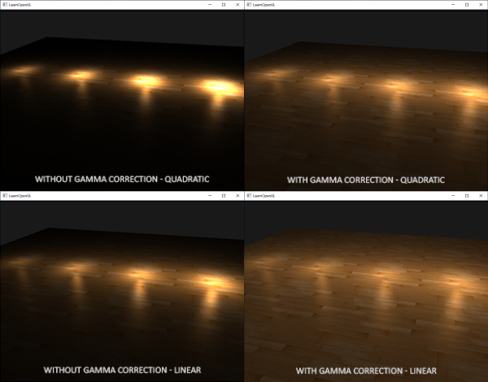
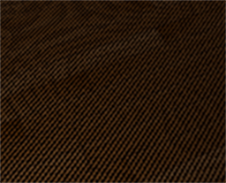
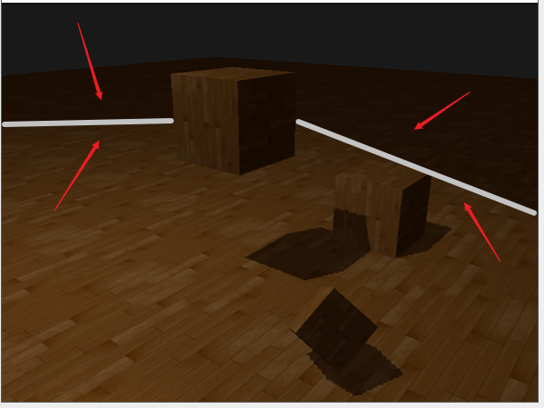
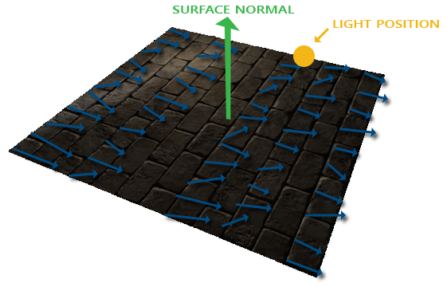
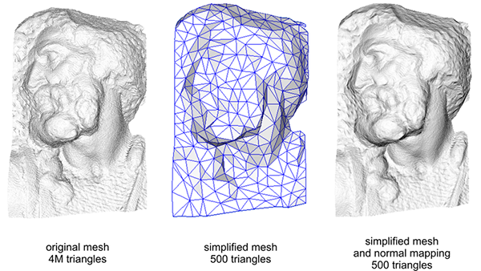
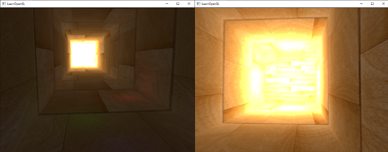
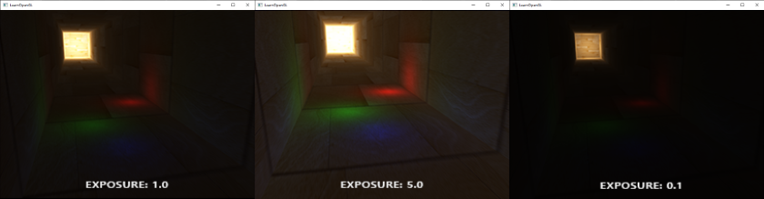
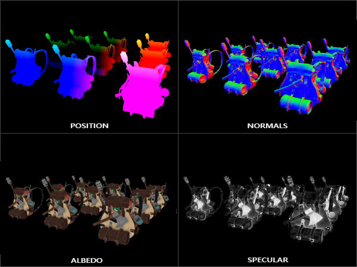
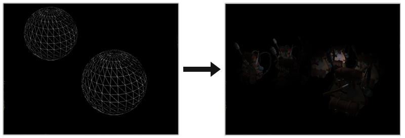

# Advanced Lighting

## Advanced Lighting

### Blinn-Phong

<div align=center>

</div>

Here the issue should become apparent. The left image shows Phong reflections as familiar, with $\thi$ being less than 90 degrees. In the right image we can see that the angle θ between the view and reflection vector is larger than 90 degrees which as a result nullifies the specular contribution. This generally isn't a problem since the view direction is far from the reflection direction, but if we use a low specular exponent the specular radius is large enough to have a contribution under these conditions. 

**Blinn-Phong**

In 1977 the Blinn-Phong shading model was introduced by `James F`. Blinn as an extension to the Phong shading we've used so far. The `Blinn-Phong` model is largely similar, but approaches the specular model slightly different which as a result overcomes our problem. Instead of relying on a reflection vector we're using a so called halfway vector that is a unit vector exactly halfway between the view direction and the light direction. The closer this halfway vector aligns with the surface's normal vector, the higher the specular contribution

<div align=center>

</div>

When the view direction is perfectly aligned with the (now imaginary) reflection vector, the halfway vector aligns perfectly with the normal vector. The closer the view direction is to the original reflection direction, the stronger the specular highlight

$$
\bar{H} = \frac{\bar{L} + \bar{V}}{||\bar{L} + \bar{V}||}
$$

```c++
vec3 lightDir   = normalize(lightPos - FragPos);
vec3 viewDir    = normalize(viewPos - FragPos);
vec3 halfwayDir = normalize(lightDir + viewDir);
```

```c++
float spec = pow(max(dot(normal, halfwayDir), 0.0), shininess);
vec3 specular = lightColor * spec;
```

<div align=center>

</div>

Another subtle difference between Phong and Blinn-Phong shading is that the angle between the halfway vector and the surface normal is often shorter than the angle between the view and reflection vector. As a result, to get visuals similar to Phong shading the specular shininess exponent has to be set a bit higher. A general rule of thumb is to set it between 2 and 4 times the Phong shininess exponent.

Below is a comparison between both specular reflection models with the Phong exponent set to 8.0 and the Blinn-Phong component set to 32.0:


<div align=center>

</div>

```c++
void main()
{
    [...]
    float spec = 0.0;
    if(blinn)
    {
        vec3 halfwayDir = normalize(lightDir + viewDir);  
        spec = pow(max(dot(normal, halfwayDir), 0.0), 16.0);
    }
    else
    {
        vec3 reflectDir = reflect(-lightDir, normal);
        spec = pow(max(dot(viewDir, reflectDir), 0.0), 8.0);
    }
```

## Gamma Correction
As soon as we compute the final pixel colors of the scene we will have to display them on a monitor. In the old days of digital imaging most monitors were cathode-ray tube (CRT) monitors. These monitors had the physical property that twice the input voltage did not result in twice the amount of brightness. Doubling the input voltage resulted in a brightness equal to an exponential relationship of roughly 2.2 known as the gamma of a monitor. This happens to (coincidently) also closely match how human beings measure brightness as brightness is also displayed with a similar (inverse) power relationship. To better understand what this all means take a look at the following image

<div align=center>

</div>

Since our eyes perceive brightness differently (more susceptible to changes in dark colors)

The human eyes prefer to see brightness colors according to the top scale, monitors (still today) use a power relationship for displaying output colors so that the original physical brightness colors are mapped to the non-linear brightness colors in the top scale

<div align=center>

</div>

The dotted line represents color/light values in linear space and the solid line represents the color space that monitors display. If we double a color in linear space, its result is indeed double the value. For instance, take a light's color vector (0.5, 0.0, 0.0) which represents a semi-dark red light. If we would double this light in linear space it would become (1.0, 0.0, 0.0) as you can see in the graph. However, the original color gets displayed on the monitor as (0.218, 0.0, 0.0) as you can see from the graph. Here's where the issues start to rise: once we double the dark-red light in linear space, it actually becomes more than 4.5 times as bright on the monitor!

### Gamma correction

The idea of gamma correction is to apply the inverse of the monitor's gamma to the final output color before displaying to the monitor. Looking back at the gamma curve graph earlier this chapter we see another dashed line that is the inverse of the monitor's gamma curve. We multiply each of the linear output colors by this inverse gamma curve (making them brighter) and as soon as the colors are displayed on the monitor, the monitor's gamma curve is applied and the resulting colors become linear. We effectively brighten the intermediate colors so that as soon as the monitor darkens them, it balances all out.

e.g. we have the dark-red color (0.5, 0.0, 0.0), Before displaying this color to the monitor we first apply the gamma correction curve to the color value,  Linear colors displayed by a monitor are roughly scaled to a power of $2.2$, so the inverse requires scaling the colors by a power of $1/2.2$, he gamma-corrected dark-red color thus becomes $(0.5, 0.0, 0.0)^{1/2.2} = (0.5, 0.0, 0.0)^{0.45} = (0.73, 0.0, 0.0)$, The corrected colors are then fed to the monitor and as a result the color is displayed as $(0.73, 0.0, 0.0)^{2.2} = (0.5, 0.0, 0.0)$ You can see that by using gamma-correction, the monitor now finally displays the colors as we linearly set them in the application.

There are two ways to apply gamma correction to your scene:

* By using OpenGL's built-in sRGB framebuffer support.
  * `glEnable(GL_FRAMEBUFFER_SRGB);`

* By doing the gamma correction ourselves in the fragment shader(s).

```c++
void main()
{
    // do super fancy lighting in linear space
    [...]
    // apply gamma correction
    float gamma = 2.2;
    FragColor.rgb = pow(fragColor.rgb, vec3(1.0/gamma));
}
```

The last line of code effectively raises each individual color component of `fragColor` to $1.0/gamma$, correcting the output color of this fragment shader run.

### sRGB textures

Because monitors display colors with gamma applied, whenever you draw, edit, or paint a picture on your computer you are picking colors based on what you see on the monitor. This effectively means all the pictures you create or edit are not in linear space, but in sRGB space e.g. doubling a dark-red color on your screen based on perceived brightness, does not equal double the red component.

<div align=center>

</div>

quite troublesome for set up each texture

```c++
float gamma = 2.2;
vec3 diffuseColor = pow(texture(diffuse, texCoords).rgb, vec3(gamma));
```

If we create a texture in OpenGL with any of these two sRGB texture formats, OpenGL will automatically correct the colors to linear-space as soon as we use them, allowing us to properly work in linear space.

```c++
glTexImage2D(GL_TEXTURE_2D, 0, GL_SRGB, width, height, 0, GL_RGB, GL_UNSIGNED_BYTE, data);
```

You should be careful when specifying your textures in sRGB space as not all textures will actually be in sRGB space. Textures used for coloring objects (like diffuse textures) are almost always in sRGB space. Textures used for retrieving lighting parameters (like specular maps and normal maps) are almost always in linear space, so if you were to configure these as sRGB textures the lighting will look odd. Be careful in which textures you specify as sRGB.


### Attenuation

Something else that's different with gamma correction is lighting attenuation. In the real physical world, lighting attenuates closely inversely proportional to the squared distance from a light source. In normal English it simply means that the light strength is reduced over the distance to the light source squared, like below:

```c++
float attenuation = 1.0 / (distance * distance);
```

However, when using this equation the attenuation effect is usually way too strong, giving lights a small radius that doesn't look physically right. For that reason other attenuation functions were used (like we discussed in the basic lighting chapter) that give much more control, or the linear equivalent is used:

```c++
float attenuation = 1.0 / distance;  
```

The linear equivalent gives more plausible results compared to its quadratic variant without gamma correction, but when we enable gamma correction the linear attenuation looks too weak and the physically correct quadratic attenuation suddenly gives the better results. The image below shows the differences:

<div align=center>

</div>

The cause of this difference is that light attenuation functions change brightness, and as we weren't visualizing our scene in linear space we chose the attenuation functions that looked best on our monitor, but weren't physically correct. Think of the squared attenuation function: if we were to use this function without gamma correction, the attenuation function effectively becomes: $\ (1.0 / distance^2)^{2.2}\ $ when displayed on a monitor. This creates a much larger attenuation from what we originally anticipated. This also explains why the linear equivalent makes much more sense without gamma correction as this effectively becomes $\ (1.0 / distance)^{2.2} = 1.0 / distance^{2.2}\ $ which resembles its physical equivalent a lot more.

To summarize, gamma correction allows us to do all our shader/lighting calculations in linear space. Because linear space makes sense in the physical world, most physical equations now actually give good results (like real light attenuation). The more advanced your lighting becomes, the easier it is to get good looking (and realistic) results with gamma correction. That is also why it's advised to only really tweak your lighting parameters as soon as you have gamma correction in place.


## Shadows

### Shadow Mapping

Shadows are a result of the absence of light due to occlusion. When a light source's light rays do not hit an object because it gets occluded by some other object, the object is in shadow. Shadows add a great deal of realism to a lit scene and make it easier for a viewer to observe spatial relationships between objects. They give a greater sense of depth to our scene and objects.

Shadows are a bit tricky to implement though, specifically because in current real-time (rasterized graphics) research a perfect shadow algorithm hasn't been developed yet. There are several good shadow approximation techniques, but they all have their little quirks and annoyances which we have to take into account.

One technique used by most videogames that gives decent results and is relatively easy to implement is shadow mapping. Shadow mapping is not too difficult to understand, doesn't cost too much in performance and quite easily extends into more advanced algorithms (like [Omnidirectional Shadow Maps](https://learnopengl.com/Advanced-Lighting/Shadows/Point-Shadows) and Cascaded Shadow Maps).

#### Shadow mapping

The idea behind shadow mapping is quite simple: we render the scene from the light's point of view and everything we see from the light's perspective is lit and everything we can't see must be in shadow. Imagine a floor section with a large box between itself and a light source. Since the light source will see this box and not the floor section when looking in its direction that specific floor section should be in shadow.

<div align=center>

</div>

Here all the blue lines represent the fragments that the light source can see. The occluded fragments are shown as black lines: these are rendered as being shadowed. If we were to draw a line or ray from the light source to a fragment on the right-most box we can see the ray first hits the floating container before hitting the right-most container. As a result, the floating container's fragment is lit and the right-most container's fragment is not lit and thus in shadow.

We want to get the point on the ray where it first hit an object and compare this closest point to other points on this ray. We then do a basic test to see if a test point's ray position is further down the ray than the closest point and if so, the test point must be in shadow. Iterating through possibly thousands of light rays from such a light source is an extremely inefficient approach and doesn't lend itself too well for real-time rendering. We can do something similar, but without casting light rays. Instead, we use something we're quite familiar with: the depth buffer.

You may remember from the depth testing chapter that a value in the depth buffer corresponds to the depth of a fragment clamped to [0,1] from the camera's point of view. What if we were to render the scene from the light's perspective and store the resulting depth values in a texture? This way, we can sample the closest depth values as seen from the light's perspective. After all, the depth values show the first fragment visible from the light's perspective. We store all these depth values in a texture that we call a `depth map` or `shadow map`.

<div align=center>

</div>

The left image shows a directional light source (all light rays are parallel) casting a shadow on the surface below the cube. Using the depth values stored in the depth map we find the closest point and use that to determine whether fragments are in shadow. We create the depth map by rendering the scene (from the light's perspective) using a view and projection matrix specific to that light source. This projection and view matrix together form a transformation $T$ that transforms any 3D position to the light's (visible) coordinate space.

In the right image we see the same directional light and the viewer. We render a fragment at point $\bar{\color{red}{P}}$ for which we have to determine whether it is in shadow. To do this, we first transform point $\bar{\color{red}{P}}$ to the light's coordinate space using $T$. Since point $\bar{\color{red}{P}}$ is now as seen from the light's perspective, its z coordinate corresponds to its depth which in this example is $0.9$. Using point $\bar{\color{red}{P}}$ we can also index the depth/shadow map to obtain the closest visible depth from the light's perspective, which is at point $\bar{\color{green}{C}}$ with a sampled depth of $0.4$. Since indexing the depth map returns a depth smaller than the depth at point $\bar{\color{red}{P}}$ we can conclude point $\bar{\color{red}{P}}$ is occluded and thus in shadow.

Shadow mapping therefore consists of two passes: first we render the depth map, and in the second pass we render the scene as normal and use the generated depth map to calculate whether fragments are in shadow. It may sound a bit complicated, but as soon as we walk through the technique step-by-step it'll likely start to make sense.

#### The depth map
The first pass requires us to generate a depth map. The depth map is the depth texture as rendered from the light's perspective that we'll be using for testing for shadows. Because we need to store the rendered result of a scene into a texture we're going to need framebuffers again.

First we'll create a framebuffer object for rendering the depth map:

```c++
unsigned int depthMapFBO;
glGenFramebuffers(1, &depthMapFBO);  
```

Next we create a 2D texture that we'll use as the framebuffer's depth buffer:

```c++
const unsigned int SHADOW_WIDTH = 1024, SHADOW_HEIGHT = 1024;

unsigned int depthMap;
glGenTextures(1, &depthMap);
glBindTexture(GL_TEXTURE_2D, depthMap);
glTexImage2D(GL_TEXTURE_2D, 0, GL_DEPTH_COMPONENT, 
             SHADOW_WIDTH, SHADOW_HEIGHT, 0, GL_DEPTH_COMPONENT, GL_FLOAT, NULL);
glTexParameteri(GL_TEXTURE_2D, GL_TEXTURE_MIN_FILTER, GL_NEAREST);
glTexParameteri(GL_TEXTURE_2D, GL_TEXTURE_MAG_FILTER, GL_NEAREST);
glTexParameteri(GL_TEXTURE_2D, GL_TEXTURE_WRAP_S, GL_REPEAT); 
glTexParameteri(GL_TEXTURE_2D, GL_TEXTURE_WRAP_T, GL_REPEAT);  
```

Generating the depth map shouldn't look too complicated. Because we only care about depth values we specify the texture's formats as `GL_DEPTH_COMPONENT`. We also give the texture a width and height of $1024$: this is the resolution of the depth map.

With the generated depth texture we can attach it as the framebuffer's depth buffer:

```c++
glBindFramebuffer(GL_FRAMEBUFFER, depthMapFBO);
glFramebufferTexture2D(GL_FRAMEBUFFER, GL_DEPTH_ATTACHMENT, GL_TEXTURE_2D, depthMap, 0);
glDrawBuffer(GL_NONE);
glReadBuffer(GL_NONE);
glBindFramebuffer(GL_FRAMEBUFFER, 0);  
```

We only need the depth information when rendering the scene from the light's perspective so there is no need for a color buffer. A framebuffer object however is not complete without a color buffer so we need to explicitly tell OpenGL we're not going to render any color data. We do this by setting both the read and draw buffer to `GL_NONE` with `glDrawBuffer` and `glReadbuffer`.

With a properly configured framebuffer that renders depth values to a texture we can start the first pass: generate the depth map. When combined with the second pass, the complete rendering stage will look a bit like this:

```c++
// 1. first render to depth map
glViewport(0, 0, SHADOW_WIDTH, SHADOW_HEIGHT);
glBindFramebuffer(GL_FRAMEBUFFER, depthMapFBO);
    glClear(GL_DEPTH_BUFFER_BIT);
    ConfigureShaderAndMatrices();
    RenderScene();
glBindFramebuffer(GL_FRAMEBUFFER, 0);
// 2. then render scene as normal with shadow mapping (using depth map)
glViewport(0, 0, SCR_WIDTH, SCR_HEIGHT);
glClear(GL_COLOR_BUFFER_BIT | GL_DEPTH_BUFFER_BIT);
ConfigureShaderAndMatrices();
glBindTexture(GL_TEXTURE_2D, depthMap);
RenderScene();
```

This code left out some details, but it'll give you the general idea of shadow mapping. What is important to note here are the calls to glViewport. Because shadow maps often have a different resolution compared to what we originally render the scene in (usually the window resolution), we need to change the viewport parameters to accommodate for the size of the shadow map. If we forget to update the viewport parameters, the resulting depth map will be either incomplete or too small

##### Light space transform

An unknown in the previous snippet of code is the ConfigureShaderAndMatrices function. In the second pass this is business as usual: make sure proper projection and view matrices are set, and set the relevant model matrices per object. However, in the first pass we need to use a different projection and view matrix to render the scene from the light's point of view.

Because we're modelling a directional light source, all its light rays are parallel. For this reason, we're going to use an orthographic projection matrix for the light source where there is no perspective deform:

```c++
float near_plane = 1.0f, far_plane = 7.5f;
glm::mat4 lightProjection = glm::ortho(-10.0f, 10.0f, -10.0f, 10.0f, near_plane, far_plane);  
```

Here is an example orthographic projection matrix as used in this chapter's demo scene. Because a projection matrix indirectly determines the range of what is visible (e.g. what is not clipped) you want to make sure the size of the projection frustum correctly contains the objects you want to be in the depth map. When objects or fragments are not in the depth map they will not produce shadows.

To create a view matrix to transform each object so they're visible from the light's point of view, we're going to use the infamous `glm::lookAt` function; this time with the light source's position looking at the scene's center.

```c++
glm::mat4 lightView = glm::lookAt(glm::vec3(-2.0f, 4.0f, -1.0f), 
                                  glm::vec3( 0.0f, 0.0f,  0.0f), 
                                  glm::vec3( 0.0f, 1.0f,  0.0f));  
```

Combining these two gives us a light space transformation matrix that transforms each world-space vector into the space as visible from the light source; exactly what we need to render the depth map.

```c++
glm::mat4 lightSpaceMatrix = lightProjection * lightView; 
```

This `lightSpaceMatrix` is the transformation matrix that we earlier denoted as $\ T\ $. With this `lightSpaceMatrix`, we can render the scene as usual as long as we give each shader the light-space equivalents of the projection and view matrices. However, we only care about depth values and not all the expensive fragment (lighting) calculations. To save performance we're going to use a different, but much simpler shader for rendering to the depth map.

##### Render to depth map

When we render the scene from the light's perspective we'd much rather use a simple shader that only transforms the vertices to light space and not much more. For such a simple shader called `simpleDepthShader` we'll use the following vertex shader:

```c++
#version 330 core
layout (location = 0) in vec3 aPos;

uniform mat4 lightSpaceMatrix;
uniform mat4 model;

void main()
{
    gl_Position = lightSpaceMatrix * model * vec4(aPos, 1.0);
}
```

This vertex shader takes a per-object model, a vertex, and transforms all vertices to light space using lightSpaceMatrix.

Since we have no color buffer and disabled the draw and read buffers, the resulting fragments do not require any processing so we can simply use an empty fragment shader:

```c++
#version 330 core

void main()
{             
    // gl_FragDepth = gl_FragCoord.z;
}  
```

This empty fragment shader does no processing whatsoever, and at the end of its run the depth buffer is updated. We could explicitly set the depth by uncommenting its one line, but this is effectively what happens behind the scene anyways.

Rendering the depth/shadow map now effectively becomes:

```c++
simpleDepthShader.use();
glUniformMatrix4fv(lightSpaceMatrixLocation, 1, GL_FALSE, glm::value_ptr(lightSpaceMatrix));

glViewport(0, 0, SHADOW_WIDTH, SHADOW_HEIGHT);
glBindFramebuffer(GL_FRAMEBUFFER, depthMapFBO);
    glClear(GL_DEPTH_BUFFER_BIT);
    RenderScene(simpleDepthShader);
glBindFramebuffer(GL_FRAMEBUFFER, 0);  
```

Here the `RenderScene` function takes a shader program, calls all relevant drawing functions and sets the corresponding model matrices where necessary.

The result is a nicely filled depth buffer holding the closest depth of each visible fragment from the light's perspective. By rendering this texture onto a 2D quad that fills the screen (similar to what we did in the post-processing section at the end of the framebuffers chapter) we get something like this:

<div align=center>

</div>

For rendering the depth map onto a quad we used the following fragment shader:

```c++
#version 330 core
out vec4 FragColor;
  
in vec2 TexCoords;

uniform sampler2D depthMap;

void main()
{             
    float depthValue = texture(depthMap, TexCoords).r;
    FragColor = vec4(vec3(depthValue), 1.0);
}  
```

Note that there are some subtle changes when displaying depth using a perspective projection matrix instead of an orthographic projection matrix as depth is non-linear when using perspective projection.

#### Rendering shadows

With a properly generated depth map we can start rendering the actual shadows. The code to check if a fragment is in shadow is (quite obviously) executed in the fragment shader, but we do the light-space transformation in the vertex shader:

```c++
#version 330 core
layout (location = 0) in vec3 aPos;
layout (location = 1) in vec3 aNormal;
layout (location = 2) in vec2 aTexCoords;

out VS_OUT {
    vec3 FragPos;
    vec3 Normal;
    vec2 TexCoords;
    vec4 FragPosLightSpace;
} vs_out;

uniform mat4 projection;
uniform mat4 view;
uniform mat4 model;
uniform mat4 lightSpaceMatrix;

void main()
{    
    vs_out.FragPos = vec3(model * vec4(aPos, 1.0));
    vs_out.Normal = transpose(inverse(mat3(model))) * aNormal;
    vs_out.TexCoords = aTexCoords;
    vs_out.FragPosLightSpace = lightSpaceMatrix * vec4(vs_out.FragPos, 1.0);
    gl_Position = projection * view * vec4(vs_out.FragPos, 1.0);
}
```

What is new here is the extra output vector `FragPosLightSpace`. We take the same `lightSpaceMatrix` (used to transform vertices to light space in the depth map stage) and transform the world-space vertex position to light space for use in the fragment shader.

The main fragment shader we'll use to render the scene uses the Blinn-Phong lighting model. Within the fragment shader we then calculate a `shadow` value that is either 1.0 when the fragment is in shadow or 0.0 when not in shadow. The resulting `diffuse` and `specular` components are then multiplied by this shadow component. Because shadows are rarely completely dark (due to light scattering) we leave the `ambient` component out of the shadow multiplications.

```c++
#version 330 core
out vec4 FragColor;

in VS_OUT {
    vec3 FragPos;
    vec3 Normal;
    vec2 TexCoords;
    vec4 FragPosLightSpace;
} fs_in;

uniform sampler2D diffuseTexture;
uniform sampler2D shadowMap;

uniform vec3 lightPos;
uniform vec3 viewPos;

float ShadowCalculation(vec4 fragPosLightSpace)
{
    [...]
}

void main()
{           
    vec3 color = texture(diffuseTexture, fs_in.TexCoords).rgb;
    vec3 normal = normalize(fs_in.Normal);
    vec3 lightColor = vec3(1.0);
    // ambient
    vec3 ambient = 0.15 * color;
    // diffuse
    vec3 lightDir = normalize(lightPos - fs_in.FragPos);
    float diff = max(dot(lightDir, normal), 0.0);
    vec3 diffuse = diff * lightColor;
    // specular
    vec3 viewDir = normalize(viewPos - fs_in.FragPos);
    float spec = 0.0;
    vec3 halfwayDir = normalize(lightDir + viewDir);  
    spec = pow(max(dot(normal, halfwayDir), 0.0), 64.0);
    vec3 specular = spec * lightColor;    
    // calculate shadow
    float shadow = ShadowCalculation(fs_in.FragPosLightSpace);       
    vec3 lighting = (ambient + (1.0 - shadow) * (diffuse + specular)) * color;    
    
    FragColor = vec4(lighting, 1.0);
}
```

The fragment shader is largely a copy from what we used in the advanced lighting chapter, but with an added shadow calculation. We declared a function `ShadowCalculation` that does most of the shadow work. At the end of the fragment shader, we multiply the diffuse and specular contributions by the inverse of the shadow component e.g. how much the fragment is not in shadow. This fragment shader takes as extra input the light-space fragment position and the depth map generated from the first render pass.

The first thing to do to check whether a fragment is in shadow, is transform the light-space fragment position in clip-space to normalized device coordinates. When we output a clip-space vertex position to gl_Position in the vertex shader, OpenGL automatically does a perspective divide e.g. transform clip-space coordinates in the range $[-w,w]$ to $[-1,1]$ by dividing the x, y and z component by the vector's w component. As the clip-space `FragPosLightSpace` is not passed to the fragment shader through gl_Position, we have to do this perspective divide ourselves:

```c++
float ShadowCalculation(vec4 fragPosLightSpace)
{
    // perform perspective divide
    vec3 projCoords = fragPosLightSpace.xyz / fragPosLightSpace.w;
    [...]
}
```

This returns the fragment's light-space position in the range $[-1,1]$.

Note:
  * When using an orthographic projection matrix the w component of a vertex remains untouched so this step is actually quite meaningless. However, it is necessary when using perspective projection so keeping this line ensures it works with both projection matrices.

Because the depth from the depth map is in the range $[0,1]$ and we also want to use `projCoords` to sample from the depth map, we transform the NDC coordinates to the range $[0,1]$:

```c++
projCoords = projCoords * 0.5 + 0.5; 
```

With these projected coordinates we can sample the depth map as the resulting [0,1] coordinates from projCoords directly correspond to the transformed NDC coordinates from the first render pass. This gives us the closest depth from the light's point of view:

```c++
float closestDepth = texture(shadowMap, projCoords.xy).r;   
```

To get the current depth at this fragment we simply retrieve the projected vector's z coordinate which equals the depth of this fragment from the light's perspective.

```c++
float currentDepth = projCoords.z;  
```

The actual comparison is then simply a check whether `currentDepth` is higher than `closestDepth` and if so, the fragment is in shadow:

```c++
float shadow = currentDepth > closestDepth  ? 1.0 : 0.0;  
```

The complete `ShadowCalculation` function then becomes:

```c++
float ShadowCalculation(vec4 fragPosLightSpace)
{
    // perform perspective divide
    vec3 projCoords = fragPosLightSpace.xyz / fragPosLightSpace.w;
    // transform to [0,1] range
    projCoords = projCoords * 0.5 + 0.5;
    // get closest depth value from light's perspective (using [0,1] range fragPosLight as coords)
    float closestDepth = texture(shadowMap, projCoords.xy).r; 
    // get depth of current fragment from light's perspective
    float currentDepth = projCoords.z;
    // check whether current frag pos is in shadow
    float shadow = currentDepth > closestDepth  ? 1.0 : 0.0;

    return shadow;
}  
```

Activating this shader, binding the proper textures, and activating the default projection and view matrices in the second render pass should give you a result similar to the image below

<div align=center>

</div>

#### Improving shadow maps

##### Shadow acne
It is obvious something is wrong from the previous image. A closer zoom shows us a very obvious Moiré-like pattern:

<div align=center>

</div>

<div align=center>

</div>

Because the shadow map is limited by resolution, multiple fragments can sample the same value from the depth map when they're relatively far away from the light source. The image shows the floor where each yellow tilted panel represents a single texel of the depth map. As you can see, several fragments sample the same depth sample.

While this is generally okay, it becomes an issue when the light source looks at an angle towards the surface as in that case the depth map is also rendered from an angle. Several fragments then access the same tilted depth texel while some are above and some below the floor; we get a shadow discrepancy. Because of this, some fragments are considered to be in shadow and some are not, giving the striped pattern from the image.

We can solve this issue with a small little hack called a shadow bias where we simply offset the depth of the surface (or the shadow map) by a small bias amount such that the fragments are not incorrectly considered below the surface.

<div align=center>

</div>

With the bias applied, all the samples get a depth smaller than the surface's depth and thus the entire surface is correctly lit without any shadows. We can implement such a bias as follows:

```c++
float bias = 0.005;
float shadow = currentDepth - bias > closestDepth  ? 1.0 : 0.0;  
```

A shadow bias of 0.005 solves the issues of our scene by a large extent, but you can imagine the bias value is highly dependent on the angle between the light source and the surface. If the surface would have a steep angle to the light source, the shadows may still display shadow acne. A more solid approach would be to change the amount of bias based on the surface angle towards the light: something we can solve with the dot product:

```c++
float bias = max(0.05 * (1.0 - dot(normal, lightDir)), 0.005);  
```

Here we have a maximum bias of 0.05 and a minimum of 0.005 based on the surface's normal and light direction. This way, surfaces like the floor that are almost perpendicular to the light source get a small bias, while surfaces like the cube's side-faces get a much larger bias.

<div align=center>

</div>

##### Peter panning
A disadvantage of using a shadow bias is that you're applying an offset to the actual depth of objects. As a result, the bias may become large enough to see a visible offset of shadows compared to the actual object locations as you can see below (with an exaggerated bias value):


<div align=center>

</div>

This shadow artifact is called peter panning since objects seem slightly detached from their shadows. We can use a little trick to solve most of the peter panning issue by using front face culling when rendering the depth map. You may remember from the face culling chapter that OpenGL by default culls back-faces. By telling OpenGL we want to cull front faces during the shadow map stage we're switching that order around.

Because we only need depth values for the depth map it shouldn't matter for solid objects whether we take the depth of their front faces or their back faces. Using their back face depths doesn't give wrong results as it doesn't matter if we have shadows inside objects; we can't see there anyways.

<div align=center>

</div>

To fix peter panning we cull all front faces during the shadow map generation. Note that you need to enable GL_CULL_FACE first.

```c++
glCullFace(GL_FRONT);
RenderSceneToDepthMap();
glCullFace(GL_BACK); // don't forget to reset original culling face
```

This effectively solves the peter panning issues, but `only for solid` objects that actually have an inside without openings. In our scene for example, this works perfectly fine on the cubes. However, on the floor it won't work as well as culling the front face completely removes the floor from the equation. The floor is a single plane and would thus be completely culled. If one wants to solve peter panning with this trick, care has to be taken to only cull the front faces of objects where it makes sense.

Another consideration is that objects that are close to the shadow receiver (like the distant cube) may still give incorrect results. However, with normal bias values you can generally avoid peter panning.

##### Over sampling
Another visual discrepancy which you may like or dislike is that regions outside the light's visible frustum are considered to be in shadow while they're (usually) not. This happens because projected coordinates outside the light's frustum are higher than 1.0 and will thus sample the depth texture outside its default range of $[0,1]$. Based on the texture's wrapping method, we will get incorrect depth results not based on the real depth values from the light source.

<div align=center>

</div>

You can see in the image that there is some sort of imaginary region of light, and a large part outside this area is in shadow; this area represents the size of the depth map projected onto the floor. The reason this happens is that we earlier set the depth map's wrapping options to `GL_REPEAT`.

What we'd rather have is that all coordinates outside the depth map's range have a depth of 1.0 which as a result means these coordinates will never be in shadow (as no object will have a depth larger than 1.0). We can do this by configuring a texture border color and set the depth map's texture wrap options to `GL_CLAMP_TO_BORDER`:

```c++
glTexParameteri(GL_TEXTURE_2D, GL_TEXTURE_WRAP_S, GL_CLAMP_TO_BORDER);
glTexParameteri(GL_TEXTURE_2D, GL_TEXTURE_WRAP_T, GL_CLAMP_TO_BORDER);
float borderColor[] = { 1.0f, 1.0f, 1.0f, 1.0f };
glTexParameterfv(GL_TEXTURE_2D, GL_TEXTURE_BORDER_COLOR, borderColor);  
```

Now whenever we sample outside the depth map's $[0,1]$ coordinate range, the `texture` function will always return a depth of $1.0$, producing a shadow value of $0.0$. The result now looks more plausible:
<div align=center>

</div>

There seems to still be one part showing a dark region. Those are the coordinates outside the far plane of the light's orthographic frustum. You can see that this dark region always occurs at the far end of the light source's frustum by looking at the shadow directions.

A light-space projected fragment coordinate is further than the light's far plane when its z coordinate is larger than 1.0. In that case the `GL_CLAMP_TO_BORDER` wrapping method doesn't work anymore as we compare the coordinate's z component with the depth map values; this always returns true for z larger than 1.0.

The fix for this is also relatively easy as we simply force the shadow value to 0.0 whenever the projected vector's z coordinate is larger than 1.0:

```c++
float ShadowCalculation(vec4 fragPosLightSpace)
{
    [...]
    if(projCoords.z > 1.0)
        shadow = 0.0;
    
    return shadow;
}  
```

Checking the far plane and clamping the depth map to a manually specified border color solves the over-sampling of the depth map. This finally gives us the result we are looking for:

<div align=center>

</div>

The result of all this does mean that we only have shadows where the projected fragment coordinates sit inside the depth map range so anything outside the light frustum will have no visible shadows. As games usually make sure this only occurs in the distance it is a much more plausible effect than the obvious black regions we had before.

#### PCF
The shadows right now are a nice addition to the scenery, but it's still not exactly what we want. If you were to zoom in on the shadows the resolution dependency of shadow mapping quickly becomes apparent

<div align=center>

</div>

Because the depth map has a fixed resolution, the depth frequently usually spans more than one fragment per texel. As a result, multiple fragments sample the same depth value from the depth map and come to the same shadow conclusions, which produces these jagged blocky edges.

You can reduce these blocky shadows by increasing the depth map resolution, or by trying to fit the light frustum as closely to the scene as possible.

Another (partial) solution to these jagged edges is called PCF, or `percentage-closer filtering`, which is a term that hosts many different filtering functions that produce softer shadows, making them appear less blocky or hard. The idea is to sample more than once from the depth map, each time with slightly different texture coordinates. For each individual sample we check whether it is in shadow or not. All the sub-results are then combined and averaged and we get a nice soft looking shadow.

One simple implementation of PCF is to simply sample the surrounding texels of the depth map and average the results:

```c++
float shadow = 0.0;
vec2 texelSize = 1.0 / textureSize(shadowMap, 0);
for(int x = -1; x <= 1; ++x)
{
    for(int y = -1; y <= 1; ++y)
    {
        float pcfDepth = texture(shadowMap, projCoords.xy + vec2(x, y) * texelSize).r; 
        shadow += currentDepth - bias > pcfDepth ? 1.0 : 0.0;        
    }    
}
shadow /= 9.0;
```

Here `textureSize` returns a vec2 of the width and height of the given sampler texture at mipmap level 0. 1 divided over this returns the size of a single texel that we use to offset the texture coordinates, making sure each new sample samples a different depth value. Here we sample 9 values around the projected coordinate's x and y value, test for shadow occlusion, and finally average the results by the total number of samples taken.

By using more samples and/or varying the `texelSize` variable you can increase the quality of the soft shadows. Below you can see the shadows with simple PCF applied:

<div align=center>

</div>

From a distance the shadows look a lot better and less hard. If you zoom in you can still see the resolution artifacts of shadow mapping, but in general this gives good results for most applications.

#### Orthographic vs projection
There is a difference between rendering the depth map with an orthographic or a projection matrix. An orthographic projection matrix does not deform the scene with perspective so all view/light rays are parallel. This makes it a great projection matrix for directional lights. A perspective projection matrix however does deform all vertices based on perspective which gives different results. The following image shows the different shadow regions of both projection methods:

<div align=center>

</div>

Perspective projections make most sense for light sources that have actual locations, unlike directional lights. Perspective projections are most often used with spotlights and point lights, while orthographic projections are used for directional lights.

Another subtle difference with using a perspective projection matrix is that visualizing the depth buffer will often give an almost completely white result. This happens because with perspective projection the depth is transformed to non-linear depth values with most of its noticeable range close to the near plane.

```c++
#version 330 core
out vec4 FragColor;
  
in vec2 TexCoords;

uniform sampler2D depthMap;
uniform float near_plane;
uniform float far_plane;

float LinearizeDepth(float depth)
{
    float z = depth * 2.0 - 1.0; // Back to NDC 
    return (2.0 * near_plane * far_plane) / (far_plane + near_plane - z * (far_plane - near_plane));
}

void main()
{             
    float depthValue = texture(depthMap, TexCoords).r;
    FragColor = vec4(vec3(LinearizeDepth(depthValue) / far_plane), 1.0); // perspective
    // FragColor = vec4(vec3(depthValue), 1.0); // orthographic
}  
```

This shows depth values similar to what we've seen with orthographic projection. Note that this is only useful for debugging; the depth checks remain the same with orthographic or projection matrices as the relative depths do not change.


### Point Shadows

<div align=center>

</div>


#### Generating the depth cubemap

To create a cubemap of a light's surrounding depth values we have to render the scene 6 times: once for each face. One (quite obvious) way to do this, is render the scene 6 times with 6 different view matrices, each time attaching a different cubemap face to the framebuffer object. This would look something like this:

```c++
for(unsigned int i = 0; i < 6; i++)
{
    GLenum face = GL_TEXTURE_CUBE_MAP_POSITIVE_X + i;
    glFramebufferTexture2D(GL_FRAMEBUFFER, GL_DEPTH_ATTACHMENT, face, depthCubemap, 0);
    BindViewMatrix(lightViewMatrices[i]);
    RenderScene();  
}
```

This can be quite expensive though as a lot of render calls are necessary for this single depth map. In this chapter we're going to use an alternative (more organized) approach using a little trick in the geometry shader that allows us to build the depth cubemap with just a single render pass.

First, we'll need to create a cubemap:

```c++
unsigned int depthCubemap;
glGenTextures(1, &depthCubemap);
```

And assign each of the single cubemap faces a 2D depth-valued texture image:

```c++
const unsigned int SHADOW_WIDTH = 1024, SHADOW_HEIGHT = 1024;
glBindTexture(GL_TEXTURE_CUBE_MAP, depthCubemap);
for (unsigned int i = 0; i < 6; ++i)
        glTexImage2D(GL_TEXTURE_CUBE_MAP_POSITIVE_X + i, 0, GL_DEPTH_COMPONENT, 
                     SHADOW_WIDTH, SHADOW_HEIGHT, 0, GL_DEPTH_COMPONENT, GL_FLOAT, NULL);  
```

And don't forget to set the texture parameters:

```c++
glTexParameteri(GL_TEXTURE_CUBE_MAP, GL_TEXTURE_MAG_FILTER, GL_NEAREST);
glTexParameteri(GL_TEXTURE_CUBE_MAP, GL_TEXTURE_MIN_FILTER, GL_NEAREST);
glTexParameteri(GL_TEXTURE_CUBE_MAP, GL_TEXTURE_WRAP_S, GL_CLAMP_TO_EDGE);
glTexParameteri(GL_TEXTURE_CUBE_MAP, GL_TEXTURE_WRAP_T, GL_CLAMP_TO_EDGE);
glTexParameteri(GL_TEXTURE_CUBE_MAP, GL_TEXTURE_WRAP_R, GL_CLAMP_TO_EDGE); 
``` 

Normally we'd attach a single face of a cubemap texture to the framebuffer object and render the scene 6 times, each time switching the depth buffer target of the framebuffer to a different cubemap face. Since we're going to use a geometry shader, that allows us to render to all faces in a single pass, we can directly attach the cubemap as a framebuffer's depth attachment with `glFramebufferTexture`:

```c++
glBindFramebuffer(GL_FRAMEBUFFER, depthMapFBO);
glFramebufferTexture(GL_FRAMEBUFFER, GL_DEPTH_ATTACHMENT, depthCubemap, 0);
glDrawBuffer(GL_NONE);
glReadBuffer(GL_NONE);
glBindFramebuffer(GL_FRAMEBUFFER, 0);  
```

Again, note the call to glDrawBuffer and glReadBuffer: we only care about depth values when generating a depth cubemap so we have to explicitly tell OpenGL this framebuffer object does not render to a color buffer.

With omnidirectional shadow maps we have two render passes: first, we generate the depth cubemap and second, we use the depth cubemap in the normal render pass to add shadows to the scene. This process looks a bit like this:

```c++
// 1. first render to depth cubemap
glViewport(0, 0, SHADOW_WIDTH, SHADOW_HEIGHT);
glBindFramebuffer(GL_FRAMEBUFFER, depthMapFBO);
    glClear(GL_DEPTH_BUFFER_BIT);
    ConfigureShaderAndMatrices();
    RenderScene();
glBindFramebuffer(GL_FRAMEBUFFER, 0);
// 2. then render scene as normal with shadow mapping (using depth cubemap)
glViewport(0, 0, SCR_WIDTH, SCR_HEIGHT);
glClear(GL_COLOR_BUFFER_BIT | GL_DEPTH_BUFFER_BIT);
ConfigureShaderAndMatrices();
glBindTexture(GL_TEXTURE_CUBE_MAP, depthCubemap);
RenderScene();
```

The process is exactly the same as with default shadow mapping, although this time we render to and use a cubemap depth texture compared to a 2D depth texture.

##### Light space transform

With the framebuffer and cubemap set, we need some way to transform all the scene's geometry to the relevant light spaces in all 6 directions of the light. Just like the shadow mapping chapter we're going to need a light space transformation matrix $T$, but this time one for each face.

Each light space transformation matrix contains both a projection and a view matrix. For the projection matrix we're going to use a perspective projection matrix; the light source represents a point in space so perspective projection makes most sense. Each light space transformation matrix uses the same projection matrix:

```c++
float aspect = (float)SHADOW_WIDTH/(float)SHADOW_HEIGHT;
float near = 1.0f;
float far = 25.0f;
glm::mat4 shadowProj = glm::perspective(glm::radians(90.0f), aspect, near, far); 
```

Important to note here is the field of view parameter of `glm::perspective` that we set to 90 degrees. By setting this to 90 degrees we make sure the viewing field is exactly large enough to fill a single face of the cubemap such that all faces align correctly to each other at the edges.

As the projection matrix does not change per direction we can re-use it for each of the 6 transformation matrices. We do need a different view matrix per direction. With `glm::lookAt` we create 6 view directions, each looking at one face direction of the cubemap in the order: right, left, top, bottom, near and far.

```c++
std::vector<glm::mat4> shadowTransforms;
shadowTransforms.push_back(shadowProj * 
                 glm::lookAt(lightPos, lightPos + glm::vec3( 1.0, 0.0, 0.0), glm::vec3(0.0,-1.0, 0.0));
shadowTransforms.push_back(shadowProj * 
                 glm::lookAt(lightPos, lightPos + glm::vec3(-1.0, 0.0, 0.0), glm::vec3(0.0,-1.0, 0.0));
shadowTransforms.push_back(shadowProj * 
                 glm::lookAt(lightPos, lightPos + glm::vec3( 0.0, 1.0, 0.0), glm::vec3(0.0, 0.0, 1.0));
shadowTransforms.push_back(shadowProj * 
                 glm::lookAt(lightPos, lightPos + glm::vec3( 0.0,-1.0, 0.0), glm::vec3(0.0, 0.0,-1.0));
shadowTransforms.push_back(shadowProj * 
                 glm::lookAt(lightPos, lightPos + glm::vec3( 0.0, 0.0, 1.0), glm::vec3(0.0,-1.0, 0.0));
shadowTransforms.push_back(shadowProj * 
                 glm::lookAt(lightPos, lightPos + glm::vec3( 0.0, 0.0,-1.0), glm::vec3(0.0,-1.0, 0.0));
```

Here we create 6 view matrices and multiply them with the projection matrix to get a total of 6 different light space transformation matrices. The target parameter of glm::lookAt each looks into the direction of a single cubemap face.

These transformation matrices are sent to the shaders that render the depth into the cubemap.

##### Depth shaders
To render depth values to a depth cubemap we're going to need a total of three shaders: a vertex and fragment shader, and a geometry shader in between.

The geometry shader will be the shader responsible for transforming all world-space vertices to the 6 different light spaces. Therefore, the vertex shader simply transforms vertices to world-space and directs them to the geometry shader:

```c++
#version 330 core
layout (location = 0) in vec3 aPos;

uniform mat4 model;

void main()
{
    gl_Position = model * vec4(aPos, 1.0);
} 
```

The geometry shader will take as input 3 triangle vertices and a uniform array of light space transformation matrices. The geometry shader is responsible for transforming the vertices to the light spaces; this is also where it gets interesting.

The geometry shader has a built-in variable called `gl_Layer` that specifies which cubemap face to emit a primitive to. When left alone, the geometry shader just sends its primitives further down the pipeline as usual, but when we update this variable we can control to which cubemap face we render to for each primitive. This of course only works when we have a cubemap texture attached to the active framebuffer.

```c++
#version 330 core
layout (triangles) in;
layout (triangle_strip, max_vertices=18) out;

uniform mat4 shadowMatrices[6];

out vec4 FragPos; // FragPos from GS (output per emitvertex)

void main()
{
    for(int face = 0; face < 6; ++face)
    {
        gl_Layer = face; // built-in variable that specifies to which face we render.
        for(int i = 0; i < 3; ++i) // for each triangle vertex
        {
            FragPos = gl_in[i].gl_Position;
            gl_Position = shadowMatrices[face] * FragPos;
            EmitVertex();
        }    
        EndPrimitive();
    }
}  
```

This geometry shader is relatively straightforward. We take as input a triangle, and output a total of 6 triangles (6 * 3 equals 18 vertices). In the main function we iterate over 6 cubemap faces where we specify each face as the output face by storing the face integer into `gl_Layer`. We then generate the output triangles by transforming each world-space input vertex to the relevant light space by multiplying `FragPos` with the face's light-space transformation matrix. Note that we also sent the resulting `FragPos` variable to the fragment shader that we'll need to calculate a depth value.

In the last chapter we used an empty fragment shader and let OpenGL figure out the depth values of the depth map. This time we're going to calculate our own (linear) depth as the linear distance between each closest fragment position and the light source's position. Calculating our own depth values makes the later shadow calculations a bit more intuitive.

```c++
#version 330 core
in vec4 FragPos;

uniform vec3 lightPos;
uniform float far_plane;

void main()
{
    // get distance between fragment and light source
    float lightDistance = length(FragPos.xyz - lightPos);
    
    // map to [0;1] range by dividing by far_plane
    lightDistance = lightDistance / far_plane;
    
    // write this as modified depth
    gl_FragDepth = lightDistance;
}  
```

The fragment shader takes as input the FragPos from the geometry shader, the light's position vector, and the frustum's far plane value. Here we take the distance between the fragment and the light source, map it to the [0,1] range and write it as the fragment's depth value.

Rendering the scene with these shaders and the cubemap-attached framebuffer object active should give you a completely filled depth cubemap for the second pass's shadow calculations.

#### Omnidirectional shadow maps

With everything set up it is time to render the actual omnidirectional shadows. The procedure is similar to the directional shadow mapping chapter, although this time we bind a cubemap texture instead of a 2D texture and also pass the light projection's far plane variable to the shaders.

```c++
glViewport(0, 0, SCR_WIDTH, SCR_HEIGHT);
glClear(GL_COLOR_BUFFER_BIT | GL_DEPTH_BUFFER_BIT);
shader.use();  
// ... send uniforms to shader (including light's far_plane value)
glActiveTexture(GL_TEXTURE0);
glBindTexture(GL_TEXTURE_CUBE_MAP, depthCubemap);
// ... bind other textures
RenderScene();
```

Here the `renderScene` function renders a few cubes in a large cube room scattered around a light source at the center of the scene.

The vertex and fragment shader are mostly similar to the original shadow mapping shaders: the difference being that the fragment shader no longer requires a fragment position in light space as we can now sample the depth values with a direction vector.

Because of this, the vertex shader doesn't needs to transform its position vectors to light space so we can remove the `FragPosLightSpace` variable:

```c++
#version 330 core
layout (location = 0) in vec3 aPos;
layout (location = 1) in vec3 aNormal;
layout (location = 2) in vec2 aTexCoords;

out vec2 TexCoords;

out VS_OUT {
    vec3 FragPos;
    vec3 Normal;
    vec2 TexCoords;
} vs_out;

uniform mat4 projection;
uniform mat4 view;
uniform mat4 model;

void main()
{
    vs_out.FragPos = vec3(model * vec4(aPos, 1.0));
    vs_out.Normal = transpose(inverse(mat3(model))) * aNormal;
    vs_out.TexCoords = aTexCoords;
    gl_Position = projection * view * model * vec4(aPos, 1.0);
}  
```

The fragment shader's Blinn-Phong lighting code is exactly the same as we had before with a shadow multiplication at the end:

```c++
#version 330 core
out vec4 FragColor;

in VS_OUT {
    vec3 FragPos;
    vec3 Normal;
    vec2 TexCoords;
} fs_in;

uniform sampler2D diffuseTexture;
uniform samplerCube depthMap;

uniform vec3 lightPos;
uniform vec3 viewPos;

uniform float far_plane;

float ShadowCalculation(vec3 fragPos)
{
    [...]
}

void main()
{           
    vec3 color = texture(diffuseTexture, fs_in.TexCoords).rgb;
    vec3 normal = normalize(fs_in.Normal);
    vec3 lightColor = vec3(0.3);
    // ambient
    vec3 ambient = 0.3 * color;
    // diffuse
    vec3 lightDir = normalize(lightPos - fs_in.FragPos);
    float diff = max(dot(lightDir, normal), 0.0);
    vec3 diffuse = diff * lightColor;
    // specular
    vec3 viewDir = normalize(viewPos - fs_in.FragPos);
    vec3 reflectDir = reflect(-lightDir, normal);
    float spec = 0.0;
    vec3 halfwayDir = normalize(lightDir + viewDir);  
    spec = pow(max(dot(normal, halfwayDir), 0.0), 64.0);
    vec3 specular = spec * lightColor;    
    // calculate shadow
    float shadow = ShadowCalculation(fs_in.FragPos);                      
    vec3 lighting = (ambient + (1.0 - shadow) * (diffuse + specular)) * color;    
    
    FragColor = vec4(lighting, 1.0);
}  
```

There are a few subtle differences: the lighting code is the same, but we now have a samplerCube uniform and the `ShadowCalculation` function takes the current fragment's position as its argument instead of the fragment position in light space. We now also include the light frustum's `far_plane` value that we'll later need.

The biggest difference is in the content of the `ShadowCalculation` function that now samples depth values from a cubemap instead of a 2D texture. Let's discuss its content step by step.

The first thing we have to do is retrieve the depth of the cubemap. You may remember from the cubemap section of this chapter that we stored the depth as the linear distance between the fragment and the light position; we're taking a similar approach here:

```c++
float ShadowCalculation(vec3 fragPos)
{
    vec3 fragToLight = fragPos - lightPos; 
    float closestDepth = texture(depthMap, fragToLight).r;
}  
```

Here we take the difference vector between the fragment's position and the light's position and use that vector as a direction vector to sample the cubemap. The direction vector doesn't need to be a unit vector to sample from a cubemap so there's no need to normalize it. The resulting `closestDepth` value is the normalized depth value between the light source and its closest visible fragment.

The closestDepth value is currently in the range `[0,1]` so we first transform it back to `[0,far_plane]` by multiplying it with far_plane.

```c++
closestDepth *= far_plane;  
```

Next we retrieve the depth value between the current fragment and the light source, which we can easily obtain by taking the length of `fragToLight` due to how we calculated depth values in the cubemap:

```c++
float currentDepth = length(fragToLight);  
```
This returns a depth value in the same (or larger) range as closestDepth.

Now we can compare both depth values to see which is closer than the other and determine whether the current fragment is in shadow. We also include a shadow bias so we don't get shadow acne as discussed in the previous chapter.

```c++
float bias = 0.05; 
float shadow = currentDepth -  bias > closestDepth ? 1.0 : 0.0; 
```

The complete ShadowCalculation then becomes:

```c++
float ShadowCalculation(vec3 fragPos)
{
    // get vector between fragment position and light position
    vec3 fragToLight = fragPos - lightPos;
    // use the light to fragment vector to sample from the depth map    
    float closestDepth = texture(depthMap, fragToLight).r;
    // it is currently in linear range between [0,1]. Re-transform back to original value
    closestDepth *= far_plane;
    // now get current linear depth as the length between the fragment and light position
    float currentDepth = length(fragToLight);
    // now test for shadows
    float bias = 0.05; 
    float shadow = currentDepth -  bias > closestDepth ? 1.0 : 0.0;

    return shadow;
}  
```

##### Visualizing cubemap depth buffer

If you're somewhat like me you probably didn't get this right on the first try so it makes sense to do some debugging, with one of the obvious checks being validating whether the depth map was built correctly. A simple trick to visualize the depth buffer is to take the closestDepth variable in the ShadowCalculation function and display that variable as:

```c++
FragColor = vec4(vec3(closestDepth / far_plane), 1.0);  
```

<div align=center>

</div>

#### PCF

Since omnidirectional shadow maps are based on the same principles of traditional shadow mapping it also has the same resolution dependent artifacts. If you zoom in close enough you can again see jagged edges. Percentage-closer filtering or PCF allows us to smooth out these jagged edges by filtering multiple samples around the fragment position and average the results.

If we take the same simple PCF filter of the previous chapter and add a third dimension we get:

```c++
float shadow  = 0.0;
float bias    = 0.05; 
float samples = 4.0;
float offset  = 0.1;
for(float x = -offset; x < offset; x += offset / (samples * 0.5))
{
    for(float y = -offset; y < offset; y += offset / (samples * 0.5))
    {
        for(float z = -offset; z < offset; z += offset / (samples * 0.5))
        {
            float closestDepth = texture(depthMap, fragToLight + vec3(x, y, z)).r; 
            closestDepth *= far_plane;   // undo mapping [0;1]
            if(currentDepth - bias > closestDepth)
                shadow += 1.0;
        }
    }
}
shadow /= (samples * samples * samples);
```

The code isn't that different from the traditional shadow mapping code. We calculate and add texture offsets dynamically for each axis based on a fixed number of samples. For each sample we repeat the original shadow process on the offsetted sample direction and average the results at the end.

<div align=center>

</div>

However, with samples set to 4.0 we take a total of 64 samples each fragment which is a lot!

As most of these samples are redundant in that they sample close to the original direction vector it may make more sense to only sample in perpendicular directions of the sample direction vector. However as there is no (easy) way to figure out which sub-directions are redundant this becomes difficult. One trick we can use is to take an array of offset directions that are all roughly separable e.g. each of them points in completely different directions. This will significantly reduce the number of sub-directions that are close together. Below we have such an array of a maximum of 20 offset directions:

```c++
vec3 sampleOffsetDirections[20] = vec3[]
(
   vec3( 1,  1,  1), vec3( 1, -1,  1), vec3(-1, -1,  1), vec3(-1,  1,  1), 
   vec3( 1,  1, -1), vec3( 1, -1, -1), vec3(-1, -1, -1), vec3(-1,  1, -1),
   vec3( 1,  1,  0), vec3( 1, -1,  0), vec3(-1, -1,  0), vec3(-1,  1,  0),
   vec3( 1,  0,  1), vec3(-1,  0,  1), vec3( 1,  0, -1), vec3(-1,  0, -1),
   vec3( 0,  1,  1), vec3( 0, -1,  1), vec3( 0, -1, -1), vec3( 0,  1, -1)
);   
```

From this we can adapt the PCF algorithm to take a fixed amount of samples from `sampleOffsetDirections` and use these to sample the cubemap. The advantage here is that we need a lot less samples to get visually similar results.

```c++
float shadow = 0.0;
float bias   = 0.15;
int samples  = 20;
float viewDistance = length(viewPos - fragPos);
float diskRadius = 0.05;
for(int i = 0; i < samples; ++i)
{
    float closestDepth = texture(depthMap, fragToLight + sampleOffsetDirections[i] * diskRadius).r;
    closestDepth *= far_plane;   // undo mapping [0;1]
    if(currentDepth - bias > closestDepth)
        shadow += 1.0;
}
shadow /= float(samples);  
```

Here we add multiple offsets, scaled by some `diskRadius`, around the original `fragToLight` direction vector to sample from the cubemap.

Another interesting trick we can apply here is that we can change `diskRadius` based on the distance of the viewer to the fragment, making the shadows softer when far away and sharper when close by.

```c++
float diskRadius = (1.0 + (viewDistance / far_plane)) / 25.0;  
```

Of course, the bias we add to each sample is highly based on context and will always require tweaking based on the scene you're working with. Play around with all the values and see how they affect the scene.

I should mention that using geometry shaders to generate a depth map isn't necessarily faster than rendering the scene 6 times for each face. Using a geometry shader like this has its own performance penalties that may outweigh the performance gain of using one in the first place. This of course depends on the type of environment, the specific video card drivers, and plenty of other factors. So if you really care about pushing the most out of your system, make sure to profile both methods and select the more efficient one for your scene.

## Normal Mapping

All of our scenes are filled with meshes, each consisting of hundreds or maybe thousands of triangles. We boosted the realism by wrapping 2D textures on these flat triangles, hiding the fact that the polygons are just tiny flat triangles. Textures help, but when you take a good close look at the meshes it is still quite easy to see the underlying flat surfaces. Most real-life surface aren't flat however and exhibit a lot of (bumpy) details.

If we think about this from a light's perspective: how comes the surface is lit as a completely flat surface? The answer is the surface's normal vector. From the lighting technique's point of view, the only way it determines the shape of an object is by its perpendicular normal vector. The brick surface only has a single normal vector, and as a result the surface is uniformly lit based on this normal vector's direction. What if we, instead of a per-surface normal that is the same for each fragment, use a per-fragment normal that is different for each fragment? This way we can slightly deviate the normal vector based on a surface's little details; this gives the illusion the surface is a lot more complex:

<div align=center>

</div>

By using per-fragment normals we can trick the lighting into believing a surface consists of tiny little planes (perpendicular to the normal vectors) giving the surface an enormous boost in detail. This technique to use per-fragment normals compared to per-surface normals is called normal mapping or bump mapping. Applied to the brick plane it looks a bit like this:


<div align=center>

</div>

As you can see, it gives an enormous boost in detail and for a relatively low cost. Since we only change the normal vectors per fragment there is no need to change the lighting equation. We now pass a per-fragment normal, instead of an interpolated surface normal, to the lighting algorithm. The lighting then does the rest.

### Normal mapping
To get normal mapping to work we're going to need a per-fragment normal. Similar to what we did with diffuse and specular maps we can use a 2D texture to store per-fragment normal data. This way we can sample a 2D texture to get a normal vector for that specific fragment.

While normal vectors are geometric entities and textures are generally only used for color information, storing normal vectors in a texture may not be immediately obvious. If you think about color vectors in a texture they are represented as a 3D vector with an r, g, and b component. We can similarly store a normal vector's x, y and z component in the respective color components. Normal vectors range between -1 and 1 so they're first mapped to [0,1]:

```c++
vec3 rgb_normal = normal * 0.5 + 0.5; // transforms from [-1,1] to [0,1]  
```

With normal vectors transformed to an RGB color component like this, we can store a per-fragment normal derived from the shape of a surface onto a 2D texture. An example normal map of the brick surface at the start of this chapter is shown below:

<div align=center>

</div>

This (and almost all normal maps you find online) will have a blue-ish tint. This is because the normals are all closely pointing outwards towards the positive z-axis (0,0,1): a blue-ish color. The deviations in color represent normal vectors that are slightly offset from the general positive z direction, giving a sense of depth to the texture. For example, you can see that at the top of each brick the color tends to be more greenish, which makes sense as the top side of a brick would have normals pointing more in the positive y direction (0,1,0) which happens to be the color green!

With a simple plane, looking at the positive z-axis, we can take this diffuse texture and this normal map to render the image from the previous section. Note that the linked normal map is different from the one shown above. The reason for this is that OpenGL reads texture coordinates with the y (or v) coordinate reversed from how textures are generally created. The linked normal map thus has its y (or green) component inversed (you can see the green colors are now pointing downwards); if you fail to take this into account, the lighting will be incorrect. Load both textures, bind them to the proper texture units, and render a plane with the following changes in the lighting fragment shader:

```c++
uniform sampler2D normalMap;  

void main()
{           
    // obtain normal from normal map in range [0,1]
    normal = texture(normalMap, fs_in.TexCoords).rgb;
    // transform normal vector to range [-1,1]
    normal = normalize(normal * 2.0 - 1.0);   
  
    [...]
    // proceed with lighting as normal
}  
```
Here we reverse the process of mapping normals to RGB colors by remapping the sampled normal color from [0,1] back to [-1,1] and then use the sampled normal vectors for the upcoming lighting calculations. In this case we used a Blinn-Phong shader.

**ISSUS 01**

There is one issue however that greatly limits this use of normal maps. The normal map we used had normal vectors that all pointed somewhat in the positive z direction. This worked because the plane's surface normal was also pointing in the positive z direction. However, what would happen if we used the same normal map on a plane laying on the ground with a surface normal vector pointing in the positive y direction?

<div align=center>

</div>

You can see that all the normals point somewhat in the positive z direction even though they should be pointing towards the positive y direction. One solution to this problem is to define a normal map for each possible direction of the surface; in the case of a cube we would need 6 normal maps. However, with advanced meshes that can have more than hundreds of possible surface directions this becomes an infeasible approach.

A different solution exists that does all the lighting in a different coordinate space: a coordinate space where the normal map vectors always point towards the positive z direction; all other lighting vectors are then transformed relative to this positive z direction. This way we can always use the same normal map, regardless of orientation. This coordinate space is called tangent space.

### Tangent space

Normal vectors in a normal map are expressed in tangent space where normals always point roughly in the positive z direction. Tangent space is a space that's local to the surface of a triangle: the normals are relative to the local reference frame of the individual triangles. Think of it as the local space of the normal map's vectors; they're all defined pointing in the positive z direction regardless of the final transformed direction. Using a specific matrix we can then transform normal vectors from this local tangent space to world or view coordinates, orienting them along the final mapped surface's direction.

Let's say we have the incorrect normal mapped surface from the previous section looking in the positive y direction. The normal map is defined in tangent space, so one way to solve the problem is to calculate a matrix to transform normals from tangent space to a different space such that they're aligned with the surface's normal direction: the normal vectors are then all pointing roughly in the positive y direction. The great thing about tangent space is that we can calculate this matrix for any type of surface so that we can properly align the tangent space's z direction to the surface's normal direction.

Such a matrix is called a TBN matrix where the letters depict a Tangent, Bitangent and Normal vector. These are the vectors we need to construct this matrix. To construct such a change-of-basis matrix, that transforms a tangent-space vector to a different coordinate space, we need three perpendicular vectors that are aligned along the surface of a normal map: an up, right, and forward vector; similar to what we did in the camera chapter.

We already know the up vector, which is the surface's normal vector. The right and forward vector are the tangent and bitangent vector respectively. The following image of a surface shows all three vectors on a surface:

<div align=center>

</div>

Calculating the tangent and bitangent vectors is not as straightforward as the normal vector. We can see from the image that the direction of the normal map's tangent and bitangent vector align with the direction in which we define a surface's texture coordinates. We'll use this fact to calculate tangent and bitangent vectors for each surface. Retrieving them does require a bit of math; take a look at the following image:

<div align=center>

</div>

From the image we can see that the texture coordinate differences of an edge $E_2$ of a triangle (denoted as $\Delta U_2$ and $\Delta V_2$) are expressed in the same direction as the tangent vector $T$ and bitangent vector $B$. Because of this we can write both displayed edges $E_1$ and $E_2$ of the triangle as a linear combination of the tangent vector $T$ and the bitangent vector $B$:

$$
\begin{aligned} 
E_1 = \Delta U_1T + \Delta V_1B \\
E_2 = \Delta U_2T + \Delta V_2B
\end{aligned}
$$

Which we can also write as

$$
\begin{aligned} 
(E_{1x}, E_{1y}, E_{1z}) = \Delta U_1(T_x, T_y, T_z) + \Delta V_1(B_x, B_y, B_z) \\
(E_{2x}, E_{2y}, E_{2z}) = \Delta U_2(T_x, T_y, T_z) + \Delta V_2(B_x, B_y, B_z)
\end{aligned}
$$

We can calculate $E$ as the difference vector between two triangle positions, and $\Delta U$ and $\Delta V$ as their texture coordinate differences. We're then left with two unknowns (tangent $T$ and bitangent $B$) and two equations. You may remember from your algebra classes that this allows us to solve for $T$ and $B$.

The last equation allows us to write it in a different form: that of matrix multiplication:

$$
\begin{aligned} 
\begin{bmatrix} E_{1x} & E_{1y} & E_{1z} \\ E_{2x} & E_{2y} & E_{2z} \end{bmatrix} = \begin{bmatrix} \Delta U_1 & \Delta V_1 \\ \Delta U_2 & \Delta V_2 \end{bmatrix} \begin{bmatrix} T_x & T_y & T_z \\ B_x & B_y & B_z \end{bmatrix}
\end{aligned}
$$

$$
\begin{aligned} 
\begin{bmatrix} \Delta U_1 & \Delta V_1 \\ \Delta U_2 & \Delta V_2 \end{bmatrix}^{-1} \begin{bmatrix} E_{1x} & E_{1y} & E_{1z} \\ E_{2x} & E_{2y} & E_{2z} \end{bmatrix} = \begin{bmatrix} T_x & T_y & T_z \\ B_x & B_y & B_z \end{bmatrix}
\end{aligned}
$$

$$
\begin{aligned} 
\begin{bmatrix} T_x & T_y & T_z \\ B_x & B_y & B_z \end{bmatrix}  = \frac{1}{\Delta U_1 \Delta V_2 - \Delta U_2 \Delta V_1} \begin{bmatrix} \Delta V_2 & -\Delta V_1 \\ -\Delta U_2 & \Delta U_1 \end{bmatrix} \begin{bmatrix} E_{1x} & E_{1y} & E_{1z} \\ E_{2x} & E_{2y} & E_{2z} \end{bmatrix}
\end{aligned}
$$

#### Manual calculation of tangents and bitangents

In the previous demo we had a simple normal mapped plane facing the positive z direction. This time we want to implement normal mapping using tangent space so we can orient this plane however we want and normal mapping would still work. Using the previously discussed mathematics we're going to manually calculate this surface's tangent and bitangent vectors.

Let's assume the plane is built up from the following vectors (with 1, 2, 3 and 1, 3, 4 as its two triangles):

```c++
// positions
glm::vec3 pos1(-1.0,  1.0, 0.0);
glm::vec3 pos2(-1.0, -1.0, 0.0);
glm::vec3 pos3( 1.0, -1.0, 0.0);
glm::vec3 pos4( 1.0,  1.0, 0.0);
// texture coordinates
glm::vec2 uv1(0.0, 1.0);
glm::vec2 uv2(0.0, 0.0);
glm::vec2 uv3(1.0, 0.0);
glm::vec2 uv4(1.0, 1.0);
// normal vector
glm::vec3 nm(0.0, 0.0, 1.0);  
```
We first calculate the first triangle's edges and delta UV coordinates:

```c++
glm::vec3 edge1 = pos2 - pos1;
glm::vec3 edge2 = pos3 - pos1;
glm::vec2 deltaUV1 = uv2 - uv1;
glm::vec2 deltaUV2 = uv3 - uv1;  
```

With the required data for calculating tangents and bitangents we can start following the equation from the previous section:

```c++
float f = 1.0f / (deltaUV1.x * deltaUV2.y - deltaUV2.x * deltaUV1.y);

tangent1.x = f * (deltaUV2.y * edge1.x - deltaUV1.y * edge2.x);
tangent1.y = f * (deltaUV2.y * edge1.y - deltaUV1.y * edge2.y);
tangent1.z = f * (deltaUV2.y * edge1.z - deltaUV1.y * edge2.z);

bitangent1.x = f * (-deltaUV2.x * edge1.x + deltaUV1.x * edge2.x);
bitangent1.y = f * (-deltaUV2.x * edge1.y + deltaUV1.x * edge2.y);
bitangent1.z = f * (-deltaUV2.x * edge1.z + deltaUV1.x * edge2.z);
  
[...] // similar procedure for calculating tangent/bitangent for plane's second triangle
```

Here we first pre-calculate the fractional part of the equation as f and then for each vector component we do the corresponding matrix multiplication multiplied by f. If you compare this code with the final equation you can see it is a direct translation. Because a triangle is always a flat shape, we only need to calculate a single tangent/bitangent pair per triangle as they will be the same for each of the triangle's vertices

#### Tangent space normal mapping

To get normal mapping working, we first have to create a TBN matrix in the shaders. To do that, we pass the earlier calculated tangent and bitangent vectors to the vertex shader as vertex attributes:

```c++
#version 330 core
layout (location = 0) in vec3 aPos;
layout (location = 1) in vec3 aNormal;
layout (location = 2) in vec2 aTexCoords;
layout (location = 3) in vec3 aTangent;
layout (location = 4) in vec3 aBitangent;  
```
Then within the vertex shader's main function we create the TBN matrix:

```c++
void main()
{
   [...]
   vec3 T = normalize(vec3(model * vec4(aTangent,   0.0)));
   vec3 B = normalize(vec3(model * vec4(aBitangent, 0.0)));
   vec3 N = normalize(vec3(model * vec4(aNormal,    0.0)));
   mat3 TBN = mat3(T, B, N);
}
```
Here we first transform all the TBN vectors to the coordinate system we'd like to work in, which in this case is world-space as we multiply them with the model matrix. Then we create the actual TBN matrix by directly supplying mat3's constructor with the relevant vectors. Note that if we want to be really precise, we would multiply the TBN vectors with the normal matrix as we only care about the orientation of the vectors.

Notice:
  * Technically there is no need for the bitangent variable in the vertex shader. All three TBN vectors are perpendicular to each other so we can calculate the bitangent ourselves in the vertex shader by taking the cross product of the T and N vector: vec3 B = cross(N, T);

So now that we have a TBN matrix, how are we going to use it? There are two ways we can use a TBN matrix for normal mapping

  * We take the TBN matrix that transforms any vector from tangent to world space, give it to the fragment shader, and transform the sampled normal from tangent space to world space using the TBN matrix; the normal is then in the same space as the other lighting variables.
  * We take the inverse of the TBN matrix that transforms any vector from world space to tangent space, and use this matrix to transform not the normal, but the other relevant lighting variables to tangent space; the normal is then again in the same space as the other lighting variables.

Let's review the first case. The normal vector we sample from the normal map is expressed in tangent space whereas the other lighting vectors (light and view direction) are expressed in world space. By passing the TBN matrix to the fragment shader we can multiply the sampled tangent space normal with this TBN matrix to transform the normal vector to the same reference space as the other lighting vectors. This way, all the lighting calculations (specifically the dot product) make sense.

Sending the TBN matrix to the fragment shader is easy:

```c++
out VS_OUT {
    vec3 FragPos;
    vec2 TexCoords;
    mat3 TBN;
} vs_out;  
  
void main()
{
    [...]
    vs_out.TBN = mat3(T, B, N);
}
```
In the fragment shader we similarly take a mat3 as an input variable:

```c++
in VS_OUT {
    vec3 FragPos;
    vec2 TexCoords;
    mat3 TBN;
} fs_in;  
```
With this TBN matrix we can now update the normal mapping code to include the tangent-to-world space transformation:

```c++
normal = texture(normalMap, fs_in.TexCoords).rgb;
normal = normal * 2.0 - 1.0;   
normal = normalize(fs_in.TBN * normal); 
```
Because the resulting `normal` is now in world space, there is no need to change any of the other fragment shader code as the lighting code assumes the normal vector to be in world space.

Let's also review the second case, where we take the inverse of the TBN matrix to transform all relevant world-space vectors to the space the sampled normal vectors are in: tangent space. The construction of the TBN matrix remains the same, but we first invert the matrix before sending it to the fragment shader:

```c++
vs_out.TBN = transpose(mat3(T, B, N));   
```

Note that we use the `transpose` function instead of the `inverse` function here. A great property of orthogonal matrices (each axis is a perpendicular unit vector) is that the transpose of an orthogonal matrix equals its inverse. This is a great property as inverse is expensive and a transpose isn't.

Within the fragment shader we do not transform the normal vector, but we transform the other relevant vectors to tangent space, namely the `lightDir` and `viewDir` vectors. That way, each vector is in the same coordinate space: tangent space.

```c++
void main()
{           
    vec3 normal = texture(normalMap, fs_in.TexCoords).rgb;
    normal = normalize(normal * 2.0 - 1.0);   
   
    vec3 lightDir = fs_in.TBN * normalize(lightPos - fs_in.FragPos);
    vec3 viewDir  = fs_in.TBN * normalize(viewPos - fs_in.FragPos);    
    [...]
}  
```

The second approach looks like more work and also requires matrix multiplications in the fragment shader, so why would we bother with the second approach?

Well, transforming vectors from world to tangent space has an added advantage in that we can transform all the relevant lighting vectors to tangent space in the vertex shader instead of in the fragment shader. This works, because lightPos and viewPos don't update every fragment run, and for `fs_in.FragPos` we can calculate its tangent-space position in the vertex shader and let fragment interpolation do its work. There is effectively no need to transform a vector to tangent space in the fragment shader, while it is necessary with the first approach as sampled normal vectors are specific to each fragment shader run.

So instead of sending the inverse of the TBN matrix to the fragment shader, we send a tangent-space light position, view position, and vertex position to the fragment shader. This saves us from having to do matrix multiplications in the fragment shader. This is a nice optimization as the vertex shader runs considerably less often than the fragment shader. This is also the reason why this approach is often the preferred approach.

```c++
out VS_OUT {
    vec3 FragPos;
    vec2 TexCoords;
    vec3 TangentLightPos;
    vec3 TangentViewPos;
    vec3 TangentFragPos;
} vs_out;

uniform vec3 lightPos;
uniform vec3 viewPos;
 
[...]
  
void main()
{    
    [...]
    mat3 TBN = transpose(mat3(T, B, N));
    vs_out.TangentLightPos = TBN * lightPos;
    vs_out.TangentViewPos  = TBN * viewPos;
    vs_out.TangentFragPos  = TBN * vec3(model * vec4(aPos, 1.0));
}  
```
In the fragment shader we then use these new input variables to calculate lighting in tangent space. As the normal vector is already in tangent space, the lighting makes sense.

With normal mapping applied in tangent space, we should get similar results to what we had at the start of this chapter. This time however, we can orient our plane in any way we'd like and the lighting would still be correct:

```c++
glm::mat4 model = glm::mat4(1.0f);
model = glm::rotate(model, (float)glfwGetTime() * -10.0f, glm::normalize(glm::vec3(1.0, 0.0, 1.0)));
shader.setMat4("model", model);
RenderQuad();
```

### Complex objects

We've demonstrated how we can use normal mapping, together with tangent space transformations, by manually calculating the tangent and bitangent vectors. Luckily for us, having to manually calculate these tangent and bitangent vectors is not something we do too often. Most of the time you implement it once in a custom model loader, or in our case use a model loader using Assimp.

Assimp has a very useful configuration bit we can set when loading a model called `aiProcess_CalcTangentSpace`. When the `aiProcess_CalcTangentSpace` bit is supplied to Assimp's `ReadFile` function, Assimp calculates smooth tangent and bitangent vectors for each of the loaded vertices, similarly to how we did it in this chapter.

```c++
const aiScene *scene = importer.ReadFile(
    path, aiProcess_Triangulate | aiProcess_FlipUVs | aiProcess_CalcTangentSpace
);  
```
Within Assimp we can then retrieve the calculated tangents via:

```c++
vector.x = mesh->mTangents[i].x;
vector.y = mesh->mTangents[i].y;
vector.z = mesh->mTangents[i].z;
vertex.Tangent = vector;  
```
Then you'll have to update the model loader to also load normal maps from a textured model. The wavefront object format (.obj) exports normal maps slightly different from Assimp's conventions as aiTextureType_NORMAL doesn't load normal maps, while aiTextureType_HEIGHT does:

```c++
vector<Texture> normalMaps = loadMaterialTextures(material, aiTextureType_HEIGHT, "texture_normal");
```

Using normal maps is also a great way to boost performance. Before normal mapping, you had to use a large number of vertices to get a high number of detail on a mesh. With normal mapping, we can get the same level of detail on a mesh using a lot less vertices. The image below from Paolo Cignoni shows a nice comparison of both methods:

<div align=center>

</div>

### One last thing
There is one last trick left to discuss that slightly improves quality without too much extra cost.

When tangent vectors are calculated on larger meshes that share a considerable amount of vertices, the tangent vectors are generally averaged to give nice and smooth results. A problem with this approach is that the three TBN vectors could end up non-perpendicular, which means the resulting TBN matrix would no longer be orthogonal. Normal mapping would only be slightly off with a non-orthogonal TBN matrix, but it's still something we can improve.

Using a mathematical trick called the `Gram-Schmidt process`, we can re-orthogonalize the TBN vectors such that each vector is again perpendicular to the other vectors. Within the vertex shader we would do it like this:

```c++
vec3 T = normalize(vec3(model * vec4(aTangent, 0.0)));
vec3 N = normalize(vec3(model * vec4(aNormal, 0.0)));
// re-orthogonalize T with respect to N
T = normalize(T - dot(T, N) * N);
// then retrieve perpendicular vector B with the cross product of T and N
vec3 B = cross(N, T);

mat3 TBN = mat3(T, B, N)  
```
This, albeit by a little, generally improves the normal mapping results with a little extra cost.

## Parallax Mapping

Parallax mapping is a technique similar to normal mapping, but based on different principles. Just like normal mapping it is a technique that significantly boosts a textured surface's detail and gives it a sense of depth. While also an illusion, parallax mapping is a lot better in conveying a sense of depth and together with normal mapping gives incredibly realistic results. While parallax mapping isn't necessarily a technique directly related to (advanced) lighting, I'll still discuss it here as the technique is a logical follow-up of normal mapping

Parallax mapping is closely related to the family of `displacement mapping` techniques that displace or offset vertices based on geometrical information stored inside a texture. One way to do this, is to take a plane with roughly 1000 vertices and displace each of these vertices based on a value in a texture that tells us the height of the plane at that specific area. Such a texture that contains height values per texel is called a `height map`. An example height map derived from the geometric properties of a simple brick surface looks a bit like this

<div align=center>

</div>

When spanned over a plane, each vertex is displaced based on the sampled height value in the height map, transforming a flat plane to a rough bumpy surface based on a material's geometric properties. For instance, taking a flat plane displaced with the above heightmap results in the following image

<div align=center>

</div>

A problem with displacing vertices this way is that a plane needs to contain a huge amount of triangles to get a realistic displacement, otherwise the displacement looks too blocky. As each flat surface may then require over 10000 vertices this quickly becomes computationally infeasible. What if we could somehow achieve similar realism without the need of extra vertices? In fact, what if I were to tell you that the previously shown displaced surface is actually rendered with only 2 triangles. This brick surface shown is rendered with parallax mapping, a displacement mapping technique that doesn't require extra vertex data to convey depth, but (similar to normal mapping) uses a clever technique to trick the user.

The idea behind parallax mapping is to alter the texture coordinates in such a way that it looks like a fragment's surface is higher or lower than it actually is, all based on the view direction and a heightmap. To understand how it works, take a look at the following image of our brick surface:

<div align=center>

</div>

<div align=center>

</div>

<div align=center>

</div>

### Parallax mapping
For parallax mapping we're going to use a simple 2D plane for which we calculated its tangent and bitangent vectors before sending it to the GPU; similar to what we did in the normal mapping chapter. Onto the plane we're going to attach a diffuse texture, a normal map, and a displacement map that you can download from their urls. For this example we're going to use parallax mapping in conjunction with normal mapping. Because parallax mapping gives the illusion of displacing a surface, the illusion breaks when the lighting doesn't match. As normal maps are often generated from heightmaps, using a normal map together with the heightmap makes sure the lighting is in place with the displacement.

<div align=center>

</div>

```c++
vec2 ParallaxMapping(vec2 texCoords, vec3 viewDir)
{ 
    // get depth value form the height map
    float height =  texture(depthMap, texCoords).r;   
    // 
    vec2 p = viewDir.xy / viewDir.z * (height * height_scale);
    return texCoords - p;    
} 
```

What is interesting to note here is the division of `viewDir.xy` by `viewDir.z`. As the `viewDir` vector is normalized, `viewDir.z` will be somewhere in the range between 0.0 and 1.0. When `viewDir` is largely parallel to the surface, its z component is close to 0.0 and the division returns a much larger vector $\color{brown}{\bar{P}}$ compared to when `viewDir` is largely perpendicular to the surface. We're adjusting the size of $\color{brown}{\bar{P}}$ in such a way that it offsets the texture coordinates at a larger scale when looking at a surface from an angle compared to when looking at it from the top; this gives more realistic results at angles.

The resulting texture coordinates are then used to sample the other textures (diffuse and normal) and this gives a very neat displaced effect as you can see below with a height_scale of roughly 0.1:

<div align=center>

</div>

You can still see a few weird border artifacts at the edge of the parallax mapped plane. This happens because at the edges of the plane the displaced texture coordinates can oversample outside the range [0, 1]. This gives unrealistic results based on the texture's wrapping mode(s). A cool trick to solve this issue is to discard the fragment whenever it samples outside the default texture coordinate range:

```c++
texCoords = ParallaxMapping(fs_in.TexCoords,  viewDir);
if(texCoords.x > 1.0 || texCoords.y > 1.0 || texCoords.x < 0.0 || texCoords.y < 0.0)
    discard;
```

**Note that this trick doesn't work on all types of surfaces**

### Steep Parallax Mapping

Steep Parallax Mapping is an extension on top of Parallax Mapping in that it uses the same principles, but instead of 1 sample it takes multiple samples to better pinpoint vector $\color{brown}{\bar{P}}$ to $\color{blue}B$. This gives much better results, even with steep height changes, as the accuracy of the technique is improved by the number of samples.

<div align=center>

</div>

We traverse the depth layers from the top down and for each layer we compare its depth value to the depth value stored in the depthmap. If the layer's depth value is less than the depthmap's value it means this layer's part of vector $\color{brown}{\bar{P}}$ is not below the surface. We continue this process until the layer's depth is higher than the value stored in the depthmap: this point is then below the (displaced) geometric surface.

In this example we can see that the depthmap value at the second layer `(D(2) = 0.73)` is lower than the second layer's depth value `0.4` so we continue. In the next iteration, the layer's depth value `0.6` is higher than the depthmap's sampled depth value `(D(3) = 0.37)`. We can thus assume vector $\color{brown}{\bar{P}}$ at the third layer to be the most viable position of the displaced geometry. We then take the texture coordinate offset $T_3$ from vector $\color{brown}{\bar{P_3}}$ to displace the fragment's texture coordinates. You can see how the accuracy increases with more depth layers.

```c++
vec2 ParallaxMapping(vec2 texCoords, vec3 viewDir)
{ 
    // number of depth layers
    const float numLayers = 10;
    // calculate the size of each layer
    float layerDepth = 1.0 / numLayers;
    // depth of current layer
    float currentLayerDepth = 0.0;
    // the amount to shift the texture coordinates per layer (from vector P)
    vec2 P = viewDir.xy * height_scale; 
    vec2 deltaTexCoords = P / numLayers;
  
    [...]     
}   
```

```c++
// get initial values
vec2  currentTexCoords     = texCoords;
float currentDepthMapValue = texture(depthMap, currentTexCoords).r;
  
while(currentLayerDepth < currentDepthMapValue)
{
    // shift texture coordinates along direction of P
    currentTexCoords -= deltaTexCoords;
    // get depthmap value at current texture coordinates
    currentDepthMapValue = texture(depthMap, currentTexCoords).r;  
    // get depth of next layer
    currentLayerDepth += layerDepth;  
}

return currentTexCoords;
```

We can improve the algorithm a bit by exploiting one of Parallax Mapping's properties. When looking straight onto a surface there isn't much texture displacement going on while there is a lot of displacement when looking at a surface from an angle (visualize the view direction on both cases). By taking less samples when looking straight at a surface and more samples when looking at an angle we only sample the necessary amount:

```c++
const float minLayers = 8.0;
const float maxLayers = 32.0;
float numLayers = mix(maxLayers, minLayers, max(dot(vec3(0.0, 0.0, 1.0), viewDir), 0.0)); 
```

### Parallax Occlusion Mapping
Parallax Occlusion Mapping is based on the same principles as Steep Parallax Mapping, but instead of taking the texture coordinates of the first depth layer after a collision, we're going to linearly interpolate between the depth layer after and before the collision. We base the weight of the linear interpolation on how far the surface's height is from the depth layer's value of both layers. Take a look at the following picture to get a grasp of how it works:

<div align=center>

</div>

```c++
[...] // steep parallax mapping code here
  
// get texture coordinates before collision (reverse operations)
vec2 prevTexCoords = currentTexCoords + deltaTexCoords;

// get depth after and before collision for linear interpolation
float afterDepth  = currentDepthMapValue - currentLayerDepth;
float beforeDepth = texture(depthMap, prevTexCoords).r - currentLayerDepth + layerDepth;
 
// interpolation of texture coordinates
float weight = afterDepth / (afterDepth - beforeDepth);
vec2 finalTexCoords = prevTexCoords * weight + currentTexCoords * (1.0 - weight);

return finalTexCoords;  
```

After we found the depth layer after intersecting the (displaced) surface geometry, we also retrieve the texture coordinates of the depth layer before intersection. Then we calculate the distance of the (displaced) geometry's depth from the corresponding depth layers and interpolate between these two values. The linear interpolation is a basic interpolation between both layer's texture coordinates. The function then finally returns the final interpolated texture coordinates.

## HDR

High dynamic range rendering works a bit like that. We allow for a much larger range of color values to render to, collecting a large range of dark and bright details of a scene, and at the end we transform all the HDR values back to the low dynamic range (LDR) of [0.0, 1.0]. This process of converting HDR values to LDR values is called tone mapping and a large collection of tone mapping algorithms exist that aim to preserve most HDR details during the conversion process. These tone mapping algorithms often involve an exposure parameter that selectively favors dark or bright regions.

### Floating point framebuffers
To implement high dynamic range rendering we need some way to prevent color values getting clamped after each fragment shader run. When framebuffers use a normalized fixed-point color format (like GL_RGB) as their color buffer's internal format, OpenGL automatically clamps the values between 0.0 and 1.0 before storing them in the framebuffer. This operation holds for most types of framebuffer formats, except for floating point formats.

When the internal format of a framebuffer's color buffer is specified as `GL_RGB16F`, `GL_RGBA16F`, `GL_RGB32F`, or `GL_RGBA32F` the framebuffer is known as a floating point framebuffer that can store floating point values outside the default range of 0.0 and 1.0. 

```c++
glBindTexture(GL_TEXTURE_2D, colorBuffer);
glTexImage2D(GL_TEXTURE_2D, 0, GL_RGBA16F, SCR_WIDTH, SCR_HEIGHT, 0, GL_RGBA, GL_FLOAT, NULL);  
```

```c++
glBindFramebuffer(GL_FRAMEBUFFER, hdrFBO);
    glClear(GL_COLOR_BUFFER_BIT | GL_DEPTH_BUFFER_BIT);  
    // [...] render (lit) scene 
glBindFramebuffer(GL_FRAMEBUFFER, 0);

// now render hdr color buffer to 2D screen-filling quad with tone mapping shader
hdrShader.use();
glActiveTexture(GL_TEXTURE0);
glBindTexture(GL_TEXTURE_2D, hdrColorBufferTexture);
RenderQuad();
```

a simple demo scene was created with a large stretched cube acting as a tunnel with four point lights

```c++
std::vector<glm::vec3> lightColors;
lightColors.push_back(glm::vec3(200.0f, 200.0f, 200.0f));
lightColors.push_back(glm::vec3(0.1f, 0.0f, 0.0f));
lightColors.push_back(glm::vec3(0.0f, 0.0f, 0.2f));
lightColors.push_back(glm::vec3(0.0f, 0.1f, 0.0f));  
```

```c++
#version 330 core
out vec4 FragColor;
  
in vec2 TexCoords;

uniform sampler2D hdrBuffer;

void main()
{             
    vec3 hdrColor = texture(hdrBuffer, TexCoords).rgb;
    FragColor = vec4(hdrColor, 1.0);
}
```

Here we directly sample the floating point color buffer and use its color value as the fragment shader's output. However, as the 2D quad's output is directly rendered into the default framebuffer, all the fragment shader's output values will still end up clamped between 0.0 and 1.0 even though we have several values in the floating point color texture exceeding 1.0.

<div align=center>

</div>

It becomes clear the intense light values at the end of the tunnel are clamped to 1.0 as a large portion of it is completely white, effectively losing all lighting details in the process. As we directly write HDR values to an LDR output buffer it is as if we have no HDR enabled in the first place. What we need to do is transform all the floating point color values into the 0.0 - 1.0 range without losing any of its details. We need to apply a process called tone mapping.

### Tone mapping
Tone mapping is the process of transforming floating point color values to the expected `[0.0, 1.0]` range known as low dynamic range without losing too much detail, often accompanied with a specific stylistic color balance.

One of the more simple tone mapping algorithms is `Reinhard tone mapping` that involves dividing the entire HDR color values to LDR color values. The Reinhard tone mapping algorithm evenly balances out all brightness values onto LDR. We include Reinhard tone mapping into the previous fragment shader and also add a gamma correction filter for good measure (including the use of sRGB textures):

```c++
void main()
{             
    const float gamma = 2.2;
    vec3 hdrColor = texture(hdrBuffer, TexCoords).rgb;
  
    // reinhard tone mapping
    vec3 mapped = hdrColor / (hdrColor + vec3(1.0));
    // gamma correction 
    mapped = pow(mapped, vec3(1.0 / gamma));
  
    FragColor = vec4(mapped, 1.0);
}  
```

A relatively simple exposure tone mapping algorithm looks as follows:

```c++
uniform float exposure;

void main()
{             
    const float gamma = 2.2;
    vec3 hdrColor = texture(hdrBuffer, TexCoords).rgb;
  
    // exposure tone mapping
    vec3 mapped = vec3(1.0) - exp(-hdrColor * exposure);
    // gamma correction 
    mapped = pow(mapped, vec3(1.0 / gamma));
  
    FragColor = vec4(mapped, 1.0);
}  
```

Here we defined an exposure uniform that defaults at 1.0 and allows us to more precisely specify whether we'd like to focus more on dark or bright regions of the HDR color values. For instance, with high exposure values the darker areas of the tunnel show significantly more detail. In contrast, a low exposure largely removes the dark region details, but allows us to see more detail in the bright areas of a scene. Take a look at the image below to see the tunnel at multiple exposure levels:

<div align=center>

</div>

## Bloom

Bright light sources and brightly lit regions are often difficult to convey to the viewer as the intensity range of a monitor is limited. One way to distinguish bright light sources on a monitor is by making them glow; the light then bleeds around the light source. This effectively gives the viewer the illusion these light sources or bright regions are intensely bright.

This light bleeding, or glow effect, is achieved with a post-processing effect called Bloom. Bloom gives all brightly lit regions of a scene a glow-like effect.

To implement Bloom, we render a lit scene as usual and extract both the scene's HDR color buffer and an image of the scene with only its bright regions visible. This extracted brightness image is then blurred and the result added on top of the original HDR scene image.

STEP:

<div align=center>

</div>

### Extracting bright color

Multiple Render Targets (MRT): allows us to specify more than one fragment shader output

```c++
layout (location = 0) out vec4 FragColor;
layout (location = 1) out vec4 BrightColor;  
```

This only works if we actually have multiple buffers to write to. As a requirement for using multiple fragment shader outputs we need multiple color buffers attached to the currently bound framebuffer object. You may remember from the framebuffers chapter that we can specify a color attachment number when linking a texture as a framebuffer's color buffer. Up until now we've always used GL_COLOR_ATTACHMENT0, but by also using GL_COLOR_ATTACHMENT1 we can have two color buffers attached to a framebuffer object:

```c++
// set up floating point framebuffer to render scene to
unsigned int hdrFBO;
glGenFramebuffers(1, &hdrFBO);
glBindFramebuffer(GL_FRAMEBUFFER, hdrFBO);
unsigned int colorBuffers[2];
glGenTextures(2, colorBuffers);
for (unsigned int i = 0; i < 2; i++)
{
    glBindTexture(GL_TEXTURE_2D, colorBuffers[i]);
    glTexImage2D(
        GL_TEXTURE_2D, 0, GL_RGBA16F, SCR_WIDTH, SCR_HEIGHT, 0, GL_RGBA, GL_FLOAT, NULL
    );
    glTexParameteri(GL_TEXTURE_2D, GL_TEXTURE_MIN_FILTER, GL_LINEAR);
    glTexParameteri(GL_TEXTURE_2D, GL_TEXTURE_MAG_FILTER, GL_LINEAR);
    glTexParameteri(GL_TEXTURE_2D, GL_TEXTURE_WRAP_S, GL_CLAMP_TO_EDGE);
    glTexParameteri(GL_TEXTURE_2D, GL_TEXTURE_WRAP_T, GL_CLAMP_TO_EDGE);
    // attach texture to framebuffer
    glFramebufferTexture2D(
        GL_FRAMEBUFFER, GL_COLOR_ATTACHMENT0 + i, GL_TEXTURE_2D, colorBuffers[i], 0
    );
}  
```

We do have to explicitly tell OpenGL we're rendering to multiple colorbuffers via glDrawBuffers. OpenGL, by default, only renders to a framebuffer's first color attachment, ignoring all others. We can do this by passing an array of color attachment enums that we'd like to render to in subsequent operations:

```c++
unsigned int attachments[2] = { GL_COLOR_ATTACHMENT0, GL_COLOR_ATTACHMENT1 };
glDrawBuffers(2, attachments);  
```

When rendering into this framebuffer, whenever a fragment shader uses the layout location specifier, the respective color buffer is used to render the fragment to.

```c++
#version 330 core
layout (location = 0) out vec4 FragColor;
layout (location = 1) out vec4 BrightColor;

[...]

void main()
{            
    [...] // first do normal lighting calculations and output results
    FragColor = vec4(lighting, 1.0);
    // check whether fragment output is higher than threshold, if so output as brightness color
    float brightness = dot(FragColor.rgb, vec3(0.2126, 0.7152, 0.0722));
    if(brightness > 1.0)
        BrightColor = vec4(FragColor.rgb, 1.0);
    else
        BrightColor = vec4(0.0, 0.0, 0.0, 1.0);
}
```

<div align=center>

</div>

### Gaussian blur
A Gaussian blur is based on the Gaussian curve which is commonly described as a bell-shaped curve giving high values close to its center that gradually wear off over distance. The Gaussian curve can be mathematically represented in different forms, but generally has the following shape:

<div align=center>

</div>

As the Gaussian curve has a larger area close to its center, using its values as weights to blur an image give more natural results as samples close by have a higher precedence. If we for instance sample a 32x32 box around a fragment, we use progressively smaller weights the larger the distance to the fragment; this gives a better and more realistic blur which is known as a Gaussian blur.

To implement a Gaussian blur filter we'd need a two-dimensional box of weights that we can obtain from a 2 dimensional Gaussian curve equation. The problem with this approach however is that it quickly becomes extremely heavy on performance. Take a blur kernel of 32 by 32 for example, this would require us to sample a texture a total of 1024 times for each fragment!

Luckily for us, the Gaussian equation has a very neat property that allows us to separate the two-dimensional equation into two smaller one-dimensional equations: one that describes the horizontal weights and the other that describes the vertical weights. We'd then first do a horizontal blur with the horizontal weights on the scene texture, and then on the resulting texture do a vertical blur. Due to this property the results are exactly the same, but this time saving us an incredible amount of performance as we'd now only have to do 32 + 32 samples compared to 1024! This is known as two-pass Gaussian blur.

<div align=center>

</div>

This does mean we need to blur an image at least two times and this works best with the use of framebuffer objects. Specifically for the two-pass Gaussian blur we're going to implement ping-pong framebuffers. That is a pair of framebuffers where we render and swap, a given number of times, the other framebuffer's color buffer into the current framebuffer's color buffer with an alternating shader effect. We basically continuously switch the framebuffer to render to and the texture to draw with. This allows us to first blur the scene's texture in the first framebuffer, then blur the first framebuffer's color buffer into the second framebuffer, and then the second framebuffer's color buffer into the first, and so on.

Before we delve into the framebuffers let's first discuss the Gaussian blur's fragment shader:

```c++
#version 330 core
out vec4 FragColor;
  
in vec2 TexCoords;

uniform sampler2D image;
  
uniform bool horizontal;
uniform float weight[5] = float[] (0.227027, 0.1945946, 0.1216216, 0.054054, 0.016216);

void main()
{             
    vec2 tex_offset = 1.0 / textureSize(image, 0); // gets size of single texel
    vec3 result = texture(image, TexCoords).rgb * weight[0]; // current fragment's contribution
    if(horizontal)
    {
        for(int i = 1; i < 5; ++i)
        {
            result += texture(image, TexCoords + vec2(tex_offset.x * i, 0.0)).rgb * weight[i];
            result += texture(image, TexCoords - vec2(tex_offset.x * i, 0.0)).rgb * weight[i];
        }
    }
    else
    {
        for(int i = 1; i < 5; ++i)
        {
            result += texture(image, TexCoords + vec2(0.0, tex_offset.y * i)).rgb * weight[i];
            result += texture(image, TexCoords - vec2(0.0, tex_offset.y * i)).rgb * weight[i];
        }
    }
    FragColor = vec4(result, 1.0);
}
```

Here we take a relatively small sample of Gaussian weights that we each use to assign a specific weight to the horizontal or vertical samples around the current fragment. You can see that we split the blur filter into a `horizontal` and vertical section based on whatever value we set the horizontal uniform. We base the offset distance on the exact size of a texel obtained by the division of 1.0 over the size of the texture (a vec2 from `textureSize`).

```c++
unsigned int pingpongFBO[2];
unsigned int pingpongBuffer[2];
glGenFramebuffers(2, pingpongFBO);
glGenTextures(2, pingpongBuffer);
for (unsigned int i = 0; i < 2; i++)
{
    glBindFramebuffer(GL_FRAMEBUFFER, pingpongFBO[i]);
    glBindTexture(GL_TEXTURE_2D, pingpongBuffer[i]);
    glTexImage2D(
        GL_TEXTURE_2D, 0, GL_RGBA16F, SCR_WIDTH, SCR_HEIGHT, 0, GL_RGBA, GL_FLOAT, NULL
    );
    glTexParameteri(GL_TEXTURE_2D, GL_TEXTURE_MIN_FILTER, GL_LINEAR);
    glTexParameteri(GL_TEXTURE_2D, GL_TEXTURE_MAG_FILTER, GL_LINEAR);
    glTexParameteri(GL_TEXTURE_2D, GL_TEXTURE_WRAP_S, GL_CLAMP_TO_EDGE);
    glTexParameteri(GL_TEXTURE_2D, GL_TEXTURE_WRAP_T, GL_CLAMP_TO_EDGE);
    glFramebufferTexture2D(
        GL_FRAMEBUFFER, GL_COLOR_ATTACHMENT0, GL_TEXTURE_2D, pingpongBuffer[i], 0
    );
}
```

Then after we've obtained an HDR texture and an extracted brightness texture, we first fill one of the ping-pong framebuffers with the brightness texture and then blur the image 10 times (5 times horizontally and 5 times vertically):

```c++
bool horizontal = true, first_iteration = true;
int amount = 10;
shaderBlur.use();
for (unsigned int i = 0; i < amount; i++)
{
    glBindFramebuffer(GL_FRAMEBUFFER, pingpongFBO[horizontal]); 
    shaderBlur.setInt("horizontal", horizontal);
    glBindTexture(
        GL_TEXTURE_2D, first_iteration ? colorBuffers[1] : pingpongBuffers[!horizontal]
    ); 
    RenderQuad();
    horizontal = !horizontal;
    if (first_iteration)
        first_iteration = false;
}
glBindFramebuffer(GL_FRAMEBUFFER, 0); 
```

<div align=center>

</div>

### Blending both textures
With the scene's HDR texture and a blurred brightness texture of the scene we only need to combine the two to achieve the infamous Bloom or glow effect. In the final fragment shader (largely similar to the one we used in the HDR chapter) we additively blend both textures:

```c++
#version 330 core
out vec4 FragColor;
  
in vec2 TexCoords;

uniform sampler2D scene;
uniform sampler2D bloomBlur;
uniform float exposure;

void main()
{             
    const float gamma = 2.2;
    vec3 hdrColor = texture(scene, TexCoords).rgb;      
    vec3 bloomColor = texture(bloomBlur, TexCoords).rgb;
    hdrColor += bloomColor; // additive blending
    // tone mapping
    vec3 result = vec3(1.0) - exp(-hdrColor * exposure);
    // also gamma correct while we're at it       
    result = pow(result, vec3(1.0 / gamma));
    FragColor = vec4(result, 1.0);
}  
```

Interesting to note here is that we add the Bloom effect before we apply tone mapping. This way, the added brightness of bloom is also softly transformed to LDR range with better relative lighting as a result.

## Deferred Shading

The way we did lighting so far was called `forward rendering` or `forward shading`. A straightforward approach where we render an object and light it according to all light sources in a scene. We do this for every object individually for each object in the scene. While quite easy to understand and implement it is also quite heavy on performance as each rendered object has to iterate over each light source for every rendered fragment, which is a lot! Forward rendering also tends to waste a lot of fragment shader runs in scenes with a high depth complexity (multiple objects cover the same screen pixel) as fragment shader outputs are overwritten.

`Deferred shading` or `deferred rendering` aims to overcome these issues by drastically changing the way we render objects. This gives us several new options to significantly optimize scenes with large numbers of lights, allowing us to render hundreds (or even thousands) of lights with an acceptable framerate.

<div align=center>

</div>

Deferred shading is based on the idea that we defer or postpone most of the heavy rendering (like lighting) to a later stage. Deferred shading consists of two passes: in the first pass, called the `geometry pass`, we render the scene once and retrieve all kinds of geometrical information from the objects that we store in a collection of textures called the `G-buffer`; think of position vectors, color vectors, normal vectors, and/or specular values. The geometric information of a scene stored in the G-buffer is then later used for (more complex) lighting calculations. Below is the content of a G-buffer of a single frame:

<div align=center>

</div>

We use the textures from the G-buffer in a second pass called the lighting pass where we render a screen-filled quad and calculate the scene's lighting for each fragment using the geometrical information stored in the G-buffer; pixel by pixel we iterate over the G-buffer. Instead of taking each object all the way from the vertex shader to the fragment shader, we decouple its advanced fragment processes to a later stage. The lighting calculations are exactly the same, but this time we take all required input variables from the corresponding G-buffer textures, instead of the vertex shader (plus some uniform variables).

the process of deferred shading.

<div align=center>

</div>

A major advantage of this approach is that whatever fragment ends up in the G-buffer is the actual fragment information that ends up as a screen pixel. The depth test already concluded this fragment to be the last and top-most fragment. This ensures that for each pixel we process in the lighting pass, we only calculate lighting once. Furthermore, deferred rendering opens up the possibility for further optimizations that allow us to render a much larger amount of light sources compared to forward rendering.

It also comes with some disadvantages though as the G-buffer requires us to store a relatively large amount of scene data in its texture color buffers. This eats memory, especially since scene data like position vectors require a high precision. Another disadvantage is that it doesn't support blending (as we only have information of the top-most fragment) and MSAA no longer works. There are several workarounds for this that we'll get to at the end of the chapter.

Filling the G-buffer (in the geometry pass) isn't too expensive as we directly store object information like position, color, or normals into a framebuffer with a small or zero amount of processing. By using `multiple render targets (MRT)` we can even do all of this in a single render pass.

### The G-buffer

The G-buffer is the collective term of all textures used to store lighting-relevant data for the final lighting pass. Let's take this moment to briefly review all the data we need to light a fragment with forward rendering:

  * A 3D world-space position vector to calculate the (interpolated) fragment position variable used for lightDir and viewDir.
  * An RGB diffuse color vector also known as albedo.
  * A 3D normal vector for determining a surface's slope.
  * A specular intensity float.
  * All light source position and color vectors.
  * The player or viewer's position vector.

With these (per-fragment) variables at our disposal we are able to calculate the (Blinn-)Phong lighting we're accustomed to. The light source positions and colors, and the player's view position, can be configured using uniform variables, but the other variables are all fragment specific. If we can somehow pass the exact same data to the final deferred lighting pass we can calculate the same lighting effects, even though we're rendering fragments of a 2D quad.

There is no limit in OpenGL to what we can store in a texture so it makes sense to store all per-fragment data in one or multiple screen-filled textures of the G-buffer and use these later in the lighting pass. As the G-buffer textures will have the same size as the lighting pass's 2D quad, we get the exact same fragment data we'd had in a forward rendering setting, but this time in the lighting pass; there is a one on one mapping.

In pseudocode the entire process will look a bit like this:

```c++
while(...) // render loop
{
    // 1. geometry pass: render all geometric/color data to g-buffer 
    glBindFramebuffer(GL_FRAMEBUFFER, gBuffer);
    glClearColor(0.0, 0.0, 0.0, 1.0); // keep it black so it doesn't leak into g-buffer
    glClear(GL_COLOR_BUFFER_BIT | GL_DEPTH_BUFFER_BIT);
    gBufferShader.use();
    for(Object obj : Objects)
    {
        ConfigureShaderTransformsAndUniforms();
        obj.Draw();
    }  
    // 2. lighting pass: use g-buffer to calculate the scene's lighting
    glBindFramebuffer(GL_FRAMEBUFFER, 0);
    lightingPassShader.use();
    BindAllGBufferTextures();
    SetLightingUniforms();
    RenderQuad();
}
```

```c++
unsigned int gBuffer;
glGenFramebuffers(1, &gBuffer);
glBindFramebuffer(GL_FRAMEBUFFER, gBuffer);
unsigned int gPosition, gNormal, gColorSpec;
  
// - position color buffer
glGenTextures(1, &gPosition);
glBindTexture(GL_TEXTURE_2D, gPosition);
glTexImage2D(GL_TEXTURE_2D, 0, GL_RGBA16F, SCR_WIDTH, SCR_HEIGHT, 0, GL_RGBA, GL_FLOAT, NULL);
glTexParameteri(GL_TEXTURE_2D, GL_TEXTURE_MIN_FILTER, GL_NEAREST);
glTexParameteri(GL_TEXTURE_2D, GL_TEXTURE_MAG_FILTER, GL_NEAREST);
glFramebufferTexture2D(GL_FRAMEBUFFER, GL_COLOR_ATTACHMENT0, GL_TEXTURE_2D, gPosition, 0);
  
// - normal color buffer
glGenTextures(1, &gNormal);
glBindTexture(GL_TEXTURE_2D, gNormal);
glTexImage2D(GL_TEXTURE_2D, 0, GL_RGBA16F, SCR_WIDTH, SCR_HEIGHT, 0, GL_RGBA, GL_FLOAT, NULL);
glTexParameteri(GL_TEXTURE_2D, GL_TEXTURE_MIN_FILTER, GL_NEAREST);
glTexParameteri(GL_TEXTURE_2D, GL_TEXTURE_MAG_FILTER, GL_NEAREST);
glFramebufferTexture2D(GL_FRAMEBUFFER, GL_COLOR_ATTACHMENT1, GL_TEXTURE_2D, gNormal, 0);
  
// - color + specular color buffer
glGenTextures(1, &gAlbedoSpec);
glBindTexture(GL_TEXTURE_2D, gAlbedoSpec);
glTexImage2D(GL_TEXTURE_2D, 0, GL_RGBA, SCR_WIDTH, SCR_HEIGHT, 0, GL_RGBA, GL_UNSIGNED_BYTE, NULL);
glTexParameteri(GL_TEXTURE_2D, GL_TEXTURE_MIN_FILTER, GL_NEAREST);
glTexParameteri(GL_TEXTURE_2D, GL_TEXTURE_MAG_FILTER, GL_NEAREST);
glFramebufferTexture2D(GL_FRAMEBUFFER, GL_COLOR_ATTACHMENT2, GL_TEXTURE_2D, gAlbedoSpec, 0);
  
// - tell OpenGL which color attachments we'll use (of this framebuffer) for rendering 
unsigned int attachments[3] = { GL_COLOR_ATTACHMENT0, GL_COLOR_ATTACHMENT1, GL_COLOR_ATTACHMENT2 };
glDrawBuffers(3, attachments);
  
// then also add render buffer object as depth buffer and check for completeness.
[...]
```

Since we use multiple render targets, we have to explicitly tell OpenGL which of the color buffers associated with GBuffer we'd like to render to with glDrawBuffers. Also interesting to note here is we combine the color and specular intensity data in a single RGBA texture; this saves us from having to declare an additional color buffer texture. As your deferred shading pipeline gets more complex and needs more data you'll quickly find new ways to combine data in individual textures.

Next we need to render into the G-buffer. Assuming each object has a diffuse, normal, and specular texture we'd use something like the following fragment shader to render into the G-buffer:

```c++
#version 330 core
layout (location = 0) out vec3 gPosition;
layout (location = 1) out vec3 gNormal;
layout (location = 2) out vec4 gAlbedoSpec;

in vec2 TexCoords;
in vec3 FragPos;
in vec3 Normal;

uniform sampler2D texture_diffuse1;
uniform sampler2D texture_specular1;

void main()
{    
    // store the fragment position vector in the first gbuffer texture
    gPosition = FragPos;
    // also store the per-fragment normals into the gbuffer
    gNormal = normalize(Normal);
    // and the diffuse per-fragment color
    gAlbedoSpec.rgb = texture(texture_diffuse1, TexCoords).rgb;
    // store specular intensity in gAlbedoSpec's alpha component
    gAlbedoSpec.a = texture(texture_specular1, TexCoords).r;
}  
```

As we use multiple render targets, the layout specifier tells OpenGL to which color buffer of the active framebuffer we render to. Note that we do not store the specular intensity into a single color buffer texture as we can store its single float value in the alpha component of one of the other color buffer textures.

NOTICE
  * Keep in mind that with lighting calculations it is extremely important to keep all relevant variables in the same coordinate space. In this case we store (and calculate) all variables in world-space.

### The deferred lighting pass
For the lighting pass we're going to render a 2D screen-filled quad (a bit like a post-processing effect) and execute an expensive lighting fragment shader on each pixel:

```c++
glClear(GL_COLOR_BUFFER_BIT | GL_DEPTH_BUFFER_BIT);
glActiveTexture(GL_TEXTURE0);
glBindTexture(GL_TEXTURE_2D, gPosition);
glActiveTexture(GL_TEXTURE1);
glBindTexture(GL_TEXTURE_2D, gNormal);
glActiveTexture(GL_TEXTURE2);
glBindTexture(GL_TEXTURE_2D, gAlbedoSpec);
// also send light relevant uniforms
shaderLightingPass.use();
SendAllLightUniformsToShader(shaderLightingPass);
shaderLightingPass.setVec3("viewPos", camera.Position);
RenderQuad(); 
```

```c++
#version 330 core
out vec4 FragColor;
  
in vec2 TexCoords;

uniform sampler2D gPosition;
uniform sampler2D gNormal;
uniform sampler2D gAlbedoSpec;

struct Light {
    vec3 Position;
    vec3 Color;
};
const int NR_LIGHTS = 32;
uniform Light lights[NR_LIGHTS];
uniform vec3 viewPos;

void main()
{             
    // retrieve data from G-buffer
    vec3 FragPos = texture(gPosition, TexCoords).rgb;
    vec3 Normal = texture(gNormal, TexCoords).rgb;
    vec3 Albedo = texture(gAlbedoSpec, TexCoords).rgb;
    float Specular = texture(gAlbedoSpec, TexCoords).a;
    
    // then calculate lighting as usual
    vec3 lighting = Albedo * 0.1; // hard-coded ambient component
    vec3 viewDir = normalize(viewPos - FragPos);
    for(int i = 0; i < NR_LIGHTS; ++i)
    {
        // diffuse
        vec3 lightDir = normalize(lights[i].Position - FragPos);
        vec3 diffuse = max(dot(Normal, lightDir), 0.0) * Albedo * lights[i].Color;
        lighting += diffuse;
    }
    
    FragColor = vec4(lighting, 1.0);
} 
```

One of the disadvantages of deferred shading is that it is not possible to do blending as all values in the G-buffer are from single fragments, and blending operates on the combination of multiple fragments. Another disadvantage is that deferred shading forces you to use the same lighting algorithm for most of your scene's lighting; you can somehow alleviate this a bit by including more material-specific data in the G-buffer.

To overcome these disadvantages (especially blending) we often split the renderer into two parts: one deferred rendering part, and the other a forward rendering part specifically meant for blending or special shader effects not suited for a deferred rendering pipeline. To illustrate how this works, we'll render the light sources as small cubes using a forward renderer as the light cubes require a special shader (simply output a single light color).

### Combining deferred rendering with forward rendering

Say we want to render each of the light sources as a 3D cube positioned at the light source's position emitting the color of the light. A first idea that comes to mind is to simply forward render all the light sources on top of the deferred lighting quad at the end of the deferred shading pipeline. So basically render the cubes as we'd normally do, but only after we've finished the deferred rendering operations. In code this will look a bit like this:

```c++
// deferred lighting pass
[...]
RenderQuad();
  
// now render all light cubes with forward rendering as we'd normally do
shaderLightBox.use();
shaderLightBox.setMat4("projection", projection);
shaderLightBox.setMat4("view", view);
for (unsigned int i = 0; i < lightPositions.size(); i++)
{
    model = glm::mat4(1.0f);
    model = glm::translate(model, lightPositions[i]);
    model = glm::scale(model, glm::vec3(0.25f));
    shaderLightBox.setMat4("model", model);
    shaderLightBox.setVec3("lightColor", lightColors[i]);
    RenderCube();
}
```

**Depth**

```c++
glBindFramebuffer(GL_READ_FRAMEBUFFER, gBuffer);
glBindFramebuffer(GL_DRAW_FRAMEBUFFER, 0); // write to default framebuffer
glBlitFramebuffer(
  0, 0, SCR_WIDTH, SCR_HEIGHT, 0, 0, SCR_WIDTH, SCR_HEIGHT, GL_DEPTH_BUFFER_BIT, GL_NEAREST
);
glBindFramebuffer(GL_FRAMEBUFFER, 0);
// now render light cubes as before
[...]  
```

### A larger number of lights
What deferred rendering is often praised for, is its ability to render an enormous amount of light sources without a heavy cost on performance. Deferred rendering by itself doesn't allow for a very large amount of light sources as we'd still have to calculate each fragment's lighting component for each of the scene's light sources. What makes a large amount of light sources possible is a very neat optimization we can apply to the deferred rendering pipeline: that of light volumes.

Normally when we render a fragment in a large lit scene we'd calculate the contribution of each light source in a scene, regardless of their distance to the fragment. A large portion of these light sources will never reach the fragment, so why waste all these lighting computations?

The idea behind light volumes is to calculate the radius, or volume, of a light source i.e. the area where its light is able to reach fragments. As most light sources use some form of attenuation, we can use that to calculate the maximum distance or radius their light is able to reach. We then only do the expensive lighting calculations if a fragment is inside one or more of these light volumes. This can save us a considerable amount of computation as we now only calculate lighting where it's necessary.

The trick to this approach is mostly figuring out the size or radius of the light volume of a light source.

#### Calculating a light's volume or radius
To obtain a light's volume radius we have to solve the attenuation equation for when its light contribution becomes 0.0. For the attenuation function we'll use the function introduced in the [light casters](../graphics/opengl_lighting.md#point-lights):

$$
\begin{aligned}
\mathbf{F}_{att} = \frac{1.0}{\mathbf{K}_c + \mathbf{K}_l * d + \mathbf{K}_q * \mathbf{d}^2}
\end{aligned}
$$

What we want to do is solve this equation for when $F_{light}$ is $0.0$. However, this equation will never exactly reach the value 0.0, so there won't be a solution. What we can do however, is not solve the equation for 0.0, but solve it for a brightness value that is close to 0.0 but still perceived as dark. The brightness value of $5/256$ would be acceptable for this chapter's demo scene; divided by 256 as the default 8-bit framebuffer can only display that many intensities per component.

**NOTE**:
  * The attenuation function used is mostly dark in its visible range. If we were to limit it to an even darker brightness than $5/256$, the light volume would become too large and thus less effective. As long as a user cannot see a sudden cut-off of a light source at its volume borders we'll be fine. Of course this always depends on the type of scene; a higher brightness threshold results in smaller light volumes and thus a better efficiency, but can produce noticeable artifacts where lighting seems to break at a volume's borders.

The attenuation equation we have to solve becomes:

$$
\begin{aligned}
\frac{5}{256} = \frac{I_{max}}{Attenuation}
\end{aligned}
$$

Here $I_{max}$ is the light source's brightest color component. We use a light source's brightest color component as solving the equation for a light's brightest intensity value best reflects the ideal light volume radius.

From here on we continue solving the equation:

$$
\begin{aligned}
\frac{5}{256} * Attenuation = I_{max}
\end{aligned}
$$

$$
\begin{aligned}
5 * Attenuation = I_{max} * 256
\end{aligned}
$$

$$
\begin{aligned}
Attenuation = I_{max} * \frac{256}{5}
\end{aligned}
$$

$$
\begin{aligned}
K_c + K_l * d + K_q * d^2 = I_{max} * \frac{256}{5}
\end{aligned}
$$

$$
\begin{aligned}
K_q * d^2 + K_l * d + K_c - I_{max} * \frac{256}{5} = 0
\end{aligned}
$$

The last equation is an equation of the form $ax^2 + bx + c = 0$, which we can solve using the quadratic equation:

$$
\begin{aligned}
x = \frac{-K_l + \sqrt{K_l^2 - 4 * K_q * (K_c - I_{max} * \frac{256}{5})}}{2 * K_q}
\end{aligned}
$$

This gives us a general equation that allows us to calculate $x$ i.e. the light volume's radius for the light source given a constant, linear, and quadratic parameter:

```c++
float constant  = 1.0; 
float linear    = 0.7;
float quadratic = 1.8;
float lightMax  = std::fmaxf(std::fmaxf(lightColor.r, lightColor.g), lightColor.b);
float radius    = 
  (-linear +  std::sqrtf(linear * linear - 4 * quadratic * (constant - (256.0 / 5.0) * lightMax))) 
  / (2 * quadratic); 
```

We calculate this radius for each light source of the scene and use it to only calculate lighting for that light source if a fragment is inside the light source's volume. Below is the updated lighting pass fragment shader that takes the calculated light volumes into account. Note that this approach is merely done for teaching purposes and not viable in a practical setting as we'll soon discuss:

```c++
struct Light {
    [...]
    float Radius;
}; 
  
void main()
{
    [...]
    for(int i = 0; i < NR_LIGHTS; ++i)
    {
        // calculate distance between light source and current fragment
        float distance = length(lights[i].Position - FragPos);
        if(distance < lights[i].Radius)
        {
            // do expensive lighting
            [...]
        }
    }   
}
```

#### How we really use light volumes

The fragment shader shown above doesn't really work in practice and only illustrates how we can sort of use a light's volume to reduce lighting calculations. The reality is that your GPU and GLSL are pretty bad at optimizing loops and branches. The reason for this is that shader execution on the GPU is highly parallel and most architectures have a requirement that for large collection of threads they need to run the exact same shader code for it to be efficient. This often means that a shader is run that executes all branches of an if statement to ensure the shader runs are the same for that group of threads, making our previous radius check optimization completely useless; we'd still calculate lighting for all light sources!

The appropriate approach to using light volumes is to render actual spheres, scaled by the light volume radius. The centers of these spheres are positioned at the light source's position, and as it is scaled by the light volume radius the sphere exactly encompasses the light's visible volume. This is where the trick comes in: we use the deferred lighting shader for rendering the spheres. As a rendered sphere produces fragment shader invocations that exactly match the pixels the light source affects, we only render the relevant pixels and skip all other pixels. The image below illustrates this:

<div align=center>

</div>

This is done for each light source in the scene, and the resulting fragments are additively blended together. The result is then the exact same scene as before, but this time rendering only the relevant fragments per light source. This effectively reduces the computations from `nr_objects * nr_lights` to `nr_objects + nr_lights`, which makes it incredibly efficient in scenes with a large number of lights. This approach is what makes deferred rendering so suitable for rendering a large number of lights.

There is still an issue with this approach: face culling should be enabled (otherwise we'd render a light's effect twice) and when it is enabled the user may enter a light source's volume after which the volume isn't rendered anymore (due to back-face culling), removing the light source's influence; we can solve that by only rendering the spheres' back faces.

Rendering light volumes does take its toll on performance, and while it is generally much faster than normal deferred shading for rendering a large number of lights, there's still more we can optimize. Two other popular (and more efficient) extensions on top of deferred shading exist called `deferred lighting` and `tile-based deferred shading`. These are even more efficient at rendering large amounts of light and also allow for relatively efficient `MSAA`.

### Deferred rendering vs forward rendering

By itself (without light volumes), deferred shading is a nice optimization as each pixel only runs a single fragment shader, compared to forward rendering where we'd often run the fragment shader multiple times per pixel. Deferred rendering does come with a few disadvantages though: a large memory overhead, no MSAA, and blending still has to be done with forward rendering.

When you have a small scene and not too many lights, deferred rendering is not necessarily faster and sometimes even slower as the overhead then outweighs the benefits of deferred rendering. In more complex scenes, deferred rendering quickly becomes a significant optimization; especially with the more advanced optimization extensions. In addition, some render effects (especially post-processing effects) become cheaper on a deferred render pipeline as a lot of scene inputs are already available from the g-buffer.

As a final note I'd like to mention that basically all effects that can be accomplished with forward rendering can also be implemented in a deferred rendering context; this often only requires a small translation step. For instance, if we want to use normal mapping in a deferred renderer, we'd change the geometry pass shaders to output a world-space normal extracted from a normal map (using a TBN matrix) instead of the surface normal; the lighting calculations in the lighting pass don't need to change at all. And if you want parallax mapping to work, you'd want to first displace the texture coordinates in the geometry pass before sampling an object's diffuse, specular, and normal textures. Once you understand the idea behind deferred rendering, it's not too difficult to get creative.

## SSAO

We've briefly touched the topic in the basic lighting chapter: ambient lighting. Ambient lighting is a fixed light constant we add to the overall lighting of a scene to simulate the scattering of light. In reality, light scatters in all kinds of directions with varying intensities so the indirectly lit parts of a scene should also have varying intensities. One type of indirect lighting approximation is called ambient occlusion that tries to approximate indirect lighting by darkening creases, holes, and surfaces that are close to each other. These areas are largely occluded by surrounding geometry and thus light rays have fewer places to escape to, hence the areas appear darker. Take a look at the corners and creases of your room to see that the light there seems just a little darker.

Below is an example image of a scene with and without ambient occlusion. Notice how especially between the creases, the (ambient) light is more occluded:

<div align=center>

</div>

While not an incredibly obvious effect, the image with ambient occlusion enabled does feel a lot more realistic due to these small occlusion-like details, giving the entire scene a greater feel of depth.

Ambient occlusion techniques are expensive as they have to take surrounding geometry into account. One could shoot a large number of rays for each point in space to determine its amount of occlusion, but that quickly becomes computationally infeasible for real-time solutions. In 2007, Crytek published a technique called `screen-space ambient occlusion (SSAO)` for use in their title Crysis. The technique uses a scene's depth buffer in screen-space to determine the amount of occlusion instead of real geometrical data. This approach is incredibly fast compared to real ambient occlusion and gives plausible results, making it the de-facto standard for approximating real-time ambient occlusion.

The basics behind screen-space ambient occlusion are simple: for each fragment on a screen-filled quad we calculate an `occlusion factor` based on the fragment's surrounding depth values. The occlusion factor is then used to reduce or nullify the fragment's ambient lighting component. The occlusion factor is obtained by taking multiple depth samples in a sphere sample kernel surrounding the fragment position and compare each of the samples with the current fragment's depth value. The number of samples that have a higher depth value than the fragment's depth represents the occlusion factor.

<div align=center>

</div>

Each of the gray depth samples that are inside geometry contribute to the total occlusion factor; the more samples we find inside geometry, the less ambient lighting the fragment should eventually receive.

It is clear the quality and precision of the effect directly relates to the number of surrounding samples we take. If the sample count is too low, the precision drastically reduces and we get an artifact called banding; if it is too high, we lose performance. We can reduce the amount of samples we have to test by introducing some randomness into the sample kernel. By randomly rotating the sample kernel each fragment we can get high quality results with a much smaller amount of samples. This does come at a price as the randomness introduces a noticeable noise pattern that we'll have to fix by blurring the results. Below is an image (courtesy of [John Chapman](http://john-chapman-graphics.blogspot.com/)) showcasing the banding effect and the effect randomness has on the results:

<div align=center>

</div>

As you can see, even though we get noticeable banding on the SSAO results due to a low sample count, by introducing some randomness the banding effects are completely gone.

The SSAO method developed by Crytek had a certain visual style. Because the sample kernel used was a sphere, it caused flat walls to look gray as half of the kernel samples end up being in the surrounding geometry. Below is an image of Crysis's screen-space ambient occlusion that clearly portrays this gray feel:

<div align=center>

</div>

For that reason we won't be using a sphere sample kernel, but rather a hemisphere sample kernel oriented along a surface's normal vector.

<div align=center>

</div>

By sampling around this normal-oriented hemisphere we do not consider the fragment's underlying geometry to be a contribution to the occlusion factor. This removes the gray-feel of ambient occlusion and generally produces more realistic results. This chapter's technique is based on this normal-oriented hemisphere method and a slightly modified version of John Chapman's brilliant [SSAO tutorial](http://john-chapman-graphics.blogspot.nl/2013/01/ssao-tutorial.html).

### Sample buffers
SSAO requires geometrical info as we need some way to determine the occlusion factor of a fragment. For each fragment, we're going to need the following data:

  * A per-fragment position vector.
  * A per-fragment normal vector.
  * A per-fragment albedo color.
  * A sample kernel.
  * A per-fragment random rotation vector used to rotate the sample kernel.

Using a per-fragment view-space position we can orient a sample hemisphere kernel around the fragment's view-space surface normal and use this kernel to sample the position buffer texture at varying offsets. For each per-fragment kernel sample we compare its depth with its depth in the position buffer to determine the amount of occlusion. The resulting occlusion factor is then used to limit the final ambient lighting component. By also including a per-fragment rotation vector we can significantly reduce the number of samples we'll need to take as we'll soon see.

<div align=center>

</div>

the fragment shader of the geometry stage:

```c++
#version 330 core
layout (location = 0) out vec4 gPosition;
layout (location = 1) out vec3 gNormal;
layout (location = 2) out vec4 gAlbedoSpec;

in vec2 TexCoords;
in vec3 FragPos;
in vec3 Normal;

void main()
{    
    // store the fragment position vector in the first gbuffer texture
    gPosition = FragPos;
    // also store the per-fragment normals into the gbuffer
    gNormal = normalize(Normal);
    // and the diffuse per-fragment color, ignore specular
    gAlbedoSpec.rgb = vec3(0.95);
}
```

Since SSAO is a screen-space technique where occlusion is calculated from the visible view, it makes sense to implement the algorithm in view-space. Therefore, FragPos and Normal as supplied by the geometry stage's vertex shader are transformed to view space (multiplied by the view matrix as well).

It is possible to reconstruct the position vectors from depth values alone, using some clever tricks as Matt Pettineo described in his [blog](https://mynameismjp.wordpress.com/2010/09/05/position-from-depth-3/). This requires a few extra calculations in the shaders, but saves us from having to store position data in the G-buffer (which costs a lot of memory). For the sake of a more simple example, we'll leave these optimizations out of the chapter.

The gPosition color buffer texture is configured as follows:

```c++
glGenTextures(1, &gPosition);
glBindTexture(GL_TEXTURE_2D, gPosition);
glTexImage2D(GL_TEXTURE_2D, 0, GL_RGBA16F, SCR_WIDTH, SCR_HEIGHT, 0, GL_RGBA, GL_FLOAT, NULL);
glTexParameteri(GL_TEXTURE_2D, GL_TEXTURE_MIN_FILTER, GL_NEAREST);
glTexParameteri(GL_TEXTURE_2D, GL_TEXTURE_MAG_FILTER, GL_NEAREST);
glTexParameteri(GL_TEXTURE_2D, GL_TEXTURE_WRAP_S, GL_CLAMP_TO_EDGE);
glTexParameteri(GL_TEXTURE_2D, GL_TEXTURE_WRAP_T, GL_CLAMP_TO_EDGE);  
```

### Normal-oriented hemisphere

We need to generate a number of samples oriented along the normal of a surface. we're going to generate a sample kernel in tangent space, with the normal vector pointing in the positive z direction.

Assuming we have a unit hemisphere, we can obtain a sample kernel with a maximum of 64 sample values as follows:

```c++
std::uniform_real_distribution<float> randomFloats(0.0, 1.0); // random floats between [0.0, 1.0]
std::default_random_engine generator;
std::vector<glm::vec3> ssaoKernel;
for (unsigned int i = 0; i < 64; ++i)
{
    glm::vec3 sample(
        randomFloats(generator) * 2.0 - 1.0, 
        randomFloats(generator) * 2.0 - 1.0, 
        randomFloats(generator)
    );
    sample  = glm::normalize(sample);
    sample *= randomFloats(generator);
    ssaoKernel.push_back(sample);  
}
```

We vary the x and y direction in tangent space between -1.0 and 1.0, and vary the z direction of the samples between 0.0 and 1.0 (if we varied the z direction between -1.0 and 1.0 as well we'd have a sphere sample kernel). As the sample kernel will be oriented along the surface normal, the resulting sample vectors will all end up in the hemisphere.

Currently, all samples are randomly distributed in the sample kernel, but we'd rather place a larger weight on occlusions close to the actual fragment. We want to distribute more kernel samples closer to the origin. We can do this with an accelerating interpolation function:

```c++
   float scale = (float)i / 64.0; 
   scale   = lerp(0.1f, 1.0f, scale * scale);
   sample *= scale;
   ssaoKernel.push_back(sample);  
}
```

Where lerp is defined as:

```c++
float lerp(float a, float b, float f)
{
    return a + f * (b - a);
}  
```

This gives us a kernel distribution that places most samples closer to its origin.

<div align=center>

</div>

Each of the kernel samples will be used to offset the view-space fragment position to sample surrounding geometry. We do need quite a lot of samples in view-space in order to get realistic results, which may be too heavy on performance. However, if we can introduce some semi-random rotation/noise on a per-fragment basis, we can significantly reduce the number of samples required

### Random kernel rotations

By introducing some randomness onto the sample kernels we largely reduce the number of samples necessary to get good results. We could create a random rotation vector for each fragment of a scene, but that quickly eats up memory. It makes more sense to create a small texture of random rotation vectors that we tile over the screen.

We create a 4x4 array of random rotation vectors oriented around the tangent-space surface normal:

```c++
std::vector<glm::vec3> ssaoNoise;
for (unsigned int i = 0; i < 16; i++)
{
    glm::vec3 noise(
        randomFloats(generator) * 2.0 - 1.0, 
        randomFloats(generator) * 2.0 - 1.0, 
        0.0f); 
    ssaoNoise.push_back(noise);
}  
```

As the sample kernel is oriented along the positive z direction in tangent space, we leave the z component at 0.0 so we rotate around the z axis.

We then create a 4x4 texture that holds the random rotation vectors; make sure to set its wrapping method to `GL_REPEAT` so it properly tiles over the screen.

```c++
unsigned int noiseTexture; 
glGenTextures(1, &noiseTexture);
glBindTexture(GL_TEXTURE_2D, noiseTexture);
glTexImage2D(GL_TEXTURE_2D, 0, GL_RGBA16F, 4, 4, 0, GL_RGB, GL_FLOAT, &ssaoNoise[0]);
glTexParameteri(GL_TEXTURE_2D, GL_TEXTURE_MIN_FILTER, GL_NEAREST);
glTexParameteri(GL_TEXTURE_2D, GL_TEXTURE_MAG_FILTER, GL_NEAREST);
glTexParameteri(GL_TEXTURE_2D, GL_TEXTURE_WRAP_S, GL_REPEAT);
glTexParameteri(GL_TEXTURE_2D, GL_TEXTURE_WRAP_T, GL_REPEAT);  
```

### The SSAO shader

The SSAO shader runs on a 2D screen-filled quad that calculates the occlusion value for each of its fragments. As we need to store the result of the SSAO stage (for use in the final lighting shader), we create yet another framebuffer object:

```c++
unsigned int ssaoFBO;
glGenFramebuffers(1, &ssaoFBO);  
glBindFramebuffer(GL_FRAMEBUFFER, ssaoFBO);
  
unsigned int ssaoColorBuffer;
glGenTextures(1, &ssaoColorBuffer);
glBindTexture(GL_TEXTURE_2D, ssaoColorBuffer);
glTexImage2D(GL_TEXTURE_2D, 0, GL_RED, SCR_WIDTH, SCR_HEIGHT, 0, GL_RED, GL_FLOAT, NULL);
glTexParameteri(GL_TEXTURE_2D, GL_TEXTURE_MIN_FILTER, GL_NEAREST);
glTexParameteri(GL_TEXTURE_2D, GL_TEXTURE_MAG_FILTER, GL_NEAREST);
  
glFramebufferTexture2D(GL_FRAMEBUFFER, GL_COLOR_ATTACHMENT0, GL_TEXTURE_2D, ssaoColorBuffer, 0);  
```

As the ambient occlusion result is a single grayscale value we'll only need a texture's red component, so we set the color buffer's internal format to `GL_RED`.

The complete process for rendering SSAO then looks a bit like this:

```c++
// geometry pass: render stuff into G-buffer
glBindFramebuffer(GL_FRAMEBUFFER, gBuffer);
    [...]
glBindFramebuffer(GL_FRAMEBUFFER, 0);  
  
// use G-buffer to render SSAO texture
glBindFramebuffer(GL_FRAMEBUFFER, ssaoFBO);
    glClear(GL_COLOR_BUFFER_BIT);    
    glActiveTexture(GL_TEXTURE0);
    glBindTexture(GL_TEXTURE_2D, gPosition);
    glActiveTexture(GL_TEXTURE1);
    glBindTexture(GL_TEXTURE_2D, gNormal);
    glActiveTexture(GL_TEXTURE2);
    glBindTexture(GL_TEXTURE_2D, noiseTexture);
    shaderSSAO.use();
    SendKernelSamplesToShader();
    shaderSSAO.setMat4("projection", projection);
    RenderQuad();
glBindFramebuffer(GL_FRAMEBUFFER, 0);
  
// lighting pass: render scene lighting
glClear(GL_COLOR_BUFFER_BIT | GL_DEPTH_BUFFER_BIT);
shaderLightingPass.use();
[...]
glActiveTexture(GL_TEXTURE3);
glBindTexture(GL_TEXTURE_2D, ssaoColorBuffer);
[...]
RenderQuad();  
```

The `shaderSSAO` shader takes as input the relevant G-buffer textures, the noise texture, and the normal-oriented hemisphere kernel samples:

```c++
#version 330 core
out float FragColor;
  
in vec2 TexCoords;

uniform sampler2D gPosition;
uniform sampler2D gNormal;
uniform sampler2D texNoise;

uniform vec3 samples[64];
uniform mat4 projection;

// tile noise texture over screen, based on screen dimensions divided by noise size
const vec2 noiseScale = vec2(800.0/4.0, 600.0/4.0); // screen = 800x600

void main()
{
    [...]
}
```

Interesting to note here is the noiseScale variable. We want to tile the noise texture all over the screen, but as the TexCoords vary between 0.0 and 1.0, the texNoise texture won't tile at all. So we'll calculate the required amount to scale TexCoords by dividing the screen's dimensions by the noise texture size.

```c++
vec3 fragPos   = texture(gPosition, TexCoords).xyz;
vec3 normal    = texture(gNormal, TexCoords).rgb;
vec3 randomVec = texture(texNoise, TexCoords * noiseScale).xyz;  
```

As we set the tiling parameters of `texNoise` to `GL_REPEAT`, the random values will be repeated all over the screen. Together with the `fragPos` and `normal` vector, we then have enough data to create a TBN matrix that transforms any vector from tangent-space to view-space:

```c++
vec3 tangent   = normalize(randomVec - normal * dot(randomVec, normal));
vec3 bitangent = cross(normal, tangent);
mat3 TBN       = mat3(tangent, bitangent, normal);  
```

Using a process called the `Gramm-Schmidt process` we create an orthogonal basis, each time slightly tilted based on the value of randomVec. Note that because we use a random vector for constructing the tangent vector, there is no need to have the TBN matrix exactly aligned to the geometry's surface, thus no need for per-vertex tangent (and bitangent) vectors.

Next we iterate over each of the kernel samples, transform the samples from tangent to view-space, add them to the current fragment position, and compare the fragment position's depth with the sample depth stored in the view-space position buffer. Let's discuss this in a step-by-step fashion:

```c++
float occlusion = 0.0;
for(int i = 0; i < kernelSize; ++i)
{
    // get sample position
    vec3 samplePos = TBN * samples[i]; // from tangent to view-space
    samplePos = fragPos + samplePos * radius; 
    
    [...]
}  
```

Here `kernelSize` and radius are variables that we can use to tweak the effect; in this case a value of 64 and 0.5 respectively. For each iteration we first transform the respective sample to view-space. We then add the view-space kernel offset sample to the view-space fragment position. Then we multiply the offset sample by radius to increase (or decrease) the effective sample radius of `SSAO`.

Next we want to transform sample to screen-space so we can `sample` the position/depth value of sample as if we were rendering its position directly to the screen. As the vector is currently in view-space, we'll transform it to clip-space first using the `projection` matrix uniform:

```c++
vec4 offset = vec4(samplePos, 1.0);
offset      = projection * offset;    // from view to clip-space
offset.xyz /= offset.w;               // perspective divide
offset.xyz  = offset.xyz * 0.5 + 0.5; // transform to range 0.0 - 1.0  
```

After the variable is transformed to clip-space, we perform the perspective divide step by dividing its xyz components with its w component. The resulting normalized device coordinates are then transformed to the `[0.0, 1.0]` range so we can use them to sample the position texture:

```c++
float sampleDepth = texture(gPosition, offset.xy).z; 
```

We use the offset vector's x and y component to sample the position texture to retrieve the depth (or z value) of the sample position as seen from the viewer's perspective (the first non-occluded visible fragment). We then check if the sample's current depth value is larger than the stored depth value and if so, we add to the final contribution factor:

```c++
occlusion += (sampleDepth >= samplePos.z + bias ? 1.0 : 0.0); 
```

Note that we add a small bias here to the original fragment's depth value (set to 0.025 in this example). A bias isn't always necessary, but it helps visually tweak the SSAO effect and solves acne effects that may occur based on the scene's complexity.

We're not completely finished yet as there is still a small issue we have to take into account. Whenever a fragment is tested for ambient occlusion that is aligned close to the edge of a surface, it will also consider depth values of surfaces far behind the test surface; these values will (incorrectly) contribute to the occlusion factor. We can solve this by introducing a range check as the following image (courtesy of [John Chapman](http://john-chapman-graphics.blogspot.com/)) illustrates:

<div align=center>

</div>

We introduce a range check that makes sure a fragment contributes to the occlusion factor if its depth values is within the sample's radius. We change the last line to:

```c++
float rangeCheck = smoothstep(0.0, 1.0, radius / abs(fragPos.z - sampleDepth));
occlusion       += (sampleDepth >= samplePos.z + bias ? 1.0 : 0.0) * rangeCheck;         
```

Here we used GLSL's `smoothstep` function that smoothly interpolates its third parameter between the first and second parameter's range, returning 0.0 if less than or equal to its first parameter and 1.0 if equal or higher to its second parameter. If the depth difference ends up between `radius`, its value gets smoothly interpolated between 0.0 and 1.0 by the following curve:

<div align=center>

</div>

If we were to use a hard cut-off range check that would abruptly remove occlusion contributions if the depth values are outside radius, we'd see obvious (unattractive) borders at where the range check is applied.

As a final step we normalize the occlusion contribution by the size of the kernel and output the results. Note that we subtract the occlusion factor from 1.0 so we can directly use the occlusion factor to scale the ambient lighting component.

```c++
}
occlusion = 1.0 - (occlusion / kernelSize);
FragColor = occlusion;  
```

### Ambient occlusion blur
Between the SSAO pass and the lighting pass, we first want to blur the SSAO texture. So let's create yet another framebuffer object for storing the blur result:

```c++
unsigned int ssaoBlurFBO, ssaoColorBufferBlur;
glGenFramebuffers(1, &ssaoBlurFBO);
glBindFramebuffer(GL_FRAMEBUFFER, ssaoBlurFBO);
glGenTextures(1, &ssaoColorBufferBlur);
glBindTexture(GL_TEXTURE_2D, ssaoColorBufferBlur);
glTexImage2D(GL_TEXTURE_2D, 0, GL_RED, SCR_WIDTH, SCR_HEIGHT, 0, GL_RED, GL_FLOAT, NULL);
glTexParameteri(GL_TEXTURE_2D, GL_TEXTURE_MIN_FILTER, GL_NEAREST);
glTexParameteri(GL_TEXTURE_2D, GL_TEXTURE_MAG_FILTER, GL_NEAREST);
glFramebufferTexture2D(GL_FRAMEBUFFER, GL_COLOR_ATTACHMENT0, GL_TEXTURE_2D, ssaoColorBufferBlur, 0);
```

Because the tiled random vector texture gives us a consistent randomness, we can use this property to our advantage to create a simple blur shader:

```c++
#version 330 core
out float FragColor;
  
in vec2 TexCoords;
  
uniform sampler2D ssaoInput;

void main() {
    vec2 texelSize = 1.0 / vec2(textureSize(ssaoInput, 0));
    float result = 0.0;
    for (int x = -2; x < 2; ++x) 
    {
        for (int y = -2; y < 2; ++y) 
        {
            vec2 offset = vec2(float(x), float(y)) * texelSize;
            result += texture(ssaoInput, TexCoords + offset).r;
        }
    }
    FragColor = result / (4.0 * 4.0);
}  
```

Here we traverse the surrounding SSAO texels between -2.0 and 2.0, sampling the SSAO texture an amount identical to the noise texture's dimensions. We offset each texture coordinate by the exact size of a single texel using textureSize that returns a vec2 of the given texture's dimensions. We average the obtained results to get a simple, but effective blur

### Applying ambient occlusion

Applying the occlusion factors to the lighting equation is incredibly easy: all we have to do is multiply the per-fragment ambient occlusion factor to the lighting's ambient component and we're done. If we take the Blinn-Phong deferred lighting shader of the previous chapter and adjust it a bit, we get the following fragment shader:

```c++
#version 330 core
out vec4 FragColor;
  
in vec2 TexCoords;

uniform sampler2D gPosition;
uniform sampler2D gNormal;
uniform sampler2D gAlbedo;
uniform sampler2D ssao;

struct Light {
    vec3 Position;
    vec3 Color;
    
    float Linear;
    float Quadratic;
    float Radius;
};
uniform Light light;

void main()
{             
    // retrieve data from gbuffer
    vec3 FragPos = texture(gPosition, TexCoords).rgb;
    vec3 Normal = texture(gNormal, TexCoords).rgb;
    vec3 Diffuse = texture(gAlbedo, TexCoords).rgb;
    float AmbientOcclusion = texture(ssao, TexCoords).r;
    
    // blinn-phong (in view-space)
    vec3 ambient = vec3(0.3 * Diffuse * AmbientOcclusion); // here we add occlusion factor
    vec3 lighting  = ambient; 
    vec3 viewDir  = normalize(-FragPos); // viewpos is (0.0.0) in view-space
    // diffuse
    vec3 lightDir = normalize(light.Position - FragPos);
    vec3 diffuse = max(dot(Normal, lightDir), 0.0) * Diffuse * light.Color;
    // specular
    vec3 halfwayDir = normalize(lightDir + viewDir);  
    float spec = pow(max(dot(Normal, halfwayDir), 0.0), 8.0);
    vec3 specular = light.Color * spec;
    // attenuation
    float dist = length(light.Position - FragPos);
    float attenuation = 1.0 / (1.0 + light.Linear * dist + light.Quadratic * dist * dist);
    diffuse  *= attenuation;
    specular *= attenuation;
    lighting += diffuse + specular;

    FragColor = vec4(lighting, 1.0);
}
```

The only thing (aside from the change to view-space) we really changed is the multiplication of the scene's ambient component by AmbientOcclusion.

<div align=center>

</div>

Screen-space ambient occlusion is a highly customizable effect that relies heavily on tweaking its parameters based on the type of scene. There is no perfect combination of parameters for every type of scene. Some scenes only work with a small radius, while other scenes require a larger radius and a larger sample count for them to look realistic. The current demo uses 64 samples, which is a bit much; play around with a smaller kernel size and try to get good results.

Some parameters you can tweak (by using uniforms for example): kernel size, radius, bias, and/or the size of the noise kernel. You can also raise the final occlusion value to a user-defined power to increase its strength:

```c++
occlusion = 1.0 - (occlusion / kernelSize);       
FragColor = pow(occlusion, power);
```

Play around with different scenes and different parameters to appreciate the customizability of SSAO.

Even though SSAO is a subtle effect that isn't too clearly noticeable, it adds a great deal of realism to properly lit scenes and is definitely a technique you'd want to have in your toolkit.