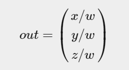
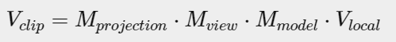
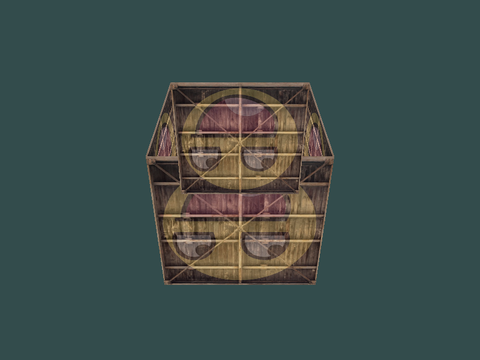
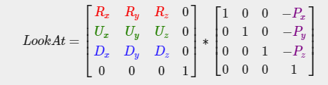

## OpenGL
### Core-profile 
  * OpenGL forces us to use modern practices. Whenever we try to use one of OpenGL’s deprecated functions, OpenGL raises an error and stops drawing. The advantage of learning the modern approach is that it is very flexible and efficient.

### Immediate mode 
  * In the old days, using OpenGL meant developing in immediate mode (often referred to as the fixed function pipeline) which was an easy-to-use method for drawing graphics. Most of the functionality of OpenGL was hidden inside the library and developers did not have much control over how OpenGL does its calculations.

### State machine 
  * OpenGL is by itself a large state machine: a collection of variables that define how OpenGL should currently operate.When using OpenGL, we often change its state by setting some options, manipulating some buffers and then render using the current context.

### Double buffer 
  * When an application draws in a single buffer the resulting image may display flickering issues. This is because the resulting output image is not drawn in an instant, but drawn pixel by pixel and usually from left to right and top to bottom. Because this image is not displayed at an instant to the user while still being rendered to, the result may contain artifacts. To circumvent these issues, windowing applications apply a double buffer for rendering. The front buffer contains the final output image that is shown at the screen, while all the rendering commands draw to the back buffer. As soon as all the rendering commands are finished we swap the back buffer to the front buffer so the image can be displayed without still being rendered to, removing all the aforementioned artifacts.

### Linking Vertex Attributes 

  * The position data is stored as 32-bit (4 byte) floating point values.
  * Each position is composed of 3 of those values.
  * There is no space (or other values) between each set of 3 values. The values are tightly packed in the array.
  * The first value in the data is at the beginning of the buffer.
  * Notice 
      - Each vertex attribute takes its data from memory managed by a VBO and which VBO it takes its data from (you can have multiple VBOs) is determined by the VBO currently bound to GL\_ARRAY\_BUFFER when calling glVertexAttribPointer.

### Part of pipeline 

  * Vertex shader 
       The first part of the pipeline is the vertex shader that takes as input a single vertex. The main purpose of the vertex shader is to transform 3D coordinates into different 3D coordinates.
  * Primitive assembly 
       The primitive assembly stage takes as input all the vertices (or vertex if GL\_POINTS is chosen) from the vertex shader that form a primitive and assembles all the point(s) in the primitive shape given; in this case a triangle.
  * Geometry shader 
       The output of the primitive assembly stage is passed to the geometry shader. The geometry shader takes as input a collection of vertices that form a primitive and has the ability to generate other shapes by emitting new vertices to form new (or other) primitive(s). In this example case, it generates a second triangle out of the given shape.
  * Rasterization stage 
       The output of the geometry shader is then passed on to the rasterization stage where it maps the resulting primitive(s) to the corresponding pixels on the final screen, resulting in fragments for the fragment shader to use. Before the fragment shaders run, clipping is performed. Clipping discards all fragments that are outside your view, increasing performance.
  * Fragment shader 
       The main purpose of the fragment shader is to calculate the final color of a pixel and this is usually the stage where all the advanced OpenGL effects occur. Usually the fragment shader contains data about the 3D scene that it can use to calculate the final pixel color (like lights, shadows, color of the light and so on).
  * Alpha test &amp; blending 
       After all the corresponding color values have been determined, the final object will then pass through one more stage that we call the alpha test and blending stage. This stage checks the corresponding depth (and stencil) value (we’ll get to those later) of the fragment and uses those to check if the resulting fragment is in front or behind other objects and should be discarded accordingly. The stage also checks for alpha values (alpha values define the opacity of an object) and blends the objects accordingly. So even if a pixel output color is calculated in the fragment shader

### Vertex Array Object (VAO) 

   A vertex array object (also known as VAO) can be bound just like a vertex buffer object and any subsequent vertex attribute calls from that point on will be stored inside the VAO, This makes switching between different vertex data and attribute configurations as easy as binding a different VAO

### Normalized Device Coordinates (NDC) 
   Once your vertex coordinates have been processed in the vertex shader, they should be in normalized device coordinates which is a small space where the x, y and z values vary from -1.0 to 1.0

### Vertex buffer objects (VBO) 
   that can store a large number of vertices in the GPU’s memory.The advantage of using those buffer objects is that we can send large batches of data all at once to the graphics card.

### Element Buffer Objects (EBO) 

   What would be a better solution is to store only the unique vertices and then specify the order at which we want to draw these vertices in. An EBO is a buffer, just like a vertex buffer object, that stores indices that OpenGL uses to decide what vertices to draw

### Vertex shader 
   Modern OpenGL requires that we at least set up a vertex and fragment shader if we want to do some rendering

### Fragment shader 
   The fragment shader is all about calculating the color output of your pixels.

### Shader program 
   A shader program object is the final linked version of multiple shaders combined, When linking the shaders into a program it links the outputs of each shader to the inputs of the next shader.

### Texture Wrapping 
  * Texture coordinates usually range from (0,0) to (1,1) but what happens if we specify coordinates outside this range? The default behavior of OpenGL is to repeat the texture images
  * `GL_REPEAT` `GL_MIRRORED_REPEAT` `GL_CLAMP_TO_EDGE` `GL_CLAMP_TO_BORDER`
  * If we choose the `GL_CLAMP_TO_BORDER` option we should also specify a border color.

### Texture Filtering 
  * Texture coordinates do not depend on resolution but can be any floating point value, thus OpenGL has to figure out which texture pixel (also known as a texel ) to map the texture coordinate to. This becomes especially important if you have a very large object and a low resolution texture
  * `GL_NEAREST` (also known as nearest neighbor or point filtering) is the default texture filtering method of OpenGL. When set to GL\_NEAREST, OpenGL selects the texel that center is closest to the texture coordinate
      
     
* `GL_LINEAR` (also known as (bi)linear filtering) takes an interpolated value from the texture coordinate’s neighboring texels
    
     
* Different:

     

### Mipmaps 
   Imagine we had a large room with thousands of objects, each with an attached texture. There will be objects far away that have the same high resolution texture attached as the objects close to the viewer. Since the objects are far away and probably only produce a few fragments, OpenGL has difficulties retrieving the right color value for its fragment from the high resolution texture, since it has to pick a texture color for a fragment that spans a large part of the texture.

### The fragment shader access to the texture object 
   how do we pass the texture object to the fragment shader? GLSL has a built-in data-type for texture objects called a sampler that takes as a postfix the texture type we want e.g. sampler1D, sampler3D or in our case sampler2D. We can then add a texture to the fragment shader by simply declaring a uniform sampler2D that we later assign our texture to.

### Texture Units 
   The main purpose of texture units is to allow us to use more than 1 texture in our shaders. By assigning texture units to the samplers, we can bind to multiple textures at once as long as we activate the corresponding texture unit first

### Coordinate Systems 
  * Local space (or Object space)

  * World space

  * View space (or Eye space) 
      - The view space is what people usually refer to as the camera of OpenGL (it is sometimes also known as camera space or eye space). The view space is the result of transforming your world-space coordinates to coordinates that are in front of the user’s view. The view space is thus the space as seen from the camera’s point of view. This is usually accomplished with a combination of translations and rotations to translate/rotate the scene so that certain items are transformed to the front of the camera.

  * Clip space 
      - OpenGL expects the coordinates to be within a specific range and any coordinate that falls outside this range is clipped. Coordinates that are clipped are discarded, so the remaining coordinates will end up as fragments visible on your screen.

  * Screen space
   

  * Orthographic projection 
      * An orthographic projection matrix defines a cube-like frustum box that defines the clipping space where each vertex outside this box is clipped. When creating an orthographic projection matrix we specify the width, height and length of the visible frustum. All the coordinates inside this frustum will end up within the NDC range after transformed by its matrix and thus won’t be clipped. The frustum looks a bit like a container

      * 

      * The frustum defines the visible coordinates and is specified by a width, a height and a near and far plane. Any coordinate in front of the near plane is clipped and the same applies to coordinates behind the far plane. The orthographic frustum directly maps all coordinates inside the frustum to normalized device coordinates without any special side effects since it won’t touch the w component of the transformed vector.

      * `glm::ortho(0.0f, 800.0f, 0.0f, 600.0f, 0.1f, 100.0f);`
        
      * The first two parameters specify the left and right coordinate of the frustum and the third and fourth parameter specify the bottom and top part of the frustum. With those 4 points we’ve defined the size of the near and far planes and the 5th and 6th parameter then define the distances between the near and far plane.

  * Perspective projection 
    * you’ll notice that objects that are farther away appear much smaller. This weird effect is something we call perspective. 

    * This is exactly the effect perspective projection tries to mimic and it does so using a perspective projection matrix. The projection matrix maps a given frustum range to clip space, but also manipulates the w value of each vertex coordinate in such a way that the further away a vertex coordinate is from the viewer, the higher this w component becomes. Once the coordinates are transformed to clip space they are in the range -w to w (anything outside this range is clipped)
      
    * 

    * `glm::mat4 proj = glm::perspective(glm::radians(45.0f), (float)width/(float)height, 0.1f, 100.0f);`

    * Its first parameter defines the fov value, that stands for field of view and sets how large the viewspace is. For a realistic view it is usually set to 45 degrees, but for more doom-style results you could set it to a higher value. The second parameter sets the aspect ratio which is calculated by dividing the viewport’s width by its height. The third and fourth parameter set the near and far plane of the frustum. We usually set the near distance to 0.1 and the far distance to 100.0. 
    * 

  * Putting it all together 
    * 

## More 3D
* It does resemble a cube slightly but something's off. Some sides of the cubes are being drawn over other sides of the cube. This happens because when OpenGL draws your cube triangle-by-triangle, fragment by fragment, it will overwrite any pixel color that may have already been drawn there before. Since OpenGL gives no guarantee on the order of triangles rendered (within the same draw call), some triangles are drawn on top of each other even though one should clearly be in front of the other.Luckily, OpenGL stores depth information in a buffer called the z-buffer that allows OpenGL to decide when to draw over a pixel and when not to. Using the z-buffer we can configure OpenGL to do depth-testing.

  

## Z-buffer
OpenGL stores all its depth information in a z-buffer, also known as a depth buffer. GLFW automatically creates such a buffer for you (just like it has a color-buffer that stores the colors of the output image). The depth is stored within each fragment (as the fragment's z value) and whenever the fragment wants to output its color, OpenGL compares its depth values with the z-buffer. If the current fragment is behind the other fragment it is discarded, otherwise overwritten. This process is called depth testing and is done automatically by OpenGL.

## Camera

* OpenGL by itself is not familiar with the concept of a <em>camera</em>, but we can try to simulate one by moving all objects in the scene in the reverse direction

* Camera/View space
  * When we're talking about camera/view space we're talking about all the vertex coordinates as seen from the camera's perspective as the origin of the scene: the view matrix transforms all the world coordinates into view coordinates that are relative to the camera's position and direction. To define a camera we need its position in world space, the direction it's looking at, a vector pointing to the right and a vector pointing upwards from the camera.

* 
* Camera position
* Camera direction
* Right axis
* Up axis

### Look At
* A great thing about matrices is that if you define a coordinate space using 3 perpendicular (or non-linear) axes you can create a matrix with those 3 axes plus a translation vector and you can transform any vector to that coordinate space by multiplying it with this matrix. This is exactly what the <em>LookAt</em> matrix doe
* 
* Euler angles
  * Euler angles are 3 values that can represent any rotation in 3D, defined by Leonhard Euler somewhere in the 1700s. There are 3 Euler angles: <em>pitch</em>, <em>yaw</em> and <em>roll</em>. 

* 
* The process of converting yaw and pitch values to a direction vector requires a bit of trigonometry

* 
* 
* 

## Glossary

- `OpenGL`: a formal specification of a graphics API that defines the layout and output of each function.
- `GLAD`: an extension loading library that loads and sets all OpenGL’s function pointers for us so we can use all (modern) OpenGL’s functions.
- `Viewport`: the 2D window region where we render to.
- `Graphics Pipeline`: the entire process vertices have to walk through before ending up as one or more pixels on the screen.
- `Shader`: a small program that runs on the graphics card. Several stages of the graphics pipeline can use user-made shaders to replace existing functionality.
- `Vertex`: a collection of data that represent a single point.
- `Normalized Device Coordinates`: the coordinate system your vertices end up in after perspective division is performed on clip coordinates. All vertex positions in NDC between `-1.0` and `1.0` will not be discarded or clipped and end up visible.
- `Vertex Buffer Object`: a buffer object that allocates memory on the GPU and stores all the vertex data there for the graphics card to use.
- `Vertex Array Object`: stores buffer and vertex attribute state information.
- `Element Buffer Object`: a buffer object that stores indices on the GPU for indexed drawing.
- `Uniform`: a special type of GLSL variable that is global (each shader in a shader program can access this uniform variable) and only has to be set once.
- `Texture`: a special type of image used in shaders and usually wrapped around objects, giving the illusion an object is extremely detailed.
- `Texture Wrapping`: defines the mode that specifies how OpenGL should sample textures when texture coordinates are outside the range: (`0`, `1`).
- `Texture Filtering`: defines the mode that specifies how OpenGL should sample the texture when there are several texels (texture pixels) to choose from. This usually occurs when a texture is magnified.
- `Mipmaps`: stored smaller versions of a texture where the appropriate sized version is chosen based on the distance to the viewer.
- `stb_image`: image loading library.
- `Texture Units`: allows for multiple textures on a single shader program by binding multiple textures, each to a different texture unit.
- `Vector`: a mathematical entity that defines directions and/or positions in any dimension.
- `Matrix`: a rectangular array of mathematical expressions with useful transformation properties.
- `GLM`: a mathematics library tailored for OpenGL.
- `Local Space`: the space an object begins in. All coordinates relative to an object’s origin.
- `World Space`: all coordinates relative to a global origin.
- `View Space`: all coordinates as viewed from a camera’s perspective.
- `Clip Space`: all coordinates as viewed from the camera’s perspective but with projection applied. This is the space the vertex coordinates should end up in, as output of the vertex shader. OpenGL does the rest (clipping/perspective division).
- `Screen Space`: all coordinates as viewed from the screen. Coordinates range from `0` to screen width/height.
- `LookAt`: a special type of view matrix that creates a coordinate system where all coordinates are rotated and translated in such a way that the user is looking at a given target from a given position.
- `Euler Angles`: defined as `yaw`, `pitch` and `roll` that allow us to form any 3D direction vector from these 3 values.

## Resource

https://www.opengl-tutorial.org/