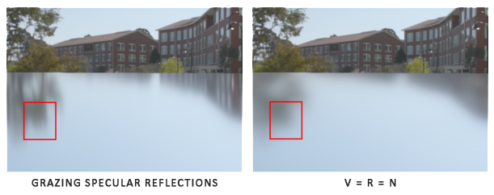
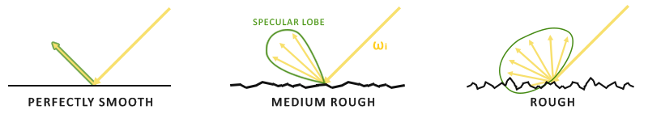

## Theory

PBR, or more commonly known as `physically based rendering`, is a collection of render techniques that are more or less based on the same underlying theory that more closely matches that of the physical world. As physically based rendering aims to mimic light in a physically plausible way, it generally looks more realistic compared to our original lighting algorithms like Phong and Blinn-Phong. Not only does it look better, as it closely approximates actual physics, we (and especially the artists) can author surface materials based on physical parameters without having to resort to cheap hacks and tweaks to make the lighting look right. One of the bigger advantages of authoring materials based on physical parameters is that these materials will look correct regardless of lighting conditions; something that is not true in non-PBR pipelines.

Physically based rendering is still nonetheless an approximation of reality (based on the principles of physics) which is why it's not called physical shading, but physically based shading. For a PBR lighting model to be considered physically based, it has to satisfy the following 3 conditions (don't worry, we'll get to them soon enough):

  * Be based on the microfacet surface model.
  * Be energy conserving.
  * Use a physically based BRDF.

We'll be focusing on the PBR approach as originally explored by Disney and adopted for real-time display by Epic Games. Their approach, based on the metallic workflow, is decently documented, widely adopted on most popular engines, and looks visually amazing. By the end of these chapters we'll have something that looks like this:

<div align=center>

</div>

Some of the more advanced knowledge you'll need for this series are: framebuffers, cubemaps, gamma correction, HDR, and normal mapping. We'll also delve into some advanced mathematics,

### The microfacet model
All the PBR techniques are based on the theory of microfacets. The theory describes that any surface at a microscopic scale can be described by tiny little perfectly reflective mirrors called microfacets. Depending on the roughness of a surface, the alignment of these tiny little mirrors can differ quite a lot:

<div align=center>

</div>

The rougher a surface is, the more chaotically aligned each microfacet will be along the surface. The effect of these tiny-like mirror alignments is, that when specifically talking about specular lighting/reflection, the incoming light rays are more likely to scatter along completely different directions on rougher surfaces, resulting in a more widespread specular reflection. In contrast, on a smooth surface the light rays are more likely to reflect in roughly the same direction, giving us smaller and sharper reflections:

<div align=center>

</div>

No surface is completely smooth on a microscopic level, but seeing as these microfacets are small enough that we can't make a distinction between them on a per-pixel basis, we statistically approximate the surface's microfacet roughness given a roughness parameter. Based on the roughness of a surface, we can calculate the ratio of microfacets roughly aligned to some vector $h$. This vector $h$ is the halfway vector that sits halfway between the light $l$ and view $v$ vector. We've discussed the halfway vector before in the advanced lighting chapter which is calculated as the sum of $l$ and $v$ divided by its length:

$$
\begin{aligned}
h = \frac{l + v}{\|l + v\|}
\end{aligned}
$$

The more the microfacets are aligned to the halfway vector, the sharper and stronger the specular reflection. Together with a roughness parameter that varies between 0 and 1, we can statistically approximate the alignment of the microfacets:

<div align=center>

</div>

We can see that higher roughness values display a much larger specular reflection shape, in contrast with the smaller and sharper specular reflection shape of smooth surfaces.

### Energy conservation
The microfacet approximation employs a form of `energy conservation`: outgoing light energy should never exceed the incoming light energy (excluding emissive surfaces). Looking at the above image we see the specular reflection area increase, but also its brightness decrease at increasing roughness levels. If the specular intensity were to be the same at each pixel (regardless of the size of the specular shape) the rougher surfaces would emit much more energy, violating the energy conservation principle. This is why we see specular reflections more intensely on smooth surfaces and more dimly on rough surfaces.

For energy conservation to hold, we need to make a clear distinction between diffuse and specular light. The moment a light ray hits a surface, it gets split in both a `refraction` part and a `reflection` part. The reflection part is light that directly gets reflected and doesn't enter the surface; this is what we know as specular lighting. The refraction part is the remaining light that enters the surface and gets absorbed; this is what we know as diffuse lighting.

There are some nuances here as refracted light doesn't immediately get absorbed by touching the surface. From physics, we know that light can be modeled as a beam of energy that keeps moving forward until it loses all of its energy; the way a light beam loses energy is by collision. Each material consists of tiny little particles that can collide with the light ray as illustrated in the following image. The particles absorb some, or all, of the light's energy at each collision which is converted into heat.

<div align=center>

</div>

Generally, not all energy is absorbed and the light will continue to `scatter` in a (mostly) random direction at which point it collides with other particles until its energy is depleted or it leaves the surface again. Light rays re-emerging out of the surface contribute to the surface's observed (diffuse) color. In physically based rendering however, we make the simplifying assumption that all refracted light gets absorbed and scattered at a very small area of impact, ignoring the effect of scattered light rays that would've exited the surface at a distance. Specific shader techniques that do take this into account are known as subsurface scattering techniques that significantly improve the visual quality on materials like skin, marble, or wax, but come at the price of performance.

An additional subtlety when it comes to reflection and refraction are surfaces that are metallic. Metallic surfaces react different to light compared to non-metallic surfaces (also known as dielectrics). Metallic surfaces follow the same principles of reflection and refraction, but all refracted light gets directly absorbed without scattering. This means metallic surfaces only leave reflected or specular light; metallic surfaces show no diffuse colors. Because of this apparent distinction between metals and dielectrics, they're both treated differently in the PBR pipeline which we'll delve into further down the chapter.

This distinction between reflected and refracted light brings us to another observation regarding energy preservation: they're `mutually exclusive`. Whatever light energy gets reflected will no longer be absorbed by the material itself. Thus, the energy left to enter the surface as refracted light is directly the resulting energy after we've taken reflection into account.

We preserve this energy conserving relation by first calculating the specular fraction that amounts the percentage the incoming light's energy is reflected. The fraction of refracted light is then directly calculated from the specular fraction as:

```c++
float kS = calculateSpecularComponent(...); // reflection/specular fraction
float kD = 1.0 - kS;                        // refraction/diffuse  fraction
```

This way we know both the amount the incoming light reflects and the amount the incoming light refracts, while adhering to the energy conservation principle. Given this approach, it is impossible for both the refracted/diffuse and reflected/specular contribution to exceed 1.0, thus ensuring the sum of their energy never exceeds the incoming light energy. Something we did not take into account in the previous lighting chapters.

### The reflectance equation

This brings us to something called the [render equation](https://en.wikipedia.org/wiki/Rendering_equation), an elaborate equation some very smart folks out there came up with that is currently the best model we have for simulating the visuals of light. Physically based rendering strongly follows a more specialized version of the render equation known as the `reflectance equation`. To properly understand PBR, it's important to first build a solid understanding of the reflectance equation:

$$
\begin{aligned}
L_o(p,\omega_o) = \int\limits_{\Omega} f_r(p,\omega_i,\omega_o) L_i(p,\omega_i) n \cdot \omega_i  d\omega_i
\end{aligned}
$$

The reflectance equation appears daunting at first, but as we'll dissect it you'll see it slowly starts to makes sense. To understand the equation, we have to delve into a bit of radiometry. Radiometry is the measurement of electromagnetic radiation, including visible light. There are several radiometric quantities we can use to measure light over surfaces and directions, but we will only discuss a single one that's relevant to the reflectance equation known as radiance, denoted here as $L$. Radiance is used to quantify the magnitude or strength of light coming from a single direction. It's a bit tricky to understand at first as radiance is a combination of multiple physical quantities so we'll focus on those first:

`Radiant flux`: radiant flux $\Phi$ is the transmitted energy of a light source measured in Watts. Light is a collective sum of energy over multiple different wavelengths, each wavelength associated with a particular (visible) color. The emitted energy of a light source can therefore be thought of as a function of all its different wavelengths. Wavelengths between 390nm to 700nm (nanometers) are considered part of the visible light spectrum i.e. wavelengths the human eye is able to perceive. Below you'll find an image of the different energies per wavelength of daylight:

<div align=center>

</div>

The radiant flux measures the total area of this function of different wavelengths. Directly taking this measure of wavelengths as input is slightly impractical so we often make the simplification of representing radiant flux, not as a function of varying wavelength strengths, but as a light color triplet encoded as RGB (or as we'd commonly call it: light color). This encoding does come at quite a loss of information, but this is generally negligible for visual aspects.

`Solid angle`: the solid angle, denoted as $\omega$, tells us the size or area of a shape projected onto a unit sphere. The area of the projected shape onto this unit sphere is known as the solid angle; you can visualize the solid angle as a direction with volume:

<div align=center>

</div>

Think of being an observer at the center of this unit sphere and looking in the direction of the shape; the size of the silhouette you make out of it is the solid angle.

`Radiant intensity`: radiant intensity measures the amount of radiant flux per solid angle, or the strength of a light source over a projected area onto the unit sphere. For instance, given an omnidirectional light that radiates equally in all directions, the radiant intensity can give us its energy over a specific area (solid angle):

<div align=center>

</div>

The equation to describe the radiant intensity is defined as follows:

$$
\begin{aligned}
I = \frac{d\Phi}{d\omega}
\end{aligned}
$$

Where $I$ is the radiant flux $\Phi$ over the solid angle $\omega$.

With knowledge of radiant flux, radiant intensity, and the solid angle, we can finally describe the equation for `radiance`. Radiance is described as the total observed energy in an area $A$ over the solid angle $\omega$ of a light of radiant intensity $\Phi$:

$$
\begin{aligned}
L=\frac{d^2\Phi}{ dA d\omega \cos\theta}
\end{aligned}
$$

<div align=center>

</div>

Radiance is a radiometric measure of the amount of light in an area, scaled by the incident (or incoming) angle $\theta$ of the light to the surface's normal as $\cos \theta$: light is weaker the less it directly radiates onto the surface, and strongest when it is directly perpendicular to the surface. This is similar to our perception of diffuse lighting from the basic lighting chapter as $\cos \theta$ directly corresponds to the dot product between the light's direction vector and the surface normal:

```c++
float cosTheta = dot(lightDir, N);  
```

The radiance equation is quite useful as it contains most physical quantities we're interested in. If we consider the solid angle $\omega$ and the area $A$ to be infinitely small, we can use radiance to measure the flux of a single ray of light hitting a single point in space. This relation allows us to calculate the radiance of a single light ray influencing a single (fragment) point; we effectively translate the solid angle $\omega$ into a direction vector $\omega$, and $A$ into a point $p$. This way, we can directly use radiance in our shaders to calculate a single light ray's per-fragment contribution.

In fact, when it comes to radiance we generally care about `all` incoming light onto a point $p$, which is the sum of all radiance known as irradiance. With knowledge of both radiance and irradiance we can get back to the reflectance equation:

$$
\begin{aligned}
L_o(p,\omega_o) = \int\limits_{\Omega} f_r(p,\omega_i,\omega_o) L_i(p,\omega_i) n \cdot \omega_i  d\omega_i
\end{aligned}
$$

We now know that $L$ in the render equation represents the radiance of some point $p$ and some incoming infinitely small solid angle $\omega_i$ which can be thought of as an incoming direction vector  $\omega_i$. Remember that $\cos \theta$ scales the energy based on the light's incident angle to the surface, which we find in the reflectance equation as $n \cdot \omega_i$. The reflectance equation calculates the sum of reflected radiance $L_o(p, \omega_o)$ of a point $p$ in direction $\omega_o$ which is the outgoing direction to the viewer. Or to put it differently: $L_o$ measures the reflected sum of the lights' irradiance onto point $p$ as viewed from $\omega_o$.

The reflectance equation is based around irradiance, which is the sum of all incoming radiance we measure light of. Not just of a single incoming light direction, but of all incoming light directions within a hemisphere $\Omega$ centered around point $p$. A hemisphere can be described as half a sphere aligned around a surface's normal $n$:

<div align=center>

</div>

To calculate the total of values inside an area or (in the case of a hemisphere) a volume, we use a mathematical construct called an integral denoted in the reflectance equation as $\int$ over all incoming directions $d\omega_i$ within the hemisphere $\Omega$ . An integral measures the area of a function, which can either be calculated analytically or numerically. As there is no analytical solution to both the render and reflectance equation, we'll want to numerically solve the integral discretely. This translates to taking the result of small discrete steps of the reflectance equation over the hemisphere $\Omega$ and averaging their results over the step size. This is known as the Riemann sum that we can roughly visualize in code as follows:

```c++
int steps = 100;
float sum = 0.0f;
vec3 P    = ...;
vec3 Wo   = ...;
vec3 N    = ...;
float dW  = 1.0f / steps;
for(int i = 0; i < steps; ++i) 
{
    vec3 Wi = getNextIncomingLightDir(i);
    sum += Fr(P, Wi, Wo) * L(P, Wi) * dot(N, Wi) * dW;
}
```

By scaling the steps by dW, the sum will equal the total area or volume of the integral function. The $d\omega$ to scale each discrete step can be thought of as $d\omega_i$ in the reflectance equation. Mathematically $d\omega_i$ is the continuous symbol over which we calculate the integral, and while it does not directly relate to dW in code (as this is a discrete step of the Riemann sum), it helps to think of it this way. Keep in mind that taking discrete steps will always give us an approximation of the total area of the function. A careful reader will notice we can increase the accuracy of the Riemann Sum by increasing the number of steps.

The reflectance equation sums up the radiance of all incoming light directions $\omega_i$ over the hemisphere $\Omega$ scaled by $f_r$ that hit point $p$ and returns the sum of reflected light $L_o$ in the viewer's direction. The incoming radiance can come from light sources as we're familiar with, or from an environment map measuring the radiance of every incoming direction as we'll discuss in the IBL chapters.

Now the only unknown left is the $f_r$ symbol known as the `BRDF` or `bidirectional reflective distribution function` that scales or weighs the incoming radiance based on the surface's material properties.

### BRDF

The `BRDF`, or `bidirectional reflective distribution function`, is a function that takes as input the incoming (light) direction $\omega_i$, the outgoing (view) direction $\omega_o$, the surface normal $n$, and a surface parameter $a$ that represents the microsurface's roughness. The BRDF approximates how much each individual light ray $\omega_i$ contributes to the final reflected light of an opaque surface given its material properties. For instance, if the surface has a perfectly smooth surface (~like a mirror) the BRDF function would return 0.0 for all incoming light rays $\omega_i$ except the one ray that has the same (reflected) angle as the outgoing ray $\omega_o$ at which the function returns 1.0.

A BRDF approximates the material's reflective and refractive properties based on the previously discussed microfacet theory. For a BRDF to be physically plausible it has to respect the law of energy conservation i.e. the sum of reflected light should never exceed the amount of incoming light. Technically, Blinn-Phong is considered a BRDF taking the same $\omega_i$ and $\omega_o$ as inputs. However, Blinn-Phong is not considered physically based as it doesn't adhere to the energy conservation principle. There are several physically based BRDFs out there to approximate the surface's reaction to light. However, almost all real-time PBR render pipelines use a BRDF known as the `Cook-Torrance BRDF`.

The Cook-Torrance BRDF contains both a diffuse and specular part:

$$
\begin{aligned}
f_r = k_d f_{lambert} +  k_s f_{cook-torrance}
\end{aligned}
$$

Here $k_d$ is the earlier mentioned ratio of incoming light energy that gets refracted with $k_s$ being the ratio that gets reflected. The left side of the BRDF states the diffuse part of the equation denoted here as $f_{lambert}$. This is known as `Lambertian diffuse` similar to what we used for diffuse shading, which is a constant factor denoted as:

$$
\begin{aligned}
f_{lambert} = \frac{c}{\pi}
\end{aligned}
$$

With $c$ being the albedo or surface color (think of the diffuse surface texture). The divide by pi is there to normalize the diffuse light as the earlier denoted integral that contains the BRDF is scaled by $\pi$ (we'll get to that in the IBL chapters).

Note:
You may wonder how this Lambertian diffuse relates to the diffuse lighting we've been using before: the surface color multiplied by the dot product between the surface's normal and the light direction. The dot product is still there, but moved out of the BRDF as we find $n \cdot \omega_i$ at the end of the $L_o$ integral.

There exist different equations for the diffuse part of the BRDF which tend to look more realistic, but are also more computationally expensive. As concluded by Epic Games however, the Lambertian diffuse is sufficient enough for most real-time rendering purposes.

The specular part of the BRDF is a bit more advanced and is described as:

$$
\begin{aligned}
f_{CookTorrance} = \frac{DFG}{4(\omega_o \cdot n)(\omega_i \cdot n)}
\end{aligned}
$$

The Cook-Torrance specular BRDF is composed three functions and a normalization factor in the denominator. Each of the D, F and G symbols represent a type of function that approximates a specific part of the surface's reflective properties. These are defined as the normal $D$istribution function, the $F$resnel equation and the $G$eometry function:

* `Normal distribution function`: approximates the amount the surface's microfacets are aligned to the halfway vector, influenced by the roughness of the surface; this is the primary function approximating the microfacets.
* `Geometry function`: describes the self-shadowing property of the microfacets. When a surface is relatively rough, the surface's microfacets can overshadow other microfacets reducing the light the surface reflects.
* `Fresnel equation`: The Fresnel equation describes the ratio of surface reflection at different surface angles.

Each of these functions are an approximation of their physics equivalents and you'll find more than one version of each that aims to approximate the underlying physics in different ways; some more realistic, others more efficient. It is perfectly fine to pick whatever approximated version of these functions you want to use. Brian Karis from Epic Games did a great deal of research on the multiple types of approximations [here](http://graphicrants.blogspot.nl/2013/08/specular-brdf-reference.html). We're going to pick the same functions used by Epic Game's Unreal Engine 4 which are the Trowbridge-Reitz GGX for D, the Fresnel-Schlick approximation for F, and the Smith's Schlick-GGX for G.

#### Normal distribution function

The `normal distribution function` $D$ statistically approximates the relative surface area of microfacets exactly aligned to the (halfway) vector $h$. There are a multitude of NDFs that statistically approximate the general alignment of the microfacets given some roughness parameter and the one we'll be using is known as the Trowbridge-Reitz GGX:

$$
\begin{aligned}
NDF_{GGX TR}(n, h, \alpha) = \frac{\alpha^2}{\pi((n \cdot h)^2 (\alpha^2 - 1) + 1)^2}
\end{aligned}
$$

Here $h$ is the halfway vector to measure against the surface's microfacets, with $a$ being a measure of the surface's roughness. If we take $h$ as the halfway vector between the surface normal and light direction over varying roughness parameters we get the following visual result:

<div align=center>

</div>

When the roughness is low (thus the surface is smooth), a highly concentrated number of microfacets are aligned to halfway vectors over a small radius. Due to this high concentration, the NDF displays a very bright spot. On a rough surface however, where the microfacets are aligned in much more random directions, you'll find a much larger number of halfway vectors $h$ somewhat aligned to the microfacets (but less concentrated), giving us the more grayish results.

In GLSL the Trowbridge-Reitz GGX normal distribution function translates to the following code:

```c++
float DistributionGGX(vec3 N, vec3 H, float a)
{
    float a2     = a*a;
    float NdotH  = max(dot(N, H), 0.0);
    float NdotH2 = NdotH*NdotH;
	
    float nom    = a2;
    float denom  = (NdotH2 * (a2 - 1.0) + 1.0);
    denom        = PI * denom * denom;
	
    return nom / denom;
}
```

#### Geometry function
The geometry function statistically approximates the relative surface area where its micro surface-details overshadow each other, causing light rays to be occluded.

<div align=center>

</div>

Similar to the NDF, the Geometry function takes a material's roughness parameter as input with rougher surfaces having a higher probability of overshadowing microfacets. The geometry function we will use is a combination of the GGX and Schlick-Beckmann approximation known as Schlick-GGX:

$$
\begin{aligned}
G_{SchlickGGX}(n, v, k) 
       		 = 
   		\frac{n \cdot v}
    	{(n \cdot v)(1 - k) + k }
\end{aligned}
$$

Here $k$ is a remapping of $\alpha$ based on whether we're using the geometry function for either direct lighting or IBL lighting:

$$
\begin{aligned}
k_{direct} = \frac{(\alpha + 1)^2}{8}
\end{aligned}
$$

$$
\begin{aligned}
k_{IBL} = \frac{\alpha^2}{2}
\end{aligned}
$$

Note that the value of $\alpha$ may differ based on how your engine translates roughness to $\alpha$. In the following chapters we'll extensively discuss how and where this remapping becomes relevant.

To effectively approximate the geometry we need to take account of both the view direction (geometry obstruction) and the light direction vector (geometry shadowing). We can take both into account using `Smith's method`:

$$
\begin{aligned}
G(n, v, l, k) = G_{sub}(n, v, k) G_{sub}(n, l, k)
\end{aligned}
$$

Using Smith's method with Schlick-GGX as $G_{sub}$ gives the following visual appearance over varying roughness $R$:

<div align=center>

</div>

The geometry function is a multiplier between [0.0, 1.0] with 1.0 (or white) measuring no microfacet shadowing, and 0.0 (or black) complete microfacet shadowing.

In GLSL the geometry function translates to the following code:

```c++
float GeometrySchlickGGX(float NdotV, float k)
{
    float nom   = NdotV;
    float denom = NdotV * (1.0 - k) + k;
	
    return nom / denom;
}
  
float GeometrySmith(vec3 N, vec3 V, vec3 L, float k)
{
    float NdotV = max(dot(N, V), 0.0);
    float NdotL = max(dot(N, L), 0.0);
    float ggx1 = GeometrySchlickGGX(NdotV, k);
    float ggx2 = GeometrySchlickGGX(NdotL, k);
	
    return ggx1 * ggx2;
}
```

#### Fresnel equation

The Fresnel equation (pronounced as Freh-nel) describes the ratio of light that gets reflected over the light that gets refracted, which varies over the angle we're looking at a surface. The moment light hits a surface, based on the surface-to-view angle, the Fresnel equation tells us the percentage of light that gets reflected. From this ratio of reflection and the energy conservation principle we can directly obtain the refracted portion of light.

Every surface or material has a level of `base reflectivity` when looking straight at its surface, but when looking at the surface from an angle all reflections become more apparent compared to the surface's base reflectivity. You can check this for yourself by looking at your (presumably) wooden/metallic desk which has a certain level of base reflectivity from a perpendicular view angle, but by looking at your desk from an almost 90 degree angle you'll see the reflections become much more apparent. All surfaces theoretically fully reflect light if seen from perfect 90-degree angles. This phenomenon is known as Fresnel and is described by the `Fresnel` equation.

The Fresnel equation is a rather complex equation, but luckily the Fresnel equation can be approximated using the `Fresnel-Schlick` approximation:

$$
\begin{aligned}
F_{Schlick}(h, v, F_0) = 
    F_0 + (1 - F_0) ( 1 - (h \cdot v))^5
\end{aligned}
$$

$F_0$ represents the base reflectivity of the surface, which we calculate using something called the indices of refraction or IOR. As you can see on a sphere surface, the more we look towards the surface's grazing angles (with the halfway-view angle reaching 90 degrees), the stronger the Fresnel and thus the reflections:

<div align=center>

</div>

There are a few subtleties involved with the Fresnel equation. One is that the Fresnel-Schlick approximation is only really defined for `dielectric` or non-metal surfaces. For `conductor` surfaces (metals), calculating the base reflectivity with indices of refraction doesn't properly hold and we need to use a different Fresnel equation for conductors altogether. As this is inconvenient, we further approximate by pre-computing the surface's response at `normal incidence` ($F_0$) at a 0 degree angle as if looking directly onto a surface. We interpolate this value based on the view angle, as per the Fresnel-Schlick approximation, such that we can use the same equation for both metals and non-metals.

The surface's response at normal incidence, or the base reflectivity, can be found in large databases like [these](http://refractiveindex.info/) with some of the more common values listed below as taken from Naty Hoffman's course notes:

<div align=center>

</div>

What is interesting to observe here is that for all dielectric surfaces the base reflectivity never gets above 0.17 which is the exception rather than the rule, while for conductors the base reflectivity starts much higher and (mostly) varies between 0.5 and 1.0. Furthermore, for conductors (or metallic surfaces) the base reflectivity is tinted. This is why $F_0$ is presented as an RGB triplet (reflectivity at normal incidence can vary per wavelength); this is something we `only` see at metallic surfaces.

These specific attributes of metallic surfaces compared to dielectric surfaces gave rise to something called the metallic workflow. In the metallic workflow we author surface materials with an extra parameter known as metalness that describes whether a surface is either a metallic or a non-metallic surface.

Note:
Theoretically, the metalness of a material is binary: it's either a metal or it isn't; it can't be both. However, most render pipelines allow configuring the metalness of a surface linearly between 0.0 and 1.0. This is mostly because of the lack of material texture precision. For instance, a surface having small (non-metal) dust/sand-like particles/scratches over a metallic surface is difficult to render with binary metalness values.

By pre-computing $F_0$ for both dielectrics and conductors we can use the same Fresnel-Schlick approximation for both types of surfaces, but we do have to tint the base reflectivity if we have a metallic surface. We generally accomplish this as follows:

```c++
vec3 F0 = vec3(0.04);
F0      = mix(F0, surfaceColor.rgb, metalness);
```

We define a base reflectivity that is approximated for most dielectric surfaces. This is yet another approximation as $F_0$ is averaged around most common dielectrics. A base reflectivity of 0.04 holds for most dielectrics and produces physically plausible results without having to author an additional surface parameter. Then, based on how metallic a surface is, we either take the dielectric base reflectivity or take $F_0$ authored as the surface color. Because metallic surfaces absorb all refracted light they have no diffuse reflections and we can directly use the surface color texture as their base reflectivity.

In code, the Fresnel Schlick approximation translates to:

```c++
vec3 fresnelSchlick(float cosTheta, vec3 F0)
{
    return F0 + (1.0 - $F_0$) * pow(1.0 - cosTheta, 5.0);
}
```
With cosTheta being the dot product result between the surface's normal $n$ and the halfway $h$ (or view $v$) direction

#### Cook-Torrance reflectance equation

With every component of the Cook-Torrance BRDF described, we can include the physically based BRDF into the now final reflectance equation:

$$
\begin{aligned}
L_o(p,\omega_o) = \int\limits_{\Omega} 
    	(k_d\frac{c}{\pi} + k_s\frac{DFG}{4(\omega_o \cdot n)(\omega_i \cdot n)})
    	L_i(p,\omega_i) n \cdot \omega_i  d\omega_i
\end{aligned}
$$

This equation is not fully mathematically correct however. You may remember that the Fresnel term $F$ represents the ratio of light that gets reflected on a surface. This is effectively our ratio $k_s$, meaning the specular (BRDF) part of the reflectance equation implicitly contains the reflectance ratio $k_s$. Given this, our final final reflectance equation becomes:

$$
\begin{aligned}
L_o(p,\omega_o) = \int\limits_{\Omega} 
    	(k_d\frac{c}{\pi} + \frac{DFG}{4(\omega_o \cdot n)(\omega_i \cdot n)})
    	L_i(p,\omega_i) n \cdot \omega_i  d\omega_i
\end{aligned}
$$

This equation now completely describes a physically based render model that is generally recognized as what we commonly understand as physically based rendering, or PBR. Don't worry if you didn't yet completely understand how we'll need to fit all the discussed mathematics together in code. In the next chapters, we'll explore how to utilize the reflectance equation to get much more physically plausible results in our rendered lighting and all the bits and pieces should slowly start to fit together.

### Authoring PBR materials

With knowledge of the underlying mathematical model of PBR we'll finalize the discussion by describing how artists generally author the physical properties of a surface that we can directly feed into the PBR equations. Each of the surface parameters we need for a PBR pipeline can be defined or modeled by textures. Using textures gives us per-fragment control over how each specific surface point should react to light: whether that point is metallic, rough or smooth, or how the surface responds to different wavelengths of light.

Below you'll see a list of textures you'll frequently find in a PBR pipeline together with its visual output if supplied to a PBR renderer:

<div align=center>

</div>

`Albedo`: the albedo texture specifies for each texel the color of the surface, or the base reflectivity if that texel is metallic. This is largely similar to what we've been using before as a diffuse texture, but all lighting information is extracted from the texture. Diffuse textures often have slight shadows or darkened crevices inside the image which is something you don't want in an albedo texture; it should only contain the color (or refracted absorption coefficients) of the surface.

`Normal`: the normal map texture is exactly as we've been using before in the normal mapping chapter. The normal map allows us to specify, per fragment, a unique normal to give the illusion that a surface is bumpier than its flat counterpart.

Metallic: the metallic map specifies per texel whether a texel is either metallic or it isn't. Based on how the PBR engine is set up, artists can author metalness as either grayscale values or as binary black or white.

`Roughness`: the roughness map specifies how rough a surface is on a per texel basis. The sampled roughness value of the roughness influences the statistical microfacet orientations of the surface. A rougher surface gets wider and blurrier reflections, while a smooth surface gets focused and clear reflections. Some PBR engines expect a `smoothness` map instead of a roughness map which some artists find more intuitive. These values are then translated `(1.0 - smoothness)` to roughness the moment they're sampled.

`AO`: the `ambient occlusion` or `AO` map specifies an extra shadowing factor of the surface and potentially surrounding geometry. If we have a brick surface for instance, the albedo texture should have no shadowing information inside the brick's crevices. The AO map however does specify these darkened edges as it's more difficult for light to escape. Taking ambient occlusion in account at the end of the lighting stage can significantly boost the visual quality of your scene. The ambient occlusion map of a mesh/surface is either manually generated, or pre-calculated in 3D modeling programs.

Artists set and tweak these physically based input values on a per-texel basis and can base their texture values on the physical surface properties of real-world materials. This is one of the biggest advantages of a PBR render pipeline as these physical properties of a surface remain the same, regardless of environment or lighting setup, making life easier for artists to get physically plausible results. Surfaces authored in a PBR pipeline can easily be shared among different PBR render engines, will look correct regardless of the environment they're in, and as a result look much more natural.

## Lighting
we'll focus on translating the previously discussed theory into an actual renderer that uses direct (or analytic) light sources: think of point lights, directional lights, and/or spotlights.

Let's start by re-visiting the final reflectance equation from the previous chapter:
$$
\begin{aligned}
L_o(p,\omega_o) = \int\limits_{\Omega} 
    	(k_d\frac{c}{\pi} + \frac{DFG}{4(\omega_o \cdot n)(\omega_i \cdot n)})
    	L_i(p,\omega_i) n \cdot \omega_i  d\omega_i
\end{aligned}
$$

We now know mostly what's going on, but what still remained a big unknown is how exactly we're going to represent irradiance, the total radiance L, of the scene. We know that radiance L (as interpreted in computer graphics land) measures the radiant flux ϕ or light energy of a light source over a given solid angle $\Omega$. In our case we assumed the solid angle $\Omega$ to be infinitely small in which case radiance measures the flux of a light source over a single light ray or direction vector.

Given this knowledge, how do we translate this into some of the lighting knowledge we've accumulated from previous chapters? Well, imagine we have a single point light (a light source that shines equally bright in all directions) with a radiant flux of (23.47, 21.31, 20.79) as translated to an RGB triplet. The radiant intensity of this light source equals its radiant flux at all outgoing direction rays. However, when shading a specific point p on a surface, of all possible incoming light directions over its hemisphere $\Omega$, only one incoming direction vector wi directly comes from the point light source. As we only have a single light source in our scene, assumed to be a single point in space, all other possible incoming light directions have zero radiance observed over the surface point p:

<div align=center>

</div>

If at first, we assume that light attenuation (dimming of light over distance) does not affect the point light source, the radiance of the incoming light ray is the same regardless of where we position the light (excluding scaling the radiance by the incident angle cosθ). This, because the point light has the same radiant intensity regardless of the angle we look at it, effectively modeling its radiant intensity as its radiant flux: a constant vector (23.47, 21.31, 20.79).

However, radiance also takes a position p as input and as any realistic point light source takes light attenuation into account, the radiant intensity of the point light source is scaled by some measure of the distance between point p and the light source. Then, as extracted from the original radiance equation, the result is scaled by the dot product between the surface normal n and the incoming light direction wi.

To put this in more practical terms: in the case of a direct point light the radiance function L measures the light color, attenuated over its distance to p and scaled by n⋅wi, but only over the single light ray wi that hits p which equals the light's direction vector from p. In code this translates to:

```c++
vec3  lightColor  = vec3(23.47, 21.31, 20.79);
vec3  wi          = normalize(lightPos - fragPos);
float cosTheta    = max(dot(N, Wi), 0.0);
float attenuation = calculateAttenuation(fragPos, lightPos);
vec3  radiance    = lightColor * attenuation * cosTheta;
```

Aside from the different terminology, this piece of code should be awfully familiar to you: this is exactly how we've been doing diffuse lighting so far. When it comes to direct lighting, radiance is calculated similarly to how we've calculated lighting before as only a single light direction vector contributes to the surface's radiance.

Note that this assumption holds as point lights are infinitely small and only a single point in space. If we were to model a light that has area or volume, its radiance would be non-zero in more than one incoming light direction.
For other types of light sources originating from a single point we calculate radiance similarly. For instance, a directional light source has a constant wi without an attenuation factor. And a spotlight would not have a constant radiant intensity, but one that is scaled by the forward direction vector of the spotlight.

This also brings us back to the integral $\int$ over the surface's hemisphere $\Omega$ . As we know beforehand the single locations of all the contributing light sources while shading a single surface point, it is not required to try and solve the integral. We can directly take the (known) number of light sources and calculate their total irradiance, given that each light source has only a single light direction that influences the surface's radiance. This makes PBR on direct light sources relatively simple as we effectively only have to loop over the contributing light sources. When we later take environment lighting into account in the IBL chapters we do have to take the integral into account as light can come from any direction.

### A PBR surface model
Let's start by writing a fragment shader that implements the previously described PBR models. First, we need to take the relevant PBR inputs required for shading the surface:

```c++
#version 330 core
out vec4 FragColor;
in vec2 TexCoords;
in vec3 WorldPos;
in vec3 Normal;
  
uniform vec3 camPos;
  
uniform vec3  albedo;
uniform float metallic;
uniform float roughness;
uniform float ao;
```

We take the standard inputs as calculated from a generic vertex shader and a set of constant material properties over the surface of the object.

Then at the start of the fragment shader we do the usual calculations required for any lighting algorithm:

```c++
void main()
{
    vec3 N = normalize(Normal); 
    vec3 V = normalize(camPos - WorldPos);
    [...]
}
```

#### Direct lighting
In this chapter's example demo we have a total of 4 point lights that together represent the scene's irradiance. To satisfy the reflectance equation we loop over each light source, calculate its individual radiance and sum its contribution scaled by the BRDF and the light's incident angle. We can think of the loop as solving the integral $\int$ over $\Omega$ for direct light sources. First, we calculate the relevant per-light variables:

```C++
vec3 Lo = vec3(0.0);
for(int i = 0; i < 4; ++i) 
{
    vec3 L = normalize(lightPositions[i] - WorldPos);
    vec3 H = normalize(V + L);
  
    float distance    = length(lightPositions[i] - WorldPos);
    float attenuation = 1.0 / (distance * distance);
    vec3 radiance     = lightColors[i] * attenuation; 
    [...]  
```

As we calculate lighting in linear space (we'll gamma correct at the end of the shader) we attenuate the light sources by the more physically correct inverse-square law.

Note: 
  * While physically correct, you may still want to use the constant-linear-quadratic attenuation equation that (while not physically correct) can offer you significantly more control over the light's energy falloff.

Then, for each light we want to calculate the full Cook-Torrance specular BRDF term:

$$
\begin{aligned}
\frac{DFG}{4(\omega_o \cdot n)(\omega_i \cdot n)}
\end{aligned}
$$

The first thing we want to do is calculate the ratio between specular and diffuse reflection, or how much the surface reflects light versus how much it refracts light. We know from the previous chapter that the Fresnel equation calculates just that:

```c++
vec3 fresnelSchlick(float cosTheta, vec3 F0)
{
    return F0 + (1.0 - F0) * pow(1.0 - cosTheta, 5.0);
}  
```

The Fresnel-Schlick approximation expects a $F0$ parameter which is known as the surface reflection at zero incidence or how much the surface reflects if looking directly at the surface. The $F0$ varies per material and is tinted on metals as we find in large material databases. In the PBR metallic workflow we make the simplifying assumption that most dielectric surfaces look visually correct with a constant $F0$ of 0.04, while we do specify $F0$ for metallic surfaces as then given by the albedo value. This translates to code as follows:

```c++
vec3 F0 = vec3(0.04); 
F0      = mix(F0, albedo, metallic);
vec3 F  = fresnelSchlick(max(dot(H, V), 0.0), F0);
```

As you can see, for non-metallic surfaces $F0$ is always $0.04$. For metallic surfaces, we vary $F0$ by linearly interpolating between the original $F0$ and the albedo value given the `metallic` property.

Given $F$, the remaining terms to calculate are the normal distribution function $D$ and the geometry function $G$.

In a direct PBR lighting shader their code equivalents are:

```c++
float DistributionGGX(vec3 N, vec3 H, float roughness)
{
    float a      = roughness*roughness;
    float a2     = a*a;
    float NdotH  = max(dot(N, H), 0.0);
    float NdotH2 = NdotH*NdotH;
	
    float num   = a2;
    float denom = (NdotH2 * (a2 - 1.0) + 1.0);
    denom = PI * denom * denom;
	
    return num / denom;
}

float GeometrySchlickGGX(float NdotV, float roughness)
{
    float r = (roughness + 1.0);
    float k = (r*r) / 8.0;

    float num   = NdotV;
    float denom = NdotV * (1.0 - k) + k;
	
    return num / denom;
}
float GeometrySmith(vec3 N, vec3 V, vec3 L, float roughness)
{
    float NdotV = max(dot(N, V), 0.0);
    float NdotL = max(dot(N, L), 0.0);
    float ggx2  = GeometrySchlickGGX(NdotV, roughness);
    float ggx1  = GeometrySchlickGGX(NdotL, roughness);
	
    return ggx1 * ggx2;
}
```

What's important to note here is that in contrast to the theory chapter, we pass the roughness parameter directly to these functions; this way we can make some term-specific modifications to the original roughness value. Based on observations by Disney and adopted by Epic Games, the lighting looks more correct squaring the roughness in both the geometry and normal distribution function.

With both functions defined, calculating the NDF and the G term in the reflectance loop is straightforward:

```c++
float NDF = DistributionGGX(N, H, roughness);       
float G   = GeometrySmith(N, V, L, roughness);  
```     
This gives us enough to calculate the Cook-Torrance BRDF:

```c++
vec3 numerator    = NDF * G * F;
float denominator = 4.0 * max(dot(N, V), 0.0) * max(dot(N, L), 0.0);
vec3 specular     = numerator / max(denominator, 0.001);  
```
Note that we constrain the denominator to $0.001$ to prevent a divide by zero in case any dot product ends up $0.0$.

Now we can finally calculate each light's contribution to the reflectance equation. As the Fresnel value directly corresponds to $k_S$ we can use F to denote the specular contribution of any light that hits the surface. From $k_S$ we can then calculate the ratio of refraction $k_D$:

```c++
vec3 kS = F;
vec3 kD = vec3(1.0) - kS;
  
kD *= 1.0 - metallic;	
```

Seeing as $k_S$ represents the energy of light that gets reflected, the remaining ratio of light energy is the light that gets refracted which we store as $k_D$. Furthermore, because metallic surfaces don't refract light and thus have no diffuse reflections we enforce this property by nullifying $k_D$ if the surface is metallic. This gives us the final data we need to calculate each light's outgoing reflectance value:

```c++
    const float PI = 3.14159265359;
  
    float NdotL = max(dot(N, L), 0.0);        
    Lo += (kD * albedo / PI + specular) * radiance * NdotL;
}
```
The resulting Lo value, or the outgoing radiance, is effectively the result of the reflectance equation's integral $\int$ over $\Omega$. We don't really have to try and solve the integral for all possible incoming light directions as we know exactly the 4 incoming light directions that can influence the fragment. Because of this, we can directly loop over these incoming light directions e.g. the number of lights in the scene.

What's left is to add an (improvised) ambient term to the direct lighting result $L_o$ and we have the final lit color of the fragment:

```c++
vec3 ambient = vec3(0.03) * albedo * ao;
vec3 color   = ambient + Lo;  
```

#### Linear and HDR rendering
So far we've assumed all our calculations to be in linear color space and to account for this we need to gamma correct at the end of the shader. Calculating lighting in linear space is incredibly important as PBR requires all inputs to be linear. Not taking this into account will result in incorrect lighting. Additionally, we want light inputs to be close to their physical equivalents such that their radiance or color values can vary wildly over a high spectrum of values. As a result, Lo can rapidly grow really high which then gets clamped between 0.0 and 1.0 due to the default low dynamic range (LDR) output. We fix this by taking Lo and tone or exposure map the high dynamic range (HDR) value correctly to LDR before gamma correction:

```c++
color = color / (color + vec3(1.0));
color = pow(color, vec3(1.0/2.2)); 
```
Here we tone map the HDR color using the Reinhard operator, preserving the high dynamic range of a possibly highly varying irradiance, after which we gamma correct the color. We don't have a separate framebuffer or post-processing stage so we can directly apply both the tone mapping and gamma correction step at the end of the forward fragment shader.

<div align=center>

</div>

Taking both linear color space and high dynamic range into account is incredibly important in a PBR pipeline. Without these it's impossible to properly capture the high and low details of varying light intensities and your calculations end up incorrect and thus visually unpleasing.

#### Full direct lighting PBR shader
All that's left now is to pass the final tone mapped and gamma corrected color to the fragment shader's output channel and we have ourselves a direct PBR lighting shader. For completeness' sake, the complete `main` function is listed below:

```c++
#version 330 core
out vec4 FragColor;
in vec2 TexCoords;
in vec3 WorldPos;
in vec3 Normal;

// material parameters
uniform vec3  albedo;
uniform float metallic;
uniform float roughness;
uniform float ao;

// lights
uniform vec3 lightPositions[4];
uniform vec3 lightColors[4];

uniform vec3 camPos;

const float PI = 3.14159265359;
  
float DistributionGGX(vec3 N, vec3 H, float roughness);
float GeometrySchlickGGX(float NdotV, float roughness);
float GeometrySmith(vec3 N, vec3 V, vec3 L, float roughness);
vec3 fresnelSchlick(float cosTheta, vec3 F0);

void main()
{		
    vec3 N = normalize(Normal);
    vec3 V = normalize(camPos - WorldPos);

    vec3 F0 = vec3(0.04); 
    F0 = mix(F0, albedo, metallic);
	           
    // reflectance equation
    vec3 Lo = vec3(0.0);
    for(int i = 0; i < 4; ++i) 
    {
        // calculate per-light radiance
        vec3 L = normalize(lightPositions[i] - WorldPos);
        vec3 H = normalize(V + L);
        float distance    = length(lightPositions[i] - WorldPos);
        float attenuation = 1.0 / (distance * distance);
        vec3 radiance     = lightColors[i] * attenuation;        
        
        // cook-torrance brdf
        float NDF = DistributionGGX(N, H, roughness);        
        float G   = GeometrySmith(N, V, L, roughness);      
        vec3 F    = fresnelSchlick(max(dot(H, V), 0.0), F0);       
        
        vec3 kS = F;
        vec3 kD = vec3(1.0) - kS;
        kD *= 1.0 - metallic;	  
        
        vec3 numerator    = NDF * G * F;
        float denominator = 4.0 * max(dot(N, V), 0.0) * max(dot(N, L), 0.0);
        vec3 specular     = numerator / max(denominator, 0.001);  
            
        // add to outgoing radiance Lo
        float NdotL = max(dot(N, L), 0.0);                
        Lo += (kD * albedo / PI + specular) * radiance * NdotL; 
    }   
  
    vec3 ambient = vec3(0.03) * albedo * ao;
    vec3 color = ambient + Lo;
	
    color = color / (color + vec3(1.0));
    color = pow(color, vec3(1.0/2.2));  
   
    FragColor = vec4(color, 1.0);
}  
```

Hopefully, with the theory from the previous chapter and the knowledge of the reflectance equation this shader shouldn't be as daunting anymore. If we take this shader, 4 point lights, and quite a few spheres where we vary both their metallic and roughness values on their vertical and horizontal axis respectively, we'd get something like this:

<div align=center>

</div>

From bottom to top the metallic value ranges from $0.0$ to $1.0$, with roughness increasing left to right from $0.0$ to $1.0$. You can see that by only changing these two simple to understand parameters we can already display a wide array of different materials.

### Textured PBR

Extending the system to now accept its surface parameters as textures instead of uniform values gives us per-fragment control over the surface material's properties:

```c++
[...]
uniform sampler2D albedoMap;
uniform sampler2D normalMap;
uniform sampler2D metallicMap;
uniform sampler2D roughnessMap;
uniform sampler2D aoMap;
  
void main()
{
    vec3 albedo     = pow(texture(albedoMap, TexCoords).rgb, 2.2);
    vec3 normal     = getNormalFromNormalMap();
    float metallic  = texture(metallicMap, TexCoords).r;
    float roughness = texture(roughnessMap, TexCoords).r;
    float ao        = texture(aoMap, TexCoords).r;
    [...]
}
```

Note that the albedo textures that come from artists are generally authored in sRGB space which is why we first convert them to linear space before using albedo in our lighting calculations. Based on the system artists use to generate ambient occlusion maps you may also have to convert these from sRGB to linear space as well. Metallic and roughness maps are almost always authored in linear space.

Replacing the material properties of the previous set of spheres with textures, already shows a major visual improvement over the previous lighting algorithms we've used:

<div align=center>

</div>

## IBL

### Diffuse irradiance

IBL, or `image based lighting`, is a collection of techniques to light objects, not by direct analytical lights as in the previous chapter, but by treating the surrounding environment as one big light source. This is generally accomplished by manipulating a cubemap environment map (taken from the real world or generated from a 3D scene) such that we can directly use it in our lighting equations: treating each cubemap texel as a light emitter. This way we can effectively capture an environment's global lighting and general feel, giving objects a better sense of belonging in their environment.

As image based lighting algorithms capture the lighting of some (global) environment, its input is considered a more precise form of ambient lighting, even a crude approximation of global illumination. This makes IBL interesting for PBR as objects look significantly more physically accurate when we take the environment's lighting into account.

$$
\begin{aligned}
L_o(p,\omega_o) = \int\limits_{\Omega} 
    	(k_d\frac{c}{\pi} + k_s\frac{DFG}{4(\omega_o \cdot n)(\omega_i \cdot n)})
    	L_i(p,\omega_i) n \cdot \omega_i  d\omega_i
\end{aligned}
$$

As described before, our main goal is to solve the integral of all incoming light directions wi over the hemisphere $\Omega$ . Solving the integral in the previous chapter was easy as we knew beforehand the exact few light directions wi that contributed to the integral. This time however, every incoming light direction wi from the surrounding environment could potentially have some radiance making it less trivial to solve the integral. This gives us two main requirements for solving the integral:

We need some way to retrieve the scene's radiance given any direction vector wi.
Solving the integral needs to be fast and real-time.
Now, the first requirement is relatively easy. We've already hinted it, but one way of representing an environment or scene's irradiance is in the form of a (processed) environment cubemap. Given such a cubemap, we can visualize every texel of the cubemap as one single emitting light source. By sampling this cubemap with any direction vector wi, we retrieve the scene's radiance from that direction.

Getting the scene's radiance given any direction vector wi is then as simple as:

```c++
vec3 radiance = texture(_cubemapEnvironment, w_i).rgb;  
```

Still, solving the integral requires us to sample the environment map from not just one direction, but all possible directions wi over the hemisphere $\Omega$ which is far too expensive for each fragment shader invocation. To solve the integral in a more efficient fashion we'll want to pre-process or pre-compute most of the computations. For this we'll have to delve a bit deeper into the reflectance equation:

$$
\begin{aligned}
L_o(p,\omega_o) = \int\limits_{\Omega} 
    	(k_d\frac{c}{\pi} + k_s\frac{DFG}{4(\omega_o \cdot n)(\omega_i \cdot n)})
    	L_i(p,\omega_i) n \cdot \omega_i  d\omega_i
\end{aligned}
$$

Taking a good look at the reflectance equation we find that the diffuse $k_d$ and specular $k_s$ term of the BRDF are independent from each other and we can split the integral in two:

$$
\begin{aligned}
L_o(p,\omega_o) = 
		\int\limits_{\Omega} (k_d\frac{c}{\pi}) L_i(p,\omega_i) n \cdot \omega_i  d\omega_i
		+ 
		\int\limits_{\Omega} (k_s\frac{DFG}{4(\omega_o \cdot n)(\omega_i \cdot n)})
			L_i(p,\omega_i) n \cdot \omega_i  d\omega_i
\end{aligned}
$$

By splitting the integral in two parts we can focus on both the diffuse and specular term individually; the focus of this chapter being on the diffuse integral.

Taking a closer look at the diffuse integral we find that the diffuse lambert term is a constant term (the color c, the refraction ratio $k_d$, and $\pi$ are constant over the integral) and not dependent on any of the integral variables. Given this, we can move the constant term out of the diffuse integral:

$$
\begin{aligned}
L_o(p,\omega_o) = 
		k_d\frac{c}{\pi} \int\limits_{\Omega} L_i(p,\omega_i) n \cdot \omega_i  d\omega_i
\end{aligned}
$$

This gives us an integral that only depends on wi (assuming p is at the center of the environment map). With this knowledge, we can calculate or pre-compute a new cubemap that stores in each sample direction (or texel) $w_o$ the diffuse integral's result by convolution.

Convolution is applying some computation to each entry in a data set considering all other entries in the data set; the data set being the scene's radiance or environment map. Thus for every sample direction in the cubemap, we take all other sample directions over the hemisphere $\Omega$ into account.

To convolute an environment map we solve the integral for each output $w_o$ sample direction by discretely sampling a large number of directions wi over the hemisphere $\Omega$ and averaging their radiance. The hemisphere we build the sample directions wi from is oriented towards the output $w_o$ sample direction we're convoluting.

<div align=center>

</div>

This pre-computed cubemap, that for each sample direction $w_o$ stores the integral result, can be thought of as the pre-computed sum of all indirect diffuse light of the scene hitting some surface aligned along direction $w_o$. Such a cubemap is known as an irradiance map seeing as the convoluted cubemap effectively allows us to directly sample the scene's (pre-computed) irradiance from any direction $w_o$.

Note:
* The radiance equation also depends on a position p, which we've assumed to be at the center of the irradiance map. This does mean all diffuse indirect light must come from a single environment map which may break the illusion of reality (especially indoors). Render engines solve this by placing reflection probes all over the scene where each reflection probes calculates its own irradiance map of its surroundings. This way, the irradiance (and radiance) at position p is the interpolated irradiance between its closest reflection probes. For now, we assume we always sample the environment map from its center.

Below is an example of a cubemap environment map and its resulting irradiance map (courtesy of wave engine), averaging the scene's radiance for every direction $w_o$.

<div align=center>

</div>

By storing the convoluted result in each cubemap texel (in the direction of $w_o$), the irradiance map displays somewhat like an average color or lighting display of the environment. Sampling any direction from this environment map will give us the scene's irradiance in that particular direction.

#### PBR and HDR
We've briefly touched upon it in the previous chapter: taking the high dynamic range of your scene's lighting into account in a PBR pipeline is incredibly important. As PBR bases most of its inputs on real physical properties and measurements it makes sense to closely match the incoming light values to their physical equivalents. Whether we make educated guesses on each light's radiant flux or use their direct physical equivalent, the difference between a simple light bulb or the sun is significant either way. Without working in an HDR render environment it's impossible to correctly specify each light's relative intensity.

So, PBR and HDR go hand in hand, but how does it all relate to image based lighting? We've seen in the previous chapter that it's relatively easy to get PBR working in HDR. However, seeing as for image based lighting we base the environment's indirect light intensity on the color values of an environment cubemap we need some way to store the lighting's high dynamic range into an environment map.

The environment maps we've been using so far as cubemaps (used as skyboxes for instance) are in low dynamic range (LDR). We directly used their color values from the individual face images, ranged between 0.0 and 1.0, and processed them as is. While this may work fine for visual output, when taking them as physical input parameters it's not going to work.

##### The radiance HDR file format
Enter the radiance file format. The radiance file format (with the .hdr extension) stores a full cubemap with all 6 faces as floating point data. This allows us to specify color values outside the $0.0$ to $1.0$ range to give lights their correct color intensities. The file format also uses a clever trick to store each floating point value, not as a 32 bit value per channel, but 8 bits per channel using the color's alpha channel as an exponent (this does come with a loss of precision). This works quite well, but requires the parsing program to re-convert each color to their floating point equivalent.

There are quite a few radiance HDR environment maps freely available from sources like [sIBL archive](http://www.hdrlabs.com/sibl/archive.html) of which you can see an example below:

<div align=center>

</div>

This may not be exactly what you were expecting, as the image appears distorted and doesn't show any of the 6 individual cubemap faces of environment maps we've seen before. This environment map is projected from a sphere onto a flat plane such that we can more easily store the environment into a single image known as an `equirectangular map`. This does come with a small caveat as most of the visual resolution is stored in the horizontal view direction, while less is preserved in the bottom and top directions. In most cases this is a decent compromise as with almost any renderer you'll find most of the interesting lighting and surroundings in the horizontal viewing directions.

##### HDR and stb_image.h
Loading radiance HDR images directly requires some knowledge of the file format which isn't too difficult, but cumbersome nonetheless. Lucky for us, the popular one header library stb_image.h supports loading radiance HDR images directly as an array of floating point values which perfectly fits our needs. With `stb_image` added to your project, loading an HDR image is now as simple as follows:

```c++

#include "stb_image.h"
[...]

stbi_set_flip_vertically_on_load(true);
int width, height, nrComponents;
float *data = stbi_loadf("newport_loft.hdr", &width, &height, &nrComponents, 0);
unsigned int hdrTexture;
if (data)
{
    glGenTextures(1, &hdrTexture);
    glBindTexture(GL_TEXTURE_2D, hdrTexture);
    glTexImage2D(GL_TEXTURE_2D, 0, GL_RGB16F, width, height, 0, GL_RGB, GL_FLOAT, data); 

    glTexParameteri(GL_TEXTURE_2D, GL_TEXTURE_WRAP_S, GL_CLAMP_TO_EDGE);
    glTexParameteri(GL_TEXTURE_2D, GL_TEXTURE_WRAP_T, GL_CLAMP_TO_EDGE);
    glTexParameteri(GL_TEXTURE_2D, GL_TEXTURE_MIN_FILTER, GL_LINEAR);
    glTexParameteri(GL_TEXTURE_2D, GL_TEXTURE_MAG_FILTER, GL_LINEAR);

    stbi_image_free(data);
}
else
{
    std::cout << "Failed to load HDR image." << std::endl;
}  
```

`stb_image.h` automatically maps the HDR values to a list of floating point values: 32 bits per channel and 3 channels per color by default. This is all we need to store the equirectangular HDR environment map into a 2D floating point texture.

##### From Equirectangular to Cubemap

It is possible to use the equirectangular map directly for environment lookups, but these operations can be relatively expensive in which case a direct cubemap sample is more performant. Therefore, in this chapter we'll first convert the equirectangular image to a cubemap for further processing. Note that in the process we also show how to sample an equirectangular map as if it was a 3D environment map in which case you're free to pick whichever solution you prefer.

To convert an equirectangular image into a cubemap we need to render a (unit) cube and project the equirectangular map on all of the cube's faces from the inside and take 6 images of each of the cube's sides as a cubemap face. The vertex shader of this cube simply renders the cube as is and passes its local position to the fragment shader as a 3D sample vector:

```c++
#version 330 core
layout (location = 0) in vec3 aPos;

out vec3 localPos;

uniform mat4 projection;
uniform mat4 view;

void main()
{
    localPos = aPos;  
    gl_Position =  projection * view * vec4(localPos, 1.0);
}
```

For the fragment shader, we color each part of the cube as if we neatly folded the equirectangular map onto each side of the cube. To accomplish this, we take the fragment's sample direction as interpolated from the cube's local position and then use this direction vector and some trigonometry magic (spherical to cartesian) to sample the equirectangular map as if it's a cubemap itself. We directly store the result onto the cube-face's fragment which should be all we need to do:

```c++
#version 330 core
out vec4 FragColor;
in vec3 localPos;

uniform sampler2D equirectangularMap;

const vec2 invAtan = vec2(0.1591, 0.3183);
vec2 SampleSphericalMap(vec3 v)
{
    vec2 uv = vec2(atan(v.z, v.x), asin(v.y));
    uv *= invAtan;
    uv += 0.5;
    return uv;
}

void main()
{		
    vec2 uv = SampleSphericalMap(normalize(localPos)); // make sure to normalize localPos
    vec3 color = texture(equirectangularMap, uv).rgb;
    
    FragColor = vec4(color, 1.0);
}
```

If you render a cube at the center of the scene given an HDR equirectangular map you'll get something that looks like this:

<div align=center>

</div>

This demonstrates that we effectively mapped an equirectangular image onto a cubic shape, but doesn't yet help us in converting the source HDR image to a cubemap texture. To accomplish this we have to render the same cube 6 times, looking at each individual face of the cube, while recording its visual result with a framebuffer object:

```c++
unsigned int captureFBO, captureRBO;
glGenFramebuffers(1, &captureFBO);
glGenRenderbuffers(1, &captureRBO);

glBindFramebuffer(GL_FRAMEBUFFER, captureFBO);
glBindRenderbuffer(GL_RENDERBUFFER, captureRBO);
glRenderbufferStorage(GL_RENDERBUFFER, GL_DEPTH_COMPONENT24, 512, 512);
glFramebufferRenderbuffer(GL_FRAMEBUFFER, GL_DEPTH_ATTACHMENT, GL_RENDERBUFFER, captureRBO);  
```
Of course, we then also generate the corresponding cubemap color textures, pre-allocating memory for each of its 6 faces:

```c++
unsigned int envCubemap;
glGenTextures(1, &envCubemap);
glBindTexture(GL_TEXTURE_CUBE_MAP, envCubemap);
for (unsigned int i = 0; i < 6; ++i)
{
    // note that we store each face with 16 bit floating point values
    glTexImage2D(GL_TEXTURE_CUBE_MAP_POSITIVE_X + i, 0, GL_RGB16F, 
                 512, 512, 0, GL_RGB, GL_FLOAT, nullptr);
}
glTexParameteri(GL_TEXTURE_CUBE_MAP, GL_TEXTURE_WRAP_S, GL_CLAMP_TO_EDGE);
glTexParameteri(GL_TEXTURE_CUBE_MAP, GL_TEXTURE_WRAP_T, GL_CLAMP_TO_EDGE);
glTexParameteri(GL_TEXTURE_CUBE_MAP, GL_TEXTURE_WRAP_R, GL_CLAMP_TO_EDGE);
glTexParameteri(GL_TEXTURE_CUBE_MAP, GL_TEXTURE_MIN_FILTER, GL_LINEAR);
glTexParameteri(GL_TEXTURE_CUBE_MAP, GL_TEXTURE_MAG_FILTER, GL_LINEAR);
```
Then what's left to do is capture the equirectangular 2D texture onto the cubemap faces.

I won't go over the details as the code details topics previously discussed in the framebuffer and point shadows chapters, but it effectively boils down to setting up 6 different view matrices (facing each side of the cube), set up a projection matrix with a fov of 90 degrees to capture the entire face, and render a cube 6 times storing the results in a floating point framebuffer:

```c++
glm::mat4 captureProjection = glm::perspective(glm::radians(90.0f), 1.0f, 0.1f, 10.0f);
glm::mat4 captureViews[] = 
{
   glm::lookAt(glm::vec3(0.0f, 0.0f, 0.0f), glm::vec3( 1.0f,  0.0f,  0.0f), glm::vec3(0.0f, -1.0f,  0.0f)),
   glm::lookAt(glm::vec3(0.0f, 0.0f, 0.0f), glm::vec3(-1.0f,  0.0f,  0.0f), glm::vec3(0.0f, -1.0f,  0.0f)),
   glm::lookAt(glm::vec3(0.0f, 0.0f, 0.0f), glm::vec3( 0.0f,  1.0f,  0.0f), glm::vec3(0.0f,  0.0f,  1.0f)),
   glm::lookAt(glm::vec3(0.0f, 0.0f, 0.0f), glm::vec3( 0.0f, -1.0f,  0.0f), glm::vec3(0.0f,  0.0f, -1.0f)),
   glm::lookAt(glm::vec3(0.0f, 0.0f, 0.0f), glm::vec3( 0.0f,  0.0f,  1.0f), glm::vec3(0.0f, -1.0f,  0.0f)),
   glm::lookAt(glm::vec3(0.0f, 0.0f, 0.0f), glm::vec3( 0.0f,  0.0f, -1.0f), glm::vec3(0.0f, -1.0f,  0.0f))
};

// convert HDR equirectangular environment map to cubemap equivalent
equirectangularToCubemapShader.use();
equirectangularToCubemapShader.setInt("equirectangularMap", 0);
equirectangularToCubemapShader.setMat4("projection", captureProjection);
glActiveTexture(GL_TEXTURE0);
glBindTexture(GL_TEXTURE_2D, hdrTexture);

glViewport(0, 0, 512, 512); // don't forget to configure the viewport to the capture dimensions.
glBindFramebuffer(GL_FRAMEBUFFER, captureFBO);
for (unsigned int i = 0; i < 6; ++i)
{
    equirectangularToCubemapShader.setMat4("view", captureViews[i]);
    glFramebufferTexture2D(GL_FRAMEBUFFER, GL_COLOR_ATTACHMENT0, 
                           GL_TEXTURE_CUBE_MAP_POSITIVE_X + i, envCubemap, 0);
    glClear(GL_COLOR_BUFFER_BIT | GL_DEPTH_BUFFER_BIT);

    renderCube(); // renders a 1x1 cube
}
glBindFramebuffer(GL_FRAMEBUFFER, 0);  
```
We take the color attachment of the framebuffer and switch its texture target around for every face of the cubemap, directly rendering the scene into one of the cubemap's faces. Once this routine has finished (which we only have to do once), the cubemap `envCubemap` should be the cubemapped environment version of our original HDR image.

Let's test the cubemap by writing a very simple skybox shader to display the cubemap around us:

```c++
#version 330 core
layout (location = 0) in vec3 aPos;

uniform mat4 projection;
uniform mat4 view;

out vec3 localPos;

void main()
{
    localPos = aPos;

    mat4 rotView = mat4(mat3(view)); // remove translation from the view matrix
    vec4 clipPos = projection * rotView * vec4(localPos, 1.0);

    gl_Position = clipPos.xyww;
}
```
Note the xyww trick here that ensures the depth value of the rendered cube fragments always end up at 1.0, the maximum depth value, as described in the cubemap chapter. Do note that we need to change the depth comparison function to `GL_LEQUAL`:

```c++
glDepthFunc(GL_LEQUAL);  
```
The fragment shader then directly samples the cubemap environment map using the cube's local fragment position:

```c++
#version 330 core
out vec4 FragColor;

in vec3 localPos;
  
uniform samplerCube environmentMap;
  
void main()
{
    vec3 envColor = texture(environmentMap, localPos).rgb;
    
    envColor = envColor / (envColor + vec3(1.0));
    envColor = pow(envColor, vec3(1.0/2.2)); 
  
    FragColor = vec4(envColor, 1.0);
}
```
We sample the environment map using its interpolated vertex cube positions that directly correspond to the correct direction vector to sample. Seeing as the camera's translation components are ignored, rendering this shader over a cube should give you the environment map as a non-moving background. Also, as we directly output the environment map's HDR values to the default LDR framebuffer, we want to properly tone map the color values. Furthermore, almost all HDR maps are in linear color space by default so we need to apply gamma correction before writing to the default framebuffer.

Now rendering the sampled environment map over the previously rendered spheres should look something like this:

<div align=center>

</div>

Well... it took us quite a bit of setup to get here, but we successfully managed to read an HDR environment map, convert it from its equirectangular mapping to a cubemap, and render the HDR cubemap into the scene as a skybox. Furthermore, we set up a small system to render onto all 6 faces of a cubemap, which we'll need again when convoluting the environment map.

#### Cubemap convolution
As described at the start of the chapter, our main goal is to solve the integral for all diffuse indirect lighting given the scene's irradiance in the form of a cubemap environment map. We know that we can get the radiance of the scene $L(p, w_i)$ in a particular direction by sampling an HDR environment map in direction $w_i$. To solve the integral, we have to sample the scene's radiance from all possible directions within the hemisphere $\Omega$ for each fragment.

It is however computationally impossible to sample the environment's lighting from every possible direction in $\Omega$, the number of possible directions is theoretically infinite. We can however, approximate the number of directions by taking a finite number of directions or samples, spaced uniformly or taken randomly from within the hemisphere, to get a fairly accurate approximation of the irradiance; effectively solving the integral $\int$ discretely

It is however still too expensive to do this for every fragment in real-time as the number of samples needs to be significantly large for decent results, so we want to pre-compute this. Since the orientation of the hemisphere decides where we capture the irradiance, we can pre-calculate the irradiance for every possible hemisphere orientation oriented around all outgoing directions $w_o$:

$$
\begin{aligned}
L_o(p,\omega_o) = 
		k_d\frac{c}{\pi} \int\limits_{\Omega} L_i(p,\omega_i) n \cdot \omega_i  d\omega_i
\end{aligned}
$$

Given any direction vector $w_i$ in the lighting pass, we can then sample the pre-computed irradiance map to retrieve the total diffuse irradiance from direction $w_i$. To determine the amount of indirect diffuse (irradiant) light at a fragment surface, we retrieve the total irradiance from the hemisphere oriented around its surface normal. Obtaining the scene's irradiance is then as simple as:

```c++
vec3 irradiance = texture(irradianceMap, N).rgb;
```
Now, to generate the irradiance map, we need to convolute the environment's lighting as converted to a cubemap. Given that for each fragment the surface's hemisphere is oriented along the normal vector $N$, convoluting a cubemap equals calculating the total averaged radiance of each direction $w_i$ in the hemisphere $\Omega$ oriented along $N$.

<div align=center>

</div>

Thankfully, all of the cumbersome setup of this chapter isn't all for nothing as we can now directly take the converted cubemap, convolute it in a fragment shader, and capture its result in a new cubemap using a framebuffer that renders to all 6 face directions. As we've already set this up for converting the equirectangular environment map to a cubemap, we can take the exact same approach but use a different fragment shader:

```c++
#version 330 core
out vec4 FragColor;
in vec3 localPos;

uniform samplerCube environmentMap;

const float PI = 3.14159265359;

void main()
{		
    // the sample direction equals the hemisphere's orientation 
    vec3 normal = normalize(localPos);
  
    vec3 irradiance = vec3(0.0);
  
    [...] // convolution code
  
    FragColor = vec4(irradiance, 1.0);
}
```
With `environmentMap` being the HDR cubemap as converted from the equirectangular HDR environment map.

There are many ways to convolute the environment map, but for this chapter we're going to generate a fixed amount of sample vectors for each cubemap texel along a hemisphere $\Omega$ oriented around the sample direction and average the results. The fixed amount of sample vectors will be uniformly spread inside the hemisphere. Note that an integral is a continuous function and discretely sampling its function given a fixed amount of sample vectors will be an approximation. The more sample vectors we use, the better we approximate the integral.

The integral $\int$ of the reflectance equation revolves around the solid angle $dw$ which is rather difficult to work with. Instead of integrating over the solid angle $dw$ we'll integrate over its equivalent spherical coordinates $\theta$ and $\phi$.

<div align=center>

</div>

We use the polar azimuth $\phi$ angle to sample around the ring of the hemisphere between $0$ and $2\pi$, and use the inclination zenith $\theta$ angle between $0$ and $\frac{1}{2}\pi$ to sample the increasing rings of the hemisphere. This will give us the updated reflectance integral:

$$
\begin{aligned}
L_o(p,\phi_o, \theta_o) = 
        k_d\frac{c}{\pi} \int_{\phi = 0}^{2\pi} \int_{\theta = 0}^{\frac{1}{2}\pi} L_i(p,\phi_i, \theta_i) \cos(\theta) \sin(\theta)  d\phi d\theta
\end{aligned}
$$

Solving the integral requires us to take a fixed number of discrete samples within the hemisphere $\Omega$ and averaging their results. This translates the integral to the following discrete version as based on the [Riemann sum](https://en.wikipedia.org/wiki/Riemann_sum) given $n1$ and $n2$ discrete samples on each spherical coordinate respectively:

$$
\begin{aligned}
L_o(p,\phi_o, \theta_o) = 
        k_d \frac{c\pi}{n1 n2} \sum_{\phi = 0}^{n1} \sum_{\theta = 0}^{n2} L_i(p,\phi_i, \theta_i) \cos(\theta) \sin(\theta)  d\phi d\theta
\end{aligned}
$$

As we sample both spherical values discretely, each sample will approximate or average an area on the hemisphere as the image before shows. Note that (due to the general properties of a spherical shape) the hemisphere's discrete sample area gets smaller the higher the zenith angle θ as the sample regions converge towards the center top. To compensate for the smaller areas, we weigh its contribution by scaling the area by $\sin \theta$.

Discretely sampling the hemisphere given the integral's spherical coordinates translates to the following fragment code:

```c++
vec3 irradiance = vec3(0.0);  

vec3 up    = vec3(0.0, 1.0, 0.0);
vec3 right = cross(up, normal);
up         = cross(normal, right);

float sampleDelta = 0.025;
float nrSamples = 0.0; 
for(float phi = 0.0; phi < 2.0 * PI; phi += sampleDelta)
{
    for(float theta = 0.0; theta < 0.5 * PI; theta += sampleDelta)
    {
        // spherical to cartesian (in tangent space)
        vec3 tangentSample = vec3(sin(theta) * cos(phi),  sin(theta) * sin(phi), cos(theta));
        // tangent space to world
        vec3 sampleVec = tangentSample.x * right + tangentSample.y * up + tangentSample.z * N; 

        irradiance += texture(environmentMap, sampleVec).rgb * cos(theta) * sin(theta);
        nrSamples++;
    }
}
irradiance = PI * irradiance * (1.0 / float(nrSamples));
```
We specify a fixed sampleDelta delta value to traverse the hemisphere; decreasing or increasing the sample delta will increase or decrease the accuracy respectively.

From within both loops, we take both spherical coordinates to convert them to a 3D Cartesian sample vector, convert the sample from tangent to world space oriented around the normal, and use this sample vector to directly sample the HDR environment map. We add each sample result to irradiance which at the end we divide by the total number of samples taken, giving us the average sampled irradiance. Note that we scale the sampled color value by $cos(\theta)$ due to the light being weaker at larger angles and by $sin(\theta)$ to account for the smaller sample areas in the higher hemisphere areas.

Now what's left to do is to set up the OpenGL rendering code such that we can convolute the earlier captured envCubemap. First we create the irradiance cubemap (again, we only have to do this once before the render loop):

```c++
unsigned int irradianceMap;
glGenTextures(1, &irradianceMap);
glBindTexture(GL_TEXTURE_CUBE_MAP, irradianceMap);
for (unsigned int i = 0; i < 6; ++i)
{
    glTexImage2D(GL_TEXTURE_CUBE_MAP_POSITIVE_X + i, 0, GL_RGB16F, 32, 32, 0, 
                 GL_RGB, GL_FLOAT, nullptr);
}
glTexParameteri(GL_TEXTURE_CUBE_MAP, GL_TEXTURE_WRAP_S, GL_CLAMP_TO_EDGE);
glTexParameteri(GL_TEXTURE_CUBE_MAP, GL_TEXTURE_WRAP_T, GL_CLAMP_TO_EDGE);
glTexParameteri(GL_TEXTURE_CUBE_MAP, GL_TEXTURE_WRAP_R, GL_CLAMP_TO_EDGE);
glTexParameteri(GL_TEXTURE_CUBE_MAP, GL_TEXTURE_MIN_FILTER, GL_LINEAR);
glTexParameteri(GL_TEXTURE_CUBE_MAP, GL_TEXTURE_MAG_FILTER, GL_LINEAR);
As the irradiance map averages all surrounding radiance uniformly it doesn't have a lot of high frequency details, so we can store the map at a low resolution (32x32) and let OpenGL's linear filtering do most of the work. Next, we re-scale the capture framebuffer to the new resolution:


glBindFramebuffer(GL_FRAMEBUFFER, captureFBO);
glBindRenderbuffer(GL_RENDERBUFFER, captureRBO);
glRenderbufferStorage(GL_RENDERBUFFER, GL_DEPTH_COMPONENT24, 32, 32);  
```
Using the convolution shader, we render the environment map in a similar way to how we captured the environment cubemap:

```c++
irradianceShader.use();
irradianceShader.setInt("environmentMap", 0);
irradianceShader.setMat4("projection", captureProjection);
glActiveTexture(GL_TEXTURE0);
glBindTexture(GL_TEXTURE_CUBE_MAP, envCubemap);

glViewport(0, 0, 32, 32); // don't forget to configure the viewport to the capture dimensions.
glBindFramebuffer(GL_FRAMEBUFFER, captureFBO);
for (unsigned int i = 0; i < 6; ++i)
{
    irradianceShader.setMat4("view", captureViews[i]);
    glFramebufferTexture2D(GL_FRAMEBUFFER, GL_COLOR_ATTACHMENT0, 
                           GL_TEXTURE_CUBE_MAP_POSITIVE_X + i, irradianceMap, 0);
    glClear(GL_COLOR_BUFFER_BIT | GL_DEPTH_BUFFER_BIT);

    renderCube();
}
glBindFramebuffer(GL_FRAMEBUFFER, 0);  
```
Now after this routine we should have a pre-computed irradiance map that we can directly use for our diffuse image based lighting. To see if we successfully convoluted the environment map we'll substitute the environment map for the irradiance map as the skybox's environment sampler:

<div align=center>

</div>

If it looks like a heavily blurred version of the environment map you've successfully convoluted the environment map.

#### PBR and indirect irradiance lighting

The irradiance map represents the diffuse part of the reflectance integral as accumulated from all surrounding indirect light. Seeing as the light doesn't come from direct light sources, but from the surrounding environment, we treat both the diffuse and specular indirect lighting as the ambient lighting, replacing our previously set constant term.

First, be sure to add the pre-calculated irradiance map as a cube sampler:

```c++
uniform samplerCube irradianceMap;
```
Given the irradiance map that holds all of the scene's indirect diffuse light, retrieving the irradiance influencing the fragment is as simple as a single texture sample given the surface normal:

```c++
// vec3 ambient = vec3(0.03);
vec3 ambient = texture(irradianceMap, N).rgb;
```
However, as the indirect lighting contains both a diffuse and specular part (as we've seen from the split version of the reflectance equation) we need to weigh the diffuse part accordingly. Similar to what we did in the previous chapter, we use the Fresnel equation to determine the surface's indirect reflectance ratio from which we derive the refractive (or diffuse) ratio:

```c++
vec3 kS = fresnelSchlick(max(dot(N, V), 0.0), F0);
vec3 kD = 1.0 - kS;
vec3 irradiance = texture(irradianceMap, N).rgb;
vec3 diffuse    = irradiance * albedo;
vec3 ambient    = (kD * diffuse) * ao; 
```
As the ambient light comes from all directions within the hemisphere oriented around the normal N, there's no single halfway vector to determine the Fresnel response. To still simulate Fresnel, we calculate the Fresnel from the angle between the normal and view vector. However, earlier we used the micro-surface halfway vector, influenced by the roughness of the surface, as input to the Fresnel equation. As we currently don't take roughness into account, the surface's reflective ratio will always end up relatively high. Indirect light follows the same properties of direct light so we expect rougher surfaces to reflect less strongly on the surface edges. Because of this, the indirect Fresnel reflection strength looks off on rough non-metal surfaces (slightly exaggerated for demonstration purposes):

<div align=center>

</div>

We can alleviate the issue by injecting a roughness term in the Fresnel-Schlick equation as described by [Sébastien Lagarde](https://seblagarde.wordpress.com/2011/08/17/hello-world/):

```c++
vec3 fresnelSchlickRoughness(float cosTheta, vec3 F0, float roughness)
{
    return F0 + (max(vec3(1.0 - roughness), F0) - F0) * pow(1.0 - cosTheta, 5.0);
}   
```
By taking account of the surface's roughness when calculating the Fresnel response, the ambient code ends up as:

```c++
vec3 kS = fresnelSchlickRoughness(max(dot(N, V), 0.0), F0, roughness); 
vec3 kD = 1.0 - kS;
vec3 irradiance = texture(irradianceMap, N).rgb;
vec3 diffuse    = irradiance * albedo;
vec3 ambient    = (kD * diffuse) * ao; 
```

As you can see, the actual image based lighting computation is quite simple and only requires a single cubemap texture lookup; most of the work is in pre-computing or convoluting the irradiance map.

If we take the initial scene from the PBR lighting chapter, where each sphere has a vertically increasing metallic and a horizontally increasing roughness value, and add the diffuse image based lighting it'll look a bit like this:

<div align=center>

</div>

It still looks a bit weird as the more metallic spheres require some form of reflection to properly start looking like metallic surfaces (as metallic surfaces don't reflect diffuse light) which at the moment are only (barely) coming from the point light sources. Nevertheless, you can already tell the spheres do feel more in place within the environment (especially if you switch between environment maps) as the surface response reacts accordingly to the environment's ambient lighting.

### Specular IBL

$$
\begin{aligned}
L_o(p,\omega_o) = \int\limits_{\Omega} 
    	(k_d\frac{c}{\pi} + k_s\frac{DFG}{4(\omega_o \cdot n)(\omega_i \cdot n)})
    	L_i(p,\omega_i) n \cdot \omega_i  d\omega_i
\end{aligned}
$$

You'll notice that the Cook-Torrance specular portion (multiplied by $K_S$) isn't constant over the integral and is dependent on the incoming light direction, but also the incoming view direction. Trying to solve the integral for all incoming light directions including all possible view directions is a combinatorial overload and way too expensive to calculate on a real-time basis. Epic Games proposed a solution where they were able to pre-convolute the specular part for real time purposes, given a few compromises, known as the `split sum approximation`.

The split sum approximation splits the specular part of the reflectance equation into two separate parts that we can individually convolute and later combine in the PBR shader for specular indirect image based lighting. Similar to how we pre-convoluted the irradiance map, the split sum approximation requires an HDR environment map as its convolution input. To understand the split sum approximation we'll again look at the reflectance equation, but this time focus on the specular part:

$$
\begin{aligned}
L_o(p,\omega_o) = 
		\int\limits_{\Omega} (k_s\frac{DFG}{4(\omega_o \cdot n)(\omega_i \cdot n)}
			L_i(p,\omega_i) n \cdot \omega_i  d\omega_i
			=
		\int\limits_{\Omega} f_r(p, \omega_i, \omega_o) L_i(p,\omega_i) n \cdot \omega_i  d\omega_i
\end{aligned}
$$

For the same (performance) reasons as the irradiance convolution, we can't solve the specular part of the integral in real time and expect a reasonable performance. So preferably we'd pre-compute this integral to get something like a specular IBL map, sample this map with the fragment's normal, and be done with it. However, this is where it gets a bit tricky. We were able to pre-compute the irradiance map as the integral only depended on $\omega_i$ and we could move the constant diffuse albedo terms out of the integral. This time, the integral depends on more than just $\omega_i$ as evident from the BRDF:

$$
\begin{aligned}
f_r(p, w_i, w_o) = \frac{DFG}{4(\omega_o \cdot n)(\omega_i \cdot n)}
\end{aligned}
$$

The integral also depends on $w_o$, and we can't really sample a pre-computed cubemap with two direction vectors. The position $p$ is irrelevant here as described in the previous chapter. Pre-computing this integral for every possible combination of $\omega_i$ and $w_o$ isn't practical in a real-time setting.

Epic Games' split sum approximation solves the issue by splitting the pre-computation into 2 individual parts that we can later combine to get the resulting pre-computed result we're after. The split sum approximation splits the specular integral into two separate integrals:

$$
\begin{aligned}
L_o(p,\omega_o) = 
		\int\limits_{\Omega} L_i(p,\omega_i) d\omega_i
		*
		\int\limits_{\Omega} f_r(p, \omega_i, \omega_o) n \cdot \omega_i d\omega_i
\end{aligned}
$$

The first part (when convoluted) is known as the `pre-filtered environment map` which is (similar to the irradiance map) a pre-computed environment convolution map, but this time taking roughness into account. For increasing roughness levels, the environment map is convoluted with more scattered sample vectors, creating blurrier reflections. For each roughness level we convolute, we store the sequentially blurrier results in the pre-filtered map's mipmap levels. For instance, a pre-filtered environment map storing the pre-convoluted result of 5 different roughness values in its 5 mipmap levels looks as follows:

<div align=center>

</div>

We generate the sample vectors and their scattering amount using the normal distribution function (NDF) of the Cook-Torrance BRDF that takes as input both a normal and view direction. As we don't know beforehand the view direction when convoluting the environment map, Epic Games makes a further approximation by assuming the view direction (and thus the specular reflection direction) to be equal to the output sample direction $\omega_o$. This translates itself to the following code:

```c++
vec3 N = normalize(w_o);
vec3 R = N;
vec3 V = R;
```
This way, the pre-filtered environment convolution doesn't need to be aware of the view direction. This does mean we don't get nice grazing specular reflections when looking at specular surface reflections from an angle as seen in the image below (courtesy of the Moving Frostbite to PBR article); this is however generally considered an acceptable compromise:

<div align=center>

</div>

The second part of the split sum equation equals the BRDF part of the specular integral. If we pretend the incoming radiance is completely white for every direction (thus $L(p, x) = 1.0$ we can pre-calculate the BRDF's response given an input roughness and an input angle between the normal $n$ and light direction $\omega_i$, or $n \cdot \omega_i$. Epic Games stores the pre-computed BRDF's response to each normal and light direction combination on varying roughness values in a 2D lookup texture (LUT) known as the BRDF integration map. The 2D lookup texture outputs a scale (red) and a bias value (green) to the surface's Fresnel response giving us the second part of the split specular integral:

<div align=center>

</div>

We generate the lookup texture by treating the horizontal texture coordinate (ranged between `0.0` and `1.0`) of a plane as the BRDF's input $n \cdot \omega_i$, and its vertical texture coordinate as the input roughness value. With this BRDF integration map and the pre-filtered environment map we can combine both to get the result of the specular integral:

```c++
float lod             = getMipLevelFromRoughness(roughness);
vec3 prefilteredColor = textureCubeLod(PrefilteredEnvMap, refVec, lod);
vec2 envBRDF          = texture2D(BRDFIntegrationMap, vec2(NdotV, roughness)).xy;
vec3 indirectSpecular = prefilteredColor * (F * envBRDF.x + envBRDF.y) 
```
This should give you a bit of an overview on how Epic Games' split sum approximation roughly approaches the indirect specular part of the reflectance equation. Let's now try and build the pre-convoluted parts ourselves.

#### Pre-filtering an HDR environment map

Pre-filtering an environment map is quite similar to how we convoluted an irradiance map. The difference being that we now account for roughness and store sequentially rougher reflections in the pre-filtered map's mip levels.

First, we need to generate a new cubemap to hold the pre-filtered environment map data. To make sure we allocate enough memory for its mip levels we call `glGenerateMipmap` as an easy way to allocate the required amount of memory:

```c++
unsigned int prefilterMap;
glGenTextures(1, &prefilterMap);
glBindTexture(GL_TEXTURE_CUBE_MAP, prefilterMap);
for (unsigned int i = 0; i < 6; ++i)
{
    glTexImage2D(GL_TEXTURE_CUBE_MAP_POSITIVE_X + i, 0, GL_RGB16F, 128, 128, 0, GL_RGB, GL_FLOAT, nullptr);
}
glTexParameteri(GL_TEXTURE_CUBE_MAP, GL_TEXTURE_WRAP_S, GL_CLAMP_TO_EDGE);
glTexParameteri(GL_TEXTURE_CUBE_MAP, GL_TEXTURE_WRAP_T, GL_CLAMP_TO_EDGE);
glTexParameteri(GL_TEXTURE_CUBE_MAP, GL_TEXTURE_WRAP_R, GL_CLAMP_TO_EDGE);
glTexParameteri(GL_TEXTURE_CUBE_MAP, GL_TEXTURE_MIN_FILTER, GL_LINEAR_MIPMAP_LINEAR); 
glTexParameteri(GL_TEXTURE_CUBE_MAP, GL_TEXTURE_MAG_FILTER, GL_LINEAR);

glGenerateMipmap(GL_TEXTURE_CUBE_MAP);
```

Note that because we plan to sample `prefilterMap's mipmaps` you'll need to make sure its minification filter is set to `GL_LINEAR_MIPMAP_LINEAR` to enable trilinear filtering. We store the pre-filtered specular reflections in a per-face resolution of `128` by `128` at its base mip level. This is likely to be enough for most reflections, but if you have a large number of smooth materials (think of car reflections) you may want to increase the resolution.

In the previous chapter we convoluted the environment map by generating sample vectors uniformly spread over the hemisphere $\Omega$ using spherical coordinates. While this works just fine for irradiance, for specular reflections it's less efficient. When it comes to specular reflections, based on the roughness of a surface, the light reflects closely or roughly around a reflection vector $r$ over a normal $n$, but (unless the surface is extremely rough) around the reflection vector nonetheless:

<div align=center>

</div>

The general shape of possible outgoing light reflections is known as the `specular lobe`. As roughness increases, the specular lobe's size increases; and the shape of the specular lobe changes on varying incoming light directions. The shape of the specular lobe is thus highly dependent on the material.

When it comes to the microsurface model, we can imagine the specular lobe as the reflection orientation about the microfacet halfway vectors given some incoming light direction. Seeing as most light rays end up in a specular lobe reflected around the microfacet halfway vectors, it makes sense to generate the sample vectors in a similar fashion as most would otherwise be wasted. This process is known as `importance sampling`.

##### Monte Carlo integration and importance sampling
To fully get a grasp of importance sampling it's relevant we first delve into the mathematical construct known as `Monte Carlo integration`. Monte Carlo integration revolves mostly around a combination of statistics and probability theory. Monte Carlo helps us in discretely solving the problem of figuring out some statistic or value of a population without having to take all of the population into consideration.

For instance, let's say you want to count the average height of all citizens of a country. To get your result, you could measure every citizen and average their height which will give you the exact answer you're looking for. However, since most countries have a considerable population this isn't a realistic approach: it would take too much effort and time.

A different approach is to pick a much smaller `completely random (unbiased)` subset of this population, measure their height, and average the result. This population could be as small as a 100 people. While not as accurate as the exact answer, you'll get an answer that is relatively close to the ground truth. This is known as the law of large numbers. The idea is that if you measure a smaller set of size $N$ of truly random samples from the total population, the result will be relatively close to the true answer and gets closer as the number of samples $N$ increases.

Monte Carlo integration builds on this law of large numbers and takes the same approach in solving an integral. Rather than solving an integral for all possible (theoretically infinite) sample values $x$, simply generate $N$ sample values randomly picked from the total population and average. As $N$ increases, we're guaranteed to get a result closer to the exact answer of the integral:

$$
\begin{aligned}
O =  \int\limits_{a}^{b} f(x) dx 
      = 
      \frac{1}{N} \sum_{i=0}^{N-1} \frac{f(x)}{pdf(x)}
\end{aligned}
$$

To solve the integral, we take $N$ random samples over the population $a$ to $b$, add them together, and divide by the total number of samples to average them. The $pdf$ stands for the `probability density function` that tells us the probability a specific sample occurs over the total sample set. For instance, the pdf of the height of a population would look a bit like this:

<div align=center>

</div>

From this graph we can see that if we take any random sample of the population, there is a higher chance of picking a sample of someone of height 1.70, compared to the lower probability of the sample being of height 1.50.

When it comes to Monte Carlo integration, some samples may have a higher probability of being generated than others. This is why for any general Monte Carlo estimation we divide or multiply the sampled value by the sample probability according to a pdf. So far, in each of our cases of estimating an integral, the samples we've generated were uniform, having the exact same chance of being generated. Our estimations so far were `unbiased`, meaning that given an ever-increasing amount of samples we will eventually `converge` to the `exact` solution of the integral.

However, some Monte Carlo estimators are `biased`, meaning that the generated samples aren't completely random, but focused towards a specific value or direction. These biased Monte Carlo estimators have a `faster rate of convergence`, meaning they can converge to the exact solution at a much faster rate, but due to their biased nature it's likely they won't ever converge to the exact solution. This is generally an acceptable tradeoff, especially in computer graphics, as the exact solution isn't too important as long as the results are visually acceptable. As we'll soon see with importance sampling (which uses a biased estimator), the generated samples are biased towards specific directions in which case we account for this by multiplying or dividing each sample by its corresponding pdf.

Monte Carlo integration is quite prevalent in computer graphics as it's a fairly intuitive way to approximate continuous integrals in a discrete and efficient fashion: take any area/volume to sample over (like the hemisphere $\Omega$), generate $N$ amount of random samples within the area/volume, and sum and weigh every sample contribution to the final result.

Monte Carlo integration is an extensive mathematical topic and I won't delve much further into the specifics, but we'll mention that there are multiple ways of generating the random samples. By default, each sample is completely (pseudo)random as we're used to, but by utilizing certain properties of semi-random sequences we can generate sample vectors that are still random, but have interesting properties. For instance, we can do Monte Carlo integration on something called `low-discrepancy sequences` which still generate random samples, but each sample is more evenly distributed (image courtesy of James Heald):

<div align=center>

</div>

When using a low-discrepancy sequence for generating the Monte Carlo sample vectors, the process is known as `Quasi-Monte Carlo integration`. Quasi-Monte Carlo methods have a faster rate of convergence which makes them interesting for performance heavy applications.

Given our newly obtained knowledge of Monte Carlo and Quasi-Monte Carlo integration, there is an interesting property we can use for an even faster rate of convergence known as `importance sampling`. We've mentioned it before in this chapter, but when it comes to specular reflections of light, the reflected light vectors are constrained in a specular lobe with its size determined by the roughness of the surface. Seeing as any (quasi-)randomly generated sample outside the specular lobe isn't relevant to the specular integral it makes sense to focus the sample generation to within the specular lobe, at the cost of making the Monte Carlo estimator biased.

This is in essence what importance sampling is about: generate sample vectors in some region constrained by the roughness oriented around the microfacet's halfway vector. By combining Quasi-Monte Carlo sampling with a low-discrepancy sequence and biasing the sample vectors using importance sampling, we get a high rate of convergence. Because we reach the solution at a faster rate, we'll need significantly fewer samples to reach an approximation that is sufficient enough.

##### A low-discrepancy sequence
In this chapter we'll pre-compute the specular portion of the indirect reflectance equation using importance sampling given a random low-discrepancy sequence based on the Quasi-Monte Carlo method. The sequence we'll be using is known as the `Hammersley Sequence` as carefully described by [Holger Dammertz](http://holger.dammertz.org/stuff/notes_HammersleyOnHemisphere.html). The Hammersley sequence is based on the `Van Der Corpus` sequence which mirrors a decimal binary representation around its decimal point.

Given some neat bit tricks, we can quite efficiently generate the Van Der Corpus sequence in a shader program which we'll use to get a Hammersley sequence sample $i$ over $N$ total samples:

```c++
float RadicalInverse_VdC(uint bits) 
{
    bits = (bits << 16u) | (bits >> 16u);
    bits = ((bits & 0x55555555u) << 1u) | ((bits & 0xAAAAAAAAu) >> 1u);
    bits = ((bits & 0x33333333u) << 2u) | ((bits & 0xCCCCCCCCu) >> 2u);
    bits = ((bits & 0x0F0F0F0Fu) << 4u) | ((bits & 0xF0F0F0F0u) >> 4u);
    bits = ((bits & 0x00FF00FFu) << 8u) | ((bits & 0xFF00FF00u) >> 8u);
    return float(bits) * 2.3283064365386963e-10; // / 0x100000000
}
// ----------------------------------------------------------------------------
vec2 Hammersley(uint i, uint N)
{
    return vec2(float(i)/float(N), RadicalInverse_VdC(i));
}  
```
The GLSL Hammersley function gives us the low-discrepancy sample i of the total sample set of size N.

* Note

`Hammersley sequence without bit operator support`

Not all OpenGL related drivers support bit operators (WebGL and OpenGL ES 2.0 for instance) in which case you may want to use an alternative version of the Van Der Corpus Sequence that doesn't rely on bit operators:

```c++
float VanDerCorpus(uint n, uint base)
{
    float invBase = 1.0 / float(base);
    float denom   = 1.0;
    float result  = 0.0;

    for(uint i = 0u; i < 32u; ++i)
    {
        if(n > 0u)
        {
            denom   = mod(float(n), 2.0);
            result += denom * invBase;
            invBase = invBase / 2.0;
            n       = uint(float(n) / 2.0);
        }
    }

    return result;
}
// ----------------------------------------------------------------------------
vec2 HammersleyNoBitOps(uint i, uint N)
{
    return vec2(float(i)/float(N), VanDerCorpus(i, 2u));
}
```
Note that due to GLSL loop restrictions in older hardware, the sequence loops over all possible 32 bits. This version is less performant, but does work on all hardware if you ever find yourself without bit operators.

##### GGX Importance sampling

Instead of uniformly or randomly (Monte Carlo) generating sample vectors over the integral's hemisphere $\Omega$, we'll generate sample vectors biased towards the general reflection orientation of the microsurface halfway vector based on the surface's roughness. The sampling process will be similar to what we've seen before: begin a large loop, generate a random (low-discrepancy) sequence value, take the sequence value to generate a sample vector in tangent space, transform to world space, and sample the scene's radiance. What's different is that we now use a low-discrepancy sequence value as input to generate a sample vector:

```c++
const uint SAMPLE_COUNT = 4096u;
for(uint i = 0u; i < SAMPLE_COUNT; ++i)
{
    vec2 Xi = Hammersley(i, SAMPLE_COUNT);  
```

Additionally, to build a sample vector, we need some way of orienting and biasing the sample vector towards the specular lobe of some surface roughness. We can take the NDF as described in the theory chapter and combine the GGX NDF in the spherical sample vector process as described by Epic Games:

```c++
vec3 ImportanceSampleGGX(vec2 Xi, vec3 N, float roughness)
{
    float a = roughness*roughness;
	
    float phi = 2.0 * PI * Xi.x;
    float cosTheta = sqrt((1.0 - Xi.y) / (1.0 + (a*a - 1.0) * Xi.y));
    float sinTheta = sqrt(1.0 - cosTheta*cosTheta);
	
    // from spherical coordinates to cartesian coordinates
    vec3 H;
    H.x = cos(phi) * sinTheta;
    H.y = sin(phi) * sinTheta;
    H.z = cosTheta;
	
    // from tangent-space vector to world-space sample vector
    vec3 up        = abs(N.z) < 0.999 ? vec3(0.0, 0.0, 1.0) : vec3(1.0, 0.0, 0.0);
    vec3 tangent   = normalize(cross(up, N));
    vec3 bitangent = cross(N, tangent);
	
    vec3 sampleVec = tangent * H.x + bitangent * H.y + N * H.z;
    return normalize(sampleVec);
}  
```

This gives us a sample vector somewhat oriented around the expected microsurface's halfway vector based on some input roughness and the low-discrepancy sequence value Xi. Note that Epic Games uses the squared roughness for better visual results as based on Disney's original PBR research.

With the low-discrepancy Hammersley sequence and sample generation defined, we can finalize the pre-filter convolution shader:

```c++
#version 330 core
out vec4 FragColor;
in vec3 localPos;

uniform samplerCube environmentMap;
uniform float roughness;

const float PI = 3.14159265359;

float RadicalInverse_VdC(uint bits);
vec2 Hammersley(uint i, uint N);
vec3 ImportanceSampleGGX(vec2 Xi, vec3 N, float roughness);
  
void main()
{		
    vec3 N = normalize(localPos);    
    vec3 R = N;
    vec3 V = R;

    const uint SAMPLE_COUNT = 1024u;
    float totalWeight = 0.0;   
    vec3 prefilteredColor = vec3(0.0);     
    for(uint i = 0u; i < SAMPLE_COUNT; ++i)
    {
        vec2 Xi = Hammersley(i, SAMPLE_COUNT);
        vec3 H  = ImportanceSampleGGX(Xi, N, roughness);
        vec3 L  = normalize(2.0 * dot(V, H) * H - V);

        float NdotL = max(dot(N, L), 0.0);
        if(NdotL > 0.0)
        {
            prefilteredColor += texture(environmentMap, L).rgb * NdotL;
            totalWeight      += NdotL;
        }
    }
    prefilteredColor = prefilteredColor / totalWeight;

    FragColor = vec4(prefilteredColor, 1.0);
}  
```
  
We pre-filter the environment, based on some input roughness that varies over each mipmap level of the pre-filter cubemap (from `0.0` to `1.0`), and store the result in `prefilteredColor`. The resulting `prefilteredColor` is divided by the total sample weight, where samples with less influence on the final result (for small `NdotL`) contribute less to the final weight.

##### Capturing pre-filter mipmap levels

What's left to do is let OpenGL pre-filter the environment map with different roughness values over multiple mipmap levels. This is actually fairly easy to do with the original setup of the irradiance chapter:

```c++
prefilterShader.use();
prefilterShader.setInt("environmentMap", 0);
prefilterShader.setMat4("projection", captureProjection);
glActiveTexture(GL_TEXTURE0);
glBindTexture(GL_TEXTURE_CUBE_MAP, envCubemap);

glBindFramebuffer(GL_FRAMEBUFFER, captureFBO);
unsigned int maxMipLevels = 5;
for (unsigned int mip = 0; mip < maxMipLevels; ++mip)
{
    // reisze framebuffer according to mip-level size.
    unsigned int mipWidth  = 128 * std::pow(0.5, mip);
    unsigned int mipHeight = 128 * std::pow(0.5, mip);
    glBindRenderbuffer(GL_RENDERBUFFER, captureRBO);
    glRenderbufferStorage(GL_RENDERBUFFER, GL_DEPTH_COMPONENT24, mipWidth, mipHeight);
    glViewport(0, 0, mipWidth, mipHeight);

    float roughness = (float)mip / (float)(maxMipLevels - 1);
    prefilterShader.setFloat("roughness", roughness);
    for (unsigned int i = 0; i < 6; ++i)
    {
        prefilterShader.setMat4("view", captureViews[i]);
        glFramebufferTexture2D(GL_FRAMEBUFFER, GL_COLOR_ATTACHMENT0, 
                               GL_TEXTURE_CUBE_MAP_POSITIVE_X + i, prefilterMap, mip);

        glClear(GL_COLOR_BUFFER_BIT | GL_DEPTH_BUFFER_BIT);
        renderCube();
    }
}
glBindFramebuffer(GL_FRAMEBUFFER, 0);   
```

The process is similar to the irradiance map convolution, but this time we scale the framebuffer's dimensions to the appropriate mipmap scale, each mip level reducing the dimensions by a scale of 2. Additionally, we specify the mip level we're rendering into in `glFramebufferTexture2D's` last parameter and pass the roughness we're pre-filtering for to the pre-filter shader.

This should give us a properly pre-filtered environment map that returns blurrier reflections the higher mip level we access it from. If we use the pre-filtered environment cubemap in the skybox shader and forcefully sample somewhat above its first mip level like so:

```c++
vec3 envColor = textureLod(environmentMap, WorldPos, 1.2).rgb; 
```
We get a result that indeed looks like a blurrier version of the original environment:

<div align=center>

</div>

If it looks somewhat similar you've successfully pre-filtered the HDR environment map. Play around with different mipmap levels to see the pre-filter map gradually change from sharp to blurry reflections on increasing mip levels.

#### Pre-filter convolution artifacts

While the current pre-filter map works fine for most purposes, sooner or later you'll come across several render artifacts that are directly related to the pre-filter convolution. I'll list the most common here including how to fix them.

##### Cubemap seams at high roughness
Sampling the pre-filter map on surfaces with a rough surface means sampling the pre-filter map on some of its lower mip levels. When sampling cubemaps, OpenGL by default doesn't linearly interpolate across cubemap faces. Because the lower mip levels are both of a lower resolution and the pre-filter map is convoluted with a much larger sample lobe, the lack of between-cube-face filtering becomes quite apparent:

<div align=center>

</div>

Luckily for us, OpenGL gives us the option to properly filter across cubemap faces by enabling `GL_TEXTURE_CUBE_MAP_SEAMLESS`:

```c++
glEnable(GL_TEXTURE_CUBE_MAP_SEAMLESS);  
```
Simply enable this property somewhere at the start of your application and the seams will be gone.

##### Bright dots in the pre-filter convolution
Due to high frequency details and wildly varying light intensities in specular reflections, convoluting the specular reflections requires a large number of samples to properly account for the wildly varying nature of HDR environmental reflections. We already take a very large number of samples, but on some environments it may still not be enough at some of the rougher mip levels in which case you'll start seeing dotted patterns emerge around bright areas:

<div align=center>

</div>

One option is to further increase the sample count, but this won't be enough for all environments. As described by [Chetan Jags](https://chetanjags.wordpress.com/2015/08/26/image-based-lighting/) we can reduce this artifact by (during the pre-filter convolution) not directly sampling the environment map, but sampling a mip level of the environment map based on the integral's PDF and the roughness:

```c++
float D   = DistributionGGX(NdotH, roughness);
float pdf = (D * NdotH / (4.0 * HdotV)) + 0.0001; 

float resolution = 512.0; // resolution of source cubemap (per face)
float saTexel  = 4.0 * PI / (6.0 * resolution * resolution);
float saSample = 1.0 / (float(SAMPLE_COUNT) * pdf + 0.0001);

float mipLevel = roughness == 0.0 ? 0.0 : 0.5 * log2(saSample / saTexel); 
```

Don't forget to enable trilinear filtering on the environment map you want to sample its mip levels from:

```c++
glBindTexture(GL_TEXTURE_CUBE_MAP, envCubemap);
glTexParameteri(GL_TEXTURE_CUBE_MAP, GL_TEXTURE_MIN_FILTER, GL_LINEAR_MIPMAP_LINEAR); 
```

And let OpenGL generate the mipmaps after the cubemap's base texture is set:

```c++
// convert HDR equirectangular environment map to cubemap equivalent
[...]
// then generate mipmaps
glBindTexture(GL_TEXTURE_CUBE_MAP, envCubemap);
glGenerateMipmap(GL_TEXTURE_CUBE_MAP);
```
This works surprisingly well and should remove most, if not all, dots in your pre-filter map on rougher surfaces.

#### Pre-computing the BRDF
With the pre-filtered environment up and running, we can focus on the second part of the split-sum approximation: the BRDF. Let's briefly review the specular split sum approximation again:

$$
\begin{aligned}
L_o(p,\omega_o) = 
		\int\limits_{\Omega} L_i(p,\omega_i) d\omega_i
		*
		\int\limits_{\Omega} f_r(p, \omega_i, \omega_o) n \cdot \omega_i d\omega_i
\end{aligned}
$$

We've pre-computed the left part of the split sum approximation in the pre-filter map over different roughness levels. The right side requires us to convolute the BRDF equation over the angle $n \cdot \omega_o$, the surface roughness, and Fresnel's $F_0$. This is similar to integrating the specular BRDF with a solid-white environment or a constant radiance $L_i$ of $1.0$. Convoluting the BRDF over 3 variables is a bit much, but we can try to move $F_0$ out of the specular BRDF equation:

$$
\begin{aligned}
\int\limits_{\Omega} f_r(p, \omega_i, \omega_o) n \cdot \omega_i d\omega_i = \int\limits_{\Omega} f_r(p, \omega_i, \omega_o) \frac{F(\omega_o, h)}{F(\omega_o, h)} n \cdot \omega_i d\omega_i
\end{aligned}
$$

With $F$ being the Fresnel equation. Moving the Fresnel denominator to the BRDF gives us the following equivalent equation:

$$
\begin{aligned}
\int\limits_{\Omega} \frac{f_r(p, \omega_i, \omega_o)}{F(\omega_o, h)} F(\omega_o, h)  n \cdot \omega_i d\omega_i
\end{aligned}
$$

Substituting the right-most $F$ with the Fresnel-Schlick approximation gives us:

$$
\begin{aligned}
\int\limits_{\Omega} \frac{f_r(p, \omega_i, \omega_o)}{F(\omega_o, h)} (F_0 + (1 - F_0){(1 - \omega_o \cdot h)}^5)  n \cdot \omega_i d\omega_i
\end{aligned}
$$

Let's replace ${(1 - \omega_o \cdot h)}^5$ by $\alpha$ to make it easier to solve for $F_0$:

$$
\begin{aligned}
\int\limits_{\Omega} \frac{f_r(p, \omega_i, \omega_o)}{F(\omega_o, h)} (F_0 + (1 - F_0)\alpha)  n \cdot \omega_i d\omega_i
\end{aligned}
$$

$$
\begin{aligned}
\int\limits_{\Omega} \frac{f_r(p, \omega_i, \omega_o)}{F(\omega_o, h)} (F_0 + 1*\alpha - F_0*\alpha)  n \cdot \omega_i d\omega_i
\end{aligned}
$$

$$
\begin{aligned}
\int\limits_{\Omega} \frac{f_r(p, \omega_i, \omega_o)}{F(\omega_o, h)} (F_0 * (1 - \alpha) + \alpha)  n \cdot \omega_i d\omega_i
\end{aligned}
$$

Then we split the Fresnel function $F$ over two integrals:

$$
\begin{aligned}
\int\limits_{\Omega} \frac{f_r(p, \omega_i, \omega_o)}{F(\omega_o, h)} (F_0 * (1 - \alpha))  n \cdot \omega_i d\omega_i
              +
	\int\limits_{\Omega} \frac{f_r(p, \omega_i, \omega_o)}{F(\omega_o, h)} (\alpha)  n \cdot \omega_i d\omega_i
\end{aligned}
$$

This way, $F_0$ is constant over the integral and we can take $F_0$ out of the integral. Next, we substitute $\alpha$ back to its original form giving us the final split sum BRDF equation:

$$
\begin{aligned}
F_0 \int\limits_{\Omega} f_r(p, \omega_i, \omega_o)(1 - {(1 - \omega_o \cdot h)}^5)  n \cdot \omega_i d\omega_i
              +
	\int\limits_{\Omega} f_r(p, \omega_i, \omega_o) {(1 - \omega_o \cdot h)}^5  n \cdot \omega_i d\omega_i
\end{aligned}
$$

The two resulting integrals represent a scale and a bias to $F_0$ respectively. Note that as $f_r(p, \omega_i, \omega_o)$ already contains a term for $F$ they both cancel out, removing $F$ from $f_r$.

In a similar fashion to the earlier convoluted environment maps, we can convolute the BRDF equations on their inputs: the angle between $n$ and $\omega_o$, and the roughness. We store the convoluted results in a 2D lookup texture (LUT) known as a BRDF integration map that we later use in our PBR lighting shader to get the final convoluted indirect specular result.

The BRDF convolution shader operates on a 2D plane, using its 2D texture coordinates directly as inputs to the BRDF convolution (`NdotV` and `roughness`). The convolution code is largely similar to the pre-filter convolution, except that it now processes the sample vector according to our BRDF's geometry function and Fresnel-Schlick's approximation:

```c++
vec2 IntegrateBRDF(float NdotV, float roughness)
{
    vec3 V;
    V.x = sqrt(1.0 - NdotV*NdotV);
    V.y = 0.0;
    V.z = NdotV;

    float A = 0.0;
    float B = 0.0;

    vec3 N = vec3(0.0, 0.0, 1.0);

    const uint SAMPLE_COUNT = 1024u;
    for(uint i = 0u; i < SAMPLE_COUNT; ++i)
    {
        vec2 Xi = Hammersley(i, SAMPLE_COUNT);
        vec3 H  = ImportanceSampleGGX(Xi, N, roughness);
        vec3 L  = normalize(2.0 * dot(V, H) * H - V);

        float NdotL = max(L.z, 0.0);
        float NdotH = max(H.z, 0.0);
        float VdotH = max(dot(V, H), 0.0);

        if(NdotL > 0.0)
        {
            float G = GeometrySmith(N, V, L, roughness);
            float G_Vis = (G * VdotH) / (NdotH * NdotV);
            float Fc = pow(1.0 - VdotH, 5.0);

            A += (1.0 - Fc) * G_Vis;
            B += Fc * G_Vis;
        }
    }
    A /= float(SAMPLE_COUNT);
    B /= float(SAMPLE_COUNT);
    return vec2(A, B);
}
// ----------------------------------------------------------------------------
void main() 
{
    vec2 integratedBRDF = IntegrateBRDF(TexCoords.x, TexCoords.y);
    FragColor = integratedBRDF;
}
```

As you can see, the BRDF convolution is a direct translation from the mathematics to code. We take both the angle $\theta$ and the roughness as input, generate a sample vector with importance sampling, process it over the geometry and the derived Fresnel term of the BRDF, and output both a scale and a bias to $F_0$ for each sample, averaging them in the end.

You may recall from the theory chapter that the geometry term of the BRDF is slightly different when used alongside IBL as its $k$ variable has a slightly different interpretation:

$$
\begin{aligned}
k_{direct} = \frac{(\alpha + 1)^2}{8}
\end{aligned}
$$

$$
\begin{aligned}
k_{IBL} = \frac{\alpha^2}{2}
\end{aligned}
$$

Since the BRDF convolution is part of the specular IBL integral we'll use $k_{IBL}$ for the Schlick-GGX geometry function:

```c++
float GeometrySchlickGGX(float NdotV, float roughness)
{
    float a = roughness;
    float k = (a * a) / 2.0;

    float nom   = NdotV;
    float denom = NdotV * (1.0 - k) + k;

    return nom / denom;
}
// ----------------------------------------------------------------------------
float GeometrySmith(vec3 N, vec3 V, vec3 L, float roughness)
{
    float NdotV = max(dot(N, V), 0.0);
    float NdotL = max(dot(N, L), 0.0);
    float ggx2 = GeometrySchlickGGX(NdotV, roughness);
    float ggx1 = GeometrySchlickGGX(NdotL, roughness);

    return ggx1 * ggx2;
}  
```

Note that while $k$ takes a as its parameter we didn't square `roughness` as a as we originally did for other interpretations of a; likely as a is squared here already. I'm not sure whether this is an inconsistency on Epic Games' part or the original Disney paper, but directly translating `roughness` to a gives the BRDF integration map that is identical to Epic Games' version.

Finally, to store the BRDF convolution result we'll generate a 2D texture of a `512` by `512` resolution:

```c++
unsigned int brdfLUTTexture;
glGenTextures(1, &brdfLUTTexture);

// pre-allocate enough memory for the LUT texture.
glBindTexture(GL_TEXTURE_2D, brdfLUTTexture);
glTexImage2D(GL_TEXTURE_2D, 0, GL_RG16F, 512, 512, 0, GL_RG, GL_FLOAT, 0);
glTexParameteri(GL_TEXTURE_2D, GL_TEXTURE_WRAP_S, GL_CLAMP_TO_EDGE);
glTexParameteri(GL_TEXTURE_2D, GL_TEXTURE_WRAP_T, GL_CLAMP_TO_EDGE);
glTexParameteri(GL_TEXTURE_2D, GL_TEXTURE_MIN_FILTER, GL_LINEAR);
glTexParameteri(GL_TEXTURE_2D, GL_TEXTURE_MAG_FILTER, GL_LINEAR); 
```

Note that we use a 16-bit precision floating format as recommended by Epic Games. Be sure to set the wrapping mode to `GL_CLAMP_TO_EDGE` to prevent edge sampling artifacts.

Then, we re-use the same framebuffer object and run this shader over an NDC screen-space quad:

```c++
glBindFramebuffer(GL_FRAMEBUFFER, captureFBO);
glBindRenderbuffer(GL_RENDERBUFFER, captureRBO);
glRenderbufferStorage(GL_RENDERBUFFER, GL_DEPTH_COMPONENT24, 512, 512);
glFramebufferTexture2D(GL_FRAMEBUFFER, GL_COLOR_ATTACHMENT0, GL_TEXTURE_2D, brdfLUTTexture, 0);

glViewport(0, 0, 512, 512);
brdfShader.use();
glClear(GL_COLOR_BUFFER_BIT | GL_DEPTH_BUFFER_BIT);
RenderQuad();

glBindFramebuffer(GL_FRAMEBUFFER, 0);  
```

The convoluted BRDF part of the split sum integral should give you the following result:

<div align=center>

</div>

With both the pre-filtered environment map and the BRDF 2D LUT we can re-construct the indirect specular integral according to the split sum approximation. The combined result then acts as the indirect or ambient specular light.

#### Completing the IBL reflectance
To get the indirect specular part of the reflectance equation up and running we need to stitch both parts of the split sum approximation together. Let's start by adding the pre-computed lighting data to the top of our PBR shader:

```c++
uniform samplerCube prefilterMap;
uniform sampler2D   brdfLUT;  
```

First, we get the indirect specular reflections of the surface by sampling the pre-filtered environment map using the reflection vector. Note that we sample the appropriate mip level based on the surface roughness, giving rougher surfaces blurrier specular reflections:

```c++
void main()
{
    [...]
    vec3 R = reflect(-V, N);   

    const float MAX_REFLECTION_LOD = 4.0;
    vec3 prefilteredColor = textureLod(prefilterMap, R,  roughness * MAX_REFLECTION_LOD).rgb;    
    [...]
}
```

In the pre-filter step we only convoluted the environment map up to a maximum of 5 mip levels (0 to 4), which we denote here as MAX_REFLECTION_LOD to ensure we don't sample a mip level where there's no (relevant) data.

Then we sample from the BRDF lookup texture given the material's roughness and the angle between the normal and view vector:

```c++
vec3 F        = FresnelSchlickRoughness(max(dot(N, V), 0.0), F0, roughness);
vec2 envBRDF  = texture(brdfLUT, vec2(max(dot(N, V), 0.0), roughness)).rg;
vec3 specular = prefilteredColor * (F * envBRDF.x + envBRDF.y);
```

Given the scale and bias to $F_0$ (here we're directly using the indirect Fresnel result $F$) from the `BRDF` lookup texture, we combine this with the left pre-filter portion of the IBL reflectance equation and re-construct the approximated integral result as `specular`.

This gives us the indirect specular part of the reflectance equation. Now, combine this with the diffuse IBL part of the reflectance equation from the last chapter and we get the full PBR IBL result:

```c++
vec3 F = FresnelSchlickRoughness(max(dot(N, V), 0.0), F0, roughness);

vec3 kS = F;
vec3 kD = 1.0 - kS;
kD *= 1.0 - metallic;	  
  
vec3 irradiance = texture(irradianceMap, N).rgb;
vec3 diffuse    = irradiance * albedo;
  
const float MAX_REFLECTION_LOD = 4.0;
vec3 prefilteredColor = textureLod(prefilterMap, R,  roughness * MAX_REFLECTION_LOD).rgb;   
vec2 envBRDF  = texture(brdfLUT, vec2(max(dot(N, V), 0.0), roughness)).rg;
vec3 specular = prefilteredColor * (F * envBRDF.x + envBRDF.y);
  
vec3 ambient = (kD * diffuse + specular) * ao; 
```

Note that we don't multiply `specular` by $k_S$ as we already have a Fresnel multiplication in there.

Now, running this exact code on the series of spheres that differ by their roughness and metallic properties, we finally get to see their true colors in the final PBR renderer:

<div align=center>

</div>

We could even go wild, and use some cool textured [PBR materials](http://freepbr.com/):

<div align=center>

</div>

Or load [this awesome free 3D PBR model](http://artisaverb.info/PBT.html) by Andrew Maximov:

<div align=center>

</div>
