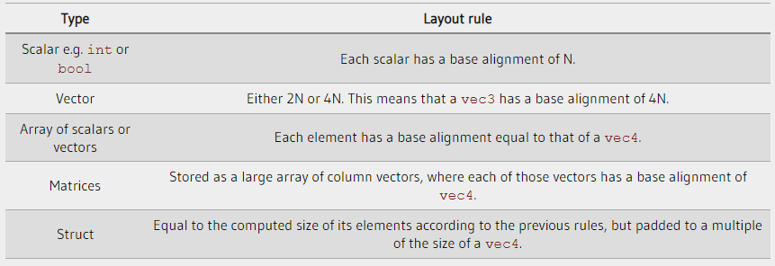

## Normal matrix conversion


## Uniform block layout & std140

Imagine the following uniform block in a shader:

```GLSL
layout (std140) uniform ExampleBlock
{
    float value;
    vec3  vector;
    mat4  matrix;
    float values[3];
    bool  boolean;
    int   integer;
};  
```

What we want to know is the size (in bytes) and the offset (from the start of the block) of each of these variables so we can place them in the buffer in their respective order. The size of each of the elements is clearly stated in OpenGL and directly corresponds to C++ data types; vectors and matrices being (large) arrays of floats. What OpenGL doesn't clearly state is the spacing between the variables. This allows the hardware to position or pad variables as it sees fit. The hardware is able to place a vec3 adjacent to a float for example. Not all hardware can handle this and pads the vec3 to an array of 4 floats before appending the float. A great feature, but inconvenient for us.

By default, GLSL uses a uniform memory layout called a shared layout - shared because once the offsets are defined by the hardware, they are consistently shared between multiple programs. With a shared layout GLSL is allowed to reposition the uniform variables for optimization as long as the variables' order remains intact. Because we don't know at what offset each uniform variable will be we don't know how to precisely fill our uniform buffer. We can query this information with functions like `glGetUniformIndices`, but that's not the approach we're going to take in this chapter.

While a shared layout gives us some space-saving optimizations, we'd need to query the offset for each uniform variable which translates to a lot of work. The general practice however is to not use the shared layout, but to use the `std140` layout. The `std140` layout explicitly states the memory layout for each variable type by standardizing their respective offsets governed by a set of rules. Since this is standardized we can manually figure out the offsets for each variable.

Each variable has a base alignment equal to the space a variable takes (including padding) within a uniform block using the `std140` layout rules. For each variable, we calculate its aligned offset: the byte offset of a variable from the start of the block. The aligned byte offset of a variable must be equal to a multiple of its base alignment. This is a bit of a mouthful, but we'll get to see some examples soon enough to clear things up.

The exact layout rules can be found at OpenGL's uniform buffer specification here, but we'll list the most common rules below. Each variable type in GLSL such as int, float and bool are defined to be four-byte quantities with each entity of 4 bytes represented as N.

Common rule

<div align=center>

</div>

Calculate the aligned offset for each of its members using the std140 layout

```GLSL
layout (std140) uniform ExampleBlock
{
                     // base alignment  // aligned offset
    float value;     // 4               // 0 
    vec3 vector;     // 16              // 16  (offset must be multiple of 16 so 4->16)
    mat4 matrix;     // 16              // 32  (column 0)
                     // 16              // 48  (column 1)
                     // 16              // 64  (column 2)
                     // 16              // 80  (column 3)
    float values[3]; // 16              // 96  (values[0])
                     // 16              // 112 (values[1])
                     // 16              // 128 (values[2])
    bool boolean;    // 4               // 144
    int integer;     // 4               // 148
}; 
```

By adding the statement layout (std140) in the definition of the uniform block we tell OpenGL that this uniform block uses the std140 layout. There are two other layouts to choose from that require us to query each offset before filling the buffers. We've already seen the shared layout, with the other remaining layout being packed. When using the packed layout, there is no guarantee that the layout remains the same between programs (not shared) because it allows the compiler to optimize uniform variables away from the uniform block which may differ per shader.