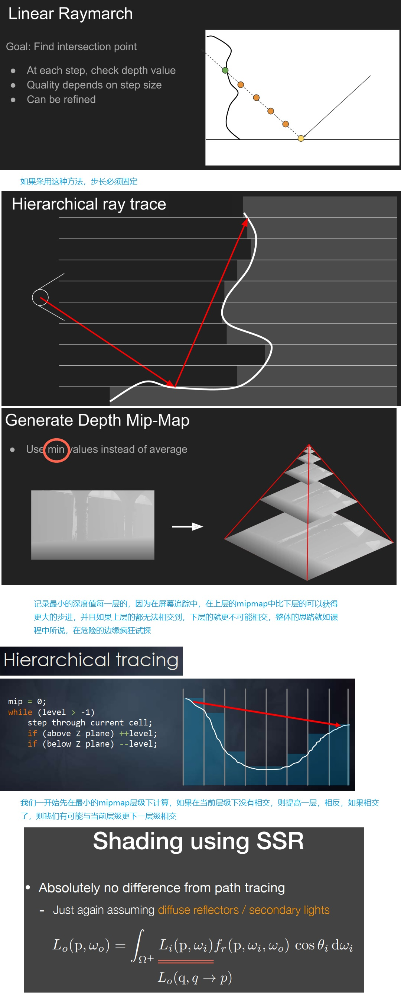

## Principle

### Shading

#### Deferred Shading
* Originally invented to `save shading time`
* Consider the rasterization process
  * Triangles -> fragments -> depth test -> shade -> pixel
  * Each fragment needs to be shaded
  * Complexity: `O(#fragment * #light)`
* Key observation
  * Most fragments will not be seen in the final image
  * Due to depth test / occlusion
  * Can we only shade those visible fragments?
* Modifying the rasterization process
  * `Just rasterize the scene twice`
  * Complexity: `O(#fragment * #light)` -> `O(#vis. frag. * #light)`
* Issue
  * `Difficult to do anti-aliasing`
  * But almost completely solved by TAA

#### Tiled Shading
* Improvement: tiled shading
  * Subdivide the screen into tiles of e.g. 32x32 then shade each
* Key observation
  * Not all lights can illuminate a specific tile
  * Mostly due to the `square falloff with distance (!)`
  * Complexity: `O(#vis. frag. * #light)` -> `O(#vis. frag. * avg #light per tile)`

<div align=center>

</div>

#### Clustered Shading
* Further improvement: clustered shading
  * Further subdivide each tile into different depth segments
  * Essentially subdividing the view frustum into a 3D grid
* Key observation
  * The depth range of each tile can be quite large
  * Therefore, a lot of lights may be identified to have potential to lit the tile
  * But some lights may only lit a small depth range
  * Complexity: `O(#vis. frag. * avg #light per tile)` -> `O(#vis. frag. * avg #light per cluster)`

<div align=center>

</div>

### Level of Detail
* Level of Detail (LoD) is very important
  * Recall: texture `MIPMAP-ing`
  * Choosing the right level of detail to use can save computation
* The use of multiple levels of detail
  * Often called `"cascaded"` by the RTR industry
  * 
<div align=center>

</div>

* 【1】右幅图红蓝区域重叠一部分为了避免因为切换而突然产生的artifact

* Key challenge
  * `Transition` between different levels
  * Usually need some overlapping and blending near boundaries
* Another example: `geometric LoD`
  * Recall: pre-generating a set of simplified obj. with different `#tri`.
  * Based on the distance to the camera, choose the right object to show (or part of obj., s.t. no triangle will be larger than a pixel)
  * Popping artifacts? Leave it to TAA!
  * This is `Nanite` in UE5 (but of course, Nanite has way more)

### SDF & Ray marching
#### SDF（Signed Distance Field）
* 标记距离场 - 用来记录场景中的距离信息

#### SDF Geometry
* 2D

```c
float sdCircle( vec2 p, float r )
{
    return length(p) - r;
}

float sdBox( in vec2 p, in vec2 b )
{
    vec2 d = abs(p)-b;
    return length(max(d,0.0)) + min(max(d.x,d.y),0.0);
}
```

* 3D

```c
float sdSphere( vec3 p, float s )
{
    return length(p)-s;
}

float sdBox( vec3 p, vec3 b )
{
    vec3 q = abs(p) - b;
    return length(max(q,0.0)) + min(max(q.x,max(q.y,q.z)),0.0);
}

float sdRoundBox( vec3 p, vec3 b, float r )
{
    vec3 q = abs(p) - b;
    return length(max(q,0.0)) + min(max(q.x,max(q.y,q.z)),0.0) - r;
}

float sdTorus( vec3 p, vec2 t )
{
    vec2 q = vec2(length(p.xz)-t.x,p.y);
    return length(q)-t.y;
}

float sdCone( in vec3 p, in vec2 c, float h )
{
    // c is the sin/cos of the angle, h is height
    // Alternatively pass q instead of (c,h),
    // which is the point at the base in 2D
    vec2 q = h*vec2(c.x/c.y,-1.0);

    vec2 w = vec2( length(p.xz), p.y );
    vec2 a = w - q*clamp( dot(w,q)/dot(q,q), 0.0, 1.0 );
    vec2 b = w - q*vec2( clamp( w.x/q.x, 0.0, 1.0 ), 1.0 );
    float k = sign( q.y );
    float d = min(dot( a, a ),dot(b, b));
    float s = max( k*(w.x*q.y-w.y*q.x),k*(w.y-q.y)  );
    return sqrt(d)*sign(s);
}

float sdPlane( vec3 p, vec3 n, float h )
{
    // n must be normalized
    return dot(p,n) + h;
}

float sdCappedCylinder( vec3 p, float h, float r )
{
    vec2 d = abs(vec2(length(p.xz),p.y)) - vec2(h,r);
    return min(max(d.x,d.y),0.0) + length(max(d,0.0));
}

float sdRoundedCylinder( vec3 p, float ra, float rb, float h )
{
    vec2 d = vec2( length(p.xz)-2.0*ra+rb, abs(p.y) - h );
    return min(max(d.x,d.y),0.0) + length(max(d,0.0)) - rb;
}
```

#### OpenGL Render SDF Object

* modify `uniform vec2 iResolution; uniform int time;` and pause to `fs.glsl`

```c
#version 460 core
#define AA 3

uniform vec2 iResolution;
uniform int time;

out vec4 FragColor;

float sdPlane( vec3 p ) {
    return p.y;
}

float sdBox( vec3 p, vec3 b ) {
    vec3 d = abs(p) - b;
    return min(max(d.x,max(d.y,d.z)),0.0) + length(max(d,0.0));
}

float sdRoundBox( vec3 p, vec3 b, float r ) {
    vec3 q = abs(p) - b;
    return length(max(q,0.0)) + min(max(q.x,max(q.y,q.z)),0.0) - r;
}

float sdSphere( vec3 p, float s ) {
    return length(p)-s;
}

float sdCappedCylinder( vec3 p, float h, float r ) {
    vec2 d = abs(vec2(length(p.xz),p.y)) - vec2(h,r);
    return min(max(d.x,d.y),0.0) + length(max(d,0.0));
}

float opSubtraction( float d1, float d2 ) {
    return max(-d1, d2);
}

float map( in vec3 pos ) {
    float roundBox = sdRoundBox(pos.xyz-vec3(sin(time*0.05), 0.25, 0.0), vec3(0.4, 0.2, 0.04), 0.05);
    float sphere1 = sdSphere(pos.xyz-vec3(sin(time*0.05), 0.25, 0.0), 0.0);
    float sphere2 = sdSphere(pos.xyz-vec3(cos(time*0.10), clamp(sin(time*0.10), 0.24, 0.7), 0.5), 0.2);

    return min(
        min(sdPlane(pos.xyz-vec3( 0.0, 0.0, 0.0)), sphere2),
        opSubtraction(sphere1, roundBox)
    );
}

float castRay(in vec3 ro, in vec3 rd) {
    float tmin = 0.1;
    float tmax = 1000.0;

    float t = tmin;
    for( int i=0; i<64; i++ )
    {
        float precis = 0.0005*t;
        float res = map(ro + rd*t);

        if (res < precis || t>tmax) break;

        t += res; // ray marching;
    }

    if (t > tmax) t=-1.0;

    return t;
}

vec3 calcNormal( in vec3 pos ) {
    vec2 e = vec2(1.0,-1.0)*0.5773*0.0005;
    return normalize( e.xyy*map( pos + e.xyy ) +
    e.yyx*map( pos + e.yyx ) +
    e.yxy*map( pos + e.yxy ) +
    e.xxx*map( pos + e.xxx ) );
}

float calcSoftShadow(in vec3 ro, in vec3 rd, in float tmin, in float tmax) {
    float t = tmin;
    float res = 1.0;
    float k = 16.0;
    float ph = 1e10;

    for (int i=0; i<32; i++) {
        float h = map(ro + rd*t);
        if (h < 0.0001) {
            return 0.0;
        }

        int shadowType = 2;

        if (shadowType == 1) {
            // traditional method
            res = min( res, k*h/t );
        }
        if (shadowType == 2) {
            float y = h*h/(2.0*ph);
            float d = sqrt(h*h-y*y);
            res = min(res, k*d/max(0.0, t-y));
            ph = h;
        }
        if (shadowType == 3) {
            float s = clamp(8.0*h/t,0.0,1.0);
            res = min( res, s*s*(3.0-2.0*s) );
        }

        t += clamp( h, 0.02, 0.2 );
    }

    return clamp(res, 0.0, 1.0);
}

vec3 render(in vec3 ro, in vec3 rd) {
    vec3 col = vec3(0.0);
    float t = castRay(ro, rd);

    vec3 pos = ro + rd*t;
    vec3 nor = calcNormal(pos);

    // material
    vec3 ambColor = vec3(0.12, 0.12, 0.1);
    vec3 matDiffColor = vec3(0.45);
    vec3 matSpecColor = vec3(1.0, 0.65, 0.5);

    // light
    vec3 lightPos = vec3(-0.0, 1.0, 1.4);
    vec3 lightDir = normalize(lightPos-(ro+t*rd));
    vec3 halfWay = normalize(lightDir - rd);

    float diff = clamp(dot(lightDir, nor), 0.0, 1.0);
    vec3 diffuse = diff * matDiffColor * calcSoftShadow(pos, lightDir, 0.05, 10.0);

    float specularWeight = 0.35;
    float spe = pow(clamp(dot(nor, halfWay), 0.0, 1.0), 16.0);
    vec3 specular = spe * matSpecColor * specularWeight;

    float ambWeight = 0.2;
    vec3 ambient = ambWeight * ambColor;

    col = ambient + diffuse + specular;

    // fog
    col *= exp(-0.0005*t*t*t);

    return col;
}

mat3 setCamera(in vec3 ro, in vec3 ta) {
    vec3 cw = normalize(ta - ro); // front
    vec3 cu = normalize(cross(cw, vec3(0.0, 1.0, 0.0))); // right
    vec3 cv = normalize(cross(cu, cw)); // up

    return mat3(cu, cv, cw);
}

void main() {
    // camera
    vec3 ro = vec3(1.0, 1.5, -2.5); // camera original position
    vec3 ta = vec3(0.0, -0.4, 0.0); // camera aim at poisition

    // camera-to-world transformation
    mat3 ca = setCamera(ro, ta);

    // total color
    vec3 totalColor = vec3(0.0);

    for (int m=0; m<AA; m++) {
        for (int n=0; n<AA; n++) {
            vec2 offset = vec2(float(m),float(n)) / float(AA) - 0.5;
            vec2 p = (2.0 * (gl_FragCoord.xy + offset) - iResolution.xy) / iResolution.y;

            // ray direction
            vec3 rd = ca * normalize(vec3(p.xy, 2.0));

            // render
            vec3 col = render(ro, rd);

            // gamma correct
            col = pow(col, vec3(0.4545));
            totalColor += col;
        }
    }

    totalColor /= float(AA*AA);

    // Output to screen
    FragColor = vec4(totalColor, 1.0);
}
```

#### Ray marching


### Solid Angles （立体角）
* *https://zh.wikipedia.org/wiki/%E7%AB%8B%E9%AB%94%E8%A7%92*
* *https://www.qiujiawei.com/solid-angle/*

立体角，常用字母`Ω`表示，是一个物体对特定点的三维空间的角度，是平面角在三维空间中的类比。它描述的是站在某一点的观察者测量到的物体大小的尺度。

<div align=center>

</div>

### Radiometry
* *GAMES101_Lecture_14.pdf*

Measurement system and units for illumination

#### Radiant Energy
* *https://zh.wikipedia.org/zh-cn/%E8%83%BD%E9%87%8F*
* *https://baike.baidu.com/item/%E8%83%BD%E9%87%8F/13016314*

一个系统也可以通过碰撞传递能量，在这种情况下被碰撞的物体会在一段距离内受力并获得运动的能量，称为动能。 热能的传递则可以由以上两个方法产生：热可以由辐射能转移能量，或者直接由系统间粒子的碰撞而转移动能。

能量（古希腊语中 ἐνέργεια energeia 意指“活动、操作”[1]）在物理学中是一个间接观察到的物理量。它往往被视为某一个物理系统对其他的物理系统做功的能力。

1. 光源辐射出来的东西就属于能量,单位 $J$ 焦耳

<div align=center>

</div>

#### Radiant Flux/Power (辐射通量 或 辐射功率)

1. `每单位时间的辐射能量，亦作"辐射功率"。`单位 $W$ 瓦特, $lm$ $lumens$
2. 在辐射度量学中，辐射通量或辐射功率是对单位时间内通过某一面积的所有电磁辐射（包括红外、紫外和可见光）总功率的度量，既可以指一辐射源发出辐射的功率，也可以指到达某一特定表面的辐射能量的功率。

<div align=center>

</div>

* Flux Irradiance
<div align=center>

</div>

#### Radiant Intensity

1. 光源往四面八方都有可能辐射能量，方向性的与能量相关的概念，就叫`Radiant Intensity`, 有时也叫`Intensity`,只是一个定义上的概念
2.` 每单位立体角的辐射通量。`
3. 例如一个灯泡输出815 lumens，则`Intensity = 815 lumens / 4pi sr = 65 candelas` 单位 $candelas$, 也就是在某个方向上它的Intensity

<div align=center>

</div>

#### Irradiance

1. 一个物体表面接收到光的能量
2. `入射表面的辐射通量。`
3. 可以理解为一个ShadingPoint接受来自的四面八方的能量

<div align=center>

</div>

#### Radiance

1. `每单位立体角每单位投射表面的辐射通量。`
2. 一个微小能量比上一个微小单位立体角与微小单位面积与`cosθ`,

<div align=center>

</div>

* **Irradiance: power per projected unit area**
* **Intensity: power per solid angle**
* **Radiance: Irradiance per solid angle**
* **Radiance: Intensity per projected unit area**

#### Incident Radiance & Exiting Radiance
<div align=center>

</div>

#### Irradiance vs. Radiance
Irradiance：Total power received by area dA.

Radiance：power received by area dA from “direction“ dw.

### Lambert's Cosine Law
<div align=center>

</div>

### Base reflectivity
* *https://marmoset.co/posts/physically-based-rendering-and-you-can-too/*

1. 对于导体或者金属表面而言基础反射率一般是带有色彩的，这也是为什么$F_0$要用`RGB`三原色来表示的原因（法向入射的反射率可随波长不同而不同）。这种现象我们只能在金属表面观察的到。
2. 金属表面这些和电介质表面相比所独有的特性引出了所谓的金属工作流的概念

<div align=center>

</div>

### Normal Matrix
* *http://www.lighthouse3d.com/tutorials/glsl-12-tutorial/the-normal-matrix/*

1. 使用了一些线性代数的操作来移除对法向量错误缩放的影响

<div align=center>

</div>

<div align=center>

</div>

### L/HDR (.hdr) [low/high dynamic range]
This allows us to specify color values outside the 0.0 to 1.0 range to give lights their correct color intensities. The file format also uses a clever trick to store each floating point value, not as a 32 bit value per channel, but 8 bits per channel using the color's alpha channel as an exponent (this does come with a loss of precision).

### Equirectangular Map (等距柱状投影图)
* *https://en.wikipedia.org/wiki/Equirectangular_projection*
* *https://stackoverflow.com/questions/48494389/how-does-this-code-sample-from-a-spherical-map/48534536*

就像我们常见的地图.

The equirectangular projection (also called the equidistant cylindrical projection or la carte parallélogrammatique projection, and which includes the special case of the plate carrée projection (also called the geographic projection, lat/lon projection, or plane chart)

```c++
const vec2 invAtan = vec2(0.1591, 0.3183);
vec2 SampleSphericalMap(vec3 direction)
{
    vec2 uv = vec2(atan(direction.z, direction.x), asin(direction.y));
    uv *= invAtan;
    uv += 0.5;
    return uv;
}
```

* The invAtan constant is the reciprocal(or multiplicative inverse) of `2PI` and `PI`:
  * 0.1591 = 1/6.28319(=>2PI) = 360 degrees in radians
  * 0.3183 = 1/3.14159(=>PI) = 180 degrees in radians
  
* from `cartesian coordinates` to `polar angles` to `uvs`


### Hemisphere (半球领域)
半球领域(Hemisphere)可以描述为以平面法线`n`为轴所环绕的半个球体

### Temporal Super Resolution
* Super resolution (or super sampling)
  * Literal understanding: increasing resolution
  * Source 1 (DLSS 1.0): out of nowhere / completely guessed
  * Source 2 (DLSS 2.0): from temporal information
* Key idea of Deep Learning Super Sampling (DLSS) 2.0
  * **Yet another TAA-like application**
  * Temporally reuse samples to increase resolution

#### DLSS 2.0
* Main problem
  * Upon temporal failure, `clamping is no longer an option`
  * Because we need a clear value for `each smaller pixel`
  * Therefore, key is `how to use temporal info` smarter than clamping

<div align=center>

</div>

* 神经网络没有输出任何混合之后的颜色，而是告诉你关于上一帧所找到的关于temporal的信息应该怎么用

### Cubemap convolution
半球的朝向决定了我们捕捉辐照度的位置,预先计算每个可能的半球朝向的辐照度,也就是所有可能的出射方向$W_o$,给定任何方向$W_i$，都可以计算出这个方向的总辐照度

```c++
// 球坐标转笛卡尔坐标
vec3 tangentSample = vec3(sin(theta) * cos(phi),  sin(theta) * sin(phi), cos(theta));
// 将切线空间转成世界空间
vec3 sampleVec = mat3(right, up, N) * tangentSample;
irradiance += textureCube(environmentMap, sampleVec).rgb * cos(theta) * sin(theta);
```

<div align=center>

</div>

### Monte Carlo Integration
* *https://www.inf.ufrgs.br/~oliveira/pubs_files/Slomp_Oliveira_Patricio-Tutorial-PRT.pdf*

<div align=center>

</div>

1. 蒙特卡洛积分主要是统计和概率理论的组合。蒙特卡洛可以帮助我们离散地解决人口统计问题，而不必考虑所有人。
2. 蒙特卡罗积分建立在大数定律的基础上，并采用相同的方法来求解积分。不为所有可能的（理论上是无限的）样本值 $x$ 求解积分，而是简单地从总体中随机挑选样本 $N$ 生成采样值并求平均。随着 $N$ 的增加，结果会越来越接近积分的精确结果：
3. 概率密度函数 (probability density function)，它的含义是特定样本在整个样本集上发生的概率。

<div align=center>

</div>

#### 有偏与无偏
1. 当涉及蒙特卡洛积分时，某些样本可能比其他样本具有更高的生成概率。这就是为什么对于任何一般的蒙特卡洛估计，我们都会根据 $pdf$ 将采样值除以或乘以采样概率。每次需要估算积分的时候，生成的样本都是均匀分布的，概率完全相等。这种估计就是`无偏的`，这意味着随着样本数量的不断增加，我们最终将收敛到积分的精确解。
2. 但是，某些蒙特卡洛估算是有偏的，这意味着生成的样本并不是完全随机的，而是集中于`特定的值或方向`。这些有偏的蒙特卡洛估算具有更快的收敛速度，它们会以更快的速度收敛到精确解，但是由于其`有偏性`，可能永远不会收敛到精确解

#### 大数定律
1. 例如，假设您想要计算一个国家所有公民的平均身高。为了得到结果，你可以测量每个公民并对他们的身高求平均，这样会得到你需要的确切答案。但是，由于大多数国家人海茫茫，这个方法不现实：需要花费太多精力和时间。
2. 另一种方法是选择一个小得多的完全随机（无偏）的人口子集，测量他们的身高并对结果求平均。可能只测量 100 人，虽然答案并非绝对精确，但会得到一个相对接近真相的答案，这个理论被称作`大数定律`, 想法是，如果从总人口中测量一组较小的真正随机样本的$N$，结果将相对接近真实答案，并随着样本数 $N$ 的增加而愈加接近

### Fresnel Schlick Roughness

1. 由于环境光来自半球内围绕法线 $N$ 的所有方向，因此没有一个确定的`半向量`来计算菲涅耳效应。为了模拟菲涅耳效应，我们用`法线`和`视线`之间的`夹角`计算菲涅耳系数。然而，之前我们是以受粗糙度影响的微表面半向量作为菲涅耳公式的输入，但我们目前没有考虑任何粗糙度，表面的反射率总是会相对较高。间接光和直射光遵循相同的属性，因此我们期望较粗糙的表面在边缘反射较弱。
2. 通过在 [Sébastien Lagarde](https://seblagarde.wordpress.com/2011/08/17/hello-world/) 提出的 Fresnel-Schlick 方程中加入粗糙度项来缓解这个问题

```c++
vec3 fresnelSchlickRoughness(float cosTheta, vec3 F0, float roughness)
{
    return F0 + (max(vec3(1.0 - roughness), F0) - F0) * pow(1.0 - cosTheta, 5.0);
}
```

### Low-discrepancy sequence （低差异序列）
* *https://zhuanlan.zhihu.com/p/20197323*
* *http://holger.dammertz.org/stuff/notes_HammersleyOnHemisphere.html*

1. 使用`低差异序列`使`拟蒙特卡洛积分``快速收敛`
2. 代价是蒙特卡洛估算会产生偏差
3. 当使用低差异序列生成蒙特卡洛样本向量时，**该过程称为拟蒙特卡洛积分**

* PBR IBL Specular
  * 使用`重要性采样`来预计算间接反射方程的镜面反射部分，该采样基于`拟蒙特卡洛方法`给出了随机的低差异序列。将使用的序列被称为 `Hammersley 序列`，Hammersley 序列是基于 `Van Der Corput 序列`，该序列是把十进制数字的二进制表示镜像翻转到小数点右边而得

#### Hammersley
* *http://holger.dammertz.org/stuff/notes_HammersleyOnHemisphere.html*

Hammersley 序列是基于 Van Der Corput 序列，该序列是把十进制数字的二进制表示镜像翻转到小数点右边而得。

<div align=center>

</div>

### Importance sampling (GGX)
* *https://patapom.com/blog/Math/ImportanceSampling/*
* *https://schuttejoe.github.io/post/ggximportancesamplingpart1/*

1. 重要性采样的核心：只在某些区域生成采样向量
<div align=center>

</div>

### Split sum approximation（分割求和近似法）
1. 分割求和近似将方程的镜面部分分割成两个独立的部分，我们可以单独求卷积，然后在 PBR 着色器中求和，以用于间接镜面反射部分

<div align=center>

</div>

#### Pre-filtering environment map
1. 卷积的第一部分被称为`预滤波环境贴图`,考虑了粗糙度。因为随着粗糙度的增加，参与环境贴图卷积的采样向量会更分散，导致反射更模糊
2. 由于在预计算环境贴图的时候并不知道视觉方向，所以EpicGames假设视角方向等于镜面反射方向等于输出采样的方向`View=Reflect=N`
3. 在计算预滤波环境贴图的时候用蒙特卡洛积分积分方式离散地高效来计算，用重要性采样来模拟采样数据的有偏分布

```c++
for (uint i = 0; i < SAMPLE_COUNT; i++) {
    vec2 Xi = Hammersley(i, SAMPLE_COUNT);
    vec3 H = ImportanceSampleGGX(Xi, N, roughness);
    vec3 L  = normalize(2.0 * dot(V, H) * H - V);

    float NdotL = max(dot(N, L), 0.0);
    if(NdotL > 0.0)
    {   
        // 1
        // 会导致预过滤卷积的亮点
        prefilteredColor += texture(environmentMap, L).rgb * NdotL;
        totalWeight      += NdotL;
        
        // 2
        // 在预过滤卷积时，不直接采样环境贴图，而是基于积分的 PDF 和粗糙度采样环境贴图的 mipmap ，以减少伪像
        float D = DistributionGGX(N, H, roughness);
        float NdotH = max(dot(N, H), 0.0);
        float HdotV = max(dot(H, V), 0.0);
        float pdf = D * NdotH / (4.0 * HdotV) + 0.0001;

        float resolution = 512.0; // resolution of source cubemap (per face)
        float saTexel  = 4.0 * PI / (6.0 * resolution * resolution);
        float saSample = 1.0 / (float(SAMPLE_COUNT) * pdf + 0.0001);

        float mipLevel = roughness == 0.0 ? 0.0 : 0.5 * log2(saSample / saTexel);

        prefilteredColor += textureLod(environmentMap, L, mipLevel).rgb * NdotL;
        totalWeight      += NdotL;
    }
}
```

#### BRDF integration
1. 假设每个方向的入射辐度都是白色`L(p,x)=1.0`，就可以在给定`粗糙度`、光线$w_i$和法线$n$的夹角$n \cdot w_i$（范围在 0.0 和 1.0 之间）的情况下，预计算BRDF的效果，这个就是BRDF积分贴图，`LUT(Lookuptexture)`
2. 纹理存储是菲涅耳响应的系数（R 通道）和偏差值（G 通道）

#### Importance sampling
1. 反射波瓣就是反射光线的分布范围
2. 所有可能出射的反射光构成的形状称为镜面波瓣。随着粗糙度的增加，镜面波瓣的大小增加
3. 考虑到大多数光线最终会反射到一个的镜面波瓣内，采样时以类似的方式选取采样向量是有意义的，因为大部分其余的向量都被浪费掉了，这个过程称为`重要性采样`

<div align=center>

</div>

### Riemann sum (黎曼和)
在半球领域`Ω`中按一定的步长将反射率方程分散求解，然后再按照步长大小将所得到的结果平均化。这种方法被称为黎曼和(Riemann sum) 

* `dev-asset\graphics_engine\Math\RiemannSum.py`

```python
import os

_step = 100
_range = 3
_tiny = _range/_step
_sum = 0

for i in range(_step):
	_sum += _tiny*i * _tiny

print(_sum)
```

我们可以通过增加离散部分的数量来提高黎曼和的准确度(Accuracy),也就是代码中的`_step`

### Sampling
* [1] https://www.researchgate.net/figure/The-evolution-of-sampling-theorem-a-The-time-domain-of-the-band-limited-signal-and-b_fig5_301556095


* Sampling Artifacts (Errors / Mistakes / Inaccuracies) in Computer Graphics
  * Jaggies (Staircase Pattern)
  * Moiré Patterns in Imaging
  * Wagon Wheel Illusion (False Motion)
* Behind the Aliasing Artifacts
  * Signals are changing too fast (high frequency), but sampled too slowly

* Antialiasing Idea:
  * Blurring (Pre-Filtering) Before Sampling

* Undersampling Creates Frequency Aliases
  * High-frequency signal is insufficiently sampled: samples erroneously appear to be from a low-frequency signal Two frequencies that are indistinguishable at a given sampling rate are called “aliases”

* Sampling = Repeating Frequency Contents

* 【1】 c乘以a函数（冲激函数）得到一些离散的点（采样结果 e），b卷积d得到的结果是f，观察得知就是将频谱复制粘贴了很多份，所以采样就是重复原始信号的频谱

* 时域上的乘积等于频域上的卷积
* Aliasing = Mixed Frequency Contents

* Higher Frequencies Need Faster Sampling
<div align=center></div>

* Fourier Transform
<div align=center></div>

* Sampling = Repeating Frequency Contents
<div align=center></div>

* Aliasing and Antialiasing
<div align=center>

</div>

### Albedo (反照率)
反照率(Albedo)纹理为每一个金属的纹素(Texel)（纹理像素）指定表面颜色或者基础反射率。这和我们之前使用过的漫反射纹理相当类似，不同的是所有光照信息都是由一个纹理中提取的。漫反射纹理的图像当中常常包含一些细小的阴影或者深色的裂纹，而反照率纹理中是不会有这些东西的。它应该只包含表面的颜色（或者折射吸收系数）。

### BRDF
BRDF可以近似的求出每束光线对一个给定了材质属性的平面上最终反射出来的光线所作出的贡献程度

<div align=center>

</div>

#### Cook-Torrance BRDF (DFG)

* `Cook-Torrance BRDF`的镜面反射部分包含三个函数，此外分母部分还有一个标准化因子 。字母`D`，`F`与`G`分别代表着一种类型的函数，各个函数分别用来近似的计算出表面反射特性的一个特定部分。三个函数分别为`正态分布函数(Normal Distribution Function)`，`菲涅尔方程(Fresnel Rquation)`和`几何函数(Geometry Function)`
  * 正态分布函数：估算在受到表面粗糙度的影响下，取向方向与中间向量一致的微平面的数量。这是用来估算微平面的主要函数。
  * 几何函数：描述了微平面自成阴影的属性。当一个平面相对比较粗糙的时候，平面表面上的微平面有可能挡住其他的微平面从而减少表面所反射的光线。
  * 菲涅尔方程：菲涅尔方程描述的是在不同的表面角下表面所反射的光线所占的比率。任何物体或者材质表面都有一个`基础反射率(Base Reflectivity)`，但是如果以一定的角度往平面上看的时候所有反光都会变得明显起来,但是如果你从近乎90度的角度观察的话反光就会变得明显的多。如果从理想的90度视角观察，所有的平面理论上来说都能完全的反射光线

* 采用其中`D`使用`Trowbridge-Reitz GGX`，`F`使用`Fresnel-Schlick`近似(Fresnel-Schlick Approximation)，而`G`使用`Smith’s Schlick-GGX`

<div align=center>

</div>

* GLSL - Trowbridge-Reitz GGX

```glsl
float D_GGX_TR(vec3 N, vec3 H, float a)
{
    float a2     = a*a;
    float NdotH  = max(dot(N, H), 0.0);
    float NdotH2 = NdotH*NdotH;

    float nom    = a2;
    float denom  = (NdotH2 * (a2 - 1.0) + 1.0);
    denom        = PI * denom * denom;

    return nom / denom;
}
```

* GLSL - GeometrySmith

```glsl
float GeometrySchlickGGX(float NdotV, float k)
{
    float nom   = NdotV;
    float denom = NdotV * (1.0 - k) + k;

    return nom / denom;
}

float GeometrySmith(vec3 N, vec3 V, vec3 L, float k)
{
    float NdotV = max(dot(N, V), 0.0);
    float NdotL = max(dot(N, L), 0.0);
    float ggx1 = GeometrySchlickGGX(NdotV, k);
    float ggx2 = GeometrySchlickGGX(NdotL, k);

    return ggx1 * ggx2;
}
```

* GLSL - Fresnel-Schlick

```glsl
vec3 F0 = vec3(0.04);
F0      = mix(F0, surfaceColor.rgb, metalness);

vec3 fresnelSchlick(float cosTheta, vec3 F0)
{
    return F0 + (1.0 - F0) * pow(1.0 - cosTheta, 5.0);
}
```

#### Fresnel And Metallic workflow
* *https://zhuanlan.zhihu.com/p/33464301*

1. $F = lerp((1-(n \cdot v))^5, 1, F_0)$
2. 法线和视线夹角越大,nv点乘的结果越小,`F`的值也就越大，反射光的亮度也越高，这就是所有物体都具有的菲涅尔效应。即使不是金属物体，在这种情况下都会产生和金属物体类似的表现。而当物体本身就是金属的时候(F0接近1)，不管视线是什么情况，F的值都会接近于1，那么菲涅尔效应也就看不出来了。
3. Fresnel-Schlick菲尼尔近似仅仅对电介质或者说非金属表面有定义。对于导体(Conductor)表面（金属），使用它们的折射指数计算基础折射率并不能得出正确的结果
4. 金属表面这些和电介质表面相比所独有的特性所引出的概念，金属度用来描述一个材质表面是金属还是非金属的

5. 对于金属物体而言，菲涅尔其实并不完全适用。他的F0参数对不同颜色值的反射率是不同的，而且还需要和表面颜色相乘，否则我们的大脑就会通知我们它“不像金属”，所以最终的做法是做这样一次处理
6. F0 = mix(vec3(0.04), 表面颜色, 金属度);
7. 这样代入公式的结果就比较符合金属的物理特征，而非金属由于F0值偏低，即使乘了表面颜色影响也不大。

### Diffuse reflection (漫反射)
* *https://zh.wikipedia.org/zh-cn/%E6%BC%AB%E5%8F%8D%E5%B0%84*

1. 漫反射（简称漫射，英语：diffuse reflection）是指当一束平行的入射光线射到粗糙的表面时，粗糙的表面会把光线向着各个方向反射的现象。虽然入射线互相平行，由于粗糙的表面上的各点的法线方向不一致，造成反射光线向不同的方向无规则地反射。这种反射的光称为漫射光。很多物体，如植物、墙壁、衣服等，其表面粗看起来似乎是平滑，但用放大镜仔细观察，就会看到其表面是凹凸不平的，所以本来是平行的太阳光被这些表面反射后，弥漫地射向不同方向。

2. 漫反射是指光进入物体内部，经由物体内部的粒子反射之后，呈现随机方向离开物体的现象

### Microfacet (微平面模型)
Any surface at a microscopic scale can be described by tiny little perfectly reflective mirrors called microfacets.

1. PBR技术都是基于微平面理论，微观尺度的平面都可以称为微平面
2. 对于光滑平面，反射光线都会趋向一致
3. 对于粗糙平面，反射光线会发散到不同方向
4. 用一个粗糙度参数来表示平面的粗糙程度
   * `Roughness:` 表示与位于入射光线向量`l`和视线向量`v`之间的半程向量`h`的一致概率

### Energy conservation
energy conservation: outgoing light energy should never exceed the incoming light energy (excluding emissive surfaces).

1. 入射光线=反射光线+折射光线
2. 折射光线=物体产生的热量+折射光线在物体内传播后再次离开表面的部份

### Subsurface scattering
我们说，物体内部是粒子构成，而一束光照在物体表面时，会被分离成折射部分和反射部分，反射是会直接弹开而不进入物体内部的光线，其余部分会进入表面，当光进入物体内部时，会在每个粒子上碰撞，而每个粒子又会吸收一部分光照，转化为能量或者热量，但也不是所有的能量都会被吸收，而有一些会与其他粒子碰撞直至能量耗尽或者离开这个表面，而光线脱离物体表面后将会共同构成该表面的（漫反射）颜色，这部分就称为次表面散射

### Metallic
金属表面对光的反应与非金属材料（也被称为介电质(Dielectrics)材料）表面相比是不同的;所有的折射光都会被直接吸收而不会散开，只留下反射光或者说镜面反射光。亦即是说，金属表面不会显示出漫反射颜色

### Gamma correction
<div align=center>

</div>

* dark-red color (0.5,0.0,0.0)
* monitor apply gamma correction power of 2.2 --> (0.218,0.0,0.0) 
* inverse scaling by a power of 1/2.2. --> (0.5,0.0,0.0)^1/2.2=(0.5,0.0,0.0)^0.45=(0.73,0.0,0.0) 
* corrected color monitor and result --> (0.73,0.0,0.0)^2.2=(0.5,0.0,0.0)

### Normal Mapping
<div align=center>

</div>

### Gram-Schmidt process - re-orthogonalize the TBN
```c++
vec3 T = normalize(vec3(model * vec4(aTangent, 0.0)));
vec3 N = normalize(vec3(model * vec4(aNormal, 0.0)));
// re-orthogonalize T with respect to N
T = normalize(T - dot(T, N) * N);
// then retrieve perpendicular vector B with the cross product of T and N
vec3 B = cross(N, T);

mat3 TBN = mat3(T, B, N)  
```

### Z-fighting
* *https://en.wikipedia.org/wiki/Z-fighting*

Z-fighting, also called stitching or planefighting, is a phenomenon in 3D rendering that occurs when two or more primitives have very similar distances to the camera. This would cause them to have near-similar or identical values in the z-buffer, which keeps track of depth. 

<div align=center>

</div>

### Coordinate Systems
* *http://www.songho.ca/opengl/gl_projectionmatrix.html*
* *http://www.songho.ca/opengl/gl_transform.html*
* *https://stackoverflow.com/questions/13331681/opengl-viewport-transformation*
* *https://gdbooks.gitbooks.io/legacyopengl/content/Chapter4/CoordinateTransforms.html*
* *https://www.khronos.org/opengl/wiki/Vertex_Transformation*
* *https://learnopengl-cn.github.io/04%20Advanced%20OpenGL/01%20Depth%20testing/*
* *https://www.scratchapixel.com/lessons/3d-basic-rendering/perspective-and-orthographic-projection-matrix/opengl-perspective-projection-matrix*
* [[1]](https://cdn.jsdelivr.net/gh/aaronmack/image-hosting@master/graphics/深度缓冲中的深度值计算及可视化.yimqzxh3e7k.webp) 深度缓冲中的深度值计算及可视化  https://blog.csdn.net/longfeiah/article/details/105414051

<div align=center>

</div>

<div align=center>

</div>

* NDC - Model Space Convert

<div align=center>

</div>

* 根据透视矩阵，计算NDC空间的z值

<div align=center>

</div>

* 深度缓冲可视化

```c++
float LinearizeDepth(float depth){
    float z = depth*2.0-1.0;
    return (2.0*near*far) / (far+near-z*(far-near));
}

float depth = LinearizeDepth(gl_FragCoord.z);
FragColor = vec4(vec3(depth), 1.0);
```

* Screen Space z -> View Space

  $$
  Z_{NDC} = 2z_{screen} - 1
  $$

* 代入

  $$
  Z_{view} = \frac{2nf}{(f+n) - (2 z_{screen} - 1)(f-n)}
  $$

#### Screen Space (viewport matrix)

1. The viewport transformation is the final stage of the transformation pipeline. It's a scale and translation that maps the -1 to +1 NDC cube into X / Y window coordinates. Technically this stage also modifies the Z value to be within an acceptable range of the Z-Buffer

2. After clipping and perspective divide, all remaining (visible) vertex coordinates x,y,z are between -1 and +1 -- these are called normalized device coordinates. These are mapped to device coordinates by the appropriate scale and shift -- i.e, the viewport transformation.

3. For example, if the viewport has size 1024x768 with a 16-bit depth buffer and the origin is (0,0), then the points will be scaled by (512,384,2^14) and shifted by (512,384,2^14) yielding the appropriate pixel and depth values for the device.

<div align=center>

</div>

* `z`  `[0-2]`需要被转换到`0-1`范围内，所以是1/2
* `x,y`  `[0-2]`需要被转换到`0-w`和`0-h`范围内，所以是w/2, h/2

```c++
viewPortMatrix = glm.mat4()
viewPortMatrix = glm.translate(viewPortMatrix, glm.vec3(0.5, 0.5, 0.5))
viewPortMatrix = glm.scale(viewPortMatrix, glm.vec3(0.5, 0.5, 0.5))

screenScale = glm.mat4()
screenScale = glm.scale(screenScale, glm.vec3(1280.0, 960.0, 1.0))

viewPortMatrix = screenScale * viewPortMatrix
// 假设显示器分辨率 1280*960, 那么viewport矩阵为
// [ 640   0   0   640 ]
// [ 0   480   0   480 ]
// [ 0    0   0.5  0.5 ]
// [ 0    0    0    1  ]

res = viewPortMatrix * glm.vec4(0.5, -1.0, 0.0, 1.0)
// res : vec4(960, 0, 0.5, 1 )
// 意味着（0.5， -1.0）的标准化坐标映射到这台显示器的（960， 0）这个像素

res = viewPortMatrix * glm.vec4(0.25, -0.25, 0.0, 1.0)
// res : vec4(800, 360, 0.5, 1 )
```

#### Clip Space (projection matrix) - Orthographic/Perspective Projection

* Orthographic Projection[[1]](https://www.scratchapixel.com/lessons/3d-basic-rendering/perspective-and-orthographic-projection-matrix/orthographic-projection-matrix)[[Image]](https://cdn.jsdelivr.net/gh/aaronmack/image-hosting@master/graphics/Scratchapixel-OrthographicProjection.4l0xuprxotu0.webp)
  * This is a bounding box surrounding all the objects contained in your scene
  * both bounding boxes (the **scene bounding box** and the **canonical view volume**) are AABBs (axis-aligned bounding boxes) 
* Perspective Projection

The eye coordinates are now multiplied with `GL_PROJECTION` matrix, and become the clip coordinates. This `GL_PROJECTION` matrix defines the viewing volume (`frustum`); how the vertex data are projected onto the screen (perspective or orthogonal). The reason it is called clip coordinates is that the transformed vertex `(x, y, z)` is clipped by comparing with `±w`.

1. Divide by `z`
   1. Remap to `[0, 1]`
   2. convert homogeneous to cartesian coordinates

<div align=center>

</div>

<div align=center>

</div>

<div align=center>

</div>

#### NDC Space (divide by w term)

1. It is yielded by dividing the clip coordinates by `w`. It is called perspective division. It is more like window (screen) coordinates, but has not been translated and scaled to screen pixels yet. The range of values is now normalized from `-1` to `1` in all 3 axes.

#### View Space (view matrix)

<div align=center>

</div>

#### World Space (model matrix) - Rotation Matrix
<div align=center>

</div>

### Homogeneous Coordinates
<div align=center>

</div>

### Rodrigues' Rotation Formula

* *https://en.wikipedia.org/wiki/Rodrigues%27_rotation_formula*

[See](#quaternion)

<div align=center>

</div>

### Cross Dot
<div align=center>

</div>

### Fourier Transform

* Represent a function as a weighted sum of sines and cosines
* The Fourier series is a set of basis functions.
* The polynomial series can also be a set of basis functions


#### Basis Functions
* A set of functions that can be used to represent other functions in general.

  $$
  f(x) = \sum_i c_i \cdot B_i(x)
  $$

> $B_i$: A serial of functions， we call Basis functions.
> $C_i$: 系数

#### Two dimensional Fourier Transform
* [1] 二维傅里叶变换是怎么进行的？ https://www.zhihu.com/question/22611929

### Spherical Harmonics
* [1] 球谐光照——球谐函数 https://zhuanlan.zhihu.com/p/153352797

* A set of 2D basis functions, $B_i(\omega)$ defined on the sphere.
* Analogous to Fourier series in 1D.
* Each SH basis function $B_i(\omega)$ is associated with a (Legendre) polynomial
* projection: obtaining coefficients of each SH basis function.
* reconstruction: restoring the original function using (truncated) coefficients and basis functions.

* 就像一维的傅里叶变换，将一个函数拆分成不同频率的函数，球谐函数是类似的
* 频率从低到高（l=0 --> l=1 --> l=n ...)，可以使用前m阶还原出
* product integral 本质上就是一个点乘
* 只要材质是diffuse的，都可以用大概前3阶来描述光照

* Brief Summarization
  * representing any function (with enough #basis)
  * keeping a certain frequency contents (with a low #basis)
  * reducing integrals to dot products

* 球谐函数是拉普拉斯方程的分离r变量后，**角度部分通解的正交项**;球谐函数有两条重要的性质，**正交完备性和旋转不变性**。球谐函数构成的函数组，作为正交基，对信号进行**投影和重建**[1]

### Quaternion
* *https://krasjet.github.io/quaternion/quaternion.pdf*
* *https://www.3dgep.com/understanding-quaternions/*
* *https://www.qiujiawei.com/understanding-quaternions/*

#### Summary

* 复数 $z=a+bi$, $i^2=1$
* 复数乘法$z_1z_2=(a+bi)(c+di)$ 
* 复数与矩阵之间的联系
* 复数的模长 $||z||=\sqrt{a^2+b^2}$
* 复数的共轭 $\overline{z}=a-bi$
* 复数的模长可以通过乘积的方式进行计算 $||z||=\sqrt{z\overline{z}}$
* 复数相乘与2D旋转<div align=center></div>
  * 复数模长正好是三角形的斜边长，a和b分别是两个直角边
  * 按照三角函数的定义我们有$\frac{a}{\sqrt{a^2+b^2}}=cos(\theta)$和$\frac{b}{\sqrt{a^2+b^2}}=sin(\theta)$而$\theta$就是atan2(b,a)
  * 则原本的复数乘法变换矩阵可以表示为<div align=center></div>
* 复数的相乘其实是旋转与缩放变换的复合
* 旋转矩阵的复数形式$cos(\theta)+i \sin(\theta)$
* 向量$\begin{aligned} v= \left [ \begin{matrix} x\\y \end{matrix}\right ] \end{aligned}$可以看作是一个复数$v=x+yi$我们可以构造一个复数$z=cos(\theta)+i \sin(\theta)$并与v相乘得到$v'=zv=(cos(\theta)+i \sin(\theta))v$
* 复数的极坐标型
  * 欧拉公式 $cos(\theta)+i \sin(\theta)=e^{i\theta}$
  * 复数可以变换为$z=||z||e^{i\theta}$在定义$r=||z||$则得到复数的极坐标型$z=re^{i\theta}$
  * 此时复数的意义就与虚部的两个分量a,b无关了。则有$v'=re^{i\theta}v$
* 旋转的复合$z_1=cos\theta+i \sin\theta, z_2=cos\phi+i \sin \phi$ $v'=z_1v, v''=z_2(z_1v)=(z_2z_1)v=z_{net}v, z_{net}=z_2z_1$ $z_{net}=cos(\theta+\phi)+i \sin(\theta+\phi)$
* 三维空间中的旋转-轴角式
* 三维空间中定义一个方向只需要用到两个量(与任意两个坐标轴之间的夹角)
* 旋转分解 $v=v_\perp+v_\parallel$ $v'=v_\perp '+v_\parallel '$
* $v_\parallel$的旋转 
  * $v_\parallel = (u\cdot v)u$
  * 本质上根本没有旋转
* $v_\perp$的旋转
  * $v_\perp = v-(u\cdot v)u$ - $v_\perp '=v_v'+v_w' = cos\theta v_\perp + sin \theta (v\times v_\perp)$
* v的旋转 $v' = v_\parallel + cos\theta v_\perp + sin\theta (u\times v_\perp)$带入$v_\perp, v_\parallel$得$v'=cos\theta v+(1-cos\theta)(u\cdot v)u+sin\theta(u\times v)$
* 四元数
  * 与复数非常类似，区别是有三个虚部，而复数只有一个
  * $q=a+bi+cj+dk, i^2=j^2=k^2=ijk=-1$
* 四元数的向量形式
* 四元数模长(范数)
* 四元数的加法与减法
  * $q_1\pm q_2=[s\pm t, v\pm u]$
* 四元数的标量乘法
* 四元数乘法
  * $q_1q_2=(a+bi+cj+dk)(e+fi+gj+hk)=ae+afi+agj+ahk+bei+bfi^2+bgij+bhik+cej+cfji+cgj^2+chjk+dek+dfki+dgkj+dhk^2$化简后有$q_1q_2=(ae-bf-cg-dh)+(be+af-dg+ch)i+(ce+dg+ag-bh)j+(de-cf+bg+ah)k$
* 四元数乘法化为矩阵形式<div align=center></div>
* Graßmann积
  * q1q2的结果可以使用点乘和叉乘表示出，有$q_1q_2=[ae-v\cdot u, au+ev+v\times u]$
* 纯四元数
  * 仅有虚部的四元数 $v=[0, v]$ (实部为0)， 例如笛卡尔坐标系中的一个点$(x,y,z)$，用纯四元数表示为$[0, (xi+yj+zk)]$ [[1]](https://zh.wikipedia.org/wiki/%E5%9B%9B%E5%85%83%E6%95%B0%E4%B8%8E%E7%A9%BA%E9%97%B4%E6%97%8B%E8%BD%AC)
  * 有特性$vu=[0-v\cdot u, 0+v\times u]=[-v\cdot u, v\times u]$
* 四元数的逆
* 标量有序对形式表示四元数 $q=[s,v]$
* 四元数的共轭
  * $q=a+bi+cj+dk$的共轭为$a^*=a-bi-cj-dk$
  * $qq^*=[s, v]\cdot [s, -v]=[s^2-v\cdot (-v), s(-v)+sv+v\times (-v)]=[s^2+v\cdot v, 0]=s^2+x^2+y^2+z^2=||q||^2$结果是一个实数，是四元数模长的平方
  * 根据$q^*q=qq^*$我们得到这个乘法满足交换律
* 四元数逆与四元数共轭的结论
  * $qq^{-1}=1, q^*qq^{-1}=q^*, (q^*q)q^{-1}=q^*, ||q||^2\cdot q^{-1}=q^*, q^{-1}=\frac{q^*}{||q||^2}$
* 单位四元数
* 四元数与3D旋转
  * $v_{\perp}$的旋转
  * $v_{\parallel}$的旋转
  * $v$的旋转
* 四元数3D旋转的矩阵形式
* 四元数旋转的复合
* 双倍覆盖
  * 四元数与3D旋转的关系并不是一一对应，同一个3D旋转可以使用两个不同的四元数表示$q$与$-q$
  * 我们常说四元数与3D旋转有一个2对1满射同态，或者说双倍覆盖
  * 四维单位超球面上任意一点所对应的四元数都对应着一个3D旋转
* 指数形式
* 四元数插值
* 3D空间旋转变化量vs.四元数4D向量空间夹角
* 线性插值 Lerp / Linear Interpolation
  * 这样插值出来的四元数不是单位四元数
* 正规化线性插值 Nlerp / Normalized Linear Interpolation  
  * 除以模长用以解决线性插值带来的问题，但任然存在当插值的弧比较大的时候，角速度会有显著变化
* 球面线性插值 Slerp / Spherical Linear Interpolation
  * 对角度进行线性插值
* 双倍覆盖带来的问题
  * 判断两夹角之间是否为钝角来是否反转
* 球面四边形插值 Squad / Spherical and quadrangle
  * 样条  
  * 三次 Bezier曲线
  * de Casteljau 算法
    * 线性插值的嵌套<div align=center></div>

#### First Part - Quaternion
<div align=center>

</div>

#### Second Part - Lemma
<div align=center>

</div>

#### Third Part - Form


#### Basic knowledge

* [**See**](../life/mathematics#复数与2D旋转)

### PBR (Physically based rendering)

<div align=center>

</div>

#### PBR 3 conditions
1. Be based on the microfacet surface model.
2. Be energy conserving.
3. Use a physically based BRDF.

#### PBR and PBR Materials
* Physically-Based Rendering (PBR)
  * Everything in rendering should be physically based
  * Materials, lighting, camera, light transport, etc.
  * Not just materials, but usually referred to as materials :)
* PBR materials in RTR
  * The RTR community is much behind the offline community
  * “PB” in RTR is usually not actually physically based :)
  * For surfaces, mostly just microfacet models (used wrong so not PBR) and Disney principled BRDFs (artist friendly but still not PBR)
  * For surfaces, mostly just microfacet models and Disney principled BRDFs
  * For volumes, mostly focused on fast and approximate single scattering and multiple scattering (for cloud, hair, skin, etc.)
  * Usually not much new theory, but a lot of implementation hacks*
  * Still, performance (speed) is the key factor to consider

## Real-time Environment Mapping

### PRT (Precomputed radiance transfer)
* [1] Precomputation-Based Rendering https://cseweb.ucsd.edu/~ravir/prtsurvey.pdf
* [2] Spherical Harmonic Lighting - the gritty details.pdf

#### Related research
* Imperfect shadow maps
* Light cuts
* RTRT (Real-Time Ray Tracing) (might be he ultimate solution) 
* Precomputed radiance transfer
* Wavelet
  * 2D Haar wavelet
  * A non-linear approximation All-frequency representation
* Zonal Harmonics
* Spherical Gaussian (SG)
* Piecewise Constant

#### Shadow & Glossy & Diffuse

1. Spherical Harmonics
2. Rendering under environment lighting

  $$
  L(o) = \int_{\omega} L(i)V(i)\beta(i,o) \max(0, n\cdot i) d_i
  $$

<font size=5 color=green> L - 灯光; V - 可见项 $\omega$ - BRDF</font>

3. Basis idea of PRT [Sloan 02]

  $$
  L(o) = \int_{\omega} L(i)V(i) \beta(i, o) \max(0, n\cdot i) d_i
  $$

<font size=5 color=green> L - Lighting; V $\omega$  $\max(0, n\cdot i)$ - light transport</font>

* Approximate lighting using basis functions
  * $L(i) \approx \sum l_i B_i(i)$

* 对于任何一shading，它的light transport是不变化的
* 假设只有lighting可以发生变化，其他所有东西都不变，在这种情况下，light transport可以表示为球面函数
* SH have nice properties:
  * orthonormal
  * simple projection/reconstruction  
  * simple rotation
  * simple convolution
  * few basis functions: low freqs

* Diffuse case

<div align=center>

</div>

* Glossy case

<div align=center>

</div>

对于特别镜面的物体，PRT目前无法解决

#### Procedures
* REF [2]

* Introduce `flux` and `irradiance` concepts
* Introduce `probability density function (PDF)` (Monte Carlo Integration)
* expected value `E[f(x)]` and `Law of Large Numbers`
* **Sneakiest tricks**
* Map this “square” of random values into spherical coordinates using the transform
* Orthogonal Basis Functions


### IBL (Image base rendering)
* *https://learnopengl.com/PBR/IBL/Diffuse-irradiance*
* *https://learnopengl.com/PBR/IBL/Specular-IBL*
* [1] Mesh Distance Fields https://docs.unrealengine.com/4.26/en-US/BuildingWorlds/LightingAndShadows/MeshDistanceFields/
* [2] Real Shading in Unreal Engine 4 https://cdn2.unrealengine.com/Resources/files/2013SiggraphPresentationsNotes-26915738.pdf


## Real-Time Global illumination

* [1] Anton Kaplanyan, Light Propagation Volumes, http://advances.realtimerendering.com/s2009/Light_Propagation_Volumes.pdf
* [2] Interactive Indirect Illumination Using Voxel Cone Tracing https://research.nvidia.com/sites/default/files/pubs/2011-09_Interactive-Indirect-Illumination/GIVoxels-pg2011-authors.pdf
* [3] Approximating Dynamic Global Illumination in Image Space https://people.mpi-inf.mpg.de/~ritschel/Papers/SSDO.pdf
* [4] Stochastic Screen-Space Reflections https://www.ea.com/frostbite/news/stochastic-screen-space-reflections

### Reflective Shadow Maps (RSM)
* [1] Reflective Shadow Maps https://users.soe.ucsc.edu/~pang/160/s13/proposal/mijallen/proposal/media/p203-dachsbacher.pdf
* [2] Reflective Shadow Maps Real-Time High-Quality Rendering · Final Project Report http://www.youngmin.com.mx/documents/projects/rsm.pdf

* One-bounce global illumination (dir+indir)

* Which surface patches are directly lit
  * perfectly solved with a classic shadow map.
  * Each pixel on the shadow map is a small surface patch.
  * The exact outgoing radiance for each pixel is known
    * But only for the direction to the camera
  * Assumption
    * Any reflector is diffuse
    * Therefore, outgoing radiance is uniform toward all directions
* What is the contribution from each surface patch to $p$
  * then sum up all the surface patches's contributions
  * each surface patch is like an area light [e.g. 512x512 pixel each pixel match a small surface]

* Virtual point light (VPL)

<div align=center>

</div>

> 只需要存储flux，而无需关心$d_A$的面积

> $\Phi_p$: $f_r \cdot \Phi$

* let `x` and `n` be the world-space position and normal of a pixel, and suppose we want to compute the irradiance at `x` due to a fragment `p` at position $x_p$, then

  $$
  E(x, n) = \sum_p E_p(x, n)
  $$

* Summary
  * 利用Shadow Map，在shadow map可以看到的地方，(就是会被场景中照亮的地方)，都可以当做一个次级光源再去照亮其它地方

### Light Propagation Volumes (LPV)
* Key problem
  * Query the radiance from any direction at any shading point
* Key idea
  * Radiance travels in a straight line and does not change
* Key solution
  * Use a 3D grid to propagate radiance from directly illuminated surfaces to anywhere else

* Steps
  1. Generation of radiance point set scene representation
  2. Injection of point cloud of virtual light sources into radiance volume
  3. Volumetric radiance propagation
  4. Scene lighting with final light propagation volume

* Problems
  * Light leaking

<div align=center>

</div>

* Summary
  * 生成radiance集合，将光源的点云注入到radiance体积中，迭代传播

### Voxel Global Illumination (VXGI)
* two-pass algorithm
* two main differences with RSN
  * directly illuminated pixels --> (hierarchical) voxels
  * sampling on RSM --> tracing reflected cones in 3D

* Steps:
  * Voxelize the entire scene
  * Build a hierarchy

<div align=center>

</div>

* Summary
  * 体素化整个场景并建立起层级结构，对于glossy，用一个圆锥去查询，对于diffuse，近似多个圆锥查询

### Screen Space Ambient Occlusion (SSAO)
* What is Ambient Occlusion
  * An approximation of global illumination

* Key ideas
  * We don't know the incident indirect light
  * Let’s assume it is constant (for all shading points, from all directions)
  * Considering different visibility (towards all directions) at different shading points
  * Also assuming diffuse material

<div align=center>

</div>

* Problems
  * SSAO: False occlusions, 当两个独立的物体在屏幕空间上存在遮挡时会产生这个问题

### HBAO (Horizon based ambient occlusion)
* [1] The Pros and Cons of Ambient Occlusion and How to Use It Effectively https://www.gamedesigning.org/learn/ambient-occlusion

HBAO stands for 'horizon based ambient occlusion'. It is a step up graphically from the simpler screen space ambient occlusion. It ups the ante from every aspect in SSAO, giving the game better and higher definition, and visibility[1]

Approximates ray-tracing the depth buffer. requires that the normal is known and only samples in a hemisphere

### HDAO (High Definition ambient occlusion)
* [1] SSAO vs. HBAO vs. HDAO - What's the real difference? https://gaming.stackexchange.com/questions/95161/ssao-vs-hbao-vs-hdao-whats-the-real-difference


### VXAO
* [1] NVIDIA VXAO https://developer.nvidia.com/nvidia-vxao
* [2] Advanced Ambient Occlusion Methods for Modern Games https://developer.nvidia.com/sites/default/files/akamai/gameworks/downloads/papers/vxao/atatarinov_alpanteleev_advanced_ao.pdf

### Screen Space Directional Occlusion (SSDO)
* What is SSDO?
  * An improvement over SSAO
  * Considering (more) actual indirect illumination
* Key idea
  * Why do we have to assume uniform incident indirect lighting?
  * Some information of indirect lighting is already known!
* SSDO exploits the rendered direct illumination， Not from an RSM, but from the camera
* SSDO: quality closer to offline rendering

* Issues?
  * Still, GI in a short range
  * Visibility
  * Screen space issue: missing information from unseen surfaces

<div align=center>

</div>

### Screen Space Reflection (SSR) or SS Ray-tracing
* What is SSR?
  *  Still, one way to introduce Global Illumination in RTR
  *  Performing ray tracing
  *  But does not require 3D primitives (triangles, etc.)
* Two fundamental tasks of SSR
  * Intersection: between any ray and the scene (在camera下，给定光线与场景求交)
  * Shading: contribution from intersected pixels to the shading point

* Issues
  * Hidden Geometry Problem (因为是屏幕空间的，所以摄像机看不到的区域无法正确反射出，因为我们无法知道看不到的东西)
  * Edge cutoff (在屏幕的边缘处，如果某个物体出了屏幕，那么同样无法反射出，因为我们不知道屏幕的外的任何事) 解决：根据反射光的长度做一个衰减

* Basic SSE algorithm - Mirror Reflection
  * Compute reflection ray 
  * Trace along ray direction(using depth buffer)
  * Use color of intersection point as reflection color

* Shading using SSR
  * 在屏幕空间上看到的每一个像素，我们只能假设他们都是diffuse的，因为摄像机看到的只知道那一像素的radiance，而不知道它原本的radiance

<div align=center>

</div>

* Therefore
  * Sharp and blurry reflections
  * Contact hardening
  * Specular elongation (镜面瓣是一个长条形的)
  * Per-pixel roughness and normal

### Global Illumination Solutions
* e.g. a possible solution to GI may include
  * SSR for a rough GI approximation (similar to our HW3)
  * Upon SSR failure, switching to more complex ray tracing
  * Either hardware (RTRT) or software (?)
* Software ray tracing
  * `HQ SDF for individual objects that are close-by`
  * `LQ SDF for the entire scene`
  * `RSM if there are strong directional / point lights`
  * Probes that stores irradiance in a 3D grid (Dynamic Diffuse GI, or DDGI)
* Hardware ray tracing
  * `Doesn’t have to use the original geometry, but low-poly proxies`
  * Probes (RTXGI)
* `The highlighted solutions are mixed to get Lumen in UE5`

## Anti-Aliasing

* why aliasing?
  * Not enough samples per pixel during rasterization
  * Therefore, the ultimate solution is to use more samples

### Temporal Anti-Aliasing (TAA)
* 通过Temporal和Reuse增加SPP,
* Temporal Anti-Aliasing
  * Distributing / reuse samples across frames (time)
  * Almost exactly the same as in RTRT

<div align=center>

</div>

* 【1】 左下图 - 分布在像素左上角（感知样本），在上一帧在右上角，在上一帧在右下角，在上一帧在左下角，并且认为连续的4帧之间是由移动的pattern的，在时间上分布各不相同；左上图 - 每一帧都可以复用上一帧感知采样点感知出来的结果，并且我们知道这个过程是递归的，相当于是我们将之前的Temporal上的样本信息都考虑到了，这里先假设场景是不动的，经过这样，相当于是我们将把之前的所有的这些样本 (左上、右上、右下、左下) 各自得到的结果做了平均，平均出来的结果就好像是当前这一帧做了2x的upsampling；对于运动的情况下与RTRT类似，运用MontionVector

### Multisampling Anti-Aliasing (MSAA)
* [1] Anti Aliasing https://learnopengl.com/Advanced-OpenGL/Anti-Aliasing
* [2] https://www.sapphirenation.net/anti-aliasing-comparison-performance-quality

* 可以理解为对SSAA的做了一个小小近似，能够把效率提升上去

<div align=center>

</div>

* 【1】在一个ShadingPoint上，对于相同的Primtive只做一次Shading，与SSAA的区别是：SSAA要做四次Shading，而MASS对于这幅图来说只用做两次 ；内部维护一张表，对于相同Primtive，计算出一个合适位置进行采样
* 【2】Sample Reuse，在空间上，中间的两个采样点的贡献可以分别对左右两个像素的贡献，假设采样了8个点

### Supersampling Anti-Aliasing (SSAA)

* SSAA is straightforward
  * Rendering at a larger resolution, then downsample
  * The ultimate solution, but costly

### Enhanced subpixel morphological AA (SMAA)
> 基于图像的 - State of the art image based anti-aliasing solution

* History
  * FXAA -> MLAA (Morphological AA) -> SMAA

<div align=center>

</div>

* 【1】类似于矢量化，按照斜线在格子中的比例填充上颜色

## Shadow mapping

### PCSS
* [1] Percentage-Closer Soft Shadows  https://developer.download.nvidia.com/shaderlibrary/docs/shadow_PCSS.pdf
* [2] PCSS "\OneDrive\LIBRARY\Share\2021-4-23\Rendering.v2.pdf"

### VSSM
* [1] Variance Soft Shadow Mapping https://jankautz.com/publications/VSSM_PG2010.pdf


### Moment shadow maps

### SDF shadows

## Real-Time Physically-Based Materials
* [1] Microfacet Models for Refraction through Rough Surfaces https://www.graphics.cornell.edu/~bjw/microfacetbsdf.pdf
* [2] Revisiting Physically Based Shading at Imageworks https://fpsunflower.github.io/ckulla/data/s2017_pbs_imageworks_slides_v2.pdf
* [3] Physically-Based Shading at Disney https://www.disneyanimation.com/publications/physically-based-shading-at-disney/
* [4] Real-Time Area Lighting: a Journey from Research to Production https://blog.selfshadow.com/publications/s2016-advances/

### Kulla-Conty Approximation for multiple bounces
* Why
  * 为了找回损失的能量，传统的BRDF项中的G项，Shadow masking那项，当在表面非常粗糙的时候，也就是沟壑非常深的时候，有更大的概率会导致被其它沟壑挡住，而弹向其他方向，导致能量损失

### Disney principled BEDF

* Motivation
  * No physically-based materials are good at rep. all real materials
    * e.g. lacking diffuse term in most microfacet models
  * Physically-based materials are not artist friendly
    * e.g. “the complex index of refraction n-ik”
* 例如diffuse的桌子上刷了清漆，表面会有高光产生，ferneal项反射光，其次当光线进入后碰到diffuse桌子又会散射，很难用一种材质表示
* High level design goal
  * Art directable, not necessarily physically correct
  * But again, referred to as PBR in real-time rendering

* What is "principled"
  * The BRDF is designed with a few important principles
    * Intuitive rather than physical parameters should be used.
    * There should be as few parameters as possible.
    * Parameters should be zero to one over their plausible range.
    * Parameters should be allowed to be pushed beyond their plausible range where it makes sense.
    * All combinations of parameters should be as robust and plausible as possible.

* material parameters table
  * subsurface   次表面散射
    * 会产生比diffuse还要平一些的现象
  * specular
    * 镜面反射的量
  * specularTint
    * 反射出来的颜色，无色or与材质颜色持一致
  * sheen
    * 天鹅绒，最明显的效果就是在grazing angle的地方会看起来有一种雾化的感觉
  * sheenTint
    * 绒毛造成的颜色偏白还是偏我们调的颜色
  * clearcoat
    * 木头表面刷一层清漆感觉，糖衣
  * clearcoatGloss
    * 表面涂的清漆的光泽程度，磨砂

<div align=center>

</div>

* Pros and Cons
  * Easy-to-understand / control
  * A wide range of materials in a single model
  * Open source implementation is available
  * Not physically based
  * Huge parameter space

### Shading with microfacet BRDFs under ploygonal lighting - Linearly Transformed Cosines (LTC)

* What
  * 给一个多边形光源，立即算出Shading
  * 与Split Sum的区别，SplitSum是计算环境光下的Shading
* Key idea
  * Any outgoing 2D BRDF lobe can be transformed to a cosine
  * The shape of the light can also be transformed along
  * Integrating the transformed light on a cosine lobe is analytic

<div align=center>

</div>

* image explain
  * 【1】 将一个lobe通过某种变换到方向朝上，并且分布为渐变的一种情况，根据变换后的情况生成新的灯光与变换前的灯光照亮是一致的；将之前任意的brdf lobe与任意的多边形光源的shading问题转换为了在一个固定的cosin项对于任意的多边形光源进行积分的问题
  * 【2】 $M^{-1}$与$M$只是记号上的区别
  * 【3】将单位球上的一点进行线性变换后长度不一定还在单位球上，所以这里需要归一化

### Non-Photorealistic Rendering (NPR) == stylization
* In real-time rendering - Non-Photorealistic Rendering (NPR) == (fast and reliable) stylization
* Photorealistic Rendering - Goal
  * Indistinguishable from photos
  * Focus: lighting, shadows, materials, etc.
* Non-Photorealistic Rendeirng (NPR) - Goal
  * Producing artistic appearances
* Characteristics of NPR
  * Starts from photorealistic rendering
  * Exploits abstraction
  * Strengthens important parts
* Summarize styles
  * Bold contours (actually, outlines)
  * Blocks of colors
  * Strokes on surfaces

#### Outline Rendering
* Shading
  * Shading normal contour edges
    * Darken the surface area where the shading normal is perpendicular to viewing direction
* Geometry
  * Backface fattening
    * Render frontface normally
    * "Fatten" backfaces, then render again
    * Extension: fatten along vertex normals
  * v1 将模型增大一圈，然后渲染 v2 将背向我们的面扩大一圈，沿着法线或者边
* Image
  * Edge detection in images
    * Usually use a Sobel detector
    * 综合根据所有渲染信息，例如深度+法线，不一定局限于最终渲染出的图像

#### Color blocks
* Two different ways
  * Hard shading: thresholding on shading
  * Posterization: thresholding on final image color
* May not be binary
  * Quantization
* Different styles on different components

#### Strokes Surface Stylization
* Sometimes you do not want color blocks Instead you want to mimic sketching
* Idea
  * Replace point-wise shading with pregenerated stroke textures
* 将不亮的地方打很多格子，亮的地方相反
* Tonal art maps (TAMs)
  * Strokes of different densities
  * Each density has a MIPMAP （图像在缩小，当并未改变密度），这样无论离视角多远，都有很好的一致

<div align=center>

</div>

* image explain
  * 【1】必须是由多个面共享，并且出现在物体的外边界上
  * 【2】为什么这个可以filter出边界，如果我们的图片很均匀，左边的1与右边的-1对像素可以抵消，如果此时碰到边界（颜色变化非常剧烈），那么区别就会被拉大

> Note: NPR is art driven, But you need the ability to "translate" artists'needs into rendering insights, e.g. edge,Communication is important, Sometimes, per character, even per part
> Key Observations: Something people still haven’t paid much attention to, Photorealistic models are super important in NPR

## Real-Time Ray-Tracing (RTRT)
* [1] A Survey of Temporal Antialiasing Techniques http://behindthepixels.io/assets/files/TemporalAA.pdf
* [2] Joint Bilateral Upsampling https://johanneskopf.de/publications/jbu/
* [3] Spatiotemporal Variance-Guided Filtering: Real-Time Reconstruction for Path-Traced Global Illumination https://research.nvidia.com/publication/2017-07_Spatiotemporal-Variance-Guided-Filtering%3A
* [4] Interactive Reconstruction of Monte Carlo Image Sequences using a Recurrent Denoising Autoencoder https://research.nvidia.com/publication/interactive-reconstruction-monte-carlo-image-sequences-using-recurrent-denoising

> What does RTX actually do: Advanced ray traced effects [Shadows Reflections & Specular Ambient Occlusion Global Illumination]

> What does RTX actually do: `10 Giga rays per second == 1 sample per pixel`

> What does RTX actually do: `1 SPP = Extremely noisy results` Key technology - Denoising

> Goals: (with 1 SPP) [1.Quality (no overblur, no artifacts, keep all details…) 2.Speed (< 2 ms to denoise one frame)]

> Mission impossible: 1. Sheared filtering series (SF, AAF, FSF, MAAF, …)  2.Other offline filtering methods (IPP, BM3D, APR, …) 3. Deep learning series (CNN, Autoencoder, …)

<div align=center>

</div>

### How to
* [1] 1SPP造成的结果很noise，所以重点是在denoisy，做法是Temporal(时间上的)， Suppose the previous frame is denoised and reuse it， Use motion vectors to find previous locations， Essentially increased SPP
* Back Projection: 一套方法可以准确求出montion vector

### Temporal Failure
* Temporal info is not always available
  * Failure case 1: switching scenes (burn-in period)
  * Failure case 2: walking backwards in a hallway (screen space issue)
  * Failure case 3: suddenly appearing background (disocclusion) (一处地方，被遮挡，突然由于场景移动，变为未遮挡)
* Problem
  * Lagging - if We still blindly use temporal information
* Temporal failure can also happen in shading
  * Consider the “fence” scene with a moving light behind
    * What’s the motion vector of the shadows?
  * Consider the moving chairs
    * What’s the motion vector of the glossy reflected images?

### Adjustments to Temp. Failure
* Clamping
  * $\overline{C}^{(i)} = \alpha\overline{C}^{(i)} + (1-\alpha) \overline{C}^{(i-1)}$
  * Clamp previous toward current
* Detection
  * Use e.g. object ID to detect temporal failure
  * Tune , binary or continuously
  * Possibly strengthen / enlarge spatial filtering
* Problem: re-introducing noise!

> Side notes: The temporal accumulation is inspired by Temporal Anti-Aliasing (TAA) [They are very similar, Temporal reuse essentially, increases the sampling rate]

> Is there any research on further alleviating temporal failure? Yes! Our Eurographics (EG) paper "Temporally Reliable Motion Vectors for Real-time Ray Tracing"

> Spatial Denoising: $\overline{C}^{(i)} = Filter [\widetilde{C}^{(i)}]$

> How to filter the current frame? Bilateral filter? (https://en.wikipedia.org/wiki/Bilateral_filter), Cross / joint bilateral filter (and their variants), Taking more info into account, G-buffers: normal / depth / object ID, etc.

### Implementing a spatial filter

* Implementation of filtering
  * Inputs
    * A noisy image $\widetilde{C}$
    * A filter kernel $K$ , could vary per pixel
  * Output — a filtered image $\overline{C}$

#### Gaussian filter

* Let's assume a Gaussian filter centered at pixel (2D)
  * Any pixel $j$ in the neighborhood of $i$ would contribute
  * Based on the distance between $i$ and $j$

<div align=center>

</div>

```python
For each pixel i
  sum_of_weights = sum_of_weighted_values = 0.0
  For each pixel j around i
    Calculate the weight w_ij = G(|i - j|, sigma)
    sum_of_weighted_values += w_ij * C^{input}[j]
    sum_of_weights += w_ij
  C^{output}[I] = sum_of_weighted_values / sum_of_weights
```

> Some Notes: 1.Keep track of sum_of_weights for “normalization”, 2.Test whether sum_of_weights is zero (for other kernels), 3.Color can be multi-channe

> Problem of Gaussian filtering: Also blurs the boundary, But the boundary is the high frequency that we want to keep

<div align=center></div>

#### Bilateral filtering
* Observation
  * The boundary <-> drastically changing colors
* Idea
  * How to keep the boundary?
  * Let pixel $j$ contribute less if its color is too different to $i$
  * Simply add more control to the kernel

<div align=center></div>

> ij是一组，kl是一组

#### Cross / joint bilateral filtering
* Observation
  * Gaussian filtering: 1 metric (distance)
  * Bilateral filtering: 2 metrics (position dist. & color dist.)
  * Can we use more “features” to better guide filtering?
* Yes! This is Cross / Joint Bilateral Filtering （将多种组合起来考虑）
* Especially good at denoising path traced rendering results! 

* Notes
  * The metric itself does not have to be normalized
    * The filtering process does the normalization
  * Gaussian is not the only choice
    * Any function that decreases with “distance” would work
    * Exponential (absolute), cosine (clamped), etc

<div align=center></div>

<div align=center>

</div>


#### Implementing large filters
* Recall: for each pixel, we need to loop over all its NxN neighborhood
* Observation
  * For small filters, this is fine (e.g. 7x7)
  * For large filters, this can be prohibitively heavy (e.g. 64x64)
* Two different solutions to large filters

##### Solution 1: Separate Passes

* 【1】 所可以看做是先对x然后对y

##### Solution 2: Progressively Growing Sizes
* 【2】控制间隔，这样就可以用64x64的卷积核，但实际复杂只是5x5
* 1.使用小卷积核是去除高频噪声，使用大卷积是为了去除低频噪声 2.上一趟中去除了高频的频谱，然后下一趟中会使信号往不同的方向搬移 (因为采样就是在重复频谱)，其中间隔是两倍的上一趟pass留下的最高频率 (采样间隔)，使得正好不会出现aliasing [more](#sampling), 为什么不能一开始就直接采用大间隔进行采样，因为没有之前的去除高频率的采样，会导致aliasing

<div align=center>

</div>

##### Outlier removal
* Filtering is not almighty
  * Sometimes the filtered results are still noisy, even blocky
  * Mostly due to extremely bright pixels (outliers - 超级亮的像素)
* idea 
  * remove those outliers BEFORE filtering

* Outlier Detection and Clamping
  * Outlier detection
    * For each pixel, take a look at its e.g. 7x7 neighborhood
    * Compute mean and variance
    * Value outside `[μ − kσ, μ + kσ]` -> outlier!
    * `μ` 是均值，`σ`是方差，`k`可以取(1~3),表示几倍的σ
  * Outlier removal
    * Clamp any value outside `[μ − kσ, μ + kσ]` to this range
    * Note: this is NOT throwing away (zeroing out) the outlier

* Temporal Clamping
<div align=center>

</div>

> C 头上什么都不写也可以理解为 `前一帧累计过的结果`

### Specific filtering approaches for RTRT

#### Spatiotemporal Variance-Guided Filtering (SVGF)
* Spatiotemporal Variance-Guided Filtering [Schied et al.]
  * Very similar to the basic spatio-temporal denoising scheme
  * But with some additional variance analysis and tricks

<div align=center>

</div>

* 【1】 由于噪声的存在，需要分别对这两个像素点周围一小块区域的方差（SVGF中的V，公式中的Var）与标准差（根号），这里是除以标准差，因为分子上Luminance与分母上标准差是拥有同等单位的，所以可以直接除

* 先在空间上filter，然后也在时间上也将方差信息filter下来，

#### Recurrent AutoEncoder (RAE)
* RAE — Basic Idea
  * Interactive Reconstruction of Monte Carlo Image Sequences using a Recurrent denoising AutoEncoder [Chaitanya et al.]
    * A post-processing network that does denoising (noisy -> clean)
    * With the help of G-buffers
    * The network automatically performs temporal accumulation
* Key architecture design
  * AutoEncoder (or U-Net) structure
  * Recurrent convolutional block
* RAE-Architecture
  <div align=center></div>

## XXX
### Max number of attributes for vertex shader
* `GL_MAX_VERTEX_ATTRIBS`

### OpenGL Draw World-Grid
* [1] unprojectPoint https://developer.apple.com/documentation/scenekit/scnscenerenderer/1522631-unprojectpoint
* [2] What is fwidth and how does it work? https://computergraphics.stackexchange.com/questions/61/what-is-fwidth-and-how-does-it-work
* [3] shader 中，fwidth 或者说 ddx/ddy 到底是什么意思？ https://www.zhihu.com/question/329521044
* [4] Programming tricks in Shadertoy / GLSL https://shadertoyunofficial.wordpress.com/2019/01/02/programming-tricks-in-shadertoy-glsl/

1. Draw a basis square
2. Convetr clip space to view space points - unporject
3. 截取地面的部份
4. 画出网格直线
5. Depth testing
6. 远处渐变消失

* 直线的参数方程
<div align=center>

</div>

* Summary
  * 在近与远平面绘制两个无限大的平面，使用直线方程取得y=0的部分，然后绘制镂空网格，并解决AA问题

#### Trick
* 得到周期重复数值

```python
num = 0 # [0, 1], scale it to [0, 3]
res = []
while (num < 3.0):
    num += 0.25
    res.append(round(glm.fract(num), 5))
# [0.25, 0.5, 0.75, 0.0, 0.25, 0.5, 0.75, 0.0, 0.25, 0.5, 0.75, 0.0]
```

* 在glsl中AA的trick [4]