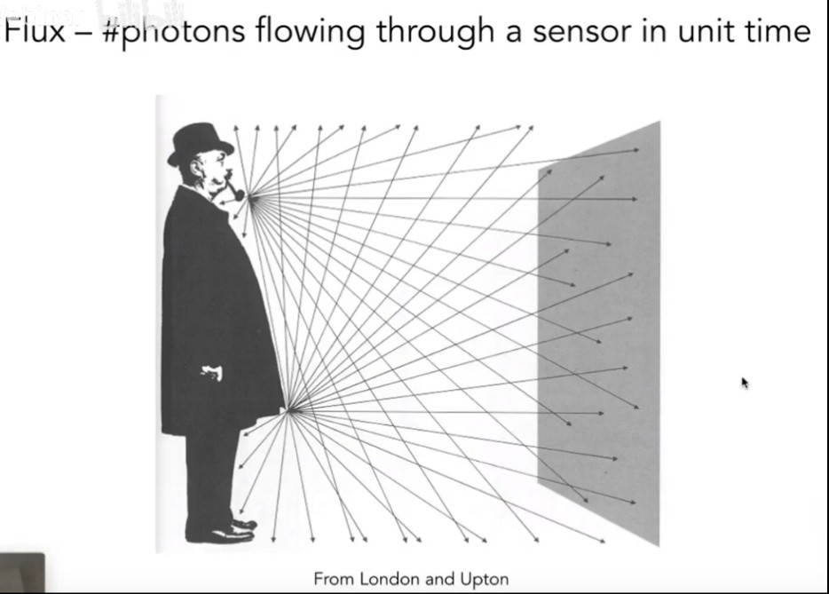

# Resources

## Ray Tracing in One Weekend - The Book Series
*https://raytracing.github.io/*

## SmallPT — 99 行代码光线追踪解析
*https://xieguanglei.github.io/blog/post/ray-tracing-99-lines-code.html*

## Learn Computer Graphics From Scratch!
*https://www.scratchapixel.com/index.php*

## NVIDIA Vulkan Ray Tracing Tutorial
*https://developer.nvidia.com/rtx/raytracing/vkray*

## smallpt: Global Illumination in 99 lines of C++
*https://www.kevinbeason.com/smallpt/*

g++ -O3 -fopenmp smallpt_win.cpp -o smallpt 
time ./smallpt 5000
display image.ppm

## Future of Gaming : Rasterization vs Ray Tracing vs Path Tracing
*https://medium.com/@junyingw/future-of-gaming-rasterization-vs-ray-tracing-vs-path-tracing-32b334510f1f*

1. **What is rasterization?**

Rasterization is a process of rasterizing 3D models onto a 2D plane for display on a computer screen. However, this process is often carried out by fixed function hardware within the graphics pipeline.

2. **What is ray tracing?**

Ray tracing is eye-oriented process that needs walking through each pixel looking for what object should be shown there, which is also can be described as a technique that follows a beam of light (in pixels) from a set point and simulates how it reacts when it encounters objects.

Consider the picture: Ray traced graphics would start at your “eye”, actually it’s camera here. And then the shooting ray from each pixel of the image plane will follow your line of sight to the scene object, and then follow the path of light from the intersected object back to the light source.

3. **What is path tracing?**

Path tracing is a type of ray tracing. When using path tracing for rendering, the rays only produce a single ray per bounce. The rays do not follow a set line per bounce, but rather shoot off in a random direction. The path tracing algorithm then takes a random sampling of all of the rays to create the final image. This results in sampling a variety of different types of lighting.

For simple ray tracing, it shoots one ray from each pixel, but in path tracing , instead of sending out one ray it sends out tens, hundreds or even thousands of rays for each pixel to be rendered. When it hits a surface it doesn’t trace a path to every light source, instead it bounces the ray off the surface and keeps bouncing it until it hits a light source or exhausts some bounce limit. It then calculates the amount of light transferred all the way to the pixel, including any color information gathered from surfaces along the way. It then averages out the values calculated from all the paths that were traced into the scene to get the final pixel color value. It requires a ton of computing power and if you don’t send out enough rays per pixel or don’t trace the paths far enough into the scene then you end up with a very spotty image as many pixels fail to find any light sources from their rays. So when you increase the the samples per pixel, you can see the image quality becomes better and better. Besides, now most of softwares use path tracing as the prior rendering technique.

4. **What are the differences between ray tracing and path tracing?**

Actually, it is improper to compare ray tracing and path tracing, since there is no differences between them. Path tracing is type of ray tracing, it is pointless to compare these two terminologies, since they belong to different levels, like two different layers of a matryoshka doll.

The basic concept of racy tracing is that you shoot a ray that will calculate the primary lightning, however, the ray will bounce and generate more and more rays, which might contribute less of the final lighting. According to this issue, path tracing shows a reasonable rendering equation to solve the exponential ray-increasing problem. So path tracing is only a fast form of ray tracing.

## Understanding SmallPPT Dr. David Cline - *smallPT1.ppt*
* Global Illumination - Global Illumination = “virtual photography”
  * Given a scene description that specifies the location of surfaces in a scene, the location of lights, and the location of a camera, take a virtual “photograph” of that scene.

# Basic conception 

## The Rendering Equation

  

  
  

* Rendering Equation
  $$
  \begin{aligned}
  L_o(o)=L_e(o)+\int_\Omega L_i(i)\cdot F(i, o)\cdot \cos\theta\cdot di
  \end{aligned}
  $$

1. 此方程描述的问题是：从物体表面上的一点$P$处，射入到观察者眼中的某条光线的强度，是如何确定的。
2. $L_o(o)$为射入观察者眼中的光线的颜色，即需要求取的值；$o$ 为出射方向。
3. $L_e(o)$ 为物体表面在点$P$向观察者方向自发射的光线的颜色（灯）。
4. $L_i(i)$ 表示环境入射到点 $P$ 的光的颜色；$i$ 代表入射方向（为计算方便，取真实入射方向的反方向，不影响代表关系，后面也简称为入射方向）。
5. $F(i,o)$ 表示在给定 $i$ 和 $o$ 时，由 $i$ 方向的入射单位光强产生的$o$方向的出射光的强度，此函数与表面的性质有关，又称表面的 `BRDF` 函数。
6. $\theta$ 表示 $i$ 与表面法线的夹角。
7. $\int_\Omega L_i(i)\cdot F(i, o)\cdot \cos\theta\cdot di$ 整个积分项表示：对半球（不透明材质）或全球（透明介质）内的所有入射方向 $i$ 进行积分，得到的 $o$ 方向的出射光强度。

## GAMES101-现代计算机图形学入门-闫令琪
*https://www.bilibili.com/video/BV1X7411F744?p=1*

* SLIDE & VIDEO
  * http://games-cn.org/graphics-intro-ppt-video/
### Lecture - Ray Tracing
#### What is the ray tracing?

#### Whitted-Style ray tracing

#### Ray Surface Equation
* Ray Equation

* Ray Intersection with sphere

* Ray Intersection with sphere

* Ray Intersection with implicit surface

* Ray Intersection with triangle mesh

* Ray Intersection with triangle

* Plane Equation

* Ray Intersection with plane

* Moller Trumbore Algorithm

#### Accelerating Ray-Surface Intersection
* Ray Tracing - Performance Challenges

  * [San Miguel Scene](https://www.pbrt.org/scenes-v2.html)
  * Plant Ecosystem

* Bounding Volumes

* Ray Intersection With Box

* Ray Intersection With Axis-Aligned Box (AABB)

* Ray Intersection with Axis-Aligned Box

* Ray Intersection with Axis-Aligned Box

* Why Axis-Aligned

#### Announcements
* GTC news: DLSS 2.0
  * https://zhuanlan.zhihu.com/p/116211994
* GTC news: RTXGI
  * https://developer.nvidia.com/rtxgi

#### Uniform Spatial Partitions (Grids)
* Uniform Grids - When They Fail
  * "Teapot in a stadium" problem

* Spatial Partitions Examples

* KD-Tree
  * KD-Tree Pre-Processing

  * Data Structure for KD-Trees

  * Traversing a KD-Tree

#### Object Partitions & Bounding Volume Hierarchy (BVH)
* BVH

* Summary: Building BVHs

* Building BVHs

* Data Structure for BVHs

* BVH Traversal

* Spatial vs Object Partitions

#### Basic radiometry (辐射度量学)
* Radiometry

* Radiant Energy and Flux (Power)

* Flux

* Important Light Measurements of Interest

* Radiant Intensity

* Angles and Solid Angles

  
* Differential Solid Angles

* Ω as a direction vector

* Isotropic Point Source

* Modern LED Light

#### Irradiance

* Reviewing Concepts

* Lambert's Cosine Law

* CorrectionL Irradiance Falloff

#### Radiance   
* Radiance

* Radiance

* Radiance

* Incident Radiance

* Existing Radiance

* Irradiance vs. Radiance

#### Bidirectional Reflectance Distribution Function  (BRDF)
* Reflection at a point

* BRDF

* The Reflection Equation

* Challenge: Recursive Equation

* The Rendering Equation

* Reflection Equation

* Reflection Equation

* Reflection Equation

* Rendering Equation

* Rendering Equation as Integral Equation

* Linear Operator Equation

* Ray Tracing and extensions

* Ray Tracing

* Ray Tracing

* Global Illumination

* Global Illumination

* Global Illumination

* Global Illumination

* Global Illumination

#### Probability
* Expected Value of a Random Variable

* Continuous Case: Probability Distribution Function(PDF)

* Function of a Random Variable

#### Monte Carlo Path Tracing
* Whitted-Style Ray Tracing - Problem 1

* Whitted-Style Ray Tracing - Problem 2

* A Simple Monte Carlo Solution

* A Simple Monte Carlo Solution

* A Simple Monte Carlo Solution

* Introducing Global Illumination

* Path Tracing - Graphical

* Path Tracing - Pseudocode

* Ray Generation - Graphical

* Ray Generation - Pseudocode

* Path Tracing - Cutting energy

* Cutting energy Problem Solution - Russian Roulette (RR) - Simple

* Cutting energy Problem Solution - Russian Roulette (RR) - Explain

* Cutting energy Problem Solution - Russian Roulette (RR) - Pseudocode

* Sampling the Light

