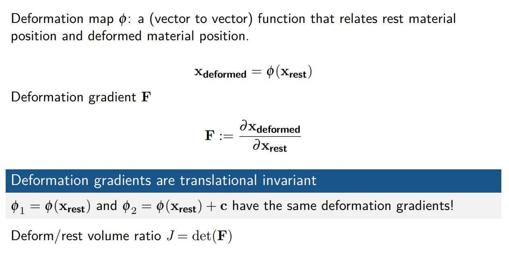

# Simulation

> Physical Engine

* [1] GAMES201：高级物理引擎实战指南2020 *https://www.bilibili.com/video/BV1ZK411H7Hc*
* [2] [taichi learning note](../graphics/taichi)

## Basic
* 仿真是在解偏微分方程

## 介绍

* Whit's is the physics engine?
*https://en.wikipedia.org/wiki/Physics_engine*

A physics engine is computer software that provides an approximate simulation of certain physical systems, such as rigid body dynamics (including collision detection), soft body dynamics, and fluid dynamics, of use in the domains of computer graphics, video games and film (CGI).

* TL; DR
  * Simulate the world in your computer

* Applications
  * CAD/CAE
  * Visual effects(films)
  * VR/AR
  * Training robots
  * Games

* Games
  * The Incredible machines(1993)
  * Angry Birds(2009)
  * Phun (Algodoo)2009
  * Besieged(2015)
  * The Legend of Zelda: Breath of the wild(2017)
  * Ori and the Will of the Wisps(2020)

## 拉格朗日视角1 - Lagrangian Simulation Approaches Mass-Spring Systems and Smoothed Particle Hydrodynamics
* Faster compilation:
  * `ti.core.toggle_advanced_optimization(False)`

* Lagrangian v.s. Eulerian: - Two Views of Continuums

* Lagrangian View
  * What are my position and velocity?
  * Sensors that move passively with the simulated material
* Eulerian View
  * What is the material velocity passing by?
  * Still sensors that never moves

* Continuum Simulation

* Mass-spring systems - 弹簧质点系统

* Time integration
  1. Forward Euler
  2. Semi-implicit Euler
  3. Backward Euler

* Implementing a mass-spring system with symplectic Euler

* Explicit v.s. implicit time integrators
  * Explicit
    * 未来的状态只依赖过去的状态
  * Implicit
    * 未来不止依赖于过去，还依赖于你的未来

* Mass-spring systems

`M: 质量矩阵`

* Lagrangian fluid simulation: Smoothed particle hydrodynamics
  1. Smoothed particle hydrodynamics (SPH)

  

  
  

    * $D_v$: 材料导数， 某个SPH粒子关于时间的导数
    * $g$: 重力，也可以计算成各种各样的力
    * $\rho_0$: 理想的密度

  2. Implementing SPH using the Equation of States (EOS)
  3. Gradients in SPH
  4. SPH Simulation Cycle
    * Variants of SPH
    * Predictive-Corrective Incompressible SPH (PCI-SPH)7
    * Position-based fluids (PBF)8 Demo: `ti example pbf2d`
    * Divergence-free SPH (DFSPH9)
  5. Courant–Friedrichs–Lewy (CFL) condition
    * 从粒子运动的速度来考虑时间步长的限制
    * 几乎任何的显示时间积分都需要考虑这个公式
    

    
    

  6. Accelerating SPH: Neighborhood search
  

  
  

* 自由表面流体
  * 比如说有一盆水，水和空气有一个截面，我们就叫它拥有自由表面流体，比如说你做一个烟雾模拟，它就不是自由表面流体，不管有没有烟，它都得要有空气，所以烟雾模拟不算做自由表面流体

* Other particle-based simulation methods
  * Discrete element method
  * Moving Particle Semi-implicit (MPS)
  * Power Particles: An incompressible fluid solver based on power diagrams13
  * A peridynamic perspective on spring-mass fracture14

* Particles to mesh
  * Marching Cubes
  * VDB

* Exporting your results
  * Make an mp4 video out of your frames
    1. Use `ti.GUI.show` to save the screenshots. Or simply use `ti.imwrite(img, filename)`.
    2. ti video creates video.mp4 using frames under the current folder. To specify frame rate, use `ti video -f 24` or `ti video -f 60`.
    3. Convert mp4 to gif and share it online: `ti gif -i input.mp4`.
  
## 拉格朗日视角2 - Basics of deformation, elasticity, and finite elements
* Deformation
  

  
  
