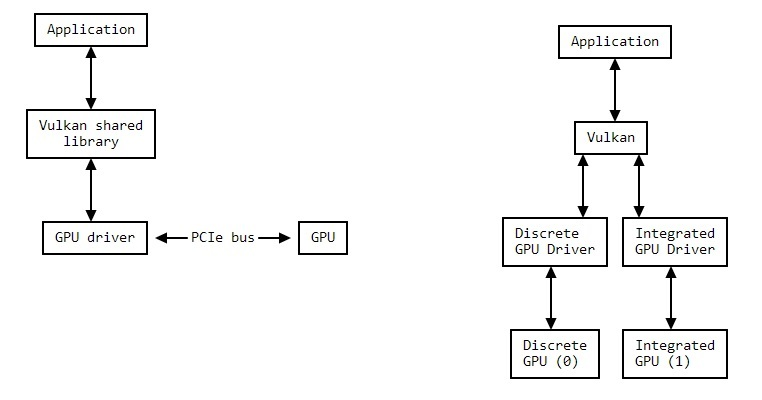

# nvpro-samples vk_mini_path_tracer

## Introduce - Hello Vulkan
* *https://nvpro-samples.github.io/vk_mini_path_tracer/index.html*

one of the best ways to introduce Vulkan may be with GPU path tracing, because the API involved is relatively small.

NVVK helpers

tutorial's text and code: https://github.com/nvpro-samples/vk_mini_path_tracer

* more
	* https://github.com/nvpro-samples/vk_raytracing_tutorial_KHR
	* https://vulkan-tutorial.com/
	* https://blog.demofox.org/2020/05/25/casual-shadertoy-path-tracing-1-basic-camera-diffuse-emissive/
	* https://github.com/nvpro-samples

### Instance Extensions and Layers
Vulkan extensions correspond to different things your GPU can do beyond core functionality, while information passes through different Vulkan layers before it reaches your GPU driver.

**Important** Enable Validation Layer

* *https://vulkan.lunarg.com/doc/view/1.2.131.1/windows/layer_configuration.html*

```bash
C:\> set VK_LAYER_PATH=C:\VulkanSDK\1.1.121\Bin
C:\> set VK_INSTANCE_LAYERS=VK_LAYER_LUNARG_api_dump;VK_LAYER_KHRONOS_validation
C:\> vkcube
```

**Important** Vulkan Extension Support

Vulkan.gpuinfo.org

`VK_KHR_acceleration_structure` and `VK_KHR_ray_query`, which the application can enable if the physical device supports ray tracing. Once we enable that, we can call the Vulkan ray tracing functions!

### Summary

A Vulkan instance (VkInstance) represents an instance of the Vulkan library.

A Vulkan device (VkDevice) points to one or multiple physical devices (VkPhysicalDevices), which correspond to GPUs; it is our primary object used to communicate with the GPU.

Information passes through Vulkan instance layers before reaching the driver.

<div align=center>

</div>

## Device Extensions and Vulkan Objects

> |`NOTE` | Note |
|-|-|

> |`sType` | Vulkan often refers to objects using void pointers. To determine the type of a Vulkan object that a void * points to, Vulkan looks at the first 32 bits of the structure, which contain sType, a structure type enum. |
|-|-|

# Vulkan Tutorial

## Overview

[Overview](../graphics/vulkan_overview)

## Draw a triangle

[Draw a triangle](../graphics/vulkan_draw_a_triangle)

## Vertex Buffers

[Vertex Buffers](../graphics/vulkan_vertex_buffers)

## Uniform Buffers

[Uniform Buffers](../graphics/vulkan_uniform_buffers)

## Vulkan Texture Mapping

[Vulkan Texture Mapping](../graphics/vulkan_texture_mapping)

## Vulkan Basal

[Vulkan Basal](../graphics/vulkan_basal)
