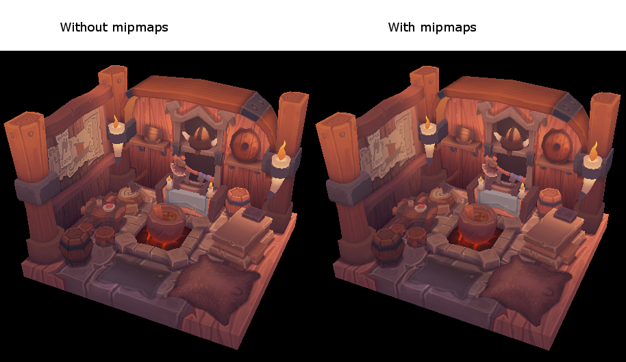

## Depth buffering

### Introduction

The geometry we've worked with so far is projected into 3D, but it's still completely flat. We're going to add a Z coordinate to the position to prepare for 3D meshes. We'll use this third coordinate to place a square over the current square to see a problem that arises when geometry is not sorted by depth.

### 3D geometry
Change the `Vertex` struct to use a 3D vector for the position, and update the `format` in the corresponding `VkVertexInputAttributeDescription`:
```c++
struct Vertex {
    glm::vec3 pos;
    glm::vec3 color;
    glm::vec2 texCoord;

    ...

    static std::array<VkVertexInputAttributeDescription, 3> getAttributeDescriptions() {
        std::array<VkVertexInputAttributeDescription, 3> attributeDescriptions{};

        attributeDescriptions[0].binding = 0;
        attributeDescriptions[0].location = 0;
        attributeDescriptions[0].format = VK_FORMAT_R32G32B32_SFLOAT;
        attributeDescriptions[0].offset = offsetof(Vertex, pos);

        ...
    }
};
```
Next, update the vertex shader to accept and transform 3D coordinates as input. Don't forget to recompile it afterwards!
```c++
layout(location = 0) in vec3 inPosition;

...

void main() {
    gl_Position = ubo.proj * ubo.view * ubo.model * vec4(inPosition, 1.0);
    fragColor = inColor;
    fragTexCoord = inTexCoord;
}
```
Lastly, update the `vertices` container to include Z coordinates:
```c++
const std::vector<Vertex> vertices = {
    {{-0.5f, -0.5f, 0.0f}, {1.0f, 0.0f, 0.0f}, {0.0f, 0.0f}},
    {{0.5f, -0.5f, 0.0f}, {0.0f, 1.0f, 0.0f}, {1.0f, 0.0f}},
    {{0.5f, 0.5f, 0.0f}, {0.0f, 0.0f, 1.0f}, {1.0f, 1.0f}},
    {{-0.5f, 0.5f, 0.0f}, {1.0f, 1.0f, 1.0f}, {0.0f, 1.0f}}
};
```

<div align=center>

</div> 

Use Z coordinates of `-0.5f` and add the appropriate indices for the extra square:
```c++
const std::vector<Vertex> vertices = {
    {{-0.5f, -0.5f, 0.0f}, {1.0f, 0.0f, 0.0f}, {0.0f, 0.0f}},
    {{0.5f, -0.5f, 0.0f}, {0.0f, 1.0f, 0.0f}, {1.0f, 0.0f}},
    {{0.5f, 0.5f, 0.0f}, {0.0f, 0.0f, 1.0f}, {1.0f, 1.0f}},
    {{-0.5f, 0.5f, 0.0f}, {1.0f, 1.0f, 1.0f}, {0.0f, 1.0f}},

    {{-0.5f, -0.5f, -0.5f}, {1.0f, 0.0f, 0.0f}, {0.0f, 0.0f}},
    {{0.5f, -0.5f, -0.5f}, {0.0f, 1.0f, 0.0f}, {1.0f, 0.0f}},
    {{0.5f, 0.5f, -0.5f}, {0.0f, 0.0f, 1.0f}, {1.0f, 1.0f}},
    {{-0.5f, 0.5f, -0.5f}, {1.0f, 1.0f, 1.0f}, {0.0f, 1.0f}}
};

const std::vector<uint16_t> indices = {
    0, 1, 2, 2, 3, 0,
    4, 5, 6, 6, 7, 4
};
```

The problem is that the fragments of the lower square are drawn over the fragments of the upper square, simply because it comes later in the index array. There are two ways to solve this:

* Sort all of the draw calls by depth from back to front
* Use depth testing with a depth buffer

The first approach is commonly used for drawing transparent objects, because order-independent transparency is a difficult challenge to solve. However, the problem of ordering fragments by depth is much more commonly solved using a depth buffer. A depth buffer is an additional attachment that stores the depth for every position, just like the color attachment stores the color of every position. Every time the rasterizer produces a fragment, the depth test will check if the new fragment is closer than the previous one. If it isn't, then the new fragment is discarded. A fragment that passes the depth test writes its own depth to the depth buffer. It is possible to manipulate this value from the fragment shader, just like you can manipulate the color output.
```c++
#define GLM_FORCE_RADIANS
#define GLM_FORCE_DEPTH_ZERO_TO_ONE
#include <glm/glm.hpp>
#include <glm/gtc/matrix_transform.hpp>
```
The perspective projection matrix generated by GLM will use the OpenGL depth range of `-1.0` to `1.0` by default. We need to configure it to use the Vulkan range of `0.0` to `1.0` using the `GLM_FORCE_DEPTH_ZERO_TO_ONE` definition.

### Depth image and view

A depth attachment is based on an image, just like the color attachment. The difference is that the swap chain will not automatically create depth images for us. We only need a single depth image, because only one draw operation is running at once. The depth image will again require the trifecta of resources: image, memory and image view.
```c++
VkImage depthImage;
VkDeviceMemory depthImageMemory;
VkImageView depthImageView;
```
Create a new function `createDepthResources` to set up these resources:
```c++
void initVulkan() {
    ...
    createCommandPool();
    createDepthResources();
    createTextureImage();
    ...
}

...

void createDepthResources() {

}
```
Creating a depth image is fairly straightforward. It should have the same resolution as the color attachment, defined by the swap chain extent, an image usage appropriate for a depth attachment, optimal tiling and device local memory. The only question is: what is the right format for a depth image? The format must contain a depth component, indicated by `_D??_` in the `VK_FORMAT_`.

Unlike the texture image, we don't necessarily need a specific format, because we won't be directly accessing the texels from the program. It just needs to have a reasonable accuracy, at least 24 bits is common in real-world applications. There are several formats that fit this requirement:

* `VK_FORMAT_D32_SFLOAT`: 32-bit float for depth
* `VK_FORMAT_D32_SFLOAT_S8_UINT`: 32-bit signed float for depth and 8 bit stencil component
* `VK_FORMAT_D24_UNORM_S8_UINT`: 24-bit float for depth and 8 bit stencil component

The stencil component is used for [stencil tests](https://en.wikipedia.org/wiki/Stencil_buffer), which is an additional test that can be combined with depth testing. We'll look at this in a future chapter.

We could simply go for the `VK_FORMAT_D32_SFLOAT` format, because support for it is extremely common (see the hardware database), but it's nice to add some extra flexibility to our application where possible. We're going to write a function `findSupportedFormat` that takes a list of candidate formats in order from most desirable to least desirable, and checks which is the first one that is supported:
```c++
VkFormat findSupportedFormat(const std::vector<VkFormat>& candidates, VkImageTiling tiling, VkFormatFeatureFlags features) {

}
```
The support of a format depends on the tiling mode and usage, so we must also include these as parameters. The support of a format can be queried using the `vkGetPhysicalDeviceFormatProperties` function:
```c++
for (VkFormat format : candidates) {
    VkFormatProperties props;
    vkGetPhysicalDeviceFormatProperties(physicalDevice, format, &props);
}
```
The `VkFormatProperties` struct contains three fields:

* linearTilingFeatures: Use cases that are supported with linear tiling
* optimalTilingFeatures: Use cases that are supported with optimal tiling
* bufferFeatures: Use cases that are supported for buffers

Only the first two are relevant here, and the one we check depends on the `tiling` parameter of the function:
```c++
if (tiling == VK_IMAGE_TILING_LINEAR && (props.linearTilingFeatures & features) == features) {
    return format;
} else if (tiling == VK_IMAGE_TILING_OPTIMAL && (props.optimalTilingFeatures & features) == features) {
    return format;
}
```
If none of the candidate formats support the desired usage, then we can either return a special value or simply throw an exception:
```c++
VkFormat findSupportedFormat(const std::vector<VkFormat>& candidates, VkImageTiling tiling, VkFormatFeatureFlags features) {
    for (VkFormat format : candidates) {
        VkFormatProperties props;
        vkGetPhysicalDeviceFormatProperties(physicalDevice, format, &props);

        if (tiling == VK_IMAGE_TILING_LINEAR && (props.linearTilingFeatures & features) == features) {
            return format;
        } else if (tiling == VK_IMAGE_TILING_OPTIMAL && (props.optimalTilingFeatures & features) == features) {
            return format;
        }
    }

    throw std::runtime_error("failed to find supported format!");
}
```
We'll use this function now to create a `findDepthFormat` helper function to select a format with a depth component that supports usage as depth attachment:
```c++
VkFormat findDepthFormat() {
    return findSupportedFormat(
        {VK_FORMAT_D32_SFLOAT, VK_FORMAT_D32_SFLOAT_S8_UINT, VK_FORMAT_D24_UNORM_S8_UINT},
        VK_IMAGE_TILING_OPTIMAL,
        VK_FORMAT_FEATURE_DEPTH_STENCIL_ATTACHMENT_BIT
    );
}
```
Make sure to use the `VK_FORMAT_FEATURE_` flag instead of `VK_IMAGE_USAGE_` in this case. All of these candidate formats contain a depth component, but the latter two also contain a stencil component. We won't be using that yet, but we do need to take that into account when performing layout transitions on images with these formats. Add a simple helper function that tells us if the chosen depth format contains a stencil component:
```c++
bool hasStencilComponent(VkFormat format) {
    return format == VK_FORMAT_D32_SFLOAT_S8_UINT || format == VK_FORMAT_D24_UNORM_S8_UINT;
}
```

Call the function to find a depth format from `createDepthResources`:

```c++
VkFormat depthFormat = findDepthFormat();
```

We now have all the required information to invoke our `createImage` and `createImageView` helper functions:

```c++
createImage(swapChainExtent.width, swapChainExtent.height, depthFormat, VK_IMAGE_TILING_OPTIMAL, VK_IMAGE_USAGE_DEPTH_STENCIL_ATTACHMENT_BIT, VK_MEMORY_PROPERTY_DEVICE_LOCAL_BIT, depthImage, depthImageMemory);
depthImageView = createImageView(depthImage, depthFormat);
```

However, the `createImageView` function currently assumes that the subresource is always the `VK_IMAGE_ASPECT_COLOR_BIT`, so we will need to turn that field into a parameter:

```c++
VkImageView createImageView(VkImage image, VkFormat format, VkImageAspectFlags aspectFlags) {
    ...
    viewInfo.subresourceRange.aspectMask = aspectFlags;
    ...
}
```

Update all calls to this function to use the right aspect:

```c++
swapChainImageViews[i] = createImageView(swapChainImages[i], swapChainImageFormat, VK_IMAGE_ASPECT_COLOR_BIT);
...
depthImageView = createImageView(depthImage, depthFormat, VK_IMAGE_ASPECT_DEPTH_BIT);
...
textureImageView = createImageView(textureImage, VK_FORMAT_R8G8B8A8_SRGB, VK_IMAGE_ASPECT_COLOR_BIT);
```

That's it for creating the depth image. We don't need to map it or copy another image to it, because we're going to clear it at the start of the render pass like the color attachment.

## Loading models

### Introduction

We're going to extend the program to load the vertices and indices from an actual model file to make the graphics card actually do some work.
Many graphics API tutorials have the reader write their own OBJ loader in a chapter like this. The problem with this is that any remotely interesting 3D application will soon require features that are not supported by this file format, like skeletal animation. 

### Library
We will use the [tinyobjloader](https://github.com/syoyo/tinyobjloader) library to load vertices and faces from an OBJ file. It's fast and it's easy to integrate because it's a single file library like stb_image. Go to the repository linked above and download the `tiny_obj_loader.h` file to a folder in your library directory. Make sure to use the version of the file from the `master` branch because the latest official release is outdated.

### Sample mesh

Put two new configuration variables in your program to define the model and texture paths:
```c++
const uint32_t WIDTH = 800;
const uint32_t HEIGHT = 600;

const std::string MODEL_PATH = "models/viking_room.obj";
const std::string TEXTURE_PATH = "textures/viking_room.png";
```

And update `createTextureImage` to use this path variable:

```c++
stbi_uc* pixels = stbi_load(TEXTURE_PATH.c_str(), &texWidth, &texHeight, &texChannels, STBI_rgb_alpha);
```

### Loading vertices and indices

We're going to load the vertices and indices from the model file now, so you should remove the global `vertices` and `indices` arrays now. Replace them with non-const containers as class members:

```c++
std::vector<Vertex> vertices;
std::vector<uint32_t> indices;
VkBuffer vertexBuffer;
VkDeviceMemory vertexBufferMemory;
```

You should change the type of the indices from `uint16_t` to `uint32_t`, because there are going to be a lot more vertices than `65535`. Remember to also change the `vkCmdBindIndexBuffer` parameter:
```c++
vkCmdBindIndexBuffer(commandBuffers[i], indexBuffer, 0, VK_INDEX_TYPE_UINT32);
```

The tinyobjloader library is included in the same way as STB libraries. Include the `tiny_obj_loader.h` file and make sure to define `TINYOBJLOADER_IMPLEMENTATION` in one source file to include the function bodies and avoid linker errors:

```c++
#define TINYOBJLOADER_IMPLEMENTATION
#include <tiny_obj_loader.h>
```

We're now going to write a `loadModel` function that uses this library to populate the `vertices` and `indices` containers with the vertex data from the mesh. It should be called somewhere before the vertex and index buffers are created:

```c++
void initVulkan() {
    ...
    loadModel();
    createVertexBuffer();
    createIndexBuffer();
    ...
}

...

void loadModel() {

}
```

A model is loaded into the library's data structures by calling the `tinyobj::LoadObj` function:

```c++
void loadModel() {
    tinyobj::attrib_t attrib;
    std::vector<tinyobj::shape_t> shapes;
    std::vector<tinyobj::material_t> materials;
    std::string warn, err;

    if (!tinyobj::LoadObj(&attrib, &shapes, &materials, &warn, &err, MODEL_PATH.c_str())) {
        throw std::runtime_error(warn + err);
    }
}
```

An OBJ file consists of positions, normals, texture coordinates and faces. Faces consist of an arbitrary amount of vertices, where each vertex refers to a position, normal and/or texture coordinate by index. This makes it possible to not just reuse entire vertices, but also individual attributes.

The `attrib` container holds all of the positions, normals and texture coordinates in its `attrib.vertices`, `attrib.normals` and `attrib.texcoords` vectors. The shapes container contains all of the separate objects and their faces. Each face consists of an array of vertices, and each vertex contains the indices of the position, normal and texture coordinate attributes. OBJ models can also define a material and texture per face, but we will be ignoring those.

The `err` string contains errors and the `warn` string contains warnings that occurred while loading the file, like a missing material definition. Loading only really failed if the `LoadObj` function returns `false`. As mentioned above, faces in OBJ files can actually contain an arbitrary number of vertices, whereas our application can only render triangles. Luckily the `LoadObj` has an optional parameter to automatically triangulate such faces, which is enabled by default.

We're going to combine all of the faces in the file into a single model, so just iterate over all of the shapes:

```c++
for (const auto& shape : shapes) {

}
```

The triangulation feature has already made sure that there are three vertices per face, so we can now directly iterate over the vertices and dump them straight into our `vertices` vector:

```c++
for (const auto& shape : shapes) {
    for (const auto& index : shape.mesh.indices) {
        Vertex vertex{};

        vertices.push_back(vertex);
        indices.push_back(indices.size());
    }
}
```

For simplicity, we will assume that every vertex is unique for now, hence the simple auto-increment `indices`. The index variable is of type `tinyobj::index_t`, which contains the `vertex_index`, `normal_index` and `texcoord_index` members. We need to use these indices to look up the actual vertex attributes in the `attrib` arrays:

```c++
vertex.pos = {
    attrib.vertices[3 * index.vertex_index + 0],
    attrib.vertices[3 * index.vertex_index + 1],
    attrib.vertices[3 * index.vertex_index + 2]
};

vertex.texCoord = {
    attrib.texcoords[2 * index.texcoord_index + 0],
    attrib.texcoords[2 * index.texcoord_index + 1]
};

vertex.color = {1.0f, 1.0f, 1.0f};
```

Unfortunately the `attrib.vertices` array is an array of `float` values instead of something like `glm::vec3`, so you need to multiply the index by `3`. Similarly, there are two texture coordinate components per entry. The offsets of `0`, `1` and `2` are used to access the X, Y and Z components, or the U and V components in the case of texture coordinates.

Run your program now with optimization enabled (e.g. `Release` mode in Visual Studio and with the `-O3` compiler flag for `GCC`). This is necessary, because otherwise loading the model will be very slow.

The OBJ format assumes a coordinate system where a vertical coordinate of `0` means the bottom of the image, however we've uploaded our image into Vulkan in a top to bottom orientation where `0` means the top of the image. Solve this by flipping the vertical component of the texture coordinates

```c++
vertex.texCoord = {
    attrib.texcoords[2 * index.texcoord_index + 0],
    1.0f - attrib.texcoords[2 * index.texcoord_index + 1]
};
```

<div align=center>

</div> 

### Vertex deduplication

Unfortunately we're not really taking advantage of the index buffer yet. The vertices vector contains a lot of duplicated vertex data, because many `vertices` are included in multiple triangles. We should keep only the unique vertices and use the index buffer to reuse them whenever they come up. A straightforward way to implement this is to use a `map` or `unordered_map` to keep track of the unique vertices and respective indices:

```c++
#include <unordered_map>

...

std::unordered_map<Vertex, uint32_t> uniqueVertices{};

for (const auto& shape : shapes) {
    for (const auto& index : shape.mesh.indices) {
        Vertex vertex{};

        ...

        if (uniqueVertices.count(vertex) == 0) {
            uniqueVertices[vertex] = static_cast<uint32_t>(vertices.size());
            vertices.push_back(vertex);
        }

        indices.push_back(uniqueVertices[vertex]);
    }
}
```

Every time we read a vertex from the OBJ file, we check if we've already seen a vertex with the exact same position and texture coordinates before. If not, we add it to `vertices` and store its index in the `uniqueVertices` container. After that we add the index of the new vertex to `indices`. If we've seen the exact same vertex before, then we look up its index in uniqueVertices and store that index in `indices`.

The program will fail to compile right now, because using a user-defined type like our `Vertex` struct as key in a hash table requires us to implement two functions: equality test and hash calculation. The former is easy to implement by overriding the `==` operator in the `Vertex` struct:

```c++
bool operator==(const Vertex& other) const {
    return pos == other.pos && color == other.color && texCoord == other.texCoord;
}
```

A hash function for `Vertex` is implemented by specifying a template specialization for `std::hash<T>`. Hash functions are a complex topic, but [cppreference.com recommends](http://en.cppreference.com/w/cpp/utility/hash) the following approach combining the fields of a struct to create a decent quality hash function:

```c++
namespace std {
    template<> struct hash<Vertex> {
        size_t operator()(Vertex const& vertex) const {
            return ((hash<glm::vec3>()(vertex.pos) ^
                   (hash<glm::vec3>()(vertex.color) << 1)) >> 1) ^
                   (hash<glm::vec2>()(vertex.texCoord) << 1);
        }
    };
}
```

This code should be placed outside the `Vertex` struct. The hash functions for the GLM types need to be included using the following header:

```c++
#define GLM_ENABLE_EXPERIMENTAL
#include <glm/gtx/hash.hpp>
```

The hash functions are defined in the `gtx` folder, which means that it is technically still an experimental extension to GLM. Therefore you need to define `GLM_ENABLE_EXPERIMENTAL` to use it. It means that the API could change with a new version of GLM in the future, but in practice the API is very stable.

You should now be able to successfully compile and run your program. If you check the size of `vertices`, then you'll see that it has shrunk down from 1,500,000 to 265,645! That means that each vertex is reused in an average number of ~6 triangles. This definitely saves us a lot of GPU memory.

## Generating Mipmaps

### Introduction

Mipmaps are widely used in games and rendering software, and Vulkan gives us complete control over how they are created.

Mipmaps are precalculated, downscaled versions of an image. Each new image is half the width and height of the previous one. Mipmaps are used as a form of Level of Detail or LOD. Objects that are far away from the camera will sample their textures from the smaller mip images. Using smaller images increases the rendering speed and avoids artifacts such as [Moiré patterns](https://en.wikipedia.org/wiki/Moir%C3%A9_pattern). An example of what mipmaps look like:

<div align=center>

</div> 

### Image creation

In Vulkan, each of the mip images is stored in different mip levels of a `VkImage`. Mip level 0 is the original image, and the mip levels after level 0 are commonly referred to as the mip chain.

The number of mip levels is specified when the `VkImage` is created. Up until now, we have always set this value to one. We need to calculate the number of mip levels from the dimensions of the image. First, add a class member to store this number:

```c++
...
uint32_t mipLevels;
VkImage textureImage;
...
```

The value for `mipLevels` can be found once we've loaded the texture in `createTextureImage`:

```c++
int texWidth, texHeight, texChannels;
stbi_uc* pixels = stbi_load(TEXTURE_PATH.c_str(), &texWidth, &texHeight, &texChannels, STBI_rgb_alpha);
...
mipLevels = static_cast<uint32_t>(std::floor(std::log2(std::max(texWidth, texHeight)))) + 1;
```

This calculates the number of levels in the mip chain. The `max` function selects the largest dimension. The `log2` function calculates how many times that dimension can be divided by 2. The `floor` function handles cases where the largest dimension is not a power of 2. `1` is added so that the original image has a mip level.

To use this value, we need to change the `createImage`, `createImageView`, and `transitionImageLayout` functions to allow us to specify the number of mip levels. Add a `mipLevels` parameter to the functions:

```c++
void createImage(uint32_t width, uint32_t height, uint32_t mipLevels, VkFormat format, VkImageTiling tiling, VkImageUsageFlags usage, VkMemoryPropertyFlags properties, VkImage& image, VkDeviceMemory& imageMemory) {
    ...
    imageInfo.mipLevels = mipLevels;
    ...
}
```

```c++
VkImageView createImageView(VkImage image, VkFormat format, VkImageAspectFlags aspectFlags, uint32_t mipLevels) {
    ...
    viewInfo.subresourceRange.levelCount = mipLevels;
    ...
```

```c++
void transitionImageLayout(VkImage image, VkFormat format, VkImageLayout oldLayout, VkImageLayout newLayout, uint32_t mipLevels) {
    ...
    barrier.subresourceRange.levelCount = mipLevels;
    ...
```

Update all calls to these functions to use the right values:

```c++
createImage(swapChainExtent.width, swapChainExtent.height, 1, depthFormat, VK_IMAGE_TILING_OPTIMAL, VK_IMAGE_USAGE_DEPTH_STENCIL_ATTACHMENT_BIT, VK_MEMORY_PROPERTY_DEVICE_LOCAL_BIT, depthImage, depthImageMemory);
...
createImage(texWidth, texHeight, mipLevels, VK_FORMAT_R8G8B8A8_SRGB, VK_IMAGE_TILING_OPTIMAL, VK_IMAGE_USAGE_TRANSFER_DST_BIT | VK_IMAGE_USAGE_SAMPLED_BIT, VK_MEMORY_PROPERTY_DEVICE_LOCAL_BIT, textureImage, textureImageMemory);
```

```c++
swapChainImageViews[i] = createImageView(swapChainImages[i], swapChainImageFormat, VK_IMAGE_ASPECT_COLOR_BIT, 1);
...
depthImageView = createImageView(depthImage, depthFormat, VK_IMAGE_ASPECT_DEPTH_BIT, 1);
...
textureImageView = createImageView(textureImage, VK_FORMAT_R8G8B8A8_SRGB, VK_IMAGE_ASPECT_COLOR_BIT, mipLevels);
```

```c++
transitionImageLayout(depthImage, depthFormat, VK_IMAGE_LAYOUT_UNDEFINED, VK_IMAGE_LAYOUT_DEPTH_STENCIL_ATTACHMENT_OPTIMAL, 1);
...
transitionImageLayout(textureImage, VK_FORMAT_R8G8B8A8_SRGB, VK_IMAGE_LAYOUT_UNDEFINED, VK_IMAGE_LAYOUT_TRANSFER_DST_OPTIMAL, mipLevels);
```

### Generating Mipmaps

Our texture image now has multiple mip levels, but the staging buffer can only be used to fill mip level 0. The other levels are still undefined. To fill these levels we need to generate the data from the single level that we have. We will use the `vkCmdBlitImage` command. This command performs copying, scaling, and filtering operations. We will call this multiple times to blit data to each level of our texture image.

`vkCmdBlitImage` is considered a transfer operation, so we must inform Vulkan that we intend to use the texture image as both the source and destination of a transfer. Add `VK_IMAGE_USAGE_TRANSFER_SRC_BIT` to the texture image's usage flags in `createTextureImage`:

```c++
...
createImage(texWidth, texHeight, mipLevels, VK_FORMAT_R8G8B8A8_SRGB, VK_IMAGE_TILING_OPTIMAL, VK_IMAGE_USAGE_TRANSFER_SRC_BIT | VK_IMAGE_USAGE_TRANSFER_DST_BIT | VK_IMAGE_USAGE_SAMPLED_BIT, VK_MEMORY_PROPERTY_DEVICE_LOCAL_BIT, textureImage, textureImageMemory);
...
```

Like other image operations, `vkCmdBlitImage` depends on the layout of the image it operates on. We could transition the entire image to `VK_IMAGE_LAYOUT_GENERAL`, but this will most likely be slow. For optimal performance, the source image should be in `VK_IMAGE_LAYOUT_TRANSFER_SRC_OPTIMAL` and the destination image should be in `VK_IMAGE_LAYOUT_TRANSFER_DST_OPTIMAL`. Vulkan allows us to transition each mip level of an image independently. Each blit will only deal with two mip levels at a time, so we can transition each level into the optimal layout between blits commands.

`transitionImageLayout` only performs layout transitions on the entire image, so we'll need to write a few more pipeline barrier commands. Remove the existing transition to `VK_IMAGE_LAYOUT_SHADER_READ_ONLY_OPTIMAL` in `createTextureImage`:

```c++
...
transitionImageLayout(textureImage, VK_FORMAT_R8G8B8A8_SRGB, VK_IMAGE_LAYOUT_UNDEFINED, VK_IMAGE_LAYOUT_TRANSFER_DST_OPTIMAL, mipLevels);
    copyBufferToImage(stagingBuffer, textureImage, static_cast<uint32_t>(texWidth), static_cast<uint32_t>(texHeight));
//transitioned to VK_IMAGE_LAYOUT_SHADER_READ_ONLY_OPTIMAL while generating mipmaps
...
```

This will leave each level of the texture image in `VK_IMAGE_LAYOUT_TRANSFER_DST_OPTIMAL`. Each level will be transitioned to `VK_IMAGE_LAYOUT_SHADER_READ_ONLY_OPTIMAL` after the blit command reading from it is finished.

We're now going to write the function that generates the mipmaps:

```c++
void generateMipmaps(VkImage image, int32_t texWidth, int32_t texHeight, uint32_t mipLevels) {
    VkCommandBuffer commandBuffer = beginSingleTimeCommands();

    VkImageMemoryBarrier barrier{};
    barrier.sType = VK_STRUCTURE_TYPE_IMAGE_MEMORY_BARRIER;
    barrier.image = image;
    barrier.srcQueueFamilyIndex = VK_QUEUE_FAMILY_IGNORED;
    barrier.dstQueueFamilyIndex = VK_QUEUE_FAMILY_IGNORED;
    barrier.subresourceRange.aspectMask = VK_IMAGE_ASPECT_COLOR_BIT;
    barrier.subresourceRange.baseArrayLayer = 0;
    barrier.subresourceRange.layerCount = 1;
    barrier.subresourceRange.levelCount = 1;

    endSingleTimeCommands(commandBuffer);
}
```

We're going to make several transitions, so we'll reuse this `VkImageMemoryBarrier`. The fields set above will remain the same for all barriers. `subresourceRange.miplevel`, `oldLayout`, `newLayout`, `srcAccessMask`, and `dstAccessMask` will be changed for each transition.

```c++
int32_t mipWidth = texWidth;
int32_t mipHeight = texHeight;

for (uint32_t i = 1; i < mipLevels; i++) {

}
```

This loop will record each of the `VkCmdBlitImage` commands. Note that the loop variable starts at 1, not 0.

```c++
barrier.subresourceRange.baseMipLevel = i - 1;
barrier.oldLayout = VK_IMAGE_LAYOUT_TRANSFER_DST_OPTIMAL;
barrier.newLayout = VK_IMAGE_LAYOUT_TRANSFER_SRC_OPTIMAL;
barrier.srcAccessMask = VK_ACCESS_TRANSFER_WRITE_BIT;
barrier.dstAccessMask = VK_ACCESS_TRANSFER_READ_BIT;

vkCmdPipelineBarrier(commandBuffer,
    VK_PIPELINE_STAGE_TRANSFER_BIT, VK_PIPELINE_STAGE_TRANSFER_BIT, 0,
    0, nullptr,
    0, nullptr,
    1, &barrier);
```

First, we transition level `i - 1` to `VK_IMAGE_LAYOUT_TRANSFER_SRC_OPTIMAL`. This transition will wait for level `i - 1` to be filled, either from the previous blit command, or from `vkCmdCopyBufferToImage`. The current blit command will wait on this transition.

```c++
VkImageBlit blit{};
blit.srcOffsets[0] = { 0, 0, 0 };
blit.srcOffsets[1] = { mipWidth, mipHeight, 1 };
blit.srcSubresource.aspectMask = VK_IMAGE_ASPECT_COLOR_BIT;
blit.srcSubresource.mipLevel = i - 1;
blit.srcSubresource.baseArrayLayer = 0;
blit.srcSubresource.layerCount = 1;
blit.dstOffsets[0] = { 0, 0, 0 };
blit.dstOffsets[1] = { mipWidth > 1 ? mipWidth / 2 : 1, mipHeight > 1 ? mipHeight / 2 : 1, 1 };
blit.dstSubresource.aspectMask = VK_IMAGE_ASPECT_COLOR_BIT;
blit.dstSubresource.mipLevel = i;
blit.dstSubresource.baseArrayLayer = 0;
blit.dstSubresource.layerCount = 1;
```

Next, we specify the regions that will be used in the blit operation. The source mip level is `i - 1` and the destination mip level is `i`. The two elements of the `srcOffsets` array determine the 3D region that data will be blitted from. `dstOffsets` determines the region that data will be blitted to. The X and Y dimensions of the `dstOffsets[1]` are divided by two since each mip level is half the size of the previous level. The Z dimension of `srcOffsets[1]` and `dstOffsets[1]` must be 1, since a 2D image has a depth of 1.

```c++
vkCmdBlitImage(commandBuffer,
    image, VK_IMAGE_LAYOUT_TRANSFER_SRC_OPTIMAL,
    image, VK_IMAGE_LAYOUT_TRANSFER_DST_OPTIMAL,
    1, &blit,
    VK_FILTER_LINEAR);
```

Now, we record the blit command. Note that `textureImage` is used for both the `srcImage` and `dstImage` parameter. This is because we're blitting between different levels of the same image. The source mip level was just transitioned to `VK_IMAGE_LAYOUT_TRANSFER_SRC_OPTIMAL` and the destination level is still in `VK_IMAGE_LAYOUT_TRANSFER_DST_OPTIMAL` from `createTextureImage`.

Beware if you are using a dedicated transfer queue (as suggested in [Vertex buffers](https://vulkan-tutorial.com/Vertex_buffers/Staging_buffer)): `vkCmdBlitImage` must be submitted to a queue with graphics capability.

The last parameter allows us to specify a `VkFilter` to use in the blit. We have the same filtering options here that we had when making the `VkSampler`. We use the `VK_FILTER_LINEAR` to enable interpolation.

```c++
barrier.oldLayout = VK_IMAGE_LAYOUT_TRANSFER_SRC_OPTIMAL;
barrier.newLayout = VK_IMAGE_LAYOUT_SHADER_READ_ONLY_OPTIMAL;
barrier.srcAccessMask = VK_ACCESS_TRANSFER_READ_BIT;
barrier.dstAccessMask = VK_ACCESS_SHADER_READ_BIT;

vkCmdPipelineBarrier(commandBuffer,
    VK_PIPELINE_STAGE_TRANSFER_BIT, VK_PIPELINE_STAGE_FRAGMENT_SHADER_BIT, 0,
    0, nullptr,
    0, nullptr,
    1, &barrier);
```

This barrier transitions mip level `i - 1` to `VK_IMAGE_LAYOUT_SHADER_READ_ONLY_OPTIMAL`. This transition waits on the current blit command to finish. All sampling operations will wait on this transition to finish.

```c++
    ...
    if (mipWidth > 1) mipWidth /= 2;
    if (mipHeight > 1) mipHeight /= 2;
}
```

At the end of the loop, we divide the current mip dimensions by two. We check each dimension before the division to ensure that dimension never becomes 0. This handles cases where the image is not square, since one of the mip dimensions would reach 1 before the other dimension. When this happens, that dimension should remain 1 for all remaining levels.

```c++
    barrier.subresourceRange.baseMipLevel = mipLevels - 1;
    barrier.oldLayout = VK_IMAGE_LAYOUT_TRANSFER_DST_OPTIMAL;
    barrier.newLayout = VK_IMAGE_LAYOUT_SHADER_READ_ONLY_OPTIMAL;
    barrier.srcAccessMask = VK_ACCESS_TRANSFER_WRITE_BIT;
    barrier.dstAccessMask = VK_ACCESS_SHADER_READ_BIT;

    vkCmdPipelineBarrier(commandBuffer,
        VK_PIPELINE_STAGE_TRANSFER_BIT, VK_PIPELINE_STAGE_FRAGMENT_SHADER_BIT, 0,
        0, nullptr,
        0, nullptr,
        1, &barrier);

    endSingleTimeCommands(commandBuffer);
}
```

Before we end the command buffer, we insert one more pipeline barrier. This barrier transitions the last mip level from `VK_IMAGE_LAYOUT_TRANSFER_DST_OPTIMAL` to `VK_IMAGE_LAYOUT_SHADER_READ_ONLY_OPTIMAL`. This wasn't handled by the loop, since the last mip level is never blitted from.

Finally, add the call to `generateMipmaps` in `createTextureImage`:

```c++
transitionImageLayout(textureImage, VK_FORMAT_R8G8B8A8_SRGB, VK_IMAGE_LAYOUT_UNDEFINED, VK_IMAGE_LAYOUT_TRANSFER_DST_OPTIMAL, mipLevels);
    copyBufferToImage(stagingBuffer, textureImage, static_cast<uint32_t>(texWidth), static_cast<uint32_t>(texHeight));
//transitioned to VK_IMAGE_LAYOUT_SHADER_READ_ONLY_OPTIMAL while generating mipmaps
...
generateMipmaps(textureImage, texWidth, texHeight, mipLevels);
```

Our texture image's mipmaps are now completely filled.

### Linear filtering support

It is very convenient to use a built-in function like `vkCmdBlitImage` to generate all the mip levels, but unfortunately it is not guaranteed to be supported on all platforms. It requires the texture image format we use to support linear filtering, which can be checked with the `vkGetPhysicalDeviceFormatProperties` function. We will add a check to the `generateMipmaps` function for this.

First add an additional parameter that specifies the image format:

```c++
void createTextureImage() {
    ...

    generateMipmaps(textureImage, VK_FORMAT_R8G8B8A8_SRGB, texWidth, texHeight, mipLevels);
}

void generateMipmaps(VkImage image, VkFormat imageFormat, int32_t texWidth, int32_t texHeight, uint32_t mipLevels) {

    ...
}
```

In the `generateMipmaps` function, use `vkGetPhysicalDeviceFormatProperties` to request the properties of the texture image format:

```c++
void generateMipmaps(VkImage image, VkFormat imageFormat, int32_t texWidth, int32_t texHeight, uint32_t mipLevels) {

    // Check if image format supports linear blitting
    VkFormatProperties formatProperties;
    vkGetPhysicalDeviceFormatProperties(physicalDevice, imageFormat, &formatProperties);

    ...
```

The `VkFormatProperties` struct has three fields named `linearTilingFeatures`, `optimalTilingFeatures` and `bufferFeatures` that each describe how the format can be used depending on the way it is used. We create a texture image with the optimal tiling format, so we need to check `optimalTilingFeatures`. Support for the linear filtering feature can be checked with the `VK_FORMAT_FEATURE_SAMPLED_IMAGE_FILTER_LINEAR_BIT`:

```c++
if (!(formatProperties.optimalTilingFeatures & VK_FORMAT_FEATURE_SAMPLED_IMAGE_FILTER_LINEAR_BIT)) {
    throw std::runtime_error("texture image format does not support linear blitting!");
}
```

There are two alternatives in this case. You could implement a function that searches common texture image formats for one that does support linear blitting, or you could implement the mipmap generation in software with a library like [stb_image_resize](https://github.com/nothings/stb/blob/master/stb_image_resize.h). Each mip level can then be loaded into the image in the same way that you loaded the original image.

It should be noted that it is uncommon in practice to generate the mipmap levels at runtime anyway. Usually they are pregenerated and stored in the texture file alongside the base level to improve loading speed. Implementing resizing in software and loading multiple levels from a file is left as an exercise to the reader.

### Sampler

While the `VkImage` holds the mipmap data, `VkSampler` controls how that data is read while rendering. Vulkan allows us to specify `minLod`, `maxLod`, `mipLodBias`, and `mipmapMode` ("Lod" means "Level of Detail"). When a texture is sampled, the sampler selects a mip level according to the following pseudocode:

```c++
lod = getLodLevelFromScreenSize(); //smaller when the object is close, may be negative
lod = clamp(lod + mipLodBias, minLod, maxLod);

level = clamp(floor(lod), 0, texture.mipLevels - 1);  //clamped to the number of mip levels in the texture

if (mipmapMode == VK_SAMPLER_MIPMAP_MODE_NEAREST) {
    color = sample(level);
} else {
    color = blend(sample(level), sample(level + 1));
}
```

If `samplerInfo.mipmapMode` is `VK_SAMPLER_MIPMAP_MODE_NEAREST`, lod selects the mip level to sample from. If the mipmap mode is `VK_SAMPLER_MIPMAP_MODE_LINEAR`, `lod` is used to select two mip levels to be sampled. Those levels are sampled and the results are linearly blended.

The sample operation is also affected by `lod`:

```c++
if (lod <= 0) {
    color = readTexture(uv, magFilter);
} else {
    color = readTexture(uv, minFilter);
}
```

If the object is close to the camera, `magFilter` is used as the filter. If the object is further from the camera, `minFilter` is used. Normally, `lod` is non-negative, and is only 0 when close the camera. `mipLodBias` lets us force Vulkan to use lower `lod` and `level` than it would normally use.

To see the results of this chapter, we need to choose values for our `textureSampler`. We've already set the `minFilter` and `magFilter` to use `VK_FILTER_LINEAR`. We just need to choose values for `minLod`, `maxLod`, `mipLodBias`, and `mipmapMode`.

```c++
void createTextureSampler() {
    ...
    samplerInfo.mipmapMode = VK_SAMPLER_MIPMAP_MODE_LINEAR;
    samplerInfo.minLod = 0.0f; // Optional
    samplerInfo.maxLod = static_cast<float>(mipLevels);
    samplerInfo.mipLodBias = 0.0f; // Optional
    ...
}
```

To allow the full range of mip levels to be used, we set `minLod` to 0.0f, and maxLod to the number of mip levels. We have no reason to change the `lod` value , so we set mipLodBias to `0.0f`.

<div align=center>

</div> 

The most noticeable difference is the writing on the papers. With mipmaps, the writing has been smoothed. Without mipmaps, the writing has harsh edges and gaps from Moiré artifacts.

You can play around with the sampler settings to see how they affect mipmapping. For example, by changing `minLod`, you can force the sampler to not use the lowest mip levels:

```c++
samplerInfo.minLod = static_cast<float>(mipLevels / 2);
```

<div align=center>

</div> 


This is how higher mip levels will be used when objects are further away from the camera.

## Multisampling

### Introduction

Our program can now load multiple levels of detail for textures which fixes artifacts when rendering objects far away from the viewer. The image is now a lot smoother, however on closer inspection you will notice jagged saw-like patterns along the edges of drawn geometric shapes. This is especially visible in one of our early programs when we rendered a quad:

<div align=center>

</div> 

This undesired effect is called "aliasing" and it's a result of a limited numbers of pixels that are available for rendering. Since there are no displays out there with unlimited resolution, it will be always visible to some extent. There's a number of ways to fix this and in this chapter we'll focus on one of the more popular ones: [Multisample anti-aliasing](https://en.wikipedia.org/wiki/Multisample_anti-aliasing) (MSAA).

In ordinary rendering, the pixel color is determined based on a single sample point which in most cases is the center of the target pixel on screen. If part of the drawn line passes through a certain pixel but doesn't cover the sample point, that pixel will be left blank, leading to the jagged "staircase" effect.

<div align=center>

</div> 

What MSAA does is it uses multiple sample points per pixel (hence the name) to determine its final color. As one might expect, more samples lead to better results, however it is also more computationally expensive.

<div align=center>

</div> 

### Getting available sample count

Let's start off by determining how many samples our hardware can use. Most modern GPUs support at least 8 samples but this number is not guaranteed to be the same everywhere. We'll keep track of it by adding a new class member:

```c++
...
VkSampleCountFlagBits msaaSamples = VK_SAMPLE_COUNT_1_BIT;
...
```

By default we'll be using only one sample per pixel which is equivalent to no multisampling, in which case the final image will remain unchanged. The exact maximum number of samples can be extracted from `VkPhysicalDeviceProperties` associated with our selected physical device. We're using a depth buffer, so we have to take into account the sample count for both color and depth. The highest sample count that is supported by both (&) will be the maximum we can support. Add a function that will fetch this information for us:

```c++
VkSampleCountFlagBits getMaxUsableSampleCount() {
    VkPhysicalDeviceProperties physicalDeviceProperties;
    vkGetPhysicalDeviceProperties(physicalDevice, &physicalDeviceProperties);

    VkSampleCountFlags counts = physicalDeviceProperties.limits.framebufferColorSampleCounts & physicalDeviceProperties.limits.framebufferDepthSampleCounts;
    if (counts & VK_SAMPLE_COUNT_64_BIT) { return VK_SAMPLE_COUNT_64_BIT; }
    if (counts & VK_SAMPLE_COUNT_32_BIT) { return VK_SAMPLE_COUNT_32_BIT; }
    if (counts & VK_SAMPLE_COUNT_16_BIT) { return VK_SAMPLE_COUNT_16_BIT; }
    if (counts & VK_SAMPLE_COUNT_8_BIT) { return VK_SAMPLE_COUNT_8_BIT; }
    if (counts & VK_SAMPLE_COUNT_4_BIT) { return VK_SAMPLE_COUNT_4_BIT; }
    if (counts & VK_SAMPLE_COUNT_2_BIT) { return VK_SAMPLE_COUNT_2_BIT; }

    return VK_SAMPLE_COUNT_1_BIT;
}
```

We will now use this function to set the `msaaSamples` variable during the physical device selection process. For this, we have to slightly modify the `pickPhysicalDevice` function:

```c++
void pickPhysicalDevice() {
    ...
    for (const auto& device : devices) {
        if (isDeviceSuitable(device)) {
            physicalDevice = device;
            msaaSamples = getMaxUsableSampleCount();
            break;
        }
    }
    ...
}
```

### Setting up a render target

In MSAA, each pixel is sampled in an offscreen buffer which is then rendered to the screen. This new buffer is slightly different from regular images we've been rendering to - they have to be able to store more than one sample per pixel. Once a multisampled buffer is created, it has to be resolved to the default framebuffer (which stores only a single sample per pixel). This is why we have to create an additional render target and modify our current drawing process. We only need one render target since only one drawing operation is active at a time, just like with the depth buffer. Add the following class members:

```c++
...
VkImage colorImage;
VkDeviceMemory colorImageMemory;
VkImageView colorImageView;
...
```

This new image will have to store the desired number of samples per pixel, so we need to pass this number to `VkImageCreateInfo` during the image creation process. Modify the createImage function by adding a numSamples parameter:

```c++
void createImage(uint32_t width, uint32_t height, uint32_t mipLevels, VkSampleCountFlagBits numSamples, VkFormat format, VkImageTiling tiling, VkImageUsageFlags usage, VkMemoryPropertyFlags properties, VkImage& image, VkDeviceMemory& imageMemory) {
    ...
    imageInfo.samples = numSamples;
    ...
```

For now, update all calls to this function using `VK_SAMPLE_COUNT_1_BIT` - we will be replacing this with proper values as we progress with implementation:

```c++
createImage(swapChainExtent.width, swapChainExtent.height, 1, VK_SAMPLE_COUNT_1_BIT, depthFormat, VK_IMAGE_TILING_OPTIMAL, VK_IMAGE_USAGE_DEPTH_STENCIL_ATTACHMENT_BIT, VK_MEMORY_PROPERTY_DEVICE_LOCAL_BIT, depthImage, depthImageMemory);
...
createImage(texWidth, texHeight, mipLevels, VK_SAMPLE_COUNT_1_BIT, VK_FORMAT_R8G8B8A8_SRGB, VK_IMAGE_TILING_OPTIMAL, VK_IMAGE_USAGE_TRANSFER_SRC_BIT | VK_IMAGE_USAGE_TRANSFER_DST_BIT | VK_IMAGE_USAGE_SAMPLED_BIT, VK_MEMORY_PROPERTY_DEVICE_LOCAL_BIT, textureImage, textureImageMemory);
```

We will now create a multisampled color buffer. Add a `createColorResources` function and note that we're using `msaaSamples` here as a function parameter to `createImage`. We're also using only one mip level, since this is enforced by the Vulkan specification in case of images with more than one sample per pixel. Also, this color buffer doesn't need mipmaps since it's not going to be used as a texture:

```c++
void createColorResources() {
    VkFormat colorFormat = swapChainImageFormat;

    createImage(swapChainExtent.width, swapChainExtent.height, 1, msaaSamples, colorFormat, VK_IMAGE_TILING_OPTIMAL, VK_IMAGE_USAGE_TRANSIENT_ATTACHMENT_BIT | VK_IMAGE_USAGE_COLOR_ATTACHMENT_BIT, VK_MEMORY_PROPERTY_DEVICE_LOCAL_BIT, colorImage, colorImageMemory);
    colorImageView = createImageView(colorImage, colorFormat, VK_IMAGE_ASPECT_COLOR_BIT, 1);
}
```

For consistency, call the function right before `createDepthResources`:

```c++
void initVulkan() {
    ...
    createColorResources();
    createDepthResources();
    ...
}
```

Now that we have a multisampled color buffer in place it's time to take care of depth. Modify `createDepthResources` and update the number of samples used by the depth buffer:

```c++
void createDepthResources() {
    ...
    createImage(swapChainExtent.width, swapChainExtent.height, 1, msaaSamples, depthFormat, VK_IMAGE_TILING_OPTIMAL, VK_IMAGE_USAGE_DEPTH_STENCIL_ATTACHMENT_BIT, VK_MEMORY_PROPERTY_DEVICE_LOCAL_BIT, depthImage, depthImageMemory);
    ...
}
```

We have now created a couple of new Vulkan resources, so let's not forget to release them when necessary:

```c++
void cleanupSwapChain() {
    vkDestroyImageView(device, colorImageView, nullptr);
    vkDestroyImage(device, colorImage, nullptr);
    vkFreeMemory(device, colorImageMemory, nullptr);
    ...
}
```

And update the `recreateSwapChain` so that the new color image can be recreated in the correct resolution when the window is resized:

```c++
void recreateSwapChain() {
    ...
    createGraphicsPipeline();
    createColorResources();
    createDepthResources();
    ...
}
```

We made it past the initial MSAA setup, now we need to start using this new resource in our graphics pipeline, framebuffer, render pass and see the results!

### Adding new attachments

Let's take care of the render pass first. Modify `createRenderPass` and update color and depth attachment creation info structs:

```c++
void createRenderPass() {
    ...
    colorAttachment.samples = msaaSamples;
    colorAttachment.finalLayout = VK_IMAGE_LAYOUT_COLOR_ATTACHMENT_OPTIMAL;
    ...
    depthAttachment.samples = msaaSamples;
    ...
```

You'll notice that we have changed the finalLayout from `VK_IMAGE_LAYOUT_PRESENT_SRC_KHR` to `VK_IMAGE_LAYOUT_COLOR_ATTACHMENT_OPTIMAL`. That's because multisampled images cannot be presented directly. We first need to resolve them to a regular image. This requirement does not apply to the depth buffer, since it won't be presented at any point. Therefore we will have to add only one new attachment for color which is a so-called resolve attachment:

```c++
    ...
    VkAttachmentDescription colorAttachmentResolve{};
    colorAttachmentResolve.format = swapChainImageFormat;
    colorAttachmentResolve.samples = VK_SAMPLE_COUNT_1_BIT;
    colorAttachmentResolve.loadOp = VK_ATTACHMENT_LOAD_OP_DONT_CARE;
    colorAttachmentResolve.storeOp = VK_ATTACHMENT_STORE_OP_STORE;
    colorAttachmentResolve.stencilLoadOp = VK_ATTACHMENT_LOAD_OP_DONT_CARE;
    colorAttachmentResolve.stencilStoreOp = VK_ATTACHMENT_STORE_OP_DONT_CARE;
    colorAttachmentResolve.initialLayout = VK_IMAGE_LAYOUT_UNDEFINED;
    colorAttachmentResolve.finalLayout = VK_IMAGE_LAYOUT_PRESENT_SRC_KHR;
    ...
```

The render pass now has to be instructed to resolve multisampled color image into regular attachment. Create a new attachment reference that will point to the color buffer which will serve as the resolve target:

```c++
    ...
    VkAttachmentReference colorAttachmentResolveRef{};
    colorAttachmentResolveRef.attachment = 2;
    colorAttachmentResolveRef.layout = VK_IMAGE_LAYOUT_COLOR_ATTACHMENT_OPTIMAL;
    ...
```

Set the `pResolveAttachments` subpass struct member to point to the newly created attachment reference. This is enough to let the render pass define a multisample resolve operation which will let us render the image to screen:

```c++
    ...
    subpass.pResolveAttachments = &colorAttachmentResolveRef;
    ...
```

Now update render pass info struct with the new color attachment:

```c++
    ...
    std::array<VkAttachmentDescription, 3> attachments = {colorAttachment, depthAttachment, colorAttachmentResolve};
    ...
```

With the render pass in place, modify `createFrameBuffers` and add the new image view to the list:

```c++
void createFrameBuffers() {
        ...
        std::array<VkImageView, 3> attachments = {
            colorImageView,
            depthImageView,
            swapChainImageViews[i]
        };
        ...
}
```

Finally, tell the newly created pipeline to use more than one sample by modifying `createGraphicsPipeline`:

```c++
void createGraphicsPipeline() {
    ...
    multisampling.rasterizationSamples = msaaSamples;
    ...
}
```

<div align=center>

</div> 

### Quality improvements

There are certain limitations of our current MSAA implementation which may impact the quality of the output image in more detailed scenes. For example, we're currently not solving potential problems caused by shader aliasing, i.e. MSAA only smoothens out the edges of geometry but not the interior filling. This may lead to a situation when you get a smooth polygon rendered on screen but the applied texture will still look aliased if it contains high contrasting colors. One way to approach this problem is to enable [Sample Shading](https://www.khronos.org/registry/vulkan/specs/1.0/html/vkspec.html#primsrast-sampleshading) which will improve the image quality even further, though at an additional performance cost:

```c++
void createLogicalDevice() {
    ...
    deviceFeatures.sampleRateShading = VK_TRUE; // enable sample shading feature for the device
    ...
}

void createGraphicsPipeline() {
    ...
    multisampling.sampleShadingEnable = VK_TRUE; // enable sample shading in the pipeline
    multisampling.minSampleShading = .2f; // min fraction for sample shading; closer to one is smoother
    ...
}
```

In this example we'll leave sample shading disabled but in certain scenarios the quality improvement may be noticeable:

<div align=center>

</div> 

### Conclusion

Exploring more of the features, like:

* Push constants
* Instanced rendering
* Dynamic uniforms
* Separate images and sampler descriptors
* Pipeline cache
* Multi-threaded command buffer generation
* Multiple subpasses
* Compute shaders