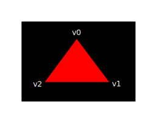

# Setup

## Base

### General structure

```C++
#include <vulkan/vulkan.h>

#include <iostream>
#include <stdexcept>
#include <cstdlib>

class HelloTriangleApplication {
public:
    void run() {
        initVulkan();
        mainLoop();
        cleanup();
    }

private:
    void initVulkan() {

    }

    void mainLoop() {

    }

    void cleanup() {

    }
};

int main() {
    HelloTriangleApplication app;

    try {
        app.run();
    } catch (const std::exception& e) {
        std::cerr << e.what() << std::endl;
        return EXIT_FAILURE;
    }

    return EXIT_SUCCESS;
}
```

### Resource management
*  In C++ it is possible to perform automatic resource management using RAII or smart pointers provided in the <memory> header.
* Vulkan objects are either created directly with functions like `vkCreateXXX`, or allocated through another object with functions like `vkAllocateXXX`. After making sure that an object is no longer used anywhere, you need to destroy it with the counterparts `vkDestroyXXX` and `vkFreeXXX`.

### Integrating GLFW
* Vulkan works perfectly fine without creating a window if you want to use it for off-screen rendering
```C++
#define GLFW_INCLUDE_VULKAN
#include <GLFW/glfw3.h>
```

## Instance

### Creating an instance
* to create an instance we'll first have to fill in a struct with some information about our application, This struct is called `VkApplicationInfo`
```C++
void createInstance() {
    VkApplicationInfo appInfo{};
    appInfo.sType = VK_STRUCTURE_TYPE_APPLICATION_INFO;
    appInfo.pApplicationName = "Hello Triangle";
    appInfo.applicationVersion = VK_MAKE_VERSION(1, 0, 0);
    appInfo.pEngineName = "No Engine";
    appInfo.engineVersion = VK_MAKE_VERSION(1, 0, 0);
    appInfo.apiVersion = VK_API_VERSION_1_0;
}
```

* tells the Vulkan driver which global extensions and validation layers we want to use. Global here means that they apply to the entire program and not a specific device
```C++
  	VkInstanceCreateInfo createInfo{};
	createInfo.sType = VK_STRUCTURE_TYPE_INSTANCE_CREATE_INFO;
	createInfo.pApplicationInfo = &appInfo;
```

* Vulkan is a platform agnostic API, which means that you need an extension to interface with the window system.
*  the global validation layers to enable
```C++
	uint32_t glfwExtensionCount = 0;
	const char** glfwExtensions;
	glfwExtensions = glfwGetRequiredInstanceExtensions(&glfwExtensionCount);

	createInfo.enabledExtensionCount = glfwExtensionCount;
	createInfo.ppEnabledExtensionNames = glfwExtensions;

	createInfo.enabledLayerCount = 0;
```

* finally issue the `vkCreateInstance` call
```C++
VkResult result = vkCreateInstance(&createInfo, nullptr, &instance);
```

### Checking for extension support
* To retrieve a list of supported extensions before creating an instance, there's the `vkEnumerateInstanceExtensionProperties` function. It takes a pointer to a variable that stores the number of extensions and an array of `VkExtensionProperties` to store details of the extensions, and Each `VkExtensionProperties` struct contains the name and version of an extension, (`.extensionName`)
```C++
uint32_t extensionCount = 0;
vkEnumerateInstanceExtensionProperties(nullptr, &extensionCount, nullptr);

std::vector<VkExtensionProperties> extensions(extensionCount);

vkEnumerateInstanceExtensionProperties(nullptr, &extensionCount, extensions.data());
```

### Cleaning up
* The `VkInstance` should be only destroyed right before the program exits. It can be destroyed in cleanup with the `vkDestroyInstance` function
```C++
void cleanup() {
    vkDestroyInstance(instance, nullptr);

    glfwDestroyWindow(window);

    glfwTerminate();
}
```

## Validation layers

### What are validation layers
The Vulkan API is designed around the idea of minimal driver overhead and one of the manifestations of that goal is that there is very limited error checking in the API by default.

Validation layers are optional components that hook into Vulkan function calls to apply additional operations. Common operations in validation layers are:

* Checking the values of parameters against the specification to detect misuse
* Tracking creation and destruction of objects to find resource leaks
* Checking thread safety by tracking the threads that calls originate from
* Logging every call and its parameters to the standard output
* Tracing Vulkan calls for profiling and replaying

These validation layers can be freely stacked to include all the debugging functionality

Using the validation layers is the best way to avoid your application breaking on different drivers by accidentally relying on undefined behavior.

### Using validation layers

validation layers need to be enabled by specifying their name. All of the useful standard validation is bundled into a layer included in the SDK that is known as `VK_LAYER_KHRONOS_validation`

```c++
const uint32_t WIDTH = 800;
const uint32_t HEIGHT = 600;

const std::vector<const char*> validationLayers = {
    "VK_LAYER_KHRONOS_validation"
};

#ifdef NDEBUG
    const bool enableValidationLayers = false;
#else
    const bool enableValidationLayers = true;
#endif
```

```c++
bool checkValidationLayerSupport() {
    ...
    // check Validation layer support

    for (const char* layerName : validationLayers) {
        ...
        // check layer found
    }

    return true;
}

```

Using this function in `createInstance`:

```c++
void createInstance() {
    if (enableValidationLayers && !checkValidationLayerSupport()) {
        throw std::runtime_error("validation layers requested, but not available!");
    }

    ...
}
```

modify the `VkInstanceCreateInfo` struct instantiation to include the validation layer names

```c++
if (enableValidationLayers) {
    createInfo.enabledLayerCount = static_cast<uint32_t>(validationLayers.size());
    createInfo.ppEnabledLayerNames = validationLayers.data();
} else {
    createInfo.enabledLayerCount = 0;
}
```

### Message callback
To set up a callback in the program to handle messages and the associated details, we have to set up a debug messenger with a callback using the `VK_EXT_debug_utils` extension

```c++
if (enableValidationLayers) {
    extensions.push_back(VK_EXT_DEBUG_UTILS_EXTENSION_NAME);
}
```

Add a new static member function called `debugCallback` with the `PFN_vkDebugUtilsMessengerCallbackEXT` prototype. The `VKAPI_ATTR` and `VKAPI_CALL` ensure that the function has the right signature for Vulkan to call it.

```c++
// The first parameter specifies the severity of the message,
// pCallbackData {pMessage pObjects objectCount}
// the pUserData parameter contains a pointer that was specified during the setup of the callback and allows you to pass your own data to it
static VKAPI_ATTR VkBool32 VKAPI_CALL debugCallback(
    VkDebugUtilsMessageSeverityFlagBitsEXT messageSeverity,
    VkDebugUtilsMessageTypeFlagsEXT messageType,
    const VkDebugUtilsMessengerCallbackDataEXT* pCallbackData,
    void* pUserData) {

    std::cerr << "validation layer: " << pCallbackData->pMessage << std::endl;

    return VK_FALSE;
}
```
* return `VK_FALSE`
    * The callback returns a boolean that indicates if the Vulkan call that triggered the validation layer message should be aborted. If the callback returns true, then the call is aborted with the VK_ERROR_VALIDATION_FAILED_EXT error.

the debug callback in Vulkan is managed with a handle that needs to be explicitly created and destroyed

`VkDebugUtilsMessengerEXT debugMessenger;`

```c++
VkDebugUtilsMessengerCreateInfoEXT createInfo{};
createInfo.sType = VK_STRUCTURE_TYPE_DEBUG_UTILS_MESSENGER_CREATE_INFO_EXT;
createInfo.messageSeverity = VK_DEBUG_UTILS_MESSAGE_SEVERITY_VERBOSE_BIT_EXT | VK_DEBUG_UTILS_MESSAGE_SEVERITY_WARNING_BIT_EXT | VK_DEBUG_UTILS_MESSAGE_SEVERITY_ERROR_BIT_EXT;
createInfo.messageType = VK_DEBUG_UTILS_MESSAGE_TYPE_GENERAL_BIT_EXT | VK_DEBUG_UTILS_MESSAGE_TYPE_VALIDATION_BIT_EXT | VK_DEBUG_UTILS_MESSAGE_TYPE_PERFORMANCE_BIT_EXT;
createInfo.pfnUserCallback = debugCallback;
createInfo.pUserData = nullptr; // Optional
```

* `pUserData`
    * a pointer to the pUserData field which will be passed along to the callback function via the pUserData parameter. You could use this to pass a pointer to the HelloTriangleApplication class, for example.

* The `VkDebugUtilsMessengerCreateInfoEXT` should be passed to the `vkCreateDebugUtilsMessengerEXT` to create the `VkDebugUtilsMessengerEXT` object, We have to look up its address ourselves using `vkGetInstanceProcAddr`

```c++
VkResult CreateDebugUtilsMessengerEXT(VkInstance instance, const VkDebugUtilsMessengerCreateInfoEXT* pCreateInfo, const VkAllocationCallbacks* pAllocator, VkDebugUtilsMessengerEXT* pDebugMessenger) {
    auto func = (PFN_vkCreateDebugUtilsMessengerEXT) vkGetInstanceProcAddr(instance, "vkCreateDebugUtilsMessengerEXT");
    if (func != nullptr) {
        return func(instance, pCreateInfo, pAllocator, pDebugMessenger);
    } else {
        return VK_ERROR_EXTENSION_NOT_PRESENT;
    }
}
```

* Destroy `VkDebugUtilsMessengerEXT` and `cleanup`

```C++
void DestroyDebugUtilsMessengerEXT(VkInstance instance, VkDebugUtilsMessengerEXT debugMessenger, const VkAllocationCallbacks* pAllocator) {
    auto func = (PFN_vkDestroyDebugUtilsMessengerEXT) vkGetInstanceProcAddr(instance, "vkDestroyDebugUtilsMessengerEXT");
    if (func != nullptr) {
        func(instance, debugMessenger, pAllocator);
    }
}

if (enableValidationLayers) {
    DestroyDebugUtilsMessengerEXT(instance, debugMessenger, nullptr);
}
```

### Debugging instance creation and destruction
The `vkCreateDebugUtilsMessengerEXT` call requires a valid instance to have been created and `vkDestroyDebugUtilsMessengerEXT` must be called before the instance is destroyed.

there is a way to create a separate debug utils messenger specifically for those two function calls. It requires you to simply pass a pointer to a `VkDebugUtilsMessengerCreateInfoEXT` struct in the `pNext` extension field of `VkInstanceCreateInfo`

```c++
// createInstance
void createInstance() {
    ...

    VkDebugUtilsMessengerCreateInfoEXT debugCreateInfo;
    if (enableValidationLayers) {
        createInfo.enabledLayerCount = static_cast<uint32_t>(validationLayers.size());
        createInfo.ppEnabledLayerNames = validationLayers.data();

        populateDebugMessengerCreateInfo(debugCreateInfo);
        createInfo.pNext = (VkDebugUtilsMessengerCreateInfoEXT*) &debugCreateInfo;
    } else {
        createInfo.enabledLayerCount = 0;

        createInfo.pNext = nullptr;
    }
    ...
}

// setupDebugMessenger
void setupDebugMessenger() {
    if (!enableValidationLayers) return;

    VkDebugUtilsMessengerCreateInfoEXT createInfo;
    populateDebugMessengerCreateInfo(createInfo);

    if (CreateDebugUtilsMessengerEXT(instance, &createInfo, nullptr, &debugMessenger) != VK_SUCCESS) {
        throw std::runtime_error("failed to set up debug messenger!");
    }
}
```

The `debugCreateInfo` variable is placed outside the if statement to ensure that it is not destroyed before the vkCreateInstance call. By creating an additional debug messenger this way it will automatically be used during `vkCreateInstance` and `vkDestroyInstance` and cleaned up after that.

### Testing
let's intentionally make a mistake to see the validation layers in action. Temporarily remove the call to `DestroyDebugUtilsMessengerEXT` in the `cleanup` function and run your program

* Notive
  * there is not any error message on my console when I removed the `DestroyDebugUtilsMessengerEXT` function in `cleanup` funtion, I am not using vulkan SDK environment, I wonder 


### Configuration
There are a lot more settings for the behavior of validation layers than just the flags specified in the `VkDebugUtilsMessengerCreateInfoEXT` struct. Browse to the Vulkan SDK and go to the Config directory. There you will find a `vk_layer_settings.txt` file that explains how to configure the layers.


## Physical devices and queue families

### Selecting a physical device

After initializing the Vulkan library through a VkInstance we need to look for and select a graphics card in the system that supports the features we need. In fact we can select any number of graphics cards and use them simultaneously, 

The graphics card that we'll end up selecting will be stored in a VkPhysicalDevice handle 

```c++
VkPhysicalDevice physicalDevice = VK_NULL_HANDLE;

// Listing the graphics cards is very similar to listing extensions and starts with querying just the number

uint32_t deviceCount = 0;
vkEnumeratePhysicalDevices(instance, &deviceCount, nullptr);

// If there are 0 devices with Vulkan support then there is no point going further.
if (deviceCount == 0) {
    throw std::runtime_error("failed to find GPUs with Vulkan support!");
}

// Otherwise we can now allocate an array to hold all of the VkPhysicalDevice handles.
std::vector<VkPhysicalDevice> devices(deviceCount);
vkEnumeratePhysicalDevices(instance, &deviceCount, devices.data());

// Now we need to evaluate each of them and check if they are suitable for the operations we want to perform,
// And we'll check if any of the physical devices meet the requirements that we'll add to that function.
for (const auto& device : devices) {
    if (isDeviceSuitable(device)) {
        physicalDevice = device;
        break;
    }
}

if (physicalDevice == VK_NULL_HANDLE) {
    throw std::runtime_error("failed to find a suitable GPU!");
}

```

### Base device suitability checks

To evaluate the suitability of a device we can start by querying for some details. Basic device properties like the name, type and supported Vulkan version can be queried using `vkGetPhysicalDeviceProperties`.

```c++
VkPhysicalDeviceProperties deviceProperties;
vkGetPhysicalDeviceProperties(device, &deviceProperties);

// The support for optional features like texture compression, 64 bit floats and multi viewport rendering (useful for VR) can be queried using `vkGetPhysicalDeviceFeatures`
VkPhysicalDeviceFeatures deviceFeatures;
vkGetPhysicalDeviceFeatures(device, &deviceFeatures);

// let's say we consider our application only usable for dedicated graphics cards that support geometry shaders. Then the isDeviceSuitable function would look like this:
bool isDeviceSuitable(VkPhysicalDevice device) {
    VkPhysicalDeviceProperties deviceProperties;
    VkPhysicalDeviceFeatures deviceFeatures;
    vkGetPhysicalDeviceProperties(device, &deviceProperties);
    vkGetPhysicalDeviceFeatures(device, &deviceFeatures);

    return deviceProperties.deviceType == VK_PHYSICAL_DEVICE_TYPE_DISCRETE_GPU &&
           deviceFeatures.geometryShader;
}
```

Score for Device Suitability

```c++
int rateDeviceSuitability(VkPhysicalDevice device) {
    ...

    int score = 0;

    // Discrete GPUs have a significant performance advantage
    if (deviceProperties.deviceType == VK_PHYSICAL_DEVICE_TYPE_DISCRETE_GPU) {
        score += 1000;
    }

    // Maximum possible size of textures affects graphics quality
    score += deviceProperties.limits.maxImageDimension2D;

    // Application can't function without geometry shaders
    if (!deviceFeatures.geometryShader) {
        return 0;
    }

    return score;
}
```

### Queue families

almost every operation in Vulkan, anything from drawing to uploading textures, requires commands to be submitted to a queue. There are different types of queues that originate from different queue families and each family of queues allows only a subset of commands. 

We need to check which queue families are supported by the device and which one of these supports the commands that we want to use.

```c++
// using c++ 17 feature std::optional
struct QueueFamilyIndices {
    std::optional<uint32_t> graphicsFamily;

    bool isComplete() {
        return graphicsFamily.has_value();
    }
};

```

std::optional

* std::optional is a wrapper that contains no value until you assign something to it. At any point you can query if it contains a value or not by calling its has_value() member function

process of retrieving the list of queue families, using `vkGetPhysicalDeviceQueueFamilyProperties`

```c++
uint32_t queueFamilyCount = 0;
vkGetPhysicalDeviceQueueFamilyProperties(device, &queueFamilyCount, nullptr);

std::vector<VkQueueFamilyProperties> queueFamilies(queueFamilyCount);
vkGetPhysicalDeviceQueueFamilyProperties(device, &queueFamilyCount, queueFamilies.data());
```

The VkQueueFamilyProperties struct contains some details about the queue family, including the type of operations that are supported and the number of queues that can be created based on that family. We need to find at least one queue family that supports VK_QUEUE_GRAPHICS_BIT.

```c++
int i = 0;
for (const auto& queueFamily : queueFamilies) {
    if (queueFamily.queueFlags & VK_QUEUE_GRAPHICS_BIT) {
        indices.graphicsFamily = i;
    }

    i++;
}
```

logical code 

```c++
void pickPhysicalDevice() {
    uint32_t deviceCount = 0;
    ...
    std::vector<VkPhysicalDevice> devices(deviceCount);

    ...
    if (isDeviceSuitable(device)) {
        physicalDevice = device;
        break;
    }
}

bool isDeviceSuitable(VkPhysicalDevice device) {
    QueueFamilyIndices indices = findQueueFamilies(device);
    return indices.isComplete();
}

QueueFamilyIndices findQueueFamilies(VkPhysicalDevice device) {
    QueueFamilyIndices indices;

    uint32_t queueFamilyCount = 0;
    ...
    std::vector<VkQueueFamilyProperties> queueFamilies(queueFamilyCount);
    ...

    if (queueFamily.queueFlags & VK_QUEUE_GRAPHICS_BIT)

    return indices
}
```

## Logical device and queues

### Introduction
After selecting a physical device to use we need to set up a logical device to interface with it. The logical device creation process is similar to the instance creation process and describes the features we want to use. We also need to specify which queues to create now that we've queried which queue families are available. You can even create multiple logical devices from the same physical device if you have varying requirements.

### Specifying the queues to be created

The creation of a logical device involves specifying a bunch of details in structs again, of which the first one will be `VkDeviceQueueCreateInfo`.

### Specifying used device features

The next information to specify is the set of device features that we'll be using. These are the features that we queried support for with `vkGetPhysicalDeviceFeatures`, like geometry shaders. Right now we don't need anything special, so we can simply define it and leave everything to VK_FALSE. We'll come back to this structure once we're about to start doing more interesting things with Vulkan.

### Creating the logical device

The remainder of the information bears a resemblance to the VkInstanceCreateInfo struct and requires you to specify extensions and validation layers. The difference is that these are device specific this time.

```c++
if (vkCreateDevice(physicalDevice, &createInfo, nullptr, &device) != VK_SUCCESS) {
    throw std::runtime_error("failed to create logical device!");
}
```
The parameters are the physical device to interface with, the queue and usage info we just specified, the optional allocation callbacks pointer and a pointer to a variable to store the logical device handle in. Similarly to the instance creation function, this call can return errors based on enabling non-existent extensions or specifying the desired usage of unsupported features.

The device should be destroyed in cleanup with the vkDestroyDevice function:

```c++
void cleanup() {
    vkDestroyDevice(device, nullptr);
    ...
}
```

### Retrieving queue handles

Create queues for handle to the graphics queue

`VkQueue graphicsQueue;`

Device queues are implicitly cleaned up when the device is destroyed, so we don't need to do anything in `cleanup`.

We can use the `vkGetDeviceQueue` function to retrieve queue handles for each queue family. The parameters are the logical device, queue family, queue index and a pointer to the variable to store the queue handle in. Because we're only creating a single queue from this family, we'll simply use index 0.

`vkGetDeviceQueue(device, indices.graphicsFamily.value(), 0, &graphicsQueue);`

With the logical device and queue handles we can now actually start using the graphics card to do things! In the next few chapters we'll set up the resources to present results to the window system

# Presentation

## Window surface

Since Vulkan is a platform agnostic API, it can not interface directly with the window system on its own. To establish the connection between Vulkan and the window system to present results to the screen, we need to use the WSI (Window System Integration) extensions. 

### Window surface creation

`VK_KHR_surface`

It exposes a VkSurfaceKHR object that represents an abstract type of surface to present rendered images to. The surface in our program will be backed by the window that we've already opened with GLFW.

The `VK_KHR_surface` extension is an instance level extension and we've actually already enabled it, because it's included in the list returned by `glfwGetRequiredInstanceExtensions`. The list also includes some other WSI extensions 

The window surface needs to be created right after the instance creation, because it can actually influence the physical device selection. window surfaces are an entirely optional component in Vulkan, if you just need off-screen rendering. Vulkan allows you to do that without hacks like creating an invisible window (necessary for OpenGL).

Although the `VkSurfaceKHR` object and its usage is platform agnostic, its creation isn't because it depends on window system details. For example, it needs the `HWND` and `HMODULE` handles on Windows. Therefore there is a platform-specific addition to the extension, which on Windows is called VK_KHR_win32_surface and is also automatically included in the list from glfwGetRequiredInstanceExtensions.

How this platform specific extension can be used to create a surface on Windows, It doesn't make any sense to use a library like GLFW and then proceed to use platform-specific code anyway. `GLFW` actually has `glfwCreateWindowSurface` that handles the platform differences

Because a window surface is a Vulkan object, it comes with a `VkWin32SurfaceCreateInfoKHR` struct that needs to be filled in. It has two important parameters: hwnd and hinstance. These are the handles to the window and the process.

```c++
VkWin32SurfaceCreateInfoKHR createInfo{};
createInfo.sType = VK_STRUCTURE_TYPE_WIN32_SURFACE_CREATE_INFO_KHR;
createInfo.hwnd = glfwGetWin32Window(window);
createInfo.hinstance = GetModuleHandle(nullptr);
```

The `glfwGetWin32Window` function is used to get the raw `HWND` from the `GLFW` window object. The `GetModuleHandle` call returns the `HINSTANCE` handle of the current process.

After that the surface can be created with `vkCreateWin32SurfaceKHR`, which includes a parameter for the instance, surface creation details, custom allocators and the variable for the surface handle to be stored in. Technically this is a `WSI` extension function, but it is so commonly used that the standard Vulkan loader includes it, so unlike other extensions you don't need to explicitly load it.

```c++
if (vkCreateWin32SurfaceKHR(instance, &createInfo, nullptr, &surface) != VK_SUCCESS) {
    throw std::runtime_error("failed to create window surface!");
}
```

The process is similar for other platforms like Linux, where `vkCreateXcbSurfaceKHR` takes an XCB connection and window as creation details with X11.

```c++
void createSurface() {
    if (glfwCreateWindowSurface(instance, window, nullptr, &surface) != VK_SUCCESS) {
        throw std::runtime_error("failed to create window surface!");
    }
}
```

The parameters are the `VkInstance`, `GLFW` window pointer, custom allocators and pointer to `VkSurfaceKHR` variable. It simply passes through the `VkResult` from the relevant platform call. `GLFW` doesn't offer a special function for destroying a surface, but that can easily be done through the original API:

```c++
void cleanup() {
        ...
        // Make sure that the surface is destroyed before the instance.
        vkDestroySurfaceKHR(instance, surface, nullptr);
        vkDestroyInstance(instance, nullptr);
        ...
    }
```

### Querying for presentation support

Although the Vulkan implementation may support window system integration, that does not mean that every device in the system supports it. 

```c++
struct QueueFamilyIndices {
    std::optional<uint32_t> graphicsFamily;
    std::optional<uint32_t> presentFamily;

    bool isComplete() {
        return graphicsFamily.has_value() && presentFamily.has_value();
    }
};
```

The function to check for that is `vkGetPhysicalDeviceSurfaceSupportKHR`, which takes the physical device, queue family index and surface as parameters. Add a call to it in the same loop as the `VK_QUEUE_GRAPHICS_BIT`

```c++
VkBool32 presentSupport = false;
vkGetPhysicalDeviceSurfaceSupportKHR(device, i, surface, &presentSupport);
```

Note that it's very likely that these end up being the same queue family after all, but throughout the program we will treat them as if they were separate queues for a uniform approach. Nevertheless, you could add logic to explicitly prefer a physical device that supports drawing and presentation in the same queue for improved performance.

### Creating the presentation queue

```c++
VkQueue presentQueue;
```

we need to have multiple VkDeviceQueueCreateInfo structs to create a queue from both families. An elegant way to do that is to create a set of all unique queue families that are necessary for the required queues:

```c++
#include <set>

...

QueueFamilyIndices indices = findQueueFamilies(physicalDevice);

std::vector<VkDeviceQueueCreateInfo> queueCreateInfos;
std::set<uint32_t> uniqueQueueFamilies = {indices.graphicsFamily.value(), indices.presentFamily.value()};

float queuePriority = 1.0f;
for (uint32_t queueFamily : uniqueQueueFamilies) {
    VkDeviceQueueCreateInfo queueCreateInfo{};
    queueCreateInfo.sType = VK_STRUCTURE_TYPE_DEVICE_QUEUE_CREATE_INFO;
    queueCreateInfo.queueFamilyIndex = queueFamily;
    queueCreateInfo.queueCount = 1;
    queueCreateInfo.pQueuePriorities = &queuePriority;
    queueCreateInfos.push_back(queueCreateInfo);
}

// and then  modify VkDeviceCreateInfo to point to the vecto

modify VkDeviceCreateInfo to point to the vector:

createInfo.queueCreateInfoCount = static_cast<uint32_t>(queueCreateInfos.size());
createInfo.pQueueCreateInfos = queueCreateInfos.data();


// add a call to retrieve the queue handle
// If the queue families are the same, then we only need to pass its index once `0`
vkGetDeviceQueue(device, indices.presentFamily.value(), 0, &presentQueue);
```

## Swap chain
Vulkan does not have the concept of a "default framebuffer", hence it requires an infrastructure that will own the buffers we will render to before we visualize them on the screen. This infrastructure is known as the swap chain and must be created explicitly in Vulkan. The swap chain is essentially a queue of images that are waiting to be presented to the screen. Our application will acquire such an image to draw to it, and then return it to the queue. How exactly the queue works and the conditions for presenting an image from the queue depend on how the swap chain is set up, but the general purpose of the swap chain is to synchronize the presentation of images with the refresh rate of the screen.

### Checking for swap chain support

Not all graphics cards are capable of presenting images directly to a screen for various reasons

You have to enable the VK_KHR_swapchain device extension after querying for its support.

the Vulkan header file provides a nice macro `VK_KHR_SWAPCHAIN_EXTENSION_NAME` that is defined as `VK_KHR_swapchain`. 

```c++
const std::vector<const char*> deviceExtensions = {
    VK_KHR_SWAPCHAIN_EXTENSION_NAME
};
```

I've chosen to use a set of strings here to represent the unconfirmed required extensions. That way we can easily tick them off while enumerating the sequence of available extensio

```c++
bool checkDeviceExtensionSupport(VkPhysicalDevice device) {
    uint32_t extensionCount;
    vkEnumerateDeviceExtensionProperties(device, nullptr, &extensionCount, nullptr);

    std::vector<VkExtensionProperties> availableExtensions(extensionCount);
    vkEnumerateDeviceExtensionProperties(device, nullptr, &extensionCount, availableExtensions.data());

    std::set<std::string> requiredExtensions(deviceExtensions.begin(), deviceExtensions.end());

    for (const auto& extension : availableExtensions) {
        requiredExtensions.erase(extension.extensionName);
    }

    return requiredExtensions.empty();
}
```

### Enabling device extensions
Using a swapchain requires enabling the `VK_KHR_swapchain` extension first. Enabling the extension just requires a small change to the logical device creation structure:

```c++
createInfo.enabledExtensionCount = static_cast<uint32_t>(deviceExtensions.size());
createInfo.ppEnabledExtensionNames = deviceExtensions.data();
```

### Querying details of swap chain support
Just checking if a swap chain is available is not sufficient, because it may not actually be compatible with our window surface. Creating a swap chain also involves a lot more settings than instance and device creation, so we need to query for some more details before we're able to proceed.

There are basically three kinds of properties we need to check:

* Basic surface capabilities (min/max number of images in swap chain, min/max width and height of images)
* Surface formats (pixel format, color space)
* Available presentation modes

use a struct to pass these details 

```c++
struct SwapChainSupportDetails {
    VkSurfaceCapabilitiesKHR capabilities;
    std::vector<VkSurfaceFormatKHR> formats;
    std::vector<VkPresentModeKHR> presentModes;
};
```

Let's start with the basic surface capabilities. 
The next step is about querying the supported surface formats.
Querying the supported presentation modes

```c++
SwapChainSupportDetails querySwapChainSupport(VkPhysicalDevice device) {
    SwapChainSupportDetails details;

    vkGetPhysicalDeviceSurfaceCapabilitiesKHR(device, surface, &details.capabilities);

    uint32_t formatCount;
    vkGetPhysicalDeviceSurfaceFormatsKHR(device, surface, &formatCount, nullptr);

    if (formatCount != 0) {
        details.formats.resize(formatCount);
        vkGetPhysicalDeviceSurfaceFormatsKHR(device, surface, &formatCount, details.formats.data());
    }

    uint32_t presentModeCount;
    vkGetPhysicalDeviceSurfacePresentModesKHR(device, surface, &presentModeCount, nullptr);

    if (presentModeCount != 0) {
        details.presentModes.resize(presentModeCount);
        vkGetPhysicalDeviceSurfacePresentModesKHR(device, surface, &presentModeCount, details.presentModes.data());
    }

    return details;
}
```

verify that swap chain support is adequate

```c++
bool swapChainAdequate = false;
if (extensionsSupported) {
    SwapChainSupportDetails swapChainSupport = querySwapChainSupport(device);
    swapChainAdequate = !swapChainSupport.formats.empty() && !swapChainSupport.presentModes.empty();
}

// It is important that we only try to query for swap chain support after verifying that the extension is available. The last line of the function changes to:

return indices.isComplete() && extensionsSupported && swapChainAdequate;
```

### Choosing the right settings for the swap chain

If the swapChainAdequate conditions were met then the support is definitely sufficient, but there may still be many different modes of varying optimality. We'll now write a couple of functions to find the right settings for the best possible swap chain. There are three types of settings to determine:

* Surface format (color depth)
  * Each VkSurfaceFormatKHR entry contains a format and a colorSpace member. The format member specifies the color channels and types. For example, `VK_FORMAT_B8G8R8A8_SRGB` means that we store the B, G, R and alpha channels in that order with an 8 bit unsigned integer for a total of 32 bits per pixel. The colorSpace member indicates if the SRGB color space is supported or not using the `VK_COLOR_SPACE_SRGB_NONLINEAR_KHR` flag. Note that this flag used to be called `VK_COLORSPACE_SRGB_NONLINEAR_KHR` in old versions of the specification.

* Presentation mode (conditions for "swapping" images to the screen)
	* The presentation mode is arguably the most important setting for the swap chain, because it represents the actual conditions for showing images to the screen. There are four possible modes available in Vulkan:
		* VK_PRESENT_MODE_IMMEDIATE_KHR
		* VK_PRESENT_MODE_FIFO_KHR
		* VK_PRESENT_MODE_FIFO_RELAXED_KHR
		* VK_PRESENT_MODE_MAILBOX_KHR
			* This is another variation of the second mode. Instead of blocking the application when the queue is full, the images that are already queued are simply replaced with the newer ones. This mode can be used to implement triple buffering, which allows you to avoid tearing with significantly less latency issues than standard vertical sync that uses double buffering

* Swap extent (resolution of images in swap chain)
	* The swap extent is the resolution of the swap chain images and it's almost always exactly equal to the resolution of the window that we're drawing to. The range of the possible resolutions is defined in the `VkSurfaceCapabilitiesKHR` structure. 

```c++
VkSurfaceFormatKHR chooseSwapSurfaceFormat(const std::vector<VkSurfaceFormatKHR>& availableFormats) {
    for (const auto& availableFormat : availableFormats) {
        if (availableFormat.format == VK_FORMAT_B8G8R8A8_SRGB && availableFormat.colorSpace == VK_COLOR_SPACE_SRGB_NONLINEAR_KHR) {
            return availableFormat;
        }
    }

    return availableFormats[0];
}

VkPresentModeKHR chooseSwapPresentMode(const std::vector<VkPresentModeKHR>& availablePresentModes) {
    for (const auto& availablePresentMode : availablePresentModes) {
        if (availablePresentMode == VK_PRESENT_MODE_MAILBOX_KHR) {
            return availablePresentMode;
        }
    }

    return VK_PRESENT_MODE_FIFO_KHR;
}

VkExtent2D chooseSwapExtent(const VkSurfaceCapabilitiesKHR& capabilities) {
    if (capabilities.currentExtent.width != UINT32_MAX) {
        return capabilities.currentExtent;
    } else {
        VkExtent2D actualExtent = {WIDTH, HEIGHT};

        actualExtent.width = std::max(capabilities.minImageExtent.width, std::min(capabilities.maxImageExtent.width, actualExtent.width));
        actualExtent.height = std::max(capabilities.minImageExtent.height, std::min(capabilities.maxImageExtent.height, actualExtent.height));

        return actualExtent;
    }
}
```


### Creating the swap chain

Setting up

```c++
void initVulkan() {
    createInstance();
    setupDebugMessenger();
    createSurface();
    pickPhysicalDevice();
    createLogicalDevice();
    createSwapChain();
}

void createSwapChain() {
    SwapChainSupportDetails swapChainSupport = querySwapChainSupport(physicalDevice);

    VkSurfaceFormatKHR surfaceFormat = chooseSwapSurfaceFormat(swapChainSupport.formats);
    VkPresentModeKHR presentMode = chooseSwapPresentMode(swapChainSupport.presentModes);
    VkExtent2D extent = chooseSwapExtent(swapChainSupport.capabilities);
}
```

we also have to decide how many images we would like to have in the swap chain. 

```c++
uint32_t imageCount = swapChainSupport.capabilities.minImageCount + 1;
if (swapChainSupport.capabilities.maxImageCount > 0 && imageCount > swapChainSupport.capabilities.maxImageCount) {
		imageCount = swapChainSupport.capabilities.maxImageCount;
}
```

filling the structure

```c++
VkSwapchainCreateInfoKHR createInfo{};
createInfo.sType = VK_STRUCTURE_TYPE_SWAPCHAIN_CREATE_INFO_KHR;
createInfo.surface = surface;

createInfo.minImageCount = imageCount;
createInfo.imageFormat = surfaceFormat.format;
createInfo.imageColorSpace = surfaceFormat.colorSpace;
createInfo.imageExtent = extent;

// The imageArrayLayers specifies the amount of layers each image consists of. This is always 1 unless you are developing a stereoscopic 3D application
createInfo.imageArrayLayers = 1;

//  The imageUsage bit field specifies what kind of operations we'll use the images in the swap chain for.
createInfo.imageUsage = VK_IMAGE_USAGE_COLOR_ATTACHMENT_BIT;
```

```c++
QueueFamilyIndices indices = findQueueFamilies(physicalDevice);
uint32_t queueFamilyIndices[] = {indices.graphicsFamily.value(), indices.presentFamily.value()};

if (indices.graphicsFamily != indices.presentFamily) {
    createInfo.imageSharingMode = VK_SHARING_MODE_CONCURRENT;
    createInfo.queueFamilyIndexCount = 2;
    createInfo.pQueueFamilyIndices = queueFamilyIndices;
} else {
    createInfo.imageSharingMode = VK_SHARING_MODE_EXCLUSIVE;
    createInfo.queueFamilyIndexCount = 0; // Optional
    createInfo.pQueueFamilyIndices = nullptr; // Optional
}
```

Next, we need to specify how to handle swap chain images that will be used across multiple queue families. That will be the case in our application if the graphics queue family is different from the presentation queue. We'll be drawing on the images in the swap chain from the graphics queue and then submitting them on the presentation queue. There are two ways to handle images that are accessed from multiple queues:

* `VK_SHARING_MODE_EXCLUSIVE`: An image is owned by one queue family at a time and ownership must be explicitly transferred before using it in another queue family. This option offers the best performance.
* `VK_SHARING_MODE_CONCURRENT`: Images can be used across multiple queue families without explicit ownership transfers.

```c++
createInfo.preTransform = swapChainSupport.capabilities.currentTransform;
// We can specify that a certain transform should be applied to images in the swap chain if it is supported (`supportedTransforms` in `capabilities`), like a 90 degree clockwise rotation or horizontal flip. To specify that you do not want any transformation, simply specify the current transformation.

createInfo.compositeAlpha = VK_COMPOSITE_ALPHA_OPAQUE_BIT_KHR;
// The compositeAlpha field specifies if the alpha channel should be used for blending with other windows in the window system. You'll almost always want to simply ignore the alpha channel, hence VK_COMPOSITE_ALPHA_OPAQUE_BIT_KHR.

createInfo.presentMode = presentMode;
createInfo.clipped = VK_TRUE;
createInfo.oldSwapchain = VK_NULL_HANDLE;


//Now add a class member to store the VkSwapchainKHR object:
VkSwapchainKHR swapChain;

//Creating the swap chain is now as simple as calling vkCreateSwapchainKHR:
if (vkCreateSwapchainKHR(device, &createInfo, nullptr, &swapChain) != VK_SUCCESS) {
    throw std::runtime_error("failed to create swap chain!");
}
```

The parameters are the logical device, swap chain creation info, optional custom allocators and a pointer to the variable to store the handle in. No surprises there. It should be cleaned up using vkDestroySwapchainKHR before the device:

```c++
void cleanup() {
    vkDestroySwapchainKHR(device, swapChain, nullptr);
    ...
}
```

### Retrieving the swap chain images

The swap chain has been created now, so all that remains is retrieving the handles of the VkImages in it.

`std::vector<VkImage> swapChainImages;`

I'm adding the code to retrieve the handles to the end of the `createSwapChain` function, right after the `vkCreateSwapchainKHR` call. Retrieving them is very similar to the other times where we retrieved an array of objects from Vulkan. Remember that we only specified a minimum number of images in the swap chain, so the implementation is allowed to create a swap chain with more. That's why we'll first query the final number of images with `vkGetSwapchainImagesKHR`, then resize the container and finally call it again to retrieve the handles.

```c++
vkGetSwapchainImagesKHR(device, swapChain, &imageCount, nullptr);
swapChainImages.resize(imageCount);
vkGetSwapchainImagesKHR(device, swapChain, &imageCount, swapChainImages.data());
```

We now have a set of images that can be drawn onto and can be presented to the window.

## Image views

To use any VkImage, including those in the swap chain, in the render pipeline we have to create a VkImageView object. An image view is quite literally a view into an image. It describes how to access the image and which part of the image to access, 

`std::vector<VkImageView> swapChainImageViews;`

Create the createImageViews function and call it right after swap chain creation.

```c++
void initVulkan() {
    createInstance();
    setupDebugMessenger();
    createSurface();
    pickPhysicalDevice();
    createLogicalDevice();
    createSwapChain();
    createImageViews();
}

void createImageViews() {

}
```

```c++
void createImageViews() {
		swapChainImageViews.resize(swapChainImages.size());

		for (size_t i = 0; i < swapChainImages.size(); i++) {
				VkImageViewCreateInfo createInfo{};
				// The `viewType` and `format` fields specify how the image data should be interpreted. The `viewType` parameter allows you to treat images as 1D textures, 2D textures, 3D textures and cube maps.

				createInfo.sType = VK_STRUCTURE_TYPE_IMAGE_VIEW_CREATE_INFO;
				createInfo.image = swapChainImages[i];
				createInfo.viewType = VK_IMAGE_VIEW_TYPE_2D;
				createInfo.format = swapChainImageFormat;

				// The components field allows you to swizzle the color channels around. For example, you can map all of the channels to the red channel for a monochrome texture. You can also map constant values of 0 and 1 to a channel. In our case we'll stick to the default mapping.
				createInfo.components.r = VK_COMPONENT_SWIZZLE_IDENTITY;
				createInfo.components.g = VK_COMPONENT_SWIZZLE_IDENTITY;
				createInfo.components.b = VK_COMPONENT_SWIZZLE_IDENTITY;
				createInfo.components.a = VK_COMPONENT_SWIZZLE_IDENTITY;

				// The subresourceRange field describes what the image's purpose is and which part of the image should be accessed. Our images will be used as color targets without any mipmapping levels or multiple layers.
				createInfo.subresourceRange.aspectMask = VK_IMAGE_ASPECT_COLOR_BIT;
				createInfo.subresourceRange.baseMipLevel = 0;
				createInfo.subresourceRange.levelCount = 1;
				createInfo.subresourceRange.baseArrayLayer = 0;
				createInfo.subresourceRange.layerCount = 1;

				// Creating the image view is now a matter of calling vkCreateImageView
				if (vkCreateImageView(device, &createInfo, nullptr, &swapChainImageViews[i]) != VK_SUCCESS) {
						throw std::runtime_error("failed to create image views!");
				}
		}
}
```

Unlike images, the image views were explicitly created by us, so we need to add a similar loop to destroy them again at the end of the program:

Note on here: 
* `std::vector<VkImage> swapChainImages;` The images were created by the implementation for the swap chain and they will be automatically cleaned up once the swap chain has been destroyed, therefore we don't need to add any cleanup code.

```c++
void cleanup() {
    for (auto imageView : swapChainImageViews) {
        vkDestroyImageView(device, imageView, nullptr);
    }

    ...
}
```

# Graphics pipeline basics

## Introduction
The graphics pipeline is the sequence of operations that take the vertices and textures of your meshes all the way to the pixels in the render targets. A simplified overview is displayed below


<div align=center>

</div> 

The input assembler collects the raw vertex data from the buffers you specify and may also use an index buffer to repeat certain elements without having to duplicate the vertex data itself.

The vertex shader is run for every vertex and generally applies transformations to turn vertex positions from model space to screen space. It also passes per-vertex data down the pipeline.

The tessellation shaders allow you to subdivide geometry based on certain rules to increase the mesh quality. This is often used to make surfaces like brick walls and staircases look less flat when they are nearby.

The geometry shader is run on every primitive (triangle, line, point) and can discard it or output more primitives than came in. This is similar to the tessellation shader, but much more flexible. However, it is not used much in today's applications because the performance is not that good on most graphics cards except for Intel's integrated GPUs.

The rasterization stage discretizes the primitives into fragments. These are the pixel elements that they fill on the framebuffer. Any fragments that fall outside the screen are discarded and the attributes outputted by the vertex shader are interpolated across the fragments, as shown in the figure. Usually the fragments that are behind other primitive fragments are also discarded here because of depth testing.

The fragment shader is invoked for every fragment that survives and determines which framebuffer(s) the fragments are written to and with which color and depth values. It can do this using the interpolated data from the vertex shader, which can include things like texture coordinates and normals for lighting.

The color blending stage applies operations to mix different fragments that map to the same pixel in the framebuffer. Fragments can simply overwrite each other, add up or be mixed based upon transparency.

---

Stages with an orange color on the other hand are programmable, which means that you can upload your own code to the graphics card to apply exactly the operations you want. This allows you to use fragment shaders, for example, to implement anything from texturing and lighting to ray tracers. These programs run on many GPU cores simultaneously to process many objects, like vertices and fragments in parallel.

If you've used older APIs like OpenGL and Direct3D before, then you'll be used to being able to change any pipeline settings at will with calls like glBlendFunc and OMSetBlendState. The graphics pipeline in Vulkan is almost completely immutable, so you must recreate the pipeline from scratch if you want to change shaders, bind different framebuffers or change the blend function. The disadvantage is that you'll have to create a number of pipelines that represent all of the different combinations of states you want to use in your rendering operations. However, because all of the operations you'll be doing in the pipeline are known in advance, the driver can optimize for it much better.

Some of the programmable stages are optional based on what you intend to do. For example, the tessellation and geometry stages can be disabled if you are just drawing simple geometry. If you are only interested in depth values then you can disable the fragment shader stage, which is useful for shadow map generation.

Create a `createGraphicsPipeline` function that is called right after `createImageViews` in `initVulkan`

```c++
void initVulkan() {
    createInstance();
    setupDebugMessenger();
    createSurface();
    pickPhysicalDevice();
    createLogicalDevice();
    createSwapChain();
    createImageViews();
    createGraphicsPipeline();
}

...

void createGraphicsPipeline() {

}
```

## Shader modules

Unlike earlier APIs, shader code in Vulkan has to be specified in a bytecode format as opposed to human-readable syntax like GLSL and HLSL. This bytecode format is called SPIR-V and is designed to be used with both Vulkan and OpenCL (both Khronos APIs). It is a format that can be used to write graphics and compute shaders

The advantage of using a bytecode format is that the compilers written by GPU vendors to turn shader code into native code are significantly less complex. The past has shown that with human-readable syntax like GLSL, some GPU vendors were rather flexible with their interpretation of the standard. If you happen to write non-trivial shaders with a GPU from one of these vendors, then you'd risk other vendor's drivers rejecting your code due to syntax errors, or worse, your shader running differently because of compiler bugs. With a straightforward bytecode format like SPIR-V that will hopefully be avoided.

However, that does not mean that we need to write this bytecode by hand. Khronos has released their own vendor-independent compiler that compiles GLSL to SPIR-V. This compiler is designed to verify that your shader code is fully standards compliant and produces one SPIR-V binary that you can ship with your program. You can also include this compiler as a library to produce SPIR-V at runtime, Although we can use this compiler directly via `glslangValidator.exe`, we will be using `glslc.exe` by Google instead. The advantage of `glslc` is that it uses the same parameter format as well-known compilers like GCC and Clang and includes some extra functionality like includes. Both of them are already included in the Vulkan SDK

GLSL is a shading language with a C-style syntax. Programs written in it have a main function that is invoked for every object. Instead of using parameters for input and a return value as output, GLSL uses global variables to handle input and output. The language includes many features to aid in graphics programming, like built-in vector and matrix primitives. Functions for operations like cross products, matrix-vector products and reflections around a vector are included. The vector type is called vec with a number indicating the amount of elements. For example, a 3D position would be stored in a `vec3`. It is possible to access single components through members like `.x`, but it's also possible to create a new vector from multiple components at the same time. For example, the expression `vec3(1.0, 2.0, 3.0).xy` would result in `vec2`. The constructors of vectors can also take combinations of vector objects and scalar values. For example, a `vec3` can be constructed with `vec3(vec2(1.0, 2.0), 3.0)`.

### Vertex shader

The vertex shader processes each incoming vertex. It takes its attributes, like world position, color, normal and texture coordinates as input. The output is the final position in clip coordinates and the attributes that need to be passed on to the fragment shader, like color and texture coordinates. These values will then be interpolated over the fragments by the rasterizer to produce a smooth gradient.

A clip coordinate is a four dimensional vector from the vertex shader that is subsequently turned into a normalized device coordinate by dividing the whole vector by its last component. These normalized device coordinates are homogeneous coordinates that map the framebuffer to a [-1, 1] by [-1, 1] coordinate system that looks like the following:

<div align=center>

</div> 

first triangle we won't be applying any transformations, we'll just specify the positions of the three vertices directly as normalized device coordinates to create the following shape:

<div align=center>

</div> 

```GLSL
#version 450

vec2 positions[3] = vec2[](
    vec2(0.0, -0.5),
    vec2(0.5, 0.5),
    vec2(-0.5, 0.5)
);

void main() {
    gl_Position = vec4(positions[gl_VertexIndex], 0.0, 1.0);
}
```

The `main` function is invoked for every vertex. The built-in `gl_VertexIndex` variable contains the index of the current vertex. This is usually an index into the vertex buffer, but in our case it will be an index into a hardcoded array of vertex data. The position of each vertex is accessed from the constant array in the shader and combined with dummy `z` and `w` components to produce a position in clip coordinates. The built-in variable `gl_Position` functions as the output.

### Fragment shader
The triangle that is formed by the positions from the vertex shader fills an area on the screen with fragments. The fragment shader is invoked on these fragments to produce a color and depth for the framebuffer (or framebuffers). 

```GLSL
#version 450
#extension GL_ARB_separate_shader_objects : enable

layout(location = 0) out vec4 outColor;

void main() {
    outColor = vec4(1.0, 0.0, 0.0, 1.0);
}
```

The `main` function is called for every fragment just like the vertex shader `main` function is called for every vertex. Colors in GLSL are 4-component vectors with the R, G, B and alpha channels within the [0, 1] range. Unlike `gl_Position` in the vertex shader, there is no built-in variable to output a color for the current fragment. You have to specify your own output variable for each framebuffer where the `layout(location = 0)` modifier specifies the index of the framebuffer. The color red is written to this `outColor` variable that is linked to the first (and only) framebuffer at index 0.

### Per-vertex colors

<div align=center>

</div> 

Vectex shader

```GLSL
#version 450
#extension GL_ARB_separate_shader_objects : enable

layout(location = 0) out vec3 fragColor;

vec2 positions[3] = vec2[](
    vec2(0.0, -0.5),
    vec2(0.5, 0.5),
    vec2(-0.5, 0.5)
);

vec3 colors[3] = vec3[](
    vec3(1.0, 0.0, 0.0),
    vec3(0.0, 1.0, 0.0),
    vec3(0.0, 0.0, 1.0)
);

void main() {
    gl_Position = vec4(positions[gl_VertexIndex], 0.0, 1.0);
    fragColor = colors[gl_VertexIndex];
}
```

Fragment shader

```GLSL
#version 450
#extension GL_ARB_separate_shader_objects : enable

layout(location = 0) in vec3 fragColor;

layout(location = 0) out vec4 outColor;

void main() {
    outColor = vec4(fragColor, 1.0);
}
```

The input variable does not necessarily have to use the same name, they will be linked together using the indexes specified by the location directives. The main function has been modified to output the color along with an alpha value

### Compiling the shaders

```bash
  -mfmt=<format>    Output SPIR-V binary code using the selected format. This
                    option may be specified only when the compilation output is
                    in SPIR-V binary code form. Available options are:
                      bin   - SPIR-V binary words.  This is the default.
                      c     - Binary words as C initializer list of 32-bit ints
                      num   - List of comma-separated 32-bit hex integers
```

### Loading a shader

We'll first write a simple helper function to load the binary data from the files.

```c++
#include <fstream>

...

static std::vector<char> readFile(const std::string& filename) {
		std::ifstream file(filename, std::ios::ate | std::ios::binary);

		if (!file.is_open()) {
				throw std::runtime_error("failed to open file!");
		}

		size_t fileSize = (size_t) file.tellg();
		std::vector<char> buffer(fileSize);

		// we can seek back to the beginning of the file and read all of the bytes at once:
		file.seekg(0);
		file.read(buffer.data(), fileSize);

		// And finally close the file and return the bytes:
		file.close();

		return buffer;
}
```

We start by opening the file with two flags:

* ate: Start reading at the end of the file
* binary: Read the file as binary file (avoid text transformations)

The advantage of starting to read at the end of the file is that we can use the read position to determine the size of the file and allocate a buffer:

call this function from createGraphicsPipeline to load the bytecode of the two shaders:

```c++
void createGraphicsPipeline() {
    auto vertShaderCode = readFile("shaders/vert.spv");
    auto fragShaderCode = readFile("shaders/frag.spv");
}
```

### Creating shader modules

Before we can pass the code to the pipeline, we have to wrap it in a `VkShaderModule` object. 

```c++
VkShaderModule createShaderModule(const std::vector<char>& code) {
		VkShaderModuleCreateInfo createInfo{};
		createInfo.sType = VK_STRUCTURE_TYPE_SHADER_MODULE_CREATE_INFO;
		createInfo.codeSize = code.size();
		createInfo.pCode = reinterpret_cast<const uint32_t*>(code.data());

		VkShaderModule shaderModule;
		if (vkCreateShaderModule(device, &createInfo, nullptr, &shaderModule) != VK_SUCCESS) {
				throw std::runtime_error("failed to create shader module!");
		}

		return shaderModule;
}
```
The function will take a buffer with the bytecode as parameter and create a `VkShaderModule` from it.

Creating a shader module is simple, we only need to specify a pointer to the buffer with the bytecode and the length of it. This information is specified in a `VkShaderModuleCreateInfo` structure. The one catch is that the size of the bytecode is specified in bytes, but the bytecode pointer is a `uint32_t` pointer rather than a `char` pointer. Therefore we will need to cast the pointer with `reinterpret_cast` as shown below. When you perform a cast like this, you also need to ensure that the data satisfies the alignment requirements of `uint32_t`. Lucky for us, the data is stored in an `std::vector` where the default allocator already ensures that the data satisfies the worst case alignment requirements.

Shader modules are just a thin wrapper around the shader bytecode that we've previously loaded from a file and the functions defined in it. The compilation and linking of the SPIR-V bytecode to machine code for execution by the GPU doesn't happen until the graphics pipeline is created. That means that we're allowed to destroy the shader modules again as soon as pipeline creation is finished, which is why we'll make them local variables in the `createGraphicsPipeline` function instead of class members:

```c++
void createGraphicsPipeline() {
		auto vertShaderCode = readFile("shaders/vert.spv");
		auto fragShaderCode = readFile("shaders/frag.spv");

		VkShaderModule vertShaderModule = createShaderModule(vertShaderCode);
		VkShaderModule fragShaderModule = createShaderModule(fragShaderCode);

		...

		// All of the remaining code in this chapter will be inserted before these lines.
		vkDestroyShaderModule(device, fragShaderModule, nullptr);
		vkDestroyShaderModule(device, vertShaderModule, nullptr);
}
```

### Shader stage creation
To actually use the shaders we'll need to assign them to a specific pipeline stage through VkPipelineShaderStageCreateInfo structures as part of the actual pipeline creation process.

The next two members specify the shader module containing the code, and the function to invoke, known as the entrypoint. That means that it's possible to combine multiple fragment shaders into a single shader module and use different entry points to differentiate between their behaviors.

```c++
void createGraphicsPipeline() {
		...

		VkPipelineShaderStageCreateInfo vertShaderStageInfo{};
		vertShaderStageInfo.sType = VK_STRUCTURE_TYPE_PIPELINE_SHADER_STAGE_CREATE_INFO;
		vertShaderStageInfo.stage = VK_SHADER_STAGE_VERTEX_BIT;
		vertShaderStageInfo.module = vertShaderModule;
		vertShaderStageInfo.pName = "main";

		VkPipelineShaderStageCreateInfo fragShaderStageInfo{};
		fragShaderStageInfo.sType = VK_STRUCTURE_TYPE_PIPELINE_SHADER_STAGE_CREATE_INFO;
		fragShaderStageInfo.stage = VK_SHADER_STAGE_FRAGMENT_BIT;
		fragShaderStageInfo.module = fragShaderModule;
		fragShaderStageInfo.pName = "main";

		// Finish by defining an array that contains these two structs, which we'll later use to reference them in the actual pipeline creation step.
		VkPipelineShaderStageCreateInfo shaderStages[] = {vertShaderStageInfo, fragShaderStageInfo};

		...
}
```

* `pSpecializationInfo`
	* There is one more (optional) member, `pSpecializationInfo`, which we won't be using here, but is worth discussing. It allows you to specify values for shader constants. You can use a single shader module where its behavior can be configured at pipeline creation by specifying different values for the constants used in it. This is more efficient than configuring the shader using variables at render time, because the compiler can do optimizations like eliminating `if` statements that depend on these values. If you don't have any constants like that, then you can set the member to `nullptr`, which our struct initialization does automatically.

## Fixed functions

The older graphics APIs provided default state for most of the stages of the graphics pipeline. In Vulkan you have to be explicit about everything, from viewport size to color blending function.

### Vertex input

The `VkPipelineVertexInputStateCreateInfo` structure describes the format of the vertex data that will be passed to the vertex shader. It describes this in roughly two ways:

* Bindings: spacing between data and whether the data is per-vertex or per-instance see [instancing](https://en.wikipedia.org/wiki/Geometry_instancing)
* Attribute descriptions: type of the attributes passed to the vertex shader, which binding to load them from and at which offset

```c++
// Because we're hard coding the vertex data directly in the vertex shader, we'll fill in this structure to specify that there is no vertex data to load for now. 

VkPipelineVertexInputStateCreateInfo vertexInputInfo{};
vertexInputInfo.sType = VK_STRUCTURE_TYPE_PIPELINE_VERTEX_INPUT_STATE_CREATE_INFO;
vertexInputInfo.vertexBindingDescriptionCount = 0;
vertexInputInfo.pVertexBindingDescriptions = nullptr; // Optional
vertexInputInfo.vertexAttributeDescriptionCount = 0;
vertexInputInfo.pVertexAttributeDescriptions = nullptr; // Optional
```
The `pVertexBindingDescriptions` and `pVertexAttributeDescriptions` members point to an array of structs that describe the aforementioned details for loading vertex data. 

### Input assembly

The `VkPipelineInputAssemblyStateCreateInfo` struct describes two things: what kind of geometry will be drawn from the vertices and if primitive restart should be enabled. 

```c++
VkPipelineInputAssemblyStateCreateInfo inputAssembly{};
inputAssembly.sType = VK_STRUCTURE_TYPE_PIPELINE_INPUT_ASSEMBLY_STATE_CREATE_INFO;
inputAssembly.topology = VK_PRIMITIVE_TOPOLOGY_TRIANGLE_LIST;
inputAssembly.primitiveRestartEnable = VK_FALSE;
```

### Viewports and scissors

A viewport basically describes the region of the framebuffer that the output will be rendered to. This will almost always be (0, 0) to (width, height)

```c++
VkViewport viewport{};
viewport.x = 0.0f;
viewport.y = 0.0f;
viewport.width = (float) swapChainExtent.width;
viewport.height = (float) swapChainExtent.height;
viewport.minDepth = 0.0f;
viewport.maxDepth = 1.0f;

// pecify a scissor rectangle that covers it entirely
VkRect2D scissor{};
scissor.offset = {0, 0};
scissor.extent = swapChainExtent;
```

While viewports define the transformation from the image to the framebuffer, scissor rectangles define in which regions pixels will actually be stored. Any pixels outside the scissor rectangles will be discarded by the rasterizer. They function like a filter rather than a transformation.

<div align=center>

</div> 

Now this viewport and scissor rectangle need to be combined into a viewport state using the `VkPipelineViewportStateCreateInfo` struct. It is possible to use multiple viewports and scissor rectangles on some graphics cards.

```c++
VkPipelineViewportStateCreateInfo viewportState{};
viewportState.sType = VK_STRUCTURE_TYPE_PIPELINE_VIEWPORT_STATE_CREATE_INFO;
viewportState.viewportCount = 1;
viewportState.pViewports = &viewport;
viewportState.scissorCount = 1;
viewportState.pScissors = &scissor;
```

### Rasterizer
The rasterizer takes the geometry that is shaped by the vertices from the vertex shader and turns it into fragments to be colored by the fragment shader. It also performs depth testing, face culling and the scissor test, and it can be configured to output fragments that fill entire polygons or just the edges (wireframe rendering). All this is configured using the `VkPipelineRasterizationStateCreateInfo` structure.

```c++
VkPipelineRasterizationStateCreateInfo rasterizer{};
rasterizer.sType = VK_STRUCTURE_TYPE_PIPELINE_RASTERIZATION_STATE_CREATE_INFO;
rasterizer.depthClampEnable = VK_FALSE;
rasterizer.rasterizerDiscardEnable = VK_FALSE;
rasterizer.polygonMode = VK_POLYGON_MODE_FILL;
rasterizer.lineWidth = 1.0f;
rasterizer.cullMode = VK_CULL_MODE_BACK_BIT;
rasterizer.frontFace = VK_FRONT_FACE_CLOCKWISE;
rasterizer.depthBiasEnable = VK_FALSE;
rasterizer.depthBiasConstantFactor = 0.0f; // Optional
rasterizer.depthBiasClamp = 0.0f; // Optional
rasterizer.depthBiasSlopeFactor = 0.0f; // Optional
```

* `depthClampEnable`
	* If `depthClampEnable` is set to VK_TRUE, then fragments that are beyond the near and far planes are clamped to them as opposed to discarding them. This is useful in some special cases like shadow maps. Using this requires enabling a GPU feature.

* `rasterizerDiscardEnable`
	* If `rasterizerDiscardEnable` is set to VK_TRUE, then geometry never passes through the rasterizer stage. This basically disables any output to the framebuffer.

* `polygonMode`
	* The `polygonMode` determines how fragments are generated for geometry. The following modes are available:

		* `VK_POLYGON_MODE_FILL`: fill the area of the polygon with fragments
		* `VK_POLYGON_MODE_LINE`: polygon edges are drawn as lines
		* `VK_POLYGON_MODE_POINT`: polygon vertices are drawn as points
	* Using any mode other than fill requires enabling a GPU feature.

* `lineWidth`
	* The `lineWidth` member is straightforward, it describes the thickness of lines in terms of number of fragments. The maximum line width that is supported depends on the hardware and any line thicker than `1.0f` requires you to enable the `wideLines` GPU feature.

* `cullMode`
	* The `cullMode` variable determines the type of face culling to use. You can disable culling, cull the front faces, cull the back faces or both. 

* `frontFace`
	* The `frontFace` variable specifies the vertex order for faces to be considered front-facing and can be clockwise or counterclockwise.

* `depthBiasEnable`
	* The rasterizer can alter the depth values by adding a constant value or biasing them based on a fragment's slope. This is sometimes used for shadow mapping, but we won't be using it. Just set `depthBiasEnable` to VK_FALSE.

### Multisampling
The `VkPipelineMultisampleStateCreateInfo` struct configures multisampling, which is one of the ways to perform `anti-aliasing`. It works by combining the fragment shader results of multiple polygons that rasterize to the same pixel. This mainly occurs along edges, which is also where the most noticeable aliasing artifacts occur. Because it doesn't need to run the fragment shader multiple times if only one polygon maps to a pixel, it is significantly less expensive than simply rendering to a higher resolution and then downscaling. Enabling it requires enabling a GPU feature.

```c++
VkPipelineMultisampleStateCreateInfo multisampling{};
multisampling.sType = VK_STRUCTURE_TYPE_PIPELINE_MULTISAMPLE_STATE_CREATE_INFO;
multisampling.sampleShadingEnable = VK_FALSE;
multisampling.rasterizationSamples = VK_SAMPLE_COUNT_1_BIT;
multisampling.minSampleShading = 1.0f; // Optional
multisampling.pSampleMask = nullptr; // Optional
multisampling.alphaToCoverageEnable = VK_FALSE; // Optional
multisampling.alphaToOneEnable = VK_FALSE; // Optional
```

### Depth and stencil testing
If you are using a depth and/or stencil buffer, then you also need to configure the depth and stencil tests using `VkPipelineDepthStencilStateCreateInfo`. 

### Color blending
After a fragment shader has returned a color, it needs to be combined with the color that is already in the framebuffer. This transformation is known as color blending and there are two ways to do it:

* Mix the old and new value to produce a final color
* Combine the old and new value using a bitwise operation

There are two types of structs to configure color blending. The first struct, `VkPipelineColorBlendAttachmentState` contains the configuration per attached framebuffer and the second struct, `VkPipelineColorBlendStateCreateInfo` contains the global color blending settings.

```c++
VkPipelineColorBlendAttachmentState colorBlendAttachment{};
colorBlendAttachment.colorWriteMask = VK_COLOR_COMPONENT_R_BIT | VK_COLOR_COMPONENT_G_BIT | VK_COLOR_COMPONENT_B_BIT | VK_COLOR_COMPONENT_A_BIT;
colorBlendAttachment.blendEnable = VK_FALSE;
colorBlendAttachment.srcColorBlendFactor = VK_BLEND_FACTOR_ONE; // Optional
colorBlendAttachment.dstColorBlendFactor = VK_BLEND_FACTOR_ZERO; // Optional
colorBlendAttachment.colorBlendOp = VK_BLEND_OP_ADD; // Optional
colorBlendAttachment.srcAlphaBlendFactor = VK_BLEND_FACTOR_ONE; // Optional
colorBlendAttachment.dstAlphaBlendFactor = VK_BLEND_FACTOR_ZERO; // Optional
colorBlendAttachment.alphaBlendOp = VK_BLEND_OP_ADD; // Optional
```

This per-framebuffer struct allows you to configure the first way of color blending. The operations that will be performed are best demonstrated using the following pseudocode:

```c++
if (blendEnable) {
    finalColor.rgb = (srcColorBlendFactor * newColor.rgb) <colorBlendOp> (dstColorBlendFactor * oldColor.rgb);
    finalColor.a = (srcAlphaBlendFactor * newColor.a) <alphaBlendOp> (dstAlphaBlendFactor * oldColor.a);
} else {
    finalColor = newColor;
}

finalColor = finalColor & colorWriteMask;
```

If blendEnable is set to VK_FALSE, then the new color from the fragment shader is passed through unmodified. Otherwise, the two mixing operations are performed to compute a new color. The resulting color is AND'd with the colorWriteMask to determine which channels are actually passed through.

The most common way to use color blending is to implement alpha blending, where we want the new color to be blended with the old color based on its opacity. The finalColor should then be computed as follows:

```c++
finalColor.rgb = newAlpha * newColor + (1 - newAlpha) * oldColor;
finalColor.a = newAlpha.a;
```

This can be accomplished with the following parameters:

```c++
colorBlendAttachment.blendEnable = VK_TRUE;
colorBlendAttachment.srcColorBlendFactor = VK_BLEND_FACTOR_SRC_ALPHA;
colorBlendAttachment.dstColorBlendFactor = VK_BLEND_FACTOR_ONE_MINUS_SRC_ALPHA;
colorBlendAttachment.colorBlendOp = VK_BLEND_OP_ADD;
colorBlendAttachment.srcAlphaBlendFactor = VK_BLEND_FACTOR_ONE;
colorBlendAttachment.dstAlphaBlendFactor = VK_BLEND_FACTOR_ZERO;
colorBlendAttachment.alphaBlendOp = VK_BLEND_OP_ADD;
```

You can find all of the possible operations in the `VkBlendFactor` and `VkBlendOp` enumerations in the specification.

The second structure references the array of structures for all of the framebuffers and allows you to set blend constants that you can use as blend factors in the aforementioned calculations.

```c++
VkPipelineColorBlendStateCreateInfo colorBlending{};
colorBlending.sType = VK_STRUCTURE_TYPE_PIPELINE_COLOR_BLEND_STATE_CREATE_INFO;
colorBlending.logicOpEnable = VK_FALSE;
colorBlending.logicOp = VK_LOGIC_OP_COPY; // Optional
colorBlending.attachmentCount = 1;
colorBlending.pAttachments = &colorBlendAttachment;
colorBlending.blendConstants[0] = 0.0f; // Optional
colorBlending.blendConstants[1] = 0.0f; // Optional
colorBlending.blendConstants[2] = 0.0f; // Optional
colorBlending.blendConstants[3] = 0.0f; // Optional
```

If you want to use the second method of blending (bitwise combination), then you should set `logicOpEnable` to `VK_TRUE`. The bitwise operation can then be specified in the `logicOp` field. Note that this will automatically disable the first method, as if you had set `blendEnable` to `VK_FALSE` for every attached framebuffer! The `colorWriteMask` will also be used in this mode to determine which channels in the framebuffer will actually be affected. It is also possible to disable both modes, as we've done here, in which case the fragment colors will be written to the framebuffer unmodified.

### Dynamic state
A limited amount of the state that we've specified in the previous structs can actually be changed without recreating the pipeline. Examples are the size of the viewport, line width and blend constants. If you want to do that, then you'll have to fill in a `VkPipelineDynamicStateCreateInfo` structure like this:

```c++
VkDynamicState dynamicStates[] = {
    VK_DYNAMIC_STATE_VIEWPORT,
    VK_DYNAMIC_STATE_LINE_WIDTH
};

VkPipelineDynamicStateCreateInfo dynamicState{};
dynamicState.sType = VK_STRUCTURE_TYPE_PIPELINE_DYNAMIC_STATE_CREATE_INFO;
dynamicState.dynamicStateCount = 2;
dynamicState.pDynamicStates = dynamicStates;
```

### Pipeline layout
You can use `uniform` values in shaders, which are globals similar to dynamic state variables that can be changed at drawing time to alter the behavior of your shaders without having to recreate them. They are commonly used to pass the transformation matrix to the vertex shader, or to create texture samplers in the fragment shader.

These uniform values need to be specified during pipeline creation by creating a `VkPipelineLayout` object. 

```c++
VkPipelineLayoutCreateInfo pipelineLayoutInfo{};
pipelineLayoutInfo.sType = VK_STRUCTURE_TYPE_PIPELINE_LAYOUT_CREATE_INFO;
pipelineLayoutInfo.setLayoutCount = 0; // Optional
pipelineLayoutInfo.pSetLayouts = nullptr; // Optional
pipelineLayoutInfo.pushConstantRangeCount = 0; // Optional
pipelineLayoutInfo.pPushConstantRanges = nullptr; // Optional

if (vkCreatePipelineLayout(device, &pipelineLayoutInfo, nullptr, &pipelineLayout) != VK_SUCCESS) {
    throw std::runtime_error("failed to create pipeline layout!");
}
```

The pipeline layout will be referenced throughout the program's lifetime, so it should be destroyed at the end

```c++
void cleanup() {
    vkDestroyPipelineLayout(device, pipelineLayout, nullptr);
    ...
}
```

### Conclusion
That's it for all of the fixed-function state! It's a lot of work to set all of this up from scratch, but the advantage is that we're now nearly fully aware of everything that is going on in the graphics pipeline! This reduces the chance of running into unexpected behavior because the default state of certain components is not what you expect.

## Render passes

### Setup
Before we can finish creating the pipeline, we need to tell Vulkan about the framebuffer attachments that will be used while rendering. We need to specify how many color and depth buffers there will be, how many samples to use for each of them and how their contents should be handled throughout the rendering operations. 

```c++
void initVulkan() {
    createInstance();
    setupDebugMessenger();
    createSurface();
    pickPhysicalDevice();
    createLogicalDevice();
    createSwapChain();
    createImageViews();
    createRenderPass();
    createGraphicsPipeline();
}

...

void createRenderPass() {

}
```

### Attachment description

```c++
void createRenderPass() {
		VkAttachmentDescription colorAttachment{};

		// The format of the color attachment should match -
		// the format of the swap chain images, 
		// and we're not doing anything with multisampling yet, 
		// so we'll stick to 1 sample.
		colorAttachment.format = swapChainImageFormat;
		colorAttachment.samples = VK_SAMPLE_COUNT_1_BIT;

		// The loadOp and storeOp determine -
		// what to do with the data in the attachment before -
		// rendering and after rendering
		colorAttachment.loadOp = VK_ATTACHMENT_LOAD_OP_CLEAR;
		colorAttachment.storeOp = VK_ATTACHMENT_STORE_OP_STORE;

		// The loadOp and storeOp apply to color -
		// and depth data, and stencilLoadOp / stencilStoreOp -
		// apply to stencil data. Our application won't do -
		// anything with the stencil buffer, 
		// so the results of loading and storing are irrelevant.
		colorAttachment.stencilLoadOp = VK_ATTACHMENT_LOAD_OP_DONT_CARE;
		colorAttachment.stencilStoreOp = VK_ATTACHMENT_STORE_OP_DONT_CARE;

		// Textures and framebuffers in Vulkan are represented -
		// by VkImage objects with a certain pixel format, 
		// however the layout of the pixels in memory can -
		// change based on what you're trying to do with an image.
		colorAttachment.initialLayout = VK_IMAGE_LAYOUT_UNDEFINED;
		colorAttachment.finalLayout = VK_IMAGE_LAYOUT_PRESENT_SRC_KHR;
		
		...
}
```

* `initialLayout` & `finalLayout`
	* what's important to know right now is that images need to be transitioned to specific layouts that are suitable for the operation that they're going to be involved in next.

	* The `initialLayout` specifies which layout the image will have before the render pass begins. The `finalLayout` specifies the layout to automatically transition to when the render pass finishes. Using `VK_IMAGE_LAYOUT_UNDEFINED` for `initialLayout` means that we don't care what previous layout the image was in. The caveat of this special value is that the contents of the image are not guaranteed to be preserved, but that doesn't matter since we're going to clear it anyway. We want the image to be ready for presentation using the swap chain after rendering, which is why we use `VK_IMAGE_LAYOUT_PRESENT_SRC_KHR` as `finalLayout`.


### Subpasses and attachment references

A single render pass can consist of multiple subpasses. Subpasses are subsequent rendering operations that depend on the contents of framebuffers in previous passes

Every subpass references one or more of the attachments. 

```c++
VkAttachmentReference colorAttachmentRef{};
colorAttachmentRef.attachment = 0;
colorAttachmentRef.layout = VK_IMAGE_LAYOUT_COLOR_ATTACHMENT_OPTIMAL;

// Vulkan may also support compute subpasses in the future
VkSubpassDescription subpass{};
subpass.pipelineBindPoint = VK_PIPELINE_BIND_POINT_GRAPHICS;

// The index of the attachment in this array is directly referenced from the fragment shader with the `layout(location = 0) out vec4 outColor` directive!
subpass.colorAttachmentCount = 1;
subpass.pColorAttachments = &colorAttachmentRef;
```

The attachment parameter specifies which attachment to reference by its index in the attachment descriptions array. Our array consists of a single `VkAttachmentDescription`, so its index is `0`. The `layout` specifies which layout we would like the attachment to have during a subpass that uses this reference. Vulkan will automatically transition the attachment to this layout when the subpass is started. We intend to use the attachment to function as a color buffer and the `VK_IMAGE_LAYOUT_COLOR_ATTACHMENT_OPTIMAL` layout will give us the best performance, as its name implies.

* The following other types of attachments can be referenced by a subpass:

	* `pInputAttachments`: Attachments that are read from a shader
	* `pResolveAttachments`: Attachments used for multisampling color attachments
	* `pDepthStencilAttachment`: Attachment for depth and stencil data
	* `pPreserveAttachments`: Attachments that are not used by this subpass, but for which the data must be preserved


### Render pass

The render pass object can then be created by filling in the `VkRenderPassCreateInfo` structure with an array of attachments and subpasses. The `VkAttachmentReference` objects reference attachments using the indices of this array.

```c++
VkRenderPassCreateInfo renderPassInfo{};
renderPassInfo.sType = VK_STRUCTURE_TYPE_RENDER_PASS_CREATE_INFO;
renderPassInfo.attachmentCount = 1;
renderPassInfo.pAttachments = &colorAttachment;
renderPassInfo.subpassCount = 1;
renderPassInfo.pSubpasses = &subpass;

if (vkCreateRenderPass(device, &renderPassInfo, nullptr, &renderPass) != VK_SUCCESS) {
    throw std::runtime_error("failed to create render pass!");
}

The render pass will be referenced throughout the program, so it should only be cleaned up at the end:

```

```c++
void cleanup() {
    vkDestroyPipelineLayout(device, pipelineLayout, nullptr);
    vkDestroyRenderPass(device, renderPass, nullptr);
    ...
}
```

Complate code

```c++
void createRenderPass() {
		VkAttachmentDescription colorAttachment{};
		colorAttachment.format = swapChainImageFormat;
		colorAttachment.samples = VK_SAMPLE_COUNT_1_BIT;
		colorAttachment.loadOp = VK_ATTACHMENT_LOAD_OP_CLEAR;
		colorAttachment.storeOp = VK_ATTACHMENT_STORE_OP_STORE;
		colorAttachment.stencilLoadOp = VK_ATTACHMENT_LOAD_OP_DONT_CARE;
		colorAttachment.stencilStoreOp = VK_ATTACHMENT_STORE_OP_DONT_CARE;
		colorAttachment.initialLayout = VK_IMAGE_LAYOUT_UNDEFINED;
		colorAttachment.finalLayout = VK_IMAGE_LAYOUT_PRESENT_SRC_KHR;

		VkAttachmentReference colorAttachmentRef{};
		colorAttachmentRef.attachment = 0;
		colorAttachmentRef.layout = VK_IMAGE_LAYOUT_COLOR_ATTACHMENT_OPTIMAL;

		VkSubpassDescription subpass{};
		subpass.pipelineBindPoint = VK_PIPELINE_BIND_POINT_GRAPHICS;
		subpass.colorAttachmentCount = 1;
		subpass.pColorAttachments = &colorAttachmentRef;

		VkRenderPassCreateInfo renderPassInfo{};
		renderPassInfo.sType = VK_STRUCTURE_TYPE_RENDER_PASS_CREATE_INFO;
		renderPassInfo.attachmentCount = 1;
		renderPassInfo.pAttachments = &colorAttachment;
		renderPassInfo.subpassCount = 1;
		renderPassInfo.pSubpasses = &subpass;

		if (vkCreateRenderPass(device, &renderPassInfo, nullptr, &renderPass) != VK_SUCCESS) {
				throw std::runtime_error("failed to create render pass!");
		}
}
```

## Conclusion

The types of objects we have now

* Shader stages: the shader modules that define the functionality of the programmable stages of the graphics pipeline
* Fixed-function state: all of the structures that define the fixed-function stages of the pipeline, like input assembly, rasterizer, viewport and color blending
* Pipeline layout: the uniform and push values referenced by the shader that can be updated at draw time
* Render pass: the attachments referenced by the pipeline stages and their usage

All of these combined fully define the functionality of the graphics pipeline, so we can now begin filling in the VkGraphicsPipelineCreateInfo structure at the end of the createGraphicsPipeline function. But before the calls to vkDestroyShaderModule because these are still to be used during the creation.

```c++
VkGraphicsPipelineCreateInfo pipelineInfo{};
pipelineInfo.sType = VK_STRUCTURE_TYPE_GRAPHICS_PIPELINE_CREATE_INFO;
pipelineInfo.stageCount = 2;
pipelineInfo.pStages = shaderStages;

pipelineInfo.pVertexInputState = &vertexInputInfo;
pipelineInfo.pInputAssemblyState = &inputAssembly;
pipelineInfo.pViewportState = &viewportState;
pipelineInfo.pRasterizationState = &rasterizer;
pipelineInfo.pMultisampleState = &multisampling;
pipelineInfo.pDepthStencilState = nullptr; // Optional
pipelineInfo.pColorBlendState = &colorBlending;
pipelineInfo.pDynamicState = nullptr; // Optional

pipelineInfo.layout = pipelineLayout;


// And finally we have the reference to -
// the render pass and the index of the sub pass -
// where this graphics pipeline will be used. 
// It is also possible to use other render passes with this pipeline -
// instead of this specific instance, 
// but they have to be compatible with renderPass. 
pipelineInfo.renderPass = renderPass;
pipelineInfo.subpass = 0;
```

```c++
pipelineInfo.basePipelineHandle = VK_NULL_HANDLE; // Optional
pipelineInfo.basePipelineIndex = -1; // Optional
```

There are actually two more parameters: `basePipelineHandle` and `basePipelineIndex`. Vulkan allows you to create a new graphics pipeline by deriving from an existing pipeline. The idea of pipeline derivatives is that it is less expensive to set up pipelines when they have much functionality in common with an existing pipeline and switching between pipelines from the same parent can also be done quicker. You can either specify the handle of an existing pipeline with `basePipelineHandle` or reference another pipeline that is about to be created by index with `basePipelineIndex`. Right now there is only a single pipeline, so we'll simply specify a null handle and an invalid index. These values are only used if the `VK_PIPELINE_CREATE_DERIVATIVE_BIT` flag is also specified in the flags field of `VkGraphicsPipelineCreateInfo`.

finally create the graphics pipeline:

```c++
VkPipeline graphicsPipeline;
if (vkCreateGraphicsPipelines(device, VK_NULL_HANDLE, 1, &pipelineInfo, nullptr, &graphicsPipeline) != VK_SUCCESS) {
    throw std::runtime_error("failed to create graphics pipeline!");
}
```

The `vkCreateGraphicsPipelines` function actually has more parameters than the usual object creation functions in Vulkan. It is designed to take multiple `VkGraphicsPipelineCreateInfo` objects and create multiple `VkPipeline` objects in a single call.

The second parameter, for which we've passed the `VK_NULL_HANDLE` argument, references an optional `VkPipelineCache` object. A pipeline cache can be used to store and reuse data relevant to pipeline creation across multiple calls to `vkCreateGraphicsPipelines` and even across program executions if the cache is stored to a file. This makes it possible to significantly speed up pipeline creation at a later time.

destroyed at the end of the program:

```c++
void cleanup() {
    vkDestroyPipeline(device, graphicsPipeline, nullptr);
    vkDestroyPipelineLayout(device, pipelineLayout, nullptr);
    ...
}
```

# Drawing

## Framebuffers

We've talked a lot about framebuffers and we've set up the render pass to expect a single framebuffer with the same format as the swap chain images, but we haven't actually created any yet.

The attachments specified during render pass creation are bound by wrapping them into a VkFramebuffer object. A framebuffer object references all of the VkImageView objects that represent the attachments. In our case that will be only a single one: the color attachment. However, the image that we have to use for the attachment depends on which image the swap chain returns when we retrieve one for presentation. That means that we have to create a framebuffer for all of the images in the swap chain and use the one that corresponds to the retrieved image at drawing time.

To that end, create another std::vector class member to hold the framebuffers:

```c++
std::vector<VkFramebuffer> swapChainFramebuffers;
```

We'll create the objects for this array in a new function `createFramebuffers` that is called from initVulkan right after creating the graphics pipeline:

```c++
void initVulkan() {
    createInstance();
    setupDebugMessenger();
    createSurface();
    pickPhysicalDevice();
    createLogicalDevice();
    createSwapChain();
    createImageViews();
    createRenderPass();
    createGraphicsPipeline();
    createFramebuffers();
}

...

void createFramebuffers() {

}
```

Resizing the container to hold all of the framebuffers:

```c++
void createFramebuffers() {
    swapChainFramebuffers.resize(swapChainImageViews.size());
}
```

We'll then iterate through the image views and create framebuffers from them:

```c++
for (size_t i = 0; i < swapChainImageViews.size(); i++) {
    VkImageView attachments[] = {
        swapChainImageViews[i]
    };

    VkFramebufferCreateInfo framebufferInfo{};
    framebufferInfo.sType = VK_STRUCTURE_TYPE_FRAMEBUFFER_CREATE_INFO;
    framebufferInfo.renderPass = renderPass;
    framebufferInfo.attachmentCount = 1;
    framebufferInfo.pAttachments = attachments;
    framebufferInfo.width = swapChainExtent.width;
    framebufferInfo.height = swapChainExtent.height;
    framebufferInfo.layers = 1;

    if (vkCreateFramebuffer(device, &framebufferInfo, nullptr, &swapChainFramebuffers[i]) != VK_SUCCESS) {
        throw std::runtime_error("failed to create framebuffer!");
    }
}
```

We first need to specify with which renderPass the framebuffer needs to be compatible. You can only use a framebuffer with the render passes that it is compatible with, which roughly means that they use the same number and type of attachments.

The `attachmentCount` and `pAttachments` parameters specify the `VkImageView` objects that should be bound to the respective attachment descriptions in the render pass pAttachment array.

The width and height parameters are self-explanatory and layers refers to the number of layers in image arrays. Our swap chain images are single images, so the number of layers is 1.

We should delete the framebuffers before the image views and render pass that they are based on, but only after we've finished rendering:

```c++
void cleanup() {
    for (auto framebuffer : swapChainFramebuffers) {
        vkDestroyFramebuffer(device, framebuffer, nullptr);
    }

    ...
}
```

## Command buffers

Commands in Vulkan, like drawing operations and memory transfers, are not executed directly using function calls. You have to record all of the operations you want to perform in command buffer objects. The advantage of this is that all of the hard work of setting up the drawing commands can be done in advance and in multiple threads. After that, you just have to tell Vulkan to execute the commands in the main loop.

### Command pools

We have to create a command pool before we can create command buffers. Command pools manage the memory that is used to store the buffers and command buffers are allocated from them.

Then create a new function createCommandPool and call it from initVulkan after the framebuffers were created.

```c++
VkCommandPool commandPool;


void initVulkan() {
    createInstance();
    setupDebugMessenger();
    createSurface();
    pickPhysicalDevice();
    createLogicalDevice();
    createSwapChain();
    createImageViews();
    createRenderPass();
    createGraphicsPipeline();
    createFramebuffers();
    createCommandPool();
}

...

void createCommandPool() {

}
```

Command pool creation

```c++
QueueFamilyIndices queueFamilyIndices = findQueueFamilies(physicalDevice);

VkCommandPoolCreateInfo poolInfo{};
poolInfo.sType = VK_STRUCTURE_TYPE_COMMAND_POOL_CREATE_INFO;
poolInfo.queueFamilyIndex = queueFamilyIndices.graphicsFamily.value();
poolInfo.flags = 0; // Optional

if (vkCreateCommandPool(device, &poolInfo, nullptr, &commandPool) != VK_SUCCESS) {
    throw std::runtime_error("failed to create command pool!");
}
```

Command buffers are executed by submitting them on one of the device queues, like the graphics and presentation queues we retrieved. Each command pool can only allocate command buffers that are submitted on a single type of queue. We're going to record commands for drawing, which is why we've chosen the graphics queue family.

There are two possible flags for command pools:

* `VK_COMMAND_POOL_CREATE_TRANSIENT_BIT`: Hint that command buffers are rerecorded with new commands very often (may change memory allocation behavior)
* `VK_COMMAND_POOL_CREATE_RESET_COMMAND_BUFFER_BIT`: Allow command buffers to be rerecorded individually, without this flag they all have to be reset together

The pool should only be destroyed at the end:

```c++
void cleanup() {
    vkDestroyCommandPool(device, commandPool, nullptr);

    ...
}
```

### Command buffer allocation

We can now start allocating command buffers and recording drawing commands in them. Because one of the drawing commands involves binding the right `VkFramebuffer`, we'll actually have to record a command buffer for every image in the swap chain once again. To that end, create a list of `VkCommandBuffer` objects as a class member. Command buffers will be automatically freed when their command pool is destroyed, so we don't need an explicit cleanup.

```c++
std::vector<VkCommandBuffer> commandBuffers;

void initVulkan() {
    createInstance();
    setupDebugMessenger();
    createSurface();
    pickPhysicalDevice();
    createLogicalDevice();
    createSwapChain();
    createImageViews();
    createRenderPass();
    createGraphicsPipeline();
    createFramebuffers();
    createCommandPool();
    createCommandBuffers();
}

...

void createCommandBuffers() {
    commandBuffers.resize(swapChainFramebuffers.size());

    // Command buffers are allocated with the vkAllocateCommandBuffers function, 
    // which takes a VkCommandBufferAllocateInfo struct as parameter -
    // that specifies the command pool and number of buffers to allocate

    VkCommandBufferAllocateInfo allocInfo{};
    allocInfo.sType = VK_STRUCTURE_TYPE_COMMAND_BUFFER_ALLOCATE_INFO;
    allocInfo.commandPool = commandPool;
    allocInfo.level = VK_COMMAND_BUFFER_LEVEL_PRIMARY;
    allocInfo.commandBufferCount = (uint32_t) commandBuffers.size();

    if (vkAllocateCommandBuffers(device, &allocInfo, commandBuffers.data()) != VK_SUCCESS) {
        throw std::runtime_error("failed to allocate command buffers!");
    }
}
```

The `level` parameter specifies if the allocated command buffers are `primary` or `secondary` command buffers.

* `VK_COMMAND_BUFFER_LEVEL_PRIMARY`: Can be submitted to a queue for execution, but cannot be called from other command buffers.
* `VK_COMMAND_BUFFER_LEVEL_SECONDARY`: Cannot be submitted directly, but can be called from primary command buffers.

### Starting command buffer recording

We begin recording a command buffer by calling `vkBeginCommandBuffer` with a small `VkCommandBufferBeginInfo` structure as argument that specifies some details about the usage of this specific command buffer.

```c++
for (size_t i = 0; i < commandBuffers.size(); i++) {
    VkCommandBufferBeginInfo beginInfo{};
    beginInfo.sType = VK_STRUCTURE_TYPE_COMMAND_BUFFER_BEGIN_INFO;

    // The flags parameter specifies how we're going to use the command buffer.
    beginInfo.flags = 0; // Optional

    // The pInheritanceInfo parameter is only relevant for secondary command buffers. 
    // It specifies which state to inherit from the calling primary command buffers.
    beginInfo.pInheritanceInfo = nullptr; // Optional

    if (vkBeginCommandBuffer(commandBuffers[i], &beginInfo) != VK_SUCCESS) {
        throw std::runtime_error("failed to begin recording command buffer!");
    }
}
```

### Starting a render pass
Drawing starts by beginning the render pass with `vkCmdBeginRenderPass`. The render pass is configured using some parameters in a `VkRenderPassBeginInfo` struct.

```c++
VkRenderPassBeginInfo renderPassInfo{};
renderPassInfo.sType = VK_STRUCTURE_TYPE_RENDER_PASS_BEGIN_INFO;
renderPassInfo.renderPass = renderPass;
renderPassInfo.framebuffer = swapChainFramebuffers[i];

renderPassInfo.renderArea.offset = {0, 0};
renderPassInfo.renderArea.extent = swapChainExtent;

VkClearValue clearColor = {0.0f, 0.0f, 0.0f, 1.0f};
renderPassInfo.clearValueCount = 1;
renderPassInfo.pClearValues = &clearColor;

vkCmdBeginRenderPass(commandBuffers[i], &renderPassInfo, VK_SUBPASS_CONTENTS_INLINE);
```

### Basic drawing commands

We can now bind the graphics pipeline

```c++
vkCmdBindPipeline(commandBuffers[i], VK_PIPELINE_BIND_POINT_GRAPHICS, graphicsPipeline);

vkCmdDraw(commandBuffers[i], 3, 1, 0, 0);
```

### Finishing up

```c++
vkCmdEndRenderPass(commandBuffers[i]);

if (vkEndCommandBuffer(commandBuffers[i]) != VK_SUCCESS) {
    throw std::runtime_error("failed to record command buffer!");
}
```

## Rendering and presentation

### Setup

```c++
void mainLoop() {
    while (!glfwWindowShouldClose(window)) {
        glfwPollEvents();
        drawFrame();
    }
}

...

void drawFrame() {

}
```

### Synchronization

Draw frame with following operations:

* Acquire an image from the swap chain
* Execute the command buffer with that image as attachment in the framebuffer
* Return the image to the swap chain for presentation

Each of these events is set in motion using a single function call, but they are executed asynchronously. The function calls will return before the operations are actually finished and the order of execution is also undefined. That is unfortunate, because each of the operations depends on the previous one finishing.

There are two ways of synchronizing swap chain events: `fences` and `semaphores`. They're both objects that can be used for coordinating operations by having one operation signal and another operation wait for a fence or semaphore to go from the unsignaled to signaled state.

The difference is that the state of fences can be accessed from your program using calls like `vkWaitForFences` and semaphores cannot be. Fences are mainly designed to synchronize your application itself with rendering operation, whereas semaphores are used to synchronize operations within or across command queues. We want to synchronize the queue operations of draw commands and presentation, which makes semaphores the best fit.


### Semaphores

Create two semaphore to signal that an image has beed acquired and is ready for rendering, and another one to singal that rendering has finished and presentation can happen

```c++
VkSemaphore imageAvailableSemaphore;
VkSemaphore renderFinishedSemaphore;
```

```c++
void createSemaphores() {
    VkSemaphoreCreateInfo semaphoreInfo{};
    semaphoreInfo.sType = VK_STRUCTURE_TYPE_SEMAPHORE_CREATE_INFO;
}

if (vkCreateSemaphore(device, &semaphoreInfo, nullptr, &imageAvailableSemaphore) != VK_SUCCESS ||
    vkCreateSemaphore(device, &semaphoreInfo, nullptr, &renderFinishedSemaphore) != VK_SUCCESS) {

    throw std::runtime_error("failed to create semaphores!");
}
```

Clean up

```c++
void cleanup() {
    vkDestroySemaphore(device, renderFinishedSemaphore, nullptr);
    vkDestroySemaphore(device, imageAvailableSemaphore, nullptr);
```

### Acquiring an image from the swap chain

Acquire an image from the swap chain

```c++
uint32_t imageIndex;
    vkAcquireNextImageKHR(device, swapChain, UINT64_MAX, imageAvailableSemaphore, VK_NULL_HANDLE, &imageIndex);
```

### Submitting the command buffer

Queue submission and synchronization is configured through parameters in the VkSubmitInfo structure.

```c++
VkSubmitInfo submitInfo{};
submitInfo.sType = VK_STRUCTURE_TYPE_SUBMIT_INFO;

// The first three parameters specify which semaphores to wait on before execution begins and in which stage(s) of the pipeline to wait.
VkSemaphore waitSemaphores[] = {imageAvailableSemaphore};
VkPipelineStageFlags waitStages[] = {VK_PIPELINE_STAGE_COLOR_ATTACHMENT_OUTPUT_BIT};
submitInfo.waitSemaphoreCount = 1;
submitInfo.pWaitSemaphores = waitSemaphores;
submitInfo.pWaitDstStageMask = waitStages;

// The next two parameters specify which command buffers to actually submit for execution. 
submitInfo.commandBufferCount = 1;
submitInfo.pCommandBuffers = &commandBuffers[imageIndex];

//  specify which semaphores to signal once the command buffer(s) have finished execution
VkSemaphore signalSemaphores[] = {renderFinishedSemaphore};
submitInfo.signalSemaphoreCount = 1;
submitInfo.pSignalSemaphores = signalSemaphores;

// submit the command buffer to the graphics queue 
if (vkQueueSubmit(graphicsQueue, 1, &submitInfo, VK_NULL_HANDLE) != VK_SUCCESS) {
    throw std::runtime_error("failed to submit draw command buffer!");
}
```

### Subpass dependencies

The subpasses in a render pass automatically take care of image layout transitions. These transitions are controlled by subpass dependencies, which specify memory and execution dependencies between subpasses.

There are two `built-in dependencies` that take care of the transition at the start of the render pass and at the end of the render pass, but the former does not occur at the right time. It assumes that the transition occurs at the start of the pipeline, but we haven't acquired the image yet at that point! There are two ways to deal with this problem. We could change the waitStages for the imageAvailableSemaphore to `VK_PIPELINE_STAGE_TOP_OF_PIPE_BIT` to ensure that the render passes don't begin until the image is available, or we can make the render pass wait for the `VK_PIPELINE_STAGE_COLOR_ATTACHMENT_OUTPUT_BIT` stage.

```c++
VkSubpassDependency dependency{};
dependency.srcSubpass = VK_SUBPASS_EXTERNAL;
dependency.dstSubpass = 0;

dependency.srcStageMask = VK_PIPELINE_STAGE_COLOR_ATTACHMENT_OUTPUT_BIT;
dependency.srcAccessMask = 0;

dependency.dstStageMask = VK_PIPELINE_STAGE_COLOR_ATTACHMENT_OUTPUT_BIT;
dependency.dstAccessMask = VK_ACCESS_COLOR_ATTACHMENT_WRITE_BIT;

renderPassInfo.dependencyCount = 1;
renderPassInfo.pDependencies = &dependency;
```

### Presentation

```c++
VkPresentInfoKHR presentInfo{};
presentInfo.sType = VK_STRUCTURE_TYPE_PRESENT_INFO_KHR;

// specify which semaphores to wait on before presentation can happen, 
presentInfo.waitSemaphoreCount = 1;
presentInfo.pWaitSemaphores = signalSemaphores;

// specify the swap chains to present images to and the index of the image for each swap chain
VkSwapchainKHR swapChains[] = {swapChain};
presentInfo.swapchainCount = 1;
presentInfo.pSwapchains = swapChains;
presentInfo.pImageIndices = &imageIndex;

// It allows you to specify an array of VkResult values to check for every individual swap chain if presentation was successful.
presentInfo.pResults = nullptr; // Optional

// The vkQueuePresentKHR function submits the request to present an image to the swap chain
vkQueuePresentKHR(presentQueue, &presentInfo);
```

Remember that all of the operations in drawFrame are `asynchronous`. That means that when we exit the loop in mainLoop, drawing and presentation operations may still be going on. Cleaning up resources while that is happening is a bad idea.

To fix that problem, we should wait for the logical device to finish operations before exiting mainLoop and destroying the window:

```c++
void mainLoop() {
    while (!glfwWindowShouldClose(window)) {
        glfwPollEvents();
        drawFrame();
    }

    vkDeviceWaitIdle(device);
}
```

### Frames in flight

Start by adding a constant at the top of the program that defines how many frames should be processed concurrently:

```c++
const int MAX_FRAMES_IN_FLIGHT = 2;
```

Create class variables & global variables

```c++
// class
std::vector<VkSemaphore> imageAvailableSemaphores;
std::vector<VkSemaphore> renderFinishedSemaphores;
std::vector<VkFence> inFlightFences;
std::vector<VkFence> imagesInFlight;
size_t currentFrame = 0;

// global
const int MAX_FRAMES_IN_FLIGHT = 2;
```

Create the fences together with the semaphores

```c++
void createSyncObjects() {
    imageAvailableSemaphores.resize(MAX_FRAMES_IN_FLIGHT);
    renderFinishedSemaphores.resize(MAX_FRAMES_IN_FLIGHT);
    inFlightFences.resize(MAX_FRAMES_IN_FLIGHT);
    imagesInFlight.resize(swapChainImages.size(), VK_NULL_HANDLE);

    VkSemaphoreCreateInfo semaphoreInfo{};
    semaphoreInfo.sType = VK_STRUCTURE_TYPE_SEMAPHORE_CREATE_INFO;

    VkFenceCreateInfo fenceInfo{};
    fenceInfo.sType = VK_STRUCTURE_TYPE_FENCE_CREATE_INFO;
    fenceInfo.flags = VK_FENCE_CREATE_SIGNALED_BIT;

    for (size_t i = 0; i < MAX_FRAMES_IN_FLIGHT; i++) {
        if (vkCreateSemaphore(device, &semaphoreInfo, nullptr, &imageAvailableSemaphores[i]) != VK_SUCCESS ||
            vkCreateSemaphore(device, &semaphoreInfo, nullptr, &renderFinishedSemaphores[i]) != VK_SUCCESS ||
            vkCreateFence(device, &fenceInfo, nullptr, &inFlightFences[i]) != VK_SUCCESS) {
            throw std::runtime_error("failed to create synchronization objects for a frame!");
        }
    }
}
```

Clean up

```c++
void cleanup() {
    for (size_t i = 0; i < MAX_FRAMES_IN_FLIGHT; i++) {
        vkDestroySemaphore(device, renderFinishedSemaphores[i], nullptr);
        vkDestroySemaphore(device, imageAvailableSemaphores[i], nullptr);
        vkDestroyFence(device, inFlightFences[i], nullptr);
    }

    ...
}
```

drawFrame

```c++
void drawFrame() {
    // wait for the frame to be finished
    vkWaitForFences(device, 1, &inFlightFences[currentFrame], VK_TRUE, UINT64_MAX);

    uint32_t imageIndex;
    // acquire an image from the swap chain
    vkAcquireNextImageKHR(device, swapChain, UINT64_MAX, imageAvailableSemaphores[currentFrame], VK_NULL_HANDLE, &imageIndex);

    // Check if a previous frame is using this image (i.e. there is its fence to wait on)
    if (imagesInFlight[imageIndex] != VK_NULL_HANDLE) {
        vkWaitForFences(device, 1, &imagesInFlight[imageIndex], VK_TRUE, UINT64_MAX);
    }
    // Mark the image as now being in use by this frame
    imagesInFlight[imageIndex] = inFlightFences[currentFrame];

    // submit info for vkQueueSubmit
    VkSubmitInfo submitInfo{};
    submitInfo.sType = VK_STRUCTURE_TYPE_SUBMIT_INFO;

    VkSemaphore waitSemaphores[] = {imageAvailableSemaphores[currentFrame]};
    VkPipelineStageFlags waitStages[] = {VK_PIPELINE_STAGE_COLOR_ATTACHMENT_OUTPUT_BIT};
    submitInfo.waitSemaphoreCount = 1;
    submitInfo.pWaitSemaphores = waitSemaphores;
    submitInfo.pWaitDstStageMask = waitStages;

    submitInfo.commandBufferCount = 1;
    submitInfo.pCommandBuffers = &commandBuffers[imageIndex];

    VkSemaphore signalSemaphores[] = {renderFinishedSemaphores[currentFrame]};
    submitInfo.signalSemaphoreCount = 1;
    submitInfo.pSignalSemaphores = signalSemaphores;

    // restore the fence to the unsignaled state
    vkResetFences(device, 1, &inFlightFences[currentFrame]);
    
    // We can use this to signal that a frame has finished.
    if (vkQueueSubmit(graphicsQueue, 1, &submitInfo, inFlightFences[currentFrame]) != VK_SUCCESS) {
        throw std::runtime_error("failed to submit draw command buffer!");
    }

    // data for `vkQueuePresentKHR`
    VkPresentInfoKHR presentInfo{};
    presentInfo.sType = VK_STRUCTURE_TYPE_PRESENT_INFO_KHR;

    presentInfo.waitSemaphoreCount = 1;
    presentInfo.pWaitSemaphores = signalSemaphores;

    VkSwapchainKHR swapChains[] = {swapChain};
    presentInfo.swapchainCount = 1;
    presentInfo.pSwapchains = swapChains;

    presentInfo.pImageIndices = &imageIndex;

    // submits the request to present an image to the swap chain
    vkQueuePresentKHR(presentQueue, &presentInfo);

    // advance to the next frame every time
    currentFrame = (currentFrame + 1) % MAX_FRAMES_IN_FLIGHT;
}
```

# Swap chain recreation

## Introduction

It is possible for the window surface to change such that the swap chain is no longer compatible with it. One of the reasons that could cause this to happen is the size of the window changing. We have to catch these events and recreate the swap chain.

## Recreating the swap chain

```c++
void recreateSwapChain() {
    int width = 0, height = 0;
    glfwGetFramebufferSize(window, &width, &height);
    while (width == 0 || height == 0) {
        glfwGetFramebufferSize(window, &width, &height);
        glfwWaitEvents();
    }

    // we shouldn't touch resources that may still be in use
    vkDeviceWaitIdle(device);

    cleanupSwapChain();

    // recreate the swap chain itself
    createSwapChain();
    // The image views need to be recreated because they are based directly on the swap chain images
    createImageViews();
    // The render pass needs to be recreated because it depends on the format of the swap chain images
    createRenderPass();
    // Viewport and scissor rectangle size is specified during graphics pipeline creation, 
    // so the pipeline also needs to be rebuilt.
    // Note: It is possible to avoid this by using dynamic state for the viewports and scissor rectangles
    createGraphicsPipeline();
    // framebuffers and command buffers also directly depend on the swap chain images
    createFramebuffers();
    createCommandBuffers();
}
```

cleanup & cleanupSwapChain

```c++
void cleanupSwapChain() {
    for (size_t i = 0; i < swapChainFramebuffers.size(); i++) {
        vkDestroyFramebuffer(device, swapChainFramebuffers[i], nullptr);
    }

    // This way we can reuse the existing pool to allocate the new command buffers.
    vkFreeCommandBuffers(device, commandPool, static_cast<uint32_t>(commandBuffers.size()), commandBuffers.data());

    vkDestroyPipeline(device, graphicsPipeline, nullptr);
    vkDestroyPipelineLayout(device, pipelineLayout, nullptr);
    vkDestroyRenderPass(device, renderPass, nullptr);

    for (size_t i = 0; i < swapChainImageViews.size(); i++) {
        vkDestroyImageView(device, swapChainImageViews[i], nullptr);
    }

    vkDestroySwapchainKHR(device, swapChain, nullptr);
}

void cleanup() {
    cleanupSwapChain();

    for (size_t i = 0; i < MAX_FRAMES_IN_FLIGHT; i++) {
        vkDestroySemaphore(device, renderFinishedSemaphores[i], nullptr);
        vkDestroySemaphore(device, imageAvailableSemaphores[i], nullptr);
        vkDestroyFence(device, inFlightFences[i], nullptr);
    }

    vkDestroyCommandPool(device, commandPool, nullptr);

    vkDestroyDevice(device, nullptr);

    if (enableValidationLayers) {
        DestroyDebugUtilsMessengerEXT(instance, debugMessenger, nullptr);
    }

    vkDestroySurfaceKHR(instance, surface, nullptr);
    vkDestroyInstance(instance, nullptr);

    glfwDestroyWindow(window);

    glfwTerminate();
}
```

Make sure that the swap chain images have the (new) right size

```c++
VkExtent2D chooseSwapExtent(const VkSurfaceCapabilitiesKHR& capabilities) {
    if (capabilities.currentExtent.width != UINT32_MAX) {
        return capabilities.currentExtent;
    } else {
        int width, height;
        glfwGetFramebufferSize(window, &width, &height);

        VkExtent2D actualExtent = {
            static_cast<uint32_t>(width),
            static_cast<uint32_t>(height)
        };

        ...
    }
}
```

### Suboptimal or out-of-date swap chain

VkResult result = vkAcquireNextImageKHR(...)

result with following special values 

* `VK_ERROR_OUT_OF_DATE_KHR`: The swap chain has become incompatible with the surface and can no longer be used for rendering. Usually happens after a window resize.
* `VK_SUBOPTIMAL_KHR`: The swap chain can still be used to successfully present to the surface, but the surface properties are no longer matched exactly.

```c++
VkResult result = vkAcquireNextImageKHR(device, swapChain, UINT64_MAX, imageAvailableSemaphores[currentFrame], VK_NULL_HANDLE, &imageIndex);

if (result == VK_ERROR_OUT_OF_DATE_KHR) {
    recreateSwapChain();
    return;
} else if (result != VK_SUCCESS && result != VK_SUBOPTIMAL_KHR) {
    throw std::runtime_error("failed to acquire swap chain image!");
}
```

### Handling resizes explicitly

Although many drivers and platforms trigger `VK_ERROR_OUT_OF_DATE_KHR` automatically after a window resize, it is not guaranteed to happen.

new member variable that flags that a resize has happened

```c++
bool framebufferResized = false;
```

modified `VkResult result = vkAcquireNextImageKHR()` to also check for this flag
It is important to do this after `vkQueuePresentKHR` to ensure that the semaphores are in a consistent state, otherwise a signalled semaphore may never be properly waited upon.


```c++
if (result == VK_ERROR_OUT_OF_DATE_KHR || result == VK_SUBOPTIMAL_KHR || framebufferResized) {
    framebufferResized = false;
    recreateSwapChain();
} else if (result != VK_SUCCESS) {
    ...
}
```

```c++
void initWindow() {
    glfwInit();

    glfwWindowHint(GLFW_CLIENT_API, GLFW_NO_API);

    window = glfwCreateWindow(WIDTH, HEIGHT, "Vulkan", nullptr, nullptr);
    // store an arbitrary pointer inside of it: glfwSetWindowUserPointer
    glfwSetWindowUserPointer(window, this);
    glfwSetFramebufferSizeCallback(window, framebufferResizeCallback);
}

// The reason that we're creating a static function as a callback is because GLFW does not know how to -
// properly call a member function with the right this pointer to our HelloTriangleApplication instance.
static void framebufferResizeCallback(GLFWwindow* window, int width, int height) {
    // retrieved from within the callback
    auto app = reinterpret_cast<HelloTriangleApplication*>(glfwGetWindowUserPointer(window));
    app->framebufferResized = true;
}
```

### Handling minimization
There is another case where a swap chain may become out of data and that is a special kind of window resizing: window minimization. This case is special because it will result in a frame buffer size of `0`. 

```c++
void recreateSwapChain() {
    int width = 0, height = 0;
    glfwGetFramebufferSize(window, &width, &height);
    while (width == 0 || height == 0) {
        glfwGetFramebufferSize(window, &width, &height);
        glfwWaitEvents();
    }

    vkDeviceWaitIdle(device);

    ...
}
```

The initial call to `glfwGetFramebufferSize` handles the case where the size is already correct and `glfwWaitEvents` would have nothing to wait on.