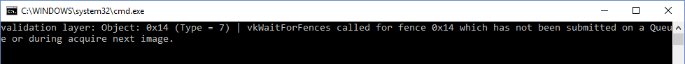

## Origin of Vulkan
*  Vulkan is designed as a cross-platform abstraction over GPUs.

##  draw the first triangle with follow step
* Create a `VkInstance`
* Select a supported graphics card (`VkPhysicalDevice`)
* Create a `VkDevic`e and `VkQueue` for drawing and presentation
* Create a window, window surface and swap chain
* Wrap the swap chain images into `VkImageView`
* Create a render pass that specifies the render targets and usage
* Create framebuffers for the render pass
* Set up the graphics pipeline
* Allocate and record a command buffer with the draw commands for every possible swap chain image
* Draw frames by acquiring images, submitting the right draw command buffer and returning the images back to the swap chain

## Setup Environment
* CMake
	* [cmakelists](_media/code/VulkanCMakeEnv.md ':include :type=code :fragment=vulkan_env')

## Building examples

### x64-windows
```bash
# clone Vulkan example
git clone --recursive https://github.com/SaschaWillems/Vulkan.git
git submodule init
git submodule update
python download_assets.py

# if forgot --recursive command
cd Vulkan
git submodule update --init --remote

# build
mkdir build
cmake ..
cmake --build . --config Release
```

## Understanding

### Vulkan: Difference between instance and device extensions?
https://stackoverflow.com/questions/53050182/vulkan-difference-between-instance-and-device-extensions#:~:text=The%20difference%20between%20instance%20extensions,used%20to%20set%20up%20devices.&text=The%20Vulkan%20device%20is%20for%20dealing%20with%20Vulkan%20rendering%20systems.

The difference between instance extensions and device extensions is the difference between instances and devices.

The Vulkan instance is the piece of code that is used to set up devices. It deals with things like enumerating VkPhysicalDevices and querying their properties, as well as the call to create VkDevices itself.

The Vulkan device is for dealing with Vulkan rendering systems.

Device extensions pertain to the behavior of a particular VkDevice object which was created with that extension activated. As such, that extension cannot describe the behavior of stuff that happens before the device is created.

External memory, for example, has obvious implications for the rendering system. So it is a device extension. However, particular VkPhysicalDevice objects have different properties that can be queried with regard to their external memory functionality. You need to be able to query these properties before you create the device, because if the device doesn't provide the properties you need, there's no point in making the device at all. Or at least, of making the device with that extension active.

But device extensions govern the behavior of a device. If you don't have a device yet because you haven't created one, because you're trying to decide whether to create one at all... what do you do?

Well, that behavior has to be an instance extension. It extends the part of Vulkan that deals with the set up for devices, not that governs the behavior of the device itself.

### Physical Devices and Logical Devices

Once we have created a Vulkan instance, we can use two objects to interact with our implementation. These objects are queues and devices. This chapter is going to focus on the two types of devices: physical and logical. A physical device is a single component in the system. It can also be multiple components working in conjunction to function like a single device. A logical device is basically our interface with the physical device.

### glfwGetWindowUserPointer & vlukan

https://discourse.glfw.org/t/what-is-a-possible-use-of-glfwgetwindowuserpointer/1294

A UserData field is a fairly common paradigm in C APIs that lets the user access contextual data from within callbacks without needing to make everything global. In essence, it lets you associate an arbitrary piece of data relevant to your program with a glfw window.

If you are trying to use glfw in a program that follows object-oriented design, for example, you can use this pointer to store the address of the instance that is handling a particular window, and forward the callbacks (which have to be static functions, because of the way the API works) to the appropriate member functions. e.g.

```c++
/* Constructor for the MyWindowHandler class */
MyWindowHandler (GLFWwindow * window) {
    ....
    glfwSetWindowUserPointer(window, reinterpret_cast<void *>(this));
}

...

/* Key event callback wrapper function */
static void key_callback (GLFWwindow * window, int key, int scancode, int action, int mods) {
    MyWindowHandler * handler = reinterpret_cast<MyWindowHandler *>(glfwGetWindowUserPointer(window));
    if (handler)
        handler->keyEvent(key, scancode, action, mods);
}
```

## Problems

* `vkWaitForFences` called for fence 0x14 which has not been submitted on a Queue or during acquire next image.

<div align=center>

</div>

That means that we're waiting for a fence that has not been submitted. The problem here is that, by default, fences are created in the unsignaled state. That means that `vkWaitForFences` will wait forever if we haven't used the fence before. To solve that, we can change the fence creation to initialize it in the signaled state as if we had rendered an initial frame that finished:


