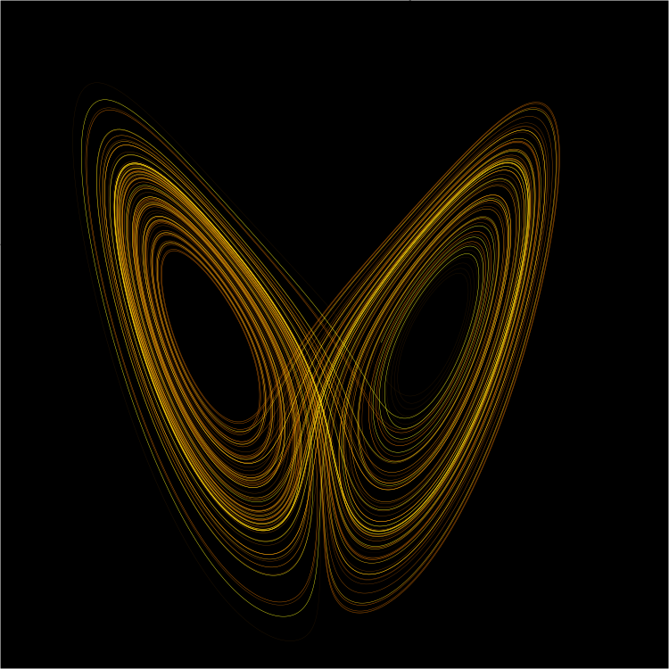

# 论
* [1] 论 https://baike.baidu.com/item/%E8%AE%BA/3748442
> 本义表示议论， 分析和说明事理，后又引申为思考，也指评论，辨析等 [1]

## 权衡理论（Trade-off Theory）
* [1] 权衡理论 https://wiki.mbalib.com/wiki/%E6%9D%83%E8%A1%A1%E7%90%86%E8%AE%BA
* [2] 税收利益 https://wiki.mbalib.com/wiki/%E7%A8%8E%E6%94%B6%E5%88%A9%E7%9B%8A
* [3] 代理成本 https://wiki.mbalib.com/wiki/%E4%BB%A3%E7%90%86%E6%88%90%E6%9C%AC
* [4] 财务困境成本 https://wiki.mbalib.com/wiki/%E8%B4%A2%E5%8A%A1%E5%9B%B0%E5%A2%83%E6%88%90%E6%9C%AC
* [5] 加权平均资本成本 https://wiki.mbalib.com/wiki/%E5%8A%A0%E6%9D%83%E5%B9%B3%E5%9D%87%E8%B5%84%E6%9C%AC%E6%88%90%E6%9C%AC
* [6] 最优资本结构 https://wiki.mbalib.com/wiki/%E6%9C%80%E4%BC%98%E8%B5%84%E6%9C%AC%E7%BB%93%E6%9E%84

> 什么是税收利益 - 税收利益是指通过节税少缴纳的税款,税收利益通常被认为是纳税人的正当受益。[2]

> 什么是代理成本 - 代理成本是指委托人为防止代理人损害自己的利益，需要通过严密的契约关系和对代理人的严格监督来限制代理人的行为，而这需要付出代价。[3]

> 财务困境成本的定义 - 无论采取何种模式来处理财务困境，都会产生相应的成本; 财务困境成本是破产成本、清偿成本等概念的延伸，从破产到财务困境、从破产成本到财务困境成本，反映了资本结构理论的发展和演变 ; 对财务困境成本的定义有两个不同的角度，一是按事后成本来定义，例如“资产重组或债务重组成本即为财务困境成本” ；一是按事前成本来定义，John Kose认为：财务困境成本是“使资产流动化的成本，包括营业收入和永续经营价值的减少，以及其他非直接成本如研发费用等” 。[4]

> 什么是加权平均资本成本 - 加权平均资本成本(Weighted Average Cost of Capital，WACC) ，是指企业以各种资本在企业全部资本中所占的比重为权数，对各种长期资金的资本成本加权平均计算出来的资本总成本。加权平均资本成本可用来确定具有平均风险投资项目所要求收益率。[5]

> 加权平均资本成本的计算 - 公式：$K_w=\sum_{j=1}^nK_j\times W_j$ 举例说明：某企业共有资金100万元，其中债券(Wb)30万元，优先股(Wp)10万元，普通股(Ws)40万元，留存收益(We)20万元，各种资金的成本分别为：6％、12％、15.5％和15％。试计算该企业加权平均资金成本。计算各种资金所占的比重:　$W_b=30\div100\times100\%=30\%$ $W_p=10\div100\times100\%=10\%$ $W_s=40\div100\times100\%=40\%$ $W_e=20\div100\times100\%=20\%$ 计算加权平均资本成本 $K_w=30\%\times6\%+10\%\times12\%+40\%\times15.5\%+20\%\times15\%=12.2\%$ [5]

> 最优资本结构的概念 - 最优资本结构是指企业在一定时期内，筹措的资本的加权平均资本成本WACC最低，使企业的价值达到最大化。它应是企业的目标资本结构（Target Capital Structure）[6]

权衡理论是企业最优资本结构就是在负债的税收利益和预期破产成本之间权衡。

权衡理论通过放宽MM理论完全信息以外的的各种假定，考虑在税收、财务困境成本、代理成本分别或共同存在的条件下，资本结构如何影响企业市场价值。它包括：

1. 负债的好处：
  * 公司所得税的抵减作用。由于债务利息和股利的支出顺序不同，世界各国税法基本上都准予利息支出作为成本税前列支，而股息则必须在税后支付。
  * 权益代理成本的减少。负债有利于企业管理者提高工作效率、减少在职消费，更为关键的是，它有利于减少企业的自由现金流量，从而减少低效或非盈利项目的投资。
2. 负债的受限：
  * 财务困境成本，包括破产威胁的直接成本、间接成本和权益的代理成本；
  * 个人税对公司税的抵消作用。

因此，现实中企业的最优资本结构是使债务资本的边际成本和边际收益相等时的比例。

## 决定论 (Determinism)

### 自由意志

不被外力强迫的情况下[1]

如果世界是决定论的，那么我们的决定是事先被决定的；如果世界是随机的，那么我们的决定只是随机事件而已。不论如何，我们都没有“自由”。[1]

自由意志是否存在？这是一个哲学问题，而不是一个科学问题。[1]

### 哲学流派

对决定论和自由意志这两个问题的看法，就分成了不同的哲学流派[1]

世界是决定论的，并且自由意志不可能存在，我们把它叫做“强决定论”（Hard Determinism）；

世界是决定论的，但是自由意志仍然可能存在的，我们把它叫做“相容论”（Compatibilism）；

世界是非决定论的，同时自由意志也可能存在的，我们把它叫做“自由论”（Libertarianism）；

世界是非决定论，而自由意志也不可能存在的，我们把它叫做“强不相容论” （Hard Incompatibilism）。

### Reference

* [1] 16、决定论、自由意志、以及逻辑怪圈 https://zhuanlan.zhihu.com/p/28535294


## 控制论 (Cybernetics)

### 概念

* 可能性空间：事物发展变化中面临的各种可能性集合[1]
* 控制的定义：人们根据自己的目的，改变条件，使事物沿着可能性空间缩小的特定方向发展。
* 负反馈调节：通过系统不断把自己的控制后果与目标作比较，使得目标差在一次一次控制中慢慢减少，最终扩大了控制能力的过程。
* 产品与运营的过程：用户调查——内容制作——投放渠道——数据反馈——调整优化，其中用到的就是负反馈调节
* 知道：知道一词的意义是：人们获得信息，对事物的可能性空间了解程度发生了变化的过程。
* 控制的结论：只有获得了足够的正的信息量，才能够有效实行控制，而控制又使可能性空间缩小，获得了正的信息量，从而进一步促进控制。[1]


### Reference

* [1] 好玩又有用的「控制论」~ https://zhuanlan.zhihu.com/p/21611758

## 还原论 (Reductionism)

还原论是一种哲学思想，认为复杂的系统、事务、现象可以通过将其化解、拆解各部分的方法来加以理解和描述，例如解剖学。[1]

### Reference
* [1] https://zh.wikipedia.org/wiki/%E8%BF%98%E5%8E%9F%E8%AE%BA
* [2] https://zhuanlan.zhihu.com/p/47034810


## 整体论 (Holism)

整全观，又称整体论（英语：Holism），主张一个系统（例如宇宙、人体等）中各部分为一有机之整，而不能割裂或分开来理解，与化约论相对。根据此一观点，分析整体时若将其视作部分的总和，或将整体化约为分离的元素，将难免疏漏[1]

对于一个体系来说，知道每一个粒子的状态（位置和速度）并且知道每两个粒子之间的相互作用对于确定一个体系来说信息是完备的了——即我们不能知道更多的有用的信息了[2]

### Reference
* [1] https://zh.wikipedia.org/zh-cn/%E6%95%B4%E5%85%A8%E8%A7%80
* [2] https://zhuanlan.zhihu.com/p/47034810

## 系统论 (System theory)

* [1] 系统论的产生及发展简介 https://zhuanlan.zhihu.com/p/46535533

> |`什么是系统论` | 系统论的基本思想方法，就是把所研究和处理的对象，当作一个**系统**，分析系统的**结构和功能，研究系统、要素、环境三者**的相互关系和变动的规律性，并优化系统观点看问题，世界上任何事物都可以看成是一个系统，系统是普遍存在的。大至渺茫的宇宙，小至微观的原子，一粒种子、一群蜜蜂、一台机器、一个工厂、一个学会团体、……都是系统，整个世界就是系统的集合[1] |
|-|-|

> |`系统论的任务` | 系统论的任务，不仅在于认识系统的特点和规律，更重要地还在于利用这些特点和规律去**控制、管理、改造或创造**一系统，使它的存在与发展**合乎人的目的需要**。也就是说，研究系统的目的在于调整系统结构，直辖市各要素关系，使系统**达到优化目标**[1] |
|-|-|

### 系统论的八大基本原理

* [1] 系统论的8大基本原理 http://www.360doc.com/content/18/0303/15/29378684_733947713.shtml

1. **系统的整体性原理**

* 系统整体性原理指的是，系统是由若干要素组成的具有一定新功能的有机整体，各个作为系统子单元的要素一旦组成系统整体，就具有独立要素所不具有的性质和功能，形成了新的系统的质的规定性，从而表现出整体的性质和功能不等于各个要素的性质和功能的简单加和。
* 分为线性与非线性，线性系统几乎为零

2. **系统层次性原理**

* 系统的层次性原理指的是，由于组成系统的诸要素的种种差异包括结合方式上的差异，从而使系统组织在地位与作用，结构与功能上表现出等级秩序性，形成了具有质的差异的系统等级，层次概念就反映这种有质的差异的不同的系统等级或系统中的高级差异性。
* 系统的层次性犹如套箱。系统是由要素组成的。
* 高层次系统是由低层次系统构成的，高层次包含着低层次，低层次属于高层次。高层次和低层次之间的关系，首先是一种整体和部分，系统和要素之间的关系。高层次作为整体制约着低层次，又具有低层次所不具有的性质。低层次构成高层次，就会受制于高层次，但却也会有自己的一定的独立性。
* 一个系统，如果没有整体性，这个系统也就崩溃了，不复存在了。相反的情形，一个系统，如果系统中的要素完全丧失了独立性，那也就变成了铁板一块了
* 系统的不同层次，往往发挥着不同层次的系统功能。一般而言，低层系统的要素之间具有较大的结合强度，而高层次系统的要素之间的结合强度则要小一些，随着层次的升高，结合强度也越来越小，这正如从客观世界最一般物质层次所表现的那样。要素之间结合强度较大的系统，具有更大的确定性，反之，要素之间结合强度较小的系统，则具有较大的灵活性。

3. **系统开放性原理**

* 系统的开放性原理指的是：系统具有不断地与外界环境进行物质、能量、信息交换的性质和功能，系统向环境开放是系统得以向上发展的前提，也是系统得以稳定存在的条件。
* 现实的世界中，现实的系统都是开放系统。系统总是处于与环境的相互联系和相互作用之中，通过系统与环境的交换，潜在的可能性就有可能转化为现实性，转化为现实的东西。于是，通过开方，内因与外因发生相互作用，相互转化，引起系统发生质量互变。
* 由于系统的层次性，系统的开放可以是向内（系统自己的内部）与向外（环境）的开放，系统向高层开放，便得系统可以与环境发生相互作用，可以发生与环境之间的既竞争又合作。而系统向低层开放，使得系统内部可能发生多层次的，多水平的，在差异之中协同作用，更好地发挥系统的整体性功能。这就是完全开放

4. **系统的目的性原理**

* 系统目的性原理指的是，组织系统在与环境的相互作用中，在一定的范围内，其发展变化不受或少受条件变化或途径经历的影响，坚持表现出某种趋向预先确定的状态的特性。
* 控制论的创立者们，从系统的行为角度分析了系统的复杂行为。把行为这样的概念变成了一个**科学概念**。维纳等人的一个重要结论就是：“一切有目的的行为都可以看作需要负反馈的行为。”因此，按照控制论的观点，目的行为也就成了受到负反馈控制的行为的同义语。这样。`“目的”概念就变成了一个科学概念，从原来似乎只适用于生物界得以延拓，用来描述一般非生物系统类似人所具有的目的性行为。`系统的目的性，在系统的发展变化之中表现出来，因此就必定是与系统的开放性相联系的。也就是说，一个合目的运动的系统，必定是一个**开放系统**。由于系统是开放的，通过系统与环境的物质，能量和信息的交换，使得系统受到环境的影响，从而该系统得以影响环境，并在一定意义上识别环境即针对环境的实际情况作出反应、作出调整、作出选择，使自己潜在的发展能力得以表现出来。这样一来，系统对于环境的输入必须作出反应，而且又要把自己的对于环境的反应输出给环境，从而影响环境。进而系统又要对于受到影响后发生了改变的环境的输入作出新的反应，于是，在这种周而复始的开放、交换之中，系统的潜在的发展能力得以表现，所谓**目的性**也就表现于其中了。
* 其**目的性**是它是由系统内部的复杂的反馈机制发挥作用的结果
* 环境向系统的一定输入必定引起系统向环境的一定输出，即一定的原因必定引起一定的结果。简单的线性系统就是这样的**因果系统**。
* **目的系统**则是系统与环境之间存在着复杂的非线性相互作用的系统。这种复杂的非线性相互作用表现为系统的复杂的反馈机制的建立。结果，在相当大的范围内造成环境向系统进行不同的输入时，系统能够通过自己的反馈调节基本相同的输出，使系统仍保持不变的发展方向。在这样的意义上，系统之所以具有**目的性**，其根本原因在于系统内部以及系统与环境的复杂的非线性相互作用。系统的目的性表现出系统发展方向的确定性方面。由于自组织系统自保持、自调节自稳定，因而系统的发展就表现出某种**确定不移的方向**。
* 这种**确定性**与**机械决定论的决定性或确定性**是有着`原则性的区别`的，机械论的决定论，一旦安装始条件给定了，一切也就完全地决定了。原因一定，结果也就一定，由一定的原因就可以推出一定的结果。而由系统的内在非线性相互作用所带来的发展变化的确定性则与此不同。在一定的发展阶段，在一定的范围之内，无论环境条件怎样改变，系统总是要朝着某种确定的方向发展，异因同果，具有等终结性。

5. **系统突变性原理**

* 系统突变性原理指的是，系统通过失稳，从一种状态进入另一种状态是一种突变过程，它是系统质变的一种基本形式，突变方式多种多样，同时系统发展还存在着分叉，从而有了质变的多样性，带来系统发展的丰富多彩。
* 系统状态发生改变，在系统科学中也称为“相变”，这是系统的**质变**。相变有**平衡相变**和**非平衡相变之分**。平衡相变形成的新结构是一种死结构。（如结晶），而非平衡相变形成的结构只能在开放系统条件下依靠物质和能量的耗散来维持其稳定性，即在演化发展中维持其稳定性，是一种活结构。
* 系统中要素的平衡是相对的，不平衡才是绝对的。系统中要素的突变总是时常发生的，**突变**成为系统中的发展过程中的**非平衡性因素**，是稳定之中的不稳定，同一之中出现的差异。当这种差异得到系统中其他子系统即要素的响应时，使子系统之间的差异进一步扩大，便加大了系统内的非平衡性。而特别是当它得到整个系统的响应时，涨落放大，整体系统一起地动起来，系统发生**质变**，进入新的状态。这就是自组织理论的一个重要结论：**通过涨落达到有序**。

6. **系统稳定性原理**

* 系统稳定性原理指的是，在外界作用下开放系统具有一定的自我稳定能力，能够有一定范围内自我调节，从而保持和恢复原来的有序状态，保持和恢复原有的结构和功能。
* 系统的稳定性是系统在发展和演化之中的稳定性。系统的稳定性，首先是一种**开放中的稳定性**。开放是系统发展变化的前提，也是“活”系统得以保持系统稳定的前提。这同时也意味着系统的稳定性都是动态中的稳定性。**耗散结构理论**之所以把自己叫做耗散结构，就是强调系统的稳定性是在与环境的动态的交换之中才得以保持的。
* 维纳与坎农的助手罗森勃吕特发现了“负反馈”调节机制的重要作用。一个组织系统之所以具有受到干扰后能够迅速排除偏差，恢复到正常的稳定状态，其关键在于其中的**负反馈机制**
* 任何时候，任何条件下，系统之中总是存在**涨落**的，这就已经表明系统的稳定性总是不完全的，总是在稳定之中存在着不稳定的。事实上，很多时候，即使系统在整体上是稳定的，系统之中也可能存在局部的不稳定性。而且，正是因为系统中存在不稳定的因素，这种最初是个别的，局部的不稳定的因素，在一定条件下得以放大，超出了系统在原先条件下保持自身稳定的条件，系统保持自身稳定的能力遭到破坏，才使得系统整体上**失稳**，从而进入新的稳定态。由此看来，系统中的不稳定因素，反而成为系统演化发展的积极因素。

7. **系统自组织原理

* 系统的自组织原理指的是，开放系统在系统内外两方面因素的复杂非线性相互作用下，内部要素的某些偏离系统稳定状态的涨落可能得以放大，从而在系统中产生更大范围的更强烈的长程相关，自发组织起来，使系统从无序到有序，从低级有序到高级有序。
* 20世纪60-70年代兴起的`耗散结构理论，协同学、超循环理论、突变论、混沌学和分形学`则是以系统的发生、发展为重点，探讨了系统的**自组织演化**问题。**耗散结构**对于理解系统演化的前提条件有基本的重要性。**协同学**阐述了子系统之间的竞争和协同推动系统从无序到有序的演化，**超循环论**指出相互作用构成循环，提出了循环等级学说，从低级循环到高级循环，不同的循环层次与一定的发展水平相联系，揭示了系统的自组织演化发展采取了循环发展形式。**突变论与系统自组织演化的相变理论**密切联系在一起，揭示原因连续的作用有可能导致结果的突然变化，揭示出相变的方式和途径、相变的多样性。对**混沌**和**分形**的研究，使得我们对于系统自组织的复杂性、系统自组织发展的整个过程有了更深刻的理解。
* **充分开放**是**系统自组织演化**的前提条件，**非线性相互作用**是自组织系统演化的内在动力，**涨落**成为系统自组织演化的原初诱因，**循环**是系统自组织演化的组织形式，**相变**和**分形**体现了系统自组织演化方式的多样性，**混沌**和**分形**揭示了从简单到复杂的系统自组织演化的图景。
* **组织**这一概念，通常可以作为名词来使用，也可以作为动词来使用。在作为名词来使用时，指的是**系统内部的相互联系及其表现**。如果说，系统内的相互作用是系统组织的内容方面，那么，系统组织的形式方面就体现为系统的结构形式和系统内要素之间和联系方式。
* **自组织**表示系统的运动是自发地，不受特定外来干预地进行的，其自发运动是以系统内部的矛盾为根据，以系统的环境为条件的系统内部以及系统与环境的交叉作用的结果。
* **系统的被组织**。与系统的自组织恰恰相反表示的是系统的运动和形成组织结构是在外来特定的干预下进行的，主要是受外界指令的结果，在极端的情况下，就完全是按外界指令进行运动，进行组织。当然系统的自组织与他组织也是相对的，对于一个系统内部的子系统而言，子系统的运动和组织总是受到特定的制约，不可能有完全自由的自发运动和自组织，勿宁说是他组织的。
* 传统思维把系统中的**涨落**仅仅看作某种不利于系统稳定存在的因素，系统的自组织理论中，涨落则被赋予了新的意义，而并非全然消极的东西。**通过涨落达到有序**，这是系统自组织理论中的一个重要的基本结论。
* **涨落**本来是不稳定因素，但在一定条件下也可以变为建设性因素，诱发系统的自组织过程。

8. **系统相似性原理**

* 系统的相似性原理指的是，系统具有同构和同态的性质，体现在系统的结构和功能，存在方式和演化过程具有共同性，这是一种有差异的共性，是系统统一性的一种表现。
* 系统具有相似性，最根本原因在于**世界的物质统一性**。
* 系统的**相似性**，不仅仅是指`系统存在方式的相似性`，也指`系统演化方式的相似性`。系统结构的相似性，几何的，相对静止的相似性，体现的是**系统存在方式上的相似性**。而系统的过程的相似性，运动节律的、显著变动之中的相似性，体现的就是**系统演化的相似性**。
* 系统演化的全过程——大圆圈，也体现从混沌到有序，再从有序到混沌的相似性。系统演化的每一相对完整的阶段——小圆圈，从一种有序到另一种有序的发展，也表现相似性。系统理论追求系统的一般性，相似性也体现着一般性，用贝塔朗菲的话来说，`要发现种种系统研究中的共性`。
* 系统的一般性是不能代替系统的特殊性的。系统之间的差异是绝对的，而相似是有条件的。相似性可以不仅仅是任何结构意义上的可见的相似性，也可以是功能的，无形的意义上的非实体的相似性。系统规律的相似性，思维活动的相似性和关系的相似性等，都是后一种意义上的相似性。

## 信息论 (Information theory)

* [1] 信息论 https://www.jiqizhixin.com/graph/technologies/ef8e251c-d9c4-4eab-b4c6-327cdca79737
* [2] 信息论 https://wiki.mbalib.com/wiki/%E4%BF%A1%E6%81%AF%E8%AE%BA
* [3] 信息论入门教程 http://www.ruanyifeng.com/blog/2019/08/information-theory.html
* [4] Information Theory (PDF) https://www.cs.cmu.edu/~roni/10601-slides/info-theory-x4.pdf
* [5] Visual Information Theory https://colah.github.io/posts/2015-09-Visual-Information/
  
信息论是在信息可以量度的基础上，研究有效地和可靠地传递信息的科学，它涉及信息量度、信息特性、信息传输速率、信道容量、干扰对信息传输的影响等方面的知识。通常把上述范围的信息论称为狭义的信息论，又因为它的创始人是香农，故又称为香农信息论。[1]

广义信息论则包含通信的全部统计问题的研究，除了香农信息论之外，还包括信号设计、噪声理论、信号的检测与估值等。当信息在传输、存储和处理的过程中，不可避免地要受到噪声或其它无用信号的干扰，信息理论就是为能可靠地有效地从数据中提取信息，提供必要的数据和方法。[1]

信息论是运用概率论与数理统计的方法研究信息传输和信息处理系统中一般规律的新兴学科。核心问题是信息传输的有效性和可靠性以及两者间的关系。[2]

### 信息论的应用 [2]

* 编码学
* 密码学与密码分析学
* 数据传输
* 数据压缩
* 检测理论
* 估计理论
* 信息论第一定律：信息守恒定律 

### 信息论入门教程 [3]

#### 词汇的编码
```python
狗 00
猫 01
鱼 10
鸟 11
# 第一封信"狗猫鱼鸟"的编码是00011011，第二封信"鱼猫鸟狗"的编码是10011100
```

#### 词汇的分布
```python
# >>> 
# 例如 - 狗狗狗狗猫猫鱼鸟
狗：50%
猫：25%
鱼：12.5%
鸟：12.5%
0000000001011011

# >>>
# "狗"的出现次数最多，给它分配更短的编码，就能减少总的长度
狗 0
猫 10
鱼 110
鸟 111
# 使用新的编码方式，编码如下
00001010110111
# 这时只需要14个二进制位，相当于把原来的编码压缩了12.5%。
# 根据新的编码，每个词只需要1.75个二进制位（14 / 8）
```

#### 编码方式的唯一性
```python
# 前一节的编码方式，狗的编码是0，这里的问题是，可以把这个编码改成1吗，即下面的编码可行吗？
狗 1
猫 10
鱼 110
鸟 111
# 回答是否定的。如果狗的编码是1，会造成无法解码，即解码结果不唯一。110有可能是"狗猫"，也可能是"鱼"。只有"狗"为0，才不会造成歧义。
# 下面是数学证明。一个二进制位有两种可能0和1，如果某个事件有多于两种的结果（比如本例是四种可能），就只能让0或1其中一个拥有特殊含义，另一个必须空出来，保证能够唯一解码。比如，0表示狗，1就必须空出来，不能有特殊含义。
# 同理，两个二进制位可以表示四种可能：00、01、10和11。上例中，0开头的编码不能用了，只剩下10和11可用，用10表示猫，为了表示"鱼"和"鸟"，必须将11空出来，使用三个二进制位表示。
```

#### 编码与概率的关系
* 结论：概率越大，所需要的二进制位越少。

```python
# 狗的概率是50%，表示每两个词汇里面，就有一个是狗，因此单独分配给它1个二进制位。
# 猫的概率是25%，分配给它两个二进制位。
# 鱼和鸟的概率是12.5%，分配给它们三个二进制位。
```

* Formula
  $$
  L(x) = \log_2(\frac{1}{p(x)})
  $$

> L表示所需要的二进制位，p(x)表示发生的概率

* 通过上面的公式，可以计算出某种概率的结果所需要的二进制位。举例来说，"鱼"的概率是0.125，它的倒数为8， 以 2 为底的对数就是3，表示需要3个二进制位

* 知道了每种概率对应的编码长度，就可以计算出一种概率分布的平均编码长度

  $$
  H(p) = \sum_x p(x) \log_2(\frac{1}{p(x)})
  $$

> 上面公式的`H`，就是该种概率分布的平均编码长度。理论上，这也是最优编码长度，不可能获得比它更短的编码了。

* "狗猫鱼鸟"是均匀分布,每个词平均需要2个二进制位。

```python
H = 0.25 x 2 + 0.25 x 2 + 0.25 x 2 + 0.25 x 2
= 2
```

* "狗猫鱼鸟"不是均匀分布,每个词平均需要1.75个二进制位。

```python
H = 0.5 x 1 + 0.25 x 2 + 0.125 x 3 + 0.125 x 3
= 1.75
```

* 既然每个词是 1.75 个二进制位，"狗狗狗狗猫猫鱼鸟"这8个词的句子，总共需要14个二进制位（8 x 1.75）

#### 信息与压缩

* 不均匀分布时，某个词出现的概率越高，编码长度就会越短。

* 从信息的角度看，如果信息内容存在大量冗余，重复内容越多，可以压缩的余地就越大。日常生活的经验也是如此，一篇文章翻来覆去都是讲同样的内容，摘要就会很短。反倒是，每句话意思都不一样的文章，很难提炼出摘要。图片也是如此，单调的图片有好的压缩效果，细节丰富的图片很难压缩。

* 由于信息量的多少与概率分布相关，所以在信息论里面，信息被定义成不确定性的相关概念：`概率分布越分散，不确定性越高，信息量越大；反之，信息量越小`。

#### 信息熵

* 前面公式里的`H`（平均编码长度），其实就是信息量的度量。H越大，表示需要的二进制位越多，即可能发生的结果越多，不确定性越高。

* 比如，`H`为1，表示只需要一个二进制位，就能表示所有可能性，那就只可能有两种结果。如果H为6，六个二进制位表示有64种可能性，不确定性大大提高。

* 信息论借鉴了物理学，将H称为"信息熵"（information entropy）。`在物理学里，熵表示无序，越无序的状态，熵越高`。

#### 信息量的实例
* 如果一个人的词汇量为10万，意味着每个词有10万种可能，均匀分布时，每个词需要 16.61 个二进制位。
* `log₂(100, 000) = 16.61`
* 一篇1000个词的文章，需要 1.6 万个二进制位（约为 2KB）。
* `16.61 x 1000 = 16,610`
* 相比之下，一张 480 x 640、16级灰度的图片，需要123万个二进制位（约为 150KB）。
* `480 x 640 x log₂(16) = 1,228,800`

一幅图片所能传递的信息远远超过文字

现实生活中，一般都是不均匀分布，因此文章或图片的实际文件大小都是可以大大压缩的

## 耗散结构论 (Dissipative structure theory)

* [1] 耗散结构论 https://baike.baidu.com/item/%E8%80%97%E6%95%A3%E7%BB%93%E6%9E%84%E8%AE%BA

耗散结构论可概括为：一个远离平衡态的非线性的开放系统（不管是物理的、化学的、生物的乃至社会的、经济的系统）通过不断地与外界交换物质和能量，在系统内部某个参量的变化达到一定的阈值时，通过涨落，系统可能发生突变即非平衡相变，由原来的混沌无序状态转变为一种在时间上、空间上或功能上的有序状态。这种在远离平衡的非线性区形成的新的稳定的宏观有序结构，由于需要不断与外界交换物质或能量才能维持，因此称之为“耗散结构”（dissipative structure）。[1]

## 协同论 (Synergetics)

* [1] 协同论 https://baike.baidu.com/item/%E5%8D%8F%E5%90%8C%E8%AE%BA

协同论主要研究远离平衡态的开放系统在与外界有物质或能量交换的情况下，如何通过自己内部协同作用，自发地出现时间、空间和功能上的有序结构。

## 突变论 (Catastrophe Theory)

* [1] 突变理论 https://wiki.mbalib.com/wiki/%E7%AA%81%E5%8F%98%E7%90%86%E8%AE%BA

突变论的诞生，以法国数学家勒内·托姆勒内·托姆（Renethom1923—）于1972年发表的《结构稳定性和形态发生学》一书的问世作为标志。

突变理论研究的是从一种稳定组态跃迁到另一种稳定组态的现象和规律。它指出自然界或人类社会中任何一种运动状态，都有稳定态和非稳定态之分。在微小的偶然扰动因素作用下，仍然能够保持原来状态的是稳定态；而一旦受到微扰就迅速离开原来状态的则是非稳定态，稳定态与非稳定态相互交错。非线性系统从某一个稳定态（平衡态）到另一个稳定态的转化，是以突变形式发生的

尽管突变理论是一门数学理论， 它的核心思想却有助于我们理解系统变化和系统中断。 如果系统处于休止状态（也就是说，没有发生变化），它就会趋于获得一种理想的稳定状态，或者说至少处在某种定义的状态范围内。 如果系统受到外界变化力量作用，系统起初将试图通过反作用来吸收外界压力。 如果可能的话，系统随之将恢复原先的理想状态。 如果变化力量过于强大，而不可能被完全吸收的话，突变（Catastrophic Change）就会发生，系统随之进入另一种新的稳定状态，或另一种状态范围。 在这一过程中，系统不可能通过连续性的方式回到原来的稳定状态。

试举一例，更为形象地解释这一理论。 让我们假想有一只玻璃瓶放在桌面上， 它处在一个稳定的状态，没有任何变化，此为稳定平衡（Stable Equilibrium）。 现在假想用你的手指轻推瓶颈，不要太用力。 这时变化产生，玻璃瓶晃动起来，它在通过一种连续性的方式来吸收变化， 此为不稳定平衡（Unstable Equilibrium）。 如果你停止推力，玻璃瓶将恢复到它的理想稳定状态。 然而，如果你继续用力推下去，在你的推力达到一定程度的时候，玻璃瓶便会倒下， 由此又进入了一种新的稳定平衡状态。 玻璃瓶的状态在这一瞬间就发生了突变， 一个非连续性的变化就这样产生了： 在玻璃瓶下跌的过程中，没有任何可能的稳定中间状态，直到它完全倒伏在桌面上为止。

## 相对论 (Theory of relativity)
* [1] 相对论 https://zh.wikipedia.org/zh-cn/%E7%9B%B8%E5%AF%B9%E8%AE%BA
* [2] 通俗的解释一下狭义相对论和广义相对论 https://zhuanlan.zhihu.com/p/37408500

相对论（英语：Theory of relativity）是关于时空和引力的理论[1]

* **相对论是对牛顿力学的一个修正**[2]
* **牛顿力学是相对论力学在速度远小于光速时候的一个特例**[2]

* 广义相对论 - 等效原理
  * 局部引力场中自由下落的参考系与无引力场的惯性系不可区分。
* 广义相对论
  * 用等效原理可以把带引力的非惯性系转化成不含引力的惯性系，凡是有引力的地方我都给它加一个自由降落的参考系将引力消除，然后剩下的事情用狭义相对论处理

## 模糊理论 (Fuzzy Logic）

* [1] 模糊理论 https://wiki.mbalib.com/wiki/%E6%A8%A1%E7%B3%8A%E7%90%86%E8%AE%BA

### 模糊的基本概念
概念是思维的基本形式之一，它反映了客观事物的本质特征。人类在认识过程中，把感觉到的事物的共同特点抽象出来加以概括，这就形成了概念。比如从白雪、白马、白纸等事物中抽象出“白”的概念。一个概念有它的内涵和外延，内涵是指该概念所反映的事物本质属性的总和，也就是概念的内容。外延是指一个概念所确指的对象的范围。例如“人”这个概念的内涵是指能制造工具，并使用工具进行劳动的动物，外延是指古今中外一切的人。

所谓模糊概念是指这个概念的外延具有不确定性，或者说它的外延是不清晰的，是模糊的。例如“青年”这个概念，它的内涵我们是清楚的，但是它的外延，即什么样的年龄阶段内的人是青年，恐怕就很难说情楚，因为在“年轻”和“不年轻”之间没有一个确定的边界，这就是一个模糊概念。

需要注意的几点：首先，人们在认识模糊性时，是允许有主观性的，也就是说每个人对模糊事物的界限不完全一样，承认一定的主观性是认识模糊性的一个特点。例如，我们让100个人说出“年轻人”的年龄范围，那么我们将得到100个不同的答案。尽管如此，当我们用模糊统计的方法进行分析时，年轻人的年龄界限分布又具有一定的规律性；

其次，模糊性是精确性的对立面，但不能消极地理解模糊性代表的是落后的生产力，恰恰相反，我们在处理客观事物时，经常借助于模糊性。例如，在一个有许多人的房间里，找一位“年老的高个子男人”，这是不难办到的。这里所说的“年老”、“高个子”都是模糊概念，然而我们只要将这些模糊概念经过头脑的分析判断，很快就可以在人群中找到此人。如果我们要求用计算机查询，那么就要把所有人的年龄，身高的具体数据输入计算机，然后我们才可以从人群中找这样的人。

### 与随机性的混淆

人们对模糊性的认识往往同随机性混淆起来，其实它们之间有着根本的区别。随机性是其本身具有明确的含义，只是由于发生的条件不充分，而使得在条件与事件之间不能出现确定的因果关系，从而事件的出现与否表现出一种不确定性。而事物的模糊性是指我们要处理的事物的概念本身就是模糊的，即一个对象是否符合这个概念难以确定，也就是由于概念外延模糊而带来的不确定性。

## 机械论 (Mechanism) - 近代形而上学唯物主义 (Modern metaphysical materialism) - 机械唯物主义（Mechanistic Materialism)
* [1] 机械唯物主义 https://zh.wikipedia.org/wiki/%E6%9C%BA%E6%A2%B0%E5%94%AF%E7%89%A9%E4%B8%BB%E4%B9%89


机械唯物主义（Mechanistic Materialism，亦称形而上学唯物主义、机械唯物论）是一个马克思主义哲学专有名词。马克思主义理论家认为机械唯物主义是以自然科学为基础，使用机械力学和形而上学的观点解释世界的唯物主义学说。

## 目的论 (teleology)
* [1] 【哲学秘籍】什么是目的论？ https://zhuanlan.zhihu.com/p/69029450
* [2] 目的论 https://baike.baidu.com/item/%E7%9B%AE%E7%9A%84%E8%AE%BA

目的论（英语：Teleology）属于哲学的范畴，致力于探讨事物产生的目的、本源和其归宿[2]

目的设立了一切，但它并不意味着一切都已经注定，相反，它意味着一切都有待被设定，万事万物可以通过自己的努力来获得属于自己的telos，实现自己的潜能。[1]

关于这个telos，宇宙的终极目的的争论，最早出现在古希腊哲学家德谟克里特和伊比鸠鲁那里。德谟克里特支持必然性和秩序；伊比鸠鲁支持任意性和自由。亚里士多德给这两老哥进行了调和，提出了telos的概念，终极目的[1]

这个终极目的telos是埋伏在未来的原因，一种从本体论上讲不可能，从认识论上讲非理性的东西。它预先移动到了尚未发生的未来，穿越了时空，吸引着当下的事物往那个方向去发展，它就是万事万物向着未来开放、不断生成的那种自由的力量。有了telos的事物，才是活的事物，有了目的，能够设定自己未来方向的人类，才是活人。[1]

**所以作为teleology的目的论，表明的是，宇宙和万物的目的不是预先设立的，被既有的宇宙、秩序、事物所限定好的，恰恰相反，目的论反过来，从一个宇宙论上尚未敞开、本体论上尚未发生、认识论上尚未被体验到的未来，从这个超出整个系统框架的未来，向发生在这里的一切指明了方向，目的不是被设立的，相反，目的设立了一切，但它并不意味着一切都已经注定，相反，它意味着一切都有待被设定，万事万物可以通过自己的努力来获得属于自己的telos，实现自己的潜能。**

总结：目的论不等于决定论、宿命论。目的论是超出本体论和认识论的把握的，它代表的是事物的生成和发展的自由力量。目的论试图把握的是处于未来的、尚不清晰的终极原因，这个原因是从当下的必然性和偶然性之间的博弈当中生成的。目的论的价值不在于为僵死的秩序或无度的自由辩护，而在于为两者守护一条向未来敞开的道路，你们再怎么撕，总要有一定的意义和价值，这个意义和价值现在看不清楚，但是在遥远的未来，一定会有个清楚的交代。目的论守护的是自由和秩序所共享的超越性的维度。[1]

## 集合论 (set theory)
* [1] 集合论 https://baike.baidu.com/item/%E9%9B%86%E5%90%88%E8%AE%BA/494533

* 意义: 是整个现代数学的基础 [1]

集合论或集论是研究集合（由一堆抽象物件构成的整体）的数学理论，包含了集合、元素和成员关系等最基本的数学概念。[1]

## 偶然论 (fortuitism) (tychism)
* [1] 偶然论 https://baike.baidu.com/item/%E5%81%B6%E7%84%B6%E8%AE%BA
* [2] 偶然论 https://mall.cnki.net/Reference/ref_readerItem.aspx?bid=R201109334&recid=R2011093340000381

偶然论认为世界上的万事万物，乃至人生的一切，都是偶然而没有规律可循的。

在美国皮尔斯的哲学中，指宇宙论中的一种理论。认为宇宙的原始状态是一种纯粹的非决定性或偶然状态，其中没有事物的区别，没有习惯、没有规律，一切由偶然性(机会)统治着。这种偶然性是一种自发性、自由和创造性。随着宇宙的进化，偶然性的数量将会减少，但不会消失。[2]

## 超循环理论 (Supercirculation theory/HyPercycle theory)
* [1] 超循环理论 https://wiki.mbalib.com/wiki/%E8%B6%85%E5%BE%AA%E7%8E%AF%E7%90%86%E8%AE%BA

超循环理论是关于非平衡态系统的自组织现象的理论。由德国科学家M.艾肯(Manfred Eigen)在20世纪70年代直接从生物领域的研究中提出。在生命现象中包含许多由酶的催化作用所推动的各种循环，而基层的循环又组成了更高层次的循环，即超循环，还可组成再高层次的超循环。超循环系统即经循环联系把自催化或自复制单元连接起来的系统。在此系统中，每一个复制单元既能指导自己的复制，又能对下一个中间物的产生提供催化帮助。

## 测度论 (measure theory)
* [1] 测度论 https://baike.baidu.com/item/%E6%B5%8B%E5%BA%A6%E8%AE%BA/918407

测度论是研究一般集合上的测度和积分的理论。它是勒贝格测度和勒贝格积分理论的进一步抽象和发展，又称为抽象测度论或抽象积分论，是现代分析数学中重要工具之一。 测度理论是实变函数论的基础。定义: 测度理论是实变函数论的基础。所谓测度，通俗的讲就是测量几何区域的尺度。 我们知道直线上的闭区间的测度就是通常的线段长度； 平面上一个闭圆盘的测度就是它的面积[1]

## 博弈论 (Game Theory)

* [1] 博弈论 https://zh.wikipedia.org/wiki/%E5%8D%9A%E5%BC%88%E8%AE%BA

博弈论考虑游戏中的个体的预测行为和实际行为，并研究它们的优化策略。表面上不同的相互作用可能表现出相似的激励结构（incentive structure），所以它们是同一个游戏的特例。其中一个有名有趣的应用例子是囚徒困境。

具有竞争或对抗性质的行为称为博弈行为。在这类行为中，参加斗争或竞争的各方各自具有不同的目标或利益。为了达到各自的目标和利益，各方必须考虑对手的各种可能的行动方案，并力图选取对自己最为有利或最为合理的方案。比如日常生活中的下棋，打牌等。博弈论就是研究博弈行为中斗争各方是否存在着最合理的行为方案，以及如何找到这个合理的行为方案的数学理论和方法。

## 自组织理论 (Self-organizing Theory)
* [1] 自组织理论 https://baike.baidu.com/item/%E8%87%AA%E7%BB%84%E7%BB%87%E7%90%86%E8%AE%BA
* [2] 自组织理论 https://wiki.mbalib.com/wiki/%E8%87%AA%E7%BB%84%E7%BB%87%E7%90%86%E8%AE%BA

自组织理论是关于在没有外部指令条件下，系统内部各子系统之间能自行按照某种规则形成一定的结构或功能的自组织现象的一种理论。 该理论主要研究系统怎样从混沌无序的初态向稳定有序的终态的演化过程和规律。[1]

一般来说，组织是指系统内的有序结构或这种有序结构的形成过程。德国理论物理学家H.Haken认为，从组织的进化形式来看，可以把它分为两类：他组织和自组织。如果一个系统靠外部指令而形成组织，就是他组织；如果不存在外部指令，系统按照相互默契的某种规则，各尽其责而又协调地自动地形成有序结构，就是自组织。自组织现象无论在自然界还是在人类社会中都普遍存在。一个系统自组织功能愈强，其保持和产生新功能的能力也就愈强。例如，人类社会比动物界自组织能力强，人类社会比动物界的功能就高级多了。[2]

## 分形理论 (Fractal Theory)
* [1] 分形理论 https://wiki.mbalib.com/wiki/%E5%88%86%E5%BD%A2%E7%90%86%E8%AE%BA

* 分形理论概述
  * 分形理论是当今世界十分风靡和活跃的新理论、新学科。分形的概念是美籍数学家曼德布罗特(B.B.Mandelbort)首先提出的。1967年他在美国权威的《科学》杂志上发表了题为《英国的海岸线有多长?》的著名论文。
  * 分形理论既是非线性科学的前沿和重要分支，又是一门新兴的横断学科。作为一种方法论和认识论，其启示是多方面的：一是分形整体与局部形态的相似，启发人们通过认识部分来认识整体，从有限中认识无限；二是分形揭示了介于整体与部分、有序与无序、复杂与简单之间的新形态、新秩序；三是分形从一特定层面揭示了世界普遍联系和统一的图景。[1]

* 分形理论的意义
  * 分形理论及其分形方法论的提出有着极其重要的科学方法论意义。它打破了整体与部分、混乱与规则、有序与无序、简单与复杂、有限与无限、连续与间断之间的隔膜，找到了它们之间相互过渡的媒介和桥梁(即部分和整体之间的相似性)，为人们从混沌与无序中认识规律和有序、从部分中认知整体和从整体中认识部分，从有限中认识无限和通过无限深化和认识有限等提供了可能和根据；它同系统论、自组织理论、混沌理论等研究复杂性的科学理论一起，共同揭示了整体与部分、混沌与规则、有序与无序、简单与复杂、有限与无限、连续与间隔之间多层面、多视角、多维度的联系方式，使人们对它们之间关系的认识的思维方式由线性阶段进展到了非线性阶段。[1]

## 混沌理论 (Chaos theory)
* [1] 混沌理论 https://zh.wikipedia.org/zh-hans/%E6%B7%B7%E6%B2%8C%E7%90%86%E8%AE%BA
* [2] 混沌理论 https://wiki.mbalib.com/wiki/%E6%B7%B7%E6%B2%8C%E7%90%86%E8%AE%BA

<div align=center>

</div>

> 数值r = 28，σ = 10，b = 8/3的洛伦茨吸引子图形

混沌理论（Chaos theory）是关于非线性系统在一定参数条件下展现分岔、周期运动与非周期运动相互纠缠，以至于通向某种非周期有序运动的理论。在耗散系统和保守系统中，混沌运动有不同表现，前者有吸引子，后者无（也称含混吸引子）。[1]

定义: 混沌理论是一种兼具质性思考与量化分析的方法，用以探讨动态系统中无法用单一的数据关系，而必须用整体，连续的数据关系才能加以解释及预测之行为。[1]

### 吸引子（Attractor）
* 吸引子是微积分和系统科学论中的一个概念。一个系统有朝某个稳态发展的趋势，这个稳态就叫做吸引子。[1]

### 什么是混沌理论
* 混沌理论的主导思想是，宇宙本身处于混沌状态，在其中某一部分中似乎并无关联的事件间的冲突，会给宇宙的另一部分造成不可预测的后果。
* 这意味着，系统具有放大作用。一个微小的运动经过系统的放大，最终影响会远远超过该运动的本身。所以，当有人说，因为英国的一只蝴蝶扇了一下翅膀，中国可能会遭受一场台风时，他的观点里就包含着混沌理论的思想。[2]

### 混沌理论的发展背景
* 混沌理论是对不规则而又无法预测的现象及其过程的分析。一个混沌过程是一个确定性过程，但它看起来是无序的、随机的。像许多其他知识一样，混沌和混沌行为的研究产生于数学和纯科学领域，之后被经济学和金融学引用。  [2]

## 相变理论 (phase transformation theory)
* [1] https://baike.baidu.com/item/%E7%9B%B8%E5%8F%98%E7%90%86%E8%AE%BA

解释物质的各种相变现象的理论。相变有时是突变（如固液相变），有时也可以是比较平稳的变化（如一定温度以上的气液相变），在二者之间的临界点会发生很多反常的现象，如比热无限增大等，称为临界现象，是相变理论研究的重要课题之一。只要足够地加热，液体就会变成气体，也就是从液相转变为气相。

## 方法论 (methodology)
* [1] 方法论 https://baike.baidu.com/item/%E6%96%B9%E6%B3%95%E8%AE%BA

方法论，就是关于人们认识世界、改造世界的方法的理论。 它是人们用什么样的方式、方法来观察事物和处理问题。 概括地说，世界观主要说明世界“是什么”的问题，方法论主要说明“怎么办”的问题。 方法论是一种以解决问题为目标的理论体系或系统，通常涉及对问题阶段、任务、工具、方法技巧的论述。[1]

## 范畴论 (category theory)
* [1] 范畴论 https://baike.baidu.com/item/%E8%8C%83%E7%95%B4%E8%AE%BA
* [2] 范畴论 https://zh.wikipedia.org/wiki/%E8%8C%83%E7%95%B4%E8%AE%BA

范畴论是抽象地处理数学结构以及结构之间联系的一门数学理论，以抽象的方法来处理数学概念，将这些概念形式化成一组组的“物件”及“态射”。范畴论出现在很多数学分支中，以及理论计算机科学和数学物理的一些领域。[1]

范畴论是数学的一门学科，以抽象的方法处理数学概念，将这些概念形式化成一组组的“物件”及“态射”。数学中许多重要的领域可以形式化为范畴。使用范畴论可以令这些领域中许多难理解、难捉摸的数学结论更容易叙述证明。[2]

## 概率论 (Probability Theory)
* [1] 概率论 https://zh.wikipedia.org/wiki/%E6%A6%82%E7%8E%87%E8%AE%BA
* [2] 看见统计 https://seeing-theory.brown.edu/compound-probability/cn.html


概率论（英语：Probability theory）是集中研究概率及随机现象的数学分支，是研究随机性或不确定性等现象的数学。

## 宇宙论（cosmology）
* [1] 【哲学秘籍】宇宙论是什么？ https://zhuanlan.zhihu.com/p/68565218

宇宙论（cosmology）是哲学的基本论域之一，或许是最基本的。[1]

cosmology来自于古希腊的Kosmos，意为“秩序、好的秩序、有序地安排”。这种安排、布置的很和谐的意义，后来还引申为女士裙子上的装饰点缀。毕达哥拉斯最早用kosmos这个词来指代缀满星星的天穹，这个星空就仿佛是用宝石点缀的女士裙子，于是所有人都获得了绅士视角。中世纪哲学和近代哲学，用cosmology来指代研究这个整个世界、宇宙的学问，大抵被算作形而上学的一个分支。

我们要把宇宙论当作比形而上学更为根本的东西，形而上学研究一切的存在和非存在，以及它们的关系、根据、形成的原因和活动的影响；宇宙论比形而上学更为基础的地方在于，**它研究这一切背后的那些秩序，以及容纳这些秩序的场域**。[1]

## 本体论（ontology）
* [1]【哲学秘籍】本体论是什么？ https://zhuanlan.zhihu.com/p/68584772

本体论（ontology）是哲学的第二个基本论域，某种意义上它定义了何为“基本”、“根据”。

**现象背后的成因，基础性的本体。那个看不见摸不着的生成性的机制，那个没法用感官去把握，只能用理性和逻辑去推断的抽象过程，就是本体论研究的东西。**

亚里士多德的本体论那里有11种本体/存在, 作为背后老板的是第一本体，它是看不见摸不着的玩意，必须通过另外10种作为小弟的本体，也就是范畴，来抬轿子把它老人家从本体领域抬出来，抬到现象领域，才能被人类所察觉和把握到。

下面第一行罗列了亚里士多德心中的11个本体（1个老本体加10个小弟范畴），

就用苏格拉底举个例子：

第一本体 第二本体 量 质 联系 地点 时间 姿势 状态 主动 被动

苏格拉底 人 70岁 白色 躺床上 雅典 前399年 小横陈 濒死 喝药 悼念

## 认识论（epistemology）
* [1] 【哲学秘籍】认识论是什么？ https://zhuanlan.zhihu.com/p/68726372

哲学的第三个基本论域是认识论（epistemology），从笛卡尔开启的近代哲学一直到康德，认识论堪称哲学最重要的分支。

简而言之，认识论，**就是承认我们自己没法接触到现象背后那个真实的维度，就是要保留这个真实的维度于未知，而通过理性和道德，去把握我们有限的现象层面的生存，去在动荡和不安中通过彼此的信任来获得宝贵的确定性。**

老实讲，本体论是非常聪明的智者才能够思考的，并且一定会为任何进展付出巨大的代价，因为你僭取了上帝的目光；而认识论，则是每一个追求幸福的普通人都应当学习的，它教导我们拒绝开透视、全图、作弊器的诱惑，而全身心投入地打好每一把匹配

## 逼近理论 (approximation theory)
* [1] 逼近理论 https://baike.baidu.com/item/%E9%80%BC%E8%BF%91%E7%90%86%E8%AE%BA/12735027
* [2] 逼近理论 https://zh.wikipedia.org/zh-cn/%E9%80%BC%E8%BF%91%E7%90%86%E8%AE%BA
* [3] M. J. D. Powell. Approximation Theory and Methods. Cambridge University Press. 1981: p.3. ISBN 0521295149.

* 数学中的逼近理论是如何将一函数用较简单的函数来找到最佳逼近，且所产生的误差可以有量化的表征，以上提及的“最佳”及“较简单”的实际意义都会随着应用而不同; 数学中有一个相关性很高的主题，是用广义傅立叶级数进行函数逼近，也就是用以正交多项式为基础的级数来进行逼近; 计算机科学中有一个问题和逼近理论有关，就是在数学函式库中如何用计算机或计算器可以执行的功能（例如乘法和加法）尽可能的逼近某一数学函数[3]，一般会用多项式或有理函数（二多项式的商）来进行; 逼近理论的目标是尽可能地逼近实际的函数，一般精度会接近电脑浮点运算的精度，一般会用高次的多项式，以及（或者）缩小多项式逼近函数的区间。缩小区间可以针对要逼近的函数，利用许多不同的系数及增益来达到。现在的数学函式库会将区间划分为许多的小区间，每个区间搭配一个次数不高的多项式。[2]

# 主义
* [1] 主义 https://zh.wikipedia.org/zh/%E4%B8%BB%E4%B9%89
> 代表理念或有完整體系的思想和信念，也可视为实现不同目标的不同方法[1]

## 辩证唯物主义
* [1] 辩证唯物主义 https://wiki.mbalib.com/wiki/%E8%BE%A9%E8%AF%81%E5%94%AF%E7%89%A9%E4%B8%BB%E4%B9%89


辩证唯物主义（即现代唯物主义）是卡尔·马克思、弗里德里希·恩格斯批判地吸取德国古典哲学--黑格尔的辩证法的‘合理内核’和路德维希·安德列斯·费尔巴哈机械唯物论的‘基本内核’，在总结自然科学、社会科学和思维科学的基础上创立的一套系统科学的逻辑理论思维形式。

## 自由主义
* [1] 自由主义 https://baike.baidu.com/item/%E8%87%AA%E7%94%B1%E4%B8%BB%E4%B9%89/1587

自由主义是一种意识形态和哲学，是以自由为主要政治价值的一系列思想流派的集合。

其特色为追求发展、相信人类善良本性、以及拥护个人自治权。更广泛地，自由主义追求保护个人思想自由的社会、以法律限制政府对权力的运用、保障自由贸易的观念、支持私人企业的市场经济、以及透明地保障每一个公民的权利。

## 民粹主义
* [1] 民粹主义 维基百科，自由的百科全书 https://zh.wikipedia.org/wiki/%E6%B0%91%E7%B2%B9%E4%B8%BB%E7%BE%A9

* 民粹主义（英语：populism），又译平民主义、大众主义、人民主义、公民主义，**意指平民论者所拥护的政治与经济理念**，是社会科学语汇中最没有精确定义的名词之一，也可以被当成是一种政治哲学或是政治语言[1]

* 民粹主义通常是**精英主义的反义词**。在古希腊城邦发明民主制度之后，对于应由精英、贵族还是一般大众来掌握政治，出现了争论。支持民粹主义者则诉求直接民主与基层民主，认为政治精英（当下或未来）只追求自身利益，腐化且不可相信，希望**由人民直接决定政治事务**[1]

## 共产主义
* [1] 共产主义 维基百科，自由的百科全书 https://zh.wikipedia.org/wiki/%E5%85%B1%E4%BA%A7%E4%B8%BB%E4%B9%89

* 共产主义（英语：communism；拉丁语：communismus）是一种共享经济结合集体主义的政治思想，主张**消灭生产资料私有制**，并建立一个**各尽所能、各取所需**的生产资料**公有制**，进行集体生产，以阶级斗争建立无阶级的社会。在此一体系下，土地和资本财产为人民共同所有，而且货币和国家都得到了废除[1]

## 社会主义
* [1] 社会主义 https://zh.wikipedia.org/wiki/%E7%A4%BE%E4%BC%9A%E4%B8%BB%E4%B9%89
* [2] 社会主义 https://baike.baidu.com/item/%E7%A4%BE%E4%BC%9A%E4%B8%BB%E4%B9%89/296

根据马克思对社会发展的预言，人类社会的发展，在资本主义社会极大发展、生产力空前提高之后，工人阶级（无产阶级）通过暴力革命获得政权，从而实现生产资料的公有制。 这样的社会形态被称为社会主义。[1]

社会主义（socialism）是一种社会学思想，诞生于16世纪初，主张整个社会应作为整体，由社会拥有和控制产品、资本、土地、资产等，其管理和分配基于公众利益。19世纪30至40年代，“社会主义”的概念在西欧广为流传，发展出不同分支[2]

## 古典自由主义
* [1] 古典自由主义 https://baike.baidu.com/item/%E5%8F%A4%E5%85%B8%E8%87%AA%E7%94%B1%E4%B8%BB%E4%B9%89/6488752

古典自由主义（Classical liberalism）发源于17世纪和18世纪，经济学上的投入产出原则，认为一国的真正财富不是金银总量的增加，而是其国民创造的商品服务的数量。是一种支持个人先于国家存在的政治哲学，强调个人的权利、私有财产，并主张自由放任的经济政策，认为政府存在的目的仅在于保护每个个体的自由。

# 学科
* [1] GBT 13745-2008 学科分类与代码 2.1 学科 discipline
> 相对独立的知识体系。[1]

## 运筹学
*https://baike.baidu.com/item/%E8%BF%90%E7%AD%B9%E5%AD%A6/1559*

运筹学，是现代管理学的一门重要专业基础课。它是20世纪30年代初发展起来的一门新兴学科，其主要目的是在决策时为管理人员提供科学依据，是实现有效管理、正确决策和现代化管理的重要方法之一。该学科应用于数学和形式科学的跨领域研究，利用统计学、数学模型和算法等方法，去寻找复杂问题中的最佳或近似最佳的解答。
运筹学经常用于解决现实生活中的复杂问题，特别是改善或优化现有系统的效率。 研究运筹学的基础知识包括实分析、矩阵论、随机过程、离散数学和算法基础等。而在应用方面，多与仓储、物流、算法等领域相关。因此运筹学与应用数学、工业工程、计算机科学、经济管理等专业相关

## 统计学
*https://baike.baidu.com/item/%E7%BB%9F%E8%AE%A1%E5%AD%A6/1175*

统计学是通过搜索、整理、分析、描述数据等手段，以达到推断所测对象的本质，甚至预测对象未来的一门综合性科学。统计学用到了大量的数学及其它学科的专业知识，其应用范围几乎覆盖了社会科学和自然科学的各个领域

* Resources:
  * esl.hohoweiya.xyz
  * https://zhuanlan.zhihu.com/p/97255323
  * https://www.zhihu.com/question/56710930

## 心理学
*https://baike.baidu.com/item/%E5%BF%83%E7%90%86%E5%AD%A6/6215*

心理学是一门研究人类心理现象及其影响下的精神功能和行为活动的科学，兼顾突出的理论性和应用（实践）性。
心理学包括基础心理学与应用心理学，其研究涉及知觉、认知、情绪、思维、人格、行为习惯、人际关系、社会关系，人工智能，IQ，性格等许多领域，也与日常生活的许多领域——家庭、教育、健康、社会等发生关联。心理学一方面尝试用大脑运作来解释个体基本的行为与心理机能，同时，心理学也尝试解释个体心理机能在社会行为与社会动力中的角色；另外，它还与神经科学、医学、哲学、生物学、宗教学等学科有关，因为这些学科所探讨的生理或心理作用会影响个体的心智。实际上，很多人文和自然学科都与心理学有关，人类心理活动其本身就与人类生存环境密不可分。
心理学家从事基础研究的目的是描述、解释、预测和影响行为。应用心理学家还有第五个目的——提高人类生活的质量。这些目标构成了心理学事业的基础

## 经济学
*https://baike.baidu.com/item/%E7%BB%8F%E6%B5%8E%E5%AD%A6/589379*

经济学是研究人类社会在各个发展阶段上的各种经济活动和各种相应的经济关系及其运行、发展的规律的学科。经济学核心思想是物质稀缺性和有效利用资源，可分为两大主要分支，微观经济学和宏观经济学。

## 计算机科学
*https://zh.wikipedia.org/wiki/%E8%AE%A1%E7%AE%97%E6%9C%BA%E7%A7%91%E5%AD%A6*

计算机科学（英語：computer science，有时缩写为CS）是系统性研究信息与计算的理论基础以及它们在计算机系统中如何实现与应用的实用技术的学科。[1] [2]它通常被形容为对那些创造、描述以及转换信息的算法处理的系统研究。计算机科学包含很多分支领域；有些强调特定结果的计算，比如计算机图形学；而有些是探討计算问题的性质，比如计算复杂性理论；还有一些领域專注于怎样实现计算，比如程式語言理論是研究描述计算的方法，而程式设计是应用特定的程式語言解决特定的计算问题，人机交互则是專注于怎样使计算机和计算变得有用、好用，以及随时随地为人所用。

## 空间科学
*https://baike.baidu.com/item/%E7%A9%BA%E9%97%B4%E7%A7%91%E5%AD%A6*

空间科学（space science）指利用航天器研究空间（空间是与时间相对的一种物质客观 存在形式，由长度、宽度、高度、大小表现出来。）即发生在日地空间、行星际空间及至整个宇宙空间的物理、天文、化学及生命等自然现象及其规律的科学。空间科学以航天技术为基础，包括空间飞行、空间探测和空间开发等几个方面。它不仅能揭示宇宙奥秘，而且也给人类带来巨大的利益。

## 博弈论
*https://baike.baidu.com/item/%E5%8D%9A%E5%BC%88%E8%AE%BA/81545*

博弈论，又称为对策论（Game Theory）、赛局理论等，既是现代数学的一个新分支，也是运筹学的一个重要学科。

博弈论主要研究公式化了的激励结构间的相互作用，是研究具有斗争或竞争性质现象的数学理论和方法。 博弈论考虑游戏中的个体的预测行为和实际行为，并研究它们的优化策略。生物学家使用博弈理论来理解和预测进化论的某些结果。

博弈论已经成为经济学的标准分析工具之一。在金融学、证券学、生物学、经济学、国际关系、计算机科学、政治学、军事战略和其他很多学科都有广泛的应用

## 数学

### 数理逻辑
* [1] 数理逻辑 https://zh.wikipedia.org/wiki/%E6%95%B0%E7%90%86%E9%80%BB%E8%BE%91

数理逻辑（英语：Mathematical logic）是数学的一个分支，其研究对象是对证明和计算这两个直观概念进行符号化以后的形式系统。数理逻辑是数学基础的一个不可缺少的组成部分。

数理逻辑的研究范围是逻辑中可被数学模式化的部分。以前称为符号逻辑（相对于哲学逻辑），又称元数学，后者的使用现已局限于证明论的某些方面。

### 数论
* [1] 数论 https://baike.baidu.com/item/%E6%95%B0%E8%AE%BA/3700
* [2] 数论 https://zh.wikipedia.org/zh-cn/%E6%95%B0%E8%AE%BA

数论是纯粹数学的分支之一，主要研究整数的性质。 整数可以是方程式的解（丢番图方程）。 有些解析函数（像黎曼`ζ`函数）中包括了一些整数、质数的性质，透过这些函数也可以了解一些数论的问题。 透过数论也可以建立实数和有理数之间的关系，并且用有理数来逼近实数（丢番图逼近）。[1]

数论是纯粹数学的分支之一，主要研究整数的性质。被誉为“最纯”的数学领域。[2]

### 非标准分析
* [1] 非标准分析 https://zh.wikipedia.org/wiki/%E9%9D%9E%E6%A0%87%E5%87%86%E5%88%86%E6%9E%90

非标准分析（概念上又可称为实无限分析）(英语：Non-standard analysis)是一个数学分支，它用严格定义的无限小的数（infinitesimal number）的概念来构建分析学。


### 动力系统
* [1] 动力系统 https://zh.wikipedia.org/wiki/%E5%8A%A8%E5%8A%9B%E7%B3%BB%E7%BB%9F

动力系统（dynamical system）是数学上的一个概念。 动力系统是一种固定的规则，它描述一个给定空间（如某个物理系统的状态空间）中所有点随时间的变化情况。 例如描述钟摆晃动、管道中水的流动，或者湖中每年春季鱼类的数量，凡此等等的数学模型都是动力系统。

### 泛函分析
* [1] 泛函分析 https://zh.wikipedia.org/wiki/%E6%B3%9B%E5%87%BD%E5%88%86%E6%9E%90

泛函分析（英语：Functional Analysis）是现代数学分析的一个分支，隶属于分析学，其研究的主要对象是函数构成的函数空间。泛函分析历史根源是由对函数空间的研究和对函数的变换（如傅立叶变换等）的性质的研究。这种观点被证明是对微分方程和积分方程的研究中特别有用。

### 组合数学
* [1] 组合数学 https://www.zhihu.com/topic/19620869/hot

组合数学（Combinatorics）是纯数学的一个分支，主要研究离散、有限或可数的数学结构。 除了纯数学，组合数学在应用数学、理论物理、计算机科学等分支也有着很多应用。 在计算机科学中，组合数学又被称作“离散数学”。

## 电动力学
* [1] 电动力学（电磁学释义）_百度百科 https://baike.baidu.com/item/%E7%94%B5%E5%8A%A8%E5%8A%9B%E5%AD%A6/1413229#

电动力学（electrodynamics） 电磁现象的经典的动力学理论。 通常也称为经典电动力学，电动力学是它的简称。 它研究**电磁场的基本属性、运动规律以及电磁场和带电物质的相互作用**。它比电磁学研讨的问题立足点更高，应用到的数学基础更艰深，理论性更强，论述也更深入和普遍。[1]

## 量子力学
* [1] 量子力学（物理学理论）_百度百科 https://baike.baidu.com/item/%E9%87%8F%E5%AD%90%E5%8A%9B%E5%AD%A6/131692#

量子力学（Quantum Mechanics），为物理学理论，是研究**物质世界微观粒子运动规律**的物理学分支，主要研究原子、分子、凝聚态物质，以及原子核和基本粒子的结构、性质的基础理论。 它与相对论一起构成现代物理学的理论基础。 量子力学不仅是现代物理学的基础理论之一，而且在化学等学科和许多近代技术中得到广泛应用[1]