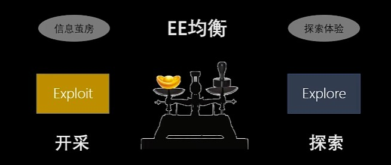

# Difference

## 学科与专业的区别
* [1] 学科与专业的区别 https://www.sohu.com/a/280323721_100163476

一般情况下，我们所说的学科是指是指学术的分类，也就是一定科学领域或一门科学的专业分支，如自然科学中的物理学、生物学，社会科学中的历史学、教育学等。根据我国国家标准G/TI3735-92对学科的定义，我们可以这样来解释：`学科是相对独立的知识体系`。

学科有特定的研究对象和领域，也有自身的理论体系，还有其独特的研究方法；而专业则是由培养目标、课程体系、培养目标等构成。通俗来讲，学科更侧重于科学研究，`专业更侧重于人才培养`。

## 学术与学科的区别
* [1] 学术与学科的区别 https://zhidao.baidu.com/question/89809843.html?fr=qrl&cid=196&index=4

* 学术
  * 学术是指系统专门的学问，是对存在物及其规律的学科化论证，泛指高等教育和研究。当代人学家张荣寰将学术的概念界定为是对存在物及其规律的学科化论证。这个词对应的英文Academia更常见的意义是指进行高等教育和研究的科学与文化群体，在作这个意义用时对应于中文的学术界或学府。Academia这个词来自于地名(Akademeia)。这个地方位于古代雅典的外围。那里的体育馆曾由于被柏拉图改为学习中心而闻名。
  * 延伸开来，Academia这个词也可以用来指“知识的累积”，在这个意义上通常译为学术。学术的发展和传播跨越了好几个时代。在17世纪，英国及法国的宗教学者常用学院（或学园）来表示高等教育机构。英语称呼为academy而法语称呼为academe及academie
* 学科
  * 学术的分类。指一定科学领域或一门科学的分支。如自然科学中的化学、物理学；社会科学中的法学、社会学等。
  * “教学科目”的简称，也称“科目”。教学中按逻辑程序组织的一定知识和技能范围的单位。如中小学的数学、物理、语文、音乐等；高等学校心理学系的普通心理学、儿童心理学、教育心理学等。

## 经济学与金融学有什么区别？
* *https://www.zhihu.com/question/19743130*

经济学通常被归为社会科学，主要着眼于研究宏观上的生产、消费、以及商品、服务及资源的分配问题。同时，经济学也会研究政府的税收政策、货币政策以及其他管制政策对于宏观经济以及微观企业、市场参与者的影响与作用；研究市场的供给与需求问题。这些经济学领域的问题往往与微观市场参与者（包括企业、个人等）的金融决策（比如融资、投资等）紧密相连。

金融学虽然通常意义上属于商学，但其依旧具有社会科学的属性。它则侧重于研究及分析金融市场，以及具体的在金融市场上交易的金融资产的定价问题以及公司金融的运作和治理问题。金融资产的合理定价涉及到合理度量资产及现金流的风险问题，而这些又与宏观经济环境与政策息息相关。

## 自然科学与社会科学有什么区别

一般说来，自然科学研究的对象是宇宙，包括宇宙运行的规律，自然万物的规律，如何应用这些规律，比如物理，化学，工程，材料学。社会科学研究的对象是人类的行为，比如心理学，教育学，组织管理学，经济学等。以前学术界普遍认为自然科学偏重实验性，社会科学偏向描述性。但是随着社会科学的发展，实验性也必不可少（定性+定量+案例分析）。[1]

* [1] https://www.zhihu.com/question/39360398/answer/553061541

## 准则与原则
* *https://zhidao.baidu.com/question/60749731.html*
  
原则,一项工作客观上必然存在一定的基本指导思想,它在理论上的概括,就称为原则。 原则,不是具体的工作方法和程序,但又必须贯穿于各个问题当中；而准则是基于原则的基础上，详细的对某一内容的具体标准和概括

## 检查，审查和审计的区别
* *http://www.cnitpm.com/pm/5878.html*

* 检查Inspection偏重对“可交付成果”的检查和测量
* 审查Review偏重对“工作绩效信息”的测量、审查
* 审计Audit偏重有没有按定好的规则执行

## 如何区分公理、定义、定理、命题、引理等概念？
* *https://www.zhihu.com/question/26098407/answer/523947154*
  
1. 定义: 精确和清晰地描述数学术语的含义.
2. 公理: 没有经过证明, 但被当作不证自明的一个命题. 因此, 其真实性被视为是理所当然的, 且被当做演绎及推论其它(理论相关)事实的起点
3. 定理: 是经过受逻辑限制的证明为真的陈述. 一般来说, 在数学中, 只有重要或有趣的陈述才叫定理. 证明定理是数学的中心活动. 
4. 引理: 是数学中为了取得某个更好的结论而作为步骤被证明的命题, 其意义并不在于自身被证明, 而在于为达成最终目的作出贡献. 
5. 推论: 指能够"简单明了地"从前述命题推出的论断, 推论往往在定理后出现. 如果命题B能够被简单明了的从命题A推导出, 则称B为A的推论.
6. 命题: 命题是一个可以判断真或假的陈述句, 亦有既真又假的命题(悖论).猜想: 是相信为真但未被证明的数学叙述, 当它经过证明后便是定理. 
7. 猜想是定理的来源, 但并非唯一来源. 一个从其他定理引伸出来的数学叙述可以不经过成为猜想的过程, 成为定理.
8. 假说: 根据已知的科学事实和科学原理, 对所研究的自然现象及其规律性提出的推测和说明.

## 计划与策划
* *https://zhidao.baidu.com/question/20342925*

1. 含义不同。
* 计划：工作或行动以前预先拟定的具体内容和步骤 ，如科研计划、五年计划。
* 策划：有谋略的计划 ，如幕后策划，舞台策划。

2. 细节不同
* 策划是事先谋划，所以侧重于目标和较为粗略的实施方案，其通过决策后要进行细化才能组织、控制实施行为；
* 计划即是策划的细化。

3. 方向不同
* 策划一般在决策之前，是决策的依据和前提。因此，它强调价值、科学和竞争，即首先要创意出有价值的目标和谋划出科学可行的方案，这些目标和方案都应是最优的，应该在竞争中展现自己的优势并获得决策通过。
* 计划一般在决策之后，是决策的细化和实现决策的保证。因此，它强调具体、明确和控制，即重在围绕决策目标和优先方案对工作进行分解、对资源进行细致安排，这些分解和部署都应是明确的，以便在实现过程中进行控制和评估。

# Metacognition

# Cognition

## 信息系统集成

### 什么是信息系统集成
* *https://baike.baidu.com/item/%E4%BF%A1%E6%81%AF%E7%B3%BB%E7%BB%9F%E9%9B%86%E6%88%90*

* **信息**指人所感知的各种情况细节。**系统**是相互关联的事、物的总体。**集成**即把集合中的事物总成起来。信息系统集成即是把相互关联的信息、信息系统的集合总成起来。信息系统集成既可指软件，又可指硬件

## 大数据杀熟背后，是价格歧视套路

价格歧视又称为价格差异化，是商家为获取更多消费者剩余而采取的定价方式,大数据杀熟，其实是现代环境下第一类价格歧视的一种体现

第一类价格歧视，也被称为完全的价格歧视。它指的是对每一个消费者都收取不同的价格。脱离大数据外，私人律师、会计以及医生，在完全了解客户的情况下，具备这种一级价格歧视的定价能力。一些从事私人高端定制的职业也属于这一范畴。

把顾客分类，让愿意出高价的人用高价买，愿意出低价的人用低价买，卖家提供多少产品就能卖出多少产品，既不会浪费，也不会供不应求，这样可以找到最佳的平衡点

价格歧视是一种中性的定价策略，也称为价格差异化，而大数据杀熟，是价格歧视中的一种。即便我们没有被大数据杀熟，在日常生活中也会经常碰到价格歧视

https://zhuanlan.zhihu.com/p/47995710

## 利率与债券
* 为什么利率上升，债券价格下降
  * *https://www.zhihu.com/question/20276427*

## 语言的本质
> https://www.zhihu.com/question/30533696

* 语言，从本质上，从定义上来说就是符号推演系统，符号指代物理存在, 也就是语言学等价于符号学。
* 无论是中文、英文、数学符号、乐谱、 计算机编程语言还是手语，本质上都属于这个定义下的符号系统。
* 所以语言学研究的不局限于什么词源、词根、词缀、方言，而是符号系统下的结构，核心三要素：语素、语法和语义。

> https://www.jianshu.com/p/1089dd5ce589
* 语言的本质是交流
* 外国人祖先，先创造了名词和少数的动词。然后才产生了形容词。让形容词来修饰名词。让形容词加上`-ly`变成，所谓的副词来修饰动词。介词不过是某一个或几个的动词的省略形态而已。如:`at`是`act`的缩略形态。提醒我们后面的，所接名词，是行动的开始。`at table`就是在餐桌前行动。所以理解为"就餐"。
* 明白了这一点，即有利于我们记忆单词时"化繁为简，追溯本源"。例如:`experience`经历。这个名词里面，一定还包含更简单的名词。`ex`-向外。`peri`-时期。源于`period`.`pe`-向前。`riod`源于road道路。抽象化而已。与riot相似。
* 明白了这一点，又有利于，掌握文章结构，复述一段文字，不至于颠三倒四。例如:`There are many simple wonderful experience readily accessible to us every day,which can be pleasurable and fulfilling.`其中`readily`肯定不是`read`加后缀。我知道字母组合，`ab`表示开始，`ac`表示持续，`ad`表示完成。所以`adi`一定有一个名词存在。果然，`adios`表示再见。与`re`再一次，结合。表示乐意地。`cess`字母本义是长时间持续。运气之意。加上后缀-`ible`，能够的。后缀-`able`的变形。还是美好之意。整个句意，还是说明"经历"的特点。
* 明白了这一点，这个"这一点"便是今天的结论:语言的本质是说明人，物，事。无他耳。

## 市场经济的弊端

为什么人类不能掌控生产力？就是因为私有制，生产资料，生产力掌控在私人手里，他们为利润而生产，什么利润高就生产什么。如果有300%的利润，他们就可以践踏人间一切法律。一定不能给生产力自由，生产力只能发展，不能解放，不能想生产什么就生产什么，什么利润高就生产什么。生产力一被解放，祸害立马就到。牛越大越好，但是缰绳也应该越拴越牢。生产力越大，失去掌控之后，它的破坏力也越大。人类要掌控生产力，让生产力老老实实为人类服务，就必须把生产资料公有，不让私人掌控生产力，而让人类共同掌控生产力，消灭为利润而生产的目的，让生产力按照大众共同的意志生产。这是唯一的办法。

贫富悬殊，阶级矛盾激化，阻碍生产力发展，惊人的浪费，为了金钱而不是为了人类

https://www.zhihu.com/question/53109589

## 宏观经济政策

“宏观经济政策”（macroeconomic policy）是指国家或政府有意识有计划地运用一定的政策工具，调节控制宏观经济的运行，以达到一定的政策目标。 宏观调控是公共财政的基本职责，所谓公共财政，指的是为弥补市场失效、向社会提供公共服务的政府分配行为或其它形式的经济行为

https://baike.baidu.com/item/%E5%AE%8F%E8%A7%82%E7%BB%8F%E6%B5%8E%E6%94%BF%E7%AD%96/10588891

## 博弈论-理论
* [1] 零和博弈- 维基百科，自由的百科全书 https://zh.wikipedia.org/wiki/%E9%9B%B6%E5%92%8C%E5%8D%9A%E5%BC%88

https://www.youtube.com/watch?v=BUn88WTmcOU

### 零和博弈

零和博弈（英语：zero-sum game），又称零和游戏或零和赛局，与非零和博弈相对，是博弈论的一个概念，属非合作博弈。 零和博弈表示所有博弈方的利益之和为零或一个常数，即一方有所得，其他方必有所失。 在零和博弈中，博弈各方是不合作的。[1]

## 检查悖论

https://www.youtube.com/watch?v=iDXj9UqtsIM

当一个人进入人群进行所谓科学随机的检查抽查时，他以为他得到了科学客观的结论，其实他没有考虑到自己的介入导致结果的不正确性

https://www.jdon.com/50598

## 民主
民主（希腊语：δημοκρατία，转写：dìmokratía）（又称民主制、民主主义，旧译为德谟克拉西、德先生），原意指人民的权力，是政体的一种形式，当中人民拥有平等参与公共政策的参与权.

现代民主包括四个关键要素：（1）透过自由和公正的选举产生政府；（2）作为公民积极参与政治和公民生活；（3）保护所有公民的人权；（4）法律和程序同样适用于所有公民

https://zh.wikipedia.org/zh-cn/%E6%B0%91%E4%B8%BB

## 信仰
* *https://zh.wikipedia.org/wiki/%E4%BF%A1%E4%BB%B0*

* 信仰（英语：Faith），拉丁语作 fides and 旧法语作 feid, 是对一位人，一个物，一件事，或者是一种概念的坚信不疑和置信

## 横向比较，纵向比较

**横向比较**（黑色点）对  空间  上同时并存的事物的既定形态进行比较，即黑色点的对比。（在时间和空间的某一点“横向的"划一道黑色实线，进行”同一时间纬度” 上不同空间上事物的对比，即对比“我”和“你”和“他” 所在的红色虚线的黑色实线“上下”的不同）

**纵向比较**（绿色点）是单个事物与过去或未来某个时间的状态进行比较。即绿色点的对比。（在时间和空间的某一点“纵向的"划一道红色虚线，进行”同一空间纬度” 上不同时间上事物的对比，即对比“我”自己或者“你对象” 所在的黑色虚线的红色实线“左右”的不同）

举例：

* 你今天吃了1个包子-----你今天吃了5个包子----你明天想吃50个包子           
* 她今天吃了5个包子-----她今天吃了9个包子----她明天想吃90个包子
* 纵向比较（绿色点）：你自我对比昨天和今天和明天吃的包子（对比明天意义不大）；
* 横向比较（黑色点）：你跟她对比今天谁吃的多

https://www.zhihu.com/question/39001504

## 72法则
* *https://zh.wikipedia.org/wiki/72%E6%B3%95%E5%89%878

金融学上有所谓72法则、71法则、70法则和69.3法则，用作估计将投资倍增或减半所需的时间，反映出的是复利的结果。

计算所需时间时，把与所应用的法则相应的数字，除以预料增长率即可。例如：

假设最初投资金额为100元，复息年利率9%，利用“72法则”，将72除以9（增长率），得8，即需约8年时间，投资金额滚存至200元（两倍于100元），而准确需时为8.0432年。
要估计货币的购买力减半所需时间，可把与所应用的法则相应的数字，除以通胀率。若通胀率为3.5%，应用“70法则”，每单位之货币的购买力减半的时间约为70/3.5=20年。

## 人际反应特质

https://wiki.mbalib.com/wiki/%E4%BA%BA%E9%99%85%E5%8F%8D%E5%BA%94%E7%89%B9%E8%B4%A8

## 关系场效应

在角色群体的活动效率中，既可能产生增力作用，也可能导致减力作用。 “三个臭皮匠，凑成一个诸葛亮”，这种情况下“1+1+1"大于3。这在群体成员活动的效率角度上，称之为“群体的增力作用”。 “三个和尚没水喝”，这种情况下的“1+1+1”却等于0了。这在群体成员活动的效率角度上，称之为“群体的减力作用”。这种由不同的角色扮演者组成的群体产生的内聚力或摩擦力，在社会心理学上，统称为“关系场效应”

https://baike.baidu.com/item/%E5%85%B3%E7%B3%BB%E5%9C%BA%E6%95%88%E5%BA%94

## 能动性 (哲学)

在哲学中，能动性（英语：Agency）是对外界或内部的刺激或影响作出的反应或回答。

* 人的能动性

在唯物辩证法，人的积极的、有选择的能动性与无机物、有机生命体、高等动物的能动性有别，称为主观能动性。其特点是通过思维与实践的结合，主动地、自觉地、有目的地、有计划地反作用于外部世界。

主观能动性亦称“自觉能动性”，指人的主观意识和实践活动对于客观世界的反作用或能动作用。主观能动性有两方面的含义： 一是人们能动地认识客观世界；二是在认识的指导下能动地改造客观世界。在实践的基础上使二者统一起来，即表现出人区别于物的主观能动性。

https://zh.wikipedia.org/zh-cn/%E8%83%BD%E5%8A%A8%E6%80%A7_(%E5%93%B2%E5%AD%A6)

## 马尔萨斯人口陷阱
马尔萨斯人口陷阱是英国经济学家马尔萨斯研究人口增长与经济发展之间的关系的理论。马尔萨斯人口陷阱是说人口增长是按照几何级数增长的，而生存资料仅仅是按照算术级数增长的，多增加的人口总是要以某种方式被消灭掉，人口不能超出相应的农业发展水平。

https://wiki.mbalib.com/wiki/%E9%A9%AC%E5%B0%94%E8%90%A8%E6%96%AF%E4%BA%BA%E5%8F%A3%E9%99%B7%E9%98%B1

## 内卷

* 内卷并不一定降低生活水平。内卷的关键不在于有竞争，而在于“向内演化”，是精细化，是低水平的复杂。内耗是危机，内卷却是一种无声的悲哀。陷入内卷的人很可能乐在其中，都不觉得那是悲哀
* 举例: 微雕。正常的画家都是用正常尺寸的纸笔作画，不管是写意还是写实，你欣赏的是画作*内容*的风格和意义 —— 而微雕，却是形式的艺术。今天你能在鼻烟壶上写首诗，明天我就要在核桃上刻一艘船，后天他就能在头发丝上写一篇文章，完了大家都得拿放大镜看……这是自己跟自己较劲。精细真是越来越精细，但是你这里只有时间花费和意志力消耗，没有创造力，你这是低水平的复杂
* 格尔茨直接借鉴了戈登威泽的概念，他总结内卷就是「某文化达到某最终形态后，无法自我稳定，也无法转变为新的形态，只能使自己在内部更加复杂化。」
* 内耗是迫在眉睫的危机，内卷是更长期的忧患。内卷给我们的教训是复杂不等于高级，更不等于先进
* 不论是内卷还是内耗，真正的解决办法都是创新

https://zhuanlan.zhihu.com/p/250474212

* 你不努力，你坠落更快；可是大家努力，大家坠落得更快
* 内卷，给人一种恐慌的感觉，大家在恐惧的驱使下，竭尽所能争夺资源，可是资源有限，大家越是争夺，资源损坏越大，甚至无序的竞争会带来毁灭性结局

https://www.zhihu.com/question/346195467

## 熵增定律
* 物理定义：熵增过程是一个自发的由有序向无序发展的过程(Bortz, 1986;Roth, 1993)
* 热力学定义：熵增加，系统的总能量不变，但其中可用部分减少。
* 统计学定义：熵衡量系统的无序性。熵越高的系统就越难精确描述其微观状态。

https://www.jianshu.com/p/b49ccfcb9447

* 物理定义：熵增过程是一个自发的由有序向无序发展的过程(Bortz,1986;Roth,1993)。热力学定义：熵增加，系统的总能量不变，但其中可用部分减少。统计学定义：熵衡量系统的无序性。熵越高的系统就越难精确描述其微观状态。早在1947年薛定鄂就曾高瞻远瞩地指出了熵增过程也必然体现在生命体系之中(Schrodinger1947)。人体是一个巨大的化学反应库，生命的代谢过程建立在生物化学反应的基础上。从某种角度来讲，生命的意义就在于具有抵抗自身熵增的能力，即具有熵减的能力。在人体的生命化学活动中，自发和非自发过程同时存在，相互依存，因为熵增的必然性，生命体不断地由有序走回无序，最终不可逆地走向老化死亡。

* 人活着就是在对抗熵增定律，生命以负熵为生。——薛定谔
* 熵增定律---解释宇宙的终极演化规律（包括生命与非生命的规律）
* 熵增定律：在一个孤立系统里，如果没有外力作用，其总混乱度（即熵）会不断增大，就是熵不断增加的过程。
* 任何一个系统，只要满足封闭系统，而且无外力维持，它就会趋向于混乱和无序。
* 生命的熵增规律包括与个人和与群体的关系 - 与个人，比如自律总是比懒散痛苦，放弃总是比坚持轻松，变坏总是比变好容易。少有人能做到自我管理，大多数人作息不规律，饮食不规律，学习不规律
* 如何对抗熵增，实现超越：
  * 从定义来说，熵增的条件有两个：封闭系统加无外力做功。只要打破这两个条件，我们就有可能实现熵减
  * 解决方案：开放系统加引入外力。努力保证能量供给，努力开放系统，努力变得更加智能。
  * 二、开放系统 —— 耗散结构
    * 开放性（系统排出无用的熵，然后吸收可用物质，能量和信息）
    * 要埋葬过去的熵。（比如打翻的牛奶，腐旧的认知，回不去的人）
    * 拥抱新的明天。（比如去新的环境，即旅行，获取新的认知，即读书，结交新的人，即社交）
  * 远离平衡态，让系统内部流动起来。平衡态（熵逐渐增大，系统越来越混乱无序，但这种结构却更稳定，这种稳定就是平衡态）
  * 非线性：一个微小的变化也有可能导致一个巨大突变。（比如在一个标准大气压下，你给一壶水加热，前面百分之九十九都没有沸腾，可你再加热百分之一它就沸腾了。）
  * 可能你前面做了很多努力收效甚微，但不要气馁，总有一天，你的一个微小投入就会带来巨大的突变。即量变达到一定程度引起质变，其实就是复利效应，请不要灰心，继续熵减，有一天奇迹会到来。
  * 三、智能化
    * 一旦你熵减了，那么你的环境会加剧熵增，也就说环境会变得越来越恶劣。生物要生存，就需要更强的减熵能力——智能化，这是熵减的终极方向。
    * 如何智能化——降低信息熵
    * 信息熵：度量信息的不确定性。信息熵越大，不确定越大。
    * 在你变得越来越智能的过程中，获取了更多信息，消除了一些不确定性，所以熵减少。
    * 当你信息和认知有局限的时候，要做成一件事，你就需要更多的能量，产生更多的熵。

* 注意事项：
  * 熵增无好环之分，对于宇宙而言，熵增只是一个法则。好坏只是人为在道德上的定性，这个定性对宇宙毫无意义。
  * 但是熵增定律对我们来说很有意义，了解宇宙规律让我们变得更好。
  * 无序只是概率事件，只是无序的概率趋近于必然，有序的概率大到几乎可以忽略不计。

https://zhuanlan.zhihu.com/p/137791582

* 生命以负熵为生
  * 一个系统，一个组织，一个星球，一个宇宙，再回归到一个人都符合熵增定律。我们会逐渐从简单走向复杂，逐渐从单一走向多元，因为复杂多元而又逐渐更容易混乱，无序，僵化，没有活力直至在这种混乱中走向了消亡
* 宇宙的平衡带来了反熵增
  * 宇宙是平衡的，在熵增的大前提下，给了我们一条不同的路，反熵增，也即自组织，生命化
  * 反熵增就是重现生命: 行星从星云中诞生，行星上产生了岩石圈、大气、河流、季风、泉水、矿藏，这些都是组织化的过程，是对无序的反抗。这种有序化、组织化进程的顶峰，便是生命的产生：DNA团块、单细胞生物、多细胞生物、植物和动物，一直到最精巧的组织化结构——人类
  * 一个企业，要让自己反熵增，就是让自己更有活力，就要让自己开放，更多的适应外部的变化与环境，让其在环境中自我进化。同时，可以不断生出独立的新的业务，新的业务也可以不断进化
* 哪些事情算是“反熵增”？
  * 清洁清理。
  * 繁衍后代，从基因的角度看，找到了全新的载体。
  * 把一个复杂的事情变简单。
  * 让混乱归于有序。
  * 从僵化死板到灵活充满活力。
  * 从固执己见到兼听则明，真的听得进别人在说什么。
  * 从瘫痪无法管理控制到自动自发组织。
* 如何实现“反熵增”？ 在我们的生活中，我们的信息会越来越多，我们会逐渐变得混乱和瘫痪。所以，我们要努力做到反熵增。可以用到的方法有:
  * 控制信息接收的质量和数量，在源头就注意。
  * 扔掉无关的事物和信息，如经常清理屋子。
  * 秩序化，把无序变成有序。比如思维模型很多，就做一个x-mind,分好类别，便于记忆和理解，经常总结！
  * 区别重要度。想明白未来目标和当下目标。用当下未来，重点做不重点做两个交叉纬度判断。
  * 养成归零习惯。定期将自己置身于无的精神和物质环境，秩序化意义化。也许这也是为什么很多大佬保持及其简约生活的原因。
  * 意义化。始终把自己想象开始的第一天，思考自己为什么存在，为什么做，追求什么。
  * 化解。化解自己的情绪，欲望，绝对化非理性认知。坚定信念，相信自己一直坚信的。

始终保持活力，始终开放，始终保持好奇，就如乔布斯的那句著名的话：:“stay hungry,stay foolish”，也如巴菲特所言:"我唯一知道的，就是我什么都不知道"

https://www.jianshu.com/p/b49ccfcb9447

## 复利效应
* 生活的复利
  * 复利是由过去的每一天的每一个小的选择，每一个小的行动等所有东西加总起来的结果
  * 复利效应指的就是通过一连串的微小而正确的行为，在人生的道路上获取巨大的报酬。每天坚持一些小小的良好行为，就能够为我们人生带来巨大的变化

## 自组织理论
* 一般来说，组织是指系统内的有序结构或这种有序结构的形成过程。德国理论物理学家H.Haken认为，从组织的进化形式来看，可以把它分为两类：他组织和自组织。如果一个系统靠外部指令而形成组织，就是他组织；如果不存在外部指令，系统按照相互默契的某种规则，各尽其责而又协调地自动地形成有序结构，就是自组织。自组织现象无论在自然界还是在人类社会中都普遍存在。一个系统自组织功能愈强，其保持和产生新功能的能力也就愈强。例如，人类社会比动物界自组织能力强，人类社会比动物界的功能就高级多了。

https://wiki.mbalib.com/wiki/%E8%87%AA%E7%BB%84%E7%BB%87%E7%90%86%E8%AE%BA

## 鲶鱼效应
* 鲶鱼效应是指鲶鱼在搅动小鱼生存环境的同时，也激活了小鱼的求生能力。鲶鱼效应是采取一种手段或措施，刺激一些企业活跃起来投入到市场中积极参与竞争，从而激活市场中的同行业企业。

https://baike.baidu.com/item/%E9%B2%B6%E9%B1%BC%E6%95%88%E5%BA%94

* 鲶鱼效应的副作用

https://wiki.mbalib.com/wiki/%E9%B2%B6%E9%B1%BC%E6%95%88%E5%BA%94

## 奥卡姆剃刀原理
奥卡姆剃刀定律(Occam's Razor, Ockham's Razor)又称"奥康的剃刀"，它是由14世纪英格兰的逻辑学家、圣方济各会修士奥卡姆的威廉(William of Occam，约1285年至1349年)提出。这个原理称为"如无必要，勿增实体"，即"简单有效原理"。正如他在《箴言书注》2卷15题说"切勿浪费较多东西去做，用较少的东西，同样可以做好的事情。"

https://zhuanlan.zhihu.com/p/42928992

## 演化
演化不等于进化，演化是没有方向的变化，可以是由简单到复杂的进化，也可以是由复杂到简单的退化。演化的主要机制是生物的可遗传变异，以及生物对环境的适应和物种间的竞争。自然选择的过程，会使物种的特征被保留或是淘汰，甚至使新物种诞生或原有物种灭绝。现今生物学家认为，地球上的所有生命，是来自30多亿年前形成的共同祖先，之后生物持续不断的演化。直到今天，世界上现存估计大约有13,500,000个物种。

哲学上，演化的定义：某指定时空内一切形式运动的总和。因为事件是某些相关联运动的集合，所以演化也可定义为：某指定时空内所有事件之和。宇宙的演化则是所有事件之和

https://baike.baidu.com/item/%E6%BC%94%E5%8C%96/262291

## 制度
* *https://zh.wikipedia.org/zh-cn/%E5%88%B6%E5%BA%A6*

制度（英语：Institution），或称为建制，是社会科学里面的概念。在社会科学的角度来理解下，制度泛指以规则或运作模式，规范个体行动的一种社会结构，它受到尊重且被不断重复[1]。这些规则蕴含着社会的价值，其运行表彰著一个社会的秩序。建制的概念被广泛应用到社会学、政治学及经济学的范畴之中。

## 信息茧房
信息茧房概念是由哈佛大学法学院教授、奥巴马总统的法律顾问凯斯·桑斯坦在其2006年出版的著作《信息乌托邦——众人如何生产知识》中提出的。通过对互联网的考察，桑斯坦指出，在信息传播中，因公众自身的信息需求并非全方位的，公众只注意自己选择的东西和使自己愉悦的通讯领域，久而久之，会将自身桎梏于像蚕茧一般的“茧房”中。

EE 均衡

天平左侧是对用户来说，右侧是都投资人 市场来看的

https://wiki.mbalib.com/wiki/%E4%BF%A1%E6%81%AF%E8%8C%A7%E6%88%BF

## 回声室效应
* 回声室效应由心理学家凯斯·桑斯坦（Cass R.Sustein）提出。在一个相对封闭的环境上，一些意见相近的声音不断重复，并以夸张或其他扭曲形式重复，令处于相对封闭环境中的大多数人认为这些扭曲的故事就是事实的全部。
* “回声室效应”更侧重在网络技术带来便捷的同时，也在无形中给人们打造出一个封闭的、高度同质化的“回声室”
* 也有人把这一现象叫做“同温层效应”，它是人类心理学认知上的其中一个偏误。同温层效应是指，我们比较重视跟我们的假设或信念一致的事例。人们总是跟意见相似的人为伍。

群体性偏见

https://wiki.mbalib.com/wiki/%E5%9B%9E%E5%A3%B0%E5%AE%A4%E6%95%88%E5%BA%94

## 过滤气泡

过滤气泡是社会活动家兼作家伊莱·帕里泽( Eli Pariser )2010年在他的著作《别让算法控制你》(或称过滤气泡 The Filter Bubble )中提出，他认为社交网络的依赖会影响人们世界观的形成，人们在网上冲浪所处的个人化的信息世界，是由一系列个性化的过滤器为网络用户构造出来的独特环境，而这些过滤器盛行于互联网。过滤气泡是指基于大数据与算法推荐为底层架构，根据用户的使用时间、地区以及浏览习惯生成用户画像，并通过算法技术为其呈现独一无二的界面体验。这种网络针对个人化搜索而提供筛选后结果的推荐算法，被称为“过滤气泡”

https://wiki.mbalib.com/wiki/%E8%BF%87%E6%BB%A4%E6%B0%94%E6%B3%A1

## 扁鹊故事
* *https://www.zhihu.com/question/344465859*

扁鹊说他大哥医术最高，别人病还没有起来的时候，他就把别人给治好了，防患于未然，但别人啥也看不出来。所以他大哥医术不出名，反而在别人看来是个笑话；

而他二哥，在病人疾病刚开始，有些许不舒服的时候，就立马采取措施，然后治好了，所以他二哥也只是闻名于乡里。别人以为他只能治小病。

而扁鹊说他医术最差，没有他兄长的那种防患于未然的本事，只不过当别人病的快死了，他才下虎狼之药，起沉疴，疗陈疾。

而别人看到的也只是，一个快要死的人被他给硬生生的救活了，所以扁鹊的医术最出名，大家都惊叹他是神医啊。而他说他兄长的医术更高，反而不出名。

## 批判性思维
* *https://matters.news/@plancedu/%E4%BB%80%E4%B9%88%E6%98%AF%E6%89%B9%E5%88%A4%E6%80%A7%E6%80%9D%E7%BB%B4-%E4%BD%A0%E9%9C%80%E8%A6%81%E7%9F%A5%E9%81%93%E7%9A%8411%E4%BB%B6%E4%BA%8B-zdpuAzKbhyBqmuufyRbnzYkYJZUhgaJMSdUUnybY6rWUjX5CS*
* *https://www.zhihu.com/question/20388872*

1. 同义词：审辩式思维
2. 近义词：理性思考、独立思考

* 适用场景
  * 阅读
  * 写作
  * 提高沟通效率与说服力
  * 发现、分析并解决问题
* 批判性思维最核心的思维工具，是论证（Argument）
  * 论证质量（ARG）
    * A：acceptable 可接受性——理由是可以被接受的。
    * R：relevant 相关性——理由和结论有关联。
    * G：good grounds 充分性——理由“足以”推出结论。

* 我批判我
  1. 用我的工具理性批判我的直觉，也就是俗话说的“三思而后行”（其实“再思可也”），想一想自己的结论是否符合逻辑？例如双十一大降价，这么便宜还不赶紧买？这就是拍脑袋，什么叫便宜？是感觉占便宜了，对不对？但是这玩意买来干嘛呢？有没有用？买回来再扔也算占便宜吗？所以，使用工具理性批判直觉，是我们随时随地都应该用到的。
  2. 用我的价值理性去批判我的工具理性，确切的说，是去批判我的工具理性所基于的假设。还是那个例子，每年双十一电商都会花样百出，什么返现、膨胀、满减，让咱们算的不亦乐乎，有没有？原本要买3包卫生纸，结果七凑八凑终于又凑了17件把结算优惠优化到了最大。当我们心满意足的点击付款前，是不是要再批判一下我们购物的前提假设？现在的假设目的是“一切为了凑优惠”，这个假设是唯一的吗？显然不是，所以批判结果就是“不买立省100%”。与第1点的区别在哪？这种情况下商家刻意引导我去使用工具理性，甚至希望压缩我们的思考时间从而耗尽我们的带宽，从而掩盖那个错误的前提假设。本来算的已经够累的，好不容易算完了稍微一懈怠，也就着了道。问题的根源就在于，`工具理性只能基于一个给定的前提去做出判断，但是对于前提本身却无能为力。`有人觉得应该买，即便只是感觉占了便宜也是好的；有人觉得不应该买，占了小便宜吃了大亏不好，谁来判断应该还是不应该？是价值理性。
  3. 用我的价值理性去批判我的价值理性。这就更常见了，例如刘亦菲美不美，神曲好不好听，人活着应不应该努力……所有这些美与丑、好与不好、应该与不应该都是价值判断。所谓价值判断，他的背后是一个混沌系统，没有人能解释清楚什么叫“应该”。那要怎么批判呢？只要记住，我们个人的“应该”必须仅仅局限于我们自身，切不可用自己的“应该”去要求别人。这就是为什么孔子让大家践行“己所不欲勿施于人”，但不让大家践行“己欲立而立人，己欲达而达人”的原因。

## 范式
* [1] 范式 （科学哲学概念） https://baike.baidu.com/item/%E8%8C%83%E5%BC%8F/22773
* [2] 范式(Paradigm) https://wiki.mbalib.com/wiki/%E8%8C%83%E5%BC%8F
* [3] 范式（Paradigm）是什么？ https://www.zhihu.com/question/21629921

范式（paradigm）的概念和理论是美国著名科学哲学家托马斯·库恩(Thomas Kuhn) 提出并在《科学革命的结构》(The Structure of Scientific Revolutions)（1962）中系统阐述的。[1]

范式从本质上讲是一种理论体系、理论框架。在该体系框架之内的该范式的理论、法则、定律都被人们普遍接受。[1]

范式概念是库恩范式理论的核心，而范式从本质上讲是一种理论体系。库恩指出：“按既定的用法，范式就是一种公认的模型或模式。”“我采用这个术语是想说明，在科学实际活动中某些被公认的范例——包括定律、理论、应用以及仪器设备统统在内的范例——为某种科学研究传统的出现提供了模型。”在库恩看来，范式是一种对本体论、认识论和方法论的基本承诺，是科学家集团所共同接受的一组假说、理论、准则和方法的总和，这些东西在心理上形成科学家的共同信念。[1]

> 什么是范式: 库恩认为范式是指“特定的科学共同体从事某一类科学活动所必须遵循的公认的‘模式’，它包括共有的世界观、基本理论、范例、方法、手段、标准等等与科学研究有关的所有东西。”在1960年之后是指在科学领域和知识论行文中的思维的方式。[2]

Paradigm (范式) 是一个领域中主流的行事套路，它包括 philosophy (理念) 和 methods (方法)两部分。Philosophy (理念) 这个概念很好理解。比如，购物理念就是什么该买，什么不该买，怎么买。环保理念就是什么还保护，什么不该保护，以及怎么保护。时尚理念就是什么是时尚，什么不是，如何时尚。同理，穿衣理念就是什么该穿，什么不该穿，怎么穿。那么，某事的 philosophy (理念) 就是，做某事，什么该做，什么不该做，以及方式。理念说完了就是 methods (方法)。Methods (方法)就是继方式之后的具体的操作。举个例子：屠宰行业的杀猪的 paradigm (范式)是3岁以上的杀 (什么该做)，3岁以下的不杀 (什么不该做)，用电击的方法杀 (方式)。具体该如何操作 (方法)。In sum, paradigm (范式) ＝ philosophy (理念) + methods (方法)＝主流认为什么事该做 ＋ 方式 ＋ 方法。[3]

## 田园女权
田园女权，是指要求男女平等却要男性承担主要责任，以女权为借口追求女性收益最大化的群体。 [2]  “田园女权”是“中华田园女权”的简称，大体泛指一种“单边、利己”的女权主义，而与实现男女平权的目标背道而驰

https://baike.baidu.com/item/%E7%94%B0%E5%9B%AD%E5%A5%B3%E6%9D%83

## 魔幻现实主义
魔幻现实主义（magical/magic realism）指的是一种将魔幻因素（magic elements）自然融入现实背景的流派，多见于文学作品，不过也用于电影和视觉艺术（visual arts）领域。该流派最著名的代表作就是加西亚•马尔克斯《百年孤独》（One Hundred Years of Solitude）。

魔幻现实主义文学一般具有以下特点：fantastical elements（怪异因素）、real-world setting（真实世界为背景）、authorial reticence（作者不对魔幻因素做任何解释）、plentitude（细节丰富）、hybridity（各种现实层面的融合）、heightened awareness of mystery（集中关注神秘感）、political critique（政治批评）

http://language.chinadaily.com.cn/news/2014-04/23/content_17455984.htm

## 尊严
* *https://zh.wikipedia.org/wiki/%E5%B0%8A%E4%B8%A5*

尊严概念常用于道德、伦理、法学和政治学学说的讨论中，用以表明人本固有的价值属性和拥有受到他人的尊重的权利

### 对尊严的理解
* *https://www.zhihu.com/question/23967367*

尊严是对人生的自信负责的态度，但不是以自我为尊。

## 算法

### 对抗算法

1. 一旦你意识到了你目前处于信息茧房，即信息茧房也就不存在了
2. 1) 先查明，再安装  2) 如无必要 拒绝安装
3. 使用另一套身份 拒绝权限 不记录任何重要信息在备用机
4. 使用目的性搜索代替无目的性搜索
5. 不安装成瘾性APP 用完即删 因为重新下载所花费的时间会慢慢弱化多巴胺回路激活态
6. 试着将自己对手机的使用冲动控制在某个时间段
7. 利用自我暗示，降低反馈预期
8. 尝试使用不同的平台获取信息

## 本体论、认识论、方法论
* *https://www.zhihu.com/question/19564331*
* *https://wiki.mbalib.com/wiki/%E8%AE%A4%E8%AF%86%E8%AE%BA*
* *https://zh.wikipedia.org/zh-cn/%E6%96%B9%E6%B3%95%E5%AD%A6*
* *https://www.zhihu.com/question/55340286*

* 本体论、认识论、方法论需要联系在一起理解。本体论是一元的，回答的是在我们所生活的世界中，最真实的事实是什么样的。认识论已经二元化了，回答的是人和真实的事实之间的关系是怎样的。方法论回答的是人如何去发现最真实的事实。

* 本体论（ontology）就是研究being（英语）的学问。being：万事万物是其所是，而非其所不是的根本原因。或者说，哲学家认为存在或预设了一个东西，使得/区分万物是其所是，这个东西被称作being，可以翻译成‘是/万是’（名词，引申义）或‘存在’。举个经典的例子：（木制）桌子我们用树木制造桌子，是什么使得在我们看来桌子是桌子，而不是一堆木料？柏拉图和亚里士多德都认为认为存在一个东西使得桌子是桌子，只不过柏拉图认为存在另一个世界（理念世界），那个世界有一个桌子的东西，我们这个世界的桌子是对那个理念世界是粗糙模仿（因为我们对那个世界的桌子有印象（柏拉图提出回忆说）；亚里士多德则认为桌子之所以是桌子，除了这一堆木料（质料），还有有一个桌子的形式，使得桌子是桌子，而不是凳子。

* 认识论一词来自希腊文“知识”和“学说”的结合，是一种关于认识（或知识）的学说；定义为：认识论是关于认识的本质和产生发展规律的哲学理论。 即是探讨人类认识的本质、结构，认识与客观实在的关系，认识的前提和基础，认识发生、发展的过程及其规律，认识的真理标准等问题的哲学学说，又称知识论

* 方法学（又称为方法论），是哲学用语，指的是研究如何处理问题的一个哲学分支。南宋哲学家朱熹的格物致知论是方法论的典型例子。法国哲学家笛卡儿在1637年出版的哲学论著《谈谈方法》，被认为是有关方法论的重用著作，影响了西方主流学界的思维方式、思想观念、和科学方法的发展，对西方近代科学的快速发展起了相当大的促进作用。

* 方法论
  * “人们运用一定的世界观来认识世界和改造世界的根本原则和根本方法”
  * “关于应对一件事情的理论化的方法”。
### 属加种差
一个更高的属，随后在这个属之中找到该事物与其他同类区分的特质。比如，男人是有男性生殖器的人，那么男性生殖器就是男人的本质，是男性生殖器让男人成为了男人，一个男人若留长发、穿裙子或者穿高跟鞋等等特质都不影响他是男人，只有这个本质的有无才能决定他是不是男人。

## 范式
* 学术范式就是看待研究对象的方式和视角，决定了我们如何看待对象、把对象看成什么、在对象中看到什么、忽视什么。
* 模式，即Pattern。其实就是解决某一类问题的方法论。你把解决某类问题的方法总结归纳到理论高度，那就是模式。 按既定的用法， 范式就是一种公认的模型或模式。
* Alexander给出的经典定义是：每个模式都描述了一个在我们的环境中不断出现的问题，然后描述了该问题的解决方案的核心。通过这种方式，你可以无数次地使用那些已有的解决方案，无需在重复相同的工作。
* 模式有不同的领域，建筑领域有建筑模式，软件设计领域也有设计模式。当一个领域逐渐成熟的时候，自然会出现很多模式。
### 范式转移
* *https://wiki.mbalib.com/wiki/%E8%8C%83%E5%BC%8F%E8%BD%AC%E6%8D%A2*

一个稳定的范式如果不能提供解决问题的适当方式，它就会变弱，从而出现范式转移(Paradigm Shift)。按照库恩的定义，范式转移就是新的概念传统，是解释中的激进改变，科学据此对某一知识和活动领域采取全新的和变化了的视角。 通常，范式转移是一个由某一特别事件引发的过程。所谓特别事件是指在现有范式中被证明是反常(Anomalous)事件的增加，为了纠正问题，决策者需要改变工具设定，并尝试新的政策工具。如果这些努力不能奏效，就会出现政策失败(policy failure)，进而打击旧的范式，促使人们去寻找新的范式，进行修正政策的试验过程。

## 边缘计算
* *https://zhuanlan.zhihu.com/p/59899560*

波音787为例，其每一个飞行来回可产生TB级的数据，美国每个月收集360万次飞行记录；监视所有飞机中的25000个引擎，每个引擎一天产生588GB的数据。这样一个级别的数据，如果都上传到云计算的服务器中，无论对于算力和带宽，都提出了苛刻的要求。风力发电机装有测量风速、螺距、油温等多种传感器，每隔几毫秒测一次，用于检测叶片、变速箱、变频器等的磨损程度，一个具有500个风机的风场一年会产生2PB的数据。

如此PB 级别的数据，如果实时上传到云计算中心并产生决策，无论从算力和带宽的角度，都提出了苛刻的要求，更不要说由于延迟而产生的即时响应问题。面对这样的场景，边缘计算就体现出它的优势了，由于部署在设备侧附近，可以通过算法即时反馈决策，并可以过滤绝大部分的数据，有效降低云端的负荷，使得海量连接和海量数据处理成为可能。所以，边缘计算将作为云计算的补充，在未来共同存在于物联网的体系架构中。

* 低延迟：计算能力部署在设备侧附近，设备请求实时响应；
* 低带宽运行：将工作迁移至更接近于用户或是数据采集终端的能力能够降低站点带宽限制所带来的影响。尤其是当边缘节点服务减少了向中枢发送大量数据处理的请求时。
* 隐私保护：数据本地采集，本地分析，本地处理，有效减少了数据暴露在公共网络的机会，保护了数据隐私。

## 精准医疗
* *https://baike.baidu.com/item/%E7%B2%BE%E5%87%86%E5%8C%BB%E7%96%97/17602719*
* *https://privatebank.jpmorgan.com/gl/zh-cn/insights/investing/precision-medicine-the-next-trend-in-healthcare-innovation*

精准医疗是整合应用现代科技手段与传统医学方法、科学认识人体机能与疾病本质、系统优化人类疾病防治和保健的原理和实践、以有效、安全、经济的医疗服务获取个体和社会健康效益最大化的新型医学范式。在精准医学范式引领下的精准医疗实践，将针对每个病人正确选择和精确应用适宜的诊断方法，实现医源性损害最小化、医疗耗费最低化以及病患康复最大化

精准医疗的目标是在最适当的时间提供为特定病人定制的最有效的治疗，从而实现可能的最佳结果。这种医疗模式依赖于将对每个人的深刻了解与对所有可能适用于该个人的治疗方案的全面了解结合起来，包括在遗传、分子或细胞层面。人们认为，这种量身定制的治疗方法可以治愈致人虚弱及／或致命的疾病，并可大大降低发生严重副作用的风险，而标准化的治疗方法常常会出现严重的副作用。

## 激励机制
* [1] 如何进行员工激励？ https://www.zhihu.com/question/23006497
* [2] 激励机制 https://baike.baidu.com/item/%E6%BF%80%E5%8A%B1%E6%9C%BA%E5%88%B6

激励机制是指通过特定的方法与管理体系，将员工对组织及工作的承诺最大化的过程。“激励机制”是在组织系统中，激励主体系统运用多种激励手段并使之规范化和相对固定化，而与激励客体相互作用、相互制约的结构、方式、关系及演变规律的总和。
激励机制是企业将远大理想转化为具体事实的连接手段。[2]

## 激励结构
* [1] 激励结构 https://wiki.mbalib.com/wiki/%E6%BF%80%E5%8A%B1%E7%BB%93%E6%9E%84

1. Describes the method that the members receive rewards for the quality of their decisions. Learn more in: Induced Cooperation in E-Collaboration
2. The set of promised rewards and / or punishments that motivate people to perform certain behavior or make certain decisions. Learn more in: Motivating Managers to Kill Futile Projects

## 稀缺头脑模式

* [1] 稀缺头脑模式 https://wiki.mbalib.com/wiki/%E7%A8%80%E7%BC%BA%E5%A4%B4%E8%84%91%E6%A8%A1%E5%BC%8F

### What

- 稀缺头脑模式：穷人和过于忙碌的人有一个共同思维特质，即注意力被稀缺资源过分占据，引起认知和判断力的全面下降。
- 稀缺头脑模式是美国的一个跨学科团队在2017年的研究成果，研究内容是资源稀缺状况下人的思维方式。
- 这项研究是心理学、行为经济学和政策研究学者协作的典范。

- 研究结论：在长期资源（钱、时间、有效信息）匮乏的状态下，人们对这些稀缺资源的追逐，已经垄断了这些人的注意力，以至于忽视了更重要更有价值的因素，造成心理的焦虑和资源管理困难。也就是说，当你特别穷或特别没时间的时候，你的智力和判断力都会全面下降，导致进一步失败。

- 研究进一步解释，长期的资源稀缺培养出了“稀缺头脑模式”，导致失去决策所需的心力——穆来纳森称之为“带宽”（bandwidth）。一个穷人，为了满足生活所需，不得不精打细算，没有任何“带宽”来考虑投资和发展事宜；一个过度忙碌的人，为了赶截止日期，不得不被看上去最紧急的任务拖累，而没有“带宽”去安排更长远的发展。即便他们摆脱了这种稀缺状态，也会被这种“稀缺头脑模式”纠缠很久。

## 垃圾人定律
* [1] 垃圾人定律 https://wiki.mbalib.com/wiki/%E5%9E%83%E5%9C%BE%E4%BA%BA%E5%AE%9A%E5%BE%8B

毕业于宾夕法尼亚州大学心理学专业和耶鲁大学经济学专业的大卫·波莱在《垃圾车法则》一书中，把进入病态的垃圾情绪称为“垃圾车定律”，也叫“垃圾人定律”，意思是有的严重不良情绪的人就像一台“垃圾车”，他们到处跑来跑去，身上充满了负面情绪、垃圾情绪。[1]

垃圾人定律形容存在很多负面垃圾情绪缠身的人，当他们身上的负能量不断堆积，就需要找个地方倾倒，有时候被人刚好碰上了，垃圾就往人身上丢。

## 奶头乐理论
* [1] 奶头乐理论 https://wiki.mbalib.com/wiki/%E5%A5%B6%E5%A4%B4%E4%B9%90%E7%90%86%E8%AE%BA

### 什么是奶头乐理论

* 奶头乐理论的前提：
  * 社会动荡的主要因素之一是阶层之间的利益冲突。
* 奶头乐理论的描述：
  * 由于生产力的不断上升，世界上的一大部分人口将不必也无法积极参与产品和服务的生产。为了安慰这些“被遗弃”的人，避免阶级冲突，方法之一就是制造“奶头”、喂之以“奶头”——使令人陶醉的消遣娱乐和充满感官刺激的产品（比如网络、电视和游戏）填满人们的生活、转移其注意力和不满情绪，令其沉浸在“快乐”中不知不觉丧失思考能力、无心挑战现有的统治阶级。
* “奶头”的形式有两种：
  * 一种是发泄性娱乐，比如开放色情行业、鼓励暴力网络游戏、鼓动口水战；
  * 一种是满足性游戏，比如拍摄大量的肥皂剧和偶像剧，大量报道明星丑闻，播放真人秀等大众娱乐节目。

### 奶头乐理论的来源

美国旧金山曾于1995年举行过一个集合全球500名经济界、政治界精英的会议，与会者包括萨切尔、老布什、美国有线电视新闻网（CNN）、惠普、Sun微系统的老板等等，该会议的主旨在于为全球化的世界进行分析与规划。会议上，与会者一致认为全球化的高度、快速、激烈的竞争将使全球80%人口"边缘化"，而这80%“边缘化”人口与20%搭上全球化快车的人口之间的冲突将成为今后的主要问题。

在此基础上，Sun微系统的老板格基表示，届时将是一个“要么吃人、要么被吃”的世界。布热津斯基也及时献计献策，创造了一个新词汇——tittytainment“奶头乐”，英文titty“奶头”与entertainment “娱乐”的组合，意指要使彼80%的人安分守己，此20%的人高枕无忧，就得采取温情、麻醉、低成本、半满足的办法卸除“边缘化人口”的不满。

## 道、法、术、器、势、志
* [1] “道法术器势志”的思辨 https://zhuanlan.zhihu.com/p/26394277

道、法、术、器、势、志。

道是核心，是规律，是基本原则。

法是大道所衍生出的边界。于自然环境是法则、于人类社会是法律，于企业公司是制度。

术是技术、权术。

器是工具、外在可见状物体，为术提供便利、效率。

势是由统一器具、服饰所激发的精气神，是内在状态散发的气势。例如，军服、盔甲。

志是目标、目的。

以道为核心，法为标准，术为技巧，器为便利，势为精神，志为目标去做事，万事可成。

遵循道，顺应道，无为无不为。法即德，无德易触犯法律边界，行业规则，会受惩罚。术为技术可学习，可培养，可复制。器为术提供便利，效率。势乃整体气势，用于促进万众一心。最后便是志成，达成目的。

## 范畴 （哲学）
* [1] 范畴 （哲学概念) https://baike.baidu.com/item/%E8%8C%83%E7%95%B4/20395

在哲学中，范畴（希腊语：κατηγορια）是指把事物进行归类所依据的共同性质。比如说时间{时刻/时段}，空间{距离/体积}，质地{质量/密度}，关系{绝对/相对}等都是范畴。在分类学中，范畴指种类的本质。它不是种类本身，而是用来对事物进行分类的性质依据 [1]

## 横向思维
* [1] 横向思维 https://baike.baidu.com/item/%E6%A8%AA%E5%90%91%E6%80%9D%E7%BB%B4/99428
* [2] 脑洞：到底什么是横向思维？这下一文了然了 https://zhuanlan.zhihu.com/p/42069461

横向思维是一种打破逻辑局限，将思维往更宽广领域拓展的前进式思考模式，它的特点是不限制任何范畴，以偶然性概念来逃离逻辑思维，从而可以创造出更多匪夷所思的新想法新观点新事物的一种创造性思维。 所谓横向，是因为逻辑思维的思考形态是垂直纵向走向，而横向思维则可以创造多点切入，甚至可以从终点返回起点式的思考！[1]

> **横向思维的断裂性** - 断裂，意味着我们的思维要从原来关注的事物上`停止思考或者移开`，转移到其它的思考问题上
> **横向思维的拓展性** - 横向思维是以寻找更多更优的创意为核心，它不像逻辑思维，一旦发现一个好创意好想法而立即停止思考，相反，它会将这个发现和创意暂时搁置，继续从另一个方向甚至更多方向去拓展，试图找到更多更佳的新点子新方法，这种多点思考法在横向思维中就叫做`前进式思考`。譬如一个人驾驶一辆幸福摩托车，在十字路口遇到红灯而熄火，绿灯后启动时却发生故障，司机便把车推到路边，检查火花塞是否积炭？汽化器是否堵塞，最终发现是火花塞积炭而影响打火，就拧下火花塞，清除掉火花塞上的积炭，再装上去发动引擎，成功了，就继续开着往前走了，这是传统的思维习惯。如果是横向思维的拓展性思考，他则会继续推进自己的思考：火花塞为什么会积炭？要怎么做才永远不会积炭？那就必须不用混合汽油，而是用纯汽油，甚至是高纯度的汽油。这个思考就触及到了摩托车引擎的改造和炼油技术的提升，就会推动摩托车和炼油两大领域的创新进步！
> **横向思维的可能性** - 在横向思维中没有二元对立，甚至没有对和错，它讲究的是`万事皆有可能`，也就是说，在横向思维中根本没有好人和坏人，思考问题时也是立体思考或者多维思考，同时也没有绝对的权威或永远的正确，因为可能性的思考就是前进式的思考。
> **横向思维的多变性** - 横向思维顾名思义就是横着进行`多路思考`，譬如同样挖一口井，横向思维者会从多种角度思考如何才能更快地挖出水，甚至还会思考挖井的本质，如果这个难题不需要挖井也能解决，横向思维者就不会继续挖井了。
> **横向思维的破局性** - 在传统逻辑思考中，我们经常会遭遇“这个不行”、“这不可能”或“这简直是天荒夜谈”等否定的结论。而在横向思维的思考中，`坚决不允许存在这种否定性的思考`，横向思维者从不使用“NO”、不行或者不可以等绝对的判断，而是习惯使用“破局”。“破”的意思是“能”是“可以”是“可行”！譬如破：人可以飞；再破：大米销售额一年突破1000亿；继续破：人人争抢着购买我们品牌的矿泉水；继续更野的破：所有女人都发了疯似的追我爱我……这种带有强烈破局意味的思考，总是能让我们找到一些令我们自己都感到吃惊的新方法新思路，哪怕，我们最终没有想出更好的新方法，但当我们这样思考的时候，我们的思维已经走的很远很远了，远到足以令我们自己都感到不可思议。
> **横向思维的逆反性** - 逻辑思维者进行头脑风暴时，会将一群人聚在一起，然后围绕着项目的市场推广进行创意发散，但这种创意发散始终围绕着我们的产品或项目而展开，也就是说，我们从起点出发去寻找创意，无论你思维如何野，但依然被一根逻辑线索牵着，也就是说，我们的思维依然沿着起点往外走。逆反意味着打破原来的顺序。我们`不从起点出发，而是直接从终点返回`；我们不考虑产品的质量好坏，而直接思考消费者最想要什么样的产品？我们也不考虑定位和广告，而是思考要怎么做，产品销量突飞猛进，几千倍几万倍的增长？逆反也意味着与正常的顺序颠倒。开店必须要在热闹的商圈，必须要好的店面形象，必须要美观的产品陈列，必须要能说会道的营业员……现在请全部颠倒：在冷僻的地方开店，店面形象非常破烂，产品陈列乱七八糟，营业员全是哑巴！请问，这样的商店，真的做不好吗？
> **横向思维的偶然性** - 在传统逻辑思维中，谁都不会将偶然发生的事件主动与创意目标进行关联，因为在逻辑模式中，偶然，意味着不符合逻辑，不再预设的模式之内。因为偶然是不可预料的，突发性的。这就是为什么我们人类在面对突发性事件时，常常会手足无措的原因。但在横向思维中，偶然性确实货真价实的好东西，我们要关注偶然性重视偶然性并利用偶然性。因为`偶然之中肯定藏着必然，而这个必然也许就是我们要找的创新目标`。但是，我们又怎么重视和利用偶然性呢？毕竟，偶然性不能驾驭。自然界发生的一切偶然事件，我们确实无能为力去驾驭它们，但横向思维却可以人为创造偶然，并利用偶然。譬如，我们在思考解决城市交通拥堵问题，可以闭着眼睛，打开电视机，听到电视里说出的某一个概念或词组，然后从这个概念和词组中开始思考，也许会产生令人意想不到的创新点子。当你走在路上的时候，可以随意选择看到的风景，风景中的各种事物来触发自己的创新思考。譬如一个枯死的树，一个倒翻的垃圾桶，一次突发性车祸，一次人与人之间的争吵打架，一片在空中飞舞的树叶，或者远处建筑物上的一个照片广告，都可以拿来当做新的思考点来触发
> **横向思维的交叉性** - 横向思维常常会运用断裂、偶然，然后与创新目标进行交叉，这与逻辑思维者思考问题完全不同。逻辑思考问题时不希望有人分散注意，希望所有人集中精力，解决问题。但横向思维却完全要求我们要`与更多不靠谱的事物进行交叉性思考`。思考饮料产品品牌营销，能否直接跳到罐头或手电筒，罐头是什么？手电筒的作用是什么？然后与饮料品牌营销产生交叉，看能否产生全新的创意？罐头是一种密封性很强的金属质地的食物包装，便于携带，适合野营旅游等。饮料能否做成罐头特性？金属质地？可以扁平的，便于在包里存放？不怕挤压？手电筒可以照明，饮料瓶可否具有照明功能？有开关功能？装上电池之后，饮料还可以变成热的。饮料还可以像手电筒一样备用着不时之需等等。别管靠不靠谱，先交叉了再说！！！横向思维确实很神奇，因为它跟我们人类常规的逻辑思维完全不同，不光思维方式不同，作用和价值也不同。逻辑思维是为了处理日常事务，所以不需要变化，沿着模式思考就行。而横向思维是为了创新，就必须要打破模式，多路横向思考，才能创造奇迹！

## K–12
* [1] K–12 https://zh.wikipedia.org/wiki/K%E2%80%9312

K–12 ，是将幼稚园、小学和中学教育合在一起的统称。这个名词多用于美国、加拿大及澳大利亚的部分地区[1]。

“K–12”是指从幼儿园（Kindergarten，通常5-6岁）到十二年级（grade 12，通常17-18岁），这两个年级是美国、澳大利亚，以及魁北克省以外的加拿大的免费教育系统头尾的两个年级。

类似的，K–14教育也包括了社区学院（大学的头两年）。而K–16教育包括了四年的大学学历。

## 不可知论
* [1] 不可知论 https://zh.wikipedia.org/wiki/%E4%B8%8D%E5%8F%AF%E7%9F%A5%E8%AE%BA

不可知论（英语：Agnosticism），或称不可知主义，是一种哲学观点，认为形而上学的一些问题，例如是否有来世、鬼神、天主是否存在等，是不为人知或者根本无法知道的想法或理论。不可知论者不像无神论者一样否认神的存在，只是认为人无法知道或无法确认其是否存在，因此不可知论包含着宗教的怀疑主义；不可知论者认为人类不可能得到真理，他们通常被算作非宗教的、世俗的，但是不一定没有信仰。[1]

不可知论者在现代工业化过程中人数显著增加，在一些人口统计中，不可知论者常被认为是无神论者，或是无宗教，事实上一些有宗教信仰的人也可以是不知论者：一些人对于他的信仰未坚定，但是受到社会风气或自小的环境影响，他们把他们的宗教当作是常识或是信念与传统文化等等。[1]