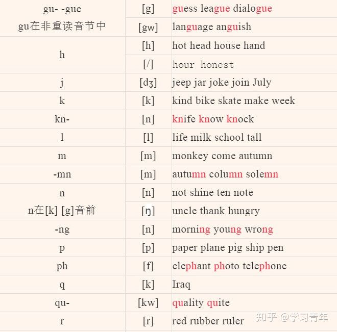
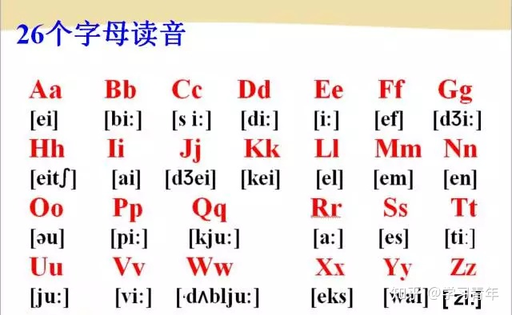

# Resources

## Pronunciation and spelling rules of English phonetic symbols

### Syllable and syllable division

#### Syllable division - 1
1. 一个单词中有几个发音的元音字母，就有几个音节。
比如：habit有两个发音的元音字母（a，i），所以它有两个音节：ha-bit
2. 两个元音间有两个辅音，则辅音分开，一边一个。
比如：matter（mat-ter）、infant（in-fant）
3. 两个元音间只有一个辅音，该辅音划分到后一个音节。
比如：basic（ba-sic）、open（o-pen）
4. 字母组合要划分到同一个音节。
比如：garbage（gar-bage）、sweater（swea-ter）
5. 词尾不发音的e不构成音节。
比如：bike只有一个音节，dislike只有两个音节。
6. 两个元音字母在一起，一般为字母组合，发一个元音、构成一个音节。
比如：rainbow（rain-bow）、mountain（moun-tain）
7. 词尾le、el、al可以和前面的辅音组成一个音节。
比如：apple（ap-ple）、little（lit-tle）
来源: https://www.jianshu.com/p/db63896c5b55

#### Syllable division - 2
1. 在重读音节和非重读音节的相邻处有两个辅音字母时，一个辅音字母组属于前面的音节，一个属于后面的音节。
例如：let-ter，mem-ber，chil-dren，daugh-ter
2. 在重读和非重读音节的相邻处只有一个辅音字母时，如果前面重读音节里的元音是长音则辅字组属于后面一个音节，如果重读音节里的元音是短音，则辅音字母属于重读音节。
例如：长音 pa-per，stu-dent，fa-ther，ze-ro，mo-tor，far-ther 短音 sev-en，stud-y，moth-er，ver-y，mod-le ，weath-er

#### 重读音节
单词中读音特别响亮的音节。用音标标记双音节、多音节词的读音时，应使用重读符号。单音节词多数是重读音节，标记读音时不需要使用重读符号

#### 开音节
1. 绝对开音节：单个元音字母后面没有辅音字母的重读音节.例如：no she he we by .
2. 相对开音节：单个元音字母后面加单个辅音字母,再加一个不发音字母e构成的重读音节.例如：name these bike home excuse like welcom...

#### 闭音节
1. 英语中以一个或几个辅音字母（r w y 除外）结尾而中间只有一个元音字母的音节，称为闭音节。如果这个音节在单词中是重读，那就是重读闭音节了 例：map，desk，is，it等
2. (1) 重读闭音节即两个辅音中间夹一个短元音(即"辅元辅"结尾) (2)重读闭音节结尾，且词尾只有一个辅音字母，要双写
3. 重读闭音节三要素: 1. 必须是重读音节; 2.最后只有一个辅音字母;只有一个元音;3.只有一个元音，元音字母发短元音
4. 重读闭音节的动词: 重读闭音节的动词+ing的时候要双写最后一个辅音字母 例如：get-getting sit-sitting begin-beginning
5. 重读闭音节的形容词: 形容词转比较级或最高级要双写 例如：big-bigger-biggest hot-hotter-hottest

#### 双音节词重读规则
1. 双音节词的第一个音节通常是重读音节 例如： stu-dent，Chi-na，sec-ond，au-tumn
2. 含有a- be- de- re- in- ex- 等前缀的双音节词往往是在第二个音节上重读。双音节词的重读位置不会因增加前缀或后缀而发生改变 例如：a-bout，be-fore，ex-cuse，re-pair，for-get-ful，in-ven-tor

#### 多音节词重读规则
1. 多音节词通常在倒数第三个音节重读。例如： el-e-phant
2. 词尾有-ic 或-tion,-sion 的词，在-ic或-sion,-tion前的一个音节上重读。例如：scien-tific，im-pression，na-tion

### 英语单词拼读规则

https://zhuanlan.zhihu.com/p/38602258

#### 元音字母在重读音节中的读音

#### 元音字母在非重读音节中的读音

#### 元音字母在重读音节中的特殊读音

#### -r音节元音字组在重读音节中的读音

#### -re音节元音字组在重读音节中的读音

#### 元音字组在重读音节中的读音

#### 非重读音节中元音字组和字群的读音

#### 元字组在复合词非重读音节中的读音

#### 辅字组的读音

#### 字母读音表

### 拼读发音练习
#### 与元音字母 A 相关的单词：

1. [ei] a在开音节中：发字母音，后面有不发音的e
  * face脸; grade年级;cake蛋糕; lake湖; make制造;take拿到;
  * snake蛇; name名字; same相同;plane飞机;grapes葡萄;date日期;
  * Kate 凯特; plate盘子; mane鬃毛;

2. [æ] a在闭音节中：
  * black黑色的; dad爸爸; sad悲伤的; bag书包; am是;
  * Sam萨姆 lamp灯; an一（个---）;can能; fan电风扇;man男人;and和; hand手; thank感谢; map地图; has有; cat猫;
  * fat肥胖的;that那个;hat帽子;rabbit兔子 family家庭 camel骆驼

3. [a:] ar组合：
  * car小汽车；far远的；star星星；card卡片；scarf围巾；marker水彩笔 market市场 department store百货商店 apartment building公寓；
  * hard努力地，硬的；park公园；arm胳臂；farm农场；

4. [ei] ai组合；
  * tail尾巴； rainy下雨的； train火车；
  * wait等；waiter男服务员； waitress女服务员

5. [ɛə] air组合：
  * air空气；hair头发；chair椅子 stairs楼梯

6. [ei] ay组合：
  * day天，日；today今天；play玩；may可以；May五月；say说；
  * way道路，方法； stay逗留

7. [i] ay组合：
  * Sunday 星期日 Monday星期一 Tuesday星期二 Wednesday星期三
  * Thursday星期四 Friday星期五 Saturday星期六

8. [ɔ:] al组合：
  * talk说话；walk走；chalk粉笔；

9. [ɔ:l] all组合：
  * all所有的 ball球；small小的；tall高的；wall墙; mall大厅；
  * call称呼，打电话； fall秋天，跌落

10. [ a:s ]as或ass组合
  * ask问；class班级；glass玻璃杯；pass传递；grass草；last最后的；

11. [ɔ] a
  * wash 洗 what什么 watch看，手表 want 想要

12. [ɔ:] aw组合
  * paws爪子 draw画

#### 与元音字母 E 相关的单词

1. [i:] e在开音节中：发字母音
  * be是；he他；she她；me我；we我们； these这些；Chinese汉语；

2. [e] e在闭音节中：
  * bed 床； red红色的； leg腿； spell拼写； hen母鸡； then那么；
  * when什么时候； pen钢笔； ten十； dress女裙； let让；

3. [iə] ere组合；
  * here这儿

4. [ɛə] ere组合
  * there 那儿；where哪儿

4. [i:] ea组合；
  * sea 海洋；tea茶；peach桃子；teacher教师；read读； please请； eat吃；meat肉；seat座位; beak鸟嘴 dream做梦 leaves树叶

5. [e] ea组合；
  * head头；bread面包；feather羽毛； weather天气；

6. [iə] ear组合：
  * ear耳朵； dear亲爱的； hear听见; near在……附近

7. [ɛə] ear组合：
  * bear熊；pear梨

8. [ə:] ear组合：
  * early早； year年；learn学，学会

9. [i:] ee组合：
  * bee 蜜蜂； three三； tree树； see看见； need需要; week周，星期；feel感觉； green绿色；thirteen十三； sheep绵羊； sleep睡觉；
  * feet脚（复数）；meet遇见； feed喂养

#### 与元音字母 I 相关的单词

1. [ai] i在开音节中：发字母音
  * hi 喂； I我； ice冰；nice好的；rice米饭；ride骑；beside在---旁边；
  * bike自行车； like喜欢；time时间；fine（身体）好； nine九；
  * white白色的； write写； kite风筝； five五；drive驾驶
  * inside在……里面 outside在……外面

2. [i] i在闭音节中：
  * which 哪一个；chick小鸡；sick病的； big大的；pig猪；milk牛奶；
  * him他； swim游泳； in在---里面； begin开始； sing唱歌；
  * pink粉红色；drink喝；ship轮船； is是； his他的；this这个；
  * fish鱼； Miss女士； it它； sit坐；six六

3. [ə:] ir组合：
  * bird鸟； shirt（男）衬衫； skirt短裙 sir先生
  * girl 女孩 circle圆圈 thirty三十 thirteen十三 thirsty渴的

#### 与元音字母 O 相关的单词

1. [əu ] o在开音节中：发字母音
  * go去；no不；so这样，这么；phone电话机；those那些；close关闭；nose鼻子； rose玫瑰花 home家 rope绳子 hole洞

2. [ɔ] o在闭音节中；
  * clock钟； dog狗； on在---上面； long长的； song歌曲；
  * shop商店； stop停止； hot热的； not不； donkey驴 hop双脚跳
  * orange橘子 ostrich鸵鸟 rock岩石

3. [Λ] o
  * mother妈妈 brother哥哥，弟弟 come来 some一些 other其他的
  * stomach胃，肚子 Monday星期一 monkey猴子

4. [ɔ:] or组合：
  * or 或者；for为了；short短的，矮的；forty四十； horse马； store商店

5. [əu ] oa组合；
  * road 路； boat小船； coat上衣； goat山羊； soap香皂

6. [u: ] oo组合；
  * too也；zoo动物园；cool凉的；school学校；room房间；moon月亮；afternoon下午； spoon汤勺； kangaroo袋鼠

7. [ u ] oo组合：
  * good好的；foot脚；classroom教师；look看；book书；cookies饼干

8. [au] ou组合：
  * cloudy多云的； house房子； mouse老鼠；about大约；
  * mouth嘴； blouse女式衬衫 mountain大山

10. [au ] ow组合：
  * cow母牛； how怎样，多少； now现在； brown棕色的；
  * down向下 flower花

11. [əu ] ow组合：
  * slow慢的； know知道；

#### 与元音字母 U 相关的单词
1. [ ju: ] u在开音节中发字母音
  * excuse 原谅；use使用

2. [Λ] u在闭音节中：
  * much 很； jump跳； run跑； sun太阳； up向上； cup小茶杯；
  * but但是 bus公交车； umbrella雨伞; hundred百； cut剪，切；
  * mum妈妈；under在……下面； underline在……下面划线；
  * number数字； understand理解 truck卡车
  * trunk象鼻 hug拥抱 duck鸭子

3. [ə: ] ur组合：
  * nurse护士； turn轮流; hurt伤，疼； fur皮毛

#### Y 与 I 的发音相似
1. 在开音节中读[ai ]
  * sky天空； fly飞； July七月； my我的； try试，努力；
  * why为什么； eye眼睛； bye再见

## Word suffix to judge part of speech

### 名词后缀
1. -ant,-ent 表示人或构件applicant(申请人),assistant(助手),occupant(居住者,占有人),component(部件,成分),defendant(被告)dependant(依赖他人者)
2. -ee 在动词后面,表示动作的接受者employee(被雇佣者),abandonee(受领被抛弃财物者),addressee(收件人),appointee(被任命者),refugee(难民)
3. -eer表示“从事于……的人”engineer(工程师),profiteer(投机者),pioneer(先锋),volunteer(志愿者)
4. -er 加在动词后指人或机械;加在地名后面指该地区的人dispenser(药剂师),dyer(染色工),sampler(品尝家),absorber(吸收者),amplifier(扩大器),Londoner(伦敦人),New Yorler(纽约人)
5. -or/ar指人或物accelerator(加速器),accumulator(蓄电池、存储器),actor(演员),collector (收集者); scholar, liar
6. -graph用于写或记录的机械ammograph(风速什),chorograph(位置测定器),seimograph(地震仪)。
7. -ian,-an,-ese指大陆、国家的人African(非洲人),American(美国人),Asian(亚洲人),Japanese(日本人),Chinese(中国人)
8. -ician指熟悉……人electrician(电工),logician(逻辑学家),mathematician(数学者)
9. -ist指相信某种理论或制度或经常做某项工作的人botanist(植物学家),chemist(化学家),communist(共产党员),typist(打字员),violinist(小提琴家)
10. -miter,-meter仪器tachmiter(视距仪,准距仪),tromometer(微震仪)
11. -ism主义socailism(社会主义),capitalism(资本主义)
12. -ard指人,带轻蔑意味drunkard(醉鬼),coward(胆小鬼)
13. -ette小,(商业上)表示假的cigarette(香烟),kitchenette(小厨房),essayette(短论文),storyette(短篇小说),flannette(棉法兰绒),leatherette(人造革)。
14. -y,-ie加在称呼上表示亲昵或表示"行为的结果,状态,性质”。Deary(亲爱的),daddy(爸爸),granny(奶奶、姥姥),shorty(短衣服); glory, history, victory, inquiry
15. -let小(加在名词后面)booklet(小册子),streamlet(小溪)
16. -ling小(带有轻蔑的意思)lordling(愧儡王),professorling(小教授),weakling(窝囊废),hireling(市侩)
17. -age加在动词后面,表示行为的结果stoppage(阻塞),storage(储藏),marriage(婚姻),stortage(短缺)
18. -al加在动词后面approval(建议),denial(否认),refusal(拒绝),rehearsal(彩排)
19. -ion,-sion,-tion加在动词后面selection(选择),correction(修改),intention(打算),recognition(认识),description(描写),education(教育),solution(解决),decision(决定)
20. -cy构成名词accuracy(正确性),diplomacy(外交),constancy(经常),bankruptcy(破产)
21. -dom表示国家,职业,状况freedom(自由),martyrdom(殉难),kingdom(王国),wisdom(智慧)
22. -ful加在容器后面,表示某容器的容量handful(一把的),mouthful(一口之量的),glassful(一杯之量的)
23. -hood为名词后辍,表示关系或抽象意义brotherhood(兄弟),fatherhood(你辈),neighborhood(邻居),likelihood(可能性)
24. -itis表示“炎症”bronchitis(支气管炎),arthritis(关节炎),appendicitis(阑尾炎)
25. -ity加在形容词后面,表示抽象意义ability(能力),reality(现实)
26. -ment加在动词后面advertisement(广告),government(政府),punishment(惩罚),settlement(解决),statement(声明),pavement(人行道)
27. -ness是最活跃的后缀之一,可以加在许多形容词后,构成抽象名词friendliness(友好),kindness(和蔼),progressiveness(进步)
28. -gram构成“画、图、字”等含义diagram(图表,图解),program(计划),telegram(电文,电报)
29. -ship加在名词后面,表示状态、抽象概念friendship(友谊),relationship(关系),membership(成员),citizenship(居民权)
30. -try,-ery, ary加在名词、形容词、动词后面,表示集体,地点archery(箭术),fishery(渔场),brewery(酿酒厂),forestry(林业); secretary,missionary
31. -th是名词后辍birth(出生),death(死亡),depth(深度),growth(生长),strength(力量),truth(真理)
32. -ty加在形容词后面,表示特性或情况bounty(慷慨,好施),cruelty(残酷),loyalty(忠诚),plenty(多),safety(安全)
33. -ure 加在动词后面,表示行为及其结果disclosure(说出,透露),expenditure(花费),mixture(混合),exposure(展现,暴露),picture(图画)
34. -ics主要表示一门学问acoustics(声学),aerobatics(技巧飞行),economics(经济学),electronics(电子学),mechanics(机械学)
35. -logy表示一门学科archaeology(考古学),biology(生物学),etymology(词源学),geology(地理学)
36. -nomy astronomy(天文学),economy(经济),taxonomy(分类学)
37. –ism 表示"制度,主义,学说,信仰,行为" socialism, criticism, colloquialism, heroism
38. –tude表示"性质,状态,程度" latitude, altitude(海拔)

### 形容词、动词、副词

1. -able,-ible加在动词后面acceptable(可接受的),avoidable(可避免的)understandable(可理解的),readable(可读的),countable(可数的),possible(可能的)
2. -al 加在地名上African(非洲的),Australian(澳大利亚的),Canadian(加拿大的)
3. -ern表示方向eastern(东方的),northern(北方的),southern(南方的),western(西方的)
4. -ese 表示人Japanese(日本人),Chinese(中国人),Vietnamese(越南人)
5. -ic加在名词后面economic(经济的),specific(特殊的),scientific(科学的)
6. -ical 加在名词后面economical(经济的),historical(历史的),political(政治的)
7. -ish        (1). 加在国家名称后面,表示该国的或者该国的人。Swedish(瑞典的),Irish(爱尔兰的),Danish(丹麦的)(2). 加在普通名词后面,表示“具有……性质”,或者含有轻蔑的意思。Childish(幼稚的),womanish(女人气的),foolish(愚昧的) ,selfish(自私的)。(3). 加在表示颜色的形容词后面,表示“略带……颜色的”。Greenish(微绿的),yessowish(微黄色的)。
8. -ar 加在外词后面,构成形容词annular(环状的),familiar(熟悉的),linear(线的),nuclear(原子的),angular(角的),circular(圆的)
9. -ed 加在名词后面,构成形容词aged(年长的),cultured(有文化的),skilled(有技术的),talented(有才能的),wretched(可怜的)
10. -fold加在数词或名词后,构成形容词twofold(三倍的),threefold(三倍的),tenfold(十倍的),thousandfold(千倍的),manifold(许多倍的)
11. -id 构成形容词acid(酸的),acrid(刻薄的)
12. -ing加在动词后面,构成形容词appetizing(开胃的),encouraging(鼓舞人心的),exciting(令人激动的),interesting(有趣的)。
13. -less加在名词后面,构成与之反义的形容词armless(无手臂的),boundless(无限的),countless(不可数的),faithless(背信弃义的)
14. -proof加在名词之后,表示“防…的”形容词airproof(防气的),soundproof(隔音的),bombproof(防炸弹的),burglarproof(防盗的),waterproof(防水的)
15. -some加在形容词后,构成形容词fulsome(过度的,讨厌的),gladsome(愉快的),tiresome(疲惫的),lonesome(孤独的)
16. -ious,-uous,-eous构成形容词various(多种多样的),continuous(继续的),courageous(有勇气的)
17. –ly表示“有……特征的、属于……的”,表示形容词,man /mæn/ n.男人 manly/'mænlɪ/adj.男子气概的,love /lʌv/n.恋爱 lovely/'lʌvlɪ/adj.爱恋的,home /həʊm/ n.家 homely/'həʊmlɪ/adj.家庭的,world /wɜːld/ n.世界worldly/'wɜːldlɪ/adj.世间的,friend/frend/ n.朋友friendly/'frendlɪ/adj.友好的

### 动词后缀
1. -ate,-ute     accumulate(集中),formulate(形成),calculate(计算),attribute(归功)
2. -en 加在名词、形容词后面blacken(使……黑),broaden(扩宽),deepen(加深),fasten(加快),harden(加固),thicken(加厚),lengthen(加长),frighten(恐吓)
3. -ify 加在名词、形容词后面acidify, alkalify(碱化), beautify(美化)electrify(使充电)certify(肯定),modify(修正)
4. -ize,-ise,-yxe,-yse    Americanize(美国化),analyze(分析),democratize(民主化),modernize(现代化),popularize(通俗化,推广)
5. -er batter(猛打),flatter(吹捧),chatter(喋喋不休地说),whisper(耳语)副词后缀

### 副词后缀
  * 1. -ly  加在形容词后面immediately(立即),quickly(快的),namely(即,就是说)
  * 2. -ways,-wise,-ward  加在名词或代词后面endways(末端向上地),endwise(末端向下地),lengthways(纵长地),lengthwise(纵长地),backwards(向后退地),upwards(向上地)

### 具有多种词性的单词
  * -al形容词：personal, parental, natural 名词：refusal, proposal, approval, denial, survival, trial

  * -tive形容词：active, passive, positive, negative名词：detective, representative代表、代表的, relative亲戚, 相关的native, captive例句：Success is a relative term, it brings so many relatives. ----by Bernard Shaw

  * -ant形容词：ignorant, assistant, attendant服务员buoyant----buoy(浮标,救生圈) + ant----有浮力的, 轻快的名词：examinant主考官, applicant申请者, servant, participant

  * -ent形容词：existent, dependent, emergent名词：resident, patient, solvent溶剂, detergent洗洁精,去污剂

  * -ic形容词：periodic, cubic, magnetic磁性的, electronic名词：critic评论者、批评家, mechanic技工、机械师, logic逻辑, rhetoric 修辞学

  * -ine形容词：feminine女性的、阴柔的, nervine神经的, reverine河流的 名词：heroine,doctrine教义,routine程序、常规, concubine妾、姘妇Concubine----con+ cub(cube立方,cubby小房间) + ine

  * -ar形容词：familiar, similar, linear线性的, peculiar奇特的名词：scholar学者, liar说谎者, peddler小贩子, burglar夜贼hamburger到KFC偷汉堡的人

-ory/-ary
  * 形容词：advisory忠告的, contradictory矛盾的, imaginary, elementary
  * 名词：
    * inventory库存目录(invent找到,发明――库存目录就是让你找到需要的存货)
    * dormitory---dorm+ itory----睡觉的地方词根dormant休眠的,休眠火山dormant volcano, 潜伏期dormant 
    * period;domicile住宅,住所;dormitive 安眠药

-atory场所Observatory 天文台Laboratory 实验室Lavatory 盥洗室lav-流动lava 岩浆lavish a. 非常丰富的,浪费的v. lavish on浪费…dictionary, piscary=fishery捕鱼场p-f互换

* -ile
  * 形容词
    * agile ---ag(act) + ile---可以动的----引申为灵活的
    * ductile---duct引导+ ile易延展的
    * introduce介绍,引入。conduct完全引导――1)指导,管理;2)行为
    * fertile 肥沃的 辨析：conference, reference, deference, inference
    * juvenile ----juven(junior)+ ile 年轻的
    * fragile---frag(fracture) +ile---易碎的
    * flexile---flex(flic折叠)----可弯曲的,引申为可变通的
    * servile---奴性的

  * 名词
    * Missile---miss发送+ ile物体----导弹
    * Textile---text(编织)+ile----纺织品
    * Context----把文字编织在一起-----上下文语境
    * Pretext(笔)----提前编织好-----借口=excuse(口)
    * Automobile
    * Domicile--dom(dormitory)----住宅,住所

* 同时具有形容词与动词含义的后缀-ish
  * 1)具有...性质的(通常为贬义)bookish书呆子气的辨析：childish, childly, childlikemanish, manly, manlike
  * 2)稍微的coldish, yellowish偏黄的
  * 3)语言English, Finish, Spanish
  * 4)动词establish, diminish使缩小,vanish消失, flourish使繁荣,使兴旺

* 具有三种词性的后缀
  * -ly同时具有副词,名词与形容词与含义
  * 副词：namely, similarly, badly严重的、恶劣的80％
  * 形容词：weekly, friendly, homely, costly 10%
  * 名词：weekly周刊,monthly月刊,quarterly季刊10 %

* -ate的词性：大多数人认为,ate结尾的单词一定是动词,其实还有许多-ate结尾的单词还可能是形容词,名词。根据统计,他们的分布大约是：
  * 1)动词70％accelerate加速, differentiate区分, originate起源
  * 2)形容词15％moderate, fortunate, private, considerate, passionate 
  * 3)名词15％
graduate( grade+uate----一级一级的攀登----大学本科毕业生)certificate----cert(certain肯定,确定)+ ificate-----肯定你的成绩----证书e.g. 出生证明
  * 辨析：diploma----di二+plo(plic折叠)+ma(名词)----对折的一张纸----毕业文凭candidate(穿白衣服的人)delegate(de强调+leg法律+ate----被委托以法律的权利的人----n代表;v授权), magistrate (mag + istrate---地方的大人----地方官员)

## English word formation-prefix

* 第1节 表示否定意义的前缀
  * (1)纯否定前缀

    * a-, an- asymmetry (不对称 ), anhydrous (无水的 )
    * dis- dishonest, dislike
    * in-, ig-, il-, im-, ir- incapable, inability, ignoble, impossible, immoral, illegal, irregular
    * ne-, n- none, neither, never
    * non- nonsense
    * un- unable, unemployment

  * (2) 表示错误的意义

    * male-, mal- malfunction, maladjustment ( 失调 )
    * mis- mistake, mislead
    * pseudo- pseudonym (假名 ), pseudoscience

  * (3) 表示反动作的意思

    * de- defend, demodulation ( 解调 )
    * dis- disarm, disconnect
    * un- unload, uncover

  * (4) 表示相反、相互对立的意思

    * anti-, ant- antiknock ( 防震 ), antiforeign ( 排外的 )
    * contra-, contre-, contro- contradiction, controflow ( 逆流 )
    * counter- counteraction, counterbalance
    * ob-, oc-, of-, op-, object, oppose, occupy
    * with- withdraw, withstand

* 第2节 表示空间位置、方向关系的前缀

  * a- 在……之上、向 ……aboard, aside
  * by- 附近、邻近、边侧 bypath, bypass
  * circum-, circu- 周围、环绕、回转 circumstance, circuit
  * de- 在下、向下 descend, degrade
  * en- 在内、进入 encage, enbed
  * ex-, ec-, es- 外部、外 exit, eclipse, expand, export
  * extra- 额外 extraction
  * fore- 在前面 forehead, foreground
  * in-, il- im-, ir- 向内、在内、背于 inland, invade, inside, import
  * inter-, intel- 在……间,相互 international, interaction,
  * intro- 向内、在内、内侧 introduce,
  * medi-, med-, mid- 中,中间 Mediterranean, midposition
  * out- 在上面,在外部,在外 outline, outside, outward
  * over- 在上面,在外部,向上 overlook, overhead, overboard
  * post- 向后,在后面,次 postscript ( 附言 ), postgraduate
  * pre- 在前,在前面 prefix, preface, preposition
  * pro- 在前、向前 progress, proceed
  * sub-, suc-, suf-, sug-,
  * sum-, sup-, sur-, sus- 在下面,下 subway, submarine, suffix,suppress, supplement
  * super-, sur- 在……之上 superficial, surface, superstructure
  * trans- 移上,转上,在那一边 translate, transform, transoceanic
  * under- 在……下面,下的 underline, underground
  * up- 向上,向上面,在上 upward, uphold, uphill

* 第3节 表示时间、序列关系的前缀

  * ante-, anti- 先前,早于,预先 antecedent, anticipate
  * ex- 先、故、旧 ex-president, ex-husband
  * fore- 在前面、先前、前面 foreword, foretell
  * mid-, medi- 中,中间 midnight, midsummer
  * post- 在后,后 postwar
  * pre-, pri- 在前、事先、预先 preheat, prewar, prehistory
  * pro- 在前、先、前 prologue ( 序幕 ), prophet
  * re- 再一次、重新 retell, rewrite

* 第4节 表示比较程度差别关系的前缀

  * by- 副、次要的 byproduct
  * extra- 超越、额外 extraordinary
  * hyper- 超过、极度 hypersonic, hypertension
  * out- 超过、过分 outdo (超过 ), outbid
  * over- 超过、过度、太 overeat, overdress, oversleep
  * sub-, suc- 次、低、副、亚 subeditor, subordinate, succession
  * super-, sur- 超过 supernatural, superpower, surplus
  * under- 低劣、低下 undersize, undergrown
  * vice- 副、次 vice-president, vice-chairman
  
* 第5节 表示共同、相等意思的前缀

  * com-, cop-, con-, cor-, co- 共同、一起 combine, connect, coexist
  * syn-, syl-, sym- 同、共、和、类 synthesis, sympathy

* 第6节 表示整个完全意思的前缀

  * al- 完整、完全 alone, almost
  * over- 完全、全 overall, overflow ( 充满 )
  * pan- 全、总、万 panentheism (泛神论 ), panorama(全景、概论 )

* 第7节 表示分离、离开意思的前缀

  * a-, ab-, abs- 分离、离开 away, apart, abstract, abstain
  * de- 离去、除去 depart, decolour
  * dis-, di-, dif- 分离、离开 disarm, divorce
  * ex-, e- 离开、分离 expel, exclude, expatriate
  * for- 离开、脱离 forgive, forget
  * re- 离开 release, resolve
  * se- 分离、隔离 separate, seduce, select

* 第8节 表示通过、遍及意思的前缀

  * dia- 通过、横过 diameter, diagram
  * per-, pel- 通、总、遍 perfect, perform, pervade ( 浸透 )
  * trans- 横过、贯通 transparent, transmit, transport

* 第9节 表示加强意思的前缀

  * a- arouse, ashamed
  * ad- adjoin, adhere (粘着 )

* 第10节 表示变换此类作用的前缀

  * be- befriend (帮助、扶助 )
  * en- enslave, enable, enrich
  * ad-, ac-, af-, ag-, an-, ap-,ar-, as-, at-：adapt, accord, affix, aggression,arrive, assist, attend, attract,arrange, assign

* 第11节 表示数量关系的前缀

  * mono-, mon- 单一、一 monotone, monopoly, monarch
  * ambi-, bi-, di- twi- 二、两、双 ambiguous, amphibian, bicycle,
  * diode, twilight
  * deca-, deco-, dec-, deci- 十 decade, decimals
  * hecto-, hect-, centi- 百,百分之一 hectometer, centimeter
  * kilo- 千、千分之一 kilometer
  * myria-, myri-, mega, meg,micro- 万、万分之一 myriametre, megabyte, microvolt
  * multi-, mult-, poly- 许多、复、多数 multipmetre, polysyllable
  * hemi-, demi-, semi-, pene-,pen-半、一半 hemisphere, demiofiicial,semiconductor, semitransparent,peninsula

* 第12节 表示特殊意义的前缀

  * arch- 首位、第一的、主要的 architect, archbishop
  * auto- 自己、独立、自动 automobile, autobiography
  * bene- 善、福 benefit
  * eu- 优、美好 eugenics (优生学 ), euphemism
  * male-, mal- 恶、不良 maltreatment, malodor
  * macro- 大、宏大 macroscopic (宏观 )
  * magni- 大 magnificent
  * micro- 微 microscope

* 第13节 表示术语的前缀

  * aud- 听、声 audience
  * bio- 生命、生物 biography
  * ge-地球、大地geography
  * phon- 声、音调 phonograph
  * tele- 远离 television, telephone

## English word formation-root

  * aer, ar 空气,大气 aeroplane, aerial
  * ag, act, ig 做,动作 active, agent, reaction
  * alt 高 altitude
  * alter, altern, altr 其他,变更 alternate
  * bio, bi, bion 生物,生命 biology, bionics
  * brev, bri, brief 短 brief, abbreviation, abridge
  * cap, capt, cept, cip 取,获 capture, except, concept, capacity
  * ced, ceed, cess 行,让步 proceed, succeed, excess
  * centr 中心 concentrate, eccentric
  * clain, claim 呼喊 claim, proclaim, exclaim
  * clos, clud 闭合 conclude, enclose, include
  * col, cult 耕耘 colony, cultivate, agriculture
  * cor, cord 心 cordial, record, accord
  * curr, cur, cour 跑,动作 current, occur, concurrence
  * dic, dict 说,示 dictate, edit, indicate, predict
  * doc, doct 教 doctor, document
  * duc, duct 引导、传导 introduce, produce, conduct
  * fact, fac, fect, dic, dit 做,创造 factory, effect, profit, faculty
  * fend, fens 打,击 defense, offence
  * fer 搬运,转移 ferry, transfer, defer
  * fin, finit 终、极 final, finish, confine
  * firm 坚固 firm, confirm, affirm
  * fix 固定 prefix, affix
  * flect, flex 弯曲 flexible, reflex
  * flor, flour, flower 花 flower, flourish
  * form 形 uniform, formula, transform, reform
  * forc, fort 力,强度 force, enforce, effort
  * gen, genit 生产,发生 generate, generation
  * gram, graph 书写,记录 telegram, diagram, photograph
  * grad, gress, gred, gree 步,阶段 gradually, degree, progress
  * hab, habit, hibit 保持,住 inhabit, exhibit, prohibit
  * her, hes 粘附 adhere, cohesion
  * ject, jet 抛射 project, inject
  * jour 日,一天 journal, adjourn, journey
  * jug, junct 结合,连合 conjunction, junction
  * labour, labor 劳动,工作 labourer, elabourate, collaborate
  * lect, leg, lig 挑选,采集 collect, select, lecture
  * lif, liv 生活,生存 life, alive
  * loc 场所,位置 location, dislocate
  * long, leng, ling 长的 length, prolong, linger
  * loqu, locut 说话 colloquial, eloquent
  * mand, mend 命令 command, demand, recommend
  * man, manu 手,手法 manage, manual
  * memor, member 记忆 memory, remember, memorial
  * mind, ment 心 mind, remind, mental
  * merc, merch 贸易commerce, merchant
  * meas, mens, meter,metr 测量,度量 measure, meter, diameter
  * min 小 diminish, minority
  * miss, mit 派遣,送 mission, dismiss, transmit, missile
  * mob, mot, mov 动 movement, motion, mobile, remove
  * nect, nex 捆扎 connect, disconnect, annex
  * not 记号,注意 note, denote, annotation
  * onom, onym 名字 synonym, autonym, anonymous
  * pair, par 相同,对等 compare 准备 prepare
  * pel, puls 追逐 expel, impel
  * pend, pens, poud 悬挂 depend, independent, expense
  * phon 声音 symphony, telephone, microphone
  * plac 位置,场所 place, replace
  * peopl, popul, publ 人民,民众 public, republic, popular, people
  * port 搬运 export, import, deport
  * press 压,压制 pressure, express, oppress, impression
  * prob, proof, prov 实验,验证 prove, approve
  * quer, quest, quir, quis 寻找,探问 inquiry, question, inquisition
  * rang, rank 排列 arrange, rank
  * rect, right, rig 正,直 correct, direct, erect
  * riv 河流,流远 river, arrive, derive
  * rupt 破坏,毁坏 eruption, bankrupt, corruption
  * sci 认识,知识 science, conscious
  * scrib, script 书写,记录 describe, script
  * sens, sent 感觉,情感 sensation, sentiment
  * sign 标记,符号 signal, signature, design
  * sembl, simil 相似,类似 similar, resemble, assimilate
  * soci 结合,社交 social, association
  * spec, spect, spitc, spis 看,视 inspect, spectator, conspicuous
  * struct 建筑,构造 structure, construct, instruct
  * tect, teg 遮蔽,掩盖 detect, protect
  * temp, tens 时间,时机 tense, contemporary, temporal
  * tend, tes, tent 倾向,伸张 tendency, intension, extend, intend
  * test 证明,证实 testify, protest, contest
  * text 编织,构成 textile, texture, context
  * tract, trail 拖拉,吸引 attract, tractor, abstract, contract
  * tribut 给予 contribution, distribute
  * us, ut 用,使用 usable, utilize, abuse
  * vac, van 空,虚 vacancy, vanity, evacuate
  * vad, vas, wad 走,去 invade, wade, evade
  * vers, vert 旋转,反转 convert, inversion, reverse, divert
  * vid, vis, vey, view 观看,看见 television, visible, evident, interview,survey
  * viv, vit 生,活 vivid, vital, survival
  * war, ward 注意,保护 aware, wary, ward
  * way 路 way, away, subway, always

## Preposition

* 早、午、晚要用`in`，`at`黎明、午夜、点与分。
* 将来时态`in...`以后，小处`at`大处`in`。
* 有形`with`无形`by`，语言、单位、材料`in`。

### Examples
> **小处at大处in**

例：Li and I arrived at Heishan county safe and sound, all is well. Don't worry. 李和我平安地到达黑山县，一切很好，勿念。

I live in a great city (big city), my sister lives at a small town while my parents live at a village. 我住在大城市，我姐姐住在一个小城镇，而我的父母则住在农村。

I'm in Liaoning, at Anshan. 我住在辽宁省鞍山市．

> **“介词at、to表方向，攻击、位置、善、恶、分”。**

介词at和to都可以表示方向; 用at表示方向时，侧重于攻击的目标，往往表示恶意；用to表示方向时，突出运动的位置或动作的对象，侧重表示善意。试比较下列各句：

A．She came at me. 她向我扑过来。

B．She came to me. 她向我走过来。

## Examples of the use of words

> `somewhat` - 有点儿 - *adv* - The radiotherapy has taken her down **somewhat**.

## Phrase
* [1] 老外生活中最常用的1000句英文短语 https://learning.sohu.com/20080903/n259350805.shtml
* [2] 200句常用英语短语！每天睡前看一看！ https://www.leesharing.com/2345678987654323568-2/
* [3] Phrase Examples https://examples.yourdictionary.com/phrase-examples.html

### Phrase Sorts
A phrase is a group of words that express a concept and is used as a unit within a sentence. Eight common types of phrases are: noun, verb, gerund, infinitive, appositive, participial, prepositional, and absolute. Take a look at our selection of phrase examples below. [3]

---
> Noun Phrases - A noun phrase consists of a noun and all its modifiers.

* It was **a story as old as time.**
* **The bewildered tourist** was lost.

---
> Verb Phrases - A verb phrase consists of a verb and all its modifiers.

* He **was waiting for the rain to stop.**
* You **have been sleeping for a long time.**

---
> Gerund Phrases - A gerund phrase is simply a noun phrase that starts with a gerund.

* **Taking my dog for a walk** is fun.
* **Walking in the rain** can be difficult.
* **Going for ice cream** is a real treat.

---
> Infinitive Phrases - An infinitive phrase is a noun phrase that begins with an infinitive verb.

* **To donate time or money** is an honorable thing.
* I tried **to see the stage**, but I was too short.
* The company decided **to reduce hours for everyone**.

---
> Appositive Phrases - An appositive phrase restates and defines a noun. It consists of one or more words.

* My favorite pastime, **needlepoint**, surprises some people.
* Her horse, **an Arabian**, was her pride and joy.
* My wife, **the love of my life**, is also my best friend.

---
> Participial Phrases - A participial phrase begins with a past or present participle.

* **Washed with my clothes**, my cell phone no longer worked.
* **Knowing what I know now**, I wish I had never come here.

---
> Prepositional Phrases - A prepositional phrase begins with a preposition and can act as a noun, an adjective or an adverb.

* The book was **on the table.**
* She was lost **in the dark of night.**

---
> Absolute Phrases - An absolute phrase has a subject, but not an action verb, so it cannot stand alone as a complete sentence. It modifies the whole sentence, not just a noun.

* **His tail between his legs**, the dog walked out the door.
* **Picnic basket in hand**, she set off for her date.

## Beautiful sentence

* When things get hard, we are gonna be the ones who hold each other up. 同舟共济，患难与共
* Don't forget to follow your dreams. 不忘初心，逐梦前行
* Sometimes you gotta get through your fears to see the beauty on the other side. 唯有挣脱恐惧的枷锁，方能领略别样的风光。
* Every problem is an opportunity.问题即机遇。
* Don't let emotion cloud your judgment.不要让情绪影响你的判断。
* Being yourself, that is a magic stronger than any wish.坚守本心，远胜祈愿。
* You have got to put the past behind you before you can move on.不恋过往，砥砺前行。
* People are afraid of what they don't understand.恐惧源于未知。
* If you want something, go get it.如果你有理想的话，就要努力实现。
* A true hero isn't measured by the size of his strength, but by the strength of his heart.英雄以心之力以度，非其力之大小以横。
* No excellence can be acquired without constant practice.千锤百炼，玉汝于成。
* Honesty is your best defense and offense.以诚为本，进退无忧。
* You never know what hand you're going to get dealt next.世事难料，且行且知。
* But why wait? Dream is now.何需等待，逐梦当下。
* Why waste precious time dreaming when waking life is so much better.人生之美醒时现，何必耽梦负韶华。
* Everything's going to work out. One way or another.所有事情都将得到解决，这种不行就换一种方式。
* It's not always about attacking. Sometimes, it's much better to take a piece back.不要一味进攻，有时候要以退为进。
* l tried to convince myself something good would happen.我说服自己会有好事发生。
* If you focus on what you left behind, you will never be able to see what lies ahead. 如果老是挂念已失去的，你就永远看不到未来。
* I seek not to know the answers, but to understand the questions. 我不是想知道答案，而是想理解问题。
* Courage is the mastery of fear, not the absence of it. 勇气不是无所畏惧，而是战胜恐惧。
* Every mountain is unclimbable until someone climbs it.世上无难事，只要肯登攀。
* No one can put a value on your smile.千金难买一笑。
* I don't mind being alone. I just don't want to be insignificant.我不介意孤身独行，却不想活得微不足道。
* Very few things that are worthwhile in life come without a cost.有付出才有回报。

## Origin of the word

> **re** *OLD FRENCH* - `back`

> **ad** *LATE LATIN* - `to`

## Prep

* [介词-介词词组](https://cdn.jsdelivr.net/gh/aaronmack/image-hosting@master/life/介词-介词词组.2bpwfjkmpp34.webp)
* [介词-常见介词辨析](https://cdn.jsdelivr.net/gh/aaronmack/image-hosting@master/life/介词-常见介词辨析.1xul8j6c3rfk.webp)
* [介词-介词](https://cdn.jsdelivr.net/gh/aaronmack/image-hosting@master/life/介词-介词.2kov27jzsk80.webp)
* [介词-连词](https://cdn.jsdelivr.net/gh/aaronmack/image-hosting@master/life/介词-连词.bocxa215cgw.webp)