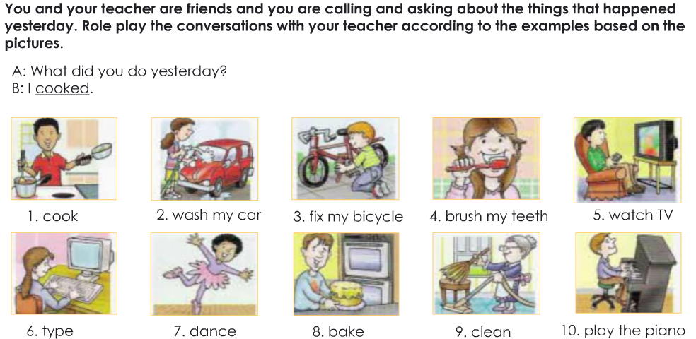

> Learning without thought is labour lost;
  Thought without learning is perilous.
  学而不思则罔，思而不学则殆.

# Happy learning English

## 073019

### SBS Chapter 1 Unit 2

**vocabulary：** 

selfie: 自拍	for the first time:第一次（状语 用在句子后面）	shaking hands： 握手

social： 社会的	security：安全的

**self:**

> My understanding of the tense is not very clear.
> 我对时态的理解不是很清晰

> I see most words can't be spelled out.
> 我看大多数单词不能拼读出来

**the phrase sentence**：

> Good to see you again today. 很高兴又见到你
>
> they are takining a selfie.  他们在自拍
>
> I hardly take a selfie。 我几乎不自拍
>
> I see this movie for the first time. 我第一次看这个电影
>
> don't mention it：别客气
>
> match... with....: 于什么很相配

**sentence：**

> They are looking at their cell phone. （look at）他们正在看他们的手机
>
> Do you shake hands with others when you meet for the first time?你第一次见面时会和别人握手吗?
>
> I will shake hands with others when meet them for the first time.当我第一次见到别人的时候，我会和他们握手
>
> how to tell about other personal information in different conditions.如何在不同的情况下讲述其他的个人信息
>
> how to give a complete self-introduction. 如何做一个完整的自我介绍
>
> We can match picture 1 with social securiy number. 我们可以将图1与社会证券化数字相匹配。
>
> Your shirt matches with your shoes today. 你的T恤与你的鞋子很相配

**practice：**

PictureA：医生在询问病人的社保卡号

**my**: The  doctor is asking the patient <u>*about her*</u> social security number

**Teacher:** In picture 1, there is a doctor and there is a patient, the doctor is asking the patient about her social security number.

PictureB：那里有一个忙碌的女助理，她正在输入传真号码

**my**:There is a busy ~~woman~~ <u>*female*</u> assistant,she is typing <u>*a*</u> fax number.

**Google:** There is a busy female assistant, she is entering a fax number.

PictureC：这里有一个女士与快递员，他根据公寓号码准确的把包裹送到了她的手中

**my**: There is a lady and courier,he accurately send package to her by apartment number

**Google:**There is a lady and courier here, and he accurately sent the package to her hand according to the apartment number.

**my second time**: There is a lady and courier in here, and he accurately sent the package to her hand by the apartment number.

PictureD：这里有一个正坐在电脑前的人，他正在根据邮件地址一个一个的发送很重要的邮件

**my**:There is a person in front of the computer, and he is sending the importent messages according to the email address

**Google:**Here is a person sitting in front of the computer, he is sending important messages one by one according to the email address.

PictureE：那里有一个警察和一个茫然的女士，警察正在检查她的驾照号码，也许她犯了错误

**My**: There is a stunned lady and policeman, the police is checking her drive's license number, maybe she make a mistake

**Google:**There is a policeman and a stunned lady. The police are checking her driver's license number. Maybe she made a mistake.

## 073119

**vocabulary：**

Difficulty is also good 难度还好	that's all: 就这样	courier  = delivery guy.  快递员

slept   v. 睡觉（sleep的过去式和过去分词）	Nationality： 国籍

Hometown： 家乡     Hobby： 爱好	Contact information：联系方式	include： 包含

anything else： 还有其他的吗	go ahead. 开始	expression： 词句， 表现

Salesman： 销售员

**sentence：**

> How did you sleep? 你睡得怎么样 I slept well 我睡得很好
>
> Good to see you again today. 很高兴今天又看到你
>
> there is **an** assistant 有一个助手
>
> She is a salesman.  她是一个销售员
>
> There is a person sitting in front of **the** computer. 有一个人坐在电脑前 名词前需要加冠词
>
> at the beginning of a speech. 在演讲开始的时候
>
> Do you have questions for the description? 你对描述有疑问吗？
>
> What do you think his job is？你认为他的工作是什么？
>
> He dresses formal 他穿着正式
>
> there should be the following parts in a complete self-introduction. 一个完整的自我介绍应该包含以下几个部分
>
> Do you want to try? 你想尝试一下吗？

**practices**：

> Hello everyone, my name is Aaron, I'm Chinese, I'm from Tacheng city Xinjiang province, I like reading and studying, if you want to know more about me, You can add my Wechat , My Wechat ID is  13399015650, Thank you.

**EV17：**

To be + nouns

Be 句型： xx（主语）+be动词 + xx（名词）

**remembering point:**

1. 名词前面需要加冠词 He is a salesman. 复数前面不用添加 They are salesman.
2. Be动词口诀: 我用am， 你用are，is连着他她它，单数主语用is， 复数主语全用are.

**preview：**

**EV2 Module6 Lesson18 - 23:**

***vocabulary***： 

bank clerk  /klɝk/ ： 银行职员	pattern： /pætərn/ 模式	baker /'bekɚ/： 烘焙师

chef /SHef/： 厨师	beautiful/pretty： /'bjʊtəfəl/  漂亮的	kind： 类型

polite： /pə'laɪt/ 有礼貌的	talkative /'tɔkətɪv/ 健谈的	easygoing： 容易相处的

colleague /'kɑliɡ/ : 同事	 cafeteria /,kæfə'tɪrɪə/： 自助餐厅 小餐厅

**Sentence**:

> Long  time no see. 好久不见

**Sentence patterns**

> Are you a bank clerk? 你是银行职员吗  I'm not a bank clerk.
>
> What your job ? or What do you do?  你是做什么的?
>
> Is xxx(名词/代词) xxx（形容词）？ *Is he heavy?*   xxx（名词/代词） isn't xxx(形容词) *He isn't heavy.*
>
> What kind of person is xxx（名/代词）*What kind of person is she?*

> Where is your xxx(名/代词)？*Where is your boyfriend?*    xxx（名/代词） is in the xxx(地点) *He is in the company*

> xxx(名/代词) is from xxx(地点)？ *He is from New York.*
>
> Is xxx(名/代词) in the xxx（地点）？ *Is she in the office?*  xxx(名/代词) isn't in the xxx(地点). *She isn't in the office.* Where is xxx(名/代词)？ Where is xxx（名/代词）？ Where is she?

**Conversions：**

> Tell me about your sister. Is she pretty? 
>
> What kind of person is she? 她是怎么样的一个人？
>
> Is Lily our new member?  Is she in the office now?

***main point***

1. Are you xxx（名词）？ I'm not xxx(名词)。 What's you xxx（名词）。
2. Is xxx（名词/代词）xxx（形容词）： Is she beautiful？ 
3. xxx（名词/代词）is xxx（形容词）。 She is beautiful? 

## 080119

**vocabulary**

locate 定位 	bored： 无聊的	In fact： 实际上	clinic: /'klɪnɪk/ 诊所	repairperson： 修理工

present  /prɪˈzɛnt;(for n.)ˈprɛznt/ 现在的	continuous /kən'tɪnjʊəs/ 连续的

prepositions   /,prɛpə'zɪʃən/ 介词	fireplace /'faɪɚples/ 壁炉

wedding gown： /ɡaʊn/ 结婚礼服 	singular 单一的  plural /'plʊrəl/  复数（形势的）

**sentence:** 

> What are you going to do today? 你今天打算做什么?

**phrase sentence:**

> Good to hear!  不错
>
> Sure, go ahead. 当然，请便
>
> kind of.. 什么类型的 （kind of book 类型的书）

**Sentence patterns**

> *continue + v-ing*  I'm going to continue studying English.
>
> 变疑问句： be动词提前  Example： My mother is a back clerk.  Is My mother a back clerk? 

> 定语从句： The girl who likes cakes is my sister.  ---> Is The girl who likes cakes my sister? 
>
> The women who go shopping every day are my friend.  --->  are The women who go shopping every day mu friend?

> 变否定句： be动词后面加not.  The book that is interesting is your book. ---> The book that is interesting isn't your book.

**Review：**

**vocabulary**：

bakery 面包店 movie theater 电影院  laundromat /'lɔ:ndrəumæt, 'lɑ:n-/ 自助洗衣店

health club/gym /dʒɪm/ ：健身俱乐部   department store 百货商店  hair salon /sə'lɑn/  美发沙龙

stove /stov/火炉   closet /'klɑzət/  壁橱 	upset 心烦的	 ripple /'rɪpl/ 皱纹  clothesline 晾衣绳

device  /dɪ'vaɪs/ 装备	exercise /'ɛksɚsaɪz/ 运动	concerts/ˈkɑːnsərts/  演唱会

Minnesota 明尼苏达州	rarely /'rɛrli/ 难得	magazine 杂志	during 在...时候

escalator /'ɛskə'letɚ/  （美）自动扶梯	straight 直的	curly 卷曲的	blond 金发的

antenna  /æn'tɛnə/ 天线 	motorcycle 摩托车	journalist  /ˈdʒɝnlɪst/ 新闻工作者	reporter 记者

suburb  /'sʌbɝb/ 郊区	Hollywood 好莱坞	laboratory /ˈlæbrəˌtɔrɪ/ 实验室	experiment 实验	

unfortunately /ʌn'fɔrtʃənətli/  不幸的	Miami 迈阿密	golf 高尔夫	tennis 网球

scientist  /'saɪəntɪst/ 科学家	famous 著名的	travel 旅行	president 总统

feed 喂食	jog 慢跑	bark n.树皮 vt.尖叫

prime minister 总理

**sentence patterns**：

> There be 句型 ： 某地（存在）某人/物
>
> Is/Are there xxx(名词) xxx(地点)？ Is there a supermarket near here?
>
> There is/are xxx(名词) xxx(地点)  There is a supermarket in Zhongshan Road
>
> There isn't/aren't xxx(名词)xxx(地点). There isn't a stove in the kitchen.

> How many xxx(复数名词) are there xxx(地点)
>
> How many rooms are there in the apartment?  

**conversation：**

> Excuse me. is there a supermarket around/near here? 
>
> how can I get there?
>
> Is there a vary nice sofa in the living room?
>
> And is there a stove in the kitchen? 
>
> No, there isn't a stove in the kitchen.

## 080219

### Extensional

**Reading**

> Hi My name is  Ramon, I am a Spanish boy. In this moment I am in a kitchen
> because I am a chef. I am twenty years old. I have two sisters, Laura
> who is nineteen years old and Camila who is twenty three years old.
> Laura is in a carpentry because She is carpenter. Camila is in a
> theatre  because she is an actress.

​	大家好， 我的名字叫雷蒙， 我是一个西班牙男孩， 现在我在厨房，因为我是一名厨师， 我20岁了，我有两个妹妹，劳拉19岁，卡米拉23岁，劳拉在从事木匠工作，因为她是木匠， 卡米拉在一家电影院，应为她是一名女演员。

> Hello!! I am Lorenzo, I am from Ecuador and I live in Guayaquil. I am twenty
> four years old. In this moment, I am in a tribunal because I am a
> lawyer. I have one sister. My sister is called Maria, she is at home.
> She is a housewife. Maria is twenty nine years old.  

​	大家好，我是洛伦佐， 我来自厄瓜多尔我现在居住在瓜亚基尔， 我24岁了，在这一刻，我在法院，因为我是一名律师，我有一个姐姐，我姐姐叫玛丽亚，她现在在家，她是一个家庭主妇，她29岁了。

> Hey!! I am Bob. I am twenty seven years old and I am from England. In this
> moment I am in a office because I am a writer. I like to read and
> write. I have a brother who is called Peter. Peter works in the
> street, he is policeman. He is strong. Peter is thirty years old.  

​	嘿，我是鲍勃，我27岁了我来自英格兰，我现在办公室，因为我是一名作家，我喜欢阅读与写作，我有一个叫皮特的弟弟，他在街上工作，他是一名警察，他很强壮，他30岁了

> Hi I am Rebbeca, I am from Germany.  In this moment I am in a laboratory
> because I am scientist. I am twenty three years old and I like to
> travel and visit different countries. My father is an Engineer and he
> works in a big company. He is fifty years old. His name is Mario.

​	嗨，我是吴曼廉，我来自德国，我现在在实验室，因为我是一名科学家，我23岁了，我喜欢旅行和遍历不同的国家，我父亲是一名工程师并且他在一家非常大的公司里，他50岁了，他叫马里奥

**vocabulary**

spanish /'spænɪʃ/  西班牙的 	carpentry /'kɑrpəntri/ 木器	carpenter  /ˈkɑːrpəntər/ 木匠

theatre   /ˈθiətər/  电影院	actress /ˈæktrəs/ 女演员	tribunal  /traɪ'bjunl/ 法院

lawyer /'lɔjɚ/ 律师	writer /'raɪtɚ/ 作家	 laboratory /ˈlæbrəˌtɔrɪ/ 实验室

scientist /'saɪəntɪst/  科学家 	engineer /,ɛndʒɪ'nɪr/ 	工程师	

## 080319

### SBS1 Chapter 11 Unit 1

**vocabulary**

coding/programming	编码/编制程序 

cleaner 清洁工	housewife 家庭主妇	objectives：目的 hermits /'hɝmɪt/ ： 隐士

remote 遥远的	interation /ɪntə'reɪʃn/ 交互影响	rather 宁愿	convenient 方便

avoid 避免	embarrassment /ɪm'bærəsmənt/ 尴尬	concert 音乐会

entertainment /ˌɛntɚ'tenmənt/  娱乐	complex 复杂的	strengthen 加强 变强 巩固

alienated  /'eljənetɪd/  疏远的	indifferent  冷淡的	greet 欢迎	

superficial /,supɚ'fɪʃl/	肤浅的	familiar /fə'mɪljɚ/ 熟悉的	calendar /'kæləndɚ/ 日历

**phrase sentence**

Number one national app. 全国排名第一的应用

daily active users 每日活跃用户

face to face 面对面	positive and negative 肯定和否定

once two days /every two days 两天一次/每隔两天

**sentence template**

do ..laundry. 洗衣

I am not sure about it .. but personally..., ...is the most popular,.. -reason

**sentence**

> What is the impact of these apps on our relationship? 这些应用程序对我们的关系有什么影响?

> I am going to finish my work on the last day of the week 我打算在一周的最后一天完成我的工作

> Would you like to describe what you see in the picture?您想描述一下您在图片中看到的内容吗？

> She is cleaning the window.	她正在擦窗户the weather is clear.天气晴朗

> what do you do every day? 	你每天都做什么？--> 这里问句用的是do（一般现在时）所以回答是 I work, I study English every day.	I sleep, I listen to music every day

> What does he do every day? 他每天做什么? --> 三单 He works, he studies English every day.

> Objectives Today：1.How to ask about the frequency of actions.2.How to describe the frequency of actions with "every".3.How to use object pronouns.

> I'd rather xxx then  xxx  ---> I'd rather listen to music at home then go to a concert.

> Cola spilled over the glass and splashed onto the counter. 可乐溅到玻璃杯上，溅到柜台上。

> Laura (who is 19 years old) always goes to parties. 19岁的劳拉总是参加聚会。
>
> I have 2 sisters, Laura （who is…）and Camila（who is…）
>
> The man who always goes to the parities is my friend。这个总是去参会派对的男人是我的朋友

>  How to ask about the frequency of actions 如何询问关于动作的频率
>
>  How to describe the frequency of actions with "every".
>
>  How to use object pronouns.

> What is the most popular app in China? 中国最流行的app是什么？ What do you do with it?你用它做什么?

> Do you usually clean you house?  How often do you clean your house? 你经常打扫房间吗?你多久打扫一次房子?

> I usually clean my house every two days. I do my laundry every three days.

> It is a calendar. 日历	Which month is it now 现在是哪个月Now it is August现在是八月
>
> Which year is it now? 现在是几几年? Now it is 2019	 Which month is your favorite?  你最喜欢哪个月 The weather is nice in November , 十一月的天气非常好 How is the weather in August?  八月的天气怎么样？ The weather is hot in August.  八月的天气很热. Which week is it now? 现在是第几周？ Now it is the first week。 (序数词前面需要加the). Now it is the eighth month.  How many days are there in a week？ 一周有几天There are seven days in this week. Which day is your favorite day in a week? 一周中你最喜欢哪天？  My favorite day in a week is Friday. 我一周中最喜欢的一天是星期五

> I'll see you next Monday. yeah, see you next Monday. Have a good day to you too.

**Pointer**

时态问题：

1. **所有的句子中： is打头的， 就需要是be+动词ing形式， be+动词ing = 现在进行时**
2. **在一般现在时中，不需要任何的be动词，直接动词即可，如果是第一人称用动词原形，如果是三单，用动词的三单形式**
3. 从句不是单独出现的，有从句肯定会有一个主句。 Laura is my friend. 这是一个句子。 Laura （who is 19 years old) is my friend. 括号里面的这一串就是 定语（用于修饰Laura的年龄），这一串也是个句子，就是定语从句，而 Laura is my friend，这个句子就是这整句话的主句。
4. I have a xxx   变否定 I don't have a xxx  **don't- (I you) 复数doesn't - 三人单数**
5. in the morning/afternoon/evening   at night. (9点10点之后)  from six to night o'clock, you can called evening.after nine or ten o'clock, It's night 从六点到晚上，你可以叫晚上。九点或十点之后，现在是晚上

**Practice**

## 080419

**Vocabulary**

self-censorship /'sɛnsɚ'ʃɪp/自我检查 annual /'ænjuəl/  年度的	confidence /'kɑnfɪdəns/  信心

skyrocketing 价格飞涨v. 火箭式地上升privately/'praɪvɪtli/私下的	awkward /'ɔkwɚd/ 尴尬的

offensive/ə'fɛnsɪv/ 冒犯的	embarrassed /ɪm'bærəst/  尴尬的	encourage/ɪn'kɝrɪdʒ/鼓励

refrain节制 praise 赞扬 criticism /'krɪtə'sɪzəm/ 批评 discourage /dɪs'kɝɪdʒ/ 阻止/使诅丧

intact 完整的	departed /dɪ'pɑːtɪd/过去的 interval/'ɪntɚvl/ 间隔	intimate 亲密的

interactions  /,ɪntə'rækʃən/ 相互作用	dysfunction /dɪs'fʌŋkʃən/ 紊乱的	stems 起源于

greatly 非常 ideology /ˌaɪdiˈɑlədʒi/  思想意识 	decisions决策 	creativity创造力

individual /ˌɪndəˈvɪdʒʊəl/ 个人的	responsibility 责任	psychological /,saɪkə'lɑdʒɪkl/ 心理学

phenomenon /fə'nɑmɪnən/ 现象/奇迹 occurs重现	within 在...之内	desire  /dɪ'zaɪɚ/ 渴望

harmony/'hɑrməni/ 和睦 chaos /'keɑs/ 混乱 conformity /kən'fɔrməti/ n.遵守

 irrational/ɪ'ræʃənl/ 不合理的 rational 合理的 observe v.观察	decision 决定

expression 表现	freely 自由的	affirmation /,æfɚ'meʃən/主张 attempt 试图

imposed 强加的 experimenting 乐于尝试的

**Sentence**

> I went to the movie for the first time. 我第一次去看电影  I’m glad to see you again 很高兴再次见到你

> We censor ourselves for avoiding.我们通过自我审查来避免 

> cannot deliver the negative things不能传递消极的东西	you can't complain in front of your boss 你不能在老板面前抱怨

> you must do something that isnot the real opinion to cater to others为了迎合别人，你必须做一些不符合实际的事情

>be careful about our words and behavior 注意我们的言行举止
>
>led to a harmony and confomity outcome 导致了和谐和亲密的结果

> this can involve affirmations or positve self-talk that work well for you.这包括肯定或假设的自我对话
>
> slowly to work up what you want 慢慢地做你想做的	Experimenting  with speaking you mind to test the waters 试着说出你的想法来试水

> Believe in what you say and do 相信你所说的和所做的

**Phrase sentence**

> sky rocket in confidence 信心十足	lose face 丢脸	on purpose 故意的	pisses off 生气
>
> group think 群体思维	larger and larger risks 越来越大的风险	test the waters 试水
>
> common sense 常识

**Sentence template**

refrain your self from doing sth 克制自己不要做某事

**Main point**

**Conversation**

**Practice**

## 080519

### SBS1 Chapter 11 Unit 2

**Vocabulary**

role  /rol/  角色	reality  /rɪ'æləti/ 现实	host 主机/主持人	broaden/'brɔdn/ 扩宽	

horizon /hə'raɪzn/  地平线/视野	frequency 频率	neighbors 邻居	neighborhood 附近

equipment /ɪ'kwɪpmənt/ 设备

**Sentence**

> I had a nice weekend 我有一个不错的周末 																						 I just stay at home and watched some moveis and read some books, that all. It was nothing special. 没什么特别的 																															 I went to the cinema on Saturday night. 我星期六晚上去看了电影

> It's just ok, not too easy and not too difficult.

> How to ask about the frequency of actions. 如何询问动作发生的频率 										How to use time expressions with "every" 如何使用带有every的时间短语								  How to use object pronouns. 	如何使用宾格代词

> Do you like your neighbors.  Of course,I like my neighbors.														Do you like playing the computer? Of course , I like play the computer.  								Do you like Halen?  Of course, I like her.  																						Do you like George? Of course, I like him.  																					Do you like videos? Of course, I like them. 																					Do you like English? Yes, Of course, I like it.

> How often do you think about me? 	I think you all the time.												How often do you use your computer? I use my computer every day.									How often do your write to you son? I write to my son every week.										How often do you clean you windows?	I clean my windows every week.							How often does your boss say "hello" to you? My boss say "hello" to me every morning.	How often dose he play football with them? He play football with them once every week.

**Phrase sentence**

> No question here. 这里没有问题
>
> The key Expression.主要表达
>
> **I got it.  I understand now. I see**

**Sentence template**

>  How often dose your boyfriend  call you ? He calls me every night.

**Main point**

> How often do/does ... ?  		eg. How often does your boyfriend call you? How often do you use your computer? How often do you write to your son?

> Sb. V/V-s ... every...		eg. He calls me every day.  I use it every day.  I write to him every week.

> verbs/verbal phrases + object pronouns.			eg. clean them . visit her.   wash it.

> **Subject Pronouns: I he she it we you they. Object Pronouns: me him her it us you them.**

> In summer. 除非你是说特定的某个夏天才是in the summer,或者用in this summer.总体来说 in summer 用的最多
>
> could表达过去的能力或者可能性，would表示意愿，所以说买零食是I would buy some snacks.

**Conversation**

**Pointer**

> How often do you watch a movie?
>
> How often do you watch movies?
>
> movie是一个名词，前面需要加冠词,如果是冠词**The**就代表特指哪部电影， Did you watch the movie XXX last weekend?

**Practice**

> How often do you go shopping?
>
> 我每周都购物，有时候会买一些零食，有时候会买一些生活用品，其实，更多的时候是在网上，因为实在很方便。
>
> I go shopping every week, sometimes I ~~could~~ would buy some snacks and sometimes I ~~could~~ would  buy some daily use. In fact, I buy them more often on the internet, because it is very convenient.

> Do you wash clothes every day?
>
> 在夏天，有时候我很懒，我会两天洗一次衣服，到了冬天，频率会比夏天更低一些，因为不是很好干而且非常的潮湿。
>
> In ~~the~~ summer, sometimes I am lazy, I will wash clothes once every two days. In the winter, the frequency will be lower than in ~~the~~ summer, because it's not easy to dry and the weather is very humid.

> How often do you go to the movies?
>
> 我一个星期或者两个星期去看一次电影，但是如果与好朋友在一起，我会每隔几天就去看一次电影。
>
> I go to the movies once every week or two weeks, but if I am with a good friend, I will go to the movies every few days.

> Do you take a shower every day?
>
> 是的，我每天都洗澡，因为实在太热了，如果可以的话，我真想在水里工作。
>
> Yes, I take a shower every day because it is too hot. If I can, I really want to work in the water.

> How often do you go to the gym?
>
> 我很少去健身房，因为在我住的地方有可以锻炼身体的器械，我可以在房子里面锻炼
>
> I rarely go to the gym because there ~~are~~ physical exercise~~s~~ equipment in the place where I live.I can exercise in the house.

> Do you visit your relatives every year?
>
> 是的，我每年都去拜访我的亲戚，如果居住的距离更近的话，我会每隔几个月就去拜访一次
>
> Yes, I visit my relatives every year. If I live closer, I will visit once every few months.

> How often do you eat out?
>
> 我几乎每天都出去吃饭，因为我的厨艺不是很好，但其实我很喜欢做饭
>
> I eat out almost every day because my *cooking skill* is not so good, but I really like cooking.

> Do you read books every week?
>
> 是的，我每周都读书，我觉得读书可以使人扩宽视野
>
> Yes, I read every week, I think reading can make people broaden their horizons.

> How often do you have English classes?
>
> 我每天都有一节英语课
>
> I have an English classes every day.

## 080619

**Vocabulary**

always 总是100% usually 经常90% sometimes 有时50% rarely 很少10% never从不0%

wash --> washes清洗  watch --> watches观看  dance -->dances 跳舞	fix -->fixes 修理

read-->reads阅读 	jog-->jogs慢跑 call -->calls 打电话	clean -->cleans打扫

eat -->eats吃 write --> writes 写 bark -->barks尖叫	speak-->speaks说话

sweat /swɛt/  出汗	marathon  /'mærə,θɑn/ 马拉松 jog /dʒɑɡ/ 慢跑   bark 尖叫/狗叫	buffet 自助餐厅

peak 挑选	gambling 赌博	annoying    /ə'nɔɪɪŋ/ 烦人的	gossip  /'ɡɑsɪp/  八卦	

consonant /'kɑnsənənt/  辅音的 vowel /'vaʊəl/ 元音	voiceless 无声的	poetry /'poətri/ 诗歌

**Sentence**

> Does she usually study in her romm?  																							No She rarely studies in her room.She usually studies in the library.	
>
> Does Linda usually eat lunch in her office?  																					No she rarely eats lunch in her office,She usually eats her lunch in the cafeteria.
>
> Does Alan always watch the news ~~on his computer~~ after dinner?										No,he never watches news after dinner. He always watches game shows after dinner.
>
> Does Diane sometimes read The National Star?

> Do you have quite neighbors?  	No we have noise neighbors
>
> Do you have a sister?   No, I have a brother.
>
> Does this store have an elevator? 	No,There's have an escalator?
>
> Does you daughter have straight hair? No, She hasn't straight hair, She has  curly hair.

> It's hot and clear

> Is it sunny every day? 每天都是晴天吗?  It is sunny every day.

> The weather is sunny every day.  每天都是晴天

> I just notice your sent me homework on WeChat. But I didn't have time to check it. Because When you sent me last night. I am already went to bed. I will check later after the class.

> He is sweating 他出汗了	The environment here is really good. 这里环境真好

> they are running marathon。 What does it sound like in Chinese?中文听起来像什么？
>
> How often do you run marathon.  Have you run marathon before?  I haven't run marathon before.I only did long distance race.你以前跑过马拉松吗？ 我之前没有参加过马拉松比赛。我只参加过长距离比赛。
>
> Mia and Susan are having a gossip now. They are talking about Carmen.				Does Carmen usually study in her room?  No, She rarely studies in her room. She usually studies in the library.

**Phrase sentence**

**key points**

**review**

> Do you friends like you? Of course, they like me. How often do they visit you? They visit me every day.

> Do you like your new apartment?Of course I like it, How often do you clean it? I clean it every week/once a week.

> cafeteria is like a restaurant, it is also like a buffet

> Have you attended any game shows before?

> They are jogging. I jog once a week.  I don't have time to jog anymore, but before I like to run and like to jog, maybe three times a week.

> the dog is barking. I think it is very annoying when a dog is barking. 我觉得狗叫的时候很烦人

**Sentence template**

**Main point**

**Conversation**

**Pointer**

**Practice**

> Carol sometimes(eat) <u>eats</u> Thai food. 																													My neighbor's dog always(bark)<u>barks</u> in the afternoon.																					My son never (clean)<u>cleans</u> his bedroom.																											Ray always(wash)<u>washes</u> his car on the weekend.																							My brother sometimes(jog)<u>jogs</u> at night. 																											Amy usually (read)<u>reads</u> poetry.  										     																			My mother rarely (shop)<u>shops</u> at the grocery store around the corner.														Dan sometimes(watch)<u>watches</u> videos on Saturday.	 																					Omar usually (speak)<u>speaks</u> English at work	Patty usually (play)<u>plays</u> tennis in the park on Saturday.

## 080719

### SBS1 Chapter 11 Unit 3

**Vocabulary**

Walter 沃尔特	Jonathan 乔纳森 Carla 卡拉	comedies  /'kɑmədi/ 喜剧 

Richard /rɪ'ʃɑrd/  理查德  Larry /'lærɪ/  拉里 Nancy 南希 Jane  /dʒeɪn/简

drama  /'drɑmə/ 戏剧	get up 起床  during the day 在白天 cousins 表兄第姐妹地

**Sentence**

> how to ask about the frequency of actions. how to tell about the frequency of actions.

> Walter always washes his car on Sunday. --> He never washes it during the week.
>
> Jonathan never cooks dinner.--> He always eats in a restrurant.
>
> Carla rarely watches comedies--> She usually watches dramas.
>
> My groundmother rarely speaks English--> She usually speaks Spanish.
>
> Richard usually jogs in the morning. --> He rarely jogs at night.
>
> Larry never writes letters.--> He always writes e-mail messages.
>
> Nancy rarely studies at home. -->She usually studies in the library.
>
> Jane always fixes her computer.-->She never calls a repairperson.

> How many hours are you going to work for? I am going to work for 8 hours. 
>
> I hope you have fun at work. 
>
> when did you go to bed?	--> i went to bed at 1 am.
>
> when did you get up today? --> I got up at.....  You got up very early today.
>
> you think 6.30am is early?

**Phrase sentence**

**Sentence template**

**Main point**

**Conversation**

**Pointer**

**Practice**

> Does Henry usually wash his car on Sunday?   --> No, He doesn't usually wash his car on Sunday.  He rarely wash his car on Sunday.  He Always wash his car on Saturday.不，他通常星期天不洗车。他星期天很少洗车。他总是在星期六洗车。

> Dose Aaron always watch the news after dinner?  -> No,He doesn't always watch the news after dinner.He never watches the news after dinner. He always watches the game shows after dinner.不，他不总是在晚饭后看新闻。他晚饭后从不看新闻。他总是在晚饭后看游戏节目。

> Does Linda usually eat lunch in her office? --> No,She donen't usually eat lunch in her office.She rarely eats lunch in her office. She always eats her lunch in the cafeteria.不，她通常不在办公室吃午饭。她很少在办公室吃午饭。她总是在自助餐厅吃午饭。

> Does your neightboor's dog always bark during at night? --> No ,He doesn's always bark during at night. He rarely barks during at night. He sometimes barks during the day.不，他晚上不总是叫。他晚上很少吠叫。他有时在白天吠叫。

> 

## 080819

**Vocabulary**

antenna  /æn'tɛnə/  天线 motorcycle    /'motɚ'saɪkl/ 摩托车

colleague 同事  straight /stret/  直的  curly  /'kɝli/ 卷曲的  Blond /blɑnd/ 金色的

journalist /ˈdʒɝnlɪst/  新闻工作者  musical /'mjuzɪkl/  悦耳的 instrument  /'ɪnstrəmənt/  乐器

suburb  /'sʌbɝb/ 郊区	golf /ɡɑlf/ 高尔夫球	aggressive /ə'ɡrɛsɪv/ 好斗的

elevator  /'ɛlɪvetɚ/  电梯/升降机 	interchangeable 可互换的

brown /braʊn/ 棕色的 eyes  /aiz/  眼睛 both  /boθ/ 两者 London /ˈlʌndən/ 伦敦

parties  /ˈpɑ:tiz/ 聚会	lessons 课程  class课堂	proceed 进行

hapiness n.幸福 happy adj.幸福的	relationship 关系	attracted  /ə'træktɪd/  吸引

opinion /ə'pɪnjən/ 意见 	explorer  /ɪk'splɔrɚ/ 资源管理器n. 探险家 

differences  /'dɪfərənsɪz/ n.不同 scooter  /'skutɚ/ n. 小轮摩托车 basic adj.基本的

dangerous /'dendʒərəs危险的	electricity  /ɪ'lɛk'trɪsəti/  n. 电力	helmet   /'hɛlmɪt/ n. 钢盔，头盔 

quickly adv. 迅速地；很快地  fast adj.adv.快速的，迅速	similar 相似	prefer /prɪ'fɝ/ vt. 更喜欢 愿意

downtown 市中心 atmosphere  /'ætməsfɪr/ n.气氛 noisen.  [环境] 噪音  noisy adj. .嘈杂的

quiet  /'kwaɪət/ adj. 安静的 n. 安静 quite  /kwaɪt/  adv. 很；相当 passage 短文	

glossary /'ɡlɑsəri/ n. 术语（特殊用语）表；词汇表	appearance n . 外貌

**Sentence**

> Do you have a sister? ---> No, I haven't a sister, But I have a brother.

> Does this store have an elevator? No ,this store has no elevator.

> The weather was humid and hot yesterday.

> We are going to proceed to unit 11 chapter 3

> My happiness depends on you. 我的幸福取决于你 	You are happy

> In my opinion, If i look at this picture， I think the weather is sunny and the man wear a yellow T shirts. It's smiling, I think their relationship between them is neightboors.

> it uses electricity rather than gas 它使用电而不是气体

> I didn't hear that, could you repeat?
>
> Do you think a scooter is dangerous? When they are wearing helmets,
>
> What does jorunalist do?  They interview people. They report news

> Can you play any kind of musical instrument?  你会演奏任何一种乐器吗?	I am not very good at it

> It is quiet, it makes me relax ,it clears my mind.	Because i think downtown is lively, 
>
> I have never played golf. No question about the words. their hair is the same.他们的头发是一样的。

> The man on the left is black左边的那个人是黑色的 in that case 在这种情况下

**Phrase sentence**

**Sentence template**

> depend on 取决于...		Their relationship is ,,,,,他们的关系是....		One is...一个是...

**Main point**

'**Don't have**' is a contraction of 'do not' + '**have**,' and '**haven't**' is a contraction of '**have**not' [got]. In that sense they are interchangeable. The only difference is that '**haven't**' has another sense which means '**have** not [yet] done [something].'

**Conversation**

**Pointer**

像白种人如果头发是金色的可以称他们为: **Blond** for example. The girl is a blond

> apart from .. 除…之外；且不说；并且

**Practice**

​	1） Greta is a famous actress.<u>she</u> lives in Holluwood.

 	2）我的好朋友与我是非常不同的，我有一头直发，但是他有一头卷曲的头发，我是瘦的，他是比较胖的，我的眼睛是棕色的，他的眼睛是黑色的，我们之间除了身高差别不是很大之外，其余的差别都很大，我的工作是动画师，他的工作是超市职员，我喜欢打乒乓球，他喜欢打篮球，我们的工作非常不相同, 我有时候喜欢热闹的地方，有时候喜欢安静的地方，他总是喜欢非常安静的地方，我住在市中心，并且空间非常的小，他住在偏远的郊区，并且空间非常的大，我有时每两天洗一次衣服，他常常每一天洗一次衣服，虽然我们非常不同，但是我们是很好的朋友.

​	My friend is very different **from** me. I have straight hair, but he has curly hair. I am thin. He is fat. My eyes are brown. He eyes are black. (**Apart from our height,the rest of our appearance is very different**). My job is as an animator. His job is as a supermarket employee. I like to play PingPang. He likes to play basketball.Our work is very different. But sometimes. I like a quiet place, he always likes a very quiet places, I live in the downtown, and the my living space is very small, he lives in a remote suburb, and his living space is very big, I sometimes wash clothes every two days, he often washes clothes once a day, although we are very different, we are very good friends.

​	3）I have an interview at 12 o'clock noon. I have a little tension ( I'm nervous)， Although my current job is an animator (Although I'm an animator ) In fact I really want to be a Pipeline TD or  Special effect TD, TD means a highly technical manager.

## 080919

### SBS1 Chapter 11 Unit 4

**Vocabulary**

associate /ə'soʃɪet/ 关联  proper  /'prɑpɚ/ adj. 适当的adv. 完全地 emotion n.情感	rhythm /'rɪðəm/  n.节奏

nervous adj. 神经的；紧张不安的 tension /'tɛnʃən/ n.紧张 不安	technical /'tɛknɪkl/ adj. 科技的；技术上的

director  /daɪˈrɛktɚ/ n. 主任，主管；导演  senior  /'sinɪɚ/adj. 高级的	journal /ˈdʒɜrnəl/ n. 日报，杂志；日记

comprehension n. 理解	passage n. 一段（文章）	learnt /lɜrnt/ v. 学习（learn的过去式和过去分词）

auxiliary /ɔgˈzɪljəri/ adj. 辅助的；副的；n. 助动词

**Sentence**

> This is what I imagined 这是我想象的

> She always goes to work very far away in their car every day.

**Phrase sentence**

pay attention 注意

**Sentence template**

> based on 以…为基础

**Main point**

**Conversation**

**Pointer**

**Practice**

## 081019

**Vocabulary**

revision /rɪ'vɪʒən/ n. [印刷] 修正；复习  vision n. 视力 想象力vt. 想象；显现  versions /'vɝʒəns/  n. [计] 版本

imagine vt. 想象；猜想 vi. 想象    satellite /'sætəlaɪt/ n.卫星	sunglasses n. 太阳镜	objectives n. 目的

Hollywood 好莱坞  scientist n. 科学家 laboratory n. 实验室	filming base 拍摄基地	

opinion  /ə'pɪnjən/ n.意见	christmas /ˈkrɪsməs/ n. 圣诞节  asleep adj. 睡着的 adv. 熟睡地

worth adj. 值…的	spouse /spaʊs/  n.配偶	couch /kaʊtʃ/  n. 睡椅，长沙发；床；卧榻 vi. 蹲伏，埋伏；躺着

lake 湖	foreign countries 国外 foreginer. 外国人	director 导演

**Sentence**

> Complete the following sentense with have/has.
>
> Do you have a bicycle?	My daugther has curly hair. 	My parents have an old car.	Does your son has blond hair? Our building has a satellite. 	Do you have large sunglasses.	My sister has blue eyes.   We have two dags and a cat.
>
> Today, we are going to learn ....  how to talk about close friends.
>
> I want to visit Hollywood some day.	Where have you travelled before?	I have travelled in Beijing.
>
> All the hard work was worth it.	it's worth it 这是值得的	You made it 。你成功了
>
> for all the things my hands have held 因为我的双手所拥有的一切  the best by far is you到目前为止最好的是你  if i could fly then i would know what life looks like from up above and down below.如果我能飞，那么我会知道从上到下的生活是什么样的
>
> Is there any other place do you would to travell?		I want to have a conversation with some famous directors.	Who is the president of the United States now?
>
> Who is your favoriate prime minister in history?  历史上你最喜欢的首相是谁?	he passed away long time ago.	
>
> Now we are going to find out what kind of people her friends are.
>
> I have read something like that before.	I have seen something like that.	I have eaten something like that.

**Phrase sentence**

> Very late               I don't check my phone that late          Something like that.	picture this设想一下
>
> It's 10 years from now. 10年以后	for sure 肯定的	

**Sentence template**

> I sent ....at 1 am yesterday.	
>
> have you travelled to any foreign contries before?  Yres, i have travelled.....  No, i haven't travelled to....
>
> the president of the United States now is....	

**Main point**

> The US= America.

**Conversation**

**Pointer**

**Practice**

## 081119

### SBS1 Chapter 11 Unit 4

**Vocabulary**

instruct n.指示	especially adv.特别	affected adj. 受到影响的 vt. 影响	express n.表达

participle /'pɑrtə'sɪpl/ n.分词	lucky adj. 幸运的 	chemistry  n.化学	reunion /riː'juːnjən; -ɪən/  n.重聚

Rome  /rəum/  n.罗马	besides /bɪ'saɪdz/ prep. 除……之外（还）adv. 况且

**Sentence**

> I have my business taken care of. 我的生意得到了照顾

> Yes, I think you ought to

**Phrase sentence**

**Sentence template**

> as of 自……起；到…时候为止

**Main point**

> **How much + Singular or plural Noun** (or with verb COST or BE).    
>
> * How much is this dress?   How much did your jacket cost?
> * How much are these shoes?
>
> **How much + Uncountable Noun**
>
> * How much suger would you like?   How much money did you spend?
> * How much time do we have to finish it?
>
> **How many + Plural (Countable) Noun**
>
> * How many days are there in January? How many books did you buy?

**Reading**

> Why are Mandy and her husband very lucky?
>
> How may close friends do they have?
>
> What does Greta do?
>
> When do Many and her husband see her?
>
> What does Dan do?
>
> What does he always  talk about when he gets together with Mandy and her husband?
>
> Are Bob and Carol busy?
>
> What do they do?

> Greta is a famous actree. She lives in Hollywood. Her moveis are verypopular.When she walks down the street,people always say "hello" to her and tell her how much they like her movies.
>
> Dan is always busy. He works in his laboratory every day.Dan's friends rarely see him. When they see him. He usually talks about his experiments.Everybody likes him very much. He is a very nice person.
>
> Bob and Carol are television news reporters.They are friends don't see them very often,because they travel around the world aall the time, Presidents and prime ministers often call them on the phone.They like their work very much.

**Conversation**

**Pointer**

Read these sentences and try ro replace the underlined words with your own information.

Complete the information if Freta

**Practice**

> myself maked sentences: 1. is there any foreign countries place had you travalled before? 		These're the details we can go to when we talk about our close friends
>
> 1. Their names
>
>    * I have many close friends in this city. They're Grede,Sancy, Dancy,  Lam and Chang are my close friends.
>
> 2. Where they live
>
>    * Daisy and Sophy both live in New York. Grecy and I live in the same city. Nancy is lives far away from me. She lives in Rame.
>
> 3. Their jobs
>
>    * Our friends Greta is an actress. She makes movies in Hollywood.  Our friend Dan is a scientist. He works in his laboratory every day.
>
> 4. Reunion time
>
>    * We see her when she isn't making a moive in Hollywood. We see him when he isn't busy in his laboratory.
>
> 5. Reunion activities
>
>    * When we get together with her. she always tells us about her life in Hollywood as a move star.
>
>      When we get together , we always drink beer and chat. 

> Conversation Practice
>
> A: How many close friends do you have?
>
> B: I have some close friends. They are Jack ,Friou and Joy.	/// I have few close friends.
>
> A: Where do they live?
>
> B: Our friend Jack is living Shanghai Now。Friou and Joy both live in Beijing.But sometimes, Joy is lives in GuangZhou.
>
> A: What do they do?
>
> B: Our friend Jack is a hotel manager.He helps guests and manages the hotel. Joy is an Internet teacher. He works in front of the computer			/// He taught students knowledge in front of his computer
>
> A: When do you get together with them?
>
> B: In summer. about every three months		/// When we all have a long vacation
>
> A: What do you talk about? 
>
> B: Our life		/// We will talk about the interesting things that everyone has happened recently.
>
> A: What else do you do besides chatting?
>
> B: We will alse go to sing and eat.	//// We will go to the movies

## 081219

**Vocabulary**

probably	/'prɑbəbli/ adv. 大概；或许	experience /ɪk'spɪrɪəns/ n. 经验；经历；体验 vt. 经验

experiment  /ɪk'sperɪm(ə)nt; ek-/ n. 实验，试验；尝试 v. 尝试	typo /'taɪpo/ n. 排印错误；

**Sentence**

> How would you weekend?	The weekend was good.	
>
> C++ is a bit difficult for me. Other is ok.
>
> Are you studying at school or are you learning by yourself?	do you some textbooks?
>
> I'm learning it online. I found some textbooks on the internet. probably not very good, but i am working on it.	I haven't done any projects.	I dont have any project experence yet.
>
> Sorry about the typo. I just types.  Oh, It's ok, It's fine, Don't worrit about it. never mind.

**Phrase sentence**

**Sentence template**

**Main point**

**Conversation**

**Pointer**

**Practice**

> 1. reply: I don't have any project experience  yet. So I'm probably not have a good coding. But I'm working on it.

## 081319

**Vocabulary**

> represent  /,rɛprɪ'zɛnt/  vt/vi. 代表描绘；回忆；再赠送	hypothetical  /,haɪpə'θɛtɪkl/ adj. 假设的
>
> act  v. 行动；表现；起作用；扮演（角色）n. 行为；假装；某种行为 imitate /'ɪmɪtet/ vt. 模仿，仿效
>
> suggest  /sə'dʒɛst/ vt. 提议，建议	each other/ each one: 彼此/每个人

**Sentence**

> Which words represent  which picture here.
>
> What is the job of Greta?  She is an actress.
>
> In your experience. What does an actress do?		They act in the movies.
>
> I play an important role in my company.	Don't say that. I think anyone play an important role in anywhere.	you must play an important role in your family.
>
> Do you play any important role in your company?	I don't play an important role in the company
>
> When do they get together with Greta?	When Great isn't makeing a movie in Hollywood.
>
> When do you usually get together with your family or your friends?	I am not sure when I can be with my family.	Probably in the New Year.	我不确定什么时候能和家人在一起。可能在新的一年
>
> I usually get tegether with my family when I don't working or I have a long vacation.
>
> What do they usually do when they get together with Greta. They are talking about Greta's life when they get tegether.
>
> What do you usually do when you get tegether with them?	We are talking about recent thing and go to the movies.
>
> Do you travel somewhere when you get together with them?	Not really.

**Phrase sentence**

**Sentence template**

> **around the world**. example: She has a tour around the world. I want to a travel around the world.
>
> I'm traveling around the would.

> **Very often**. 常常 （比Often 频率更高）I play basketball very often.

> **think about it** . example : Please think about it.	We think about them all the time.

> would you like to... 你想要/愿意...
>
> How would you do sth... **Examples**: “How **would** you do that?” ...
>
> ## **‘Should’** **can be used**:
>
> 1. **To express something that is probable**
>    Examples:
>    “John should be here by 2:00 PM.”
>    “He should be bringing Jennifer with him.
>
> ## **‘Would’** **can be used**:
>
> 1. **To ask ‘who’, ‘what’, ‘where’, ‘when’, ‘why’ or ‘how’ (not always, but often)**Examples:
>    “How would you do that?”
>    “What would you do if…”
>    “When would we have time to do that?”
>    “Who would want to wait in that line?”
>
> ## **‘Could’ can be used:**
>
> 1. **To suggest a possibility**
>    Examples:
>    “Whose journal is this? It could be Nelly’s journal.”
>    “Could ‘A’ be the answer? It’s definitely not ‘B’ or ‘D.’”

> play a role 扮演角色
>
> I usually... when....  我通常......什么时候...

**Main point**

**Conversation**

**Pointer**

**Practice**

## 081419

### SBS1 Chapter 12 Unit 1

**Vocabulary**

sad adj. 难过的  hungry /ˈhʌŋgrɪ/ adj. 饥饿的 thirsty  /'θɝsti/  adj.口渴的	tired adj. 疲倦的  tiring adj. 累人的

sick adj. 厌恶的 nervous /'nɝvəs/  adj. 神经的	scared /skɛrd/ adj. 害怕的

contrast /'kɑntræst/ v. 对比	starve /stɑrv/ vi. 饿死vt. 使饿死	starving  adj. 饥饿的

exciting  /ɪk'saɪtɪŋ/  adj. 令人兴奋的  excited /ɪk'saɪtɪd/ adj. 兴奋的；激动的

embarrassed  /ɪm'bærəst/  adj. 尴尬的  embarrassing  /ɪm'bærəsɪŋ/ adj. 使人尴尬的

awkward /'ɔkwɚd/ adj. 尴尬的	mad /mæd/ adj. 疯狂的；发疯的

terrified /'tɛrɪfaɪd/ adj. 非常害怕的	terrifying /ˈtɛrəˌfaɪɪŋ/ adj. 令人恐惧的；骇人的

exhausted  /ɪɡ'zɔstɪd/ adj. 筋疲力尽的  exhausting /ɪg'zɔstɪŋ/ adj. 使人筋疲力尽的

strained /strend/ adj. 紧张的	anxious  /'æŋkʃəs/  adj. 焦虑的unnerving  /,ʌn'nə:viŋ/  adj. 使人紧张不安的

sentimental  /'sɛntə'mɛntl/ adj. 伤感的；多愁善感的；

strike  /straɪk/ n. 罢工；抗拒  emotion /ɪ'moʃən/ n. 情感  facial /'feʃl/  adj. 面部的 n. 美容

expressions /ɪk'sprɛʃən/  n. [数] 表达式；表情；公式  experiment /ekˈspɪrəment/ n.实验

experience /ɪk'spɪrɪəns/  n. 经验；经历	emotional 情绪化的	Lecturer /'lɛktʃərɚ/ n. 讲师，演讲者

tourist attractions 旅游景点，观光胜地	purpose /'pɝpəs/ n. 目的

**Sentence** 

> I was working yesterday
> Besides the week, i also work on Saturday.除了这周，我还在周六工作
> I work the whole week except for saturday. 除了星期六，我整个星期都在工作
> I work the whole work days besides saturday. 除了星期六，我每天都工作

> He is showing his emotions with different ficaial expressions.
>
> Are you an emotional person?	I'm not an emotional person.	She is a very emotional.

> I am very embarrassing. 我很尴尬 Eating loud is very embarrassing. 大声吃饭很尴尬 This is very embarrassing.这非常尴尬		very hungry --> starving

**Phrase sentence**

> starve to death 快要饿死了	Listen to what i say. 听听我说的话	facial expressions 面部表情
>
> I should be 我应该是

**Sentence template**

> Except for ...

**Main point**

**Conversation**

**Pointer**

1. awkward adj. 尴尬的与 embarrassed  adj.尴尬的  awkward有一点惊的成分在里面，比如讲了一个笑话，结果无人笑。并不使你感到尴尬，而是这件事。而embarrassed有自己感到尴尬的意思

2. xxx are live xxx .是错误的 are与live都是动词，所以不可以描述

**Practice**

> 1. Delete h: The initial /h/ sound in the object pronouns **her** and **him** is not pronounced.
>
> I visit <u>~~h~~er</u> every year.	I visit <u>~~h~~im</u> every year.	
>
> She calls <u>~~h~~im</u> every month.	He calls <u>~~h~~er</u> every month.
>
> 

**Homework**

> **Intruduction your close friends.**
>
> I have some close friends.
>
> **Their names:**
>
> Their names/Ther are XiaoZhang XiaoLi and XiaoXiong .
>
> **Where do they live:**
>
> XiaoZhang is liveing  Urumqi now. XiaoXiong and XiaoLi live in Nanjing. / They are in Nanjing city.
>
> **What do they do?**
>
> XiaoZhang is a server, But he is a hotel manager now.  XiaoXiong and XiaoLi they run their own business.
>
> **When do your get tegether with them?**
>
> I usually get tegether with them when we all have a long vacation or i will go where they are.
>
> **What do you talk about?**
>
> I will with them talk about some interesting things that happened recently.
>
> **What else do you do  besides chatting?**
>
> We will go to tourist attractions together or go eat seafood together.

> **Make sentences**
>
> I'm very hungry.我感到非常饿.		What's the purpose of starving yourself? 让自己挨饿的目的是什么?
>
> I was very excited when I saw you for the first time.	我第一次见到你时非常兴奋。The shopping is very  exciting 购物令人兴奋
>
> This is an awkward ride. 这是一个尴尬的旅程
>
> I'm not mad at you. just him.我没有生你的气，只是在生他的气
>
> You're brave, but you're terrified as well. 你很勇敢，但你也很害怕。
>
> This chuckle is terrifying. 这个笑声很可怕
>
> He must be exhausted.他一定很累	all the things are exhausting,but you have to 所有的事情都很累，但你必须这样做
>
> Long-term overtime can make people feel strained.长期加班会让人感到紧张
>
>  I am very sentimental when I think about my childhood.

## 081519

**Vocabulary**

compliment  n. 恭维；称赞

sad adj.难过的	hungry adj.饥饿的  angry adj. 生气的   thirsty  adj.口渴的	 hot adj. 热的  tired adj.劳累的

sick adj.病的   nervous  adj. 紧张的	scared  adj.害怕的

embarrassed  adj. 尴尬的	shout vi. 呼喊   bite /baɪt/ vt. 咬；刺痛 shiver  v. 颤抖，哆嗦   

perspire  vi. 流汗 blush vi. 脸红；感到惭愧  yawn  v. 打哈欠 smile v. 微笑   flashlight  n. 手电筒 

typewriter n. 打字机  typer  n. [印刷] 打字机；印刷机；[印刷] 打字员 carpet n. 地毯  

vacuum /'vækjʊəm/ vt. 用真空吸尘器清扫

lamp n. 灯 staff  /stæf/ n.员工   energetic   /,ɛnɚ'dʒɛtɪk/	adj. 精力充沛 unfortunately adv. 不幸地 	

receptionist  /rɪ'sɛpʃənɪst/ n. 接待员	secretary  /ˈsɛkrəˌtɛrɪ/ n. 秘书  sort n. 种类 vi. 分类 

custodian n. 管理人  strike  v. 撞击；打	rush vi. 冲 奔

deliver vt. 交付  direct 	adj. 直接的；vt. 管理 导演vi. 指导  typical  adj. 典型的；特有的	ride v. 骑，乘

sweep  v. 扫去，清除	subway/metro /me'tro/ n. 地铁

> 

starve /stɑrv/ vi. 饿死vt. 使饿死	starving  adj. 饥饿的

exciting  /ɪk'saɪtɪŋ/  adj. 令人兴奋的  excited /ɪk'saɪtɪd/ adj. 兴奋的；激动的

embarrassed  /ɪm'bærəst/  adj. 尴尬的  embarrassing  /ɪm'bærəsɪŋ/ adj. 使人尴尬的

awkward /'ɔkwɚd/ adj. 尴尬的	

mad /mæd/ adj. 疯狂的；发疯的

terrified /'tɛrɪfaɪd/ adj. 非常害怕的	terrifying /ˈtɛrəˌfaɪɪŋ/ adj. 令人恐惧的；骇人的

exhausted  /ɪɡ'zɔstɪd/ adj. 筋疲力尽的  exhausting /ɪg'zɔstɪŋ/ adj. 使人筋疲力尽的

strained /strend/ adj. 紧张的		

sentimental  /'sɛntə'mɛntl/ adj. 伤感的	emotional 情绪化的

**Sentence**

> I was working yesterday......  I worked yesterday.	what is your plan for today?
>
> Are you at home or at work?	i don't like it either
>
> Did you make sentences of these words on the first page?   I may feel embarrassed. 我可能会感到尴尬
>
> When i see someone eating food, i may feel starving.
>
> When i tell a joke nobody understands, i feel very awkward.
>
> someone at the back of the line cuts in the line,	you are waiting in the line
>
> Do you always get starving when you work too long？

**Phrase sentence**

one situation. 一个场景

**Sentence template**

**Main point**

I could get starving.  实际上 could是can的过去式，这里表示曾经的某个状态，如果是一般疑问句，则需要回答： I probably will get strving.

**Conversation**

**Pointer**

1. When ..., ... may ...			2. When ..., ... wll ...

**Practice**

1. 

He is excited.	He is exhausted . She is scared . He is terrified . 

She is cold.	He is mad.	He is emotional/sentimental .   He is embarrassed .

2. 

   1). speak to a foreigner.	*When I speak to a foreigner. I may feel strained .*

   2). work overtime.	*When I work overtime. I will feel awkword.*

   3). go to the North Pole.	*When I go to the North Pole, I may feel cold and excited.*

   4). yell at you	*when some yell at me, i will fell nervors/embarrassed/straind*

   5). travel to Hainan in summer. *when i travel to Hainan in summer, I will feel excited/Happy*

   Example 1: When you <u>speak to a foreigner.</u> you may <u>feel nervous</u>.

3. 

	When you compliment others. they will feel <u>Happy.</u>
	
	when you find nothing in the fridge at night. you may feel <u>hungry/straving</u>
	
	when you are <u>sick</u>, you will go to the doctor's.
	
	when your dog always barks ayt night,you may feel <u>nervous /strained </u>
	
	when you favorite car is broken,you may feel <u>sad</u>
	
	when you go climbing and don't take water, you will feel <u>thirsty</u>

## 081619

### SBS1 Chapter 12 Unit 2

**Vocabulary**

synonym /ˈsɪnənɪm/ n. 同义词	antonym /'æntənɪm/  n. [语] 反义词	response s/rɪ'spɑns/ n. 响应回应

bite v.咬	perspire /pɚ'spaɪɚ/ v.出汗	blush vi. 脸红	shiver v. 颤抖	shout v.喊叫	yawn  /jɔn/ v.打哈欠

cover  /'kʌvɚ/  vt. 掩面	forth   /fɔrθ/ adv. 向前	nails n. 钉子；指甲

responses	n. 响应回应	e.g. abbr. 例如 (for example)

daily goods 日常用品

**Sentence**

> I make up twice a week.	i lost my appetite today I had a fever

> The people in these two pictures are asking about the feelings and giving responses这两张照片中的人都在询问感受和回应
>
> A： Why are you crying? B: I'm crying beacuse i'm sad, I always cry when i'm sad.

**Phrase sentence**

> say out  直说；坦白地说出 	walk back and forth 徘徊

**Sentence template**

> Based on .... 以…为基础

> Why are you V-ing?	e.g. Why are you crying?	
>
> 1. ... am/is/are V-ing because ... am/is/are ...
> 2. ... always verb(s) when ... am/is/are ...
>
> e.g. He always cries when he is sad.

**Main point**

**Conversation**

**Pointer**

**Practice**

1. **Sentence Practice:**

* 1. Why are you shouting? 		-->		d. Because I'm angry.
  2. Why are you biting your nails?  -->   c. Because I'm nervous.
  3. Why are you perspiring ?     -->         f. Because I'm hot.
  4. Why are drinking water?       -->       b. Because I'm thirsty.
  5. Why are you yawning?         -->        h. Because I'm tired.
  6. Why are you convering your eyes? -->  g. Becuase I'm scared.
  7. Why are you shivering?      -->         e. Because I'm cold.
  8. Why are you blushing?        -->        a.Becuase I'm embarrassed.

2. **Conversation practice 1:**

* for example: A: Why are you <u>shouting?</u>		B:I'm <u>shouting</u> because I'm <u>angry</u>, I always <u>shout</u> when i'm <u>angry</u>

  1. Why are biting your nails? I'm bating my nails,because I'm nervous. I always bite my nails when i'm nervous.
  2. Why is the bird drinking water?  The bird drinking water because It's thirsty, It always drinks water when it's thirsty.
  3. Why are you shivering? We are shivering because we are cold,we always shiver when we are cold.
  4. Why are they going to stanley's restaurant? They are going to stanley's retaurant because they are hungry, they are always go to stanley's restaurant when they are hungry.
  5. Why is she going to the doctor? She is going to the doctor because she is sick, she always goes to the doctor when she is sick.
  6. Why is he perspiring? He is perspiring because he is hot, he always perspires when he is hot.
  7. Why is he blushing? He is blushing because he is embarrassed,he always blushes when he is embarrassed.
  8. Why is she yawning?she is yawning because she is tired, she always yawns when she is tired.
  9. Why is he covering his eyes with his hands? he is covering his eyes with his hands because he is scared, he always covers his eyes with his hands when he is scared.

3.  **Conversation practice 2:**

   * A: Excuse me, we're doing a research about emotions and behaviors. So, may I have your time?
   * B: Sure.
   * A: What do you do when you're <u>embarrassed</u>?
   * B: When i am <u>embarrassed</u>, I always  <u>blush<u>

   * A: Ok, thank you very much.

   -----------------------------------------------------------------------------------

   * A: What do you do when you're <u>angry</u>?
   * B: When i am <u>angry</u>, I always  <u>shout</u>

   - A: Ok, thank you very much.

## 081719

***Vocabulary***

compliment  n. 恭维；称赞	heartbroken adj. 悲伤的	Repository /rɪ'pɑzə'tɔri/  n. 贮藏室，仓库

dangers  /'dendʒɚ/ n. 危险	clearly  /'klɪrli/ adv. 清晰地	property  /'prɑpɚti/ n. 性质，性能；财产；所有权

as well  也；同样地	familiar  adj. 熟悉的	drama /'drɑmə/ n. 戏剧，戏剧艺术；剧本

**Sentence**

> How are you?
>
> How are you today? 你今天感觉如何?  What's up?   过得怎么样?  How have you been?	你最近好吗
>
> How are you been?	你最近怎样？ How are you doing? 你还好吗? What are you up to today? 你今天在忙什么?
>
> how is it going? 过得怎么样	how is everything? 近况如何；一切都还顺利吧
>
> Sounds like a plan!  听起来不错.	The North Pole is very cold. you can be dangers 你可能很危险
>
> i didn't hear that very clearly 我没有听清楚	
>
> I probably may feel  embarrassed   as well.	我可能也会感觉到......
>
> Usualy when you travel somewhere for the first time. you are not familiar with the place.
>
> I think so too.	我也那样认为	 Some people they like to bite their finger nails. 有些人喜欢咬指甲。
>
> In order to impress her deeply, **I** **told** her **like** **that**.	为了让她对我留下深刻的印象我就这么告诉她的。
>
> She covers her face with her hands. 她用双手捂住脸。
>
> When I feel nerves or When I thinking about something, I will walk back and forth.
>
> Are you like that too?  你也是这样吗?
>
> mabey he is watching some drama or TV shows and now he is crying.
>
> He is a very sentimental person.

**Phrase sentence**

Hardly ever. 几乎不。

**Sentence template**

> .... what will they feel?  for example: If I compliment  them. what will they feel?	
>
> be familiar with ...对。。。熟悉	used to... 曾经  be like 像

**Main point**

I used to be like that too.	like作为动词的时候是喜欢，作为形容词的时候是像，所以要加一个be动词

**Conversation**

**Pointer**

**Practice**

## 081819

**Vocabulary**

probable /'prɑbəbl/ adj. 很可能的 		probably /'prɑbəbli/ adv. 大概；或许；很可能

propetry  /'prɑpɚti/ n. 性质，性能；财产；所有权	properly /'prɑpɚli/ adv. 适当地；正确地

possible /'pɑsəbl/ adj. 可能的  possibly possibility /'pɑsəbli/ adv. 可能地  /,pɑsə'bɪləti/ n. 可能性

strange /strendʒ/ adj. 奇怪的

**Sentence**

I don't think so.我不这样认为。

**Phrase sentence**

**Sentence template**

**Main point**

**Conversation**

**Pointer**

**Practice** 

## 081919

### SBS1 Chapter 12 Unit 3

**Vocabulary**

bathtub  /bæθtʌb/ n. 浴缸 	strange /strendʒ/ adj. 奇怪的	poetry /'poətri/ n. 诗；诗意

interviewee /,ɪntɚvju'i/ n. 参加面试者，被接见者，被访问者	interviewer /ˈɪntəvjuːər/ n. 采访者；会见者；面谈者；进行面试者	describe 描述   strange 陌生的，奇怪的  stranger 陌生人	surprised /sɚ'praɪzd/  adj. 感到惊讶的

walk  /wɔk/  v. 走，步行；散步	broken / 'brəʊk(ə)n/ adj. 破碎的	delivery food 外卖

**Sentence**

> actually "may i have your time" ,it's not used very often.	May i have a few minutes of your time? 我可以占用你几分钟时间吗?
>
> May i speak to you? 我可以跟你说话吗？	May I borrow you for a few seconds? 我可以借你几秒钟吗？
>
> Do you have any questions so far?  到目前为止你有什么问题吗?	shall we move on. 我们继续吧
>
> the rest three words are? 其余的三个是？	all over the floor.地板上到处都是	all over the world.世界各处
>
> Two friends are talking. One is surprised because the other is doing something very strange.两个朋友在聊天。一个人很惊讶，因为另一个人正在做一些非常奇怪的事情。
>
> Do you usually wash the dishes in the bathtub?  你通常在浴缸里洗碗吗?

**Phrase sentence**

> have a good one 有个好心情	That's strange. 非常奇怪	That's weird.那真是怪了  	She is weird.她真奇怪
>
> Why are you doing that? 你为什么这么做?   I'm sorry to hear that.	Most of the time. 绝大部分时间，

**Sentence template**

all over..... 到处

**Main point**

> 两个人的时候： 一个人就是： One  ，另一个人就是： The other， 如果是三个人： another

**Conversation**

**Pointer**

**Practice**

> they never dance in the office.  but they are dancing in the office today.他们从不在办公室跳舞。但是他们今天在办公室跳舞。

**homework**

* Conversation Practice：

  **A**: What are you doing? 	

  **B**: I'm using a typewriter

  **A**:That's strange, Do you usually use a typewriter?

  **B**:No, I Never use a typewriter, but i'm using a typewriter today.

  **A**: Why are you doing that?

  **B**:Because my computer is broken.

  **A**: I'm sorry to hear that.

  -----------------------------------------------------------------------------------------------------

  **A:**What are you doing? 	

  **B:**I'm sweeping the carpet.

  **A:**That's strange, Do you usually sweep the carpet?

  **B:**No I never sweep the carpet, but I'm sweeping the carpet today.

  **A:**Why are you doing that?

  **B:**Because my vacuum is broken

  **A:**I'm sorry to hear that.

* Practice (describe)

1. He is studying with a flashlight. actually ,He never study with a flashlight, He is studying with a flashlight now,  because his lamp is broke.
2. She is sleeping on the floor today, she never sleep on the floor,She is sleeping on the floor today,because her bed is broken.
3. He is walking to work today, He never walk to work, He is walking to work today,because his car is broken.
4. She is using a typewriter today. she never use a typewriter ,She is using a typewirter today,because her computer is broken.
5. he is sweeping the carpet today, he never sweep the carpet.he is sweeping the carpet today,because his vacuum is broken.

## 082019

### SBS1 Chapter 12 Unit 4

**Vocabulary**

employee /ɪmˈplɔɪi;ɛmplɔɪˈi/ n. 雇员；secretary  /ˈsɛkrəˌtɛrɪ/   n. 秘书

custodian  /kʌ'stodɪən/ n.管理人	strike  /straɪk/ v. 撞击；打	receptionist	n. 接待员

organization  /,ɔrɡənə'zeʃən/ n.组织	gazette  /gə'zet/  n. （英）公报；报纸

victor n.胜利者	whether /'wɛðɚ/ conj. 是否；不 pron. 两个中的哪一个	mastered  adj. 精通的

performance  n. 性能；绩效；表演；执行；表现	Blaine  n. 布莱恩	acme  n. 顶点，极点，最高点

answering n. 回答，回应	poor /pʊr/ adj. 贫穷的	comprehension  /,kɑmprɪ'hɛnʃən/ n. 理解；包含

article  /'ɑrtɪkl/ n. 文章；物品	tick	centerville  n. 森特维尔	corner /ˈkɔrnər/ n. 角落，拐角处

situations   /ˌsɪtʃʊˈeʃənz/ n. 状况；情境；局面

**Sentence**

**Phrase sentence**

> each gap 每一个空	initial letter  词首字母；[计] 初始字母	organization chart  组织系统图

**Sentence template**

> **How to describe usual situations.** 
>
> Sb. (usually) V(s) …
> e.g.
> • Children usually go to school.
> • Men and women usually rush to their jobs. 

> **How to describe unusual situations.**
> Sb. who usually V(s) … aren’t V-ing …
> e.g.
> Children who usually go to school aren’t going to school today.
> The men and women who usually rush to their jobs aren’t rushing to their jobs today 

**Main point**

**Conversation**

**Pointer**

**Practice**  

* ​	**Reading comprehension**
	 1. What does Mr. Blaine do? 		He is answering the telephone,  He is typeing letters, He is sorting the mail and he is cleaning the office.
	    1. What kind of staff does he have? 	He has a staff of energetic employees.
	 2. Where are Mr. Blaine's employees today?    
	 3. Who is there?
	 4. Why is Mr. Blaine answering the telephone?
	 5. Why is he typing letters.
	 6. Why is he sorting the mail?
	 7. Why is he cleaning the office?

**preview**

​									--->receptionist (接待员)

company --> employee/staff (员工) ---> custodian(管理人)

​									 --> secretary  (秘书) 				---> type letters

​									--> office assistant (办公室助理)		---> sort the email

## 082119

### SBS1 Chapter 12 Unit 5

**Vocabulary**

currently  /'kɝrəntlɪ/ adv. 当前；一般地	post-it 便利贴	employer /ɪm'plɔɪɚ/ n. 雇主，老板

strike  /straɪk/  v. 撞击；打	clause  /klɔz/  n. 条款；[计] 子句	usual/unusual  adj. 通常的/adj. 不寻常的

objectives /əb'dʒɛktɪvz/ n. 目的	business /ˈbɪznɪs/ n. 商业；[贸易] 生意		mail carrier  邮递员；邮车

traffic  n. 交通；运输  truck n. 卡车	carriers  n. 运送者，媒介物；运输公司	deliver /dɪ'lɪvɚ/  vt. 交付；发表；递送	

represent /,rɛprɪ'zɛnt/ vt. 代表；表现

**Sentence**

> What are you up to today?	continue my resercah on the softwares that i am currently learning.在我目前正在学习的软件上继续我的研究
>
> I did the preview.  I previewed the lesson.  我做了预览。我预习了课文	That's what i thought.那正是我所想
>
> Excuse me， ma'am /mæm/  / sir    , Can you type down/it please?	We will sort it out.我们会解决它
>
> stuff of energetic employees. 尽力充沛的员工	they are out today. 他们今天出去了	as a result 结果

> He's answering the telephone , because the receptionist who usually answers it is at the dentist's office.他正在接电话，因为通常接电话的接待员在牙科诊所。
>
> He's typing letters because the secretary who usually types them is at home in bed with the flu.他在打字，因为通常打字的秘书得了流感，在家卧床休息。
>
> He's sorting the mail because the office assistant  who usually sorts it is on vacation.他在给邮件分拣，因为通常分拣邮件的办公室助理正在度假。
>
> He's even cleaning the office because the custodian who usually cleans it is on strike.他甚至在打扫办公室，因为通常打扫办公室的保管员正在罢工。

> This is a busy street with lots of busy people.这是一条繁忙的街道，有很多忙碌的人	This may be downtown这里可能是市中心	Because there are many tall buildings here. 这里有许多高楼大厦

> make each sentence according to the words listed. 根据所列单词造句。	I may have to go to a feedbak meeting. 我可能要去参加一个反馈会议

> It's hard to do the business . 这生意很难做  mail carrier  get up to early to deliver mail.邮递员早起送邮件
>
> They rush to take the bus.	他们冲去坐公共汽车  The truck is on the way to an unusual place.卡车正驶向一个不寻常的地方

> What are you busy with?	你在忙什么？

> The children usually take school bus to school but today they are not taking the school bus to school and they are taking their bicycles to school. 孩子们通常乘校车上学，但今天他们不乘校车上学，而是骑自行车上学。
>
> The mail carrier usually deliver mails  but today he is not delivering mails and he is watching TV at home . 邮递员通常送邮件，但今天他不送邮件，他在家看电视。

**Phrase sentence**

fill in the sentences.  填写句子。	hope you get better soon. 希望你能早日康复	it is a foreign country.这是一个外国	In this picture, there is an American flag on that pole.在这张图片中，那个电线杆上有一个美国国旗

according to 根据	based on 以…为基础，基于	It's a little hard for me  这对我来说有点难

**Sentence template**

busy with ... 忙着...  e.g.  : I'm busy with my work.	I'm busy with learning English. 我正忙于学习英语。

all walks of life 各行各业；各界人士 e.g.: What are people of all walks of life busy with?

rush to their job.  赶快去工作	some people drive.有些人开车	ride their bicycles骑他们的自行车

The police officer direct traffic on every corner. 警察指挥每个街角的交通。

**Main point**

> sort .... out  解决		employee 指一个员工  stuff 指一个公司的全部员工	out today 外出
>
> **How to describe a bad day:**	He is answering the phone **because** <u>(clause of cause)</u> the receptionist **who usually answers it** (work description) is at the dentist's office.

> Nobody in there.  那里没人  Nobody is there 没有人在那里.	

> It's snowing very hard there

**Conversation**

**Pointer**

**Practice**  

Revision: 

1. He is answering the telephone because the receptionist who usually answers it is at the dentist's office. 
2. She is typing letters because the secretary who usually types it is at home in bed with the flu.
3. He's sorting mails because the office assistant  who usually sorts it is on vacation.
4. He's even cleaning the office because the custodian who usually cleans it is on strike.

practice:

1. The children usually take the bus to school, but today they are not taking the bus to school, and they are riding a bicycle to school
2. The mail carrier usually deliver mails, but today he is not delivering to mails and he is watching TV at home
3. The police officer usually direct traffic ,but today he is not directing traffic and he is attending a test.

**homework**

* Sentence Practice:

  

  He is walking to work because his car is broken.

  he is sending mail in front of the computer in the office because her laptop is broken.

  He is cooking dinner in the kitchen because his wife is in the bed with the flu.

  He is reviewing because he has a exam/test.

* Passage Practice 1:

  1. 

  Everybody in my family  is out today, Nobody is there, As a result,I'm doing all things at home and i'm having a very bad day at home. <u>I'm cleaning the house because my mother who usually cleans it is at the social security office</u>, <u>I'm fixing the bicycle beacause my father who usually fixes it is working overtime.</u>, <u>I'm feeding the dog because my sister who usually feeds it is at the school</u>, <u>I'm even plating flowers because my grandparents who usually plant it is visiting friends</u> It's a very busy day at home, and nobody is there to help me, I'm having a very bad day at home.

* Passage practice 2:

​	Today isn't a typical  early Monday in Centerville.In fact, it's a very unusual morning.It's snowing very hard there.All the people are at home.The streets are empty, and the city is quite.The man and woman who usually rush to their job aren't rushing to their jobs today.**e.g. <u>The people who usually walk to work aren't walking today</u>** The people <u>take the bus to wrok and the people drive to work</u> , <u>The children who usually walk to school aren't walking to school today.</u> <u>The children take the school bus to school today ,  And the children who usually take their bicycle aren't  riding the bicycle to school this morning.</u>  

​	The city is very quite , <u>The trucks that usually deliver food isn't delivering food to supermarkts today.The mail carriers who usually deliver mail to homes and businesses aren't delivering mail to homes and businesses this morning, And the police officers who usually direct traffic at every corner aren't directing traffic at every corner today.</u>yes, It's a very unusual Monday moring in Centerville.

## 082219

### SBS1 Chapter 13 Unit 1&2

**Vocabulary**

film /fɪlm/  n. 电影	car dealer /'dilɚ/  n. 经销商；商人  （汽车商）	logisticsn./lə'dʒɪstɪks/ [军] 后勤；后勤学 物流	

repair shop 修配车间	chef  /ʃɛf/ n. 厨师  truck driver  卡车司机	superintendent /,supərɪn'tɛndənt/ n. 监督人   occupation 职业	film studio  电影制片厂	bakery  n. 面包店	construction company建筑公司

dance studio 舞蹈工作室	repair shop	修配车间	car dealer /'dilɚ/ 汽车商	logistics /lə'dʒɪstɪks/ (n. [军] 后勤；后勤学

物流) company 物流公司	drug dealer  贩毒者	progress  /'prɑɡrɛs/ n. 进步，vi. 前进	Job openings	职位空缺	athletic  /æθ'lɛtɪk/ adj. 运动的，运动员的；体格健壮的

speak Hungarian  /hʌŋ'ɡεəriən/ n. 匈牙利人；匈牙利语	speak Romanian /ro'menɪən/  n. 罗马尼亚人；罗马尼亚语	ski /ski/ n. 滑雪橇 vi. 滑雪  skate  /sket/  v. 滑冰，溜冰	use a cash register	使用收银机  play the trumpet吹小号 	paint pictures绘画	fix cars修理汽车 type 打字	bake pies and cakes 烤馅饼和蛋糕

ambassadors /æm'bæsədɚ/ n. 大使	conference  /'kɑnfərəns/ n. 会议；讨论；协商；联盟

​	

**Sentence**

> They act in the movies.  他们演电影	I am going to continue my work and listen some music,If i have some extra time, I will research coding. 我将继续我的工作，听一些音乐，如果我有一些额外的时间，我将研究编码
>
> What did you want to be when you were a child? 	Why did you want to be a singer?	i think that is great.你小时候想做什么？ 你为什么想成为一名歌手？ 我觉得这很令人兴奋
>
> I don't sing very well.  I am not a good singer.  我唱得不太好。我唱得不好。
>
> Can you speak Hungarian? 	No, I can't ,But i can speak Romanian.你会说匈牙利语吗?不，我不会，但我会说罗马尼亚语。
>
> Can Jack fix cars? Of course,he can, He fixes cars every day,He's a mechanic. 杰克会修车吗?当然可以，他每天都修车，他是个机械师。

**Phrase sentence**

**Sentence template**

> Where does a chef work?	A chef works in a restaurant. 厨师在哪里工作?厨师在餐馆工作。
>
> Where does the construction worker work? The construction worker works in construction company  建筑工人在哪里工作? 建筑工人在建筑公司工作

**Main point**

> Repairperson 修理工            --> 例如修理水暖
>
> Mechanic  n. 技工，机修工   -->比较像修理机器

> * How to ask & answer about one's occupation
>
>   1. What do/does ... (a person or perple) do? 
>
>      e.g. What do you do? 	What does Jimmy do?
>
>   2. ... (a person or people) am/is/are ... (an occupation)
>
>      e.g. I'm an actor	She's a singer	They are construction workers.
>
> * How to ask & answer about working places
>
> 1. Where do/does … (a person or people) work?
> e.g. Where do you work?
> Where does Jimmy work?
> 2. …(a person or people) work(s) at/in a … ( a working place).
> e.g. I work at a bakery.
> He works in a construction company. 

> act  ---> actor/actress.				work-->worker.			drive-->driver.
>
> cash ---> cashier	farm---> farmer		law --> lawyer		wait-->waiter/waitress	translate-->translator
>
> * How to ask about someone’s abilities.
>
> 1. Can … (a person or people) … (a verb/verb phrase)?
> e.g. Can you speak Hungarian?
> Can Jack fix cars?
> How to answer about someone’s abilities.
> 1. Of course/Yes, … (a person or people) can.
> e.g. Of course he can. He fixes cars every day.
> Yes, she can. She sings every day.
> 2. No, … (a person or people) can’t. But …
> e.g. No, I can’t. But I can speak Romanian.
> No, she can’t. But she can drive a bus. 

**Conversation**

**Pointer**

**Practice**  

* sentence practice:

e.g. He is a chef.	He works at a restaurant.

2. He is a contruction worker, He works at a construction company.
3. He is a truck driver, He works at a logistics company.
4. They are dancers, They work at a dancer studio.
5. He is a mechanic. He works at a repair shop.
6. She is a salesperson. She works at a car dealer .

* Sentence Practice:

​	Of course, She can, He teaches every day.She is a teacher.

​	Of course, He can. He bakes every day.He is a baker.

​	Of course, She can,She drives every day. She is a truck driver.

​	Of course, He can, He cooks every day.He is a chef.

​	Of course, She can, She sings every day.She is a singer.

​	Of course, They can, They dance every day.They are dancers.

​	Of course, He can, He acts every day. He is an actor.

## 082319

**Vocabulary**

desired /dɪ'zaɪrd/ adj. 渴望的；想要的	employment /ɪm'plɔɪmənt/ (n. 使用；职业；雇用)service  [劳经] 就业服务		file  /faɪl/ n. 文件；档案    operatee /'ɑpə'ret/ (vt. 操作；经营) equipment /ɪ'kwɪpmənt/ n. 设备，装备；器材   take inventory(/'ɪnvəntɔri/ n. 存货，存货清单)   实地清点盘存；编制...清单	

stoves  /stov/ n. 炉灶	refrigerators /rɪ'frɪdʒə,retɚz]/ n. [制冷] 冰箱，[制冷] 冷藏室	customers/'kʌstəmɚs/ n. 客户	

**Sentence & Phrase sentence & Sentence template**

> What’s your dream job?  你理想的工作是什么?	I want to be a director and make great animation movies.

**Key Expressions & Main points**

**Conversation**

**Practice**  

* Revision:

  **Complete the sentences below based on the information given.** 

  1. My brother is a chef in a bakery. He can bakes pies &  cakes and breads.
  2. They can't sing. They aren't very good singers.
  3. Can Jane drive a truck? Of course she can. She's a truck driver.
  4. The chef in that restaurant can't cood,The food is terrible.
  5. My new secretary isn't very good. He can't type, and he can't speak on the telephone.
  6. They are very athletic, They can skate,They can ski, and they can play soccer.

* Work Practice:

  a. <u>Repair</u> locaks	b.<u>cash</u> register	c.business <u>software</u>	d.take <u>inventory</u>

  e. <u>operate</u> equipment	f. use <u>tools</u> g. <u>reception</u> room.

## 082419

**Vocabulary**

progress /'prɑɡrɛs/ n. 进步，	formally  /'fɔrmli/   adv. 正式地	job candidate /ˈkændɪˌdet, -dɪt/ n.应试者

soccer /'sɑkɚ/ n. 英式足球，足球	desired /dɪ'zaɪrd/ adj. 渴望的	employment service. 就业服务

file /faɪl/ n. 文件；档案；文件夹 vt. 提出；把…归档	bulldozer /'bʊl'dozɚ/	n. 推土机	

excavator /'ɛkskəvetɚ/ n. 挖掘机；	take inventory  /'ɪnvəntɔri/ n. 存货，存货清单

------------------------------------------

deal with 处理

**Sentence & Phrase sentence & Sentence template**

> How did you sleep?	I slept weel
>
> When did you get up this morning?	I got up at 7 o'clock.	That's so early.
>
> When did you go to bed last night?	I went to bed after I sent you the message.	
>
> How was your work yeaterday?	It was as usual	/	my work was just ok
>
> When did you get off work yesterday?	I got off work about 10 o'clock.	
>
> What are you going to do today?	I will research for coding/your project.
>
> It help you to deal with data.	它帮助你处理数据
>
> How good are you? 你有多好?	How good are you at python?	I am very good at python
>
> I wasn't good at python before but now i made a project with python, i think i have make progress
>
> I am learning python to deal with data.	not to build an App.
>
> Did have time to preview the lession?	yes,I have previewed.	
>
> Compared with Chapter 1 and Chapter 2. is Chapter 3 easier?	It's just ok.
>
> they are having an interview.	他们正在参加面试

> How to ask and answer about someone's desired job & skills.
>
> Now, It's a very difficult for people to find a job they like
>
> What's your dream job?	You want your movie play in the movie theater.	if you keep your woking hard. then in the feture you can do that.	I believe in myself	/	I trust myself ,I can do that.
>
> Do you know the thing in the picture? 你知道图片中的东西吗？	
>
> Have you operate bulldozer before?	I have never operate bulldozer .	I driven a truck.
>
> Let me check the inventory.
>
> Maybe tomorrow i will  send you a link to a video about English.

**Key Expressions & Main points**

**Conversation**

**Practice**  

## 082519

**Vocabulary**

**Sentence & Phrase sentence & Sentence template**

**Key Expressions & Main points**

**Conversation**

**Practice**  

## 082619

### SBS1 Chapter 13 Unit 3

**Vocabulary**

serious /'sɪrɪəs/ adj. 严肃的，严重的	obligations  /,ɑblə'geʃən/	n. [法] 义务；债务  decline  vt. 谢绝

invitation /ˌɪnvɪˈteɪʃn/  n. 邀请	bowling /'bolɪŋ/ n. 滚木球戏；保龄球戏	depressed /dɪ'prɛst/  adj. 沮丧的

skiing /'skiɪŋ/ n. 滑雪运动	skating /'sketɪŋ/ n. 溜冰，滑冰	novel /ˈnɑːvl/ n. 小说	blanks /blæŋks/ n. 空闲时间；空白页

party goer   n. 社交聚会常客		party pooper  扫大家兴的人

**Sentence & Phrase sentence & Sentence template**

> I feel upset/sad/sentimental/emotional when it rains.	下雨时我感到心烦意乱。 it means i can't go outside  这意味着我不能出去	or i will get wet. 否则我会淋湿的。
>
> just let me know if you are ready.  如果你准备好了，请告诉我。

> What does he want to be?	他想成为什么? 	What kind of job is he looking for?	他在找什么样的工作?
>
> She is looking for a job as a secretary. 她正在找一份秘书的工作。	What is Natalie's ability? 娜塔莉的能力是什么?
>
> I am an animator.	I have a job as an animator.	I work as an animator.我是一个动画师。我有一份动画师的工作。我是一名动画师。
>
> Shall we move on? 我们继续吧?	Let's move on. 让我们继续
>
> How many years have you been a superintendent?  你有多少年担任主管？	
>
> I have been superintendent for 1 year. 我做了一年的主管。	I will talk to you again next week.	我下周再和你谈谈	I can't tell you if you get the job or not 我不能告诉你是否能得到那份工作	i will send you an email about the ifromation next week.下周我会给你发一封关于信息的邮件。
>
> Not sure.不确定
>
> I think she got the job.我认为她得到了这份工作	Would you like to start the job today? 你想今天开始这份工作吗？
>
> Yes i wold like to!		Yes, i would love to start the jon today!是的，我很乐意从今天开始  see you in the afternoon.

**Key Expressions & Main points**

Ask about someone’s desired job
• What kind of job are you looking for?
• What kind of job is Natalie looking for?
1
Answer about someone’s desired job
• I’m looking for a job as a salesperson.
• She’s looking for a job as a secretary.
2
Ask about someone’s skills
• Tell me about your skills. What can you do?
3
Answer about someone’s skills
• I can type, I can file, and I can use business software on the computer. 

**Conversation**

**Practice**  

1. Cathy is looking for a job as a <u>secretary</u> she can <u>type</u>, she can <u>file</u>, and she use <u>business software on the computer</u>
2. Terry is looking for a job as a <u>building superintendent</u>,he can <u>paint walls,</u> he can <u>repair locks</u>, and he can <u>fix stoves and refirgenrators.</u>
3. Leo is looking for a job as a <u>construction worker</u>,he can <u>use tools</u> ,he can <u>operate equipment</u>, and he can <u>build things</u>
4. Kate is looking for a jon as <u>an acctress</u> ,she can <u>dance</u>, she can <u>sing</u>, and she can <u>act</u>

## 082719

### SBS1 Chapter 13 Unit 4

**Vocabulary**

obligations	/,ɑblə'geʃən/ n. [法] 义务；债务	decline vt. 谢绝	invitation  n. 邀请	issues	 /'ɪʃjʊ/   n.议题 问题

depressed  adj. 沮丧的	skating /'sketɪŋ/ 	n. 溜冰，滑冰	skiing /'skiɪŋ/ n. 滑雪运动

bowling  /'bolɪŋ/ n.保龄球戏	discussing /dɪ'skʌsɪŋ/  论述	annoyed	adj. 恼怒的	

attach /ə'tætʃ/ vt. 使依附；贴上	Vehicles  n. [车辆] 车辆	concentrated  /'kɑnsn'tretɪd/ adj. 集中的

janitor /'dʒænɪtɚ/n. 看门人；n. 清洁工	wallflower  /'wɔlflaʊɚ/ n. 壁花（舞会中没有舞伴而坐着看的人）

invisible  adj. 无形的	expert /'ɛkspɝt/ n. 专家 adj. 熟练的

----

accept / decline / make an invitation	接受/拒绝/发出邀请	party goer	/'pɑːtɪ'ɡəʊə/  n. 社交聚会常客

party pooper	扫大家兴的人	first of all adv. 首先	check your tooth 检查你的牙齿	come over 过来

make it 病痛等）好转；达到预定目标

**Sentence & Phrase sentence & Sentence template**

> Are you a party goer?	你喜欢聚会吗?	Do you usually accept or decline a party invitation? 你通常接受还是拒绝宴会邀请?	I usually accept the invitation if i have nothing Special things

> She enjoys it very much.	她非常喜欢它。It's great to go to the parties and talk to other people. 去参加聚会，和别人聊天是很棒的。
>
> I think a lot of young people are depressed 我认为很多年轻人都很抑郁	because thier work pressure因为他们的工作压力
>
> The expert says that we should go to the dentisy at least four times a year 专家说我们每年至少应该去看四次牙医 But i go to the docter more often then go to the dentisy	但是我更经常去看医生，而不是去看牙医
>
> I have never gone skiing. 我从未滑过雪	I never went skiing 	I think all the sports are interesting
>
> Will Michael go to Harbert's party or not? 迈克尔会不会参加哈伯特的派对？ he would love to go to Harbert's party 他很想去参加哈伯特的聚会
>
> Michael won't go to Harbert's party. 迈克尔不会去参加哈伯特的聚会。
>
> One has to work, the other one has to go to the doctor 一个要工作，另一个要去看医生。
>
> I am not sure, i will let you know before the party.我不确定，晚会前我会让你知道的 	Can you go with me to the doctor at evening on Saturday?星期六晚上你能和我一起去看医生吗?
>
> you can look them up. 你可以查找它们

**Key Expressions & Main points**

inviting someone over 邀请某人过来		he doesn't go to ... 他不去参加....	(won't==will not)  he will not go to ...  他不会去参加...

* How to make an invitation.
  *Can … (a person or people) … (a verb)?*
  e.g. Can you come to my party today?
  	   Can you go to a movie with me on Saturday?
* How to decline an invitation.
  *I’m sorry. I can’t. I have to …*
  e.g. I’m sorry. I can’t. I have to go to the doctor.
  	   I’m sorry. I can’t. I have to clean my apartment.
  	   I'm sorry. I would love to but i have to work.
* How to express obligations.
  *… have/has to …*
  e.g. I have to work.
  She has to go to the dentist 

Verbal Phrase动词性短语 (This verbal phrase means you go somewhere and do something)

​	go shopping	go swimming	go fishing	go hiking

**Conversation**

**Practice**  

1.  They can't ,They would love to Herbert's party but they have to fix their car.
2. She can't ,She would love to but she has to go to the dentist.
3. He can't, He would love to but he has to do laundry.
4. They can't ,They would love to but they have to clean their house.
5. They can't, They would love to but they have to do their homework.

## 082819

### SBS1 Chapter 13 Unit 5

**Vocabulary**

hike --> hiking  v.n. 远足	skydive--> skydiving n. 跳伞运动	dive-->diving  v.n. 潜水	

cycle-->cycling n. 骑脚踏车兜风	kayaker-->kayaking  n. 独木舟；皮划艇	skate --> skating n. 溜冰

vehicles /'viɪklz/ n. [车辆] 车辆	annoyed adj. 恼怒的	motorbike n. 摩托车 bike  n. 自行车  E-bike电动自行车

duplicate vt. 复制 n. 副本	script  n. 脚本	print vt. 印刷；打印	attach vi. 附加

----

scuba /'skjʊbə/ diving  水肺潜水	go downtown 	到市区 write in script 手写

apply for  申请  driver's license [交] 驾驶执照  Motor/'motɚ/ Vehicles Department 车辆管理部门

pick up 捡起；获得；收拾	application form [专利] 申请表，申请书	go downtown 到市区

fill out a form 填写表单  top of the tower 塔顶 	so far 到目前为止	in person 亲自

attach photographs to the form在表格上附上照片	good story telling 好故事

**Sentence & Phrase sentence & Sentence template**

> I am waken up by my alarm clock.我被闹钟唤醒了	be+过去分词
>
> she is having a road test. 她正在进行路试。
>
> most people haven't drive after getting their driver's license 大多数人在获得驾驶执照后没有开车
>
> Do you know where this place is in the picture? 你知道照片上的这个地方在哪吗?
>
> Here i attach this file to you.在这里，我将此文件附加到您。

**Key Expressions & Main points**

> * Where to go
>
>   He has to go to <u>the Motor Vehicles Department</u>
>
> * How to pick up an application form
>
>   He can't <u>ask for the form on the phone</u>他不能在电话里要表格
>
>   He can't <u>ask for it by mail</u>
>
>   He has to <u>go downtown and pick up the form in person</u>他必须亲自到市区去拿表格
>
> * How to fill out the form
>
>   He has to <u>fill out the form in duplicate</u>他必须填写表格一式两份
>
>   He can't <u>write in script</u>. He has to <u>print</u>
>
> * To attach photographs
>
>   They  can't <u>be old</u>.They have to <u>be new</u>	They can't <u>be large</u>, They have to <u>be small</u>
>
>   They can't <u>be black & white.</u>They have to <u>be color.</u>

**Conversation**

**Practice**  

1. I have to read three books in this month.
2. I have to complate the learning task of the Qt module.
3. I have to review my English lessons this month.
4. I have to learn a course about Houdini software.

	1. I have to go to Customs to apply for a passport.
	2. I can't ask for the application form on the phohe and I also can't ask for it by mail.I have to go downtown to pick up the application from in person
	3. I have to fill out the form in duplicate.I can't write in script and i have to print in duplicate
	4. I have to attach two photographs that can't be black and white must be color to the form.

## 082919

### SBS1 Chapter 13 Unit 6

**Vocabulary**

examination /ɪg'zæmə'neʃən/ n. 考试；检查	written  adj. 书面的	crowded  adj. 拥挤的

submit 提交	application fee [专利] 申请费	eye examination 视力检测  written test 笔试

complicated 复杂

------

small change 零钱	parking lots	停车场	fill out  / submit the application 填写申请表

And believe it or not 信不信由你	that's it 就是这样	No wonder 难怪	

Let's continue /Let's move on让我们继续吧 

take a written test 	参加笔试  have an eye examination 检查视力	pay the application fee 缴交申请费

**Sentence & Phrase sentence & Sentence template**

It sounds like an idea.	这注意不错	get back to you. 稍后再告诉你

I have to attach two photographs to the form. 我必须在表格上附上两张照片

Yeah, It's ok, No worries. I am not in rush. 没事，不用担心。我不赶时间。

What can you submit?	你能提交什么?	

I have a question for you,  What is the place where people park their cars?	我有个问题要问你，人们在哪里停车?

There're a few more challenges he has to face.	他还要面对更多的挑战。

let's find out what the other challenges are 让我们看看其他挑战是什么	It's very inconvenient 这很不方便

Henry's test is very easy.亨利的测验很简单	I did it not in China. 我不是在中国做的。

You have all the information correct.你所有的信息都是正确的。you can look them up on the internet你可以在网上查到

**Key Expressions & Main points**

**Conversation**

**Practice**  

## 083019

### SBS1 Chapter 14 Unit 1

**Vocabulary**

past	过去	quarter 四分之一		audience  /'ɔdɪəns/  n. 观众

January 	February	March 	April	May	June	July	August	September	October	November	December	

spring春天	summer夏天	fall/autumn 秋天 winter 冬天		plumber n. 水管工

iron n. 烙铁	entire  /ɪn'taɪɚ/ adj. 全部的	college n.大学	concert	n. 音乐会

intentions	/ɪn'tɛnʃən/ n. 目的	forecasts  n. [气象][通信] 预测	predictions /prɪ'dɪkʃən/ n. 预测，预言

festivals /'fɛstəvl/ n. 节日

---

work in pairs 两人一组练习	at once马上

**Sentence & Phrase sentence & Sentence template**

> I usually make a simple plan before doing something.	I plan to read two books and review all the studyed English lessons up to now.

**Key Expressions & Main points**

**Conversation**

**Practice**  

## 083119

**Vocabulary**

well adv. 很好地；充分地；满意地；适当地 adj. 良好的；健康的；适宜的	spring	/sprɪŋ/ n. 春天

life - lives 生命

---

snowball fight 打雪仗	year by year一年又一年	more common 比较普遍;普遍上	in a number of ways 在许多方面

merry christmas /ˈkrɪsməs/圣诞快乐	instead of ',....  代替

Time: It's two o'clock. 2点	It's two forty-five2点45分	it's a quater past two 2点15分	

it's a quater after two2点15分	it's a quater to three 2点45分	5 In the afternoon	7pm: 7 in the evening

**Sentence & Phrase sentence & Sentence template**

> You are so good.你真棒。	That's great	I wish I could have helped you.	Don't mention it.别客气
>
> It's a very beautiful place 那是一个非常美丽的地方 	
>
> How many seasons are there in the year? 这一年有多少个季节? There are four seasons in a year一年有四个季节
>
> Can you name the seasons? 你能说出季节吗？	How many month are there in a season?一个季节有几个月?	Which month is your favorite month in a year? and why?	一年中你最喜欢哪个月?	
>
> because the weather is good.	I am not sure about your city. 因为天气很好。我对你的城市不太了解
>
> The weather in winter is clear. It usually snows in winter. 冬天天气晴朗。冬天经常下雪。
>
> what do you with guys do when it snows？下雪的时候你和朋友们一起做什么？I will build a snowman with guys when it snows当下雪的时候，我会和伙伴们一起堆雪人	
>
> When autumn comes, it makes people feel sad 当秋天到来，会让人感到一丝伤感
>
> All leaves will fall from the tree 所有的叶子都会从树上掉下来	it will make me sentimental/emotional它会让我多愁善感	It is getting hotter year by year.它逐年变得越来越热
>
> Spring is a lively season.春天是一个热闹的季节。	Farmers will sow the seeds 农民将种下种子  it is the begining of lives 这是生命的开始
>
> Winter has November, December and January	冬天有11月 12月 1 月 There are  November, December and January in winter冬天有十一月、十二月和一月	it doesn't matter which month哪个月无关紧要
>
> it is different in different places.在不同的地方有所不同	Which month is the month of your birthday?你的生日是几月?	The month of my birthday is on November 16th.我的生日在11月16日。The month of my favorite is December.我最喜欢的月份是十二月 Because it so close to the first day of the new year.因为它离新年的第一天很近。
>
> I woke up at 6 am/ 6 in the morning.

**Key Expressions & Main points**

**Conversation**

**Practice**  

## 090119

**Vocabulary**

severely /sə'vɪrli/ adv. 严重

---

speaking of the weekend. 说到周末	not really不完全是；不见得

**Sentence & Phrase sentence & Sentence template**

>  Neither(两个都不)/both(两个)/either(任何一个) answer is correct.

**Key Expressions & Main points**

**Conversation**

**Practice**  

* **Tense**
  1. 现在完成时	过去完成时	 She has finished her work.                She had arrived in Xi'an.
  2. 一般过去时    过去进行时     She worked very hard.                       She was wokring at last night
  3. 一般现在时    现在进行时     She often works in the company.     She is working in a company.

## 090219

### SBS1 Chapter 14 Unit 2&3

**Vocabulary**

ailments	/'elmənt/  n. 疾病  technology /tɛkˈnɑlədʒɪ/ n. 技术；工艺	earache/'ɪr'ek/ n. 耳朵痛

plumber /'plʌmɚ/n.水暖工	garage/gəˈrɑ:ʒ; ɡəˈrɑʒ/n. 车库	iron /'aɪɚn/ n. 熨斗；烙铁；坚强  vt. 熨

steamer /'stimɚ/ n. 轮船；蒸汽机；蒸笼	immediately /ɪ'midɪətli/ adv. 立即，立刻

---

regular verb 规则动词	irregular verbs不规则动词	common physical ailments 常见的身体疾病

big data 大数据  data analysis/ə'næləsɪs/ 数据分析  web design网页设计	artificial /,ɑrtɪ'fɪʃl/ intelligence/ɪn'tɛlɪdʒəns/人工智能

**Sentence & Phrase sentence & Sentence template**

> How do you keep healthy? 
>
> 	1. Limit simple sugars in your diet.	2.eat on time and drink more water.

> Do you hang out with your friends.	==>I didn't hang out with my frineds on the weekend你和你的朋友出去玩吗?  我周末不跟朋友出去玩
>
> Which coding language did you read about?你读过哪种编码语言?	Which area are you learning python for?你学习python的目的是什么?	it can be helpful to you.它会对你有帮助。
>
> I know some car repair knowledge because I worked in a car repairshop.我知道一些修车知识，因为我在汽车修理店工作过	i have no knowledge on this.我对此一无所知

**Key Expressions & Main points**

> Beach ==>go to the beach	1.I plan to go to the beach next friday. 2.i am going to go to the beach	3.i am going to beach.
>
> go dancing/go swimming	1.i am going to go dacing. 	2.i am going dancing.
>
> cancert ==> go to the cancert   1. i am going to the cancert .	baseball game	==>going to the baseball game.

> what's Anita going to do this morning? She is going to the library this morning.安妮塔今天上午打算做什么? 今天早上她要去图书馆。
>
> What are you and your friends going to do tomorrow afternoon?明天下午你和你的朋友打算做什么? My friends and i are going to go to the baseball game. 我和我的朋友要去看棒球比赛。

> I will assign this to you as homework我将把这个作为家庭作业分配给你	How to ask about the time of  future plans如何询问未来计划的时间	I dont have a doorbell on my door either我的门上也没有门铃
>
> How often do you cut your hair?你多久剪一次头发? every two or three weeks每两三个星期What does a plumber do?水管工做什么？they fix the sink/pipes. 他们修理水槽/水管	I get up immidiately when i hear my alarm.我一听到闹钟响就马上起来了。	We can parking our cars in the garage.我们可以把车停在车库里。

> One the weekend.	in the morning/afternoon/evening.		 on the weekends/weekend.
>
> at night.	7 in the morning.	right now. right away. at once. immediately.	this week.	this summer.	next Friday.	in summer/Monday. 	at 8 am.	at weekends.

**Conversation**

**Practice**  

1. **Sentence Parctice:**

   

   1. Janny is going to paint the wall tomorrow.
   2. My brother and i are going to do our homework tomorrow.
   3. They are going to clean the window tomorrow.
   4. Andrew is going to clean the apartment tomorrow.
   5. Tony is going to cook tomorrow.
   6. Ashley is going to listen to music tomorrow.

2.**Sentence Parctice:**

	1. We are going to clean our garage this afternoon.
	2. I am going to call my grandmother this evening**/**in the evening**/**at night.
	3. I am going to fix my bicycle this weekend.
	4. We are going to visit you next month.
	5. I am going to wash my car tomorrow.
	6. I am going to plant flowers this year.
	7. I am going to write to my Aunt Martha next winter.
	8. I am going to iron those pants tomorrow.

## 090319

### SBS1 Chapter 14 Unit 4

**Vocabulary**

celebrate  /sɛləˌbret/  vt. 庆祝	entire /ɪn'taɪɚ/ adj. 全部的，整个的	Alaska	/ə'læskə/ n. (Alaska) 阿拉斯加

San Francisco 旧金山（美国城市）	college /'kɑlɪdʒ/  n. 专科学院 	hurry /'hɝrɪ/  v. 仓促（做某事）；匆忙

forecast/'fɔrkæst/ n. （天气、财经等的）预测  exercises  /'ɛksəsaɪzɪz/ n. 练习题，演习；运动

----

look forward to 盼望	go sailing  /'selɪŋ/  去航海

**Sentence & Phrase sentence & Sentence template**

> it is in the middle. 它在中间

**Key Expressions & Main points**

**Conversation**

**Practice**  

* Sentence Practice:

  1. We're going do our exercises right now.	==> when are you going to do your exercises?
  2. She is going to baby-sit this Friday.             ==>When is she going to baby-sit?
  3. We're going to Paris next April.            ==>Where are you going to next April?
  4. I'm going to clean it because it's dirty.   ==>Why are you going to clean your house?
  5. They're going to go to the beach today.  ==> When are they going to go to the beach?
  6. I'm going to fix the doorbell next week.   ==> When are  you going to fix the doorbell.
  7. She's going to plant flowers in her yard.  ==> where is she going to plant flowers?
  8. He's going to read his e-mail right now.  ==> when is he going to read his e-mail?
  9. I'm going to bed now because i'm tired. ==>Why are you going to bed ?

* Conversation Practice

  ​	A: Aaron, What are you going to do next year?

  ​	B: I am going to see the sea next year.

  ​	A: And your brother? What's he going to do next year?

  ​	B: No, he is going to finish his colleage.

  ​	A: How about your parents? What are they going to do next year?

  ​	B: They are going to take a long vacation.

  ​	A: Where are they going to take a long vacation?

  ​	B: They are going to Shan'xi.

  ​	A: Well,Happy New Year.Aaron

  ​	B: Happy New Year.

* Convercation Practive

  It's October first, National day, Xiaoli and Xiaojie are celebrating  the holiday, Next year is going to be a good year for them. Next year, Xiaojie is going to finish high school. She's going to ChengDu and begin college. Xiaoli is going to change a new job, as you can see, they are really looking forward to next year,it's going to be a very happy year for all of them.

## 090419

**Vocabulary**

**Sentence & Phrase sentence & Sentence template**

**Key Expressions & Main points**

**Conversation**

**Practice**  

## 090519

### SBS1 Chapter 14 Unit 5

**Vocabulary**

**Sentence & Phrase sentence & Sentence template**

> Today's weather forcast says it is going to be cool and cloudy this afternoon and it is going to rain this evening.

**Key Expressions & Main points**

**Conversation**

**Practice**  

Sentence Practice
 	1. This weekend's weather forecast says it is going to be cold tonight and it's going to be cloudy on Saturday. It's going to rain on Sunday.
 	2. Monday's weather forecast says it 's going to be cloudy  on Monday  morning ,it's going to be foggy on Monday afternoon and it's going to be sunny on Tuesday morning.

## 090619

### SBS1 Chapter 14 Unit 6

**Vocabulary**

wonder  n. 惊讶；奇迹	accident  /'æksədənt/   n. 事故；意外

---

fortune teller  /'fɔrtʃən/  算命先生	fall in love 坠入爱河

**Sentence & Phrase sentence & Sentence template**

**Key Expressions & Main points**

**Conversation**

**Practice**  

## 090719

**Vocabulary**

giraffe /dʒəˈræf; dʒəˈræf/n. 长颈鹿	increase  v. 增加

----

in the future. 在将来	get promoted升值	speaking of weather forecast.谈天气预报	the first pair第一组

**Sentence & Phrase sentence & Sentence template**

> How did the interview go?面试怎么样？	i think it is fine, i don't know there is a problem我觉得很好，我不知道有问题	have you ever tried skiing before?你以前试过滑雪吗？	Do you check the weather forecast every day? 你每天都看天气预报吗?	What does it mean to say something strange?说些奇怪的话是什么意思？have you gone sailing before?你以前出过海吗?
>
> I have only seen them on TV. I jsut saw it on TV	我只在电视上看过。我只是在电视上看到的Anyhthing you like to add on?你想添加什么吗？

**Key Expressions & Main points**

**Conversation**

**Practice**  

## 090819

**Vocabulary**

congratulation恭喜	handover 交接工作

---

indoor pool 室内游泳池	in a hurry/hurry up立即/（使）赶快

**Sentence & Phrase sentence & Sentence template**

> will you still go to the zoo?你还会去动物园吗?	there is no right answer 没有正确的答案	would you like to read the words one last time?你想最后一次读这些单词吗？
>
> He wore an apron 他围了一个围裙	I passed the interview我通过了面试	I have never been to guangzhou.我从未去过广州	The man is shaving his beard.那个男人刮胡子	
>
> get ready for work. 	get ready to go to work.准备去上班	I will leave for Gugzhou on around the 16th.我将于16日左右前往广州。	pushing him to hurry up?推他快点
>
> convert a conversation into stories.把对话变成故事。

**Key Expressions & Main points**

**Conversation**

**Practice**  

* sentence practice

  1. My parents want to buy a new car.		They don's want to buy a motorcyecle.
  2. David wants to go to a baseball game.    He doesn't want to go to a concert.
  3. I want to wash my car.                              I don't want to wash my clothes.
  4. Nancy and Pam want to play baseball.  They don't want to play soccer.
  5. Michael wants to cool Italian food           He doesn't want to cook American food.
  6. We want to study English.                         We don's want to study history.
  7. Margarct wants to dance with John.        She doesn't want to dance with Jim.
  8. I want to work in the garden today.        I don's want to work in the kitchen.

* The weather forecast

  1. Next is the weather forecast for this week, in this week. It is foggy and hot in the afternoons

     from Thursday to Saturday it's worst then other days. It's hot and thirty-three degrees Celsius.

     There is not any breeze.  zero meter per second. (zero meter a second) Himidity is ninety-two percent. The clouds gradually reduce until they all disappeared.  It's getting hotter Hour by hour.

     from thirty-three degrees on Thursday  the daily temperature rise to thirty-eight degrees on Saturday, It will be very bed.

* Conversation practice:

  1. A: what are you going to do tomorrow?  B: I don't know, I want to <u>go to the beach</u> ,but i think the weather is going to be bad.A: really? what 's the forecast?  B: The radio says it's going to <u>be cloudy.</u> A: that's strange! According to the newspaper,it's going to <u>be sunny</u>. B: I hope you're right. I reallt want to <u>go to the beach.</u>
  2. A: What time does the train leave? B:It leaves at 5:30, A:At 5:30? We are going to be late. B:Why? What time is it? A: It's 5:15, We have to leave right now.  B: I can't leave now,I'm taking a shower. A: Please try to hurry.I don't want to be late for the train.

* Conversation practice:

  1. The boy is pushing the man to hurry up,Because it's two-thirty PM, the man is still taking a bath.they are going to go to the football game at three o'clock. they are going to be late for the football game.
  2. The man is pushing the woman to hurry up,it's already six forty-five.but the woman is packing her suitcase.they are going to be late for the bus,because the bus leaves at seven-fifteen.
  3. The woman is pushing the man to hurry up.because they are going to take a train at five-thirty.but  it's already five-fifteen, the man is still taking a shower,they are going to be late for the train,
  4. The woman is pushing the man to hurry up. because they are going to go to a concert at eight o'clock  and it's already forty-five. the man is still looking for his pants.they are going to be late for the concert.

## 091019

**Vocabulary**

concerned  adj. 有关的	stranger n. 陌生人	witch  n. 女巫

**Sentence & Phrase sentence & Sentence template**

> walter visited a fortune teller.    he concerned about his fortune of future things.
>
> He going to become a father. In January he is going to meet a very nice woman and fall i love,In March he 's going to take a trip to a warm, sunny place.	June is going to be a very bad month for him. because there's going to be a fire in his apartment building and he's going to have to find a new place. 
>
> He's going to get a better job in September.	he is not sure he believes any of this .

**Key Expressions & Main points**

**Conversation**

**Practice**  

## 091419

### SBS1 U15(1)

**Vocabulary**

algorithm 算法  witch n. 巫婆，女巫  fire v.解雇 wonder v. 想知道	honeymoon  n. 蜜月	prediction n. 预言

attend  vt. 出席照料	discussion n.讨论	regularly  adv. 定期地；有规律地	liver 肝  sore adj. 疼痛的 n. 溃疡

toothache /'tuθek/ n. [口腔] 牙痛	earache  /'ɪr'ek/  n. 耳朵痛，耳痛	sneeze  喷嚏	location n. 位置

consider /kən'sɪdɚ/ vt. 考虑	reputation  n. 名声，名誉	receptionist 接待员	confirm 确认

---

by any chance 在任何情况下	 things in the future 未来的事情	it is more possible 它更有可能 

fall/fell in love 坠入爱河 get/got married结婚	 take part参与 	just in case以防万一	it's kind of deep 有点深

our own 我们自己的	will submit my resignation 将提交我的辞呈 people in the background 背景中的人

skip one meal 跳过一顿饭	deal with some documents 处理一些文件 describe illness to doctor向医生描述病情 the cause of the illness.疾病的原因 the reputation of the hospital医院的声誉	Seems to be 似乎好像是吧

----

eat--ate吃	drink--drank 喝	ride--rode 骑	sing--sang 唱 sit--sat  坐

**Sentence & Phrase sentence & Sentence template**

> How do you like their other songs? 你觉得他们的其他歌曲怎么样 There are some difficult parts in unit.单元中有一些困难的部分	she can predict things in the future.她可以预测未来的事情	do you believe in fortune telling? 你相信算命吗？I belive the technology will help us predict the future.我相信科技将有助于我们预测未来	I bet You heard of it before我打赌你之前听到过	i wonder if i cross your mind不知你是否想起了我 why don't you pick up my call 你为什么不接我的电话  Xiaoming was fired. The boss fired Xiaoming.	no questions for the words in the first row.第一行的单词没有问题。 My foot was injured我的脚受伤了
>
> This text is about Walter's visit to Sophia the fortune teller. The fortune teller predicts walter's future.这篇课文是关于沃尔特拜访算命先生索菲娅的。算命先生预言了沃尔特的未来。They move to a new place 他们搬到了一个新的地方	there is going to be a fire in the house将会有一场火灾在  they are their parents.他们是他们的父母。I don't believe that either我也不相信	Walter is going to be fired by his boos 沃尔特将被他的老板解雇  I WILL visit someone who is more expereiced.我将拜访一个更加深思熟虑的人  especially when you have lot of options. It is difficult to choice尤其是当你有很多选择的时候,很难选择	We are like a book,we are not writing our stories，but we are following the stories on the book. 
>
> I probably will resign 我可能会辞职  not in good shape 形状不好	A lot of young people have problems here and there很多年轻人在这里和那里都有问题	it is very common这很常见	i don't eat regularly我不经常吃东西  I try to eat healthy food instead of junk food.我尝试吃健康食品而不是垃圾食品
>
> she wrote her homework.她写了她的家庭作业。I have never made a doctor's appointment我从来没有预约过医生 how lond you had the illness for?你有多长时间生病了What seems to be the problem? 有什么问题吗？Because you have previewed the lesson. maybe you can tell me what happend here in the picture?因为你已经预习过了。也许你能告诉我这幅画里发生了什么?	The one has the ailments and he wants to make a doctor's appointment, this is their conversation about the appointment.其中一个患有疾病，他想预约医生，这是他们关于预约的对话。he called the hospital, the receptionist picked up the phone.他打电话给医院，接待员拿起电话。

**Key Expressions & Main points**

> going to ==> gonna   --->  I am going to study.  ==> I am gonna to study.	
>
> want to ==> wanna  ---> i want to go swimming  ==> i wanna go swimming.
>
> have got to ==> gotta
>
> **Past tense**: 变化规则   t ==>e.g. (单词以清辅音结尾，以ed结尾 发音t) work-worked  cook-cooked  d==>e.g. clean-cleaned play- played (以非辅音结尾，发音d) Id==>e.g. shout-shouted  rest-rested(以t结尾，发音id)
>
> I study very late today ==> I study very late yeastaday.	My mother shout/**shouted** at me everyday.

**Conversation**

A: How do you feel today? / What's the matter?  What's wrong with you?  B:Not so good	A: Hope you get better soon.

* there should be the following parts in making a doctor's appoinment.

  What seems to be the problem?	what's the matter?  I have a cold.    reason: I <u>waited in the rain</u> all <u>day</u> yeastday.	can you come in at 10 o'clock.

**Practice**  

​	1. I cooked 	2. I cleaned the table.	3.I painted the wall. 	4.I shaved my mustache	5.I typed in front of the computer.	6.I rested on the cradle. 7.I danced in the dancing room.  8.I shouted 	9.I studied in the library.	10.I baked apple pie. 	11. The children cried.	12. I smiled.

​	1.cooked 	2.washed my car	3.fixed my bicycle.	4.brushed my teeth	5.watched TV	6. typed   7. danced	8.baked	9.cleaned	10.played the piano	11.yawned	12.listened to musci.	13. shaved 14.smiled	15. cried	16.studied	17.rested	19.baked	20.played the piano

----

## 091619

### SBS1 U15(2~4)

**Vocabulary**

clinic  诊所	bark--barked vt. 狗叫	skate--skated  v.滑冰	symptoms  n. [临床] 症状 plenty  adj. 足够的

prepare  vt. 准备	invite vt. 邀请	dust  vt. 撒；拂去灰尘	invitation n. 邀请 (非常正式)  

spaghetti /spə'ɡɛti/ n. 意大利式细面条	front step门前阶	furniture  n. 家具	fence  n. 栅栏	dessert 甜点心

museum  /mjuˈzɪəm/ n. 博物馆	fascinating  adj. 迷人的	affordable adj. 负担得起的  resorts  n. 度假村

Acapulco  /,ækə'pulkəu/ n. 阿卡普尔科（墨西哥南部港市）definitely  /'dɛfɪnətli/ adv.当然	especially  adv. 特别；尤其	Mayan  n. 玛雅人	temples  /ˈtempl/n. 寺庙	Merida n. 梅里达（墨西哥城市）	lawn n. 草地

decorate  v.装饰；布置

---

Mid-Autumn festival中秋节	moon cake 月饼	take it easy 放轻松	holding parties 举办聚会	snack street 小吃街

**Sentence & Phrase sentence & Sentence template**

> What did Mr. and Mrs. potter(波特) do yesterday?  They sang songs all evening.
>
> How do you plan to spend your day today? 你打算今天如何度过一天？	Do you have any plans coming up?你有什么计划吗？I dont have any plans coming up.我没有任何计划	He was planting the flowers in the yard all day yesterday, He hurts his back他昨天整天在院子里种花,他的背受伤了 She eat so many cookies 她吃了那么多饼干	I've got a sore throat, How long have you had these symptoms? about four days.我嗓子疼，你有这些症状多久了?  大约四天。	take asprins every 2 hours. 每2小时服用一次。
>
> How to prepare for a party.	Have you ever held  a party? Or have you attended a party? What kind of party was it?你曾经举办过聚会吗?或者你参加过聚会吗?那是什么样的聚会?	I am dusting the lamp 我正在掸灯上的灰尘	The lamp is covered with dust.灯上布满了灰尘。	I had it long time ago 我很久以前就有了	They are doing their own things. 他们正在做自己的事情

**Key Expressions & Main points**

The Wilsons	(指代一家人，指一个单位)

**Conversation**

**Practice**  

1. He has a sore throat. How did he get it? He talked so much on the phone.
2. She has a backache. How did she get it? She hurt her back while dancing.
3. He has an earache. How did he get it? He listened to music too loudly.
4. She has a cold. How did she get it? She waited in the rain all day.
5. He has a cough. How did he get it? He yelled too loudly.
6. Mrs Clark has a headache, How did Mrs Clark get it?  Mrs Clark's child cried all day.

My brother <u>**watered the plants.**</u>   My mother <u>**mowed grass lawn.**</u>  We **<u>decorated the yard</u>**

My sister did the laundry.	My mother swept the floor.	My father repainted the house. 	My parents rearranged the furniture.	My sister and I set up the table.

1. Sam likes warm weather	2. He doesn't speak Spanish very well	3.There's a lot of to see and do in Mexico.	4.The hotels in Mexico are pretty expensive.

## 091719

### SBS1 U15(5)

**Vocabulary**

guest  n. 客人	meal n. 一餐 膳食	Hawaii  /hə'waii:/n. 夏威夷岛	services  /'sə:visis/n. 服务

serve vt. 招待	cracker  饼干	cookies  n. 饼干	niece  n. 侄女	guitar	n. 吉他

**Sentence & Phrase sentence & Sentence template**

**Key Expressions & Main points**

**Conversation**

**Practice**  

## 091919

### SBS1 U16(1~3)

**Vocabulary**

advantages 好处	annoying 恼人的	island  岛	waste 浪费	definitions n. [数] 定义	punishment n. 惩罚

---

bad parts	坏的部分	soy milk豆浆	go- went-gone	steal- stole-stolen偷窃	sentence structure[计] 句子结构；语句结构	get fined 罚款

**Sentence & Phrase sentence & Sentence template**

> I finished most of it and i have sent it to you on WeChat.我已经完成了大部分，我已经在微信上发给你了。you can tell me anything you want, 你可以告诉我你想要的任何东西	there is no right or wrong answer答案没有对错之分	they are at a party.他们在一个聚会上 I have attended family parties at the new year/during spring festiva .我参加了新年家庭聚会。	i respect that.我尊重	i am not a fan of family parties during spring festival.	我不喜欢春节期间的家庭聚会。 i have never held parties before.我从未参加过聚会	I arrived in Guangzhou yesterday.我昨天到达广州 	i arrived at xiaoming's house yesterday.我昨天到了小明家。	The people who sever you at restaurants are servers .在餐厅里为您服务的人是服务员	crackers are bigger饼干更大
>
> What is different from your old job?你以前的工作有什么不同？	how long have you been in Guangzhou now?您现在在广州住了多久了？ I have been in Guangzhou  for four days now我到广州已经四天了I have stayed in Hangzhou for one year.我在杭州住了一年	Gz has lot of delicious food. Gz有很多美味的食物	I dont remmember which country Hawaii is.我不记得夏威夷是哪个国家	Everyone talked about how nice the wilsons family are大家都在谈论威尔逊一家人有多好	I am suprised how small the dogs are.我很惊讶这些狗有多小	I am happy about how beautiful the house is.我对房子的美丽感到高兴	What topics did they talked about?他们谈论了什么主题？	They talked about......	Do you think they likeed the spagetti and apple pie?您认为他们喜欢意大利面和苹果派吗？ they were just trying to be nice.他们只是想做个好人。	It is not good to sleep at their house.在他们家睡觉不好。I kind of forget.我有点忘了。What is the relationship?有什么关系？They are a couple他们是一对	What did you have for breakfast?你早餐吃了什么？	was it delicious？好吃吗？I didnt have dinner yet.我还没吃晚餐	i moved to a new place and learned English and some coding.	I send some packages to Guangzhou by delivery.我用物流送了一些包裹到广州
>
> I did some coding for my project when i was about to be off work.我下班时为我的项目做了一些编码		I think i didn't prepare very well我想我做得不好	Xiaming is so annoying that nobody likes him.小明太烦人了，没人喜欢他。She went to the library to read some books last week,I think it is more comfortable,it is more quiet,it is better enviroment上周她去图书馆看书	It is more similar to swimming to take a bath.洗澡更类似与游泳	Now you changed your mind?现在您改变主意了吗？should we talk about it.我们应该谈论它吗
>
> Would you mind putting your microphone closer to your mouth? so i can hear you better.你介意把麦克风靠近你的嘴吗?这样我才能更好地听到你的声音。i often hear my colleagues say....我经常听到同事说...	most things, such as variables, functions, class objects.	they are the same when you define a function.在定义函数时它们是相同的.can you use the 3 languages to build an app?您可以使用这三种语言来构建应用吗？	i think anyone who can build an app is awesome.我认为任何可以构建应用程序的人都很棒。work on more codings。工作更多的编码。he dresses formal他穿着正式he is looking at his watch他看着他的手表	Behind him is a private jet在他身后是一架私人飞机his own privite jet他自己的私人飞机he must be loaded 他一定很有钱	I went to a denstist before.我以前去过牙医。I have gone to a dentist before...我之前去过牙医	I visited a dentists before我以前去看过牙医I have visited a dentist before..我以前去过牙医..I forgot my backpack at home. 我把我的背包忘在家里I have a bad memory,i always forget things.我记性不好我总是忘记事情。I am sorry i am late, because some stole my wallet.对不起，我迟到了，因为有人偷了我的钱包I am so sorry i am late, becuse my phone was stolen by someone.对不起，我迟到了，因为我的电话被某人偷了。
>
> I stay up very late every night我每晚都熬夜。He explained the reason why he got to work late他解释了他迟到的原因Try to explain the 5 situations with the new sentence structurewe learned today试着用我们今天学到的新句型来解释这5种情况	I brpke my phone so my alarm didnt go off today我弄断了手机，所以我的闹钟没有响起Tyr to give me as many details as possible.请给我尽可能多的细节。When we get to work late, each minute will take 1 yuan.我们上班迟到了，每分钟要花1元钱。Back at my old company, if get work late, we had to pay 30 kuai for the first time, for the secind time, we had to pay 40 kuai, for the thrird time, we had to pay 50 kuai....	we get fined 20 kuai.我们被罚款20块钱	It doesn't really matter we get to work on time我们准时开始工作并不重要we can get to work a bit late and it is ok too我们可以上班晚一点 i dont punish you. punish(处罚：v)	cover the time you missed in the morning弥补你早上错过的时间  as long as you are not late all the time,只要你不总是迟到，

**Key Expressions & Main points**

* be about to.... 大概..时候
* so...that....如此..以至于  e.g.I was so tired that I took a shower and went to sleep quickey.   She is so beautiful that everyone wants to be her friends.    Aaron is so smart that he learns English really fast.
* 当使用 had/have/has 的时候，它的后面跟的是过去分词而不是过去式
* The reason why ....... is because ,....  之所以......是因为 e.g. The reason why I was late today is because someone stole my money. 我今天迟到的原因是有人偷了我的钱。

**Conversation **

The gustes arrived at their house, then they sat in the living room and ate some crackers and cheese, after that, the wilsons served dinner for them, finally, The wilsons turned on the music and danced with them. everyone is very excited and everyone wanted to stay longer, nobody wanted to go home.客人们来到他们的家，然后他们坐在客厅里吃了一些饼干和奶酪，之后，威尔逊一家为他们准备了晚餐，最后，威尔逊一家打开音乐，和他们一起跳舞。每个人都很兴奋，每个人都想多呆一会儿，没有人想回家。

**Practice**  

* Family parties

  I clearly remembered the family parties last New Year. When the guests arrived. They all sat on the sofa in the living room. Before dinner, They talled about their children and ate melon seeds. Some people watched the TV, thire children played outside. During dinner, everybody enjoyed the meal very much. They liked the noodles made by my mother,everybody asked for seconds, After dinner.My father turned on the music and everybody danced, some people sang, None of them went home.
  
* 

Mr.Wang read the newspaper yesterday morning,and then he returned some books and borrowed some books in the library yesterday afternoon.He does his homework yesterday night.Mrs.Wang reapired her car yeasterday morning. her cleaned the window yesterday afternoon. he listened to some music yesterday night. Bella and Eric bought groceries in the supermarket yesterday morning.they bought a new car yasterday afternoon.they cleaned their house yesterday night.Daisy danced in the house yesterday morning. She planted some plants in the yard yesterday afternoon. She took a bath yesterday night.

1. The reason why i was late for work is because i missed the bus.
2. The reason why i didn't go to work is because i had a headache.
3. The reason why the girl didn't go to school is because she go to a doctor
4. The reason why he was late for work is because he forgot his backpack and he has to came back home to took it
5. The reason why she was late for school is because someone stole her bicycle.

## 100519

### SBS1 U16(4~5) U17(1)

**Vocabulary**

demanding 苛刻的  aggressive way进取的方式 early-earlier 早地  spicy 辣的  diary日记 advertisement 广告

---

spcial occassions 特殊场合 shared bikes共用单车 the consequences 后果  

**Sentence & Phrase sentence & Sentence template**

it won't happen gain下次不会发生  remember to be work on time记得准时上班 How many minutes are there in a day of work？一天的工作时间是多少分钟 you are closer to the nature你更贴近自然 I didnt even drive a car ever since从那以后我什至没有开车  How did you like your work at the repair shop？您对维修店的工作感觉如何？The work needs skills工作需要技能Did you like your work at the repaire shop?您喜欢在修理厂工作吗？i was working at the hotel back in university 我回到大学时曾在酒店工作so it was many years ago所以是很多年前 It is about how you change.... to ... 这是关于你如何改变...到...  Can you tell me any other titles that are on the same level of supervisors？您能告诉我其他与主管级别相同的职位吗？They can be very demanding to their employees.他们对员工的要求可能很高。 I demand you to come to work today at 5 am。我要你今天早上五点上班 they do it in a very aggressive way 他们以非常激进的方式做到这一点You will be the very friendly type of boss.您将是非常友好的老板类型。Having some demands is good for the company.有一些需求对公司是有好处的  What does the first paragraphs talk about?前几段是什么意思？It talks about the activities victor does from getting up to going to work.它讲述了维克多从起床到上班的活动。 it will save you a lot of time这样可以节省很多时间 Once you finish. you can send me on WeChat.完成后,你可以发我微信

I finished my work when i was about to get off work 我下班的时候就完成了工作 I think when i am working, the time passes very quickly我想我工作的时候很快过去了 Because you actually like what you are doing因为你实际上喜欢自己在做什么 you enjoy what you are doing 你喜欢你在做什么  The language that i used today was Javascript我今天使用的语言是Javascript  you are a beginner你是一个初学者 I have never used this language....我从未使用过这种语言  you feel less lonely你不那么寂寞  What kind of restaurnt did you go to?您去过什么样的餐厅？ try to write more details. 尝试写更多细节

We wont have any classes until next month?  下个月我们不会上课Do you have any plans for the national days？  你对国庆节有什么计划吗  That sounds awesome!听起来很棒！ besides going to the mountain....除了去山上..  really enjoyed for being in here......真的很喜欢在这里... Do you see advertisements at the begining of each video?您在每个视频的开头看到广告吗？I am energetic type of person我是一个精力充沛的人

**Key Expressions & Main points**

be about to.. 快。。的时候

**Conversation**

**Practice**  

* Record the day I was late

  1. I remember when i was in elementary school, I was very late once,I usually got up at 7 in the morning,  run for half an hour after getting up, then took a shower and went to school after ate to breakfast.

  2. But on that moring,I didn't get up at 7 o'clock. It seems that because i slept too late the day before or because i forgot to set the alarm clock, i got up at 10 o'clock. I didn't have breakfast and running and i didn't take a shower, just put a little food to my school bag,then rushed to the school.

  3. Anyway, i was late for nearly a class, About half an hour,The head teacher was very angry when she saw me,she asked me to go to her office to explain the reason for being late, I was nervous and cried ,I said: when my parents went out,they accidentally locked the door,I couldn't get out,They didn't come back untill 10 o'clock, then i pretended to be aggrieved, the head teacher was finally no longer angry.

  4. 我记得在我上小学的时候，有一次非常严重的迟到，我通常是早上7点起床，起床后去跑步半个小时，接着洗个澡，然后去吃完早餐就出发去学校了。

     但是在那个早晨，我7点钟没有起来，好像是因为前一天睡的太晚了还是因为忘记定闹钟，我10点才起床，我没有吃早餐和跑步，也没有洗澡，只是装了一点食物在书包，然后冲向学校。

     不管怎样，我还是迟到了将近一节课的时间，大约半个多小时，班主任看到我的时候很生气，她让我去她的办公室去解释迟到的原因，当时我紧张坏了并且哭了起来，我就说：我爸妈出门的时候不小心锁了门，我出不去，直到10点他们才回来，然后我装作很委屈的样子，老师才终于不生气了

* Diary

  1. Dairy
   On the first day of National Day,my girlfriend and i ate lots of delicious food such as barbecue, hotpot, icecream and so on on Beijing Road, which is a popular walking street attracting many people. The street was a little crowded,but we still were delighted.Finishing eating，we saw a movie named NeZha,which is filled with fun and touch.
  
     On the second day,i saw a film named Me And My Country with my girlfriend, it's theme is about patriotic feelings to China and  is one of the most popular movies.
  
     On the third day of my holiday,i climbed Baiyun Mountain,one of the tallest mountain in Guangzhou.I was delighted to touch the nature.Hearing the song from different kinds of birds,seeing the trees everywhere and the flowing water in the stream,i felt my heart was purified.
  
     Last day,i ate some traditional food in Guangzhou such as Ginger buried milk，Sugar Doesn't Shake and Fried Batter.Enjoying these delicious food named in strangeness，i knew the stories behind them through my girlfriend.

## 100719

### SBS1 U17(2)

**Vocabulary**

commercial  /kəˈməʳʃəlz/ n. 商业广告adj. 商业的；营利的  chase  vt. 追逐		communicate  vi. 通讯

advertising /ˈædvərtaɪzɪŋ/  n. 广告 adj. 广告的 v. 公告；为…做广告 village  n. 村庄；村民、

factory  n. 工厂  peru n. 秘鲁（拉丁美洲国家名） grow up 成长  hammock  /ˈhæmək/  n. 吊床

---

assembly/əˈsembli/ line 装配线 elementary/ˌelɪˈmentri/ school 小学 los angeles /lɒs ˈændʒɪˌliːz/ 洛杉矶

etc /ɪt'sɛtərə, ɛt-/ abbr. 等等，及其他 (et cetera)

**Sentence & Phrase sentence & Sentence template**

She has an earache.   Fever is the most terrible.  You don't look good.  I don't feel good.   shave my beard

**Key Expressions & Main points**

made of  由…组成   made from 由…做成（看不出原材料）

**Conversation**

**Practice**  

Commercial：

1. Before I used the LIDE shampoo, My hair was always dirty and dull, Now, My hair is shiny and clean,Because I used the LIDE shampoo,How about you?
2. I recommend the PASTURE ice cream to you,because before i ate the PASTURE ice cream, I felt always tired and sad,but after i ate this ice cream, i feel always happy and energetic,How about you?
3. Did you sleep well as usual? would you like a good sleep? if your bed was uncomfortable,I recommend you use the ROCK bed which is produced by our company .before i bought ROCK bed, I've never had a good sleep.but now ,I sleep better and better every day.it's really cool.

SBS1_Unit17(Chapter2)

1. Where did you go on a vacation last time?  I was on the Baiyun Mountain last vacation . 
2. Who did you go with?  I went there alone.
3. Did you have a good time there?   Yes, i had a great time.
4. Did you like the hotel?  Actually, I don't know, I was not in a hotel
5. Was the food good there? Yes, It seems like the food was good,because the food was eaten by many people.
6. How was the weather?  The weather was good. it was not very hot and a little bit windy
7. What did you do there?  I was just hiking to the mountain.

2. Did Thelma have a big breakfast today? No, she didn't have a big breakfast today , because she wasn't hungry.
3. Did Mr. Chen go to the doctor yesterday? Yes,he did go to the doctoryesterday, he was sick.
4. Did Mr.s Chen go to the doctor yesterday? No, she didn't go to the docter yesterday, she wasn't sick.
5. Did Billy finish his milk? Yes, she did finish his milk, because he was thirsty.
6. Did Katie finish her milk? No, she didn't finish her milk,because she wasn't thirsty.
7. Did Sonia miss the train? Yes, she did, because she was late.
8. Did Stuart miss the train? No, he didn't miss the train, he wasn't late.

SBS1_Unit17(Chapter4)

​	I was born in Tacheng Xinjiang province. It was a small village.I began school when i was five years old. i finished my middle school, But I didn't go to college, because i was a poor student.Later, I went to a technical school in Shawan, Xinjiang province to learn how to repair cars and I graduated successfully.

​	when i was twenty years old.I went to a new place it is Shihezi, continue to repair the car there.At that time, I was already a repairman.I missed school life very much. In fact, i didn't like my job,so, I changed many different jobs in a while in order to find a job that I like.As a result, very disappointed.

​	I learned coding ,three-dimensional animation and something else for a year when i was twenty two years old.I got a job as a Animation effects artist.i still studies at spare time,but now i was learning English on the internet. i wanted to built a great team for animation.

​	

## Other Poin

---

**Model:**

## 000019

### SBS1 U00(0)

**Vocabulary**

**Sentence & Phrase sentence & Sentence template**

**Key Expressions & Main points**

**Conversation**

**Practice**  

## Other Points

* **When to Use 'A,' 'An,' or 'The'**

  **General Rules** **Use "a" or "an" with a singular count noun when you mean "one of many," "any," "in general."**

  - **Bob is a student (one of many students).**
  - **I like a good movie (one of many movies).**

  **Use "the" with any noun when the meaning is specific; for example, when the noun names the only one (or one) of a kind.**

  - **Adam was the first man (the only 'first man').**
  - **New York is the largest city in the United States (only one city can be 'the largest').**
  - **We live on the earth (the only Earth we know).**
  - **Have you heard the news (specific news)?**

  **Don't Use "a," "an," or "the" with a non-count noun when you mean "any," "in general."**

  - **We believe in love (in general).**
  - **He gave me information (not specific).**

* **Uses of the verb have**

  ​	The verb ***have*** is used in a number of ways in English. It can be used as an auxiliary verb. It can also be used as an ordinary verb.

  As an ordinary verb **have** indicates ideas such as possession of objects, individual characteristics, relationships etc.

  *Examples:*

  - He **has** a brother in Germany.
  - She **has** long hair.
  - The baby **has** blue eyes.
  - I **have** two kids.

  Notes

  **Have** is used in the present tense when the subject is a plural noun or the pronouns *I / you / they / we.*

  **Has** is used in the present tense when the subject is a singular noun or pronoun.

  **Had** is used in the past tense with subjects of all  numbers and persons.

  **Have and Have Got**

  *Have got* means the same as have in most cases. It can also be used to indicate possession of objects and similar ideas.

  *Examples:*

  - She has got black hair.
  - I **have got s**even sisters.

  **Common expressions with have**

  The ordinary verb have is used in a number of common expressions.

  *have a bath, wash, shower, etc.have breakfast, lunch, dinnerhave funhave a partyhave a walk, hike, ride, etc.have a discussion, fight, argument etc.*

  *Examples:*

  - We usually **have dinner** at 9 o’clock.
  - She **is having** a bath.
  - Let’s **have fun.**

  **Have as an Auxiliary Verb**

  As an auxiliary verb **have** is used in the formation of perfect tenses. Remember that the verb **have** will change its form depending on the number and person of the subject and the tense of the verb. Here is a quick review of the tenses that use have as an auxiliary verb.

  **Present Perfect:**

  - They **have come.**
  - I **have finished** the work.
  - It **has stopped** raining.

  **Present Perfect Continuous:**

  - We **have been waiting** for a long time.
  - It **has been raining** since yesterday.

  **Past Perfect:**

  - The train **had already left** before we reached the station.

  **Past Perfect Continuous:**

  - She **had been working** for two hours when he came.

  **Future Perfect:**

  - I **will have finished** working by 6 o’clock.

* **过去式与过去分词**

  一、动词的过去式是一个动词，单独作谓语。不能与助动词、情态动词连用。它的词性与动词的第三人称单数一样。 动词的过去式可分为规则动词和不规则动词。

  二、动词的过去分词是动词的一种非谓语形式，也叫非限定性动词。不能独立作谓语，只能与助动词一起构成谓语。如:“have/has/had +过去分词”构成完成时态;“be+过去分词”构成被动语态等。它相当于一个形容词或副词，在句中起一个形容词或副词的作用，可作表语、定语、补语等。它的作用与现在分词doing类似。过去分词表的意义是被动或完成。

  三、不过，过去式和过去分词最主要的区别是:过去式是一个动词，而过去分词是一个动词的非谓语形式，相当于一个形容词或副词。
  
* 短语

[have not been to](javascript:;) 不曾到过

[have always been punctual](javascript:;) 向来守时

[have also been studied](javascript:;) 还研究了

[have seldom been studied](javascript:;) 研究较少

[have never been](javascript:;) 从来没有

[have never been to](javascript:;) 从没去过

[have also been explained](javascript:;) 理论解释了

[have always been](javascript:;) 一直是

[have already been verified](javascript:;) 业已核实

[have not been completed](javascript:;) 尚未完成

## Conversational American English

### Some sentense

Expand your world through language.

## **Daily sentence**

If you look down, that's where you'll go.
如果你往下看，那你也只会往下摔。

Don't be afraid. Hang in there.
别害怕，顶住！

There is a first time for everything.
凡事总有第一次。

The only way out is through.
唯一的出路，就是勇往直前。

Find something you love doing and then find a way to scale it.
找到你的爱好，然后想办法做到最好。

Let's hope tomorrow's better.
希望明天会更好！

Fear doesn't shut you down, it wakes you up.
恐惧不会消磨你的意志，而会激发你的潜能。

If we're gonna do this, we've got to do it now.
要做的事，现在就得开始。

Eye to eye, so alive. We're beautiful like diamonds in the sky.
目目相对，扣人心弦，我们都是夜空中璀璨的钻石。

You can't kill the deep roots by cutting off a few top branches.
一棵树不会因为顶端的枝桠被截断就失去生命。

History was not made by those who did nothing.
无为之辈无法创造历史。

Certain moments go on forever.
有些瞬间是永恒的。

What's past is prologue.
凡是过往，皆为序章。

I'm the only one of me.
我就是我，是颜色不一样的烟火。

When you feel like hope is gone, look inside you and be strong.
当你感觉希望破灭之时，请正视自己并学会坚强。

The one ought to have the other.
每个人都注定会遇到自己的另一半。

The end is always right there in the beginning.
每个结束也就是另一个开始。

Never let anything stop you from chasing your dream.
永远不要让任何事阻止你去追逐梦想。

Everybody's good at something.
天生我材必有用。
