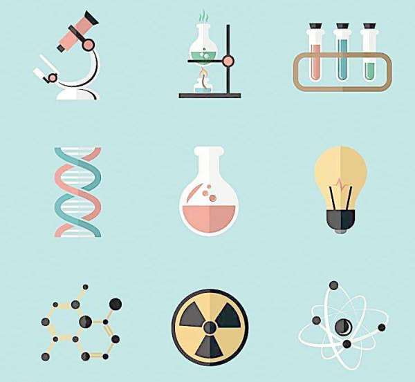

# Glossary

## 不确定性原理
* [1] 如何理解海森堡的「不确定性原理」？ https://www.zhihu.com/question/27223172

## 货币M2
* [1] M2（反映货币供应量的重要指标）_百度百科 https://baike.baidu.com/item/M2/121#

广义货币供应量（M2）是指流通于银行体系之外的现金加上企业存款、居民储蓄存款以及其他存款，它包括了一切可能成为现实购买力的货币形式，通常反映的是社会总需求变化和未来通胀的压力状态。 近年来，很多国家都把M2作为货币供应量的调控目标。 投资有风险，投资需谨慎。

## 债务重组
* [1] 债务重组_百度百科 https://baike.baidu.com/item/%E5%80%BA%E5%8A%A1%E9%87%8D%E7%BB%84/4370048#
债务重组，是指在不改变交易对手方的情况下，经债权人和债务人协定或法院裁定，就**清偿债务的时间、金额或方式等重新达成协议的交易**。 也就是说，只要修改了原定债务偿还条件的，即债务重组时确定的债务偿还条件不同于原协议的，均作为债务重组。

## 道、法、术、器、势
* [1] 道家精髓思想：道法术器势  https://xw.qq.com/amphtml/20210704A093GV00
* [2] 什么是道法术器？https://zhuanlan.zhihu.com/p/137343992

* 道、法、术、器、势，是老子《道德经》的精髓思想[1]

* **道**: “道”是天道，是最终的真理，囊括整个世界和宇宙的自然法则只可认识不可更改。
* **法**: “法”是规则，是原则，是方法论，是“人定”；
* **术**: 术，是形式，是方式，是技术上的手段。
* **器**: 器，是工具。工具的作用就是提高效率和把复杂的问题简单化。
* **势**: 势，是从“道、法、术、器”体现的势能。势也是一种惯性，是一种发展方向，它本身蕴含着无穷无尽的能量。[1]

* 道、法、术、器的层次[2]

* **“器”**: 是指有形的物质或有形的工具，有句话叫“工欲善其事，必先利其器”，上面故事中的车就是“器”。
* **“术”**: 是指技术层面上的操作方法，说的是技能优劣、效率高低。例如我们的驾驶技术就是“术”。
* **“法”**: 是方法、路径、决策，有句话说“选择比努力重要”。例如一个人走普通公路与一个人走高速公路就是一种“法”的体现。
* **“道”**: 是灵魂，是方向，是指导思想，例如你的最终目的地是广州，从山东出发，结果往北京方向开，其实“道”就错了。

## 马尔萨斯陷阱
* [1] 马尔萨斯陷阱- 维基百科，自由的百科全书 https://zh.wikipedia.org/zh-hans/%E9%A9%AC%E5%B0%94%E8%90%A8%E6%96%AF%E9%99%B7%E9%98%B1
* [2] 马尔萨斯陷阱具体指什么？ https://www.zhihu.com/question/62311895

* 马尔萨斯陷阱，又称为“马尔萨斯灾难”，以政治经济学家托马斯·罗伯特·马尔萨斯命名，认为**对大部分人类历史来说，收入停滞的原因是因为技术的进步与发现仅仅造成人口的增加而没有提高人类的生活水准**。只是在1800年左右开始的工业革命才使得一些国家的人均收入大幅增加，同时他们也跳出陷阱。[1]

* 1.口按几何级数增长，而粮食只能按算术级数增长，所以不可避免地要导致饥馑、战争和疾病。2.每一次技术革命退潮，人类又滑入“马尔萨斯陷阱”。[2]

## 卡尔达舍夫尺度
* [1] 卡尔达肖夫指数- 维基百科，自由的百科全书 https://zh.wikipedia.org/zh-hans/%E5%8D%A1%E5%B0%94%E8%BE%BE%E8%82%96%E5%A4%AB%E6%8C%87%E6%95%B0

卡尔达肖夫指数（英语：Kardashev Scale，俄语：Шкала Кардашёва，又译卡尔达肖夫尺度）是根据一个文明所能够利用的能源量级，来量度文明层次及技术先进程度的一种假说。[1]

## 或然性
*https://zhidao.baidu.com/question/2121622461765009627.html*

或然性就是概率的意思。科学依靠的就是或然性(概率)而不是绝对性。可以说,心理科学的研究都要揭示其或然性。 统计学通过对某些数据的处理后能告诉人们在某一特定情境下,事件的或然性是多大。如果一个事件为随机事件，那么我们就称这个事件具有或然性，也就是不确定性

## Computational photography
*https://en.wikipedia.org/wiki/Computational_photography*

Computational photography refers to digital image capture and processing techniques that use digital computation instead of optical processes. Computational photography can improve the capabilities of a camera, or introduce features that were not possible at all with film based photography, or reduce the cost or size of camera elements.

## BDFL (Benevolent dictator for life)
*https://en.wikipedia.org/wiki/Benevolent_dictator_for_life*

Benevolent dictator for life is a title given to a small number of open-source software development leaders, typically project founders who retain the final say in disputes or arguments within the community. The phrase originated in 1995 with reference to Guido van Rossum, creator of the Python programming language.

## 圣贤
*https://www.zhihu.com/question/268972084*

为天地立心，为生民立命，为往圣继绝学，为万世开太平

## 格物致知 知行合一
*https://zhuanlan.zhihu.com/p/55510255*

* 格物致知
  * 通过在日常一言一行的生活和实践之中，抱着探寻真理的态度和方法，对所有事物从表面现象到本质特性，由末逐本，逐渐的归纳总结，领悟真知和规律，然后一步步将真知和规律与现实生活和社会实践相结合，并形成自身的价值判断系统，并最终把真知和善贯彻于自我的思想和行为之中。
* 知行合一
  * "知" - 自然和人类的善与良知，即认知宇宙的运动变化规律和发展进化趋势，以及人类的运动变化规律和发展进化趋势之后，能够辨析什么是符合这个发展变化趋势的思想和行为，并自觉的运用人类最高道德标准对自我进行改良和激励，始终以坚强的意志执行力将良知和善贯彻到"行" - 我们自身持续的思想和行为之中，才是真正的领悟了善和良知并做到了知与行的高度连贯统一

## 买办阶级
*https://baike.baidu.com/item/%E4%B9%B0%E5%8A%9E%E9%98%B6%E7%BA%A7*

买办阶级出现在近代鸦片战争之后，是联系中国与外国商人之间的桥梁，是帝国主义剥削和压迫本国人民的工具和奴才，买办的实质是外国侵略中国经济的工具，阻碍了中国工商业的发展

## 世界所有学科目录和分类
*https://zhidao.baidu.com/question/562794115.html*

1. 空bai间科学(太空科学)：空间天文、空间生命科学、太空化学、航天动力学、天体测量学、天文学、空间物理、太阳化学、星系天文学、银河天文学、物理宇宙学、天体地质学、行星学、太阳天文学、星学

2. 地球科学：生物地理学、地图学、气候学、海岸地理学、大地测量学、地理学、地质学、地貌学、地球统计学、地球物理学、冰川学、水文学、水文地质学、矿物学、气象学、海洋学、古气候学、古生物学、岩石学、湖沼学、地震学、土地科、测绘学、火山学    

3. 环境科学：环境科学物理学、环境化学、环境生物学、环境地学、环境土地科学

4. 生命科学：解剖学、太空生物学、生物化学、生物资讯学、生物学、生物物理学、生物工程学、鸟类学、细胞生物、亲缘分支分类法、细胞学、发育生物学、生态学、胚胎学、昆虫学、流行病学、动物行为学、演化生物学、演化发育生物学、淡水生物学

优生学、遗传学、群体遗传学、基因体学、蛋白质组学、组织学、免疫学、海洋生物学、微生物学、分子生物学、形态学、神经科学、个体发生学、藻类学、种系发生学、体质人类学、物理治疗、生理学、群体动力学、结构生物学、生物分类学、毒理学、病毒学、动物学、植物学

5. 化学：分析化学、色谱法光谱学、生物化学、分子生物、环境化学、地球化学、无机化学、材料科学、纳米科技、药物化学、核化学、有机化学、有机金属化学、药理学、药剂学、物理化学、电化学、量子化学、高分子化学、超分子化学、理论化学、计算化学、立体化学、热化学、

6. 物理学：声学、数学物理、土壤物理学、原子、分子及光学物理学、物理物理学史、生物物理学 、计算物理学、凝聚态物理学、低温物理学、动力学、流体动力学、地球物理学、材料科学、力学、原子核物理学、光学、高能物理学、等离子物理学、高分子物理学、热力学、静力学、固体物理学、车辆动力学、量子力学、弦理论、

7. 人类学：应用人类学、宗教人类学、考古学、文化人类学、人种生物学、民族志民族学、民族诗学、人类发展学、人类性学、 实验性考古学、历史的考古学、人类语言学 、人类医学、人类物理学 、人类心理学、动物考古学、人口学

8. 经济学：总体经济学、微观经济学、行为经济学、生命经济学、发展经济学、计量经济学、经济地理学、经济史、经济社会学、能量经济学、创业者经济学、环境经济学、主张男女平等经济学、金融经济学、绿化经济学、产业组织理论、国际经济学

制度经济学经济学、劳动经济学、法律与经济学、管理人经济学、数理经济学、货币经济学、物理经济学公共财政公共经济学、平台经济学、不动产经济学、资源经济学、社会主义经济学、福利经济学、计算经济学、计量经济学、演化经济学、实验经济学、社会心理学、神经元经济学、政治经济学、经济社会学、交通经济

9. 心理学：行为分析、生物心理学、认知心理学、临床心理学、文化心理学、发展心理学、教育心理学、实验心理学、法庭心理学、健康心理学、人本主义心理学、企业及组织心理学、神经心理学、人格心理学、测定学、宗教心理学、心理物理学、物质心理学、知觉社会心理学、犯罪学、

10. 语言学：历史语言学、构词学、语音学、音韵学、语义学、符号学、语法学、语源学    

11. 艺术学：美术学、设计学、音乐学、文学、戏剧学、电影学、舞蹈学、曲艺学、杂技学、周边艺术学、

12. 认知科学：认知神经科学、认知心理学、神经科学、心理语言学、

13. 计算机科学、计算理论、自动机械装置理论、可计算性理论、计算复杂性理论、同作理论算法、随机化算法、分散算法、并行算法、数据结构、电脑系统结构、大规模集成电路设计、操作系统、电脑网络、信息论、互联网、万维网无线网络、电脑放御及效能、密码学、

错误容忍算法、分布式计算、网格计算、并行计算、高性能算法、量子电脑、电脑图形学、图像处理科学形象、计算几何软件工程形式化程序(形式化验证)、编程语言、编程范型

面向对象程序设计、函数式编程、形式语义学、类型论、编译器同步编程语言、资讯学、数据库、关联式数据库、分布式数据库、对象数据库、多媒体、超媒体、资料挖掘、资讯检索、

人工智能认知科学、自动化推理、机器学习人工神经网络、自然语言处理 (计算语言学))、电脑视觉专家系统、机器人学、人机互动、数值分析、符号计算、

数位电脑理论、数学电脑学、科学电脑学、生物电脑学、物理电脑学、化学电脑学、神经科学电脑学、电脑助手工程学、有限元分析、计算流体力学、经济电脑学、社会电脑学、金融工程学、数位人文学科、信息管理系统、资讯科技、医学信息学、电脑与社会、使用电脑的历史、人道资讯学、公众资讯学    

14. 工程学：航空工程、航天工程、农业工程、农业科学、生医工程、化学工程、土木工程、计算机工程、控制工程、电机工程、语言工程、海洋工程、机械工程、制造工程、矿业工程、核工程、软件工程、运输工程、工业工程、

15. 健康学：环境医学、牙医学、流行病学、医学、兽医学、解剖学、皮肤学、妇科学、免疫学、内科学、神经学、眼科学、病理学、病理生理学、儿科学、药理学、物理治疗、生理学、精神病学、影像诊断学、毒物学    

17. 数学：数学史、数理逻辑与数学基础、数论、代数学、代数几何学、几何学、拓扑学、数学分析、非标准分析、函数论、常微分方程、偏微分方程、动力系统、积分方程、泛函分析、计算数学、概率论、数理统计学、运筹学、组合数学、模糊数学、应用数学

## 金苹果传说
* [1] 金苹果事件 维基百科，自由的百科全书 https://zh.wikipedia.org/wiki/%E9%87%91%E8%8B%B9%E6%9E%9C%E4%BA%8B%E4%BB%B6

金苹果事件（英语：Golden Apple of Discord），是希腊神话中一场间接导致特洛伊战争的，发生在三女神之间的纠纷。