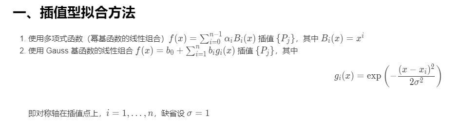
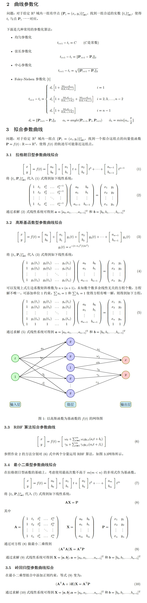

## 数值分析基础

### 插值方法
* [1] 数值分析：数据插值方法 https://blog.csdn.net/pipisorry/article/details/62227459

#### Catmull-Rom 插值
* [1] Catmull-Rom插值算法 https://blog.csdn.net/wsf09/article/details/103453496
* [2] Bezier曲线与Catmull-Rom曲线 https://blog.csdn.net/u012154588/article/details/98977717
* [3] catmull-rom 样条(spline)公式推导 https://zhuanlan.zhihu.com/p/111708587
* [4] `\dev-asset\graphics\Math\CatmullRomSpline.py`

> 公式推导[2]

由上述公式可推出经过四个点$(P_0, P_1, P_2, P_3)$的曲线方程为$B(t)=a+b*t+c*t^2+d*t^3$

其切线方程为$C(t)=b+2*c*t+3*d*t^2$

满足如下几个条件: TO
* (1) $B(0)=P_1, 故\  a=P_1$ 
* (2) $C(0)=\frac{P_2-P_0}{2}, 故\  b=\frac{P_2-P_0}{2}$ 
* (3) $B(1)=P_2, 故\  a+b+c+d=P_2$
* (4) $C(1)=\frac{P_3-P_1}{2}, 故\ b+2c+3d=\frac{P_3-P_1}{2}$
* 由上诉(1)(2)(3)(4)可推出
* $a=P_1$
* $b=\frac{P_2-P_0}{2}$
* $c=\frac{2P_0-5P_1+4P_2-P_3}{2}$
* $d=\frac{-P_0+3P_1-3P_2+P_3}{2}$

> 算法推导[1]

作为一个立方插值函数，抽象原型如下，我们需要做的就是求出下式中的$C_0, C_1, C_2, C_3$

$p(u)=c_0+c_1u+c_2u^2+c_3u^3 = \sum_{k=0}^{3}cku^k$

<div align=center>

</div>

* 首先根据上幅图中最下面那幅图片，控制点是$p_{i+1}$和$p_{i-2}$，生成的样条是$p_{i-1}$和$p_i$之间，这是一个立方插值函数，所以为了过这两个样条点，我们需要让式子满足下方的公式(1)(2)

<iframe src="https://www.desmos.com/calculator/dusho2tdks?embed" width="500" height="500" style="border: 1px solid #ccc" frameborder=0></iframe>

* 上幅图中是关于x的函数f(x)，与关于u的函数p(u)是一样的，为了得到这两个样条点，我们可以列出等式，首先让x=0时等于第一个样条点，然后让x=1时等于第二个样条点，**为什么不让x=2或者x=3的时候等于第二个样条点呢？** 我们观察得知，当x=0，函数的值由$c_1$控制，x=1时，函数值由$c_1+c_2+c_3+c_4$控制，由此可以确定下式(1)(2),在根据性质确定(3)(4)

* 已知 切线方程为$C(t)=b+2*c*t+3*d*t^2$
* $\tau$是一个系数用于控制扭曲程度
* 根据图片可以得到
  * (1) $p(0)=p_{i-1}$
  * (2) $p(1)=p_i$
  * (3) $p'(0)=\tau(p_i-p_{i-2})$
  * (4) $p'(1)=\tau(p_{i+1}-p_{i-1})$
* 将参数0、1代入即可得：
  * 带入0得$p(0)=c_0$, 又根据(1)得 $c_0=p_{i-1}$
  * 带入1得$p(1)=c_0+c_1+c_2+c_3$,又根据(2)得 $c_0+c_1+c_2+c_3=p_i$
  * 根据切线方程，带入0得$p'(0)=b$ 切线方程需要满足$\tau(p_i-p_{i-2})=c(0)$，得$b=\tau(p_i-p_{i-2})$
  * 根据切线方程，带入1得$p'(1)=b+2c+3d$, 切线方程需要满足$\tau(p_{i+1}-p_{i-1})=c(1)$,得$b+2c+3d=\tau(p_{i+1}-p_{i-1})$
* 整理得
<div align=center>

</div>

注意：我们的控制点虽然有4个，但是绘制的曲线却只能够通过中间的两个点。这就带来 如果想曲线同时过这四个点，该怎么处理的问题。其实处理方法十分简单，我们只要人为的构造一个起点和终点来构成四个控制点即可。比如现在有P0，P1，P2，P3，如果用[P0，P1，P2，P3]构造曲线，曲线将只能够通过P1，P2，为了让曲线能够通过P0和P3，我们可以人为的构造出如下的控制点[2P0 - P1，P0，P1，P2]，以及[P1, P2, P3, 2P3 - P2]。通过这样的方法，就能够绘制一条经过所有控制点的曲线了。

```vex
void catmull_rom( int handle, primnum ; float step ){
    int pts[]=primpoints(handle, primnum), n=len(pts), prim=addprim(0,'polyline') ; 
    // t is a controller, you can change it and see changes in curve;
    float t = ch('t') ; 
    vector p[], a0, a1, a2, a3 ; 

    // compute coefficent and create two endpoint(p-,p+) ; 
    // push( p , 2*vector(point(handle,'P',pts[0]))-vector(point(handle,'P',pts[1])) );
    push( p , vector(point(handle,'P',pts[0]))-set(0.2,0,0) );  // for cross the first point
    push( p , vector(point(handle,'P',pts[0])) );
    push( p , vector(point(handle,'P',pts[1])) ); 
    push( p , vector(point(handle,'P',pts[2])) ); 
    push( p , vector(point(handle,'P',pts[3])) ); 
    push( p , vector(point(handle,'P',pts[3]))-vector(point(handle,'P',pts[2])) );  // for cross the last point

    // generate 3 subsection catmull-rom curve ; 
    for( int i=0 ; i<3 ; ++i ){
        a0 = p[i+1] ; 
        a1 = -t*p[i] + t*p[i+2] ; 
        a2 = 2*t*p[i] + (t-3)*p[i+1] + (3-2*t)*p[i+2] - t*p[i+3] ; 
        a3 = -t*p[i] + (2-t)*p[i+1] + (t-2)*p[i+2] + t*p[i+3] ; 

        // generate curve ; 
        for( float u=0 ; u<1 ; u+=step ){	// why 0<u<1? cause of we use p(0) and p(1) to interpolate the curve 
											// between p_0 and p_1 point
            int pt = addpoint( 0 , a0 + a1*u + a2*u*u + a3*u*u*u ) ; 
            addvertex( 0 , prim , pt ) ; 
        }
    }
}

removeprim( 0 , @primnum , 1 ) ; 
catmull_rom( 0 , @primnum , ch("step")<0.001?0.001:ch("step") ) ; 
```


#### 多项式插值

#### 线性插值

#### 二次插值

#### Cubic插值

#### 拉格朗日多项式插值

#### 牛顿插值

#### 埃尔米特插值

#### 样条插值

##### B-样条
* [1] 关于 Houdini 中的 Ramp float
* [2] `\dev-asset\graphics\Math\BSpline.py`
* [3] 贝塞尔曲线与B样条曲线 https://www.biaodianfu.com/bezier-curve-and-b-spline.html
* [4] B样条曲线 https://zhuanlan.zhihu.com/p/50450278
* [5] 曲线篇：深刻理解B 样条曲线（上）https://zhuanlan.zhihu.com/p/139759835
* [6] 曲线篇：深刻理解B 样条曲线（下）https://zhuanlan.zhihu.com/p/140921657
* [7] 1.4.1 B-splines https://web.mit.edu/hyperbook/Patrikalakis-Maekawa-Cho/node16.html
* [8] hyrodium/BasicBSpline.jl-src/_BSplineBasis.jl https://github.com/hyrodium/BasicBSpline.jl/blob/master/src/_BSplineBasis.jl
* [9] BasicBSpline.jl-doc https://hyrodium.github.io/BasicBSpline.jl/stable/
* [10] B-spline https://en.wikipedia.org/wiki/B-spline

> B-spline basis functions ${B}_{(i,p,k)}(t)$ [8]

	$$
	\begin{aligned}
	{B}_{(i,p,k)}(t)
	&=
	\frac{t-k_{i}}{k_{i+p}-k_{i}}{B}_{(i,p-1,k)}(t)
	+\frac{k_{i+p+1}-t}{k_{i+p+1}-k_{i+1}}{B}_{(i+1,p-1,k)}(t) \\
	{B}_{(i,0,k)}(t)
	&=
	\begin{cases}
		&1\quad (k_{i}\le t< k_{i+1})\\
		&0\quad (\text{otherwise})
	\end{cases}
	\end{aligned}
	$$

B 样条是在 bezier 曲线的背景下发展出来的曲线，他保留了 bezier 曲线的所有优点，同时解决了 bezier 曲线的缺点。b 样条是一条固定次数的光滑曲线，本质上是多个 bezier 曲线拼接而成[1]

> 什么是B样条？[3]

Bezier曲线在外形设计的应用中存在一些具体的不足之处：

* 确定了多边形的顶点数（m个），也就决定了所定义的Bezier曲线的阶次（m-1次），这样很不灵活。
* 当顶点数（m）较大时，曲线的阶次将比较高。此时，多边形对曲线形状的**控制将明显减弱**。
* Bezier的调和函数的值，在开区间`（0,1）`内均不为`0`。因此，所定义的曲线在`（0<t<1）`的区间内的任何一点均要受到全部顶点的影响，即**改变其中任一个顶点的位置，都将对整条曲线产生影响**，因此对曲线进行局部修改是不可能的。

B样条是对贝塞尔曲线的一般化。因而，Bezier曲线能表达的，B样条也同样可以。而且，因为B样条引入了控制点个数与曲线阶次无关的特性，使得我们可以对低阶曲线有了更好的控制能力。而且，通过对节点序列的控制，使得我们对曲线有自由的调节能力。因此，B样条曲线在外形设计中得到了更广泛的重视和应用。

###### De Boor's algorithm
* [1] De Boor's algorithm https://en.wikipedia.org/wiki/De_Boor%27s_algorithm
* [2] B-Spline(六):给定参数求点(de Boor 算法) http://www.whudj.cn/?p=535
* [3] de Boor's algorithm http://www.inf.ed.ac.uk/teaching/courses/cg/d3/deBoor.html

$P_i^r(t)=(1-a_{i,r})P^{r-1}_{i-1}(t)+a_{i,r}P^{r-1}_i(t)$ <br> $P_i^0=P_i$ <br> $a_{i,r}=\frac{t-t_i}{t_{i+n-r}-t_i}$


##### Bezier样条
* [1] 贝塞尔曲线与B样条曲线 https://www.biaodianfu.com/bezier-curve-and-b-spline.html

贝塞尔曲线分类 - 贝塞尔曲线根据控制点的数量分为：

* 一阶贝塞尔曲线（2 个控制点）
* 二阶贝塞尔曲线（3 个控制点）
* 三阶贝塞尔曲线（4 个控制点）
* n阶贝塞尔曲线（n+1个控制点）

[Resource-贝塞尔曲线与B样条曲线](../_resources/resource#贝塞尔曲线与B样条曲线)

[Resource-贝塞尔曲线与B样条曲线-Image](https://cdn.jsdelivr.net/gh/aaronmack/image-hosting@master/mathematics/贝塞尔曲线与B样条曲线.rn6wiab03ts.png)

* n阶贝塞尔曲线公式: <br> $B(t)=\sum_{i=0}^{n} C_n^i P_i(1-t)^{n-i}t^i, t\in [0,1]$, 即 $B(t)=\sum_{i=0}^{n}P_i b_{i,n}(t), t\in [0,1]$

```vex
int step=chi("step");
float interval=1.0/step;
vector p_0 = point(0, "P", 0);
vector p_1 = point(0, "P", 1);
vector p_c0 = chv("point_c0");
vector p_c1 = chv("point_c1");
int prim0 = addprim(0, "polyline");

for(float t=0;t<1;t+=interval){
    if(0){
        vector pos = (1-t)*p_0+t*p_1;
        int pt=addpoint(0, pos);
    }
    
    if(0){
        vector p_na_0 = (1-t)*p_0+t*p_c0;
        vector p_na_1 = (1-t)*p_c0+t*p_1;
        vector pos = (1-t)*p_na_0+t*p_na_1;
        int pt=addpoint(0, pos);
        addvertex(0, prim0, pt);
    }
    
    if(1){
        vector p_na_0 = (1-t)*p_0+t*p_c0;
        vector p_na_c = (1-t)*p_c0+t*p_c1;
        vector p_na_1 = (1-t)*p_c1+t*p_1;
        
        vector p_na1_0 = (1-t)*p_na_0+t*p_na_c;
        vector p_na1_1 = (1-t)*p_na_c+t*p_na_1;
        vector pos = (1-t)*p_na1_0+t*p_na1_1;
        int pt=addpoint(0, pos);
        addvertex(0, prim0, pt);
    }
}
```

##### NURBS样条

### 最佳逼近问题
* [1] 函数的最佳逼近问题：最小二乘法 https://blog.csdn.net/xfijun/article/details/103723361

<div align=center>

</div>

### 曲线插值拟合方法与实现 (多项式插值, 高斯基函数插值, 最小二乘多项式拟合， 岭回归拟合)

<div align=center>

</div>

<div align=center>

</div>

### 插值型拟合方法

<div align=center>

</div>

#### 拉格朗日插值
* [1] 常见的插值和拟合方法 https://zhuanlan.zhihu.com/p/98431641
* [2] GAMES102\homeworks\hw1\README.md
* [3] GAMES102\homeworks\project\src\hw1\Systems\CanvasSystem.cpp

<div align=center>

</div>

```c++
float PAI(const std::vector<Ubpa::pointf2>& P, int j, float x)
{
	int n = P.size();
	float numerator = 1;
	float denominator = 1;
	for (int k=0; k<n; ++k)
	{
		if (j == k)
		{
			continue;
		}
		numerator *= (x - P[k][0]);
		denominator *= (P[j][0] - P[k][0]);
	}
	return numerator / denominator;
}

float Polynomial(const std::vector<Ubpa::pointf2>& P, float x)
{
	int n = P.size();
	float sum = 0;
	for (int j=0; j<n; ++j)
	{
		sum += P[j][1] * PAI(P, j, x);
	}
	return sum;
}
```

#### 高斯基函数插值
* [1] GAMES102\homeworks\hw1\README.md
* [2] GAMES102\homeworks\project\src\hw1\Systems\CanvasSystem.cpp


```c++
float Gauss(const std::vector<Ubpa::pointf2>& P, float x)
{
	int n = P.size();
	if (n == 0)
	{
		return 0;
	}
	float theta = 100;
	Eigen::MatrixXf A(n, n);
	for (int row=0; row<n; ++row)
	{
		for (int col=0; col<n; ++col)
		{
			A(row, col) = (std::exp( - (P[row][0] - P[col][0]) * (P[row][0] - P[col][0]) / (2*theta*theta) ));
		}
	}
	Eigen::VectorXf b(n);
	for (int i=0; i<n; ++i)
	{
		b(i) = P[i][1];
	}
	Eigen::VectorXf a = A.colPivHouseholderQr().solve(b);
	float result = 0;
	for (int j=0; j<n; ++j)
	{
		result += a[j] * (std::exp( - (x - P[j][0]) * (x - P[j][0]) / (2*theta*theta) ));
	}
	return result;
}
```

### 逼近型拟合方法

- 固定幂基函数的最高次数m (m<n)，使用最小二乘法：$\min E$，其中 $E(x)=\sum_{i=0}^{n}(y_i-f(x_i))^2$ 拟合 $\{P_j\}$。
- 岭回归（Ridge Regression）：对上述最小二乘法误差函数增加 $E_1$ 正则项，参数 $\lambda$，$\min (E+\lambda E_1)$，其中 $E_1=\sum_{i=1}^n\alpha_i^2$ 

#### 最小二乘逼近 (最小二乘法)
* [1] 函数的最佳逼近问题：最小二乘法 https://blog.csdn.net/xfijun/article/details/103723361
* [2] GAMES102\homeworks\hw1\README.md
* [3] 最小二乘法 https://zh.wikipedia.org/wiki/%E6%9C%80%E5%B0%8F%E4%BA%8C%E4%B9%98%E6%B3%95
* [4] 线性代数笔记：最小二乘逼近 https://zhuanlan.zhihu.com/p/92014073
* [5] [Games102-Notes-函数拟合的最小二乘法问题](../life/math/games102_notes#_21-函数拟合的最小二乘法问题)
* [6] 最小二乘法求解步骤 https://blog.csdn.net/hezhefly/article/details/79517684

<div align=center>

</div>

<div align=center>

</div>

```c++
float LeastSquares(const std::vector<Ubpa::pointf2>& P, float x, int m)
{
	int n = P.size();
	if (n == 0)
	{
		return 0;
	}
	if (m >= n)
	{
		m = n - 1;
	}
	Eigen::MatrixXf X(n, m);
	for (int i=0; i<n; ++i)
	{
		for (int j=0; j<m; ++j)
		{
			X(i, j) = std::powf(P[i][0], j);
		}
	}
	Eigen::VectorXf Y(n);
	for (int i=0; i<n; ++i)
	{
		Y(i) = P[i][1];
	}
	Eigen::VectorXf Theta = (X.transpose() * X).inverse() * X.transpose() * Y;
	//Eigen::VectorXf Theta = X.bdcSvd(Eigen::ComputeThinU | Eigen::ComputeThinV).solve(Y);
	float result = 0;
	for (int j=0; j<m; ++j)
	{
		result += Theta[j] * std::powf(x, j);
	}
	return result;
}
```

* 求解步骤实例：

[resource-最小二乘法求解步骤]

#### 高斯拟合
* [1] 基于C语言的高斯曲线拟合原理以及实现 https://blog.csdn.net/dingzj2000/article/details/103719368

<div align=center>

</div>

#### 岭回归（Ridge Regression）
* [1] 岭回归 https://baike.baidu.com/item/%E5%B2%AD%E5%9B%9E%E5%BD%92/554917

岭回归(英文名：ridge regression, Tikhonov regularization)是一种专用于共线性数据分析的有偏估计回归方法，实质上是一种改良的最小二乘估计法，通过放弃最小二乘法的无偏性，以损失部分信息、降低精度为代价获得回归系数更为符合实际、更可靠的回归方法，对病态数据的拟合要强于最小二乘法 [1]

```c++
float RidgetRegression(const std::vector<Ubpa::pointf2>& P, float x, float lamda, int m)
{
	int n = P.size();
	if (n == 0)
	{
		return 0;
	}
	if (m >= n)
	{
		m = n - 1;
	}
	Eigen::MatrixXf X(n, m);
	for (int i = 0; i < n; ++i)
	{
		for (int j = 0; j < m; ++j)
		{
			X(i, j) = std::powf(P[i][0], j);
		}
	}
	Eigen::VectorXf Y(n);
	for (int i = 0; i < n; ++i)
	{
		Y(i) = P[i][1];
	}
	Eigen::MatrixXf I(m, m);
	I.setIdentity();
	Eigen::VectorXf Theta = (X.transpose() * X + I*lamda).inverse() * X.transpose() * Y;
	float result = 0;
	for (int j = 0; j < m; ++j)
	{
		result += Theta[j] * std::powf(x, j);
	}
	return result;
}
```


#### Bernstein多项式逼近
* Bernstein基函数的良好性质：非常好的几何意义
  * 正性、权性（和为1） ->  凸包性
  * 变差缩减性
  * 递归线性求解方法
  * 细分性

#### RBF函数拟合
* [1] RBF神经网络和拟合实例 https://blog.csdn.net/napoyong/article/details/108553705

<div align=center>

</div>

* 【1】 g(0,1) 标准高斯
* 【2】 当n足够多，它所张成的空间可以逼近所有函数

```python
import torch
import torch.nn as nn
import numpy as np

class RBFKernelStd(nn.Module):
    def __init__(self):
        super(RBFKernelStd, self).__init__()
        self.coefficient = 1 / np.sqrt(2 * np.pi)
        
    def forward(self, x):
        return torch.exp(-0.5 * x * x) * self.coefficient

class RBF1D(nn.Module):
    def __init__(self, n_params=20):
        super(RBF1D, self).__init__()
        self.n_params = n_params
        self.kernel = RBFKernelStd()
        self.one = torch.Tensor([1.])
        self.a = nn.Parameter(torch.ones(self.n_params), requires_grad=True)
        self.b = nn.Parameter(torch.ones(self.n_params), requires_grad=True)
        self.linear = nn.Linear(n_params, 1, bias=True)
        #self.w = nn.Parameter(torch.ones(self.n_params + 1), requires_grad=True)
        self.init()
    
    def init(self):
        self.a.data.normal_(0, 0.2)
        self.b.data.normal_(0, 0.2)
        #self.w.data.normal_(0, 0.2)
        self.linear.weight.data.normal_(0, 0.2)
        
    def forward(self, x):
        g = self.kernel(self.a * x + self.b)
        #g_aug = torch.cat([g, self.one], dim=0)
        y = self.linear(g)#torch.dot(self.w, g_aug)
        return y

```

### 曲线参数化方法与实现

<div align=center>

</div>

<div align=center>

</div>