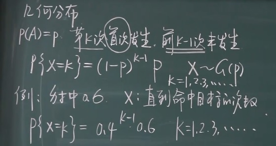
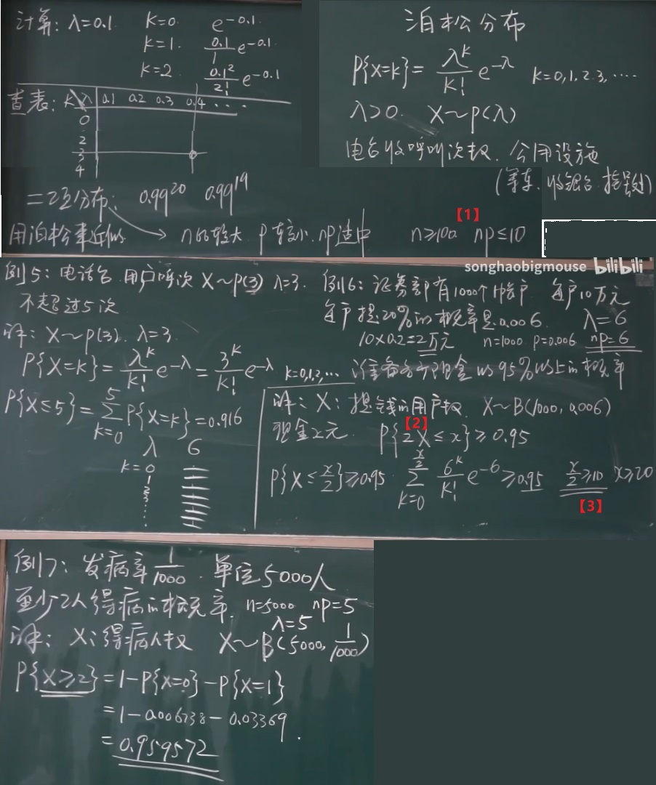
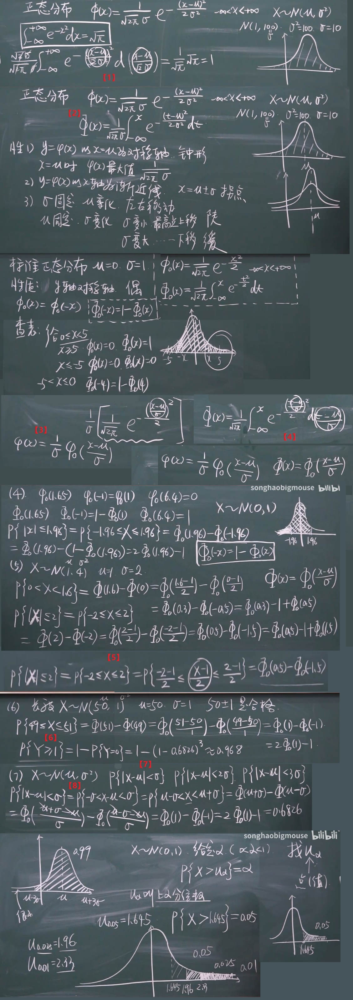

# 疑惑点

> 概率密度函数求积分就是分布函数吗？https://www.zhihu.com/question/21911186

* [1] 概率密度函数是概率分布函数求导吗？ - 知乎 

* TO

> 为什么连续型分布函数求导是概率密度函数？

* 白话理解：累积分布函数记录的是"面积"的增长水平，一个原来的图像在一维情况下是一个山坡，那么刚开始的时候累积的面积就缓慢增加，直到坡顶，然后开始下坡，此时面积增长就开始缓慢了，但也在增长，所以累积分布函数可以很好的反映出概率的变化情况；还记得求导的含义的吗，一段极小的变化所产生的变化，所以这里对分布函数求导就可以准确反映出概率的情况

> 导数、概率密度、积分、分布函数、二维连续型中偏导数之间的关系

* [1] 导数、概率密度和积分的关系理解 https://blog.csdn.net/qieziming/article/details/89358902

* TO

# 概率论基础

## 概念与术语
* [1] https://blog.csdn.net/m0_37443131/article/details/81298997 https://blog.csdn.net/m0_37443131/article/details/81298997

* 确定性(必然): 一定发生（或不发生）
* 随机(偶然): 可能发生，可能不发生
* 统计规律: 对事情做大量的重复性的实验，最终试图找到它的的某种规律
* P(AB)与P(A|B)，前者是AB都发生的概率(交集)，后者是B发生的基础上A发生的概率，样本空间不一样
* P(AB)——事件A、B同时发生的概率,即联合概率. 联合概率表示两个事件共同发生的概率.A 与B 的联合概率表示为P(AB) 或者P(A,B)。 P(B)——事件B发生的概率. 条件概率 示例：就是事件A 在另外一个事件B 已经发生条件下的发生概率.[1]

## 随机事件与概率 

### 随机实验与随机事件 &  样本空间与事件的集合表示

### 事件间的关系

### 概率的初等描述

### 古典概型(排列组合)

### 几何概型

### 概率与频率

### 公理化

### 条件概率

* $n_b$是B里面有多少个样本点
* $n_{ab}$是B发生的前提下A发生了
* P(AB) AB同时发生的概率

### 乘法公式

### 全概率公式

### 贝叶斯公式

* $P(A_k|B) =\frac{P(A_k)P(B|A_k)}{...}$

> $P(A_k)P(B|A_k)=P(A_kB)$ 根据乘法公式

### 事件的独立性

* 定义：A的概率不受B发生与否的影响
  * P(A|B) = P(A) -即使在B发生的情况下，A发生了与A发生的概率一样
  * 具有对称性
* 定义1.6 比较通用

* Ω空间与概率等于1不是一回事，几何概型中，落在0与1的概率为0，但有可能落在0与1上，在开区间(0,1),落在它的概率为1，但不是Ω样本空间(缺少了0与1这两个点)
* Ω的概率是1，但概率等于1不一定是Ω，φ的概率为0，但概率为不一定是φ
* P(ABC) = P(A)P(B)P(C)

* 例3，2)三人都投中 3）至少一人投中 [这里不要直接正面求，求反面也就是至少一人不中]

* 【1】在B逆发生的前提下，A发生的概率与A逆发生的概率相加等于1
* 【2】这个 | 相等于比；这里用的是乘法公式
* 【3】一般我们将$P(A\overline{B})$写成$P(A-B)$;又一般写成$P(A-AB)$

### 伯努利模型

* 【1】除了可以使用杨辉三角展开，还可以从概率的角度出发展开，a出现了n次，就是a^n, a出现n-1次，那么b就出现一次 a^{n-1}b,以此类推

## 随机变量及其分布

### 随机变量的概念

* 【1】 用X=a表示一个事件，P{X=a}表示这个事件的概率

### 离散型随机变量及其概率分布

* 大写的X表示变量，小写的x是具体的取值

### 连续性随机变量及其概率密度函数

* 【1】一个区间的概率大于一个点，区间包含着点；所以只能等于0；还有反证法，假设落在一个点上的概率为0.00001，但是点有无穷多个，所以不成立
* 【2】例如开区间(0,1)，虽然概率为1，但也有可能落在0或者1上； 虽然落在0.5点上概率为0，但任然有可能落在0.5上
* 【3】概率密度函数，我们不能直接想象成函数图像，而是应该像之前一样，**想象成取得每一段都很小的直方图**；在概率密度函数上取一点的概率为0，我们之前说过，那么到底在取的这一点上代表什么呢？**代表取附近的区域的值的大小**
* 【4】0比0型，洛必达法则求导；△x对△x求导是1，变上限积分求导，将x+△x代入f(x)中，对△x求导x看做常数，△x就是1，又△x趋于0，所以就是f(x)

### 分布函数
* [1] 概率分布函数、概率密度函数 https://zhuanlan.zhihu.com/p/138401151
* [2] 怎样通俗地理解分布函数？ https://www.zhihu.com/question/26298175

* 概率函数[1]
  * 概率函数，也称作分布律，就是用函数的形式来表达概率。一次只能代表一个随机变量的取值。
  * 函数表达： $p_i=P\{X=x_i\} \ (i=1,2,3,\cdots)$
* 概率分布[1]
  * 概率分布 ,要求把所有可能出现的情况全部都列出来，少一个都不行
  * $\begin{array}{c|c} X & x_1 \ x_2 \ \cdots \ x_n \ \cdots \\ \hline \\ p_i & p_1 \ p_2 \ \cdots \ p_n \ \cdots \\ \end{array}$
* 概率分布函数 和 概率密度函数[1]
  * 概率分布函数
    * 概率分布函数 是概率函数取值的累加结果，只是描述概率的不同手段，所以也叫做累积概率函数
    * 表达式： $F(X)=P(X<x)=\sum_{x_k≤x}p_k$ 这里的 $k$ 有多大，就得取多大
  * 概率密度函数
    * 连续型随机变量的“概率函数”换了一个名字，叫做“概率密度函数”。概率密度函数是分布函数的导函数
    * 表达式: $P(a≤X≤b)=F(b)-F(a)=\int_a^bf(x)dx$
* 直观地理解什么是分布函数: 分布函数就是变量小于等于某个特定值a的概率（或者频率，如果是用数据统计出来的话）也即 $F(a)=P\{X≤a\}$,假设现在有全世界所有人的身高的分布函数，而你的身高是175cm，那么分布函数在175cm处的取值就是所有比你矮或者和你一样高的人占全世界所有人的比例。姚明的身高是226cm，那么分布函数在226cm处的取值就是所有比姚明矮或者和姚明一样高的人占全世界所有人的比例[2]

* 连续的三个条件：1.极限值存在 2.在这一点的函数值存在 3.它的极限值等于它的函数值

* 【1】x≤b，相当于负无穷到b， x≤a相当于负无穷到a，然后减掉，并且减的时候带上a，那么a点就没有了
* 【2】F(a-0)就是它的左极限，因为它减0，从左边逼近，就是左极限；[参考-极限](../life/math/math_concept#极限); F(a)是负无穷到a，包含a点，F(a-0)是从负无穷到a，但是不包含a那个点（这里是求极限，逼近a，但是不达到a），它俩相减，就把a点给减出来了
* 这里为什么前面说了a点或者b点取不取的到都无所谓，但这里又区分，这是因为上述在**离散和连续**的情况下都成立

### 离散型的分布函数
* [1] 为什么随机变量的分布函数要右连续？ https://www.zhihu.com/question/26432043

* 【1】这里用负无穷求不出来a，所以用正无穷
* 【2】这里一定要注意，大写的X是随机变量，这两个小写的x是实数
* 【3】分布函数是左闭右开区间，因为是它的右连续；所以这就是为什么`X ≤ x` [1]
* 【4】这里需要注意区分小x与大X，小x是2≤x＜3，选取的是这个范围内，然后考究小于3，但又取不到3的分布情况（所以就是-1与2）,见[2]
* 【5】为什么火柴圈在右边：因为首先考虑左逼近，在这一点上极限值为0，但是函数值不是0，如果考虑右连续，函数值与极限值相等
* 【6】通过分布函数求出概率，这里是左逼近，也就是往左边偏一点点； 例如以F(0) F(0)-F(0-0), F(0)是3/4, 0往左边偏一点点就是x<0,是个1/2所以最终3/4 - 1/2 = 1/4; x_p是选取的哪一个点，x_k,是这一点上的取值x_k-0是往左偏移一点点的取值

### 连续型的分布函数

* [1] 1/(x^2+1)的原函数是什么 https://zhidao.baidu.com/question/468436795.html
* [2] arctan的正负无穷值是多少？ https://zhidao.baidu.com/question/2265561804793540868.html

* `1/(x^2+1)`的原函数 -> `arctan(x) +C` - 原因如下 - 三角变换
  * 令$x=\tan t$, $t∈(\frac{-π}{2},\frac{π}{2})$, $t= \arctan x$
  * $dx=\frac{dt}{cos^2t} $
  * $\frac{1}{(x^2+1)}=\frac{1}{(tan^2 t+1)}=cos^2 t$
  * $\int \frac{dx}{(x^2+1)} = \int \frac{dt}{cos^2 t} \cos^2 t=\int dt=t+C=\arctan x +C$

* 离散型中是右连续，连续型中是连续的

* 【1】负无穷带进去后是$-\frac{π}{2}$，π与π消掉了; [2]正无穷值：π／2+kπ、负无穷值：-π／2+kπ
* 【2】这里需要分开，从负无穷到0是一段，从0到x是一段；**注意这里是连续型的，端点上有没有无所谓**；例如积分求面积，是否包含两端的线段对面积不影响
* 【3】使用连续型；这里x从0右边正无穷逼近，x趋于0，Ax^2=0，所以求不出来；试一下x从1左边负无穷逼近。x趋于1，Ax^2=A，又因为极限值等于函数值，所以A=F(1)=1
* 【4】这里用概率分布，分别正无穷与负无穷都求不出A，正无穷比最大的1≤x还要大，是1，负无穷比最小的0还要小就是0
* 【5】有了大F(x)后，直接求导可以得到f(x)概率密度函数
* 【6】这里不用真求，带入即可Ax^2即可，A已经知道为1，所以式子为x^2；因为区间刚好落在了0~1之间，所以可以这样做

### 常见随机变量的分布
* [1] 泊松分布 https://wiki.mbalib.com/wiki/%E6%B3%8A%E6%9D%BE%E5%88%86%E5%B8%83
* [2] `programming\coding_python\mathematics\probability_binomial_distribution.py` 二项分布 https://www.cnblogs.com/cgmcoding/p/13534844.html
* [3] 二项分布 几何分布 超几何分布 应该怎么区分？ https://www.zhihu.com/question/38191693
* [4] 十分钟理解超几何分布 https://www.bilibili.com/video/BV1Wo4y1R7sj/

#### 0-1分布
* 二项分布的一种特例

#### 几何分布

* 几何分布说的是，直到首次射中的概率，k的取值范围是k=1,2,3...，因为有可能直到无数次都没有射中
* 如果你需要知道尝试多次能取得第一次成功的概率，则需要几何分布。[3]

#### 二项分布 

* 【1】$C_0^1 \ C_1^1$是一个里面一个都不取与一个里面取一个,概率为1；所以说0-1分布是二项分布的一种特例
* 【2】设某个事件P(A)发生的概率为P
* 【3】最大值;通过[2]程序中的图可以看出，对于固定的n以及p，当k增加时，概率P{X=k}先是随之增加直至达到最大值，随后单调减少。可以证明，一般的二项分布也具有这一性质；1）当（n+1)乘以p不为整数时，二项概率P{X=k}在k=[(n+1)p]时达到最大值(注：[x]为取整函数，即为不超过x的最大整数)；2）当（n+1）p为整数时，二项概率P{X=k}在k=(n+1)p和k=(n+1)p-1时达到最大值。**待求证** 补充1:杨辉三角
* 【4】B就是二项分布，n是做了几次试验，P就是事件A发生的概率
* 【5】1减去不需要维修(也就是1台都没有坏的)概率再减去他可以维修的过来的(也就是刚好坏了一台的)概率

#### 泊松分布

* 泊松分布是离散型的
* 泊松分布的参数λ是单位时间(或单位面积)内随机事件的平均发生率[1]

* 【1】当取值在这范围时，可以用泊松分布近似
* 【2】2X是用户来提的钱，X用户数，2是上面算出的2万，小于等于x
* 【3】找到λ=6那一列，依次加，直到0.95为止，正好加到第10个的时候超过了0.95

#### 超几何分布

* 超几何分布与二项分布的区别在于，超几何分布求不放回的概率

* 【1】当N很大的时候，n相对N很小，可以用二项分布近似，例如在几千万粒种子中取出几个不影响这几千万粒种子的发芽率
* 【2】这里用二项分布依然计算不出来，再用泊松分布近似

#### 连续型的分布

##### 均匀分布

* 【1】对1求积分就是区间的长度相减
* 【2】小f(x)与大F(x)函数图像之间的关系：小f(x)就是求与x轴之间围成的面积，一直到a，围城的面积都是0，然后再完后，面积越来越大
* 【3】第十分钟等是因为公交车15分钟一辆，7.15有一辆，要想满足条件等的时间少于5分钟，必须要在7.10分和7.15之间到
* 【4】**老师啊，这个端点你不搞一搞吗？** 这里是因为虽然不影响计算，但如果等于0了话，他刚好上车，那么时间就没有超过10分钟了，超过的含义是不包括10分钟；这道例题还可以使用几何概率模型确定范围直接计算

##### 指数分布

* 【1】它俩求交，取较大的那一个
* 【2】无记忆性，一个灯泡用了15年再用1年的概率与刚买的能用1年的概率是相等的；这里能存活t以上的时间与已经活力s时间再活t的时间
* 【3】这里是条件概率
* 【4】无记忆性，60年的区域比50年的区域与左幅图10年比整体1的区域是一样的

##### 正态分布 (高斯分布)

* 上阿尔法分位数

* 【1】$\frac{1}{\sqrt{2\pi}}$ 是为了求积分等于1，凑的；配一个根号，2变为$\sqrt{2}$，$\sigma^2$变为$\sigma$,这里配了根号，外部要乘以对应的，$\sqrt{2}\sigma$
* 【2】一般的正态分布，密度函数写成小φ，分布函数写成大φ
* 【3】正态分布转标准正态分布
* 【4】分布函数转化为标准分布函数，原式dt变为d(t-μ),再将外部的$\frac{1}{\sqrt{2\pi}\sigma}$中的$\frac{1}{\sigma}$换到dt中变为$d(\frac{t-μ}{\sigma})$
* 【5】另外一种做法，在原式子上-1再除以2，原式子不变，但此时已经成了标准正态分布了
* 【6】Y表示合格品数，这里求至少有一件合格的概率
* 【7】最终三个数算出来为0.6826， 0.9544，0.9974
* 【8】|x-μ|<σ, -(x-μ)<σ 变为 -1*-(x-μ)>-1*σ 为x-μ>-σ
* 上α分位数就是就是X取了一个点，使得这个点右边的阴影部分的面积等于这个给定的数，

### 随机变量函数的分布

#### 离散型

#### 连续型

* 卡方分布

* 【1】由Y的分布函数$F_Y(x)$ 把它表示成X的分布函数的 $F_X(x)$的表达式，然后再对这两个式子求导就是密度函数$f_Y(x)$和$f_X(x)$，用$f_X(x)$表示$f_Y(x)$
* 【2】f_Y(x)的表达式已经有了，f_X(x)的结果已经计算出来了，是1/4，带入f_Y(x)的式子中去即可；其次就是区间，根据式子Y=3x+2，原有的区间是0≤x≤2， 分别代入0与2得到2与14，所以区间为2≤x≤14
* 【3】这里是复合函数求导
* 【4】在正态分布中，x-μ， 其中的μ是对称轴，但现在的对称轴是aμ+b
* 正态分布引入线性函数后仍然是正态分布
* 【5】如果这里的替换函数是$Y=\frac{x-\mu}{\sigma}$,则最终是标准正态分布
* 【6】这里也是复合函数求导
* 【7】这里分母有个a，往外提, 里面的式子我们再想提出去一个1/a，将下面的式子变为2a^2σ^2, 所以需要乘上一个a，消去里面的1/a,所以最终成了(x-b-aμ)^2
* 【8】在不等式中，1-之后，≥变为＜，=是保留的，否则1-不就减掉了，但因为这里是连续型，所以加一个端点没有关系
* 【9】1求导是0，但负号需要保留；为了统一当在k≤0与k＞0时的情景，所以这里直接用的$\frac{1}{|k|}$
* 【10】这里是t^2,是个偶函数，积分区间关于原点对称，在定积分里有个性质：如果积分区间关于原点对称，如果被积函数是个奇函数，最终积分值等于0，如果积分函数是偶函数，最终积分值是两倍
* 【11】这里是变上限积分求导，第一步：先将上限带进去，第二步，对上限求导
* 【12】$e^{-\frac{x}{2}}$是如何来，$\sqrt{x}$带进去就是$(\sqrt{x})^2$所以就是x；然后对$\sqrt{x}$求导就是$\frac{1}{2}x^{-\frac{1}{2}}$
* 【13】这里为什么这样写呢，这个区间，是为了最终的对$\frac{1}{x+1}$积分值刚好为1
* 【14】x＜0，所以这里是$\sqrt{X}≤0$，但根号出来不为负，所以结果为0
* 【15】0与1求导结果都是0，合并为一起

## 多维随机变量及其分布

### 二维随机变量及其分布函数

* 联合分布
* 边缘分布

* 联合分布 - 由x和y共同控制
* 边缘分布 - 联合分布中是切了两刀，沿着某个固定的x与y，在边缘分布中，只切一刀，另外一个取无穷大(就是包含全部)

* 【1】一维情况下是阴影区域的面积，二维情况下是区域的体积
* 【2】这个地方被减多了，所以要加回来一次
* 【3】这个公式是要在离散型与连续型中都要成立的，这个区域我们加回来了，但实线和虚线我们是怎么处理的呢？这幅图中，需要自己手动推一遍，经过`①②③④`步骤之后，其最终结果一致

### 二维离散型的联合分布和边缘分布

* 【1】这里的小括号是表示对第几个变量的

### 二维连续型的联合分布和边缘分布

* 【1】对x求一次偏导，对y求一次偏导就是f(x,y); 对大F(x,y)求两次偏导就是小f(x,y)，这就是前面的二重积分的定义
* 【2】(1)是例1，x^2+y^2≤r^2，这里是圆域，圆的那个一圈线才叫圆，这里是小于等于只能叫圆域
* 【3】区域G之上，f这个函数就是一个常数C，这里相当于对C求积分，常数直接往外挪，里面就是对1求二重积分，结果就是区域的面积
* 【4】这个也是一个均匀分布，在一维情况下密度函数是长度的倒数，这里二维的情况下，是面积的倒数
* 【5】边缘分布的图像

### 二维连续型随机变量的边缘密度函数

* 二维正态分布它的边缘分布也是正态分布
* 两个边缘分布是正态分布它的二维随机变量并非一定是二维的正态分布

### 条件分布的定义

* 条件分布的解释：比方说身高与体重，二维的变量，如果将身高限定在170，此时看体重的分布

* 【1】x＞1时，分子是有意义的，然后这里是写到了一起
* 【2】条件分布用图来解释，分子是X>1并且小于等于x的面积比上了分母就是X＞1的整个面积；这里注意大X是随机变量，取得固定的值，小x是取得变量的值

### 离散型随机变量的条件分布

### 连续型随机变量的条件分布

* 【1】连续型与离散型一样，都是用联合密度比上边缘密度
* 【2】$f_X(x)$与$f(x|y)$, $f_Y(y)$与$f(y|x)$式子一模一样，也就是说，y取什么值对x没有影响，就说他们是独立的，相互不受影响
* 【3】这里Y=0，直接就相当于中间切了一半，所以就是1/2；让Y=0带进去然后写出式子整理出式子，再求积分
* 【4】这里Y取某个点的值概率是直接等于0的，那么分母就为0了，所以这里的处理方法是让y加上一个ε，就由原来的点变为了一个极小的区间了
* 【5】这里我们让ε趋于0，那么y与y+ε都是趋于y的，那么$f_Y(\xi)$就是趋于$f_Y(y)$
* 【6】这个ε就是y到y+ε的区间长度;求出来后，1/ε与ε消掉了，就只有$f_Y(\xi)$ --> $f_Y(y)$了

### 随机变量的独立性

* 【1】要判断不独立，只要有一个不行，他就不独立，要想判断独立，就需要挨个弄

### 二维离散型随机变量函数的分布

* 泊松分布具有可加性

* 【1】二项分布
* 【2】因为独立，所以可以分开来写
* 【3】两个泊松分布相加的分布任然是泊松分布，证明可加性；只不过参数变为了λ1+λ2

### 二维连续型随机变量函数的分布

* 卷积公式

* 正态分布的再生性

* 【1】二重积分变积分顺序不是直接变换的，一般上下限是会产生相应变化的；什么时候不会变化，积分区域是一个长方形的时候，这里可以看做长方形，只不过有个正无穷与负无穷；这里为什么要变换出来呢，因为正好是个变上限积分求导
* 【2】卷积公式只有在Z=X+Y的时候和XY是独立的时候才可以使用
* 这里最让人疑惑的地方时以前我们求分布函数都是$F_X(x)$,现在成了$F_X(\zeta)$,小z

## 随机变量的数字特征

### 离散型变量的数学期望

* 数学期望不一定都是存在的

### 连续型变量的数学期望

### 随机变量函数的数学期望

* 二维离散型
* 二维连续型

* 【1】这里分成两段，第一段X小于Y，所以是4x-y,第二段是3y
* 【2】xy拿过来，f(x,y)是x+y,这里就是xy(x+y)
* 【3】这里是均匀分布，所以就是$\frac{1}{10}$

### 数学期望的性质

* 【1】性质2的解释
* 【2】性质3的解释
* 【3】性质4满足线性关系
* 【4】性质5的解释，这里可以看做g(x,y)的函数，就是x±y；将±号拆分出来；写成累次积分；然后前面的那一项是对x从正无穷到负无穷积分，后面的那一项是对y从正无穷到负无穷积分，分别就是X和Y的边缘密度
* 【5】性质6的解释，这里化成了累次积分，根据累次积分的性质，是先积后面的再带入到前面积分，但这里积分完后面的发现与前面的变量x没有关系，相对于前面的来说就是一个常数，所以这里可以写成两个积分点积的形式
* 【6】这里需要用传统的求法去求，因为不能用性质6，Y和Y不独立
* 【7】这里表示这件次品=1，就是被取着了；这里是第i件为次品的概率；可以理解为一共有N件，取n件，每件被取到的概率都是n/N

### 条件期望

* 条件期望具有期望的一切性质

* 【1】就用x_i的取值乘上这个条件概率

### 方差的定义

* 量纲

* 期望其实是一个平均值的概念
* 方差是衡量偏移的程度，与期望偏移

* 【1】这里为什么不用绝对值，因为绝对值有正负号，很麻烦，所以引入一个平方；这里不能忽略量纲的问题，平方之后例如这里是求身高，那么就是身高的平方，所以这里需要再变回去，将DX开一个平方根就可以，叫做标准差；这里的求法还是用的函数的概念
* 【2】对公式`①`的解释，这里用的是期望的性质1，常数求期望还是常数；这里是对(EX)^2求期望，(EX)^2是一个常数，所以期望还是(EX)^2；2EXEX=2(EX)^2,最终化简就是这个公式
* 【3】求参数，首先密度函数从负无穷到正无穷求积分等于1，然后再根据[随机变量函数的数学期望](#随机变量函数的数学期望)中的对连续型求期望的公式；解出积分，列出式子，然后解出参数

### 方差的性质

* 【1】性质1的解释：常数的方差为0；常数没有偏差；用性质，$EC^2$对常数求期望就是常数$C^2$,$EC$求期望就是C，所以就是$C^2$
* 【2】性质2的解释：加一个常数类似于才了一个砖头，都方差没有影响；用性质：这里用求方差公式$DX=E(X-EX)^2$
* 【3】这里需要注意是－+EY,因为前面已经有了一个-号了，所以±变为了-+；加括号，里面是－+，外面取得±，所以里面就剩下一个﹣号了
* 【4】标准化：引入一个新的变量叫$X^*$,任给一个变量，这么处理的话，它的期望=0，方差=1

### 常见离散型的期望与方差
* [1] 求幂级数的和函数时，求导再积分或积分再求导，不是相当于没变化吗，为什么这样能算出幂级数的和函数? https://www.zhihu.com/question/342921130

* 0-1分布
* 几何分布
* 泊松分布

* 【1】提出去一个n(从n阶乘中)与p(p^k中)；这里是p+q的n-1次；p+q=1;这里的这一串就是1的n-1次方还是1，所以最终是np
* 【2】这里它的原函数是$x^k$; [参考1-内部跳转-常数项级数](../life/math/higher_mathematics#常数项级数) [参考2-外部跳转-[1]](https://www.zhihu.com/question/342921130);这里需要变化函数的形式，如参考2中所说，用数学中的化归思想，将不熟悉的往熟悉上凑，所以我们经常可能先求积分再求导，或者多次求积分再求导等；这里我们先求积分再求导，所以就化成了等比级数，这里还要求x的绝对值小于1
* 【3】这里提一个p可以，只要不是关于k就可以；提出一个p，发现里面正好是类似$KX^{k-1}$的形式，然后将1-p替换成x的形式；所以上式子中的1-x就是1-1-p，就是$\frac{1}{p^2}$,再约掉P，就是1/p,所以几何分布的期望就是1/p
* 【4】引理1，如何求这个级数的和
* 【5】引理2，如何求这个级数的和，这里用了里面求积分外面再求导
* 【6】将引理2的中的结论的x替换成1-p，计算出$EX^2$为$\frac{2-p}{p^2}$
* 【7】这里是消掉一个k；还有就是k取0，式子就是0，所以从1开始
* 【8】这里弄一个k-1,不能平白无故减一个，后面需要再加一个
* 【9】弄出来一个λ，里面的k个λ就变成了k-1个λ；所以后面这一项就是1，就剩下一个λ了
* 【10】这里k-1与k-1又能消掉一个，就是k-2个，同理k从等于2开始
* 【11】开始配泊松分布的式子，k需要一致，所以这里我们拿出来一个λ^2,所以里面就是λ^(k-2).因为提出了两个λ；然后这里又是1，所以最终就是λ平方+λ

### 常见连续型的期望与方差

* 均匀分布
* 正态分布
* 指数分布

* 【1】提一个λ，再配一个负号，配成与指数分布公式中的-λx一样，然后再用分部积分法
* 【2】这里是标准正态分布，$Y=\frac{x-\mu}{\sigma}$， $X=\sigma Y+\mu$;替换EX中的X即可

* 零一期望是个p,零一方差n个屁。二项分布有点逗，零一后面加个q。
* 均匀分布好理解，数学期望是中点，长度平方除12，要来人间斩邪恶
* 正态分布没心机，（），（）复读机。泊松分布最虐狗，两个（）一起走。

### 协方差
* [1] 协方差的意义？ https://www.zhihu.com/question/23484126
* [2] 如何通俗易懂地解释「协方差」与「相关系数」的概念？ https://www.zhihu.com/question/20852004

* 单个随机变量的方差表示它分布的分散程度，两个随机变量的协方差就可以理解成它们**一致的**分散程度有多大[1]
* 独立时，协方差一定等于零。协方差等于零不一定独立。因为有特殊情况。[弹幕]
* 协方差会受计量单位的影响；例如身高，以厘米为单位和以米为单位，变化了0.1m与10cm；如何不受影响? 标准化

* 【1】E(XY)能再拆分的前提是X和Y独立，可以拆分成EXEY；所以这里如果可以拆分就是EXEY-EXEY=0
* 【2】方差的性质：D(X±Y) 如果独立的时候可以拆分成DX+DY;在不独立的情况下见[方差的性质5)](#方差的性质),后面的那些就是协方差的定义
* 【3】例1，求协方差，并判断是否独立；
  * 1.先对行和列求和 
  * 2.再求边缘分布 
  * 3.求期望，先求EX，再求EY，结果是零 
  * 4.求E(XY),这里先判断独立，独立的条件是两个相乘等于那个，这一个相乘不等于，所以不独立；所以这里不能分开求，也就是不能用E(XY)=EXEY，那该怎么求呢？直接求，用X乘Y，X的值与Y的值直接乘，X和Y取0的地方不用管，然后依次相乘，最终计算出来是零 
  * 5.计算协方差，也等于0
* 【4】性质2，首先，左边式子按照协方差定义带入；再按照期望的定义提出ab
* 【5】性质3，也按照定义去证；最后分别将这两项写在一起，就是协方差的定义
* 【6】性质4，常数C直接往外提，EC的期望就是C，所以CEX-CEX=0;这里也解释为，变量与常数没有关系，所以为0
* 【7】标准化，$\sqrt{DX}$标准差，比上标准差就是与自己的度量单位比较，例如单位是米，那么标准差也是米；他们比了之后，就把单位消了
* 【8】这里计算后半部分可以划掉，因为计算$-E(\frac{X-EX}{\sqrt{DX}})$其中$\sqrt{DX}$可以往外提，就剩下了$E(X-EX)$，相当于踩了砖头，等于$EX-E(EX)$,EX本身是个常数，求期望还是常数，所以就是$EX-EX=0$
* 【9】ρ 相关系数

* 补充：[2]
  * 协方差: 可以通俗的理解为：两个变量在变化过程中是同方向变化？还是反方向变化？同向或反向程度如何? 你变大，同时我也变大，说明两个变量是同向变化的，这时协方差就是正的。你变大，同时我变小，说明两个变量是反向变化的，这时协方差就是负的。从数值来看，协方差的数值越大，两个变量同向程度也就越大。反之亦然。[如果为0，说明这两个没有关系]

### 相关系数
* [1] 如何通俗易懂地解释「协方差」与「相关系数」的概念？ https://www.zhihu.com/question/20852004

* 柯西-施瓦茨不等式

* 【1】引理1
  * 这里假设X和Y是已经确立的，t是变量
  * 相加减的期望等于先求期望再相加减
  * t^2看做常数直接往外提
  * E(tX-Y)^2是平方的期望，任何数平方以后一定是大于等于0的，所以求它的期望也一定是大于等于0的；并且是关于t的二次函数，EX^2是正的，它的函数图像开口是向上的并且只有两种可能，一种与x轴没有交点，一种有交点；所以△≤0，△=b^2-4ac=4[E(X,Y)^2]-4EX^2EY^2≤0 (**柯西-施瓦茨不等式**)
* 【2】例2
* 【3】这里是解释为什么$DX=EX_1^2$;对$X_1$平方就是DX方差的定义
* 【4】这里根据柯西-施瓦茨不等式就是≤1，分子比分母小；这个定理告诉我们ρ的绝对值一定小于等于1，那么也就是说-1≤ρ≤1，标准化后就是在-1到1之间
* 【5】独立，E(XY)=EXEY,分子等于0
* 【6】这里不是冲要条件，不能反过来
* 【7】积分与求导是逆运算，前提是不定积分，这里是定积分，所以是错误的（提示  定积分是一个数 不定积分 是一个表达式）；定积分是个常数，常数求导为0；所以这里没有办法证出来独立，所示不独立的，可能是非线性关系
* 只有一个特例，就是最后的例3，独立与不相关是等价的

* 补充：
  * 相关系数：相关系数也可以看成协方差：一种剔除了两个变量量纲影响、标准化后的特殊协方差。[1]

### 中心矩与原点矩
* [1] k阶原点距和k阶中心距各是说明什么数字特征 https://www.cnblogs.com/emanlee/archive/2011/04/27/2031005.html

* 补充：[1]
  * 二阶中心距，也叫作方差，它告诉我们一个随机变量在它均值附近波动的大小，方差越大,波动性越大。方差也相当于机械运动中以重心为转轴的转动惯量。(The moment of inertia.) 
  * 三阶中心距告诉我们一个随机密度函数向左或向右偏斜的程度。
  * 在均值不为零的情况下，原点距只有纯数学意义。

## 大数定律及中心极限定理

### 大数定律
* [1] 概率收敛、均方收敛、分布收敛等几个概率之间的区别和联系是什么？ https://www.zhihu.com/question/26736727

* 切比雪夫不等式
* 依概率收敛
* 切比雪夫大数定律
* 伯努利大数定律
* 辛钦大数定律

* 【1】证明切比雪夫不等式，
  * 首先这里是在这个区域上求它的概率，所以就是这个区域上求积分
  * |X-EX|绝对值不是比ε要大，我们在两边平方得到式子：(X-EX)^2 ≤ ε^2
  * 将积分稍微变换一下，将$\frac{(X-EX)^2}{\epsilon ^2}$加到被积函数之前，分子比分母大，所以大于1，并且一定大于前面的那个积分式子
  * 然后将分母$\frac{1}{\epsilon ^2}$常数提出去，里面刚好那个积分的过程就是DX方差
* 【2】将积分区域扩大了，不一定最后的值就大，这里还敢保证大于等于的前提是，被积函数f(x)密度函数一定大于等于0，所以因为是被积函数的值大于等于0，所以积分区域变大，它的值才会变大
* 【3】例题
* 【4】例题
* 【5】使用夹逼定律证明，概率小于等于1，但当n趋于无穷时，分母趋于无穷，那么这一项就趋于0，所以概率趋于1；这个大数定律告诉我们一个道理：就是当我们的实验次数很多时候，用频率来逼近概率是靠谱的
* 【6】n重伯努利实验，二项分布
* 【7】我们用m比上n它的期望，因为1/n是个常数可以往外提，就与n消掉了；方差n也往外提是1/n^2,也消掉一个n；再根据切比雪夫不等式
* 【8】这里也就是说它变量的均值是收敛于期望的均值的
* 【9】将X_i用1和0来表示,可以看做是0-1分布，假设X_1到X_n是独立且同分布，那么每一个变量的期望都是P，每一个变量的方差都是Pq，也就是P(1-P)；m_n是做了n次试验这个事件发生了多少次，这里假设是0-1分布，直接加起来求和就可以，它是几，就发生了几次
* 【10】根据上面伯努利大数定律，$\frac{m_n}{n}$就是频率，我们这里也用频率表示
* 【11】根据上面伯努利大数定律，$m_n$是二项分布，期望是$Em_n=np,p=E\frac{m_n}{n}$
* 【12】证明
  * 这里协方差等于0，不相关，里面可以分出来，根据方差性质
  * 又根据$DX_i≤M$, 那个n个$DX_i$小于等于nM，再比上n方，再消掉一个就是M/n
  * 根据伯努利大数定律那个独立同分布的公式与切比雪夫不等式列出式子
  * 【13】这里`①`是≤M/n, 又因为这里是1-，有个负号，就是≥了，整理得$1-\frac{M}{n\epsilon ^2}$,又因为n趋于无穷，那么这一项就是趋于0，所以整个就趋于1，左边趋于1，右边趋于1，又根据夹逼定理，中间这个就趋于1，得证
* 【14】这里为什么减$\mu$? 因为减的是期望的均值，这里所有的期望都一样是$\mu$,所以期望相加就是$n\mu$,消掉$\frac{1}{n}$就是$\mu$
* 【15】这个大数定律告诉我们，我们做实验的时候，求平均数来逼近于期望这件事靠谱

* 补充：[1]
  * **概率收敛**：假设一个人拉弓射箭射向靶心，令Xn为第n次他的得分。刚开始他非常可能得很多次0分，但是随着时间的推移，他的射箭技术将逐步提高，他越来越可能击中靶心并且得10分。在多年的训练之后，他每次射击击中靶心10分的概率将不断提高，或者他击中靶心之外的概率将不断减小。这样，这个系列Xn就是依概率收敛于X＝10。重点在后面，也是和处处收敛的区别：但是，由于误差的存在，他依然有可能在某一次试验出现偏离靶心的情况，只不过这种可能性或许会越来越小，只是我们不能保证不发生。也就是不能保证Xn从哪一个时刻其永远保持恒定状态。
  * **几乎处处收敛**：考虑一种短寿命的动物，我们记录该动物某个个体每天消耗的食物数量Xn，这序列数字将不可预测，但是当时间（天数n）越来越大时，我们非常肯定有一天会变成0并且以后永远是0, 因为这个动物最终将死去。

### 中心极限定理

* 棣莫弗—拉普拉斯定理

* 棣莫弗—拉普拉斯定理是中心极限定理一个特殊的形式

* 【1】变量和的标准化
* 【2】这个定理公式的意思是，这些大量的独立同分布的变量的和标准化以后就是标准正态分布
* 【3】假设Y就是变量和
* 【4】这里左边是标准正态分布，右边是非标准正态分布
* 【5】例题1，根号n=根号100==10，西格玛=根号300=10根号3（正态方差公式）
* 【6】定理5.6，给我们提供了一种把二项分布用正态分布去近似的一种思想
* 【7】例题3，二项分布没有办法算，泊松分布也不好算，[泊松分布的条件是np适中,这里np＝50已经比较大了，因为泊松分布里有指数项]
* 【8】P(X=88)不好计算，怎么办呢？用正态分布近似，将P(X=88)写成P(k-1/2 < x < k+1/2>) 取87.5~88.5用来近似，虽然有误差，但不大
* 【9】二项分布，看用什么来近似，用正态还是泊松，

## 统计量和抽样分布

### 总体与样本

* 【1】联合分布函数，F(X1)乘到F(Xn)，因为是独立可是直接分开
* 【2】如果是离散型的，P(X1=x1)乘到P(Xn=xn)
* 【3】如果是连续型的，f(x1)乘到f(xn)

### 统计量的定义

### 常用统计量

* 【1】k为2，二阶中心距就是未修正的样本方差
* 【2】k为1，一阶原点矩就是均值
* 【3】定理6.1 (1) 证明
* 【4】这里求均值的期望，首先1/n可以往外提，然后先求和再求期望可以转为先求期望再求和
* 【5】定理6.1 (2) 证明；因为是独立同分布，所以方差可以分开
* 【6】定理6.1 (3) 证明的子步骤；加μ在减μ，然后加个小括号变为这个式子
* 【7】完全平方展开；然后将Σ求和分别代入到后面几项
* 【8】X平均减μ是固定的，所以将X一杠减μ提到前面去
* 【9】根据`①`，所以就是nX一杠，后面一项X一杠减μ是固定的，所以就是n倍的
* 【10】中间一项提出一个n，然后再与后面的n消掉一个
* 【11】定理6.1 (3) 证明
* 【12】这里根据方差的定义 $DX=E(X-EX)^2$;又根据性质1，EX一杠=μ

* 补充1：[弹幕]
  * （1）兄弟们注意了，样本均值实质上是一个随机变量，在抽取样本之前你无法确定它的具体值，所以样本均值是变量（2）所以样本均值实际上我们把它当作一个变量处理，通过套用之前求样本均值的公式来求出它的期望与方差
* 理解1：
  * 为什么对均值求方差会变小到1/n? 例如一个班上有100个同学，将10个同学打成一捆求均值，那么其中最高的和最矮的就抵消了，然后总共打成了10捆再去求方差，这样就都很中不溜，所以方差变小了

### 抽样分布

* 上α分位数
* 卡方分布
* 正态分布
* t分布
* F分布

* 【1】卡方分布以2为参数，以2为自由度，它是λ=1/2的一个指数分布
* 【2】卡方分布是一个单峰曲线，n-2的时候是最大值，不对称，n增大，峰向右移动，n越大越对称，当n非常大的时候可以用正态分布近似
* 【3】定理6.2：标准正态分布取平方以后的和是自由度为n的卡方分布
* 【4】定理6.3: 两个卡方分布相加还是卡方分布，并且自由度为这两个自由度相加
* 【5】推论：多个卡方分布相加还是卡方分布，并且自由度为多个自由度相加
* 【6】上α分位数：$X_0.05^2(10)=18.3$, 表示这个点是18.3右边的概率是0.05
* 【7】例题1
* 【8】例题2，先将一般正态分布变为标准正态分布
* 【9】这里和例题中的式子比较，差了一个比4(1/2^2);然后都比上4就是卡方分布了
* 【10】然后去查表，点是1.635，自由度6，去找那个概率
* 【11】一个标准正态分布与一个卡方分布可以构成一个t分布
* 【12】α是概率，这个点就是$t_\alpha$, T大于它的概率
* 【13】这两个点关于y轴对称，这个1-α所对应的上阿尔法分位数，也就是这个点就是`①`，所以前面就有个负号
* 【14】这里对正态分布与卡方分布分别标准化；然后列出来t分布的式子
* 【15】这里先整个2自由度的卡方分布；然后再整一个4自由度的卡方分布，注意这里4是变量的个数而不是以X_6的这个6为自由度
* 【16】例题4
* 【17】标记这里的上面是1-α，下面的α是概率也就是面积
* 【18】证明`②`这个式子
  * 【19】首先根据$P(F>F_\alpha (n_1, n_2))=\alpha$得到$1-\alpha =P(\frac{1}{F}<\frac{1}{F_{1-\alpha} (n_1, n_2)})$，再对里面取到数，注意里面的符号要变，因为上α分位数是大于什么，这里变了号之后是小于，所以变为1-的形式将里面的符号变回来，两边都是1-，所以去掉1- (注意这里取了倒数后将1/F看做是一个新的变量)
  * 【20】将1/F看做是F，对这个F来说是符合F(n_2, n_1)分布，也符合③这个式子(上α分位数的定义)，1/F的分布函数是F_α(n_2, n_1),上α分位数就是式子中的$\frac{1}{F_{1-\alpha}(n_1, n_2)}$； 或者这里这样理解，原式子中是F,符合$F(n_1, n_2)$,取倒数后符合$F(n_2, n_1)$分布，然后再根据上α分位数的定义去找他的上α分位数，就是个$\frac{1}{F_{1-\alpha}(n_1, n_2)}$
* 【21】例题5

### 正态总体下的抽样分布

* 约束 方程

* 【1】$S^2$样本方差，修正过的
* 【2】样本均值
* 【3】结论：这些样本求均值以后，仍然是正态分布，并且与原来的期望是一样的都是μ，但是方差比原来的小了，比上了1/n;这里为什么呢？假设一种场景，班上有100个学生，每两个两个的取，这个均值波动是挺大的，如果每次取80个，那么这些比较的每次的均值的变化就很小了，所以均值的波动几乎就不变了
* 【3.1】定理6.6 (1)推导过程；分别计算关于均值的期望和方差
* 【4】这里是化标准正态分布
* 【5】定理6.7 证明：将1/σ^2带进去和里面去，里面就是标准正态分布，根据定理6.2，卡方分布的自由度n是由前面变量的个数决定的，所以这里是n
* 【6】为什么用样本均值与用总体期望卡方分布的自由度少了一个？首先$\overline{X}= \frac{1}{n}(x_1+x_2+\cdots+x_n)$,相当于多了一个**约束**，相当于多了一个**方程**，也就是说我们在解方程的时候，因为这个条件的存在，我们是不是要多一个方程，比方说线性方程组，多一个方程，自由未知量就得要少一个，见【7】的结论与[补充1]
* 【7】X3X4拿到右边就是自由未知量，令自由未知量依次取100,010,001等等，得到方程组的解，现在这里X3和X4都可以拿到右边，所以自由未知量就是2，但如果这个方程多了一个约束，此时X3就固定到了左边，自有未知量就只有X4一个了，**所以多一个方程，自由未知量就少一个**
* 【8】定理6.7 (2)的证明；首先使用定理6.4 t分布，列出式子，消掉得到
* 【9】两个正态总体的(1)证明；利用正**态分布线性可加性**，再使用**定理6.6(1)的公式**，减去再除以就是标准化过程，所以最终是标准正态分布
* 【10】两个正态总体的(2)证明；使用**定理6.5 F分布的公式**与**定理6.6(2)的公式**列出式子
* 【11】两个正态总体的(3)的解释 [补充2] [两个正态总体的参数假设检验-[3](#两个正态总体的参数假设检验)，推导过程，使用t分布的公式
* 【12】例题1
* 【13】这里为什么用t分布? 首先这里是一个正态总体，用定理6.6和6.7，先是6.6-1的第二种形式，然后又是6.7-2公式中的形式，列出式子
* 【14】这里开始凑，先整个4倍，再比上个S；就凑出了t分布，然后根据t分布查表，自由度15，概率0.95，查点的位置
* 【15】例题2
* 【16】这里Xn+1和总体是一个分布，总体是σ^2,所以这里也是，然后用这两个正态分布相减，期望相减，方差相加，注意方差公式
* 【17】做标准化记为u，做完后开始凑，发现与上面的式子相差了Sn和σ，应用**6.6-2的公式**和**6.4的t分布公式**，化为t分布

* 补充1：[弹幕]
  * 当已经抽出的样本为100时，确定前99个，最后一个也就不是自由的了，而是唯一确定的
  * 这里的自由度和理论力学中的原理一样，原本是n个自由度,因为有一个已知条件，即样本均值已知，所以自由度减1
* 补充2：[弹幕]
  * t分布=XY两个正态分布总体结论一/X和Y总体形成的卡方分布除以他们的自由度（n1+n2-2）的根号下

## 参数估计

* 参数估计讲了什么呢？ 比如学生的身高服从正态分布，正态分布的μ与σ不知道，那么我们就取样，一次取50个同学，量出来身高，然后用这些身高的数构造出来一个函数，来估计这些总体的参数

### 矩估计法

* 点估计

* 点估计： 对它要求的这些总体的参数我们就估计一个值
* 符号：$\hat{\theta}$所有上面带有一个^都是估计值
* 矩估计的前提是总体的矩是存在的

* 【1】总体的矩，是**K阶原点矩**，这里的公式见[公式总结](#公式总结)中的矩的公式，这里一阶的情况就是**期望**
* 【2】样本的矩，是**K阶样本矩**，这里的公式见[公式总结](#公式总结)中的矩的公式中的离散情况，这里的一阶的情况是**均值**
* 【3】例题1
* 【4】用样本的一阶矩代替总体的一阶矩，$\hat{\mu} = \overline{X}$,注意题目的μ是真正的值，这里$\hat{\mu}$是估计值，所以要加一个帽子
* 【5】整理5式，但发现没有办法推导，所以采取逆着推的方法，见【6】
* 【6】推导过程
* 【7】见`①`式子
* 【8】无论是什么分布，总体均值和总体方差都可以用样本均值和样本二阶中心距去估计
* 【9】例题2
* 【10】例题3；这里列出**期望EX**，**方差DX**,列出方差公式后，其中只有EX^2是未知，就是它的二阶矩，二阶矩用什么来近似呢？用A^2来近似，A^2见`②`式子
* 【11】例题4
* 【12】列出方程组，解出

### 极大似然估计

* 【1】大写的X是变量(X)，小写的x是观测值(x_1,...,x_n)
* 【2】这里为什么要连乘，似然函数构造的原理就是取到这些样本的概率， 原来应该写成`①`
* 【3】λ取什么值的时候，这个函数值最大; 样本已经发生了，我们取的那个参数得要使它样本发生的概率最大，什么地方函数的值最大呢，导数等于0的地方，或者导数不存在；这里连乘求导不可行
* 【4】这里两边取ln，为什么呢？因为取ln之后它这个式子是连乘，连乘的式子求导取ln就抵消，**连乘或者连除，取ln之后就变成了加或者减**
* 【5】这里结论是：$\lambda =\overline{X}$，极大似然估计的值就是样本均值，这里与矩估计是一样的
* 【6】是这样来的
* 【7】在这个例题5中，求导这个方案行不通了，因为n只能等于0
* 【8】这里根据式子，要想概率得到最大，只能让分母最小，也就是θ1和θ2越近越好，也就是让θ1取min，θ2取max

### 点估计的优良性准则

* 系统性误差

* 第一个准则：无偏性
* 第二个准则：有效性
* 第三个准则：相合性

* 无偏性：估计的值的期望需要以真实的值为期望的，可以理解为方向要是正确的，要不就是瞎搞
* 有效性：如果估计值的方差越小就越有效
* 相合性：当样本数越来越大的时候，真实值与估计值之间的距离越来越小，n趋于无穷的时候，真实值与估计值非常近的概率为1

* 【1】这个公式是在总体与样本那里证明的
* 【2】不一定是这个函数的无偏估计，例如下面那个可以看做是根号的函数
* 【3】C这些是系数，只要加起来最后是1，都是无偏估计；但这些系数也不能随便取，所以引出的第二个准则，有效性
* 【4】证明**有效性**第(2)个式子；
* 【4.1】主要是证明这个地方；根据`①`列出式子[4.2]
* 【4.2】证明的步骤;这里列举了3个情况下是怎么样的，见[5]
* 【5】上面的式子是如何得到下面的不等式的，根据[补充1]

* 补充1：[弹幕]
  * (a-b)^2>=0  a^2+b^2 >=2ab 不等式

### 置信区间与枢轴变量的定义

* 置信度
* 枢轴变量

* 置信系数 - 概率

* 【1】右边的说法不太严谨，左边的是严谨的
* 【2】枢轴变量，这里为什么取5％和5％呢，因为它的要求是取得这个区间长度最小，也就是90％这个概率的区间长度最小，而`②`和`③`都不是最小的，只有`①`是;为什么会是这样，考虑图`④`的情况，如果右边的绿色小点往左边移动了1cm到红色点，那么为了保持90％概率的区间，那么右边的绿色点也需要移动，这里因为右边的移动是沿着上坡，而左边是沿着下坡，所以右边移动到红色点移动1cm是不够的，需要移动到橙色点，那么区间长度也就变长了
* 【3】这里最终就是求出θ，左右端点是知道的，里面是关于θ的一个表达式，根据这个表达式把θ大于等于什么与小于等于什么求出来

### 一个正态总体的期望和方差的区间估计

* 【1】这个公式在 定理6.6-1 [正态总体下的抽样分布](#正态总体下的抽样分布)；这个里面只有μ是未知的
* 【2】右端点$\frac{\alpha}{2}$根据正态分布查表得知
* 【3】根据枢轴变量公式列出式子，然后列出表示成μ的一个式子
* 【4】这里解释一下区间长度与概率之间的关系，首先我们希望**区间小一点，概率大一点**，例如概率从90增加到95，那么1-α就变大了，那么α/2就得要往右边挪，也就变大了，那么公式`①`中的上α分位数就会变大，$\overline{X}$加上这个数变大了，相当于右边的端点朝右拖动了，左边的往左边拖动了；所以你的**概率变大了，区间长度也就变大了**，如果想让区间小一点还有一种方法就是让样本数n增大，n在分母上，增大了，区间就小了
* 【5】第二种情况，σ^2不知道的情况下；这里用t分布；列出式子，然后列出表示成μ的式子
* 【6】卡方分布是左右不对称，但这里还是假设左右的面积都是$\frac{\alpha}{2}$
* 【7】这里μ不能用了，我们用$\overline{X}$替换；就是下面的式子，求和这一堆就是$S^2$，然后$S^2$里面有个$\frac{1}{n-1}$，所以这里再乘上一个$(n-1)$消掉，然后$\frac{1}{\sigma^2}$乘上

## 假设检验 

### 假设检验的基本概念

* 双侧检验

* 【1】参数已知的就是参数假设检验，参数未知的就是非参数假设检验
* 【2】误差有两种，随机误差就是类似工作时的电压，温度，噪声等等所产生的影响，条件误差就是机器老化等
* 【3】H0与H1假设谁来当？第一个角度，例如工艺改进，大家都希望改进成功，那个都希望的就可以当做是H1，第二个角度，你没有足够的理由推翻的那个假设就是H0假设
* 【4】数学中的反证法，假设它是正确的，然后证是否矛盾，如果没有矛盾就接受这个说法； **这里的点是就在这几次抽样下判断小概率事件是否发生了**
* 【5】分布已知
* 【6】单侧检验
* 【7】见[补充1]；这里我们需要尽可能保证第一类错误不要发生的前提下，再去保证第二类错误不要发生

* 补充1：[弹幕]
  * 可以分别想成冤枉好人和错放坏人，前者造成的坏影响更大，所以要先尽可能降低前者的概率

### 一个正态总体的参数假设检验

* U检验法
* T检验法
* 卡方检验法

* 【1】W是拒绝域，$\overline{W}$是接受域； U是检验统计量
* 【2】如果在σ^2方差未知的情况下，U检验法就不行了，此时我们就需要换另外一个公式，将σ^2总体方差用S样本方差来代替，来就是t分布 见[公式总结-正态总体下的抽样分布](#公式总结)
* 【3】σ^2的假设检验，这里是情况一，μ已知，卡方分布 见[公式总结-正态总体下的抽样分布](#公式总结)
* 【4】是【3】的推导
* 【5】σ^2的假设检验，这里是情况二，如果μ不知道，用$\overline{X}$X拔代替，还是卡方分布，这里自由度减一
* 

### 两个正态总体的参数假设检验

* U检验法
* T检验法
* F检验法

* 【1】两个正态总体，第一种情况，方差已知；见[公式总结-正态总体下的抽样分布-两个正态总体](#公式总结),这里是假设μ1=μ2，所以μ1-μ2=0，消掉了那一项
* 【2】两个正态总体，第二种情况，方差未知，但要求反差相等；见[公式总结-正态总体下的抽样分布-两个正态总体](#公式总结)
* 【3】两个正态总体，第二种情况，公式推导；t分布的公式
* 【4】这里不能带上X拔与Y拔，因为带上了就是一个常数，就谈不上是一种分布，一种统计量了
* 【5】总体方差σ1^2和σ2^2的差异性检验，这里是用的F分布，公式见[公式总结-正态总体下的抽样分布-两个正态总体-(2)](#公式总结); 这里又因为σ1^2=σ2^2；所以就约掉了，所以F这个公式就变成了$F=\frac{S_1^2}{S_2^2} \sim F(n_1-1, n_2-1)$
* 【6】例题【7】的解
* 【7】例题2
* 【8】这里将例题（1）变动了一下，这样用两种检验法，第一种检验法检验方差是否相等，第二种检验法再检验均值是否相等(是含灰率是否有显著差异)

### 拟合优度检验

TO

## 公式总结
* 分布
  * 0-1分布
    * $P(X=k)=P^k(1-P)^{1-k}, \ k=0,1$   $EX=P$   $DX=pq$
  * 二项分布
    * $P(X=k)=C_n^kP^kq^{n-k}, \ k=0,1,\cdots n$   $EX=np$   $DX=npq$
  * 几何分布
    * $P(X=k)=(1-p)^{k-1}P, \ k=1,2,\cdots$   $EX=\frac{1}{p}$   $DX=\frac{1-p}{p^2}$
  * 泊松分布
    * $P(X=k)=\frac{\lambda ^k}{K!}e^{-\lambda}, \ k=1,2,\cdots$   $EX=\lambda$   $DX=\lambda$
  * 均匀分布
    * $f(x)=\left\{\begin{aligned} \frac{1}{b-a}, & k\in [a, b] \\ 0, & else \end{aligned}\right.$   $EX=\frac{a+b}{2}$   $DX=\frac{(b-a)^2}{12}$
  * 指数分布
    * $f(x)=\left\{\begin{aligned} \lambda e^{-\lambda x}, x>0 \\ 0, else \end{aligned}\right.$   $EX=\frac{1}{\lambda}$   $DX=\frac{1}{\lambda ^2}$
  * 正态分布
    * $f(x)=\frac{1}{\sigma\sqrt{2\pi}}e^{-\frac{1}{2}(\frac{x-\mu}{\sigma})^2}$   $EX=\mu$   $DX=\sigma^2$
    * 标准化： $\phi(x)=\frac{1}{\mu}\phi_0(\frac{x-\mu}{\sigma})$
* 抽样分布
  * 卡方分布
    * $\chi^2 = \sum_{i=1}^{n}x_i^2 \sim \chi^2(n), \ X_1,\cdots X_n 独立 N(0,1)$   $EX=n$   $DX=2n$   $P(\chi^2>\chi_\alpha^2(n))=\alpha$
  * 卡方分布
    * $X \sim \chi^2(n), \ Y \sim \chi^2(m), X,Y独立， X+Y\sim \chi^2(m+n)$
  * t分布
    * $X\sim N(0,1), \ Y\sim\chi^2(n), \ X,Y独立, \ \frac{X}{\sqrt{Y/n}} \sim t(n)$   $t_{1-\alpha}(n)=-t_\alpha(n)$   $P(T>t_\alpha(n))=\alpha$
  * F分布
    * $X\sim \chi^2(n_1), \ Y \sim \chi^2(n_2), \ 独立， \frac{X/n_1}{Y/n_2} \sim F(n_1, n_2)$   $F\sim F(n_1, n_2), \ \frac{1}{F} \sim F(n_2, n_1)$   $F_{1-\alpha}(n_1, n_2) = \frac{1}{F_\alpha(n_2, n_1)}$   $P(F>F_\alpha (n_1, n_2))=\alpha$ 
* 正态总体下的抽样分布
  * 一个正态总体 6.6 $X\sim N(\mu, \sigma^2), \ \{ X_1, \cdots X_n\}样本$
    * (1) 
      * $\overline{X} \sim N(\mu, \frac{\sigma^2}{n})$
      * $\frac{\overline{X}-\mu}{\sigma}\sqrt{n} \sim N(0, 1)$
    * (2) 
      * $\frac{(n-1)S^2}{\sigma^2}=\frac{1}{\sigma^2} \sum_{i=1}^{n}(X_i - \overline{X})^2 \sim \chi^2(n-1)$
    * (3)
      * $\overline{X} 和 S^2 独立$
  * 一个正态总体 6.7
    * (1)
      * $\frac{1}{\sigma^2}\sum_{i=1}^{n}(X_i-\mu)^2 \sim \chi^2(n)$
    * (2)
      * $\frac{\overline{X}-\mu}{S}\sqrt{n} \sim t(n-1)$
  * 两个正态总体 $X \sim N(\mu_1, \sigma_1^2)$, $Y \sim N(\mu_2, \sigma_2^2)$, $\{X_1, \cdots X_{n_1}\}, \ \{Y_1, \cdots Y_{n_2}\}$
    * (1)
      * $\frac{(\overline{X}-\overline{Y}) - (\mu_1-\mu_2)}{\sqrt{\frac{\sigma_1^2}{n_1} + \frac{\sigma_2^2}{n_2}}} \sim N(0,1)$
    * (2)
      * $\frac{S_1^2 / \sigma_1^2}{S_2^2 / \sigma_2^2} \sim F(n_1-1, n_2-1)$
    * (3)
      * $when \ \sigma_1^2=\sigma_2^2=\sigma, \ T= \frac{(\overline{X}-\overline{Y}) - (\mu_1-\mu_2)}{\sqrt{\frac{(n_1-1)S_1^2+(n_2-1)S_2^2}{n_1+n_2-2}}\sqrt{\frac{1}{n_1}+\frac{1}{n_2}}} \sim t(n_1+n_2-2)$
* 枢轴变量
  * $P(V_{1-\frac{\alpha}{2}} \leq I(T,\theta) \leq V_{\frac{\alpha}{2}}) = 1-\alpha$
* 一个正态总体的期望和方差的区间估计
  * $\overline{X}-\frac{\sigma\mu_{\frac{\alpha}{2}}}{\sqrt{n}}\leq \mu \leq \overline{X}+\frac{\sigma\mu_{\frac{\alpha}{2}}}{\sqrt{n}}$
* 原点矩与中心距
  * 原点矩: $EX^k$, 期望EX， 一阶原点矩
    * 离散：$\sum x_i^kP_i$
    * 连续: $\int_{-\infin}^{+\infin} x^kf(x)dx$
  * 中心距: $E(X-EX)^k$, 一阶中心距: $E(X-EX)=EX-EX=0$, 二阶中心距：$E(X-EX)^2, 方差$
    * 离散: $\sum (X_i-EX)^kP_i$
    * 连续: $\int_{-\infin}^{+\infin}(x-EX)^kf(x)dx$
* 参数估计
  * 矩估计
    * 一阶 $EX(原点矩) \leftarrow \overline{X}=\frac{1}{n}\sum X_i(样本矩)$
    * 二阶 $EX^2(原点矩) \leftarrow A^2=\frac{1}{n}\sum X_i^2(样本矩)$
    * $X\sim N(\mu,\sigma^2), \ (X_1, \cdots, X_n)样本, \mu, \sigma^2 矩估计$, $\hat{\mu}=\overline{X}, \ \hat{\mu^2}= B_2)$
* 常用统计量
  * 样本均值
    * $\overline{X} =\frac{1}{n}\sum_{i=1}^{n}X_i$
  * 未修正的样本方差
    * $S_0^2=\frac{1}{n}\sum_{i=1}^{n}(X_i -\overline{X})^2$
  * 修正的样本方差
    * $S^2=\frac{1}{n-1}\sum_{i=1}^{n}(X_i -\overline{X})^2$
  * 样本标准差
    * $S=\sqrt{S^2}= \sqrt{\frac{1}{n-1}\sum_{i=1}^{n} (x_i-\overline{X})^2}$
  * 样本k阶原点矩
    * $A_k=\frac{1}{n}\sum_{i=1}^{n}X_i^k$
  * 样本k阶中心矩
    * $B_k=\frac{1}{n}\sum_{i=1}^{n}(X_i-\overline{X})^k$
* 样本均值和样本方差的性质
  * (1) $E\overline{X}=\mu$
  * (2) $D\overline{X}=\frac{1}{n}\sigma^2$
  * (3) $ES^2=\sigma^2$
* 方差: 
  * $DX=E(X-EX)^2$
  * $DX=E(X)^2-(EX)^2$
* 期望
  * 连续: $EX=\int_{-\infin}^{+\infin} xf(x)dx$
  * 离散: $EX=\sum_{k=1}^{\infin} x_k P_k$
  * 随机变量
    * 离散
      * $EX=\sum x_i P_i$
      * $EY=\sum g(x_i) P_i$
      * $EZ=\sum_i\sum_j g(x_i, y_j) P_{i,j}, \ Z=g(X, Y)$
    * 连续
      * $EX=\int_{-\infin}^{+\infin} xf(x)dx$
      * $EY=\int_{-\infin}^{+\infin} g(x)f(x)dx$
      * $E(XY)=\int_{-\infin}^{+\infin} \int_{-\infin}^{+\infin} xyf(x,y)dxdy$
  * 性质
    * $E(XY)=E(X)E(Y), \ XY独立$
    * $E(X±Y)=EX±EY, \ 任何时候都成立$
* 协方差
  * $Cov(x,y)=E(XY)-EXEY$
  * $D(X±Y)=DX+DY±2Cov(X,Y)$
  * $\rho=\frac{Cov(X,Y)}{\sqrt{DX}\sqrt{DY}}$
* 切比雪夫不等式：$P(|X-EX|≥\epsilon) ≤ \frac{DX}{\epsilon ^2}$

* 依概率收敛：$\lim_{n\rightarrow \infin} P\{|X_n -a|＜\epsilon\} =1, \ X_n 趋于a$

* 伯努利大数定律：
  * $\lim_{n\rightarrow +\infin} P\{|\frac{m_n}{n} -P|≥\epsilon\}=0$
  * $\lim_{n\rightarrow +\infin} P\{|\frac{m_n}{n} -P|<\epsilon\}=1$
  * $\lim_{n\rightarrow \infin} P\{ |\frac{1}{n} \sum_{i=1}^{n} X_i - \frac{1}{n} \sum_{i=1}^{n} EX_i| <\epsilon \}=1, \ 独立，同分布$

* 辛钦大数定律: $\lim_{n\rightarrow \infin} P\{ |\frac{1}{n} \sum_{i=1}^{n} X_i - \mu| <\epsilon \}=1, X_1 \cdots X_n 独立同分布，EX_i=\mu$

* 中心极限定理: $\lim_{n\rightarrow \infin} p( \frac{\sum_{i=1}^{n} X_i-n\mu}{\sqrt{n}\mu} ≤x) = \Phi_0(x)$