## Precalculus
* *https://www.khanacademy.org/math/precalculus*

### Complex numbers
 
#### What are the imaginary numbers?

##### Intro to the imaginary numbers

## 微积分学
* [1] 数学乐-微积分 https://shuxuele.com/calculus/index.html

微积分的英语 "Calculus" 源自拉丁语，意思是 "小石头"，因为它是从分析小的部分来了解大的整体。

微分是把整体分拆为小部分来求它怎样改变。

积分是把小部分连接（积）在一起来求整体有多大 [1]

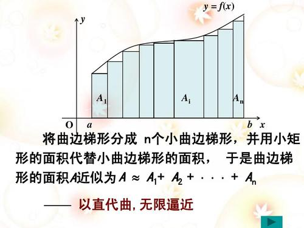

### Ohio State: Calculus One
* [1] Ohio State: Jim Fowler's Calculus One Lectures | CosmoLearning Mathematics https://www.youtube.com/watch?v=R4xtSdvkG-s&list=PLaLOVNqqD-2H1OJRzQDqYjGjM-XeJCALw&index=1

#### Basic concepts
> Functions - A function assigns to each number in it's **domain** another number, a function is suppose to take its input and produce unambiguously a single output.

### 积分概念
https://www.shuxuele.com/calculus/integration-introduction.html

积分可以用来求面积、体积、中点和很多其他有用的东西。

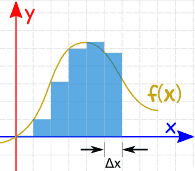
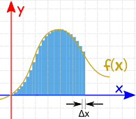
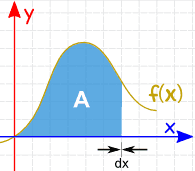

1. 我们可以求函数在几点的值，然后把宽度为`Δx`的片的面积加起来（但答案不会很精确)
2. 我们可以使 `Δx` 非常小，然后 把很多片的面积加起来（答案比上面的好一点）
3. 当片的 宽度趋近零时，答案也趋近正确的面积。我们用 `dx` 来代表趋近零的宽度 `Δx`

求积分与求导数是相反的 e.g. 2x `---(积分)--->` x^2 `---(导数)--->` 2x

把要求积分的函数（叫被积函数）放在积分符号后面，最后放 `dx` 来代表积分的方向是 `x`（片沿 `x` 的宽度趋近零）
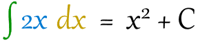

### 导数
* [1] 微分、导数、积分，这三者之间，有没有联系？ https://www.zhihu.com/question/264955988
* [2] 指数函数对数函数导数定义推导 https://zhuanlan.zhihu.com/p/40260702

* 导数是函数的 "变率"，就是函数的坡度。
* [即因变量微分与自变量微分之比为导数](#微分概念) 微分的商 (微商) `导数和微分的关系类似于速度和路程。`
* 导数（Derivative），也叫导函数值。 又名微商，是微积分中的重要基础概念。 当函数$y=f(x)$的自变量$x$在一点$x_0$上产生一个增量$\Delta x$时，函数输出值的增量$\Delta y$与自变量增量Δx的比值在Δx趋于0时的极限a如果存在, $a$即为在$x_0$处的导数，记作$f'(x_0)$或$\displaystyle \frac{d_f(x_0)}{d_x}$. 导数是函数的局部性质

* 定义 (一元)
  * 第一种

    $$\displaystyle x\rightarrow x_0 
     \qquad \lim_{x \to x_0} \frac{f(x) - f(x_0)}{x-x_0}$$

  * 第二种

    $$\displaystyle \Delta x \to 0 \qquad \lim_{\Delta x \to 0} 
    \frac{f(x_0+\Delta x) - f(x_0)}{\Delta x}$$

#### 求导公式
* 相除求导
  * y=u/v求导：y'=(u'v-uv')/v^2 (u、v)代表是函数

### 定积分
*https://baike.baidu.com/item/%E5%AE%9A%E7%A7%AF%E5%88%86*

* 定积分的定义是根据求曲边梯形的面积得出来的。因此，定积分的定义是用来求面积的，即得到一个数
* 定积分是求一个函数的图形在一个闭区间上和 x 坐标轴围成的面积

*https://www.shuxuele.com/calculus/integration-definite.html*

定积分 有起点和终点：有从 a 到 b 的区间。起点和终点的值放在"S" 符号的下面和上面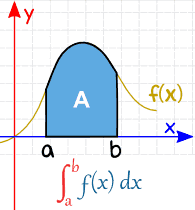

定积分是不定积分在 a 和 b 的值的差

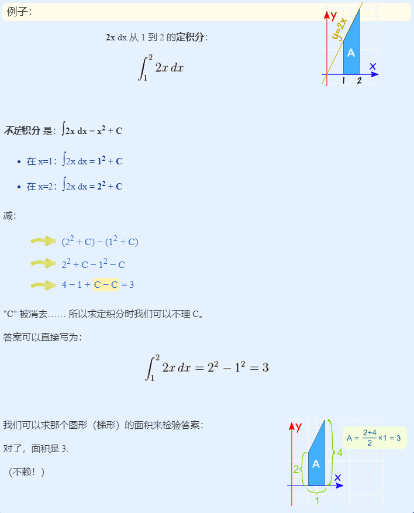

### 不定积分
* 不定积分是求导的一个反过程，也就是说，我们已经知道了求导以后的函数是什么，求原来的函数什么
* 设f(x)定义在某区间I上，若存在可导函数F(x)，使得F'(x)=f(x)对任意x属于I都成立，那么则称F(x)是f(x)在区间I上的一个原函数。我们把这个全体原函数，也称为不定积分 (https://www.zhihu.com/question/29210349)

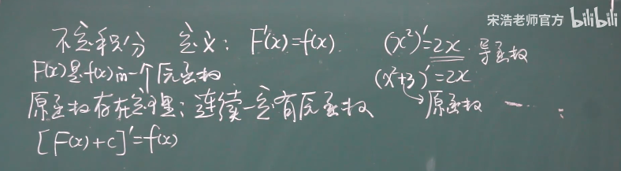

### 变限积分
它是将定积分的上下限换成了变量x，也就是那个曲边梯形的面积是随着x的滑动变化而变化的。取不同的x，就有不同的面积效果，x 在几何上是一个动的边。因此，变限积分仍然属于定积分的范畴，即是求面积的

### 反常积分
*https://baike.baidu.com/item/%E5%8F%8D%E5%B8%B8%E7%A7%AF%E5%88%86*

* 定积分的积分区间都是有限的，被积函数都是有界的。但在实际应用和理论研究中，还会遇到一些在无限区间上定义的函数或有限区间上的无界函数，对它们也需要考虑类似于定积分的问题。因此，有必要对定积分的概念加以推广，使之能适用于上述两类函数。这种推广的积分，由于它异于通常的定积分，故称之为广义积分，也称之为反常积分

### 一重积分

### 二重积分
*https://baike.baidu.com/item/%E4%BA%8C%E9%87%8D%E7%A7%AF%E5%88%86*

* 二重积分是二元函数在空间上的积分，同定积分类似，是某种特定形式的和的极限。本质是求曲顶柱体体积。重积分有着广泛的应用，可以用来计算曲面的面积，平面薄片重心等。平面区域的二重积分可以推广为在高维空间中的（有向）曲面上进行积分，称为曲面积分。

*https://blog.csdn.net/sunbobosun56801/article/details/79495600*

* 二重积分的意义
  * 一元积分的被积函数是二维空间的曲线，其几何意义是计算曲线与x轴围成的面积；二重积分的被积函数是空间中的一个曲面，其几何意义是计算该曲面在xy平面的投影与该曲面围成的曲项柱体的体积。

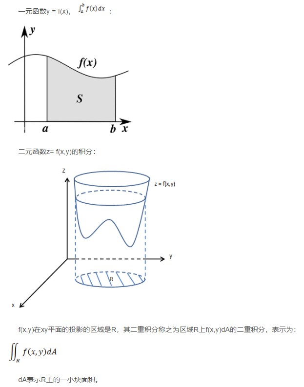

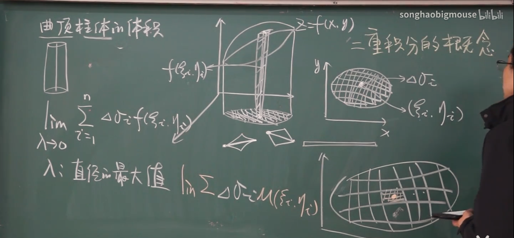

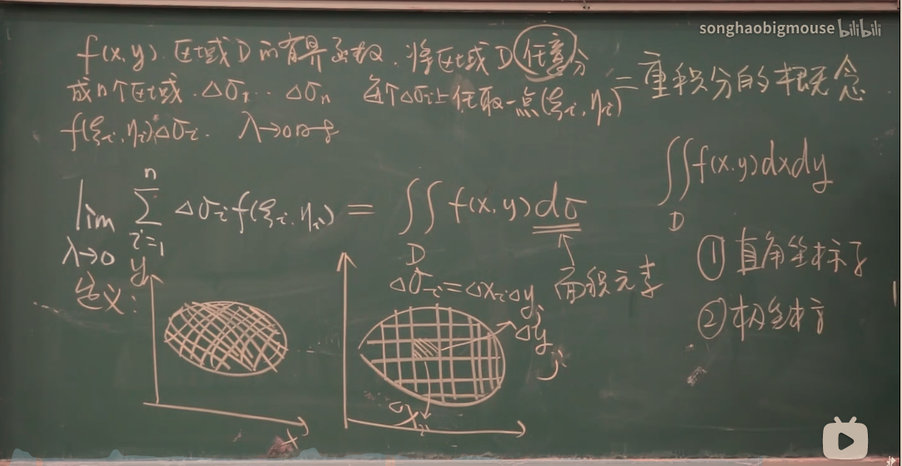

*https://www.zhihu.com/question/44875342/answer/821701089*

* 面包片与定积分

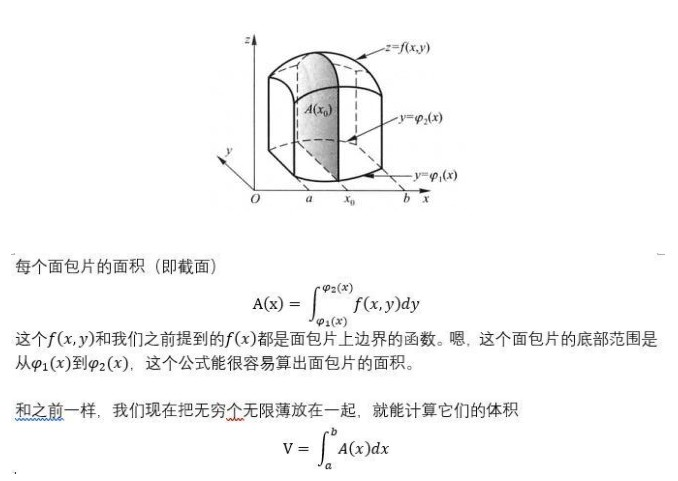

* 密度不均匀的面包块与三重积分

### 三重积分

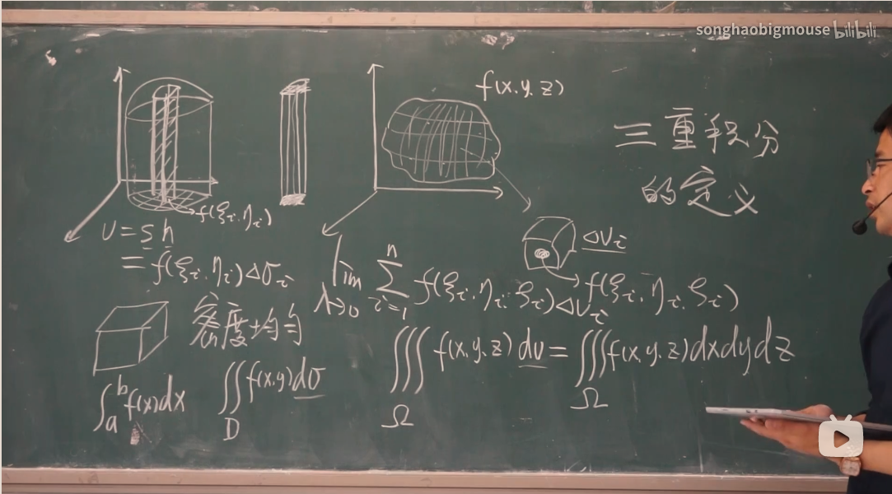

密度均匀与不均匀

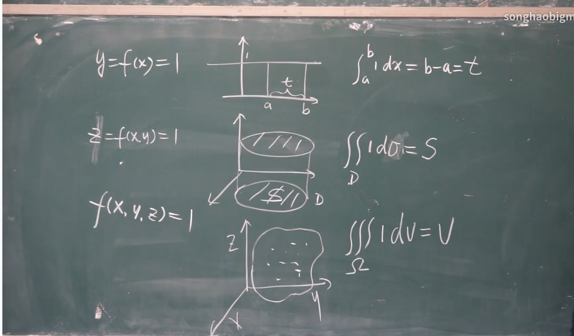

### 多重积分
*https://zh.wikipedia.org/wiki/%E5%A4%9A%E9%87%8D%E7%A7%AF%E5%88%86*

多重积分是定积分的一类，它将定积分扩展到多元函数（多变量的函数），例如求$\displaystyle f(x,y)$或者$\displaystyle f(x,y,z)$类型的多元函数的积分。

### 微分概念
* [1] 微分 *https://zh.wikipedia.org/wiki/%E5%BE%AE%E5%88%86*
* [2] 微分、导数、积分，这三者之间，有没有联系？ https://www.zhihu.com/question/264955988

在数学中，微分是对函数的局部变化率的一种线性描述。微分可以近似地描述当函数自变量的取值作足够小的改变时，函数的值是怎样改变的。[1]

微分本质是一个微小的线性变化量，是用一个线性函数作为原函数变化的逼近（或者叫近似）[2]

导数和微分的关系类似于速度和路程。

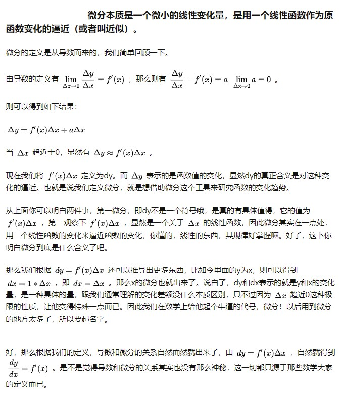

* 一元函数中的微分

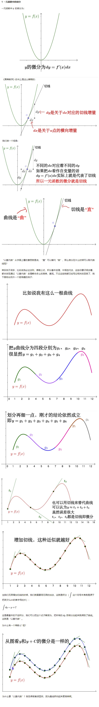

