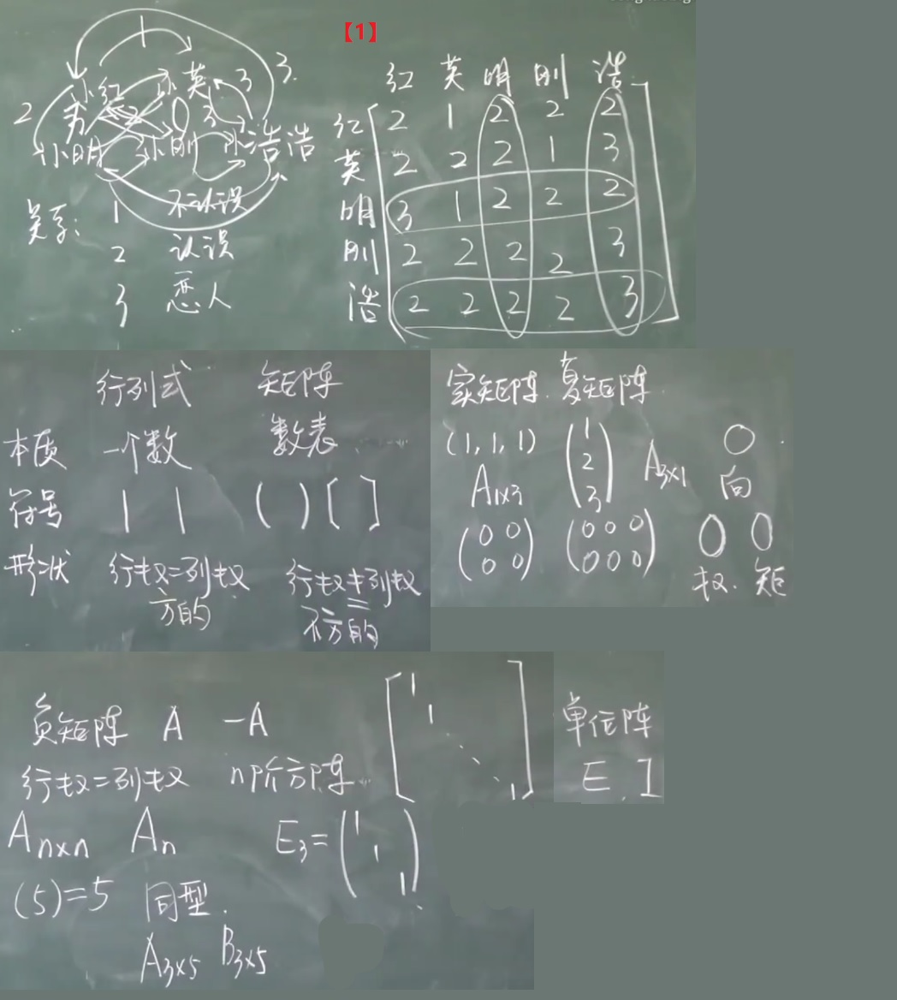

## 线性代数 (Linear algebra)
* *https://www.khanacademy.org/math/linear-algebra*
* *https://www.bilibili.com/video/BV1aW411Q7x1*

* Unit: Vectors and spaces https://www.khanacademy.org/math/linear-algebra/vectors-and-spaces
* Matrix transformations https://www.khanacademy.org/math/linear-algebra/matrix-transformations
* Unit: Alternate coordinate systems (bases) https://www.khanacademy.org/math/linear-algebra/alternate-bases
* [1] 矩阵分解 (乘法篇) https://zhuanlan.zhihu.com/p/52984150

### Fundamental

#### 行列式

##### 二阶三阶行列式

##### n阶行列式

* 【1】这里计算逆序数的个数 N(排列)=逆序数个数
* 【2】下三角矩阵：根据行列式定义，必须去不同行不同列，所以只能取主对角线上的

##### 行列式的性质

* 行列式转置值不变，对行成立的性质，对列也成立
* 性质5 两行对应成比例，D=0；这里我的理解是，不是满秩，这两项线性相关了，没能张成n空间，可能只是一个平面（三维）或者线（二维）甚至是0，**突然想到，未证明**
* 性质7 ⭐⭐⭐
* 【1】既不是按列展开，也不是按行，只能按照第三种展开 逆序数相加

##### 行列式按行展开
* 余子式
* 代数余子式

* 【1】异乘变零，这两个展开得到的式子一样，到下面那个因为有两行相等所以行列式的值等于0
* 【2】选择的12行，与12列

##### 行列式的计算

* 三叉型行列式
* 范德蒙德行列式
* 反对称行列式

* 【1】先将余子式转变为代数余子式，注意异号需要补，然后代数余子式之前需要乘以元素，所以可以将符号当做元素。然后计算，选择0最多的那一行展开
* 【2】这类技巧是，先每一列的元素加到第一行去，然后提出公因子，再然后，1*(-a)加到后面的去，所以a就化掉了，只不过x的地方变为x+(-a)=x-a
* 【3】第一行都是1，第一列都是0，可以减去一阶；提出公因子，同理每一列都可以提出来，然后归纳总结，最终得出范德蒙德行列式

##### 克莱姆法则

* 齐次方程：至少有零解

#### 矩阵

##### 矩阵的概念

* 【1】表示关系，联系，非常清晰

##### 矩阵运算

* 幂运算
* 乘法
* 转置

* 【1】依次带入表达式，相乘算出最终的矩阵

##### 特殊矩阵

* 数量矩阵
* 对角形矩阵

* 【1】一般来说，$(AB)^T = BA\not ={AB}$,但根据定理一，A,B对称，A乘B还对称的充分必要条件是A,B可交换；所以反过来，如果AB可交换，AB的转置就等于AB

##### 逆矩阵
* [1] 请问伴随矩阵在几何空间的意义是什么？ https://www.zhihu.com/question/301361922

* 方阵的行列式
* 伴随矩阵 - 必需方阵
* 逆矩阵 - 必须方阵
  * 计算方法：
    * 伴随矩阵法
    * 初等变换法

* $|A^*| = |A|^{n-1}$
* $AA^* = |A|E$
* $(A^T)^T = A $
* $(A^{-1})^{-1} = A $
* $(AB)^{-1} = B^{-1}A^{-1} $
* $(AB)^T = B^TA^T $
* $(A^T)^{-1} = (A^{-1})^T $
* $(kA)^{-1} = \frac{1}{k} A^{-1}$ $ (k \not ={0}) $
* $|A^{-1}| = |A|^{-1}$
* $(A^*)^{-1} = \frac{1}{|A|}A$
* $A^{-1} = \frac{1}{|A|}A^*$
* $A^* = |A|A^{-1}$

* 【1】单位矩阵行列式是1，|A|是一个数，往外提n次；其次，消一个n的前提是|A|不等于0

##### 分块矩阵

* 标准型
* 分块矩阵求转置：第一步，将子块看做元素求转置，第二步，每个子块求转置

* 【1】对逆矩阵的判定：行列式值不为0，这里不能简单的AB-C0,而是需要用拉普拉斯定理展开求行列式

##### 初等变换

* 初等变换：左 <-> 行   右 <-> 列
* 初等变换：初等矩阵左(右)乘A，相等于对A实施了同种的初等行(列)变换

* 【1】对A是E矩阵做同样的初等行变换，当A趋于E时，同时E也在趋于A逆

##### 矩阵的秩
* [1] 最高阶非零子式是什么意思？怎么求？ https://www.zhihu.com/question/333873913

* 非零子式
* 阶梯型
* 行简化阶梯型
* 矩阵的秩等于非零行的行数

* 【1】这里有两个解，带回原题，发现k=1不符合

* 非零子式
  * 比如有一个4阶矩阵，它有一个行列式，无论这个行列式是零或不是零，它都是这个行列式的值，没有"子"。但如果你选了其中一部分(也是一个子空间)，比如左上角的3行又3列的元素，或右上角的…，然后求它们的行列式，这就是子式了，子行列式。如果求出来的子行列式为零，这就是一个为零的子式。

#### 向量空间

##### n维向量及其运算

##### 向量间的线性关系

* 线性无关的向量组，接长向量组也线性无关
* 线性相关的向量组，截短向量组也线性相关

* 部分组线性相关 -> 整体组线性相关
* 整体组无关 -> 部分组线性无关

* 线性组合 <-> 方程有解
* 不是组合 <-> 方程无解

* 线性相关 <-> 非零解
* 线性无关 <-> 只有零解

* 线性关系一: 线性组合：能用某些个向量表示一个向量 
* 线性相关与无关；为什么找到一组系数不全为0就是线性相关？因为它们之前可以互相表示(它们对张成满秩的空间没有贡献，在二维的情况下可以理解为，这两个向量都在一条一维的线上，而无法张成一张二维的平面)，为0则表示它们之间无法互相表示

* 【1】这里是向量组，相加后也是

##### 线性相关线性无关
* [1] 向量的个数大于维数为什么线性相关  https://zhidao.baidu.com/question/942918450771279452.html
* [2] 线性代数：为什么n个m维向量必定线性相关？ https://zhidao.baidu.com/question/509977776
* [3] m个n维向量组线性相关,秩小于m,则相关,等于m,则无关.为什么不考虑n的感受呢? https://www.yulucn.com/question/681458592

* 证明唯一性的时候使用假设有两个，然后证明这两个相等
* 【1】用其中一个向量去表示其它全部
* 【2】用这两个向量互相表示，根据定理第一个表示第二个，s小于等于t，反过来，t小于等于s，所以s=t
* 【3】如果向量的个数大于向量的维度，那么这个向量组一定是线性相关的

* 为什么向量的个数大于向量的维度必定线性相关？
  * 即是要证明: 向量的个数大于向量的维数时, 向量组线性相关证明:设 α1,...,αm 是n维列向量令 A=(α1,...,αm).则 r(A) ≤ min{m,n} [ 矩阵的秩不超过它的行数和列数 ]因为 m>n所以 r(A) ≤ n < m.所以 r(α1,...,αm) =r(A)<m. [ 矩阵的秩等于其列秩和行秩 ]即 向量组α1,...,αm线性相关. [2]
  * 拿三维空间来说吧，最多只能找到三个无关向量为一组基，第四个不管怎么样都可以被其余表示[1]
  * 向量组的秩等于向量组的一个极大无关组所含向量的个数; 若m个向量构成的向量组的秩等于m, 说明向量组本身就是一个极大无关组, 故线性无关.反之, 线性相关.[3]

##### 向量组的秩

* 极大线性无关组
* 行秩与列秩

* 极大线性无关组是不唯一的，e.g. (1,0) (2,0) (0,5) (0,10),选择(0,5)(2,0)或者(0,5)(1,0)都可以
* 极大线性无关组: 给一个向量，取它的一部分，满足这一部分线性无关，每一个向量都可以由这一部分来表示	

* 【1】用初等行变换化成阶梯型，非零行的行数就是秩

#### 线性方程组解的结构

##### 线性方程组

##### 线性方程组有解判定

* 增广系数矩阵

##### 齐次方程组的解

* 齐次方程组：1) 至少有零解 2) 如果可以找到一个非零解，就可以找到无穷多个非零解

* 【1】如果我可以找到一个α，就可以在两边同时乘
* 【2】这里与前面的一个结论，一个向量组，当向量的个数大于向量的维数时，这个向量组一定是线性相关的  n+1个n为向量一定线性相关 [See](#线性相关线性无关)

##### 方程组解的结构

* 解的结构，研究的是无穷多解的情况，其中能否用几个解表示全部
* 极大线性无关组与基础解系的概念是一样的
* 导出组

* 基础解系的个数是n-r(A)个 维度减去秩

* 【1】这里只要取得这一组是线性无关的都可以
* 【2】列秩等于行秩等于矩阵的秩；将-r(A)移过去得到r(B)+r(A)≤n
* 【3】下面与上边类似，可以利用上面的
* 【4】这里只能让α1为特解，因为α2α3我们不知道
* 【5】Ax=0的两个解相加，仍然是解，因为x=0，两个解带进去还是零
* 【6】根正

#### 相似矩阵及二次型

##### 矩阵的特征值与特征向量

* ❤❤❤
* 特征矩阵
* 特征方程

* 用一个矩阵乘以一个向量，其实相当于对这个向量做一个线性替换，这个向量原本在一个空间，它乘以这个替换矩阵后，它其实替换成了另外一个空间里的向量；
* 对于判断三角形矩阵的特征值与特征向量，它的特征值就是主对角线上的

* 【1】|λE-A|=0；系数行列式要等于0，因为系数行列式不等于是线性无关，方程只有唯一0解；
* 【2】根据一个数乘以一个向量等于0，可以推出要么这个数等于0，要么这个向量等于0；这里说了λ1≠λ2，所以(λ1-λ2)不能为0，那么就只能α为0，又根据我们定义的特征向量一定是非0向量，所以这里产生矛盾，所以特征向量只能是一个特征值的向量
* 【3】要验证他是特征向量，就只需证明Aα = λα, A什么等于λ什么
* 【4】这里是求行列式等于0，也就是特征方程=0，所以(λ-2)(λ-1)(λ-1)=0;λ等于1或者2

##### 特征值和特征向量的性质

* 迹

* k重特征根对应的线性无关的特征向量的个数小于等于K

* 【1】如何求出常数项，让x=0后，式子就只剩下C1C2...CN
* 【2】这里只有在取第一行第一列的时候λ才有可能出现n-1次(余子式)，其余的只有可能出现n-2次
* 【3】根据引例1，如果方程的根是1,2,3，可以写成(x-1)(x-2)(x-3);又因为这里说了λ1...λn是特征值，所以特征方程可以写成(λ-λ1)(λ-λ2)...(λ-λn)
* 【4】它与上方的式子应该是一模一样的
* 【5】要证明线性无关，证明所有的系数都等于0
* 【6】第一个式子是左乘了A，第二个式子是乘了λS；然后一相减，消去了λS，再使用S-1的情况；对于S-1它是线性无关的，所以前面的系数必全部取0，又说了特征值是互不相同的，所以λ1-λS≠0，那么则只能是k1＝0，一直到Ks-1=0；再带回到式子①中，得到Ks αs=0，一个数乘以一个向量等于0，要么是这个数等于0，要么是这个向量等于0，又因为αs是特征向量不能等于0，所以只可能是Ks等于0，则说明他是线性无关的
* 【7】两边同时除以一个λ，等于A^{-1} α = 1/λ α

##### 相似矩阵和矩阵可对角化的条件
* [1] 如何理解相似矩阵？ https://zhuanlan.zhihu.com/p/31003468 [Joplin-相似矩阵.jpg](:/86cf2dfb423e4b5c8e92889cf9e3b549)
* [2] 矩阵逆矩阵的行列式等于原矩阵行列式的倒数吗 https://zhidao.baidu.com/question/1606939670825403147.html

* 相似矩阵的目的也是为了找到更简单的坐标系[1]

* 等价：A根据初等变换可以得到B，就叫两个等价
* B和A是两个矩阵，两个变换，只不过是在不同的空间下

* 【1】E^{-1}AE = B = A, 所以A~A
* 【2】P^{-1}EP就等于E，P^{-1}从左边提出，P从右边提出, P^{-1}与P相乘等于1，消掉
* 【3】两边同时求逆矩阵
* 【4】这里必须展开，然后P逆与P约掉
* 【5】逆往里面带需要交换顺序
* 【6】这些α是P向量，因为P是可逆矩阵，所以P的列向量不能为0，所以αi≠0
* 【7】不取决与单根，而取决与重根是否可以凑齐与它重数一样的线性无关的向量
* 【8】只能凑齐α1，小于重数，所以这个不是相似对角型

##### 实对称矩阵的对角化

* 内积
* 施密特正交化

* 所有的实对称矩阵都能对角化

* 【1】因为是两两正交，所以只要两个向量不相等，它们的内积就等于0; 正交向量不等于0，所以它们做内积不等于0
* 【2】这里用逆矩阵的推论;AB=E，所以A^{-1} = A^T;在根据定义往 $A^T A = E$ 带，得到 $ (A^{-1})^T A^{-1} $,又A逆等于 $ A^T $,根据转置定义，提出一个T，里面要交换，最终为$ (AA^{-1})^T = E^T=E $
* 【3】α与β是两个列向量，所以需要将其中一个转置
* 【4】这里写成内积形式；A是正交，所以α1乘以α1是等于单位阵E；其余都为0，因为垂直(正交)
* 【5】因为|A|E的行列式中，|A|是个数，E是3阶单位矩阵，所以|A|提出来就是|A|^3
* 【6】再将这个式子用向量相乘的形式写出来
* 【7】再将α1^T α2写成内积的形式
* 【8】3对应的向量与6对应的是正交的，所以点积为0

##### 二次型
* [1] 矩阵的等价，相似，合同 https://zhuanlan.zhihu.com/p/262978692

* 平方项
* 交叉项
* 二次型的矩阵
* 线性替换 (非退化 可逆 满秩 非奇异)
* 合同

* 标准型：只有平方项
* 等价：A经过初等变换得到B就叫做两个矩阵等价
* 正交相似同时也是合同
* 等价，合同，相似三者的关系：等价（只有秩相同）–>合同（秩和正负惯性指数相同）–>相似（秩，正负惯性指数，特征值均相同），矩阵亲密关系的一步步深化。[1]

* 【1】以前以X为变量不是标准型，现在引入X=CY,变成Y的二次，就变成了标准型
* 【2】因为标准型只有平方项，是个对角型
* 【3】C是个矩阵，如果C≠0，就叫做可逆替换，也叫做非退化，或者叫非奇异替换，满秩替换
* 【4】验证C^TAC是否对称
* 【5】证明对称性；要想证明合同，需要证明 $()^TB()=A$ ; 逆和转置交换顺序
* 【6】这里说了C可逆，右乘C逆，左乘C转置的逆

##### 化二次型为标准型

* 规范型
* 惯性定理
* 正惯性指数
* 符号差
* 正交替换 - 与实对称矩阵的对角化是完全一样的

* 【1】注意线性替换是X=CY，而不是Y=CX
* 【2】只有交叉型，假设x1=... x2=... x3=...
* 【3】一次列变换一次行变换之后，矩阵一定会变回对阵的，这一点很重要；还有就是可以同时做两次或多次列变换，然后再做多次行变换

### Vectors and spaces

#### Vectors

##### Real coordinate spaces

##### Adding vectors algebraically & graphically

##### Multiplying a vector by a scalar

##### Unit vectors intro

##### Parametric representations of lines

#### Linear combinations and span

##### Linear combinations and span
https://en.wikipedia.org/wiki/Linear_combination

https://www.khanacademy.org/math/linear-algebra/vectors-and-spaces/linear-combinations/v/linear-combinations-and-span

In mathematics, a linear combination is an expression constructed from a set of terms by multiplying each term by a constant and adding the results (e.g. a linear combination of x and y would be any expression of the form ax + by, where a and b are constants). The concept of linear combinations is central to linear algebra and related fields of mathematics. 

#### Linear dependence and independence
### Linear Independence and Dependence
https://en.wikipedia.org/wiki/Linear_independence

https://www.khanacademy.org/math/linear-algebra/vectors-and-spaces/linear-independence/v/linear-algebra-introduction-to-linear-independence

In the theory of vector spaces, a set of vectors is said to be linearly dependent if at least one of the vectors in the set can be defined as a linear combination of the others; if no vector in the set can be written in this way, then the vectors are said to be linearly independent. These concepts are central to the definition of dimension.

#### Subspaces and the basis for a subspace

##### Linear subspace
https://en.wikipedia.org/wiki/Linear_subspace

https://www.khanacademy.org/math/linear-algebra/vectors-and-spaces/subspace-basis/v/linear-subspaces

In mathematics, and more specifically in linear algebra, a linear subspace, also known as a vector subspace is a vector space that is a subset of some larger vector space. A linear subspace is usually simply called a subspace, when the context serves to distinguish it from other types of subspaces.

##### Basis of a subspace
https://www.khanacademy.org/math/linear-algebra/vectors-and-spaces/subspace-basis/v/linear-algebra-basis-of-a-subspace

1. The basis is really the minimum set of vectors that I need
2. In a basis you have a no redundancy

#### Vector dot and cross products

##### Vector dot product and vector length
https://www.khanacademy.org/math/linear-algebra/vectors-and-spaces/dot-cross-products/v/vector-dot-product-and-vector-length

##### Proving vector dot product properties