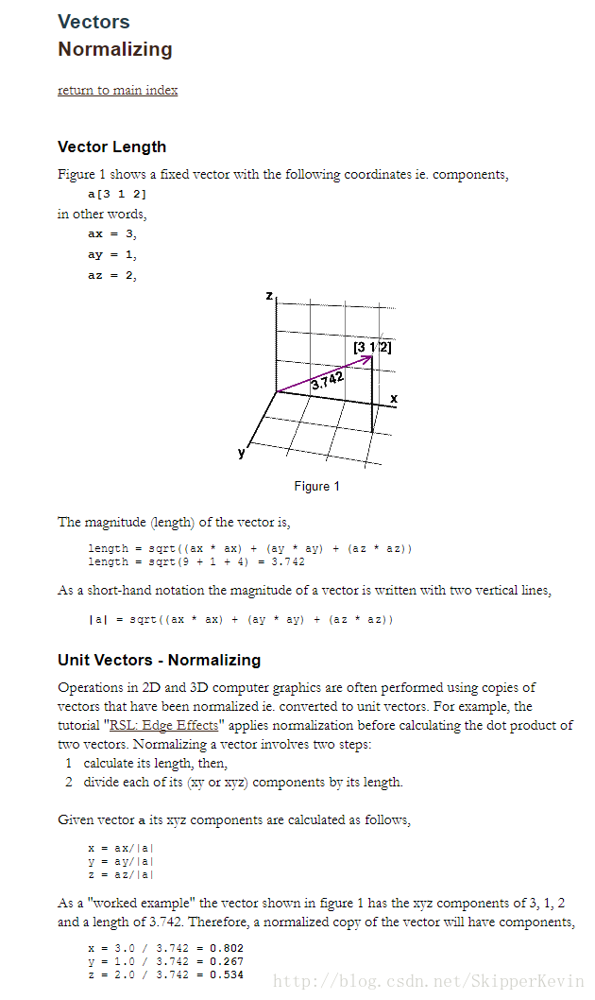
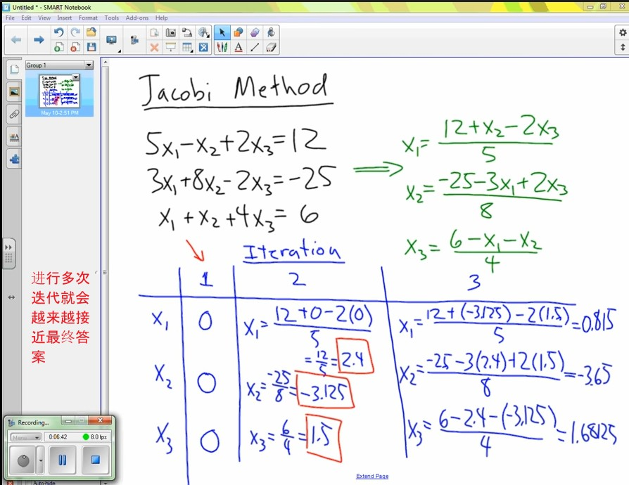

# Concept

[TOC]

## 算符
* [1] 算符_百度百科 https://baike.baidu.com/item/%E7%AE%97%E7%AC%A6/4923983#

* **使问题从一种状态变化为另一种状态的手段称为操作符或算符**。算符在单独存在时是没有什么意义。操作符可为走步、过程、规则、数学算子、运算符号或逻辑符号等。[1]
* 数学中的算符被**定义为一个函数集向函数集的映射**。 如导数算符，微分算符等等。[1]

## 自然同构
* [1] 自然同构中的“自然”是什么意思？https://www.zhihu.com/question/40450490

* 范畴论(category theory)意义下的“自然”大概就是能画出来的图表都是可交换的意思。由于我懒得画图也懒得科普范畴论基础知识了，所以我就这么一说，你就这么一听，哈哈～至于什么是“与基底选取无关”，第一位答主已经提到了对偶空间的例子。题主你自己想一下，一个有限维线性空间V，它跟自己的对偶$V^*$是同构的，但是这个同构是“不自然”的，因为你要把V的一组基写出来，顺便再把$V^*$上的对偶基写出来，然后基基对应，才能把这个同构写下来。然而我们在定义V和它的双重对偶$V^{**}$的同构的时候，是这样构造同构映射的：如果x属于V,那么定义f(x)属于$V^{**}$,使得对任意y属于$V*$, f(x)(y)被定义为y(x).你看定义f的过程中有用到V的基吗？没有，这样的同构我们才说是自然的。注意：我们在这里说“一个同构是自然的时候”，指的是**一个具体的同构映射**，不是笼统地指“两个空间是同构的”这件事情。[1]

## 欧氏空间
* [1] 什么是欧几里得空间？与笛卡尔坐标系有什么关系？ https://www.zhihu.com/question/46343236

* 欧式空间是**配有内积的n维线性空间**，在有限维空间中，内积与欧式标准范数可以相互导出，而范数就是向量的模--长度，内积可以给出正交的概念，进一步可以把欧式空间的一组基化为正交归一的基。[1]
* 欧式空间与笛卡尔坐标系的关系，应该是欧几里得空间包括笛卡尔坐标系

## 对偶空间
* [1] 怎么形象地理解对偶空间（Dual Vector Space）？https://www.zhihu.com/question/38464481

<div align=center></div>

## 三角不等式
* [1] 什么是三角不等式？ https://www.zhihu.com/question/295827412

<div align=center></div>

## 二项式系数
* [1] 二项式系数_百度百科 https://baike.baidu.com/item/%E4%BA%8C%E9%A1%B9%E5%BC%8F%E7%B3%BB%E6%95%B0/6763242
* [2] 二项式定理-数学乐 https://www.shuxuele.com/algebra/binomial-theorem.html

<div align=center></div>

<div align=center></div>

## 调和函数
* [1] 调和函数到底有什么意义？ https://www.zhihu.com/question/25083195

* 调和函数的线性组合仍为调和函数，所以是一个**函数空间**。调和函数无限次可导。调和函数在定义域的紧子集的边界上达到最大最小值，这是一种类似单调的性质。加上其他的一些性质，导致调和函数容易处理也更可能满足某些规律。
* 可以考虑在物理学上的意义：**二阶偏导的和等于零，对应于加速度的和为零，即可以描述系统不受力的状态，即稳态**。当不能刻画系统在每一时刻的状态，却能用调和函数描述系统稳态下的状态，调和函数就显得非常有意义了。[1]


## 哈密顿算子
* [1] 哈密顿算子 https://baike.baidu.com/item/%E5%93%88%E5%AF%86%E9%A1%BF%E7%AE%97%E5%AD%90/6037056

<div align=center></div>

## 角速度
* [1] 角速度 维基百科，自由的百科全书 https://zh.wikipedia.org/wiki/%E8%A7%92%E9%80%9F%E5%BA%A6

* 角速度（Angular velocity）是在物理学中定义为角位移的变化率，**描述物体转动时，在单位时间内转过多少角度以及转动方向的向量**，（更准确地说，是伪向量），通常用希腊字母${\displaystyle \Omega }$或${\displaystyle \omega }$来表示。
* 在国际单位制中，单位是弧度每秒（rad/s）。在日常生活，通常量度单位时间内的转动周数，即是每分钟转速（rpm），电脑硬盘和汽车引擎转数就是以rpm来量度，物理学则以rev/min表示每分钟转动周数。
* **角速度的方向垂直于转动平面**，可通过**右手定则**来确定，物体以**逆时针方向转动**其角速度为**正**值，物体以顺时针方向转动其角速度为负值。
* 角速度量值的大小称作角速率，通常也是用ω来表示

## 等值面
* [1] 等值面_百度百科 https://baike.baidu.com/item/%E7%AD%89%E5%80%BC%E9%9D%A2/10488111

* 所谓等值面是指空间中的一个曲面，在该曲面上函数F(x, y, z)的值等于**某一给定值**Ft，即等值面是由所有点S = {(x, y, z)：F(x, y, z) = Ft}组成的一个曲面。[1]
* 等值面技术在可视化中应用很广，**许多标量场的可视化问题都可归纳为等值面的抽取和绘制**，如各种**等势面、等位面、等压面、等温面**等。等值面技术除生成等值面的几何表示外，还包括显示技术，如要考虑合适的光照模型、解决等值面的相互遮挡等。等值面的生成和显示也是可视化研究中的一个重要领域。[1]

## 麦克斯韦方程组
* [1] 初步认识电磁波 https://zhuanlan.zhihu.com/p/25860644
* [2] 如何深入浅出地讲解麦克斯韦方程组？ https://www.zhihu.com/question/36766702

<div align=center></div>

## 斯托克斯公式 (Stokes's theorem)
* [1] 怎么记住斯托克斯公式（Stokes' theorem）？ https://www.zhihu.com/question/20129731
* [2] 斯托克斯公式的意义? https://www.zhihu.com/question/22738795

<div align=center></div>

<div align=center></div>

* Stokes公式物理意义：
  * **旋度**(对于电场而言就是产生电动势的能力)与**曲面上的微元面积做内积**，得到微元上的**环量**(金属网每个小网格的电动势)，再把这些环量在**整个曲面上进行累加**(左边那个积分)，内部的环量就被抵消，最后得到的就是**边界上的环量**(金属网边界的电动势，即右边那个积分)。[2]
* Stokes公式是格林公式在三维上的推广[1]

## 等价命题
* [1] 等价命题_百度百科 https://baike.baidu.com/item/%E7%AD%89%E4%BB%B7%E5%91%BD%E9%A2%98/3343293#

等价命题，即**同一意思不同说法**，就是两个**命题的条件本质上是相同的**，结论在本质上也是相同的，等价的命题**只有形式上的不同**。 等价命题就是说**两个命题可以相互证明**。 即如果A，B 两个命题等价，那么， 把A 命题作为条件，可以证明B命题；同时，把B 命题作为条件，也可以证得A 命题[1]

## 第一基本形式
* [1] 第一基本形式 维基百科，自由的百科全书 https://zh.wikipedia.org/wiki/%E7%AC%AC%E4%B8%80%E5%9F%BA%E6%9C%AC%E5%BD%A2%E5%BC%8F

* 在微分几何中，第一基本形式（first fundamental form）是三维欧几里得空间中一个曲面的切空间中内积，由 $R^3$ 中标准点积诱导。它使得曲面的曲率和度量性质（比如长度与面积）可与环绕空间一致地计算。第一基本形式用罗马数字 $I$ 表示：

<div align=center></div>

## 切向量
* [1] 切向量 https://baike.baidu.com/item/%E5%88%87%E5%90%91%E9%87%8F/10967394
* [2] 曲线的单位切向量怎么求？ https://zhidao.baidu.com/question/393473595639916245.html

* 曲线在一点处的切向量可以理解为沿曲线该点处**切线方向的向量**。
* 切向量是与曲线相切的向量，给定曲线`C`上一点`P`，`Q`是`C`上与`P`的邻近一点，当`Q`点沿曲线趋近于`P`时，割线`PQ`的极限位置称为曲线`C`在`P`点的切线[1]

* 求法
<div align=center></div>

## 质心
* [1] 质心 维基百科，自由的百科全书 https://zh.wikipedia.org/wiki/%E8%B3%AA%E5%BF%83
* [2] 哪位能够简单清晰的解释一下重心和质心的区别，不胜感激。? https://www.zhihu.com/question/29808135

* 质心为多质点系统的**质量中心**。若对该点施力，系统会沿着力的方向运动、不会旋转。质点位置对质量加权取平均值，可得质心位置。[1]
* 质心不一定要在有重力场的系统中才会有意义，而重心则否。值得注意的是，**除非重力场是均匀的，否则同一物质系统的质心与重心通常不在同一假想点上**。对于密度均匀、形状对称分布的物体，其质心位于其几何中心处[[1]

<div align=center></div>

* 在重力加速度 g 处处相同的情况下， 重心等于质心[2]
* 但无论它们是不是同一点， 它们的定义是不一样的。 质心的定义是所有质点的位置关于它们的**质量的加权平均数**。 而重心的定义满足： **重力对系统中每个质点关于重心的力矩之和为零**。[2]

## 无条件极值问题
* [1] (1/2) 无条件极值问题 https://www.bangxuetang.com/points/detail?sid=301&bid=31&cid=1236&nid=1242

* 无条件极值问题 **对于函数的自变量除了限制在定义域内之外，并无其他条件限制**，这类极值问题称为无条件极值问题[1]

## 雅可比矩阵 (Jacobi)
* [1] 如何理解雅可比式？ https://www.zhihu.com/question/57763170

* 输入向量。输出向量。jacobian描述输入的**每个维度上的分量**对输出上每个的分量的结果**贡献度**[1]
* **多元函数在一个点的微分是一个局部线性变换**，将该点的一个邻域映到一个开集，因此微分可以用矩阵的形式给出，每个列向量是偏导数，这个形式被称为“雅可比矩阵”，当多元映射从维数为r的矢量空间映到维数为r的矢量空间时，雅可比矩阵是一个r阶方阵，雅可比式不为零就可以理解为微分满秩。[1]
* 另一方面则是在积分方面，由于微分形式的反对称和多线性，在变量代换的时候会出现雅可比式。因而我们可以认为雅可比式实际上是反映这个变量代换把一个区域内单点处的无穷小体积放大多少的量。事实上，对给定的m个线性无关m维向量，它们的外积就是这m个向量所张成的m维空间（带定向），而行列式（因为任何m个m维向量的外积生成的线性空间是一维的）就代表这m个向量生成的「立方体」的体积。[1]

* 对于为什么一个点的微分是一个局部线性变换，看[这篇文章](https://zhuanlan.zhihu.com/p/149851491)
* (要将微分，偏导和线性代数中的知识连起来，考虑微分是线性变换，而线性变换又可以用矩阵的形式给出)

## 割线法
* [1] 割线法 维基百科，自由的百科全书 https://zh.wikipedia.org/wiki/%E5%89%B2%E7%BA%BF%E6%B3%95

* 在数值分析中，割线法是一个求根算法，该方法用一系列割线的根来近似代替函数f的根。[1]
* 方法的推导
  * 给定$x_{n−1}$和$x_n$，我们作通过点$(x_{n−1}, f(x_{n−1}))$和$(x_n, f(x_n))$的直线，注意这条直线是函数$f$的割线，或弦。这条割线的点斜式直线方程为：
    * ${\displaystyle y-f(x_{n})={\frac {f(x_{n})-f(x_{n-1})}{x_{n}-x_{n-1}}}(x-x_{n})}$
  * 我们现在选择$x_{n+1}$为这条割线的根，因此$x_{n+1}$满足以下的方程：
    * ${\displaystyle f(x_{n})+{\frac {f(x_{n})-f(x_{n-1})}{x_{n}-x_{n-1}}}(x-x_{n})=0.}$
  * 解这个方程，便可以得出割线法的递推关系。

<div align=center></div>

## 点斜式
* [1] 点斜式 https://baike.baidu.com/item/%E7%82%B9%E6%96%9C%E5%BC%8F/921468
* [2] 直线方程的点斜式 https://www.shuxuele.com/algebra/line-equation-point-slope.html

* 点斜式是指一种**算式**，已知直线上一点(a,b)并且存在直线的斜率k，则直线可表示y-b=k(x-a)。
* 点斜式方程是通过直线过的**一个点和其斜率**求该**直线平面方程**的一种方法。在平时做解析几何的题目时，会更多地运用点斜式方程来解题，直接的体现直线的性质。
* 定义
  * $(x_0, y_0)$在平面直角坐标系中，如果直线$L$经过点$A(x_1, y_1)$和$B(x_2,y_2)$，其中x1≠x2,那么$AB=(x_2-x_1,y_2-y_1)$是$L$的一个方向向量，于是直线$L$的斜率$k=\frac{y_2-y_1}{x_2-x_1}$,再由$k=tan\alpha (0\leq\alpha<\pi)$,可以求出直线L的倾斜角$\alpha$,记为$\tan \alpha =k$,方程$y-y_0 = k(x-x_0)$叫做直线的点斜式方程，其中$(x_0,y_0)$是直线上一点[1]
* 图片 (https://cdn.jsdelivr.net/gh/aaronmack/image-hosting@master/mathematics/点斜式-数学乐.2d4wl991mh1c.webp)

## 指数函数
* [1] 指数函数 维基百科，自由的百科全书 https://zh.wikipedia.org/wiki/%E6%8C%87%E6%95%B0%E5%87%BD%E6%95%B0

* 指数函数（英语：Exponential function）是形式为${\displaystyle b^{x}}$的数学函数，其中${\displaystyle b}$是底数（或称基数，base），而${\displaystyle x}$是指数（index / exponent）。

* 现今指数函数通常特指以${\displaystyle {{e}}}$为底数的指数函数（即${\displaystyle {{e}}^{x}}$，为数学中重要的函数，也可写作${\displaystyle \exp(x)}$。这里的${\displaystyle {{e}}}$是数学常数，也就是自然对数函数的底数，近似值为${\displaystyle 2.718281828}$，又称为**欧拉数**。

* 作为实数变量${\displaystyle x}$的函数，${\displaystyle y={{e}}^{x}}$的图像总是正的（在${\displaystyle x}$轴之上）并递增（从左向右看），它不触及${\displaystyle x}$轴，尽管它可以任意程度的靠近它，即${\displaystyle x}$轴是这个图像的水平渐近线。一般的说，变量${\displaystyle x}$可以是任何实数或复数，甚至是完全不同种类的数学对象。它的反函数是定义在所有正数${\displaystyle x}$上的自然对数${\displaystyle \ln {x}}$。[1]


## 凸函数
* [1] 凸函数 维基百科，自由的百科全书 https://zh.wikipedia.org/wiki/%E5%87%B8%E5%87%BD%E6%95%B0

* 凸函数（英文：Convex function）是指上境图（图像上方的点的集合）为凸集的一类函数。换言之，其图像上，**任意两点连成的线段，皆位于图像的上方**
* 凸函数是多个数学分支的重要概念，尤其在最优化研究中，凸函数的最小化问题有许多方便的性质。举例，定义在凸开集上的**严格凸函数**，至多只有**一个极小值**。即使在无穷维空间中，在合适的假设下，凸函数（在此定义域上，常称为凸泛函）仍具有此种性质[1]

[filename](https://cdn.jsdelivr.net/gh/aaronmack/image-hosting@master/resources/recording/Convex_01.ogv ':include :type=video controls width=100% height=360px')

## 向量值函数
* [1] 向量值函数 维基百科，自由的百科全书 https://zh.wikipedia.org/wiki/%E5%90%91%E9%87%8F%E5%80%BC%E5%87%BD%E6%95%B0

* 向量值函数，有时也称为向量函数，是一个单变量或多变量的、值域是多维向量或者无穷维向量的集合的函数。向量值函数的输入可以是一个标量或者一个向量（定义域的维度可以是1或大于1）；**定义域的维度不取决于值域的维度**。[1]
* 样例：螺旋
  * 一类常见的向量值函数依赖于单个实参数`t`（通常表示时间），而其输出是向量 `v(t)`

  <div align=center>
  
  </div>

## 调和级数
* [1] 调和级数 维基百科，自由的百科全书 https://zh.wikipedia.org/wiki/%E8%B0%83%E5%92%8C%E7%BA%A7%E6%95%B0

* 调和级数（英语：Harmonic series）是一个发散的无穷级数，表达式为：$\sum_{k=1}^{\infin} \frac{1}{k} = 1+\frac{1}{2}+\frac{1}{3}+\frac{1}{4}+\cdots$; 这个级数名字源于泛音及泛音列（泛音列与调和级数英文同为harmonic series）：一条振动的弦的泛音的波长依次是基本波长的$\frac{1}{2}、\frac{1}{3}、\frac{1}{4}, ...$等等，调和序列中，**第一项之后的每一项都是相邻两项的调和平均数**；而“调和平均数”一词同样地也是源自音乐[1]


## 外推/内插
* [1] 外推 维基百科，自由的百科全书 https://zh.wikipedia.org/wiki/%E5%A4%96%E6%8E%A8
* [2] 插值 维基百科，自由的百科全书 https://zh.wikipedia.org/wiki/%E6%8F%92%E5%80%BC

* 在数学中，外推（英语：extrapolation）是指从已知数据的孤点集合中构建新的数据的方法。与内插类似，但其所得的结果意义更小，而且更加受不确定性影响[1]
* 在数学的数值分析领域中，内插或称插值（英语：interpolation）是一种通过已知的、离散的数据点，在范围内推求新数据点的过程或方法。求解科学和工程的问题时，通常有许多数据点借由采样、实验等方法获得，这些数据可能代表了有限个数值函数，其中自变量的值。而根据这些数据，我们往往希望得到一个**连续的函数**（也就是曲线）；或者更密集的离散方程与已知数据互相吻合，这个过程叫做**拟合**。[2]

### 线性外推

$y(x_{*})=y_{{k-1}}+{\frac  {x_{*}-x_{{k-1}}}{x_{{k}}-x_{{k-1}}}}(y_{{k}}-y_{{k-1}}).$

* 此公式与线性内插是一样的。只是线性内插时，${\displaystyle x_{k-1}<x_{*}<x_{k}}$, 线性外推时，${\displaystyle x_{*}<x_{k-1}}$或${\displaystyle x_{k}<x_{*}}$

## 光滑曲线
* [1] 光滑曲线 https://baike.baidu.com/item/%E5%85%89%E6%BB%91%E6%9B%B2%E7%BA%BF/7506941

* 光滑曲线是数学分析中一个重要的概念,但数学分析中光滑曲线的定义具有一定的局限性。首先辨析光滑曲线的定义,并研究与之关联的曲率公式,给出光滑曲线的判定及曲率公式的几种形式。
* **当曲线上的每一点处都有切线，并且切线随切点的移动而连续转动**，这样的曲线称为光滑曲线。光滑曲线弧是可求长的。[1]

## 牛顿-莱布尼茨公式 (微积分基本定理)

* [1] 牛顿-莱布尼茨公式 https://baike.baidu.com/item/%E7%89%9B%E9%A1%BF-%E8%8E%B1%E5%B8%83%E5%B0%BC%E8%8C%A8%E5%85%AC%E5%BC%8F/7451942
* [2] 微积分基本定理 维基百科，自由的百科全书 https://zh.wikipedia.org/wiki/%E5%BE%AE%E7%A7%AF%E5%88%86%E5%9F%BA%E6%9C%AC%E5%AE%9A%E7%90%86

* 微积分基本定理（英语：Fundamental theorem of calculus）描述了微积分的两个主要运算──**微分和积分之间的关系**。[2]
* 牛顿-莱布尼茨公式（Newton-Leibniz formula），通常也被称为**微积分基本定理**，揭示了**定积分**与**被积函数的原函数**或者不定积分之间的**联系**[1]

<div align=center>

</div>

* 图解
<div align=center>

</div>

## 达布积分
* [1] 达布积分 维基百科，自由的百科全书 https://wiki.kfd.me/wiki/%E8%BE%BE%E5%B8%83%E7%A7%AF%E5%88%86

在实分析或数学分析中，达布积分是一种定义一个函数的积分的方法，它是通过达布和构造的。达布积分和黎曼积分是等价的，也就是说，一个实值函数是达布可积的当且仅当它是黎曼可积的，并且积分的值相等[1]

<div align=center>

</div>

## 向径
* [1] 大学数学中向径是什么？ https://www.3rxing.org/question/aa7b7ec47d289240598.html

* 是在某一时刻，以坐标原点为起点，以运动质点所在位置为终点的**有向线段**。
* 向径是一个空间向量，等价于三维空间中各单位分量中相应的分量函数的向量相加[1]

## 多项式除法
* [1] https://www.bilibili.com/video/BV12t411A7Aj?from=search&seid=554998950596449390&spm_id_from=333.337.0.0

* 试根，一般情况下，±1，±2，±3左右

<div align=center>

</div>

* 这个例子中的第一例，试了一个根+1，得`1-12+21-10=0`

## 万能公式
* [1] 万能公式 https://baike.baidu.com/item/%E4%B8%87%E8%83%BD%E5%85%AC%E5%BC%8F/97739

* 万能公式包括三角函数、反三角函数等。万能公式，可以把所有三角函数都化成只有tan(a/2)的多项式。将sinα、cosα、tanα代换成含有tan(α/2)的式子，这种代换称为万能置换的代换公式。[1]
* 万能公式，**可以把所有三角函数都化成只有tan(a/2)的多项式之类**的。用了万能公式之后，所有的三角函数都用tan(a/2)来表示，为方便起见可以用字母t来代替，这样一个三角函数的式子成了一个含t的代数式，可以用代数的知识来解。万能公式，**架起了三角与代数间的桥梁**。

## 韦达定理
* [1] 韦达定理 https://baike.baidu.com/item/%E9%9F%A6%E8%BE%BE%E5%AE%9A%E7%90%86/105027

* 韦达定理说明了一元二次方程中根和系数之间的关系[1]
* 定理关系: 设一元二次方程$ax^2+bx+c=0, (a,b,c\in R, a\neq 0)$,两根$x_1$, $x_2$有如下关系
  * $x_1+x_2=-\frac{b}{a}$
  * $x_1x_2=\frac{c}{a}$

## 真分式
* [1] 什么是真分式,什么是假分式? https://zhidao.baidu.com/question/382668.html

* 真分式和假分式是一个与之相近的概念。
* 分式的分子分母不是数字而是数学表达式，
* 例如，1/2，4/7是分数，而(a+1)/(a^2+4a+5)则是分式。读做 a的平方加4a加5分之a加1
* 一个分式的分子的次数低于分母的次数,则这个分式叫做真分式，而一个分式的分子的次数高于分母的次数，则这个分式叫做假分式。
* （次数的大小是数学表达式的最高次幂决定的，例如，分式(a+1)/(a^2+4a+5)中，分母的最高次数项是a^2，它的幂是2，所以它的次数是2，整个分母叫做二次多项式。分子中最高次数项是a，则它的次数就是1。）
* 所以，上面所举的例子中的分式是真分式。(a^3+5)/（a+8）就是假分式。[1]

## 有理函数 无理函数
* [1] 有理函数 https://baike.baidu.com/item/%E6%9C%89%E7%90%86%E5%87%BD%E6%95%B0/9122808
* [2] 有理函数 维基百科，自由的百科全书 https://zh.wikipedia.org/wiki/%E6%9C%89%E7%90%86%E5%87%BD%E6%95%B8
* [3] 无理函数  https://baike.baidu.com/item/%E6%97%A0%E7%90%86%E5%87%BD%E6%95%B0/4051498

有理函数是通过多项式的加减乘除得到的函数。[1]

* [2]
<div align=center>

</div>

* 无理函数是非有理函数的代数函数,称为无理函数; 无理函数的积分一般要采用第二类换元法把根号消去，一般称这种方法为根代换[2]


## 克罗内克δ函数 (Kronecker记号)
* [1] 克罗内克δ函数 维基百科，自由的百科全书 https://zh.wikipedia.org/wiki/%E5%85%8B%E7%BD%97%E5%86%85%E5%85%8B%CE%B4%E5%87%BD%E6%95%B0

在数学中，克罗内克函数（又称克罗内克δ函数、克罗内克δ）$\displaystyle \delta _{ij}$ 是一个二元函数，得名于德国数学家利奥波德·克罗内克。克罗内克函数的自变量（输入值）一般是两个整数，如果两者相等，则其输出值为1，否则为0.[1]

* 数字信号处理
  * 这个函数代表着一个冲激或单位冲激。当一个数字处理单元的输入为单位冲激时，输出的函数被称为此单元的冲激响应。[1]

## 洛必达法则
* [1] 洛必达法则 维基百科，自由的百科全书 https://zh.wikipedia.org/wiki/%E6%B4%9B%E5%BF%85%E8%BE%BE%E6%B3%95%E5%88%99

* 洛必达法则（法语：Règle de L'Hôpital，英语：L'Hôpital's rule）是利用导数来计算具有不定型的极限的方法。该法则以法国数学家纪尧姆·德·洛必达的名字命名，但实际上是由瑞士数学家约翰·伯努利[1]所发现。[1]

## 中值定理

<div align=center></div>

### 拉格朗日中值定理
* [1] 拉格朗日中值定理_百度百科 https://baike.baidu.com/item/%E6%8B%89%E6%A0%BC%E6%9C%97%E6%97%A5%E4%B8%AD%E5%80%BC%E5%AE%9A%E7%90%86/1876030#
* [2] 如何理解三大微分中值定理？ https://zhuanlan.zhihu.com/p/47436090

* 拉格朗日中值定理又称拉氏定理，是微分学中的基本定理之一，它反映了**可导函数在闭区间上的整体的平均变化率与区间内某点的局部变化率的关系**[1]

### 罗尔中值定理

### 柯西中值定理

## 非平凡子列
* [1] 什么是非平凡子列 举几个例子 https://zhidao.baidu.com/question/310988709.html?qbl=relate_question_0

不是平凡子列的就是非平凡子列, a（2k）和a(2k-1)都是 an的非平凡子列[1]

## 戴德金定理
* [1] 戴德金定理 https://baike.baidu.com/item/%E6%88%B4%E5%BE%B7%E9%87%91%E5%AE%9A%E7%90%86

戴德金定理(Dedekind theorem)是刻画实数连续性的命题之一，也称实数完备性定理。它断言，若`A|A'`是实数系`R`(即有理数集的所有戴德金分割的集合，并以明显的方式定义了大小顺序及四则运算)的戴德金分割，则由它可确定惟一实数β，若`β`落在`A`内，则它为`A`中最大元，若`β`落在`A'`内，则它是`A'`中最小元。这个定理说明，`R`的分割与全体实数是一一对应的，反映在数轴上，它又说明，`R`的分割不再出现空隙，因此，这个定理可用来刻画实数的连续性。[1]

## 戴德金分割
* [1] 戴德金原理 https://baike.baidu.com/item/%E6%88%B4%E5%BE%B7%E9%87%91%E5%8E%9F%E7%90%86/18881836?fromtitle=%E6%88%B4%E5%BE%B7%E9%87%91%E5%88%86%E5%89%B2&fromid=6095064

戴德金原理(Dedekind principle)亦称戴德金分割，是保证直线连续性的基础，其内容为：如果把直线的所有点分成两类，使得：1.每个点恰属于一个类，每个类都不空。2.第一类的每个点都在第二类的每个点的前面，或者在第一类里存在着这样的点，使第一类中所有其余的点都在它的前面；或者在第二类里存在着这样的点，它在第二类的所有其余的点的前面。这个点决定直线的戴德金割切，此点称为戴德金点(或界点)[1]

<div align=center>

</div>

## 决定系数
* [1] 决定系数 维基百科，自由的百科全书 https://zh.wikipedia.org/wiki/%E5%86%B3%E5%AE%9A%E7%B3%BB%E6%95%B0

* 决定系数，或称判定系数（英语：Coefficient of determination，记为`R^2`或`r^2`），在统计学中用于度量因变量的变异中可由自变量解释部分所占的比例，以此来**判断回归模型的解释力**[1]
* 对于简单线性回归而言，决定系数为样本相关系数的平方。当加入其他回归自变量后，决定系数相应地变为多重相关系数的平方

<div align=center>

</div>

## 协方差
* [1] 协方差 维基百科，自由的百科全书 https://zh.wikipedia.org/wiki/%E5%8D%8F%E6%96%B9%E5%B7%AE

* 协方差（英语：Covariance），在概率论与统计学中用于**衡量两个随机变量的联合变化程度**。

* 若变量X的较大值主要与另一个变量Y的较大值相对应，而两者的较小值也相对应，则可称两变量倾向于表现出**相似**的行为，**协方差为正**。在相反的情况下，当一个变量的较大值主要对应于另一个变量的较小值时，则两变量倾向于表现出**相反**的行为，**协方差为负**。即协方差之正负号显示著变量的相关性。[1]

## 超平面
* [1] 超平面_百度百科 https://baike.baidu.com/item/%E8%B6%85%E5%B9%B3%E9%9D%A2/5360532#

超平面是n维欧氏空间中余维度等于一的**线性子空间**，也就是**必须是(n-1)维度**。 这是**平面中的直线、空间中的平面**之推广（n大于3才被称为“超”平面），是纯粹的数学概念，不是现实的物理概念。 因为是子空间，所以超平面一定经过原点[1]

## Moore-Penrose Inversion (摩尔彭若斯广义逆)
* [1] Moore–Penrose inverse https://en.wikipedia.org/wiki/Moore%E2%80%93Penrose_inverse 
* [2] 摩尔彭若斯广义逆  https://baike.baidu.com/item/%E6%91%A9%E5%B0%94%E5%BD%AD%E8%8B%A5%E6%96%AF%E5%B9%BF%E4%B9%89%E9%80%86/15723764?fr=aladdin
* [3] Moore–Penrose pseudoinverse https://blog.csdn.net/zealfory/article/details/77526815
* [4] Moore-penrose inverse https://zhuanlan.zhihu.com/p/58978313

* 在数学，特别是在线性代数中，一个矩阵的伪逆是广义的逆矩阵。其中最著名的伪逆要属摩尔－彭若斯广义逆 A+（Moore–Penrose pseudoinverse）
* 摩尔－彭若斯广义逆常应用于求非一致线性方程组的最小范数最小二乘解（最小二乘法），并使得解的形式变得简单。矩阵的摩尔－彭若斯广义逆在实数域和复数域上都是唯一的，并且可以通过奇异值分解求得。[3]

* Moore-penrose inverse $A^+$ is the generalization of inverse matrix of $A$. If matrix $A$ is **non-singular**, the moore-penrose inverse $A^+$ is exactly the inverse matrix $A^{-1}$.[4]

<div align=center>

</div>

## 拉格朗日乘数

* [1] 拉格朗日乘数 维基百科，自由的百科全书 https://zh.wikipedia.org/wiki/%E6%8B%89%E6%A0%BC%E6%9C%97%E6%97%A5%E4%B9%98%E6%95%B0 
* [2] 如何理解拉格朗日乘子法？ https://www.zhihu.com/question/38586401

拉格朗日乘数法（英语：Lagrange multiplier，以数学家约瑟夫·拉格朗日命名），在数学中的最优化问题中，是一种**寻找多元函数在其变量受到一个或多个条件的约束时的极值的方法**。这种方法可以将一个有`n`个变量与`k`个约束条件的最优化问题转换为一个解有`n + k`个变量的方程组的解的问题。这种方法中引入了一个或一组新的未知数，即拉格朗日乘数，又称拉格朗日乘子，或拉氏乘子，它们是在转换后的方程，即约束方程中作为梯度（gradient）的线性组合中各个向量的系数。[1]

<div align=center>

</div>

## 二次型
* [1] 二次型_百度百科 https://baike.baidu.com/item/%E4%BA%8C%E6%AC%A1%E5%9E%8B/11030201#

二次型（quadratic form）：**n个变量的二次多项式称为二次型**，即在一个多项式中，未知数的个数为任意多个，但每一项的次数都为2的多项式。 ... 线性代数的重要内容之一，它起源于几何学中二次曲线方程和二次曲面方程化为标准形问题的研究。 **二次型理论与域的特征有关**。[1]

## Laplacian矩阵

* [1] 拉普拉斯矩阵 https://baike.baidu.com/item/%E6%8B%89%E6%99%AE%E6%8B%89%E6%96%AF%E7%9F%A9%E9%98%B5/5583042#
* [2] 拉普拉斯矩阵 - CSDN博客 https://blog.csdn.net/zziahgf/article/details/21024033#
* [3] Laplacian matrix https://en.wikipedia.org/wiki/Laplacian_matrix

* 中文名 拉普拉斯矩阵
* 外文名Laplacian matrix
* 别名：导纳矩阵，吉尔霍夫矩阵
* 主要应用：在图论中，作为一个图的矩阵表示[1]

<div align=center>

</div>

* **图论**的数学领域中的拉普拉斯矩阵（也被称为导纳矩阵，吉尔霍夫矩阵或离散拉普拉斯）是图的矩阵表示。 拉普拉斯矩阵结合吉尔霍夫理论可以用来计算图的最小生成树的个数[2]

### Random walk normalized Laplacian

<div align=center>

</div>

* [2]

## 奇异函数

* [1] 奇异函数 https://baike.baidu.com/item/%E5%A5%87%E5%BC%82%E5%87%BD%E6%95%B0/7361927#

奇异函数是指函数本身有不连续点或其导数或积分有不连续点的一类函数。 奇异函数也称为脉冲函数或麦考雷函数，它可用来描述任何不连续的单个方程式。 在信号与系统分析中，经常会用到奇异函数。[1]

## 同类项
* [1] 同类项 https://baike.baidu.com/item/%E5%90%8C%E7%B1%BB%E9%A1%B9/5688554

如果两个单项式，他们所含的字母相同，并且相同字母的指数也分别相同，那么就称这两个单项式为同类项。比如4y与5y，100ab与14ab，6c与6c。此外所有常数项都是同类项(常数项也叫数字因数)

## 高斯消元法
* [1] 从高斯消元法到矩阵乘法 https://www.matongxue.com/madocs/755 [OneNote-/Math/从高斯消元法到矩阵乘法](...)

## 格林公式
* [1] 格林公式 维基百科，自由的百科全书 https://zh.wikipedia.org/wiki/%E6%A0%BC%E6%9E%97%E5%85%AC%E5%BC%8F

* 在物理学与数学中，格林定理给出了**沿封闭曲线** $C$ 的**线积分**与以 $C$ 为**边界的平面区域** $D$ 上的**双重积分**的**联系**。**格林定理是斯托克斯定理的二维特例**，以英国数学家乔治·格林（George Green）命名

* 定理
<div align=center></div>

* 应用
  * 计算区域面积
  <div align=center></div>


## 高斯公式
* [1] 如何理解高斯公式? https://www.zhihu.com/question/326568092
* [2] 高斯散度定理 维基百科，自由的百科全书 https://zh.wikipedia.org/wiki/%E9%AB%98%E6%96%AF%E6%95%A3%E5%BA%A6%E5%AE%9A%E7%90%86

* 高斯公式（Gauss's law），又称为高斯通量理论（Gauss' flux theorem）、散度定理（Divergence Theorem）、高斯散度定理（Gauss's Divergence Theorem）、高斯－奥斯特罗格拉德斯基公式或高－奥公式，是指在**向量分析中**，一个把向量场通过**闭合曲面的流动**（即**通量**）与曲面内部的**向量场的表现**联系起来的定理。该定理与斯托克斯定理（Stokes' Theorem）是向量中两大重要定理[2]。
* 更加精确地说，高斯公式说明**向量场穿过曲面的通量，等于散度在曲面围起来的体积上的积分**(`这里和下方的例子中一个盒子中流出的水总等于流入的水是一样的`)。直观地，所有源点的和减去所有汇点的和，就是流出这区域的净流量。
* 在物理和工程中，散度定理通常运用在三维空间中。然而，它可以推广到任意维数。在一维，它等价于**微积分基本定理**；在二维，它等价于**格林公式**。[2]

<div align=center></div>

高斯公式所表达的内容。本质上来说,在**表达一种守恒**:**对于一个固定区域,每秒钟流入的水量,必定等于每秒流出的水量**。[1]

* 从数学角度上来说,**高斯公式建立了体积分与面积分之间的联系**。
* 从物理角度上来说,**高斯公式建立了整体与边界之间的联系**。
* 从哲学角度上来说,**高斯公式告诉我们,内部变化一定可以通过表面变化看出来**。[1]

## 多项式插值定理

[多项式插值定理](../life/math/games102_notes#_11-多项式插值定理)

## 法方程(normal equation)
* [1] 法方程 https://baike.baidu.com/item/%E6%B3%95%E6%96%B9%E7%A8%8B/4946658
* [2] 此法方程如何解 https://zhidao.baidu.com/question/1709083315145410460.html 

法方程是测量平差计算中的一个重要的方程，是由平差函数模型线性化后的方程式、以及在$V^T PV=min$的条件下所导得的方程式合并而成的联立方程组。[1]

<div align=center>

</div>

* [2]

## 单项式的次数
* [1] 单项式的次数定义 http://www.chusan.com/zhongkao/92145.htm

一个单项式中，所有字母指数的和叫做这个单项式的次数。如，$3 x^2 y$中字母`x`的次数是`2`，字母`y`的次数是`1`，则整个单项式的次数为`1+2=3`。单独一个非零数的次数是`0`。由数与字母的积或字母与字母的积所组成的代数式叫做单项式，单独一个数或一个字母也是单项式。[1]

## 齐次
* [1] 什么是「齐次」「非齐次」「线性」「非线性」？https://www.zhihu.com/question/19816504
* [2] 什么是齐次坐标系?为什么要用齐次坐标系？ https://www.zhihu.com/question/59595799
* [3] 齐次函数 https://baike.baidu.com/item/%E9%BD%90%E6%AC%A1%E5%87%BD%E6%95%B0/3929297
* [4] 齐次性到底描述了什么? https://www.zhihu.com/question/25552461

* 通俗理解[1]
  * 线性：规律比例（直线）
  * 非线性：不规律比例（非直线）
  * 齐次：指数相等
  * 非齐次：指数不相等 

* 所谓的「齐」，必然是有两个或者以上的对象，那么就以两个对象$x,y$为例;齐次，是指所列的式子只和$x^n, y^n$相关，不存在$x^m, y^l, (m\neq n,l\neq n)$的项，包括常数项也只有0, 所以方程可以写成$ax^n+by^n=0$的形式，函数可以写成$f(x,y)=ax^n+by^n$的形式，当x,y同事变成N倍时，即$x\rightarrow Nx, y\rightarrow Ny$，方程任然成立，而函数$f(x,y)\rightarrow N^nf(x,y)$，也就是**在特定的变换下保持某种不变形或者规律性**，物理上叫做对称性，拥有某种对称性将给我们的工作带来极大的方便[4]

### 齐次函数
在数学中，齐次函数是一个**有倍数性质**的函数：如果变数乘以一个系数，则新函数会是原函数再乘上系数的**某次方倍**. [3]

把函数的自变量乘以一个因子，如果此时因变量相当于原函数乘以这个因子 $\lambda$ 的幂，则称此函数为**齐次函数**。定义函数 $f(x_1,x_2, \cdots ,x_n)$ 为 $k$ 次齐次函数，需满足关系：$f(\lambda x_1, \lambda x_2,\cdots,\lambda x_n) = \lambda^kf(x_1,x_2, \cdots ,x_n)$

### 线性、非线性
* 线性与非线性更倾向于其几何意义。从字面上看“线性”就是“具有线的特性”，这里的“线”指的是直线。我们知道，在平面上，直线对应的都是一次方程，因此“线性”在代数意义上就是“一次”，也就是说“一次”就是“线性”，“线性”就是“一次”，也就是关于某几个“量”（标量，矢量，函数，矩阵，导数）的表达式中这些“量”的次数最高只能是一次，且没有这些“量”的乘法、除法、指数和对数运算。表达式中可以包含常数项，因为常数项的次数为0，不超过1。

* “非线性”就是“量”的次数不等于1，或者“量”参与了其它运算的情形，比如指数函数就不是关于自变量的线性函数。[1]

### 齐次、非齐次

齐次和非齐次更倾向于其代数意义。很容易从字面上理解处“齐次”的含义就是次数相等，例如$x^2+3xy+5y^2$ 和 $5a^3b^2+8ab^4+ya^2b^3$；都是齐次多项整式；整式的次数定义是——次数最大的项的次数，项的次数（单项整式的次数）的定义是——所有变量的指数之和；**非齐次就是各项次数不一致的意思**。由于任何数加上零都等于自身 $\because x \in \pmb{C}|x+0=x$;因而整式加上零项（"0"）之后次数不变，因而在方程中，默认零项的次数等于次数最高的那一项的次数;（当然也可以这样理解，无论怎样移项，等式两边各项次数都是相等的，所以这样的方程就是**齐次方程**）;**齐次线性**——那就更简单了，每项都只能含有一个变量且其指数只能为`1`，不能含有常数项（否则出现0次项，就不齐次了 `[ps. 根据次数定义，单独一个非零数的次数是0]`）

### 齐次坐标

* 问题：两条平行线可以相交于一点，在欧氏几何空间，同一平面的两条平行线不能相交，这是我们都熟悉的一种场景。然而，在透视空间里面，两条平行线可以相交，例如：火车轨道随着我们的视线越来越窄，最后两条平行线在无穷远处交于一点。欧氏空间（或者笛卡尔空间）描述`2D/3D`几何非常适合，但是这种方法却不适合处理透视空间的问题（实际上，欧氏几何是透视几何的一个子集合），2维笛卡尔坐标可以表示为`（x,y）`。如果一个点在无穷远处，这个点的坐标将会`(∞,∞)`，在欧氏空间，这变得没有意义。平行线在透视空间的无穷远处交于一点，但是在欧氏空间却不能，数学家发现了一种方式来解决这个问题。
* 方法：齐次坐标; 简而言之，齐次坐标就是用`N+1`维来代表`N`维坐标; 我们可以在一个2D笛卡尔坐标末尾加上一个额外的变量`w`来形成2D齐次坐标，因此，一个点`(X,Y)`在齐次坐标里面变成了`（x,y,w）`，并且有`X = x/w` `Y = y/w`; 例如，笛卡尔坐标系下`（1，2）`的齐次坐标可以表示为`（1，2，1）`，如果点`（1，2）`移动到无限远处，在笛卡尔坐标下它变为`(∞,∞)`，然后它的齐次坐标表示为`（1，2，0）`，因为`(1/0, 2/0) = (∞,∞)`，我们可以不用`∞`来表示一个无穷远处的点了，哈哈。
* 为什么叫齐次坐标？我们把齐次坐标转化为笛卡尔坐标的方法是前面`n-1`个坐标分量分别除以最后一个分量即可。

  $$
  (x,y,w) \Leftrightarrow (\frac{x}{w}, \frac{y}{w}) \\
  Homogeneous - Cartesian
  $$

* 转化齐次坐标到笛卡尔坐标的过程中，我们有一个发现，例如：

  $$
  (1,2,3) \Rightarrow (\frac{1}{3}, \frac{2}{3}) \\
  (2,4,6) \Rightarrow (\frac{2}{6}, \frac{4}{6}) =  (\frac{1}{3}, \frac{2}{3}) \\
  (4,8,12) \Rightarrow (\frac{4}{12}, \frac{8}{12}) =  (\frac{1}{3}, \frac{2}{3}) \\
  \cdots \cdots \\
  (1a,2a,3a) \Rightarrow (\frac{1a}{3a}, \frac{2a}{3a}) =  (\frac{1}{3}, \frac{2}{3}) \\
  $$

* 你会发现`(1, 2, 3)`, `(2, 4, 6) `和`(4, 8, 12)`对应同一个`Euclidean point (1/3, 2/3)`，任何标量的乘积，例如`(1a, 2a, 3a)` 对应 笛卡尔空间里面的`(1/3, 2/3) `。因此，这些点是“齐次的”，因为他们代表了笛卡尔坐标系里面的同一个点。换句话说，齐次坐标有规模不变性。

* 证明：两条直线可以相交考虑如下方程组：

  $$
  \left\{ 
  \begin{matrix}

  Ax+By+C=0 \\
  Ax+By+D=0

  \end{matrix}
  \right.
  $$

* 我们知道在笛卡尔坐标系里面，该方程组无解，因为`C ≠ D`,如果`C=D`,两条直线就相同了。让我们在透视空间里面，用齐次坐标`x/w`, `y/w`代替`x ,y`,

  $$
  \left\{
  \begin{matrix}
  A\frac{x}{w}+B\frac{y}{w}+C=0 \\
  A\frac{x}{w}+B\frac{y}{w}+D=0  \\
  \end{matrix}

  \Rightarrow
  \begin{matrix}
  Ax+By+Cw=0 \\
  Ax+By+Dw=0 \\
  \end{matrix}
  \right.
  $$

* 现在我们有一个解`(x, y, 0)`，两条直线相交于`(x, y, 0)`，这个点在无穷远处。[2]

## Weierstrass逼近定理
* [1] GAMES102-1_DataFitting.pdf
* [2] GAMES102\notes\notes_1.md

* 定理1：闭区间上的连续函数可用多项式级数一致逼近
* 定理2：闭区间上周期为2π的连续函数可用三角函数级数一致逼近

## 切线与割线
* [1] 切线与割线 https://wuli.wiki//online/TanL.html

<div align=center>

</div>

## 可微分
* [1] 可微分 https://www.shuxuele.com/calculus/differentiable.html
* [2] 可微函数 https://zh.wikipedia.org/wiki/%E5%8F%AF%E5%BE%AE%E5%87%BD%E6%95%B0

* 可微分的意思是**导数存在** [1]

* 在微积分学中，**可微函数是指那些在定义域中所有点都存在导数的函数**。可微函数的图像在定义域内的每一点上必存在非垂直切线。因此，可微函数的图像是相对光滑的，没有间断点、尖点或任何有垂直切线的点。[2]

## 连续函数
* [1] 连续函数 https://www.shuxuele.com/calculus/continuity.html

* 非正式定义：连续函数的图是一条连续不断的线
* 什么不是连续函数（也称 非连续函数）？ - (缺口）	（间隙）（垂直渐近线）
* 更正式的解释

<div align=center>

</div>

## 驻点
* [1] 驻点 https://baike.baidu.com/item/%E9%A9%BB%E7%82%B9/10207453
* [2] 极值点、驻点、拐点的区别 https://zhidao.baidu.com/question/448831963.html

在微积分，驻点（Stationary Point）又称为平稳点、稳定点或临界点（Critical Point）是函数的一阶导数为零，即在“这一点”，函数的输出值停止增加或减少。 对于一维函数的图像，驻点的切线平行于x轴。[1]

## 流形
* [1] GAMES102-3_ParametricFitting.pdf
  
三维上流形曲面本质上是二维，这个叫本征维度，只不过在三维中呈现出来了

**流形就是任意一个点的无穷小的区域等价于一个平面的(disk)圆盘**，在无穷小的区域用泰勒展开呈现出一个平面；如果又出多一个平面，那么它的无穷小区域就不可能等价于一个圆盘，就叫做**非流形**

## 集合
<div align=center>

</div>

* 【1】 无限集-可数集 - 能与之一一对应

## 线性空间
<div align=center>

</div>

* 【1】 用于描述无穷多的这一类东西，最终有一个非常好的线性结构

## 映射 (mapping)
<div align=center>

</div>

* 【1】 f叫做映射规律

## 函数 (Function)
* [1] y=4x,可以说y是x的函数吗？ https://www.zhihu.com/question/330760366

* 函数：从定义域到值域的一个映射

<div align=center>

</div>

函数的定义:设在某变化过程中有两个变量x、y,如果对于x在某一范围内的每一个确定的值,y都有唯一确定的值与它对应,那么就称y是x的函数.[1]

## 万能逼近定理
<div align=center>

</div>

## 范数
* [1] 范数 https://zh.wikipedia.org/wiki/%E8%8C%83%E6%95%B0

范数（英语：norm），是具有“长度”概念的函数。在线性代数、泛函分析及相关的数学领域，是一个函数，其为向量空间内的所有向量赋予非零的正长度或大小。另一方面，半范数（英语：seminorm）可以为非零的向量赋予零长度。

举一个简单的例子，一个二维度的欧氏几何空间 ${\displaystyle \mathbb {R} ^{2}}$ 就有欧氏范数。在这个向量空间的元素（譬如：(3,7)）常常在笛卡尔坐标系统被画成一个从原点出发的箭号。每一个向量的欧氏范数就是箭号的长度。

拥有范数的向量空间就是赋范向量空间。同样，拥有半范数的向量空间就是赋半范向量空间。

## 赋范向量空间
* [1] 赋范向量空间 https://zh.wikipedia.org/zh-cn/%E8%B3%A6%E7%AF%84%E5%90%91%E9%87%8F%E7%A9%BA%E9%96%93

* 在数学中，赋范向量空间是具有“长度”概念的向量空间。是通常的欧几里得空间 $R^n$ 的推广。$R^n$ 中的长度被更抽象的范数替代。"长度"概念的特征是：
  * 零向量的长度是零，并且任意向量的长度是非负实数。
  * 一个向量 `v` 乘以一个标量 `a` 时，长度应变为原向量 `v的 |a|（ a 的绝对值）` 倍。
  * 三角不等式成立。也就是说，对于两个向量 `v` 和 `u` ，它们的长度和（"三角形"的两边）大于 `v+u` （第三边）的长度。
* 一个把向量映射到非负实数的函数如果满足以上性质，就叫做一个半范数；如果只有零向量的函数值是零，那么叫做范数。**拥有一个范数的向量空间叫做赋范向量空间，拥有半范数的叫做半赋范向量空间**。

<div align=center>

</div>

## Normalize
### Normalize-Vector
* [1] 法线向量如何归一化(Normalize) https://blog.csdn.net/SkipperKevin/article/details/78671426

<div align=center>

</div>

## 微分方程

在这个世界上，事物不停变动，而微分方程往往就是形容这些变动的好方法：微分方程是有函数及其一个或以上导数的方程

<div align=center>

</div>

## 奇函数
* [1] 奇函数 https://baike.baidu.com/item/%E5%A5%87%E5%87%BD%E6%95%B0

奇函数是指对于一个定义域关于原点对称的函数f（x）的定义域内任意一个x，都有f（-x）= - f（x），那么函数f（x）就叫做奇函数（odd function）

## 勒让德多项式
* [1] 勒让德多项式 https://zhuanlan.zhihu.com/p/34343724
* [2] 勒让德多项式 https://zh.wikipedia.org/wiki/%E5%8B%92%E8%AE%A9%E5%BE%B7%E5%A4%9A%E9%A1%B9%E5%BC%8F
* [3] 勒让德多项式的意义？ https://www.zhihu.com/question/310857730
* [4] Legendre Polynomial-mathworldwolfram https://mathworld.wolfram.com/LegendrePolynomial.html
* [5] Associated Legendre polynomials https://en.wikipedia.org/wiki/Associated_Legendre_polynomials

1. 勒让德方程 - 施图姆-刘维尔形式:

  $$
  \frac{d}{d_x} [(1-x^2) \frac{d}{d_x}P_l(x) ] + l(l-1)P_l(x) = 0
  $$

2. 勒让德多项式也可以用罗德里格斯公式表示

3. 各种特殊函数多项式都可以用同一个概念解释，就是在某个测度空间中，由幂函数施密特正交化得到的 $L^2$ 空间的一组基 [3]
4. 勒让德多项式的一个物理意义：它可以用来表述有**心力场中的势能**

### Associated Legendre polynomials (伴随勒让德多项式)

* In mathematics, the associated Legendre polynomials are the canonical solutions of the general Legendre equation[5]


## 基函数
* [1] 关于 Houdini 中的 Ramp float

基函数是指某一数域上的函数空间的一组基，这组基的线性组合可以表示出这个函数空间的任意函数。就像是一个平面直角坐标系，它上面的任意一个向量都可由 x 轴和 y 轴对应的单位向量的线性组合 a*normalized(x) + b*normalized(y) 表示出来，其中 a , b 就是这个向量在这组基下的坐标（我们一般将这个向量写成 (a , b) 的形式），而 x 轴和 y 轴所对应的单位向量就是这个向量空间（平面）的一组基向量。

## 差分方程
* [1] 线性差分方程 https://www.cnblogs.com/taigacon/p/6878674.html
* [2] 差分方程 https://zhuanlan.zhihu.com/p/166371384

* 注意： 差分的自变量是x, 是有序的， 离散的， 因变量是对应的值，并没有要求。
差分的背景是描述自变量为时间的函数， 现实生活中很多现象都是随时间变化的。[2]

* 差分方程的概念
  * 定义（1）
    * 含有自变量，未知函数，差分的方程，称为差分方程。
  * 定义（2）
    * 含有未知函数几个时期下标值的方程，称为差分方程。
  * 定义(3)
    * 如果一个函数代入差分方程使两边恒等， 则称该函数为方程的解。
  * 定义（4）
    * 差分方程的解中含有任意常数（如变量 $C\in Z$ ）, 且任意常数的个数与方程的阶数相同，则称为方程的通解。

## 斯涅尔定律 （折射定律）
* *https://zh.wikipedia.org/wiki/%E6%96%AF%E6%B6%85%E5%B0%94%E5%AE%9A%E5%BE%8B*

1. 当光波从一种介质传播到另一种具有不同折射率的介质时，会发生折射现象，其入射角与折射角之间的关系，可以用斯涅尔定律（Snell's Law）来描述
2. 斯涅尔定律表明，当光波从介质1传播到介质2时，假若两种介质的折射率不同，则会发生折射现象，其入射光和折射光都处于同一平面，称为“入射平面”，并且与界面法线的夹角满足： $n_1 sin \theta_1 = n_2 sin \theta_2$
3. 斯涅尔定律可以从费马原理推导出来，也可以从惠更斯原理、平移对称性或麦克斯韦方程组推导出来

## 积分上限函数求导
* [1] 高数——积分上限函数——学习笔记（29）https://www.jianshu.com/p/45e0c2b98aad [Joplin-积分上限函数.png](:/40f57e1cb0b04cf0a6a3851ba66c7946)

e.g. $ [\int_0^x t^2dt]' = (\frac{x^3}{3})' = x^2 $

## 导数与微分区别
* 导数是函数图像在某一点处的斜率，也就是$\displaystyle \frac{\Delta y}{\Delta x} \quad \Delta_x \to 0$
* 微分是指某一点处的切线在横坐标取得$\displaystyle \Delta x$之后, 纵坐标取得的增量,记为 $d_y$

## 定积分与不定积分
*https://baike.baidu.com/item/%E4%B8%8D%E5%AE%9A%E7%A7%AF%E5%88%86/6082893?fr=aladdin*

定积分是一个数，而不定积分是一个表达式

## 牛顿莱布尼兹公式
* [1] 不定积分与定积分有什么区别？ https://www.zhihu.com/question/29210349/answer/163672195
* [2] 如何简单地证明、理解牛顿-莱布尼兹公式？ https://www.zhihu.com/question/57796322

牛顿莱布尼兹公式是在 不定积分和定积分 的概念出来后，创造性地把他们通过一个式子联立起来了，也就是说，定积分的面积，是可以通过寻找到它的原函数，再代入上下限而求得，这与用定积分的定义去计算是一样可以算出正确结果的，而且这个方法会更快！换句话说：N-L公式只是一个计算工具，但不是定义[1]

## 概率密度函数
* *https://zhuanlan.zhihu.com/p/48140593*

<div align=center>

</div>

## 隐函数
* [1] 如何理解隐函数的定义？ https://www.zhihu.com/question/65436177/answer/231025347
* [2] 隐函数和方程有什么区别？ https://www.zhihu.com/question/35022303

显函数是形如 $y=\sin \ x, y=\ln \ x + \sqrt {x^2-1}$ 的函数，显函数的特点是函数（因变量）的符号 $y$ 在等号的左边，含有自变量的式子在等号的右边。但是有一类函数却不是这么表示的，比如 $x+y^3-1=0$ ，上述等式中的 $x$ 与 $y$ 也具有函数关系，也就是一对一或多对一的关系，但是并没有把函数和自变量分开写在等号两边。也就是说，有些函数关系由某个具体的方程（比如 $x+y^3-1=0$ ）给出，不是我们通常看到的 $y=f(x)$ 的形式，注意这个方程依然使 $x,y$ 之间具有函数关系，为了和显函数区别，就叫做隐函数。之所以不把隐函数写成显函数的形式，比如把 $x+y^3-1=0$ 改写为 $y=\sqrt[3]{1-x}$ ，是因为有些隐函数改写成显函数非常困难或不可能 [1]

个人认为，方程和函数都是代数的内容，代数字面意思上讲叫“代替数字”，因为变量不能用确定的数字表示，所以需要用非数字的符号替代表示。也就是说，代数是研究变量的数学分支。方程：含有变量的等式称作方程（其中的变量称作未知数）。等式就是表示相等关系的式子。因而方程是一个表达式，而不是“几个 $x$ 对应几个 $y$ ”

函数：数集或其直积到数集或其直积的映射。
映射：在确定的法则 $f$ 下，若对集合 $A$ 中的任意一个元素，都在集合 $B$ 中存在唯一一个元素与之对应，则称 $f$ 为集合 $A$ 到集合 $B$ 的映射。映射实际上就是一种关系。

根据上述定义，严格区分的话，$y=x^2$  并不是函数，而是一个含有变量的等式，是方程，在这其中所反映的 $y$ 的取值与 $x$ 的取值之间的关系，才叫函数，刚才的方程也就是函数关系式，或者更学术些，就叫函数解析式。等式 $y=x^2$ 表示的是，$y$  是因变量，是关于 $x$ 的函数（关于谁即以谁为自变量）

一般而言，我们用类似 $f(x)$ 这样的符号表示关于 $x$ 的函数 $f$ ，因而实际上一个一元代数式一般可以理解为是一元函数，多元代数式就是多元函数，比如我们说 $x^3 + \ln x$ 就是关于 $x$ 的函数。

**而隐函数之所以称作是隐函数，就是因为关于自变量的相应的函数用只包含自变量的解析式是无法准确表示出来的，所以就用自变量和因变量的关系式来表达，这个关系式是包含自变量和因变量这两个变量的等式**，因而这个关系式就是方程，**方程不是函数，但方程表达了其中变量的函数关系**。

比如 $xy+\ln y = \cos y \cdot \sin x$ 是一个关于 $x,y$ 的方程，它描述了 $x$ 的值和 $y$ 的值的关系，若 $x$ 是自变量， $y$ 是因变量，则我们可以这样表述：该函数关系满足——自变量因变量之积与因变量的自然对数的和等于因变量的余弦值和自变量的正弦值的乘积。[2]

## 数学期望
* *https://zh.wikipedia.org/zh-cn/%E6%9C%9F%E6%9C%9B%E5%80%BC*

<div align=center>

</div>

## 低差异序列 (Low Discrepancy Sequences)
* *https://en.wikipedia.org/wiki/Low-discrepancy_sequence*
* *https://zhuanlan.zhihu.com/p/20197323*
* *https://zhuanlan.zhihu.com/p/20374706*

1. In mathematics, a low-discrepancy sequence is a sequence with the property that for all values of N, its subsequence x₁, ..., xN has a low discrepancy.
2. 高效的生成在高维空间分布均匀的随机数是在计算机程序中非常常见的组成部分。对于一切需要采样的算法来说，分布均匀的随机数就意味着更加优秀的样本分布。光线传递的模拟（渲染）基于蒙特卡洛积分（Monte Carlo Integration），这个过程中采样无处不在，所以好的样本分布直接影响积分过程的收敛速度。与常见的伪随机数对比，低差异序列（Low Discrepancy Sequence）非常广泛的被用在图形，甚至于金融领域。它们除了在高维空间中的分布更加均匀以外还有许多其他的性质更利于渲染程序的执行

### 差异 (Discrepancy)
<div align=center>

</div>

## 位置矢量
*https://baike.baidu.com/item/%E4%BD%8D%E7%BD%AE%E7%9F%A2%E9%87%8F/3183299*

位置矢量是在某一时刻，以坐标原点为起点，以运动质点所在位置为终点的有向线段。位移和位矢虽然都是矢量，但二者是两个不同的概念。位矢是在某一时刻，以坐标原点为起点，以运动质点所在位置为终点的有向线段；而位移是在一段时间间隔内，从质点的起始位置引向质点的终止位置的有向线段。

## 奇点
* [1] 奇点 (数学) 维基百科，自由的百科全书 https://zh.wikipedia.org/wiki/%E5%A5%87%E7%82%B9_(%E6%95%B0%E5%AD%A6)

在数学中，奇点（英语：singularity）或奇异点，是数学对象中无法处理的点。一般来说，可以分成两种状况：

1. 这个点的值在数学上没有定义。例如，一个除以零的点。函数${\displaystyle f(x)=1/x}$在${\displaystyle x=0}$的点，是一个奇点；这个点有个性质－它趋向于无限。然而，在数学中，无限的值是没有定义的。在物理中，也尽量避免或除去导致无限的点，虽然在宇宙学中有引力奇点（黑洞奇点）。
2. 或者，在某方面来说，这个点破坏了该数学对象的整体一致性。这个点被称为病态的，是良态的反义。一般的例子是：1)光滑的曲线或平面（光滑函数）上的尖点，它破坏了该函数的可微性。2)连续的曲线中一个断掉的点，它破坏了该曲线的连续性。

## 狄拉克δ函数
* *https://zh.wikipedia.org/wiki/%E7%8B%84%E6%8B%89%E5%85%8B%CE%B4%E5%87%BD%E6%95%B0*

1. 狄拉克δ函数 或简称 δ函数 是在实数线上定义的一个广义函数或分布。它在除零以外的点上都等于零，且其在整个定义域上的积分等于1。
2. δ函数具有很多的性质，其中最重要的一条为 ：δ函数的挑选性。

## 面积体积公式

### 圆柱侧面积

圆柱体侧面积公式为：`S. = 2 * π * r * h` ; 其中r为半径，h为圆柱的高，S为圆柱体的侧面积

### 球的表面积
<div align=center>

</div>

### 圆的表面积
<div align=center>

</div>

## 球坐标系
*http://wuli.wiki/changed/Sph.html#fig1*

三维直角坐标系中的一点 $P$ 的位置可以用$(r,\theta ,\phi )$这 3 个有序实数来表示,称为该点的**球坐标**, 其中$r$表示该点到原点的距离, $r \geqslant 0$, 即**位矢**的模长, $\theta$表示该点的位矢与$z$轴的夹角$\theta \in [0,\pi]$,即极角; $\phi$表示该点的位矢在$x - y$平面上的投影与$x$轴的夹角$\phi \in [0,2\pi]\text{或}[- \pi,\pi]$,即方位角．注意有些教材中用$\theta$表示方位角，$\phi$表示极角,或者将$\phi$记为$\varphi$,$r$记为$\rho$等，需要通过上下文判断每个坐标符号的具体含义

<div align=center>

</div>

## 自由未知量
* [1] 自由未知量是什么东西？ https://www.zhihu.com/question/268890053

一个比较基础的问题。举个例子，比方说 x+y=5 ，一个方程两个未知量，你取 x=1 ，那么可以算出来 y=4；换一个值 x=2 ，那么 y=3 。在这个过程里 x 是任意取值的，**将它看作自由未知量，另一个变量就可以由给出的方程解出来**，得到一个方程的一个解。同理在多元线性方程组里，**自由未知量个数=未知量个数-系数矩阵的秩**，把你选取的自由未知量任意取值，其他的变量就可以算出来，得到方程组的解。如何选取自由未知量一般要将系数矩阵化成阶梯形。

## 极限
* [1] f(x)当x趋近于x.时的左右极限分别为：f(x.+0)=limf(x)=A,为什么要加零 https://www.yulucn.com/question/4465288642

极限是关于"趋近"的。有时我们不能直接计算一个事物的值，可是我们可以去看看越来越接近它时的情形！

极限有左右之分,因为有些函数只有其中一个.而f(X.+0)是表示求的极限是右极限,f(X.-0)=limf(X)表示求的左极限.[1]

## Monte Carlo (蒙特卡洛积分)
蒙特卡洛法，也称统计模拟方法，是一种计算机化的数学方法，简而言之就是，就是在求积分时，如果找不到被积函数的原函数，那么利用经典积分方法是得不到积分结果的，但是蒙特卡洛积分方法告诉我们，利用一个随机变量对被积函数进行采样，并将采样值进行一定的处理，那么当采样数量很高时，得到的结果可以很好的近似原积分的结果

_images/life/MonteCarlo.jpg

## ln
* [1] ln的公式都有哪些 https://zhidao.baidu.com/question/496511549.html

* $e^{\ln x}=x$
* ln(MN)=lnM +lnN
* ln(M/N)=lnM-lnN
* ln（M^n)=nlnM
* ln1=0
* lne=1
* lnx 是e^x的反函数，也就是说 ln(e^x)=x **求lnx等于多少，就是问 e的多少次方等于x.**

* lnx求导是1/x

<iframe src="https://www.desmos.com/calculator/okgwq01rdg?embed" width="500" height="500" style="border: 1px solid #ccc" frameborder=0></iframe>

## π
* *https://www.zhihu.com/question/24940378*

<div align=center>

</div>

## 概率论
### 联合概率分布 (Joint probability distribution)
* *https://en.wikipedia.org/wiki/Joint_probability_distribution*
* *https://machine-learning-from-scratch.readthedocs.io/zh_CN/latest/%E6%A6%82%E7%8E%87%E8%AE%BA.html#id43*

Given random variables ${\displaystyle X,Y,\ldots }$, that are defined on a probability space, the joint probability distribution for ${\displaystyle X,Y,\ldots }$ is a probability distribution that gives the probability that each of ${\displaystyle X,Y,\ldots }$ falls in any particular range or discrete set of values specified for that variable. In the case of only two random variables, this is called a bivariate distribution, but the concept generalizes to any number of random variables, giving a multivariate distribution.

<div align=center>

</div>

### 边缘分布 (marginal probability)
* *https://machine-learning-from-scratch.readthedocs.io/zh_CN/latest/%E6%A6%82%E7%8E%87%E8%AE%BA.html#id44*
  
边缘分布指的就是一个随机变量对于其自身的概率分布。简单的理解，就是一个事件自身发生的概率分布，而不考虑其他变量。换句话说，在联合分布的情境下，边缘分布就是把另一个变量的所有可能取值相加。之所以取名为边缘分布也是这个原因，它将联合分布中（假设是两个变量组成的联合分布）其中的一个变量相加，把结果写在边缘。

### 条件分布 (conditional probability)
* *https://machine-learning-from-scratch.readthedocs.io/zh_CN/latest/%E6%A6%82%E7%8E%87%E8%AE%BA.html#id45*

<div align=center>

</div>

## 黎曼和 (Riemann sum)
In mathematics, a Riemann sum is a certain kind of approximation of an integral by a finite sum. It is named after nineteenth century German mathematician Bernhard Riemann. One very common application is approximating the area of functions or lines on a graph, but also the length of curves and other approximations.

The sum is calculated by partitioning the region into shapes (rectangles, trapezoids, parabolas, or cubics) that together form a region that is similar to the region being measured, then calculating the area for each of these shapes, and finally adding all of these small areas together. This approach can be used to find a numerical approximation for a definite integral even if the fundamental theorem of calculus does not make it easy to find a closed-form solution.

Because the region filled by the small shapes is usually not exactly the same shape as the region being measured, the Riemann sum will differ from the area being measured. This error can be reduced by dividing up the region more finely, using smaller and smaller shapes. As the shapes get smaller and smaller, the sum approaches the Riemann integral.

<div align=center>

</div>

*https://en.wikipedia.org/wiki/Riemann_sum*

<div align=center>

</div>

*https://zhuanlan.zhihu.com/p/49577150*

## Z变换
* [1] Z变换 https://baike.baidu.com/item/Z%E5%8F%98%E6%8D%A2/1915180#

Z变换（Z-transformation）是对离散序列进行的一种数学变换，常用于求**线性时不变差分方程**的解。 它在离散系统中的地位如同拉普拉斯变换在连续系统中的地位。 Z变换已成为分析线性时不变离散系统问题的重要工具，并且在数字信号处理、计算机控制系统等领域有着广泛的应用[1]

## 卷积定理
* [1] 卷积定理 https://zh.wikipedia.org/wiki/%E5%8D%B7%E7%A7%AF%E5%AE%9A%E7%90%86

卷积定理指出，函数卷积的傅里叶变换是函数傅里叶变换的乘积。即一个域中的卷积对应于另一个域中的乘积，**例如时域中的卷积对应于频域中的乘积**。

## 傅里叶级数（Fourier series）与傅里叶变换 (Fourier transform)
* [1] 从傅立叶级数到傅立叶变换 https://www.matongxue.com/madocs/712
* [2] 傅里叶级数 *https://zh.wikipedia.org/wiki/%E5%82%85%E9%87%8C%E5%8F%B6%E7%BA%A7%E6%95%B0*
* [3] 如何理解傅立叶级数公式？ https://www.matongxue.com/madocs/619/
* [4] 【官方双语】形象展示傅里叶变换 https://www.bilibili.com/video/av19141078/
* [5] 图像傅里叶变换的频率怎么理解？https://www.zhihu.com/question/29246532
* [6] 通俗讲解：图像傅里叶变换 https://zhuanlan.zhihu.com/p/99605178
* [7] 一小时学会快速傅里叶变换（Fast Fourier Transform） https://zhuanlan.zhihu.com/p/31584464
* [8] 快速傅里叶变换 https://baike.baidu.com/item/%E5%BF%AB%E9%80%9F%E5%82%85%E9%87%8C%E5%8F%B6%E5%8F%98%E6%8D%A2/214957
* [9] 傅里叶变换 维基百科，自由的百科全书 https://zh.wikipedia.org/wiki/%E5%82%85%E9%87%8C%E5%8F%B6%E5%8F%98%E6%8D%A2
* [10] 傅里叶展开式 https://baike.baidu.com/item/%E5%82%85%E9%87%8C%E5%8F%B6%E5%B1%95%E5%BC%80%E5%BC%8F/18888419

* 往往在数学中，无论什么时候，处理二维问题时，把它看做是复平面都是很方便的[4]

<div align=center>

</div>

### 傅里叶级数

在数学中，傅里叶级数（Fourier series，/ˈfʊrieɪ, -iər/）是把类似波的函数表示成简单`正弦波`的方式。更正式地说，对于满足狄利克雷定理的`周期函数`，其傅里叶级数是由一组简单振荡函数（正弦与余弦函数，或等价的`复指数函数`的加权和表示的方法。`离散时间傅里叶变换`是一个周期函数，通常用定义傅里叶级数的项进行定义。另一个应用的例子是`Z变换`，将傅里叶级数简化为特殊情形 $|z|=1$。傅里叶级数也是`采样定理`原始证明的核心。傅里叶级数的研究是`傅里叶分析`的一个分支。

<div align=center>

</div>

* 【1】 去掉`β`，就是将这个函数沿着`x`轴伸缩,`α`比较小的话就比较宽，`β`是左右平移

<div align=center>

</div>

* 【1】振幅
* 【2】频率
* 【3】相位
* 【4】相加
* 【5】无限个相加
* 【6】事实证明任何波形与方程可以通过将一系列的正弦波加起来的方式获得

### 傅里叶变换

傅里叶变换（法语：Transformation de Fourier、英语：Fourier transform）是一种线性积分变换，用于信号在时域（或空域）和频域之间的变换，在物理学和工程学中有许多应用。因其基本思想首先由法国学者约瑟夫·傅里叶系统地提出，所以以其名字来命名以示纪念。实际上傅里叶变换就像化学分析，确定物质的基本成分；信号来自自然界，也可对其进行分析，确定其基本成分。

经傅里叶变换生成的函数 ${\displaystyle {\hat{f}}}$ 称作原函数 $f$ 的傅里叶变换、亦称频谱。在许多情况下，傅里叶变换是可逆的，即可通过 ${\displaystyle {\hat{f}}}$ 得到其原函数 $f$。通常情况下，$f$ 是实数函数，而 ${\displaystyle {\hat{f}}}$ 则是复函数，用一个复数来表示振幅和相位。

“傅里叶变换”一词既指变换操作本身（将函数 $f$ 进行傅里叶变换），又指该操作所生成的复数函数 ${\displaystyle {\hat{f}}}$ 是 $f$ 的傅里叶变换）[9]

#### 快速傅里叶变换

快速傅里叶变换 (fast Fourier transform), 即利用计算机计算离散傅里叶变换（DFT)的高效、快速计算方法的统称，简称FFT。快速傅里叶变换是1965年由J.W.库利和T.W.图基提出的。采用这种算法能使计算机计算离散傅里叶变换所需要的乘法次数大为减少，特别是被变换的抽样点数N越多，FFT算法计算量的节省就越显著。[8]

### 傅里叶级数展开
* 任何一个周期函数，我都可以把它写成一系列正弦，余弦函数它们的线性组合及一个常数项

### 图像傅里叶变换

* 图像的傅立叶变换可以让你直观的看到这幅图总体上"剧烈"的变化有多少,"柔和"的变化有多少，一副整体很模糊的图,傅立叶变换后显示的低频分量就很多，一副整体灰度变化很剧烈的图,傅立叶变换后显示的高频分量就很多，同理,如果你在频域上将高频分量去掉,再反变换回去,那图片就会变的模糊.[5]

<div align=center>

</div>

  1. 它到中点的距离描述的是频率
  2. 中点到它的方向，是平面波的方向
  3. 那一点的灰度值描述的是它的幅值

* *https://www.jianshu.com/p/9e786be6dccb*
  * 将一幅图像从其空间域（spatial domain）转换为频域（frequency domain）。图像处理用到的主要是离散傅立叶变换（Discrete Fourier Transform），下文中简称DFT。
  <div align=center>
  
  </div>
  * 如上图所示，左边是原始图像（左白右黑），中间是DFT变换，右侧为变换后生成的频谱图（幅度相位共同决定了图中点亮度）。
  * 上图展示了红色点(x,y)的变换，在纵轴方向，它所在的列颜色值都为0（黑色），因此组成它的波形也能量也都为0，在横轴方向，如中间图所示，左则为255（白色），右则为0（黑色），将其拆分成正弦波的组合，再利用拆分后的各个波的幅度（亮度）相位（亮度）以及频率大小（位置）生成频谱图（上图中简化了相位）。
  * 原始图中的每个像素点，是由不同频率波投射在该点的能量叠加而成的，而频谱图中的每个点是原始图中每个像素点在该频率上的能量叠加而成的。它们之间都是一对多的关系，不存在一一对应。

* 傅里叶级数
* 正弦信号
  * Sin
  * Cos
* 匀速圆周运动
  * 只需三个量即可唯一确定该运动的状态
    * 圆周运动轨迹的大小（即半径或幅度)
    * 圆周运动的快慢（即角速度或频率）
    * 以及运动的起始位置（即初始相位角）
* 傅里叶级数能够将任何周期信号分解成一个（甚至是由无穷多个元素组成的）简单振荡信号的集合

<div align=center>

</div>

<div align=center>

</div>

1. 红色的近似矩形波就是其后所有蓝色的正弦波线性叠加而成的总和

<div align=center>

</div>

<div align=center>

</div>

### 傅里叶展开式

傅里叶展开式(Fourier expansion)是指用三角级数表示的形式，即一个函数的傅里叶级数在它收敛于此函数本身时的一种称呼。 若函数f(x)的傅里叶级数处处收敛于f (x)，则此级数称为f(x)的傅里叶展开式。[10]

## 恒等式
* [1] 恒等式 https://zh.wikipedia.org/wiki/%E6%81%92%E7%AD%89%E5%BC%8F

数学上，恒等式是指等式中无论其变量如何取值，等号两边永远相等的數學式。 恒等式中的等号可以用恒等号（≡）表示。

## 泰勒级数
* [1] 泰勒级数 维基百科，自由的百科全书 https://zh.wikipedia.org/wiki/%E6%B3%B0%E5%8B%92%E7%BA%A7%E6%95%B0

* 一个函数的有限项的泰勒级数叫做**泰勒多项式**。一个函数的泰勒级数是其泰勒多项式的**极限**（如果存在极限）。即使泰勒级数在每点都收敛，函数与其泰勒级数也可能不相等。在开区间（或复平面上的开区间）上，与自身泰勒级数相等的函数称为**解析函数**。[1]
* 为什么泰勒级数是十分重要的：
  * 可以**逐项对幂级数的计算微分和积分**，因此求和函数相对比较容易。
  * 数学家因此能够在**复数平面上研究函数**，因为一个解析函数，也可以被定义为在复平面中一个开放的区间内的解析函数(在区间内每一个点上都能被微分的函数)。
  * 可用泰勒级数估计，在某一点上函数会**计算出什么值**。

## 泰勒展开
[怎样更好地理解并记忆泰勒展开式？](https://www.zhihu.com/question/25627482)

仿造一段曲线，要先保证起点相同，再保证在此处导数相同，继续保证在此处的导数的导数相同

泰勒展开式就是把一个三角函数或者指数函数或者其他比较难缠的函数用多项式替换掉。

有一个原函数 $f(x)$，我再造一个图像与原函数图像相似的多项式函数 $g(x)$ ,为了保证相似，我只需要保证这俩函数在某一点的初始值相等，1阶导数相等，2阶导数相等，……n阶导数相等。

## 全导数
* [1] 什么是全导数？ https://www.zhihu.com/question/26966355

全导数非常简单，其实全导数本质上就是**一元函数的导数**。他是针对复合函数而言的定义。比如`z=f(x,y)，x=u(t)，y=v(t)`。那么`z`关于`t`的导数就是全导数。所以我说本质上就是个一元函数的导数，`z`本质上就是个关于`t`的一元函数。因此全导数没什么难于理解的，只不过为了复数函数的求导而被定义了出来。对于真正的多元函数是没有全导数这一说的，只有偏导数、偏微分和全微分。[1]

<div align=center>

</div>

## 偏导数与方向导数
* [1] 方向导数-百度百科 https://baike.baidu.com/item/%E6%96%B9%E5%90%91%E5%AF%BC%E6%95%B0/8923917?fr=aladdin
* [2] 终于理解了方向导数与梯度 https://www.cnblogs.com/key1994/p/11503840.html

<div align=center>

</div>

* [参数方程](#参数方程)

* 方向导数沿直线方向和沿曲线方向的计算

<div align=center></div>

* **平方再开更根是根据勾股定理计算向量距离**
* 方向导数的本质是一个数值，简单来说其定义为：一个函数沿指定方向的变化率。构建方向导数需要有两个元素：1)函数 2)指定方向[2]

## 参数方程
* [1] 参数方程 https://zh.wikipedia.org/wiki/%E5%8F%83%E6%95%B8%E6%96%B9%E7%A8%8B
* [2] 什么是全导数？ https://www.zhihu.com/question/26966355

* 参数方程（英语：parametric equation）和函数相似，都是由一些在指定的集的数，称为参数或自变量，以决定因变量的结果。例如在运动学，参数通常是“时间”，而方程的结果是速度、位置等。

* 一般地，在平面直角坐标系中，如果曲线上任意一点的坐标`x、y`都是某个变数`t`的函数：

  $$
  \left\{ 
  \begin{matrix}
  x=f(t) \\
  y=g(t) \\
  \end{matrix}
  \right.
  $$

* 并且对于`t`的每一个允许的取值，由方程组确定的点`(x, y)`都在这条曲线上，那么这个方程就叫做曲线的参数方程，联系变数`x、y`的变数`t`叫做参变数，简称参数。相对而言，直接给出点坐标间关系的方程叫普通方程。[1]

[还可以通过参数来描述所有的曲线](https://www.zhihu.com/question/26966355)

[参数方程可以拍扁三维图像](https://www.zhihu.com/question/26966355)

<div align=center>

</div>

## 复数
* *https://www.zhihu.com/question/46877027*
* *https://zhuanlan.zhihu.com/p/48392273*
* *https://mengqi92.github.io/2015/10/06/complex/*
  
复数域其实就是二维的数域，提供了更高维度的、更抽象的视角。

1. 变换”并不改变问题本身，而只是改变了看待问题的角度
2. 奇怪的概念往往其实有其自身的价值
   
<div align=center>

</div>

<div align=center>

</div>

1. 一维的实数域拓展到了二维的复数域，即实数与虚数的组合

* 为什么`i^2`等于`-1`？
  * 理解`i`为旋转`90°`，又`i*i` = `1*i*i`, 所以在旋转了两次为`180°`下，`1`变为了`-1`
  * 不管是`i`的多少次方,本质上一直在`"围绕着中心在旋转"`

* 计算
  * 两个复数相乘的结果就是：让它们的模长相乘得到最终的模长，让它们的幅角相加得到最终的幅角

<div align=center>

</div>

### 复数与2D旋转
* *https://zhuanlan.zhihu.com/p/85321120*

<div align=center>

</div>

## 极坐标
* *https://www.shuxuele.com/polar-cartesian-coordinates.html*
* *https://wuli.wiki//online/SphCar.html*

* 极坐标系
  * 在极坐标系中，一点是用离中点的距离和角度来定位的

* 转换
  
<div align=center>

</div>

### 球极坐标
* *https://baike.baidu.com/item/%E7%90%83%E6%9E%81%E5%9D%90%E6%A0%87%E7%B3%BB*
  
球极坐标系，又称空间极坐标，是三维坐标系的一种，由二维极坐标系扩展而来，用以确定三维空间中点、线、面以及体的位置，它以坐标原点为参考点，由方位角、仰角和距离构成。

## 狄里赫利条件
* *http://blog.sciencenet.cn/blog-107667-1253975.html*
  
<div align=center>

</div>

## 吉布斯现象
* *https://baike.baidu.com/item/%E5%90%89%E5%B8%83%E6%96%AF%E7%8E%B0%E8%B1%A1*

吉布斯现象（又叫吉布斯效应）：将具有不连续点的周期函数（如矩形脉冲)进行傅立叶级数展开后，选取有限项进行合成。当选取的项数越多，在所合成的波形中出现的峰起越靠近原信号的不连续点。当选取的项数很大时，该峰起值趋于一个常数，大约等于总跳变值的9%

## 拉普拉斯变换
* [1] *https://baike.baidu.com/item/%E6%8B%89%E6%99%AE%E6%8B%89%E6%96%AF%E5%8F%98%E6%8D%A2*
* [2] 傅里叶变换拉普拉斯变换的物理解释及区别 https://www.cnblogs.com/yifdu25/p/8419878.html#

<div align=center>

</div>

拉普拉斯变换是工程数学中常用的一种积分变换，又名拉氏变换。 拉氏变换是一个线性变换，可将一个有参数实数`t（t≥ 0）`的函数转换为一个参数为复数`s`的函数[1]

拉普拉斯变换在工程学上的应用：应用拉普拉斯变换解**常变量齐次微分方程**，可以将微分方程化为代数方程，使问题得以解决。 在工程学上，拉普拉斯变换的重大意义在于：将一个信号从时域上，转换为复频域（s域）上来表示；在线性系统，控制自动化上都有广泛的应用[2]

## 余弦定理
<div align=center>

</div>

## 克莱姆法则
* [1] 克莱姆法则 https://zh.wikipedia.org/wiki/%E5%85%8B%E8%90%8A%E5%A7%86%E6%B3%95%E5%89%87

克莱姆法则（英语：Cramer's rule），又称为克莱姆公式，是一个线性代数中的定理，用行列式来计算出线性等式组中的所有解。这个定理因加百列·克莱姆（1704年 - 1752年）的卓越使用而命名。在计算上，并非最有效率之法，因而在很多条等式的情况中没有广泛应用。不过，这一定理在理论性方面十分有效。[1]

<div align=center>

</div>

## 雅可比行列式/矩阵
* [1] 雅可比行列式在积分坐标变换中的应用 https://wenku.baidu.com/view/4707bfd176a20029bd642d8c.html
* [2] 雅可比矩阵 https://baike.baidu.com/item/%E9%9B%85%E5%8F%AF%E6%AF%94%E7%9F%A9%E9%98%B5/10753754

* 在向量微积分中，雅可比矩阵是**一阶偏导数以一定方式排列成的矩阵**，其行列式称为雅可比行列式。雅可比矩阵的重要性在于它体现了**一个可微方程与给出点的最优线性逼近**。因此，雅可比矩阵类似于**多元函数的导数**。[2]

<div align=center>

</div>

## 共轭
* *https://baike.baidu.com/item/%E5%85%B1%E8%BD%AD/31802*

* 共轭在数学、物理、化学、地理等学科中都有出现。 本意：两头牛背上的架子称为轭，轭使两头牛同步行走。共轭即为按一定的规律相配的**一对**。通俗点说就是**孪生**。在数学中有共轭复数、共轭根式、共轭双曲线、共轭矩阵等。

### 共轭转置 (conjugate transpose)
* [1] 共轭转置-百度百科 https://baike.baidu.com/item/%E5%85%B1%E8%BD%AD%E8%BD%AC%E7%BD%AE
* [2] 【线性代数】共轭转置矩阵 https://blog.csdn.net/zkq_1986/article/details/79279846

<div align=center>

</div>

<div align=center></div>

矩阵有实数矩阵和复数矩阵。转置矩阵仅仅是将矩阵的行与列对换，而共轭转置矩阵在将行与列对换后还要讲**每个元素共轭**一下。共轭你应该知道，就是将形如a+bi的数变成a-bi，**实数的共轭是它本身**。所以，**实数矩阵的共轭转置矩阵就是转置矩阵**，复数矩阵的共轭转置矩阵就是上面所说的行列互换后每个元素取共轭。[2]

### 共轭复数
* [1] 共轭复数 维基百科，自由的百科全书 https://zh.wikipedia.org/wiki/%E5%85%B1%E8%BD%AD%E5%A4%8D%E6%95%B0

<div align=center></div>

### 共轭复根
* [1] 共轭复根 https://baike.baidu.com/item/%E5%85%B1%E8%BD%AD%E5%A4%8D%E6%A0%B9/5160174
* [2] 共轭复根怎么求？ https://zhidao.baidu.com/question/1900307748049234660

* 共轭复根是一对特殊根。指多项式或代数方程的**一类成对出现的根**。若**非实复数**α是实系数$n$次方程$f(x)=0$的根，则其共轭复数$α^*$也是方程$f(x)=0$的根，且$α$与$α^*$的重数相同，则称$α$与$α^*$是该方程的一对共轭复（虚）根。
* 共轭复根经常出现于一元二次方程中，若用公式法解得**根的判别式小于零**，则该方程的根为一对共轭复根[1]

## 投影
* [1] 向量点乘的 x1x2 + y1y2 与 |a||b|cosθ 是如何联系起来的？ https://www.zhihu.com/question/29039728

> 投影的本质是一个从二维到一维的线性变换。[1]

## 线性代数
* *https://zhuanlan.zhihu.com/p/33691914*

### 问题
1. 为什么线性代数研究向量的加法（addiction）和数乘（scaling）？
  * 因为在坐标系中，所有向量可以都使用基向量（如i-hat和j-hat）的线性组合（ai+bj）来得到，且后面重要的线性代数中的计算，都是跟向量的加法与数乘有关，即这两种操作是线性代数中的基础。

### 特征值与特征向量
* [1] 如何理解矩阵特征值和特征向量？ https://www.matongxue.com/madocs/228 [OneNote-/Math/如何理解矩阵特征值和特征向量](...)

* 如果把矩阵看作是运动，对于运动而言，最重要的当然就是运动的速度和方向[1]
  * 特征值就是运动的速度
  * 特征向量就是运动的方向

### 施密特正交化
* [1] 施密特正交化公式如何理解和记忆 https://www.jianshu.com/p/abc206d964da [OneNote-/Math/施密特正交化](...)
* [2] 施密特正交化的几何意义是什么？https://www.zhihu.com/question/60689540
* [3] https://www.bilibili.com/video/BV1jX4y137Af/ https://www.bilibili.com/video/BV1jX4y137Af/

* $\frac{|\alpha 2||\beta 1| \cos \theta}{|\beta 1|^2}\beta 1$

<div align=center>

</div>

* 【1】分子分母同时乘以a1的长度，这样做是为了分子可以用内积来表示


### 张成空间
1. 向量的线性组合得到的向量集合即为张成空间。

### 线性组合
* *https://www.zhihu.com/question/406008732*
* *https://www.meltycriss.com/2017/09/09/note-essence-of-linear-algrbra/*
  
1. `14=1*1+2*2+3*3`，我们就可以称`14`为`1、2、3`的线性组合
2. 为什么称`av +bw` 是`v` 与`w` 的线性组合：固定`v` 的条件下，任意取`w`得到的是一条线

### 正交投影
* *https://baike.baidu.com/item/%E6%AD%A3%E4%BA%A4%E6%8A%95%E5%BD%B1*
* *https://zhuanlan.zhihu.com/p/28379857*
* *https://zh.wikipedia.org/wiki/%E6%8A%95%E5%BD%B1*

在线性代数和泛函分析中，投影是从向量空间映射到自身的一种线性变换，是日常生活中`平行投影`概念的形式化和一般化。同现实中阳光将事物投影到地面上一样，投影变换将整个向量空间映射到它的其中一个子空间，并且在这个子空间中是恒等变换。

<div align=center>

</div>

<div align=center>

</div>

### 列空间
* *https://zh.wikipedia.org/wiki/%E8%A1%8C%E7%A9%BA%E9%97%B4%E4%B8%8E%E5%88%97%E7%A9%BA%E9%97%B4*
  
1. 不管是一条直线、一个平面还是三维空间，所有可能的变换结果的集合被称为矩阵的列空间
2. 矩阵的列告诉我们基向量变换之后的位置，这些变换后的基向量张成的空间就是所有可能的变换结果
3. 列空间就是矩阵的列所张成的空间

### Kernel (linear algebra) 零空间
* [1] Kernel (linear algebra) https://en.wikipedia.org/wiki/Kernel_(linear_algebra) 

零空间（null space）也叫核（kernel），对于满秩变换，只有`[0, 0]`落在原点。而非满秩的时候，会有无数的向量在变换后落在原点上，这些向量的集合称为零空间。可由`Ax=[0, 0]`求得零空间`x`。

In mathematics, the kernel of a linear map, also known as the null space or nullspace, is the linear subspace of the domain of the map which is mapped to the zero vector.[1]

  $ker(L) = \{ v\in V | L(v)=0 \}$

### 非方阵
* *https://www.youtube.com/watch?v=v8VSDg_WQlA&list=RDCMUCYO_jab_esuFRV4b17AJtAw&index=14*

1. 例如一个3x2矩阵，其作用是将二维空间映射到三维空间，两列表明输入空间有两个基向量，三行表明每一个基向量在变换后都用三个独立的坐标来描述

### 线性相关 线性无关
* *https://www.zhihu.com/question/39326459*

<div align=center>

</div>

<div align=center>

</div>

### 仿射变换
<div align=center>

</div>

### 线性变换

* 虽说是变换（transformation），其实是个函数（function），输入一个向量，输出变换后的向量。
* 而线性（linear）限定了这种变换应该满足条件：变换后原点还在原点位置，其他线段（横竖斜）还是保持是直线，平行，等距。实例比如旋转（rotation），倾斜（shear）。
* 线性变换是一类函数，它将输入的向量，映射到新的向量。变换能够旋转向量，拉伸向量，或者其他效果。（这部分看视频动画会很好理解）

### 行列式
* [1] 行列式 维基百科，自由的百科全书 https://zh.wikipedia.org/wiki/%E8%A1%8C%E5%88%97%E5%BC%8F
* [2] 行列式的意义是什么? https://www.zhihu.com/question/26294660

* 行列式（Determinant），记作${\displaystyle \det(A)}$或${\displaystyle |A|}$，是一个在**方块矩阵上计算得到的标量**。行列式可以看做是**有向面积或体积的概念在一般的欧几里得空间中的推广**。或者说，在欧几里得空间中，行列式描述的是一个**线性变换对“体积”所造成的影响**。[1]
* 行列式的特性可以被概括为一个**交替多线性形式**，这个本质使得行列式在欧几里德空间中可以成为描述“体积”的函数[1]

* 行列式表明了一个矩阵的性质，通过计算一个矩阵的行列式可以得到一个值。对于二阶方阵（二维向量）来说，这个值等于基向量进行矩阵的线性变换后的平行四边形的面积，对于三阶方阵来说则是平行六面体的体积

* 矩阵的行列式的几何意义是矩阵对应的线性变换前后的面积比。[2]

1. 这个值的比1大则是这个矩阵的线性变换的会扩大面积（对于二维来说，下同），小于1大于0则是缩小面积。
2. 等于0则说明面积为0，即只有一条线，即这个矩阵的列向量线性相关了。

<div align=center>

</div>

<div align=center></div>

### 奇异值分解
* [1] 一步步教你轻松学奇异值分解SVD降维算法 https://bainingchao.github.io/2018/10/11/%E4%B8%80%E6%AD%A5%E6%AD%A5%E6%95%99%E4%BD%A0%E8%BD%BB%E6%9D%BE%E5%AD%A6%E5%A5%87%E5%BC%82%E5%80%BC%E5%88%86%E8%A7%A3SVD%E9%99%8D%E7%BB%B4%E7%AE%97%E6%B3%95/
* [2] 如何通俗地理解奇异值？ https://www.matongxue.com/madocs/306

* 摘要：奇异值分解（singular value decomposition）是线性代数中一种重要的**矩阵分解**，在生物信息学、信号处理、金融学、统计学等领域有重要应用，**SVD都是提取信息的强度工具**。在机器学习领域，很多应用与奇异值都有关系，比如推荐系统、数据压缩（以图像压缩为代表）、搜索引擎语义层次检索的LSI等等。

### 谱分解
* [1] 特征分解 维基百科，自由的百科全书 https://zh.wikipedia.org/wiki/%E7%89%B9%E5%BE%81%E5%88%86%E8%A7%A3

* 线性代数中，特征分解（Eigendecomposition），又称谱分解（Spectral decomposition）是**将矩阵分解为由其特征值和特征向量表示的矩阵之积的方法**。需要注意只有对可对角化矩阵才可以施以特征分解。

### 谱定理
* [1] 谱定理 维基百科，自由的百科全书 https://zh.wikipedia.org/wiki/%E8%B0%B1%E5%AE%9A%E7%90%86

* 数学上，特别是线性代数和泛函分析中，谱定理是关于线性算子或者矩阵的一些结果。泛泛来讲，**谱定理给出了算子或者矩阵可以对角化的条件**（也就是可以在某个基底中用对角矩阵来表示）

### 秩
* *https://www.zhihu.com/question/21605094*
* *https://www.zhihu.com/question/340291722*
* *https://www.youtube.com/watch?v=uQhTuRlWMxw&list=RDCMUCYO_jab_esuFRV4b17AJtAw&index=13*
  
1. 那些方程组中真正是干货的方程个数，就是这个方程组对应矩阵的秩  

<div align=center>

</div>

2. 矩阵的秩代表变换后空间的维度，或者严格来说，是列空间的维度

3. 秩（rank）指列空间的维度。当列空间的维度和列向量的个数一样，称为满秩

### 正交矩阵
* [1] 正交矩阵 维基百科，自由的百科全书 https://zh.wikipedia.org/wiki/%E6%AD%A3%E4%BA%A4%E7%9F%A9%E9%98%B5 

<div align=center></div>

### 酉矩阵
* [1] 酉矩阵 维基百科，自由的百科全书 https://zh.wikipedia.org/wiki/%E9%85%89%E7%9F%A9%E9%98%B5

* 在线性代数中，酉矩阵（又译作幺正矩阵，英语：unitary matrix）是一个 $n\times n$ 复数方块矩阵 $U$，其满足以下性质：
  * ${\displaystyle U^{*}U=UU^{*}=I_{n}}$
  * 其中 $U^*$ 是 $U$ 的共轭转置，$I_n$ 是 $n\times n$ 单位矩阵。
* 换句话说，酉矩阵的逆矩阵，就是其共轭转置：
  * ${\displaystyle U^{-1}=U^{*}}$
* **酉矩阵是实数上的正交矩阵，在复数的推广**。
* 例子
  <div align=center></div>

### 满秩矩阵
* *https://baike.baidu.com/item/%E6%BB%A1%E7%A7%A9%E7%9F%A9%E9%98%B5*
  
设`A`是`n`阶矩阵, 若`r（A） = n`, 则称`A`为满秩矩阵。 但满秩不局限于`n`阶矩阵。 若矩阵秩等于行数，称为`行满秩`；若矩阵秩等于列数，称为`列满秩`。 既是行满秩又是列满秩则为`n`阶矩阵即`n阶方阵`

### 对偶性（Duality）

* **对偶性 == "自然而又出乎意料的对应关系"**

<div align=center>

</div>

1. 图中，将下方的粉色向量变换到一维数轴上（投影），我们先缩放粉色向量然后再变换与先变换到数轴上再缩放，它们结果是一样的
2. 所以个人理解就是： 当某种事物可以相互"逆"时，我们就称它们存在某种对称关系

#### 对偶向量
* 把变换矩阵转置后得到的向量称为对偶向量

### 极大线性无关组
* *https://baike.baidu.com/item/%E6%9E%81%E5%A4%A7%E7%BA%BF%E6%80%A7%E6%97%A0%E5%85%B3%E7%BB%84*
  
是在线性空间中拥有向量个数最多的线性无关向量组

### 正定、超定、欠定矩阵
* [1] 正定、超定、欠定矩阵 https://blog.csdn.net/hfdwdjl/article/details/44133845

* 正定-定义
  * 广义定义
    * 设M是n阶方阵，如果对任何非零向量z，都有 ，其中z' 表示z的转置，就称M正定矩阵
    * 例如：B为n阶矩阵，E为单位矩阵，a为正实数。在a充分大时，为正定矩阵。（B必须为对称阵）。[1]

* 超定方程组
  * 方程个数大于未知量个数的方程组。
  * 对于方程组 ，R为矩阵，如果R列满秩，且**超定方程一般是不存在解的矛盾方程**。
  * 例如，如果给定的三点不在一条直线上，我们将无法得到这样一条直线，使得这条直线同时经过给定这三个点。 也就是说给定的条件（限制）过于严格， 导致解不存在。在实验数据处理和曲线拟合问题中，求解超定方程组非常普遍。比较常用的方法是**最小二乘法**。形象的说，就是在无法完全满足给定的这些条件的情况下，求一个最接近的解。
  * 曲线拟合的最小二乘法要解决的问题，实际上就是求以上超定方程组的最小二乘解的问题

* 欠定方程组
  * 方程个数小于未知量个数的方程组。
  * 对于方程组为矩阵,且方程组有**无穷多组解**，此时称方程组为欠定方程组。
  * 内点法和梯度投影法是目前解欠定方程组的常用方法

### 对称矩阵
* *https://zhuanlan.zhihu.com/p/34896186*
  
<div align=center>

</div>

### 对角矩阵
* *https://baike.baidu.com/item/%E5%AF%B9%E8%A7%92%E7%9F%A9%E9%98%B5*
  
<div align=center>

</div>

### 可对角化矩阵
* [1] 可对角化矩阵 维基百科，自由的百科全书 https://zh.wikipedia.org/wiki/%E5%8F%AF%E5%AF%B9%E8%A7%92%E5%8C%96%E7%9F%A9%E9%98%B5

* 可对角化矩阵是线性代数和矩阵论中重要的一类矩阵。如果一个方块矩阵 $A$ 相似于对角矩阵，也就是说，如果存在一个可逆矩阵 $P$ 使得 $P^{−1}AP$ 是对角矩阵，则它就被称为可对角化的

### 相似矩阵
* [1] 相似矩阵 维基百科，自由的百科全书 https://zh.wikipedia.org/wiki/%E7%9B%B8%E4%BC%BC%E7%9F%A9%E9%99%A3

* 在线性代数中，相似矩阵（英语：similar matrix）是指存在相似关系的矩阵。**相似关系是两个矩阵之间的一种等价关系**。两个$n\times n$矩阵$A$与$B$为相似矩阵当且仅当存在一个$n\times n$的可逆矩阵$P$，使得：${\displaystyle \!P^{-1}AP=B}$, $P$被称为矩阵$A$与$B$之间的相似变换矩阵。

### 稀疏矩阵/稠密矩阵
* [1] Sparse matrix From Wikipedia, the free encyclopedia https://en.wikipedia.org/wiki/Sparse_matrix
* [2] 稀疏矩阵 （科学名词） https://baike.baidu.com/item/%E7%A8%80%E7%96%8F%E7%9F%A9%E9%98%B5/3249303

矩阵中非零元素的个数远远小于矩阵元素的总数，并且非零元素的分布没有规律，通常认为矩阵中非零元素的总数比上矩阵所有元素总数的值小于等于0.05时，则称该矩阵为稀疏矩阵(sparse matrix)，该比值称为这个矩阵的稠密度[2]

#### Coordinate list (COO)
COO stores a list of (**row, column, value**) tuples. Ideally, the entries are sorted first by row index and then by column index, to improve random access times. This is another format that is good for incremental matrix construction.

### 正规矩阵
* [1] 正规矩阵 维基百科，自由的百科全书 https://zh.wikipedia.org/wiki/%E6%AD%A3%E8%A7%84%E7%9F%A9%E9%98%B5
* [2] 一步步教你轻松学奇异值分解SVD降维算法 https://bainingchao.github.io/2018/10/11/%E4%B8%80%E6%AD%A5%E6%AD%A5%E6%95%99%E4%BD%A0%E8%BD%BB%E6%9D%BE%E5%AD%A6%E5%A5%87%E5%BC%82%E5%80%BC%E5%88%86%E8%A7%A3SVD%E9%99%8D%E7%BB%B4%E7%AE%97%E6%B3%95/

* 在数学中，正规矩阵（英语：normal matrix）${\displaystyle \mathbf {A} }$ 是**与自己的共轭转置满足交换律**的复系数方块矩阵,也就是说$\mathbf A$满足$\mathbf A^*\mathbf A=\mathbf A\mathbf A^*$,其中$\mathbf A^*$是$\mathbf A$的共轭转置
* 如果${\displaystyle \mathbf {A} }$是实系数矩阵，则${\displaystyle \mathbf {A} ^{*}=\mathbf {A} ^{T}}$，从而条件简化为${\displaystyle \mathbf {A} ^{T}\mathbf {A} =\mathbf {A} \mathbf {A} ^{T}}$其中${\displaystyle \mathbf {A} ^{T}}$是${\displaystyle \mathbf {A} }$的转置矩阵。
* 任何一个正规矩阵，都是某个正规算子在一组标准正交基下的矩阵；反之，任一正规算子在一组标准正交基下的矩阵都为正规矩阵。
* 在复系数矩阵中，所有的酉矩阵、埃尔米特矩阵和斜埃尔米特矩阵都是正规的。同理，在实系数矩阵中，所有的正交矩阵、对称矩阵和斜对称矩阵都是正规的

### 合同矩阵
* [1] 合同矩阵_百度百科 https://baike.baidu.com/item/%E5%90%88%E5%90%8C%E7%9F%A9%E9%98%B5/5955821#

合同矩阵，在线性代数，特别是二次型理论中，常常用到矩阵间的合同关系。 两个矩阵A和B是合同的，当且仅当存在一个可逆矩阵 C，使得C TAC=B，则称方阵A合同于矩阵B。 任意矩阵都与其自身合同； ... A合同于B，则可以推出B合同于A[1]

### 三角矩阵
* *https://zhuanlan.zhihu.com/p/34896186*
  
<div align=center>

</div>

### 正定矩阵 半正定矩阵
* *https://zhuanlan.zhihu.com/p/81169491*

* 正定矩阵(PD):
  * 给定一个大小为 ${n}\times{n}$ 的实对称矩阵 $A$ ，若对于任意长度为 $n$ 的非零向量 $X$，有 $X^TAX>0$ 恒成立，则矩阵 $A$ 是一个正定矩阵。

* 半正定矩阵(PSD)
  * 给定一个大小为 ${n}\times{n}$ 的实对称矩阵 $A$ ，若对于任意长度为 $n$ 的非零向量 $X$，有 $X^TAX \geq 0$ 恒成立，则矩阵 $A$ 是一个半正定矩阵。

<div align=center>

</div>

### 反对称矩阵
* *https://baike.baidu.com/item/%E5%8F%8D%E5%AF%B9%E7%A7%B0%E7%9F%A9%E9%98%B5*
* *https://zh.wikipedia.org/wiki/%E5%8F%8D%E5%B0%8D%E7%A8%B1%E7%9F%A9%E9%99%A3*
<div align=center>

</div>

反对称矩阵具有很多良好的性质，如若`A`为反对称矩阵，则`A'`，`λA`均为反对称矩阵；若`A,B`均为反对称矩阵，则`A±B`也为反对称矩阵；设`A`为反对称矩阵，`B`为对称矩阵，则`AB-BA`为对称矩阵；奇数阶反对称矩阵的行列式必为`0`。反对称矩阵的特征值是`0`或纯虚数，并且对应于纯虚数的特征向量的实部和虚部形成的实向量等长且互相正交

### 向量（vector）
* *https://zhuanlan.zhihu.com/p/342138944*
  
<div align=center>

</div>

### 叉乘 （cross product）- 叉积 外积 向量积 矢积
* *https://www.cnblogs.com/monoSLAM/p/5349497.html*
* *https://zhuanlan.zhihu.com/p/342679387*
  
* 首先来看叉积的标准介绍。叉积是通过两个三维向量生成一个新的向量，新的向量满足下面三个条件：
  1. 垂直于这两个向量所张成的平面
  2. 其长度等于这两个向量所形成的四边形的面积
  3. 其方向满足右手定则

* 线性变换只不过是函数的另一个名字

<div align=center>

</div>

<div align=center>

</div>

<div align=center>

</div>

### 点乘（dot product）- 点积 数量积 标量积 内积
* [1] 回归本源系列1.2-向量点乘 https://zhuanlan.zhihu.com/p/342622957
* [2] 数量积 https://zh.wikipedia.org/zh/%E7%82%B9%E7%A7%AF
* [3] 内积、点积、数量积有何区别？ https://www.zhihu.com/question/296585022
* [4] 向量点乘的 x1x2 + y1y2 与 |a||b|cosθ 是如何联系起来的？ https://www.zhihu.com/question/29039728 [OneNote-/Math/向量点乘的...是如何联系起来的]

在欧几里得几何中，两个笛卡尔坐标向量的点积常称为**内积**（德語：inneres Produkt；英語：Inner Product），见内积空间。 从代数角度看，先对两个数字序列中的每组对应元素求积，再对所有积求和，结果即为点积。 从几何角度看，点积则是两个向量的长度与它们夹角余弦的积。 这两种定义在笛卡尔坐标系中等价[2]

Dot Product is a special case of Inner Product and Inner Product is a special case of Scalar Product.[3]

<div align=center>

</div>

点乘的做法对任意维度都适用

### 基变换

1. 对于两个不同基向量的坐标系，它们所说的`[2, 1]`并不是同一个向量。比如小明的基向量下的`[2, 1]`可能是小红的基向量下的`[1, 2]`。将小明所说的向量转换为小红理解的向量，这个过程就是基变换
2. 向量`[2, 3]`，我们说它是一种变换，在我们的坐标系下，将基向量变换到`[2,3]`这个位置,也就是`[i,j]x[2,3]`,在另外一个坐标系下，用我们的基向量去表示那个坐标系的变换假如是`[[2, -1], [1, 1]]`,所以要想表示向量`[2,3]`在那个坐标系下，就是`[[2,-1],[1,1]]x[2,3]`所表示的变换，在我们的坐标系中的表示

<div align=center>

</div>

### 特征向量 特征值
1. 在一个变换矩阵中，可能存在一些向量，在经过变换后方向并没有改变，只是长度变为原来的n倍（即在变换后仍然留在自己的张成空间），也就是说变换矩阵的对这些向量的效果只是数乘（scaling）。满足这种条件的向量称为该变换矩阵的`特征向量`，而这个数乘n倍的n则为该特征向量的`特征值`。

<div align=center>

</div>

<div align=center>

</div>

### 特征基
<div align=center>

</div>

### 子式
* *https://blog.csdn.net/qq_34824576/article/details/102678671*

#### k阶子式
是在行列式中任取k行k列组成的行列式，k行k列是任意组合没有限定要求，只要行列相等即可；

#### 主子式
也是选k行k列，但行和列下标要相同，如行为a1、a2、a3，列必须为b1、b2、b3；行为a2、a3、a5，列必须为b2、b3、b5，所以说主子式不唯一

#### 顺序主子式
同是选k行k列，是主子式的一种，但要求下标只能从1行1列依次按顺序取，即保证满足若kr行在，那么k(r－1)行也在。实际上，主子式的主对角线元素是原 n 阶行列式的主对角线元素的一部分，且顺序相同。所以说顺序主子式是唯一的。

```bash
1阶时：取第1行，第1列
2阶时：取第1、2行，第1、2列
3阶时：取第1、2、3行，第1、2、3列
4阶时：取第1、2、3、4行，第1、2、3、4列
```

#### 子式和余子式
* *https://zh.wikipedia.org/wiki/%E5%AD%90%E5%BC%8F%E5%92%8C%E4%BD%99%E5%AD%90%E5%BC%8F*
  
* 余子式
  * 在`n`阶行列式中，划去`a_ij`所在的第`i`行与第`j`列的元素，将剩下的元素不改变原来的顺序所构成的`n−1`阶行列式称为`a_ij`的余子式，用`M_ij`表示。

1. 在线性代数中，一个矩阵$A$的子式是指将A的某些行与列的交点组成的方阵的行列式；而$A$的余子式（又称余因式，英語：minor）是指将$A$的某些行与列去掉之后所余下的方阵的行列式，其相应的方阵有时被称为余子阵。

2. 将方阵$A$的一行与一列去掉之后所得到的余子式可用来获得相应的`代数余子式`（英語：cofactor），后者在可以通过降低多阶矩阵的阶数来简化矩阵计算，并能和转置矩阵的概念一并用于逆矩阵计算。

3. 不过应当注意的是，余子式和代数余子式两个概念的区别。在数值上，二者的区别在于，余子式只计算去掉某行某列之后剩余行列式的值，而代数余子式则需要考虑去掉的这一个元素对最后值正负所产生的影响。

<div align=center>

</div>

### 伴随矩阵
* *https://www.cnblogs.com/bigmonkey/p/10175128.html*
* *https://zhidao.baidu.com/question/74133496.html*

<div align=center>

</div>

### 奇异方阵  非奇异方阵
* *https://zh.wikipedia.org/wiki/%E9%9D%9E%E5%A5%87%E5%BC%82%E6%96%B9%E9%98%B5*

若方块矩阵$A$,满足条件$\displaystyle {\rm {{det}(A)\neq 0}} $，则称$A$为非奇异方阵（nonsingular matrix），否则称为奇异方阵（singular matrix）。非奇異方陣又被稱作非退化方陣（nondegenerate matrix）。

### QR分解 
* [1] [数值计算] QR分解 https://zhuanlan.zhihu.com/p/84415000
* [2] QR分解 https://zh.wikipedia.org/zh-cn/QR%E5%88%86%E8%A7%A3

QR分解法是三种将矩阵分解的方式之一。这种方式，把矩阵分解成一个正交矩阵与一个上三角矩阵的积。QR分解经常用来解线性最小二乘法问题。QR分解也是特定特征值算法即QR算法的基础。[2]
实数矩阵`A`的`QR`分解是把`A`分解为 $A=QR$ 这里的`Q`是正交矩阵（意味着$Q^T Q = I$）而`R`是上三角矩阵。类似的，我们可以定义`A`的`QL`, `RQ`和`LQ`分解。

### LU分解
* *https://zhuanlan.zhihu.com/p/54943042*
  
* 三角分解(LU分解)：以提高计算效率为目的
* 在线性代数中， LU分解(LU Decomposition)是矩阵分解的一种，可以将一个矩阵分解为一个单位下三角矩阵和一个上三角矩阵的乘积（有时是它们和一个置换矩阵的乘积）。LU分解主要应用在数值分析中，用来解线性方程、求反矩阵或计算行列式。

## 拉普拉斯展开
* *https://zh.wikipedia.org/wiki/%E6%8B%89%E6%99%AE%E6%8B%89%E6%96%AF%E5%B1%95%E5%BC%80*
  
在数学中，拉普拉斯展开（或称拉普拉斯公式）是一个关于行列式的展开式。将一个`n×n`矩阵`B`的行列式进行拉普拉斯展开，即是将其表示成关于矩阵B的某一行（或某一列）的n个元素的`(n-1)×(n-1)`余子式的和。行列式的拉普拉斯展开一般被简称为行列式按某一行（或按某一列）的展开。由于矩阵B有n行n列，它的拉普拉斯展开一共有`2n`种。

<div align=center>

</div>


## 笛卡尔积 (Cartesian product)
* *https://en.wikipedia.org/wiki/Cartesian_product*

<div align=center>

</div>

## Difference between orthogonal, normal, and perpendicular
* *https://www.quora.com/What-is-the-difference-between-orthogonal-normal-and-perpendicular-when-dealing-with-vectors*

The term perpendicular describes a property of two vectors, orthogonal is a related property of any collection of vectors, and normal is a relation between a vector and a point of a smooth surface.

* Details
  * Two vectors are perpendicular if and only if their angle is a right angle; in the language of inner product spaces, their inner product is zero.
  * A normal vector of a point on a smooth surface is any vector perpendicular to the (hyper)plane that best approximates the surface at that point. It is also common to require that normal vectors be unit-length and pointed 'outward' on a closed surface.
  * A collection of vectors is orthogonal if and only if they are pairwise perpendicular. Expanding on this, a matrix is orthogonal iff its column vectors are orthogonal and unit length (this latter requirement has nothing to do with orthogonality, and the fact that such a matrix is called orthogonal instead of orthonormal is historical baggage)

<div align=center>

</div>

## 换底公式
* [1] 换底公式 https://baike.baidu.com/item/%E6%8D%A2%E5%BA%95%E5%85%AC%E5%BC%8F/6731201
* [2] 对数入门 https://www.shuxuele.com/algebra/logarithms.html

$a^x = e^{x\ln a}$ <br> $\ln a^b = b \ln a$ <br> $e^{x\ln a} = e^{\ln a^x}$

e.g. a=2.718 x=2 lna=0.999

## e Mathematical constant
* *https://zh.wikipedia.org/wiki/E_(%E6%95%B0%E5%AD%A6%E5%B8%B8%E6%95%B0)*
* *http://www.ruanyifeng.com/blog/2011/07/mathematical_constant_e.html*
* *https://www.zhihu.com/question/20296247*

<div align=center>

</div>

e就是增长的极限

<div align=center>

</div>

## 泰勒公式 & 麦克劳林公式 & 佩亚诺余项
* *https://www.zhihu.com/question/21149770*
* *https://www.zybang.com/question/49ed45462710c683c1beb9a9e594d70a.html*
  
* 用一个多项式函数去近似一个复杂的函数
* 泰勒公式的作用是描述如何在x0点附近, 用一个多项式函数去近似一个复杂函数. 
* 之所以能实现这种近似, 背后的逻辑是:让近似多项式函数在x=x0处的y值, 一阶导, 二阶导 ...n阶导的值 = 原始函数在x=x0处的y值, 一阶导, 二阶导 ...n阶导

* 佩亚诺余项
  * 皮亚诺余项指的是一个形式上的无穷小,即假设余项前的一项（即那个 `(x-a）`的`n`次方）为无穷小,则`lim(余项前的一项/余项)=0（（x-a）趋向于0时）`,所以皮亚诺余项在`（x-a）`大于`1`的情况下就会很不准,所以皮亚诺余项一般是出现在麦克劳林展示中用于极限的计算.
  * 在麦克劳林公式中, 佩亚诺余项  是个当`x→0`时比高阶的无穷小, 这也就说明, 在`x=0`附近, 用麦克劳林公式产生的多项式函数(不含余项部分)去近似原始函数时, x离0越近的地方, 近似的误差越小, 近似效果越好, x离0越远的地方, 近似的误差越大, 近似效果越坏)

## 二阶导数
* [1] 为什么d²y/dx²表示二阶导数 https://zhidao.baidu.com/question/217292138.html

首先搞清d²y/dx²的含义，如果设y=f(x),则做为一个整体的符号d²y/dx²表示f(x)的2阶导数，由dy/dx表示f(x)的1阶导数,故

d²y/dx²=d(dy/dx)/dx

如果将d²y/dx²看成d(dy/dx)/dx的缩写形成，为什么将d(df/dx)/dx写成d²y/dx²而不写成d²y/d²x或dy²/d²x呢？

正象1阶导数dy/dx一样,整体上表示了y=f(x)的1阶导数,另外它也可以看为一个通常意义下的分式,即1阶导数表示为两个微分dy与dx的比值,1阶导数是两个变元微分的比，d表示函数微分的符号,dy表示函数的微分,一个函数的微分定义为它的1阶导数乘以自变元的改变量,如果y=f(x),x是自变元，则dy=f′(x)△x,x可看成其自身的函数,此时dx=△x,则有dy=f′(x)dx,这样用dy/dx表示1阶导数f′(x)是方便的,df/dx可做为分数进行运算,并具有所谓的微分的不变性,如果x不是自变元,它又是t的函数x=g(t),则dx=g′(t)dt,此时

dy/dx=( f′(x)dx)/dx=( f′(x)g′(t)dt)/ (g′(t)dt)= f′(x)，

dy/dt= (dy/dx)×(dx/dt)

该式左边整体上表示了y对t的导数，由求导的链式法则可知dy/dt= f′(x)g′(t),这也恰好等于右边.
现在来回答你的问题,2阶导数d²y/dx²能否象1阶导数dy/dx看成一个通常分式呢？它的分子分母是否有独立的意义？如果有独立意义,各代表什么含义,如果没有独立意义为什么要写成这种形式？下面给出肯定的回答,2阶导数d²y/dx²象1阶导数dy/dx一样其分子分母具有独立的意义,分子中的 d²y=d(dy)表示函数y的微分的微分(称为2阶微分),由微分定义d²y表示dy的导数乘以自变元的微分,dy=f′(x)dx,故

d²y=d(f′(x)dx)= (f′(x)dx) ′dx= (f″(x)dx+f′(x)(dx)′)dx

如果x是自变元,则(dx)′=0,故上式化为

d²y=d(f′(x)dx)=(f″(x)dx)dx= f″(x)(dx)2

由此得 d²y/(dx)2= f″(x)

从而可看出f″(x)=d²y/(dx)2,即y对x的2阶导数等于y的微分的微分比上x的微分的平方,即d²y/dx²中分子代表d²y=d(dy),即d²y表示函数y的微分的微分(2阶微分),分母代表dx²=(dx)2,即x微分的平方，提请注意的是dx²不表示为x2的微分,更不表示为x的微分的微分.

从上面可看出d²y/dx²表示f(x)的2阶导数并不是任意规定的，不过这种表示法仅当x是自变元时,d²y/(dx)2才表示y对x的2阶导数,当x不是自变元时,该式d²y/dx²就不等于y对x的2阶导数了，2阶导数d²y/dx²这种表示不具有所谓的微分的不变性。

例y=x^3+2x+5, y的1阶导数y′=3x^2+2, y的2阶导数y″=6x,

y的1阶微分dy=(3x2+2)dx,

y的2阶微分d(dy)=((3x^2+2)dx)′dx=(6xdx)dx=6x(dx)2,

故d(dy)/(dx)2=6x=y″.

## 欧拉公式
* [1] "上帝公式"(欧拉公式)真的神到无法触碰？ https://zhuanlan.zhihu.com/p/48392958
* [2] 欧拉公式_百度百科 https://baike.baidu.com/item/%E6%AC%A7%E6%8B%89%E5%85%AC%E5%BC%8F/92066
* [3] https://hui-ever.lofter.com/post/1cf98799_7e8d928

<div align=center>

</div>

1. 其中， $e$为自然常数， $i$为虚数， $x$则是以弧度为单位的参数（变量）
2. 当参数 $x$ 等于 $π$ 的时候，欧拉公式可简化成为 $e^{iπ} + 1 = 0$

* Euler方程等号两边都可以看作是描述在一个圆上的位置或者运动

<div align=center></div>

---

<!-- <div align=center></div> -->

<div align=center></div>[3]

* du/|du| 分子分母的模都是 |du|，因此该商的模为 1；另一方面，如图可知，dθ 角度无穷小，因此 du 与 u 逆时针垂直，那么 du/|du| 与 u 也逆时针垂直。 du/|du| 一方面模为 1，另一方面又要与 u 逆时针垂直，那么只能是 iu 了（还记得吗，乘以 i 就相当于逆时针转90度哦，可参见 http://xiaoji2015.lofter.com/post/1cf98799_76f44cd

### 欧拉公式变形

<div align=center></div>

## 对数

1. 一般用符号`㏒ (logarithm的缩写)`表示对数  `2=㏒∨4 16`
2. 一般 对于指数式`a∧b=N`,以`a`为底`N`的对数`b`，记作 `㏒∨a N`, `a`叫做对数的底数，`N`叫做真数
3. 以`10`为底的对数叫做常用对数 简写`lg`

4. 在自然科学中，通常使用以无理数`2.71828...`为底的对数，以`℮`为底的对数叫做自然对数
5. `㏒℮ N`通常记作`㏑N`  `㏑N≈2.3026㏒N`

## 同余定理
* [1] 同余定理 https://baike.baidu.com/item/%E5%90%8C%E4%BD%99%E5%AE%9A%E7%90%86/1212360?fromtitle=%E5%90%8C%E4%BD%99&fromid=1432545
* [2] 如何证明同余定理？ https://www.zhihu.com/question/58650930

数论中的重要概念。给定一个正整数m，如果两个整数a和b满足a-b能够被m整除，即(a-b)/m得到一个整数，那么就称整数a与b对模m同余，记作a≡b(mod m)。对模m同余是整数的一个等价关系[1]

不妨设：`a-b=k*m`,则：`a=k*m+b`,两边对m取余得：`a(mod m)=0+b(mod m）`，得证。[2]

## 负数取模
* [1] 负数取模怎么算 https://www.jianshu.com/p/452c1a5acd31

### 整数除法取整
考虑这样一个计算题：18 除以 5，要得到一个整数结果，究竟应该是 3 还是 4？这就是一个问题了。计算机上有几种对于结果取整的方法：

* 向上取整，向+∞方向取最接近精确值的整数，也就是取比实际结果稍大的最小整数，也叫 Ceiling 取整。这种取整方式下，17 / 10 == 2，5 / 2 == 3, -9 / 4 == -2。
* 向下取整，向-∞方向取最接近精确值的整数，也就是取比实际结果稍小的最大整数，也叫 Floor 取整。这种取整方式下，17 / 10 == 1，5 / 2 == 2, -9 / 4 == -3。
* 向零取整，向0方向取最接近精确值的整数，换言之就是舍去小数部分，因此又称截断取整（Truncate）。这种取整方式下，17 / 10 == 1，5 / 2 == 2, -9 / 4 == -2。

### 取模怎么算
取模运算实际上是计算两数相除以后的余数。假设 q 是 a、b 相除产生的商(quotient)，r 是相应的余数(remainder)，那么在几乎所有的计算系统中，都满足：

* `a = b x q + r，其中 |r|<|a|。`
* 因此 r 有两个选择，一个为正，一个为负;相应的，q 也有两个选择。如果a、b 都是正数的话，那么一般的编程语言中，r 为正数；或者如果 a、b 都是负数的话，一般 r 为负数。但是如果 a、b 一正一负的话，不同的语言则会根据除法的不同结果而使得 r 的结果也不同，但是一般 r 的计算方法都会满足：
* `r = a - (a / b) x b`

### 计算机怎么算
计算机怎么算，并不是一个好回答的问题，因为不同语言里面，对于整数除法取整的处理方式并不一样。

* C/Java 的处理方式
  * 大多数语言的处理方式都与 C/Java 一致，采用了 truncate 除法。所以在 C/Java 语言中:
  * -17 % 10 的计算结果如下：r = (-17) - (-17 / 10) x 10 = (-17) - (-1 x 10) = -7
  * 17 % -10 的计算结果如下：r = 17 - (17 / -10) x (-10) = (17) - (-1 x -10) = 7
  * -17 % -10 的计算结果如下：r = (-17) - (-17 / -10) x (-10) = (-17) - (1 x -10) = -7
* Python 的处理方式
  * Python 语言除法采用的是 floor 除法，所以对 Python 程序员来讲：
  * -17 % 10 的计算结果如下：r = (-17) - (-17 / 10) x 10 = (-17) - (-2 x 10) = 3
  * 17 % -10 的计算结果如下：r = 17 - (17 / -10) x (-10) = (17) - (-2 x -10) = －3
  * -17 % -10 的计算结果如下：r = (-17) - (-17 / -10) x (-10) = (-17) - (1 x -10) = -7
  * 据说，Python 3.x 中「/」运算符的意义发生了变化，「/」产生的结果将不会再进行取整，相应的「//」运算符的结果才会进行取整。

## Jacobi method

<div align=center>

</div>

# Comparison

## 插值、拟合和逼近的区别
* [1] 插值、拟合和逼近的区别 http://blog.sina.com.cn/s/blog_80ce3a550102xjgj.html

拟合是已知点列，从整体上靠近它们；插值是已知点列并且完全经过点列；逼近是已知曲线，或者点列，通过逼近使得构造的函数无限靠近它们

最小二乘意义下的拟合，是要求拟合函数与原始数据的均方误差达到极小，是一种整体意义的逼近，对局部性质没有要求。而所谓“插值”，就是要在原有离散数据之间“插入”一些值，这就要求插值函数必须通过所有的离散点，插值函数在离散点之外的那些点都相当于“插入”的值。插值有全局插值，也有局部插值（比如分段线性插值），插值误差通常考虑的是逐点误差或最大模误差，插值的好坏往往通过某些局部的性质来体现，比如龙格现象或吉布斯振荡。

## 常微分方程和偏微分方程的区别
* [1] 常微分方程和偏微分方程的区别 https://blog.csdn.net/Dust_Evc/article/details/103761614

* 如果一个微分方程中出现的未知函数只含一个自变量,这个方程叫做常微分方程,也简称微分方程；如果一个微分方程中出现多元函数的偏导数,或者说如果未知函数和几个变量有关,而且方程中出现未知函数对几个变量的导数,那么这种微分方程就是偏微分方程[1]

## 数值解和解析解
* [1] 微分方程的数值解和解析解有什么区别？ https://www.zhihu.com/question/293970393
  
解析解(analytical solution)是严格按照公式逻辑推导得到的，具有基本的函数形式。给出任意的自变量就可以求出其因变量，也就是问题的解，他人可以利用这些公式计算各自的问题，具有广泛适用性；

数值解(numerical solution)是采用某种计算方法，在特定的条件下得到的一个近似数值结果，如有限元法，数值逼近法，插值法等等得到的解。别人只能利用数值计算的结果，而不能随意给出自变量并求出计算值。

举个例子：对于方程x^2 = 2

其解析解为：±√2

其数值解为：±1.414213......

## 导数与微分的区别

> 导数是函数图像在某一点处的斜率，也就是 $\frac{\Delta y}{\Delta x} (\Delta x \rarr 0)$, 微分是指某一点处的切线在横坐标取得$\Delta x$之后，纵坐标取得的增量，记为$d_y$

## 傅里叶级数与傅里叶变换
* [1] 如何通俗地理解傅立叶变换？ https://www.matongxue.com/madocs/473/
* [2] 如何理解傅立叶级数公式？ https://www.matongxue.com/madocs/619/
* [3] 从傅立叶级数到傅立叶变换 https://www.matongxue.com/madocs/712
* [4] 傅里叶变换推导 https://www.cnblogs.com/WangHongxi/p/12822094.html

* **傅立叶级数是针对周期函数的，非周期函数无法写出傅立叶级数, 为了可以处理非周期函数，需要傅立叶变换;把周期取作无穷大，对傅里叶级数取极限即得到傅里叶变换;非周期函数意味着在定义域内不重复，或者说在无穷远处重复**

<div align=center></div>

### 为什么将周期取作无穷大频率图变得连续了？

<div align=center></div>

<div align=center></div>
<div align=center></div>
<div align=center></div>

# Concept-xxx

## XXX

e 增长的极限，不停增长，并且每一增长都是上一次增长后结果上再次增长,1个单位下，e^x,x个e增长乘以增长，无敌
对数 知道了增长后的结果与底，求增长的倍
乘法 给一个底，例如1x2，扩大几倍后的结果
除法 给一个底，例如1/2，缩小几倍后的结果
指数 给一个底，以自身为扩大倍后的结果
开根 给一个增长后的结果，再给一个增长了多少倍，求底

log_a(e),知道了增长完值为e，底是a，增长了
ln_e，增长完值为e，底是e，增长了1倍
ln_a，增长完值为a，底是e，增长了

e因为是增长的极限，所以增长可以用e来进行表示，例如log_a(b),知道b增长结果，a底，所以它们都是与以e为底增长为a的多少`增长倍`比增长为b的多少`增长倍`[1]

* [1] 指数函数对数函数导数定义推导 https://zhuanlan.zhihu.com/p/40260702
