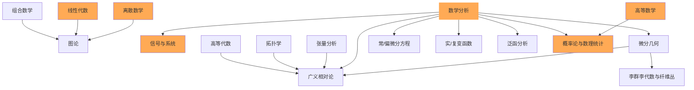

# Head

[TOC]

> Depend

# 高等数学
[高等数学](../life/math/higher_mathematics#高等数学)

# 数理统计学

## 统计学基础
[统计学基础-CrashCourseStatistics](../life/math/basics_statistics#crash-course-statistics)

## 抽样理论
## 假设检验
## 非参数统计
## 方差分析
## 相关回归分析
## 统计推断
## 贝叶斯统计
## 试验设计
## 多元分析
## 统计判决理论
## 时间序列分析
## 空间统计

# 应用统计数学
## 统计质量控制
## 可靠性数学
## 保险数学
## 统计计算
## 统计模拟
# 概率论
## 概率论基础
[概率论基础](../life/math/basics_probability#概率论基础)

## 几何概率
## 概率分布
## 极限理论
## 随机过程
## 马尔可夫过程
## 随机分析
## 鞅论
## 应用概率论

# 数学分析
[数学分析](../life/math/mathematical_analysis#数学分析)

## 三角学
[三角学](../life/math/trigonometry#三角学)

## 微积分学
[微积分学](../life/math/calculus#微积分学)

## 级数理论

## 测度论

# 泛函分析

## 线性算子理论
## 变分法
## 拓扑线性空间
## 希尔伯特空间
## 函数空间
## 巴拿赫空间
## 算子代数
## 测度与积分
## 广义函数论
## 非线性泛函分析

# 非标准分析

## XXX

# 离散数学
[离散数学](../life/math/discrete_mathematics#离散数学)

# 模糊数学

# 组合数学

# 应用数学

# 几何学
## 几何基础
[几何基础](../life/math/basics_geometry#foundations-of-geometry)

## 解析几何
## 空间解析几何
## 几何学基础
## 欧氏几何学
## 非欧几何学
## 球面几何学
## 向量和张量分析
## 仿射几何学
## 射影几何学
## 微分几何学
[微分几何入门与广义相对论](../life/math/differential_geometry#微分几何入门与广义相对论)

## 分数维几何
## 计算几何学

# 数论

## 初等数论
## 解析数论
## 代数数论
## 超越数论
## 丢番图逼近
## 数的几何
## 概率数论
## 计算数论

# 运筹学
## 线性规划
## 非线性规划
## 动态规划
## 组合最优化
## 参数规划
## 整数规划
## 随机规划
## 排队论
## 对策论(博弈论)
## 库存论
## 决策论
## 搜索论
## 图论
## 统筹论
## 最优化
# 代数几何学
## XXX

# 代数学
## 代数基础 
[代数基础](../life/math/basics_algebra#algebra-foundations)

## 群论
## 域论
## 李群
## 李代数
## Kac-Moody 代数
## 环论
## 模论
## 格论
## 泛代数理论
## 范畴论
## 同调代数
## 抽象代数

## 线性代数
[线性代数](../life/math/linear_algebra#线性代数-linear-algebra)

## 数值线性代数 - Numerical linear algebra

# 积分方程
## XXX

# 拓扑学
## 点集拓扑学 (Point Set Topology) (一般拓扑学（General Topology）)
## 代数拓扑学
## 同伦论
## 低维拓扑学
## 同调论
## 维数论
## 格上拓扑学
## 纤维丛论
## 几何拓扑学
## 奇点理论
## 微分拓扑学

# 常微分方程
## 定性理论
## 稳定性理论
## 解析理论
# 偏微分方程

## 椭圆型偏微分方程
## 双曲型偏微分方程
## 抛物型偏微分方程
## 非线性偏微分方程

# 函数论

## 实变函数论(实分析)
[实分析](../life/math/real_analysis#实分析)

## 单复变函数论
## 多复变函数论
## 函数逼近论
## 调和分析
## 复流形
## 特殊函数论

# 动力系统
## 微分动力系统
## 拓扑动力系统
## 复动力系统
# 计算数学
## 数值分析
### 数值分析基础
[数值分析基础](../life/math/basics_numerical_analysis#数值分析基础)

## 常微分方程数值解
## 偏微分方程数值解
## 积分变换与积分方程数值方法
## 数值代数
## 优化计算方法
## 数值逼近与计算几何
## 随机数值方法与统计计算
## 并行计算算法
## 误差分析与区间算法
## 小波分析与傅立叶分析的数值方法
## 反问题计算方法
## 符号计算与计算机推理

# Resources

## 数学深渊

## Useful
* Basic Math Symbols https://www.rapidtables.com/math/symbols/Basic_Math_Symbols.html

## Tutorial
* MathForAi: *https://github.com/Tony-Tan/tony4ai_contents*
* 宋浩老师-高等数学: *https://www.bilibili.com/video/BV1Eb411u7Fw?p=1*
* 宋浩老师-概率论与数理统计: *https://www.bilibili.com/video/BV1ot411y7mU?p=1*
* 宋浩老师-线性代数: *https://www.bilibili.com/video/BV1aW411Q7x1?p=1*
* KhnAcademy-linearAlgebra: *https://www.khanacademy.org/math/linear-algebra*

## Symbol 
* ∑	求和公式
* × 	乘号
* ±   正负号
* ÷  	除号
* ∣   竖线
* ⋅    点
* ∘    圈
* ⨂   克罗内克积
* ⨁ 	异或
* ≤    小于等于
* ≥    大于等于
* ≠   不等于
* ≈   约等于
* ∏  	N元乘积
* ∐   N元余积
* ⋯   省略号
* ∫    积分
* ∬  	双重积分
* ∮    曲线积分
* ∞    无穷
* ∇  	梯度
* ∵  	因为
* ∴  	所以
* ∀ 	任意
* ∃   存在
* ≤ 	小于等于
* ≥ 	大于等于
* ∅   空集
* ∈  属于
* ∉   不属于
* ⊂   子集
* ⊆  	真子集
* ⋃  	并集
* ⋂   交集
* ⋁   逻辑或
* ⋀ 	逻辑与
* ⨄   多重集
* ⨆  $\bigsqcup$

* ↑	向上
* ↓ 	向下
* ⇑  $\Uparrow$	
* ⇓  $\Downarrow$	
* → 	向右
* ← 	向左
* ⇒ 	向右箭头
* ⟸ 	向左长箭头
* ⟵ 	向左单箭头
* ⟶ 	向右长箭头
* ⟹ 	向右箭头
* ↔      \leftrightarrow
* ⟺     \iff
* α 	$\alpha$	
* β 	$\beta$	
* γ 	$\gamma$	
* Γ 	$\Gamma$	
* δ 	$\delta$	
* Δ 	$\Delta$	
* ϵ 	$\epsilon$	
* ε 	$\varepsilon$	
* ζ 	$\zeta$	
* η   $\eta$	
* θ 	$\theta$	
* Θ 	$\Theta$	
* ϑ 	$\vartheta$	
* ι 	$\iota$	
* π 	$\pi$	
* ϕ 	$\phi$	
* Φ 	$\Phi$	
* ψ 	$\psi$	
* Ψ 	$\Psi$	
* ω 	$\omega$	
* Ω 	$\Omega$	
* χ 	\chi	
* ρ 	$\rho$	
* ο 	$\omicron$	
* σ 	$\sigma$	
* Σ 	$\Sigma$	
* ν 	$\nu$	
* ξ 	$\xi$	
* τ 	$\tau$	
* λ 	$\lambda$	
* Λ 	$\Lambda$	
* μ   \mu	
* ∂   $\partial$	

* ℵ     阿列夫
* ¬     \neg或\lnot
* ∨     \vee或\lor	
* ∧     \wedge或land