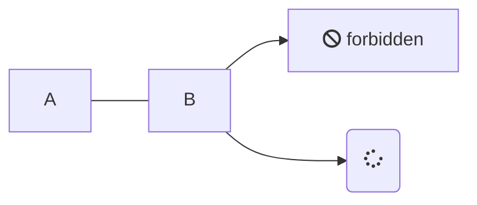
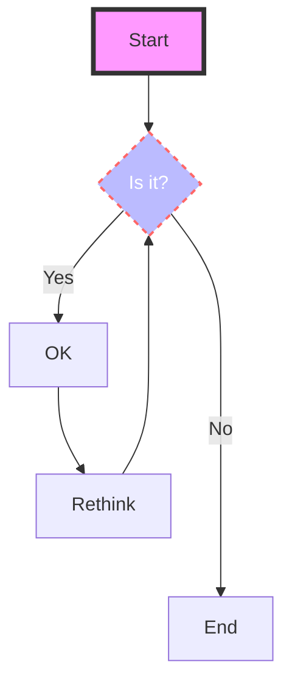

# Docsify

> mindmap

* [1] docsify-mindmap https://github.com/up9cloud/docsify-mindmap

```mindmap
root
  topic1
    subtopic
  topic2
    subtopic
```

> Tabs

<!-- tabs:start -->

#### **English**

Hello!

#### **French**

Bonjour!

#### **Italian**

Ciao!

<!-- tabs:end -->

> Charty

* [1] charty plugin for docsify.js https://markbattistella.github.io/docsify-charty-docs/#/

```charty
{
  "title":   "Radar chart",
  "caption": "With a caption",
  "type":    "radar",
  "options": {
    "legend":  true,
    "labels":  true,
    "numbers": true
  },
  "data": [
    {
        "label": "iPhone",
        "value": [64, 23, 45, 34, 52, 43, 59, 40],
        "points": [
            "Features",
            "Style",
            "Usability",
            "Ratings",
            "Apps",
            "Softness",
            "Ruggedness",
            "Appeal"
        ]
    },
    {
        "label": "Android",
        "value": [86, 53, 55, 66, 80, 46, 49, 40]
    },
    {
        "label": "Chrome",
        "value": [100, 35, 76, 90, 36, 9, 0, 90]
    }
  ]
}
```

```charty
{
  "title":   "Area chart",
  "caption": "With a caption",
  "type":    "area",
  "options": {
    "legend":  true,
    "labels":  true,
    "numbers": true
  },
  "data": [
    {
        "label": "2010",
        "value": [120, 23, 45, 34, 52, 43, 59, 40]
     }
  ]
}
```

```charty
{
  "title":   "Pie chart",
  "caption": "With a caption",
  "type":    "pie",
  "options": {
    "legend":  true,
    "labels":  true,
    "numbers": true
  },
  "data": [
      { "label": "2012", "value": 1024 },
      { "label": "2010", "value": 200 },
      { "label": "2011", "value": 560 }
  ]
}
```

> docsify-demo-box-vue

* [1] njleonzhang/docsify-demo-box-vue https://github.com/njleonzhang/docsify-demo-box-vue

> mermaid

* [1] mermaid-docsify https://github.com/Leward/mermaid-docsify
* [2] mermaid https://mermaid-js.github.io/mermaid/#/flowchart





# Markdown

## The head

## 跳转

> 页面外 [Jump to another pages e.g. to book_digest](../life/book_digest#Philosophy-哲学)

> 页面内 [Jump to current page section e.g. to The end](#the-end)

```
#Inside 
[To](#the-end)

#Outside
[To](../../[path]#xxx-xxx)
```

## 颜色字体

<span style="color:blue; font-size:2em; font-family:Papyrus">colorful font</span>

```
<span style="color:blue; font-size:2em; font-family:Papyrus">colorful font</span>
```

## The end

# English
* [1] 现在完成进行时的被动语态 https://zhidao.baidu.com/question/151749164.html
* [2] 现在进行时被动语态 https://zhidao.baidu.com/question/76993910
* [3] 英语时态：现在完成时的被动语态 https://www.hjenglish.com/new/p953771

## Phrasal verbs

* `trade off` (权衡；卖掉) Wasn't your decision to trade off programmer efficiency, security, and software reliability for run time performance a fundamental mistake? 你在为运行时性能权衡编程效率、安全、软件可靠性而做出的决定是否是一个根本错误？
* `fill` something `in` (=complete a form) please fill in this application form
* `find` something `out` (=get information) Did you find out her phone number?
* `wake up` (醒来) I usually wake up early
* `look out`(=be careful) (注意) Look out! A car's coming
* `grow up` (成长) Charles grew up to be a lot like his father.
* `get up` (起来) Grandmother tried to get up, but the couch was too low, and she couldn't make it on own.
* `turn around` (转向反方向) Turn around and let me look at you back.
* `look round/around` (到处查看) People came out of their houses and **looked around**. **Look around** you before crossing the streets
* `go in` (参加) Let's go in, it's getting cold
* `go back` (回去) it's hard to imagine that we will ever go back to Lithuania.
* `go away` (离开) Go away and think about it, then let me know.
* `get out` (出去) He had a hard time getting out of Newark because of the snow.
* `come back` (回来) Father promised that we would never come back to this horrible place.
* `turn` something `on/off` (打开/关闭) Don't forget to turn off the TV.
* `turn up/down` (减小/开大) Can you turn your music down?
* `take` something `off` (脱下) Take your shoes off at the door.
* `take` something `away`  (拿走) I've finished this soup. You can take it away.
* `switch` something `on/off` (接通、开启) Did you switch the heating on?
* `put` something `on/down` (穿上/放下) It's cold outside, You should put on your warn coat.
* `put` something `back` (放回原处；推迟) Have you put the book back on the shelf?
* `pick` somebody `up`(=collect somebody and take them somewhere) (捡起) I'll pick you up at six o'clock.
* `look` something `up`(=find information in a book or computer, etc.) (查阅) I don't know the address but I can look it up on the Internet.
* `give` something `up`(=stop a habit, activity or job) (放弃) He broke his leg and had to give up running.
* `bring` something `back` (拿回来) Did you bring those books back?
* `give` something `back` (归还) We gave the books back at the end of the lesson.
* `inform` sb `of/about` sth. The industry had a duty to inform the public about the extent of the dangers.
* `being/been` `done` What has been done? What is **being done**? 那现在采取了什么措施？还要采取哪些行动？
* `step up` (增加，加快，提升，站出来)She was introduced and **stepped up** to the podium.
* `lay out` (设计，安排，陈列) Some two-dozen platforms are **laid out** in a square at the heart of the city.
* `test out` - **Test out** your skills and get some feedback.
* `put through` - Ask the receptionist to **put** your call **through** to my room.
* `team up` - They **teamed up** and worked out the problem.

---

* I figured you would 我想你会
* We Would Be Okay 我们会好起来
* Thanks so much.非常感谢。
* I really appreciate your help. 我真的很感谢你的帮助。
* Thank you. That helps a lot.谢谢你。这很有帮助。
* Hurry up! 快点
* Many of you! 你们中的许多人

* it turns out 被证明是
* turned-on 赶时髦的，狂热的
* freaked out 吓坏了的,了解到,抓狂的
* drifted apart 分崩离析
* be headed for 去…地方,朝……方向去
* hang out with 与跟某人一起瞎混,与…出去玩,与…闲逛
* laugh out 笑出声,笑出声来
* live off 依赖,住在,靠…生活,靠…过日子
* ended up 导致,结果,入选,最终
* major crush 喜欢,心动,迷恋
* freaked out  吓坏了的；受惊扰的（freak out的过去式) I was really freaked out 我吓坏了
* set off (出发；动身) - I propose to **set off** immediately. She had a quick swig of water and then **set off** again.
* go off (离开；进行) - The buzzer **went off** at eight o’clock. My alarm clock goes off at 7 a.m. every morning 
* being spit on 被人吐口水
* ship with ... 附带...
* more out... She's more out doing 更多的
* as well as... 也,除,而且,和
* up-to-date 最新的,最近的,跟上时代的,现代的
* instead of doing 代替做某事,而不是干某事
* due to 由于;因为;应归于;归功于
* catch up 赶上,望尘莫及,追上,朋友小聚
* welling up， 涌出的，盈满，涌了上来，兴起
* wind up, 结束,使紧张,兴奋,收拍
* more than, 多于；超出；比……多
* went off 爆炸,离去

---

* Any day will do． 哪一天都行
* Just wonderful! 简直太棒了!
* It's up to you． 由你决定。
* I don't mean it. 我不是故意的。
* It's her field． 这是她的本行
* in a rush. The office always operates **in a rush**
* I'm in a hurry! 我在赶时间!
* Can I help you? 我能帮你吗?
* You set me up! 你出卖我!
* I'm on a diet． 我在节食。
* Do me a favor? 帮个忙，好吗?
* What a pity! 太遗憾了!
* Do l have to 非做不可吗?
* That's neat． 这很好。
* Count me on 算上我。
* Keep it up! 坚持下去!
* I doubt it 我怀疑。
* I decline! 我拒绝!
* Bless you! 祝福你!
* So do I． 我也一样。
* Cheer up! 振作起来!
* Allow me． 让我来。
* Come on! 加油
* Go for it! If you really like her, just go for it. It wouldn’t hurt to ask.
* Good luck! 加油 
* Haste makes waste 欲速则不达。
* Look before you leap 三思而后行；
* Read between the lines 言外之意；
* Never say die 决不灰心
* grin and bear it. 忍耐着点
* at this point on time 此时此刻
* All of a sudden. 突然
* get it together enough.振作起来

## Levels

### Level n

> `verb` ... `prep` ... (形容动词)
* **run quickly/fast**
* **quickly run**

> `verb` to be ... `Present participle, past participle, noun, adjective, prepositional phrase, etc` (不定式的被动语态)
* Try **to be** concise
---
* to write. (一般-主动)， **to be** written (一般-被动)
* **to be** writing. (进行-主动)， **to be** being written. (进行-被动) **being体现进行时；being done体现被动语态**[2]
* to have written. (完成-主动)， to have been written/completed (完成-被动-肯定)， have not been done (完成-被动-否定)[3]
* to have been writing.(完成-进行-主动)， ~~to have been being written (完成-进行-被动)~~[1]
---
* had done/been(do和be的过去分词) (过去完成-主动) e.g.He **had** already **been** to New York， had been done(过去完成-被动) e.g.The task **had been finished** before 12:00 yesterday
* had been writing (过去完成进行-主动 - 过去的过去-过去-进行)  Had been being done (过去完成进行-被动)
---
* was/were+being+done(过去进行-被动-肯定) Another bridge **was being built**
* being+过去分词 - I saw the man being taken away by the police. 我看到那个人正被警察带走。
* are+being+done - these assignments are being made 这些任务正在进行中

* be `past participle`  (被动语态) - **be** denied entrance at the door
* `being`... (存在/有...) - **Being** creative helps you learn faster
* `been` ... (是...) - In general, it's **been** a good year.
* `verb` with `sth/sb`- She is been flirting with him all evening.
* as ... `with` ...- as a passenger **with** the flu
* `of` ...ing- slim chance **of getting** sick
* ... `as` ... `as` ... (像...那样...)- Airplane food might not really be as tasteless as you originally thought.
* ... `because of` ...- Your risk of getting sick from an airplane is actually low **because of** the air filters used
* ... (be) `in need of` ... (需要) - The bike **is in need of** replacement. A Problem in Need of a Creative Solution
* ... `be made with` ... (用…制成)- What can **be made with** plastics?
* ... (pron, noun)`'s ing`- Car's coming (车来了)
* ... `by it to` ... (通过它来)- he began his speech **by** describing **it to** the students.
* ... `of it is` ...- But how much **of it is** true? Part **of it is** " nature" and part is " nurture" .
* `because of that it is` ... (因为这是)- **Because of that it's** not recommended to use this beta version for production
* ... `be free to do so on` ... (可以这样做在..)- However you **are free to do so on** your own risk.
* ...`to` (verb)... `that`....`that`... `is`... `is` ...- Test **to** make sure **that** a call to tbb **that** happens before any of the libWork API **is** touched **is** unrestricted.
* getting `(comparison)` and `(comparison)` (越来越...)- Yeah! Look, I can see the castle. Hihi. It's **getting** **bigger**. And **bigger**. And **bigger**.

### Level n-1

* ... `about` ...- Some good news **about** airplane travel
* ... `on` it- we spent a lot of time **on** it
* ... `regarding` ...- Ives had a flash of insight **regarding** a better printing technique.
* ... `over` ...- I went to bed one night in a state of brain fog **over** the problem
* ... `within` ...- as a unit **within** a sentence. The company is operating entirely **within** the law.
* ... `around` ... (周围，围绕)- We took a spin **around** town. There was a fence **around** the yard.
* ... `round`...- He spun the revolving door **round and round.** Let's gather and circle **round**
* ... `gotta`... (have got to)- I gotta go.
* ... `wanna`... (want to)- I wanna go
* ... `gonna`... (going to)- We're gonna have a lotta(lot of) fun

### Level 1

* `There's` ... `to` ...- **There's** nothing **to** tell. **There's** have got **to**(gotta) be something wrong with him.
* `turned on` `by` ... `than` ...- I was more **turned on** **by** this gravy boat **than** by Barry.
* ...`verb(+ly)adv` `do` ...- I **honestly** **don't** know if I'm hungry or horny.
* ... `would be` ...- You **would be** too.
* `How much` ... (多么多么的像什么)- **How much** Barry looks like Potato

## Pick up
* [1] 如何区别定语从句，宾语从句和状语从句？| 虫虫讲英语 https://zhuanlan.zhihu.com/p/56013095

### From

* [1] Series - https://graphics.pixar.com/usd/docs/api/index.html
* [A1] Series - https://dictionary.cambridge.org/us/
* [B1] Series - https://ludwig.guru/
* [1A] Series - https://graphics.pixar.com/usd/docs/api/index.html
* [1B] Series - TV Show - Friends
* [1C] Series - https://learnopengl.com/

* [1] The Ar (Asset Resolution) library **is** responsible for querying, reading, and writing asset data. 
* [2] It **provides** several interfaces **that** allow USD **to access** an asset without knowing how that asset is physically stored.
* [3] Ar **ships** with implementations based on a traditional filesystem.
* [4] However, users **can provide** custom implementations to integrate their own asset storage system
* [5] 1.For example, a user might **have** an asset system **that** stores assets in a database 2.and **uses** special identifiers to address those assets.
* [6] That user **could create** a custom implementation of the ArResolver interface that interprets those identifiers
* [7] This **would allow** the user to use those identifiers for references, payloads, and sublayer composition arcs and other places throughout USD.
* [8] Ar **does not** support custom resolvers implemented in Python to avoid performance issues, especially for multi-threaded consumers.
* [9] The primary resolver **is** the ArResolver subclass **that** Ar uses **to handle** all asset paths **that** are not **handled by** the other resolvers described below.
* [10] 1.ArResolver **is** the central interface **for** asset operations in Ar. 2.Clients **can implement** subclasses of this interface to customize behaviors for their asset system.
* [11] Ar **manages** a set **of** ArResolver subclasses **for** handling different asset paths,which are described below.
* [12] clients just **use** a single resolver that is accessed by calling ArGetResolver.
* [13] Ar **will determine** the appropriate subclass for handling the given input paths and forward the call to that subclass.
* [14] **To** create a custom primary resolver
* [15] 1.**Implement** an ArResolver subclass; 2.**Use** AR_DEFINE_RESOLVER to define the subclass as a resolver;
* [16] **Ensure** that the resolver plugin is located `where the plugin system can find it.`
* [17] at a minimum, the class **will** be constructed `during the first call to ArGetResolver.`
* [18] If no custom resolver is found, Ar **will** use ArDefaultResolver as the primary resolver.
* [19] This resolver **assumes** all asset paths it encounters are filesystem paths.
* [20] ArDefaultResolver also **performs** simple search path-based resolution that will search for an asset in a specified list of directories. 
* [21] **See** documentation on ArDefaultResolver for more information on configuring this behavior.
* [22] URI resolvers **are** ArResolver subclasses that are associated with particular URI schemes.
* [23] It **will** check if any ArResolver subclasses have been registered for the scheme

* [A1] a small object **used to** mark someone's place in some games played on boards
* [A2] **to react** to something with an opposing opinion or action, or to defend yourself against something:

* [B1] That's actually the same formula that we **are using** for cross products.
* [B2] ?The main plants that **are used** for biofuel production now are sugar cane
* [B3] Plans **are being redrawn**.
* [B4] Mean-square error of any estimation procedure **can be bounded** below by the Cramer-Rao lower bound
* [B5] ?But flexibility will prevail only if it **can be bound** by a firm disciplinary framework.
* [B6] At this point the meal **is eaten**.
* [B7] John **is eating** cornbread. 
* [B8] The key thing **is being interesting**
* [B9] It's just that **is been interesting**.

* [1A] The primary unit of scene description within a layer is a prim spec
* [2A] all of the prim spec objects specified in Sdf layers. 
* [3A] Other features abstracted at the layer level include undo/redo functionality and logging
* [4A] You should primarily work with scene description using the classes in the Usd library
* [5A] The UsdStage object not only represents a complete scene
* [6A] it also knows how each of the partial scene descriptions were combined to form the complete scene. 
* [7A] the UsdStage object has the context to know how the path of a UsdPrim object on the stage relates to the paths of each SdfPrimSpec object in each layer that contributes a partial description to the complete prim. 

* [1B] I feel like someone reached my throat, grabbed my small intestine, pulled it out of my mouth, and tied it around my neck
* [2B] Looks like she didn't leave in such a hurry after all
* [3B] I think this is the episode of Three's Company......where's there's some kind of misunderstanding.


* [1C] At some stage of your graphics adventures you will want to draw text in OpenGL. 
* [2C] it is up to us to define a system for rendering text to the screen.
* [3C] but getting the relevant character(s) onto a texture could prove challenging
* [4C] This approach was quite popular back in the day (and still is) since it is fast and works on any platform
* [5C] but as of today more flexible approaches exist
* [6C] FreeType is a software development library that is able to load fonts
* [7C] What makes FreeType particularly attractive is that it is able to load TrueType fonts.
* [8C] the rasterized font images can be procedurally generated based on the preferred font height you'd like to obtain them in
* [9C] Be sure to link to freetype.lib and make sure your compiler knows where to find the header files.
* [10C] all we have to do is initialize the FreeType library and load the font as a face as FreeType likes to call it
* [11C] Next is an image from FreeType that shows all of the metrics it calculates for each character glyph
* [12C] offset we need to figure out the distance a glyph extends below the baseline
* [13C] While not an incredibly obvious effect, the image with ambient occlusion enabled does feel a lot more realistic due to these small occlusion-like details, giving the entire scene a greater feel of depth.

### Pattern

#### 一

* (phrase/pron) `(lve)`                                     
  * (Pr) (AtC)                                        <sub style="background-color:Violet;">&thinsp;[9]</sub>  
    * (AtC)                                           <sub style="background-color:Violet;">&thinsp;[22]</sub>  
  * (Pr)<(PrPt)                                       <sub style="background-color:Violet;">&thinsp;[B8]</sub>  

* (phrase/pron) `(verb)`
  * (Obj)<(phrase)
    * (AtC)                                           <sub style="background-color:Violet;">&thinsp;[2][12][20]</sub>
  * (D-Obj)  
    * (Ad)<(AtC)                                      <sub style="background-color:Violet;">&thinsp;[11]</sub> 
  * (Ad)                                              <sub style="background-color:Violet;">&thinsp;[3]</sub>
  * (ObC) (AtC)                                       <sub style="background-color:Violet;">&thinsp;[19]</sub> 
  * (Pr)                                              <sub style="background-color:Violet;">&thinsp;[1][10.1]</sub> 

* (phrase/pron) `(mod) (verb/passive)` 
  * (Obj) (At) 
    * (Infin)                                         <sub style="background-color:Violet;">&thinsp;[10.2]</sub>                                      
    * (AtC)                                           <sub style="background-color:Violet;">&thinsp;[6]</sub>
  * (Obj) (Ad)                                        <sub style="background-color:Violet;">&thinsp;[13]</sub>
  * (Obj)<(phrase) 
    * (Infin) (phrase)                                <sub style="background-color:Violet;">&thinsp;[4][7]</sub>
    * (AtC) (conj) .                                  <sub style="background-color:Violet;">&thinsp;[5.1]</sub>
    * (phrase)                                        <sub style="background-color:Violet;">&thinsp;[18]</sub>
    * (Ad) (Ad)                                       <sub style="background-color:Violet;">&thinsp;[A1]</sub>
  * (Ad)                                              <sub style="background-color:Violet;">&thinsp;[B5]</sub>
    * (Ad)                                            <sub style="background-color:Violet;">&thinsp;[17]</sub>

* (phrase/pron) `(aux)`
  * (verb) (Obj) (At) (Infin) (phrase)                <sub style="background-color:Violet;">&thinsp;[8]</sub>
  * (verb)<(PrPt)                                     <sub style="background-color:Violet;">&thinsp;[B1]</sub> 
    * (Obj)                                           <sub style="background-color:Violet;">&thinsp;[B7]</sub>  
    * (Pr)<(PaPt)                                     <sub style="background-color:Violet;">&thinsp;[B3]</sub>  
  * (verb)<(PaPt)                                     <sub style="background-color:Violet;">&thinsp;[B6]</sub>  
    * (Pr)<(PrPt)                                     <sub style="background-color:Violet;">&thinsp;[B9]</sub>  

* `(Infin)` 
  * (phrase)                                          <sub style="background-color:Violet;">&thinsp;[14]</sub>
  * (Obj) (Ad) (conj) .                               <sub style="background-color:Violet;">&thinsp;[A2]</sub>

* `(verb)` 
  * (phrase)                                          <sub style="background-color:Violet;">&thinsp;[15.1]</sub>
  * (Obj) (Infin) 
    * (phrase) (Ad)<(phrase)                          <sub style="background-color:Violet;">&thinsp;[15.2]</sub>
    * (phrase)                                        <sub style="background-color:Violet;">&thinsp;[5.2]</sub>
  * (ObC) (AdCP)                                      <sub style="background-color:Violet;">&thinsp;[16]</sub>
  * (Ad) (Ad) (Ad)                                    <sub style="background-color:Violet;">&thinsp;[21]</sub>

* (phrase) (phrase/pron) .           
     
* (v-p) 
  * that (phrase/pron) (passive) (phrase)         

#### 二

* `S`(At+At)+`V`+`P`                                  <sub style="background-color:Violet;">&thinsp;[1A]</sub>
* `S`(At)+`V`+`A`                                     <sub style="background-color:Violet;">&thinsp;[2A]</sub>
* `S`(At+Ad)+`V`+`P`                                  <sub style="background-color:Violet;">&thinsp;[3A]</sub>
* `S`+`V`+`P`+`A`                                     <sub style="background-color:Violet;">&thinsp;[4C][13C]</sub> 
* `S`+`V`+`P`+`AC`(that)                              <sub style="background-color:Violet;">&thinsp;[6C]</sub> 
* `S`(At)+`V`+`P`+`A`+`AC`(that)                      <sub style="background-color:Violet;">&thinsp;[8C]</sub> 

* `S`+`V`+`O`+`A`                                     <sub style="background-color:Violet;">&thinsp;[4A]</sub>
* `S`+`V`+`O`                                         <sub style="background-color:Violet;">&thinsp;[5A]</sub>    
* `S`+`V`+`O`+`AC`                                    <sub style="background-color:Violet;">&thinsp;[12C]</sub>    
* `S`+`V`+`O`+`I`+`OC`(how)                           <sub style="background-color:Violet;">&thinsp;[7A]</sub>  
* `A`+`S`+`V`+`O`+`A`                                 <sub style="background-color:Violet;">&thinsp;[1C]</sub> 

* `S`+`V`+`OC`(how)                                   <sub style="background-color:Violet;">&thinsp;[6A]</sub>
* `SC`(what)+`V`+`PC`(that)                           <sub style="background-color:Violet;">&thinsp;[7C]</sub>
* `V`+`P`                                             <sub style="background-color:Violet;">&thinsp;[9C-front]</sub>  
* `V`+`OC`(that)+`OC`(where)                          <sub style="background-color:Violet;">&thinsp;[9C-latter]</sub>  
* `V`+`PC`(like)                                      <sub style="background-color:Violet;">&thinsp;[2B]</sub>  

* Couldn't sort for now                               <sub style="background-color:Violet;">&thinsp;[2C][3C][5C][10C][11C][3B]</sub>

### Sentence Structure

* S+V （主+谓）- So I do
* S+V+P （主+系+表）- He was so small
* S+V+O （主+谓+宾）- I met a man with seven wives
* S+V+IO+DO（主+谓+间宾+直宾）- I'll give you some bread
* S+V+DO+OC （主+谓+宾+宾补）- I had a little boy, and called him Blue Bell.
* There+be 句型 - There is a little man, and he had a little gun
* SVA (主谓状) - I live in China
* SVOA (主谓宾状) - I put the book away

* 主语 S = Subjective
* 谓语 P = Predicate，分为不及物动词intransitive verb(vi)和 及物动词transitive verb(vt)
* 表语 P = Predicative，可以名词/形容词做表语
* 宾语 O = Object，分为直接宾语direct object（DO）和间接宾语indirect object（IO）
* 宾补 OC = Object Complement
* 状语 Adverbial 
* 定语 Attributive

* 宾语从句 OC = Object clause
* 定语从句 AC = Attributive clause
* 主语从句 SC = Subject clause
* 表语从句 PC = Predicative clause
* 不定式 I = Infinitive

### Explained
* Notation
  1. [] - this means optional if without number, otherwise it means from
  2. . - this means that any type of work can follow it
  3. / - e.g. (phrase/pron) / means some sentences have it, some don't
  4. < -e.g (A)<(ObC) Internal Contain，Adverbials contain object clauses
  5. (AtC) 定语从句 修饰名词和代词；定语是广义的形容词 (状语与定语的区分是看这个从句是形容什么还是增加信息量)
  6. (AdC) 状语从句 修饰动词，形容词，副词；给主句增加信息量；状语是广义的副词
  7. (PrC) 表语从句 表语是紧跟系动词之后的结构,我们称及物动词之后的结构为宾语，而称系动词之后的结构为表语
  8. (SuC) 主语从句 主语从句是在句子中充当主语的从句。　它与其它名词性从句一样，通常由连接代词或连接副词引导。
  9. (ObC) 宾语从句 作宾语的从句，放在动词或介词后面
  10. (Ad) 状语
      1. 状语是一种用来修饰动词，形容词，副词或全句的词，说明时间，地点，程度，方式等概念。
  11. (At) 定语 
      1. 定语是用来修饰、限定、说明名词或代词的品质与特征的
  12. (Pr) 表语 
      1. 表语是说明主语的身份、性质、品性、特征和状态的，表语位于系动词之后，与系动词联系十分紧密，有系动词就有表语，有表语就有系动词
      2. 分词作表语有两种情况： 一种是现在分词作表语，一种是过去分词作表语 e.g. interesting 使人感到有趣 - interested感到有趣的 exciting令人激动的- excited感到激动的 
      3. 形容词做表语
  13. (aux) 助动词，就是协助动词构成时态、语态的词。
  14. (phrase) - Noun Phrase - 名词短语 名词短语 = 限定词 + 修饰性成分/形容词短语 + 中心名词 e.g. A girl who is my sister. The book in the desk. A big apple
  15. (D-Obj) 双宾 谓语动词必须要跟两个宾语才能表达完整意思。两个宾语分别是动作的直接承受者（一般是物）和间接承受者（一般是人）e.g. give sb sth = give sth to sb. tell sb sth = tell sth to sb
* (AtC) -attributive clause
  1. He keeps a **dog** that shits a lot
* (AdCP) -adverbial clause of place
  1. the resolver plugin is **located** where the plugin system can find it.
* (AdCC) -adverbial clause of cause
  1. He keeps a **dog** because he feels lonely
* (ObC) -object clause
  1. I **think** that he will not come back
  2. It depends **on** whether you let it go.
* (PrC) -predicative clause
  1. The truth is (that) **he was very shy**.
  2. He looks **good**.
* (SuC) -subject clause
  1. **That she lacks experience** is obvious
* (Infin) - Infinitive
  1. **to customize** behaviors
  2. **to integrate** their own asset storage system
  3. Ar uses **to handle** all asset paths
  4. allow USD **to access**
  5. allow the user **to use**
  6. uses special identifiers **to address**
* (Obj) -object
  1. subclasses
* (D-Obj) -double objects
  1. I'll give **you** **some bread**, and some milk by-and-by. （Baby Dolly）
  2. She passed **him** **the salt**.
  3. I'll tell **you** **a story** about Jack-a-Nory. （I'll Tell You a Story）
* (Ad) -adverbial
  1. **without knowing how** that asset **is** physically **stored**. (ObC)
  2. **during** the first call 
* (At) - attribute or modifier
  1. be based on - ships with implementations based on a traditional filesystem.
  2. of . -can implement subclasses of this interface
* (Pr) -predicative
  1. He is **great**
* (PaPt) -past participle
  1. redrawn
* (PrPt) -present participle
  1. using
  2. being
* (verb) -predicate 
  1. being
* (mod) -modal verb
  1. can (could), may (might), must, need, ought to, dare (dared), `shall (should), will (would).`
  2. used to (半情态动词)
* (aux) -auxiliary
  1. `be(am is are was were)`
  2. have/has
  3. do/does/did - basics
  4. `shall/should/will/would`
* (lve) -Link verb
  1. `be(am is are was were)` sense(feel，look，smell，sound，taste，seem) 
* (pron)
  1. it
  2. Ar (Asset Resolution)
* (passive)
  1. the class may **be constructed**
  2. She might **be waiting** for you.
  3. be done
  4. has/have done
  5. will be done
  6. (be) going to be done
* (conj)
  * Coordinating Conjunctions：for and nor but or yet so
* (v-p) - Verb Phrase
  1. (verb+prep)
  2. based on
  3. pick up
* (phrase) - Noun Phrase / Prepositional Phrases
  1. The bewildered tourist/other resolvers described below/Ar(AssetResolution)library/database/central interface
  2. The appropriate subclass **for** handling the given input paths
  3. Universal Scene Description (USD)
  4. Their own asset storage system
  5. Custom implementations **of** the ArResolver interface
  6. A traditional filesystem/database/single resolver/custom primary resolver/big red apple/set
  7. An asset [system]
  8. [those/special/several] assets/identifiers/interfaces
  9.  Responsible **for** querying, reading, and writing asset data.
  10. Performance issues
  11. Simple search path-based resolution
  12. in the room
  13. in red
  14. at runtime
  15. at any time
  16. from the database
  17. with implementations 
  18. as a base type
  19. as a resolver
  20. to something
  21. via an ArResolverContextBinder
  22. of this interface
  23. for handling the given input paths

### Abbreviation
* GER - 动名词

### Restrict
* [1] 副词可以修饰动名词吗 https://zhidao.baidu.com/question/1736762307976286867
* [2] 副词的位置和排序 https://zhuanlan.zhihu.com/p/102145689
* [3] 祈使句与动词ing开头的句子有区别吗？ https://www.zhihu.com/question/50694128
* [4] 英语句中可以没有主语吗?  https://zhidao.baidu.com/question/196684662.html
* [5] 非谓语动词和祈使句的区别. https://zhidao.baidu.com/question/526903884.html
* [6] 谓语从句 https://www.hjenglish.com/new/p1322353/

* 副词不可以修饰动名词[1]
* 副词可以修饰动词,包括不定词、动名词和分词,通常位于被修饰的动词后面;修饰及物动词时,一般放在宾语的后面。[2]
  * e.g. 1. 副词修饰及物动词放在宾语后面 We may never **see** him **again**. 
  * e.g. 2. slowly修饰动名词walking。We saw a boat **coming** **quickly** toward us.
  * e.g. 3. They **walked** **slowly**. slowly修饰动词walked。
* 谓语动词不能直接做主语[3]
  * learning from your mistake is a good way to learn English.  -ing动词短语作主语就是一个普通的**陈述句**
  * Learn from your mistake is a good way to learn English.这个句子是不符合语法规定的的，因为祈使句又叫无主句
  * 如果把这个句子改为**祈使句**，应该是 Learn from your mistake. It/This is a good way to learn English.前一个句子多是表达一个事实，后一个句子就是建议
* 英语中可以没有主语[4]
  * 可以！**祈使句**！例如，Open the door！开门，open 为谓语动词，the door为宾语，此时，省略了主语，而这个句子依然是成立的！
* 祈使句的否定形式在前面加Don't[5]
  * e.g. Don’t go there alone！不要一个人去那里。
* 没有谓语从句，没有谓语从句这种说法，因为谓语从句不符合常规，没有动词可以用一个句子来修饰。[6]
