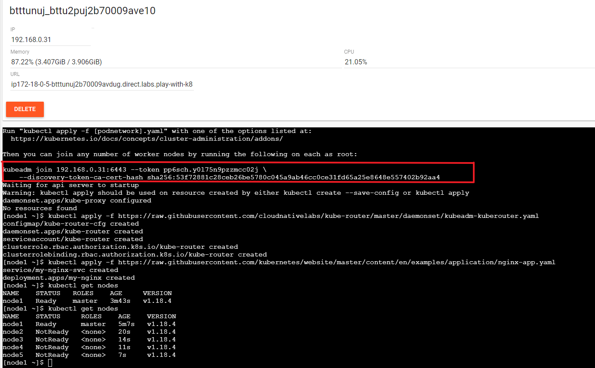
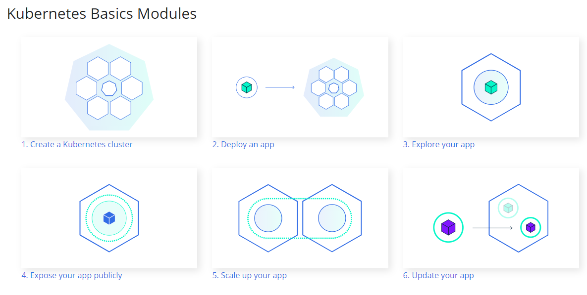
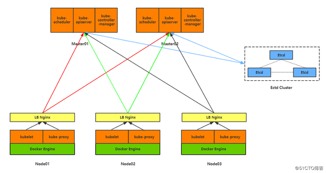
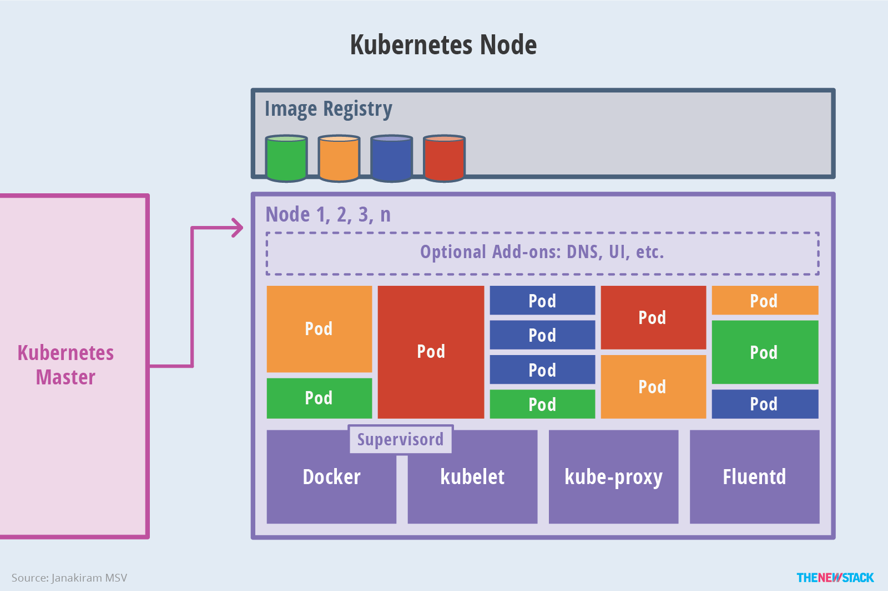
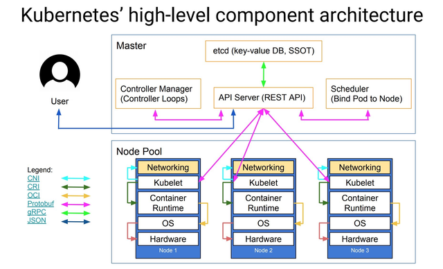
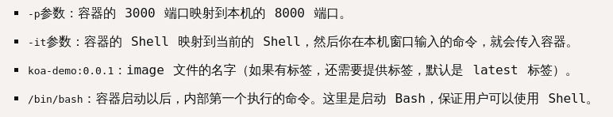

# Cloud Native

## Learning Cloud Native Go
* address: https://learning-cloud-native-go.github.io

## Install go
* on centos
```bash
yum install wget -y
wget https://dl.google.com/go/go1.13.linux-amd64.tar.gz
tar -C /usr/local -xzf go1.13.linux-amd64.tar.gz
export PATH=$PATH:/usr/local/go/bin
```

## Set terminal environment variables
```bash
set DEBUG=true
set SERVER_PORT=8080
set SERVER_TIMEOUT_READ=5s
set SERVER_TIMEOUT_WRITE=10s
set SERVER_TIMEOUT_IDLE=15s
set DB_HOST=db
set DB_PORT=3306
set DB_USER=myapp_user
set DB_PASS=myapp_pass
set DB_NAME=myapp_db

```

## Common ERRORs
* run: `go get` or `go run` got follow error 
* `proxyconnect tcp: net/http: TLS handshake timeout`
* check your proxy:
  * `set http_proxy=http://127.0.0.1:10809`
  * `set https_proxy=http://127.0.0.1:10809`
  * it's work for me

## Learning Cloud Native 

### Creating a new Go project
* Creating a Go module
  * `go mod init myapp`

### Adding initial HTTP server
* run
  * use `go run cmd/app/main.go` command, to run it locally.
* test
  * use `curl 127.0.0.1:8080`
  * should see `Hello World!`

### Adding initial docker files
* Docker is a platform for developers and sysadmins to develop, deploy, and run applications with containers.
* A container is a standard unit of software that packages up code and all its dependencies so the application runs quickly and reliably from one computing environment to another.

#### Adding a docker-compose.yml
* Compose is a tool for defining and running multi-container Docker applications. With a single command, we can create and start all the services according to the content in the `docker-compose.yml` file.

* use `docker-compose build` and `docker-compose up` commands, to build and run the application.

### Adding initial configurations
* We have hard-coded the server port and timeout values with the code. Things like them should be configurable. So better extract them to a config package and use those config parameters in the code.

* Populating data from environment variables
  * Go standard library provides `os.Getenv()` function to read each environment variable separately. But there are Go libraries like `spf13/viper`, `kelseyhightower/envconfig`, `caarlos0/env`, `joeshaw/envdecode` to get data on multiple environment variables as a set, by populating a struct from environment variables. I chose `joeshaw/envdecode` to use in here, due to its simplicity.
* `go get github.com/joeshaw/envdecode`

### Adding Chi router
* The default HTTP request multiplexer in `net/http` is not very powerful. For example, if you visit `localhost:8080/invalid-path` it gives the same Hello World! response with 200 HTTP status instead giving 404 HTTP status. There are many powerful router libraries in Go like gorilla/mux, `go-chi/chi`, `julienschmidt/httprouter`, `buaazp/fasthttprouter`. In here, we are using `go-chi/chi` due to its lesser weight and extensibility.
* `go get github.com/go-chi/chi`

### Adding Zerolog logger
* While using microservices architectures, multiple services might be invoked to handle a single client request. The Syslog is a message logging protocol which can be used to send all log events in different systems to a centralized log storage like Graylog, Stackdriver, ELK Stack, to provide visibility into the behavior of microservices. There are many powerful logging libraries which support Syslog standards in Go like `uber-go/zap`, `apex/log`, `sirupsen/logrus`, `rs/zerolog`. In here, we are using `rs/zerolog` due to its speed and lesser allocations.
* `go get github.com/rs/zerolog`

### Adding DB docker file
* As I informed earlier, we use the docker folder in the project root to store all Docker related files. So, Let’s save this under docker/mariadb/Dockerfile.

```docker
FROM yobasystems/alpine-mariadb:latest
RUN apk update && apk add --no-cache bash
```

### Adding initial database migrations
* Database migrations are like version controls for the database. There are few popular options for database migration in the Go ecosystem like golang-migrate/migrate, pressly/goose, GORM migrations and etc. In here, we are using pressly/goose, due to its lesser resource usage and the simplicity of usage.
* Implementing a DB adapter
* Implementing a DB migration tool using Goose
  * `go get github.com/go-sql-driver/mysql`
  * `go get github.com/pressly/goose`

### Adding GORM
* GORM is a full featured ORM for Golang. It supports database associations, preloading associated models, database transactions and many more. If you are not familiar with GORM, I highly recommend you to check its documentation before starting this section.
* `go get github.com/jinzhu/gorm`

### Adding initial books API routes
* Implementing initial books API Handlers
* Implementing Content-Type JSON middleware
  *  test /books API by using a REST client application like Insomnia REST Client or Postman. 

### Implementing RESTful handlers
* Completing list books functionality
* Completing read book functionality
* Completing delete book functionality
* Completing create book functionality
* Completing update book functionality

### Adding Validator.v9
* Form validation is an important step while inserting and updating data. In the Go ecosystem we can see few validation packages like `go-playground/validator.v9`, `go-ozzo/ozzo-validation`. In here, we are using `playground/validator.v9` due to its simplicity of usage.

* `go get gopkg.in/go-playground/validator.v9`
* `go get github.com/go-playground/validator/v10`

### Glossary
* Docker compose
  * Compose is a tool for defining and running multi-container Docker applications. With Compose, you use a YAML file to configure your application's services. Then, with a single command, you create and start all the services from your configuration. ... Run docker-compose up and Compose starts and runs your entire app.

* Goose
  * Goose is a database migration tool. Manage your database schema by creating incremental SQL changes or Go functions.

* MariaDB
  * MariaDB Server is one of the most popular database servers in the world. It’s made by the original developers of MySQL and guaranteed to stay open source. Notable users include Wikipedia, WordPress.com and Google.

  * MariaDB turns data into structured information in a wide array of applications, ranging from banking to websites. It is an enhanced, drop-in replacement for MySQL. MariaDB is used because it is fast, scalable and robust, with a rich ecosystem of storage engines, plugins and many other tools make it very versatile for a wide variety of use cases.

  * MariaDB is developed as open source software and as a relational database it provides an SQL interface for accessing data. The latest versions of MariaDB also include GIS and JSON features.

## Running
```bash
# build
git clone https://github.com/learning-cloud-native-go/myapp.git
cd myapp
docker build -f docker/app/prod.Dockerfile . -t myapp_app

# compose
git clone https://github.com/learning-cloud-native-go/myapp.git
cd myapp
docker-compose build
docker-compose up

set pwk_address=ip172-18-0-12-btukm5uj2b7000b61aeg.direct.labs.play-with-k8s.com
curl %pwk_address%:8080
curl %pwk_address%:8080/healthz
curl %pwk_address%:8080/healthz/liveness
curl %pwk_address%:8080/healthz/readiness
curl %pwk_address%:8080/api/v1/books
curl %pwk_address%:8080/api/v1/books/1

# CRUD
* using postman
* post: http://url.com:8080/api/v1/books
{
    "title": "a another book",
    "author": "aaron",
    "published_date": "2020-10-06",
    "image_url": "http://images.com/image2",
    "description": "a good book too"
}
```

# Minio

## Install Minio Service

```
wget -P /usr/local/bin https://dl.min.io/server/minio/release/linux-amd64/minio
chmod +x /usr/local/bin/minio          
mkdir /srv/MinIO
firewall-cmd --zone=public --add-port=9000/tcp --permanent
firewall-cmd --reload
touch /etc/systemd/system/minio.service
nano /etc/systemd/system/minio.service
>
[Unit]
Description=MinIO object storage server
After=network.target

[Service]
Type=simple
Environment="MINIO_ROOT_USER=xx"
Environment="MINIO_ROOT_PASSWORD=xx"
Environment="MINIO_ACCESS_KEY=xx"
Environment="MINIO_SECRET_KEY=xx"
ExecStart=/usr/local/bin/minio server /srv/MinIO
Restart=on-failure

[Install]
WantedBy=multi-user.target
>

systemctl start minio
systemctl enable minio
```

## Install Minio client

```
scoop install minio-client
mc alias set myminio http://<ip>:<port> <user> <passwd>
```

* https://docs.min.io/docs/minio-client-quickstart-guide.html

# Web

### WebGL
* [1] WebGL https://get.webgl.org

### WebGPU
* [1] WebGPU - W3C https://www.w3.org/TR/webgpu/

### WebRTC
* [1] WebRTC https://webrtc.org/

# Kubernetes (k8s)

## Play with Kubernetes (PWK)
* address: https://labs.play-with-k8s.com/

* Initializes cluster master node
  * `kubeadm init --apiserver-advertise-address $(hostname -i) --pod-network-cidr 10.5.0.0/16`
* Join

<div align=center>

</div>

* Initialize cluster networking:
  * `kubectl apply -f https://raw.githubusercontent.com/cloudnativelabs/kube-router/master/daemonset/kubeadm-kuberouter.yaml`
* (Optional) Create an nginx deployment:
  * `kubectl apply -f https://raw.githubusercontent.com/kubernetes/website/master/content/en/examples/application/nginx-app.yaml`

## Katacoda
* address: https://www.katacoda.com/courses/kubernetes/playground

## Command
```bash
kubectl get pods -o wide
kubectl get service
kubectl get nodes 
```

## Official Websuit
* address: https://kubernetes.io/docs/concepts/overview/

## K8s for docker desktop
* repository

```bash
git clone https://github.com/AliyunContainerService/k8s-for-docker-desktop.git
```

* install kubernetes Dashboard

```bash
# way1
cd k8s-for-docker-desktop
kubectl create -f kubernetes-dashboard.yaml

# way2
kubectl delete deployments kubernetes-dashboard -n kube-system
kubectl apply -f https://raw.githubusercontent.com/kubernetes/dashboard/v2.0.0-rc2/aio/deploy/recommended.yaml
```

* open api server proxy

```bash
kubectl proxy
http://localhost:8001/api/v1/namespaces/kubernetes-dashboard/services/https:kubernetes-dashboard:/proxy/#/login
```

* get TOKEN for login

```bash
$TOKEN=((kubectl -n kube-system describe secret default | Select-String "token:") -split " +")[1]
kubectl config set-credentials docker-for-desktop --token="${TOKEN}"
echo $TOKEN
```

* ERROR 
  * 404 error when login to dashboard
    * ISSUE 5347
      * https://github.com/kubernetes-sigs/kubespray/issues/5347
    * change version 1.10.0 to 2.0.0rc
    * reference from
      * https://collabnix.com/kubernetes-dashboard-on-docker-desktop-for-windows-2-0-0-3-in-2-minutes/
 
## Concepts

### Overview

#### What is Kubernetes?
* Kubernetes is a portable, extensible, open-source platform for managing containerized workloads and services, that facilitates both declarative configuration and automation. It has a large, rapidly growing ecosystem. Kubernetes services, support, and tools are widely available.

<div align=center>

</div>

* Container deployment era: Containers are similar to VMs, but they have relaxed isolation properties to share the Operating System (OS) among the applications. Therefore, containers are considered lightweight. Similar to a VM, a container has its own filesystem, CPU, memory, process space, and more. As they are decoupled from the underlying infrastructure, they are portable across clouds and OS distributions.

* Containers have become popular because they provide extra benefits, such as:

  * Agile application creation and deployment: increased ease and efficiency of container image creation compared to VM image use.
  * Continuous development, integration, and deployment: provides for reliable and frequent container image build and deployment with quick and easy rollbacks (due to image immutability).
  * Dev and Ops separation of concerns: create application container images at build/release time rather than deployment time, thereby decoupling applications from infrastructure.
  * Observability not only surfaces OS-level information and metrics, but also application health and other signals.
  * Environmental consistency across development, testing, and production: Runs the same on a laptop as it does in the cloud.
  * Cloud and OS distribution portability: Runs on Ubuntu, RHEL, CoreOS, on-premises, on major public clouds, and anywhere else.
  * Application-centric management: Raises the level of abstraction from running an OS on virtual hardware to running an application on an OS using logical resources.
  * Loosely coupled, distributed, elastic, liberated micro-services: applications are broken into smaller, independent pieces and can be deployed and managed dynamically – not a monolithic stack running on one big single-purpose machine.
  * Resource isolation: predictable application performance.
  * Resource utilization: high efficiency and density.

* Why you need Kubernetes and what it can do
  * Kubernetes provides you with a framework to run distributed systems resiliently. It takes care of scaling and failover for your application, provides deployment patterns, and more. For example, Kubernetes can easily manage a canary deployment for your system.

    * Service discovery and load balancing 
    * Storage orchestration
    * Automated rollouts and rollbacks
    * Automatic bin packing
    * Self-healing 
    * Secret and configuration management


#### Kubernetes Components
* A Kubernetes cluster consists of the components that represent the control plane and a set of machines called nodes.

* A Kubernetes cluster consists of a set of worker machines, called nodes, that run containerized applications. Every cluster has at least one worker node.

* The worker node(s) host the Pods that are the components of the application workload. The control plane manages the worker nodes and the Pods in the cluster. In production environments, the control plane usually runs across multiple computers and a cluster usually runs multiple nodes, providing fault-tolerance and high availability.

<div align=center>

</div>

* **Control Plane Components**
  * The control plane's components make global decisions about the cluster (for example, scheduling), as well as detecting and responding to cluster events (for example, starting up a new pod when a deployment's replicas field is unsatisfied).

  * Control plane components can be run on any machine in the cluster. However, for simplicity, set up scripts typically start all control plane components on the same machine, and do not run user containers on this machine

  * **kube-apiserver**
    * The API server is a component of the Kubernetes control plane that exposes the Kubernetes API. The API server is the front end for the Kubernetes control plane.

    * The main implementation of a Kubernetes API server is kube-apiserver. kube-apiserver is designed to scale horizontally—that is, it scales by deploying more instances. You can run several instances of kube-apiserver and balance traffic between those instances.

  * **etcd**
    * Consistent and highly-available key value store used as Kubernetes' backing store for all cluster data.

  * **kube-scheduler**
    * Control plane component that watches for newly created Pods with no assigned node, and selects a node for them to run on.

    * Factors taken into account for scheduling decisions include: individual and collective resource requirements, hardware/software/policy constraints, affinity and anti-affinity specifications, data locality, inter-workload interference, and deadlines.

  * **kube-controller-manager**
    * Control Plane component that runs controller processes.
    * Logically, each controller is a separate process, but to reduce complexity, they are all compiled into a single binary and run in a single process.
    * controllers include:
      * Node controller: Responsible for noticing and responding when nodes go down.
      * Replication controller: Responsible for maintaining the correct number of pods for every replication controller object in the system.
      * Endpoints controller: Populates the Endpoints object (that is, joins Services & Pods).
      * Service Account & Token controllers: Create default accounts and API access tokens for new namespaces
  * **cloud-controller-manager**
    * A Kubernetes control plane component that embeds cloud-specific control logic. The cloud controller manager lets you link your cluster into your cloud provider's API, and separates out the components that interact with that cloud platform from components that just interact with your cluster.
    * The cloud-controller-manager only runs controllers that are specific to your cloud provider. If you are running Kubernetes on your own premises, or in a learning environment inside your own PC, the cluster does not have a cloud controller manager.

    * As with the kube-controller-manager, the cloud-controller-manager combines several logically independent control loops into a single binary that you run as a single process. You can scale horizontally (run more than one copy) to improve performance or to help tolerate failures.

    * The following controllers can have cloud provider dependencies:

      * Node controller: For checking the cloud provider to determine if a node has been deleted in the cloud after it stops responding
      * Route controller: For setting up routes in the underlying cloud infrastructure
      * Service controller: For creating, updating and deleting cloud provider load balancers

* **Node Components**
  * Node components run on every node, maintaining running pods and providing the Kubernetes runtime environment.

  * **kubelet**
    * An agent that runs on each node in the cluster. It makes sure that containers are running in a Pod.

    * The kubelet takes a set of PodSpecs that are provided through various mechanisms and ensures that the containers described in those PodSpecs are running and healthy. The kubelet doesn't manage containers which were not created by Kubernetes.

  * **kube-proxy**
    * kube-proxy is a network proxy that runs on each node in your cluster, implementing part of the Kubernetes Service concept.

    * kube-proxy maintains network rules on nodes. These network rules allow network communication to your Pods from network sessions inside or outside of your cluster.

    * kube-proxy uses the operating system packet filtering layer if there is one and it's available. Otherwise, kube-proxy forwards the traffic itself.

  * **Container runtime**
    * The container runtime is the software that is responsible for running containers.

    * Kubernetes supports several container runtimes: Docker, containerd, CRI-O, and any implementation of the Kubernetes CRI (Container Runtime Interface).

* **Addons**
  * Addons use Kubernetes resources (DaemonSet, Deployment, etc) to implement cluster features. Because these are providing cluster-level features, namespaced resources for addons belong within the kube-system namespace.

  * **DNS**
    * While the other addons are not strictly required, all Kubernetes clusters should have cluster DNS, as many examples rely on it.
    * Cluster DNS is a DNS server, in addition to the other DNS server(s) in your environment, which serves DNS records for Kubernetes services.
    * Containers started by Kubernetes automatically include this DNS server in their DNS searches.

  * **Web UI (Dashboard)**
    * Dashboard is a general purpose, web-based UI for Kubernetes clusters. It allows users to manage and troubleshoot applications running in the cluster, as well as the cluster itself.

  * **Container Resource Monitoring**
    * Container Resource Monitoring records generic time-series metrics about containers in a central database, and provides a UI for browsing that data.

  * **Cluster-level Logging**
    * A cluster-level logging mechanism is responsible for saving container logs to a central log store with search/browsing interface.

#### The Kubernetes API
The core of Kubernetes' control plane is the API server. The API server exposes an HTTP API that lets end users, different parts of your cluster, and external components communicate with one another.

The Kubernetes API lets you query and manipulate the state of objects in the Kubernetes API (for example: Pods, Namespaces, ConfigMaps, and Events).

Most operations can be performed through the kubectl command-line interface or other command-line tools, such as kubeadm, which in turn use the API. However, you can also access the API directly using REST calls.

Consider using one of the client libraries if you are writing an application using the Kubernetes API.

* OpenAPI specification
* API changes
* API groups and versioning 
* API Extension 

#### Working with Kubernetes Objects
* Understanding Kubernetes Objects
  * You can express them in .yaml format
  * Kubernetes objects are persistent entities in the Kubernetes system. Kubernetes uses these entities to represent the state of your cluster. Specifically, they can describe:

    * What containerized applications are running (and on which nodes)
    * The resources available to those applications
    * The policies around how those applications behave, such as restart policies, upgrades, and fault-tolerance

  * To work with Kubernetes objects--whether to create, modify, or delete them--you'll need to use the Kubernetes API. When you use the kubectl command-line interface, for example

  * e.g.
    * `kubectl apply -f https://k8s.io/examples/application/deployment.yaml --record`

  * from: https://kubernetes.io/docs/concepts/overview/working-with-objects/kubernetes-objects/

* Kubernetes Object Management
  * The `kubectl` command-line tool supports several different ways to create and manage Kubernetes objects. This document provides an overview of the different approaches. Read the [Kubectl book](https://kubectl.docs.kubernetes.io/) for details of managing objects by Kubectl.

* Object Names and IDs
  * Each object in your cluster has a Name that is unique for that type of resource. Every Kubernetes object also has a UID that is unique across your whole cluster.

  * For example, you can only have one Pod named `myapp-1234` within the same namespace, but you can have one Pod and one Deployment that are each named `myapp-1234`.

* Namespaces
  * Kubernetes supports multiple virtual clusters backed by the same physical cluster. These virtual clusters are called namespaces.

* Labels and Selectors
  * Labels are key/value pairs that are attached to objects, such as pods. Labels are intended to be used to specify identifying attributes of objects that are meaningful and relevant to users, but do not directly imply semantics to the core system. Labels can be used to organize and to select subsets of objects. Labels can be attached to objects at creation time and subsequently added and modified at any time. Each object can have a set of key/value labels defined. Each Key must be unique for a given object.

```ymal
"metadata": {
  "labels": {
    "key1" : "value1",
    "key2" : "value2"
  }
}
```

  * Labels allow for efficient queries and watches and are ideal for use in UIs and CLIs. Non-identifying information should be recorded using annotations

  * from： https://kubernetes.io/docs/concepts/overview/working-with-objects/labels/

* Annotations
  * You can use Kubernetes annotations to attach arbitrary non-identifying metadata to objects. Clients such as tools and libraries can retrieve this metadata.

* Field Selectors
  * Field selectors let you select Kubernetes resources based on the value of one or more resource fields

* Recommended Labels
  * You can visualize and manage Kubernetes objects with more tools than kubectl and the dashboard. A common set of labels allows tools to work interoperably, describing objects in a common manner that all tools can understand

```ymal
apiVersion: apps/v1
kind: StatefulSet
metadata:
  labels:
    app.kubernetes.io/name: mysql
    app.kubernetes.io/instance: mysql-abcxzy
    app.kubernetes.io/version: "5.7.21"
    app.kubernetes.io/component: database
    app.kubernetes.io/part-of: wordpress
    app.kubernetes.io/managed-by: helm

```

### Cluster Architecture

#### Nodes
Kubernetes runs your workload by placing containers into Pods to run on Nodes. A node may be a virtual or physical machine, depending on the cluster. Each node contains the services necessary to run Pods, managed by the control plane.

Typically you have several nodes in a cluster; in a learning or resource-limited environment, you might have just one.

The components on a node include the kubelet, a container runtime, and the kube-proxy.

#### Control Plane-Node Communication
This document catalogs the communication paths between the control plane (really the apiserver) and the Kubernetes cluster. The intent is to allow users to customize their installation to harden the network configuration such that the cluster can be run on an untrusted network (or on fully public IPs on a cloud provider).

#### Controllers
In robotics and automation, a control loop is a non-terminating loop that regulates the state of a system.

Here is one example of a control loop: a thermostat in a room.

When you set the temperature, that's telling the thermostat about your desired state. The actual room temperature is the current state. The thermostat acts to bring the current state closer to the desired state, by turning equipment on or off.

In Kubernetes, controllers are control loops that watch the state of your cluster, then make or request changes where needed. Each controller tries to move the current cluster state closer to the desired state.

#### Cloud Controller Manager
Cloud infrastructure technologies let you run Kubernetes on public, private, and hybrid clouds. Kubernetes believes in automated, API-driven infrastructure without tight coupling between components.

### Containers
Each container that you run is repeatable; the standardization from having dependencies included means that you get the same behavior wherever you run it.

Containers decouple applications from underlying host infrastructure. This makes deployment easier in different cloud or OS environments.

* Container images 
  * A container image is a ready-to-run software package, containing everything needed to run an application: the code and any runtime it requires, application and system libraries, and default values for any essential settings.

  * By design, a container is immutable: you cannot change the code of a container that is already running. If you have a containerized application and want to make changes, you need to build a new image that includes the change, then recreate the container to start from the updated image.

* Container runtimes
  * The container runtime is the software that is responsible for running containers.

  * Kubernetes supports several container runtimes: Docker, containerd, CRI-O, and any implementation of the Kubernetes CRI (Container Runtime Interface).

#### Images
A container image represents binary data that encapsulates an application and all its software dependencies. Container images are executable software bundles that can run standalone and that make very well defined assumptions about their runtime environment.

You typically create a container image of your application and push it to a registry before referring to it in a Pod

#### Container environment 
The Kubernetes Container environment provides several important resources to Containers:

  * A filesystem, which is a combination of an image and one or more volumes.
  * Information about the Container itself.
  * Information about other objects in the cluster.

#### Runtime Class
RuntimeClass is a feature for selecting the container runtime configuration. The container runtime configuration is used to run a Pod's containers.

#### Container Lifecycle Hooks
Analogous to many programming language frameworks that have component lifecycle hooks, such as Angular, Kubernetes provides Containers with lifecycle hooks. The hooks enable Containers to be aware of events in their management lifecycle and run code implemented in a handler when the corresponding lifecycle hook is executed

### Workloads

#### Pods
Pods are the smallest deployable units of computing that you can create and manage in Kubernetes.

#### Controllers
* Deployments
  * A Deployment provides declarative updates for Pods ReplicaSets.

* ReplicaSet
  * A ReplicaSet's purpose is to maintain a stable set of replica Pods running at any given time. As such, it is often used to guarantee the availability of a specified number of identical Pods

* StatefulSets
  * StatefulSet is the workload API object used to manage stateful applications.

* DaemonSet
  * A DaemonSet ensures that all (or some) Nodes run a copy of a Pod. As nodes are added to the cluster, Pods are added to them. As nodes are removed from the cluster, those Pods are garbage collected. Deleting a DaemonSet will clean up the Pods it created.

  * Some typical uses of a DaemonSet are:

    * running a cluster storage daemon on every node
    * running a logs collection daemon on every node
    * running a node monitoring daemon on every node

* Jobs
  * A Job creates one or more Pods and ensures that a specified number of them successfully terminate. As pods successfully complete, the Job tracks the successful completions. When a specified number of successful completions is reached, the task (ie, Job) is complete. Deleting a Job will clean up the Pods it created.

  * A simple case is to create one Job object in order to reliably run one Pod to completion. The Job object will start a new Pod if the first Pod fails or is deleted (for example due to a node hardware failure or a node reboot).

  * You can also use a Job to run multiple Pods in parallel.

  * Running an example Job 

```bash
kubectl apply -f https://kubernetes.io/examples/controllers/job.yaml
kubectl describe jobs/pi
# get pods
kubectl get pods --selector=job-name=pi --output=jsonpath='{.items[*].metadata.name}'
> pi-5rwd7
# geet result
kubectl logs pi-5rwd7
> 3.1415926535897932384626433832...
```

* Garbage Collection
  * The role of the Kubernetes garbage collector is to delete certain objects that once had an owner, but no longer have an owner

* TTL Controller for Finished Resources
  * The TTL controller provides a TTL (time to live) mechanism to limit the lifetime of resource objects that have finished execution. TTL controller only handles Jobs for now, and may be expanded to handle other resources that will finish execution, such as Pods and custom resources.

* CronJob
  * A CronJob creates Jobs on a repeating schedule.

  * One CronJob object is like one line of a crontab (cron table) file. It runs a job periodically on a given schedule, written in Cron format.

* ReplicationController
  * A ReplicationController ensures that a specified number of pod replicas are running at any one time. In other words, a ReplicationController makes sure that a pod or a homogeneous set of pods is always up and available

### Services, Load Balancing, and Networking
https://kubernetes.io/docs/concepts/services-networking/
* Kubernetes networking addresses four concerns:

  * Containers within a Pod use networking to communicate via loopback.
  * Cluster networking provides communication between different Pods.
  * The Service resource lets you expose an application running in Pods to be reachable from outside your cluster.
  * You can also use Services to publish services only for consumption inside your cluster.

#### Service
#### Service Topology
#### DNS for Services and Pods
#### Connecting Applications with Services
#### EndpointSlices
#### Ingress
#### Ingress Controllers
#### Network Policies
#### Adding entries to Pod /etc/hosts with HostAliases
#### IPv4/IPv6 dual-stack

### Storage
https://kubernetes.io/docs/concepts/storage/

#### Volumes
#### Persistent Volumes
#### Volume Snapshots
#### CSI Volume Cloning
#### Storage Classes
#### Volume Snapshot Classes
#### Dynamic Volume Provisioning
#### Storage Capacity
#### Ephemeral Volumes
#### Node-specific Volume Limits

### Configuration
https://kubernetes.io/docs/concepts/configuration/
#### Configuration Best Practices
#### ConfigMaps
#### Secrets
#### Managing Resources for Containers
#### Pod Overhead
#### Organizing Cluster Access Using kubeconfig Files
#### Pod Priority and Preemption

### Security
https://kubernetes.io/docs/concepts/security/
#### Overview of Cloud Native Security
#### Pod Security Standards

## Tasks

### Install Tools
https://kubernetes.io/docs/tasks/tools

### Run Applications

#### Run a Stateless Application Using a Deployment

* try using:
  * [Katacoda](https://www.katacoda.com/courses/kubernetes/playground)
  * [Play with Kubernetes](http://labs.play-with-k8s.com/)

* Creating and exploring an nginx deployment

```bash
# Create a Deployment based on the YAML file:
kubectl apply -f https://k8s.io/examples/application/deployment.yaml

# Display information about the Deployment:
kubectl describe deployment nginx-deployment

# List the Pods created by the deployment:
kubectl get pods -l app=nginx

# Display information about a Pod:
kubectl describe pod <pod-name>
```

* Updating the deployment 

```bash
# Apply the new YAML file:
kubectl apply -f https://k8s.io/examples/application/deployment-update.yaml

# Watch the deployment create pods with new names and delete the old pods:
kubectl get pods -l app=nginx

```

* caling the application by increasing the replica count 

```bash
# Apply the new YAML file:
kubectl apply -f https://k8s.io/examples/application/deployment-scale.yaml

# Verify that the Deployment has four Pods:
kubectl get pods -l app=nginx
```

* Deleting a deployment 

```bash
# Delete the deployment by name:
kubectl delete deployment nginx-deployment
```

#### Run a Single-Instance Stateful Application
https://kubernetes.io/docs/tasks/run-application/run-single-instance-stateful-application/

## Tutorials

### Hello Minikube

```bash

# Create a Minikube cluster
# locally run before
# `minikube start`
minikube dashboard

# Create a Deployment
kubectl create deployment hello-node --image=k8s.gcr.io/echoserver:1.4
# View the Deployment:
kubectl get deployments
# View the Pod:
kubectl get pods
# View cluster events:
kubectl get events
# View the kubectl configuration:
kubectl config view

# Create a Service
# The --type=LoadBalancer flag indicates that you want to expose your Service outside of the cluster.
kubectl expose deployment hello-node --type=LoadBalancer --port=8080
# View the Service you just created:
kubectl get services
# Run the following command:
minikube service hello-node

# Enable addons
# List the currently supported addons:
minikube addons list
# Enable an addon, for example, metrics-server:
minikube addons enable metrics-server
# View the Pod and Service you just created:
kubectl get pod,svc -n kube-system
# Disable metrics-server:
minikube addons disable metrics-server

# Clean up
# Now you can clean up the resources you created in your cluster:
kubectl delete service hello-node
kubectl delete deployment hello-node
# Optionally, stop the Minikube virtual machine (VM):
minikube stop
# Optionally, delete the Minikube VM:
minikube delete
```  

* Service
  * By default, the Pod is only accessible by its internal IP address within the Kubernetes cluster. To make the hello-node Container accessible from outside the Kubernetes virtual network, you have to expose the Pod as a Kubernetes Service.

### Learn Kubernetes Basics
* Deploy a containerized application on a cluster.
* Scale the deployment.
* Update the containerized application with a new software version.
* Debug the containerized application.

<div align=center>

</div>

#### Create a Cluster

<div align=center>

</div>

```bash
minikube start
kubectl cluster-info
kubectl get nodes
```

#### Depoly an App

<div align=center>

</div>

```bash
# We need to provide the deployment name and app image location (include the full repository url for images hosted outside Docker hub)
kubectl create deployment kubernetes-bootcamp --image=gcr.io/google-samples/kubernetes-bootcamp:v1

kubectl get deployments

# proxy
kubectl proxy

# First we need to get the Pod name, and we'll store in the environment variable POD_NAME
export POD_NAME=$(kubectl get pods -o go-template --template '{{range .items}}{{.metadata.name}}{{"\n"}}{{end}}')
echo Name of the Pod: $POD_NAME
```

#### Explore Your App

<div align=center>

</div>

* Pods
  * A Pod is a Kubernetes abstraction that represents a group of one or more application containers (such as Docker), and some shared resources for those containers. Those resources include:

    * Shared storage, as Volumes
    * Networking, as a unique cluster IP address
    * Information about how to run each container, such as the container image version or specific ports to use

* Nodes
  * A Pod always runs on a Node. A Node is a worker machine in Kubernetes and may be either a virtual or a physical machine, depending on the cluster. Each Node is managed by the Master. A Node can have multiple pods, and the Kubernetes master automatically handles scheduling the pods across the Nodes in the cluster. The Master's automatic scheduling takes into account the available resources on each Node.
<div align=center>

</div>

```bash
# We’ll use the kubectl get command and look for existing Pods:
kubectl get pods
#  to view what containers are inside that Pod and what images are used to build those containers we run the describe pods command:
kubectl describe pods
# open a new terminal and run the proxy:
echo -e "\n\n\n\e[92mStarting Proxy. After starting it will not output a response. Please click the first Terminal Tab\n"; kubectl proxy
# To get the Pod name and store it in the POD_NAME environment variable:
export POD_NAME=$(kubectl get pods -o go-template --template '{{range .items}}{{.metadata.name}}{{"\n"}}{{end}}')
echo Name of the Pod: $POD_NAME
# To see the output of our application, run a curl request.
curl http://localhost:8001/api/v1/namespaces/default/pods/$POD_NAME/proxy/
# retrieve these logs using the kubectl logs command:
kubectl logs $POD_NAME
#  Let’s list the environment variables:
kubectl exec $POD_NAME env
# let’s start a bash session in the Pod’s container:
kubectl exec -ti $POD_NAME bash
```

#### Using a Service to Expose Your App

* Services and Labels
<div align=center>

</div>

  * Service
    * A Service routes traffic across a set of Pods. Services are the abstraction that allow pods to die and replicate in Kubernetes without impacting your application. Discovery and routing among dependent Pods (such as the frontend and backend components in an application) is handled by Kubernetes Services.
  * Labels
    * Labels can be attached to objects at creation time or later on. They can be modified at any time
  
<div align=center>

</div>

```bash
# use the kubectl get command and look for existing Pods:
kubectl get pods
#  let’s list the current Services from our cluster:
# We have a Service called kubernetes that is created by default when minikube starts the cluster. 
kubectl get services
kubectl expose deployment/kubernetes-bootcamp --type="NodePort" --port 8080
kubectl get services
# We have now a running Service called kubernetes-bootcamp. Here we see that the Service received a unique cluster-IP, an internal port and an external-IP (the IP of the Node).

# To find out what port was opened externally (by the NodePort option) we’ll run the describe service command:
kubectl describe services/kubernetes-bootcamp
# Create an environment variable called NODE_PORT that has the value of the Node port assigned:
export NODE_PORT=$(kubectl get services/kubernetes-bootcamp -o go-template='{{(index .spec.ports 0).nodePort}}')
echo NODE_PORT=$NODE_PORT
curl $(minikube ip):$NODE_PORT

# The Deployment created automatically a label for our Pod. With describe deployment command you can see the name of the label:
kubectl describe deployment
# We’ll use the kubectl get pods command with -l as a parameter, followed by the label values:
kubectl get pods -l run=kubernetes-bootcamp
# You can do the same to list the existing services:
kubectl get services -l run=kubernetes-bootcamp
# Get the name of the Pod and store it in the POD_NAME environment variable:
export POD_NAME=$(kubectl get pods -o go-template --template '{{range .items}}{{.metadata.name}}{{"\n"}}{{end}}')
echo Name of the Pod: $POD_NAME
# we use the label command followed by the object type, object name and the new label:
kubectl label pod $POD_NAME app=v1
# This will apply a new label to our Pod (we pinned the application version to the Pod), and we can check it with the describe pod command:
kubectl describe pods $POD_NAME
# We see here that the label is attached now to our Pod. And we can query now the list of pods using the new label:
kubectl get pods -l app=v1

# To delete Services you can use the delete service command. Labels can be used also here:
kubectl delete service -l run=kubernetes-bootcamp
# Confirm that the service is gone:
kubectl get services
# This confirms that our Service was removed. To confirm that route is not exposed anymore you can `curl` the previously exposed IP and port:
curl $(minikube ip):$NODE_PORT
# This proves that the app is not reachable anymore from outside of the cluster. You can confirm that the app is still running with a curl inside the pod:
kubectl exec -ti $POD_NAME curl localhost:8080
```

#### Running Multiple Instances of Your App
* Scaling an application
  * In the previous modules we created a Deployment, and then exposed it publicly via a Service. The Deployment created only one Pod for running our application. When traffic increases, we will need to scale the application to keep up with user demand.

* Scaling is accomplished by changing the number of replicas in a Deployment

<div align=center>

</div>

<div align=center>

</div>

```bash
# To list your deployments use the get deployments command: 
kubectl get deployments
# To see the ReplicaSet created by the Deployment, run 
kubectl get rs
#  let’s scale the Deployment to 4 replicas. We’ll use the kubectl scale command, followed by the deployment type, name and desired number of instances:
kubectl scale deployments/kubernetes-bootcamp --replicas=4
# To list your Deployments once again, use get deployments:
kubectl get deployments
#  let’s check if the number of Pods changed:
kubectl get pods -o wide
# There are 4 Pods now, with different IP addresses. The change was registered in the Deployment events log. To check that, use the describe command:
kubectl describe deployments/kubernetes-bootcamp

# Load Balancing
# Let’s check that the Service is load-balancing the traffic. 
# To find out the exposed IP and Port we can use the describe service
kubectl describe services/kubernetes-bootcamp
# Create an environment variable called NODE_PORT that has a value as the Node port:
export NODE_PORT=$(kubectl get services/kubernetes-bootcamp -o go-template='{{(index .spec.ports 0).nodePort}}')
echo NODE_PORT=$NODE_PORT
# Next, we’ll do a curl to the exposed IP and port. Execute the command multiple times:
curl $(minikube ip):$NODE_PORT
curl $(minikube ip):$NODE_PORT
curl $(minikube ip):$NODE_PORT
curl $(minikube ip):$NODE_PORT
> $ curl $(minikube ip):$NODE_PORT
Hello Kubernetes bootcamp! | Running on: kubernetes-bootcamp-765bf4c7b4-tmlnf | v=1
> $ curl $(minikube ip):$NODE_PORT
Hello Kubernetes bootcamp! | Running on: kubernetes-bootcamp-765bf4c7b4-j867m | v=1
> $ curl $(minikube ip):$NODE_PORT
Hello Kubernetes bootcamp! | Running on: kubernetes-bootcamp-765bf4c7b4-j867m | v=1
> $ curl $(minikube ip):$NODE_PORT
Hello Kubernetes bootcamp! | Running on: kubernetes-bootcamp-765bf4c7b4-jml98 | v=1

# Scale Down
# To scale down the Service to 2 replicas, run again the scale command:
kubectl scale deployments/kubernetes-bootcamp --replicas=2
# List the Deployments to check if the change was applied with the get deployments command:
kubectl get deployments
# The number of replicas decreased to 2. List the number of Pods, with get pods:
kubectl get pods -o wide
```

* ReplicaSet
  * Notice that the name of the ReplicaSet is always formatted as [DEPLOYMENT-NAME]-[RANDOM-STRING]. The random string is randomly generated and uses the pod-template-hash as a seed.

  * Two important columns of this command are:

    * DESIRED displays the desired number of replicas of the application, which you define when you create the Deployment. This is the desired state.
    * CURRENT displays how many replicas are currently running.

#### Performing a Rolling Update
* Updating an application
  * Users expect applications to be available all the time and developers are expected to deploy new versions of them several times a day. In Kubernetes this is done with rolling updates. Rolling updates allow Deployments' update to take place with zero downtime by incrementally updating Pods instances with new ones. The new Pods will be scheduled on Nodes with available resources.

  * In the previous module we scaled our application to run multiple instances. This is a requirement for performing updates without affecting application availability. By default, the maximum number of Pods that can be unavailable during the update and the maximum number of new Pods that can be created, is one. Both options can be configured to either numbers or percentages (of Pods). In Kubernetes, updates are versioned and any Deployment update can be reverted to a previous (stable) version.

```bash
# To list your deployments use the get deployments command:
kubectl get deployments
# To list the running Pods use the get pods command:
kubectl get pods
# To view the current image version of the app, run a describe command against the Pods (look at the Image field):
kubectl describe pods
# To update the image of the application to version 2, use the set image command, followed by the deployment name and the new image version:
kubectl set image deployments/kubernetes-bootcamp kubernetes-bootcamp=jocatalin/kubernetes-bootcamp:v2
# The command notified the Deployment to use a different image for your app and initiated a rolling update. Check the status of the new Pods, and view the old one terminating with the get pods command:
kubectl get pods

# Verify an update
# First, let’s check that the App is running. To find out the exposed IP and Port we can use describe service:
kubectl describe services/kubernetes-bootcamp
# Create an environment variable called NODE_PORT that has the value of the Node port assigned:
export NODE_PORT=$(kubectl get services/kubernetes-bootcamp -o go-template='{{(index .spec.ports 0).nodePort}}')
echo NODE_PORT=$NODE_PORT
# we’ll do a curl to the the exposed IP and port:
curl $(minikube ip):$NODE_PORT
# We hit a different Pod with every request and we see that all Pods are running the latest version (v2).
# The update can be confirmed also by running a rollout status command:
kubectl rollout status deployments/kubernetes-bootcamp
# To view the current image version of the app, run a describe command against the Pods:
kubectl describe pods

# Rollback an update
# Let’s perform another update, and deploy image tagged as v10 :
kubectl set image deployments/kubernetes-bootcamp kubernetes-bootcamp=gcr.io/google-samples/kubernetes-bootcamp:v10
# Use get deployments to see the status of the deployment:
kubectl get deployments
# And something is wrong… We do not have the desired number of Pods available. List the Pods again:
kubectl get pods
# A describe command on the Pods should give more insights:
kubectl describe pods
# There is no image called v10 in the repository. Let’s roll back to our previously working version. We’ll use the rollout undo command:
kubectl rollout undo deployments/kubernetes-bootcamp
# The rollout command reverted the deployment to the previous known state (v2 of the image). Updates are versioned and you can revert to any previously know state of a Deployment. List again the Pods:
kubectl get pods
# Four Pods are running. Check again the image deployed on the them:
kubectl describe pods
```

<div align=center>

</div>
<div align=center>

</div>
<div align=center>

</div>
<div align=center>

</div>

* Similar to application Scaling, if a Deployment is exposed publicly, the Service will load-balance the traffic only to available Pods during the update. An available Pod is an instance that is available to the users of the application.

* Rolling updates allow the following actions:

  * Promote an application from one environment to another (via container image updates)
  * Rollback to previous versions
  * Continuous Integration and Continuous Delivery of applications with zero downtime

### Configuration

#### Configuring Redis using a ConfigMap
* Objectives 
  * Create a kustomization.yaml file containing:
    * a ConfigMap generator
    * a Pod resource config using the ConfigMap
  * Apply the directory by running kubectl apply -k ./
  * Verify that the configuration was correctly applied.

* Real World Example: Configuring Redis using a ConfigMap 

```bash
# First create a kustomization.yaml containing a ConfigMap from the redis-config file:
# Create redis-config
maxmemory 2mb
maxmemory-policy allkeys-lru

# or download from
curl -OL https://k8s.io/examples/pods/config/redis-config

# Create kustonization.yaml
cat <<EOF >./kustomization.yaml
configMapGenerator:
- name: example-redis-config
  files:
  - redis-config
EOF

# download redis-pod.yaml
curl -OL https://raw.githubusercontent.com/kubernetes/website/master/content/en/examples/pods/config/redis-pod.yaml

# add redis-pod.yam resources to kustomization.yaml
cat <<EOF >>./kustomization.yaml
resources:
- redis-pod.yaml
EOF

# Apply the kustomization directory to create both the ConfigMap and Pod objects:
kubectl apply -k .
# Examine the created objects by
kubectl get -k .

# Use kubectl exec to enter the pod and run the redis-cli tool to verify that the configuration was correctly applied:
kubectl exec -it redis -- redis-cli

# Delete the created pod:
kubectl delete pod redis
```

### Stateless Applications

#### Exposing an External IP Address to Access an Application in a Cluster

```bash
# Run a Hello World application in your cluster:
# service/load-balancer-example.yaml Copy service/load-balancer-example.yaml to 
kubectl apply -f https://k8s.io/examples/service/load-balancer-example.yaml

# The preceding command creates a Deployment and an associated ReplicaSet. The ReplicaSet has five Pods each of which runs the Hello World application

# Display information about the Deployment:
kubectl get deployments hello-world
kubectl describe deployments hello-world
# Display information about your ReplicaSet objects:
kubectl get replicasets
kubectl describe replicasets
# Create a Service object that exposes the deployment:
kubectl expose deployment hello-world --type=LoadBalancer --name=my-service
# Display information about the Service:
kubectl get services my-service
# Display detailed information about the Service:
kubectl describe services my-service
# In the preceding output, you can see that the service has several endpoints: 10.0.0.6:8080,10.0.1.6:8080,10.0.1.7:8080 + 2 more. These are internal addresses of the pods that are running the Hello World application. To verify these are pod addresses, enter this command:
kubectl get pods --output=wide
# Use the external IP address (LoadBalancer Ingress) to access the Hello World application:
curl http://<external-ip>:<port>
# Cleaning up
# To delete the Service, enter this command:
kubectl delete services my-service
# To delete the Deployment, the ReplicaSet, and the Pods that are running the Hello World application, enter this command:
kubectl delete deployment hello-world
```

* Notices
  *  The type=LoadBalancer service is backed by external cloud providers, which is not covered in this example, please refer to this page for the details.

#### Example: Deploying PHP Guestbook application with Redis
* Objectives 
  * Start up a Redis master.
  * Start up Redis slaves.
  * Start up the guestbook frontend.
  * Expose and view the Frontend Service.
  * Clean up

* Start up the Redis Master
  * The guestbook application uses Redis to store its data. It writes its data to a Redis master instance and reads data from multiple Redis slave instances

  * **Creating the Redis Master Deployment**
    * The manifest file, included below, specifies a Deployment controller that runs a single replica Redis master Pod.

```bash
# Apply the Redis Master Deployment from the redis-master-deployment.yaml file:
kubectl apply -f https://k8s.io/examples/application/guestbook/redis-master-deployment.yaml
# Query the list of Pods to verify that the Redis Master Pod is running:
kubectl get pods
# Run the following command to view the logs from the Redis Master Pod:
kubectl logs -f <POD-NAME>
```

  * **Creating the Redis Master Service**
    * The guestbook application needs to communicate to the Redis master to write its data. You need to apply a Service to proxy the traffic to the Redis master Pod. A Service defines a policy to access the Pods.

```bash
# Apply the Redis Master Service from the following redis-master-service.yaml file:
kubectl apply -f https://k8s.io/examples/application/guestbook/redis-master-service.yaml
# Query the list of Services to verify that the Redis Master Service is running:
kubectl get service
```
  * Notice: 
    * This manifest file creates a Service named redis-master with a set of labels that match the labels previously defined, so the Service routes network traffic to the Redis master Pod

* Start up the Redis Slaves
  * Although the Redis master is a single pod, you can make it highly available to meet traffic demands by adding replica Redis slaves.

  * **Creating the Redis Slave Deployment**

```bash
# Apply the Redis Slave Deployment from the redis-slave-deployment.yaml file:
kubectl apply -f https://k8s.io/examples/application/guestbook/redis-slave-deployment.yaml
# Query the list of Pods to verify that the Redis Slave Pods are running:
kubectl get pods
```

  * **Creating the Redis Slave Service**

```bash
# Apply the Redis Slave Service from the following redis-slave-service.yaml file:
kubectl apply -f https://k8s.io/examples/application/guestbook/redis-slave-service.yaml
# Query the list of Services to verify that the Redis slave service is running:
kubectl get services
```

* Set up and Expose the Guestbook Frontend
  * The guestbook application has a web frontend serving the HTTP requests written in PHP. It is configured to connect to the redis-master Service for write requests and the redis-slave service for Read requests

  * **Creating the Guestbook Frontend Deployment**

```bash
# Apply the frontend Deployment from the frontend-deployment.yaml file:
kubectl apply -f https://k8s.io/examples/application/guestbook/frontend-deployment.yaml
# Query the list of Pods to verify that the three frontend replicas are running:
kubectl get pods -l app=guestbook -l tier=frontend
```

  * **Creating the Frontend Service**

    * The redis-slave and redis-master Services you applied are only accessible within the container cluster because the default type for a Service is ClusterIP. ClusterIP provides a single IP address for the set of Pods the Service is pointing to. This IP address is accessible only within the cluster.

    * If you want guests to be able to access your guestbook, you must configure the frontend Service to be externally visible, so a client can request the Service from outside the container cluster. Minikube can only expose Services through NodePort.

    * Notice
      * Some cloud providers, like Google Compute Engine or Google Kubernetes Engine, support external load balancers. If your cloud provider supports load balancers and you want to use it, simply delete or comment out type: NodePort, and uncomment type: LoadBalancer.
  
```bash
# Apply the frontend Service from the frontend-service.yaml file:
kubectl apply -f https://k8s.io/examples/application/guestbook/frontend-service.yaml
# Query the list of Services to verify that the frontend Service is running:
kubectl get services
```

  * **Viewing the Frontend Service via `NodePort`**
    * If you deployed this application to Minikube or a local cluster, you need to find the IP address to view your Guestbook.
  
```bash
# Run the following command to get the IP address for the frontend Service.
minikube service frontend --url
# The response should be similar to this:
http://192.168.99.100:31323
```

  * **Viewing the Frontend Service via `LoadBalancer`**
    * If you deployed the frontend-service.yaml manifest with type: LoadBalancer you need to find the IP address to view your Guestbook

```bash
# Run the following command to get the IP address for the frontend Service.
kubectl get service frontend
```

* Scale the Web Frontend

```bash
# Run the following command to scale up the number of frontend Pods:
kubectl scale deployment frontend --replicas=5
# Query the list of Pods to verify the number of frontend Pods running:
kubectl get pods
# Run the following command to scale down the number of frontend Pods:
kubectl scale deployment frontend --replicas=2
# Query the list of Pods to verify the number of frontend Pods running:
kubectl get pods
```

* Cleaning up
  * Deleting the Deployments and Services also deletes any running Pods. Use labels to delete multiple resources with one command.

```bash
# Run the following commands to delete all Pods, Deployments, and Services.
kubectl delete deployment -l app=redis
kubectl delete service -l app=redis
kubectl delete deployment -l app=guestbook
kubectl delete service -l app=guestbook
# The responses should be:
> deployment.apps "redis-master" deleted
> deployment.apps "redis-slave" deleted
> service "redis-master" deleted
> service "redis-slave" deleted
> deployment.apps "frontend" deleted    
> service "frontend" deleted
# Query the list of Pods to verify that no Pods are running:
kubectl get pods
```

#### Example: Add logging and metrics to the PHP / Redis Guestbook example
https://kubernetes.io/docs/tutorials/stateless-application/guestbook-logs-metrics-with-elk/

### Stateful Applications

#### StatefulSet Basics
This tutorial provides an introduction to managing applications with StatefulSets. It demonstrates how to create, delete, scale, and update the Pods of StatefulSets

* Objectives
  * StatefulSets are intended to be used with stateful applications and distributed systems. However, the administration of stateful applications and distributed systems on Kubernetes is a broad, complex topic
  * following
    * How to create a StatefulSet
    * How a StatefulSet manages its Pods
    * How to delete a StatefulSet
    * How to scale a StatefulSet
    * How to update a StatefulSet's Pods

* Creating a StatefulSet
  * Begin by creating a StatefulSet using the example below. It is similar to the example presented in the StatefulSets concept. It creates a headless Service, nginx, to publish the IP addresses of Pods in the StatefulSet, web

```yaml
# save it to a file named web.yaml
# nano web.yaml
apiVersion: v1
kind: Service
metadata:
  name: nginx
  labels:
    app: nginx
spec:
  ports:
  - port: 80
    name: web
  clusterIP: None
  selector:
    app: nginx
---
apiVersion: apps/v1
kind: StatefulSet
metadata:
  name: web
spec:
  serviceName: "nginx"
  replicas: 2
  selector:
    matchLabels:
      app: nginx
  template:
    metadata:
      labels:
        app: nginx
    spec:
      containers:
      - name: nginx
        image: k8s.gcr.io/nginx-slim:0.8
        ports:
        - containerPort: 80
          name: web
        volumeMounts:
        - name: www
          mountPath: /usr/share/nginx/html
  volumeClaimTemplates:
  - metadata:
      name: www
    spec:
      accessModes: [ "ReadWriteOnce" ]
      resources:
        requests:
          storage: 1Gi

```

```bash
# You will need to use two terminal windows. In the first terminal,use kubectl get to watch the creation of the StatefulSet's Pods.
kubectl get pods -w -l app=nginx

# In the second terminal, use kubectl apply to create the headless Service and StatefulSet defined in web.yaml.
kubectl apply -f web.yaml

# The command above creates two Pods, each running an NGINX webserver. Get the nginx Service...
kubectl get service nginx

# then get the web StatefulSet, to verify that both were created successfully:
kubectl get statefulset web
```

  * Ordered Pod Creation 
    * For a StatefulSet with n replicas, when Pods are being deployed, they are created sequentially, ordered from {0..n-1}. Examine the output of the `kubectl get` command in the first terminal. Eventually, the output will look like the example below.
    * `kubectl get pods -w -l app=nginx`
  
  * Pods in a StatefulSet
    * Pods in a StatefulSet have a unique ordinal index and a stable network identity.

    * Examining the Pod's Ordinal Index 
    * `kubectl get pods -l app=nginx`
    * As mentioned in the StatefulSets concept, the Pods in a StatefulSet have a sticky, unique identity. This identity is based on a unique ordinal index that is assigned to each Pod by the StatefulSet controller.
    * The Pods' names take the form <statefulset name>-<ordinal index>. Since the web StatefulSet has two replicas, it creates two Pods, web-0 and web-1
  
  * Using Stable Network Identities
    * Each Pod has a stable hostname based on its ordinal index. Use kubectl exec to execute the hostname command in each Po
  
  * ... 
    * https://kubernetes.io/docs/tutorials/stateful-application/basic-stateful-set/

#### Example: Deploying WordPress and MySQL with Persistent Volumes
This tutorial shows you how to deploy a WordPress site and a MySQL database using Minikube. Both applications use PersistentVolumes and PersistentVolumeClaims to store data.

A PersistentVolume (PV) is a piece of storage in the cluster that has been manually provisioned by an administrator, or dynamically provisioned by Kubernetes using a StorageClass. A PersistentVolumeClaim (PVC) is a request for storage by a user that can be fulfilled by a PV. PersistentVolumes and PersistentVolumeClaims are independent from Pod lifecycles and preserve data through restarting, rescheduling, and even deleting Pods.

* Objectives 
  * Create PersistentVolumeClaims and PersistentVolumes
  * Create a kustomization.yaml with
    * a Secret generator
    * MySQL resource configs
    * WordPress resource configs
  * Apply the kustomization directory by kubectl apply -k ./
  * Clean up

* **Create PersistentVolumeClaims and PersistentVolumes**
  * MySQL and Wordpress each require a PersistentVolume to store data. Their PersistentVolumeClaims will be created at the deployment step.

  * Many cluster environments have a default StorageClass installed. When a StorageClass is not specified in the PersistentVolumeClaim, the cluster's default StorageClass is used instead.

  * When a PersistentVolumeClaim is created, a PersistentVolume is dynamically provisioned based on the StorageClass configuration.

  * Warning
    * In local clusters, the default StorageClass uses the hostPath provisioner. hostPath volumes are only suitable for development and testing. With hostPath volumes, your data lives in /tmp on the node the Pod is scheduled onto and does not move between nodes. If a Pod dies and gets scheduled to another node in the cluster, or the node is rebooted, the data is lost.

  * Note
    * If you are bringing up a cluster that needs to use the hostPath provisioner, the `--enable-hostpath-provisioner` flag must be set in the `controller-manager` component
  
* **Create a `kustomization.yaml`**
  * Add a Secret generator
    * A Secret is an object that stores a piece of sensitive data like a password or key. Since 1.14, kubectl supports the management of Kubernetes objects using a kustomization file. You can create a Secret by generators in kustomization.yaml.

    * Add a Secret generator in kustomization.yaml from the following command. You will need to replace YOUR_PASSWORD with the password you want to use.

```bash
cat <<EOF >./kustomization.yaml
secretGenerator:
- name: mysql-pass
  literals:
  - password=MY_PASSWORD
EOF
```

* **Add resource configs for MySQL and WordPress**

```bash
# Download the MySQL deployment configuration file.
curl -LO https://k8s.io/examples/application/wordpress/mysql-deployment.yaml
# Download the WordPress configuration file.
curl -LO https://k8s.io/examples/application/wordpress/wordpress-deployment.yaml
# Add them to kustomization.yaml file.
cat <<EOF >>./kustomization.yaml
resources:
  - mysql-deployment.yaml
  - wordpress-deployment.yaml
EOF
```

* **Apply and Verify**

```bash
# The kustomization.yaml contains all the resources for deploying a WordPress site and a MySQL database. You can apply the directory by
kubectl apply -k ./

# Verify that the Secret exists by running the following command:
kubectl get secrets
# The response should be like this:
> NAME                    TYPE                                  DATA   AGE
> mysql-pass-c57bb4t7mf   Opaque                                1      9s
# Verify that a PersistentVolume got dynamically provisioned.
kubectl get pvc

# Verify that the Pod is running by running the following command:
kubectl get pods
#  It can take up to a few minutes for the Pod's Status to be RUNNING.
# Note: Verify that the Service is running by running the following command:
kubectl get services wordpress
# Note:  Minikube can only expose Services through NodePort. The EXTERNAL-IP is always pending.
# Run the following command to get the IP Address for tche WordPress Service:
minikube service wordpress --url

# Run the following command to delete your Secret, Deployments, Services and PersistentVolumeClaims:
kubectl delete -k ./
```

### Clusters
https://kubernetes.io/docs/tutorials/clusters/

### Services
https://kubernetes.io/docs/tutorials/services/

## Reference
* https://kubernetes.io/docs/reference/glossary/?all=true

* Pod
  * The smallest and simplest Kubernetes object. A Pod represents a set of running containers on your cluster.[-]
A Pod is typically set up to run a single primary container. It can also run optional sidecar containers that add supplementary features like logging. Pods are commonly managed by a Deployment.

* Node
  * A node is a worker machine in Kubernetes.[-]
A worker node may be a VM or physical machine, depending on the cluster. It has local daemons or services necessary to run Pods and is managed by the control plane. The daemons on a node include kubelet, kube-proxy, and a container runtime implementing the CRI such as Docker.

  * In early Kubernetes versions, Nodes were called "Minions".

## Concept
* CRI OCI CNI (容器开放接口规范)
  * CRI - Container Runtime Interface（容器运行时接口）
    * CRI（Container Runtime Interface）是Kubernetes定义的一组与contianer runtime进行交互的接口，用于将Kubernetes平台与特定的容器实现解耦。在Kubernetes早期的版本中，对于容器环境的支持是通过hard code方式直接调用Docker API的,后来为了支持更多的容器运行时和更精简的容器运行时，Kubernetes提出了CRI,
    * CRI中定义了容器和镜像的服务的接口，因为容器运行时与镜像的生命周期是彼此隔离的，因此需要定义两个服务，该接口使用Protocol Buffer，基于gRPC

  <div align=center>
  
  </div>

    * Container Runtime
      * 容器运行时（Container Runtime）是 Kubernetes 最重要的组件之一，负责真正管理镜像和容器的生命周期。Kubelet 通过 Container Runtime Interface (CRI) 与容器运行时交互，以管理镜像和容器

    * CNI - Container Network Interface (容器网络接口)
      * 提供网络资源
      * CNI（Container Network Interface）是CNCF旗下的一个项目，由一组用于配置Linux容器的网络接口的规范和库组成，同时还包含了一些插件。CNI仅关心容器创建时的网络分配，和当容器被删除时释放网络资源

    * OCI - Open Container Initiative (容器运行时标准 容器镜像标准)
      * Open Container Initiative，也就是常说的OCI，是由多家公司共同成立的项目，并由linux基金会进行管理，致力于container runtime的标准的制定和runc的开发等工作
      * Linux基金会于2015年6月成立OCI（Open Container Initiative）组织，旨在围绕容器格式和运行时制定一个开放的工业化标准，目前主要有两个标准文档：容器运行时标准 （runtime spec）和 容器镜像标准（image spec）
      * 制定容器格式标准的宗旨概括来说就是不受上层结构的绑定，如特定的客户端、编排栈等，同时也不受特定的供应商或项目的绑定，即不限于某种特定操作系统、硬件、CPU架构、公有云等

    * CSI - Container Storage Interface (容器存储接口)
      * 提供存储资源
      * CSI 代表容器存储接口，CSI 试图建立一个行业标准接口的规范，借助 CSI 容器编排系统（CO）可以将任意存储系统暴露给自己的容器工作负载

* Refer to the high availability deployment architecture
  
<div align=center>

</div>

## K8s Structures

<div align=center>

</div>

<div align=center>

</div>

<div align=center>

</div>

* layered architecture 
<div align=center>

</div>

<div align=center>

</div>

# Kubernetes (k8s) Operators

## Namespaces

### Create namespaces (base on .json file)
Use the file namespace-dev.json which describes a development namespace:

`namespace-dev.json` Copy `namespace-dev.json` to clipboard

```json
{
  "apiVersion": "v1",
  "kind": "Namespace",
  "metadata": {
    "name": "development",
    "labels": {
      "name": "development"
    }
  }
}
```

```bash
# from net
kubectl create -f https://k8s.io/examples/admin/namespace-dev.json

# from local
kubectl create -f ./namespace-dev.json
```

### Creating a new namespace (base on .ymal file & commond)
* Create a new YAML file called `my-namespace.yaml` with the contents:

```yaml
apiVersion: v1
kind: Namespace
metadata:
  name: <insert-namespace-name-here>
```

* Then run:
  * `kubectl create -f ./my-namespace.yaml`

* Alternatively, you can create namespace using below command:

  * `kubectl create namespace <insert-namespace-name-here>`

### Deleting a namespace
`kubectl delete namespaces <insert-some-namespace-name>`

### Show namespace
`kubectl get namespaces --show-labels`

## Run a simple service

```bash
# not approved
kubectl create namespace myapp
kubectl apply -f https://raw.githubusercontent.com/aaronmack/myapp/master/k8s/app-deployment.yaml
```

```bash
# # not approved
git clone https://github.com/aaronmack/myapp
cd myapp/k8s

cat <<EOF >./my-namespace.json
{
  "apiVersion": "v1",
  "kind": "Namespace",
  "metadata": {
    "name": "development",
    "labels": {
      "name": "development"
    }
  }
}
EOF
kubectl create -f ./my-namespace.json
kubectl apply -f .
```

```bash
git clone https://github.com/aaronmack/myapp
cd myapp
docker-compose build && docker-compose up
```

# Docker

## Basic

### Command

```bash
# Lists all the image files on your machine
`docker image ls`
# 删除 image 文件
`docker image rm [imageName]`
# 拉取仓库
`docker image pull library/hello-world`
# 运行docker
`docker container run hello-world`
# 体验运行Ubuntu
`docker container run -it ubuntu bash`
# 列出本机正在运行的容器 
`docker container ls `
# 列出本机所有容器，包括终止运行的容器
`docker container ls --all`
# Kill a container
`docker container kill [containID]`
# 终止运行的容器文件，依然会占据硬盘空间
`docker container rm [containerID]`
# Docker 传入文件与保存
`docker cp [options] SRCPATH CONTAINER:DESTPATH`
# 拉取官方镜像
`docker pull docker.io/centos:7.7.1908`
`docker run -it -p 8000:3000 --rm docker.io/centos:7.7.1908 /bin/bash`
```

### Dockerfile
* 编写 Dockerfile 文件
* 新建一个文本文件.dockerignore
* run: docker image build -t NAME .
* 生成容器 启动容器

<div align=center>

</div>

* docker container run -p 8000:3000 -it NAME /bin/bash
* docker container start/stop [containerID]
* docker container exec -it [containerID] /bin/bash

### Docker proxy

```bash
sudo mkdir -p /etc/systemd/system/docker.service.d
Create a file called /etc/systemd/system/docker.service.d/http-proxy.conf
[Service] Environment="HTTP_PROXY=http://proxy.example.com:80/"
create a file called /etc/systemd/system/docker.service.d/https-proxy.conf
[Service] Environment="HTTPS_PROXY=https://proxy.example.com:443/"
sudo systemctl daemon-reload
systemctl restart docker
```

### Commit Save and Push Load

```bash
docker commit -m "infos about commit" 735711bcf527 [username]/[imagename]:v3
docker save -o [filename].tar [username]/[imagename]:v1
docker load -i [filename].tar
```

### Commit to Docker-hub

```bash
# login first
docker login 

# and run 
docker push 注册用户名/镜像名
```

### Config Docker images

#### machine id
`dbus-uuidgen > /var/lib/dbus/machine-id`

#### nvidia-drive

```bash
sudo rpm --import https://www.elrepo.org/RPM-GPG-KEY-elrepo.org
sudo rpm -Uvh https://www.elrepo.org/elrepo-release-7.0-3.el7.elrepo.noarch.rpm
sudo yum install -y nvidia-detect.x86_64
sudo yum install -y $(nvidia-detect)
```

#### nivdia docker

```bash
distribution=$(. /etc/os-release;echo $ID$VERSION_ID) 
curl -s -L https://nvidia.github.io/nvidia-docker/$distribution/nvidia-docker.repo | sudo tee /etc/yum.repos.d/nvidia-docker.repo 
sudo yum install -y nvidia-container-toolkit 
sudo systemctl restart docker
```

#### run docker in linux

```bash
docker run -ti --rm -e NVIDIA_VISIBLE_DEVICES=all -e NVIDIA_DRIVER_CAPABILITIES=all -e DISPLAY=$DISPLAY \
-v /tmp/.X11-unix:/tmp/.X11-unix:rw -v /lib:/lib -v /lib64:/lib64 -v /etc/fonts:/etc/fonts \
--privileged=true \
--user developer --name centos7 --gpus all --net host IMAGES /bin/bash
```

#### run docker in windows
`docker run --rm -ti -e DISPLAY=192.168.102.17:0.0 --net host 53ac9912a82c /bin/bash`

### Nvidia docker 

#### Install Nivdia Containter Toolkit

```bash
$ distribution=$(. /etc/os-release;echo $ID$VERSION_ID) curl -s -L https://nvidia.github.io/nvidia-docker/$distribution/nvidia-docker.repo | sudo tee /etc/yum.repos.d/nvidia-docker.repo $ sudo yum install -y nvidia-container-toolkit $ sudo systemctl restart docker
```

#### Test nvidia-cuda
* `docker pull nvidia/cuda:10.2-base-centos7`
* `docker run --gpus all nvidia/cuda:10.2-base-centos7 nvidia-smi`

### Complete remove docker and install

```bash
sudo yum remove docker-ce
sudo rm -rf /var/lib/docker

curl -fsSL https://get.docker.com -o get-docker.sh 
sudo sh get-docker.sh
sudo usermod -aG docker your-user
```

## Errors

### Windows

1. Docker on windows fails with //./pipe/docker_engine: The system cannot find the file specified

* [1] Docker on windows fails with //./pipe/docker_engine: The system cannot find the file specified https://forums.docker.com/t/docker-on-windows-fails-with-pipe-docker-engine-the-system-cannot-find-the-file-specified/28479/4
* [2] How to remove extra host only network interfaces created by vagrant on windows 10? [closed] https://stackoverflow.com/questions/32093792/how-to-remove-extra-host-only-network-interfaces-created-by-vagrant-on-windows-1#

```bash
vboxmanage hostonlyif remove "VirtualBox Host-Only Ethernet Adapter"
docker-machine create box
  # --virtualbox-no-vtx-check
docker-machine env box

SET DOCKER_CERT_PATH=%UserProfile%\.docker\machine\machines\box
SET DOCKER_MACHINE_NAME=box
SET DOCKER_HOST=tcp://192.168.99.1:2376
SET DOCKER_TLS_VERIFY=1

docker-machine ls
docker-machine env box
FOR /f "tokens=*" %i IN ('docker-machine env box') DO @%i

docker run hello-world
```

2. Failed to open/create the internal network Vagrant on Windows10

* [1] Failed to open/create the internal network Vagrant on Windows10 https://stackoverflow.com/questions/33725779/failed-to-open-create-the-internal-network-vagrant-on-windows10

```bash
Open Windows Network Connections
Right click on VirtualBox Host only adapter that created
Choose properties
Check "VirtualBox NDIS6 Bridged Networking driver"
disable and Enable the adapter
```

```bash
```

# Network security

* [1] Cyber Security Tutorial https://www.w3schools.com/cybersecurity/index.php
* [2] Network Security Tutorial https://www.tutorialspoint.com/network_security/index.htm

<div align=center></div>