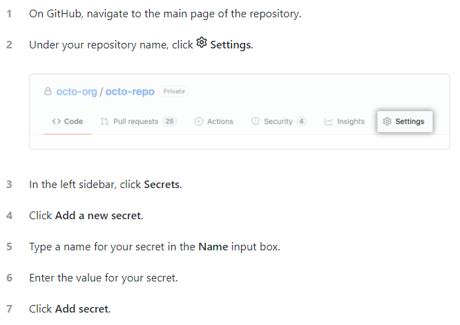

# Build Knight

## USD

> dev

```bash
# PythonScript
set "PATH=C:\DEV_PROJECT\dev-platform\python\windows10-python-3.7.7;C:\DEV_PROJECT\dev-platform\python\windows10-python-3.7.7\Scripts;C:\DEV_PROJECT\dev-platform\python\windows10-python-3.7.7\Lib\site-packages\PySide2;%PATH%"
CALL "D:\Developer\VisualStudio\2019\Community\VC\Auxiliary\Build\vcvars64.bat"
set http_proxy=http://127.0.0.1:10809
set https_proxy=http://127.0.0.1:10809
cd C:\DEV_PROJECT\dev-repository\USD
python .\build_scripts\build_usd.py --materialx --draco --alembic --hdf5 --openimageio --opencolorio --embree --openvdb --ptex --prman --prman-location="C:\DEV_PROJECT\dev-environment\Pixar-x64-windows\RenderManProServer-24.2" --tests C:\DEV_PROJECT\dev-library\usd-dev-win64 --src D:\Developer\USDSrc --jobs 4 --debug --build-args USD,"" -n
```

### OpenShadingLanguage

> master

```bash
# CMake Options
-G "Visual Studio 16 2019"
-DCMAKE_TOOLCHAIN_FILE="C:\DEV_PROJECT\dev-repository\vcpkg\scripts\buildsystems\vcpkg.cmake"
-DLLVM_ROOT=C:\DEV_PROJECT\dev-environment\llvm-11.0.1-win64
-DPython_ROOT=C:\DEV_PROJECT\dev-repository\vcpkg\installed\x64-windows

# install (vcpkg scoop)
vcpkg install openimageio pugixml pybind11
scoop install winflexbison

# patch
> OpenShadingLanguage\src\liboslexec\opcolor_impl.h
> Line 51
#define __attribute__(x)
OSL_CONSTANT_DATA const float cie_colour_match[81*3] __attribute__((__declspec(align(64)))) =
```

# Github

## Git

```bash
# add ssh-key
ssh-keygen -t rsa -C "youremail@example.com"		##(Login in Github setting--> SSH-keys add ssh-key)##
# create new local repositories.
git init
# View status
git status
# Add file
git add <file_name>
# New commit.
git commit -m <-- explain -->
# View different file and branch
git diff <file_name>
git diff <source_branch> <target_branch>
# log and view old log
git log
git log --graph --all
git log --pretty=oneline --abbrev-commitvim 
got reflog
# git remove cache that already add file
git rm --cached <file_name>
# branch
git branch <branch_name>  # new branch
git branck -d/D <branch_name> # del branch

# Git checkout
git checkout <branch_name> # 合并为一个命令 git checkout -b branchName

# git merge
git merge <branch_name> # 基于当前分支，合并另外一个分支，前提需要保证分支之间不冲突
						# 只保留单条分支记录
git merge --no-ff -m "there is a comment" <name> # 因为本次合并要创建一个新的commit，所以加上-m参数
						# 可以保存你之前的分支历史。能够更好的查看 merge历史，以及branch 状态。

# Save and restore
git stash       # 将目前的工作现场保存
git stash list  # 查看所有保存的工作现场
				# 一是用git stash apply stash@{0}恢复，但是恢复后，stash内容并不删除，
				# 你需要用git stash drop stash@{0}来删除；
				# 另一种方式是用git stash pop，恢复的同时把stash内容也删了
# tag 标签也是版本库的一个快照.
git tag <tag_name> #为当前分支指向的commit记录创建标签
git tag <tag_name> <hash_val> #为指定的commitId创建标签
git tag -a <tag_name> -m "msg" <hash_val> #创建标签同时添加说明信息
# 远程推送标签
git push <remote_name> <tag_name> #将标签推送到远程服务器
git push <remote_name> --tags #将本地的全部tag推送到远程服务器
# delete tag
git tag -d <tag_name>

# 替换本地改动
git checkout -- <filename> # 此命令会使用 HEAD 中的最新内容替换掉你的工作目录中的文件
git fetch origin
git reset --hard/soft origin/master # 丢弃你所有的本地改动与提交，可以到服务器上获取最新的版本并将你本地主分支指向到它

# git rebase
git rebase -i HEAD~4  # 合并最近的 4 次提交纪录
git rebase --edit-todo # 异常退出了 vi 窗口
git rebase --continue
git rebase --abort

# Common to remote repositories
git clone htpps://github.com/aaronmack/DxxDxx
git remote -v											##(you should see origin)##
git remote show dv
git remote add dd https://github.com/aaronmack/DevDir	##(dd can be agent all URL)##
git remote rename <old> <new>
git remote remove <name>

# Get dv repositories data.
git fetch dv 
# git commim for the first time
git push -u origin master

# git tree view
gitk --all

# Git Submodule管理项目子模块
当项目越来越庞大之后，不可避免的要拆分成多个子模块，我们希望各个子模块有独立的版本管理，并且由专门的人去维护，这时候我们就要用到git的submodule功能。

常用命令
git clone <repository> --recursive 递归的方式克隆整个项目
git submodule add <repository> <path> 添加子模块
git submodule init 初始化子模块
git submodule update 更新子模块
git submodule foreach git pull 拉取所有子模块

有时候，进行了错误的提交，但是还没有push到远程分支，想要撤销本次提交，可以使用git reset –-soft/hard命令。
1、二者区别：

git reset –-soft：回退到某个版本，只回退了commit的信息，不会恢复到index file一级。如果还要提交，直接commit即可；
git reset -–hard：彻底回退到某个版本，本地的源码也会变为上一个版本的内容，撤销的commit中所包含的更改被冲掉；

# Then update your all file
git pull origin master

#使用git rebase将多次提交合并为一次
git rebase -i HEAD~4 

```

### Problem
1) warning: LF will be replaced by CRLF in readme.txt.
The file will have its original line endings in your working directory

Solve: <1> git config core.autocrlf 					##(if you only use Windows and linux platform,you can set false.)## 
	   <2> git config --global core.autocrlf false

2)Automatic merge failed; fix conflicts and then commit the result.
when a file have more then one person are edited
Solve: <1> Manual merge file

#### Notices
> (1)
  * 如果在分支下新建文件，而尚未执行add操作，stash无法将新文件纳入保存的现场，因为stash只对被修改的被追踪的文件和暂存的变更有效，对于新文件必须先执行add。

> (2)
  * 如果修改分支下的已被追踪的文件，不管有没有对修改的文件进行add操作，如果执行stash，所有修改会被纳入保存的现场，而文件会恢复成修改前的状态。恢复现场后，文件又呈现被修改后的状态。特别的是，如果修改的文件在stash前已经被add了，恢复现场后，暂存区的内容就会清空，相当于这个文件从未被add一样。

> 多人协作的工作模式通常如下

（1）首先将远程仓库克隆为本地仓库
`git clone git@github.com:xxx/LearnGit.git`

（2）在本地创建和远程分支对应的分支
`git checkout -b <本地分支名> origin/<远程分支名>`; **本地和远程分支的名称最好一致**

（3）在本地分支完成任务后，可以试图用git push <远程主机名> <本地分支名>推送自己的修改；

（4）如果推送失败，则表明远程分支比本地更新，需要先用git pull试图合并；

（5）如果pull失败并提示“no tracking information”，则说明本地分支和远程分支的链接关系没有创建，用命令git branch --set-upstream-to=<远程主机名>/<远程分支名>  <本地分支名>创建链接；

（6）如果合并有冲突，则解决冲突，并在本地提交（add => commit）；

（7）没有冲突或者解决掉冲突后，再用git push <远程主机名> <本地分支名>推送就能成功。

## Config SSH
*https://docs.github.com/en/free-pro-team@latest/github/authenticating-to-github/connecting-to-github-with-ssh*

### Generating a new SSH key
ssh-keygen -t ed25519 -C "lilong999000@gmail.com"

### Adding your SSH key to the ssh-agent
ssh-add

### Adding a new SSH key to your GitHub account
1. 
```bash
$ clip < ~/.ssh/id_ed25519.pub
# Copies the contents of the id_ed25519.pub file to your clipboard
```

2. In the upper-right corner of any page, click your profile photo, then click `Settings`.
3. In the user settings sidebar, click `SSH and GPG keys`.
4. Click `New SSH key` or `Add SSH key`.

### Testing your SSH connection
ssh -T git@github.com

## Git Push With SSH
*https://stackoverflow.com/questions/14762034/push-to-github-without-a-password-using-ssh-key*

```bash
# For example, a GitHub project like Git will have an HTTPS URL:

https://github.com/<Username>/<Project>.git
# And the SSH one:

git@github.com:<Username>/<Project>.git
# You can do:

git remote set-url origin git@github.com:<Username>/<Project>.git
# to change the URL.
```

git@github.com:aaronmack/demo-learning-project.git

## Pull Request

* Fork Repository

  * https://github.com/octocat/Spoon-Knife.git

* Clone forked repository to local

  * `git clone https://github.com/aaronmack/Spoon-Knife.git`

* Upstream related to the original warehouse

  * `git remote add upstream https://github.com/octocat/Spoon-Knife`

* commit & push

```bash
nano index.dart

"""
var hello = "Hello World!";
void main() {
  print('Hello, World!');
}
"""

git add .
git commit -m '[added] index.dart {add print hello function}'
git push origin master
```

* Fork local warehouse update

  * `git pull --rebase upstream master`

* After you modify the file, commit + push

  * `git push origin master --force`

## Git Basics

### error: RPC failed; curl 18 transfer closed with outstanding read data remaining

### Git Aliases
*https://git-scm.com/book/en/v2/Git-Basics-Git-Aliases*

Git doesn’t automatically infer your command if you type it in partially. If you don’t want to type the entire text of each of the Git commands, you can easily set up an alias for each command using git config. Here are a couple of examples you may want to set up:

```nash
git config --global alias.che checkout
git config --global alias.bra branch
git config --global alias.com commit
git config --global alias.sta status
```

# Pypi

## Upload to Pypi

```bash
nano .pypirc 
 #~/.pypirc

[distutils]
index-servers =
  pypi
  pypitest

[pypi]
repository: https://upload.pypi.org/legacy/
username: aaronli

[pypitest]
repository: https://test.pypi.org/legacy/
username: aaronli

# upload
twine upload -r pypi dist/packagename-0.0.1.tar.gz

# view
https://pypi.org/project/mp-common-pkg/0.0.1/
```

* for more

https://github.com/aaronmack/MP-common

## Github ci with pypi

Create a .yml file in .github/workflows/[filename].yml

```yml
# This workflows will upload a Python Package using Twine when a release is created
# For more information see: https://help.github.com/en/actions/language-and-framework-guides/using-python-with-github-actions#publishing-to-package-registries

# the name of action
name: Upload Python Package mp-common-pkg

on:
  # When the master branch has a push, the action is triggered
  push: 
   branches:
     - master
  
  # When a PR is incorporated into the Master, an action is triggered
  # pull_request:
  #   branches:
  #     - master
  
  # Triggered when published action
  #release:
  #  types: [created]


jobs:
  deploy:
    name: publish python package to PYPI
    # This job runs on Linux
    runs-on: ubuntu-latest

    steps:
    # This step USES GitHub https://github.com/actions/checkout
    - uses: actions/checkout@v2
    
    # set up the Python environment
    # This step USES GitHub https://github.com/actions/setup-python
    - name: Set up Python
      uses: actions/setup-python@v2
      with:
        python-version: '3.x'
    
    # Install dependencies
    - name: Install dependencies
      run: |
        python -m pip install --upgrade pip
        pip install setuptools wheel twine
    
    # Build and publish
    - name: Build and publish
      env:
        TWINE_USERNAME: ${{ secrets.PYPI_USERNAME }}
        TWINE_PASSWORD: ${{ secrets.PYPI_PASSWORD }}
      run: |
        python setup.py sdist bdist_wheel
        twine upload dist/*
```

Creating encrypted `secrets` for a repository

<div align=center>

</div>

# GUI Testing

## SikuliX1

http://sikulix.com/

### download 

* Jython

https://repo1.maven.org/maven2/org/python/jython-standalone/2.7.1/jython-standalone-2.7.1.jar

* SikuliX

https://raiman.github.io/SikuliX1/

  * if you couldn't open, try this

```bash
# run cmd.exe with administrative
C:\Windows\System32>

# edit hosts file
nano .\drivers\etc\hosts

# add this line
185.199.109.153         raiman.github.io
```

### Run 

```bash
java -jar C:\DEV_PROJECT\dev-environment\dependency\sikulixide-2.0.4.jar -v
```

### Reference

https://testerhome.com/topics/17225

## Dogtail

https://gitlab.com/dogtail/dogtail/

# vcpkg

*https://github.com/microsoft/vcpkg.git*

* Note
  1. You can set system environment variable `VCPKG_DEFAULT_TRIPLET=x64-windows`

* Build

> git clone https://github.com/microsoft/vcpkg
> .\vcpkg\bootstrap-vcpkg.bat


* In order to use vcpkg with Visual Studio, run the following command (may require administrator elevation):

> .\vcpkg\vcpkg integrate install
> .\vcpkg\vcpkg integrate remove

* In order to use vcpkg with CMake outside of an IDE, you can use the toolchain file:

> cmake -B [build directory] -S . -DCMAKE_TOOLCHAIN_FILE=[path to vcpkg]/scripts/buildsystems/vcpkg.cmake
> cmake --build [build directory]

* Install Package

> vcpkg install zlib:x64-windows

## Package Configs

### qt5-base
```cmake
The package qt5-base:x64-windows provides CMake targets:

    find_package(Qt5AccessibilitySupport CONFIG REQUIRED)
    target_link_libraries(main PRIVATE Qt::AccessibilitySupport Qt5::AccessibilitySupport Qt::AccessibilitySupportPrivate Qt5::AccessibilitySupportPrivate)

    find_package(Qt5Concurrent CONFIG REQUIRED)
    target_link_libraries(main PRIVATE Qt::Concurrent Qt5::Concurrent Qt::ConcurrentPrivate Qt5::ConcurrentPrivate)

    find_package(Qt5Core CONFIG REQUIRED)
    # Note: 2 target(s) were omitted.
    target_link_libraries(main PRIVATE Qt::Core Qt5::Core Qt::WinMain Qt5::WinMain)

    find_package(Qt5DBus CONFIG REQUIRED)
    target_link_libraries(main PRIVATE Qt::DBus Qt5::DBus Qt::DBusPrivate Qt5::DBusPrivate)

    find_package(Qt5DeviceDiscoverySupport CONFIG REQUIRED)
    target_link_libraries(main PRIVATE Qt::DeviceDiscoverySupport Qt5::DeviceDiscoverySupport Qt::DeviceDiscoverySupportPrivate Qt5::DeviceDiscoverySupportPrivate)

    find_package(Qt5EdidSupport CONFIG REQUIRED)
    target_link_libraries(main PRIVATE Qt::EdidSupport Qt5::EdidSupport Qt::EdidSupportPrivate Qt5::EdidSupportPrivate)

    find_package(Qt5EventDispatcherSupport CONFIG REQUIRED)
    target_link_libraries(main PRIVATE Qt::EventDispatcherSupport Qt5::EventDispatcherSupport Qt::EventDispatcherSupportPrivate Qt5::EventDispatcherSupportPrivate)

    find_package(Qt5FbSupport CONFIG REQUIRED)
    target_link_libraries(main PRIVATE Qt::FbSupport Qt5::FbSupport Qt::FbSupportPrivate Qt5::FbSupportPrivate)

    find_package(Qt5FontDatabaseSupport CONFIG REQUIRED)
    target_link_libraries(main PRIVATE Qt::FontDatabaseSupport Qt5::FontDatabaseSupport Qt::FontDatabaseSupportPrivate Qt5::FontDatabaseSupportPrivate)

    find_package(Qt5Gui CONFIG REQUIRED)
    # Note: 9 target(s) were omitted.
    target_link_libraries(main PRIVATE Qt::Gui Qt5::Gui Qt::GuiPrivate Qt5::GuiPrivate)

    find_package(Qt5Network CONFIG REQUIRED)
    # Note: 1 target(s) were omitted.
    target_link_libraries(main PRIVATE Qt::Network Qt5::Network Qt::NetworkPrivate Qt5::NetworkPrivate)

    find_package(Qt5OpenGL CONFIG REQUIRED)
    target_link_libraries(main PRIVATE Qt::OpenGL Qt5::OpenGL Qt::OpenGLPrivate Qt5::OpenGLPrivate)

    find_package(Qt5OpenGLExtensions CONFIG REQUIRED)
    target_link_libraries(main PRIVATE Qt::OpenGLExtensions Qt5::OpenGLExtensions Qt::OpenGLExtensionsPrivate Qt5::OpenGLExtensionsPrivate)

    find_package(Qt5PlatformCompositorSupport CONFIG REQUIRED)
    target_link_libraries(main PRIVATE Qt::PlatformCompositorSupport Qt5::PlatformCompositorSupport Qt::PlatformCompositorSupportPrivate Qt5::PlatformCompositorSupportPrivate)

    find_package(Qt5PrintSupport CONFIG REQUIRED)
    # Note: 1 target(s) were omitted.
    target_link_libraries(main PRIVATE Qt::PrintSupport Qt5::PrintSupport Qt::PrintSupportPrivate Qt5::PrintSupportPrivate)
    find_package(Qt5Sql CONFIG REQUIRED)
    # Note: 3 target(s) were omitted.
    target_link_libraries(main PRIVATE Qt::Sql Qt5::Sql Qt::SqlPrivate Qt5::SqlPrivate)

    find_package(Qt5Test CONFIG REQUIRED)
    target_link_libraries(main PRIVATE Qt::Test Qt5::Test Qt::TestPrivate Qt5::TestPrivate)

    find_package(Qt5ThemeSupport CONFIG REQUIRED)
    target_link_libraries(main PRIVATE Qt::ThemeSupport Qt5::ThemeSupport Qt::ThemeSupportPrivate Qt5::ThemeSupportPrivate)
    find_package(Qt5VulkanSupport CONFIG REQUIRED)
    target_link_libraries(main PRIVATE Qt::VulkanSupport Qt5::VulkanSupport Qt::VulkanSupportPrivate Qt5::VulkanSupportPrivate)

    find_package(Qt5Widgets CONFIG REQUIRED)
    # Note: 1 target(s) were omitted.
    target_link_libraries(main PRIVATE Qt::Widgets Qt5::Widgets Qt::WidgetsPrivate Qt5::WidgetsPrivate)

    find_package(Qt5WindowsUIAutomationSupport CONFIG REQUIRED)
    target_link_libraries(main PRIVATE Qt::WindowsUIAutomationSupport Qt5::WindowsUIAutomationSupport Qt::WindowsUIAutomationSupportPrivate Qt5::WindowsUIAutomationSupportPrivate)

    find_package(Qt5Xml CONFIG REQUIRED)
    target_link_libraries(main PRIVATE Qt::Xml Qt5::Xml Qt::XmlPrivate Qt5::XmlPrivate)
```

### qt5-tools
```cmake
The package qt5-tools:x64-windows provides CMake targets:

    find_package(Qt5Designer CONFIG REQUIRED)
    # Note: 2 target(s) were omitted.
    target_link_libraries(main PRIVATE Qt::Designer Qt5::Designer Qt::DesignerPrivate Qt5::DesignerPrivate)

    find_package(Qt5DesignerComponents CONFIG REQUIRED)
    target_link_libraries(main PRIVATE Qt::DesignerComponents Qt5::DesignerComponents Qt::DesignerComponentsPrivate Qt5::DesignerComponentsPrivate)

    find_package(Qt5Help CONFIG REQUIRED)
    target_link_libraries(main PRIVATE Qt::Help Qt5::Help Qt::HelpPrivate Qt5::HelpPrivate)

    find_package(Qt5UiPlugin CONFIG REQUIRED)
    target_link_libraries(main PRIVATE Qt::UiPlugin Qt5::UiPlugin Qt::UiPluginPrivate Qt5::UiPluginPrivate)

    find_package(Qt5UiTools CONFIG REQUIRED)
    target_link_libraries(main PRIVATE Qt::UiTools Qt5::UiTools Qt::UiToolsPrivate Qt5::UiToolsPrivate)

```

# VIM

## Install VIM vim scoop command 
`scoop install vim`

## Mode
### Normal Mode
By default, Vim starts in “normal” mode. Normal mode can be accessed from other modes by pressing Esc or [Ctrl+C] <C-[>.

### Insert Mode
`i` for 'insert', this immediately switches vim to insert mode

### Visual Mode
Visual mode is used to make selections of text, similar to how clicking and dragging with a mouse behaves. Selecting text allows commands to apply only to the selection, such as copying, deleting, replacing, and so on

Press `v` to enter visual mode, this will also mark a starting selection point

### Command Mode
Command mode has a wide variety of commands and can do things that normal mode can’t do as easily. 

`:` Enters command mode

### Replace Mode
Replace mode allows you replace existing text by directly typing over it. Before entering this mode, get into normal mode and put your cursor on top of the first character that you want to replace. Then press `R` (capital R) to enter replace mode.

## Screen Positioning
*https://medium.com/usevim/vim-101-quick-movement-c12889e759e0*

In command mode, I often find myself scrolling the screen by half increments using `ctrl u` and `ctrl d`. The equivalent full screen commands are `ctrl f` and `ctrl b`. Page up and page down may also work depending on your configuration.

## Misc
* Display line-number
  * Insert Mode -> `set nu`
* Undo Redo
  * Normal mode -> undo `u` redo `Ctrl+r`
## Copy, cut and paste
*https://vim.fandom.com/wiki/Copy,_cut_and_paste*

* Cut and paste:
  1. Position the cursor where you want to begin cutting.
  2. Press `v` to select characters, or uppercase `V` to select whole lines, or `Ctrl-v` to select rectangular blocks (use `Ctrl-q`   if `Ctrl-v` is mapped to paste).
  3. Move the cursor to the end of what you want to cut.
  4. Press `d` to cut (or y to copy).
  5. Move to where you would like to paste.
  6. Press `P` to paste before the cursor, or `p` to paste after.
* Copy and paste is performed with the same steps except for step 4 where you would press `y` instead of `d`:
  * `d` stands for delete in Vim, which in other editors is usually called cut
  * `y` stands for yank in Vim, which in other editors is usually called copy

* CUT, COPY AND PASTE TO AND FROM THE SYSTEM CLIPBOARD

*https://francopasut-en.blogspot.com/2019/08/vim-cut-copy-and-paste-to-and-from.html*

  1. `ESC` enter Command Mode
  2. `set paste`
  3. `i` enter InsetMode [?]
  3. `Shift+Insert`

`Shift+Delete`	Cut text and copy it in the clipboard
`Ctrl+Insert`	Copy text in the clipboard
`Shift+Insert`	Paste text from the clipboard into a document

# Misc

## youtube-dl
### Resource
* *https://www.luyouli.com/?p=211*


```bash
# install 
scoop install youtube-dl

# download youtube video with zh sub
youtube-dl --write-auto-sub --sub-lang zh-Hans [url] --embed-subs
```


## you-get
```bash
# install
pip3 install you-get --user

# download Bilibili video
## list
you-get [url] --playlist 
```

## ffmpeg
### Resource
* 字幕合并 *https://www.jianshu.com/p/ba8670f09df0*

```bash
ffmpeg
```

## Mono [deprecated]

### Ubuntu
* *https://linuxize.com/post/how-to-install-mono-on-ubuntu-20-04/*

#### Install
```bash
sudo apt update
# Install the dependencies necessary to add a new repository over HTTPS
sudo apt install dirmngr gnupg apt-transport-https ca-certificates software-properties-common
# Import the repository’s GPG key:
sudo apt-key adv --keyserver hkp://keyserver.ubuntu.com:80 --recv-keys 3FA7E0328081BFF6A14DA29AA6A19B38D3D831EF
# Add the Mono repository to your system sources' list:
sudo apt-add-repository 'deb https://download.mono-project.com/repo/ubuntu stable-focal main'
# Install Mono:
sudo apt install mono-complete 
# print the Mono version:
mono --version
```

```c# hello.cs
using System;

public class HelloWorld
{
    public static void Main(string[] args)
    {
        Console.WriteLine ("Hello World!");
    }
}

# csc hello.cs
# mono hello.exe
# chmod +x hello.exe
# ./hello.exe
```

## .Net 5

### Windows
`scoop install dotnet-sdk`

### Ubuntu

#### Install
* *https://docs.microsoft.com/en-us/dotnet/core/install/linux-ubuntu#2004-*

```bash
wget https://packages.microsoft.com/config/ubuntu/20.04/packages-microsoft-prod.deb -O packages-microsoft-prod.deb
sudo dpkg -i packages-microsoft-prod.deb
sudo apt-get update; \
  sudo apt-get install -y apt-transport-https && \
  sudo apt-get update && \
  sudo apt-get install -y dotnet-sdk-5.0

```

#### Getting Started
* *https://dotnet.microsoft.com/learn/dotnet/hello-world-tutorial/intro*

* Create your app

```bash
dotnet new console -o myApp
cd myApp
```

* Run your app

```bash
dotnet run
```

# Cygwin

## Upgrade
* *https://superuser.com/questions/214831/how-to-update-cygwin-from-cygwins-command-line*

```bash
cd C:\cygwin
wget -N https://cygwin.com/setup-x86_64.exe
setup-x86_64.exe --no-desktop --no-shortcuts --no-startmenu --quiet-mode
```

# vscode

## ssh remote
* *https://code.visualstudio.com/docs/remote/troubleshooting*
* *https://www.cnblogs.com/liyufeia/p/11405779.html*

1. ssh-keygen -t rsa -b 4096
2. nano /etc/ssh/sshd_config
  1. remove comment # for `PubkeyAuthentication yes and AuthorizedKeysFile .sshxxxxxx`
3. copy `local id_rsa.pub` to `host .ssh dir` 
4. cat id_rsa.pub >> authorized_keys
5. systemctl restart sshd

```vscode config
Host 0.0.0.0
  HostName 0.0.0.0
  User root
  Port 20000
  IdentityFile ~/.ssh/id_rsa
```

## problems

> Solution for the Broken Task Bar Icon 
 
* [1] Missing Task Bar Icon https://github.com/microsoft/vscode/issues/34106

* 任务栏图标消失问题

1. Open any file with Visual Studio Code.
2. Look at the Task Bar, locate Visual Studio Code and then Right Click on it.
3. Select "Visual Studio Code", located above the "Pin to Task Bar" item.
4. When a window with "Problem With Shortcut" in the name appears select "Yes".
5. Close Visual Studio Code, then open it again.

> Solution for (2) 

* [1] win10任务栏图标后面出现(2) https://zhidao.baidu.com/question/755343331306134124.html

`C:\Users\Aaron\AppData\Roaming\Microsoft\Internet Explorer\Quick Launch\User Pinned\TaskBar`

# v2ray

## Resource
1. 组织网站： https://www.v2fly.org/guide/install.html
2. 一键配置脚本网站：https://github.com/mack-a/v2ray-agent
3. 安装脚本：https://github.com/v2fly/fhs-install-v2ray
4. 仓库地址：https://github.com/v2fly/v2ray-core
5. 第三方图形客户端：
   1. Android：https://github.com/2dust/v2rayNG
   2. Windows：https://github.com/2dust/v2rayN


## Error

1. v2ray.service: main process exited, code=exited, status=23/n/a

* https://github.com/v2ray/v2ray-core/issues/2720

/etc/systemd/system/v2ray.service文件中的User=noboby改为User=root


# Google Chrome

* [1] Checking out and Building Chromium for Windows *https://chromium.googlesource.com/chromium/src/+/refs/heads/main/docs/windows_build_instructions.md*
* [2] Google Open Source *https://opensource.google/*

# Msys2
* [1] MSYS2 https://www.msys2.org/

* What
  * Software Distribution and Building Platform for Windows

## Configuraton
```bash
# Update the package database and base packages. Unless your setup file is very recent
pacman -Syu
# mingw-w64 GCC to start compiling
pacman -S --needed base-devel mingw-w64-x86_64-toolchain # gcc ?
```

## ERROR
* [1] pacman could not find database https://unix.stackexchange.com/questions/34606/pacman-could-not-find-database

# Useful Tools

## Goldendict
* [1] https://www.zhihu.com/question/29945306
* [2] https://github.com/xinebf/google-translate-for-goldendict

```bash
scoop install goldendict
```

# docsify

## Plugins
* [1] docsify-pdf-embed-plugin https://www.npmjs.com/package/docsify-pdf-embed-plugin


# GitBook

## Config Gitbook in my computer

* Download nodejs:
  * https://nodejs.org/en/

* Install Gitbook: 
  * `npm install gitbook-cli -g`

* Create Your folder and Enter: 
  * `mkdir mybook`
  * `cd mybook` 
  * Note：
    1. **The next few commands maybe you should call**
      * `node "\your\gitbook.js\installed\directory" somecommand`
    2. Such as me:
      * `node "C:\Users\me\AppData\Roaming\npm\node_modules\gitbook-cli\bin\gitbook.js" serve`				

* Initialize The directory file:
  * `gitbook init `
* Build Your Gitbook
  * `gitbook build`
* Start gitbook server
  * `gitbook serve`
* Note:
  1. The Default gitbook installed directory is :
    * `C:\Users\UserName\AppData\Roaming\npm\node_modules\gitbook-cli\bin`


# Autohotkey

> Install

1. `Run cmd with Administration`
2. Choco install autohotkey

> Create & Run

1. `RightClick` -> New -> AutoHotkey Script
2. "BaiduNetdiskWorkspace\Resources\HotKey\MyLifeScript.ahk"

> Reference

1. Send, SendRaw, SendInput, SendPlay, SendEvent https://www.autohotkey.com/docs/commands/Send.htm

