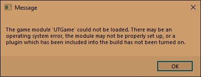
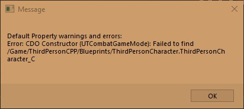
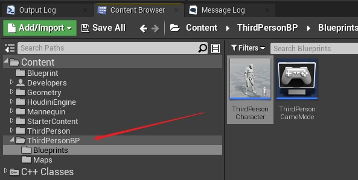
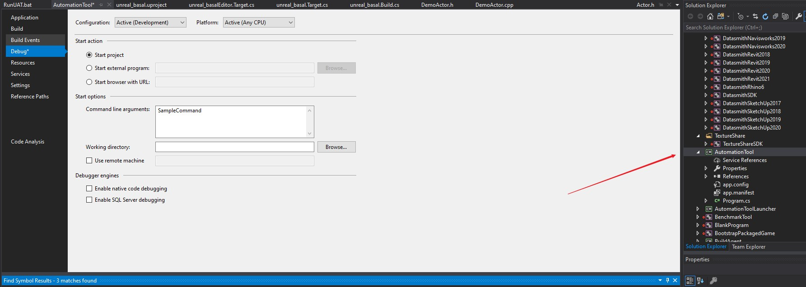

# Unreal

## Confuse

> Different with Runtime Editor e.t

* [1] [Plugin] Type Editor vs Type Runtime vs Type Development and Best practices? https://forums.unrealengine.com/t/plugin-type-editor-vs-type-runtime-vs-type-development-and-best-practices/40845


* Sets the type of module. Valid options are Runtime, RuntimeNoCommandlet, Developer, Editor, EditorNoCommandlet, and Program. **This type determines which types of applications this plugin’s module is suitable for loading in**. For example, some plugins may include modules that are only designed to be loaded when the editor is running. **Runtime modules will be loaded in all cases, even in shipped games**. Developer modules will only be loaded in development runtime or editor builds, but never in shipping builds. Editor modules will only be loaded when the editor is starting up. Your plugin can use a combination of modules of different types.[1]

## Concepts and Terms

### BuildConfiguration

* C:\Users\Aaron\AppData\Roaming\Unreal Engine\UnrealBuildTool
* *https://docs.unrealengine.com/4.26/en-US/ProductionPipelines/BuildTools/UnrealBuildTool/BuildConfiguration/*

```xml
<?xml version="1.0" encoding="utf-8" ?>
<Configuration xmlns="https://www.unrealengine.com/BuildConfiguration">
	<ParallelExecutor>
		<ProcessorCountMultiplier>1.0</ProcessorCountMultiplier>
		<MaxProcessorCount>1</MaxProcessorCount>
		<bStopCompilationAfterErrors>true</bStopCompilationAfterErrors>
	</ParallelExecutor>
</Configuration>

```

### Programming

#### TEXT - macro
* [1] String Handling https://docs.unrealengine.com/4.26/en-US/ProgrammingAndScripting/ProgrammingWithCPP/UnrealArchitecture/StringHandling/
* [2] Character Encoding https://docs.unrealengine.com/4.26/en-US/ProgrammingAndScripting/ProgrammingWithCPP/UnrealArchitecture/StringHandling/CharacterEncoding/
* [3] ANSI和ASCII - 2021 - WEB应用程序 https://cn.weblogographic.com/difference-between-ansi-and-ascii-8156
* [4] utf-8,utf-16,Unicode的区别 https://www.jianshu.com/p/eb68e3298b0b

In general, you should be using the TEXT() macro when setting string variable literals. If you do not specify the TEXT() macro, your literal will be encoded using ANSI, which is highly limited in what characters it supports. Any ANSI literals being passed into FString need to undergo a conversion to TCHAR (native Unicode encoding), so it is more efficient to use TEXT().[1]

* ANSI vs ASCII[3]
  * ANSI具有比ASCII更多的字符
  * ASCII使用7位而ANSI使用8位
  * ASCII字符固定到代码点，而ANSI代码点可以表示不同的字符
  * ASCII比ANSI更简单易用
  * ASCII与Uni​​code一起使用，而ANSI兼容性非常有限

* Unicode and UTF-8 vs UTF-16[4]
  * 美国 0~127 一个字节 ASCII
  * 欧洲 一个字节 ISO
  * 中国 两个字节 GBK 兼容 ASCII
  * 国际组织 三个字节 unicode
  * utf-8/16/32 变长编码(1~6字节)/2个字节/4个字节

<div align=center>

</div>

#### Include

##### Core

###### HAL
* [1] What Does “HAL” represent in UE4 include File Path https://forums.unrealengine.com/t/what-does-hal-represent-in-ue4-include-file-path/130180

Hardware Abstraction Layer.

Generally wrappers around platform specific code (graphics APIs, etc).

###### Algo
算法类

###### Compression
* [1] Extremely Fast Compression algorithm https://github.com/lz4/lz4

lz4

###### Delegates
* [1] Delegates https://docs.unrealengine.com/4.26/en-US/ProgrammingAndScripting/ProgrammingWithCPP/UnrealArchitecture/Delegates/

Delegates can call member functions on C++ objects in a generic, type-safe way.

###### FramePro
* [1] FramePro https://www.puredevsoftware.com/framepro/FrameProUserGuide/UE4.htm
* [2] UE4性能剖析软件--FramePro的使用 https://blog.csdn.net/qq_21952321/article/details/108247971

修改FramePro.h中的宏，开启framePro

`#define FRAME_ENABLE 1`

###### Lumin
* [1] Lumin OS Overview https://developer.magicleap.com/en-us/learn/guides/lumin-os-overview

Lumin OS is a custom operating system derived from open source components such as Linux and the Android Open Source Project (AOSP).

###### MemPro
* [1] C++ Memory Profiler https://www.puredevsoftware.com/mempro/index.htm

###### Stats
统计

## Errors

1. 模块或者插件添加其他的插件或者模块时，编译报**未定义的外部符号**
  * 使用windows dll导出符合 `#define DllExport   __declspec( dllexport )`

2. **Failed to Find**
<div align=center>

</div>

* 当模块使用了第三方插件库时就会报此错误

3. **修改名称**
<div align=center>

</div>

ProjectName 为 `UTCombat`

修改 `Source\UTCombat\Private\UTCombatGameMode.cpp`

* `	static ConstructorHelpers::FClassFinder<APawn> PlayerPawnBPClass(TEXT("/Game/ThirdPersonCPP/Blueprints/ThirdPersonCharacter"));` -> `	static ConstructorHelpers::FClassFinder<APawn> PlayerPawnBPClass(TEXT("/Game/ThirdPersonBP/Blueprints/ThirdPersonCharacter"));`

注意 配置文件

* `DefaultEngine.ini`

```ini
[/Script/EngineSettings.GameMapsSettings]
GlobalDefaultGameMode=/Game/ThirdPersonBP/Blueprints/ThirdPersonGameMode.ThirdPersonGameMode_C

[/Script/Engine.Engine]
+ActiveGameNameRedirects=(OldGameName="TP_ThirdPerson",NewGameName="/Script/UTCombat")
+ActiveGameNameRedirects=(OldGameName="/Script/TP_ThirdPerson",NewGameName="/Script/UTCombat")
+ActiveClassRedirects=(OldClassName="TP_ThirdPersonGameMode",NewClassName="UTCombatGameMode")
+ActiveClassRedirects=(OldClassName="TP_ThirdPersonCharacter",NewClassName="UTCombatCharacter")
```

* `DefaultEditorPerProjectUserSettings.ini`

```ini
[ContentBrowser]
ContentBrowserTab1.SelectedPaths=/Game/ThirdPersonBP
#ContentBrowserTab1.SelectedPaths=/Game/ThirdPersonCPP
```

<div align=center>

</div>

4. Build from source get `Your project does not reference` error

* [1] Your project does not reference ".NETFramework,Version=v4.6.2" framework. Add a reference to ".NETFramework,Version=v4.6.2" in the "TargetFrameworks" https://stackoverflow.com/questions/52833741/your-project-does-not-reference-netframework-version-v4-6-2-framework-add-a/56029469

* `git clean -xdf`  清除所有临时文件，依赖缓存不会被清除掉

## Modules

### Niagara Visual Effects
*https://docs.unrealengine.com/en-US/RenderingAndGraphics/Niagara/index.html*


### Lumen
* [1] https://docs.unrealengine.com/5.0/en-US/RenderingFeatures/Lumen

#### Key Words

* Software raytracing 
* control by material value, expose of camera, lighting parameters
* screen depth buffer
* signed distance fields, surface cache when get a line on SDF
* hybrid trace: screen trace, mesh distance field trace, global distance field trace
* mesh distance field: sparse representation, mipmaps
* double default voxel density + 4x max resolution pre mesh
* optimization: detail tracing first 2 meters, can skip MDFt with Global Tracing
* more expensive on skeletal meshes or skinned meshes (about deformation, depend bvh if static mesh need only build once)
* for overlapping meshes the hard-ray-tracing it can become slower then soft ray-tracing
* Spatial and temporal denoiser
* Emissive: 2 use cases work well - 1. large dim emissive 2.light source+small dim emissive


#### Open Settings
* For software ray tracing

1. Project Settings -> Rendering -> GLOBAL ILLUMINATION -> Dynamic Global Illumination Method [Lumen]
2. Project Settings -> Rendering -> REFLECTIONS -> Reflection Method [Lumen]
3. Project Settings -> Rendering -> SOFTWARE RAY TRACING -> Generate Mesh Distance Fields [√]


* For hardware ray tracing
1. Project Settings -> Rendering -> LUMEN -> Use Hardware Ray Tracing when available [√]
2. Project Settings -> Rendering -> HARDWARE RAY TRACING -> Support Hardware Ray Tracing [√]

* Post Process Volume
  
1. Details -> GLOBAL ILLUMINATION -> Method [Lumen]
2. Details -> REFLECTIONS -> Method [Lumen]
3. [Optional] Details -> GLOBAL ILLUMINATION -> Lumen Global Illumination -> Final Gather Quality [√]
4. [Optional] Details -> REFLECTIONS -> Lumen Reflections -> Quality [√]

### Nanite
* [1] Nanite Virtualized Geometry https://docs.unrealengine.com/5.0/en-US/RenderingFeatures/Nanite/

## Plug-ins

### LuaMachine
*https://github.com/rdeioris/LuaMachine/*


## Tools

### UnrealHeaderTool

*UnrealHeaderTool (UHT) is a custom parsing and code-generation tool supporting the UObject system.*

* UnrealHeaderTool (UHT) is a custom parsing and code-generation tool that supports the UObject system. Code compilation happens in two phases:

  1. UHT is invoked, which parses the C++ headers for Unreal-related class metadata and generates custom code to implement the various UObject-related features.

  2. The normal C++ compiler is invoked to compile the results.

### UnrealBuildTool
*https://docs.unrealengine.com/en-US/ProductionPipelines/BuildTools/UnrealBuildTool/index.html*

*UnrealBuildTool (UBT) manages the process of building UE4 source code across a variety of build configurations.*

* UnrealBuildTool (UBT) is a custom tool that manages the process of building Unreal Engine 4 (UE4) source code across a variety of build configurations. Read  BuildConfiguration.cs to explore various user-configurable build options.

#### Modular Architecture

UE4 is split into many modules. Each module has a .build.cs file that controls how it is built, including options for defining module dependencies, additional libraries, include paths, etc. By default, these modules are compiled into DLLs and loaded by a single executable. You can choose to build a monolithic executable in the BuildConfiguration.cs file.

* BuildConfiguration.cs: `"\Engine\Source\Programs\UnrealBuildTool\Configuration\BuildConfiguration.cs"`

#### Topics

##### Targets
*https://docs.unrealengine.com/en-US/ProductionPipelines/BuildTools/UnrealBuildTool/TargetFiles/index.html*

* UnrealBuildTool supports building several target types:

  * Game - A standalone game which requires cooked data to run.
  * Client - Same as Game, but does not include any server code. Useful for networked games.
  * Server - Same as Game, but does not include any client code. Useful for dedicated servers in networked games.
  * Editor - A target which extends the Unreal Editor.
  * Program - A standalone utility program built on top of the Unreal Engine.

Targets are declared through C# source files with a `.target.cs` extension, and are stored under your project's Source directory. Each .target.cs file declares a class deriving from the `TargetRules` base class, and sets properties controlling how it should be built from its constructor. When asked to build a target, UnrealBuildTool will compile your target.cs file and construct the class inside it to determine its settings.

The name of the class must match the name of the file it's declared in followed by 'Target' (so for example, `MyProject.target.cs` defines the class `MyProjectTarget`).

The typical structure for a target file is as follows:

```c#
using UnrealBuildTool;
using System.Collections.Generic;
public class MyProjectTarget : TargetRules
{
    public MyProjectTarget(TargetInfo Target) : base(Target)
    {
        Type = TargetType.Game;
        // Other properties go here
    }
}
```

##### Modules
*https://docs.unrealengine.com/en-US/ProductionPipelines/BuildTools/UnrealBuildTool/ModuleFiles/index.html*

Modules are the building blocks of UE4. The engine is implemented as a large collection of modules, and games supply their own modules to augment them. Each module encapsulates a set of functionality, and can provide a public interface and compile environment (with macros, include paths, and so on) for use by other modules.

Modules are declared through C# source files with a .build.cs extension, and are stored under your project's Source directory. The C++ source code belonging to a module is stored next to to the .build.cs file, or in subdirectories of it. Each .build.cs file declares a class deriving from the ModuleRules base class, and sets properties controlling how it should be built from its constructor. These .build.cs files are compiled by UnrealBuildTool and constructed to determine the overall compile environment.

The typical structure for a .build.cs file is as follows.

```c#
using UnrealBuildTool;
using System.Collections.Generic;
public class MyModule : ModuleRules
{
    public MyModule(ReadOnlyTargetRules Target) : base(Target)
    {
        // Settings go here
    }
}
```

##### Build Configuration
*https://docs.unrealengine.com/en-US/ProductionPipelines/BuildTools/UnrealBuildTool/BuildConfiguration/index.html*

In addition to being added to the generated UE4 project under the Config/UnrealBuildTool folder, UnrealBuildTool reads settings from XML config files in the following locations on Windows:

  * Engine/Saved/UnrealBuildTool/BuildConfiguration.xml
  * User Folder/AppData/Roaming/Unreal Engine/UnrealBuildTool/BuildConfiguration.xml
  * My Documents/Unreal Engine/UnrealBuildTool/BuildConfiguration.xml

On Linux and Mac, the following paths are used instead:

  * /Users//.config//Unreal Engine/UnrealBuildTool/BuildConfiguration.xml
  * /Users//Unreal Engine/UnrealBuildTool/BuildConfiguration.xml

##### IWYU
*https://docs.unrealengine.com/en-US/ProductionPipelines/BuildTools/UnrealBuildTool/IWYU/index.html*

A brief overview of the updated code base for UE4, now using an Include-What-You-Use (IWYU) dependency model.

Include-What-You-Use (IWYU), as the name implies, means that the Engine's source code only includes the dependencies that it needs to compile. The purpose of IWYU is to avoid including monolithic header files, such as Engine.h or UnrealEd.h, thereby mitigating superfluous dependencies. The following reference guide tells you what it means to IWYU, including a high-level explanation of how to enable IWYU, ensuring that your project adheres to IWYU conventions. Additionally, if you opt into using IWYU mode for your game project(s), you will learn some general tips that will help you get the most out of working in IWYU mode.

* `NOTE`: IWYU mode is disabled by default for games and game plugins; however, IWYU mode is enabled by default for the Engine and Engine plugins.

###### What it Means to IWYU
*https://docs.unrealengine.com/en-US/ProductionPipelines/BuildTools/UnrealBuildTool/IWYU/index.html*

In previous versions of Unreal Engine 4 (UE4), the majority of engine functionality was included via large, module-centric header files, such as Engine.h and UnrealEd.h and fast compile times were dependent on those files being compiled quickly through Precompiled Header (PCH) files. As the engine grew, this became a bottleneck.

With IWYU, every file includes only what it needs, and any PCH file we choose to use, purely acts as a layer of optimization on top of the underlying source files. They can be modified to minimize build times, independently of changing the source files themselves, and without affecting whether the code compiles successfully or not.

When writing IWYU code, there are four specific conventions that we adopt:

  * All header files include their required dependencies.
  * .cpp files include their matching *.h files first.
  * PCH files are no longer explicitly included.
  * Monolithic header files are no longer included.

### AutomationTool
*https://docs.unrealengine.com/en-US/ProductionPipelines/BuildTools/AutomationTool/index.html*

AutomationTool is a generic system used to automate processes, including testing and building games.

*https://blog.squareys.de/ue4-automation-tool/*

Un­re­al En­gine Au­to­ma­tion Tool is your as­sis­tant for run­ning tests and con­trol­ling all au­to­ma­tion, e.g. on con­tin­u­ous in­te­gra­tion, au­to­mat­ed builds or just for your lo­cal test­ing.

#### AutomationTool Overview
*https://docs.unrealengine.com/en-US/ProductionPipelines/BuildTools/AutomationTool/Overview/index.html*

A host program and a set of utility libraries that enable you to script unattended processes related to Unreal Engine.

AutomationTool is a host program and a set of utility libraries you can use to script unattended processes related to Unreal Engine when using C#. Internally, we use AutomationTool for a variety of tasks, including building, cooking, and running games, running automation tests, and scripting other operations to be executed on our build farm.

The source code for AutomationTool, and various scripts that run under it, can be found under Engine/Source/Programs/AutomationTool.

* `WARNING`: While we provide this tool as a courtesy, the level of support we can provide is limited.

##### How AutomationTool Works

###### Automation Projects
When run, AutomationTool finds all automation projects (saved as Visual Studio C# projects with an .Automation.csproj extension), compiles them, and then uses reflection to find the appropriate command to be executed. Those commands are implemented as classes derived from the BuildCommand base class, and are identified by the class name.

* `NOTE`: To learn more, read how to add an [automation project](https://docs.unrealengine.com/en-US/ProductionPipelines/BuildTools/AutomationTool/HowTo/AddingAutomationProjects/index.html) and how to [add a command](https://docs.unrealengine.com/en-US/ProductionPipelines/BuildTools/AutomationTool/HowTo/AddingCommands/index.html).

###### Running AutomationTool
You can run commands under the Visual Studio debugger on Windows, or from the command line on Windows, Mac, and Linux.

###### Running Commands under the Debugger
To run AutomationTool under the Debugger in Visual Studio:

1. Right click the AutomationTool Project, and select Properties from the context menu.

2. Select the Debug tab, and enter your command name (here, we use SampleCommand) into the Start Options > Command line arguments: field.

<div align=center>

</div>

3. Set a breakpoint in your script before pressing the F5 key (or clicking the Start button in the Visual Studio toolbar).

###### Running Commands from the command line (Windows)
To run AutomationTool from the command line:

Open a Command Prompt window.

Change the working directory to Engine/Build/BatchFiles.

Enter the following into the command line: RunUAT.bat SampleCommand

#### Adding Automation Projects
*https://docs.unrealengine.com/en-US/ProductionPipelines/BuildTools/AutomationTool/HowTo/AddingAutomationProjects/index.html*

How to add an automation project for AutomationTool.

You can implement project-specific automation scripts that will be compiled and loaded by `AutomationTool` by creating a new C# project in a location that AutomationTool can find it.

This requires using a source build of the engine (from GitHub or Perforce, rather than from the Epic Games launcher), and for the project to be in a location discoverable from a subdirectory listed in the UE4Games.uprojectdirs file. This file is located in the UE4 root directory.

##### Steps
...

#### Adding Commands
*https://docs.unrealengine.com/en-US/ProductionPipelines/BuildTools/AutomationTool/HowTo/AddingCommands/index.html*

How to add a command to an automation project for AutomationTool.

...

#### BuildGraph
*https://docs.unrealengine.com/en-US/ProductionPipelines/BuildTools/AutomationTool/BuildGraph/index.html*

Customize your builds with the BuildGraph scripting system.

BuildGraph is a script-based build automation system that features graphs of building blocks common to Unreal Engine 4 (UE4) projects. BuildGraph integrates with UnrealBuildTool, AutomationTool, and the editor, and can be extended and customized for your projects.

BuildGraph scripts are written in XML, specifying a graph of user-defined nodes with dependencies between them. Each node consists of tasks executed in sequence to produce some sort of output (for example, compile this project, then cook, run this test, and so on). When asked to build a target (that is, a node or named output) BuildGraph will execute all of the nodes in the graph required to make that happen.

Unlike other build tools, BuildGraph is designed as a hybrid between a makefile-like scripting language and a build farm configuration script. It enables annotations for the type of machine that steps are supposed to be executed on, providing a list of recipients for failure notifications if a step fails, and groups nodes that should only be executed after an explicit user trigger. It also tracks the creation of output files from task execution in a way that lends to graph execution being distributed across a farm of machines (with nodes running in parallel where possible), and intermediate artifacts being transferred to and from a network share automatically.

Epic uses BuildGraph to prepare the UE4 binary release, package samples for the marketplace, and implement pipelines for our own games (among other things). Several example BuildGraph scripts are provided in the `[UE4Root]/Engine/Build/Graph/Examples `directory, and the script for creating a binary UE4 distribution can be found at `[UE4Root]/Engine/Build/InstalledEngineBuild.xml.`

Opening a script with Visual Studio will use the schema located at [UE4Root]Engine/Build/Graph/Schema.xsd to provide rich tooltips, validation, and Intellisense features while editing.

## Programming and Scripting
*https://docs.unrealengine.com/en-US/ProgrammingAndScripting/index.html*

How to use the programming and scripting languages and tools for controlling Unreal engine programmatically at runtime.

### Source code analysis

#### SEH
 
* [1] Structured Exception Handling (C/C++) | Microsoft Docs https://docs.microsoft.com/en-us/cpp/cpp/structured-exception-handling-c-cpp?view=msvc-160

### Youtube watching

#### Python in Unreal Engine | Inside Unreal
*https://www.youtube.com/watch?v=0guOMTiwmhk*

1. `Shift+Enter` new line
2. notices

* must be `static`
* for a reflection-generated code, a const referecne is treated as an input, A non const reference by default is treated as an output, so if you have a parameter that you want to be an input and an output reference, you have to mark it as UPARAM ref

```c++
UFUNCTION(BlueprintPure, Category="PythonDemo", meta=(ScriptMethod="IsLocked"))
static bool IsStructLocked(const FDemoStruct& InStruct);

UFUNCTION(BlueprintCallable, Category = "PythonDemo", meta = (ScriptMethod = "Lock"))
static bool LockStruct(UPARAM(ref) FDemoStruct& InStruct);
```

* Use 
```python
a = unreal.DemoStruct()
b = unreal.DemoBlueprintFunctionLibrary()

c = b.lock_struct(a)  # <Struct 'DemoStruct' (0x000001CF2246AF70) {lock_count: 1}>
d = b.lock_struct(c)  # <Struct 'DemoStruct' (0x000001CF2246BE70) {lock_count: 2}>

print(b.is_struct_locked(a))
print(b.is_struct_locked(c))
print(b.is_struct_locked(d))

print(b.unlock_struct(b.unlock_struct(d)))
```

### Programming with C++
*https://docs.unrealengine.com/en-US/ProgrammingAndScripting/ProgrammingWithCPP/index.html*

Unreal Engine 4 provides two toolsets for programmers which can also be used in tandem to accelerate development workflows. New gameplay classes, Slate and Canvas user interface elements, and editor functionality can be written with C++, and all changes will be reflected in Unreal Editor after compiling with either Visual Studio or XCode. The Blueprints visual scripting system is a robust tool which enables classes to be created in-editor through wiring together function blocks and property references.

C++ classes can be used as a base for Blueprint classes, and in this way programmers can set up fundamental gameplay classes that are then sub-classed and iterated on by level designers.

#### Programming Quick Start
*https://docs.unrealengine.com/en-US/ProgrammingAndScripting/ProgrammingWithCPP/CPPProgrammingQuickStart/index.html*

Create your first code project and add a new C++ class.

1. Required Setup
2. Create a New C++ Class
  * In the `Unreal Editor`, click the `File` drop-down menu, then select the `New C++ Class`... command.
  * Choose Parent Class
3. Edit Your C++ Class
4. Compile and Test Your C++ Code
5. End Result
6. On Your Own!
  * Now that you know how to build a simple C++ Actor, try making it more configurable. For instance, you can add variables to control its behavior:

In DemoActor.h:

```c++
public: 
    UPROPERTY(EditAnywhere, BlueprintReadWrite, Category="FloatingActor")
    float FloatSpeed = 20.0f;

    UPROPERTY(EditAnywhere, BlueprintReadWrite, Category="FloatingActor")
    float RotationSpeed = 20.0f;
```

In DemoActor.cpp:

```c++
NewLocation.Z += DeltaHeight * FloatSpeed;          //Scale our height by FloatSpeed
float DeltaRotation = DeltaTime * RotationSpeed;    //Rotate by a number of degrees equal to RotationSpeed each second
```

* See `C:\DEV_PROJECT\dev-repository\demo-unreal\unreal_basal\Source\unreal_basal`

### Asserts
*https://docs.unrealengine.com/en-US/ProgrammingAndScripting/ProgrammingWithCPP/Assertions/index.html*

In C and C++ programming, assert helps to detect and diagnose unexpected or invalid runtime conditions during development. These conditions are often checks that a pointer is non-null, a divisor is non-zero, a function isn't running recursively, or other important assumptions that the code requires, but that would be inefficient to check every time. In some cases, assert discovers bugs that cause delayed crashes before the actual crash happens, such as deleting an object that will be required in a future tick, assisting the developer at discovering the root cause of an eventual crash. A key feature of assert is that it doesn't exist in shipping code, meaning it has no performance impact on a shipped product, but also must not have any side effects. The simplest way to think of assert is that whatever is "asserted" must be true, or the program will stop running.

Unreal Engine 4 (UE4) provides three different families of assert equivalents: `check`, `verify`, and `ensure`. If you would like to examine the code behind these features, you can find the relevant macros in `Engine/Source/Runtime/Core/Public/Misc/AssertionMacros.h`. Each one behaves slightly differently, but they all serve the same general role as diagnostic tools for use during development.

#### Usage Examples

```c++
// This code halts if we add a new shape type, but forget to handle it in this switch block.
switch (MyShape)
{
    case EShapes::S_Circle:
        // (Handle circles.)
        break;
    case EShapes::S_Square:
        // (Handle squares.)
        break;
    default:
        // There should be a case for every shape type, so this should never happen.
        checkNoEntry();
        break;
}
```

```c++
// This sets the value of Mesh and expects it to be non-null. Halt the program if Mesh is null afterward.
// We use verify instead of check because our expression has a side effect (setting Mesh).
verify((Mesh = GetRenderMesh()) != nullptr);
```

```c++
// There should never be a cycle in this list, and our program will hang if there is one. However, checking for cycles can be slow, so we only want to do it in debug builds.
checkSlowf(!MyLinkedList.HasCycle(), TEXT("Found a cycle in the list!"));
// (Walk through the list, running some code on each element.)
```

### Core Redirects
*https://docs.unrealengine.com/en-US/ProgrammingAndScripting/ProgrammingWithCPP/Assets/CoreRedirects/index.html*

During development, there are occasions when an existing class, property, function name, or similar code member needs to be renamed. If there are a high number of Assets affected by these changes, though, simply renaming the code member and recompiling your project will cause considerable data loss, because Unreal Engine will no longer recognize existing Assets. To address this issue, the Engine uses `Core Redirects`. Core Redirects should be configured in your project's DefaultEngine.ini file, or, in the case of a Plugin, the prefixed, self-named `.ini` file for that Plugin (for example, `BasePaper2D.ini` for the Engine's Paper2D Plugin, or `DefaultGamePluginName.ini` for a game Plugin). In either case, the Core Redirects will be placed in the "[CoreRedirects]" section. These Core Redirects will automatically remap obsolete data while loading Assets, thus preventing data loss resulting from the renaming process. For examples of Core Redirects currently in effect, check the `BaseEngine.ini` file.

* Supported Core Redirect Types
  * When specifying a name of a class or struct in an Core Redirect, the name should be written as it appears to the Unreal Engine's reflection system, meaning the prefix letter is dropped. For example, `AMyActor` would be written as `MyActor`, and `FMyStruct` would be written as `MyStruct`. Since Unreal Engine's reflection system does not use a prefix for enumerated types, enumerated type names appear in Core Redirects exactly as they do in code. For example, `ESampleEnum` would remain `ESampleEnum` when referenced by a Core Redirect.

* e.g.

```ini
[CoreRedirects]
+ClassRedirects=(OldName="Pawn",NewName="MyPawn",InstanceOnly=true)
+ClassRedirects=(OldName="/Script/MyModule.MyOldClass",NewName="/Script/MyModule.MyNewClass")
+ClassRedirects=(OldName="PointLightComponent",NewName="PointLightComponent",ValueChanges=(("PointLightComponent0","LightComponent0")))
+ClassRedirects=(OldName="AnimNotify_PlayParticleEffect_C",NewName="/Script/Engine.AnimNotify_PlayParticleEffect",OverrideClassName="/Script/CoreUObject.Class")
```

### Blueprint Function Libraries
*https://docs.unrealengine.com/en-US/ProgrammingAndScripting/ProgrammingWithCPP/BlueprintFunctionLibraries/index.html*

1. `File` -> `New C++ Class` -> `Blueprint Function Library`

Often during the development you discover the need for a set of functions that make development easier for your project. These functions typically are stateless and reused across a variety of gameplay code. This same need often presents itself when building with Blueprints. In a previous section of this manual, you saw how to expose your game objects' functions and properties to Blueprints. However, if you want to expose shared utility functions, you don't necessarily want to tie them to a specific gameplay object type. For those cases, we have Blueprint Function Libraries.

Blueprint Function Libraries are a collection of static functions that provide utility functionality not tied to a particular gameplay object. These libraries can be grouped into logical function sets, e.g. AI Blueprint Library, or contain utility functions that provide access to many different functional areas, e.g. System Blueprint Library.

Creating a Blueprint Function Library is very similar to exposing functions to Blueprints using the UFUNCTION() macro. Instead of deriving from an Actor or directly from UObject all Blueprint Libraries inherit from UBlueprintFunctionLibrary. They should also contain only static methods. The code below is a snippet from the Analytics Blueprint Library, showing how to setup your library class.


```c++
UCLASS()
class UAnalyticsBlueprintLibrary :
    public UBlueprintFunctionLibrary
{
    GENERATED_UCLASS_BODY()
    /** Starts an analytics session without any custom attributes specified */
    UFUNCTION(BlueprintCallable, Category="Analytics")
    static bool StartSession();
```

### Build Configurations Reference
*https://docs.unrealengine.com/en-US/ProductionPipelines/DevelopmentSetup/BuildConfigurations/index.html*

#### Build Configuration Descriptions

Unreal Engine 4 uses a custom building method via the UnrealBuildTool (UBT). This tool processes the information necessary to build the engine's reflection system, integrating your C++ code with Blueprints, replication, serialization, and garbage collection.

Every build configuration contains two keywords, and the first keyword indicates the state of the engine and your game project. For instance, if you compile using a Debug configuration, you will be able to debug your game's code. The second keyword indicates the target you are building for. For example, if you want to open a project in Unreal, you need to build with the Editor target keyword

**Build Configuration - State**

* Debug
  * This configuration contains symbols for debugging. This configuration builds both engine and game code in debug configuration. If you compile your project using the Debug configuration and want to open the project with the Unreal Editor, you must use the "-debug" flag in order to see your code changes reflected in your project.

* DebugGame
  * This configuration builds the engine as optimized, but leaves the game code debuggable. This configuration is ideal for debugging only game modules.

* Development
  * This configuration enables all but the most time-consuming engine and game code optimizations, which makes it ideal for development and performance reasons. Unreal Editor uses the Development configuration by default. Compiling your project using the Development configuration enables you to see code changes made to your project reflected in the editor.

* Shipping
  * This is the configuration for optimal performance and shipping your game. This configuration strips out console commands, stats, and profiling tools.

* Test
  * This configuration is the Shipping configuration, but with some console commands, stats, and profiling tools enabled.

**Build Configuration - Target**

* [empty]
  * This configuration builds a stand-alone executable version of your project, but requires cooked content specific to the platform. Please refer to our Packaging Projects Reference page to learn more about cooked content.

* Editor
  * To be able to open a project in Unreal Editor and see all code changes reflected, the project must be built in an Editor configuration.

* Client
  * If you're working on a multiplayer project using UE4 networking features, this target designates the specified project as being a Client in UE4's client-server model for multiplayer games. If there is a <Game>Client.Target.cs file, the Client build configurations will be valid.

* Server
  * If you're working on a multiplayer project using UE4 networking features, this target designates the specified project as being a Server in UE4's client-server model for multiplayer games. If there is a <Game>Server.Target.cs file, the Server build configurations will be valid.

### Programming Tools
*https://docs.unrealengine.com/en-US/ProductionPipelines/DevelopmentSetup/Tools/index.html*

Applications, tools, and add-ins that are useful for programmers working with Unreal Engine.

#### Sparse Class Data
*https://docs.unrealengine.com/en-US/ProductionPipelines/DevelopmentSetup/Tools/SparseClassData/index.html*

The Sparse Class Data system eliminates wasted memory from redudant properties.

The Sparse Class Data system saves memory by eliminating redundant data on commonly-used Actor types. While developing a game, Blueprint-exposed properties provide a great way for designers to iterate on Actor behavior. However, by the time the game ships, many of these properties may effectively be constants if their values do not vary across Actor instances or change during gameplay. With Sparse Class Data, you can transfer those properties into a single shared struct instance, keeping only one copy of the property in memory, while retaining the ability for designers to access its value in Blueprint graphs and edit it in the class defaults. To determine if a property is a good candidate for Sparse Class Data, use the following three-prong test. The property is a good candidate if:

1. It is a member of an Actor class that has many instances in-game at the same time, meaning that a significant amount of memory is tied up in redundant copies.

2. It does not change on placed Actor instances. In other words, the property does not need the EditInstanceOnly or EditAnywhere UProperty Specifiers, because no instance of the Actor overrides or changes its base value.

3. C++ code does not modify it. Any C++ code that directly accesses the variable must be replaced with calls to an accessor function.

**Note**

* Implementing the Sparse Class Data feature requires native (C++) code. Any Blueprint-declared variables must move to C++ code to become eligible for this process.

**WARNING**

* In Unreal Engine 4.24, this feature is incompatible with Blueprint Nativization , meaning that you cannot nativize Blueprint classes that reference or are children of a class that implements Sparse Class Data. Attempting to cook a project with an ineligible Blueprint will generate warning messages to this effect.

### Console Variables in C++
*https://docs.unrealengine.com/en-US/ProductionPipelines/DevelopmentSetup/Tools/ConsoleManager/index.html*

Overview of the Console Manager and implementation details for creating console variables.

A Console Command is a string that is sent to the engine, often typed in by the user at the in-game console, that the engine recognizes and can react to in some way (e.g. console/log response, changing internal state, etc.). A Console Variable can be used to store state information that can be viewed or changed through the console. The in-game console also supports auto-completion and enumeration for Console Commands and Console Variables that have been registered with the Console Manager (console command Help or DumpConsoleVariables). Because of this, you should avoid the old Exec interface. The Console Manager is the central point to control all those things and more (e.g. user input history).

*http://michaelnoland.com/simple-ue4-tools-part1/*

```c++ 
// unreal_basal.h

static FAutoConsoleVariableRef CVarSomeCoolDebugValue(
	TEXT("MyGame.SomeCoolDebugValue"),
	GSomeCoolDebugValue,
	TEXT("This cool debug value controls how the foos are displayed\n")
	TEXT("  -1: Don't show any foos (default)\n")
	TEXT("   0: Show only the nearest foos\n")
	TEXT("   1: Show mid-range foos\n")
	TEXT(" >=2: Show all foos, even hidden ones"));

static FAutoConsoleCommandWithWorldAndArgs GMyCoolCommand(
	TEXT("MyGame.MyCoolCommand"),
	TEXT("Does cool things (this is the help text for the command)"),
	FConsoleCommandWithWorldAndArgsDelegate::CreateLambda([](const TArray<FString>& Args, UWorld* World)
	{
		UE_LOG(LogTemp, Log, TEXT("My cool command was passed %d args"), Args.Num());
	})
);
```

#### Getting the state of a console variable


### Low-Level Memory Tracker
*https://docs.unrealengine.com/en-US/ProductionPipelines/DevelopmentSetup/Tools/LowLevelMemoryTracker/index.html*


# Houdini

## Resources

* Think Procedural: `https://discord.gg/b8U5Hdy`

## Unreal Plugin

* Compiled from Source
  * go to `Engine\Plugins\Runtime` dir
  * `git clone https://github.com/sideeffects/HoudiniEngineForUnreal-v2.git HoudiniEngine`

## HDK

*https://www.sidefx.com/docs/hdk/index.html*

### Houdini Operators

#### [Writing an OBJ](http://www.sidefx.com/docs/hdk/_h_d_k__op_basics__obj.html)

在Houdini中，场景由[OBJ_Node](http://www.sidefx.com/docs/hdk/class_o_b_j___node.html)定义的许多对象[组成](http://www.sidefx.com/docs/hdk/class_o_b_j___node.html)。每个场景对象指定相对于其场景父级的自己的位置和方向（如果有的话）。如果对象没有任何父对象，则相对于世界原点定义位置和方向

将所有这些矩阵结合在一起，世界变换的最终公式是：

W= K * L * P * Ii * Id * T0 * W0

- `W` is the world transform of the object (used for its SOPs and output objects)
- `K` is the look-at rotation matrix
- `P` is the pre-transform matrix (modified by the items in the Pre-Transform menu of the object parameters).
- `Ii` is the input-independent pre-transform matrix.
- `Id` is the input-dependent pre-transform matrix.
- `T0` is the output transform of its connected input object.
- `W0` is the world transform of its connected input object.


## Python

* Python integrated into Houdini in several ways:

  - Windows > Python Shell - Python shell for small scripts/commands
  - Windows > Python Source Editor - Python editor which saves the code with *.hip file. Each time you open the file Python code in Source Editor will be executed. Best option to develop basic chanks of code and test their functionality. To use Python Scripts in all the scenes you need to save them to the Shell and run from there.
  - In the parameters fields of any node (switch to Python from HScript).
  - Python node in SOP context - This is how you can use Python in your nodes graph to create and modify geometry.
  - In assets - create asset, right-click > Type properties > Scripts tab.
  - Python Panel - to create PySide UI

  ```python
  import hou
  
  
  class SimpleTool():
  
      def __init__(self):
          pass
  
  
      def createRoorNode(self, geometryName):
          # Define geometry node name
          geometryName = 'MY_GEO'
  
          # Get scene root node
          sceneRoot = hou.node('/obj/')
          # Check if "MY_GEO" exists
          if hou.node('/obj/{}'.format(geometryName)) == None:
              # Create empty geometry node in scene root
              geometry = sceneRoot.createNode('geo', run_init_scripts=False)
              # Set geometry node name
              geometry.setName(geometryName)
              # Display creation message
              hou.ui.displayMessage('{} node created!'.format(geometryName))
          else:
              # Display fail message
              hou.ui.displayMessage('{} already exists in the scene'.format(geometryName))
  
      def checkExisting(self, geometryName):
          # Check if "MY_GEO" exists
          if hou.node('/obj/{}'.format(geometryName)):
              # Display fail message
              hou.ui.displayMessage('{} already exists in the scene'.format(geometryName))
              return True
  
  
  name = 'MY_GEO'
  
  sim = SimpleTool()
  if sim.checkExisting(name) != True:
      sim.createRoorNode(name)
  ```

  ```python
  from mylibs import SimpleTool
  reload(SimpleTool)
  ```

#### Create and setup UI

* One of the possible workflows for [building tools with UI](https://github.com/kiryha/Houdini/wiki/python-snippets#run-pyside-ui) in Houdini is creating **PySide** interfaces in QT Designer (shipped with Python27) and importing *.ui files into your Python code where you will set up the functionality of UI elements.

  In PySide, any UI element is called a **widget**. A window is a widget, a button is a widget too. If you have a button in the window this means that button is parented to a window. There are a lot of widgets in PySide to solve a variety of tasks, you can examine the whole list in **Widget Box** panel in QT Designer. For our GeoCreator tool will use 3 widgets:

  - **QWidget** to create the GeoCreator window (a window will contain all UI we need for the tool),
  - **QPushButton** to create a button (it will run the program that we created earlier),
  - **QLineEdit** to get a text from the user (to set the name of created geometry).

  To get QT Designer you need to [install Python 2.7 and PySide](https://github.com/kiryha/Houdini/wiki/pipeline-tutorials#requirments-and-installation) on your system. QT designer will be located at `C:/Python27/Lib/site-packages/PySide/designer.exe`


# Blender
* [1] Building Blender https://wiki.blender.org/wiki/Building_Blender
* [2] Blender Tools https://epicgames.github.io/BlenderTools/

## Addon
* [1] Add-on Tutorial https://docs.blender.org/manual/en/latest/advanced/scripting/addon_tutorial.html
* [2] programming\coding_python\dcc_scripts\BlenderAddon

> You can enable `Developer Extras` in the preferences to enable features that make developing add-ons easier.

# Clarisse

## Config

URL:<https://www.clarissewiki.com/4.0/index.html>

* 设置Python目录： %APPDATA%  --> C:\Users\Mack\AppData\Roaming\Isotropix\Clarisse\4.0\clarisse.env

# Pipelines

## Versions
> USD - 
> Houdini - 18.5.633
> BlenderTools - 

# Resource

## UE4

*http://michaelnoland.com*