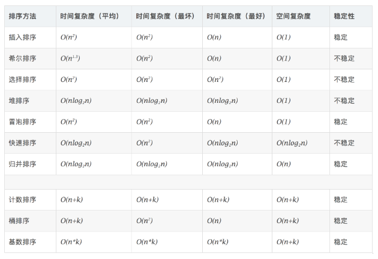

# Python

## Basic

### pyi file
* [1] pyi文件是干嘛的？（一文读懂Python的存根文件和类型检查）https://www.cnblogs.com/chester-cs/p/14000921.html
* [2]【PEP 484】什么是.pyi文件？ https://blog.csdn.net/weixin_40908748/article/details/106252884

* PEP 484
  * PEP484这个文档是对type hint作规范化的文档！
* type checker
  * PEP484只是一个规范化的文档，没有给出具体的hint软件。事实上有一个内置模块叫typing，但它是让你用规范的语法写type hint的。不是一个类型检查器！！！
  * 有哪些类型检查器可用？Pycharm内置有type checker，并且可用，明确支持stub file。mypy这个软件明确支持stub
* 一个最简单的type hint，一个最简单的stub file长什么样
* 一个最简单的带annotation(type hint)的函数定义：

```python
def greeting(name: str) -> str:
    return "Hello" + name
```

* 一个最简单的stub file：

```python
def greeting(name: str) -> str: ...
```

* 有了这个文件，就可以做检查了，例如这里写的是需要一个str类型的参数，如果传入了一个int或者其它什么类型，就会产生提示

### class - metaclass
*https://realpython.com/python-metaclasses/*

* Type and Class

```python
>>> class Foo:
...     pass
...
>>> x = Foo()

>>> type(x)
<class '__main__.Foo'>

>>> type(Foo)
<class 'type'>
```
The type of x is class Foo, as you would expect. But the type of Foo, the class itself, is type. In general, the type of any new-style class is type.

The type of the built-in classes you are familiar with is also type:

```python
>>> for t in int, float, dict, list, tuple:
...     print(type(t))
...
<class 'type'>
<class 'type'>
<class 'type'>
<class 'type'>
<class 'type'>

>>> type(type)
<class 'type'>
```

type is a metaclass, of which classes are instances. Just as an ordinary object is an instance of a class, any new-style class in Python, and thus any class in Python 3, is an instance of the type metaclass.

In the above case:

* x is an instance of class Foo.
* Foo is an instance of the type metaclass.
* type is also an instance of the type metaclass, so it is an instance of itself.

<div align=center>

</div>

* Is This Really Necessary?
  * As simple as the above class factory example is, it is the essence of how metaclasses work. They allow customization of class instantiation.
  * Still, this is a lot of fuss just to bestow the custom attribute attr on each newly created class. Do you really need a metaclass just for that?
* In Python, there are at least a couple other ways in which effectively the same thing can be accomplished:
  * Simple Inheritance
  * Class Decorator

### f-strings in Python
*https://www.geeksforgeeks.org/formatted-string-literals-f-strings-python/*

PEP 498 introduced a new string formatting mechanism known as Literal String Interpolation or more commonly as F-strings (because of the leading f character preceding the string literal). The idea behind f-strings is to make string interpolation simpler.

To create an f-string, prefix the string with the letter “ f ”. The string itself can be formatted in much the same way that you would with str.format(). F-strings provide a concise and convenient way to embed python expressions inside string literals for formatting.

```python
# Python3 program introducing f-string 
val = 'Geeks'
print(f"{val}for{val} is a portal for {val}.") 
```


### build-in function

#### map
* *https://www.geeksforgeeks.org/python-map-function/*

* what
  * map() function returns a map object(which is an iterator) of the results after applying the given function to each item of a given iterable (list, tuple etc.)
  * NOTE : You can pass one or more iterable to the map() function.
  * Returns
    * Returns a list of the results after applying the given function to each item of a given iterable (list, tuple etc.) 
  * NOTE : The returned value from map() (map object) then can be passed to functions like list() (to create a list), set() (to create a set) .

* why

* how
```python
# Python program to demonstrate working 
# of map. 
  
# Return double of n 
def addition(n): 
    return n + n 
  
# We double all numbers using map() 
numbers = (1, 2, 3, 4) 
result = map(addition, numbers) 
print(list(result)) 

# Output: [2, 4, 6, 8]
```

#### filter
* *https://www.geeksforgeeks.org/filter-in-python/*

* what
  * The filter() method filters the given sequence with the help of a function that tests each element in the sequence to be true or not.
* how
```python

# function that filters vowels 
def fun(variable): 
    letters = ['a', 'e', 'i', 'o', 'u'] 
    if (variable in letters): 
        return True
    else: 
        return False

# sequence 
sequence = ['g', 'e', 'e', 'j', 'k', 's', 'p', 'r'] 
  
# using filter function 
filtered = filter(fun, sequence) 
  
print('The filtered letters are:') 
for s in filtered: 
    print(s) 
# Output: 
"""
The filtered letters are:
e
e
"""
```

### meta programming
* *https://python3-cookbook.readthedocs.io/zh_CN/latest/chapters/p09_meta_programming.html*
* *coding/coding_python/python_basic/metaprogramming*

#### 在函数上添加包装器
* *coding/coding_python/python_basic/metaprogramming/test_func_wrap.py*

* why
  * 你想在函数上添加一个包装器，增加额外的操作处理(比如日志、计时等)。
* discuss

```python
# 一个装饰器就是一个函数，它接受一个函数作为参数并返回一个新的函数。 当你像下面这样写：

@timethis
def countdown(n):
    pass

# 跟像下面这样写其实效果是一样的：

def countdown(n):
    pass
countdown = timethis(countdown)
```

## Developer

### Compile From Source

```bash
# clone
cd C:\DEV_PROJECT\dev-repository
git clone https://github.com/python/cpython.git

# build
set http_proxy=http://127.0.0.1:10809
set https_proxy=https://127.0.0.1:10809
cd C:\DEV_PROJECT\dev-repository\cpython
PCBuild\build.bat -h
```

### Python3 Source Code Analysis
*https://github.com/flaggo/python3-source-code-analysis*

#### Print in Source code

```c
// Objects/longobject.c

static PyObject *
long_to_decimal_string(PyObject *aa)
{
    PyObject *v;
    if (long_to_decimal_string_internal(aa, &v, NULL, NULL, NULL) == -1)
        return NULL;
    return v;
}

// to

static PyObject *
long_to_decimal_string(PyObject *aa)
{
	PyObject *str = PyUnicode_FromString("-----hELLO-----");
	PyObject_Print(str, stdout, 0);
	printf("\n");

    PyObject *v;
    if (long_to_decimal_string_internal(aa, &v, NULL, NULL, NULL) == -1)
        return NULL;
    return v;
}
```

1. PyUnicode_FromString 用于把 C 中的原生字符数组转换为出 Python 中的字符串（Unicode）对象
2. PyObject_Print 则将转换好的字符串对象打印至我们指定的标准输出（stdout）

```python
>>> print(1)
'-----hELLO-----'
1
```

* Note
  * only `print(1)` not `print("1")`

## Python Magic method

### __rrshift__
`__rrshift__` is the reversed-operand version of __rshift__. There are reversed-operand versions of the other binary operators. They are invoked for the object on the right-hand side of a binary operator when the left-hand-side object doesn't support the operator in question

### __iter__
*https://www.geeksforgeeks.org/python-__iter__-__next__-converting-object-iterator/*

At many instances, we get a need to access an object like an iterator. One way is to form a generator loop but that extends the task and time taken by the programmer. Python eases this task by providing a built-in method __iter__() for this task.

The __iter__() function returns an iterator for the given object (array, set, tuple etc. or custom objects). It creates an object that can be accessed one element at a time using __next__() function, which generally comes in handy when dealing with loops.

### __enter__ & __exit__
*https://stackoverflow.com/questions/1984325/explaining-pythons-enter-and-exit*

Using these magic methods (__enter__, __exit__) allows you to implement objects which can be used easily with the with statement.

The idea is that it makes it easy to build code which needs some 'cleandown' code executed (think of it as a try-finally block). Some more explanation here.

A useful example could be a database connection object (which then automagically closes the connection once the corresponding 'with'-statement goes out of scope):

### __call__
*https://www.geeksforgeeks.org/__call__-in-python/*

Python has a set of built-in methods and __call__ is one of them. The __call__ method enables Python programmers to write classes where the instances behave like functions and can be called like a function. When the instance is called as a function; if this method is defined, x(arg1, arg2, ...) is a shorthand for x.__call__(arg1, arg2, ...).

### __setattr__
*https://python-reference.readthedocs.io/en/latest/docs/dunderattr/setattr.html*

Called when an attribute assignment is attempted.

### __new__
*https://www.geeksforgeeks.org/__new__-in-python/*

Whenever a class is instantiated __new__ and __init__ methods are called. __new__ method will be called when an object is created and __init__ method will be called to initialize the object. In the base class object, the __new__ method is defined as a static method which requires to pass a parameter cls. cls represents the class that is needed to be instantiated, and the compiler automatically provides this parameter at the time of instantiation.

### Operator e.g. __invert__, __or__ ...
*https://docs.python.org/3/library/operator.html*

The operator module exports a set of efficient functions corresponding to the intrinsic operators of Python. For example, operator.add(x, y) is equivalent to the expression x+y. Many function names are those used for special methods, without the double underscores. For backward compatibility, many of these have a variant with the double underscores kept. The variants without the double underscores are preferred for clarity.

### __class__
*https://blog.csdn.net/tomoya_ingen/article/details/80202015*

实例调用__class__属性时会指向该实例对应的类，然后可以再去调用其它类属性
example: `self.__class__.__name__` 首先用__class__将self实例变量指向类，然后再去调用`__name__`类属性，通常情况`__name__`的值为`__main__`


## Module

### functools

#### functools.reduce()
* what 
  * *https://www.geeksforgeeks.org/reduce-in-python/*
  * The reduce(fun,seq) function is used to apply a particular function passed in its argument to all of the list elements mentioned in the sequence passed along.This function is defined in “functools” module.
* how
```python
# python code to demonstrate working of reduce() 
  
# importing functools for reduce() 
import functools 
  
# initializing list 
lis = [ 1 , 3, 5, 6, 2, ] 
  
# using reduce to compute sum of list 
print ("The sum of the list elements is : ",end="") 
print (functools.reduce(lambda a,b : a+b,lis)) 
  
# using reduce to compute maximum element from list 
print ("The maximum element of the list is : ",end="") 
print (functools.reduce(lambda a,b : a if a > b else b,lis))

# Output:
"""
The sum of the list elements is : 17
The maximum element of the list is : 6
"""
```

* what
  * *https://www.cnblogs.com/apollo1616/articles/9785335.html*
  * reduce函数，reduce函数会对参数序列中元素进行累积。
  * reduce函数的定义：
    * reduce(function, sequence [, initial] ) -> value
  * function参数是一个有两个参数的函数，reduce依次从sequence中取一个元素，和上一次调用function的结果做参数再次调用function。
  * 第一次调用function时，如果提供initial参数，会以sequence中的第一个元素和initial作为参数调用function，否则会以序列sequence中的前两个元素做参数调用function
* how
```python
d = lambda a,b : a if a>b else b
functools.reduce(d, [1, 2, 3, 4, 5, 6])
# Output:
# 6
```

###  Pywinauto
* [1] What is pywinauto https://pywinauto.readthedocs.io/en/latest/
* [2] `programming\coding_python\pymodule\pywinauto\hello_test.py`
* [3] 最棒的windows自动化测试工具 pywinauto 速成 https://www.jianshu.com/p/4840a62987fd

#### Getting Started Guide
* The list of supported accessibility technologies on Windows:
  * Win32 API (backend="win32") - a default backend for now
    * MFC, VB6, VCL, simple WinForms controls and most of the old legacy apps
  * MS UI Automation (backend="uia")
    * WinForms, WPF, Store apps, Qt5, browsers
  * Notes: Chrome requires `--force-renderer-accessibility` cmd flag before starting. Custom properties and controls are not supported because of comtypes Python library restrictions.

#### Realization principle
1. 建立控件索引,每个控件会有elementinfo
2. 查找控件在控件大列表中根据属性来查找控件 
3. 鼠标或者键盘操作 针对控件窗口进行发送消息操作 [3]

### Pyautogui
* [1] asweigart/pyautogui https://github.com/asweigart/pyautogui
* [2] `programming\coding_python\pymodule\pyautogui\hello_test.py`

### scipy
* install `pip install scipy --user`

#### scipy.sparse
* [1] Python系列之SciPy-稀疏矩阵 http://showteeth.tech/posts/5727.html
* [2] cipy.sparse.linalg.lsqr https://docs.scipy.org/doc/scipy/reference/generated/scipy.sparse.linalg.lsqr.html

> 稀疏矩阵

* **coo_matrix**: COOrdinate format matrix
* `scipy.sparse.coo_matrix(A)`

<div align=center>

</div>

* [1]

> 最小二乘法

* `scipy.sparse.linalg.lsqr`

* Find the least-squares solution to a large, sparse, linear system of equations.
* The function solves `Ax = b` or `min ||Ax - b||^2` or `min ||Ax - b||^2 + d^2 ||x||^2`. [2]

### jupyter
* [1] python之jupyter安装与使用 https://www.cnblogs.com/xingxia/p/python_jupyter.html

* Install
  * `pip install jupyter`
* Use
  * `jupyter notebook`

## Resource
* cookbook
  * *https://python3-cookbook.readthedocs.io/zh_CN/latest/index.html*


# Design Patterns
*https://refactoringguru.cn/design-patterns/python*

* What’s a design pattern?
  * Design patterns are typical solutions to commonly occurring problems in software design. They are like pre-made blueprints that you can customize to solve a recurring design problem in your code.

  * You can’t just find a pattern and copy it into your program, the way you can with off-the-shelf functions or libraries. The pattern is not a specific piece of code, but a general concept for solving a particular problem. You can follow the pattern details and implement a solution that suits the realities of your own program.

  * Patterns are often confused with algorithms, because both concepts describe typical solutions to some known problems. While an algorithm always defines a clear set of actions that can achieve some goal, a pattern is a more high-level description of a solution. The code of the same pattern applied to two different programs may be different.

  * An analogy to an algorithm is a cooking recipe: both have clear steps to achieve a goal. On the other hand, a pattern is more like a blueprint: you can see what the result and its features are, but the exact order of implementation is up to you.

* History of patterns
  * Who invented patterns? That’s a good, but not a very accurate, question. Design patterns aren’t obscure, sophisticated concepts—quite the opposite. Patterns are typical solutions to common problems in object-oriented design. When a solution gets repeated over and over in various projects, someone eventually puts a name to it and describes the solution in detail. That’s basically how a pattern gets discovered.

## 创建型模式
### Abstract Factory 抽象工厂
让你能创建一系列相关的对象， 而无需指定其具体类。

### Builder 生成器
使你能够分步骤创建复杂对象。 该模式允许你使用相同的创建代码生成不同类型和形式的对象。 

### Factory Method 工厂方法
在父类中提供一个创建对象的接口以允许子类决定实例化对象的类型。

### Prototype 原型 
让你能够复制已有对象， 而又无需使代码依赖它们所属的类。

### Singleton 单例 
让你能够保证一个类只有一个实例， 并提供一个访问该实例的全局节点。

## 结构型模式

### Adapter 适配器
让接口不兼容的对象能够相互合作。

### Bridge 桥接
可将一个大类或一系列紧密相关的类拆分为抽象和实现两个独立的层次结构， 从而能在开发时分别使用。

### Composite 组合 
你可以使用它将对象组合成树状结构， 并且能像使用独立对象一样使用它们。

### Decorator 装饰 
允许你通过将对象放入包含行为的特殊封装对象中来为原对象绑定新的行为。

### Facade 外观 
能为程序库、 框架或其他复杂类提供一个简单的接口。

### Flyweight 享元 
摒弃了在每个对象中保存所有数据的方式， 通过共享多个对象所共有的相同状态， 让你能在有限的内存容量中载入更多对象。

### Proxy 代理 
让你能够提供对象的替代品或其占位符。 代理控制着对于原对象的访问， 并允许在将请求提交给对象前后进行一些处理。

## 行为模式

### Chain of Responsibility 责任链 
允许你将请求沿着处理者链进行发送。 收到请求后， 每个处理者均可对请求进行处理， 或将其传递给链上的下个处理者。

### Command 命令 
它可将请求转换为一个包含与请求相关的所有信息的独立对象。 该转换让你能根据不同的请求将方法参数化、 延迟请求执行或将其放入队列中， 且能实现可撤销操作。

### Iterator 迭代器 
让你能在不暴露集合底层表现形式 （列表、 栈和树等） 的情况下遍历集合中所有的元素。

### Mediator 中介者 
能让你减少对象之间混乱无序的依赖关系。 该模式会限制对象之间的直接交互， 迫使它们通过一个中介者对象进行合作。

### Memento 备忘录 
允许在不暴露对象实现细节的情况下保存和恢复对象之前的状态

### Observer 观察者 
允许你定义一种订阅机制， 可在对象事件发生时通知多个 “观察” 该对象的其他对象。

### State 状态 
让你能在一个对象的内部状态变化时改变其行为， 使其看上去就像改变了自身所属的类一样。

### Strategy 策略 
能让你定义一系列算法， 并将每种算法分别放入独立的类中， 以使算法的对象能够相互替换。

### Template Method 模板方法 
在超类中定义一个算法的框架， 允许子类在不修改结构的情况下重写算法的特定步骤。

**在超类中写了可能要用到的大多数的算法，子类根据需要重写特定步骤**

### Visitor 访问者 
将算法与其所作用的对象隔离开来。

<div align=center>

</div>


# Refactoring
* Refactoring
  *Refactoring is a systematic process of improving code without creating new functionality that can transform a mess into clean code and simple design.

* Dirty Code
  * Dirty code is result of inexperience multiplied by tight deadlines, mismanagement, and nasty shortcuts taken during the development process

* Clean Code
  * Clean code is code that is easy to read, understand and maintain. Clean code makes software development predictable and increases the quality of a resulting product

* Refactoring Process
  * Performing refactoring step-by-step and running tests after each change are key elements of refactoring that make it predictable and safe.

* Code Smells
  * Code smells are indicators of problems that can be addressed during refactoring. Code smells are easy to spot and fix, but they may be just symptoms of a deeper problem with code.

* Refactoring Techniques
  * Refactoring techniques describe actual refactoring steps. Most refactoring techniques have their pros and cons. Therefore, each refactoring should be properly motivated and applied with caution.

## Clean code
The main purpose of refactoring is to fight technical debt. It transforms a mess into clean code and simple design.

###  Clean code is obvious for other programmers.
And I’m not talking about super sophisticated algorithms. Poor variable naming, bloated classes and methods, magic numbers -you name it- all of that makes code sloppy and difficult to grasp.

### Clean code doesn’t contain duplication.
Each time you have to make a change in a duplicate code, you have to remember to make the same change to every instance. This increases the cognitive load and slows down the progress.

### Clean code contains a minimal number of classes and other moving parts.
Less code is less stuff to keep in your head. Less code is less maintenance. Less code is fewer bugs. Code is liability, keep it short and simple.

### Clean code passes all tests.
You know your code is dirty when only 95% of your tests passed. You know you’re screwed when you test coverage is 0%.

### Clean code is easier and cheaper to maintain!

## Technical debt
Everyone does their best to write excellent code from scratch. There probably isn’t a programmer out there who intentionally writes unclean code to the detriment of the project. But at what point does clean code become unclean?

The metaphor of “technical debt” in regards to unclean code was originally suggested by Ward Cunningham.

If you get a loan from a bank, this allows you to make purchases faster. You pay extra for expediting the process - you don’t just pay off the principal, but also the additional interest on the loan. Needless to say, you can even rack up so much interest that the amount of interest exceeds your total income, making full repayment impossible.

The same thing can happen with code. You can temporarily speed up without writing tests for new features, but this will gradually slow your progress every day until you eventually pay off the debt by writing tests.

### Causes of technical debt
#### Business pressure
Sometimes business circumstances might force you to roll out features before they’re completely finished. In this case, patches and kludges will appear in the code to hide the unfinished parts of the project.

#### Lack of understanding of the consequences of technical debt
Sometimes your employer might not understand that technical debt has “interest” insofar as it slows down the pace of development as debt accumulates. This can make it too difficult to dedicate the team’s time to refactoring because management doesn’t see the value of it.

#### Failing to combat the strict coherence of components
This is when the project resembles a monolith rather than the product of individual modules. In this case, any changes to one part of the project will affect others. Team development is made more difficult because it’s difficult to isolate the work of individual members.

#### Lack of tests
The lack of immediate feedback encourages quick, but risky workarounds or kludges. In worst cases, these changes are implemented and deployed right into the production without any prior testing. The consequences can be catastrophic. For example, an innocent-looking hotfix might send a weird test email to thousands of customers or even worse, flush or corrupt an entire database.

#### Lack of documentation
This slows down the introduction of new people to the project and can grind development to a halt if key people leave the project.

#### Lack of interaction between team members
If the knowledge base isn’t distributed throughout the company, people will end up working with an outdated understanding of processes and information about the project. This situation can be exacerbated when junior developers are incorrectly trained by their mentors.

#### Long-term simultaneous development in several branches
This can lead to the accumulation of technical debt, which is then increased when changes are merged. The more changes made in isolation, the greater the total technical debt.

#### Delayed refactoring
The project’s requirements are constantly changing and at some point it may become obvious that parts of the code are obsolete, have become cumbersome, and must be redesigned to meet new requirements.

On the other hand, the project’s programmers are writing new code every day that works with the obsolete parts. Therefore, the longer refactoring is delayed, the more dependent code will have to be reworked in the future.

#### Lack of compliance monitoring
This happens when everyone working on the project writes code as they see fit (i.e. the same way they wrote the last project).

#### Incompetence
This is when the developer just doesn’t know how to write decent code.

## When to refactor

### Rule of Three
1. When you’re doing something for the first time, just get it done.

2. When you’re doing something similar for the second time, cringe at having to repeat but do the same thing anyway.

3. When you’re doing something for the third time, start refactoring.


### When adding a feature
* Refactoring helps you understand other people’s code. If you have to deal with someone else’s dirty code, try to refactor it first. Clean code is much easier to grasp. You will improve it not only for yourself but also for those who use it after you.

* Refactoring makes it easier to add new features. It’s much easier to make changes in clean code.


### When fixing a bug
Bugs in code behave just like those in real life: they live in the darkest, dirtiest places in the code. Clean your code and the errors will practically discover themselves.

Managers appreciate proactive refactoring as it eliminates the need for special refactoring tasks later. Happy bosses make happy programmers!


### During a code review
The code review may be the last chance to tidy up the code before it becomes available to the public.

It’s best to perform such reviews in a pair with an author. This way you could fix simple problems quickly and gauge the time for fixing the more difficult ones.

## How to refactor
### Checklist of refactoring done right way

#### The code should become cleaner.
It frequently happens when you move away from refactoring with small changes and mix a whole bunch of refactorings into one big change. So it’s very easy to lose your mind, especially if you have a time limit.

But it can also happen when working with extremely sloppy code. Whatever you improve, the code as a whole remains a disaster.

In this case, it’s worthwhile to think about completely rewriting parts of the code. But before that, you should have written tests and set aside a good chunk of time. Otherwise, you’ll end up with the kinds of results we talked about in the first paragraph.

#### New functionality shouldn’t be created during refactoring.
Don’t mix refactoring and direct development of new features. Try to separate these processes at least within the confines of individual commits.
#### All existing tests must pass after refactoring.
There are two cases when tests can break down after refactoring:

* You made an error during refactoring. This one is a no-brainer: go ahead and fix the error.

* Your tests were too low-level. For example, you were testing private methods of classes.

In this case, the tests are to blame. You can either refactor the tests themselves or write an entirely new set of higher-level tests. A great way to avoid this kind of a situation is to write [BDD-style](https://en.wikipedia.org/wiki/Behavior-driven_development) tests.

## Code Smells

### Bloaters
Bloaters are code, methods and classes that have increased to such gargantuan proportions that they’re hard to work with. Usually these smells don’t crop up right away, rather they accumulate over time as the program evolves (and especially when nobody makes an effort to eradicate them).

* [Long Method](https://refactoring.guru/smells/long-method)
  * A method contains too many lines of code. Generally, any method longer than ten lines should make you start asking questions.

* [Large Class](https://refactoring.guru/smells/large-class)
  * A class contains many fields/methods/lines of code.

* [Primitive Obsession](https://refactoring.guru/smells/primitive-obsession)
  * Use of primitives instead of small objects for simple tasks (such as currency, ranges, special strings for phone numbers, etc.)
  * Use of constants for coding information (such as a constant USER_ADMIN_ROLE = 1 for referring to users with administrator rights.)
  * Use of string constants as field names for use in data arrays.

* [Long Parameter List](https://refactoring.guru/smells/long-parameter-list)
  * More than three or four parameters for a method.

* [Data Clumps](https://refactoring.guru/smells/data-clumps)
  * Sometimes different parts of the code contain identical groups of variables (such as parameters for connecting to a database). These clumps should be turned into their own classes.

### Object-Orientation Abusers
All these smells are incomplete or incorrect application of object-oriented programming principles.

* [Switch Statements](https://refactoring.guru/smells/switch-statements)
  * You have a complex switch operator or sequence of if statements.

* [Temporary Field](https://refactoring.guru/smells/temporary-field)
  * Temporary fields get their values (and thus are needed by objects) only under certain circumstances. Outside of these circumstances, they’re empty.

* [Refused Bequest](https://refactoring.guru/smells/refused-bequest)
  * If a subclass uses only some of the methods and properties inherited from its parents, the hierarchy is off-kilter. The unneeded methods may simply go unused or be redefined and give off exceptions.

* [Alternative Classes with Different Interfaces](https://refactoring.guru/smells/alternative-classes-with-different-interfaces)
  * Two classes perform identical functions but have different method names.

### Change Preventers
These smells mean that if you need to change something in one place in your code, you have to make many changes in other places too. Program development becomes much more complicated and expensive as a result.

* [Divergent Change](https://refactoring.guru/smells/divergent-change)
  * You find yourself having to change many unrelated methods when you make changes to a class. For example, when adding a new product type you have to change the methods for finding, displaying, and ordering products.

* [Shotgun Surgery](https://refactoring.guru/smells/shotgun-surgery)
  * Making any modifications requires that you make many small changes to many different classes.

* [Parallel Inheritance Hierarchies](https://refactoring.guru/smells/parallel-inheritance-hierarchies)
  * Whenever you create a subclass for a class, you find yourself needing to create a subclass for another class.

### Dispensables
A dispensable is something pointless and unneeded whose absence would make the code cleaner, more efficient and easier to understand.

* [Comments](https://refactoring.guru/smells/comments)
  * A method is filled with explanatory comments.

* [Duplicate Code](https://refactoring.guru/smells/duplicate-code)
  * Two code fragments look almost identical.

* [Lazy Class](https://refactoring.guru/smells/lazy-class)
  * Understanding and maintaining classes always costs time and money. So if a class doesn’t do enough to earn your attention, it should be deleted.

* [Data Class](https://refactoring.guru/smells/data-class)
  * A data class refers to a class that contains only fields and crude methods for accessing them (getters and setters). These are simply containers for data used by other classes. These classes don’t contain any additional functionality and can’t independently operate on the data that they own.

* [Dead Code](https://refactoring.guru/smells/dead-code)
  * A variable, parameter, field, method or class is no longer used (usually because it’s obsolete).

* [Speculative Generality](https://refactoring.guru/smells/speculative-generality)
  * There’s an unused class, method, field or parameter.

### Couplers
All the smells in this group contribute to excessive coupling between classes or show what happens if coupling is replaced by excessive delegation.

* [Feature Envy](https://refactoring.guru/smells/feature-envy)
  * A method accesses the data of another object more than its own data.

* [Inappropriate Intimacy](https://refactoring.guru/smells/inappropriate-intimacy)
  * One class uses the internal fields and methods of another class.

* [Message Chains](https://refactoring.guru/smells/message-chains)
  * In code you see a series of calls resembling $a->b()->c()->d()

* [Middle Man](https://refactoring.guru/smells/middle-man)
  * If a class performs only one action, delegating work to another class, why does it exist at all?

### Other Smells
*https://refactoring.guru/refactoring/smells/other*
...

## Refactoring Techniques

### Composing Methods
*https://refactoring.guru/refactoring/techniques/composing-methods*

Much of refactoring is devoted to correctly composing methods. In most cases, excessively long methods are the root of all evil. The vagaries of code inside these methods conceal the execution logic and make the method extremely hard to understand—and even harder to change.

The refactoring techniques in this group streamline methods, remove code duplication, and pave the way for future improvements.

...

### Moving Features between Objects
*https://refactoring.guru/refactoring/techniques/moving-features-between-objects*

Even if you have distributed functionality among different classes in a less-than-perfect way, there’s still hope.

These refactoring techniques show how to safely move functionality between classes, create new classes, and hide implementation details from public access.

...

### Organizing Data
*https://refactoring.guru/refactoring/techniques/organizing-data*

These refactoring techniques help with data handling, replacing primitives with rich class functionality.

Another important result is untangling of class associations, which makes classes more portable and reusable.
...

### Simplifying Conditional Expressions
*https://refactoring.guru/refactoring/techniques/simplifying-conditional-expressions*

Conditionals tend to get more and more complicated in their logic over time, and there are yet more techniques to combat this as well.

...

### Simplifying Method Calls
*https://refactoring.guru/refactoring/techniques/simplifying-method-calls*

These techniques make method calls simpler and easier to understand. This, in turn, simplifies the interfaces for interaction between classes.

...

### Dealing with Generalization
*https://refactoring.guru/refactoring/techniques/dealing-with-generalization*

Abstraction has its own group of refactoring techniques, primarily associated with moving functionality along the class inheritance hierarchy, creating new classes and interfaces, and replacing inheritance with delegation and vice versa.

...

# Debug

## Attaching to a Running Process
* *https://www.dummies.com/programming/cpp/attaching-to-a-running-process-using-codeblocks*

* Every time you start a new application, you create one or more processes. A process is simply executable code that is loaded into memory. The CPU reads and executes the instructions to perform the tasks you ask the application to do. When the CPU loads your application into memory, it assigns each process the application creates a Process IDentifier (PID), which is pronounced pid (think of lid with a p instead of an l). The PID is simply a number associated with the process for easy identification.

* In most cases, you debug an application by running it in the IDE in debug mode. However, there are some situations where you must debug the application in a different way — by attaching to its process. Attaching to the process means telling the CPU to send the instructions in the executable code to a debugger before they’re executed by the CPU. In other words, you place the debugger between the executable code and the CPU. Here are some of the most common reasons for performing this task:
  * The executable code is behaving differently in the debugger than it does when executed as a regular application.
  * Instead of working with a debug version, you want to debug the release version.
  * It’s important to see the disassembled code as it loads in memory.

# Reference

## 内存重排
* *https://blog.csdn.net/qcrao/article/details/92759907*
* *https://github.com/cch123/golang-notes/blob/master/memory_barrier.md*

* 内存重排是指程序在实际运行时对内存的访问顺序和代码编写时的顺序不一致，主要是为了提高运行效率。分别是硬件层面的 `CPU重排` 和软件层面的 `编译器重排`

* 单线程的程序一般不会有太大问题；多线程情况下，有时会出现诡异的现象，解决办法就是使用标准库里的锁。锁会带来性能问题，为了降低影响，锁应该尽量减小粒度，并且不要在互斥区（锁住的代码）放入耗时长的操作

### store buffer
```c++
 ┌─────────────┐                ┌─────────────┐   
 │    CPU 0    │                │    CPU 1    │   
 └───────────┬─┘                └───────────┬─┘   
   ▲         │                     ▲        │     
   │         │                     │        │     
   │         │                     │        │     
   │         │                     │        │     
   │         ▼                     │        ▼     
   │    ┌────────┐                 │    ┌────────┐
   │◀───┤ Store  │                 │◀───┤ Store  │
   ├───▶│ Buffer │                 ├───▶│ Buffer │
   │    └────┬───┘                 │    └───┬────┘
   │         │                     │        │     
   │         │                     │        │     
   │         │                     │        │     
   │         │                     │        │     
   │         ▼                     │        ▼     
┌──┴────────────┐               ┌──┴────────────┐ 
│               │               │               │ 
│     Cache     │               │     Cache     │ 
│               │               │               │ 
└───────┬───────┘               └───────┬───────┘ 
        │                               │         
        │                               │         
        │                               │         
 ┌──────┴──────┐                 ┌──────┴──────┐  
 │ Invalidate  │                 │ Invalidate  │  
 │    Queue    │                 │    Queue    │  
 └──────┬──────┘                 └──────┬──────┘  
        │                               │         
        │         Interconnect          │         
        └───────────────┬───────────────┘         
                        │                         
                        │                         
                        │                         
                        │                         
                ┌───────┴───────┐                 
                │               │                 
                │    Memory     │                 
                │               │                 
                └───────────────┘      
```

* CPU 和内存间是个多层的架构，有些资料上会把 L1/L2/L3 都叫作内存，并把这个整体称为内存分层: memory hierachy。
* CPU 的 cache 层需要保证其本身能保证一定的一致性，一般叫 cache coherence，这是通过 MESI 协议来保证的。
* 但是 MESI 协议中，如果要写入，需要把其它 cache 中的数据 invalidate 掉。这会导致 CPU 需要等待本地的 cacheline 变为 E(Exclusive)状态才能写入，也就是会带来等待，为了优化这种等待，最好是攒一波写，统一进行触发，所以积攒这些写入操作的地方就是 store buffer

# Confusion

## 框架和设计模式的区别
*https://www.kancloud.cn/chandler/programming_road/695595*

框架、设计模式这两个概念总容易被混淆，其实它们之间还是有区别的。框架通常是代码重用，而设计模式是设计重用，架构则介于两者之间，部分代码重用，部分设计重用，有时分析也可重用。

在软件生产中有三种级别的重用：
* 内部重用，即在同一应用中能公共使用的抽象块；
* 代码重用，即将通用模块组合成库或工具集，以便在多个应用和领域都能使用；
* 应用框架的重用，即为专用领域提供通用的或现成的基础结构，以获得最高级别的重用性。

框架与设计模式虽然相似，但却有着根本的不同。设计模式是对在某种环境中反复出现的问题以及解决该问题的方案的描述，它比框架更抽象；框架可以用代码表示，也能直接执行或复用，而对模式而言只有实例才能用代码表示；设计模式是比框架更小的元素，一个框架中往往含有一个或多个设计模式，框架总是针对某一特定应用领域，但同一模式却可适用于各种应用。可以说，框架是软件，而设计模式是软件的知识。

* 框架模式有哪些？
  * MVC、MTV、MVP、CBD、ORM 等等；

* 框架有哪些？
	* C++语言的QT、MFC、gtk，Java语言的 SSH 、SSI，php语言的 smarty(MVC模式)，python语言的django(MTV模式)等等

* 设计模式有哪些？
	* 工厂模式、适配器模式、策略模式等等

简而言之：框架是大智慧，用来对软件设计进行分工；设计模式是小技巧，对具体问题提出解决方案，以提高代码复用率，降低耦合度。

## 各编程语言比较
*https://hyperpolyglot.org/*


# Resources

## python3-cookbook
*https://python3-cookbook.readthedocs.io/zh_CN/latest/*

## Problem Solving with Algorithms and Data Structures using Python
*https://runestone.academy/runestone/books/published/pythonds/index.html*


# Algorithm
* *https://www.geekxh.com/*
* *https://pegasuswang.github.io/python_data_structures_and_algorithms/*
* *https://labuladong.gitbook.io/algo/*

* *dev-project\Ebooks\算法图解.pdf*

## 位运算

## 查找
* *https://www.cnblogs.com/maybe2030/p/4715035.html*

* 查找是在大量的信息中寻找一个特定的信息元素，在计算机应用中，查找是常用的基本运算，例如编译程序中符号表的查找。本文简单概括性的介绍了常见的七种查找算法，说是七种，其实二分查找、插值查找以及斐波那契查找都可以归为一类——插值查找。插值查找和斐波那契查找是在二分查找的基础上的优化查找算法

* 查找定义
  * 根据给定的某个值，在查找表中确定一个其关键字等于给定值的数据元素（或记录）。

* 查找算法分类：
  * 静态查找和动态查找；
    * 注：静态或者动态都是针对查找表而言的。动态表指查找表中有删除和插入操作的表。
  * 无序查找和有序查找
    * 无序查找：被查找数列有序无序均可；
    * 有序查找：被查找数列必须为有序数列。

### ASL（Average Search Length）平均查找长度
* *https://www.cnblogs.com/ygsworld/p/10238729.html*
* *https://blog.csdn.net/butbabuc/article/details/108115295*

* 在查找运算中，由于所费时间在关键字的比较上，所以把平均需要和待查找值比较的关键字次数称为平均查找长度

  $$
  ASL = \sum_{i=1}^{n} P_i C_i
  $$

* 其中`n`为查找表中元素个数，`Pi`为查找第`i`个元素的概率，通常假设每个元素查找概率相同，`Pi=1/n`，`Ci`是找到第`i`个元素的比较次数

#### 顺序查找
* 顺序查找(Sequence Search)表中，查找方式为从头扫到尾，找到待查找元素即查找成功，若到尾部没有找到，说明查找失败。从表的一端开始，需要进行`Ci = (n-i+1)`次比较

```
|---------------------------  
|                        ↓    
|---------------------------  
| 0 | 1 | 2 | 3 | 4 | 5 | 6   
|---------------------------   
|   | 5 | 37| 19| 21| 56| 64   
|---------------------------   
|                        *     
|---------------------------   
// 寻找64，从尾部开始
```

* Formular

  $$
  ASL_{successful} = \sum_{i=1}^{n} P_i * (n-i+1) = \frac{1+2+...+n}{n} = \frac{(n+1)}{2}
  $$

  $$
  ASL_{failed} = n
  $$

<div align=center>

</div>

#### 折半查找
* 折半查找(Binary Search)，首先待查找表是有序表，这是折半查找的要求。在折半查找中，用二叉树描述查找过程，查找区间中间位置作为根，左子表为左子树，右子表为右子树，，因为这颗树也被成为`判定树(decision tree)`或`比较树(Comparison tree)`。**查找方式为(找k)，先与树根结点进行比较，若k小于根，则转向左子树继续比较，若k大于根，则转向右子树，递归进行上述过程，直到查找成功或查找失败。**在n个元素的折半查找判定树中，由于关键字序列是用树构建的，所以查找路径实际为树中从根节点到被查结点的一条路径，因为比较次数刚好为该元素在树中的层数

  $$
  ASL_{successful} = \sum_{i=1}^{n} P_i * level(K_i)
  $$

* `Pi`为查找`k`的概率，`level(Ki)`为`k`对应内部结点的层次

<div align=center>

</div>

### 顺序查找
* *coding/coding_python/algorithm_learning/e01_01_search.py* `SequentialSearch()`

* 基本思想
  * 顺序查找也称为线形查找，属于无序查找算法。从数据结构线形表的一端开始，顺序扫描，依次将扫描到的结点关键字与给定值k相比较，若相等则表示查找成功；若扫描结束仍没有找到关键字等于k的结点，表示查找失败。
* 复杂度分析：　
  * 查找成功时的平均查找长度为：（假设每个数据元素的概率相等） ASL = 1/n(1+2+3+…+n) = (n+1)/2 ;当查找不成功时，需要n+1次比较，时间复杂度为O(n);所以，顺序查找的时间复杂度为O(n)。

### 二分查找
* *coding/coding_python/algorithm_learning/e01_01_search.py* `BinarySearch()`

* 说明：元素必须是有序的，如果是无序的则要先进行排序操作。
* 基本思想
  * 也称为是折半查找，属于有序查找算法。用给定值k先与中间结点的关键字比较，中间结点把线形表分成两个子表，若相等则查找成功；若不相等，再根据k与该中间结点关键字的比较结果确定下一步查找哪个子表，这样递归进行，直到查找到或查找结束发现表中没有这样的结点。
* 复杂度分析
  * 最坏情况下，关键词比较次数为`log2(n+1)`，且期望时间复杂度为`O(log2n)`

## 博弈论

### 囚徒困境
* 什么是“博弈论”
  * 古语有云，“笑人情似纸，世事如棋”。生活中每个人如同棋手，其每一个行为如同在一张看不见的棋盘上布子，精明慎重的棋手们相互揣摩、牵制、争赢，下出诸多精彩纷呈、变化多端的棋局。而什么是博弈论？就是研究棋手们 的“出棋” 过程，从中抽象出可逻辑化的部分，并将其系统化的一门科学，也是运筹学的一个重要学科。
* 囚徒困境与纳什均衡
  * 一件严重的纵火案发生后，警察在现场抓到两个犯罪嫌疑人。事实上，正是他们一起放火烧了这座仓库。但是，警方没有掌握足够的证据，只得把他们分开囚禁起来，要求他们坦白交代。在分开囚禁后，警察对其分别告知：
    * 如果你坦白，而对方不坦白，则将你释放，判对方8年。
    * 如果你不坦白，而对方坦白，则将对方释放，而判你8年。
    * 如果你两都坦白了，则判你两各自4年。
  * 那么两个囚犯应该如何做，是互相背叛还是一起合作？

  <div align=center>
  
  </div>

  * 这场博弈的过程，显然不是顾及团体利益的最优解决方案。以全体利益而言，如果两个参与者都合作保持沉默，两人都可以无罪释放，总体利益更高！但根据假设（人性），二人均为理性的个人，且只追求自己的个人利益。均衡状况会是两个囚徒都选择背叛，这就是“困境”所在！
  * 事实上，这种两人都选择坦白的策略以及因此被判4年的结局被称作“纳什均衡”（也叫非合作均衡），换言之，在此情况下，无一参与者可以“独自行动”（即单方面改变决定）而增加收获。
  * 所谓纳什均衡，指的是参与人的一种策略组合，在该策略组合上，任何参与人单独改变策略都不会得到好处。简单点讲，如果在一个策略组合上，当所有其他人都不改变策略时，没有人会改变自己的策略，则该策略组合就是一个纳什均衡。

### 辛普森悖论
* 示例
  * 羊羊医院里统计了两种胆结石治疗方案的治愈率。在统计过程中，医生将病人分为大胆结石和小胆结石两组。统计结果如下：

  <div align=center>
  
  </div>

  * 对于小胆结石而言，手术A的治愈率（93%）高于 手术B（87%）
  * 对于大胆结石而言，手术A的治愈率（73%）高于 手术B（69%）
  * 我们根据样本统计出大小胆结石总计的治愈率，发现手术B(治愈率83%)其实是要高于手术A(治愈率78%)
  
  <div align=center>
  
  </div>

* 直觉的缺陷
  * 如果一个事物的各部分都分别大于另一个事物的各部分，那么这个事物大于另一个事物。 比如：我们的直觉告诉我们如果手术A在两组病人中都更好，那么在所有病人中也应该更好。
  * 我们可以将其公式化（该公式错误），假设：
    * `A=A1+A2+....+An`
    * `B=B1+B2+....+Bn`
  * 如果对`i=1,2...,n`都有`Ai>Bi`，则`A>B`, 乍一看，我们觉得该公式没有问题~所以这个公式也就代表了我们大部分人的思维工作。其实在这个公式中，隐藏掉了一个很重要的条件：A1、A2、An 以及 B1、B2、Bn 并不能简单的通过“加”来得到 A 或者 B。这就是可加性的前提。在大脑的思维过程中，因为我们很难直接看到这个前提，进而就导致了我们错误的思考！

* 如何避免
  * 多维度拆解分析方法的应用，(比如如果统计关于人的数据，人可以分为老人与年轻人)

### 红眼睛和蓝眼睛
* 红眼睛和蓝眼睛
  * 一个岛上有100个人，其中有5个红眼睛，95个蓝眼睛。这个岛有三个奇怪的宗教规则。
    * 1.他们不能照镜子，不能看自己眼睛的颜色。
    * 2.他们不能告诉别人对方的眼睛是什么颜色。
    * 3.一旦有人知道了自己是红眼睛，他就必须在当天夜里自杀。
  * 某天，有个旅行者到了这个岛上。由于不知道这里的规矩，所以他在和全岛人一起狂欢的时候，不留神就说了一句话：【你们这里有红眼睛的人。】
  * 问题：假设这个岛上的人每天都可以看到其他所有人，每个人都可以做出缜密的逻辑推理，请问岛上会发生什么？
* 证明过程
  * 穷举法
    * 从假设只有1个红眼睛开始分析。我们假设岛上只有1个红眼睛的人，还有99个都是蓝眼睛。因为这个旅行者说了“这里有红眼睛的人”，那么在第一天的时候，这个红眼睛会发现其他的人都是蓝眼睛（与此同时，其他人因为看到了这个红眼睛的人，所以都确认了自己的安全）那么这天晚上，这个红眼睛的人一定会自杀！
    * 继续分析，假设这个岛上有2个红眼睛，那么当旅行者说“这里有红眼睛的人”之后的第一天，这两个红眼睛分别发现还有别的红眼睛存在，所以他们当天晚上认为自己是安全的。但是到了第二天，红眼睛惊讶的发现，另一个红眼睛的人竟然没有自杀（说明岛上有不止一个红眼睛），并且当天他们也没有发现有别的红眼睛存在（说明另一个红眼睛就是自己）WTF，那肯定另一个红眼睛就是自己了，所以在第二天夜里，两个红眼睛的人会同时自杀！
    * 继续分析，假如岛上红眼睛有3个。那么在第一天，红眼睛发现了岛上还有另外两个红眼睛，红眼睛呵呵一笑，“反正不是我”。到了第二天，红眼睛仍然看到了另外两个红眼睛，红眼睛心想，"这下你两该完蛋了吧"，毕竟你两都知道了自己是红眼睛，晚上回去统统自杀吧！（根据上面的推论得出）但是惊奇的是，到了第三天，红眼睛发现另外两个红眼睛竟然都没有自杀。（说明岛上红眼睛的人不止两个）并且当天红眼睛也没发现新的红眼睛（说明还有一个红眼睛就是自己）所以在第三天的夜里，三个红眼睛会同时自杀。
    * 根据上面的推论，假设有N个红眼睛，那么到了第N天，这N个红眼睛就会自杀。所以最终这个岛上红眼睛的人会统统自杀！这就是答案，生活就是这么朴实无华，且枯燥
  * 归纳法
    * 此问题的第一个答案是用数学归纳法得出的：如果这个岛上有N个红眼睛，那么在旅行者说这句话的第N天，他们全部都会自杀。具体到本题则是，在第5天，这个岛上的5个红眼睛会全部自杀。（尊重原题，补：其他蓝眼睛在红眼睛集体自杀后，知道自己的眼睛颜色，也跟着自杀）。
    * 如果这个岛上只有 1 个红眼睛，其他人都是蓝眼睛。那么，当旅行者说了这句话之后，此人立刻就会知道自己是红眼睛，因为他看到的其他人都是蓝眼睛，他就会在当天自杀。即，当 n 取第一个值 n0 = 1 时，命题成立。
    * 假设当这个岛上有 N 个红眼睛的时候，在旅行者说了这句话之后的第N天，这些红眼睛会全部自杀。
    * 那么，当这个岛上有 N + 1 个红眼睛的时候，在每个红眼睛看来，岛上都确定有N个红眼睛，并等待着他们在第N天自杀。而在第N天，大家都没有自杀。所以一到第 N + 1 天，每个红眼睛都明白了这个岛上还有第 N + 1个红眼睛——他自己。于是大家都在第 N + 1 天自杀了。
    * 所以命题得证：如果这个岛上有 N 个红眼睛，那么在旅行者说这句话的第 N 天，他们全部都会自杀。

### 海盗分金币
* 在大海上，有5个海盗抢得100枚金币，他们决定每一个人按顺序依次提出自己的分配方案，如果提出的方案没有获得半数或半数以上的人的同意，则这个提出方案的人就被扔到海里喂鲨鱼。那么第一个提出方案的人要怎么做，才能使自己的利益最大化？
* 海盗们有如下特点：
  1. 足智多谋，总是采取最优策略。
  2. 贪生怕死，尽量保全自己性命。
  3. 贪得无厌，希望自己得到越多宝石越好
  4. 心狠手辣，在自己利益最大的情况下希望越多人死越好。
  5. 疑心多虑，不信任彼此，尽量确保自身利益不寄希望与别人给自己更大利益。
* 分析
  * 假如我们设想只有两个海盗。那么不管第一个说什么，只要第二个人不同意，第二个人就可以得到全部的金币！所以第一个海盗必死无疑，这个大家都能理解。（当然，这样的前提是一号提出方案后不可以马上自己同意，不然如果自己提出给自己全部金币的方案，然后自己支持，这样就是二号必死无疑）
  * 假如现在我们加入第三个海盗，这时候原来的一号成为了二号，二号成为了三号。这时候现在的二号心里会清楚，如果他投死了一号，那么自己必死无疑！所以根据贪生怕死的原则，二号肯定会让一号存活。而此时一号心理也清楚，无论自己提出什么样的方案，二号都会让自己存活，而这时只要加上自己的一票，就有半数通过，所以一号提出方案：把金币都给我。
  * 现在又继续加入了新的海盗！原来的1,2,3号，成为了现在的2,3,4号。这时候新的一号海盗洞悉了奥秘，知道了如果自己死了，二号就可以获取全部的金币， 所以提出给三号和四号一人一个金币，一起投死2号。而与此同时，现在的3号和4号获取的要比三个人时多（三个人时自己获取不了任何金币），所以他们会同意这个方案！
  * 现在加入我们的大Boss，最后一个海盗。根据分析，大Boss海盗1号推知出2号的方案后就可以提出(97,0,1,2,0)或者(97,0,1,0,2)的方案。这样的分配方案对现在的3号海盗相比现在的2号的分配方案还多了一枚金币，就会投赞成票，4号或者5号因为得到了2枚金币，相比2号的一枚多，也会支持1号，加上1号自己的赞成票，方案就会通过，即1号提出(97,0,1,2,0)或(97,0,1,0,2)的分配方案，大Boss成功获得了97枚金币
* 思考
  * 其实，在"海盗分赃"模型中，任何"分配者"想让自己的方案获得通过的关键是，**事先考虑清楚"对手"的分配方案是什么**, 并用最小的代价获取最大收益，拉拢"对手"分配方案中最不得意的人们。1号看起来最有可能喂鲨鱼，但他牢牢地把握住先发优势，结果不但消除了死亡威胁，还收益最大。而5号，看起来最安全，没有死亡的威胁，甚至还能坐收渔人之利，却因不得不看别人脸色行事而只能分得一小杯羹。
  * 不过，模型任意改变一个假设条件，最终结果都不一样。而现实世界远比模型复杂。因为假定所有人都理性，本身就是不理性的。回到“海盗分金”的模型中，只要3号、4号或5号中有一个人偏离了绝对聪明的假设，海盗1号无论怎么分都可能会被扔到海里去了。所以，1号首先要考虑的就是他的海盗兄弟们的聪明和理性究竟靠得住靠不住，否则先分者必定倒霉

## 数组

### 两个数组的交集
`coding\coding_python\algorithm_learning\s01_01_array_intersection.py`
* Summary
  * Solve1: 使用字典记录某个数组中所有元素出现的次数，再遍历另外一个数组，判断是否存在当前字典并且出现的次数大于0， 注意：一定要更新条件，将出现次数减1
  * Solve2: 假设是排好序的两个数组，双指针解法，开始两个指针位置都为0，如果元素相等，放入到一个新的数组中，如果不相等，将指向元素较小的那个指针的位置向后移动，反复进行，直到某一个数组终止

### 最长公共前缀
`coding\coding_python\algorithm_learning\s01_02_longest_common_prefix.py`
* Summary

### 买卖股票的最佳时机
`coding\coding_python\algorithm_learning\s01_03_the_best_time2buy_and_sell_stocks.py`
* Summary

## 排序
所谓排序，就是使一串记录，按照其中的某个或某些关键字的大小，递增或递减的排列起来的操作。排序算法，就是如何使得记录按照要求排列的方法。是《数据结构与算法》中最基本的算法之一

<div align=center>

</div>

* 啥是稳定：
  * 稳定：如果 a 原本在 b 前面，而 a=b，排序之后 a 仍然在 b 的前面。
  * 不稳定：如果 a 原本在 b 的前面，而 a=b，排序之后 a 可能会出现在 b 的后面。

### 冒泡排序
`coding/coding_python/algorithm_learning/s13_01_bubbleSort.py`

冒泡排序（Bubble Sort）也是一种简单直观的排序算法。它重复地走访过要排序的数列，一次比较两个元素，如果他们的顺序错误就把他们交换过来。走访数列的工作是重复地进行直到没有再需要交换，也就是说该数列已经排序完成。这个算法的名字由来是因为越小的元素会经由交换慢慢"浮"到数列的顶端。

<div align=center>

</div>

* 算法步骤
  1. 比较相邻的元素。如果第一个比第二个大，就交换他们两个。
  2. 对每一对相邻元素作同样的工作，从开始第一对到结尾的最后一对。这步做完后，最后的元素会是最大的数。
  3. 针对所有的元素重复以上的步骤，除了最后一个。
  4. 持续每次对越来越少的元素重复上面的步骤，直到没有任何一对数字需要比较

* Summary
  * 内外两层循环，由于每遍历一次，就会找到一个最大或最小的元素移到末尾，所以内部循环每次减去外部当前循环的次数，然后判断内部循环的[j]与[j+1]的元素，并且交换，这里注意一点，由于判断的是[j+1]，注意数组越界，要判断[j+1]是否小于数组长度

### 基数排序
`coding/coding_python/algorithm_learning/s13_02_radixSort.py`

基数排序是一种非比较型整数排序算法，其原理是将整数按位数切割成不同的数字，然后按每个位数分别比较。由于整数也可以表达字符串（比如名字或日期）和特定格式的浮点数，所以基数排序也不是只能使用于整数。

<div align=center>

</div>

* Summary
  * 首先要找到最大的位数，因为之后要遍历最大位数的次数
  * 每一次找到个十百千...位的值，放入到临时二维列表[[], [], [], [], [], [], [], [], [], []]中，值与序号对应，放的过程与之后再取出的过程相当于"排了一次序"
  * 有一点很重要，从桶中的底部取数据，也就是数组的头部取数据放入到列表中，

### 选择排序
`coding/coding_python/algorithm_learning/s13_03_selectionSort.py`

选择排序（Selection sort）是一种简单直观的排序算法。 它的工作原理是：第一次从待排序的数据元素中选出最小（或最大）的一个元素，存放在序列的起始位置，然后再从剩余的未排序元素中寻找到最小（大）元素，然后放到已排序的序列的末尾。 以此类推，直到全部待排序的数据元素的个数为零。 选择排序是不稳定的排序方法。

<div align=center>

</div>

* Summary
  * 内外两层循环，内层循环index每次加外部循环的index，因为每次遍历都会把最小(大)的数值交换到外层循环的index处,
  * 核心点是每次都在内层循环中找到最小(大)的数值的index交换到前排

### 插入排序
`coding/coding_python/algorithm_learning/s13_04_insertionSort.py`

插入排序是一种最简单直观的排序算法，它的工作原理是通过构建有序序列，对于未排序数据，在已排序序列中从后向前扫描，找到相应位置并插入。

* 算法步骤
  1. 将第一待排序序列第一个元素看做一个有序序列，把第二个元素到最后一个元素当成是未排序序列。
  2. 从头到尾依次扫描未排序序列，将扫描到的每个元素插入有序序列的适当位置。（如果待插入的元素与有序序列中的某个元素相等，则将待插入元素插入到相等元素的后面。）

<div align=center>

</div>

* Summary
  * 开始遍历,首先获取需要与之前一个比较的index(我们称之为preIndex)，再获取当前index的值，进入比较循环，如果preIndex的值大于当前index的值，就把当前preIndex的值赋给preIndex+1的值，（也就是在子遍历序列中把前一个值移动到目前index处，为后来的插入流出空位）, 然后更新preIndex，使其--1

### 希尔排序
`coding/coding_python/algorithm_learning/s13_05_shellSort.py`

希尔排序(Shell's Sort)是插入排序的一种又称“缩小增量排序”（Diminishing Increment Sort），是直接插入排序算法的一种更高效的改进版本。 希尔排序是非稳定排序算法。 该方法因D.L.Shell 于1959 年提出而得名

*https://www.jianshu.com/p/d730ae586cf3*

* 希尔排序是基于直接插入排序的以下两点性质而提出的改进方法：
  1. 插入排序在对几乎已经排好序的数据操作时，效率高，即可以达到线性排序的效率。
  2. 插入排序一般来说是低效的，因为插入排序每次只能将数据移动一位。

* 原理
  * 希尔排序是将待排序的数组元素 按下标的一定增量分组 ，分成多个子序列，然后对各个子序列进行直接插入排序算法排序；然后依次缩减增量再进行排序，直到增量为1时，进行最后一次直接插入排序，排序结束

* 性能分析（稳定性）
  * 由于多次插入排序，我们知道一次插入排序是稳定的，不会改变相同元素的相对顺序，但在不同的插入排序过程中，相同的元素可能在各自的插入排序中移动，最后其稳定性就会被打乱，所以希尔排序是不稳定的。

* 时间复杂度
  * 希尔排序是按照不同步长对元素进行插入排序，当刚开始元素很无序的时候，步长最大，所以插入排序的元素个数很少，速度很快；当元素基本有序了，步长很小，插入排序对于有序的序列效率很高。所以，希尔排序的时间复杂度会比O(n²)好一些。

<div align=center>

</div>

* 算法步骤
  1. 选择一个增量序列 t1，t2，……，tk，其中 ti > tj, tk = 1；
  2. 按增量序列个数 k，对序列进行 k 趟排序；
  3. 每趟排序，根据对应的增量 ti，将待排序列分割成若干长度为 m 的子序列，分别对各子表进行直接插入排序。仅增量因子为 1 时，整个序列作为一个表来处理，表长度即为整个序列的长度。

* Summary
  * 因为插入排序在对几乎已经排好序的数据操作时，效率高，所以采取这种递减增量的方式
  * 动态算出gap的值，记得每次更新gap的值
  * 有多少个增量序列k，就需要对数据进行k趟排序

### 归并排序
`coding/coding_python/algorithm_learning/s13_06_mergeSort.py`

归并排序（Merge sort）是建立在归并操作上的一种有效的排序算法。该算法是采用分治法（Divide and Conquer）的一个非常典型的应用。

和选择排序一样，归并排序的性能不受输入数据的影响，但表现比选择排序好的多，因为始终都是 O(nlogn) 的时间复杂度。代价是需要**额外的内存空间**

<div align=center>

</div>

*https://zhuanlan.zhihu.com/p/124356219*

我们以一组无序数列｛14，12，15，13，11，16｝为例分解说明，如下图所示：

<div align=center>

</div>

上图中首先把一个未排序的序列从中间分割成2部分，再把2部分分成4部分，依次分割下去，直到分割成一个一个的数据，再把这些数据两两归并到一起，使之有序，不停的归并，最后成为一个排好序的序列。

* 基本思想 - 归并排序是用分治思想，分治模式在每一层递归上有三个步骤：
  * `分解（Divide）`：将n个元素分成个含n/2个元素的子序列。
  * `解决（Conquer）`：用合并排序法对两个子序列递归的排序。
  * `合并（Combine）`：合并两个已排序的子序列已得到排序结果。

* 实现逻辑
  1. 迭代法
  2. 递归法

* Summary - 递归
  1. 递归法 总结就三个字：`分排合` 1) 以`floor(len/2)`去分割 2) 排序 3) 合并
  2. 两个左右数组，无论怎么分割，两个数据的长度只会最大相差`1`或者完全相等
  3. 在归并的过程中，是`left`数组与`right`数组一一做比较的,无论一一比较的结果如何，`left`或`right`数组总会剩余一个元素 [这个元素是最大的(最小的)并且需要加到末尾(开头)看升序还是降序]

* Summary - 迭代
  1. 使用两层for循环构造出归并需要遍历的index，归并排序处与递归法一样 `e.g. 使用 for(int block=0; block<2*len(arr); seg+=seg)  -> 假使数组长度为9，则可以构造出  |0-1-2| |0-2-4| |0-4-8| |0-8-9|`
  2. 注意更新 `arr, result = result, arr`
  

### 快速排序
* *coding/coding_python/algorithm_learning/s13_07_quickSort.py*

* 算法步骤
  1. 从数列中挑出一个元素，称为 “基准”（pivot）;
  2. 重新排序数列，所有元素比基准值小的摆放在基准前面，所有元素比基准值大的摆在基准的后面（相同的数可以到任一边）。在这个分区退出之后，该基准就处于数列的中间位置。这个称为分区（partition）操作；
  3. 递归地（recursive）把小于基准值元素的子数列和大于基准值元素的子数列排序；

<div align=center>

</div>


## 术语

### 树

#### 满二叉树、完全二叉树、平衡二叉树、最优二叉树 之间的区别
* *https://www.cnblogs.com/-citywall123/p/11788764.html*

##### 满二叉树
* 一棵二叉树的结点要么是叶子结点，要么它有两个子结点（如果一个二叉树的层数为K，且结点总数是(2^k) -1，则它就是满二叉树

<div align=center>

</div>

##### 完全二叉树
* 若设二叉树的深度为k，除第 k 层外，其它各层 (1～k-1) 的结点数都达到最大个数，第k 层所有的结点都连续集中在最左边，这就是完全二叉树

<div align=center>

</div>

##### 平衡二叉树
* 它或者是一颗空树，或它的左子树和右子树的深度之差(平衡因子)的绝对值不超过1，且它的左子树和右子树都是一颗平衡二叉树。

<div align=center>

</div>

##### 最优二叉树
* 最优二叉树（哈夫曼树）
* ...

### 深度优先遍历（DFS）和广度优先遍历（BFS）
*https://developer.51cto.com/art/202004/614590.htm*

深度优先遍历(Depth First Search, 简称 DFS) 与广度优先遍历(Breath First Search)是图论中两种非常重要的算法，生产上广泛用于拓扑排序，寻路(走迷宫)，搜索引擎，爬虫等

* 深度优先遍历
  * 主要思路是从一个未访问的顶点开始，沿着一条路一直走到底，然后从这条路尽头的节点回退到上一个节点，再从另一条路开始走到底...，不断递归重复此过程，直到所有的顶点都遍历完成，它的特点是不撞南墙不回头，先走完一条路，再换一条路继续走。

<div align=center>

</div>

顺序: 
1. 1 -> 2 -> 5 -> 9  
2. 9退回5，查看5是否还有除了9以外的节点, 没有继续退回到2, 2 也没有除 5 以外的节点，回退到 1，1 有除 2 以外的节点 3，所以从节点 3 开始
3. 3 -> 6 -> 10 退回到3，发现 3 有除 6 以外的子点 7，所以此时会遍历 7
4. 从 7 往上回溯到 3，再退回到 1，发现 1 还有节点 4 未遍历，所以此时沿着 4， 8 进行遍历

<div align=center>

</div>

* 广度优先遍历
  * 广度优先遍历，指的是从图的一个未遍历的节点出发，先遍历这个节点的相邻节点，再依次遍历每个相邻节点的相邻节点。每个节点的值即为它们的遍历顺序。所以广度优先遍历也叫层序遍历，先遍历第一层(节点 1)，再遍历第二层(节点 2，3，4)，第三层(5，6，7，8)，第四层(9，10)
  
<div align=center>

</div>

深度优先遍历用的是栈，而广度优先遍历要用队列来实现

### 枚举
*https://www.coursera.org/learn/suanfa-jichu#syllabus*

在日常生活中我们经常遇到这样的情景：数字密码最后一位忘记了，就从0~9逐个尝试；去提货点取快递，快递员检查完所有包裹才找到属于你的；警察列举出所有的嫌疑人才有可能发现真凶…以上在进行归纳推理时，逐个考察了某类事情的所有可能情况，并逐一进行检验，这种方法叫做枚举

### KD树
*https://baike.baidu.com/item/kd-tree*

kd-tree（k-dimensional树的简称），是一种对k维空间中的实例点进行存储以便对其进行快速检索的树形数据结构。 主要应用于多维空间关键数据的搜索（如：范围搜索和最近邻搜索）。 K-D树是二进制空间分割树的特殊的情况

* Reference
  * *https://zhuanlan.zhihu.com/p/23966698*


### 螺旋矩阵
*https://baike.baidu.com/item/%E8%9E%BA%E6%97%8B%E7%9F%A9%E9%98%B5*

螺旋矩阵是指一个呈螺旋状的矩阵，它的数字由第一行开始到右边不断变大，向下变大，向左变大，向上变大，如此循环

### KMP - Knuth–Morris–Pratt
* *https://en.wikipedia.org/wiki/Knuth%E2%80%93Morris%E2%80%93Pratt_algorithm*

In computer science, the `Knuth–Morris–Pratt string-searching algorithm (or KMP algorithm)` searches for occurrences of a "word" `W` within a main "text string" `S` by employing the observation that when a mismatch occurs, the word itself embodies sufficient information to determine where the next match could begin, thus bypassing re-examination of previously matched characters.

* Ref
  * *https://zh.wikipedia.org/wiki/KMP%E7%AE%97%E6%B3%95*
  * *http://www.ruanyifeng.com/blog/2013/05/Knuth%E2%80%93Morris%E2%80%93Pratt_algorithm.html*

### 图

#### 图是什么
* 图（Graph）是表示物件与物件之间的关系的数学对象，是图论的基本研究对象。
* 图是一个比树形关系复杂一点点，比线性关系复杂两点点的东东
  * 线性关系是一对一：一个前驱一个后继。
  * 树形结构是一对多：一个父多个子
  * 图形结构是多对多：任意两个顶点（图中的节点叫做顶点）都有可能相关，是一种多对多的关系。
* 图我们一般表示为 G = (V，E)
  * V：代表点
  * E：代表边
* 可以表示为:

  <div align=center>
  
  </div>

  * V={1,2,3,4,5,6}
  * E={(1,2),(1,5),(2,3),(2,5),(3,4),(4,5),(4,6)}

#### 图的术语
* 图里最基本的单元是顶点（vertex），相当于树中的节点。顶点之间的关联关系，被称为边（edge）。而边可以分配一个数值（正负都ok），这个数值就叫做权重。
* 树也可以被当做简单的图，而链表也可以被当做简单的树

#### 无向图和有向图
* 有方向的图就是有向图，无方向的图就是无向图

#### 完全图
<div align=center>

</div>

* 所有的顶点互相连接在一起，那就是完全图
* 而在有向图中，若每对顶点之间都有二条有向边相互连接，也算是完全图

#### 循环图 和 DAG
* 循环图中的循环二字，指的是起点和终点是同一节点时产生的路径。所以，循环图和有向图或无向图并没有什么关系，因为都有可能产生循环。有向图，那就遵循边的方向。无向图，那只要成环就行

<div align=center>

</div>

  1. 第一个就是无向循环图
  2. 第二个就是有向非循环图
  3. 第三个就是有向循环图

* 有向无环图 DAG（Directed Acyclic Graph)
<div align=center>

</div>

#### 加权图
* 用数学语言讲，设G为图，对图的每一条边e来说，都对应于一个实数W(e)（可以通俗的理解为边的“长度”，只是在数学定义中图的权可以为负数），我们把W（e）称为e的“权”。把这样的图G称为“加权图”。
* 顶点加权图和边加权图

#### 连通图
* 在图论中，连通图基于连通的概念。在一个无向图 G 中，若从顶点i到顶点j有路径相连（当然从j到i也一定有路径），则称i和j是连通的。
* 那没有连通在一起的两个图，我们叫作岛
<div align=center>

</div>

#### 稠密图和稀疏图
* 数据结构中对于稀疏图的定义为：有很少条边或弧（边的条数|E|远小于|V|²）的图称为稀疏图（sparse graph），反之边的条数|E|接近|V|²，称为稠密图（dense graph）
* 稀疏图的边数远远少于完全图，反之，稠密图的边数接近于或等于完全图

# Cmake

## cmake-variables

### CMAKE_TOOLCHAIN_FILE
This variable is specified on the command line when cross-compiling with CMake. It is the path to a file which is read early in the CMake run and which specifies locations for compilers and toolchain utilities, and other target platform and compiler related information.


## cmake-basic

### Quickstart

```cmake
## Make


cmake_minimum_required( VERSION 3.6 )  # 最小允许cmake版本

project( HDK_Project ) 	# 工程名称


include_directories("/your/path/include")  # 添加头文件目录 它相当于g++选项中的-I参数的作用，也相当于环境变量中增加路径到CPLUS_INCLUDE_PATH变量的作用 添加的范围大

link_directories(/home/xxx/use)  # 添加需要链接的库文件目录 它相当于g++命令的-L选项的作用

link_libraries("/opt/aaa/bin/link.so") # 添加需要链接的库文件路径，注意这里是全路径

target_link_libraries(${PROJECT_NAME} # 将库文件链接到可执行程序上
	${MODULE01_LIBS}
	${VIEW_LIBS}
)

target_include_directories(${PROJECT_NAME PRIVATE  # 将include目录添加到目标
	${CMAKE_CURRENT_BINARY_DIR}
)
```

```cmake
## File


file(GLOB 			variable [RELATIVE path] [globbingexpressions]...)
# GLOB产生一个由所有匹配globbing表达式的文件组成的列表，并将其保存到变量中, 如果指定RELATIVE 标记，返回的结果将是与指定的路径相对的路径构成的列表  *.cxx     - match all files with extension cxx

file(GLOB_RECURSE   variable [RELATIVE path] [FOLLOW_SYMLINKS] [globbingexpressions]...)
# GLOB_RECURSE 与GLOB类似，区别在于它会遍历匹配目录的所有文件以及子目录下面的文件。对于属于符号链接的子目录，只有FOLLOW_SYMLINKS指定一或者cmake策略CMP0009没有设置为NEW时，才会遍历这些目录。Examples of recursive globbing include: /dir/*.py - match all python files in /dir and subdirectories

source_group("Include" FILES ${CURRENT_HEADERS}) # 定义一组源文件到项目文件中. 主要用来配置Visual Studio中的文件标签

list(LENGTH <list><output variable>)  # 返回list的长度
list(GET <list> <elementindex> [<element index> ...]<output variable>) # 返回list中index的element到value中
list(APPEND <list><element> [<element> ...])  # 添加新element到list中
list(FIND <list> <value><output variable>)  # 返回list中element的index，没有找到返回-1
list(INSERT <list><element_index> <element> [<element> ...])  # 将新element插入到list中index的位置
list(REMOVE_ITEM <list> <value>[<value> ...])  # 从list中删除某个element
list(REMOVE_AT <list><index> [<index> ...])  # 从list中删除指定index的element
list(REMOVE_DUPLICATES <list>)  # 从list中删除重复的element
list(REVERSE <list>)  # 将list的内容反转
list(SORT <list>)  # 将list按字母顺序排序
# LIST与SET命令类似，即使列表本身是在父域中定义的，LIST命令也只会在当前域创建新的变量

set( MODULE01_NAME ${OUT_NAME} CACHE INTERNAL "Out name")  # 需要指明说明 set可以将值域向上传递


```

```cmake
## Complied

add_library (${PROJECT_NAME} SHARED		# 生成dll动态链接库
	${YOUR_FILES}
)
add_library (${PROJECT_NAME} STATIC 	# 生成lib静态链接库
	${YOUR_FILES}
)
add_executable(${PROJECT_NAME} xxx.cpp)	# 生成可以执行的文件

```

```cmake
## Other

set_target_properties(${PROJECT_NAME} PROPERTIES OUTPUT_NAME ${OUT_NAME})

```


### Convert relative path to absolute path

> ```
> get_filename_component(<VAR> <FileName>
>                        <COMP> [BASE_DIR <BASE_DIR>]
>                        [CACHE])
> ```
>
> Set `<VAR>` to the absolute path of `<FileName>`, where `<COMP>` is one of:
>
> `ABSOLUTE` = Full path to file `REALPATH` = Full path to existing file with symlinks resolved
>
> **If the provided <FileName> is a relative path, it is evaluated relative to the given base directory <BASE_DIR>.** If no base directory is provided, the default base directory will be `CMAKE_CURRENT_SOURCE_DIR`.
>
> Paths are returned with forward slashes and have no trailing slashes. If the optional `CACHE`argument is specified, the result variable is added to the cache.

Thus, you use:

```
get_filename_component(buildDirRelFilePath "${myFile}"
                       REALPATH BASE_DIR "${CMAKE_BINARY_DIR}")
```

------

To convert an absolute path to a file into a relative paths, you might use the [`file` command](https://cmake.org/cmake/help/v3.4/command/file.html):

> ```
> file(RELATIVE_PATH <variable> <directory> <file>)
> ```
>
> Compute the relative path from a `<directory>` to a `<file>` and store it in the `<variable>`.

```
file(RELATIVE_PATH buildDirRelFilePath "${CMAKE_BINARY_DIR}" "${myFile}")
```

### CMAKE 内置变量

* CMAKE_BINARY_DIR

* PROJECT_SOURCE_DIR

### CMAKE与VS对照表

<div align=center>

</div>


# C++

## Glossary

### Virtuality
* [1] Virtuality http://www.gotw.ca/publications/mill18.htm#Notes

> Summary
* In summary, prefer to make base class virtual functions private (or protected if you really must). This separates the concerns of interface and implementation, which stabilizes interfaces and makes implementation decisions easier to change and refactor later. For normal base class functions:

  * Guideline #1: Prefer to make interfaces nonvirtual, using Template Method.
  * Guideline #2: Prefer to make virtual functions private.
  * Guideline #3: Only if derived classes need to invoke the base implementation of a virtual function, make the virtual function protected.
* For the special case of the destructor only:
  * Guideline #4: A base class destructor should be either public and virtual, or protected and nonvirtual.
* True, the standard library itself does not always follow these design criteria. In part, that's a reflection of how we as a community have learned over the years.

### ODR
* *https://blog.csdn.net/qfturauyls/article/details/113146156*

* C++ 标准规定“每个程序应该只包含那个程序中用到的每个非内联函数或对象的一个定义”。然而在同一个程序中，一个类、枚举类型、具有内部链接的内联函数和和一 个模板可能有不止一个定义——只要每个定义出现在一个独立的翻译单元即可。对于内联函数和模板的情况，常用做法是在头文件中编写它们的定义，然后在每个独 立编译的源文件中使用 #include 引入它。

* 定义的同等性
  * 这就引出一个问题：什么时候两个定义完全相同？单定义规则 （ODR，One Definition Rule）定义了两个或多个定义必须满足完全相同的需求。在不同的翻译单元中，当且仅当两个定义中每个符号都相同，并且这些符号在两个翻译单元具有相同的意思时，这两个定义才完全相同。例如：

```c++
// 在这个例子中getVal() 的定义看上去似乎相同。然而它们打破了 ODR，因为‘I’和‘int’不是相同的符号，虽然它们的意思一样。
//file first.cpp
inline int D::getVal () { return 10; }
//file second.cpp
typedefint I;
inline I D::getVal () { return 10; }

// 在下面这个例子中，两个定义是逐个符号都相同的，但是它们依然打破了 ODR，因为每个定义中的符号不具有同样的意思
//file first.cpp
#define I long
inline I D::getVal () { return 10; }
//file second.cpp
typedef int I;
inline I D::getVal () { return 10; }

// 空格和注释不影响 ODR。在下面的例子中，两个定义在写法上不同的，但是它们依然满足 ODR
```

#### ODR-use
* *https://en.cppreference.com/w/cpp/language/definition#ODR-use*

Informally, an object is odr-used if its value is read (unless it is a compile time constant) or written, its address is taken, or a reference is bound to it; a reference is odr-used if it is used and its referent is not known at compile time; and a function is odr-used if a function call to it is made or its address is taken. If an object, a reference or a function is odr-used, its definition must exist somewhere in the program; a violation of that is usually a link-time error.

```c++
struct S {
    static const int x = 0; // static data member
    // a definition outside of class is required if it is odr-used
};
const int& f(const int& r);
 
int n = b ? (1, S::x) // S::x is not odr-used here
          : f(S::x);  // S::x is odr-used here: a definition is required
```

## STL

### Iterator
* *https://blog.csdn.net/martinue/article/details/70229914*

* 根据STL中的分类，iterator包括：
  * 输入迭代器（Input Iterator）：通过对输入迭代器解除引用，它将引用对象，而对象可能位于集合中。最严格的输入迭代只能以只读方式访问对象。例如：istream。 
  * 输出迭代器（Output Iterator）：该类迭代器和Input Iterator极其相似，也只能单步向前迭代元素，不同的是该类迭代器对元素只有写的权力。例如：ostream, inserter。 
  * 以上两种基本迭代器可进一步分为三类：
  * 前向迭代器（Forward Iterator）：该类迭代器可以在一个正确的区间中进行读写操作，它拥有Input Iterator的所有特性，和Output Iterator的部分特性，以及单步向前迭代元素的能力。
  * 双向迭代器（Bidirectional Iterator）：该类迭代器是在Forward Iterator的基础上提供了单步向后迭代元素的能力。例如：list, set, multiset, map, multimap。
  * 随机迭代器（Random Access Iterator）：该类迭代器能完成上面所有迭代器的工作，它自己独有的特性就是可以像指针那样进行算术计算，而不是仅仅只有单步向前或向后迭代。例如：vector, deque, string, array。 

## Reference

### exception

#### C++异常机制
* *https://blog.csdn.net/weixin_45341339/article/details/112719175*
* *https://blog.csdn.net/weixin_45341339/article/details/112719243*

##### 异常对象的生命周期
1. catch里可以用普通类型元素，引用，指针去接
2. 普通元素去接，异常对象catch处理完之后就析构
3. 引用的话，不用调用拷贝构造，异常对象catch处理完之后就析构
4. 指针接，throw的时候必须用new才能接的到，catch里必须要delete

### pointer

#### void *(*)(void *)
* *https://stackoverflow.com/questions/9371171/what-does-void-void-mean-in-c*
* *https://www.geeksforgeeks.org/void-pointer-c-cpp/*
* *https://stackoverflow.com/questions/11626786/what-does-void-mean-and-how-to-use-it/11629682*
* *coding/coding_cpp/_single/void_pointer.cpp*

* What does “void *(*)(void *)” mean in C++?
  * `void *`: The return value is a void pointer.
  * `(*)`: It's a pointer to a function.
  * `(void *)`: It takes an untyped pointer as a parameter.
  * It is the signature of a nameless function pointer that takes and returns void *.
    * If it had a name (as in a variable) it would be:  
      * `void *(*myFuncName)(void*)`

### bit-fields 位域
* *https://www.runoob.com/cprogramming/c-bit-fields.html*
* *https://www.cnblogs.com/zlcxbb/p/6803059.html*
* *coding/coding_single_c/c_bit_field_[XX].c*

### union
* *https://www.cnblogs.com/jeakeven/p/5113508.html*
* *https://blog.csdn.net/hou09tian/article/details/80816445*

* 共用体，也叫联合体，在一个“联合”内可以定义多种不同的数据类型， 一个被说明为该“联合”类型的变量中，允许装入该“联合”所定义的任何一种数据，这些数据共享同一段内存，以达到节省空间的目的。union变量所占用的内存长度等于最长的成员的内存长度。
* 在任意时刻，联合中只能有一个数据成员可以有值。当给联合中某个成员赋值之后，该联合中的其它成员就变成未定义状态了

### struct 关键字
* 柔型数组

### C++ Template
* *https://www.cnblogs.com/liangliangh/p/4219879.html*
* *https://www.runoob.com/w3cnote/c-templates-detail.html*
* *coding/coding_cpp/single/cpp_reference_pointer.cpp* `struct A;`
* *coding/coding_cpp/single/cpp_template.cpp* `test1()`

* *coding/coding_cpp/_single/template_basic.cpp*
* *coding/coding_cpp/_single/template_specialization.cpp*
* *coding/coding_cpp/_single/template_type.cpp*

#### 函数模板（function template）和类模板（class template）
* 关于模板（函数模板、类模板）的模板参数
  * 类型参数（type template parameter），用 typename 或 class 标记；
  * 非类型参数（non-type template parameter）可以是：整数及枚举类型、对象或函数的指针、对象或函数的引用、对象的成员指针，非类型参数是模板实例的常量；
    * https://zhuanlan.zhihu.com/p/61317916
  * 模板型参数（template template parameter），如`template<typename T, template<typename> class A> someclass {};`
  * 模板参数可以有默认值（函数模板参数默认是从 C++11 开始支持）；
  * 函数模板的和函数参数类型有关的模板参数可以自动推导，类模板参数不存在推导机制；
  * C++11 引入变长模板参数

#### 模板特例化（template specialization，又称特例、特化）
* 关于模板实例化（template instantiation）
  * 指在编译或链接时生成函数模板或类模板的具体实例源代码，即用使用模板时的实参类型替换模板类型参数（还有非类型参数和模板型参数）；
  * 隐式实例化（implicit instantiation）：当使用实例化的模板时自动地在当前代码单元之前插入模板的实例化代码，模板的成员函数一直到引用时才被实例化；
  * 显式实例化（explicit instantiation）：直接声明模板实例化，模板所有成员立即都被实例化；
  * 实例化也是一种特例化，被称为实例化的特例（instantiated (or generated) specialization）
* 关于模板的编译和链接
  * 包含模板编译模式：编译器生成每个编译单元中遇到的所有的模板实例，并存放在相应的目标文件中；链接器合并等价的模板实例，生成可执行文件，要求实例化时模板定义可见，不能使用系统链接器；
  * 分离模板编译模式（使用 export 关键字）：不重复生成模板实例，编译器设计要求高，可以使用系统链接器；
  * 包含编译模式是主流，C++11 已经弃用 export 关键字（对模板引入 extern 新用法），一般将模板的全部实现代码放在同一个头文件中并在用到模板的地方用 #include 包含头文件，以防止出现实例不一致

#### 模板元编程
* *https://zhuanlan.zhihu.com/p/137853957*
* *https://www.cnblogs.com/liangliangh/p/4219879.html*

##### 模板元编程概述
* *coding/coding_cpp/_single/cxx_template_metaprogramming_01.cpp*

* C++ 模板是图灵完备的（Turing-complete）
* C++ 模板元编程是“意外”功能，而不是设计的功能，这也是 C++ 模板元编程语法丑陋的根源
* C++ 模板是图灵完备的，这使得 C++ 成为两层次语言（two-level languages），其中，执行编译计算的代码称为静态代码（static code），执行运行期计算的代码称为动态代码（dynamic code），C++ 的静态代码由模板实现（预处理的宏也算是能进行部分静态计算吧，也就是能进行部分元编程，称为宏元编程，见 Boost 元编程库即 BCCL
* C++ 模板可以做以下事情：编译期数值计算、类型计算、代码计算（如循环展开）
  * 类型计算和代码计算可以使得代码更加通用，更加易用，性能更好（也更难阅读，更难调试，有时也会有代码膨胀问题）
<div align=center>

</div>

* 从编程范型（programming paradigm）上来说，C++ 模板是函数式编程（functional programming），它的主要特点是：函数调用不产生任何副作用（没有可变的存储），用递归形式实现循环结构的功能。C++ 模板的特例化提供了条件判断能力，而模板递归嵌套提供了循环的能力，这两点使得其具有和普通语言一样通用的能力（图灵完备性）。
* 从编程形式来看，模板的“<>”中的模板参数相当于函数调用的输入参数，模板中的 typedef 或 static const 或 enum 定义函数返回值

##### 编译期数值计算
* *coding/coding_cpp/_single/cxx_template_metaprogramming_02.cpp* `查看编译警告与错误消息得所有素数集合，程序本身不能通过编译`
* *coding/coding_cpp/_single/cxx_template_metaprogramming_03.cpp*

##### 模板下的控制结构
* ...

##### 模板的偏特化与全特化
* *https://harttle.land/2015/10/03/cpp-template.html*

* 模板机制为C++提供了泛型编程的方式，在减少代码冗余的同时仍然可以提供类型安全。 特化必须在同一命名空间下进行，可以特化类模板也可以特化函数模板，但类模板可以偏特化和全特化，而函数模板只能全特化。 模板实例化时会优先匹配”模板参数”最相符的那个特化版本。

* 全特化
  * 通过全特化一个模板，可以对一个特定参数集合自定义当前模板，类模板和函数模板都可以全特化。 全特化的模板参数列表应当是空的，并且应当给出”模板实参”列表：
  ```c++
  // 全特化类模板
  template <>
  class A<int, double>{
      int data1;
      double data2;
  };

  // 函数模板
  template <>
  int max(const int lhs, const int rhs){   
      return lhs > rhs ? lhs : rhs;
  }
  ```
* 特化的歧义
  * 上述函数模板不需指定”模板实参”是因为编译器可以通过函数签名来推导，但有时这一过程是有歧义的：
  ```c++
  template <class T>
  void f(){ T d; }

  template <>
  void f(){ int d; }
  // 此时编译器不知道f()是从f<T>()特化来的，编译时会有错误：
  // error: no function template matches function template specialization 'f'

  // 这时我们便需要显式指定”模板实参”
  template <class T>
  void f(){ T d; }

  template <>
  void f<int>(){ int d; }
  ```
* 偏特化
  * 类似于全特化，偏特化也是为了给自定义一个参数集合的模板，但偏特化后的模板需要进一步的实例化才能形成确定的签名。 值得注意的是函数模板不允许偏特化，这一点在`Effective C++: Item 25`中有更详细的讨论。 偏特化也是以template来声明的，需要给出剩余的”模板形参”和必要的”模板实参”。
  ```c++
  template <class T2>
  class A<int, T2>{
      ...
  };
  //函数模板是不允许偏特化的，下面的声明会编译错：

  template <class T1, class T2>
  void f(){}

  template <class T2>
  void f<int, T2>(){}
  //但函数允许重载，声明另一个函数模板即可替代偏特化的需要：

  template <class T2>
  void f(){}              // 注意：这里没有"模板实参"
  ```
  * 多数情况下函数模板重载就可以完成函数偏特化的需要，一个例外便是`std`命名空间。 `std`是一个特殊的命名空间，用户可以特化其中的模板，但不允许添加模板（其实任何内容都是禁止添加的）。 因此在std中添加重载函数是不允许的，在`Effective C++: Item 25`中给出了一个更详细的案例。

### Delegating constructors in c++ () or {}
* *https://stackoverflow.com/questions/33185543/delegating-constructors-in-c-or*
* *coding/coding_cpp/single/cpp_reference_pointer.cpp*

* () uses `value initialization` if the parentheses are empty, or `direct initialization` if non-empty.
* {} uses `list initialization`, which implies `value initialization` if the braces are empty, or `aggregate initialization` if the initialized object is an aggregate.
* Since your X is a simple int, there's no difference between initializing it with () or {}.

### Coroutine
* *https://blog.panicsoftware.com/your-first-coroutine/*
* *https://meetingcpp.com/mcpp/slides/2019/C20%20Coroutines.pdf*
* *coding/coding_cpp/single/cpp20_coroutine_[xx].cpp*


### friend function
* *https://www.runoob.com/cplusplus/cpp-friend-functions.html*
* *coding/coding_cpp/_single/friend_example.cpp*

* 类的友元函数是定义在类外部，但有权访问类的所有私有（private）成员和保护（protected）成员。尽管友元函数的原型有在类的定义中出现过，但是友元函数并不是成员函数。
* 友元可以是一个函数，该函数被称为友元函数；友元也可以是一个类，该类被称为友元类，在这种情况下，整个类及其所有成员都是友元。
* 如果要声明函数为一个类的友元，需要在类定义中该函数原型前使用关键字 friend

```c++
class INTEGER
{
    friend void Print(const INTEGER& obj);//声明友元函数
};

void Print(const INTEGER& obj）
{
    //函数体
}

void main()
{
    INTEGER obj;
    Print(obj);//直接调用
}
```

### Attribute indicator
* *https://blog.csdn.net/duandianr/article/details/72784828*

* C++的属性指示符，有点类似Java中Anotation, 是可以实现定义的。它主要是用来引入一些对象，类型，代码的属性，也可以理解为限制对象，类型，代码的一些行为

* 标准的属性指示符
  * `[[noreturn]]`	表示函数不返回值,并只能应用在函数上面,如果函数真的有返回值，那么该属性无效,并且会给出警告 	c++11
  * `[[carries_dependency]]`	表示消耗释放模式的依赖链在函数内外传播,允许编译器跳过一些不必要的栅栏指令	c++11
  * `[[deprecated]]` `[[deprecated("reason")]]`	表示某些实体已经废弃，或者因为某些原因废弃，可以用在类，定义类型名，变量，非静态数据成员，枚举，模板实例	 c++14
  * `[[nodiscard]]`	表示被修饰的函数的返回值十分重要，或者枚举类型，对象类型十分重要不能被废弃	c++17
  * `[[maybe_unused]]`	抑制一下未使用变量的警告	c++17
  * `[[fallthrough]]`	出现在switch语句中，抑制上一句case没有break而引起的fallthrough的警告

### C++-CIA
#### 向thread传递参数
* *https://blog.csdn.net/liuxuejiang158blog/article/details/17090971*

*  在创建thread object时可以向线程传递参数，默认情况下，参数会被拷贝到线程空间以供线程执行时存取，即使参数是引用也是这样。

```c++
void f(int i,std::string const& s);
void oops(int some_param)
{
 char buffer[1024]; 
 sprintf(buffer, "%i",some_param);
 boost::thread t(f,3,buffer); //换成boost::thread t(f,3,string(buffer))保证安全
 t.detach();
}
// 潜在的风险：当oops退出时，buffer会被销毁，但是如果此时在子线程中buffer还没有被转化成string，将会出现dangle pointer
```

```c++
// 有些时候需要向线程传递一个引用，由线程执行一些计算最后这个计算结果将在主线程中使用，可以用boost::ref传递一个引用到线程空间。
class test;

void oops(){
    test one(10);
    boost::thread t(func, boost::ref(one));
    t.join();
    cout<<"oops() get the data "<<one.data<<endl;
}
```

### String literal
* *https://en.cppreference.com/w/cpp/language/string_literal*

* "s-char-sequence"	                                        (1)	
* `L`"s-char-sequence"	                                    (2)	
* `u8`"s-char-sequence"	                                    (3)	(since C++11)
* `u`"s-char-sequence"	                                    (4)	(since C++11)
* `U`"s-char-sequence"	                                    (5)	(since C++11)
* prefix(optional) `R`"delimiter(raw_characters)delimiter"	(6)	(since C++11)

* 1) Narrow multibyte string literal
* 2) Wide string literal. 
* 3) UTF-8 encoded string literal.
* 4) UTF-16 encoded string literal.
* 5) UTF-32 encoded string literal.
* 6) Raw string literal

### Smart Pointer and Memory Management
* *https://changkun.de/modern-cpp/zh-cn/05-pointers/index.html*
* *coding/coding_cpp/_single/understanding_pointer.cpp*

#### RAII 与引用计数
* 引用计数这种计数是为了防止内存泄露而产生的。 基本想法是对于动态分配的对象，进行引用计数，每当增加一次对同一个对象的引用，那么引用对象的引用计数就会增加一次， 每删除一次引用，引用计数就会减一，当一个对象的引用计数减为零时，就自动删除指向的堆内存。
* 注意：引用计数不是垃圾回收

#### std::shared_str

* `std::shared_ptr` 是一种智能指针，它能够记录多少个 `shared_ptr` 共同指向一个对象，从而消除显示的调用 `delete`，当引用计数变为零的时候就会将对象自动删
* `std::shared_ptr` 可以通过 `get()` 方法来获取原始指针，通过 `reset()` 来减少一个引用计数， 并通过`use_count()`来查看一个对象的引用计数

#### std::unique_ptr
* `std::unique_ptr` 是一种独占的智能指针，它禁止其他智能指针与其共享同一个对象，从而保证代码的安全：
* `make_unique`
```c++
template<typename T, typename ...Args>
std::unique_ptr<T> make_unique( Args&& ...args ) {
  return std::unique_ptr<T>( new T( std::forward<Args>(args)... ) );
}
```

* 既然是独占，换句话说就是不可复制。但是，我们可以利用 std::move 将其转移给其他的 unique_ptr

#### std::weak_ptr
* `std::shared_ptr` 任然面对资源无法释放的问题

```c++
struct A;
struct B;

struct A {
    std::shared_ptr<B> pointer;
    ~A() {
        std::cout << "A 被销毁" << std::endl;
    }
};
struct B {
    std::shared_ptr<A> pointer;
    ~B() {
        std::cout << "B 被销毁" << std::endl;
    }
};
int main() {
    auto a = std::make_shared<A>();
    auto b = std::make_shared<B>();
    a->pointer = b;
    b->pointer = a;
}
```

运行结果是 `A`, `B` 都不会被销毁，这是因为 `a,b` 内部的 `pointer` 同时又引用了 `a,b`，这使得 `a,b` 的引用计数均变为了 2，而离开作用域时，`a,b` 智能指针被析构，却只能造成这块区域的引用计数减一，这样就导致了 `a,b` 对象指向的内存区域引用计数不为零，而外部已经没有办法找到这块区域了，也就造成了内存泄露

* 解决这个问题的办法就是使用弱引用指针 `std::weak_ptr`，`std::weak_ptr`是一种弱引用（相比较而言 `std::shared_ptr` 就是一种强引用）。弱引用不会引起引用计数增加

* `std::weak_ptr` 没有 `*` 运算符和 `->` 运算符，所以不能够对资源进行操作，它的唯一作用就是用于检查 `std::shared_ptr` 是否存在，其 `expired()` 方法能在资源未被释放时，会返回 `false`，否则返回 `true`

### variable parameter
* *https://blog.csdn.net/jackystudio/article/details/17523523*
* *coding/coding_cpp/_single/variable_parameter.cpp*

1. 可变参数函数实现原理
  * 指定参数的函数实现很简单，通过通过指定的参数名访问就行了。但是如果不指定的呢？函数的调用的参数会进行压栈处理，详细可见此文函数调用机制。而对参数的压栈是从右到左进行压栈
2. 声明和定义
  * 可变参数函数的声明很简单，对于不定参数部分用“...”表示即可。但是实现原理可以看到，第一个的参数的地址是必须提供的，也就是可变参数必须至少包含一个参数，这个参数用来寻址，实现对所有参数的访问。
4. 可变参数函数模版

```c++

#include <stdarg.h>
function (parmN, ...)
{
 
	va_list pvar; 
	va_start (pvar, parmN);
	while(...)
	{
		...
			f = va_arg (pvar, type);
		...
	}
	va_end (pvar);
}
```

### 空指针、野指针与悬垂指针
* *https://www.jianshu.com/p/de638948d9e0*

* 空指针：指针指向的地址为空的指针叫空指针(NULL指针)

* 野指针：是指向“垃圾”内存（不可用内存）的指针

* 悬垂指针：指针所指向的对象已经被释放或者回收了，但是指向该对象的指针没有作任何的修改，仍旧指向已经回收的内存地址。 此类指针称为垂悬指针。

### Parameter pack
* *https://en.cppreference.com/w/cpp/language/parameter_pack*
* *coding/coding_cpp/_single/parameter_pack.cpp*

A template parameter pack is a template parameter that accepts zero or more template arguments (non-types, types, or templates). A function parameter pack is a function parameter that accepts zero or more function arguments.

A template with at least one parameter pack is called a variadic template.

### std

#### std::enable_if
* *https://en.cppreference.com/w/cpp/types/enable_if*

```c++
template< bool B, class T = void >
struct enable_if;
```

If `B` is true, `std::enable_if` has a public member typedef type, equal to `T`; otherwise, there is no member typedef.

This metafunction is a convenient way to leverage SFINAE to conditionally remove functions from overload resolution based on type traits and to provide separate function overloads and specializations for different type traits. std::enable_if can be used as an additional function argument (not applicable to operator overloads), as a return type (not applicable to constructors and destructors), or as a class template or function template parameter.

The behavior of a program that adds specializations for enable_if is undefined.

#### std::integer_sequence
* *https://en.cppreference.com/w/cpp/utility/integer_sequence*

`Defined in header <utility>`

The class template std::integer_sequence represents a compile-time sequence of integers. When used as an argument to a function template, the parameter pack Ints can be deduced and used in pack expansion.

#### std::apply
* *https://en.cppreference.com/w/cpp/utility/apply*
* *coding/coding_cpp/_single/std_apply.cpp*

Invoke the Callable object f with a tuple of arguments.

* Notes
  * The tuple need not be std::tuple, and instead may be anything that supports std::get and std::tuple_size; in particular, std::array and std::pair may be used.

#### std::declval
* *https://en.cppreference.com/w/cpp/utility/declval*

Converts any type T to a reference type, making it possible to use member functions in decltype expressions without the need to go through constructors.

declval is commonly used in templates where acceptable template parameters may have no constructor in common, but have the same member function whose return type is needed.

Note that declval can only be used in unevaluated contexts and is not required to be defined; it is an error to evaluate an expression that contains this function. Formally, the program is ill-formed if this function is odr-used.

```c++
#include <utility>
#include <iostream>
 
struct Default { int foo() const { return 1; } };
 
struct NonDefault
{
    NonDefault() = delete;
    int foo() const { return 1; }
};
 
int main()
{
    decltype(Default().foo()) n1 = 1;                   // type of n1 is int
//  decltype(NonDefault().foo()) n2 = n1;               // error: no default constructor
    decltype(std::declval<NonDefault>().foo()) n2 = n1; // type of n2 is int
    std::cout << "n1 = " << n1 << '\n'
              << "n2 = " << n2 << '\n';
}
```

#### std::is_convertible

```c++
#include <iostream>
#include <type_traits>
 
class E { public: template<class T> E(T&&) { } };
 
int main() 
{
    class A {};
    class B : public A {};
    class C {};
    class D { public: operator C() { return c; }  C c; };
 
 
    bool b2a = std::is_convertible<B*, A*>::value;
    bool a2b = std::is_convertible<A*, B*>::value;
    bool b2c = std::is_convertible<B*, C*>::value;
    bool d2c = std::is_convertible<D, C>::value;
 
    // A Perfect Forwarding constructor make the class 'convert' from everything
 
    bool everything2e = std::is_convertible<A, E>::value; //< B, C, D, etc
 
    std::cout << std::boolalpha;
 
    std::cout << b2a << '\n';
    std::cout << a2b << '\n';
    std::cout << b2c << '\n';
    std::cout << d2c << '\n';
    std::cout << '\n';
    std::cout << everything2e << '\n';
}
```

#### std::is_base_of
* *https://en.cppreference.com/w/cpp/types/is_base_of*

`Defined in header <type_traits>`

If Derived is derived from Base or if both are the same non-union class (in both cases ignoring cv-qualification), provides the member constant value equal to true. Otherwise value is false.

If both Base and Derived are non-union class types, and they are not the same type (ignoring cv-qualification), Derived shall be a complete type; otherwise the behavior is undefined.

The behavior of a program that adds specializations for is_base_of or is_base_of_v (since C++17) is undefined.

```c++
#include <iostream>
#include <type_traits>
 
class A {};
 
class B : A {};
 
class C {};
 
int main() 
{
    std::cout << std::boolalpha;
    std::cout << "a2b: " << std::is_base_of<A, B>::value << '\n';
    std::cout << "b2a: " << std::is_base_of<B, A>::value << '\n';
    std::cout << "c2b: " << std::is_base_of<C, B>::value << '\n';
    std::cout << "same type: " << std::is_base_of<C, C>::value << '\n';
}
```

#### std::atomic_thread_fence
* *https://en.cppreference.com/w/cpp/atomic/atomic_thread_fence*

* What
  * Establishes memory synchronization ordering of non-atomic and relaxed atomic accesses, as instructed by order, without an associated atomic operation.

* Note
  * atomic_thread_fence imposes stronger synchronization constraints than an atomic store operation with the same std::memory_order. While an atomic store-release operation prevents all preceding writes from moving past the store-release, an atomic_thread_fence with memory_order_release ordering prevents all preceding writes from moving past all subsequent stores.

* e.g. 
  * Fence-fence synchronization can be used to add synchronization to a sequence of several relaxed atomic operations, for example

```c++
//Global
std::string computation(int);
void print( std::string );
std::atomic<int> arr[3] = { -1, -1, -1 };
std::string data[1000]; //non-atomic data
 
// Thread A, compute 3 values
void ThreadA( int v0, int v1, int v2 )
{
  //assert( 0 <= v0, v1, v2 < 1000 );
  data[v0] = computation(v0);
  data[v1] = computation(v1);
  data[v2] = computation(v2);
  std::atomic_thread_fence(std::memory_order_release);
  std::atomic_store_explicit(&arr[0], v0, std::memory_order_relaxed);
  std::atomic_store_explicit(&arr[1], v1, std::memory_order_relaxed);
  std::atomic_store_explicit(&arr[2], v2, std::memory_order_relaxed);
}
 
// Thread B, prints between 0 and 3 values already computed.
void ThreadB()
{
  int v0 = std::atomic_load_explicit(&arr[0], std::memory_order_relaxed);
  int v1 = std::atomic_load_explicit(&arr[1], std::memory_order_relaxed);
  int v2 = std::atomic_load_explicit(&arr[2], std::memory_order_relaxed);
  std::atomic_thread_fence(std::memory_order_acquire);
  // v0, v1, v2 might turn out to be -1, some or all of them.
  // otherwise it is safe to read the non-atomic data because of the fences:
  if( v0 != -1 ) { print( data[v0] ); }
  if( v1 != -1 ) { print( data[v1] ); }
  if( v2 != -1 ) { print( data[v2] ); }
}
```

* e.g. 2
  * Scan an array of mailboxes, and process only the ones intended for us, without unnecessary synchronization. This example uses atomic-fence synchronization.

```c++
const int num_mailboxes = 32;
std::atomic<int> mailbox_receiver[num_mailboxes];
std::string mailbox_data[num_mailboxes];
 
// The writer threads update non-atomic shared data 
// and then update mailbox_receiver[i] as follows
mailbox_data[i] = ...;
std::atomic_store_explicit(&mailbox_receiver[i], receiver_id, std::memory_order_release);
 
// Reader thread needs to check all mailbox[i], but only needs to sync with one
for (int i = 0; i < num_mailboxes; ++i) {
    if (std::atomic_load_explicit(&mailbox_receiver[i], std::memory_order_relaxed) == my_id) {
        std::atomic_thread_fence(std::memory_order_acquire); // synchronize with just one writer
        do_work( mailbox_data[i] ); // guaranteed to observe everything done in the writer thread before
                    // the atomic_store_explicit()
    }
 }
```

#### std::this_thread

##### this_thread::yield
* *https://en.cppreference.com/w/cpp/thread/yield*

* Provides a hint to the implementation to reschedule the execution of threads, allowing other threads to run.

#### std::atomic
* *coding/coding_cpp/single/cpp_std_atomic_[xx].cpp*
* *https://blog.csdn.net/liuxuejiang158blog/article/details/17413149*

* Why
  * C++中对共享数据的存取在并发条件下可能会引起data race的undifined行为，需要限制并发程序以某种特定的顺序执行，有两种方式：使用mutex保护共享数据，原子操作：针对原子类型操作要不一步完成，要么不做，不可能出现操作一半被切换CPU，这样防止由于多线程指令交叉执行带来的可能错误。非原子操作下，某个线程可能看见的是一个其它线程操作未完成的数据。

* What
  * `std::atomic_flag`是一个`bool`原子类型有两个状态：`set(flag=true)` 和 `clear(flag=false)`，必须被`ATOMIC_FLAG_INIT`初始化此时`flag`为`clear`状态，相当于静态初始化。一旦`atomic_flag`初始化后只有三个操作：`test_and_set,clear,析构`，均是原子化操作

  * `atomic<T>`模板类，生成一个T类型的原子对象，并提供了系列原子操作函数。其中`T`是`trivially  copyable type`满足：要么全部定义了`拷贝/移动/赋值函数`，要么全部没定义;没有`虚成员`;`基类`或其它任何`非static成员`都是`trivally copyable`。典型的内置类型`bool、int`等属于`trivally copyable`。再如`class triviall{public: int x};`也是。T能够被`memcpy、memcmp`函数使用，从而支持`compare/exchange`系列函数
  * 有一条规则：不要在保护数据中通过用户自定义类型T通过参数指针或引用使得共享数据超出保护的作用域。`atomic<T>`编译器通常会使用一个内部锁保护，而如果用户自定义类型T通过参数指针或引用可能产生死锁。总之限制T可以更利于原子指令
  * std::atomic针对整数和指针的特化 
  * ...

#### std::declval
* *coding/coding_cpp/_single/std_declval.cpp*
* *https://www.cnblogs.com/chengyuanchun/p/5023296.html*

* 函数模板 - std::declval (c++11 only)
```c++
template<typename T>
typename add_rvalue_reference<T>::type declval() noexcept;
```
* 功能描述:
  * 返回一个类型的右值引用，不管是否有没有默认构造函数或该类型不可以创建对象。（可以用于抽象基类）;
* 参数：无
* 返回值：类型T的右值引用

#### std::mem_fn
* *https://zhidao.baidu.com/question/624280736093108044.html*

* 这个相当于STL中内置的仿函数，可以使用调取STL容器内对象的内置函数；
mem_fn最为人所熟知的作用是，将一个成员函数作用在一个容器上，就像这样`std::for_each(v.begin(), v.end(), boost::mem_fn(&Shape::draw))`就可以让容器`vector`中的每一个元素都执行一遍`draw`方法。
* 第二个用法是，它可以帮助把一个函数指针模拟得像一个函数实体(function object)。

#### std::ref and std::cref
* *https://blog.csdn.net/lmb1612977696/article/details/81543802*

* what
  * std::ref 用于包装按引用传递的值。
  * std::cref 用于包装按const引用传递的值。

* why
  * bind()是一个函数模板，它的原理是根据已有的模板，生成一个函数，但是由于bind()不知道生成的函数执行的时候，传递进来的参数是否还有效。所以它选择参数值传递而不是引用传递。如果想引用传递，std::ref和std::cref就派上用场了

* how
```c++
#include <functional>
#include <iostream>

void f(int& n1, int& n2, const int& n3)
{
    ++n1; // 增加存储于函数对象的 n1 副本
    ++n2; // 增加 main() 的 n2
}

int main()
{
    int n1 = 1, n2 = 1, n3 = 1;
    std::function<void()> bound_f = std::bind(f, n1, std::ref(n2), std::cref(n3));
    bound_f();
}
```

#### std::invoke
* *https://en.cppreference.com/w/cpp/utility/functional/invoke*
* *coding/coding_cpp/_single/std_invoke.cpp*

Invoke the Callable object f with the parameters args. As by 

* `INVOKE(std::forward<F>(f), std::forward<Args>(args)...)`


#### std::move and std::forward
* *https://blog.csdn.net/rankun1/article/details/78354153*
* *https://en.cppreference.com/w/cpp/utility/forward*
* *coding/coding_cpp/_single/std_move_and_forward.cpp*

* C11引入的 “引用折叠规则” （ reference collapsing rules ）
* 我们实现自己的类的时候，要有意识的实现右值引用类型的拷贝构造函数和右值引用类型的重载赋值运算符函数，这样在交换的就可以使用move语义实现高效交换了（stl自带的类已经实现了）

* Summary
  * std::forward argument: Returns an rvalue reference to arg if arg is not an lvalue reference; If arg is an lvalue reference, the function returns arg without modifying its type.
  * std::forward:This is a helper function to allow perfect forwarding of arguments taken as rvalue references to deduced types, preserving any potential move semantics involved. 

  * `std::forward<T>(u)`有两个参数：`T` 与 `u`, 当T为左值引用类型时，u将被转换为T类型的左值，否则u将被转换为T类型右值。如此定义`std::forward`是为了在使用右值引用参数的函数模板中解决参数的完美转发问题。
  * `std::move`是无条件的转为右值引用，而`std::forward`是有条件的转为右值引用，更准确的说叫做Perfect forwarding(完美转发)，而`std::forward`里面蕴含着的条件则是`Reference Collapsing(引用折叠)`。
  * `std::move`不move任何东西。`std::forward`也不转发任何东西。在运行时，他们什么都不做。不产生可执行代码，一个比特的代码也不产生。
  * `std::move`和`std::forward`只是执行转换的函数(确切的说应该是函数模板)。`std::move`无条件的将它的参数转换成一个右值，而`std::forward`当特定的条件满足时，才会执行它的转换。
  * `std::move`表现为无条件的右值转换，就其本身而已，它不会移动任何东西。 `std::forward`仅当参数被右值绑定时，才会把参数转换为右值。 `std::move`和`std::forward`在运行时不做任何事情。

#### std::function and std::bind
* *https://www.jianshu.com/p/f191e88dcc80*

* 可调用对象
* 可调用对象有一下几种定义：
  * 是一个函数指针，参考 C++ 函数指针和函数类型；
  * 是一个具有operator()成员函数的类的对象；
  * 可被转换成函数指针的类对象；
  * 一个类成员函数指针；
* C++11中提供了std::function和std::bind统一了可调用对象的各种操作。

```c++
// common function
int add(int a, int b){return a+b;} 

// lambda expression
auto mod = [](int a, int b){ return a % b;}

// Function Object Classes
struct divide{
    int operator()(int denominator, int divisor){
        return denominator/divisor;
    }
};
```

* 上述三种可调用对象虽然类型不同，但是共享了一种调用形式：
  * `int(int ,int)`
* std::function就可以将上述类型保存起来，如下：
  * `std::function<int(int ,int)>  a = add;`
  * `std::function<int(int ,int)>  b = mod ;`
  * `std::function<int(int ,int)>  c = divide();`

* std::function
  * std::function 是一个可调用对象包装器，是一个类模板，可以容纳除了类成员函数指针之外的所有可调用对象，它可以用统一的方式处理函数、函数对象、函数指针，并允许保存和延迟它们的执行。
  * 定义格式：std::function<函数类型>。
  * std::function可以取代函数指针的作用，因为它可以延迟函数的执行，特别适合作为回调函数使用。它比普通函数指针更加的灵活和便利。

* std::bind
  * 可将std::bind函数看作一个通用的函数适配器，它接受一个可调用对象，生成一个新的可调用对象来“适应”原对象的参数列表。
  * std::bind将可调用对象与其参数一起进行绑定，绑定后的结果可以使用std::function保存。std::bind主要有以下两个作用：
    * 将可调用对象和其参数绑定成一个防函数；
    * 只绑定部分参数，减少可调用对象传入的参数。

* std::bind绑定普通函数

```c++
double my_divide (double x, double y) {return x/y;}
auto fn_half = std::bind (my_divide,_1,2);  
std::cout << fn_half(10) << '\n';                        // 5
```

* bind的第一个参数是函数名，普通函数做实参时，会隐式转换成函数指针。因此std::bind (my_divide,_1,2)等价于std::bind (&my_divide,_1,2)；
* _1表示占位符，位于<functional>中，std::placeholders::_1；

* std::bind绑定一个成员函数

```c++
struct Foo {
    void print_sum(int n1, int n2)
    {
        std::cout << n1+n2 << '\n';
    }
    int data = 10;
};
int main() 
{
    Foo foo;
    auto f = std::bind(&Foo::print_sum, &foo, 95, std::placeholders::_1);
    f(5); // 100
}
```

  * bind绑定类成员函数时，第一个参数表示对象的成员函数的指针，第二个参数表示对象的地址。
  * 必须显示的指定&Foo::print_sum，因为编译器不会将对象的成员函数隐式转换成函数指针，所以必须在Foo::print_sum前添加&；
  * 使用对象成员函数的指针时，必须要知道该指针属于哪个对象，因此第二个参数为对象的地址 &foo；

* 绑定一个引用参数
* 指向成员函数的指针

#### std::current_exception
* *coding/coding_cpp/cia/4.2_Wait/main.cpp* `test5()`
* *https://en.cppreference.com/w/cpp/error/current_exception*

#### std::itoa
* *https://en.cppreference.com/w/cpp/algorithm/iota*

* Fills the range [first, last) with sequentially increasing values, starting with value and repetitively evaluating ++value.

* Equivalent operation:

```c++
*(d_first)   = value;
*(d_first+1) = ++value;
*(d_first+2) = ++value;
*(d_first+3) = ++value;
```

#### std::reduce
* *https://en.cppreference.com/w/cpp/algorithm/reduce*
* *coding/coding_cpp/_single/std_reduce.cpp*

* Return value
  * Generalized sum of init and *first, *(first+1), ... *(last-1) over binary_op
* e.g.

```c++
  std:: vector<int> vec(10);
  std:: iota(std::begin(vec), std::end(vec), 1);
  const auto result = std::reduce(std::execution::par, std::begin(vec), std::end(vec));
```

#### std::unique_lock
* *https://www.jianshu.com/p/34d219380d90*
* *coding/coding_cpp/_single/unique_lock_example.cpp*

* `unique_lock`和`lock_guard`都不能复制，`lock_guard`不能移动，但是`unique_lock`可以
* 可以使用`std::defer_lock`设置初始化的时候不进行默认的上锁操作

#### std::memory_order
* *https://en.cppreference.com/w/cpp/atomic/memory_order*
* *https://blog.csdn.net/feikudai8460/article/details/107035480/*

##### what (compare_exchange_strong vs. compare_exchange_weak)
* C++11给我们带来的Atomic一系列原子操作类，它们提供的方法能保证具有原子性。这些方法是不可再分的，获取这些变量的值时，永远获得修改前的值或修改后的值，不会获得修改过程中的中间数值。这些类都禁用了拷贝构造函数，原因是原子读和原子写是2个独立原子操作，无法保证2个独立的操作加在一起仍然保证原子性。

* atomic<T>提供了常见且容易理解的方法：
  * store
  * load
  * exchange
  * compare_exchange_weak
  * compare_exchange_strong

* store是原子写操作，而load则是对应的原子读操作。
* exchange允许2个数值进行交换，并保证整个过程是原子的。
* 而compare_exchange_weak和compare_exchange_strong则是著名的CAS（compare and set）。参数会要求在这里传入期待的数值和新的数值。它们对比变量的值和期待的值是否一致，如果是，则替换为用户指定的一个新的数值,如果不是，则将变量的值和期待的值交换。

* compare_exchange_strong：atomic库中的一个函数，入参是3个，expect，desire，memoryorder，意思是如果当前的变量this的值==expect值，则将this值改为desire，并返回true，否则，返回false，不进行修改，即进行一个读的操作。通常用于例如线程B等待线程A执行完毕，或者执行到某个步骤。此时线程B可以进行while等待，线程A在执行到对应步骤，将对应的原子变量置为expect值即可。类似于“接力运动”。这里由于会进行读写操作，所以，memory order一般是acq rel，而A线程由于要保证都执行完毕，执行顺序没有关系，所以一般是Release的memory order。

* weak版和strong版的区别：
  * weak版本的CAS允许偶然出乎意料的返回（比如在字段值和期待值一样的时候却返回了false），不过在一些循环算法中，这是可以接受的。通常它比起strong有更高的性能。

 

##### reference1 (memory_order_consume)
* *https://blog.csdn.net/netyeaxi/article/details/80718781*

* 一个使用memory_order_consume的操作具有消费语义（consume semantics）。我们称这个操作为消费操作（consume operations）
* 也许对于memory_order_consume最的价值的观察结果就是总是可以安全的将它替换成memory_order_acquire。那是因为获取操作（acquire operations）提供了消费操作（consume operations）的所有保证，而且还更多。换句话说，获取语义更强

* 获取语义的开销
  * 强内存模型 
    * 编译器不需要放置特定有内存栅栏以实现读-获取。只需要保证机器指令的顺序正确就行
  * 弱内存模型 - 弱排序CPU
    * 多核系统中必须放置内存栅栏指令以保证获取语义
  * 内存栅栏指令造成的性能惩罚

* 数据依赖顺序
  * 在弱排序CPU上，在机器指令级别上执行内存排序时会有一些情况是不需要显式的使用内存栅栏指令的。特别是那些使用数据依指令保持内存排序的处理器。
  * 当两个机器指令在同一个线程执行时，如果第一个指令的输出值会被第二个指令作为输入用到，那它们就是数据依赖（data-dependent）
* 消费语义就是被设计来使用这一特性的
  * 当你使用消费语义，你就是想让编译器在所有那些处理器族上利用数据依赖。这就是为什么简简单单的将memory_order_acquire改为memory_order_consume是不够的。你必须确定在C++源代码级别存在数据依赖

##### cppreference - Relaxed ordering
* *coding/coding_cpp/_single/std_memory_order.cpp* `test0(), test1()`

```c++
// Thread 1:
r1 = y.load(std::memory_order_relaxed); // A
x.store(r1, std::memory_order_relaxed); // B
// Thread 2:
r2 = x.load(std::memory_order_relaxed); // C 
y.store(42, std::memory_order_relaxed); // D
```

* is allowed to produce r1 == r2 == 42 because, although A is sequenced-before B within thread 1 and C is sequenced before D within thread 2, nothing prevents D from appearing before A in the modification order of y, and B from appearing before C in the modification order of x. The side-effect of D on y could be visible to the load A in thread 1 while the side effect of B on x could be visible to the load C in thread 2. In particular, this may occur if D is completed before C in thread 2, either due to compiler reordering or at runtime.

* Even with relaxed memory model, out-of-thin-air values are not allowed to circularly depend on their own computations, for example, with x and y initially zero,

```c++
// Thread 1:
r1 = y.load(std::memory_order_relaxed);
if (r1 == 42) x.store(r1, std::memory_order_relaxed);
// Thread 2:
r2 = x.load(std::memory_order_relaxed);
if (r2 == 42) y.store(42, std::memory_order_relaxed);
```

is not allowed to produce r1 == r2 == 42 since the store of 42 to y is only possible if the store to x stores 42, which circularly depends on the store to y storing 42. Note that until C++14, this was technically allowed by the specification, but not recommended for implementors.

##### cppreference - Release-Acquire ordering
* *coding/coding_cpp/_single/std_memory_order.cpp* `test2(), test3()`

* If an atomic store in thread A is tagged memory_order_release and an atomic load in thread B from the same variable is tagged memory_order_acquire, all memory writes (non-atomic and relaxed atomic) that happened-before the atomic store from the point of view of thread A, become visible side-effects in thread B. That is, once the atomic load is completed, thread B is guaranteed to see everything thread A wrote to memory.

* The synchronization is established only between the threads releasing and acquiring the same atomic variable. Other threads can see different order of memory accesses than either or both of the synchronized threads.

* Mutual exclusion locks, such as std::mutex or atomic spinlock, are an example of release-acquire synchronization: when the lock is released by thread A and acquired by thread B, everything that took place in the critical section (before the release) in the context of thread A has to be visible to thread B (after the acquire) which is executing the same critical section.

##### cppreference - Release-Consume ordering
* *coding/coding_cpp/_single/std_memory_order.cpp* `test4()`

* If an atomic store in thread A is tagged memory_order_release and an atomic load in thread B from the same variable that read the stored value is tagged memory_order_consume, all memory writes (non-atomic and relaxed atomic) that happened-before the atomic store from the point of view of thread A, become visible side-effects within those operations in thread B into which the load operation carries dependency, that is, once the atomic load is completed, those operators and functions in thread B that use the value obtained from the load are guaranteed to see what thread A wrote to memory.

* The synchronization is established only between the threads releasing and consuming the same atomic variable. Other threads can see different order of memory accesses than either or both of the synchronized threads.

##### cppreference - Sequentially-consistent ordering
* *coding/coding_cpp/_single/std_memory_order.cpp* `test5()`

* Atomic operations tagged memory_order_seq_cst not only order memory the same way as release/acquire ordering (everything that happened-before a store in one thread becomes a visible side effect in the thread that did a load), but also establish a single total modification order of all atomic operations that are so tagged.

### C++ Function - throw()
* *https://blog.csdn.net/yuhan61659/article/details/81563890*

* void GetTag() throw(int);                     // 表示只抛出int类型异常
* void GetTag() throw(int，char);               // 表示抛出in，char类型异常
* void GetTag() throw();                         // 表示不会抛出任何类型异常
* void GetTag() throw(...);                      // 表示抛出任何类型异常
  * void GetTag() throw(int); 表示只抛出int类型异常,并不表示一定会抛出异常，但是一旦抛出异常只会抛出int类型，如果抛出非int类型异常，调用unexsetpion()函数，退出程序
  * void GetTag() throw();  假如你加一个throw()属性到你的永远不会抛出异常的函数中，编译器会非常聪明的知代码的意图和决定优化方式


### lvalue and rvalue
* *https://blog.csdn.net/xuwqiang1994/article/details/79924310*
* *https://zhuanlan.zhihu.com/p/97128024*
* *coding/coding_cpp/_single/left_right_value_ref.cpp*

```c++
// ----------- error: lvalue required as left operand of assignment
int foo() { return 2; }

int main()
{
    foo() = 2;
    return 0;
}

// ----------- error: invalid initialization of non-const reference of type 'int&' from an rvalue of type 'int'
int& foo()
{
    return 2;
}
```

* 简单定义
  * lvalue（locator value）代表一个在内存中占有确定位置的对象（换句话说就是有一个地址）
  * rvalue通过排他性来定义，每个表达式不是lvalue就是rvalue。因此从上面的lvalue的定义，rvalue是在不在内存中占有确定位置的表达式。

### Keyword

#### explicit specifier
* *https://en.cppreference.com/w/cpp/language/explicit*

```c++
struct A
{
    A(int) { }      // converting constructor
    A(int, int) { } // converting constructor (C++11)
    operator bool() const { return true; }
};
 
struct B
{
    explicit B(int) { }
    explicit B(int, int) { }
    explicit operator bool() const { return true; }
};
 
int main()
{
    A a1 = 1;      // OK: copy-initialization selects A::A(int)
    A a2(2);       // OK: direct-initialization selects A::A(int)
    A a3 {4, 5};   // OK: direct-list-initialization selects A::A(int, int)
    A a4 = {4, 5}; // OK: copy-list-initialization selects A::A(int, int)
    A a5 = (A)1;   // OK: explicit cast performs static_cast
    if (a1) ;      // OK: A::operator bool()
    bool na1 = a1; // OK: copy-initialization selects A::operator bool()
    bool na2 = static_cast<bool>(a1); // OK: static_cast performs direct-initialization
 
//  B b1 = 1;      // error: copy-initialization does not consider B::B(int)
    B b2(2);       // OK: direct-initialization selects B::B(int)
    B b3 {4, 5};   // OK: direct-list-initialization selects B::B(int, int)
//  B b4 = {4, 5}; // error: copy-list-initialization does not consider B::B(int,int)
    B b5 = (B)1;   // OK: explicit cast performs static_cast
    if (b2) ;      // OK: B::operator bool()
//  bool nb1 = b2; // error: copy-initialization does not consider B::operator bool()
    bool nb2 = static_cast<bool>(b2); // OK: static_cast performs direct-initialization
}
```

* Qt explicit
  * *https://www.qtcentre.org/threads/16215-What-does-quot-explicit-quot-mean*

  * In another words, if you construct an object and there is no constructor that takes exactly the same types as you are trying to pass, the compiler tries to find conversions from the types you pass to the types there is a constructor for available. The "explicit" keyword prevents that mechanism.

  * For example if you have a constructor that takes an integer and you try to pass a double to it, the compiler will do an implicit conversion from double to int and will use the constructor taking an int. If you make that constructor explicit, the compiler will not try to convert your double to int but instead will throw an error.


#### const

##### const keywords
* *https://www.runoob.com/w3cnote/cpp-const-keyword.html*
* *coding/coding_cpp/_single/const_keyword.cpp*

const 是 constant 的缩写，本意是不变的，不易改变的意思。在 C++ 中是用来修饰内置类型变量，自定义对象，成员函数，返回值，函数参数。

1. const修饰普通类型的变量
```c++
const int  a = 7; 
int  b = a; // 正确
a = 8;       // 错误，不能改变
```

2. const 修饰指针变量
* const 修饰指针变量有以下三种情况
  * A: const 修饰指针指向的内容，则内容为不可变量。
  * B: const 修饰指针，则指针为不可变量。
  * C: const 修饰指针和指针指向的内容，则指针和指针指向的内容都为不可变量。

```c++
int a = 8;
const int *p = &a;          // A
int* const p = &a;          // B
const int * const  p = &a;  // C
```

* **左定值，右定向**

3. const参数传递和函数返回值
* 对于 const 修饰函数参数可以分为三种情况。
  * A：值传递的 const 修饰传递，一般这种情况不需要 const 修饰，因为函数会自动产生临时变量复制实参值
  ```c++
  void Cpf(const int a)
  {
      cout<<a;
      // ++a;  是错误的，a 不能被改变
  }
  ```

  * B：当 const 参数为指针时，可以防止指针被意外篡改
  ```c++
  void Cpf(int *const a)
  {
      cout<<*a<<" ";
      *a = 9;
  }
  ```

  * C：自定义类型的参数传递，需要临时对象复制参数，对于临时对象的构造，需要调用构造函数，比较浪费时间，因此我们采取 const 外加引用传递的方法
  ```c++
  void Cmf(const Test& _tt)
  {
      cout<<_tt.get_cm();
  }
  ```

* 对于 const 修饰函数的返回值 - Const 修饰返回值分三种情况。
  * A：const 修饰内置类型的返回值，修饰与不修饰返回值作用一样
  * B: const 修饰自定义类型的作为返回值，此时返回的值不能作为左值使用，既不能被赋值，也不能被修改。
  * C: const 修饰返回的指针或者引用，是否返回一个指向 const 的指针，取决于我们想让用户干什么

4. const修饰类成员函数
* const 修饰类成员函数，其目的是防止成员函数修改被调用对象的值，如果我们不想修改一个调用对象的值，所有的成员函数都应当声明为 const 成员函数。
* 注意：const 关键字不能与 static 关键字同时使用，因为 static 关键字修饰静态成员函数，静态成员函数不含有 this 指针，即不能实例化，const 成员函数必须具体到某一实例。
* 如果有个成员函数想修改对象中的某一个成员怎么办？这时我们可以使用 mutable 关键字修饰这个成员，mutable 的意思也是易变的，容易改变的意思，被 mutable 关键字修饰的成员可以处于不断变化中

##### const keyword 2
* *https://stackoverflow.com/questions/1143262/what-is-the-difference-between-const-int-const-int-const-and-int-const*

* `int*` - pointer to int
* `int const *` - pointer to const int
* `int * const` - const pointer to int
* `int const * const` - const pointer to const int

* Now the first const can be on either side of the type so:

* `const int *` == `int const *`
* `const int * const` == `int const * const`

* If you want to go really crazy you can do things like this:

* `int **` - pointer to pointer to int
* `int ** const` - a const pointer to a pointer to an int
* `int * const *` - a pointer to a const pointer to an int
* `int const **` - a pointer to a pointer to a const int
* `int * const * const` - a const pointer to a const pointer to an int

#### noexcept
* *https://blog.csdn.net/qq_22642239/article/details/103024202*

1. 关键字noexcept
  * 该关键字告诉编译器，函数中不会发生异常,这有利于编译器对程序做更多的优化。如果在运行时，noexecpt函数向外抛出了异常（如果函数内部捕捉了异常并完成处理，这种情况不算抛出异常），程序会直接终止，调用std::terminate()函数，该函数内部会调用std::abort()终止程序。

2. C++的异常处理
  * C++中的异常处理是在运行时而不是编译时检测的。为了实现运行时检测，编译器创建额外的代码，然而这会妨碍程序优化。
  * 一般两种异常抛出方式是常用的：
    * 一个操作或者函数可能会抛出一个异常;
    * 一个操作或者函数不可能抛出任何异常。
  * 后面这一种方式中在以往的C++版本中常用throw()表示，在C++ 11中已经被noexcept代替

  ```c++
  void swap(Type& x, Type& y) throw()   //C++11之前
  {
      x.swap(y);
  }
  void swap(Type& x, Type& y) noexcept  //C++11
  {
      x.swap(y);
  }
  ```

3. 有条件的noexcecpt
  * 在第2节中单独使用noexcept，表示其所限定的swap函数绝对不发生异常。然而，使用方式可以更加灵活，表明在一定条件下不发生异常。
  ```c++
  void swap(Type& x, Type& y) noexcept(noexcept(x.swap(y)))    //C++11
  {
      x.swap(y);
  }
  // 如果操作x.swap(y)不发生异常，那么函数swap(Type& x, Type& y)一定不发生异常。
  // 一个更好的示例是std::pair中的移动分配函数（move assignment）
  ```

4. 什么时候该使用noexcept？
  * 使用noexcept表明函数或操作不会发生异常，会给编译器更大的优化空间。然而，并不是加上noexcept就能提高效率，步子迈大了也容易扯着蛋。
  * 以下情形鼓励使用noexcept：
    * 移动构造函数（move constructor）
    * 移动分配函数（move assignment）
    * 析构函数（destructor）。这里提一句，在新版本的编译器中，析构函数是默认加上关键字noexcept的。
    * 叶子函数（Leaf Function）。叶子函数是指在函数内部不分配栈空间，也不调用其它函数，也不存储非易失性寄存器，也不处理异常。

#### volatile
* *https://blog.csdn.net/weixin_44363885/article/details/92838607*

* volatile提醒编译器它后面所定义的变量随时都有可能改变，因此编译后的程序每次需要存储或读取这个变量的时候，都会直接从变量地址中读取数据。如果没有volatile关键字，则编译器可能优化读取和存储，可能暂时使用寄存器中的值，如果这个变量由别的程序更新了的话，将出现不一致的现象

```c++
short flag;
void test(){
  do1();
  while(flag == 0);
  do2();
}
```

* 这段程序等待内存变量`flag`的值变为`0`之后才运行`do2()`。变量flag的值由别的程序更改，这个程序可能是某个硬件中断服务程序。例如：如果某个按钮按下的话，就会对DSP产生中断，在按键中断程序中修改flag为1，这样上面的程序就能够得以继续运行。但是，编译器并不知道flag的值会被别的程序修改，因此在它进行优化的时候，可能会把flag的值先读入某个寄存器，然后等待那个寄存器变为1。如果不幸进行了这样的优化，那么while循环就变成了死循环，因为寄存器的内容不可能被中断服务程序修改。为了让程序每次都读取真正flag变量的值，就需要定义为如下形式：`volatile short flag;`
* 需要注意的是，没有`volatile`也可能能正常运行，但是可能修改了编译器的优化级别之后就又不能正常运行了。因此经常会出现debug版本正常，但是release版本却不能正常的问题。所以为了安全起见，只要是等待别的程序修改某个变量的话，就加上volatile关键字。
* volatile的本意是“易变的”,由于访问寄存器的速度要快过RAM，所以编译器一般都会作减少存取外部RAM的优化

#### constexpr
* *https://www.cnblogs.com/fushi/p/7792257.html*
* *https://www.cnblogs.com/fuzhe1989/p/3554345.html*
* *coding/coding_cpp/_single/cxx_constexpr.cpp*

* C++11有一些这样的改善，这种改善保证写出的代码比以往任何时候的执行效率都要好。这种改善之一就是生成常量表达式，允许程序利用编译时的计算能力。假如你熟悉模板元编程，你将发现constexpr使这一切变得更加简单。假如你不知道模板元编程，也没什么。constexpr使我们很容易利用上编译时编程的优势。

* 常量表达式主要是允许一些计算发生在编译时，即发生在代码编译而不是运行的时候。这是很大的优化：假如有些事情可以在编译时做，它将只做一次，而不是每次程序运行时。需要计算一个编译时已知的常量，比如特定值的sine或cosin？确实你亦可以使用库函数sin或cos，但那样你必须花费运行时的开销。使用constexpr，你可以创建一个编译时的函数，它将为你计算出你需要的数值。用户的电脑将不需要做这些工作。

* constexpr是C++11中新增的关键字，其语义是“常量表达式”，也就是在编译期可求值的表达式。最基础的常量表达式就是字面值或全局变量/函数的地址或sizeof等关键字返回的结果，而其它常量表达式都是由基础表达式通过各种确定的运算得到的。constexpr值可用于enum、switch、数组长度等场合。

#### thread_local
* *https://stackoverflow.com/questions/11983875/what-does-the-thread-local-mean-in-c11*
* *coding/coding_cpp/_single/thread_local_test.cpp*

* When you declare a variable thread_local then each thread has its own copy. When you refer to it by name, then the copy associated with the current thread is used

* Thread-local storage duration is a term used to refer to data that is seemingly global or static storage duration (from the viewpoint of the functions using it) but in actual fact, there is one copy per thread.
* It adds to the current automatic (exists during a block/function), static (exists for the program duration) and dynamic (exists on the heap between allocation and deallocation).
* Something that is thread-local is brought into existence at thread creation and disposed of when the thread stops.

* Some examples follow.
  * Think of a random number generator where the seed must be maintained on a per-thread basis. Using a thread-local seed means that each thread gets its own random number sequence, independent of other threads.
  * If your seed was a local variable within the random function, it would be initialised every time you called it, giving you the same number each time. If it was a global, threads would interfere with each other's sequences.

#### C++2.0 =default, =delete, alias, noexcept, override, final
* *https://blog.csdn.net/youtiao_hulatang/article/details/104755419*

* `=default 使用编译器默认提供`
* `=delete 禁止使用`
* `override 显示重载`
* `final  (1)、禁止基类被继承，(2)、禁止虚函数被重写；`
* `noexcept 禁止抛出异常  void f() noexcept;`

#### decltype
* *https://www.cnblogs.com/cauchy007/p/4966485.html*
* *coding/coding_cpp/_single/keyword_decltype.cpp*

* 有时我们希望从表达式的类型推断出要定义的变量类型，但是不想用该表达式的值初始化变量（如果要初始化就用auto了）。为了满足这一需求，C++11新标准引入了decltype类型说明符，它的作用是选择并返回操作数的数据类型，在此过程中，编译器分析表达式并得到它的类型，却不实际计算表达式的值
* decltype总结
  * decltype和auto都可以用来推断类型，但是二者有几处明显的差异：
    1. auto忽略顶层const，decltype保留顶层const；
    2. 对引用操作，auto推断出原有类型，decltype推断出引用；
    3. 对解引用操作，auto推断出原有类型，decltype推断出引用；
    4. auto推断时会实际执行，decltype不会执行，只做分析


## Library
### cstring
#### memcmp
* *http://www.cplusplus.com/reference/cstring/memcmp/*
* *coding/coding_cpp/_single/cxx_memcmp.cpp*

* `int memcmp ( const void * ptr1, const void * ptr2, size_t num );`
* Compare two blocks of memory
  * Compares the first num bytes of the block of memory pointed by ptr1 to the first num bytes pointed by ptr2, returning zero if they all match or a value different from zero representing which is greater if they do not.
* Notice that, unlike strcmp, the function does not stop comparing after finding a null character.

## Basic

> 引用

1. 引用就是起别名
  int &b = a； &写到左侧叫引用，写道右侧叫取地址。
2. 引用必须初始化
3. 引用初始化后不可以修改
4. 给数组起别名
  int arr[10]; 
  int(&pArr)[10] = arr.
5. 第二种方式起别名<br>
  typedef int(ARRAY)[10] //一个具有10个元素的int类型的数组
  ARRAY & pArr2 = arr;

* 引用的注意事项：
	1. 引用必须引一块合法的内存空间<br>
		int &a = 10；
	2. 不要返回局部变量的引用，如果函数的返回值是引用，那个这个函数调用可以作为左值。
    ```
		int & demo2(){
			static int a = 10;	//静态变量，可以保存住
			retuen a;
		}
		demo2() = 1100;  //相当a = 1100；
    ```

* 引用的本质：
	1. 引用的本质在C++内部实现是一个指针常量
  ```
		int a = 10;
		int & aRef = a; //自动转换为int * cosnt aRef = &a;这也就是为什么必须要初始化
		aRef = 20； //内部发现aRef是引用，自动帮我们转换为*aRef = 20；
  ```
	2. 在函数的参数是引用的时候，在函数内部，自动转换

> 参数的传递方式
```
1.值传递
  void demo(int a, int b)
2.地址传递
  void demo1(int *a,int *b)
3.引用传递
  void demo2(int &a,int &b)
```

> C和C++的区别

**Under line is all error type.**

1. 全局变量检测增强

```
int a;
int a = 10;
```

2. 函数检测增强，参数类型增强，返回值检测增强, 函数调用参数检测增强.
```
int getyRectS(w, h){
  return w*h;
}
```

3. 类型转换检测增强
```
char* p = malloc(sizeof(64))//malloc  返回值类型是void*，在c++中必须要强制转
char* p = (char*)malloc(sizeof(64))
```

4. struct增强,C++中可以增加函数
```
struct Person{
	int age;
	void plusAge();
}
struct Person p1; //C语言中必须要加struct关键字，c++中可以不加
```

5. bool类型增强
  * `bool flag = true// in C++. overall nozero can be trans 1.`

6. 三目运算符增强

```
printf("Ret = %d\n",a>b?a:b) //C语言返回的是值
(a>b?a:b)=100 //C++中返回的是变量
*(a>b?&a:& b) = 100//C仿照C++写
```

7. const增强

```
const int M_a = 10;//收到保护，不可以更改
void test07{
	const int M_b = 20;//在C语言中是伪常量
	int *p = (int *)&M_b;
	*p = 200;
	//int arr[M_b] 不可以初始化数组。
}
```

//C中是分配内存，在C++中可以初始化数组，是真的CONST，不会分配内存给const，而是在内部会有个表
虽然在C++中通过指针更改了数组，但是在初始化的时候还是以前的值，是因为，编译器会临时开辟一块空间
使用一个临时值先保存这个const值，虽然更改了，改的临时的值。

//在C语言中const默认是外部链接。c++中默认是内部链接
const int a =100;
extern const int a; //默认告诉编译器a在外部去找

   1. const 分配内存，取地址会分配临时内存
   2. extern编译器也会给const分配内存
```
void test01{
	const int m_A = 10;
	int *p = (int *) &m_A; //会分配内存
}
```

9. 用普通变量初始化const也会分配内存，只要分配内存就可以通过去地址更改值
```
void test02{
	int a = 10；
	const int b = a；
	int *p = (int *)&b;
	*p = 1000;
}
```

10. 自定义数据类型，加const也会分配内存
```
struct Person{
	string name；
	int age；
}
void test03{
	const Person p1；
	Person *p =  (Person*)&p1;
	p->name = "xxx";
	(*p).age = 18;
}
```

**尽量以const替换#define**

1. 在旧版本#define MAX 1024，在编译阶段所有的MAX都会被替换为1024，无类型检测，有时会报错
2. 可以#undefine卸载生命周期


# Multilanguage

## Google Chrome Extensions

* [1] *https://github.com/GoogleChrome/chrome-extensions-samples*
* [2] *https://www.cnblogs.com/liuxianan/p/chrome-plugin-develop.html*
* [3] *https://developer.chrome.com/docs/extensions/*

* manifest.json
  * 这是一个Chrome插件最重要也是必不可少的文件，用来配置所有和插件相关的配置，必须放在根目录。其中，manifest_version、name、version3个是必不可少的，description和icons是推荐的。[1]

# QML

## FrontendLearning - MRoundButton logic


## FrontendLearning - SavePage logic


# Fundamentals of compiling

## LLVM

### Build from source

```bash
git clone https://github.com/llvm/llvm-project.git
mkdir build
cd build

# deprecated?
-DZ3_ROOT="C:\DEV_PROJECT\dev-library\z3-4_8_8-x64-windows"
-DBOOST_ROOT="C:\DEV_PROJECT\dev-library\usd-20_08_py3-win64"


cmake -G "Visual Studio 16 2019" -DCMAKE_INSTALL_PREFIX="run" -DLLVM_ENABLE_PROJECTS="clang;clang-tools-extra;libcxx;libcxxabi;compiler-rt;lld" -DCMAKE_BUILD_TYPE=Release -DZLIB_ROOT="C:\DEV_PROJECT\dev-repository\vcpkg\installed\x64-windows" -DLIBXML_ROOT="C:\DEV_PROJECT\dev-repository\vcpkg\installed\x64-windows" -Thost=x64 ..\llvm

cmake --build . --config Release --target install -- /M:8
```
```
Could NOT find ZLIB (missing: ZLIB_LIBRARY ZLIB_INCLUDE_DIR)
Could NOT find LibXml2 (missing: LIBXML2_LIBRARY LIBXML2_INCLUDE_DIR)
Could NOT find Backtrace (missing: Backtrace_LIBRARY Backtrace_INCLUDE_DIR)
Could NOT find OCaml (missing: OCAMLFIND OCAML_VERSION OCAML_STDLIB_PATH)
Could NOT find Python module pygments
Could NOT find Python module pygments.lexers.c_cpp
Could NOT find Python module yaml
```
```
pip install pygments --user
pip install pyyaml --user

vcpkg install zlib:x64-windows
vcpkg install libxml2:x64-windows
```

# Qt

## Qml

* [1] JavaScript Tutorial https://www.w3schools.com/js/default.asp
* [2] QmlBook https://qmlbook.github.io/ch01-meetqt/meetqt.html
* [3] QmlBook-Assets https://qmlbook.github.io/assets/
* [4] Qml-test https://github.com/benlau/testable
* [5] Qml-project Mantrasha/02_QmlPractices
* [6] PureQML::QMLCore: QML to Javascript translator https://github.com/pureqml/qmlcore

* All Modules https://doc-snapshots.qt.io/qt5-5.12/qtmodules.html#qt-add-ons

[qt all modules](https://doc-snapshots.qt.io/qt5-5.12/qtmodules.html ':include :type=iframe width=100% height=800px')

### Basics

#### QML Syntax

* The import statement imports a module in a specific version.
* Comments can be made using // for single line comments or /* */ for multi-line comments. Just like in C/C++ and JavaScript
* Every QML file needs to have exactly one root element, like HTML
* An element is declared by its type followed by { }
* Elements can have properties, they are in the form `` name: value``
* Arbitrary elements inside a QML document can be accessed by using their id (an unquoted identifier)
* Elements can be nested, meaning a parent element can have child elements. The parent element can be accessed using the parent keyword

##### Properties
* [1] Mantrasha/02_QmlPractices/resources/qml/qmlbook/c4/PropertiesExample.qml
* [2] KeyNavigation QML Type https://doc.qt.io/qt-5/qml-qtquick-keynavigation.html
* [3] Mantrasha/02_QmlPractices/resources/qml/practices/keynavigation.qml

* Elements are declared by using their element name but are defined by using their properties or by creating custom properties. A property is a simple key-value pair, e.g. width : 100, text: 'Greetings', color: '#FF0000'. A property has a well-defined type and can have an initial value.

> KeyNavigation QML Type [2][3]

* Properties
   * backtab : Item
   * down : Item
   * left : Item
   * priority : enumeration
   * right : Item
   * tab : Item
   * up : Item

> Warning

   * An element id should only be used to reference elements inside your document (e.g. the current file). QML provides a mechanism called dynamic-scoping where later loaded documents overwrite the element id’s from earlier loaded documents. This makes it possible to reference element id’s from earlier loaded documents if they are not yet overwritten. It’s like creating global variables. Unfortunately, this frequently leads to really bad code in practice, where the program depends on the order of execution. Unfortunately, this can’t be turned off. Please only use this with care or even better don’t use this mechanism at all. It’s better to export the element you want to provide to the outside world using properties on the root element of your document.

* Adding own properties to an element is done using the property qualifier followed by the type, the name and the optional initial value (property <type> <name> : <value>). If no initial value is given a system initial value is chosen.

##### Scripting

* QML and JavaScript (also known as ECMAScript) are best friends. In the JavaScript chapter we will go into more detail on this symbiosis. Currently, we just want to make you aware of this relationship.

> Note

   * The difference between the QML : (binding) and the JavaScript = (assignment) is, that the binding is a contract and keeps true over the lifetime of the binding, whereas the JavaScript assignment (=) is a one time value assignment. The lifetime of a binding ends, when a new binding is set to the property or even when a JavaScript value is assigned is to the property. For example, a key handler setting the text property to an empty string would destroy our increment display:

   ```javascript
   Keys.onEscapePressed: {
      label.text = ''
   }
   ```

   * You need to use assignment on both property change paths as the binding will be destroyed by the assignment (broken contract!).

#### Basic Elements
* [1] Mantrasha/02_QmlPractices/resources/qml/qmlbook/c4/RectangleExample2.qml

Elements can be grouped into visual and non-visual elements. A visual element (like the Rectangle) has a geometry and normally presents an area on the screen. A non-visual element (like a Timer) provides general functionality, normally used to manipulate the visual elements.

Currently, we will focus on the fundamental visual elements, such as Item, Rectangle, Text, Image and MouseArea. However, by using the Qt Quick Controls 2 module, it is possible to create user interfaces built from standard platform components such as buttons, labels and sliders.

##### Item Element

Item is the **base element for all visual elements** as such all other visual elements inherits from Item. It doesn’t paint anything by itself but defines all properties which are common across all visual elements:

* Geometry	
   * **x** and **y** to define the top-left position, width and height for the expansion of the element and also the z stacking order to lift elements up or down from their natural ordering
* Layout handling	
   * **anchors** (left, right, top, bottom, vertical and horizontal center) to position elements relative to other elements with their margins
* Key handling	
  * attached Key and **KeyNavigation** properties to control key handling and the input focus property to enable key handling in the first place
* Transformation
  * **scale** and **rotate** transformation and the generic transform property list for x,y,z transformation and their transformOrigin point
* Visual	
  * **opacity** to control transparency, visible to show/hide elements, clip to restrain paint operations to the element boundary and smooth to enhance the rendering quality
* State definition
  * **states** list property with the supported list of states and the current state property as also the transitions list property to animate state changes.

#####  Rectangle Element

The Rectangle extends Item and **adds a fill color** to it. Additionally it supports borders defined by border.color and border.width. To create rounded rectangles you can use the **radius** property.

> Note

   * Valid colors values are colors from the SVG color names (see http://www.w3.org/TR/css3-color/#svg-color). You can provide colors in QML in different ways, but the most common way is an RGB string (‘#FF4444’) or as a color name (e.g. ‘white’).

   * **A rectangle with no width/height set will not be visible**. This happens often when you have several rectangles width (height) depending on each other and something went wrong in your composition logic. So watch out!

   * It is not possible to create an angled gradient. For this, it’s better to use predefined images. One possibility would be to just rotate the rectangle with the gradient, but be aware the geometry of a rotated rectangle will not change and thus will lead to confusion as the geometry of the element is not the same as the visible area. From the authors perspective, it’s really better to **use designed gradient images in that case**.

##### Text Element
* [1] Mantrasha/02_QmlPractices/resources/qml/qmlbook/c4/TextExample.qml

To display text, you can use the Text element. Its most notable property is the text property of type string. The element calculates its initial width and height based on the given text and the font used. The font can be influenced using the font property group (e.g. font.family, font.pixelSize, …). To change the color of the text just use the color property.

A Text element only displays the given text. It does not render any background decoration. Besides the rendered text the Text element is transparent. It’s part of your overall design to provide a sensible background to the text element.

> Note

  * Be aware a Text initial width (height) is depending on the text string and on the font set. A Text element with no width set and no text will not be visible, as the initial width will be 0.

  * Often when you want to layout Text elements you need to differentiate between aligning the text inside the Text element boundary box or to align the element boundary box itself. In the former, you want to use the horizontalAlignment and verticalAlignment properties and in the latter case, you want to manipulate the element geometry or use anchors.

##### Image Element
* [1] Mantrasha\02_QmlPractices\resources\qml\qmlbook\c4\ImageExample.qml

An Image element is able to **display images** in various formats (e.g. PNG, JPG, GIF, BMP, WEBP). For the full list of supported image formats, please consult the Qt documentation. Besides the obvious source property to provide the image URL, it contains a fillMode which controls the resizing behavior.

> Note

   * A URL can be a local path with forward slashes ( “./images/home.png” ) or a web-link (e.g. “http://example.org/home.png”).
   * Image elements using PreserveAspectCrop should also enable the clipping to avoid image data being rendered outside the Image boundaries. By default clipping is disabled (`` clip: false``). You need to enable clipping (`` clip: true``) to constrain the painting to the elements bounding rectangle. This can be used on any visual element.

> Tip

   * Using C++ you are able to create your own image provider using QQuickImageProvider. This allows you to create images on the fly and threaded image loading.

##### MouseArea Element
* [1] Mantrasha/02_QmlPractices/resources/qml/qmlbook/c4/MouseAreaExample.qml
* [2] Qt Quick Input Handlers https://doc.qt.io/qt-5/qtquickhandlers-index.html

To interact with these elements you often will use a MouseArea. It’s a rectangular invisible item in where you can capture mouse events. The mouse area is often used together with a visible item to execute commands when the user interacts with the visual part.

> Note

   * This is an important aspect of Qt Quick, the input handling is separated from the visual presentation. **By this it allows you to show the user an interface element, but the interaction area can be larger.**
   * For more **complex interaction**, Qt Quick Input Handlers where introduced with Qt 5.12. They are intended to be used instead of elements such as MouseArea and Flickable and offer greater control and flexibility. The idea is to handle one interaction aspect in each handler instance instead of centralizing the handling of all events from a given source in a single element, which was the case before.

#### Components
* [1] Mantrasha/02_QmlPractices/resources/qml/qmlbook/c4/ReusableComponent.qml

A component is a **reusable element** and QML provides different ways to create components. Currently, we will look only at the simplest form - a file-based component. A file-based component is created by placing a QML element in a file and give the file an element name (e.g. Button.qml). You can use the component like every other element from the QtQuick module, in our case you would use this in your code as Button { ... }.

#### Simple Transformations
* [1] Mantrasha/02_QmlPractices/resources/qml/qmlbook/c4/TransformationExample.qml

A transformation manipulates the geometry of an object. QML Items can, in general, be translated, rotated and scaled. There is a simple form of these operations and a more advanced way.

> Note

   * To achieve better visual quality when scaling images it is **recommended to scale images down instead of up**. Scaling an image up with a larger scaling factor will result in scaling artifacts (blurred image). When scaling an image you should consider using `` antialiasing: true`` to enable the usage of a higher quality filter.
   * Elements which appear earlier in the code have a lower stacking order (called **z-order**). If you click long enough on circle you will see it moves below box. The z-order can also be manipulated by the z-property of an Item.
   * This is because box appears later in the code. The same applies also to mouse areas. A mouse area later in the code will overlap (and thus grab the mouse events) of a mouse area earlier in the code.
   * Please remember: **The order of elements in the document matters**.

#### Positioning Elements
* [1] Mantrasha\02_QmlPractices\resources\qml\qmlbook\c4\RawRowExample.qml

There are a number of QML elements used to position items. These are called positioners and the following are provided in the QtQuick module **Row**, **Column**, **Grid** and **Flow**. They can be seen showing the same contents in the illustration below.

> Note
   * Please note the use of Qt.lighter(color) to produce a lighter border color based on the fill color. We will use these helpers in the next examples to make the source code more compact and hopefully readable. Please remember, each rectangle is initial 48x48 pixels.

An element often used with positioners is the **Repeater**. It works like a for-loop and iterates over a model. In the simplest case a model is just a value providing the number of loops.

> Note

   * More advanced handling of larger models and kinetic views with dynamic delegates is covered in an own model-view chapter. Repeaters are best used when having a small amount of static data to be presented.

#### Layout Items
* [1] Mantrasha\02_QmlPractices\resources\qml\qmlbook\c4\AnchorsExample.qml

QML provides a flexible way to layout items using anchors. The concept of anchoring is part of the Item fundamental properties and available to all visual QML elements. Anchors act like a contract and are stronger than competing geometry changes. Anchors are expressions of relativeness, you always need a related element to anchor with.

> Note

   * Our squares have been enhanced to enable dragging. Try the example and drag around some squares. **You will see that (1) can’t be dragged as it’s anchored on all sides**, sure you can drag the parent of (1) as it’s not anchored at all. (2) can be vertically dragged as **only the left side is anchored**. Similar applies to (3). (4) can only be dragged vertically as both squares are horizontally centered. (5) is centered on the parent and as such can’t be dragged, similar applies to (7). Dragging an element means changing their x,y position. As anchoring is stronger than geometry changes such as x,y, dragging is restricted by the anchored lines. We will see this effect later when we discuss animations.

#### Input Elements

We have already used the **MouseArea** as a mouse input element. Next, we’ll focus on keyboard input. We start off with the text editing elements: **TextInput** and **TextEdit**.

##### TextInput
* [1] Mantrasha\02_QmlPractices\resources\qml\qmlbook\c4\TextInputExample.qml

The TextInput allows the user to enter a line of text. The element supports input constraints such as validator, inputMask, and echoMode.

> Note

   * If you want to export the TextInput completely, you can export the element by using property alias input: input. The first input is the property name, where the 2nd input is the element id.

##### FocusScope
* [1] Mantrasha\02_QmlPractices\resources\qml\qmlbook\c4\TFocusScopeExample.qml

A focus scope declares that the last child element with focus: true receives the focus if the focus scope receives the focus. So it’s forward the focus to the last focus requesting child element. We will create a 2nd version of our TLineEdit component called TLineEditV2 using the focus scope as the root element.

##### TextEdit
* [1] Mantrasha\02_QmlPractices\resources\qml\qmlbook\c4\TextEditExample.qml

The TextEdit is very similar to TextInput and support a multi-line text edit field. It doesn’t have the text constraint properties as this depends on querying the painted size of the text (paintedHeight, paintedWidth). We also create our own component called TTextEdit to provide an editing background and use the focus scope for better focus forwarding

##### Keys Element
* [1] Mantrasha\02_QmlPractices\resources\qml\qmlbook\c4\KeysExample.qml

The attached property Keys allows executing code based on certain key presses. For example, to move a square around and scale we can hook into the up, down, left and right keys to translate the element and the plus, minus key to scale the element.

#### Fluid Elements - Animations
* [1] Mantrasha\02_QmlPractices\resources\qml\qmlbook\c5\AnimationExample.qml

Animations are applied to property changes. An animation defines the interpolation curve when for property value changes to create smooth transitions from one value to another. An animation is defined by a series of target properties to be animated, an easing curve for the interpolation curve and in the most cases a duration, which defines the time for the property change. All animations in Qt Quick are controlled by the same timer and are therefore synchronized. This improves the performance and visual quality of animations.

> Note

   * Animations control how property changes, i.e. value interpolation. This is a fundamental concept. QML is based on elements, properties, and scripting. Every element provides dozens of properties, each property is waiting to get animated by you. In the book, you will see this is a spectacular playing field. You will catch yourself at looking at some animations and just admire their beauty and for sure also your creative genius. Please remember then: Animations control property changes and every element has dozens of properties at your disposal.

##### Animation Elements

There are several types of animation elements, each optimized for a specific use case. Here is a list of the most prominent animations:

   * **PropertyAnimation** - Animates changes in property values
   * **NumberAnimation** - Animates changes in qreal-type values
   * **ColorAnimation** - Animates changes in color values
   * **RotationAnimation** - Animates changes in rotation values
Besides these basic and widely used animation elements, Qt Quick provides also more specialized animations for specific use cases:

   * **PauseAnimation** - Provides a pause for an animation
   * **SequentialAnimation** - Allows animations to be run sequentially
   * **ParallelAnimation** - Allows animations to be run in parallel
   * **AnchorAnimation** - Animates changes in anchor values
   * **ParentAnimation** - Animates changes in parent values
   * **SmoothedAnimation** - Allows a property to smoothly track a value
   * **SpringAnimation** - Allows a property to track a value in a spring-like motion
   * **PathAnimation** - Animates an item alongside a path
   * **Vector3dAnimation** - Animates changes in QVector3d values

We will learn later how to create a sequence of animations. While working on more complex animations there comes up the need to change a property or to run a script during an ongoing animation. For this Qt Quick offers the action elements, which can be used everywhere where the other animation elements can be used:

   * **PropertyAction** - Specifies immediate property changes during animation
   * **ScriptAction** - Defines scripts to be run during an animation

##### Applying Animations

Animation can be applied in several ways:

   * **Animation** on property - runs automatically after the element is fully loaded
   * **Behavior** on property - runs automatically when the property value changes
   * **Standalone** Animation - runs when the animation is explicitly started using start() or running is set to true (e.g. by a property binding)

> Note

   * Another way to start/stop an animation is to bind a property to the running property of an animation. This is especially useful when the user-input is in control of properties:

   ```js
   NumberAnimation {
      ...
      // animation runs when mouse is pressed
      running: area.pressed
   }
   MouseArea {
      id: area
   }
   ```

##### Easing Curves

The value change of a property can be controlled by an animation. Easing attributes allows influencing the interpolation curve of a property change. **All animations we have defined by now use a linear interpolation because the initial easing type of an animation is Easing.Linear.** It’s best visualized with a small plot, where the y-axis is the property to be animated and the x-axis is the time (duration). A linear interpolation would draw a straight line from the from value at the start of the animation to the to value at the end of the animation. So the easing type defines the curve of change. Easing types are carefully chosen to support a natural fit for a moving object, for example when a page slides out. Initially, the page should slide out slowly and then gain the speed to finally slide out at high speed, similar to turning the page of a book.

> Note

   * Animations should not be overused. As other aspects of UI design also animations should be designed carefully and support the UI flow and not dominate it. The eye is very sensitive to moving objects and animations can easily distract the user.

##### Grouped Animations

Often animations will be more complex than just animating one property. You might want to run several animations at the same time or one after another or even execute a script between two animations. For this, the grouped animation offer you a possibility. As the named suggests it’s possible to group animations. Grouping can be done in two ways: parallel or sequential. You can use the SequentialAnimation or the ParallelAnimation element, which act as animation containers for other animation elements. These grouped animations are animations themselves and can be used exactly as such.

<div align=center>

</div>

#### Fluid Elements

> State

You define states in QML with the State element, which needs to be bound to the states array of any item element. A state is identified through a state name and consist, in its simplest form, of a series of property changes on elements. The default state is defined by the initial properties of the element and is named "" (the empty string).


> Transitions

A series of transitions can be added to every item. A transition is executed by a state change. You can define on which state change a particular transition can be applied using the from: and to: properties. These two properties act like a filter when the filter is true the transition will be applied. You can also use the wild-cast “*” which means “any state”. For example from:"*"; to:"*" means from any state to any other state and is the default value for from and to, which means the transition is applied to every state switch.

For this example, we would like to animate the color changes when switching state from “go” to “stop”. For the other reversed state change (“stop” to “go”) we want to keep an immediate color change and don’t apply a transition. We restrict the transition with the from and to properties to filter only the state change from “go” to “stop”. Inside the transition, we add two color animations for each light, which shall animate the property changes defined in the state description.

#### Qt Quick Controls 2 - Introduction

Use Qt Quick Controls 2 to create a user interface built from standard components such as buttons, labels, sliders and so on. We will look at how various styles can be used to move user interfaces between platforms before diving into custom styling.

Using Qt Quick from scratch gives you primited graphical and interaction elements from which you can build your user interfaces. Using Qt Quick Controls 2 you start from a slightly more structured set of controls to build from. The controls range from simple text labels and buttons to more complex ones such as sliders and dials. These element are handy if you want to create a user interface based on classic interaction patterns as they provide a foundation to stand on.

The Qt Quick Controls 2 comes with a number of styles out of the box that are shown in the table below. The Default style is a basic flat style. The Universal style is based on the Microsoft Universal Design Guidelines, while Material is based on Google’s Material Design Guidelines, and the Fusion style is a desktop oriented style.

Some of the styles can be tweaked by tweaking the used palette. The Imagine is a style based on image assets, this allows a graphical designer to create a new style without writing any code at all, not even for palette colour codes.

   * **QtQuick.Controls**	The basic controls.
   * **QtQuick.Templates**	Provides the non-visual part of the controls.
   * **QtQuick.Dialogs**	Provides standard dialogs for showing messages, picking files, picking colours, and picking fonts, as well as the base for custom dialogs.
   * **QtQuick.Controls.Universal**	Universal style theming support.
   * **QtQuick.Controls.Material**	Material style theming support.
   * **Qt.labs.calendar**	Controls for supporting date picking and other calendar related interactions.
   * **Qt.labs.platform**	Support for platform native dialogs for common tasks such as picking files, colours, etc, as well as system tray icons and standard paths.

> Note

   * The QtQuick.Dialogs module is a Qt Quick Controls 1 module, but it is also the only way to do dialogs without depending on the QtWidgets module. See below for more details.

**set QT_FILE_SELECTORS=android**

#### Model-View-Delegate

In Qt Quick, data is separated from the presentation through a model-view separation. For each view, the visualization of each data element is separated into a delegate. Qt Quick comes with a set of predefined models and views. To utilize the system, one must understand these classes and know how to create appropriate delegates to get the right look and feel.


#### Felgo

Felgo is a cross-platform application development solution, based on the Qt framework and greatly extending it. Felgo applications run natively on many platforms, such as Android, iOS, Desktop (all three major OSs), Web (WebAssembly) and Embedded systems.

#### Canvas Element

Early on when QML was introduced in Qt4 there were some discussions about if Qt Quick needs an ellipse. The problem with the ellipse is that others can argue other shapes need also be supported. So there is no ellipse in Qt Quick only rectangular shapes. If you needed one in Qt4 you would need to use an image or write your own C++ ellipse element.

To allow scripted drawings Qt 5 introduces the canvas element. The canvas elements provide a resolution-dependent bitmap canvas, which can be used for graphics, games or to paint other visual images on the fly using JavaScript. The canvas element is based on the HTML5 canvas element.

The fundamental idea of the canvas element is to render paths using a context 2D object. The context 2D object, contains the necessary graphics functions, whereas the canvas acts as the drawing canvas. The 2D context supports strokes, fills gradients, text and a different set of path creation commands.

#### Particle Simulations

Particles are a computer graphics techniques to visualize certain graphics effects. Typical effects could be falling leaves, fire, explosions, meteors, clouds, etc.

It differs from other graphics rendering as particles rendering is based on fuzzy aspects. The outcome is not exactly predictable on pixel-base. Parameters to the particle system describe the boundaries for the stochastic simulation. The phenomena rendered with particles is often difficult to visualize with traditional rendering techniques. The good thing is you can let QML elements interact with the particles systems. Also as parameters are expressed as properties they can be animated using the traditional animation techniques.

#### Shader Effects

Shaders allow us to create awesome rendering effects on top of the SceneGraph API leveraging directly the power of OpenGL running on the GPU. Shaders are implemented using the ShaderEffect and ShaderEffectSource elements. The shader algorithm itself is implemented using the OpenGL Shading Language.

Practically it means you mix QML code with shader code. On execution will the shader code be sent over to the GPU and compiled and executed on the GPU. The shader QML elements allow you to interact through properties with the OpenGL shader implementation.

#### Multimedia

The multimedia elements in the QtMultimedia makes it possible to playback and record media such as sound, video or pictures. Decoding and encoding are handled through platform-specific backends. For instance, the popular GStreamer framework is used on Linux, while DirectShow is used on Windows and QuickTime on OS X.

The multimedia elements are not a part of the Qt Quick core API. Instead, they are provided through a separate API made available by importing QtMultimedia 5.6 as shown below:

`import QtMultimedia 5.6`

#### Networking

Qt 5 comes with a rich set of networking classes on the C++ side. There are for example high-level classes on the HTTP protocol layer in a request-reply fashion such as QNetworkRequest, QNetworkReply and QNetworkAccessManager. But also lower levels classes on the TCP/IP or UDP protocol layer such as QTcpSocket, QTcpServer and QUdpSocket. Additional classes exist to manage proxies, network cache and also the systems network configuration.

This chapter will not be about C++ networking, this chapter is about Qt Quick and networking. So how can I connect my QML/JS user interface directly with a network service or how can I serve my user interface via a network service? There are good books and references out there to cover network programming with Qt/C++. Then it is just a manner to read the chapter about C++ integration to come up with an integration layer to feed your data into the Qt Quick world.

#### Storage

This chapter will cover storing data using Qt Quick in Qt 5. Qt Quick offers only limited ways of storing local data directly. In this sense, it acts more like a browser. In many projects storing data is handled by the C++ backend and the required functionality is exported to the Qt Quick frontend side. Qt Quick does not provide you with access to the host file system to read and write files as you are used from the Qt C++ side. So it would be the task of the backend engineer to write such a plugin or maybe use a network channel to communicate with a local server, which provides these capabilities.

Every application needs to store smaller and larger information persistently. This can be done locally on the file system or remote on a server. Some information will be structured and simple (e.g. settings), some will be large and complicated for example documentation files and some will be large and structured and will require some sort of database connection. Here we will mainly cover the built-in capabilities of Qt Quick to store data as also the networked ways.

#### Dynamic QML

Until now, we have treated QML as a tool for constructing a static set of scenes and navigating between them. Depending on various states and logic rules, a living and dynamic user interface is constructed. By working with QML and JavaScript in a more dynamic manner, the flexibility and possibilities expand even further. Components can be loaded and instantiated at run-time, elements can be destroyed. Dynamically created user interfaces can be saved to disk and later restored.

#### JavaScript

JavaScript is the lingua-franca on web client development. It also starts to get traction on web server development mainly by node js. As such it is a well-suited addition as an imperative language onto the side of declarative QML language. QML itself as a declarative language is used to express the user interface hierarchy but is limited to express operational code. Sometimes you need a way to express operations, here JavaScript comes into play.

#### Qt and C++

Qt is a C++ toolkit with an extension for QML and Javascript. There exist many language bindings for Qt, but as Qt is developed in C++, the spirit of C++ can be found throughout the classes. In this section, we will look at Qt from a C++ perspective to build a better understanding of how to extend QML with native plugins developed using C++. Through C++, it is possible to extend and control the execution environment provided to QML.

This chapter will, just as Qt, require the reader to have some basic knowledge of C++. Qt does not rely on advanced C++ features, and I generally consider the Qt style of C++ to be very readable, so do not worry if you feel that your C++ knowledge is shaky.

Approaching Qt from a C++ direction, you will find that Qt enriches C++ with a number of modern language features enabled through making introspection data available. This is made possible through the use of the QObject base class. Introspection data, or metadata, maintains information of the classes at run-time, something that ordinary C++ does not do. This makes it possible to dynamically probe objects for information about such details as their properties and available methods.

Qt uses this meta information to enable a very loosely bound callback concept using signals and slots. Each signal can be connected to any number of slots or even other signals. When a signal is emitted from an object instance, the connected slots are invoked. As the signal emitting object does not need to know anything about the object owning the slot and vice versa, this mechanism is used to create very reusable components with very few inter-component dependencies.

The introspection features are also used to create dynamic language bindings, making it possible to expose a C++ object instance to QML and making C++ functions callable from Javascript. Other bindings for Qt C++ exist and besides the standard Javascript binding, a popular one is the Python binding called PyQt.

In addition to this central concept, Qt makes it possible to develop cross-platform applications using C++. Qt C++ provides a platform abstraction on the different operating systems, which allows the developer to concentrate on the task at hand and not the details of how you open a file on different operating systems. This means you can re-compile the same source code for Windows, OS X, and Linux and Qt takes care of the different OS ways of handling certain things. The end result is natively built applications with the look and feel of the target platform. As the mobile is the new desktop, newer Qt versions can also target a number of mobile platforms using the same source code, e.g. iOS, Android, Jolla, BlackBerry, Ubuntu Phone, Tizen.

When it comes to re-using, not only can source code be re-used but developer skills are also reusable. A team knowing Qt can reach out to far more platforms then a team just focusing on a single platform specific technology and as Qt is so flexible the team can create different system components using the same technology.

#### Extending QML with C++

Executing QML within the confined space that QML as a language offers can sometimes be limiting. By extending the QML run-time with native functionality written in C++, the application can utilize the full performance and freedom of the base platform.

#### Felgo Plugins and QML Hot Reloading

Tooling and the mobile plugins that Felgo provides.

#### Qt for Python

This chapter describes the PySide2 module from the Qt for Python project. You will learn how to install it and how to leverage QML together with Python.


## Questions

### node.js和前端js有什么区别？

* [1] node.js和前端js有什么区别？ https://www.zhihu.com/question/60164095

* JavaScript：ECMAScript（语言基础，如：语法、数据类型结构以及一些内置对象）DOM（一些操作页面元素的方法）BOM（一些操作浏览器的方法）    
* Node.js：ECMAScript（语言基础，如：语法、数据类型结构以及一些内置对象）OS（操作系统）file（文件系统）net（网络系统）database（数据库）

### 如何在QML中打印消息
* [1] Debugging QML Applications https://doc.qt.io/qt-5/qtquick-debugging.html

* Log	
   * Use console.log, console.debug, console.info, console.warn, or console.error to print debugging information to the console.

* For example:

```javascript

function fmsg(flag, msg) {
   console.log(flag, ": ", msg);
}

MouseArea {		
   anchors.fill: parent
   onClicked: {
      fmsg("DEBUG", root.width);
   }
}
```

### 如何ReloadingQml文件而不重启应用程序
* [1] QML Guide - Live Reloading or Hot Reloading with QML https://qml.guide/live-reloading-hot-reloading-qml/
* [2] Mantrasha/02_QmlPractices/main.cpp:**program-options --run=p6**

```qml
import QtQuick 2.9
import QtQuick.Window 2.2

Window {
    visible: true
    width: 640
    height: 480
    title: qsTr("Hello World")

    Loader {
        id: _loader

        function reload() {
            source = "";
            $QmlEngine.clearCache();
            source = "HotReloadingCircle.qml";
        }

        anchors.centerIn: parent
        source: "HotReloadingCircle.qml"
    }

    MouseArea {
        anchors.fill: parent
        onClicked: {
            _loader.reload();
        }
    }
}
```

```qml
import QtQuick 2.9

Rectangle {
    width: 300
    height: 300
    radius: width / 2

    color: "blue"
}
```

### 如何在Qt中加载QML文件
* [1] Qt 加载QML 文件的几种方式 https://blog.csdn.net/luoyayun361/article/details/77113516

1. QQmlApplicationEngined搭配 Window
2. QQuickView 搭配 Item
3. QQuickWidget 加载 QML

### Does it make any difference, using public slots instead of private slots in Qt?
* *https://stackoverflow.com/questions/17011414/does-it-make-any-difference-using-public-slots-instead-of-private-slots-in-qt/17011475#:~:text=In%20C%2B%2B%2C%20public%20means,slots%20seem%20not%20to%20exist.*

* From Qt Documentation:
  * Since slots are normal member functions, they follow the normal C++ rules when called directly. However, as slots, they can be invoked by any component, regardless of its access level, via a signal-slot connection. This means that a signal emitted from an instance of an arbitrary class can cause a private slot to be invoked in an instance of an unrelated class.
* What this means: From another class, you can't call a private slot as a function, but if you emit a signal connected to that private slot, you can invoke it.

* By making slot private you force users of the object to use connect function to call the slot, rather than member access operators(`.` or `->`).

* Imagine you have a slow or blocking code in one of the slots of your class. You expect users of the class to move the created object to another thread, so the owner of this object (GUI or some object's related to GUI) would not freeze or block by calling this slot. Here is the point: if the slot is called directly by `.` or `->` operators, it will block. Because the current thread of caller method uses the slot, it can only happen if you use public slot. The solution is to make the slot `private`, so the user could only call it with connect, but not member access operators(`.` or `->`).

* `Conclusion`:
  * If you have blocking slots, make them `private`.
  * If the slots are used as simple settings of object property, make them `public`.
  * If you need some methods with return values or inconstant reference arguments, do not even make them slots (it is nonsense), only `public` is enough.

### Different with Qt5 and Qt6
* [1] New Features in Qt 6.0 https://wiki.qt.io/New_Features_in_Qt_6.0

* Key changes in Qt 6.0 include:
   * Leveraging C++17
   * Next generation QML
   * New graphics architecture
   * Unified 2D and 3D for Qt Quick
   * CMake build system (with qmake still supported for applications)
   * Multiple improvements throughout


## Compile

* 使用Visual Studio 2017 x64 Native Tools
* 静态编译：
  * qtbase->common->msvc-desktop.conf  更改三处 -MD 为 -MT 
* 编译选项：
  * -shared 动态
  * -static 静态
  * -debug-and-release 同时生成debug与release版本
  * -opensource 编译开源版  -commercial 编译商业版 
  * -platform win32-msvc 目标库运行平台
  * -skip 跳过该模块
  * -nomake 不编译该模块
  * -mp 启动多核编译

  `configure.bat -shared -prefix "D:\Qt_build" -confirm-license -opensource  -release -platform win32-msvc  -nomake examples -nomake tests  -plugin-sql-sqlite -plugin-sql-odbc -qt-zlib -qt-libpng -qt-libjpeg -opengl desktop -mp`


  * 多核编译jom 
  * 单核编译nmake
  * 生成namke install

## Resources

* [1] Source-Code https://code.qt.io/cgit/qt/qtbase.git


# Flutter

## Resources
* learning repoistory 
  * https://github.com/londonappbrewery/Flutter-Course-Resources

	* `Run code snippets on DartPad`
		* https://dartpad.dartlang.org/

* Embed a Flutter application in a Website
  * https://medium.com/flutter/how-to-embed-a-flutter-application-in-a-website-using-dartpad-b8fd0ee8c4b9

* Github source
  * https://github.com/flutter/flutter
  * https://github.com/flutter/engine

* Get started
  * https://flutter.dev/docs/get-started/install

* Android Studio and SDK
  * `Android SDK is a software development kit developed by Google for the Android platform`
  * https://developer.android.com/studio

* Android Source
  * https://source.android.com/setup/build

* Flutter Resource 
  * https://flutter.dev/docs/resources/bootstrap-into-dart

* Pub.dev
  * `Find and use packages to build Dart and Flutter apps.`
  * https://pub.dev/

## Components

### Material
* Material is a visual-design language that's standard on mobile and the web. Flutter offers a rich set of Material widgets.

### Dart
* Dart is a client-optimized programming language for apps on multiple platforms. It is developed by Google and is used to build mobile, desktop, server, and web applications. Dart is an object-oriented, class-based, garbage-collected language with C-style syntax. Dart can compile to either native code or JavaScript.

## Command

```bash
# Some licenses need to be accepted before developing. It is recommended to do by running
flutter doctor --android-licenses
```

## Questions

1. How to remove the device's frame on Android Studio's emulators

https://stackoverflow.com/questions/32766821/how-to-remove-the-devices-frame-on-android-studios-emulators

# Tauri
* [1] Tauri https://tauri.studio/

## Configuration

### Windows

```bash
# Install rust
scoop install rust-msvc

# Check rust
rustc --version
cargo --version

# Install nvm
scoop install nvm

# Install nodejs
nvm install latest
nvm use 17.4.0

# Install nrm
#     (NPM source manager)
npm install -g nrm
nrm test
nrm use taobao

# Install yarn
npm install -g yarn

# Install yrm
npm install -g yrm
yrm test
yrm use taobao

# Install tauri-bundler 
#    (Wrap rust executables in OS-specific app bundles for Tauri)
cargo install tauri-bundler --force

# Install tauri-cli 
#    (Need restart cmd)
cargo install tauri-cli --git https://github.com/tauri-apps/tauri

# Create app - Method 1
#    (for more: https://tauri.studio/docs/api/cli)
#    (      https://tauri.studio/docs/development/integration)
yarn create tauri-app
yarn tauri init
cargo tauri init # or
yarn tauri info
cargo tauri dev
cargo tauri build

# Other methods
yarn tauri info
npm run tauri info
cargo tauri info
```