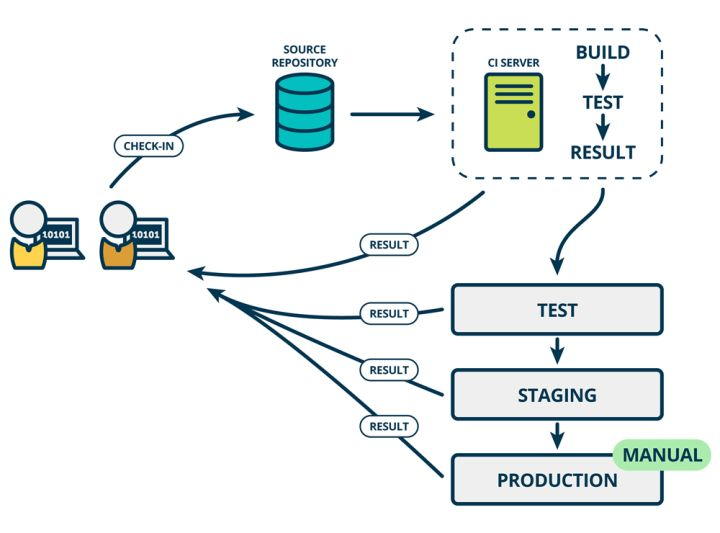

## DRY/Don't repeat yourself 不要重复自己

* "Don't repeat yourself" (DRY) is a principle of software development aimed at reducing repetition of software patterns,[1] replacing it with abstractions or using data normalization to avoid redundancy.
* The DRY principle is stated as "Every piece of knowledge must have a single, unambiguous, authoritative representation within a system". [[1]](https://en.wikipedia.org/wiki/Don%27t_repeat_yourself)

## SRP/single-responsibility principle 单一职责原原则

The single-responsibility principle (SRP) is a computer-programming principle that states that every module, class or function in a computer program should have responsibility over a single part of that program's functionality, and it should encapsulate that part. All of that module, class or function's services should be narrowly aligned with that responsibility.[[1]](https://en.wikipedia.org/wiki/Single-responsibility_principle)

## RAII

* Resource acquisition is initialization (RAII) is a programming idiom used in several object-oriented, statically-typed programming languages to describe a particular language behavior. In RAII, holding a resource is a class invariant, and is tied to object lifetime: resource allocation (or acquisition) is done during object creation (specifically initialization), by the constructor, while resource deallocation (release) is done during object destruction (specifically finalization), by the destructor. In other words, resource acquisition must succeed for initialization to succeed. Thus the resource is guaranteed to be held between when initialization finishes and finalization starts (holding the resources is a class invariant), and to be held only when the object is alive. Thus if there are no object leaks, there are no resource leaks.

* reference from https://en.wikipedia.org/wiki/Resource_acquisition_is_initialization

## Microservice
  * SOA（面向服务的架构）
  * 早些年的服务实现和实施思路是将很多功能从开发到交付都打包成一个很大的服务单元（一般称为 Monolith），而微服务实现和实施思路则更强调功能趋向单一，服务单元小型化和微型化。
<div align=center>

</div>
  * 独立
  * 多语言生态
<div align=center>

</div>

## IoC (控制反转)
  * 是面向对象编程中的一种设计原则，可以用来减低计算机代码之间的耦合度。其中最常见的方式叫做依赖注入（Dependency Injection，简称DI），还有一种方式叫“依赖查找”（Dependency Lookup）
  * 起源
    * 早在2004年，Martin Fowler就提出了“哪些方面的控制被反转了？”这个问题。他总结出是依赖对象的获得被反转了，因为大多数应用程序都是由两个或是更多的类通过彼此的合作来实现企业逻辑，这使得每个对象都需要获取与其合作的对象（也就是它所依赖的对象）的引用。如果这个获取过程要靠自身实现，那么这将导致代码高度耦合并且难以维护和调试。
  * 技术描述
    * Class A中用到了Class B的对象b，一般情况下，需要在A的代码中显式的new一个B的对象。
采用依赖注入技术之后，A的代码只需要定义一个私有的B对象，不需要直接new来获得这个对象，而是通过相关的容器控制程序来将B对象在外部new出来并注入到A类里的引用中。而具体获取的方法、对象被获取时的状态由配置文件（如XML）来指定
  <div align=center>
  
  </div>

  * DL and DI
  <div align=center>
  
  </div>

  * Spring for IoC
    * BeanFactory
      * BeanFactory 粗暴简单，可以理解为就是个 HashMap，Key 是 BeanName，Value 是 Bean 实例。通常只提供注册（put），获取（get）这两个功能。我们可以称之为 “低级容器”。

    * ApplicationContext
      * ApplicationContext可以称之为 “高级容器”。因为他比 BeanFactory 多了更多的功能。他继承了多个接口。因此具备了更多的功能。例如资源的获取，支持多种消息（例如 JSP tag 的支持），对 BeanFactory 多了工具级别的支持等待。所以你看他的名字，已经不是 BeanFactory 之类的工厂了，而是 “应用上下文”， 代表着整个大容器的所有功能。该接口定义了一个 refresh 方法，此方法是所有阅读 Spring 源码的人的最熟悉的方法，用于刷新整个容器，即重新加载/刷新所有的 bean
      ```java
      public class App {
          public static void main(String[] args) {
              ApplicationContext context = new FileSystemXmlApplication-Context("...");
              // ...
              MockService service = context.getBean(MockService.class);
              service.doSomething();
          }
      }
      ```

## IaaS PaaS SaaS
* IaaS, PaaS和SaaS是云计算的三种服务bai模式du。
  * SaaS：Software-as-a-Service（软件即服务）提供给客户的服务是运营商运zhi行在云计算基础设施上的应用dao程序，用户可以在各种设备上通过客户端界面访问，如浏览器。消费者不需要管理或控制任何云计算基础设施，包括网络、服务器、操作系统、存储等等；

  * PaaS：Platform-as-a-Service（平台即服务）提供给消费者的服务是把客户采用提供的开发语言和工具（例如Java，python, .Net等）开发的或收购的应用程序部署到供应商的云计算基础设施上去。客户不需要管理或控制底层的云基础设施，包括网络、服务器、操作系统、存储等，但客户能控制部署的应用程序，也可能控制运行应用程序的托管环境配置；

  * IaaS： Infrastructure-as-a-Service（基础设施即服务）提供给消费者的服务是对所有计算基础设施的利用，包括处理CPU、内存、存储、网络和其它基本的计算资源，用户能够部署和运行任意软件，包括操作系统和应用程序。 消费者不管理或控制任何云计算基础设施，但能控制操作系统的选择、存储空间、部署的应用，也有可能获得有限制的网络组件（例如路由器、，防火墙，、负载均衡器等）的控制。

* 区别：
  * SaaS 是软件的开发、管理、部署都交给第三方，不需要关心技术问题，可以拿来即用。普通用户接触到的互联网服务，几乎都是 SaaS，下面是一些例子。

    * 客户管理服务 Salesforce
    * 团队协同服务 Google Apps
    * 储存服务 Box
    * 储存服务 Dropbox
    * 社交服务 Facebook / Twitter / Instagram

  * PaaS 提供软件部署平台（runtime），抽象掉了硬件和操作系统细节，可以无缝地扩展（scaling）。开发者只需要关注自己的业务逻辑，不需要关注底层。下面这些都属于 PaaS。

    * Heroku
    * Google App Engine
    * OpenShift

  * IaaS 是云服务的最底层，主要提供一些基础资源。它与 PaaS 的区别是，用户需要自己控制底层，实现基础设施的使用逻辑。下面这些都属于 IaaS。

    * Amazon EC2
    * Digital Ocean
    * RackSpace Cloud

## DevOps
* DevOps（Development和Operations的组合词）是一组过程、方法与系统的统称，用于促进开发（应用程序/软件工程）、技术运营和质量保障（QA）部门之间的沟通、协作与整合。

* 它是一种重视“软件开发人员（Dev）”和“IT运维技术人员（Ops）”之间沟通合作的文化、运动或惯例。透过自动化“软件交付”和“架构变更”的流程，来使得构建、测试、发布软件能够更加地快捷、频繁和可靠。

* 它的出现是由于软件行业日益清晰地认识到：为了按时交付软件产品和服务，开发和运营工作必须紧密合作

* devops就是为了让开发、运维和QA可以高效协作的流程。（可以把DevOps看作开发、技术运营和质量保障（QA）三者的交集

<div align=center>

</div>

* What does it take to implement DevOps?
  * necessary requirement: Tool preparation
    * 代码管理（SCM）：GitHub、GitLab、BitBucket、SubVersion
    * 构建工具：Ant、Gradle、maven
    * 自动部署：Capistrano、CodeDeploy
    * 持续集成（CI）：Bamboo、Hudson、Jenkins
    * 配置管理：Ansible、Chef、Puppet、SaltStack、ScriptRock GuardRail
    * 容器：Docker、LXC、第三方厂商如AWS
    * 编排：Kubernetes、Core、Apache Mesos、DC/OS
    * 服务注册与发现：Zookeeper、etcd、Consul
    * 脚本语言：python、ruby、shell
    * 日志管理：ELK、Logentries
    * 系统监控：Datadog、Graphite、Icinga、Nagios
    * 性能监控：AppDynamics、New Relic、Splunk
    * 压力测试：JMeter、Blaze Meter、loader.io
    * 预警：PagerDuty、pingdom、厂商自带如AWS SNS
    * HTTP加速器：Varnish
    * 消息总线：ActiveMQ、SQS
    * 应用服务器：Tomcat、JBoss
    * Web服务器：Apache、Nginx、IIS
    * 数据库：MySQL、Oracle、PostgreSQL等关系型数据库；cassandra、mongoDB、redis等NoSQL数据库
    * 项目管理（PM）：Jira、Asana、Taiga、Trello、Basecamp、Pivotal Tracker

    * 在工具的选择上，需要结合公司业务需求和技术团队情况而定。（注：更多关于工具的详细介绍可以参见此文：51 Best DevOps Tools for #DevOps Engineers）

  * Soft needs: culture and people
    * DevOps成功与否，公司组织是否利于协作是关键。开发人员和运维人员可以良好沟通互相学习，从而拥有高生产力。并且协作也存在于业务人员与开发人员之间


## CI/CD
* 持续集成
  * 持续集成强调开发人员提交了新代码之后，立刻进行构建、（单元）测试。根据测试结果，我们可以确定新代码和原有代码能否正确地集成在一起。

<div align=center>

</div>

* 持续交付
  * 持续交付在持续集成的基础上，将集成后的代码部署到更贴近真实运行环境的「类生产环境」（production-like environments）中。比如，我们完成单元测试后，可以把代码部署到连接数据库的 Staging 环境中更多的测试。如果代码没有问题，可以继续手动部署到生产环境中。

<div align=center>

</div>

* 持续部署
  * 持续部署则是在持续交付的基础上，把部署到生产环境的过程自动化

<div align=center>

</div>

## Cloud Native
* 云
  * 云是和本地相对的，传统的应用必须跑在本地服务器上，现在流行的应用都跑在云端，云包含了IaaS,、PaaS和SaaS。

* 原生
  * 就是土生土长的意思，我们在开始设计应用的时候就考虑到应用将来是运行云环境里面的，要充分利用云资源的优点，比如️云服务的弹性和分布式优势

<div align=center>

</div>

* 云原生 = 微服务 + DevOps + 持续交付 + 容器化

## JDBC
* Java数据库连接，（Java Database Connectivity，简称JDBC）是Java语言中用来规范客户端程序如何来访问数据库的应用程序接口，提供了诸如查询和更新数据库中数据的方法。JDBC也是Sun Microsystems的商标。我们通常说的JDBC是面向关系型数据库的。

## IMU (Inertial measurement unit) 惯性测量装置
*https://en.wikipedia.org/wiki/Inertial_measurement_unit*

An inertial measurement unit (IMU) is an electronic device that measures and reports a body's specific force, angular rate, and sometimes the orientation of the body, using a combination of accelerometers, gyroscopes, and sometimes magnetometers. 

## Code Smells
*https://en.wikipedia.org/wiki/Code_smell*

In computer programming, a code smell is any characteristic in the source code of a program that possibly indicates a deeper problem

* Definition
  * One way to look at smells is with respect to principles and quality: "Smells are certain structures in the code that indicate violation of fundamental design principles and negatively impact design quality".Code smells are usually not bugs; they are not technically incorrect and do not prevent the program from functioning. Instead, they indicate weaknesses in design that may slow down development or increase the risk of bugs or failures in the future. Bad code smells can be an indicator of factors that contribute to technical debt

* Common code smells
  * Application-level smells:
    * Duplicated code: identical or very similar code exists in more than one location.
    * Contrived complexity: forced usage of overcomplicated design patterns where simpler design would suffice.
    * Shotgun surgery: a single change needs to be applied to multiple classes at the same time.
    * Uncontrolled side effects: very easy to cause runtime exceptions and unit tests can't capture it.
    * Variable mutations: very hard to refactor code since the actual value is unpredictable and hard to reason about.
    * Boolean blindness: easy to assert on the opposite value and still type checks.
  * ...

## BDD (Behavior-driven development)
*https://en.wikipedia.org/wiki/Behavior-driven_development*

In software engineering, behavior-driven development (BDD) is an Agile software development process that encourages collaboration among developers, QA and non-technical or business participants in a software project. It encourages teams to use conversation and concrete examples to formalize a shared understanding of how the application should behave. It emerged from test-driven development (TDD). Behavior-driven development combines the general techniques and principles of TDD with ideas from domain-driven design and object-oriented analysis and design to provide software development and management teams with shared tools and a shared process to collaborate on software development.

## Spinlock (自旋锁)
* *https://zh.wikipedia.org/wiki/%E8%87%AA%E6%97%8B%E9%94%81*

* 自旋锁是计算机科学用于多线程同步的一种锁，线程反复检查锁变量是否可用。 由于线程在这一过程中保持执行，因此是一种忙等待。 一旦获取了自旋锁，线程会一直保持该锁，直至显式释放自旋锁。 自旋锁避免了进程上下文的调度开销，因此对于线程只会阻塞很短时间的场合是有效的。
* 自旋锁避免了进程上下文的调度开销，因此对于线程只会阻塞很短时间的场合是有效的。因此操作系统的实现在很多地方往往用自旋锁。Windows操作系统提供的轻型读写锁（SRW Lock）内部就用了自旋锁。显然，单核CPU不适于使用自旋锁，这里的单核CPU指的是单核单线程的CPU，因为，在同一时间只有一个线程是处在运行状态，假设运行线程A发现无法获取锁，只能等待解锁，但因为A自身不挂起，所以那个持有锁的线程B没有办法进入运行状态，只能等到操作系统分给A的时间片用完，才能有机会被调度。这种情况下使用自旋锁的代价很高。

## 泛型编程
* *http://c.biancheng.net/view/6520.html*

1. 在计算机程序设计领域，为了避免因数据类型的不同，而被迫重复编写大量相同业务逻辑的代码，人们发展的泛型及泛型编程技术。
2. 泛型，实质上就是不使用具体数据类型（例如 int、double、float 等），而是使用一种通用类型来进行程序设计的方法，该方法可以大规模的减少程序代码的编写量，让程序员可以集中精力用于业务逻辑的实现。


## Finite-State Machine (有限状态机)
* *https://zhuanlan.zhihu.com/p/100101797*
* *https://zh.wikipedia.org/zh-cn/%E6%9C%89%E9%99%90%E7%8A%B6%E6%80%81%E6%9C%BA*

* 有限状态机是我们游戏程序中非常常用的一种设计模式。不止游戏，在AI和编译器程序方面很出名。
* 什么是有限状态机
  * 有限状态机是表示有限个状态以及在这些状态之间的过渡和动作等行为的数学计算模型
* 有限状态机的元素
  * a.状态（status）
  * b.进入动作（entry action）:在进入状态时进行
  * c.退出动作（exit action）：在退出状态时进行
  * d.过渡动作（transition action）在进行特定过渡时进行

## Turing Machine (图灵机)
* *https://www.zhihu.com/question/20115374*

### 图灵机（Turing Machine）与 图灵完备
* 图灵机（Turing Machine）是图灵在1936年发表的 "On Computable Numbers, with an Application to the Entscheidungsproblem"（《论可计算数及其在判定性问题上的应用》）中提出的数学模型。既然是数学模型，它就并非一个实体概念，而是架空的一个想法。在文章中图灵描述了它是什么，并且证明了，只要图灵机可以被实现，就可以用来解决任何可计算问题。

### 图灵机的结构包括以下几个部分：
* 一条无限长的纸带（tape），纸带被分成一个个相邻的格子（square），每个格子都可以写上至多一个字符（symbol）。
* 一个字符表（alphabet），即字符的集合，它包含纸带上可能出现的所有字符。其中包含一个特殊的空白字符（blank），意思是此格子没有任何字符。
* 一个读写头（head），可理解为指向其中一个格子的指针。它可以读取/擦除/写入当前格子的内容，此外也可以每次向左/右移动一个格子。
* 一个状态寄存器（state register），它追踪着每一步运算过程中，整个机器所处的状态（运行/终止）。当这个状态从运行变为终止，则运算结束，机器停机并交回控制权。如果你了解有限状态机，它便对应着有限状态机里的状态。
* 一个有限的指令集（instructions table），它记录着读写头在特定情况下应该执行的行为。可以想象读写头随身有一本操作指南，里面记录着很多条类似于“当你身处编号53的格子并看到其内容为0时，擦除，改写为1，并向右移一格。此外，令下一状态为运行。”这样的命令。其实某种意义上，这个指令集就对应着程序员所写下的程序了。

* 以上只是图灵机模型的内容，而非具体的实现。所谓的纸带和读写头都只是图灵提出的抽象概念。为便于理解打一个比方。算盘虽然不是图灵机（因为它没有无限长的纸带，即无限的存储空间），但它的行为与图灵机一致。每一串算珠都是纸带上的一格，一串算珠上展示的数字便记录着当前格中的字符（可以是空白，可以是 12345 ）。人类的手即是读写头，可以更改每串算珠的状态。算盘的运行遵循人脑中的算法，当算法结束，算盘停机

### 图灵机可以解决什么问题
* 假设上述模型里所说的功能都能被以某种形式物理实现，那么任意可计算问题都可以被解决。这里所说的可计算问题，涉及到计算理论（Computation Theory）的概念。这个领域的概念很繁杂，先简单梳理一下。
* 在计算机领域，或者说自动机领域，我们研究的一切问题都是计算问题（Computational Problem）。它泛指一切与计算相关的问题。
* A computational problem is a mathematical object representing a collection of questions that computers might be able to solve.

* 计算问题的一些举例：
  * 给定一个正整数 n，判断它是否是质数
  * 给定一个 01 序列，把它们按位取反
  * 给定一个字符串，判断某个字符是否存在，及查找存在位置
  * 给定一个逻辑蕴含的命题，求它的逆否命题
* 非计算问题的例子：
  * 今晚吃什么
  * 为什么太阳从东边升起
* 计算问题有的可以解决，有的不可解决。这就引出了计算问题的可计算性（Computability）。它可以被理解为“是否存在一个算法，能解决在任何输入下的此计算问题”
* 也有一些不可计算的计算问题，比如著名的停机问题（Halting Problem）。它的表述是这样的：给定一段程序的描述和该程序的一个有效输入，运行此程序，那么程序最终是会终止，还是会死循环下去？
* Halting Problem: given the description of an arbitrary program and a finite input, decide whether the program finishes running or will run forever.
* 这个问题很绕人，有点像那个著名的理发师悖论，但它确实是一个计算问题。更具体的，它是一个不可判定问题（Undecidable Problem）。即不存在一个通用算法，可以在任意输入下解决此问题。图灵在文章里很优雅的用反证法推翻了假设“假设有这么一个算法可以解决任何停机问题”，从而证明了这样的算法并不存在。

### 什么是图灵完备
* 图灵完备性（Turing Completeness）是针对一套数据操作规则而言的概念。数据操作规则可以是一门编程语言，也可以是计算机里具体实现了的指令集。当这套规则可以实现图灵机模型里的全部功能时，就称它具有图灵完备性。直白一点说，图灵完备性就是我给你一工具箱的东西，包括无限内存、if/else 控制流、while 循环……那么你现在图灵完备了吗？
* Brainfuck 的编程语言

### 直观理解图灵完备——Brainfuck 语言
* 如今主流的编程语言（C++，Java，Python，以及等等等等）都是图灵完备的语言。如果我们回到最底层，就会发现它们可以实现的功能其实完全一样，并且本质上就是一个图灵机。
* 在1993年，Urban Müller 发明了 Brainfuck 语言。这门语言可以说是编程语言界的 helloworld 了——它一共只含有 8 个有效字符，每个有效字符就是一条指令。语言虽然极致轻量，它却是一门图灵完备的编程语言
* `Brainfuck is fully Turing-complete.`

```brainfuck
++++++++[>++++[>++>+++>+++>+<<<<-]>+>+>->>+[<]<-]>>.>---.+++++++..+++.>>.<-.<.+++
.------.--------.>>+.>++.
# 控制台打印 "Hello World!"
```
* 语言里的 8 个有效字符分别是：
  * `>`
    * 指针向右移动一格
  * `<`
    * 指针向左移动一格
  * `+`
    * 使指针当前格数值加一
  * `-`
    * 使指针当前格数值减一
  * `.`
    * 把当前格数值按 ASCII 表输出到终端
  * `,`
    * 从终端接受一 byte 的数据，存储其 ASCII 数值到当前格
  * `[`
    * 当指针当前值为 0 时，程序跳转至与之对应的 ] 之后；否则程序正常执行
  * `]`
    * 程序跳转回与之对应的 [ 处

## IEEE 754
* [1] IEEE 754 https://zh.wikipedia.org/wiki/IEEE_754
* [2] IEEE 754格式是什么? https://www.zhihu.com/question/21711083

IEEE二进制浮点数算术标准（IEEE 754）是20世纪80年代以来最广泛使用的浮点数运算标准，为许多CPU与浮点运算器所采用。这个标准定义了表示浮点数的格式（包括负零-0）与反常值（denormal number），一些特殊数值（（无穷（Inf）与非数值（NaN）），以及这些数值的“浮点数运算符”；它也指明了四种数值舍入规则和五种例外状况（包括例外发生的时机与处理方式）。IEEE 754规定了四种表示浮点数值的方式：单精确度（32位）、双精确度（64位）、延伸单精确度（43比特以上，很少使用）与延伸双精确度（79比特以上，通常以80位实现）[1]

<div align=center>

</div>

关于阶码：在机器中表示一个浮点数时需要给出指数，这个**指数用整数形式表示**，这个整数叫做**阶码**，阶码指明了**小数点在数据中的位置**。对于任意一个二进制数`N`，可用`N=S×2^P`表示，其中**S为尾数，P为阶码，2为阶码的底**，P、S都用二进制数表示，`S`表示`N`的全部有效数字，`P`指明小数点的位置。当阶码为固定值时，数的这种表示法称为定点表示，这样的数称为“定点数”；当阶码为可变时，数的这种表示法称为浮点表示，这样的数称为“浮点数”。为什么要定义使用阶码?  因为浮点数的定义导致的，也是浮点数的表示需求产生的。浮点数是属于有理数中某特定子集的数的数字表示，在计算机中用以近似表示任意某个实数。具体的说，这个实数由一个整数或定点数（即尾数）乘以某个基数（计算机中通常是2）的整数次幂得到，这种表示方法类似于基数为10的科学记数法。[2]

## CPU大小端 (Little/Big Endian )
* [1] CPU的大小端模式以及判断方法 https://blog.csdn.net/u010183728/article/details/81367825

不同体系结构的CPU，数据在内存中存放的排列顺序是不一样的。

存储器中对数据的存储是以字节（Byte）为基本单位的，因此，字（Word）和半字（Half-Word）在存储器中就有两种次序，分别称为：大端模式（Big Endian）和小端模式（Little Endian）。

大端存储模式是指字或半字的最高字节（Most Significant Bit，MSB）存放在内存的最低位字节地址上，而字数据的低字节则存放在高地址中。

## 原码反码补码
* [1] 原码, 反码, 补码 详解 https://www.cnblogs.com/zhangziqiu/archive/2011/03/30/computercode.html
* [2] 同余定理 https://baike.baidu.com/item/%E5%90%8C%E4%BD%99%E5%AE%9A%E7%90%86/1212360?fromtitle=%E5%90%8C%E4%BD%99&fromid=1432545

### 机器数
一个数在计算机中的二进制表示形式,  叫做这个数的机器数。机器数是带符号的，在计算机用一个数的最高位存放符号, 正数为0, 负数为1.比如，十进制中的数 +3 ，计算机字长为8位，转换成二进制就是00000011。如果是 -3 ，就是 10000011 。那么，这里的 00000011 和 10000011 就是机器数。[1]

### 真值
因为第一位是符号位，所以机器数的形式值就不等于真正的数值。例如上面的有符号数 10000011，其最高位1代表负，其真正数值是 -3 而不是形式值131（10000011转换成十进制等于131）。所以，为区别起见，将带符号位的机器数对应的真正数值称为机器数的真值。例：0000 0001的真值 = +000 0001 = +1，1000 0001的真值 = –000 0001 = –1[1]

### 原码
* 原码就是符号位加上真值的绝对值, 即用第一位表示符号, 其余位表示值. 比如如果是8位二进制:[+1]原 = 0000 0001 [-1]原 = 1000 0001
* 第一位是符号位. 因为第一位是符号位, 所以8位二进制数的取值范围就是:[1111 1111 , 0111 1111]即[-127 , 127]

###  反码
反码的表示方法是:正数的反码是其本身; 负数的反码是在其原码的基础上, 符号位不变，其余各个位取反.

[+1] = [00000001]原 = [00000001]反

[-1] = [10000001]原 = [11111110]反

可见如果一个反码表示的是负数, 人脑无法直观的看出来它的数值. 通常要将其转换成原码再计算.

### 补码
补码的表示方法是:正数的补码就是其本身;负数的补码是在其原码的基础上, 符号位不变, 其余各位取反, 最后+1. (即在反码的基础上+1)

[+1] = [00000001]原 = [00000001]反 = [00000001]补

[-1] = [10000001]原 = [11111110]反 = [11111111]补

对于负数, 补码表示方式也是人脑无法直观看出其数值的. 通常也需要转换成原码在计算其数值.

### 为何要使用原码, 反码和补码
在开始深入学习前, 我的学习建议是先"死记硬背"上面的原码, 反码和补码的表示方式以及计算方法.

现在我们知道了计算机可以有三种编码方式表示一个数. 对于正数因为三种编码方式的结果都相同:

[+1] = [00000001]原 = [00000001]反 = [00000001]补

所以不需要过多解释. 但是对于负数:

[-1] = [10000001]原 = [11111110]反 = [11111111]补

可见原码, 反码和补码是完全不同的. 既然原码才是被人脑直接识别并用于计算表示方式, 为何还会有反码和补码呢?

首先, 因为人脑可以知道第一位是符号位, 在计算的时候我们会根据符号位, 选择对真值区域的加减. (真值的概念在本文最开头). 但是对于计算机, 加减乘数已经是最基础的运算, 要设计的尽量简单. 计算机辨别"符号位"显然会让计算机的基础电路设计变得十分复杂! 于是人们想出了将符号位也参与运算的方法. 我们知道, 根据运算法则减去一个正数等于加上一个负数, 即: 1-1 = 1 + (-1) = 0 , 所以机器可以只有加法而没有减法, 这样计算机运算的设计就更简单了.

于是人们开始探索 将符号位参与运算, 并且只保留加法的方法. 首先来看原码:

计算十进制的表达式: 1-1=0

1 - 1 = 1 + (-1) = [00000001]原 + [10000001]原 = [10000010]原 = -2

如果用原码表示, 让符号位也参与计算, 显然对于减法来说, 结果是不正确的.这也就是为何计算机内部不使用原码表示一个数.

为了解决原码做减法的问题, 出现了反码:

计算十进制的表达式: 1-1=0

1 - 1 = 1 + (-1) = [0000 0001]原 + [1000 0001]原= [0000 0001]反 + [1111 1110]反 = [1111 1111]反 = [1000 0000]原 = -0

发现用反码计算减法, 结果的真值部分是正确的. 而唯一的问题其实就出现在"0"这个特殊的数值上. 虽然人们理解上+0和-0是一样的, 但是0带符号是没有任何意义的. 而且会有[0000 0000]原和[1000 0000]原两个编码表示0.

于是补码的出现, 解决了0的符号以及两个编码的问题:

1-1 = 1 + (-1) = [0000 0001]原 + [1000 0001]原 = [0000 0001]补 + [1111 1111]补 = [0000 0000]补=[0000 0000]原

这样0用[0000 0000]表示, 而以前出现问题的-0则不存在了.而且可以用[1000 0000]表示-128:

(-1) + (-127) = [1000 0001]原 + [1111 1111]原 = [1111 1111]补 + [1000 0001]补 = [1000 0000]补

-1-127的结果应该是-128, 在用补码运算的结果中, [1000 0000]补 就是-128. 但是注意因为实际上是使用以前的-0的补码来表示-128, 所以-128并没有原码和反码表示.(对-128的补码表示[1000 0000]补算出来的原码是[0000 0000]原, 这是不正确的)

使用补码, 不仅仅修复了0的符号以及存在两个编码的问题, 而且还能够多表示一个最低数. 这就是为什么8位二进制, 使用原码或反码表示的范围为[-127, +127], 而使用补码表示的范围为[-128, 127].

因为机器使用补码, 所以对于编程中常用到的32位int类型, 可以表示范围是: [-231, 231-1] 因为第一位表示的是符号位.而使用补码表示时又可以多保存一个最小值.

###  深入
计算机巧妙地把符号位参与运算, 并且将减法变成了加法, 背后蕴含了怎样的数学原理呢?

将钟表想象成是一个1位的12进制数. 如果当前时间是6点, 我希望将时间设置成4点, 需要怎么做呢?我们可以:

1. 往回拨2个小时: 6 - 2 = 4

2. 往前拨10个小时: (6 + 10) mod 12 = 4

3. 往前拨10+12=22个小时: (6+22) mod 12 =4

2,3方法中的mod是指取模操作, 16 mod 12 =4 即用16除以12后的余数是4.

所以钟表往回拨(减法)的结果可以用往前拨(加法)替代!

现在的焦点就落在了如何用一个正数, 来替代一个负数. 上面的例子我们能感觉出来一些端倪, 发现一些规律. 但是数学是严谨的. 不能靠感觉.

首先介绍一个数学中相关的概念: 同余

### 同余
两个整数a，b，若它们除以整数m所得的余数相等，则称a，b对于模m同余

记作 a ≡ b (mod m)

读作 a 与 b 关于模 m 同余。

举例说明:

4 mod 12 = 4

16 mod 12 = 4

28 mod 12 = 4

所以4, 16, 28关于模 12 同余.

### 负数取模
* [负数取模](../life/math/math_concept#负数取模)

* 公式 $x\ mod\ y=x-y\lfloor \frac{x}{y}\rfloor, for\  y\not ={0}$
* x mod y等于 x 减去 y 乘上 x与y的商的下界. [这里用的是下界，当然也可以用上界]
* 以 -3 mod 2 举例: $-3\ mod\ 2 = -3-2\times\lfloor\frac{-3}{2}\rfloor=-3-2\times\lfloor-1.5\rfloor = -3-2\times(-2)=-3+4=1$
* 所以:`(-2) mod 12 = 12-2=10` `(-4) mod 12 = 12-4 = 8` `(-5) mod 12 = 12 - 5 = 7`

### 证明
再回到时钟的问题上:回拨2小时 = 前拨10小时；回拨4小时 = 前拨8小时；回拨5小时= 前拨7小时

注意, 这里发现的规律!结合上面学到的同余的概念.实际上:

(-2) mod 12 = 10

10 mod 12 = 10

-2与10是同余的.

(-4) mod 12 = 8

8 mod 12 = 8

-4与8是同余的.

距离成功越来越近了. 要实现用正数替代负数, 只需要运用同余数的两个定理:

反身性:

a ≡ a (mod m)

这个定理是很显而易见的.

线性运算定理:

```
如果a ≡ b (mod m)，c ≡ d (mod m) 那么:
(1)a ± c ≡ b ± d (mod m)
(2)a * c ≡ b * d (mod m)
```

如果想看这个定理的证明, 请看:http://baike.baidu.com/view/79282.htm

所以:

```
7 ≡ 7 (mod 12)
(-2) ≡ 10 (mod 12)
7 -2 ≡ 7 + 10 (mod 12)
```

现在我们为一个负数, 找到了它的正数同余数. 但是并不是7-2 = 7+10, 而是 7 -2 ≡ 7 + 10 (mod 12) , 即计算结果的余数相等.

接下来回到二进制的问题上, 看一下: 2-1=1的问题.

2-1=2+(-1) = [0000 0010]原 + [1000 0001]原= [0000 0010]反 + [1111 1110]反

先到这一步, -1的反码表示是1111 1110. 如果这里将[1111 1110]认为是原码, 则[1111 1110]原 = -126, 这里将符号位除去, 即认为是126.

发现有如下规律:

(-1) mod 127 = 126

126 mod 127 = 126

即:

(-1) ≡ 126 (mod 127)

2-1 ≡ 2+126 (mod 127)

2-1 与 2+126的余数结果是相同的! 而这个余数, 正式我们的期望的计算结果: 2-1=1

所以说**一个数的反码, 实际上是这个数对于一个膜的同余数**. **而这个膜并不是我们的二进制, 而是所能表示的最大值! 这就和钟表一样, 转了一圈后总能找到在可表示范围内的一个正确的数值!**

**而2+126很显然相当于钟表转过了一轮, 而因为符号位是参与计算的, 正好和溢出的最高位形成正确的运算结果.**

既然反码可以将减法变成加法, 那么现在计算机使用的补码呢? 为什么在反码的基础上加1, 还能得到正确的结果?

2-1=2+(-1) = [0000 0010]原 + [1000 0001]原 = [0000 0010]补 + [1111 1111]补

如果把[1111 1111]当成原码, 去除符号位, 则:

[0111 1111]原 = 127

其实, **在反码的基础上+1, 只是相当于增加了膜的值:**

(-1) mod 128 = 127

127 mod 128 = 127

2-1 ≡ 2+127 (mod 128)

此时, 表盘相当于每128个刻度转一轮. 所以用补码表示的运算结果最小值和最大值应该是[-128, 128].

但是由于0的特殊情况, 没有办法表示128, 所以补码的取值范围是[-128, 127]

## 量子计算机
* [1] 量子计算机的工作原理如何解释？https://www.zhihu.com/question/30545465

在经典计算机里我们有一个概念叫量子极限，在我们的芯片电路做的足够小，达到量子极限之后，电子的行为就不能单纯的用“电流”这样的概念来描述了，随着电子展现出量子特性，人类这几十年发展的集成电路设计的知识也就不再适用了。这个极限是经典计算机的极限，随着我们的蚀刻技术的不断进步，我们最近正在不断逼近这个极限，我们也在不断改进工艺尽可能的减少量子效应，延长摩尔定律的寿命。而另一个方向，就是拥抱**量子特性**，使用粒子的特殊量子特性来进行计算——当然这就不仅限于半导体里的电子了，超导线圈，冷原子，光子也是有前途的载体。而这个基础上建立起来的就是量子计算机[1]


### 比特
对于传统的计算机来说，1 个「比特」（bit， binary digit 的缩写）是信息的最小单位；它要么是 0，要么是 1，对应于电路的开或关[1]


## 存根程序
* [1] 软件测试中的存根程序 https://blog.csdn.net/qq_15037231/article/details/60962209

存根程序用来代替被测试的模块所调用的模块，因此存根程序也称为“虚拟子程序”，它利用被它代替的模块的接口，只做尽可能少的数据操作。[1]

## MEMS(Microelectromechanical Systems) 微机械机电系统

* [1] MEMS是怎样的技术，哪些已经民用了？ https://www.zhihu.com/question/19769131
* [2] 微机电系统 https://zh.wikipedia.org/wiki/%E5%BE%AE%E6%9C%BA%E7%94%B5%E7%B3%BB%E7%BB%9F

将微电子技术与机械工程融合到一起的一种工业技术，它的操作范围在微米尺度内。微机电系统由尺寸为1至100微米（0.001至0.1毫米)的部件组成，一般微机电设备的通常尺寸在20微米到一毫米之间

## Bottom of the page